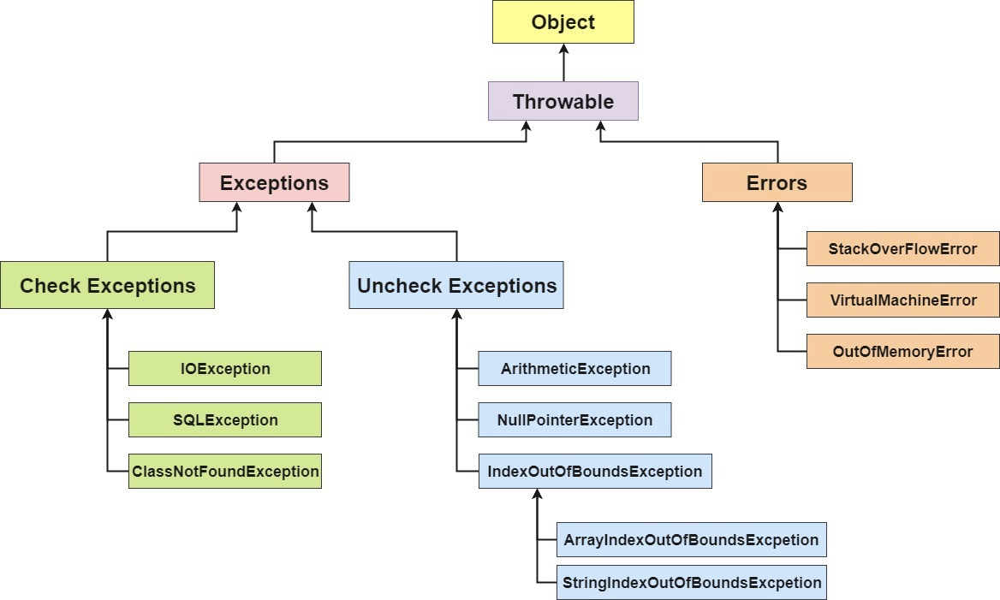
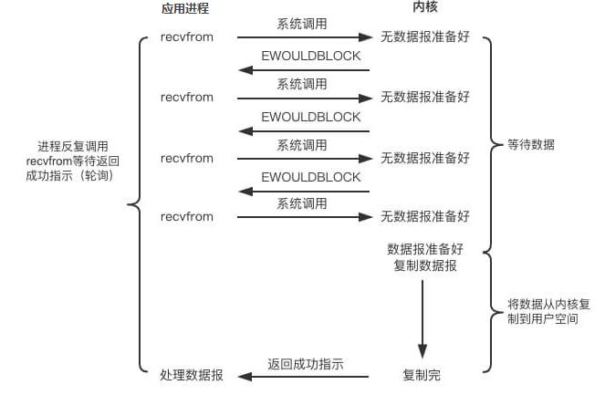
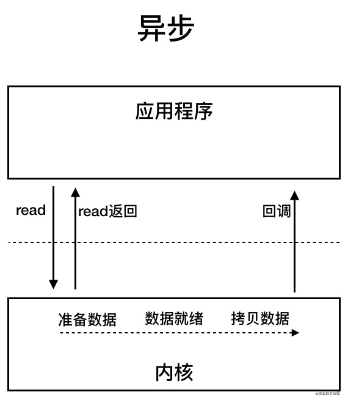

[TOC]

# 一、 基础知识

## Java 语言有哪些特点?

简单易学（语法简单，上手容易）；

面向对象（封装，继承，多态）；

平台无关性（ Java 虚拟机实现平台无关性）；

支持多线程（ C++ 语言没有内置的多线程机制，因此必须调用操作系统的多线程功能来进行多线程程序设计，而 Java 语言却提供了多线程支持）；

可靠性（具备异常处理和自动内存管理机制）；

安全性（Java 语言本身的设计就提供了多重安全防护机制如访问权限修饰符、限制程序直接访问操作系统资源）；

高效性（通过 Just In Time 编译器等技术的优化，Java 语言的运行效率还是非常不错的）；

支持网络编程并且很方便；

编译与解释并存；

## Java SE vs Java EE


- JVM

  - Java 虚拟机（Java Virtual Machine, JVM）是运行 Java 字节码的虚拟机。JVM 有针对不同系统的特定实现（Windows，Linux，macOS），目的是使用相同的字节码，它们都会给出相同的结果。字节码和不同系统的 JVM 实现是 Java 语言“一次编译，随处可以运行”的关键所在。
  - **JVM 并不是只有一种！只要满足 JVM 规范，每个公司、组织或者个人都可以开发自己的专属 JVM。** 也就是说我们平时接触到的 HotSpot VM 仅仅是是 JVM 规范的一种实现而已。除了我们平时最常用的 HotSpot VM 外，还有 J9 VM、Zing VM、JRockit VM 等 JVM 

  

- JRE（Java Runtime Environment） 是 Java 运行时环境。它是运行已编译 Java 程序所需的所有内容的集合，主要包括 Java 虚拟机（JVM）、Java 基础类库（Class Library）。

- JDK（Java Development Kit），它是功能齐全的 Java SDK，是提供给开发者使用，能够创建和编译 Java 程序的开发套件。它包含了 JRE，同时还包含了编译 java 源码的编译器 javac 以及一些其他工具比如 javadoc（文档注释工具）、jdb（调试器）、jconsole（基于 JMX 的可视化监控⼯具）、javap（反编译工具）等等。

  > 也就是说，JRE 是 Java 运行时环境，仅包含 Java 应用程序的运行时环境和必要的类库。而 JDK 则包含了 JRE，同时还包括了 javac、javadoc、jdb、jconsole、javap 等工具，可以用于 Java 应用程序的开发和调试。如果需要进行 Java 编程工作，比如编写和编译 Java 程序、使用 Java API 文档等，就需要安装 JDK。而对于某些需要使用 Java 特性的应用程序，如 JSP 转换为 Java Servlet、使用反射等，也需要 JDK 来编译和运行 Java 代码。因此，即使不打算进行 Java 应用程序的开发工作，也有可能需要安装 JDK。

- Java SE（Java Platform，Standard Edition）: Java 平台标准版，Java 编程语言的基础，它包含了支持 Java 应用程序开发和运行的核心类库以及虚拟机等核心组件。Java SE 可以用于构建桌面应用程序或简单的服务器应用程序。
- Java EE（Java Platform, Enterprise Edition ）：Java 平台企业版，建立在 Java SE 的基础上，包含了支持企业级应用程序开发和部署的标准和规范（比如 Servlet、JSP、EJB、JDBC、JPA、JTA、JavaMail、JMS）。 Java EE 可以用于构建分布式、可移植、健壮、可伸缩和安全的服务端 Java 应用程序，例如 Web 应用程序。

> 简单来说，Java SE 是 Java 的基础版本，Java EE 是 Java 的高级版本。Java SE 更适合开发桌面应用程序或简单的服务器应用程序，Java EE 更适合开发复杂的企业级应用程序或 Web 应用程序。
>
> 除了 Java SE 和 Java EE，还有一个 Java ME（Java Platform，Micro Edition）。Java ME 是 Java 的微型版本，主要用于开发嵌入式消费电子设备的应用程序，例如手机、PDA、机顶盒、冰箱、空调等。Java ME 无需重点关注，知道有这个东西就好了，现在已经用不上了。

## 什么是字节码?采用字节码的好处是什么?

- 在 Java 中，JVM 可以理解的代码就叫做字节码（即扩展名为 `.class` 的文件），它不面向任何特定的处理器，只面向虚拟机。

- Java 语言通过字节码的方式，在一定程度上解决了**传统解释型语言执行效率低的问题**，同时又**保留了解释型语言可移植**的特点。所以， Java 程序运行时相对来说还是高效的（不过，和 C、 C++，Rust，Go 等语言还是有一定差距的）。
- 由于字节码并不针对一种特定的机器，因此，Java 程序无须重新编译便可在多种不同操作系统的计算机上运行。

**Java 程序从源代码到运行的过程如下图所示**：


我们需要格外注意的是 `.class->机器码` 这一步。在这一步 JVM 类加载器首先加载字节码文件，然后通过解释器逐行解释执行，这种方式的执行速度会相对比较慢。而且，有些方法和代码块是经常需要被调用的(也就是所谓的热点代码)，所以后面引进了 **JIT（Just in Time Compilation）** 编译器，而 JIT 属于运行时编译。当 JIT 编译器完成第一次编译后，其会将字节码对应的机器码保存下来，下次可以直接使用。而我们知道，机器码的运行效率肯定是高于 Java 解释器的。这也解释了我们为什么经常会说 **Java 是编译与解释共存的语言** 。

## 为什么说 Java 语言“编译与解释并存”？

我们可以将高级编程语言按照程序的执行方式分为两种：

**编译型**：编译型语言会通过编译器将源代码一次性翻译成可被该平台执行的机器码。一般情况下，编译语言的执行速度比较快，开发效率比较低。常见的编译性语言有 C、C++、Go、Rust 等等。

**解释型**：解释型语言会通过解释器一句一句的将代码解释（interpret）为机器代码后再执行。解释型语言开发效率比较快，执行速度比较慢。常见的解释性语言有 Python、JavaScript、PHP 等等。

Java 语言既具有编译型语言的特征，也具有解释型语言的特征。因为 Java 程序要经过先编译，后解释两个步骤，由 Java 编写的程序需要先经过编译步骤，生成字节码（`.class` 文件），这种字节码必须由 Java 解释器来解释执行。

> 1. **编译阶段**：Java 源代码（.java 文件）首先被 Java 编译器编译成字节码（.class 文件）。字节码是一种中间形式的代码，它不是特定于任何平台的机器码，而是可以被 Java 虚拟机（JVM）理解的代码。
> 2. **解释执行**：编译后的字节码文件可以在任何安装了 JVM 的平台上运行。当 Java 程序启动时，JVM 加载字节码文件，并由 JVM 中的解释器逐行解释执行。这种方式使得 Java 程序能够在不同的操作系统和硬件平台上运行，而无需重新编译。
> 3. **即时编译（JIT）**：为了提高性能，现代 JVM 通常会使用即时编译器（JIT）。JIT 编译器在运行时将热点代码（即频繁执行的代码）编译成特定于平台的机器码。这样，这些代码就不需要每次都被解释执行，从而提高了程序的执行效率。
> 4. **提前编译（AOT）**：除了 JIT 编译外，Java 也可以使用提前编译技术，将字节码编译成特定平台的机器码，这通常在静态编译时完成。例如，GraalVM 就提供了这种能力，它可以将 Java 程序提前编译成原生可执行文件。我们前面也对比过 JIT 与 AOT，两者各有优点，只能说 AOT 更适合当下的云原生场景，对微服务架构的支持也比较友好。除此之外，AOT 编译无法支持 Java 的一些动态特性，如反射、动态代理、动态加载、JNI（Java Native Interface）等。然而，很多框架和库（如 Spring、CGLIB）都用到了这些特性。如果只使用 AOT 编译，那就没办法使用这些框架和库了，或者说需要针对性地去做适配和优化。举个例子，CGLIB 动态代理使用的是 ASM 技术，而这种技术大致原理是运行时直接在内存中生成并加载修改后的字节码文件也就是 `.class` 文件，如果全部使用 AOT 提前编译，也就不能使用 ASM 技术了。为了支持类似的动态特性，所以选择使用 JIT 即时编译器。
>
> 1. **混合模式**：在实际应用中，JVM 可能会同时使用解释执行和即时编译，以平衡启动速度和运行效率。一些代码在初次运行时可能会被解释执行，而随着程序的运行，JIT 编译器会介入，将热点代码编译成机器码。

## Java 和 C++ 的区别?

1. **内存管理**：
   - Java 有自动垃圾回收机制，这意味着 Java 会自动管理内存，回收不再使用的对象。
   - C++ 允许程序员手动管理内存，通过 `new` 和 `delete` 操作符分配和释放内存。这提供了更高的灵活性，但也增加了内存泄漏的风险。
2. **面向对象**：
   - Java 是一种纯面向对象的语言，所有的代码都必须是类的一部分。
   - C++ 支持面向对象编程，但它也支持过程式编程，允许更灵活的代码组织。‘
3. **性能**：
   - Java 程序通常比 C++ 程序运行慢，因为 Java 代码需要通过 JVM 解释执行，而 C++ 代码通常编译成机器码直接运行。
   - C++ 程序通常提供更好的性能和更接近硬件的控制。
4. **平台独立性**：
   - Java 强调“一次编写，到处运行”的理念，Java 字节码可以在任何安装了 JVM 的平台上运行。
   - C++ 代码通常需要为不同的平台重新编译，尽管可以使用跨平台工具和库来减少这种需求。
5. **语法**：
   - Java 的语法更简洁，更类似于 C，但去掉了一些被认为是复杂或容易出错的特性，如指针运算。
   - C++ 的语法更为复杂，提供了更多的编程特性，包括运算符重载、多重继承等，但java不支持。
6. **编译和部署**：
   - Java 程序需要编译成字节码，然后由 JVM 解释执行。
   - C++ 程序通常编译成机器码，直接在操作系统上运行。

## java命令

- **编译Java源代码**：`javac MyProgram.java`这将编译`MyProgram.java`文件生成`MyProgram.class`字节码文件。

-  **执行编译后的Java程序**：`java MyProgram` 执行，这将执行`MyProgram.class`文件，运行你的Java程序。

- **打包Java程序为JAR文件**：`jar cvf MyProgram.jar MyProgram.class OtherClass.class` 这将创建一个名为`MyProgram.jar`的JAR文件，其中包含`MyProgram.class`和`OtherClass.class`。

- 创建可执行JAR文件：`jar cvfm MyProgram.jar MANIFEST.MF MyProgram.class OtherClass.class` 为了让JAR文件可执行，你需要指定一个清单文件（MANIFEST.MF），其中包含主类（应用程序的入口点）的信息。你可以手动创建这个文件，或者使用`jar`命令的`m`选项来自动生成它，并指定主类，在`MANIFEST.MF`文件中，你需要添加以下行来指定主类：

  ```
  Main-Class: MyProgram
  ```

- **执行JAR文件：**一旦JAR文件被创建并包含了正确的清单文件，你可以使用`java`命令来执行它：`java -jar MyProgram.jar`

# 二、java语法

## 字符型常量和字符串常量的区别

1. 形式上：字符型常量是单引号引用的一个字符，例如`'A'`、`'4'`或`'a'`；字符串常量是双引号引起的0个或者若干个字符。例如`"Hello"`、`"123"`或`"abc"`。

2. 含义上：字符串常量相当于一个整型值（ASCII值），可以参加表达式运算，字符串常量代表一个地址值。

3. 占内存大小:字符常量只占2个字符，字符串常量占若干个字符。

  

## 标识符和关键字
- 标识符：编程时需要大量的为程序，类，变量，方法等取名字，于是就有了标识符。
- 关键字：关键字是被赋予特殊含义的标识符。
## 自增自减运算符

在写代码的过程中，常见的一种情况是需要某个整数类型变量增加 1 或减少 1，Java 提供了一种特殊的运算符，用于这种表达式，叫做自增运算符（++)和自减运算符（--）。

++ 和 -- 运算符可以放在变量之前，也可以放在变量之后，当运算符放在变量之前时(前缀)，先自增/减，再赋值；当运算符放在变量之后时(后缀)，先赋值，再自增/减。例如，当 `b = ++a` 时，先自增（自己增加 1），再赋值（赋值给 b）；当 `b = a++` 时，先赋值(赋值给 b)，再自增（自己增加 1）。也就是，++a 输出的是 a+1 的值，a++输出的是 a 值。用一句口诀就是：“符号在前就先加/减，符号在后就后加/减”。

## 移位运算符

移位运算符是最基本的运算符之一，几乎每种编程语言都包含这一运算符。移位操作中，被操作的数据被视为二进制数，移位就是将其向左或向右移动若干位的运算。

在 Java 代码里使用 `<<`、 `>>` 和`>>>`转换成的指令码运行起来会更高效些。

- `<<` :左移运算符，向左移若干位，高位丢弃，低位补零。`x << 1`,相当于 x 乘以 2(不溢出的情况下)。
- `>>` :带符号右移，向右移若干位，高位补符号位，低位丢弃。正数高位补 0,负数高位补 1。`x >> 1`,相当于 x 除以 2。
- `>>>` :无符号右移，忽略符号位，空位都以 0 补齐。

由于 `double`，`float` 在二进制中的表现比较特殊，因此不能来进行移位操作。

移位操作符实际上支持的类型只有`int`和`long`，编译器在对`short`、`byte`、`char`类型进行移位前，都会将其转换为`int`类型再操作。

**如果移位的位数超过数值所占有的位数会怎样？**

当 int 类型左移/右移位数大于等于 32 位操作时，会先求余（%）后再进行左移/右移操作。也就是说左移/右移 32 位相当于不进行移位操作（32%32=0），左移/右移 42 位相当于左移/右移 10 位（42%32=10）。当 long 类型进行左移/右移操作时，由于 long 对应的二进制是 64 位，因此求余操作的基数也变成了 64。

## continue,break和return的区别
1. 提前终止循环
- continue:跳出当前的一次循环，继续下次循环；
- break:跳出循环体，继续执行循环之后的语句。
2. 跳出当前方法，结束该方法的运行
- return；没有返回值函数的方法
- return value:有返回值函数的方法

## ==和equals的区别
1. == 判断两个对象的地址是否相同（基于数据类型比较的是值，引用数据类型比较的是内存地址）。
>因为java只有值传递，所以对于==说，无论是比较基本数据类型还是引用数据类型的变量，其本质都是值，只是引用类型变量存的值是对象的地址。
2. equals()方法存在两种使用情况：
- 情况1:类没有覆盖equals()方法，等价于==
- 情况2：类覆盖了equals()方法，若内容相等，就返回true.
## hashCode()与equals()
>- hashCode的作用是获取哈希码，这个哈希码的作用是确定该对象在哈希表中的索引位置。
>- 当把一个对象加入hashset时，hashset会先计算对象的hashcode并与其他已经加入的对象的hashcode值做比较，如果没有相符的，就假设对象没有重复出现，如果有，就会调用equal()来确定两个对象是否真的相等。
>- hashCode()的默认行为是对堆上的对象产生独特值。如果没有重写 hashCode()，则该 class 的两个对象无论如何都不会相等（即使这两个对象指向相同的数据）

**为什么重写equals时必须重写hashcode方法？**

为了保证当两个对象通过equal()方法比较相等时，那么他们的hashcode值也一定要保持相等。如果不重写hashcode则会出现两个对象equal()相等，但是hashcode不相等的情况。

# 三、基本数据类型
## java的几种基本数据类型
- 6种数字类型：byte(8),short(16),int(32),float(32),long(64),double(64)
- 1种字符类型：char(16)
- 1种布尔类型：boolean

- 这八种基本类型都有对应的包装类分别为：Byte、Short、Integer、Float、Long、Double、Character、Boolean

## 基本类型和包装类型的区别？

**用途**：除了定义一些常量和局部变量之外，我们在其他地方比如方法参数、对象属性中很少会使用基本类型来定义变量。并且，包装类型可用于泛型，而基本类型不可以。

**存储方式**：基本数据类型的局部变量存放在 Java 虚拟机栈中的局部变量表中，基本数据类型的成员变量（未被 `static` 修饰 ）存放在 Java 虚拟机的堆中。包装类型属于对象类型，我们知道几乎所有对象实例都存在于堆中。

**占用空间**：相比于包装类型（对象类型）， 基本数据类型占用的空间往往非常小。

**默认值**：成员变量包装类型不赋值就是 `null` ，而基本类型有默认值且不是 `null`。

**比较方式**：对于基本数据类型来说，`==` 比较的是值。对于包装数据类型来说，`==` 比较的是对象的内存地址。所有整型包装类对象之间值的比较，全部使用 `equals()` 方法。

**为什么说是几乎所有对象实例都存在于堆中呢？** 这是因为 HotSpot 虚拟机引入了 JIT 优化之后，会对对象进行逃逸分析，如果发现某一个对象并没有逃逸到方法外部，那么就可能通过标量替换来实现栈上分配，而避免堆上分配内存

## 包装类型的缓存机制

Java 基本数据类型的包装类型的大部分都用到了缓存机制来提升性能。

`Byte`,`Short`,`Integer`,`Long` 这 4 种包装类默认创建了数值 **[-128，127]** 的相应类型的缓存数据，`Character` 创建了数值在 **[0,127]** 范围的缓存数据，`Boolean` 直接返回 `True` or `False`。

如果超出对应范围仍然会去创建新的对象，缓存的范围区间的大小只是在性能和资源之间的权衡。

```java
public static Integer valueOf(int i) {
    if (i >= IntegerCache.low && i <= IntegerCache.high)
        return IntegerCache.cache[i + (-IntegerCache.low)];
    return new Integer(i);
}
private static class IntegerCache {
    static final int low = -128;
    static final int high;
    static {
        // high value may be configured by property
        int h = 127;
    }
}
```


## 自动装箱和拆箱

- 装箱：将基本类型用他们的引用类型包装起来；
- 拆箱：将包装类型转化为基本数据类型

- `Integer i = 10` 等价于 `Integer i = Integer.valueOf(10)`
- `int n = i` 等价于 `int n = i.intValue()`;

## 浮点数运算精度丢失问题

计算机是二进制的，而且计算机在表示一个数字时，宽度是有限的，无限循环的小数存储在计算机时，只能被截断，所以就会导致小数精度发生损失的情况。这也就是解释了为什么浮点数没有办法用二进制精确表示。

`BigDecimal` 可以实现对浮点数的运算，不会造成精度丢失。通常情况下，大部分需要浮点数精确运算结果的业务场景（比如涉及到钱的场景）都是通过 `BigDecimal` 来做的。

## 超long 整型数据表示

1. **BigInteger 类**： `BigInteger` 类是 Java 提供的一个用于表示任意精度的整数的类。你可以使用 `BigInteger` 来表示非常大的整数，不受固定位宽的限制。

   ```
   BigInteger bigInt = new BigInteger("92233720368547758070"); // 超过 long 的最大值
   ```

2. **字符串表示**： 如果你只是需要存储或传输非常大的数值，你可以使用字符串来表示它们。这种方式的缺点是你需要自己实现所有的数值操作逻辑。

# 四、变量

## 成员变量VS局部变量

**语法形式**：从语法形式上看，成员变量是属于类的，而局部变量是在代码块或方法中定义的变量或是方法的参数；成员变量可以被 `public`,`private`,`static` 等修饰符所修饰，而局部变量不能被访问控制修饰符及 `static` 所修饰；但是，成员变量和局部变量都能被 `final` 所修饰。

**存储方式**：从变量在内存中的存储方式来看，如果成员变量是使用 `static` 修饰的，那么这个成员变量是属于类的，如果没有使用 `static` 修饰，这个成员变量是属于实例的。而对象存在于堆内存，局部变量则存在于栈内存。

**生存时间**：从变量在内存中的生存时间上看，成员变量是对象的一部分，它随着对象的创建而存在，而局部变量随着方法的调用而自动生成，随着方法的调用结束而消亡。

**默认值**：从变量是否有默认值来看，成员变量如果没有被赋初始值，则会自动以类型的默认值而赋值（一种情况例外:被 `final` 修饰的成员变量也必须显式地赋值），而局部变量则不会自动赋值。

**为什么成员变量有默认值？**

1. 先不考虑变量类型，如果没有默认值会怎样？变量存储的是内存地址对应的任意随机值，程序读取该值运行会出现意外。
2. 默认值有两种设置方式：手动和自动，根据第一点，没有手动赋值一定要自动赋值。成员变量在运行时可借助反射等方法手动赋值，而局部变量不行。
3. 对于编译器（javac）来说，局部变量没赋值很好判断，可以直接报错。而成员变量可能是运行时赋值，无法判断，误报“没默认值”又会影响用户体验，所以采用自动赋默认值。

## 静态变量有什么作用？

静态变量也就是被 `static` 关键字修饰的变量。它可以被类的所有实例共享，无论一个类创建了多少个对象，它们都共享同一份静态变量。也就是说，静态变量只会被分配一次内存，即使创建多个对象，这样可以节省内存。

静态变量是通过类名来访问的，例如`StaticVariableExample.staticVar`（如果被 `private`关键字修饰就无法这样访问了）。

# 五、方法

## 静态方法为什么不能调用非静态成员?

这个需要结合 JVM 的相关知识，主要原因如下：

1. 静态方法是属于类的，在类加载的时候就会分配内存，可以通过类名直接访问。而非静态成员属于实例对象，只有在对象实例化之后才存在，需要通过类的实例对象去访问。
2. 在类的非静态成员不存在的时候静态方法就已经存在了，此时调用在内存中还不存在的非静态成员，属于非法操作。

## 静态方法VS实例方法

**1、调用方式**

在外部调用静态方法时，可以使用 `类名.方法名` 的方式，也可以使用 `对象.方法名` 的方式，而实例方法只有后面这种方式。也就是说，**调用静态方法可以无需创建对象** 。

不过，需要注意的是一般不建议使用 `对象.方法名` 的方式来调用静态方法。这种方式非常容易造成混淆，静态方法不属于类的某个对象而是属于这个类。

因此，一般建议使用 `类名.方法名` 的方式来调用静态方法。

**2、访问类成员是否存在限制**

静态方法在访问本类的成员时，只允许访问静态成员（即静态成员变量和静态方法），不允许访问实例成员（即实例成员变量和实例方法），而实例方法不存在这个限制。

## java只有值传递

方法的定义可能会用到 **参数**（有参的方法），参数在程序语言中分为：

- **实参（实际参数，Arguments）**：用于传递给函数/方法的参数，必须有确定的值。
- **形参（形式参数，Parameters）**：用于定义函数/方法，接收实参，不需要有确定的值。

程序设计语言将实参传递给方法（或函数）的方式分为两种：

- **值传递**：方法接收的是实参值的拷贝，会创建副本。
- **引用传递**：方法接收的直接是实参所引用的对象在堆中的地址，不会创建副本，对形参的修改将影响到实参。

为什么java只有值传递？

- 基本数据类型（如 `int`, `double`, `char` 等）存储在栈上，当它们作为参数传递时，它们的值被复制到新的位置（创建副本）。
- 引用数据类型（如对象、数组等）在栈上存储的是指向实际对象的引用或地址。当引用类型作为参数传递时，传递的是引用的副本，而不是实际对象本身。因此，即使传递的是引用的副本，你仍然可以操作实际的对象，但这是因为引用本身是按值传递的。

## 深拷贝与浅拷贝
- **浅拷贝：对于基本数据类型进行值传递，对引用数据类型进行引用传递般的拷贝。** 基本数据类型时值传递，所以修改值后不会影响另外一个对象的该属性值，引用数据类型时地址传递，所以修改后另一个对象的该属性值会被同步修改。
- **深拷贝**: **对基本数据类型进行值传递，对于引用数据类型，创建一个新的对象，并复制其内容。**

## 重载与重写
- **重载:** 一个类的方法拥有两个相同的名字，但是有不同的参数列表。
- **重写：** 是子类对父类允许访问的方法的实现过程进行重写编写，形参都不能改变。如果方法的返回类型是void和基本数据类型，则返回值重写时不可修改。但是如果方法的返回值是引用类型，重写时是可以返回该引用类型的子类的。
- **构造器不能被重写，但是可以重载。**


# 六、java面向对象
>https://www.runoob.com/java/java-interfaces.html
## 面向对象与面向过程
**面向过程（步骤化）**

- 面向过程就是分析出实现需求所需要的步骤，通过函数（方法）一步一步实现这些步骤，接着依次调用即可.
- 优点：性能上优于面向对象，因为类在调用的过程中需要实例化，开销过大。
- 缺点：不易维护，复用和扩展。
- 应用：单片机，嵌入式开发等对性能要求较高的地方。

**面向对象(行为化)**

- 面向对象是把整个需求按照特点功能划分，然后把这些存在共性的部分封装成类（类实例化之后才是对象），创建对象不是为了完成某一个步骤，而是描述某个事物在解决问题步骤中的行为。
- 优点： 由于面向对象具有封装，继承多态等特性，可以使系统更加灵活，更容易维护。
- 缺点：一般来说性能比面向过程低。


>面向对象的三大特征：封装，继承，多态。
## 继承
>继承的关键字
>- **extends:** 只能继承一个类
>- **implements:** 可以变相的使java具有多继承的特性，使用范围为类继承接口的情况，可以同时继承多个接口，接口之间采用逗号分割。
>- **final：** 把类定义成不能继承的，也就是最终类。
- **子类拥有父类对象所有的属性和方法（包括私有属性和私有方法），但是父类中的私有属性和方法子类是无法访问，**只是拥有**。**
- **子类可以对父类进行扩展，拥有自己的属性和方法。**
- **重写：** 子类可以用自己的方式实现父类的方法。(重写)
- **继承方式：** java支持单继承，多重继承和不同类继承同一个类，但是不能多继承。
- **构造器：** 子类是不能继承父类的构造器（构造方法或者构造函数）的，它只是调用（显式或者隐式），如果父类的构造器带有参数，则必须在子类的构造器中显式地通过 super 关键字调用父类的构造器并配以适当的参数列表。
- **优缺点：** 继承提高了类之间的耦合性，缺点是代码的独立性差。

## 多态


- **多态性是指允许不同的对象对同一消息作出的不同响应。**

- **多态存在的三个必要条件**继承，重写，父类引用指向子类对象。
- **多态的实现方式:** 重写，接口，抽象类和抽象方法
- 如果子类重写了父类的方法，真正执行的是子类覆盖的方法，如果子类没有覆盖父类的方法，执行的是父类的方法。
- 优点：可以使程序有良好的扩展，并可以对所有类的对象进行通用处理。

## 封装
1. 修改属性的可见性来限制对属性的访问(一般为private).
2. 对每个值属性提供对外的公共方法访问，也就是创建一对赋值取值方法，对于私有属性访问。

## 抽象类与抽象方法
**抽象类**

- 抽象类除了**不能实例化对象**之外，类的其他功能依然存在，成员变量，成员方法和构造方法的访问模式和普通类一样。
- 由于抽象类不能实例化对象，所以抽象类**必须被继承才能使用**。
- 在java中抽象类表示的是一种继承关系，**一个类只能继承一个抽象类，** 而一个类可以实现多个接口。
- **抽象类的子类必须给出抽象类中的抽象方法的具体实现，除非该子类也是抽象类。** 
- 抽象类不一定包含抽象方法，但是有抽象方法的类一定是抽象类。

**抽象方法**

- 抽象方法只包含一个方法名，但是没有方法体。
- 使用abstract来声明抽象方法。
- 构造方法，类方法(用static修饰的方法)不能声明为抽象方法。

## 抽象类与接口的区别
- **方法**：抽象类中的方法可以有方法体，接口中的所有方法都是抽象的，也就是没有方法体。
- **成员变量**：抽象类中的成员变量可以是各种类型的，而接口中的成员变量只能是public,static,final类型的。
- **继承**：一个类只能继承一个抽象类，而一个类却可以实现多个接口。
- **静态方法**：接口中不能含有静态代码块以及静态方法，而抽象类是可以的。
>  注：JDK 1.8 以后，接口里可以有静态方法和方法体了。
>
>  - 成员区别:
>    - 抽象类： 变量，常量，有构造方法，有抽象方法，也有非抽象方法
>    - 接口： 常量，抽象方法
>
>  - 关系区别；
>    - 类与类： 继承，单继承
>    - 类与接口:实现，可以单实现，也可以多实现
>    - 接口与接口：继承，单继承，多继承
>  - 设计理念区别
>    - 抽象类：对类抽象，包括属性，行为
>    - 接口： 对行为抽象，主要是行为

## 接口与类的区别

- **方法**: 接口没有构造方法。接口中所有的方法必须是抽象方法。
- **成员变量**: 接口中不能包含成员变量，除了static和final变量。
- **继承**: 接口不是被类继承，而是被类实现，一个类可以实现多个接口。
- **对象：**接口不能实例化对象。

## 深拷贝和浅拷贝

**浅拷贝**：浅拷贝会在堆上创建一个新的对象（区别于引用拷贝的一点），不过，如果原对象内部的属性是引用类型的话，浅拷贝会直接复制内部对象的引用地址，也就是说拷贝对象和原对象共用同一个内部对象。

**深拷贝**：深拷贝会完全复制整个对象，包括这个对象所包含的内部对象。


## Object

### == 和 equals() 的区别

**`==`** 对于基本类型和引用类型的作用效果是不同的：

- 对于基本数据类型来说，`==` 比较的是值。
- 对于引用数据类型来说，`==` 比较的是对象的内存地址。

**`equals()`** 不能用于判断基本数据类型的变量，只能用来判断两个对象是否相等。`equals()`方法存在于`Object`类中，而`Object`类是所有类的直接或间接父类，因此所有的类都有`equals()`方法。

- **类没有重写 `equals()`方法**：通过`equals()`比较该类的两个对象时，等价于通过“==”比较这两个对象，使用的默认是 `Object`类`equals()`方法。

- **类重写了 `equals()`方法**：一般我们都重写 `equals()`方法来比较两个对象中的属性是否相等；若它们的属性相等，则返回 true(即，认为这两个对象相等)。

`String` 中的 `equals` 方法是被重写过的，因为 `Object` 的 `equals` 方法是比较的对象的内存地址，而 `String` 的 `equals` 方法比较的是对象的值。

当创建 `String` 类型的对象时，虚拟机会在常量池中查找有没有已经存在的值和要创建的值相同的对象，如果有就把它赋给当前引用。如果没有就在常量池中重新创建一个 `String` 对象。

### hashCode() 有什么用？

`hashCode()` 的作用是获取哈希码（`int` 整数），也称为散列码。这个哈希码的作用是确定该对象在哈希表中的索引位置。

 `hashCode()` 和 `equals()`都是用于比较两个对象是否相等。

- 如果两个对象的`hashCode` 值相等，那这两个对象不一定相等（哈希碰撞）。

- 如果两个对象的`hashCode` 值相等并且`equals()`方法也返回 `true`，我们才认为这两个对象相等。

- 如果两个对象的`hashCode` 值不相等，我们就可以直接认为这两个对象不相等。

### 为什么重写 equals() 时必须重写 hashCode() 方法？

因为两个相等的对象的 `hashCode` 值必须是相等。也就是说如果 `equals` 方法判断两个对象是相等的，那这两个对象的 `hashCode` 值也要相等。

如果重写 `equals()` 时没有重写 `hashCode()` 方法的话就可能会导致 `equals` 方法判断是相等的两个对象，`hashCode` 值却不相等。

## String

### String、StringBuffer、StringBuilder 的区别？

- **可变性**

  - `String` 是不可变的。
  - `StringBuilder` 与 `StringBuffer` 都继承自 `AbstractStringBuilder` 类，在 `AbstractStringBuilder` 中也是使用字符数组保存字符串，不过·没有使用 `final` 和 `private` 关键字修饰，最关键的是这个 `AbstractStringBuilder` 类还提供了很多修改字符串的方法比如 `append` 方法。

- **线程安全性**

  - `String` 中的对象是不可变的，也就可以理解为常量，线程安全。
  - `AbstractStringBuilder` 是 `StringBuilder` 与 `StringBuffer` 的公共父类，定义了一些字符串的基本操作，如 `expandCapacity`、`append`、`insert`、`indexOf` 等公共方法。
    - `StringBuffer` 对方法加了同步锁或者对调用的方法加了同步锁，所以是线程安全的。
    - `StringBuilder` 并没有对方法进行加同步锁，所以是非线程安全的。

- **性能**

  - 每次对 `String` 类型进行改变的时候，都会生成一个新的 `String` 对象，然后将指针指向新的 `String` 对象。
  - `StringBuffer` 每次都会对 `StringBuffer` 对象本身进行操作，而不是生成新的对象并改变对象引用。相同情况下使用 `StringBuilder` 相比使用 `StringBuffer` 仅能获得 10%~15% 左右的性能提升，但却要冒多线程不安全的风险。

  **对于三者使用的总结：**

  - 操作少量的数据: 适用 `String`
  - 单线程操作字符串缓冲区下操作大量数据: 适用 `StringBuilder`
  - 多线程操作字符串缓冲区下操作大量数据: 适用 `StringBuffer`

### String 为什么是不可变的?

保存字符串的数组被 `final` 修饰且为私有的，并且`String` 类没有提供/暴露修改这个字符串的方法。

`String` 类被 `final` 修饰导致其不能被继承，进而避免了子类破坏 `String` 不可变。

### 字符串拼接用“+” 还是 StringBuilder?

字符串对象通过“+”的字符串拼接方式，实际上是通过 `StringBuilder` 调用 `append()` 方法实现的，拼接完成之后调用 `toString()` 得到一个 `String` 对象 

在循环内使用“+”进行字符串的拼接的话，存在比较明显的缺陷：**编译器不会创建单个 `StringBuilder` 以复用，会导致创建过多的 `StringBuilder` 对象**。

```java
String[] arr = {"he", "llo", "world"};
String s = "";
for (int i = 0; i < arr.length; i++) {
    s += arr[i];
}
System.out.println(s);

```

`StringBuilder` 对象是在循环内部被创建的，这意味着每循环一次就会创建一个 `StringBuilder` 对象。

如果直接使用 `StringBuilder` 对象进行字符串拼接的话，就不会存在这个问题了。

```java
String[] arr = {"he", "llo", "world"};
StringBuilder s = new StringBuilder();
for (String value : arr) {
    s.append(value);
}
System.out.println(s);

```

### String#equals() 和 Object#equals() 

`String` 中的 `equals` 方法是被重写过的，比较的是 String 字符串的值是否相等。 `Object` 的 `equals` 方法是比较的对象的内存地址。

### 字符串常量池

**符串常量池** 是 JVM 为了提升性能和减少内存消耗针对字符串（String 类）专门开辟的一块区域，主要目的是为了避免字符串的重复创建。

**String s1 = new String("abc");这句话创建了几个字符串对象？**

- 如果字符串常量池中不存在字符串对象“abc”的引用，那么它会在堆上创建两个字符串对象，其中一个字符串对象的引用会被保存在字符串常量池中。
- 2、如果字符串常量池中已存在字符串对象“abc”的引用，则只会在堆中创建 1 个字符串对象“abc”。

# 七、Java反射机制

## 反射机制介绍

**JAVA反射机制是在运行状态中，对于任意一个类，都能知道这个类的所有属性和方法，对于任意一个对象，都能调用它的任意一个方法和属性，这种动态获取信息以及动态调用对象的方法的功能称为java语言的反射机制。**

## 获取Class对象的四种方式

如果我们动态获取到这些信息，需要依靠Class对象，Class类对象将一个类的方法，变量等信息告诉运行的程序。java提供了四种方式获取Class对象。

1. 知道具体类的情况下可以使用:

   ```java
   Class alunbarClass = TargetObject.class;
   ```

   但是一般情况下不知道具体类，基本都是通过遍历包下面的类来获取Class对象，通过此方式获取Class对象不会进行初始化。

2. 通过`Class.forName()`传入类的路径获取。

   ```
   Class alunbarClass1 = Class.forName("cn.javaguide.TargetObject");
   ```

3. 通过对象实例`instance.getClass()`获取：

   ```java
   Employee e = new Employee();
   Class alunbarClass2 = e.getClass();
   ```

4. 通过类加载器`xxxClassLoader.loadClass()`传入类路径获取

   ```java
   class clazz = ClassLoader.LoadClass("cn.javaguide.TargetObject");
   ```

   通过类加载器获取Class对象不会进行初始化，意味着不进行包括初始化等一系列步骤，静态块和静态对象不会得到执行。

## 反射的基本操作

1. 创建一个我们要使用反射操作的类 `TargetObject`。

```java
package cn.javaguide;

public class TargetObject {
    private String value;

    public TargetObject() {
        value = "JavaGuide";
    }

    public void publicMethod(String s) {
        System.out.println("I love " + s);
    }

    private void privateMethod() {
        System.out.println("value is " + value);
    }
}

```

2. 使用反射操作这个类的方法以及参数

```java
package cn.javaguide;

import java.lang.reflect.Field;
import java.lang.reflect.InvocationTargetException;
import java.lang.reflect.Method;

public class Main {
    public static void main(String[] args) throws ClassNotFoundException, NoSuchMethodException, IllegalAccessException, InstantiationException, InvocationTargetException, NoSuchFieldException {
        /**
         * 获取 TargetObject 类的 Class 对象并且创建 TargetObject 类实例
         */
        Class<?> targetClass = Class.forName("cn.javaguide.TargetObject");
        TargetObject targetObject = (TargetObject) targetClass.newInstance();
        /**
         * 获取 TargetObject 类中定义的所有方法
         */
        Method[] methods = targetClass.getDeclaredMethods();
        for (Method method : methods) {
            System.out.println(method.getName());
        }

        /**
         * 获取指定方法并调用
         */
        Method publicMethod = targetClass.getDeclaredMethod("publicMethod",
                String.class);

        publicMethod.invoke(targetObject, "JavaGuide");

        /**
         * 获取指定参数并对参数进行修改
         */
        Field field = targetClass.getDeclaredField("value");
        //为了对类中的参数进行修改我们取消安全检查
        field.setAccessible(true);
        field.set(targetObject, "JavaGuide");

        /**
         * 调用 private 方法
         */
        Method privateMethod = targetClass.getDeclaredMethod("privateMethod");
        //为了调用private方法我们取消安全检查
        privateMethod.setAccessible(true);
        privateMethod.invoke(targetObject);
    }
}


```

## 反射机制的优缺点

- 优点：运行期类型的判断，动态加载类，提高代码灵活度。
- 缺点：1.性能瓶颈：反射相当于一系列解释操作，通知JVM要做的事情，性能比直接的java代码要慢的多。2. 安全问题，让我们可以动态的改变类的属性也增加了类的安全隐患。

## 反射的应用场景

反射是框架设计的灵魂。

在平时的项目开发过程中，基本上很少会直接使用到反射机制，但是在实际中有很多设计，开发都与反射机制有关，例如模块化的开发，通过反射去调用对应的字节码，动态代理设计模式也采用了反射机制，还有日常中使用的Spring/Hibernate等框架也大量使用到了反射机制。

比如下面是通过 JDK 实现动态代理的示例代码，其中就使用了反射类 `Method` 来调用指定的方法。

```java
public class DebugInvocationHandler implements InvocationHandler {
    /**
     * 代理类中的真实对象
     */
    private final Object target;

    public DebugInvocationHandler(Object target) {
        this.target = target;
    }


    public Object invoke(Object proxy, Method method, Object[] args) throws InvocationTargetException, IllegalAccessException {
        System.out.println("before method " + method.getName());
        Object result = method.invoke(target, args);
        System.out.println("after method " + method.getName());
        return result;
    }
}


```

另外，像 Java 中的一大利器 **注解** 的实现也用到了反射。

为什么你使用 Spring 的时候 ，一个`@Component`注解就声明了一个类为 Spring Bean 呢？为什么你通过一个 `@Value`注解就读取到配置文件中的值呢？究竟是怎么起作用的呢？

这些都是因为你可以基于反射分析类，然后获取到类/属性/方法/方法的参数上的注解。你获取到注解之后，就可以做进一步的处理。

# 八、泛型

> 参考：https://mp.weixin.qq.com/s/xguhv0qRg2sZAW3mhMHX7w

## 泛型的定义

**把类型明确的工作推迟到创建对象或调用方法的时候才去明确的特殊的类型**

参数化类型:

- **把类型当作是参数一样传递**
- **`<数据类型>` 只能是引用类型**

相关术语：

- `ArrayList<E>`中的**E称为类型参数变量**
- `ArrayList<Integer>`中的**Integer称为实际类型参数**
- **整个称为`ArrayList<E>`泛型类型**
- **整个`ArrayList<Integer>`称为参数化的类型ParameterizedType**

## 泛型的作用

- 代码更加简洁【不用强制转换】
- 程序更加健壮【只要编译时期没有警告，那么运行时期就不会出现ClassCastException异常】
- 可读性和稳定性【在编写集合的时候，就限定了类型】

## 泛型类

**泛型类就是把泛型定义在类上，用户使用该类的时候，才把类型明确下来**….这样的话，用户明确了什么类型，该类就代表着什么类型…用户在使用的时候就不用担心强转的问题，运行时转换异常的问题了。

- **在类上定义的泛型，在类的方法中也可以使用！**

```java
/*
    1:把泛型定义在类上
    2:类型变量定义在类上,方法中也可以使用
 */
public class ObjectTool<T> {
    private T obj;

    public T getObj() {
        return obj;
    }

    public void setObj(T obj) {
        this.obj = obj;
    }
}

```

- **用户想要使用哪种类型，就在创建的时候指定类型。使用的时候，该类就会自动转换成用户想要使用的类型了。**

```java
 public static void main(String[] args) {
        //创建对象并指定元素类型
        ObjectTool<String> tool = new ObjectTool<>();

        tool.setObj(new String("钟福成"));
        String s = tool.getObj();
        System.out.println(s);

        //创建对象并指定元素类型
        ObjectTool<Integer> objectTool = new ObjectTool<>();
        /**
         * 如果我在这个对象里传入的是String类型的,它在编译时期就通过不了了.
         */
        objectTool.setObj(10);
        int i = objectTool.getObj();
        System.out.println(i);
    }
```

## 泛型方法

**泛型方法就是把泛型定义在方法上，用户使用该方法的时候，才把类型明确下来。**

- 定义泛型方法：**泛型是先定义后使用的**

```java
 //定义泛型方法..
    public <T> void show(T t) {
        System.out.println(t);

    }
```

- **用户传递进来的是什么类型，返回值就是什么类型了**

```java
public static void main(String[] args) {
        //创建对象
        ObjectTool tool = new ObjectTool();

        //调用方法,传入的参数是什么类型,返回值就是什么类型
        tool.show("hello");
        tool.show(12);
        tool.show(12.5);

    }
```

## 静态方法与泛型

静态方法有一种情况需要注意一下，那就是在类中的静态方法使用泛型：**静态方法无法访问类上定义的泛型；如果静态方法操作的引用数据类型不确定的时候，必须要将泛型定义在方法上。**

即：**如果静态方法要使用泛型的话，必须将静态方法也定义成泛型方法** 。

```java
public class StaticGenerator<T> {
    ....
    ....
    /**
     * 如果在类中定义使用泛型的静态方法，需要添加额外的泛型声明（将这个方法定义成泛型方法）
     * 即使静态方法要使用泛型类中已经声明过的泛型也不可以。
     * 如：public static void show(T t){..},此时编译器会提示错误信息：
          "StaticGenerator cannot be refrenced from static context"
     */
    public static <T> void show(T t){

    }
}
```

## 泛型类派生出的子类

**泛型类是拥有泛型这个特性的类，它本质上还是一个Java类，那么它就可以被继承**，分为两种情况：

- **子类明确泛型类的类型参数变量**

  - 泛型接口

  ```
  /*
      把泛型定义在接口上
   */
  public interface Inter<T> {
      public abstract void show(T t);
  
  }
  ```

  - 实现泛型接口的类

  ```java
  /**
   * 子类明确泛型类的类型参数变量:
   */
  
  public class InterImpl implements Inter<String> {
      @Override
      public void show(String s) {
          System.out.println(s);
  
      }
  }
  ```

- **子类不明确泛型类的类型参数变量**
  - 当子类不明确泛型类的类型参数变量时，**外界使用子类的时候，也需要传递类型参数变量进来，在实现类上需要定义出类型参数变量**
  
  ```java
  /**
   * 子类不明确泛型类的类型参数变量:
   *      实现类也要定义出<T>类型的
   *
   */
  public class InterImpl<T> implements Inter<T> {
  
      @Override
      public void show(T t) {
          System.out.println(t);
  
      }
  }
  ```
  
  ```java
  public static void main(String[] args) {
          //测试第一种情况
          //Inter<String> i = new InterImpl();
          //i.show("hello");
  
          //第二种情况测试
          Inter<String> ii = new InterImpl<>();
          ii.show("100");
  
      }
  ```
  
  - **实现类的如果重写父类的方法，返回值的类型是要和父类一样的！**
  - **类上声明的泛形只对非静态成员有效**。

## **泛型有哪些限制？为什么？**

泛型的限制一般是由泛型擦除机制导致的。擦除为 Object 后无法进行类型判断

- 只能声明不能实例化 T 类型变量。
- 泛型参数不能是基本类型。因为基本类型不是 Object 子类，应该用基本类型对应的引用类型代替。
- 不能实例化泛型参数的数组。擦除后为 Object 后无法进行类型判断。
- 不能实例化泛型数组。
- 泛型无法使用 Instance of 和 getClass() 进行类型判断。
- 不能实现两个不同泛型参数的同一接口，擦除后多个父类的桥方法将冲突
- 不能使用 static 修饰泛型变量

**以下代码是否能编译，为什么？**

```java

public final class Algorithm {
    public static <T> T max(T x, T y) {
        return x > y ? x : y;
    }
}
```

无法编译，因为 x 和 y 都会被擦除为 Object 类型， Object 无法使用 > 进行比较

```java

public class Singleton<T> {

    public static T getInstance() {
        if (instance == null)
            instance = new Singleton<T>();

        return instance;
    }

    private static T instance = null;
}
```

无法编译，因为不能使用 static 修饰泛型 T 。

## 类型通配符

现在有个需求：**方法接收一个集合参数，遍历集合并把集合元素打印出来，怎么办？**

- 按照我们没有学习泛型之前，我们可能会这样做：

```java
public void test(List list){


    for(int i=0;i<list.size();i++){

        System.out.println(list.get(i));

    }
}
```

上面的代码是正确的，**只不过在编译的时候会出现警告，说没有确定集合元素的类型**….这样是不优雅的…

- 使用泛型的方法：

```java
public void test(List<Object> list){


    for(int i=0;i<list.size();i++){

        System.out.println(list.get(i));

    }
}
```

**该test()方法只能遍历装载着Object的集合！！！****泛型中的`<Object>`并不是像以前那样有继承关系的，也就是说`List<Object>`和`List<String>`是毫无关系的！！！

- 类型通配符

  ```java
  public void test(List<?> list){
  
  
      for(int i=0;i<list.size();i++){
  
          System.out.println(list.get(i));
  
      }
  }
  ```

  **?号通配符表示可以匹配任意类型，任意的Java类都可以匹配**…..

  当我们使用?号通配符的时候：**就只能调对象与类型无关的方法，不能调用对象与类型有关的方法。**因为直到外界使用才知道具体的类型是什么。也就是说，在上面的List集合，我是不能使用add()方法的。**因为add()方法是把对象丢进集合中，而现在我是不知道对象的类型是什么。**

- ==**设定通配符上限**==

  现在，我想接收一个List集合，它只能操作数字类型的元素【Float、Integer、Double、Byte等数字类型都行】，怎么做？？？

  我们学习了通配符，但是如果直接使用通配符的话，该集合就不是只能操作数字了。因此我们需要**用到设定通配符上限**

  ```java
    List<? extends Number>
  ```

  上面的代码表示的是：**List集合装载的元素只能是Number的子类或自身**

  ```java
  public static void main(String[] args) {
  
  
          //List集合装载的是Integer，可以调用该方法
          List<Integer> integer = new ArrayList<>();
          test(integer);
  
          //List集合装载的是String，在编译时期就报错了
          List<String> strings = new ArrayList<>();
          test(strings);
  
      }
  
  
      public static void test(List<? extends Number> list) {
  
      }
  ```

- **==设定通配符下限==**

  ```java
    //传递进来的只能是Type或Type的父类
      <? super Type>
  ```

  TreeSet集合中设定通配符下限

  ```java
    public TreeSet(Comparator<? super E> comparator) {
          this(new TreeMap<>(comparator));
      }
  ```

  ## 通配符与泛型

  - **大多时**`T` 可以用于声明变量或常量而 `?` 不行。
  - `T` 一般用于声明泛型类或方法，通配符 `? `一般用于泛型方法的调用代码和形参。
  - `T` 在编译期会被擦除为限定类型或 Object，通配符用于捕获具体类型。
  
    **候，我们都可以使用泛型方法来代替通配符的**…..
  
  ```java
  //使用通配符
      public static void test(List<?> list) {
  
      }
  
      //使用泛型方法
      public <T> void  test2(List<T> t) {
  
      }
  ```
  
  **二者选择的原则**
  
  - 如果**参数之间的类型有依赖关系**，或者返**回值是与参数之间有依赖关系**的。那么就使用**泛型方法**
  - 如果**没有依赖关系**的，就使用**通配符**，通配符会**灵活一些.**
  
- `? extends xxx `和 `? super xxx `有什么区别?

两者接收参数的范围不同。并且，使用 `? extends xxx `声明的泛型参数只能调用 `get()` 方法返回 xxx 类型，调用 `set() `报错。使用` ? super xxx`声明的泛型参数只能调用 `set() `方法接收 xxx 类型，调用 `get()` 报错。

```java
List<? extends Number> list = new ArrayList<Integer>();
// 正确：可以读取 list 中的元素
Number num = list.get(0);
// 错误：不能向 list 添加元素，因为编译器不知道具体的子类型
// list.add(10);

List<? super Integer> list = new ArrayList<Number>();
// 正确：可以向 list 添加 Integer 类型的元素
list.add(10);
// 错误：不能从 list 中读取元素，因为编译器不知道具体的超类型
// Integer num = (Integer) list.get(0);
```

- `T extends xxx `和 `? extends xxx` 又有什么区别？

  `T extends xxx` 用于定义泛型类和方法，擦除后为 xxx 类型，` ? extends xxx `用于声明方法形参，接收 xxx 和其子类型。

```java
// 定义一个泛型类，使用 T 作为类型参数
class MyClass<T extends Number> {
    T value;

    void set(T value) {
        this.value = value;
    }

    T get() {
        return value;
    }
}

// 使用通配符，指定类型参数的上限
List<? extends Number> list = new ArrayList<Integer>();
```

## 泛型擦除

泛型是**提供给javac编译器使用的**，它用于限定集合的输入类型，让编译器在源代码级别上，即挡住向集合中插入非法数据。但编译器编译完带有泛形的java程序后，**生成的class文件中将不再带有泛形信息**，以此使程序运行效率不受到影响，这个过程称之为“擦除”。

编译器会在编译期间会动态地将泛型 T 擦除为 Object 或将 T extends xxx 擦除为其限定类型 xxx 。

因此，泛型本质上其实还是编译器的行为，为了保证引入泛型机制但不创建新的类型，减少虚拟机的运行开销，编译器通过擦除将泛型类转化为一般类。

> 泛型是 Java 1.5 版本才引进的概念，在这之前是没有泛型的概念的，但显然，泛型代码能够很好地和之前版本的代码很好地兼容。这是因为，**泛型信息只存在于代码编译阶段，在进入 JVM 之前，与泛型相关的信息会被擦除掉，专业术语叫做类型擦除**。

```java
List<String> l1 = new ArrayList<String>();
List<Integer> l2 = new ArrayList<Integer>();
		
System.out.println(l1.getClass() == l2.getClass());

```

- 打印的结果为 true 是因为 `List<String>`和 `List<Integer>`在 jvm 中的 Class 都是 List.class。泛型信息被擦除了。

```java
List<Integer> list = new ArrayList<>();

list.add(12);
//1.编译期间直接添加会报错
list.add("a");
Class<? extends List> clazz = list.getClass();
Method add = clazz.getDeclaredMethod("add", Object.class);
//2.运行期间通过反射添加，是可以的
add.invoke(list, "kl");

System.out.println(list)
```

由于泛型擦除的问题，下面的方法重载会报错。

```java
public void print(List<String> list)  { }
public void print(List<Integer> list) { }
```

原因也很简单，泛型擦除之后，List<String> 与 List<Integer> 在编译以后都变成了 List 。

既然编译器要把泛型擦除，那为什么还要用泛型呢？用 Object 代替不行吗？

这个问题其实在变相考察泛型的作用：

- 使用泛型可在编译期间进行类型检测。 
- 使用 Object 类型需要手动添加强制类型转换，降低代码可读性，提高出错概率。 
- 泛型可以使用自限定类型如 T extends Comparable 。 

# 九、Lambda表达式

1. 格式

- 格式： (形式参数) -> {代码块}
- 形式参数：如果有多个参数，参数之间用逗号隔开，如果没有参数，留空即可
- ->：由英文中画线和大于符号组成，固定写法，代表指向动作
- 代码块：是具体要做的事情，也就是方法体内容

```java
//匿名内部类中重写run()方法
new Thread(new Runnalbe(){
    
    @Override
    public void run(){
        
        System.out.println("多线程启动了")
    }
}).start;
//使用Lambda表达式
new Thread(() -> {
    
        System.out.println("多线程启动了")
    
}).start;

```

2. **使用前提**

- 有一个接口
- 接口中有且仅有一个抽象方法

3. **省略规则**

- 参数类型可以省略，但是有多个参数的情况下，不能只省略一个
- 如果参数有且仅有一个，那么小括号可以省略
- 如果代码块的语句只有一条，可以省略大括号和分号，甚至是return

4. **注意事项**

- 使用lambda必须要有接口，并且要求接口中有且仅有一个抽象方法
- 必须有上下文环境，才能推导出Lambda对应的接口
  - 根据局部变量赋值得知lambda对应的接口：Runnable r = ()->System.out.println("Lambda表达式")；
  - 根据调用方法的参数得知lambda对应的接口：new Thread(()->System.out.println("Lambda表达式").start();

5. **匿名内部类和Lambda的区别**

- 所需类型不同
  - 匿名内部类：可以是接口，也可以是抽象类，还可以是具体了类
  - Lambda表达式：只能是接口
- 使用限制不同
  - Lambda表达式只能用于接口中有且仅有一个抽象方法
  - 匿名内部类可以用于接口中有多个抽象方法
- 实现原理不同
  - 匿名内部类：编译之后，产生一个单独的.class字节码文件
  - Lambda表达式：编译之后，没有一个单独的.class字节码文件，对应的字节码会在运行的时候动态生成

# 十、异常



## 分类

在 Java 中，所有的异常都有一个共同的祖先 `java.lang` 包中的 `Throwable` 类。`Throwable` 类有两个重要的子类 `Exception`（异常）和 `Error`（错误）。`Exception` 能被程序本身处理(`try-catch`)， `Error` 是无法处理的(只能尽量避免)。

`Exception` 和 `Error` 二者都是 Java 异常处理的重要子类，各自都包含大量子类。

- **`Exception`** :程序本身可以处理的异常，可以通过 `catch` 来进行捕获。`Exception` 又可以分为 受检查异常(必须处理) 和 不受检查异常(可以不处理)。
- **`Error`** ：`Error` 属于程序无法处理的错误 ，我们没办法通过 `catch` 来进行捕获 。例如，Java 虚拟机运行错误（`Virtual MachineError`）、虚拟机内存不够错误(`OutOfMemoryError`)、类定义错误（`NoClassDefFoundError`）等 。这些异常发生时，Java 虚拟机（JVM）一般会选择线程终止。

**受检查异常**

Java 代码在编译过程中，如果受检查异常没有被 `catch`/`throw` 处理的话，就没办法通过编译 。比如下面这段 IO 操作的代码。

```java
class Example{

	public static void main(String args[]) throw IOException{
        
        FileInputStream fis = null;
        fis = new  FileInputStream(B:/"myfile.txt");
        int k;
        while((k = fis.read())!=-1){
            
            System.out.print((char)k);
            
        }
        fis.close();
    }
}
```

除了`RuntimeException`及其子类以外，其他的`Exception`类及其子类都属于受检查异常 。常见的受检查异常有： IO 相关的异常、`ClassNotFoundException` 、`SQLException`...。

**不受检查异常**

java 代码在编译过程中 ，我们即使不处理不受检查异常也可以正常通过编译。

`RuntimeException` 及其子类都统称为非受检查异常，例如：`NullPointerException`、`NumberFormatException`（字符串转换为数字）、`ArrayIndexOutOfBoundsException`（数组越界）、`ClassCastException`（类型转换错误）、`ArithmeticException`（算术错误）等。

## Throwable类常用方法

- **`public string getMessage()`**:返回异常发生时的简要描述
- **`public string toString()`**:返回异常发生时的详细信息
- **`public string getLocalizedMessage()`**:返回异常对象的本地化信息。使用 `Throwable` 的子类覆盖这个方法，可以生成本地化信息。如果子类没有覆盖该方法，则该方法返回的信息与 `getMessage（）`返回的结果相同
- **`public void printStackTrace()`**:在控制台上打印 `Throwable` 对象封装的异常信息

## 异常处理

>  https://www.cnblogs.com/Qian123/p/5715402.html#_label3

Java异常处理涉及到五个关键字，分别是：`try`、`catch`、`finally`、`throw`、`throws`。

1. **try-catch**

```java
try{
    //code that might generate exceptions    
}catch(Exception e){
    //the code of handling exception1
}catch(Exception e){
    //the code of handling exception2
}
```

2. **throw**

   到我们还可以用`throw`语句抛出明确的异常。`Throw`的语法形式如下：

   ```java
   throw ThrowableInstance;
   ```

   这里的ThrowableInstance一定是`Throwable`类类型或者`Throwable`子类类型的一个对象。简单的数据类型，例如`int`，`char`,以及非`Throwable`类，例如`String`或`Object`，不能用作异常。有两种方法可以获取`Throwable`对象：在`catch`子句中使用参数或者使用`new`操作符创建。

   下面的程序两次处理相同的错误，首先，`main()`方法设立了一个异常关系然后调用proc()。proc()方法设立了另一个异常处理关系并且立即抛出一个`NullPointerException`实例，`NullPointerException`在`main()`中被再次捕获。

   ```java
   class TestThrow{
       static void proc(){
           try{
               throw new NullPointerException("demo");
           }catch(NullPointerException e){
               System.out.println("Caught inside proc");
               throw e;
           }
       }
   
       public static void main(String [] args){
           try{
               proc();
           }catch(NullPointerException e){
               System.out.println("Recaught: "+e);
           }
       }
   }
   
   //结果
   //    D:\java>java TestThrow
   
   //	 Caught inside proc
   
   //	 Recaught: java.lang.NullPointerException: demo
   ```

   ```java
   throw new NullPointerException(`"demo"`);
   ```

此处`new`用来构造一个`NullPointerException`实例，所有的Java内置的运行时异常有两个构造方法：一个没有参数，一个带有一个字符串参数。当用第二种形式时，参数指定描述异常的字符串。如果对象用作`print()`或者`println()`的参数时，该字符串被显示。这同样可以通过调用getMessage()来实现，getMessage()是由`Throwable`定义的。

3. **throws**

```java
lass TestThrows{
    static void throw1() throws IllegalAccessException {
        System.out.println("Inside throw1 . ");
        throw new IllegalAccessException("demo");
    }
    public static void main(String[] args){
        try {
            throw1();
        }catch(IllegalAccessException e ){
            System.out.println("Caught " + e);
        }
    }
}
```

- 如果是不受检查异常（`unchecked exception`），即`Error`、`RuntimeException`或它们的子类，那么可以不使用`throws`关键字来声明要抛出的异常，编译仍能顺利通过，但在运行时会被系统抛出。
- 必须声明方法可抛出的任何检查异常（`checked exception`）。即如果一个方法可能出现受可查异常，要么用`try-catch`语句捕获，要么用`throws`子句声明将它抛出，否则会导致编译错误。
- 仅当抛出了异常，该方法的调用者才必须处理或者重新抛出该异常。当方法的调用者无力处理该异常的时候，应该继续抛出.
- 调用方法必须遵循任何可查异常的处理和声明规则。若覆盖一个方法，则不能声明与覆盖方法不同的异常。声明的任何异常必须是被覆盖方法所声明异常的同类或子类。

4. **try- catch-finally**

   - **`try`块：** 用于捕获异常。其后可接零个或多个 `catch` 块，如果没有 `catch` 块，则必须跟一个 `finally` 块。
   - **`catch`块：** 用于处理 try 捕获到的异常。
   - **`finally` 块：** 无论是否捕获或处理异常，`finally` 块里的语句都会被执行。当在 `try` 块或 `catch` 块中遇到 `return` 语句时，`finally` 语句块将在方法返回之前被执行。

   **在以下 3 种特殊情况下，`finally` 块不会被执行：**

   1. 在 `try` 或 `finally`块中用了 `System.exit(int)`退出程序。但是，如果 `System.exit(int)` 在异常语句之后，`finally` 还是会被执行
   2. 程序所在的线程死亡。
   3. 关闭 CPU。

   当 try 语句和 finally 语句中都有 return 语句时，在方法返回之前，finally 语句的内容将被执行，并且 finally 语句的返回值将会覆盖原始的返回值。如下：

```java
public class Test {
    public static int f(int value) {
        try {
            return value * value;
        } finally {
            if (value == 2) {
                return 0;
            }
        }
    }
}
```

如果调用 `f(2)`，返回值将是 0，因为 finally 语句的返回值覆盖了 try 语句块的返回值。

# 十一、IO

## 序列化与反序列化

如果我们需要持久化 Java 对象比如将 Java 对象保存在文件中，或者在网络传输 Java 对象，这些场景都需要用到序列化。

简单来说：

- **序列化**： 将数据结构或对象转换成二进制字节流的过程
- **反序列化**：将在序列化过程中所生成的二进制字节流的过程转换成数据结构或者对象的过程

对于 Java 这种面向对象编程语言来说，我们序列化的都是对象（Object）也就是实例化后的类(Class)，但是在 C++这种半面向对象的语言中，struct(结构体)定义的是数据结构类型，而 class 对应的是对象类型。

- **序列化的主要目的是通过网络传输对象或者说是将对象存储到文件系统、数据库、内存中。**

**如果不想序列化，怎么办？**

```
对于不想进行序列化的变量，使用`transient`关键字修饰。
```

`transient` 关键字的作用是：阻止实例中那些用此关键字修饰的的变量序列化；当对象被反序列化时，被 `transient` 修饰的变量值不会被持久化和恢复。`transient` 只能修饰变量，不能修饰类和方法。

## IO定义

> 参考：https://www.cnblogs.com/sheng-jie/p/how-much-you-know-about-io-models.html

应用程序作为一个文件保存在磁盘中，只有加载到内存到成为一个进程才能运行。应用程序运行在计算机内存中，必然会涉及到数据交换，比如读写磁盘文件，访问数据库，调用远程API等等。但我们编写的程序并不能像操作系统内核一样直接进行I/O操作。

因为为了确保操作系统的安全稳定运行，操作系统启动后，将会开启保护模式：将内存分为内核空间（内核对应进程所在内存空间）和用户空间，进行内存隔离。我们构建的程序将运行在用户空间，用户空间无法操作内核空间，也就意味着用户空间的程序不能直接访问由内核管理的I/O，比如：硬盘、网卡等。

但操作系统向外提供API，其由各种类型的系统调用（System Call）组成，以提供安全的访问控制。所以应用程序要想访问内核管理的I/O，必须通过调用内核提供的系统调用(system call）进行间接访问。

所以I/O之于应用程序来说，强调的通过**向内核发起系统调用完成对I/O的间接访问**。换句话说应用程序发起的一次IO操作实际包含两个阶段：

1. **IO调用阶段：应用程序进程向内核发起系统调用**

2. **IO执行阶段：内核执行IO操作并返回**

   - 准备数据阶段：内核等待I/O设备准备好数据
   - 拷贝数据阶段：将数据从内核缓冲区拷贝到用户空间缓冲区

   > 怎么理解准备数据阶段呢？
   > 对于写请求：等待系统调用的完整请求数据，并写入内核缓冲区；
   > 对于读请求：等待系统调用的完整请求数据；（若请求数据不存在于内核缓冲区）则将外围设备的数据读入到内核缓冲区。

   

## AIO

异步 IO 是基于事件和回调机制实现的，也就是应用操作之后会直接返回，不会堵塞在那里，当后台处理完成，操作系统会通知相应的线程进行后续的操作。

## BIO

- 同步阻塞IO模型中，应用程序发起read调用后，会一直阻塞，直到在内核把数据拷到用户空间。

- 适合用于客户端连接数量不高的情况。

- 当用户进程发起IO系统调用后，内核从准备数据到拷贝数据到用户空间的两个阶段期间**用户调用线程选择阻塞等待**数据返回。

  因此BIO带来了一个问题：如果内核数据需要耗时很久才能准备好，那么用户进程将被阻塞，浪费性能。为了提升应用的性能，虽然可以通过多线程来提升性能，但线程的创建依然会借助系统调用，同时多线程会导致频繁的线程上下文的切换，同样会影响性能。所以要想解决BIO带来的问题，我们就得看到问题的本质，那就是**阻塞**二字。

## NIO

| IO     | NIO        |
| ------ | ---------- |
| 面向流 | 面向缓存区 |
| 阻塞IO | 非阻塞IO   |
|        | 选择器     |

可简单认为：**IO是面向流的处理，NIO是面向块(缓冲区)的处理**

- - 面向流的I/O 系统**一次一个字节地处理数据**。

- - 一个面向块(缓冲区)的I/O系统**以块的形式处理数据**。

NIO主要有**三个核心部分组成**：

- **buffer缓冲区**
- **Channel管道**
- **Selector选择器**


**通道与缓冲区**

Java NIO系统的核心在于：**通道(Channel)和缓冲区(Buffer)**。通道表示打开到 IO 设备(例如：文件、套接字)的连接。若需要使用 NIO 系统，需要获取用于连接 IO 设备的通道以及用于容纳数据的缓冲区。然后操作缓冲区，对数据进行处理

简而言之，**通道负责传输，缓冲区负责存储**

### **缓冲区(Buffer)**

**缓冲区类型**

Buffer 就像一个数组，可以保存多个相同类型的数据。根据数据类型不同(**boolean 除外**) ，有以下Buffer 常用子类

- ByteBuffer
- CharBuffer
- ShortBuffer
- IntBuffer
- LongBuffer
- FloatBuffer
- DoubleBuffer

**获取缓冲区**

通过**allocate方法**可以获取一个对应缓冲区的对象，它是缓冲区类的一个静态方法

```java
// 获取一个容量大小为1024字节的字节缓冲区
ByteBuffer byteBuffer = ByteBuffer.allocate(1024);
```

**核心属性**

```java
// Invariants: mark <= position <= limit <= capacity
private int mark = -1;
private int position = 0;
private int limit;
private int capacity;
```

- capacity：缓冲区的容量。通过构造函数赋予，一旦设置，无法更改
- limit：缓冲区的界限。位于limit 后的数据不可读写。缓冲区的限制不能为负，并且**不能大于其容量**
- position：**下一个**读写位置的索引（类似PC）。缓冲区的位置不能为负，并且**不能大于limit**
- mark：记录当前position的值。**position被改变后，可以通过调用reset() 方法恢复到mark的位置。**

以上四个属性必须满足以下要求  **mark <= position <= limit <= capacity**

**核心方法**

- **put()方法**
  - put()方法可以将一个数据放入到缓冲区中。
  - 进行该操作后，postition的值会+1，指向下一个可以放入的位置。capacity = limit ，为缓冲区容量的值。
- **flip()方法**
  - flip()方法会**切换对缓冲区的操作模式**，由写->读 / 读->写
  - 进行该操作后
    - 如果是写模式->读模式，position = 0 ， limit 指向最后一个元素的下一个位置，capacity不变
    - 如果是读->写，则恢复为put()方法中的值
- **get()方法**
  - get()方法会读取缓冲区中的一个值
  - 进行该操作后，position会+1，如果超过了limit则会抛出异常
- **rewind()方法**
  - 该方法**只能在读模式下使用**
  - rewind()方法后，会恢复position、limit和capacity的值，变为进行get()前的值
- **clean()方法**
  - clean()方法会将缓冲区中的各个属性恢复为最初的状态，position = 0, capacity = limit
  - **此时缓冲区的数据依然存在**，处于“被遗忘”状态，下次进行写操作时会覆盖这些数据
- **mark()和reset()方法**
  - mark()方法会将postion的值保存到mark属性中
  - reset()方法会将position的值改为mark中保存的值

**非直接缓冲区和直接缓冲区**

- **非直接缓冲区**

  通过**allocate()**方法获取的缓冲区都是非直接缓冲区。这些缓冲区是建立在JVM**堆内存**之中的。通过非直接缓冲区，想要将数据写入到物理磁盘中，或者是从物理磁盘读取数据。**都需要经过JVM和操作系统**，数据在两个地址空间中传输时，会**copy**一份保存在对方的空间中。所以费直接缓冲区的读取效率较低.

  ```java
  public static ByteBuffer allocate(int capacity) {
      if (capacity < 0)
      throw new IllegalArgumentException();
  
      // 在堆内存中开辟空间
      return new HeapByteBuffer(capacity, capacity);
  }
  
  HeapByteBuffer(int cap, int lim) {        // package-private
      // new byte[cap] 创建数组，在堆内存中开辟空间
      super(-1, 0, lim, cap, new byte[cap], 0);
      /*
      hb = new byte[cap];
      offset = 0;
      */
  }
  ```

- **直接缓冲区**

  **只有ByteBuffer可以获得直接缓冲区**，通过allocateDirect()获取的缓冲区为直接缓冲区，这些缓冲区是建立在**物理内存**之中的。

  直接缓冲区通过在操作系统和JVM之间创建**物理内存映射文件**加快缓冲区数据读/写入物理磁盘的速度。放到物理内存映射文件中的数据就不归应用程序控制了，操作系统会自动将物理内存映射文件中的数据写入到物理内存中.

  ```java
  public static ByteBuffer allocateDirect(int capacity) {
      return new DirectByteBuffer(capacity);
  }
  
  DirectByteBuffer(int cap) {                   // package-private
  	...
      // 申请物理内存
  	boolean pa = VM.isDirectMemoryPageAligned();
  	...
  }
  ```

### 通道(Channel)

Channel由java.nio.channels 包定义的。Channel 表示**IO 源与目标打开的连接**。Channel 类似于传统的“流”。只不过**Channel 本身不能直接访问数据，Channel 只能与Buffer 进行交互**.

> 应用程序进行读写操作调用函数时，**底层调用的操作系统提供给用户的读写API**，调用这些API时会生成对应的指令，CPU则会执行这些指令。在计算机刚出现的那段时间，**所有读写请求的指令都有CPU去执行**，过多的读写请求会导致CPU无法去执行其他命令，从而CPU的利用率降低.
>
> 后来，**DMA**(Direct Memory Access，直接存储器访问)出现了。当IO请求传到计算机底层时，**DMA会向CPU请求，让DMA去处理这些IO操作**，从而可以让CPU去执行其他指令。DMA处理IO操作时，会请求获取总线的使用权。**当IO请求过多时，会导致大量总线用于处理IO请求，从而降低效率**
>
> 于是便有了**Channel(通道)**，Channel相当于一个**专门用于IO操作的独立处理器**，它具有独立处理IO请求的能力，当有IO请求时，它会自行处理这些IO请求.

通道 Channel 是对原 I/O 包中的流的模拟，可以通过它读取和写入数据。

通道与流的不同之处在于，流只能在一个方向上移动(一个流必须是 InputStream 或者 OutputStream 的子类)，而通道是双向的，可以用于读、写或者同时用于读写。

通道包括以下类型：

- FileChannel：从文件中读写数据；
- DatagramChannel：通过 UDP 读写网络中数据；
- SocketChannel：通过 TCP 读写网络中数据；
- ServerSocketChannel：可以监听新进来的 TCP 连接，对每一个新进来的连接都会创建一个 SocketChannel。

### 选择器（Selector）

选择器（Selector）是**SelectableChannle** 对象的多路复用器，Selector 可以同时监控多个SelectableChannel 的IO 状况，也就是说，利用Selector 可使一个单独的线程管理多个Channel。**Selector 是非阻塞IO 的核心**

**选择器的创建**

```java
// 创建一个选择器
Selector selector = Selector.open();
```

**绑定选择器**

通过调用通道的register方法可以绑定选择器，register方法有两个参数

- Selector：即绑定哪个选择器
- ops：监听事件类型。ops有4个值可以选择，为**SelectionKey**的静态属性
  - OP_READ
  - OP_ACCEPT
  - OP_WRITE
  - OP_CONNECT

```java
// 让选择器监听一种状态
myChannel.register(selector, SelectionKey.OP_READ);
// 让选择器监听多种状态
myChannel.register(selector, SelectionKey.OP_READ | SelectionKey.OP_ACCEPT);
```


# 十二、注解

> https://mp.weixin.qq.com/s/n-P8W8OzcKIg3UiFC-JycA

## 注解的定义

注解其实就是**代码中的特殊标记**，这些标记可以**在编译、类加载、运行时被读取，并执行相对应的处理**。

- **在编译时进行格式检查。如@override 放在方法前，如果你这个方法并不是覆盖了超类方法，则编译时就能检查出。**
- **将数据注入到方法、成员变量、类上**

## 基本Annotation

在java.lang包下存在着5个基本的Annotation，其中有3个Annotation我们是非常常见的了。

### @Override

**重写注解**

@Overried是告诉编译器要检查**该方法是实现父类的**…可以帮我们避免一些低级的错误…

比如，我们在实现equals()方法的时候，把euqals()打错了，那么**编译器就会发现该方法并不是实现父类的，与注解@Override冲突，于是就会给予错误**。

### @Deprecated

**过时注解**

该注解也非常常见，Java在设计的时候，可能觉得某些方法设计得不好，**为了兼容以前的程序，是不能直接把它抛弃的，于是就设置它为过时**。

当我们在程序中调用它的时候，在IDE上会出现一条横杠，说明该方法是过时的。

### @SuppressWarnings

**抑制编译器警告注解**

该注解在我们写程序的时候并不是很常见，我们可以用它来**让编译器不给予我们警告**.

当我们在使用集合的时候，如果没有指定泛型，那么会提示安全检查的警告, 如果我们在类上添加了@SuppressWarnings这个注解，那么编译器就不会给予我们警告了.

## 自定义注解

- Annotation 型定义为@interface, 所有的Annotation 会自动继承java.lang.Annotation这一接口,并且不能再去继承别的类或是接
-  参数成员只能用public 或默认(default) 这两个访问权修饰
- 参数成员只能用基本类型byte、short、char、int、long、float、double、boolean八种基本数据类型和String、Enum、Class、annotations等数据类型，以及这一些类型的数组
-  要获取类方法和字段的注解信息，必须通过Java的反射技术来获取 Annotation 对象，因为你除此之外没有别的获取注解对象的方
- 注解也可以没有定义成员,，不过这样注解就没啥用了

### 标记Annotation

**没有任何成员变量的注解称作为标记注解，@Overried就是一个标记注解**

```java
//有点像定义一个接口一样，只不过它多了一个@
public @interface MyAnnotation {

}
```

### 元数据Annotation

**我们自定义的注解是可以带成员变量的，定义带成员变量的注解叫做元数据Annotation**

在注解中定义成员变量，**语法类似于声明方法一样**….

```java
public @interface MyAnnotation {

    //定义了两个成员变量
    String username();
    int age();
}
```

注意：在注解上**定义的成员变量只能是String、数组、Class、枚举类、注解**

### 使用自定义注解

- **常规使用**

```java
//注解拥有什么属性，在修饰的时候就要给出相对应的值
    @MyAnnotation(username = "zhongfucheng", age = 20)
    public void add(String username, int age) {

    }
```

- **默认值**

我们可以在**注解声明属性的时候，给出默认值**。那么在修饰的时候，就可以不用具体指定了。

```java
public @interface MyAnnotation {

    //定义了两个成员变量
    String username() default "zicheng";
    int age() default 23;
}
```

在修饰的时候就不需要给出具体的值了

```java
  @MyAnnotation()
    public void add(String username, int age) {

    }
```

- **注解属性为value**

还有一种特殊的情况，如果**注解上只有一个属性，并且属性的名称为value**，那么在使用的时候，我们**可以不写value，直接赋值给它就行**

```java
public @interface MyAnnotation2 {

    String value();
}
```

使用注解，可以**不指定value，直接赋值**

```java
    @MyAnnotation2("zhongfucheng")
    public void find(String id) {

    }
```

- **把自定义注解的基本信息注入到方法上**

我们怎么把注解上的信息注入到方法上呢？？？我们**利用的是反射技术**

步骤可分为三部：

1. **反射出该类的方法**
2. **通过方法得到注解上具体的信息**
3. **将注解上的信息注入到方法上**

```java
   //反射出该类的方法
    Class aClass = Demo2.class;
    Method method = aClass.getMethod("add", String.class, int.class);

    //通过该方法得到注解上的具体信息
    MyAnnotation annotation = method.getAnnotation(MyAnnotation.class);
     String username = annotation.username();
     int age = annotation.age();

     //将注解上的信息注入到方法上
     Object o = aClass.newInstance();
     method.invoke(o, username, age);
```

当我们执行的时候，我们发现会出现异常…此时，我们需要在自定义注解上加入这样一句代码。当你使用 `@Retention(RetentionPolicy.RUNTIME)` 时，你指定了该注解应该在运行时保留。这意味着你可以在程序运行时通过反射（Reflection）来访问这些注解。这对于需要在运行时检查注解信息的场景非常有用

```java
 @Retention(RetentionPolicy.RUNTIME)
```

## JDK的元Annotation

前面我们已经介绍了java.lang包下的几个基本Annotation了。在JDK中除了java.lang包下有Annotation，**在java.lang.annotation下也有几个常用的元Annotation。**

在annotation包下的好几个元Annotation都是**用于修饰其他的Annotation定义**。

### @Retention

**定义该注解的生命周期**
 ●  RetentionPolicy.SOURCE : 在编译阶段丢弃。这些注解在编译结束之后就不再有任何意义，所以它们不会写入字节码。@Override, @SuppressWarnings都属于这类注解。
 ●  RetentionPolicy.CLASS : 在类加载的时候丢弃。在字节码文件的处理中有用。注解默认使用这种方式
 ●  RetentionPolicy.RUNTIME : 始终不会丢弃，运行期也保留该注解，因此可以使用反射机制读取该注解的信息。我们自定义的注解通常使用这种方式。

### @Target

**表示该注解用于什么地方。**

- ElementType.CONSTRUCTOR: 用于描述构造器
-  ElementType.FIELD: 成员变量、对象、属性（包括enum实例）
- ElementType.LOCAL_VARIABLE: 用于描述局部变量
-  ElementType.METHOD: 用于描述方法
-  ElementType.PACKAGE: 用于描述包
- ElementType.PARAMETER: 用于描述参数
- ElementType.TYPE: 用于描述类、接口(包括注解类型) 或enum声明

### @Documented

@Documented用于指定**被该Annotation修饰的Annotation类将被javadoc工具提取成文档**。

### @Inherited

**@Inherited也是用来修饰其他的Annotation的，被修饰过的Annotation将具有继承性**

例子：

1. @xxx是我自定义的注解，我现在使用@xxx注解在Base类上使用….
2. 使用@Inherited修饰@xxx注解
3. 当有类继承了Base类的时候，该实现类自动拥有@xxx注解。

## 注入对象到方法或成员变量上

**前面我们已经可以使用注解将基本的信息注入到方法上了，现在我们要使用的是将对象注入到方法上…..**

- Person类，定义username和age属性，拥有uername和age的getter和setter方法

```java
public class Person {

    private String username;
    private int age;

    public String getUsername() {
        return username;
    }

    public void setUsername(String username) {
        this.username = username;
    }

    public int getAge() {
        return age;
    }

    public void setAge(int age) {
        this.age = age;
    }
}
```

- PersonDao类，PersonDao类定义了Person对象，拥有person的setter和getter方法

```java
public class PersonDao {

    private Person person;

    public Person getPerson() {
        return person;
    }

    public void setPerson(Person person) {
        this.person = person;
    }
}
```

- 现在要做的就是：**使用注解将Person对象注入到setPerson()方法中，从而设置了PersonDao类的person属性**

```java
public class PersonDao {

    private Person person;

    public Person getPerson() {
        return person;
    }


    //将username为zhongfucheng，age为20的Person对象注入到setPerson方法中
    @InjectPerson(username = "zhongfucheng",age = 20)
    public void setPerson(Person person) {

        this.person = person;
    }
}
```

**步骤：**

①： 自定义一个注解，属性是和JavaBean类一致的

```java
//注入工具是通过反射来得到注解的信息的，于是保留域必须使用RunTime
@Retention(RetentionPolicy.RUNTIME)
public @interface InjectPerson {

    String username();
    int age();
}
```

②：编写注入工具

```java
   //1.使用内省【后边需要得到属性的写方法】，得到想要注入的属性
        PropertyDescriptor descriptor = new PropertyDescriptor("person", PersonDao.class);

        //2.得到要想注入属性的具体对象
        Person person = (Person) descriptor.getPropertyType().newInstance();

        //3.得到该属性的写方法【setPerson()】
        Method method = descriptor.getWriteMethod();

        //4.得到写方法的注解
        Annotation annotation = method.getAnnotation(InjectPerson.class);

        //5.得到注解上的信息【注解的成员变量就是用方法来定义的】
        Method[] methods = annotation.getClass().getMethods();

        //6.将注解上的信息填充到person对象上

        for (Method m : methods) {

            //得到注解上属性的名字【age或name】
            String name = m.getName();

            //看看Person对象有没有与之对应的方法【setAge(),setName()】
            try {

                //6.1这里假设：有与之对应的写方法，得到写方法
                PropertyDescriptor descriptor1 = new PropertyDescriptor(name, Person.class);
                Method method1 = descriptor1.getWriteMethod();//setAge(), setName()

                //得到注解中的值
                Object o = m.invoke(annotation, null);

                //调用Person对象的setter方法，将注解上的值设置进去
                method1.invoke(person, o);

            } catch (Exception e) {

                //6.2 Person对象没有与之对应的方法，会跳到catch来。我们要让它继续遍历注解就好了
                continue;
            }
        }

        //当程序遍历完之后，person对象已经填充完数据了

        //7.将person对象赋给PersonDao【通过写方法】
        PersonDao personDao = new PersonDao();
        method.invoke(personDao, person);

        System.out.println(personDao.getPerson().getUsername());
        System.out.println(personDao.getPerson().getAge());
```

③：总结一下步骤

- 得到想要类中注入的属性
- 得到该属性的对象
- 得到属性对应的写方法
- 通过写方法得到注解
- 获取注解详细的信息
- 将注解的信息注入到对象上
- 调用属性写方法，将已填充数据的对象注入到方法中

**把对象注入到成员变量**

①：**在成员变量上使用注解**

```java
public class PersonDao {

    @InjectPerson(username = "zhongfucheng",age = 20) private Person person;

    public Person getPerson() {
        return person;
    }

    public void setPerson(Person person) {

        this.person = person;
    }
}
```

②：编写注入工具

```java
    //1.得到想要注入的属性
        Field field = PersonDao.class.getDeclaredField("person");

        //2.得到属性的具体对象
        Person person = (Person) field.getType().newInstance();

        //3.得到属性上的注解
        Annotation annotation = field.getAnnotation(InjectPerson.class);

        //4.得到注解的属性【注解上的属性使用方法来表示的】
        Method[] methods = annotation.getClass().getMethods();

        //5.将注入的属性填充到person对象上
        for (Method method : methods) {

            //5.1得到注解属性的名字
            String name = method.getName();

            //查看一下Person对象上有没有与之对应的写方法
            try {

                //如果有
                PropertyDescriptor descriptor = new PropertyDescriptor(name, Person.class);

                //得到Person对象上的写方法
                Method method1 = descriptor.getWriteMethod();

                //得到注解上的值
                Object o = method.invoke(annotation, null);

                //填充person对象
                method1.invoke(person, o);
            } catch (IntrospectionException e) {

                //如果没有想对应的属性，继续循环
                continue;
            }
        }

        //循环完之后，person就已经填充好数据了


        //6.把person对象设置到PersonDao中
        PersonDao personDao = new PersonDao();
        field.setAccessible(true);
        field.set(personDao, person);

        System.out.println(personDao.getPerson().getUsername());
```

# 十三、SPI

## 何谓 SPI?

SPI 即 Service Provider Interface ，字面意思就是：“服务提供者的接口”，我的理解是：专门提供给服务提供者或者扩展框架功能的开发者去使用的一个接口。

SPI 将服务接口和具体的服务实现分离开来，将服务调用方和服务实现者解耦，能够提升程序的扩展性、可维护性。修改或者替换服务实现并不需要修改调用方。

很多框架都使用了 Java 的 SPI 机制，比如：Spring 框架、数据库加载驱动、日志接口、以及 Dubbo 的扩展实现等等。

## SPI 和 API 有什么区别？

- 当实现方提供了接口和实现，我们可以通过调用实现方的接口从而拥有实现方给我们提供的能力，这就是 API ，这种接口和实现都是放在实现方的。

- 当接口存在于调用方这边时，就是 SPI ，由接口调用方确定接口规则，然后由不同的厂商去根据这个规则对这个接口进行实现，从而提供服务。

### Service Provider Interface

新建 `Logger` 接口，这个就是 SPI ， 服务提供者接口，后面的服务提供者就要针对这个接口进行实现。

```java
package edu.jiangxuan.up.spi;

public interface Logger {
    void info(String msg);
    void debug(String msg);
}

```

接下来就是 `LoggerService` 类，这个主要是为服务使用者（调用方）提供特定功能的。这个类也是实现 Java SPI 机制的关键所在，如果存在疑惑的话可以先往后面继续看。

```java
package edu.jiangxuan.up.spi;

import java.util.ArrayList;
import java.util.List;
import java.util.ServiceLoader;

public class LoggerService {
    private static final LoggerService SERVICE = new LoggerService();

    private final Logger logger;

    private final List<Logger> loggerList;

    private LoggerService() {
        ServiceLoader<Logger> loader = ServiceLoader.load(Logger.class);
        List<Logger> list = new ArrayList<>();
        for (Logger log : loader) {
            list.add(log);
        }
        // LoggerList 是所有 ServiceProvider
        loggerList = list;
        if (!list.isEmpty()) {
            // Logger 只取一个
            logger = list.get(0);
        } else {
            logger = null;
        }
    }

    public static LoggerService getService() {
        return SERVICE;
    }

    public void info(String msg) {
        if (logger == null) {
            System.out.println("info 中没有发现 Logger 服务提供者");
        } else {
            logger.info(msg);
        }
    }

    public void debug(String msg) {
        if (loggerList.isEmpty()) {
            System.out.println("debug 中没有发现 Logger 服务提供者");
        }
        loggerList.forEach(log -> log.debug(msg));
    }
}

```

新建 `Main` 类（服务使用者，调用方），启动程序查看结果。

```java
package org.spi.service;

public class Main {
    public static void main(String[] args) {
        LoggerService service = LoggerService.getService();

        service.info("Hello SPI");
        service.debug("Hello SPI");
    }
}
```

### Service Provider

新建 `Logback` 类

```java
package edu.jiangxuan.up.spi.service;

import edu.jiangxuan.up.spi.Logger;

public class Logback implements Logger {
    @Override
    public void info(String s) {
        System.out.println("Logback info 打印日志：" + s);
    }

    @Override
    public void debug(String s) {
        System.out.println("Logback debug 打印日志：" + s);
    }
}


```

Java 中的 SPI 机制就是在每次类加载的时候会先去找到 class 相对目录下的 `META-INF` 文件夹下的 services 文件夹下的文件，将这个文件夹下面的所有文件先加载到内存中，然后根据这些文件的文件名和里面的文件内容找到相应接口的具体实现类，找到实现类后就可以通过反射去生成对应的对象，保存在一个 list 列表里面，所以可以通过迭代或者遍历的方式拿到对应的实例对象，生成不同的实现。

所以会提出一些规范要求：文件名一定要是接口的全类名，然后里面的内容一定要是实现类的全类名，实现类可以有多个，直接换行就好了，多个实现类的时候，会一个一个的迭代加载。

接下来同样将 `service-provider` 项目打包成 jar 包，这个 jar 包就是服务提供方的实现。通常我们导入 maven 的 pom 依赖就有点类似这种，只不过我们现在没有将这个 jar 包发布到 maven 公共仓库中，所以在需要使用的地方只能手动的添加到项目中。

## ServiceLoader

主要的流程就是：

1. 通过 URL 工具类从 jar 包的 `/META-INF/services` 目录下面找到对应的文件，
2. 读取这个文件的名称找到对应的 spi 接口，
3. 通过 `InputStream` 流将文件里面的具体实现类的全类名读取出来，
4. 根据获取到的全类名，先判断跟 spi 接口是否为同一类型，如果是的，那么就通过反射的机制构造对应的实例对象，
5. 将构造出来的实例对象添加到 `Providers` 的列表中

Java SPI 在JDBC中的应用


# 十四、Java 代理模式

代理模式是一种比较好理解的设计模式。简单来说就是 **我们使用代理对象来代替对真实对象(real object)的访问，这样就可以在不修改原目标对象的前提下，提供额外的功能操作，扩展目标对象的功能。**

**代理模式的主要作用是扩展目标对象的功能，比如说在目标对象的某个方法执行前后你可以增加一些自定义的操作。**

- JDK动态代理依赖于Java反射机制，通过`java.lang.reflect.Proxy`类和`InvocationHandler`接口实现。它只能代理实现了接口的类。在运行时，JDK动态代理会生成一个代理类，该代理类实现了目标接口，并将方法调用委托给`InvocationHandler`的`invoke`方法。
- Cglib（Code Generation Library）基于底层的字节码操作（使用ASM库），通过生成目标类的子类，并在子类中拦截方法调用来实现代理。因此，它可以代理没有接口的普通类。调用的时候是通过子类调用父类的方法。
- Jdk8之前反射比较慢，JDK8之后对反射做了优化，两者速度差不多

## 静态代理

**1.定义发送短信的接口**

```java
public interface SmsService {
    String send(String message);
}

```

**2.实现发送短信的接口**

```java
public class SmsServiceImpl implements SmsService {
    public String send(String message) {
        System.out.println("send message:" + message);
        return message;
    }
}

```

**3.创建代理类并同样实现发送短信的接口**

```java
public class SmsProxy implements SmsService {

    private final SmsService smsService;

    public SmsProxy(SmsService smsService) {
        this.smsService = smsService;
    }

    @Override
    public String send(String message) {
        //调用方法之前，我们可以添加自己的操作
        System.out.println("before method send()");
        smsService.send(message);
        //调用方法之后，我们同样可以添加自己的操作
        System.out.println("after method send()");
        return null;
    }
}

```

```java
public class Main {
    public static void main(String[] args) {
        SmsService smsService = new SmsServiceImpl();
        SmsProxy smsProxy = new SmsProxy(smsService);
        smsProxy.send("java");
    }
}

```

## 动态代理

相比于静态代理来说，动态代理更加灵活。我们不需要针对每个目标类都单独创建一个代理类，并且也不需要我们必须实现接口，我们可以直接代理实现类( *CGLIB 动态代理机制*)。

**从 JVM 角度来说，动态代理是在运行时动态生成类字节码，并加载到 JVM 中的。**

JDK 动态代理机制是 Java 提供的一种在运行时创建代理类的技术。这种机制允许你在运行时生成代理类，而无需在编译时静态定义代理类的代码。JDK 动态代理通常用于实现 AOP（面向切面编程）中的代理模式，或者用于拦截方法调用。

### JDK 动态代理机制

以下是 JDK 动态代理机制的关键点：

1. **接口**：
   JDK 动态代理要求目标对象实现至少一个接口。代理类将实现与目标对象相同的接口。

2. **`InvocationHandler`**：
   这是一个用于处理方法调用的接口。要使用 JDK 动态代理，你需要实现 `InvocationHandler` 接口，并在实现中定义 `invoke` 方法。

3. **`Proxy` 类**：
   这是 JDK 动态代理机制的核心类。它提供静态方法 `newProxyInstance` 来创建代理类实例。这个方法接受三个参数：一个 `ClassLoader` 对象，一个接口数组，和一个 `InvocationHandler` 实例。

4. **创建代理**：
   使用 `Proxy.newProxyInstance` 方法创建代理对象。每次调用代理对象的方法时，实际调用的是 `InvocationHandler` 的 `invoke` 方法。

5. **方法拦截**：
   在 `InvocationHandler` 的 `invoke` 方法中，你可以定义拦截逻辑，决定如何处理对代理对象方法的调用。

下面是一个使用 JDK 动态代理的简单示例：

**1.定义发送短信的接口**

```java
public interface SmsService {
    String send(String message);
}

```

**2.实现发送短信的接口**

```java
public class SmsServiceImpl implements SmsService {
    public String send(String message) {
        System.out.println("send message:" + message);
        return message;
    }
}

```

**3.定义一个 JDK 动态代理类**

```java
import java.lang.reflect.InvocationHandler;
import java.lang.reflect.InvocationTargetException;
import java.lang.reflect.Method;

/**
 * @author shuang.kou
 * @createTime 2020年05月11日 11:23:00
 */
public class DebugInvocationHandler implements InvocationHandler {
    /**
     * 代理类中的真实对象
     */
    private final Object target;

    public DebugInvocationHandler(Object target) {
        this.target = target;
    }

    @Override
    public Object invoke(Object proxy, Method method, Object[] args) throws InvocationTargetException, IllegalAccessException {
        //调用方法之前，我们可以添加自己的操作
        System.out.println("before method " + method.getName());
        Object result = method.invoke(target, args);
        //调用方法之后，我们同样可以添加自己的操作
        System.out.println("after method " + method.getName());
        return result;
    }
}


```

`invoke()` 方法: 当我们的动态代理对象调用原生方法的时候，最终实际上调用到的是 `invoke()` 方法，然后 `invoke()` 方法代替我们去调用了被代理对象的原生方法。

**4.获取代理对象的工厂类**

```java
public class JdkProxyFactory {
    public static Object getProxy(Object target) {
        return Proxy.newProxyInstance(
                target.getClass().getClassLoader(), // 目标类的类加载器
                target.getClass().getInterfaces(),  // 代理需要实现的接口，可指定多个
                new DebugInvocationHandler(target)   // 代理对象对应的自定义 InvocationHandler
        );
    }
}

```

`getProxy()`：主要通过`Proxy.newProxyInstance（）`方法获取某个类的代理对象

**5.实际使用**

```java
SmsService smsService = (SmsService) JdkProxyFactory.getProxy(new SmsServiceImpl());
smsService.send("java");

```

### CGLIB 动态代理机制

**JDK 动态代理有一个最致命的问题是其只能代理实现了接口的类。**

**在 CGLIB 动态代理机制中 `MethodInterceptor` 接口和 `Enhancer` 类是核心。**

**1.实现一个使用阿里云发送短信的类**

```java
package github.javaguide.dynamicProxy.cglibDynamicProxy;

public class AliSmsService {
    public String send(String message) {
        System.out.println("send message:" + message);
        return message;
    }
}

```

**2.自定义 `MethodInterceptor`（方法拦截器）**

```java
import net.sf.cglib.proxy.MethodInterceptor;
import net.sf.cglib.proxy.MethodProxy;

import java.lang.reflect.Method;

/**
 * 自定义MethodInterceptor
 */
public class DebugMethodInterceptor implements MethodInterceptor {


    /**
     * @param o           被代理的对象（需要增强的对象）
     * @param method      被拦截的方法（需要增强的方法）
     * @param args        方法入参
     * @param methodProxy 用于调用原始方法
     */
    @Override
    public Object intercept(Object o, Method method, Object[] args, MethodProxy methodProxy) throws Throwable {
        //调用方法之前，我们可以添加自己的操作
        System.out.println("before method " + method.getName());
        Object object = methodProxy.invokeSuper(o, args);
        //调用方法之后，我们同样可以添加自己的操作
        System.out.println("after method " + method.getName());
        return object;
    }

}

```

**3.获取代理类**

```java
import net.sf.cglib.proxy.Enhancer;

public class CglibProxyFactory {

    public static Object getProxy(Class<?> clazz) {
        // 创建动态代理增强类
        Enhancer enhancer = new Enhancer();
        // 设置类加载器
        enhancer.setClassLoader(clazz.getClassLoader());
        // 设置被代理类
        enhancer.setSuperclass(clazz);
        // 设置方法拦截器
        enhancer.setCallback(new DebugMethodInterceptor());
        // 创建代理类
        return enhancer.create();
    }
}

```

**4.实际使用**

```java
AliSmsService aliSmsService = (AliSmsService) CglibProxyFactory.getProxy(AliSmsService.class);
aliSmsService.send("java");

```

### JDK 动态代理和 CGLIB 动态代理对比


**JDK 动态代理只能代理实现了接口的类或者直接代理接口，而 CGLIB 可以代理未实现任何接口的类。** 另外， CGLIB 动态代理是通过生成一个被代理类的子类来拦截被代理类的方法调用，因此不能代理声明为 final 类型的类和方法。

就二者的效率来说，大部分情况都是 JDK 动态代理更优秀，随着 JDK 版本的升级，这个优势更加明显。

## 静态代理和动态代理的对比

1. **灵活性**：动态代理更加灵活，不需要必须实现接口，可以直接代理实现类，并且可以不需要针对每个目标类都创建一个代理类。另外，静态代理中，接口一旦新增加方法，目标对象和代理对象都要进行修改，这是非常麻烦的！
2. **JVM 层面**：静态代理在编译时就将接口、实现类、代理类这些都变成了一个个实际的 class 文件。而动态代理是在运行时动态生成类字节码，并加载到 JVM 中的。

## 介绍

### 静态代理

假如现在我们面临一个需求，把一个项目中所有访问数据库的方法都记录日志。最直接的方法是修改所有代码，在每个方法里面都加入写日志代码：

```java
public class Dao {
	User findUserbyId(int id) {
		// 业务代码
		xxx;
		// 加入写日志代码
		xxx;
	}
	
}
```

但是这样工作量会很大，并且模块之间是耦合的，比如下次的需求是修改记录日志的内容，那么又要去修改所有业务代码，显然这种方法是不可取的。


**如果不可以修改业务代码呢？**

很容易就想到静态代理，写**代理类**对业务代码进行调用，我们用老师教学生举例子：

```java
/**
* 老师接口，老师可以教学生
*/
public interface Teacher { 
    void teach();
}
/**
* 老师接口的实现类，具体实现 teach() 方法
*/
public class RealTeacher implements Teacher {
    @Override
    public void teach() {
        System.out.println("I am a teacher, I am teaching!");
    }
}
/**
* 老师代理对象，增强 teach() 方法
*/
public class TeacherProxy implements Teacher {
    Teacher teacher = new RealTeacher();
    @Override
    public void teach() {
    	// 这里 dosomething() 可以实现一些代理类的功能
    	dosomething();
    	// 这里执行 RealTeacher 的 teach() 方法
    	teacher.teach();
        dosomething();
    }
}
/**
* 测试代理类
*/
public class ProxyTest {
    public static void main(String args[]) {
    	Teacher teacher = new TeacherProxy();
    	// 这里执行代理类的 teach() 方法
    	teacher.teach();
    }
}
```

用图示表示上面静态代理的代码，可以描述为：


从图片和代码可以看出，这里只是用一个新对象去包含原来的 RealTeacher 对象，看似多此一举，但是确实一个不改变原来的代码，对方法进行增强的好办法。但是，如果我们要增强很多方法，比如文章开头的例子，需要对所有访问数据库的方法添加日志记录，如果用静态代理，要为每一个对象编写代理累，代码量十分庞大，也难以维护。

### 动态代理

既然为每一个需要代理的对象（下文通称为目标对象）都编写相应的代理类很麻烦，那么能不能不写死代理对象和目标对象，只写一个代理对象就可以使用不同的目标对象呢？

答案是可以的，就是用动态代理。动态代理的代理对象不依赖于目标对象，不和目标对象耦合。其原理是把目标对象的类型信息（比如接口）作为参数，利用 Java 支持的反射来创建代理对象，这样，就解除了代理对象和目标对象的耦合，一个代理对象可以适用一些列的目标对象。用图表示为：


如上图所示，目标对象作为一个参数，动态代理得到这个参数之后分成三步走：

1. 获得目标对象的接口信息和类加载器，然后根据这两个信息来反射得到代理类的 Class
2. 获得目标对象的 Class
3. 根据1 2两步获得的接口，代理类 Class，目标类 Class 实例化一个代理对象

这样， 就创建了一个代理对象。从图中可以看出，动态代理并没有和目标对象绑定，而是把目标对象作为一个参数。

JDK 提供了 java.lang.reflect.InvocationHandler 接口和 java.lang.reflect.Proxy 类来实现上述反射等功能，其中 java.lang.reflect.InvovationHandler 接口用于绑定目标对象需要增强的方法，java.lang.reflect.Proxy 提供静态方法 NewProxyInstance() 用于创建一个代理类实例，这样，这个代理类实习就被创建出来并且通过嵌入 InvocationHandler 绑定了目标类的方法。

上面的静态代理代码的例子改成动态代理：

```java
/**
 * 老师接口，老师可以教学生
 */
public interface Teacher {
    void teach();
}
/**
 * 老师接口的实现类，具体实现 teach() 方法
 */
public class RealTeacher implements Teacher {
    @Override
    public void teach() {
        // 老师正在教书
        System.out.println("I am a teacher, I am teaching!");
    }
}
import java.lang.reflect.InvocationHandler;
import java.lang.reflect.Method;
import java.lang.reflect.Proxy;
/**
 * 代理类，根据接口等信息动态地创建代理对象，其中 MyProxy 是 InvocationHandler 的实现类，用于绑定方法
 */
public class MyProxy implements InvocationHandler {
    // tar用于接收目标类的参数
    private Object tar;

    // 绑定目标类，根据目标类的类加载器和接口创建代理对象，并返回
    public Object bind(Object target) {
        this.tar = target;
        // 注意：此处代码返回代理类
        return Proxy.newProxyInstance(tar.getClass().getClassLoader(), 
        tar.getClass().getInterfaces(), this);
    }
    // invoke() 方法用于方法的增强
    @Override
    public Object invoke(Object proxy, Method method, Object[] args) throws Throwable {
        Object result = null;
        // 执行一些方法
        System.out.println("Do something before");

        // 目标类的方法执行，这里实际上是执行目标对象的方法，
        // 也就是 bind(Object target)参数 object target 的方法
        result = method.invoke(tar, args);

        System.out.println("Do something after");
        return result;
    }
}
import java.lang.reflect.InvocationHandler;
import java.lang.reflect.Method;
import java.lang.reflect.Proxy;

public class ProxyTest {
    public static void main(String[] args) throws Throwable {
        MyProxy proxy = new MyProxy();

        // 传入目标对象，进行绑定
        Teacher teacher = (Teacher)proxy.bind(new RealTeacher());

        // 执行代理对象的方法
        teacher.teach();
    }
}
```

目标对象 RealTeacher 可以看成是一个纯粹的参数，不和代理类耦合。

在应用的时候，可以把具体实现过程忽略，把Teacher teacher = (Teacher)getProxy(new RealTeacher());看成一个黑箱，它输入一个目标类作为参数，返回一个实现了 Teacher 接口的代理类。到此为止，我们成功使用了动态代理，在没有和目标类 RealTeacher 绑定的情况下，创建了一个代理类，增强了 teach() 方法。

#### 进一步深究代理类 teacher，invoke()

为了进一步探究生成的代理类 teacher 到底是什么一个情况，我们输出 teach 的一些类型信息：

```java
    public static void main(String[] args) throws Throwable {
        // 这里能清楚地看到，目标对象 RealTeacher 是一个纯粹的参数
        Teacher teacher = (Teacher)getProxy(new RealTeacher());
        // teacher 是接口 Teacher 的一个实现类，
        // 完全从多态的角度也能想到执行的实际上是 RealTeacher 的 teach() 方法
        teacher.teach();

        System.out.println(teacher.getClass().getSuperclass());//输出是class java.lang.reflect.Proxy

        Class<?>[] interfaces = teacher.getClass().getInterfaces();

        for(Class<?> i : interfaces){
            System.out.println(i);// 输出是interface Teacher
        }

        Method[] methods = teacher.getClass().getDeclaredMethods();

        for (Method method : methods) {
            System.out.println(method);
            // 输出是：
            // public final boolean com.sun.proxy.$Proxy0.equals(java.lang.Object)
            // public final java.lang.String com.sun.proxy.$Proxy0.toString()
            // public final int com.sun.proxy.$Proxy0.hashCode()
            // public final void com.sun.proxy.$Proxy0.teach() 

        }
    }
```

由上述输出可以发现，

Teacher teacher = (Teacher)getProxy(new RealTeacher());

创建的代理类 teacher 实际是名字是 $Proxy0，它父类 Proxy，实现了 Teacher 接口，实现了 teach() 方法，所以代码

```java
teacher.teach();
```

理所当然可以执行。

但是，我们知道代码 ***teacher.teach();\*** 最终执行了invoke()方法，**那么这个teach()方法到底怎么和invoke()有关联的呢？**


我们打开 teach 的方法 Proxy.newProxyInstance()源码的注释，关键的是这几行：

```java
 * Returns a proxy instance for the specified interfaces
 * that dispatches method invocations to the specified invocation
 * handler.

@param   loader the class loader to define the proxy class
     * @param   interfaces the list of interfaces for the proxy class
     *          to implement
     * @param   h the invocation handler to dispatch method invocations to
     * @return  a proxy instance with the specified invocation handler of a
     *          proxy class that is defined by the specified class loader
     *          and that implements the specified interfaces
```

再看 Proxy 类的注释：

```java
* {@code Proxy} provides static methods for creating objects that act like instances
 * of interfaces but allow for customized method invocation.
 * To create a proxy instance for some interface {@code Foo}:
 * <pre>{@code
 *     InvocationHandler handler = new MyInvocationHandler(...);
 *     Foo f = (Foo) Proxy.newProxyInstance(Foo.class.getClassLoader(),
 *                                          new Class<?>[] { Foo.class },
 *                                          handler);
 * }</pre>
 *
 * <p>
 * A <em>proxy class</em> is a class created at runtime that implements a specified
 * list of interfaces, known as <em>proxy interfaces</em>. A <em>proxy instance</em>
 * is an instance of a proxy class.
 *
 * Each proxy instance has an associated <i>invocation handler</i>
 * object, which implements the interface {@link InvocationHandler}.
 * A method invocation on a proxy instance through one of its proxy
 * interfaces will be dispatched to the {@link InvocationHandler#invoke
 * invoke} method of the instance's invocation handler, passing the proxy
 * instance, a {@code java.lang.reflect.Method} object identifying
 * the method that was invoked, and an array of type {@code Object}
 * containing the arguments.  The invocation handler processes the
 * encoded method invocation as appropriate and the result that it
 * returns will be returned as the result of the method invocation on
 * the proxy instance.
 *
```

由注释发现，Proxy.newProxyInstance()方法返回一个代理对象的实例，这个实例是和一个特殊的 InvocationHandler 相关的，再回看我们写的代码:


我们实例化的匿名内部类 InvocationHandler 正是有 invoke() 方法，所以刚才的问题: **那么这个teach()方法到底怎么和invoke()有关联的呢？**是因为代理对象实例 teacher 的父类是 Proxy，由 Proxy 去和我们实例化的匿名内部类 InvocationHandler 去关联

再看实例对象 teacher（也就是 $Proxy0 ）的反编译代码

```java
public final class $Proxy0 extends Proxy implements Subject {  
    private static Method m1;  
    private static Method m0;  
    private static Method m3;  
    private static Method m2;  
  
    static {  
        try {  
            m1 = Class.forName("java.lang.Object").getMethod("equals",  
                    new Class[] { Class.forName("java.lang.Object") });  
  
            m0 = Class.forName("java.lang.Object").getMethod("hashCode",  
                    new Class[0]);  
  
            m3 = Class.forName("***.RealSubject").getMethod("request",  
                    new Class[0]);  
  
            m2 = Class.forName("java.lang.Object").getMethod("toString",  
                    new Class[0]);  
  
        } catch (NoSuchMethodException nosuchmethodexception) {  
            throw new NoSuchMethodError(nosuchmethodexception.getMessage());  
        } catch (ClassNotFoundException classnotfoundexception) {  
            throw new NoClassDefFoundError(classnotfoundexception.getMessage());  
        }  
    } //static  
  
    public $Proxy0(InvocationHandler invocationhandler) {  
        super(invocationhandler);  
    }  
  
    @Override  
    public final boolean equals(Object obj) {  
        try {  
            return ((Boolean) super.h.invoke(this, m1, new Object[] { obj })) .booleanValue();  
        } catch (Throwable throwable) {  
            throw new UndeclaredThrowableException(throwable);  
        }  
    }  
  
    @Override  
    public final int hashCode() {  
        try {  
            return ((Integer) super.h.invoke(this, m0, null)).intValue();  
        } catch (Throwable throwable) {  
            throw new UndeclaredThrowableException(throwable);  
        }  
    }  
  
    public final void teach() {  
        try {  
            super.h.invoke(this, m3, null);  
            return;  
        } catch (Error e) {  
        } catch (Throwable throwable) {  
            throw new UndeclaredThrowableException(throwable);  
        }  
    }  
  
    @Override  
    public final String toString() {  
        try {  
            return (String) super.h.invoke(this, m2, null);  
        } catch (Throwable throwable) {  
            throw new UndeclaredThrowableException(throwable);  
        }  
    }  
}  
```

也验证了当执行 teacher.teach() 的时候，也就是执行 $Proxy0.teach() 的时候，会执行 super.h.invoke()，也就是执行父类 Proxy 的 invoke()，而父类 Proxy 是和 InvocationHandler 是关联的，总结为：

**teacher.teach() --> $Proxy0.teach() --> super.h.invoke() --> proxy.invoke() --> invocationHandler.invoke()**

# 其他重要知识点

## 序列化与反序列化

- **序列化的主要目的是通过网络传输对象或者说是将对象存储到文件系统、数据库、内存中。**
- 序列化协议属于 TCP/IP 协议应用层的一部分。

如果我们需要持久化 Java 对象比如将 Java 对象保存在文件中，或者在网络传输 Java 对象，这些场景都需要用到序列化。

简单来说：

- **序列化**：将数据结构或对象转换成二进制字节流的过程
- **反序列化**：将在序列化过程中所生成的二进制字节流转换成数据结构或者对象的过程

对于 Java 这种面向对象编程语言来说，我们序列化的都是对象（Object）也就是实例化后的类(Class)，但是在 C++这种半面向对象的语言中，struct(结构体)定义的是数据结构类型，而 class 对应的是对象类型。

下面是序列化和反序列化常见应用场景：

- 对象在进行网络传输（比如远程方法调用 RPC 的时候）之前需要先被序列化，接收到序列化的对象之后需要再进行反序列化；
- 将对象存储到文件之前需要进行序列化，将对象从文件中读取出来需要进行反序列化；
- 将对象存储到数据库（如 Redis）之前需要用到序列化，将对象从缓存数据库中读取出来需要反序列化；
- 将对象存储到内存之前需要进行序列化，从内存中读取出来之后需要进行反序列化。

 ## Java序列化中如果有些字段不想要进行序列化怎么办？
 对于不想序列化的变量使用transient关键字修饰。
 >transient 关键字的作用是：阻止实例中那些用此关键字修饰的的变量序列化；当对象被反序列化时，被 transient 修饰的变量值不会被持久化和恢复。transient 只能修饰变量，不能修饰类和方法。

 ## Integer与int对比
 1. 二者区别
 - **实质** : Integer是int的包装类，int是基本数据类型。
 - **使用：**Integer必须实例化才能使用，int不需要。
 - Integer的实例是对象的引用，指向此new的Integer对象,int直接存储数值。
- **值**：Integer的默认值是null,int的默认值是0.
2. 深入对比
- **两个通过new生成的Integer变量永远不相等。** 因为new生成的是两个对象，内存地址不同；
- **Integer变量与int比较时，只要两个变量的值相等，就相等。** 因为包装类Integer和基本数据类型int比较时，java会自动拆包装为int，然后进行比较，实际上就变为两个int变量的比较。
- **非new生成的Integer变量与new生成的Integer变量不相等。** 因为非new生成的Integer变量指向的是静态常量池中cache数组中存储的指向了堆中的Integer对象，而new Integer()生成的变量指向堆中新建的对象，两者在内存中的对象引用（地址）不同。

- **对于两个非new生成的integer对象进行比较时，如果两个变量的值在区间-128到127,则相等。**

 ## 获取用键盘输出常用的两种方法。
 1. 通过`Scanner`

 ```java
 Scanner input =new Scanner(System.in);
 String s= input.nextLine();
 input.close();
 ```
 2. 通过`BufferedReader
 ```java
 BufferedReader input =new Bufferedreaer(new InputStreamReader(System.in));
 String s=input.readLine();
 ```
### 常见的5种IO模型
>https://www.cnblogs.com/javaguide/p/io.html


1. **同步阻塞模型(BIO)**
- 同步阻塞IO模型中，应用程序发起read调用后，会一直阻塞，直到在内核把数据拷到用户空间。

- 适合用于客户端连接数量不高的情况。

- 当用户进程发起IO系统调用后，内核从准备数据到拷贝数据到用户空间的两个阶段期间**用户调用线程选择阻塞等待**数据返回。

  因此BIO带来了一个问题：如果内核数据需要耗时很久才能准备好，那么用户进程将被阻塞，浪费性能。为了提升应用的性能，虽然可以通过多线程来提升性能，但线程的创建依然会借助系统调用，同时多线程会导致频繁的线程上下文的切换，同样会影响性能。所以要想解决BIO带来的问题，我们就得看到问题的本质，那就是**阻塞**二字。

  
2. **同步非阻塞模型**
- 应用程序会一直发起read调用，等待数据从内核拷贝到用户空间的这段时间内，线程依然是阻塞的，直到在内核把数据拷贝到用户空间。
- 通过轮询操作避免一直阻塞。
- 缺点，非阻塞IO虽然相对于阻塞IO大幅提升了性能，但依旧不是完美的解决方案，其依然存在性能问题，**也就是频繁的轮询导致频繁的系统调用，会耗费大量的CPU资源。**比如当并发很高时，假设有1000个并发，那么单位时间循环内将会有1000次系统调用去轮询执行结果，而实际上可能只有2个请求结果执行完毕，这就会有998次无效的系统调用，造成严重的性能浪费。有问题就要解决，那**NIO问题的本质就是频繁轮询导致的无效系统调用**。



3. **I/O多路复用**
- 线程首先发起select调用，询问内核数据是否准备就绪，等内核把数据准备好了，用户线程再发起read调用。
- 通过减少无效的系统调用，减少了对CPU资源的消耗。


4. **异步IO(AIO)**
- 应用操作之后会直接返回，不会堵塞在那里，当后台处理完成，操作系统会通知相应的线程进程后续的处理。



5. **信号驱动 I/O**

   应用程序提交read请求的system call，然后，kernel开始处理相应的IO操作，而同时，应用程序并不等kernel返回响应，就会开始执行其他的处理操作（应用程序没有被IO操作所阻塞）。当kernel执行完毕，返回read的响应，就会产生一个信号或执行一个基于线程的回调函数来完成这次 I/O 处理过程。

## java中的IO模型


1.**同步阻塞模型(BIO)**
2.**NIO(Non-blocking/New I/O)**

- 它支持面向缓冲的，基于通道的 I/O 操作方法,对于高负载、高并发的（网络）应用，应使用 NIO.
-  Java 中的 NIO 可以看作是 I/O 多路复用模型。也有很多人认为，Java 中的 NIO 属于同步非阻塞 IO 模型。


