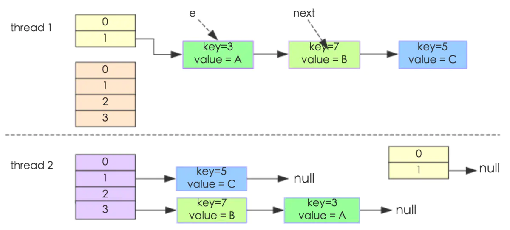
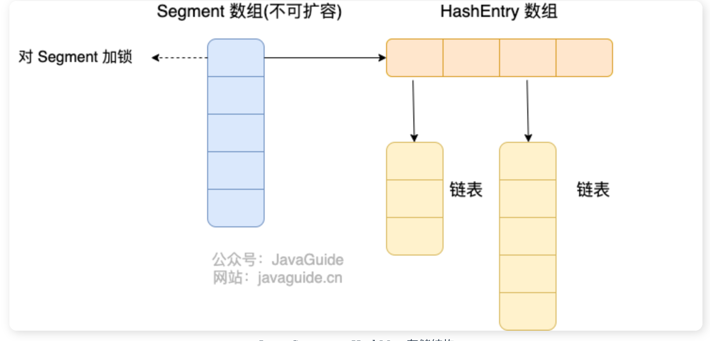
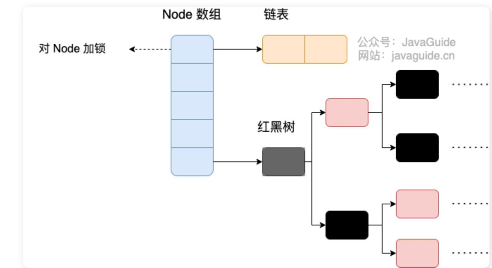

[TOC]


#  [**:house:**](../../README.html)

# 1、 java集合概览
- 在java中，除了以`map`结尾的类外，其他的类都实现了`Collection`类。
- 以`map`为结尾的类都实现了`map`接口。


# 2、 List,set,map,Queue对比
1. **应用场景**
- `List`: 存储的元素是有序的,可重复的。
- `set`: 存储的元素是无序的，不可重复的。
- `Queue`(实现排队功能的叫号机): 按特定的排队规则来确定先后顺序，存储的元素是有序的、可重复的。
- `map`: 使用键值对(key-value)来存储,key是无序的，不可重复的，value是无序的，可重复的.
2. **底层数据结构**
- **List**

  - `ArrayList:` `Object[]`**数组** ，初始容量是10，扩容时新容量大约是旧容量的 1.5 倍左右，每次扩容都要把原来的数据复制到新数组中，然后往后面加元素。


  - `Vector:` **`Object[]`数组**


  - `LinkedList:` **双向链表**（jdk1.6之前是双向循环链表，jdk1.7取消了循环）


- **set**

  - `HashSet`: 基于`HashMap`实现，底层采用**hashMap**来保存元素,定义一个虚拟的Object对象作为HashMap的value，将此对象定义为static final。

    ```java
    // Dummy value to associate with an Object in the backing Map
        private static final Object PRESENT = new Object();
    ```


  - `LinkedHashSet`:是`HashSet`的子类，基于`LinkedHashMap`实现


  - `TreeSet`: 有序，唯一，红黑树（自平衡的排序二叉树）


- **Queue**
- `PriorityQueue`: **`Object[]` 数组**来实现二叉堆
  
- `ArrayQueue`: **`Object[]` 数组** + 双指针
  
- `DelayQueue`:`PriorityQueue`。


- **Map**

  - `HashMap`:**JDK1.8之前**采用**数组+链表**的数据结构，链表是用于解决哈希冲突而存在的;**JDK1.8之后**采用**数据+链表/红黑树**的数据结构，当链表长度大于某个阈值时，会把链表转成红黑树(转成红黑树之前会先判断当前数组的长度，如果数组长度小于64，则先会对数组进行扩容)，减少搜索时间。

  - `LinkedHashMap`：**数组+链表/红黑树**。同时在此基础上，增加了一个双向链表，使得上面的结构可以保持键值对的插入顺序。

  - `HashTable`：**数组+链表**。

  - `TreeMap`:**红黑树**。

# 3 List

## 3.1 ArrayList

`ArrayList` 继承于 `AbstractList` ，实现了 `List`, `RandomAccess`, `Cloneable`, `java.io.Serializable` 这些接口。

```java
public class ArrayList<E> extends AbstractList<E>
        implements List<E>, RandomAccess, Cloneable, java.io.Serializable{
  }
```

`List` : 表明它是一个列表，支持添加、删除、查找等操作，并且可以通过下标进行访问。

`RandomAccess` ：这是一个标志接口，表明实现这个接口的 `List` 集合是支持 **快速随机访问** 的。在 `ArrayList` 中，我们即可以通过元素的序号快速获取元素对象，这就是快速随机访问。

`Cloneable` ：表明它具有拷贝能力，可以进行深拷贝或浅拷贝操作。

`Serializable` : 表明它可以进行序列化操作，也就是可以将对象转换为字节流进行持久化存储或网络传输，非常方便。

`ArrayList` 中可以存储任何类型的对象，包括 `null` 值。不过，不建议向`ArrayList` 中添加 `null` 值， `null` 值无意义，会让代码难以维护比如忘记做判空处理就会导致空指针异常。

**源码分析（JDK8）**

1. **ArrayList的属性**

```java
  private static final long serialVersionUID = 8683452581122892189L;

    /**
     * Default initial capacity.
     */
    private static final int DEFAULT_CAPACITY = 10;//默认的初始容量为10

    private static final Object[] EMPTY_ELEMENTDATA = {};//当指定ArrayList容量为0时，返回该空数组
    private static final Object[] DEFAULTCAPACITY_EMPTY_ELEMENTDATA = {};//如果不指定容量为0，默认返回该数组。

    transient Object[] elementData; //用于存放ArrayList的数组，当第一次添加元素时，该数组将扩容至DEFAULT_CAPACITY
    private int size;//ArrayList的实际大小
```

2. **ArrayList的构造函数**

- 默认构造函数，使用初始容量10构造一个空列表。(无参构造)
- 带初始容量参数的构造函数。(用户自己指定容量)
  - 如果容量大于0，就创建指定容量的数组。
  - 如果容量等于0，就创建空数组。
  - 如果容量小于0，就抛出异常
- 构造包含指定collection元素的列表，这些元素利用该集合的迭代器按顺序返回。

>**以无参构造方法创建ArrayList时，实际上初始化赋值的是一个空数组，当真正对数组进行添加元素操作时，才真正分配容量，即向数组添加第一个元素时，数组容量扩为10.**

```java
 /**
     *默认构造函数，使用初始容量10构造一个空列表(无参数构造)
     */
    public ArrayList() {
        this.elementData = DEFAULTCAPACITY_EMPTY_ELEMENTDATA;
    }

    /**
     * 带初始容量参数的构造函数。（用户自己指定容量）
     */
    public ArrayList(int initialCapacity) {
        if (initialCapacity > 0) {//初始容量大于0
            //创建initialCapacity大小的数组
            this.elementData = new Object[initialCapacity];
        } else if (initialCapacity == 0) {//初始容量等于0
            //创建空数组
            this.elementData = EMPTY_ELEMENTDATA;
        } else {//初始容量小于0，抛出异常
            throw new IllegalArgumentException("Illegal Capacity: "+
                                               initialCapacity);
        }
    }


   /**
    *构造包含指定collection元素的列表，这些元素利用该集合的迭代器按顺序返回
    *如果指定的集合为null，throws NullPointerException。
    */
     public ArrayList(Collection<? extends E> c) {
        elementData = c.toArray();
        if ((size = elementData.length) != 0) {
            // c.toArray might (incorrectly) not return Object[] (see 6260652)
            if (elementData.getClass() != Object[].class)
                elementData = Arrays.copyOf(elementData, size, Object[].class);
        } else {
            // replace with empty array.
            this.elementData = EMPTY_ELEMENTDATA;
        }
    }

```

3. **add(E e)方法**

  **总的来说就是先判断一下容量是否足够，足够的话就不扩容，不够的话就扩容，然后把原来的数据整个复制到新的数组中。**

- **添加元素之前需要调用 ensureCapacityInternal() 方法来判断容量是否足够**，传入一个参数也就是我们需要的容量(当前容量+1)
  - 当目前的elementData数组为空时，也就是我们添加的元素是第一个元素时，minCapacity = Math.max(minCapacity,DEFAULT_CAPACITY) = 10。当不为空时，minCapacity 就等于我们需要的容量。
  - 之后根据minCapacity (我们需要的容量)调用ensureExplicitCapacity(minCapacity) 方法判断是否需要扩容。
    - 如果当前elementData数组的长度大于minCapacity(我们需要的容量)，说明容量充足，不要扩容，就不需要继续下去了。
    - **如果当前elementData数组的长度小于minCapacity，需要调用grow()方法进行扩容。**
      - **新容量的大小为 `oldCapacity + (oldCapacity >> 1)`。所以新容量大约是旧容量的 1.5 倍左右。**
      - 然后检查新容量是否大于最小需要容量，若还是小于最小需要容量，那么就把最小需要容量当作数组的新容量。
      - 如果新容量大于 `MAX_ARRAY_SIZE（Integer.MAX_VALUE - 8）`, 进入(执行) `hugeCapacity()` 方法来比较 `minCapacity` 和 `MAX_ARRAY_SIZE`，如果`minCapacity`大于最大容量，则新容量则为`Integer.MAX_VALUE`，否则，新容量大小则为 `MAX_ARRAY_SIZE` 即为 `Integer.MAX_VALUE - 8`。
      - **调用`Arrays.copyOf()`将把原数组整个复制到新数组中，大小为新容量。**
- **将我们要添加的元素添加到数组中。**

```Java
/**
     * 将指定的元素追加到此列表的末尾。
     */
public boolean add(E e) {
    //添加元素之前，先调用ensureCapacityInternal方法
    ensureCapacityInternal(size + 1);  // Increments modCount!!
    //这里看到ArrayList添加元素的实质就相当于为数组赋值
    elementData[size++] = e;
    return true;
}
/**
     * 在此列表中的指定位置插入指定的元素。
     *先调用 rangeCheckForAdd 对index进行界限检查；然后调用 ensureCapacityInternal 方法保证capacity足够大；
     *再将从index开始之后的所有成员后移一个位置；将element插入index位置；最后size加1。
     */
    public void add(int index, E element) {
        rangeCheckForAdd(index);

        ensureCapacityInternal(size + 1);  // Increments modCount!!
        //arraycopy()方法实现数组自己复制自己
        //elementData:源数组;index:源数组中的起始位置;elementData：目标数组；index + 1：目标数组中的起始位置； size - index：要复制的数组元素的数量；
        System.arraycopy(elementData, index, elementData, index + 1, size - index);
        elementData[index] = element;
        size++;
    }

```

```java
//得到最小扩容量
 private void ensureCapacityInternal(int minCapacity) {
        //当目前的elementData 为空时，需要获取最小容量
        if (elementData == DEFAULTCAPACITY_EMPTY_ELEMENTDATA) {
              // 获取默认的容量和传入参数的较大值
            minCapacity = Math.max(DEFAULT_CAPACITY, minCapacity);
        }
        //判断是否需要扩容
        ensureExplicitCapacity(minCapacity);
    }
//判断是否需要扩容
private void ensureExplicitCapacity(int minCapacity) {
    modCount++;
    // overflow-conscious code
    if (minCapacity - elementData.length > 0)
        grow(minCapacity);
}

  /**
     * 要分配的最大数组大小
     */
    private static final int MAX_ARRAY_SIZE = Integer.MAX_VALUE - 8;

    /**
     * ArrayList扩容的核心方法。
     */
    private void grow(int minCapacity) {
        // oldCapacity为旧容量，newCapacity为新容量
        int oldCapacity = elementData.length;
        //将oldCapacity 右移一位，其效果相当于oldCapacity /2，
        //我们知道位运算的速度远远快于整除运算，整句运算式的结果就是将新容量更新为旧容量的1.5倍，
        int newCapacity = oldCapacity + (oldCapacity >> 1);
        //然后检查新容量是否大于最小需要容量，若还是小于最小需要容量，那么就把最小需要容量当作数组的新容量，
        if (newCapacity - minCapacity < 0)
            newCapacity = minCapacity;
       // 如果新容量大于 MAX_ARRAY_SIZE,进入(执行) `hugeCapacity()` 方法来比较 minCapacity 和 MAX_ARRAY_SIZE，
       //如果minCapacity大于最大容量，则新容量则为`Integer.MAX_VALUE`，否则，新容量大小则为 MAX_ARRAY_SIZE 即为 `Integer.MAX_VALUE - 8`。
        if (newCapacity - MAX_ARRAY_SIZE > 0)
            newCapacity = hugeCapacity(minCapacity);
        // minCapacity is usually close to size, so this is a win:
        elementData = Arrays.copyOf(elementData, newCapacity);
  }
	private static int hugeCapacity(int minCapacity) {
        if (minCapacity < 0) // overflow
            throw new OutOfMemoryError();
        return (minCapacity > MAX_ARRAY_SIZE) ?
            Integer.MAX_VALUE :
            MAX_ARRAY_SIZE;
    }

```

4. **删除元素**

- **需要调用 System.arraycopy() 将 index+1 后面的元素都复制到 index 位置上，该操作的时间复杂度为 O(N)，可以看到 ArrayList 删除元素的代价是非常高的。**

```java
public E remove(int index) {
    rangeCheck(index);
    modCount++;
    E oldValue = elementData(index);
    int numMoved = size - index - 1;
    if (numMoved > 0)
        System.arraycopy(elementData, index+1, elementData, index, numMoved);
    elementData[--size] = null; // clear to let GC do its work
    return oldValue;
}
```

4. **ArrayList替代方案**

   可以使用 `Collections.synchronizedList();` 得到一个线程安全的 ArrayList。

```java
List<String> list = new ArrayList<>();
List<String> synList = Collections.synchronizedList(list);
```

也可以使用 concurrent 并发包下的 CopyOnWriteArrayList 类。

```java
List<String> list = new CopyOnWriteArrayList<>();
```

5. **ArrayList扩容的时候使用深拷贝还是浅拷贝？**

   重新拷贝的时候，如果拷贝的是基础数据类型，采用的是深拷贝。而拷贝的是引用数据类型时采用的是浅拷贝.
   
   `System.arraycopy()` 方法用于数组之间的复制，但它是浅拷贝（shallow copy）。这意味着它只会复制数组元素的引用，而不是复制元素本身。如果数组中包含对象引用，那么`arraycopy`方法会复制这些引用，而不是对象本身。因此，原始数组和复制后的数组将指向相同的对象实例。
   
6. **`System.arraycopy()`与`Arrays.copyOf()`的区别与联系。**

- 看两者源代码可以发现 `copyOf()`内部实际调用了 `System.arraycopy()` 方法
- `arraycopy()` 需要目标数组，将原数组拷贝到你自己定义的数组里或者原数组，而且可以选择拷贝的起点和长度以及放入新数组中的位置 `copyOf()` 是系统自动在内部新建一个数组，并返回该数组。

7. **ArrayList 插入和删除元素的时间复杂度**

对于插入：

- 头部插入：由于需要将所有元素都依次向后移动一个位置，因此时间复杂度是 O(n)。
- 尾部插入：当 `ArrayList` 的容量未达到极限时，往列表末尾插入元素的时间复杂度是 O(1)，因为它只需要在数组末尾添加一个元素即可；当容量已达到极限并且需要扩容时，则需要执行一次 O(n) 的操作将原数组复制到新的更大的数组中，然后再执行 O(1) 的操作添加元素。
- 指定位置插入：需要将目标位置之后的所有元素都向后移动一个位置，然后再把新元素放入指定位置。这个过程需要移动平均 n/2 个元素，因此时间复杂度为 O(n)。

对于删除：

- 头部删除：由于需要将所有元素依次向前移动一个位置，因此时间复杂度是 O(n)。
- 尾部删除：当删除的元素位于列表末尾时，时间复杂度为 O(1)。
- 指定位置删除：需要将目标元素之后的所有元素向前移动一个位置以填补被删除的空白位置，因此需要移动平均 n/2 个元素，时间复杂度为 O(n)。

## 3.2 Vector

1. **同步**

   它的实现与 ArrayList 类似，但是使用了 synchronized 进行同步。

   ```java
   public synchronized boolean add(E e) {
       modCount++;
       ensureCapacityHelper(elementCount + 1);
       elementData[elementCount++] = e;
       return true;
   }
   
   public synchronized E get(int index) {
       if (index >= elementCount)
           throw new ArrayIndexOutOfBoundsException(index);
   
       return elementData(index);
   }
   ```

2. **扩容**

   **Vector 的构造函数可以传入 capacityIncrement 参数，它的作用是在扩容时使容量 capacity 增长 capacityIncrement。如果这个参数的值小于等于 0，扩容时每次都令 capacity 为原来的两倍。**

   ```java
   public Vector(int initialCapacity, int capacityIncrement) {
       super();
       if (initialCapacity < 0)
           throw new IllegalArgumentException("Illegal Capacity: "+
                                              initialCapacity);
       this.elementData = new Object[initialCapacity];
       this.capacityIncrement = capacityIncrement;
   }
   
   private void grow(int minCapacity) {
       // overflow-conscious code
       int oldCapacity = elementData.length;
       int newCapacity = oldCapacity + ((capacityIncrement > 0) ?
                                        capacityIncrement : oldCapacity);
       if (newCapacity - minCapacity < 0)
           newCapacity = minCapacity;
       if (newCapacity - MAX_ARRAY_SIZE > 0)
           newCapacity = hugeCapacity(minCapacity);
       elementData = Arrays.copyOf(elementData, newCapacity);
   }
   ```

   **调用没有 capacityIncrement 的构造函数时，capacityIncrement 值被设置为 0，也就是说默认情况下 Vector 每次扩容时容量都会翻倍。**

   ```java
   public Vector(int initialCapacity) {
       this(initialCapacity, 0);
   }
   
   public Vector() {
       this(10);
   }
   ```

## 3.3 LinkedList


基于双向链表实现，使用 Node 存储链表节点信息。

```java
private static class Node<E> {
    E item;// 节点值
    Node<E> next; // 指向的下一个节点（后继节点）
    Node<E> prev; // 指向的前一个节点（前驱结点）

    // 初始化参数顺序分别是：前驱结点、本身节点值、后继节点
    Node(Node<E> prev, E element, Node<E> next) {
        this.item = element;
        this.next = next;
        this.prev = prev;
    }
}

```

每个链表存储了 first 和 last 指针：

```java
transient Node<E> first;
transient Node<E> last;
```

**LinkedList 插入和删除元素的时间复杂度？**

头部插入/删除：只需要修改头结点的指针即可完成插入/删除操作，因此时间复杂度为 O(1)。

尾部插入/删除：只需要修改尾结点的指针即可完成插入/删除操作，因此时间复杂度为 O(1)。

指定位置插入/删除：需要先移动到指定位置，再修改指定节点的指针完成插入/删除，因此需要遍历平均 n/2 个元素，时间复杂度为 O(n)。


# 4 Set

## 4.1 comparable和comparator的区别
- `comparable`接口实际上出自`java.lang`包有一个`compareTo(Object obj)`方法用来排序。

```java
// person对象没有实现Comparable接口，所以必须实现，这样才不会出错，才可以使treemap中的数据按顺序排列
// 前面一个例子的String类已经默认实现了Comparable接口，详细可以查看String类的API文档，另外其他
// 像Integer类等都已经实现了Comparable接口，所以不需要另外实现了
public  class Person implements Comparable<Person> {
    private String name;
    private int age;

    public Person(String name, int age) {
        super();
        this.name = name;
        this.age = age;
    }

    public String getName() {
        return name;
    }

    public void setName(String name) {
        this.name = name;
    }

    public int getAge() {
        return age;
    }

    public void setAge(int age) {
        this.age = age;
    }

    /**
     * T重写compareTo方法实现按年龄来排序
     */
    @Override
    public int compareTo(Person o) {
        if (this.age > o.getAge()) {
            return 1;
        }
        if (this.age < o.getAge()) {
            return -1;
        }
        return 0;
    }
}
```


- `comparator`接口实际上出自`java.util`包它有一个`compare(Object obj1,Object obj2)`方法来排序。

```java
        ArrayList<Integer> arrayList = new ArrayList<Integer>();
        arrayList.add(-1);
        arrayList.add(3);
        arrayList.add(3);
        arrayList.add(-5);
        arrayList.add(7);
        arrayList.add(4);
        arrayList.add(-9);
        arrayList.add(-7);
        System.out.println("原始数组:");
        System.out.println(arrayList);
        // void reverse(List list)：反转
        Collections.reverse(arrayList);
        System.out.println("Collections.reverse(arrayList):");
        System.out.println(arrayList);

        // void sort(List list),按自然排序的升序排序
        Collections.sort(arrayList);
        System.out.println("Collections.sort(arrayList):");
        System.out.println(arrayList);
        // 定制排序的用法
        Collections.sort(arrayList, new Comparator<Integer>() {

            @Override
            public int compare(Integer o1, Integer o2) {
                return o2.compareTo(o1);
            }
        });
        System.out.println("定制排序后：");
        System.out.println(arrayList);

```


- 一般需要对一个集合使用自定义排序时，需要重写`compareTo(Object obj)`或者`compare(Object obj1,Object obj2)`方法。
## 4.2 无序性和不可重复性的含义是什么

- 无序性不等于随机性 ，无序性是指存储的数据在底层数组中并非按照数组索引的顺序添加 ，而是根据数据的哈希值决定的。
- 不可重复性是指添加的元素按照 `equals()` 判断时 ，返回 false，需要同时重写 `equals()` 方法和 `hashCode()` 方法。

## 4.3 比较HashSet,LinkedHashSet和TreeSet三者的异同
- `HashSet`的底层是`HashMap`,线程不安全，可以存null值。
- `LinkedHashSet`是`HashSet`的子类，能够按照添加的顺序遍历。底层数据结构是链表和哈希表，元素的插入和取出顺序满足 FIFO。
- `TreeSet`底层使用红黑树，能够按照添加元素的顺序进行遍历，排序的方式有自然排序和定制排序。

# 5 Queue

## 5.1 Queue与Deque

`Queue` 是单端队列，只能从一端插入元素，另一端删除元素，实现上一般遵循 **先进先出（FIFO）** 规则。

`Queue` 扩展了 `Collection` 的接口，根据 **因为容量问题而导致操作失败后处理方式的不同** 可以分为两类方法: 一种在操作失败后会抛出异常，另一种则会返回特殊值。

| `Queue` 接口 | 抛出异常  | 返回特殊值 |
| ------------ | --------- | ---------- |
| 插入队尾     | add(E e)  | offer(E e) |
| 删除队首     | remove()  | poll()     |
| 查询队首元素 | element() | peek()     |

`Deque` 是双端队列，在队列的两端均可以插入或删除元素。

`Deque` 扩展了 `Queue` 的接口, 增加了在队首和队尾进行插入和删除的方法，同样根据失败后处理方式的不同分为两类：

| `Deque` 接口 | 抛出异常      | 返回特殊值      |
| ------------ | ------------- | --------------- |
| 插入队首     | addFirst(E e) | offerFirst(E e) |
| 插入队尾     | addLast(E e)  | offerLast(E e)  |
| 删除队首     | removeFirst() | pollFirst()     |
| 删除队尾     | removeLast()  | pollLast()      |
| 查询队首元素 | getFirst()    | peekFirst()     |
| 查询队尾元素 | getLast()     | peekLast()      |

事实上，`Deque` 还提供有 `push()` 和 `pop()` 等其他方法，可用于模拟栈。

## 5.2  ArrayDeque 和 LinkedList

`ArrayDeque` 和 `LinkedList` 都实现了 `Deque` 接口，两者都具有队列的功能，但两者有什么区别呢？

- `ArrayDeque` 是基于可变长的数组和双指针来实现，而 `LinkedList` 则通过链表来实现。
- `ArrayDeque` 不支持存储 `NULL` 数据，但 `LinkedList` 支持。
- `ArrayDeque` 是在 JDK1.6 才被引入的，而`LinkedList` 早在 JDK1.2 时就已经存在。
- `ArrayDeque` 插入时可能存在扩容过程, 不过均摊后的插入操作依然为 O(1)。虽然 `LinkedList` 不需要扩容，但是每次插入数据时均需要申请新的堆空间，均摊性能相比更慢。

从性能的角度上，选用 `ArrayDeque` 来实现队列要比 `LinkedList` 更好。此外，`ArrayDeque` 也可以用于实现栈。

## 5.3 PriorityQueue

`PriorityQueue` 是在 JDK1.5 中被引入的, 其与 `Queue` 的区别在于元素出队顺序是与优先级相关的，即总是优先级最高的元素先出队。

这里列举其相关的一些要点：

- `PriorityQueue` 利用了二叉堆的数据结构来实现的，底层使用可变长的数组来存储数据
- `PriorityQueue` 通过堆元素的上浮和下沉，实现了在 O(logn) 的时间复杂度内插入元素和删除堆顶元素。
- `PriorityQueue` 是非线程安全的，且不支持存储 `NULL` 和 `non-comparable` 的对象。
- `PriorityQueue` 默认是**小顶堆**，但可以接收一个 `Comparator` 作为构造参数，从而来自定义元素优先级的先后。

`PriorityQueue` 在面试中可能更多的会出现在手撕算法的时候，典型例题包括堆排序、求第K大的数、带权图的遍历等，所以需要会熟练使用才行。


## 5.4 BlockingQueue

`BlockingQueue` （阻塞队列）是一个接口，继承自 `Queue`。`BlockingQueue`阻塞的原因是其支持当队列没有元素时一直阻塞，直到有元素；还支持如果队列已满，一直等到队列可以放入新元素时再放入。

```java
public interface BlockingQueue<E> extends Queue<E> {
  // ...
}

```

`BlockingQueue` 常用于生产者-消费者模型中，生产者线程会向队列中添加数据，而消费者线程会从队列中取出数据进行处理。


Java 中常用的阻塞队列实现类有以下几种：

1. `ArrayBlockingQueue`：使用数组实现的有界阻塞队列。在创建时需要指定容量大小，并支持公平和非公平两种方式的锁访问机制。
2. `LinkedBlockingQueue`：使用单向链表实现的可选有界阻塞队列。在创建时可以指定容量大小，如果不指定则默认为`Integer.MAX_VALUE`。和`ArrayBlockingQueue`不同的是， 它仅支持非公平的锁访问机制。
3. `PriorityBlockingQueue`：支持优先级排序的无界阻塞队列。元素必须实现`Comparable`接口或者在构造函数中传入`Comparator`对象，并且不能插入 null 元素。
4. `SynchronousQueue`：同步队列，是一种不存储元素的阻塞队列。每个插入操作都必须等待对应的删除操作，反之删除操作也必须等待插入操作。因此，`SynchronousQueue`通常用于线程之间的直接传递数据。
5. `DelayQueue`：延迟队列，其中的元素只有到了其指定的延迟时间，才能够从队列中出队。
6. …

# 6 Map接口

## 6.1 HashMap

以下源码分析以 JDK 1.8 为主。

在并发的情况下，由于不是线程安全的，所以在扩容时会产生死链的问题。

### 1. **存储结构**

- **JDK1.8之前：数组 + 链表；**
  - JDK1.8 之前 `HashMap` 底层是 **数组和链表** 结合在一起使用也就是 **链表散列**。HashMap 通过 key 的 `hashcode` 经过扰动函数处理过后得到 hash 值，然后通过 `(n - 1) & hash` 判断当前元素存放的位置（这里的 n 指的是数组的长度），如果当前位置存在元素的话，就判断该元素与要存入的元素的 hash 值以及 key 是否相同，如果相同的话，直接覆盖，不相同就通过拉链法解决冲突。

- **JDK1.8之后：数组+ 链表/红黑树。**


```java
transient Entry[] table;
```

```java
static class Entry<K,V> implements Map.Entry<K,V> {
    final K key;
    V value;
    Entry<K,V> next;
    int hash;

    Entry(int h, K k, V v, Entry<K,V> n) {
        value = v;
        next = n;
        key = k;
        hash = h;
    }

    public final K getKey() {
        return key;
    }

    public final V getValue() {
        return value;
    }

    public final V setValue(V newValue) {
        V oldValue = value;
        value = newValue;
        return oldValue;
    }

    public final boolean equals(Object o) {
        if (!(o instanceof Map.Entry))
            return false;
        Map.Entry e = (Map.Entry)o;
        Object k1 = getKey();
        Object k2 = e.getKey();
        if (k1 == k2 || (k1 != null && k1.equals(k2))) {
            Object v1 = getValue();
            Object v2 = e.getValue();
            if (v1 == v2 || (v1 != null && v1.equals(v2)))
                return true;
        }
        return false;
    }

    public final int hashCode() {
        return Objects.hashCode(getKey()) ^ Objects.hashCode(getValue());
    }

    public final String toString() {
        return getKey() + "=" + getValue();
    }
}
```

### 2.源码分析

 **put方法**

1. **计算 key 的 hash 值。**

   计算方式是 `(key == null) ? 0 : (h = key.hashCode()) ^ (h >>> 16);`

2. **检查当前数组是否为空，为空需要进行初始化，初始化容量是 16 ，负载因子默认 0.75。**

3. **计算 key 在数组中的坐标。**

   计算方式：`(容量 - 1) & hash`.

   因为容量总是2的次方，所以-1的值的二进制总是全1。方便与 hash 值进行与运算。

4. **如果计算出的坐标元素为空，创建节点加入，put 结束。**

5. 1. **如果当前键值对的数量大于阈值（负载因子*容量)，进行扩容。**

6. **如果计算出的坐标元素有值。遍历链表或者红黑树插入。**

7. 1. 如果 next 节点为空，把要加入的值和 key 加入 next 节点。

   2. 如果 next 节点不为空，循环查看 next 节点。

      如果发现有 next 节点的 key 和要加入的 key 一样，对应的值替换为新值。

   3. 如果循环 next 节点查找**超过8层**还不为空，把这个位置元素转换为**红黑树**。

   4. 如果坐标上的元素值和要加入的值 key 完全一样，覆盖原有值。

   5. 如果坐标上的元素是**红黑树**，把要加入的值和 key 加入到红黑树。

   6. 如果坐标上的元素和要加入的元素不同（**尾插法**增加）。
   
   > jdk1.8采用尾插法，jdk1.7采用头插法。

```
HashMap<String, String> map = new HashMap<>();
map.put("K1", "V1");
map.put("K2", "V2");
map.put("K3", "V3");
```

```java
public V put(K key, V value) {
    return putVal(hash(key), key, value, false, true);
}
// 计算哈希值 与（&）、非（~）、或（|）、异或（^）
static final int hash(Object key) {
    int h;
    return (key == null) ? 0 : (h = key.hashCode()) ^ (h >>> 16);
}
final V putVal(int hash, K key, V value, boolean onlyIfAbsent, boolean evict) {
   
    Node<K,V>[] tab; Node<K,V> p; int n, i;
    // 如果数组为空，进行 resize() 初始化
    if ((tab = table) == null || (n = tab.length) == 0)
        n = (tab = resize()).length;
    // 如果计算的位置上Node不存在，直接创建节点插入
    if ((p = tab[i = (n - 1) & hash]) == null)
        tab[i] = newNode(hash, key, value, null);
    else {
        // 如果计算的位置上Node 存在，链表处理
        Node<K,V> e; K k;
        // 如果 hash 值，k 值完全相同，直接覆盖
        if (p.hash == hash &&((k = p.key) == key || (key != null && key.equals(k))))
            e = p;
        // 如果 index 位置元素已经存在，且是红黑树
        else if (p instanceof TreeNode)
            e = ((TreeNode<K,V>)p).putTreeVal(this, tab, hash, key, value);
        else {
            // 如果这次要放入的值不存在
            for (int binCount = 0; ; ++binCount) {
                // 尾插法
                if ((e = p.next) == null) {
                    // 找到节点链表中next为空的节点，创建新的节点插入
                    p.next = newNode(hash, key, value, null);
                    // 如果节点链表中数量超过TREEIFY_THRESHOLD（8）个，转化为红黑树
                    if (binCount >= TREEIFY_THRESHOLD - 1) // -1 for 1st
                        treeifyBin(tab, hash);
                    break;
                }
                // 如果节点链表中有发现已有相同key
                if (e.hash == hash &&
                    ((k = e.key) == key || (key != null && key.equals(k))))
                    break;
                p = e;
            }
        }
        // 如果节点 e 有值，放入数组 table[]
        if (e != null) { // existing mapping for key
            V oldValue = e.value;
            if (!onlyIfAbsent || oldValue == null)
                e.value = value;
            afterNodeAccess(e);
            return oldValue;
        }
    }
 
    ++modCount;
    // 当前大小大于临界大小，扩容
    if (++size > threshold)
        resize();
    afterNodeInsertion(evict);
    return null;
}
```

**HashMap 允许插入键为 null 的键值对。但是因为无法调用 null 的 hashCode() 方法，也就无法确定该键值对的桶下标，只能通过强制指定一个桶下标来存放。HashMap 使用第 0 个桶存放键为 null 的键值对。**

**get 方法流程总结。**

1. **计算 key 的 hash 值。**

2. **如果存储数组不为空，且计算得到的位置上的元素不为空。继续，否则，返回 Null。**

3. **如果获取到的元素的 key 值相等，说明查找到了，返回元素。**

4. **如果获取到的元素的 key 值不相等，查找 next 节点的元素。**

5. 1. **如果元素是红黑树，在红黑树中查找。**
   2. **不是红黑树，遍历 next 节点查找，找到则返回。**

```java
public V get(Object key) {
    Node<K,V> e;
    return (e = getNode(hash(key), key)) == null ? null : e.value;
}
final Node<K,V> getNode(int hash, Object key) {
    Node<K,V>[] tab; Node<K,V> first, e; int n; K k;
    // 只有在存储数组已经存在的情况下进入这个 if
    if ((tab = table) != null && (n = tab.length) > 0 &&
        (first = tab[(n - 1) & hash]) != null) {
        // first 是获取的坐标上元素
        if (first.hash == hash && // always check first node
            ((k = first.key) == key || (key != null && key.equals(k))))
            // key 相同，说明first是想要的元素，返回
            return first;
        if ((e = first.next) != null) {
            if (first instanceof TreeNode)
                // 如果是红黑树，从红黑树中查找结果
                return ((TreeNode<K,V>)first).getTreeNode(hash, key);
            do {
                // 循环遍历查找
                if (e.hash == hash &&
                    ((k = e.key) == key || (key != null && key.equals(k))))
                    return e;
            } while ((e = e.next) != null);
        }
    }
    return null;
 }
```

**resize()方法**

1. **HashMap为什么要扩容?**

    为了解决冲突, 我们就需要对table进行扩容, 所以HashMap的扩容就是加长table的长度, 来减少hash冲突的概率.

2. **HashMap何时扩容？**

-  HashMap实行了懒加载, **新建HashMap时不会对table进行赋值, 而是到第一次插入时, 进行resize时构建table;**
- **当HashMap.size 大于 threshold时, 会进行resize;**当第一次构建时, 如果没有指定HashMap.table的初始长度, 就用默认值16, 否则就是指定的值; 然后不管是第一次构建还是后续扩容, threshold = table.length * loadFactor;

1. **扩容的过程？**

- **如果table == null, 则为HashMap的初始化, 生成空table返回即可;**
- **如果table不为空, 需要重新计算table的长度, newLength = oldLength *2  **；注, 如果原oldLength已经到了上限, 则newLength = oldLength);
  - 将table扩为新的长度。
  - oldTable 的所有键值对重新插入 newTable 中。由 `if ((e.hash & oldCap) == 0)` 确定键值对的位置。
    -  e.hash & oldCap = 0 计算得到位置还是扩容前位置
    - e.hash & oldCap != 0 计算得到位置是扩容前位置 + 扩容前容量`oldCap`

和扩容相关的参数主要有：capacity、size、threshold 和 load_factor。

|    参数    | 含义                                                         |
| :--------: | :----------------------------------------------------------- |
|  capacity  | table 的容量大小，默认为 16。需要注意的是 capacity 必须保证为 2 的 n 次方。 |
|    size    | 键值对数量。                                                 |
| threshold  | size 的临界值，当 size 大于等于 threshold 就必须进行扩容操作。 |
| loadFactor | 装载因子，table 能够使用的比例，threshold = (int)(capacity* loadFactor)。 |

```java
static final int DEFAULT_INITIAL_CAPACITY = 16;

static final int MAXIMUM_CAPACITY = 1 << 30;

static final float DEFAULT_LOAD_FACTOR = 0.75f;

transient Entry[] table;

transient int size;

int threshold;

final float loadFactor;

transient int modCount;
```

**从下面的添加元素代码中可以看出，当需要扩容时，令 capacity 为原来的两倍。**

```java
void addEntry(int hash, K key, V value, int bucketIndex) {
    Entry<K,V> e = table[bucketIndex];
    table[bucketIndex] = new Entry<>(hash, key, value, e);
    if (size++ >= threshold)
        resize(2 * table.length);
}
```

**扩容使用 resize() 实现，需要注意的是，扩容操作同样需要把 oldTable 的所有键值对重新插入 newTable 中，因此这一步是很费时的。**

```java
void resize(int newCapacity) {
    Entry[] oldTable = table;
    int oldCapacity = oldTable.length;
    if (oldCapacity == MAXIMUM_CAPACITY) {
        threshold = Integer.MAX_VALUE;
        return;
    }
    Entry[] newTable = new Entry[newCapacity];
    transfer(newTable);
    table = newTable;
    threshold = (int)(newCapacity * loadFactor);
}

void transfer(Entry[] newTable) {
    Entry[] src = table;
    int newCapacity = newTable.length;
    for (int j = 0; j < src.length; j++) {
        Entry<K,V> e = src[j];
        if (e != null) {
            src[j] = null;
            do {
                Entry<K,V> next = e.next;
                int i = indexFor(e.hash, newCapacity);
                e.next = newTable[i];
                newTable[i] = e;
                e = next;
            } while (e != null);
        }
    }
}
```

**计算数组容量**

HashMap 构造函数允许用户传入的容量不是 2 的 n 次方，因为它可以自动地将传入的容量转换为 2 的 n 次方。

先考虑如何求一个数的掩码，对于 10010000，它的掩码为 11111111，可以使用以下方法得到：

```text
mask |= mask >> 1    11011000
mask |= mask >> 2    11111110
mask |= mask >> 4    11111111
```

mask+1 是大于原始数字的最小的 2 的 n 次方。

```text
num     10010000
mask+1 100000000
```

以下是 HashMap 中计算数组容量的代码：

```java
static final int tableSizeFor(int cap) {
    int n = cap - 1;
    n |= n >>> 1;
    n |= n >>> 2;
    n |= n >>> 4;
    n |= n >>> 8;
    n |= n >>> 16;
    return (n < 0) ? 1 : (n >= MAXIMUM_CAPACITY) ? MAXIMUM_CAPACITY : n + 1;
}
```

### HashMap线程不安全？

**1. put的时候导致的多线程数据不一致。**
 这个问题比较好想象，比如有两个线程A和B，首先A希望插入一个key-value对到HashMap中，首先计算记录所要落到的桶的索引坐标，然后获取到该桶里面的链表头结点，此时线程A的时间片用完了，而此时线程B被调度得以执行，和线程A一样执行，只不过线程B成功将记录插到了桶里面，假设线程A插入的记录计算出来的桶索引和线程B要插入的记录计算出来的桶索引是一样的，那么当线程B成功插入之后，线程A再次被调度运行时，它依然持有过期的链表头但是它对此一无所知，以至于它认为它应该这样做，如此一来就覆盖了线程B插入的记录，这样线程B插入的记录就凭空消失了，造成了数据不一致的行为。

**2. resize的时候导致的多线程数据不一致。**



我们假设有两个线程同时需要执行resize操作，我们原来的桶数量为2，记录数为3，需要resize桶到4，原来的记录分别为：[3,A],[7,B],[5,C]，在原来的map里面，我们发现这三个entry都落到了第二个桶里面。
 假设线程thread1执行到了transfer方法的Entry next = e.next这一句，然后时间片用完了，此时的e = [3,A], next = [7,B]。线程thread2被调度执行并且顺利完成了resize操作，需要注意的是，此时的[7,B]的next为[3,A]。此时线程thread1重新被调度运行，此时的thread1持有的引用是已经被thread2 resize之后的结果。线程thread1首先将[3,A]迁移到新的数组上，然后再处理[7,B]，而[7,B]被链接到了[3,A]的后面，处理完[7,B]之后，就需要处理[7,B]的next了啊，而通过thread2的resize之后，[7,B]的next变为了[3,A]，此时，[3,A]和[7,B]形成了环形链表，在get的时候，如果get的key的桶索引和[3,A]和[7,B]一样，那么就会陷入死循环。

如果在取链表的时候从头开始取（现在是从尾部开始取）的话，则可以保证节点之间的顺序，那样就不存在这样的问题了。


### HashMap对重复元素的检查

当把一个对象加入HashMap时，会先计算对象的hashcode判断对象加入的位置，同时也会与其他加入的对象的hashcode值比较，如果不同就假定没有重复元素，如果相同就需要调用equal()来判断两个对象是否是真的相等。

### HashMap的长度为什么是2的幂次方

- hash值的范围非常大，内存是放不下的，所以在使用之前需要先对数组的长度取模运算，得到的余数才能用来要存放的位置也就是对应数组的下标。**取余操作中如果除数是2的幂次则等价于其于除数减一的与（&）操作。** 也就是说 hash%length==hash&(length-1)的前提是 length 是 2 的 n 次方。采用&操作，能够提高运算效率。

### HashMap常见的遍历方式

>https://mp.weixin.qq.com/s/Zz6mofCtmYpABDL1ap04ow

1. **迭代器(Iterator)方式遍历**

- 使用迭代器（Iterator）EntrySet 的方式进行遍历；

```java
public class HashMapTest {
    public static void main(String[] args) {
        // 创建并赋值 HashMap
        Map<Integer, String> map = new HashMap();
        map.put(1, "Java");
        map.put(2, "JDK");
        map.put(3, "Spring Framework");
        map.put(4, "MyBatis framework");
        map.put(5, "Java中文社群");
        // 遍历
        Iterator<Map.Entry<Integer, String>> iterator = map.entrySet().iterator();
        while (iterator.hasNext()) {
            Map.Entry<Integer, String> entry = iterator.next();
            System.out.println(entry.getKey());
            System.out.println(entry.getValue());
        }
    }
}
```

- 使用迭代器（Iterator）KeySet 的方式进行遍历；

```java
public class HashMapTest {
    public static void main(String[] args) {
        // 创建并赋值 HashMap
        Map<Integer, String> map = new HashMap();
        map.put(1, "Java");
        map.put(2, "JDK");
        map.put(3, "Spring Framework");
        map.put(4, "MyBatis framework");
        map.put(5, "Java中文社群");
        // 遍历
        Iterator<Integer> iterator = map.keySet().iterator();
        while (iterator.hasNext()) {
            Integer key = iterator.next();
            System.out.println(key);
            System.out.println(map.get(key));
        }
    }
}
```

2. **For Each遍历**

- 使用 For Each EntrySet 的方式进行遍历；

```java

public class HashMapTest {
    public static void main(String[] args) {
        // 创建并赋值 HashMap
        Map<Integer, String> map = new HashMap();
        map.put(1, "Java");
        map.put(2, "JDK");
        map.put(3, "Spring Framework");
        map.put(4, "MyBatis framework");
        map.put(5, "Java中文社群");
        // 遍历
        for (Map.Entry<Integer, String> entry : map.entrySet()) {
            System.out.println(entry.getKey());
            System.out.println(entry.getValue());
        }
    }
}
```

- 使用 For Each KeySet 的方式进行遍历；

```java
public class HashMapTest {
    public static void main(String[] args) {
        // 创建并赋值 HashMap
        Map<Integer, String> map = new HashMap();
        map.put(1, "Java");
        map.put(2, "JDK");
        map.put(3, "Spring Framework");
        map.put(4, "MyBatis framework");
        map.put(5, "Java中文社群");
        // 遍历
        for (Integer key : map.keySet()) {
            System.out.println(key);
            System.out.println(map.get(key));
        }
    }
}
```

3. **Lambda表达式遍历**

```java
public class HashMapTest {
    public static void main(String[] args) {
        // 创建并赋值 HashMap
        Map<Integer, String> map = new HashMap();
        map.put(1, "Java");
        map.put(2, "JDK");
        map.put(3, "Spring Framework");
        map.put(4, "MyBatis framework");
        map.put(5, "Java中文社群");
        // 遍历
        map.forEach((key, value) -> {
            System.out.println(key);
            System.out.println(value);
        });
    }
}
```

3. **Streams API遍历**

- 使用 Streams API 单线程的方式进行遍历；

```java
public class HashMapTest {
    public static void main(String[] args) {
        // 创建并赋值 HashMap
        Map<Integer, String> map = new HashMap();
        map.put(1, "Java");
        map.put(2, "JDK");
        map.put(3, "Spring Framework");
        map.put(4, "MyBatis framework");
        map.put(5, "Java中文社群");
        // 遍历
        map.entrySet().stream().forEach((entry) -> {
            System.out.println(entry.getKey());
            System.out.println(entry.getValue());
        });
    }
}
```

- 使用 Streams API 多线程的方式进行遍历。

```java

public class HashMapTest {
    public static void main(String[] args) {
        // 创建并赋值 HashMap
        Map<Integer, String> map = new HashMap();
        map.put(1, "Java");
        map.put(2, "JDK");
        map.put(3, "Spring Framework");
        map.put(4, "MyBatis framework");
        map.put(5, "Java中文社群");
        // 遍历
        map.entrySet().parallelStream().forEach((entry) -> {
            System.out.println(entry.getKey());
            System.out.println(entry.getValue());
        });
    }
}
```

## 6.2 ConcurrentHashMap

#### **JDK1.7**



1. **数据结构：**首先将数据分为一段一段的存储，然后给每一段数据配一把锁，当一个线程占用锁访问其中一个段数据时，其他段的数据也能被其他线程访问。**分段的数组+链表**

- **ConcurrentHashMap** 是由**分段的数组+链表**组成。

- Segment 继承了 **ReentrantLock**,所以 Segment 是一种可重入锁，扮演锁的⻆色。HashEntry 用于存储 键值对数据。

- 一个 ConcurrentHashMap 里包含一个 Segment 数组。Segment 的结构和 HashMap 类似，是一种数组 和链表结构，一个 Segment 包含一个 HashEntry 数组，每个 HashEntry 是一个链表结构的元素，每 个 Segment 守护着一个 HashEntry 数组里的元素，当对 HashEntry 数组的数据进行修改时，必须首 先获得对应的 Segment 的锁。

- 一个 `ConcurrentHashMap` 里包含一个 `Segment` 数组，`Segment` 的个数一旦**初始化就不能改变**。 `Segment` 数组的大小默认是 16，也就是说默认可以同时支持 16 个线程并发写。

- `Segment` 的结构和 `HashMap` 类似，是一种数组和链表结构，一个 `Segment` 包含一个 `HashEntry` 数组，每个 `HashEntry` 是一个链表结构的元素，每个 `Segment` 守护着一个 `HashEntry` 数组里的元素，当对 `HashEntry` 数组的数据进行修改时，必须首先获得对应的 `Segment` 的锁。也就是说，对同一 `Segment` 的并发写入会被阻塞，不同 `Segment` 的写入是可以并发执行的。


2. **put()操作**

   Segment实现了ReentrantLock,也就带有锁的功能，当执行put操作时，会进行第一次key的hash来定位Segment的位置，如果该Segment还没有初始化，即通过CAS操作进行赋值，然后进行第二次hash操作，找到相应的HashEntry的位置，这里会利用继承过来的锁的特性，在将数据插入指定的HashEntry位置时（链表的尾端)，会通过继承ReentrantLock的tryLock（）方法尝试去获取锁，如果获取成功就直接插入相应的位置，如果已经有线程获取该Segment的锁，那当前线程会以自旋的方式去继续的调用tryLock（）方法去获取锁，超过指定次数就挂起，等待唤醒。

   - 首先对key进行第一次hash，通过hash值确定segment的位置
   - 然后在segment内进行操作，获取锁
   - 接着获取当前segment的HashEntry数组，然后对key进行第二次hash，通过hash值确定在HashEntry数组的索引位置。
   - 然后对当前索引的HashEntry链进行遍历，如果有相同的key，则替换；如果没有重复的：
     - 如果当前容量大于扩容阀值，小于最大容量，**进行扩容**。
     - 链表**头插法**插入。
   - 关闭锁，在整个put过程中，进行了2次hash操作，才最终确定key的位置。

3. **扩容rehash**

   ConcurrentHashMap 的扩容只会扩容到原来的两倍。老数组里的数据移动到新的数组时，位置要么不变（当(e.hash & oldCap) = 0时），要么变为 index+ oldSize，参数里的 node 会在扩容之后使用链表**头插法**插入到指定位置。

4. **get()操作**

   - 计算得到 key 的存放位置。
   - 遍历指定位置查找相同 key 的 value 值。

5. **size()操作**

   第一种方案他会使用不加锁的模式去尝试多次计算ConcurrentHashMap的size，最多三次，比较前后两次计算的结果，结果一致就认为当前没有元素加入，计算的结果是准确的

   第二种方案是如果第一种方案不符合，他就会给每个Segment加上锁，然后计算ConcurrentHashMap的size返回

#### JDK1.8

可以发现 Java8 的 ConcurrentHashMap 相对于 Java7 来说变化比较大，不再是之前的 **Segment 数组 + HashEntry 数组 + 链表**，而是 **Node 数组 + 链表 / 红黑树**。当冲突链表达到一定长度时，链表会转换成红黑树。



1. **初始化 initTable()**

   - 初始化数组，只允许一个数组进行初始化，实现原理，利用sizeCtl，sizeCtl默认为0，

   - while循环判断数组是否为null，且数组长度是否为0

   - 在while内部，先判断sizeCtl是否小于0，如果小于0就让出cpu，说明别的线程正在初始化

   - 如果sizeCtl不小于0，就进行cas操作，就sizeCtl设置为-1，设置成功就再判断数组是否为null，且数组长度是否为0，如果满足条件，就进行初始化，并且把sizeCtl设置为n/2；如果不满足就退出循环

   - 初始化完数组，别的线程如果还在initTable函数里，就会尝试把sizeCtl设置为-1，设置成功，判断数组不为null，退出循环。

   ```java
   private transient volatile int sizeCtl;
   ```

   - sizeCtl为0，代表数组未初始化，且数组的初始容量为16
   - sizeCtl为正数，如果数组未初始化，那么其记录的是数组的初始容量，如果数组已经初始化，那么其记录的是数组的扩容阈值。
   - sizeCtl为-1，表示数组正在进行初始化
   - sizeCtl小于0，并且不是-1，表示数组正在扩容，-(1 + n)表示此时有n个线程正在共同完成数组的扩容操作。
   - 初始化是通过**自旋和 CAS** 操作完成的

2. **put()方法**

- 如果没有初始化就先调用initTable()方法来进行初始化过程
- 如果没有hash冲突就直接CAS插入
- 如果还在进行扩容操作就先进行协作扩容
- 如果存在hash冲突，就加锁（`synchronized`）来保证线程安全，这里有两种情况，一种是链表形式就直接遍历到尾端插入，一种是红黑树就按照红黑树结构插入，
- 最后一个如果Hash冲突时会形成Node链表，在链表长度超过8，Node数组超过64时会将链表结构转换为红黑树的结构，break退出循环
- 如果添加成功就调用addCount()方法统计size，并且检查是否需要扩容。

3. **get()方法**

   - 计算hash值，定位到该table索引位置，如果是首节点符合就返回

   - 如果遇到扩容的时候，会调用标志正在扩容节点ForwardingNode的find方法，查找该节点，匹配就返回

   - 以上都不符合的话，就往下遍历节点，匹配就返回，否则最后就返回null

### JDK 1.7 和 JDK 1.8 的 ConcurrentHashMap 实现有什么不同？

- **线程安全实现方式**：JDK 1.7 采用 `Segment` 分段锁来保证安全， `Segment` 是继承自 `ReentrantLock`。JDK1.8 放弃了 `Segment` 分段锁的设计，采用 `Node + CAS + synchronized` 保证线程安全，锁粒度更细，`synchronized` 只锁定当前链表或红黑二叉树的首节点。
- **Hash 碰撞解决方法** : JDK 1.7 采用拉链法，JDK1.8 采用拉链法结合红黑树（链表长度超过一定阈值时，将链表转换为红黑树）。
- **并发度**：JDK 1.7 最大并发度是 Segment 的个数，默认是 16。JDK 1.8 最大并发度是 Node 数组的大小，并发度更大。

### ConcurrentHashMap 为什么 key 和 value 不能为 null？

`ConcurrentHashMap` 的 key 和 value 不能为 null 主要是为了避免二义性。null 是一个特殊的值，表示没有对象或没有引用。如果你用 null 作为键，那么你就无法区分这个键是否存在于 `ConcurrentHashMap` 中，还是根本没有这个键。同样，如果你用 null 作为值，那么你就无法区分这个值是否是真正存储在 `ConcurrentHashMap` 中的，还是因为找不到对应的键而返回的。

拿 get 方法取值来说，返回的结果为 null 存在两种情况：

- 值没有在集合中 ；
- 值本身就是 null。

这也就是二义性的由来

因为ConcurrentHashMap是线程安全的，一般使用在并发环境下，你一开始get方法获取到null之后，再去调用`containsKe`y方法，没法确保get方法和`containsKey`方法之间，没有别的线程来捣乱，刚好把你要查询的对象设置了进去或者删除掉了。

与此形成对比的是，`HashMap` 可以存储 null 的 key 和 value，但 null 作为键只能有一个，null 作为值可以有多个。如果传入 null 作为参数，就会返回 hash 值为 0 的位置的值。单线程环境下，不存在一个线程操作该 HashMap 时，其他的线程将该 `HashMap` 修改的情况，所以可以通过 `contains(key)`来做判断是否存在这个键值对，从而做相应的处理，也就不存在二义性问题。

### ConcurrentHashMap 能保证复合操作的原子性吗？

`ConcurrentHashMap` 是线程安全的，意味着它可以保证多个线程同时对它进行读写操作时，不会出现数据不一致的情况，也不会导致 JDK1.7 及之前版本的 `HashMap` 多线程操作导致死循环问题。但是，这并不意味着它可以保证所有的复合操作都是原子性的，一定不要搞混了！

复合操作是指由多个基本操作(如`put`、`get`、`remove`、`containsKey`等)组成的操作，例如先判断某个键是否存在`containsKey(key)`，然后根据结果进行插入或更新`put(key, value)`。这种操作在执行过程中可能会被其他线程打断，导致结果不符合预期。

例如，有两个线程 A 和 B 同时对 `ConcurrentHashMap` 进行复合操作，如下：

```java
// 线程 A
if (!map.containsKey(key)) {
map.put(key, value);
}
// 线程 B
if (!map.containsKey(key)) {
map.put(key, anotherValue);
}

```

如果线程 A 和 B 的执行顺序是这样：

1. 线程 A 判断 map 中不存在 key
2. 线程 B 判断 map 中不存在 key
3. 线程 B 将 (key, anotherValue) 插入 map
4. 线程 A 将 (key, value) 插入 map

那么最终的结果是 (key, value)，而不是预期的 (key, anotherValue)。这就是复合操作的非原子性导致的问题。

**那如何保证 `ConcurrentHashMap` 复合操作的原子性呢？**

`ConcurrentHashMap` 提供了一些原子性的复合操作，如 `putIfAbsent`、`compute`、`computeIfAbsent` 、`computeIfPresent`、`merge`等。这些方法都可以接受一个函数作为参数，根据给定的 key 和 value 来计算一个新的 value，并且将其更新到 map 中。

很多同学可能会说了，这种情况也能加锁同步呀！确实可以，但不建议使用加锁的同步机制，违背了使用 `ConcurrentHashMap` 的初衷。在使用 `ConcurrentHashMap` 的时候，尽量使用这些原子性的复合操作方法来保证原子性。

# ArrayBlockingQueue

Java 阻塞队列的历史可以追溯到 JDK1.5 版本，当时 Java 平台增加了 `java.util.concurrent`，即我们常说的 JUC 包，其中包含了各种并发流程控制工具、并发容器、原子类等。这其中自然也包含了我们这篇文章所讨论的阻塞队列。

为了解决高并发场景下多线程之间数据共享的问题，JDK1.5 版本中出现了 `ArrayBlockingQueue` 和 `LinkedBlockingQueue`，它们是带有生产者-消费者模式实现的并发容器。其中，`ArrayBlockingQueue` 是有界队列，即添加的元素达到上限之后，再次添加就会被阻塞或者抛出异常。而 `LinkedBlockingQueue` 则由链表构成的队列，正是因为链表的特性，所以 `LinkedBlockingQueue` 在添加元素上并不会向 `ArrayBlockingQueue` 那样有着较多的约束，所以 `LinkedBlockingQueue` 设置队列是否有界是可选的(注意这里的无界并不是指可以添加任务数量的元素，而是说队列的大小默认为 `Integer.MAX_VALUE`，近乎于无限大)。

阻塞队列就是典型的生产者-消费者模型，它可以做到以下几点:

1. 当阻塞队列数据为空时，所有的消费者线程都会被阻塞，等待队列非空。
2. 当生产者往队列里填充数据后，队列就会通知消费者队列非空，消费者此时就可以进来消费。
3. 当阻塞队列因为消费者消费过慢或者生产者存放元素过快导致队列填满时无法容纳新元素时，生产者就会被阻塞，等待队列非满时继续存放元素。
4. 当消费者从队列中消费一个元素之后，队列就会通知生产者队列非满，生产者可以继续填充数据了。

```java
public class ProducerConsumerExample {

    public static void main(String[] args) throws InterruptedException {

        // 创建一个大小为 5 的 ArrayBlockingQueue
        ArrayBlockingQueue<Integer> queue = new ArrayBlockingQueue<>(5);

        // 创建生产者线程
        Thread producer = new Thread(() -> {
            try {
                for (int i = 1; i <= 10; i++) {
                    // 向队列中添加元素，如果队列已满则阻塞等待
                    queue.put(i);
                    System.out.println("生产者添加元素：" + i);
                }
            } catch (InterruptedException e) {
                e.printStackTrace();
            }

        });

        CountDownLatch countDownLatch = new CountDownLatch(1);

        // 创建消费者线程
        Thread consumer = new Thread(() -> {
            try {
                int count = 0;
                while (true) {

                    // 从队列中取出元素，如果队列为空则阻塞等待
                    int element = queue.take();
                    System.out.println("消费者取出元素：" + element);
                    ++count;
                    if (count == 10) {
                        break;
                    }
                }

                countDownLatch.countDown();
            } catch (InterruptedException e) {
                e.printStackTrace();
            }

        });

        // 启动线程
        producer.start();
        consumer.start();

        // 等待线程结束
        producer.join();
        consumer.join();

        countDownLatch.await();

        producer.interrupt();
        consumer.interrupt();
    }

}

```

### ArrayBlockingQueue 是什么？它的特点是什么？

`ArrayBlockingQueue` 是 `BlockingQueue` 接口的有界队列实现类，常用于多线程之间的数据共享，底层采用数组实现，从其名字就能看出来了。

`ArrayBlockingQueue` 的容量有限，一旦创建，容量不能改变。

为了保证线程安全，`ArrayBlockingQueue` 的并发控制采用可重入锁 `ReentrantLock` ，不管是插入操作还是读取操作，都需要获取到锁才能进行操作。并且，它还支持公平和非公平两种方式的锁访问机制，默认是非公平锁。

`ArrayBlockingQueue` 虽名为阻塞队列，但也支持非阻塞获取和新增元素（例如 `poll()` 和 `offer(E e)` 方法），只是队列满时添加元素会抛出异常，队列为空时获取的元素为 null，一般不会使用。


#  对比

## ArrayList 和 Array（数组）的区别

`ArrayList` 内部基于动态数组实现，比 `Array`（静态数组） 使用起来更加灵活：

- `ArrayList`会根据实际存储的元素动态地扩容或缩容，而 `Array` 被创建之后就不能改变它的长度了。
- `ArrayList` 允许你使用泛型来确保类型安全，`Array` 则不可以。
- `ArrayList` 中只能存储对象。对于基本类型数据，需要使用其对应的包装类（如 Integer、Double 等）。`Array` 可以直接存储基本类型数据，也可以存储对象。
- `ArrayList` 支持插入、删除、遍历等常见操作，并且提供了丰富的 API 操作方法，比如 `add()`、`remove()`等。`Array` 只是一个固定长度的数组，只能按照下标访问其中的元素，不具备动态添加、删除元素的能力。
- `ArrayList`创建时不需要指定大小，而`Array`创建时必须指定大小。

下面是二者使用的简单对比：

Array：

```java
 // 初始化一个 String 类型的数组
 String[] stringArr = new String[]{"hello", "world", "!"};
 // 修改数组元素的值
 stringArr[0] = "goodbye";
 System.out.println(Arrays.toString(stringArr));// [goodbye, world, !]
 // 删除数组中的元素，需要手动移动后面的元素
 for (int i = 0; i < stringArr.length - 1; i++) {
     stringArr[i] = stringArr[i + 1];
 }
 stringArr[stringArr.length - 1] = null;
 System.out.println(Arrays.toString(stringArr));// [world, !, null]

```

ArrayList：

```Java
// 初始化一个 String 类型的 ArrayList
 ArrayList<String> stringList = new ArrayList<>(Arrays.asList("hello", "world", "!"));
// 添加元素到 ArrayList 中
 stringList.add("goodbye");
 System.out.println(stringList);// [hello, world, !, goodbye]
 // 修改 ArrayList 中的元素
 stringList.set(0, "hi");
 System.out.println(stringList);// [hi, world, !, goodbye]
 // 删除 ArrayList 中的元素
 stringList.remove(0);
 System.out.println(stringList); // [world, !, goodbye]
```


## ArrayList与Vector的区别

- `ArrayList`：线程不安全；
- `Vector`: 线程安全。使用synchronized关键字
- Vector 是同步的，因此开销就比 ArrayList 要大，访问速度更慢。最好使用 ArrayList 而不是 Vector，因为同步操作完全可以由程序员自己来控制；
- Vector 每次扩容请求其大小的 2 倍（也可以通过构造函数设置增长的容量），而 ArrayList 是 1.5 倍。

## ArrayList与LinkedList的比较

- **是否保证线程安全：** 二者都是不同步的，也就是不保证线程安全；
- **底层数据结构：** `ArayList`底层使用的是`Object`数组，`LinkedList`底层使用的是双向链表。(JDK1.6之前是双向循环链表,JDK1.7取消了循环)。
- **插入和删除元素**：`ArrayList`采用数组存储，所以插入删除的代价很高，需要移动大量元素，`LinkedList` 插入删除只需要改变指针。
- **是否支持快速随机访问:** `ArrayList`支持，`LinkedList`不支持。
- **内存空间占用:** `ArrayList`的空间浪费主要体现在list列表的结尾会预留一定的容量空间，而`LinkedList`的空间花费则体现在它的每一个元素都要消耗比ArrayList更多的空间(因为要存放直接后继和直接前驱以及数据。

## HashMap和HashTable的区别

1. **线程是否安全**：`HashMap`是线程不安全的，`HashTable`是线程安全的，因为`HashTable`内部的方法都经过`synchronized`修饰。
2. **效率：** 因为线程安全的问题，`HashMap`的效率较高。
3. **对null key和null value的支持：** `HashMap`支持，`HashTable`不支持。
4. **初始容量大小和每次扩容量大小**
- 创建时如果不指定初始容量，`HashMap`的初始容量时16, 之后每次扩容都为原来的2倍，`HashTable`的初始容量是11，之后每次扩容都为原来的2n+1;
- 创建时如果指定初始容量，`HashMap`会扩为2的幂次方大小，`HashTable`会直接使用给定的大小。
5. **底层数据结构**
- JDK1.8之前二者都是**数组+链表**；
- JDK1.8之后，`HashMap`采用**数组+链表/红黑树。** 当链表长度大于阈值（默认为 8）并且 HashMap 数组长度超过 64 的时候才会执行链表转红黑树的操作，否则就只是对数组扩容。

## HashMap和HashSet的区别

|               `HashMap`                |                          `HashSet`                           |
| :------------------------------------: | :----------------------------------------------------------: |
|           实现了 `Map` 接口            |                       实现 `Set` 接口                        |
|               存储键值对               |                          仅存储对象                          |
|     调用 `put()`向 map 中添加元素      |             调用 `add()`方法向 `Set` 中添加元素              |
| `HashMap` 使用键（Key）计算 `hashcode` | `HashSet` 使用成员对象来计算 `hashcode` 值，对于两个对象来说 `hashcode` 可能相同，所以` equals()`方法用来判断对象的相等性 |

## ConcurrentHashMap和HashTable的区别
1. **底层数据结构**
- JDK1.7的`ConcurrentHashMap`底层采用**分段数组+链表** 实现，JDK1.8采用的数据结构为**数组+链表/红黑树** 。初始容量为16.
- `HashTable`采用**数组+链表**。
2. 实现线程安全的方式
- `ConcurrentHashMap`: **JDK1.7使用分段锁**的方式，每一把锁只锁容器中的一部分数据，多线程访问容器中不同数据段的数据就不会存在锁竞争，提高并发访问率。 **JDK1.8并发使用synchronized和CAS**的方式。只锁当前链表或者红黑二叉树的首节点，这样只要hash不冲突，既不会产生并发。
- `HashTable`使用`synchronized`来保证线程安全，效率低下。


## HashMap与TreeMap的区别

相对于`HashMap`来说，`TreeMap`主要多了对集合中额元素根据键排序的能力以及对集合内元素搜索的能力。

## 比较HashSet,LinkedHashSet和TreeSet三者的异同

- `HashSet`的底层是`HashMap`,线程不安全，可以存null值。
- `LinkedHashSet`是`HashSet`的子类，能够按照添加的顺序遍历。
- `TreeSet`底层使用红黑树，能够按照添加元素的顺序进行遍历，排序的方式有自然排序和定制排序。

### ArrayBlockingQueue 和 LinkedBlockingQueue 有什么区别？

`ArrayBlockingQueue` 和 `LinkedBlockingQueue` 是 Java 并发包中常用的两种阻塞队列实现，它们都是线程安全的。不过，不过它们之间也存在下面这些区别：

- 底层实现：`ArrayBlockingQueue` 基于数组实现，而 `LinkedBlockingQueue` 基于链表实现。
- 是否有界：`ArrayBlockingQueue` 是有界队列，必须在创建时指定容量大小。`LinkedBlockingQueue` 创建时可以不指定容量大小，默认是`Integer.MAX_VALUE`，也就是无界的。但也可以指定队列大小，从而成为有界的。
- 锁是否分离： `ArrayBlockingQueue`中的锁是没有分离的，即生产和消费用的是同一个锁；`LinkedBlockingQueue`中的锁是分离的，即生产用的是`putLock`，消费是`takeLock`，这样可以防止生产者和消费者线程之间的锁争夺。
- 内存占用：`ArrayBlockingQueue` 需要提前分配数组内存，而 `LinkedBlockingQueue` 则是动态分配链表节点内存。这意味着，`ArrayBlockingQueue` 在创建时就会占用一定的内存空间，且往往申请的内存比实际所用的内存更大，而`LinkedBlockingQueue` 则是根据元素的增加而逐渐占用内存空间。

### ArrayBlockingQueue 的实现原理是什么？

`ArrayBlockingQueue` 的实现原理主要分为以下几点（这里以阻塞式获取和新增元素为例介绍）：

- `ArrayBlockingQueue` 内部维护一个定长的数组用于存储元素。
- 通过使用 `ReentrantLock` 锁对象对读写操作进行同步，即通过锁机制来实现线程安全。
- 通过 `Condition` 实现线程间的等待和唤醒操作。

这里再详细介绍一下线程间的等待和唤醒具体的实现（不需要记具体的方法，面试中回答要点即可）：

- 当队列已满时，生产者线程会调用 `notFull.await()` 方法让生产者进行等待，等待队列非满时插入（非满条件）。
- 当队列为空时，消费者线程会调用 `notEmpty.await()`方法让消费者进行等待，等待队列非空时消费（非空条件）。
- 当有新的元素被添加时，生产者线程会调用 `notEmpty.signal()`方法唤醒正在等待消费的消费者线程。
- 当队列中有元素被取出时，消费者线程会调用 `notFull.signal()`方法唤醒正在等待插入元素的生产者线程。

## 红黑树的特点

红黑树是一种含有红黑结点并能自平衡的二叉查找树。
1. 每个节点要么是黑色的，要么是红色的。
2. 根节点是黑色的。
3. 每个叶子节点（NIL）是黑色的。
4. 每个红色节点的两个子节点一定都是黑色的。
5. 任意一结点到每个叶子结点的路径都包含相同数量的黑结点。

