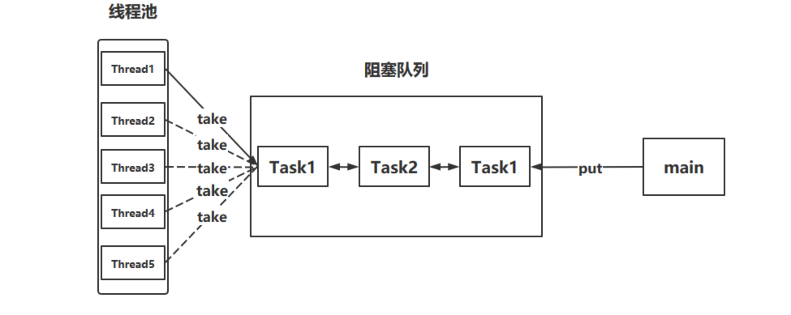

 


[TOC]

# 一、线程概念

## 进程 

进程是程序的一次执行过程，是系统运行程序的基本单位，因此进程是动态的。系统运行一个程序即是一个进程从创建，运行到消亡的过程。

## 线程 

- 线程与进程相似，但线程是一个比进程更小的执行单位。
- 一个进程在其执行的过程中可以产生多个线程。
- 与进程不同的是同类的多个线程共享进程的**堆**和**方法区**资源，但每个线程有自己的**程序计数器**、**虚拟机栈**和**本地方法栈**，所以系统在产生一个线程，或是在各个线程之间做切换工作时，负担要比进程小得多，也正因为如此，线程也被称为轻量级进程。

## 进程VS线程

进程是一个独立的运行环境，而线程是在进程中执行的一个任务。他们两个本质的区别是**是否单独占有内存地址空间及其它系统资源（比如I/O）**：

- 进程单独占有一定的内存地址空间，所以进程间存在内存隔离，数据是分开的，数据共享复杂但是同步简单，各个进程之间互不干扰；而线程共享所属进程占有的内存地址空间和资源，数据共享简单，但是同步复杂。（同步指的是避免竞争）
- 进程单独占有一定的内存地址空间，一个进程出现问题不会影响其他进程，不影响主程序的稳定性，可靠性高；一个线程崩溃可能影响整个程序的稳定性，可靠性较低。
- 进程单独占有一定的内存地址空间，进程的创建和销毁不仅需要保存寄存器和栈信息，还需要资源的分配回收以及页调度，开销较大；线程只需要保存寄存器和栈信息，开销较小。

另外一个重要区别是，**进程是操作系统进行资源分配的基本单位，而线程是操作系统进行调度的基本单位**，即CPU分配时间的单位 。

- 进程间通信较为复杂 

  - 同一台计算机的进程通信称为 IPC（Inter-process communication） 

  - 不同计算机之间的进程通信，需要通过网络，并遵守共同的协议，例如 HTTP 
- 线程通信相对简单，因为它们共享进程内的内存，一个例子是多个线程可以访问同一个共享变量 

##  Java 线程VS操作系统的线程

**JDK 1.2 之前，Java 线程是基于绿色线程（Green Threads）实现的，这是一种用户级线程（用户线程），**也就是说 JVM 自己模拟了多线程的运行，而不依赖于操作系统。**由于绿色线程和原生线程比起来在使用时有一些限制（比如绿色线程不能直接使用操作系统提供的功能如异步 I/O、只能在一个内核线程上运行无法利用多核）**，在 JDK 1.2 及以后，Java 线程改为基于原生线程（Native Threads）实现，也就是说 JVM 直接使用操作系统原生的内核级线程（内核线程）来实现 Java 线程，由操作系统内核进行线程的调度和管理。

我们上面提到了用户线程和内核线程，考虑到很多读者不太了解二者的区别，这里简单介绍一下：

- 用户线程：由用户空间程序管理和调度的线程，运行在用户空间（专门给应用程序使用）。
- 内核线程：由操作系统内核管理和调度的线程，运行在内核空间（只有内核程序可以访问）。

顺便简单总结一下用户线程和内核线程的区别和特点：用户线程创建和切换成本低，但不可以利用多核。内核态线程，创建和切换成本高，可以利用多核。

一句话概括 Java 线程和操作系统线程的关系：**现在的 Java 线程的本质其实就是操作系统的线程**。

线程模型是用户线程和内核线程之间的关联方式，常见的线程模型有这三种：

1. 一对一（一个用户线程对应一个内核线程）
2. 多对一（多个用户线程映射到一个内核线程）
3. 多对多（多个用户线程映射到多个内核线程）

## 线程运行的原理

我们都知道 JVM 中由堆、栈、方法区所组成，其中栈内存是给谁用的呢？其实就是线程，每个线程启动后，虚拟 机就会为其分配一块栈内存。 

- 每个栈由多个栈帧（Frame）组成，对应着每次方法调用时所占用的内存 
- 每个线程只能有一个活动栈帧，对应着当前正在执行的那个方法 


## 线程上下文切换

线程在执行过程中会有自己的运行条件和状态（也称上下文),    状态包括程序计数器、虚拟机栈中每个栈帧的信息，如局部变量、操作数栈、返回地址等。当出现如下情况的时候，线程会从占用 CPU 状态中退出。这时候需要保存当前线程的上下文，留待线程下次占用 CPU 的时候恢复现场。并加载下一个将要占用 CPU 的线程上下文。这就是所谓的 **上下文切换**。

>- 线程的 cpu 时间片用完
>- 垃圾回收
>- 有更高优先级的线程需要运行
>- 线程自己调用了 sleep、yield、wait、join、park、synchronized、lock 等方法


当 Context Switch 发生时，需要由操作系统保存当前线程的状态，并恢复另一个线程的状态，Java 中对应的概念就是程序计数器（Program Counter Register），它的作用是记住下一条 jvm 指令的执行地址，是线程私有的 

- 状态包括程序计数器、虚拟机栈中每个栈帧的信息，如局部变量、操作数栈、返回地址等 
- 上下文切换是现代操作系统的基本功能，因其每次需要保存信息恢复信息，这将会占用 CPU，内存等系统资源进行处理，也就意味着效率会有一定损耗，如果频繁切换就会造成整体效率低下。


从main线程切换到T1线程，会保存main线程的状态

## 线程的生命周期

**从操作系统层面来描述：**

- 【初始状态】仅是在语言层面创建了线程对象，还未与操作系统线程关联（例如线程调用了start方法）
- 【可运行状态】（就绪状态）指该线程已经被创建（与操作系统线程关联），可以由 CPU 调度执行
- 【运行状态】指获取了 CPU 时间片运行中的状态
  - 当 CPU 时间片用完，会从【运行状态】转换至【可运行状态】，会导致线程的上下文切换
- 【阻塞状态】
  - 如果调用了阻塞 API，如 BIO 读写文件，这时该线程实际不会用到 CPU，会导致线程上下文切换，进入 【阻塞状态】
  - 等 BIO 操作完毕，会由操作系统唤醒阻塞的线程，转换至【可运行状态】
  - 与【可运行状态】的区别是，对【阻塞状态】的线程来说只要它们一直不唤醒，调度器就一直不会考虑调度它们
- 【终止状态】表示线程已经执行完毕，生命周期已经结束，不会再转换为其它状态

**从 Java API 层面来描述:**

- **NEW** 线程刚被创建，但是还没有调用 `start()` 方法
- **RUNNABLE** 当调用了 `start()` 方法之后，注意，Java API 层面的 RUNNABLE 状态涵盖了**操作系统层面**的 【就绪状态】、【运行状态】和【阻塞状态】（由于 BIO 导致的线程阻塞，在 Java 里无法区分，仍然认为 是就绪状态）
- **BLOCKED ， WAITING ， TIMED_WAITING** 都是 **Java API 层面**对【阻塞状态】的细分。
    - **BLOCKED**：当线程进入 `synchronized` 方法/块或者调用 `wait` 后（被 `notify`）重新进入 `synchronized` 方法/块，但是锁被其它线程占有，这个时候线程就会进入 **BLOCKED（阻塞）** 状态。
    - **WAITING**：当线程执行 `Object.wait()`、`LockSupport.park()`、`Thread.join()`方法之后，等待状态，表示该线程需要等待其他线程做出一些特定动作（通知或中断）。
    - **TIME_WAITING**：状态相当于在等待状态的基础上增加了超时限制，比如通过 `Thread.sleep（long millis）`方法或 `Object.wait（long millis）`或者`Thread.join(long millis)`方法可以将线程置于 TIMED_WAITING 状态。当超时时间结束后，线程将会返回到 RUNNABLE 状态。    
- **TERMINATED** 线程在执行完了 `run()`方法之后将会进入到 **TERMINATED（终止）** 状态。

## 线程的使用示例

Thread类与Runnable接口的比较

Java 就只有一种方式可以创建线程，那就是通过`new Thread().start()`创建。不管是哪种方式，最终还是依赖于`new Thread().start()`。

> [!info] Thread类与Runnable接口的比较
>
> - 由于Java“单继承，多实现”的特性，Runnable接口使用起来比Thread更灵活。
> - Runnable接口出现更符合面向对象，将线程单独进行对象的封装。
> - Runnable接口出现，降低了线程对象和线程任务的耦合性。
> - 如果使用线程时不需要使用Thread类的诸多方法，显然使用Runnable接口更为轻量。
> - 所以，我们通常优先使用“实现`Runnable`接口”这种方式来自定义线程类。

- 实现 `Runnable` 接口。

```java
public class MyRunnable implements Runnable {
    @Override
    public void run() {
        // ...
    }
}
public static void main(String[] args) {
    MyRunnable instance = new MyRunnable();
    Thread thread = new Thread(instance);
    thread.start();
}
```

- 实现 `Callable` 接口。

```java
public class MyCallable implements Callable<Integer> {
    public Integer call() {
        return 123;
    }
}
public static void main(String[] args) throws ExecutionException, InterruptedException {
    MyCallable mc = new MyCallable();
    FutureTask<Integer> ft = new FutureTask<>(mc);
    Thread thread = new Thread(ft);
    thread.start();
    System.out.println(ft.get());
}
```

- 继承 `Thread` 类。

```java
public class MyThread extends Thread {
    public void run() {
        // ...
    }
}
public static void main(String[] args) {
    MyThread mt = new MyThread();
    mt.start();
}

//或者
Thread t1 = new Thread("t1") {
    @Override
    // run 方法内实现了要执行的任务
    public void run() {
        log.debug("hello");
    }
};
t1.start();
```

## 常用方法


### start() 与 run()

```java
public static void main(String[] args) {
    Thread t1 = new Thread("t1") {
        @Override
        public void run() {
            log.debug(Thread.currentThread().getName());
            FileReader.read(Constants.MP4_FULL_PATH);
        }
    };
    
     //t1.run();
     t1.start();
  
    log.debug("do other things ...");
}
```

new 一个 `Thread`，线程进入了新建状态。调用 `start()`方法，会启动一个线程并使线程进入了就绪状态，当分配到时间片后就可以开始运行了。 `start()` 会执行线程的相应准备工作，然后自动执行 `run()` 方法的内容，这是真正的多线程工作。 但是，直接执行 `run()` 方法，会把 `run()` 方法当成一个 main 线程下的普通方法去执行，并不会在某个线程中执行它，所以这并不是多线程工作。

- **直接调用 run 是在主线程中执行了 run，没有启动新的线程** 
- **使用 start 是启动新的线程，通过新的线程间接执行 run 中的代码**

### sleep()与wait()

**为什么 wait() 方法不定义在 Thread 中？**

`wait()` 是让获得对象锁的线程实现等待，会自动释放当前线程占有的对象锁。每个对象（`Object`）都拥有对象锁，既然要释放当前线程占有的对象锁并让其进入 WAITING 状态，自然是要操作对应的对象（`Object`）而非当前的线程（`Thread`）。

类似的问题：**为什么 `sleep()` 方法定义在 `Thread` 中？**

因为 `sleep()` 是让当前线程暂停执行，不涉及到对象类，也不需要获得对象锁。

```java
//sleep
while(true) {
    try {
        Thread.sleep(50);
    } catch (InterruptedException e) {
        e.printStackTrace();
    }
}
//wait
synchronized(锁对象) {
    while(条件不满足) {
        try {
            锁对象.wait();
        } catch(InterruptedException e) {
            e.printStackTrace();
        }
    }
    // do sth...
}
```

- 二者都可以暂停线程的执行
- `sleep()`通常被用于暂停执行，不会释放锁。`wait()`方法通常用于线程间通信，会释放锁。
- `wait()` 方法被调用后，线程不会自动苏醒，需要别的线程调用同一个对象上的 `notify()` 或者 `notifyAll()` 方法。`sleep()` 方法执行完成后，线程会自动苏醒。或者可以使用 `wait(long timeout)`超时后线程会自动苏醒。
- 其它线程可以使用` interrupt` 方法打断正在睡眠的线程，这时 sleep 方法会抛出 `InterruptedException` 
- `wait()` 是让获得对象锁的线程实现等待，会自动释放当前线程占有的对象锁。每个对象（`Object`）都拥有对象锁，既然要释放当前线程占有的对象锁并让其进入 WAITING 状态，自然是要操作对应的对象（`Object`）而非当前的线程（`Thread`）。
-  `sleep()` 是让当前线程暂停执行，不涉及到对象类，也不需要获得对象锁。

### yield （让出当前线程）

调用 yield 会让当前线程从 **Running 进入 Runnable 就绪状态**（仍然有可能被执行），然后调度执行其它线程。

### join()

**在线程中调用另一个线程的 join() 方法，会将当前线程挂起，而不是忙等待，直到目标线程结束。**

对于以下代码，虽然 b 线程先启动，但是因为在 b 线程中调用了 a 线程的 join() 方法，b 线程会等待 a 线程结束才继续执行，因此最后能够保证 a 线程的输出先于 b 线程的输出。

```java
public class JoinExample {

    private class A extends Thread {
        @Override
        public void run() {
            System.out.println("A");
        }
    }

    private class B extends Thread {

        private A a;
        B(A a) {
            this.a = a;
        }
        @Override
        public void run() {
            try {
                a.join();
            } catch (InterruptedException e) {
                e.printStackTrace();
            }
            System.out.println("B");
        }
    }

    public void test() {
        A a = new A();
        B b = new B(a);
        b.start();
        a.start();
    }
}
public static void main(String[] args) {
    JoinExample example = new JoinExample();
    example.test();
}
```

### 守护线程Daemon

1. **后台运行**：守护线程通常用于执行一些后台任务，这些任务对JVM的运行不是必需的。
2. **生命周期**：守护线程是用来为用户线程服务的，当一个程序中的所有用户线程都结束之后，无论守护线程是否在工作都会跟随用户线程一起结束。
3. **创建方式**：可以通过调用`Thread`类的`setDaemon(true)`方法将一个线程设置为守护线程。

main() 属于非守护线程。

在线程启动之前使用 setDaemon() 方法可以将一个线程设置为守护线程。

在这个例子中，主线程会在5秒后退出，而守护线程会继续运行，直到JVM退出。如果主线程是唯一的非守护线程，那么JVM会在主线程退出后立即退出，守护线程也会随之停止。

守护线程的一个关键特点是它们不会阻止JVM的退出。如果所有的用户线程都已终止，即使守护线程还在运行，JVM也会自动关闭。这使得守护线程非常适合执行那些即使在应用程序关闭时也可以被中断的任务。

```java
public class DaemonThreadExample {
    public static void main(String[] args) {
        // 创建并启动一个守护线程
        Thread daemonThread = new Thread(() -> {
            while (true) {
                System.out.println("Daemon thread is running");
                try {
                    Thread.sleep(1000);
                } catch (InterruptedException e) {
                    e.printStackTrace();
                }
            }
        });
        daemonThread.setDaemon(true);
        daemonThread.start();

        // 主线程执行一些操作后退出
        try {
            Thread.sleep(5000);
        } catch (InterruptedException e) {
            e.printStackTrace();
        }
        System.out.println("Main thread is exiting");
    }
}
```

- 垃圾回收器线程就是一种守护线程 
- Tomcat 中的 Acceptor 和 Poller 线程都是守护线程，所以 Tomcat 接收到 shutdown 命令后，不会等待它们处理完当前请求 

> 守护线程在Java中有几个主要的用途，它们通常用于执行一些对用户不直接可见的后台任务。以下是一些守护线程的常见用途：
>
> 1. **垃圾回收**：JVM的垃圾回收线程是守护线程的一个典型例子。它们负责在后台监控对象的使用情况，并在适当的时候回收不再使用的对象，以释放内存。
> 2. **系统监控**：守护线程可以用来监控系统资源的使用情况，例如内存使用量、CPU使用率等，并将这些信息报告给系统管理员或用于自动调整系统配置。
> 3. **缓存管理**：在一些应用程序中，守护线程可能用于管理缓存，比如清理过期的缓存条目，或者在低负载时预先加载数据。
> 4. **日志记录**：守护线程可以用于处理日志记录任务，将应用程序的运行信息记录到日志文件中，而不影响主线程的性能。
> 5. **定时任务**：守护线程可以执行定时任务，比如定期检查文件系统，或者执行一些周期性的维护操作。
> 6. **资源清理**：在应用程序关闭时，守护线程可以用来执行一些清理工作，比如关闭打开的文件、网络连接等。
> 7. **异步处理**：守护线程可以用于执行一些不需要立即返回结果的异步任务，从而不阻塞主线程的执行。
> 8. **系统服务**：在一些服务型应用程序中，守护线程可以用于提供一些后台服务，比如处理网络请求、数据库操作等。
>
> 守护线程的一个关键特点是它们不会阻止JVM的退出。如果所有的用户线程都已终止，即使守护线程还在运行，JVM也会自动关闭。这使得守护线程非常适合执行那些即使在应用程序关闭时也可以被中断的任务。

## 三种让线程等待和唤醒的方法

- 使用`Object`中的`wait()`方法让线程1等待，线程2使用`Object`的`notify()`方法唤醒线程，结合`synchronized`；
- 底层调用的是操作系统的`wait()`

```java
public class ObjectWait {

    public static void main(String[] args) {
        Object o = new Object();
        Thread t = new Thread(new Runnable() {
            @Override
            public void run() {

                System.out.println("线程A被o.wait()阻塞前");
                synchronized(o){
                    try {
                        o.wait();
                    } catch (InterruptedException e) {
                        e.printStackTrace();
                    }
                }
                System.out.println("线程A被线程B o.notify()唤醒");
            }
        },"A");

        t.start();


        try {
            Thread.sleep(100);
        } catch (InterruptedException e) {
            e.printStackTrace();
        }

        new Thread(new Runnable() {
            @Override
            public void run() {
                System.out.println("线程B唤醒线程A");
                synchronized (o){
                    o.notify();
                }
            }
        },"B").start();
    }
}

```

- 线程1使用JUC包中的`Condition`的`await()`方法让线程等待，线程2使用`signal（）`方法唤醒线程；
- 底层调用的是`park`和`unpark`

```java
public class ConditionAwait {

    public static void main(String[] args) {

        Lock lock = new ReentrantLock();
        Condition condition = lock.newCondition();

        new Thread(new Runnable() {
            @Override
            public void run() {

                System.out.println("线程A被condition.await()阻塞前");

                try {
                    lock.lock();
                    condition.await();
                } catch (InterruptedException e) {
                    e.printStackTrace();
                }finally {
                    lock.unlock();
                }
                System.out.println("线程A被线程B condition.signl()唤醒");
            }
        }, "A").start();


        new Thread(new Runnable() {
            @Override
            public void run() {
                try {
                    lock.lock();
                    System.out.println("线程B中使用condition.signal()唤醒线程A");
                    condition.signal();
                }catch (Exception e){

                }finally {
                    lock.unlock();
                }
            }
        }, "B").start();

    }
}

结果：
线程A被condition.await()阻塞前
线程B中使用condition.signal()唤醒线程A
线程A被线程B condition.signl()唤醒
```

- `LockSupport`类可以阻塞当前线程以及唤醒指定被阻塞的线程；

```java
public class LockSupportDemo {

    public static void main(String[] args) {

        Thread t = new Thread(new Runnable() {
            @Override
            public void run() {

                System.out.println("线程A被LockSupport.park()阻塞");
                LockSupport.park();

                System.out.println("线程A被线程B LockSupport.unpark()唤醒");

            }
        },"A");

        t.start();
        
        new Thread(new Runnable() {
            @Override
            public void run() {
                System.out.println("线程B唤醒线程A");
                // 唤醒指定线程t，也就是A
                LockSupport.unpark(t);
            }
        },"B").start();
    }
}

结果：
线程A被LockSupport.park()阻塞
线程B唤醒线程A
线程A被线程B LockSupport.unpark()唤醒

```

## Park & Unpark

1. 与 Object 的 wait & notify 相比 

- wait，notify 和 notifyAll 必须配合 Object Monitor 一起使用，而 park，unpark 不必
- park & unpark 是以线程为单位来【阻塞】和【唤醒】线程，而 notify 只能随机唤醒一个等待线程，notifyAll是唤醒所有等待线程，就不那么【精确】 
- park & unpark 可以先 unpark，而 wait & notify 不能先 notify 

2. 原理

每个线程都有自己的一个(C代码实现的) Parker 对象，由三部分组成 `_counter` ， `_cond` 和`_mutex` 

打个比喻 

- 线程就像一个旅人，Parker 就像他随身携带的背包，条件变量就好比背包中的帐篷。_counter 就好比背包中的备用干粮（0 为耗尽，1 为充足） 

- 调用 park 就是要看需不需要停下来歇息 

  - 如果备用干粮耗尽，那么钻进帐篷歇息 

  - 如果备用干粮充足，那么不需停留，继续前进 

- 调用 unpark，就好比令干粮充足 

  - 如果这时线程还在帐篷，就唤醒让他继续前进 

  - 如果这时线程还在运行，那么下次他调用 park 时，仅是消耗掉备用干粮，不需停留,继续前进 

- 因为背包空间有限，多次调用 unpark 仅会补充一份备用干粮,也就是多次unpark后只会让紧跟着的一次park失效

- **先调用park 再调用unpark**
  - 当前线程调用 Unsafe.park() 方法 
    - 检查 _counter ，本情况为 0，这时，获得 _mutex 互斥锁 
    - 线程进入 _cond 条件变量阻塞 
    - 设置 _counter = 0
  - 调用 Unsafe.unpark(Thread_0) 方法，设置 _counter 为 1 
    - 唤醒 _cond 条件变量中的 Thread_0 
    - Thread_0 恢复运行 
    - 设置 _counter 为 0
- **先调用unpark 再调用park**
  - .调用 Unsafe.unpark(Thread_0) 方法，设置 _counter 为 1 
  - 当前线程调用 Unsafe.park() 方法 
  - 检查 _counter ，本情况为 1，这时线程无需阻塞，继续运行 
  - 设置 _counter 为 0 

# 二、多线程

## 并发和并行的区别

- 并发：同一时间段，多个任务都在执行(单位时间内不一定同时执行)，如单核的cpu下，多个线程是并发执行的。
- 并行：单位时间内，多个任务同时执行，比如多核CPU，多个cpu同时执行多个线程。

## 使用多线程的意义和带来的问题
- 可以大大提高系统整体的并发能力以及性能。
- 提高CPU的利用率。
- 带来内存泄漏，死锁，线程不安全等问题。

> -  单核 cpu 下，多线程不能实际提高程序运行效率，只是为了能够在不同的任务之间切换，不同线程轮流使用 cpu ，不至于一个线程总占用 cpu，别的线程没法干活 
> - 多核 cpu 可以并行跑多个线程，但能否提高程序运行效率还是要分情况的 
>
> - 有些任务，经过精心设计，将任务拆分，并行执行，当然可以提高程序的运行效率。但不是所有计算任 务都能拆分（参考后文的【阿姆达尔定律】） 
> - 也不是所有任务都需要拆分，任务的目的如果不同，谈拆分和效率没啥意义 
> - IO 操作不占用 cpu，只是我们一般拷贝文件使用的是【阻塞 IO】，这时相当于线程虽然不用 cpu，
>
> ​      但需要一 直等待 IO 结束，没能充分利用线程。所以才有后面的【非阻塞 IO】和【异步 IO】优化

## 如何理解线程安全和不安全？

线程安全和不安全是在多线程环境下对于同一份数据的访问是否能够保证其正确性和一致性的描述。

- 线程安全指的是在多线程环境下，对于同一份数据，不管有多少个线程同时访问，都能保证这份数据的正确性和一致性。
- 线程不安全则表示在多线程环境下，对于同一份数据，多个线程同时访问时可能会导致数据混乱、错误或者丢失。

## 线程死锁

### 线程死锁的四个条件

>多个线程同时被阻塞，他们中的一个或者全部在等待某个资源被释放，由于线程无限期的阻塞，因此程序不可能正常终止。
- **互斥条件**：互斥条件是指多个线程不能同时使⽤同⼀个资源。
- **持有并等待条件**：持有并等待条件是指，当线程 A 已经持有了资源 1，⼜想申请资源 2，⽽资源 2 已经被线程 C 持有了，所 以线程 A 就会处于等待状态，但是线程 A 在等待资源 2 的同时并不会释放⾃⼰已经持有的资源 1。
- **不可剥夺条件**：不可剥夺条件是指，当线程已经持有了资源 ，在⾃⼰使⽤完之前不能被其他线程获取，线程 B 如果也想使 ⽤此资源，则只能在线程 A 使⽤完并释放后才能获取。
- **环路等待条件**：环路等待条件指都是，在死锁发⽣的时候，两个线程获取资源的顺序构成了环形链。⽐如，线程 A 已经持有资源 2，⽽想请求资源 1， 线程 B 已经获取了资源 1，⽽想请求资源 2，这就形成 资源请求等待的环形图。

### 如何避免死锁？
- **破坏互斥条件**：这个没有办法实现；
- **破坏请求与保持条件**：一次性申请所有资源；
- **破坏不剥夺条件**：占用部分资源的线程进一步申请其他资源时，如果申请不到，可以主动释放它占有的资源。
- **破坏循环等待条件**：按序申请资源,释放资源则反序释放。

### 如何检测死锁？

使用`jmap`、`jstack`等命令查看 JVM 线程栈和堆内存的情况。如果有死锁，`jstack` 的输出中通常会有 `Found one Java-level deadlock:`的字样，后面会跟着死锁相关的线程信息。另外，实际项目中还可以搭配使用`top`、`df`、`free`等命令查看操作系统的基本情况，出现死锁可能会导致 CPU、内存等资源消耗过高。

采用 VisualVM、JConsole 等工具进行排查。

## 线程安全的三要素

1. **原子性：** 一个的操作或者多次操作，要么所有的操作都得到执行，要么都不执行。
2. **可见性:**  当一个变量对共享变量进行了修改，那么另外的线程都是立即可以看到修改后的最新值。
3. **有序性:** 代码执行的顺序是编写代码的顺序。

# 三、共享模型之管程

## 共享问题

**临界区 Critical Section** 

- 一个程序运行多个线程本身是没有问题的 
- 问题出在多个线程访问**共享资源** 

- 多个线程读**共享资源**其实也没有问题 
- 在多个线程对**共享资源**读写操作时发生指令交错，就会出现问题 

- 一段代码块内如果存在对**共享资源**的多线程读写操作，称这段代码块为**临界区** 

**竞态条件 Race Condition** 

多个线程在临界区内执行，由于代码的**执行序列不同**而导致结果无法预测，称之为发生了**竞态条件**

为了避免临界区的竞态条件发生，有多种手段可以达到目的。 

- 阻塞式的解决方案：synchronized，Lock 
- 非阻塞式的解决方案：原子变量 

## synchronized 关键字（原子性+可见性）

### 是什么？
- 用于解决多个线程之间访问资源的同步性，可以保证被它修饰的方法或者代码块在任意一个时刻只有一个线程执行。
- 在JDK的早期版本，symchronized是重量级锁，效率低下。

>**为什么效率低下？怎么解决？**
>
>- `synchronized`锁的实现依赖于底层的操作系统的`Mutex Lock`实现的。当一个线程试图获得一个已经被其他线程持有的锁时，操作系统会将该线程置于阻塞状态，直到锁被释放。这种阻塞和唤醒线程的操作通常涉及昂贵的上下文切换。
>- 由于`synchronized`锁涉及到操作系统层面的操作，因此在获得和释放锁时会有较大的性能开销。这种开销在高并发场景下尤为明显。
>- 为了在一定程度上减少获得锁和释放锁带来的性能消耗，在JDK6 之后引入了“偏向锁”和“轻量级锁”，所以总共有4种锁状态，级别由低到高依次为：无锁状态、偏向锁状态、轻量级锁状态、重量级锁状态。这几个状态会随着竞争情况逐渐升级。
### 怎么使用？
1. 修饰实例方法:作用于当前对象实例加锁，进入同步代码前要获得当前对象实例的锁.

```java
class Test{
    public synchronized void test() {

    }
}
等价于
class Test{
    public void test() {
        synchronized(this) {

        }
    }
}
```

1. 修饰静态方法：也就是给当前类加锁，会作用于类的所有对象实例，进入同步代码前要获得当前class的锁。

```java
synchronized static void method() {
    //业务代码
}

```

1. 修饰代码块：指定加锁对象，对给定对象/加锁。

- `synchronized(object)` 表示进入同步代码库前要获得 **给定对象的锁**。
- `synchronized(类.class)` 表示进入同步代码前要获得 **给定 Class 的锁**

>  构造方法不能使用 synchronized 关键字修饰。不过，可以在构造方法内部使用 synchronized 代码块。
>
>  另外，构造方法本身是线程安全的，但如果在构造方法中涉及到共享资源的操作，就需要采取适当的同步措施来保证整个构造过程的线程安全。
>
>  尽量不要使用 `synchronized(String a)` 因为 JVM 中，字符串常量池具有缓存功能。

### 底层原理

**原理之Monitor**

每个java对象都可以关联一个操作系统的monitor对象，如果使用sychronized给对象上锁(重量级)之后，该对象头的mark word中就被设置指向monitor对象的指针。


- 当线程执行到临界区代码时，如果使用了synchronized，会先查询synchronized中所指定的对象(obj)**是否绑定了Monitor**。
  - 如果**没有绑定**，则会先去与Monitor绑定，也就是将对象头中的**Mark Word**置为Monitor指针，并且将Owner设为当前线程。
  - 如果**已经绑定**，则会去查询该Monitor是否已经有了Owner.
    - 如果没有，则Owner与将当前线程绑定
    - 如果有，则放入EntryList，进入阻塞状态(blocked)
- 当Monitor的Owner将临界区中代码执行完毕后，Owner便会被清空，此时EntryList中处于**阻塞**状态的线程会被**叫醒并竞争**，此时的竞争是**非公平的**.

> - 每个对象都会绑定一个**唯一的Monitor**，如果synchronized中所指定的对象(obj)**不同**，则会绑定**不同**的Monitor

**同步代码块**

- **`Synchronzed`同步语句块的实现使用的是**`monitorenter`**和**`monitorexit`**指令，其中`monitorenter`指令指向同步代码块开始位置，`monitorexit`指令指明同步代码块的结束位置。**
- 当执行`monitorenter`指令时，线程试图获取锁也就是获取对象监视器`monitor`的持有权。
- 在执行`monitorenter`时，会尝试获取对象的锁，如果锁的计数器为0表示锁可以被获取，获取后将锁计数器设为1也就是加1.
- 在执行`monitorexit`指令后，将锁计数器设为0，表示锁被释放，如果获取对象锁失败，那当前线程就要阻塞等待，直到锁被另外一个线程释放为止。

**修饰方法**

`synchronized`修饰方法并没有用`monitorenter`和`monitorexit`指令，**取而代之的是`ACC_SYNCHRONIZED`标识，该标识指明了该方法是一个同步方法。**JVM通过该`ACC_SYNCHRONIZED`访问标识来辨别一个方法是否声明为同步方法，从而执行相应的调用。

**总结**

二者有所不同，但是二者的本质都是对对象监视器`monitor`的获取。

### 实现重入

每个锁关联一个线程持有者和一个计数器，当计数器为0 时表示该锁没有被任何线程持有，那么任何线程都可以获得该锁而调用相应方法。当一个线程请求成功后，JVM会几下持有锁的线程，并将计数器计为1。此时其他线程请求该锁，则必须等待，而持有该所的线程如果再次请求这个锁，就可以再次拿到这个锁，同时计数器会递增。当线程退出一个synchronized方法时，计数器会递减，如果计数器为0则释放该锁。

### 锁升级过程

无锁——>偏向锁——>轻量级锁——>重量级锁

**java对象的布局**


- 对象头：当一个线程尝试访问sychronzied修饰的代码块时，它首先要获得锁，这个锁时存在锁的对象头中。
- 实例数据：类中定义的成员变量。
- 对齐填充：不是必须的，仅仅起着占位符的作用。

64位虚拟机的mark word:


**偏向锁**

> 在大多数情况下，锁不仅不存在多线程竞争，而且总是由同一线程多次获得和释放，为了让线程获取锁的代价更低，引进偏向锁。

- 这个锁会偏向于第一个获得它的线程，会在对象头存储锁偏向的线程ID,以后线程进入和退出同步块时只需要检查是否为偏向锁，锁标志位以及ThreadID即可。
- 一旦出现多个线程竞争时必须撤销偏向锁，所以撤销偏向锁的性能必须小于之前节省下来的CAS原子操作的性能消耗，不然就得不偿失了。

**原理**

当线程第一次访问同步块并获取锁时，偏向锁处理流程如下：

- 虚拟机会把对象头中的标志位设置为’01‘；
- 同时使用CAS操作把获取到这个锁的线程ID记录到对象的Mark Word中，如果CAS操作成功，持有偏向锁的线程以后每次进入这个锁相关的同步块时，虚拟机都可以不再进行任何操作，偏向锁的效率高。

- 第二个线程尝试进入同一个同步块时，JVM会检测到对象头中的线程ID不是当前线程的ID，这意味着存在竞争。
  - JVM会检查当前持有偏向锁的线程是否还存活。如果该线程已经终止，JVM可以直接撤销偏向状态。
  - 如果该线程仍然存活，JVM会尝试将锁升级到轻量级锁状态。这涉及到将锁对象的Mark Word替换为指向轻量级锁记录的指针。

**偏向锁的撤销**

1. 撤销动作必须等待全局安全点(所有线程都会停下来)。
2. 暂停拥有偏向锁的线程，判断锁对象是否处于被锁定状态。
3. 撤销偏向锁，恢复到无锁(标志位为01)或者轻量级锁(标志位为00)的状态。

**偏向锁的好处**

- **偏向锁时在只有一个线程执行同步块时进一步提高性能**，适合用于一个线程反复获得同一个锁的情况，偏向锁可以提高带有同步但是无竞争的程序性能。
- 但是它不一定是对程序运行有利，**如果程序中的大多数锁总是被多个不同的线程访问，比如线程池，那偏向锁模式是多余的。**

**轻量级锁**

> 引入轻量级锁的目的：在**多线程交替执行同步块**的情况下，尽量避免重量级锁引起的性能的消耗，但是如果多个线程在同一时刻进入临界区，会导致轻量级锁膨胀升级为重量级锁，所以轻量级锁的出现并不是为了替代重量级锁。

**原理**

> 将对象的Mark Word复制到栈帧中的Lock Record中，Mark Word更新为指向Lock Record的指针。
>
> 轻量级锁是在当前线程的栈帧中建立一个名为锁记录（Lock Record）的空间，尝试拷贝锁对象头的Markword到栈帧的Lock Record，若拷贝成功，JVM将使用CAS操作尝试将对象头的Markword更新为指向Lock Record的指针，并将Lock Record里的owner指针指向对象头的Markword。若拷贝失败,若当前只有一个等待线程，则可通过自旋继续尝试， 当自旋超过一定的次数，或者一个线程在持有锁，一个线程在自旋，又有第三个线程来访问时，轻量级锁就会膨胀为重量级锁。

当关闭偏向锁功能或者多个线程竞争偏向锁导致偏向锁升级为轻量级锁，则会尝试获取轻量级锁，步骤如下：

- 判断当前对象是否处于无锁状态(hashcode,0,01)，如果是，创建**锁记录**（Lock Record）对象，每个线程的栈帧都会包含一个锁记录对象，内部可以存储锁定对象的mark word（不再一开始就使用Monitor）。


- 让锁记录中的Object reference指向锁对象（Object），并尝试用cas去替换Object中的mark word，将此mark word放入lock record中保存.


- 如果cas替换成功，则将Object的对象头替换为**锁记录的地址**和**状态 00（轻量级锁状态）**，并由该线程给对象加锁.


- 如果失败则判断当前对象的Mark Word是否指向当前线程的栈帧.
  - 如果是则表示当前线程已经持有当前对象的锁，则进入sychronized锁重入，再加一条Lock Record作为重入的计数，但是此刻锁记录是null. 
  - 如果不是只能说明该锁对象已经被其他线程抢占了，这时候轻量级锁需要膨胀为重量级锁，锁标志位变为10，后面等待的线程将会进入阻塞状态。
- 当退出sychronized时，判断锁记录是否为null:
  - 如果锁记录为null，这时重置锁记录，表示重入计数减一。
  - 如果不为null,使用CAS将mark word恢复给对象头。
    - 如果CAS失败，这时会进入重量级锁流程，即按照monitor地址找到monitor对象，设置Owner为null，唤醒EntryList中额线程。

**轻量级锁的好处**

- 在多线程交替执行同步块的情况下，可以避免重量级锁引起的性能的消耗。
- 对于轻量级锁，其性能提升的依据是”对于绝大部分的锁，在整个生命周期是不会存在竞争的“，如果打破这个依据则出来互斥的开销外，还有额外的CAS操作，因此在有多线程竞争的情况下，轻量级锁比重量级锁更慢。

**重量级锁**

如果尝试加轻量级锁的过程中CAS失败，就需要膨胀为重量级锁。

monitor实现锁的时候，会阻塞和唤醒线程，线程的阻塞和唤醒需要CPU从用户态转为内核态，频繁的阻塞和唤醒CPU来说是一件负担很重的工作，这些操作给操作系统的并发带来了很大的压力。

**自旋锁**

**自旋锁加锁失败后，会一直忙等待，直到获取到锁。** 在「用户态」完成加锁和解锁操作，不会主动产生线程上下文切换，所以相比互斥锁来说，会快一些，开销也小一些。**适合用于被锁住的代码运行时间很短的场景。**

**适应性自旋锁**

JDK6中引入，自适应意味着自旋的时间不再固定，而是由前一次在同一个锁上的自旋时间及锁的拥有者状态来决定。

**锁消除**

锁消除的主要判断依据是来源于逃逸分析的数据支持，如果判断一段代码中，堆上的所有数据都不会逃逸出去而被其他线程访问到，那么就可以把它们当作栈上的数据对待，认为它们是线程私有的，同步加锁就无需进行。

**锁粗化**

JVM会探测到一连串细小的操作都使用同一个对象加锁，将同步代码块的范围放大，放到这串操作的外面，这样只需要加一次锁就可以了。(如for循环里的操作都对同一个对象加锁，这时候只要在for循环外面加一次锁就可以了)

- `obj.wait()` 让进入 object 监视器的线程到 waitSet 等待 
- `obj.notify()` 在 object 上正在 waitSet 等待的线程中挑一个唤醒 
- `obj.notifyAll()` 让 object 上正在 waitSet 等待的线程全部唤醒

# 四、lock锁

## 是什么？

- lock锁是一个接口, JDK级别的锁
- 只可以锁代码块
- 轻量级锁，性能高，尤其使竞争资源非常激烈时。
- 需要主动释放锁
## ReentrantLock

### 简介

`ReentrantLock` 实现了 `Lock` 接口，是一个可重入且独占式的锁，和 `synchronized` 关键字类似。不过，`ReentrantLock` 更灵活、更强大，增加了轮询、超时、中断、公平锁和非公平锁等高级功能。

`ReentrantLock` 里面有一个内部类 `Sync`，`Sync` 继承 AQS（`AbstractQueuedSynchronizer`），添加锁和释放锁的大部分操作实际上都是在 `Sync` 中实现的。`Sync` 有公平锁 `FairSync` 和非公平锁 `NonfairSync` 两个子类。

- 可重入锁，可以被单个线程多次获取。
  - 可重入是指同一个线程如果首次获得了这把锁，那么因为它是这把锁的拥有者，因此有权利再次获取这把锁
  - 如果是不可重入锁，那么第二次获得锁时，自己也会被锁挡住。
- 分为公平锁和非公平锁：在公平锁机制下，线程依次排队，而非公平锁在锁是可获取状态时，不管自己是不是在队列的开头都会获取锁。 
- 独占锁
- 锁超时
  - 使用**lock.tryLock**方法会返回获取锁是否成功。如果成功则返回true，反之则返回false。
  - 并且tryLock方法可以**指定等待时间**，参数为：tryLock(long timeout, TimeUnit unit), 其中timeout为最长等待时间，TimeUnit为时间单位。
- 用于解决死锁问题

### 使用

```java
ReentrantLock lock = new ReentrantLock();

Thread t1 = new Thread(() -> {
    log.debug("启动...");
    
    try {
        if (!lock.tryLock(1, TimeUnit.SECONDS)) {
            log.debug("获取等待 1s 后失败，返回");
            return;
        }
    } catch (InterruptedException e) {
        e.printStackTrace();
    }
    try {
        log.debug("获得了锁");
    } finally {
        lock.unlock();
    }
}, "t1");

lock.lock();
log.debug("获得了锁");
t1.start();

try {
    sleep(2);
} finally {
    lock.unlock();
}
```

### 使用 tryLock 解决哲学家就餐问题

```java
class Chopstick extends ReentrantLock {
    String name;
    
    public Chopstick(String name) {
        this.name = name;
    }
    
    @Override
    public String toString() {
        return "筷子{" + name + '}';
    }
}
```

```java
class Philosopher extends Thread {
    
    Chopstick left;
    Chopstick right;
    
    public Philosopher(String name, Chopstick left, Chopstick right) {
        super(name);
        this.left = left;
        this.right = right;
    }
    
    @Override
    public void run() {
        while (true) {
            // 尝试获得左手筷子
            if (left.tryLock()) {
                try {
                    // 尝试获得右手筷子
                    if (right.tryLock()) {
                        try {
                            eat();
                        } finally {
                            right.unlock();
                        }
                    }
                } finally {
                    left.unlock();
                }
            }
        }
    }
    
    private void eat() {
        log.debug("eating...");
        Sleeper.sleep(1);
    }
    
}
```

## 3.3 ReadWriteLock锁
- `ReadWriteLock`是一个接口，`ReentrantReadWriteLock`是它的实现类;
- `WriteLock`(写锁)独占锁,`ReadLock`(读锁)共享锁。

## 3.4 synchronized VS ReentrantLock

1. 两者都是可重入锁。
2. `synhronized`依赖于`JVM`,而`ReentrantLock`依赖于`API`，AQS。
3. 等待可中断：`ReentrantLock`提供了一个能够中断等待锁的线程的机制。也就是说正在等待的线程可以选择放弃等待，改为处理其他事情。
4. 可实现公平锁：`ReentrantLock`可以指定是公平锁还是非公平锁，而`synchronized`只能是非公平锁。
5. 可实现选择性通知：`synchronized`关键字与`wait()`和`notify()/notifyAll()`方法相结合可以实现等待/通知机制。`ReentrantLock`类借助`Condition`接口与`newCondition()`方法有选择性的进行线程通知。

# 五、volatile关键字（可见性&有序性）
>- 在当前的 Java 内存模型下，线程可以把变量保存本地内存（比如机器的寄存器）中，而不是直接在主存中进行读写。这就可能造成一个线程在主存中修改了一个变量的值，而另外一个线程还继续使用它在寄存器中的变量值的拷贝，造成数据的不一致。
>  要解决这个问题，就需要把变量声明为**volatile**，这就指示 JVM，这个变量是共享且不稳定的，每次使用它都到主存中进行读取。
>
>- 为了提升执行速度/性能，计算机在执行程序代码的时候，会对指令进行重排序。
>
>  - **编译器优化重排**：编译器（包括 JVM、JIT 编译器等）在不改变单线程程序语义的前提下，重新安排语句的执行顺序。
>
>    **指令并行重排**：现代处理器采用了指令级并行技术(Instruction-Level Parallelism，ILP)来将多条指令重叠执行。如果不存在数据依赖性，处理器可以改变语句对应机器指令的执行顺序。
>
>- Java 源代码会经历 **编译器优化重排 —> 指令并行重排 —> 内存系统重排** 的过程，最终才变成操作系统可执行的指令序列。
>
>- **指令重排序可以保证串行语义一致，但是没有义务保证多线程间的语义也一致** ，所以在多线程下，指令重排序可能会导致一些问题。
## 4.1 要点 
- 使用volatile修饰的变量，可以保证在多个线程之间的**可见性**，并且**避免指令重排。**
- **用来确保将变量的更新操作通知到其他线程。**
- **volatile+CAS可以实现线程安全。**

## 4.2 Java内存模型

> 什么是java内存模型
>
>> - 可以将JMM 看作是 Java 定义的并发编程相关的一组规范，除了抽象了线程和主内存之间的关系之外，其还规定了从 Java 源代码到 CPU 可执行指令的这个转化过程要遵守哪些和并发相关的原则和规范，其主要目的是为了简化多线程编程，增强程序可移植性的。
>> - **为什么要遵守这些并发相关的原则和规范呢？** 这是因为并发编程下，像 CPU 多级缓存和指令重排这类设计可能会导致程序运行出现一些问题。就比如说我们上面提到的指令重排序就可能会让多线程程序的执行出现问题，为此，JMM 抽象了 happens-before 原则（后文会详细介绍到）来解决这个指令重排序问题。
>> - **Java 内存模型（JMM）** 抽象了线程和主内存之间的关系，就比如说线程之间的共享变量必须存储在主内存中。
>> 	- **主内存**：所有线程创建的实例对象都存放在主内存中，不管该实例对象是成员变量，还是局部变量，类信息、常量、静态变量都是放在主内存中。为了获取更好的运行速度，虚拟机及硬件系统可能会让工作内存优先存储于寄存器和高速缓存中。
>> 	- **本地内存**：每个线程都有一个私有的本地内存，本地内存存储了该线程以读 / 写共享变量的副本。每个线程只能操作自己本地内存中的变量，无法直接访问其他线程的本地内存。如果线程间需要通信，必须通过主内存来进行。本地内存是 JMM 抽象出来的一个概念，并不真实存在，它涵盖了缓存、写缓冲区、寄存器以及其他的硬件和编译器优化。
>
>Java内存模型即Java Memory Model，简称JMM。JMM定义了一套多线程在读写共享数据时(成员变量，数组),对数据的可见性，有序性和原子性的规则和保障。JVM是整个计算机虚拟模型，所以JMM是隶属于JVM的。https://blog.csdn.net/suifeng3051/article/details/52611310


- **Java 内存模型（JMM）** 抽象了线程和主内存之间的关系，就比如说线程之间的共享变量必须存储在主内存中
- **什么是主内存？什么是本地内存？**
  - **主内存**：所有线程创建的实例对象都存放在主内存中，不管该实例对象是成员变量，还是局部变量，类信息、常量、静态变量都是放在主内存中。为了获取更好的运行速度，虚拟机及硬件系统可能会让工作内存优先存储于寄存器和高速缓存中。
  - **本地内存**：每个线程都有一个私有的本地内存，本地内存存储了该线程以读 / 写共享变量的副本。每个线程只能操作自己本地内存中的变量，无法直接访问其他线程的本地内存。如果线程间需要通信，必须通过主内存来进行。本地内存是 JMM 抽象出来的一个概念，并不真实存在，它涵盖了缓存、写缓冲区、寄存器以及其他的硬件和编译器优化。

## 4.3 synchronize VS volatile

- volatile 关键字是线程同步的轻量级实现，性能比synchronized关键字要好。
- volatile 关键字只能用于变量而 synchronized关键字可以修饰方法以及代码块。
- volatile关键字主要用于解决变量在多个线程之间的可见性，而 synchronized 关键字解决的是多个线程之间访问资源的同步性。
- volatile 关键字能保证数据的可见性，但不能保证数据的原子性。synchronized 关键字两者都能保证。
  - 当线程进入一个`synchronized`块时，它会首先从主内存中读取共享变量的最新值到自己的工作内存中。
  - 当线程执行完`synchronized`块并退出时，它会将自己的工作内存中的共享变量的值同步回主内存。


##  4.4 volatile原理

### 有序性

JVM会再不影响正确性的前提下，可以调整语句执行的顺序。

```java
static int i;
static int j;
//在某个线程内执行如下赋值操作
i=...
j=...
```

可以看到，无论先执行i还是先执行j，对最终的结果都不会造成影响。这种特性称为指令重排，多线程下指令重排会影响正确性。

**指令重排序优化**

- 事实上，现代处理器会设计为一个时钟周期完成一条执行时间长的 CPU 指令。为什么这么做呢？可以想到指令还可以再划分成一个个更小的阶段，例如，每条指令都可以分为： **取指令 - 指令译码 - 执行指令 - 内存访问 - 数据写回** 这5 个阶段


- 在不改变程序结果的前提下，这些指令的各个阶段可以通过**重排序**和**组合**来实现**指令级并行**
- 指令重排的前提是，重排指令**不能影响结果**，例如

```java
// 可以重排的例子 
int a = 10; 
int b = 20; 
System.out.println( a + b );

// 不能重排的例子 
int a = 10;
int b = a - 5;
```

**支持流水线的处理器**

现代 CPU 支持多级**指令流水线**，例如支持**同时**执行 **取指令 - 指令译码 - 执行指令 - 内存访问 - 数据写回** 的处理器，就可以称之为五级指令流水线。这时 CPU 可以在一个时钟周期内，同时运行五条指令的不同阶段（相当于一 条执行时间长的复杂指令），IPC = 1，本质上，流水线技术并不能缩短单条指令的执行时间，但它变相地提高了指令地**吞吐率**。


**在多线程环境下，指令重排序可能导致出现意料之外的结果**

比如：

```java
//线程1执行此方法
public void actor2(I_Result r){
 
    
    num = 2;
    ready = true;//ready是volatile赋值带写屏障
    //写屏障：ready num都会同步到主存中，num不会排在写屏障之后
}
//线程2执行此方法
public void actor1(I_Result r){
    //读屏障
    //ready是volatile读取值带屏障：在该屏障之后，对共享变量的读取，加载的是主存中最新数据
    if(ready){
        r.r1 = num + num;
    }else{
        
        r.r1 = 1;
    }
   
}

//线程1的代码发生了指令重排，先执行后面的，再执行前面的，那么ready = true  这时候线程2执行了r.r1 = num + num; num = 0,这时候就为0了

```

**解决办法**

**volatile** 修饰的变量，可以**禁用**指令重排

- 禁止的是加volatile关键字变量之前的代码被重排序

**内存屏障**

- 可见性
  - 写屏障：**volatile** 修饰的变量后面会有一个写屏障，保证在写屏障之前，对共享变量的改动，都同步到主存当中。
  - 读屏障：**volatile** 修饰的变量前面会有一个读屏障，保证在该屏障之后，对共享变量的读取，加载的是主存中最新数据。
- 有序性
  - 写屏障会确保指令重排序时，不会将写屏障之前的代码排在写屏障之后。
  - 读屏障会确保指令重排序时，不会将读屏障之后的代码排在读屏障之前。

```java
public void actor2(I_Result r){
    
    num = 2;
    ready = true;//ready是volatile赋值带写屏障
    //写屏障：ready num都会同步到主存中
}

public void actor1(I_Result r){
    //读屏障
    //ready是volatile读取值带屏障：在该屏障之后，对共享变量的读取，加载的是主存中最新数据
    if(ready){
        r.r1 = num + num;
    }else{
        
        r.r1 = 1;
    }
   
}
```

# 六、ThreadLocal

- ThreadLocal类主要解决的就是让每个线程绑定自己的私有数据。
- 如果创建了一个ThreadLocal变量，那么访问这个变量的每个线程都会有这个变量的本地副本，当多线程操作这个变量时，实际操作的是自己本地内存里面的变量。

## ThreadLocal与sychronized的对比

|        | sychronized                                                  | ThreadLocal                                                  |
| ------ | ------------------------------------------------------------ | ------------------------------------------------------------ |
| 原理   | 同步机制采用以时间换空间的方式，只提供一份变量让不同的线程排队访问 | 采用以空间换时间的方式，为每一个线程都提供一份变量的副本，从而实现同步访问而不相互干扰 |
| 侧重点 | 多个线程之间访问资源的同步                                   | 多个线程让每个线程之间的数据相互隔离                         |

## 数据结构


- Thread类有一个类型为ThreadLocal.ThreadLocalMap的实例变量threadLocals，也就是说每一个线程都有一个自己的ThreadLocalMap。
- ThreadLocal有自己独立的实现，其中key为ThreadLocal的一个弱引用，value为变量值。
- 每个线程在往`ThreadLocal`里放值的时候，都会往自己的`ThreadLocalMap`里存，读也是以`ThreadLocal`作为引用，在自己的`map`里找对应的`key`，从而实现了**线程隔离**。
- `ThreadLocalMap`有点类似`HashMap`的结构，只是`HashMap`是由**数组+链表**实现的，而`ThreadLocalMap`中并没有**链表**结构。
- 我们还要注意`Entry`， 它的`key`是`ThreadLocal<?> k` ，继承自`WeakReference`， 也就是我们常说的弱引用类型。

## `ThreadLocal`的key的**弱引用**与内存泄漏


- 弱引用可能造成内存泄漏
  - 假设使用完threadLocal，threadLocal ref被回收了
  - 由于thredLocalMap只持有ThreadLocal的弱引用，所以threadLocal就可以被gc回收了，此时entry中的key=null
  - 由于没有手动删除entry数组以及currentThread依然运行，这样还存在强引用链currenthread ref----->tthread--->threadLocalMap---->entry--->value，value不会被回收，而这块value就永远不会被访问到就可能造成内存泄漏。
- 就算是强引用也会造成内存泄漏的，所以弱引用不是造成内存泄漏的根本原因。
  - 根本原因是threadLocalMap的生命周期和thread一样长，如果没有手动删除对应的key就会导致内存泄漏。
- 为什么要弱引用
  - ThreadlocalMap是和线程绑定在一起的，如果这样线程没有被销毁，而我们又已经不会再某个threadlocal引用，那么key-value的键值对就会一直在map中存在，这对于程序来说，就出现了**内存泄漏**。为了避免这种情况，只要将key设置为弱引用，那么当发生GC的时候，就会自动将弱引用给清理掉，也就是说：假如某个用户A执行方法时产生了一份threadlocalA，然后在很长一段时间都用不到threadlocalA时，作为弱引用，它会在下次[垃圾回收](https://so.csdn.net/so/search?q=垃圾回收&spm=1001.2101.3001.7020)时被清理掉。
  - 而且ThreadLocalMap在内部的**set，get和扩容时都会清理掉泄漏的Entry**，[内存泄漏](https://so.csdn.net/so/search?q=内存泄漏&spm=1001.2101.3001.7020)完全没必要过于担心。

- value为什么不设置成弱引用？
  - value本身没有被引用，如果设置成弱引用就会被垃圾回收掉。


## ThreadLocal的实现过程

- **每个thread线程内部都有一个ThreadLocalMap**
- **map里面存储ThreadLocal对象（key）和线程的变量副本(value)**
- **Thread内部的Map是由ThreadLocal维护的，由ThreadLocal负责向map获取和设置线程的变量值。**
- **对于不同的线程，每次获取副本值时，别的线程并不能获取到当前线程的副本值，形成了副本隔离，互不干扰。**

> 这样设置的好处
>
> - 当Thread销毁的时候，ThreadLocalMap也随之销毁，减少内存的使用。
> - 每个map存储的entry只与threadLocal数量有关，一般小于线程数。

## ThreadLocal常用方法

```java
import java.text.SimpleDateFormat;
import java.util.Random;

public class ThreadLocalExample implements Runnable{

     // SimpleDateFormat 不是线程安全的，所以每个线程都要有自己独立的副本
    private static final ThreadLocal<SimpleDateFormat> formatter = ThreadLocal.withInitial(() -> new SimpleDateFormat("yyyyMMdd HHmm"));

    public static void main(String[] args) throws InterruptedException {
        ThreadLocalExample obj = new ThreadLocalExample();
        for(int i=0 ; i<10; i++){
            Thread t = new Thread(obj, ""+i);
            Thread.sleep(new Random().nextInt(1000));
            t.start();
        }
    }

    @Override
    public void run() {
        System.out.println("Thread Name= "+Thread.currentThread().getName()+" default Formatter = "+formatter.get().toPattern());
        try {
            Thread.sleep(new Random().nextInt(1000));
        } catch (InterruptedException e) {
            e.printStackTrace();
        }
        //formatter pattern is changed here by thread, but it won't reflect to other threads
        formatter.set(new SimpleDateFormat());

        System.out.println("Thread Name= "+Thread.currentThread().getName()+" formatter = "+formatter.get().toPattern());
    }

}


```

| 方法声明                 | 描述                       |
| ------------------------ | -------------------------- |
| ThreadLocal()            | 创建ThreadLocal对象        |
| public void set(T value) | 设置当前线程绑定的局部变量 |
| public T get()           | 获取当前线程绑定的局部变量 |
| public void remove()     | 移除当前线程绑定的局部变量 |

### 5.4.1 set(value)方法


- 首先获取当前线程，并根据当前线程获取一个map
- 如果获取的map不为空，则将参数设置到map中(当前ThreadLocal的一个弱引用引用作为key)
- 如果map为空，则给该线程创建map,并设置初始值。

### 5.4.2 get()方法

- 首先获取当前线程，根据当前线程获取一个map
- 如果获取的map不为空，则在map中以ThreadLocal的引用作为key来在map中获取对应的Entry e,如果为空转到最后一步；
- 如果e不为null，则返回e.value,否则转到最后一步
- map为空或者e为空，则通过initialValue函数获取初始值value，然后用threadlocal的引用和value作为firstKey和firstValue创建一个新的map.

### 5.4.3 remove()方法

- 首先获取当前线程，并根据当前线程获取一个map
- 如果获取的map不为空，则移除当前threadlocal对象对应的entry

## ThreadLocalMap

### ThreadLocalMap Hash算法

- `ThreadLocalMap`中`hash`算法很简单，这里`i`就是当前key在散列表中对应的数组下标位置。

```java
int i = key.threadLocalHashCode & (len-1);
```

- 这里最关键的就是`threadLocalHashCode`值的计算，`ThreadLocal`中有一个属性为`HASH_INCREMENT = 0x61c88647`,每当创建一个`ThreadLocal`对象，这个`ThreadLocal.nextHashCode` 这个值就会增长 `0x61c88647` 。这个值很特殊，它是**斐波那契数** 也叫 **黄金分割数**。`hash`增量为 这个数字，带来的好处就是 `hash` **分布非常均匀**。

### ThreadLocalMap Hash冲突

`HashMap`中解决冲突的方法是在数组上构造一个**链表**结构，冲突的数据挂载到链表上，如果链表长度超过一定数量则会转化成**红黑树**。

而`ThreadLocalMap`中并没有链表结构，所以这里不能适用`HashMap`解决冲突的方式了。

### ThreadLocalMap.set()方法

- **第一种情况**： **通过`hash`计算后的槽位对应的`Entry`数据为空，这里直接将数据放到该槽位即可，然后返回。**
- **第二种情况：** **槽位数据不为空，`key`值与当前`ThreadLocal`通过`hash`计算获取的`key`值一致，这里直接更新该槽位的数据，然后返回。**
- **第三种情况：** 槽位数据不为空，往后遍历过程中，在找到`Entry`为`null`的槽位之前，遇到`key`过期的`Entry`，执行`replaceStaleEntry()`方法(核心方法)，然后返回。`replaceStaleEntry()`方法如下：
  - 以当前的`key`过期的下标`staleSlot`开始，向前迭代查找，如果没有过期的数据，`for`循环一直碰到`Entry`为`null`才会结束。如果向前找到了过期数据，更新探测清理过期数据的开始下标为i，即`slotToExpunge=i.`
  - 接着开始从`staleSlot`向后查找，也是碰到`Entry`为`null`的桶结束。 如果迭代过程中，**碰到k == key**，这说明这里是替换逻辑，替换新数据并且交换当前`staleSlot`位置。如果`slotToExpunge == staleSlot`，这说明`replaceStaleEntry()`一开始向前查找过期数据时并未找到过期的`Entry`数据，接着向后查找过程中也未发现过期数据，修改开始探测式清理过期数据的下标为当前循环的index，即`slotToExpunge = i`。最后调用`cleanSomeSlots(expungeStaleEntry(slotToExpunge), len);`进行启发式过期数据清理，之后返回。
  - **如果k != key**则会接着往下走，`k == null`说明当前遍历的`Entry`是一个过期数据，`slotToExpunge == staleSlot`说明，一开始的向前查找数据并未找到过期的`Entry`。如果条件成立，则更新`slotToExpunge` 为当前位置，这个前提是前驱节点扫描时未发现过期数据。
  - 往后迭代的过程中如果没有找到`k == key`的数据，且碰到`Entry`为`null`的数据，则结束当前的迭代操作。此时说明这里是一个添加的逻辑，将新的数据添加到`table[staleSlot]` 对应的`slot`中。
  - 最后判断除了`staleSlot`以外，还发现了其他过期的`slot`数据，就要开启清理数据。
- **第四种情况：**如果以上三种情况都没有执行，则说明槽位数据不为空，往后遍历过程中，在找到`Entry`为`null`的槽位之前，没有遇到`key`过期的`Entry`。
  -  遍历散列数组，线性往后查找，如果找到`Entry`为`null`的槽位，则在`Entry`为`null`的桶中创建一个新的`Entry`对象， 之后执行`++size`操作。或者往后遍历过程中，遇到了**key值相等**的数据，直接更新即可。
  -  调用`cleanSomeSlots()`做一次启发式清理工作，清理散列数组中`Entry`的`key`过期的数据。
  -  如果清理工作完成后，未清理到任何数据，且`size`超过了阈值(数组长度的2/3)，进行`rehash()`操作。
  -  `rehash()`中会先进行一轮探测式清理，清理过期`key`，清理完成后如果**size >= threshold - threshold / 4**，就会执行真正的扩容逻辑(扩容逻辑往后看)

### ThreadLocalMap扩容机制

- 首先进行探测式清理工作，从`table`的起始位置往后清理。清理完成之后，`table`中可能有一些`key`为`null`的`Entry`数据被清理掉，所以此时通过判断`size >= threshold - threshold / 4` 也就是`size >= threshold* 3/4` 来决定是否扩容。
- 扩容后的`tab`的大小为`oldLen * 2`，然后遍历老的散列表，重新计算`hash`位置，然后放到新的`tab`数组中，如果出现`hash`冲突则往后寻找最近的`entry`为`null`的槽位，遍历完成之后，`oldTab`中所有的`entry`数据都已经放入到新的`tab`中了。重新计算`tab`下次扩容的**阈值**。

### ThreadLocalMap.get()方法

- **第一种情况：** 通过查找`key`值计算出散列表中`slot`位置，然后该`slot`位置中的`Entry.key`和查找的`key`一致，则直接返回.
- **第二种情况：** `slot`位置中的`Entry.key`和要查找的`key`不一致,这时候需要继续往后进行迭代查找，如果查找过程中遇到key的null的情况，会触发一次探测式数据回收操作，此时继续往后迭代，直到找到key相等的value值.

### ThreadLocalMap过期key的探测式清理流程

也就是`expungeStaleEntry`方法，遍历散列数组，从开始位置向后探测清理过期数据，将过期数据的`Entry`设置为`null`，沿途中碰到未过期的数据则将此数据`rehash`后重新在`table`数组中定位，如果定位的位置已经有了数据，则会将未过期的数据放到最靠近此位置的`Entry=null`的桶中，使`rehash`后的`Entry`数据距离正确的桶的位置更近一些。

###  ThreadLocalMap过期key的启发式清理流程

```java
private boolean cleanSomeSlots(int i, int n) {
    boolean removed = false;
    Entry[] tab = table;
    int len = tab.length;
    do {
        i = nextIndex(i, len);//i往后遍历
        Entry e = tab[i];
        if (e != null && e.get() == null) {//如果当前entry不为空但是key为空
            n = len;//重新设置n
            removed = true;
            i = expungeStaleEntry(i);//以当前位置开启探测式清理
        }
    } while ( (n >>>= 1) != 0);//n每次除以2,当为0的时候就退出循环
    return removed;
}

```

## InheritableThreadLocal

我们使用`ThreadLocal`的时候，在异步场景下是无法给子线程共享父线程中创建的线程副本数据的。

为了解决这个问题，JDK中还有一个`InheritableThreadLocal`类，实现原理是子线程是通过在父线程中通过调用`new Thread()`方法来创建子线程，`Thread#init`方法在`Thread`的构造方法中被调用。在`init`方法中拷贝父线程数据到子线程中.

# 七、线程池

## 什么是线程池

顾名思义，线程池就是管理一系列线程的资源池。当有任务要处理时，直接从线程池中获取线程来处理，处理完之后线程并不会立即被销毁，而是等待下一个任务。

## 为什么要用线程池

> JVM在hotSpot的线程模型下，java线程会一对一映射为内核线程，这意味着，在java每次创建以及回收线程都会去内核创建以及回收，这就有可能导致：创建和销毁线程锁花费的时间和资源可能处理的任务花费的时间和资源要更多，线程池的出现就是为了：

- **降低资源消耗**：通过重复利用已创建的线程降低线程创建和销毁造成的消耗；
- **提高响应速度**：当任务到达时，任务可以不需要等到线程创建就能立即执行。
- **提高线程的可管理性**。 线程是稀缺资源，如果无限制的创建，不仅会消耗系统资源，还会降低系统的稳定性，使用线程池可以进行统一的分配，调优和监控。

## 什么时候用线程池？

单个任务处理的时间很短而请求的数目却是巨大的。

## Executor框架（由三大部分组成）

Executor 框架是 Java5 之后引进的，在 Java 5 之后，通过 Executor 来启动线程比使用 Thread 的 start 方法更好，除了更易管理，效率更好（用线程池实现，节约开销）外，还有关键的一点：有助于避免 this 逃逸问题。

### 1）任务（Runnable/Callable）

执行任务需要实现的 **`Runnable` 接口** 或 **`Callable`接口**。**`Runnable` 接口**或  **`Callable` 接口** 实现类都可以被**`ThreadPoolExecutor`** 或 **`ScheduledThreadPoolExecutor`** 执行。

### 2) 任务的执行(`Executor`)

## 线程池的参数

```java
import java.util.Date;

/**
 * 这是一个简单的Runnable类，需要大约5秒钟来执行其任务。
 * @author shuang.kou
 */
public class MyRunnable implements Runnable {

    private String command;

    public MyRunnable(String s) {
        this.command = s;
    }

    @Override
    public void run() {
        System.out.println(Thread.currentThread().getName() + " Start. Time = " + new Date());
        processCommand();
        System.out.println(Thread.currentThread().getName() + " End. Time = " + new Date());
    }

    private void processCommand() {
        try {
            Thread.sleep(5000);
        } catch (InterruptedException e) {
            e.printStackTrace();
        }
    }

    @Override
    public String toString() {
        return this.command;
    }
}
```


```java
import java.util.concurrent.ArrayBlockingQueue;
import java.util.concurrent.ThreadPoolExecutor;
import java.util.concurrent.TimeUnit;

public class ThreadPoolExecutorDemo {

    private static final int CORE_POOL_SIZE = 5;
    private static final int MAX_POOL_SIZE = 10;
    private static final int QUEUE_CAPACITY = 100;
    private static final Long KEEP_ALIVE_TIME = 1L;
    public static void main(String[] args) {

        //使用阿里巴巴推荐的创建线程池的方式
        //通过ThreadPoolExecutor构造函数自定义参数创建
        ThreadPoolExecutor executor = new ThreadPoolExecutor(
                CORE_POOL_SIZE,
                MAX_POOL_SIZE,
                KEEP_ALIVE_TIME,
                TimeUnit.SECONDS,
                new ArrayBlockingQueue<>(QUEUE_CAPACITY),
                new ThreadPoolExecutor.CallerRunsPolicy());

        for (int i = 0; i < 10; i++) {
            //创建WorkerThread对象（WorkerThread类实现了Runnable 接口）
            Runnable worker = new MyRunnable("" + i);
            //执行Runnable
            executor.execute(worker);
        }
        //终止线程池
        executor.shutdown();
        while (!executor.isTerminated()) {
        }
        System.out.println("Finished all threads");
    }
}
```


使用ThreadPoolExecutor去创建线程池，最主要的目的是，使用ThreadPoolExecutor创建的线程可以更能了解线程运行的规则，避免资源耗尽的风险。

- **`corePoolSize` :** 核心线程数线程数定义了最小可以同时运行的线程数量。
- **`maximumPoolSize` :** 当队列中存放的任务达到队列容量的时候，当前可以同时运行的线程数量变为最大线程数。
- **`workQueue`:** 当新任务来的时候会先判断当前运行的线程数量是否达到核心线程数，如果达到的话，新任务就会被存放在队列中。
  - **LinkedBlockingQueue** : 链式阻塞队列，底层数据结构是链表，默认大小`Integer.MAX_VALUE`，也可指定大小。-
  
  - **ArrayBlockingQueue**： 数组阻塞队列，底层数据结构是数组，需要指定队列的大小。
  
  - **SynchronousQueue**：同步队列，内部容量为0，每个put操作必须等待一个take操作，反之亦然。
  
  - **DelayQueue**：延迟队列，该队列中的元素只有当其指定的延迟时间到了，才能够从队列中获取到该元素 。
  
- **`keepAliveTime`**:当线程池中的线程数量大于 `corePoolSize` 的时候，如果这时没有新的任务提交，核心线程外的线程不会立即销毁，而是会等待，直到等待的时间超过了 `keepAliveTime`才会被回收销毁；
- **`unit`** : `keepAliveTime` 参数的时间单位。
- **`threadFactory`** :executor 创建新线程的时候会用到。
- **`handler`** :饱和策略。关于饱和策略下面单独介绍一下。

## 线程池原理分析

- 提交任务后，先判断核心线程池是否已满，如果没有满就创建线程。
- 如果核心线程池满了，就判断等待队列是否满了，如果没有满就加入队列。
- 如果等待队列满了，就判断最大线程池是否已满，如果没满就创建临时线程。
- 如果临时线程也满了，就按照策略进行处理。
- 拒绝策略有四种
  - **`ThreadPoolExecutor.AbortPolicy`**：抛出 `RejectedExecutionException`来拒绝新任务的处理。(默认的策略)
  - **`ThreadPoolExecutor.DiscardPolicy`：** 不处理新任务，直接丢弃掉。
  - **`ThreadPoolExecutor.DiscardOldestPolicy`：** 此策略将丢弃最早的未处理的任务请求。
  - **`ThreadPoolExecutor.CallerRunsPolicy`**：调用执行自己的线程运行任务，也就是直接在调用`execute`方法的线程中运行(`run`)被拒绝的任务，如果执行程序已关闭，则会丢弃该任务。因此这种策略会降低对于新任务提交速度，影响程序的整体性能。如果您的应用程序可以承受此延迟并且你要求任何一个任务请求都要被执行的话，你可以选择这个策略。

## 三种常见的线程池

### FixedThreadPool

- 可重用固定线程数的线程池。
- 执行流程：
  - 如果当前运行的线程数小于corePoolSize时，如果再来新任务的话，，就创建新的线程来执行任务；
  - 当前运行的线程数等于corePoolSize后，如果再来新的任务，会将任务加入`LinkedBlockingQueue`队列中；
  - 线程池中的线程执行完手头的任务后，会在循环中反复从`LinkedBlockingQueue` 中获取任务来执行；
- 为什么不推荐使用？
  - **`FixedThreadPool` 使用无界队列 `LinkedBlockingQueue`（队列的容量为 Intger.MAX_VALUE）作为线程池的工作队列**
  - 运行中的 `FixedThreadPool`（未执行 `shutdown()`或 `shutdownNow()`）不会拒绝任务，在任务比较多的时候会导致 OOM（内存溢出）。

### SingleThreadPool

- 只有一个线程的线程池
- 执行流程：
  - 如果当前运行的线程数少于 corePoolSize，则会创建一个新的线程执行任务；
  - 当前线程池中有一个运行的线程后，将任务加入LinkedBlockingQueue队列中。
  - 线程执行完当前的任务后，会在循环中反复从`LinkedBlockingQueue` 中获取任务来执行；
- 为什么不推荐使用？
  - `SingleThreadExecutor` 使用无界队列 `LinkedBlockingQueue` 作为线程池的工作队列（队列的容量为 Intger.MAX_VALUE）。
  - 运行中的 SingleThreadPool不会拒绝任务，在任务比较多的时候会导致 OOM（内存溢出）。

### CachedTreadPool

- 根据需要创建新线程的线程池
- 执行流程：
  - **有空闲线程就交给空闲线程处理：**首先执行 `SynchronousQueue.offer(Runnable task)` 提交任务到任务队列。如果当前 `maximumPool` 中有闲线程正在执行 `SynchronousQueue.poll(keepAliveTime,TimeUnit.NANOSECONDS)`，那么主线程执行 offer 操作与空闲线程执行的 `poll` 操作配对成功，主线程把任务交给空闲线程执行，`execute()`方法执行完成，否则执行下面的步骤 2；
  - **没有空闲线程就创建新线程：**当初始 `maximumPool` 为空，或者 `maximumPool` 中没有空闲线程时，将没有线程执行 `SynchronousQueue.poll(keepAliveTime,TimeUnit.NANOSECONDS)`。这种情况下，步骤 1 将失败，此时 `CachedThreadPool` 会创建新线程执行任务，execute 方法执行完成；
- 为什么不推荐使用？
  - `CachedThreadPool`允许创建的线程数量为 Integer.MAX_VALUE ，可能会创建大量线程，从而导致 OOM。

## 几种常见的对比

##### 1. Runnable和Callable

`Runnable` 接口**不会返回结果或抛出检查异常，但是**`Callable` 接口**可以。所以，如果任务不需要返回结果或抛出异常推荐使用 `Runnable` 接口**，这样代码看起来会更加简洁。

##### 2. execute()和submit()

- **`execute()`方法用于提交不需要返回值的任务，所以无法判断任务是否被线程池执行成功与否；**
- **`submit()`方法用于提交需要返回值的任务。线程池会返回一个 `Future` 类型的对象，通过这个 `Future` 对象可以判断任务是否执行成功** ，并且可以通过 `Future` 的 `get()`方法来获取返回值，`get()`方法会阻塞当前线程直到任务完成，而使用 `get（long timeout，TimeUnit unit）`方法则会阻塞当前线程一段时间后立即返回，这时候有可能任务没有执行完。

##### `shutdown()`和`shutdownNow()`

- **`shutdown（）`** :关闭线程池，线程池的状态变为 `SHUTDOWN`。线程池不再接受新任务了，但是队列里的任务得执行完毕。
- **`shutdownNow（）`** :关闭线程池，线程的状态变为 `STOP`。线程池会终止当前正在运行的任务，并停止处理排队的任务并返回正在等待执行的 List。

##### `isTerminated()` 和 `isShutdown()`

- **`isShutDown`** 当调用 `shutdown()` 方法后返回为 true。
- **`isTerminated`** 当调用 `shutdown()` 方法后，并且所有提交的任务完成后返回为 true。

# 八、Future

### Future 类有什么用？

`Future` 类是异步思想的典型运用，主要用在一些需要执行耗时任务的场景，避免程序一直原地等待耗时任务执行完成，执行效率太低。具体来说是这样的：当我们执行某一耗时的任务时，可以将这个耗时任务交给一个子线程去异步执行，同时我们可以干点其他事情，不用傻傻等待耗时任务执行完成。等我们的事情干完后，我们再通过 `Future` 类获取到耗时任务的执行结果。这样一来，程序的执行效率就明显提高了。

这其实就是多线程中经典的 **Future 模式**，你可以将其看作是一种设计模式，核心思想是异步调用，主要用在多线程领域，并非 Java 语言独有。

在 Java 中，`Future` 类只是一个泛型接口，位于 `java.util.concurrent` 包下，其中定义了 5 个方法，主要包括下面这 4 个功能：

- 取消任务；
- 判断任务是否被取消;
- 判断任务是否已经执行完成;
- 获取任务执行结果。

```java
// V 代表了Future执行的任务返回值的类型
public interface Future<V> {
    // 取消任务执行
    // 成功取消返回 true，否则返回 false
    boolean cancel(boolean mayInterruptIfRunning);
    // 判断任务是否被取消
    boolean isCancelled();
    // 判断任务是否已经执行完成
    boolean isDone();
    // 获取任务执行结果
    V get() throws InterruptedException, ExecutionException;
    // 指定时间内没有返回计算结果就抛出 TimeOutException 异常
    V get(long timeout, TimeUnit unit)

        throws InterruptedException, ExecutionException, TimeoutExceptio

}

```

简单理解就是：我有一个任务，提交给了 `Future` 来处理。任务执行期间我自己可以去做任何想做的事情。并且，在这期间我还可以取消任务以及获取任务的执行状态。一段时间之后，我就可以 `Future` 那里直接取出任务执行结果。

### Callable 和 Future 有什么关系？

`FutureTask` 提供了 `Future` 接口的基本实现，常用来封装 `Callable` 和 `Runnable`，具有取消任务、查看任务是否执行完成以及获取任务执行结果的方法。`ExecutorService.submit()` 方法返回的其实就是 `Future` 的实现类 `FutureTask` 。

```java
<T> Future<T> submit(Callable<T> task);
Future<?> submit(Runnable task);

```

`FutureTask` 不光实现了 `Future`接口，还实现了`Runnable` 接口，因此可以作为任务直接被线程执行。

`FutureTask` 有两个构造函数，可传入 `Callable` 或者 `Runnable` 对象。实际上，传入 `Runnable` 对象也会在方法内部转换为`Callable`  对象。

```java
public FutureTask(Callable<V> callable) {
    if (callable == null)
        throw new NullPointerException();
    this.callable = callable;
    this.state = NEW;
}
public FutureTask(Runnable runnable, V result) {
    // 通过适配器RunnableAdapter来将Runnable对象runnable转换成Callable对象
    this.callable = Executors.callable(runnable, result);
    this.state = NEW;
}

```

`FutureTask`相当于对`Callable` 进行了封装，管理着任务执行的情况，存储了 `Callable` 的 `call` 方法的任务执行结果。

### CompletableFuture 类有什么用？

`Future` 在实际使用过程中存在一些局限性比如不支持异步任务的编排组合、获取计算结果的 `get()` 方法为阻塞调用。

Java 8 才被引入`CompletableFuture` 类可以解决`Future` 的这些缺陷。`CompletableFuture` 除了提供了更为好用和强大的 `Future` 特性之外，还提供了函数式编程、异步任务编排组合（可以将多个异步任务串联起来，组成一个完整的链式调用）等能力。


# 九、CAS与原子类

## CAS

CAS即Compare and Swap，它体现的是一个乐观锁的思想，比如说多个线程要对一个共享型的整形变量执行+1操作;

```java
//需要不断尝试
while(true){
    
    int 旧值=共享变量；
    int 结果=旧值+1；
    if(CompareandSwap(旧值，结果)){//将自己拿到的旧值和目前的共享变量进行比较判断是否相等
        
        //成功，退出循环
    }     
        
}
```

- 获取共享变量时，为了保证该变量的可见性，需要使用volatile修饰，结合CAS和volatile可以实现无锁并发，适合于竞争不激烈，多核CPU的场景下。
  - 因为没有使用sychronized，所以线程不会陷入阻塞，这是效率提高的因素之一
  - 但是如果竞争激烈，重试必然频繁发生，反而效率会受到影响。

## 原子类

根据操作的数据类型，可以将JUC包中的原子类分为4类。

### 原子整数

- AtomicInteger：整型原子类
- AtomicLong：长整型原子类
- AtomicBoolean ：布尔型原子类

```java
public final int get() //获取当前的值
public final int getAndSet(int newValue)//获取当前的值，并设置新的值
public final int getAndIncrement()//获取当前的值，并自增
public final int getAndDecrement() //获取当前的值，并自减
public final int getAndAdd(int delta) //获取当前的值，并加上预期的值
boolean compareAndSet(int expect, int update) //如果输入的数值等于预期值，则以原子方式将该值设置为输入值（update）
public final void lazySet(int newValue)//最终设置为newValue,使用 lazySet 设置之后可能导致其他线程在之后的一小段时间内还是可以读到旧的值。
```

AtomicInteger 类主要利用 CAS (compare and swap) + volatile 和 native 方法来保证原子操作，从而避免 synchronized 的高开销，执行效率大为提升。

常用方法

```java
AtomicInteger i = new AtomicInteger(0);
 
// 获取并自增（i = 0, 结果 i = 1, 返回 0），类似于 i++ 
System.out.println(i.getAndIncrement());
 
// 自增并获取（i = 1, 结果 i = 2, 返回 2），类似于 ++i 
System.out.println(i.incrementAndGet());
 
// 自减并获取（i = 2, 结果 i = 1, 返回 1），类似于 --i 
System.out.println(i.decrementAndGet());
 
// 获取并自减（i = 1, 结果 i = 0, 返回 1），类似于 i--
System.out.println(i.getAndDecrement());
 
// 获取并加值（i = 0, 结果 i = 5, 返回 0） 
System.out.println(i.getAndAdd(5));
 
// 加值并获取（i = 5, 结果 i = 0, 返回 0） 
System.out.println(i.addAndGet(-5));
 
// 获取并更新（i = 0, p 为 i 的当前值, 结果 i = -2, 返回 0） 
// 其中函数中的操作能保证原子，但函数需要无副作用 
System.out.println(i.getAndUpdate(p -> p - 2));
 
// 更新并获取（i = -2, p 为 i 的当前值, 结果 i = 0, 返回 0）
// 其中函数中的操作能保证原子，但函数需要无副作用 
System.out.println(i.updateAndGet(p -> p + 2));
 
// 获取并计算（i = 0, p 为 i 的当前值, x 为参数1, 结果 i = 10, 返回 0） 
// 其中函数中的操作能保证原子，但函数需要无副作用 // getAndUpdate 如果在 lambda 中引用了外部的局部变量，要保证该局部变量是 final 的 
// getAndAccumulate 可以通过 参数1 来引用外部的局部变量，但因为其不在 lambda 中因此不必是 
final System.out.println(i.getAndAccumulate(10, (p, x) -> p + x));
 
// 计算并获取（i = 10, p 为 i 的当前值, x 为参数1, 结果 i = 0, 返回 0） 
// 其中函数中的操作能保证原子，但函数需要无副作用
System.out.println(i.accumulateAndGet(-10, (p, x) -> p + x));
```

### 原子数组

- AtomicIntegerArray
- AtomicLongArray
- AtomicReferenceArray

```java
public final int get(int i) //获取 index=i 位置元素的值
public final int getAndSet(int i, int newValue)//返回 index=i 位置的当前的值，并将其设置为新值：newValue
public final int getAndIncrement(int i)//获取 index=i 位置元素的值，并让该位置的元素自增
public final int getAndDecrement(int i) //获取 index=i 位置元素的值，并让该位置的元素自减
public final int getAndAdd(int i, int delta) //获取 index=i 位置元素的值，并加上预期的值
boolean compareAndSet(int i, int expect, int update) //如果输入的数值等于预期值，则以原子方式将 index=i 位置的元素值设置为输入值（update）
public final void lazySet(int i, int newValue)//最终 将index=i 位置的元素设置为newValue,使用 lazySet 设置之后可能导致其他线程在之后的一小段时间内还是可以读到旧的值。
```

```java
import java.util.concurrent.atomic.AtomicIntegerArray;

public class AtomicIntegerArrayTest {

    public static void main(String[] args) {
        // TODO Auto-generated method stub
        int temvalue = 0;
        int[] nums = { 1, 2, 3, 4, 5, 6 };
        AtomicIntegerArray i = new AtomicIntegerArray(nums);
        for (int j = 0; j < nums.length; j++) {
            System.out.println(i.get(j));
        }
        temvalue = i.getAndSet(0, 2);
        System.out.println("temvalue:" + temvalue + ";  i:" + i);
        temvalue = i.getAndIncrement(0);
        System.out.println("temvalue:" + temvalue + ";  i:" + i);
        temvalue = i.getAndAdd(0, 5);
        System.out.println("temvalue:" + temvalue + ";  i:" + i);
    }

}
```

### 原子引用

要保护的不一定是基本数据类型，所以使用原子引用可以保护一些非基本数据类型。

- AtomicReference：引用类型原子类
- AtomicStampedReference：原子更新带有版本号的引用类型。该类将整数值与引用关联起来，可用于解决原子的更新数据和数据的版本号，可以解决使用 CAS 进行原子更新时可能出现的 ABA 问题。
- AtomicMarkableReference ：原子更新带有标记的引用类型。该类将 boolean 标记与引用关联起来。并不关心变量改了几次，但是可以知道变量有没有改。

> ABA问题，当Thread1线程拿到A数据去修改,这时Thread2线程把A数据修改为B,之后Thread3把B数据修改为A，当线程1修改完后，只看到A的数据一样，但是其实中间已经被修改过了。

### 原子更新器

如果需要原子更新某个类里的某个属性时，需要用到对象的属性修改类型原子类。

- AtomicIntegerFieldUpdater:原子更新整形字段的更新器
- AtomicLongFieldUpdater：原子更新长整形字段的更新器
- AtomicReferenceFieldUpdater ：原子更新引用类型里的字段的更新器

```java
import java.util.concurrent.atomic.AtomicIntegerFieldUpdater;

public class AtomicIntegerFieldUpdaterTest {
    public static void main(String[] args) {
        AtomicIntegerFieldUpdater<User> a = AtomicIntegerFieldUpdater.newUpdater(User.class, "age");
        //对user类中
        User user = new User("Java", 22);
        System.out.println(a.getAndIncrement(user));// 22
        System.out.println(a.get(user));// 23
    }
}

class User {
    private String name;
    public volatile int age;

    public User(String name, int age) {
        super();
        this.name = name;
        this.age = age;
    }

    public String getName() {
        return name;
    }

    public void setName(String name) {
        this.name = name;
    }

    public int getAge() {
        return age;
    }

    public void setAge(int age) {
        this.age = age;
    }

}
```


# 十、AQS

AQS 是一个用来构建锁和同步器的框架，使用 AQS 能简单且高效地构造出应用广泛的大量的同步器，比如我们提到的 `ReentrantLock`，`Semaphore`，其他的诸如 `ReentrantReadWriteLock`，`SynchronousQueue`，`FutureTask`(jdk1.7) 等等皆是基于 AQS 的。当然，我们自己也能利用 AQS 非常轻松容易地构造出符合我们自己需求的同步器。

## AQS原理

https://blog.csdn.net/u010445301/article/details/125590758

**AQS 核心思想是，如果被请求的共享资源空闲，则将当前请求资源的线程设置为有效的工作线程，并且将共享资源设置为锁定状态。如果被请求的共享资源被占用，那么就需要一套线程阻塞等待以及被唤醒时锁分配的机制，这个机制 AQS 是用 CLH 队列锁实现的，即将暂时获取不到锁的线程加入到队列中。**CLH：Craig、Landin and Hagersten队列，是单向链表，AQS中的队列是CLH变体的虚拟双向队列（FIFO），AQS是通过将每条请求共享资源的线程封装成一个节点来实现锁的分配。暂时获取不到锁的线程将被加入到该队列中。AQS 将每条请求共享资源的线程封装成一个 CLH 队列锁的一个结点（Node）来实现锁的分配。在 CLH 队列锁中，一个节点表示一个线程，它保存着线程的引用（thread）、 当前节点在队列中的状态（waitStatus）、前驱节点（prev）、后继节点（next）。

等待唤醒是通过park和unpark实现的。

- 获取资源：首先调用tryAcquire(arg)尝试去获取资源。前面提到了这个方法是在子类具体实现的。如果获取资源失败，就通过addWaiter(Node.EXCLUSIVE)方法把这个线程插入到等待队列中。 其中传入的参数代表要插入的Node是独占式的。由于AQS中会存在多个线程同时争夺资源的情况，因此肯定会出现多个线程同时插入节点的操作，在这里是通过CAS自旋的方式保证了操作的线程安全性。**结点进入等待队列后，是调用park使它进入阻塞状态的。只有头结点的线程是处于活跃状态的**。
- 如果后继节点不为空，就调用`LockSupport.unpark(s.thread);`唤醒线程


AQS 使用一个 int 成员变量来表示同步状态，通过内置的 FIFO 队列来完成获取资源线程的排队工作。AQS 使用 CAS 对该同步状态进行原子操作实现对其值的修改。

```java
private volatile int state;//共享变量，使用volatile修饰保证线程可见性
```

状态信息通过 protected 类型的`getState`，`setState`，`compareAndSetState`进行操作

```java
//返回同步状态的当前值
protected final int getState() {
        return state;
}
 // 设置同步状态的值
protected final void setState(int newState) {
        state = newState;
}
//原子地（CAS操作）将同步状态值设置为给定值update如果当前同步状态的值等于expect（期望值）
protected final boolean compareAndSetState(int expect, int update) {
        return unsafe.compareAndSwapInt(this, stateOffset, expect, update);
}
```

以可重入的互斥锁 `ReentrantLock` 为例，它的内部维护了一个 `state` 变量，用来表示锁的占用状态。`state` 的初始值为 0，表示锁处于未锁定状态。当线程 A 调用 `lock()` 方法时，会尝试通过 `tryAcquire()` 方法独占该锁，并让 `state` 的值加 1。如果成功了，那么线程 A 就获取到了锁。如果失败了，那么线程 A 就会被加入到一个等待队列（CLH 队列）中，直到其他线程释放该锁。假设线程 A 获取锁成功了，释放锁之前，A 线程自己是可以重复获取此锁的（`state` 会累加）。这就是可重入性的体现：一个线程可以多次获取同一个锁而不会被阻塞。但是，这也意味着，一个线程必须释放与获取的次数相同的锁，才能让 `state` 的值回到 0，也就是让锁恢复到未锁定状态。只有这样，其他等待的线程才能有机会获取该锁。

### AQS对资源的共享方式

**1)Exclusive**（独占）

只有一个线程能执行，如 `ReentrantLock`。又可分为公平锁和非公平锁，`ReentrantLock` 同时支持两种锁,下面以 `ReentrantLock` 对这两种锁的定义做介绍：

- 公平锁：按照线程在队列中的排队顺序，先到者先拿到锁
- 非公平锁：当线程要获取锁时，先通过两次 CAS 操作去抢锁，如果没抢到，当前线程再加入到队列中等待唤醒。

总结：公平锁和非公平锁只有两处不同：

1. 非公平锁在调用 lock 后，首先就会调用 CAS 进行一次抢锁，如果这个时候恰巧锁没有被占用，那么直接就获取到锁返回了。
2. 非公平锁在 CAS 失败后，和公平锁一样都会进入到 `tryAcquire` 方法，在 `tryAcquire` 方法中，如果发现锁这个时候被释放了（state == 0），非公平锁会直接 CAS 抢锁，但是公平锁会判断等待队列是否有线程处于等待状态，如果有则不去抢锁，乖乖排到后面。

公平锁和非公平锁就这两点区别，如果这两次 CAS 都不成功，那么后面非公平锁和公平锁是一样的，都要进入到阻塞队列等待唤醒。

相对来说，非公平锁会有更好的性能，因为它的吞吐量比较大。当然，非公平锁让获取锁的时间变得更加不确定，可能会导致在阻塞队列中的线程长期处于饥饿状态。

**2)Share**（共享）

多个线程可同时执行，如 `Semaphore/CountDownLatch`。`Semaphore`、`CountDownLatCh`、 `CyclicBarrier`、`ReadWriteLock` 我们都会在后面讲到。

`ReentrantReadWriteLock` 可以看成是组合式，因为 `ReentrantReadWriteLock` 也就是读写锁允许多个线程同时对某一资源进行读。

## Semaphore

**`Semaphore`(信号量)可以指定多个线程同时访问某个资源。**

```java
public class SemaphoreExample {

    public static void main(String[] args) {
        final int clientCount = 3;
        final int totalRequestCount = 10;
        Semaphore semaphore = new Semaphore(clientCount);//一次同时执行三个线程
        ExecutorService executorService = Executors.newCachedThreadPool();
        for (int i = 0; i < totalRequestCount; i++) {
            executorService.execute(()->{
                try {
                    semaphore.acquire();
                    System.out.print(semaphore.availablePermits() + " ");
                } catch (InterruptedException e) {
                    e.printStackTrace();
                } finally {
                    semaphore.release();
                }
            });
        }
        executorService.shutdown();
    }
}
```

## CountDownLatch （倒计时器）

`CountDownLatch` 允许 `count` 个线程阻塞在一个地方，直至所有线程的任务都执行完毕。

`CountDownLatch` 是共享锁的一种实现,它默认构造 AQS 的 `state` 值为 `count`。当线程使用 `countDown()` 方法时,其实使用了`tryReleaseShared`方法以 CAS 的操作来减少 `state`,直至 `state` 为 0 。当调用 `await()` 方法的时候，如果 `state` 不为 0，那就证明任务还没有执行完毕，`await()` 方法就会一直阻塞，也就是说 `await()` 方法之后的语句不会被执行。然后，`CountDownLatch` 会自旋 CAS 判断 `state == 0`，如果 `state == 0` 的话，就会释放所有等待的线程，`await()` 方法之后的语句得到执行。

```java
public class CountDownLatchExample1 {
    // 处理文件的数量
    private static final int threadCount = 6;

    public static void main(String[] args) throws InterruptedException {
        // 创建一个具有固定线程数量的线程池对象（推荐使用构造方法创建）
        ExecutorService threadPool = Executors.newFixedThreadPool(10);
        final CountDownLatch countDownLatch = new CountDownLatch(threadCount);
        for (int i = 0; i < threadCount; i++) {
            final int threadnum = i;
            threadPool.execute(() -> {
                try {
                    //处理文件的业务操作
                    //......
                } catch (InterruptedException e) {
                    e.printStackTrace();
                } finally {
                    //表示一个文件已经被完成
                    countDownLatch.countDown();
                }

            });
        }
        countDownLatch.await();
        threadPool.shutdown();
        System.out.println("finish");
    }
}

```

**两种用法**

1. 某一线程在开始运行前等待 n 个线程执行完毕。将 `CountDownLatch` 的计数器初始化为 n ：`new CountDownLatch(n)`，每当一个任务线程执行完毕，就将计数器减 1 `countdownlatch.countDown()`，当计数器的值变为 0 时，在`CountDownLatch上 await()` 的线程就会被唤醒。一个典型应用场景就是启动一个服务时，主线程需要等待多个组件加载完毕，之后再继续执行。
2. 实现多个线程开始执行任务的最大并行性。注意是并行性，不是并发，强调的是多个线程在某一时刻同时开始执行。类似于赛跑，将多个线程放到起点，等待发令枪响，然后同时开跑。做法是初始化一个共享的 `CountDownLatch` 对象，将其计数器初始化为 1 ：`new CountDownLatch(1)`，多个线程在开始执行任务前首先 `coundownlatch.await()`，当主线程调用 `countDown()` 时，计数器变为 0，多个线程同时被唤醒。

**不足**

`CountDownLatch` 是一次性的，计数器的值只能在构造方法中初始化一次，之后没有任何机制再次对其设置值，当 `CountDownLatch` 使用完毕后，它不能再次被使用。

## CyclicBarrier(循环栅栏)

**用来控制多个线程互相等待，只有当多个线程都到达时，这些线程才会继续执行。**

在CyclicBarrier类的内部有一个计数器，每个线程在到达屏障点的时候都会调用await()方法将自己阻塞，此时计数器会减1，当计数器减为0的时候所有因调用await方法而被阻塞的线程将被唤醒（使用`condition.signalAll`）。

- CyclicBarrier内部使用的是Lock + Condition实现的等待/通知模式。

CyclicBarrier 和 CountdownLatch 的一个区别是，CyclicBarrier 的计数器通过调用 reset() 方法可以循环使用，所以它才叫做循环屏障。

CyclicBarrier 有两个构造函数，其中 parties 指示计数器的初始值，barrierAction 在所有线程都到达屏障的时候会执行一次。

```java
public CyclicBarrier(int parties, Runnable barrierAction) {
    if (parties <= 0) throw new IllegalArgumentException();
    this.parties = parties;
    this.count = parties;
    this.barrierCommand = barrierAction;
}

public CyclicBarrier(int parties) {
    this(parties, null);
}
```

```java
public class CyclicBarrierExample {

    public static void main(String[] args) {
        final int totalThread = 10;
        CyclicBarrier cyclicBarrier = new CyclicBarrier(totalThread);
        ExecutorService executorService = Executors.newCachedThreadPool();
        for (int i = 0; i < totalThread; i++) {
            executorService.execute(() -> {
                System.out.print("before..");
                try {
                    cyclicBarrier.await();//每来一个线程就在这等着
                } catch (InterruptedException | BrokenBarrierException e) {
                    e.printStackTrace();
                }
                System.out.print("after..");
            });
        }
        executorService.shutdown();
    }
}
```

```java
before..before..before..before..before..before..before..before..before..before..after..after..after..after..after..after..after..after..after..after..
```


##  CyclicBarrier 和 CountDownLatch 的区别

对于 `CountDownLatch` 来说，重点是“一个线程（多个线程）等待”，而其他的 N 个线程在完成“某件事情”之后，可以终止，也可以等待。而对于 `CyclicBarrier`，重点是多个线程，在任意一个线程没有完成，所有的线程都必须等待。

`CountDownLatch` 是计数器，线程完成一个记录一个，只不过计数不是递增而是递减，而 `CyclicBarrier` 更像是一个阀门，需要所有线程都到达，阀门才能打开，然后继续执行。

# 十一、场景题

## 哲学家就餐问题

有五位哲学家，围坐在圆桌旁。 

- 他们只做两件事，思考和吃饭，思考一会吃口饭，吃完饭后接着思考。 
- 吃饭时要用两根筷子吃，桌上共有 5 根筷子，每位哲学家左右手边各有一根筷子。 
- 如果筷子被身边的人拿着，自己就得等待 

```java
class Chopstick extends ReentrantLock {
    String name;
    
    public Chopstick(String name) {
        this.name = name;
    }
    
    @Override
    public String toString() {
        return "筷子{" + name + '}';
    }
}
```

```java
class Philosopher extends Thread {
    
    Chopstick left;
    Chopstick right;
    
    public Philosopher(String name, Chopstick left, Chopstick right) {
        super(name);
        this.left = left;
        this.right = right;
    }
    
    @Override
    public void run() {
        while (true) {
            // 尝试获得左手筷子
            if (left.tryLock()) {
                try {
                    // 尝试获得右手筷子
                    if (right.tryLock()) {
                        try {
                            eat();
                        } finally {
                            right.unlock();
                        }
                    }
                } finally {
                    left.unlock();
                }
            }
        }
    }
    
    private void eat() {
        log.debug("eating...");
        Sleeper.sleep(1);
    }
    
}
```

```java
Chopstick c1 = new Chopstick("1");
Chopstick c2 = new Chopstick("2");
Chopstick c3 = new Chopstick("3");
Chopstick c4 = new Chopstick("4");
Chopstick c5 = new Chopstick("5");

new Philosopher("苏格拉底", c1, c2).start();
new Philosopher("柏拉图", c2, c3).start();
new Philosopher("亚里士多德", c3, c4).start();
new Philosopher("赫拉克利特", c4, c5).start();
new Philosopher("阿基米德", c5, c1).start();
```

## 生产者消费者

要点 

- 与前面的保护性暂停中的 GuardObject 不同，不需要产生结果和消费结果的线程一一对应 
- 消费队列可以用来平衡生产和消费的线程资源 
- 生产者仅负责产生结果数据，不关心数据该如何处理，而消费者专心处理结果数据 
- 消息队列是有容量限制的，满时不会再加入数据，空时不会再消耗数据 
- JDK 中各种阻塞队列，采用的就是这种模式

```java
class Message {
    private int id;
    private Object message;
    public Message(int id, Object message) {
        this.id = id;
        this.message = message;
    }
    public int getId() {
        return id;
    }
    public Object getMessage() {
        return message;
    }
}

class MessageQueue {
    private LinkedList<Message> queue;
    private int capacity;
    
    public MessageQueue(int capacity) {
        this.capacity = capacity;
        queue = new LinkedList<>();
    }
    
    public Message take() {
        synchronized (queue) {
            while (queue.isEmpty()) {
                log.debug("没货了, wait");
                try {
                    queue.wait();
                } catch (InterruptedException e) {
                    e.printStackTrace();
                }
            }
            Message message = queue.removeFirst();
            queue.notifyAll();
            return message;
        }
    }
    
    public void put(Message message) {
        synchronized (queue) {
            while (queue.size() == capacity) {
                log.debug("库存已达上限, wait");
                try {
                    queue.wait();
                } catch (InterruptedException e) {
                    e.printStackTrace();
                }
            }
            queue.addLast(message);
            queue.notifyAll();
        }
    }
}
```

```java
MessageQueue messageQueue = new MessageQueue(2);

// 4 个生产者线程, 下载任务
for (int i = 0; i < 4; i++) {
    int id = i;
    new Thread(() -> {
        try {
            log.debug("download...");
            List<String> response = Downloader.download();
            log.debug("try put message({})", id);
            messageQueue.put(new Message(id, response));
        } catch (IOException e) {
            e.printStackTrace();
        }
    }, "生产者" + i).start();
}

// 1 个消费者线程, 处理结果
new Thread(() -> {
    while (true) {
        Message message = messageQueue.take();
        List<String> response = (List<String>) message.getMessage();
        log.debug("take message({}): [{}] lines", message.getId(), response.size());
    }
}, "消费者").start();
```

## 同步模式之顺序控制

比如，必须先 2 后 1 打印 

```java
// 用来同步的对象
static Object obj = new Object();
// t2 运行标记， 代表 t2 是否执行过
static boolean t2runed = false;

public static void main(String[] args) {
    
    Thread t1 = new Thread(() -> {
        synchronized (obj) {
            // 如果 t2 没有执行过
            while (!t2runed) { 
                try {
                    // t1 先等一会
                    obj.wait(); 
                } catch (InterruptedException e) {
                    e.printStackTrace();
                }
            }
        }
        System.out.println(1);
    });
    
    Thread t2 = new Thread(() -> {
        System.out.println(2);
        synchronized (obj) {
            // 修改运行标记
            t2runed = true;
            // 通知 obj 上等待的线程（可能有多个，因此需要用 notifyAll）
            obj.notifyAll();
        }
    });
    
    t1.start();
    t2.start();
}
```

## 交替输出

线程 1 输出 a 5 次，线程 2 输出 b 5 次，线程 3 输出 c 5 次。现在要求输出 abcabcabcabcabc 怎么实现 

```java
class SyncWaitNotify {
    private int flag;
    private int loopNumber;
    
    public SyncWaitNotify(int flag, int loopNumber) {
        this.flag = flag;
        this.loopNumber = loopNumber;
    }
    
    public void print(int waitFlag, int nextFlag, String str) {
        for (int i = 0; i < loopNumber; i++) {
            synchronized (this) {
                while (this.flag != waitFlag) {
                    try {
                        this.wait();
                    } catch (InterruptedException e) {
                        e.printStackTrace();
                    }
                }
                
                System.out.print(str);
                flag = nextFlag;
                this.notifyAll();
            }
        }
    }
}


SyncWaitNotify syncWaitNotify = new SyncWaitNotify(1, 5);

new Thread(() -> {
    syncWaitNotify.print(1, 2, "a");
}).start();

new Thread(() -> {
    syncWaitNotify.print(2, 3, "b");
}).start();

new Thread(() -> {
    syncWaitNotify.print(3, 1, "c");
}).start();

```

## 自定义线程池



```java
public class Demo3 {
   public static void main(String[] args) {
      ThreadPool threadPool = new ThreadPool(2,  TimeUnit.SECONDS, 1, 4);
      for (int i = 0; i < 10; i++) {
         threadPool.execute(()->{
            try {
               TimeUnit.SECONDS.sleep(10000);
            } catch (InterruptedException e) {
               e.printStackTrace();
            }
            System.out.println("任务正在执行!");
         });
      }
   }
}


/**
 * 自定义线程池
 */
class ThreadPool {
   /**
    * 自定义阻塞队列
    */
   private BlockingQueue<Runnable> blockingQueue;

   /**
    * 核心线程数
    */
   private int coreSize;

   private HashSet<Worker> workers = new HashSet<>();

   /**
    * 用于指定线程最大存活时间
    */
   private TimeUnit timeUnit;
   private long timeout;

   /**
    * 工作线程类
    * 内部封装了Thread类，并且添加了一些属性
    */
   private class Worker extends Thread {
      Runnable task;

      public Worker(Runnable task) {
         System.out.println("初始化任务");
         this.task = task;
      }

      @Override
      public void run() {
         // 如果有任务就执行
         // 如果阻塞队列中有任务，就继续执行
         while (task != null || (task = blockingQueue.take()) != null) {
            try {
               System.out.println("执行任务");
               task.run();
            } catch (Exception e) {
               e.printStackTrace();
            } finally {
               // 任务执行完毕，设为空
               System.out.println("任务执行完毕");
               task = null;
            }
         }
         // 移除任务
         synchronized (workers) {
            System.out.println("移除任务");
            workers.remove(this);
         }
      }
   }

   public ThreadPool(int coreSize, TimeUnit timeUnit, long timeout, int capacity) {
      this.coreSize = coreSize;
      this.timeUnit = timeUnit;
      blockingQueue = new BlockingQueue<>(capacity);
      this.timeout = timeout;
   }

   public void execute(Runnable task) {
      synchronized (workers) {
         // 创建任务
         // 池中还有空余线程时，可以运行任务
         // 否则阻塞
         if (workers.size() < coreSize) {
            Worker worker = new Worker(task);
            workers.add(worker);
            worker.start();
         } else {
            System.out.println("线程池中线程已用完，请稍等");
            blockingQueue.put(task);
         }
      }
   }
}

/**
 * 阻塞队列
 * 用于存放主线程或其他线程产生的任务
 */
class BlockingQueue<T> {
   /**
    * 阻塞队列
    */
   private  Deque<T> blockingQueue;

   /**
    * 阻塞队列容量
    */
   private int capacity;

   /**
    * 锁
    */
   private ReentrantLock lock;

   /**
    * 条件队列
    */
   private Condition fullQueue;
   private Condition emptyQueue;


   public BlockingQueue(int capacity) {
      blockingQueue = new ArrayDeque<>(capacity);
      lock = new ReentrantLock();
      fullQueue = lock.newCondition();
      emptyQueue = lock.newCondition();
      this.capacity = capacity;
   }

   /**
    * 获取任务的方法
    */
   public T take() {
      // 加锁
      lock.lock();
      try {
         // 如果阻塞队列为空（没有任务），就一直等待
         while (blockingQueue.isEmpty()) {
            try {
               emptyQueue.await();
            } catch (InterruptedException e) {
               e.printStackTrace();
            }
         }
         // 获取任务并唤醒生产者线程
         T task = blockingQueue.removeFirst();
         fullQueue.signalAll();
         return task;
      } finally {
         lock.unlock();
      }
   }

   public T takeNanos(long timeout, TimeUnit unit) {
      // 转换等待时间
      lock.lock();
      try {
         long nanos = unit.toNanos(timeout);
         while (blockingQueue.isEmpty()) {
            try {
               // awaitNanos会返回剩下的等待时间
               nanos = emptyQueue.awaitNanos(nanos);
               if (nanos < 0) {
                  return null;
               }
            } catch (InterruptedException e) {
               e.printStackTrace();
            }
         }
         T task = blockingQueue.removeFirst();
         fullQueue.signalAll();
         return task;
      } finally {
         lock.unlock();
      }
   }

   /**
    * 放入任务的方法
    * @param task 放入阻塞队列的任务
    */
   public void put(T task) {
      lock.lock();
      try {
         while (blockingQueue.size() == capacity) {
            try {
               System.out.println("阻塞队列已满");
               fullQueue.await();
            } catch (InterruptedException e) {
               e.printStackTrace();
            }
         }
         blockingQueue.add(task);
         // 唤醒等待的消费者
         emptyQueue.signalAll();
      } finally {
         lock.unlock();
      }
   }

   public int getSize() {
      lock.lock();
      try {
         return blockingQueue.size();
      } finally {
         lock.unlock();
      }
   }
}
```

