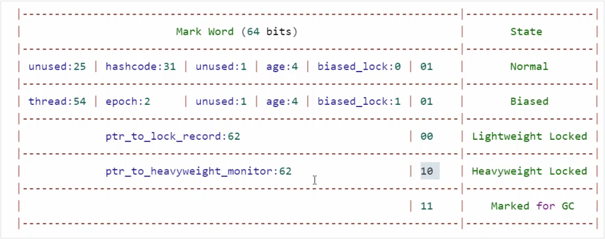
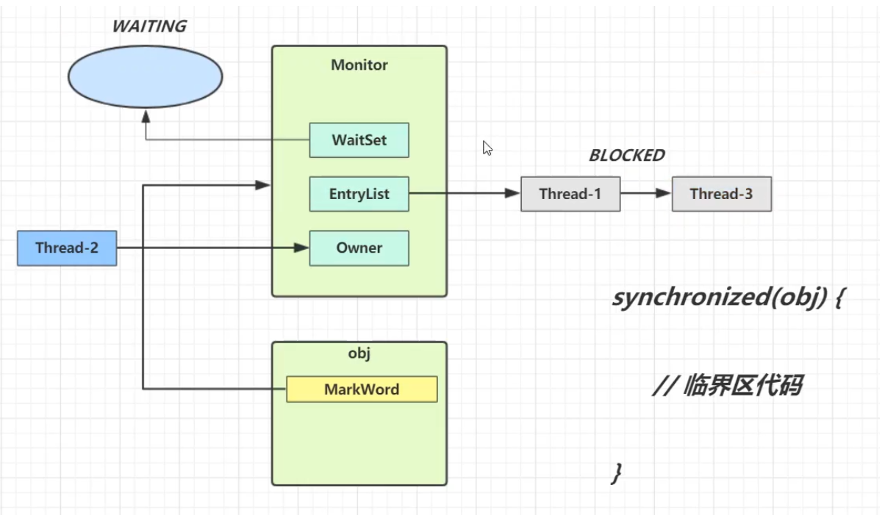
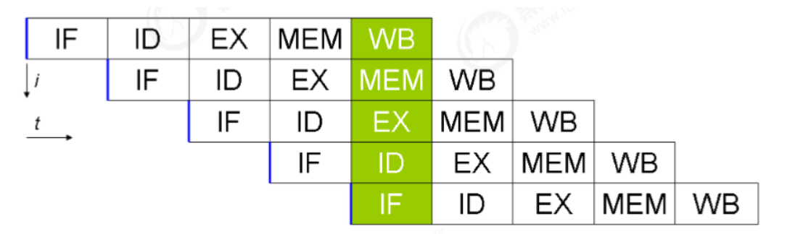

[TOC]


# 一、进程与线程

## 1.1 进程

- 程序由指令和数据组成，但这些指令要运行，数据要读写，就必须将指令加载至 CPU，数据加载至内存。在指令运行过程中还需要用到磁盘、网络等设备。进程就是用来加载指令、管理内存、管理 IO 的。
- 当一个程序被运行，从磁盘加载这个程序的代码至内存，这时就开启了一个进程。
- 进程就可以视为程序的一个实例。大部分程序可以同时运行多个实例进程（例如记事本、画图、浏览器 等），也有的程序只能启动一个实例进程（例如网易云音乐、360 安全卫士等）

## 1.2 线程

- 一个进程之内可以分为一到多个线程。
- 一个线程就是一个指令流，将指令流中的一条条指令以一定的顺序交给 CPU 执行 。

- Java 中，线程作为小调度单位，进程作为资源分配的小单位。 在 windows 中进程是不活动的，只是作为线程的容器。

## 1.3 进程 VS 线程

- 进程基本上相互独立的，而线程存在于进程内，是进程的一个子集 进程拥有共享的资源，如内存空间等，供其内部的线程共享。
  - 进程间通信较为复杂 同一台计算机的进程通信称为 IPC（Inter-process communication）
  - 不同计算机之间的进程通信，需要通过网络，并遵守共同的协议，例如 HTTP。

- 线程通信相对简单，因为它们共享进程内的内存，一个例子是多个线程可以访问同一个共享变量 线程更轻量，线程上下文切换成本一般上要比进程上下文切换低。

## 1.4 并行 VS 并发

单核CPU下，线程实际还是串行执行的，操作系统中有一个组件叫做任务调度器，将CPU的时间片（windows下时间片最小约为15ms）分给不同的线程使用，只是由于cpu在线程间（时间片很短）的切换非常快，人类感觉使同时运行的。也就是说：微观串行，宏观并行。

**一般把这种线程轮流使用cpu的做法称为并发，concurrent**

**多核CPU下，每个核都可以调度运行线程，这时候线程是可以并行的。**一般线程数多于核心数，所以是并行和并发同时存在。

## 1.5 应用

### 1.5.1 异步调用

从方法调用的角度来讲，如果

- 需要等待结果返回，才能继续运行的就是同步。
- 不需要等待结果返回，就能继续运行的就是异步。

同步在多线程还有另外一层意思，就是让多线程步调一致。

1) 设计
多线程可以让方法执行变为异步的（即不要巴巴干等着）比如说读取磁盘文件时，假设读取操作花费了 5 秒钟，如 果没有线程调度机制，这 5 秒 cpu 什么都做不了，其它代码都得暂停…

2) 结论

- 比如在项目中，视频文件需要转换格式等操作比较费时，这时开一个新线程处理视频转换，避免阻塞主线程
- tomcat 的异步 servlet 也是类似的目的，让用户线程处理耗时较长的操作，避免阻塞
- tomcat 的工作线程 ui 程序中，开线程进行其他操作，避免阻塞 ui 线程

### 1.5.2 提高效率

多核cpu下使用多线程可以提高效率，单核并不能提升效率。

1. 单核 cpu 下，多线程不能实际提高程序运行效率，只是为了能够在不同的任务之间切换，不同线程轮流使用 cpu ，不至于一个线程总占用 cpu，别的线程没法干活
2. 多核 cpu 可以并行跑多个线程，但能否提高程序运行效率还是要分情况的
   - 有些任务，经过精心设计，将任务拆分，并行执行，当然可以提高程序的运行效率。但不是所有计算任 务都能拆分（参考后文的【阿姆达尔定律】）
   - 也不是所有任务都需要拆分，任务的目的如果不同，谈拆分和效率没啥意义
3. IO 操作不占用 cpu，只是我们一般拷贝文件使用的是【阻塞 IO】，这时相当于线程虽然不用 cpu，但需要一 直等待 IO 结束，没能充分利用线程。所以才有后面的【非阻塞 IO】和【异步 IO】优化。

# 二、JAVA 线程

## 2.1 创建和运行线程

**方法一：直接使用Thread**

```java
Thread t = new Thread(){
    
    public void run(){
        
        
    }
};
t.start();
```

**方法二：使用Runnable配合Thread**

```java
//匿名内部类写法
Runnable runnable = new Runnable(){
    
    public void run(){
        
        //要执行的任务
        Log.dubug("running");
        
    } 
};
//创建线程对象
Thread t = new Thread(runnable);
//启动线程
t.start();


//Lmabda写法
Runnable runnable = () ->{ Log.dubug("running");};
Thread t = new Thread(runnable);
t.start();
```

- 方法1是把线程和任务合并在了一起
- 方法2 是把线程和任务分开了
- 用 Runnable 更容易与线程池等高级 API 配合 用 Runnable 让任务类脱离了 Thread 继承体系，更灵活

**方法三：使用FutureTask配合Thread**

```java
public class test3{
    
    public static void main(String [] args) throws ExecutionException, InterruptedException{
        
        FutureTask<Integer> task = new FutureTask<Integer>(new Callable<Integer>(){
            
            public Integer call() throws Exception{
                
                System.out.println("线程执行！")；
                Thread.sleep(1000);
                return 100;
            }
        });
        
        Thread r1 = new Thread(task,"t2");
        r1.start();
        System.out.println(task.get());
    }
}
```

## 2.2 查看进程线程的方法

### windows

- 任务管理器可以查看进程和线程数，也可以用于杀死进程
- tasklist 查看进程
- taskkill 杀死进程

### linux

- ps - fe 查看所有进程
- ps - fT - p <PID> 查看某个进程（PID）的所有线程
- kill 杀死进程
- top 按大写H切换是否显示线程
- top -H  -p <PID> 查看某个进程（PID）的所有线程

### java

- jps命令查看所有java进行
- jstack<PID> 查看某个java进程（PID）的所有线程状态
- jconsole来查看某个java进程中线程的运行情况(图形界面)

## 2.3 线程运行的原理

**栈与栈帧**

JVM是由堆、栈、方法区组成，其中栈内存是给线程分配空间的。每个线程启动后，虚拟机就会为其分配一块栈内存。

- 每个栈由多个栈帧（Frame)组成，对应着每次方法调用时所占用的内存。
- 每个线程只能有一个活动栈帧，对应着当前正在执行的那个方法。

```java
public class TestFrame{//1
    
    public static void main(String []args){   //2     
        method1(10);//3
    }
    private static void method1(int x){//4
        
        int y = x + 1;//5
        Object m = method2();//6
        System.out.println(m);//7
    }
    private static Object method2(){//8
        
        Object n = new Object();//9
        return n;//10
    }
}
```

- 第一行，java虚拟机会先进行类加载，将类中的字节码加到java的虚拟机中，也就是方法区。
- 类加载完，java虚拟机就会启动一个为main的主线程，并且为这个线程分配一个栈内存，然后线程就交给任务调度器去执行。当cpu为主线程分配了时间片，cpu就开始运行主线程，运行到哪行代码由程序计数器来记录。


- 第二行：入口是main方法，则虚拟机会为main方法创建一个栈帧。


- 第三行：进入method1方法，也会为method1方法创建一个栈帧。x=10写进栈帧。


- 第五行：执行完后y = 11;
- 第六行：进入method2方法，同时为method2方法创建一个栈帧。


- 第九行：在堆中新建一个对象，并将对象的引用n指向对象。

  

- 第10行：返回n,并将m指向object对象。


- 之后释放method2的栈帧内存。返回到method1,之后method1执行完，其栈帧也要释放掉。

## 2.4 上下文切换

### 2.4.1 线程上下文切换

因为以下一些原因导致cpu不再执行当前的线程，转而执行另一个线程的代码

- 线程的cpu时间片用完
- 垃圾回收：工作线程停止，执行垃圾回收线程
- 有更高优先级的线程需要运行
- 线程自己调用了sleep, yield，wait, join，park，synchronized, lock等方法

当上下文切换发生时，需要由操作系统保存当前线程的状态，并恢复另一个线程的状态，java中对应得概念就是程序计数器，它的作用时记住下一条jvm指令的执行地址，是线程私有的。

- 状态包括程序计数器，虚拟机栈中每个栈帧的信息，如局部变量表，操作数栈，返回地址等。
- 上下文切换频繁发生会影响性能。

### 2.4.2 进程上下文切换

内核为每一个进程维持一个上下文。**上下文就是内核重新启动一个被抢占的进程所需的状态。**包括以下内容：

- 通用目的寄存器
- 浮点寄存器
- 程序计数器
- 用户栈
- 状态寄存器
- 内核栈
- 各种内核数据结构：比如描绘地址空间的**页表**，包含有关当前进程信息的**进程表**，以及包含进程已打开文件的信息的**文件表**

### 2.4.3 对比

最主要的一个区别在于**进程切换涉及虚拟地址空间的切换而线程不会**。因为每个进程都有自己的虚拟地址空间，而**线程是共享所在进程的虚拟地址空间的**，因此同一个进程中的线程进行线程切换时不涉及虚拟地址空间的转换

页表查找是一个很慢的过程，因此通常使用cache来缓存常用的地址映射，这样可以加速页表查找，这个cache就是快表TLB（translation Lookaside Buffer，用来加速页表查找）。由于每个进程都有自己的虚拟地址空间，那么显然每个进程都有自己的页表，那么**当进程切换后页表也要进行切换，页表切换后TLB就失效了**，cache失效导致命中率降低，那么虚拟地址转换为物理地址就会变慢，表现出来的就是程序运行会变慢，而线程切换则不会导致TLB失效，因为线程线程无需切换地址空间，因此我们通常说线程切换要比较进程切换快

而且还可能出现**缺页中断**，这就需要操作系统将需要的内容调入内存中，若内存已满则还需要将不用的内容调出内存，这也需要花费时间

**为什么TLB能加快访问速度**

快表可以避免每次都对页号进行地址的有效性判断。快表中保存了对应的物理块号，可以直接计算出物理地址，无需再进行有效性检查

## 2.5 常见方法

### 2.5.1 Start 与 run

被创建的Thread对象直接调用重写的run方法时， run方法是在**主线程**中被执行的，而不是在我们所创建的线程中执行。所以如果想要在所创建的线程中执行run方法，**需要使用Thread对象的start方法。**

### 2.5.2 sleep 与 yield

#### **sleep** (使线程阻塞)

1. 调用 sleep 会让当前线程从 **Running 进入 Timed Waiting 状态（阻塞）**，可通过state()方法查看

2. 其它线程可以使用 **interrupt** 方法打断正在睡眠的线程，这时 sleep 方法会抛出 InterruptedException

3. 睡眠结束后的线程未必会立刻得到执行,当前cpu有可能在执行其他线程的代码，需要等待其他线程cpu时间片用完了才能执行。

4. 建议用 **TimeUnit 的 sleep** 代替 Thread 的 sleep 来获得更好的可读性 。如：

   ```java
   //休眠一秒
   TimeUnit.SECONDS.sleep(1);
   //休眠一分钟
   TimeUnit.MINUTES.sleep(1);
   ```

```java
public class test7{
    
    public static void main(String[] args) throws InterruptedExceptipn{
        
        Thread t1 = new Thread("t1"){
            
            public void run{
                
                Log.debug("enter sleep...")
                try{            
                    Thread.sleep(2000);           
                } catch(InterruptedException e){
                    
                    Log.debug("weake up...")
                    e.printStackTrace();
                }
            }     
        };
        t1.start();
        
        Thread.sleep(1000);
        Log.debug("interrupt...");
        t1.interrupt();
    }
}
```

```java
//结果
[t1] - enter sleep...
[main] - interrupt...
[t1] - weake up...  
```

#### yield （让出当前线程）

1. 调用 yield 会让当前线程从 **Running 进入 Runnable 就绪状态**（仍然有可能被执行，当没有其他可执行的线程时，会继续执行），然后调度执行其它线程
2. 具体的实现依赖于操作系统的任务调度器。

#### 线程优先级

- 线程优先级会提示（hint）调度器优先调度该线程，但它仅仅是一个提示，调度器可以忽略它

- 如果 cpu 比较忙，那么优先级高的线程会获得更多的时间片，但 cpu 闲时，优先级几乎没作用

- 设置方法：

  ```java
  thread1.setPriority(Thread.MAX_PRIORITY); //设置为优先级最高
  ```

#### sleep应用

防止cpu占用100%

在没有利用cpu来计算时，不要让while(true)空转浪费cpu，这时可以使用yield或者sleep来让出cpu的使用权给其他程序。

```java
while(true){
    
    try{      
        Thread.sleep(50);
    }catch(InterruptedException e){
        
        e.printStackTrace();
    }
}
```

- 可以使用wait或者条件变量达到类似的效果
- 不同的是，后两种都需要加锁，并且需要相应的唤醒操作，一般用于要进行同步的场景。
- sleep适合用于无需锁同步的场景。

### 2.5.3 join

用于等待某个线程结束。如在主线程中调用t1.join()，则是主线程等待t1线程结束.

```java
Thread thread = new Thread();
//等待thread线程执行结束
thread.join();
//最多等待1000ms,如果1000ms内线程执行完毕，则会直接执行下面的语句，不会等够1000ms
thread.join(1000);
```

### 2.5.4 interrupt 方法

**打断sleep,wait,join的线程**（阻塞状态的线程）

打断sleep的线程,会清空打断状态，打断标记为false. 以sleep为例：

```java
private static void test1 throws InterruptedException{
    
    Thread t1 = new Thread(()->{
        sleep(1);
        
    },"t1");
    t1.start();
    sleep(0.5);
    t1.interrupt();
    log.debug("打断标记：{}"，t1.isInterrupted());//输出false，打断标记为false
}
```

**打断正在运行的线程**

- 如果一个线程在在运行中被打断，打断标记会被置为true。

```java
private static void test1 throws InterruptedException{
    
    Thread t1 = new Thread(()->{
       while(true){
           
           boolean interrupted = Thread.currentThread().isInterrupted();//获得打断标记
           if(interrupted){//被打断之后打断标记为true
               Log.debug("被打断了，退出循环");
               break;
           }
       }
        
    },"t1");
   
    Thread.sleep(1000);
    t1.interrupt();
}
```

#### 两阶段终止模式

在一个线程T1中如何优雅的终止线程T2? 这里的优雅指的是给T2线程一个料理后事的机会。

**错误思路**

- 使用线程对象的stop()方法停止线程
  - stop()方法会真正杀死线程，如果这时候线程锁住了共享资源，那么当它被杀死后就再也没有机会释放锁，其他线程将永远无法获取锁。
- 使用 System.exit(int) 方法停止线程
  - 目的仅是停止一个线程，但是这种做法会让整个程序都停止。

**正确思路**


```java
public class Test7 {
	public static void main(String[] args) throws InterruptedException {
		Monitor monitor = new Monitor();
		monitor.start();
		Thread.sleep(3500);
		monitor.stop();
	}
}

class Monitor {

	Thread monitor;

	/**
	 * 启动监控器线程
	 */
	public void start() {
		//设置线控器线程，用于监控线程状态
		monitor = new Thread() {
			@Override
			public void run() {
				//开始不停的监控
				while (true) {
                    //判断当前线程是否被打断了
					if(Thread.currentThread().isInterrupted()) {
						System.out.println("处理后续任务");
                        //终止线程执行
						break;
					}
					System.out.println("监控器运行中...");
					try {
						//线程休眠
						Thread.sleep(1000);
					} catch (InterruptedException e) {
						e.printStackTrace();
						//如果是在休眠的时候被打断，不会将打断标记设置为true，这时要重新设置打断标记
						Thread.currentThread().interrupt();
					}
				}
			}
		};
		monitor.start();
	}

	/**
	 * 	用于停止监控器线程
	 */
	public void stop() {
		//打断线程
		monitor.interrupt();
	}
}
```

## 2.6 主线程与守护线程

当JAVA进程中有多个线程在执行时，只有当所有非守护线程都执行完毕后，JAVA进程才会结束。**但当非守护线程全部执行完毕后，守护线程无论是否执行完毕，也会一同结束。**

```java
//将线程设置为守护线程, 默认为false
monitor.setDaemon(true);
```

**守护线程的应用**

- 垃圾回收器线程就是一种守护线程
- Tomcat 中的 Acceptor 和 Poller 线程都是守护线程，所以 Tomcat 接收到 shutdown 命令后，不会等 待它们处理完当前请求

## 2.7 线程的状态

### 2.7.1 操作系统层面(五种状态)


- 【**初始状态**】仅是在语言层面创建了线程对象，还未与操作系统线程关联（例如new了一个线程对象，但是没调用start方法）
- 【**可运行状态**】（就绪状态）指该线程已经被创建（与操作系统线程关联），可以由 CPU 调度执行
- 【**运行状态**】指获取了 CPU 时间片运行中的状态
  - 当 CPU 时间片用完，会从【运行状态】转换至【可运行状态】，会导致线程的上下文切换
- 【**阻塞状态**】
  - 如果调用了阻塞 API，如 BIO 读写文件，这时该线程实际不会用到 CPU，会导致线程上下文切换，进入 【阻塞状态】
  - 等 BIO 操作完毕，会由操作系统唤醒阻塞的线程，转换至【可运行状态】
  - 与【可运行状态】的区别是，对【阻塞状态】的线程来说只要它们一直不唤醒，调度器就一直不会考虑调度它们
- 【**终止状态**】表示线程已经执行完毕，生命周期已经结束，不会再转换为其它状态

### 2.7.2 JAVA API层面(六种状态)


- **NEW** 线程刚被创建，但是还没有调用 start() 方法
- **RUNNABLE** 当调用了 start() 方法之后，注意，Java API 层面的 RUNNABLE 状态涵盖了操作系统层面的 【可运行状态】、【运行状态】和【阻塞状态】（由于 BIO 导致的线程阻塞，在 Java 里无法区分，仍然认为 是可运行）
- **BLOCKED ， WAITING ， TIMED_WAITING** 都是 **Java API 层面**对【阻塞状态】的细分，如sleep和wait就是TIMED_WAITING， join为WAITING状态, 阻塞于锁就是BLOCKED 状态。
- **TERMINATED** 当线程代码运行结束

### 2.7.3 线程状态转变

**NEW –> RUNNABLE**

- 当调用了t.start()方法时，由 NEW –> RUNNABLE

**RUNNABLE <–> WAITING**

1. 当调用了t 线程用 `synchronized(obj)` 获取了对象锁后

   - 调用 `obj.wait()` 方法时，t 线程从 RUNNABLE –> WAITING

   - 调用 `obj.notify()` ， `obj.notifyAll()` ， `t.interrupt()` 时
     - 竞争锁成功，t 线程从 WAITING –> RUNNABLE
     - 竞争锁失败，t 线程从 WAITING –> BLOCKED

2. 当前线程调用 `t.join()` 方法时，当前线程从 RUNNABLE –> WAITING

   - 注意是**当前线程**在t 线程对象的监视器上等待

   - t 线程**运行结束**，或调用了**当前线程**的 `interrupt()` 时，当前线程从 WAITING –> RUNNABLE

3. 当前线程调用 `LockSupport.park()` 方法会让当前线程从 RUNNABLE –> WAITING

   - 调用 `LockSupport.unpark`(目标线程) 或调用了线程 的 interrupt() ，会让目标线程从 WAITING –> RUNNABLE

 **RUNNABLE <–> TIMED_WAITING**

1. t 线程用 synchronized(obj) 获取了对象锁后

   - 调用 `obj.wait(long n)` 方法时，t 线程从 RUNNABLE –> TIMED_WAITING

   -  线程等待时间超过了 n 毫秒，或调用 `obj.notify()` ， `obj.notifyAll()` ， `t.interrupt()` 时
     - 竞争锁成功，t 线程从 TIMED_WAITING –> RUNNABLE
     - 竞争锁失败，t 线程从 TIMED_WAITING –> BLOCKED

2. 当前线程调用 `t.join(long n)` 方法时，当前线程从 RUNNABLE –> TIMED_WAITING

   - 注意是当前线程在t 线程对象的监视器上等待
   - 当前线程等待时间超过了 n 毫秒，或t 线程运行结束，或调用了当前线程的 `interrupt()` 时，当前线程从 TIMED_WAITING –> RUNNABLE

3. 当前线程调用 `Thread.sleep(long n)` ，当前线程从 RUNNABLE –> TIMED_WAITING

   - 当前线程等待时间超过了 n 毫秒，当前线程从 TIMED_WAITING –> RUNNABLE

4. 当前线程调用 `LockSupport.parkNanos(long nanos)` 或 `LockSupport.parkUntil(long millis)` 时，当前线 程从 RUNNABLE –> TIMED_WAITING

   - 调用 `LockSupport.unpark(目标线程)` 或调用了线程 的 `interrupt()` ，或是等待超时，会让目标线程从 TIMED_WAITING–> RUNNABLE

**RUNNABLE <–> BLOCKED**

t 线程用 `synchronized(obj)` 获取了对象锁时如果**竞争失败**，从 RUNNABLE –> BLOCKED

持 obj 锁线程的同步代码块执行完毕，会唤醒该对象上所有 BLOCKED 的线程重新竞争，如果其中 t 线程竞争 成功，从 BLOCKED –> RUNNABLE ，其它**失败**的线程仍然 BLOCKED

**RUNNABLE <–> TERMINATED**

当前线**程所有代码运行完毕**，进入 TERMINATE

# 三、共享模型之管程

## 3.1 共享带来的问题

**(1) 临界区 Critical Section**

- 一个程序运行多个线程本身是没有问题的
- 问题出在多个线程访问共享资源
  - 多个线程读共享资源其实也没有问题
  - **在多个线程对共享资源读写操作时发生指令交错，就会出现问题**
- 一段代码块内如果存在对共享资源的多线程读写操作，称这段代码块为**临界区**
  例如，下面代码中的临界区

```java
static int counter = 0;
 
static void increment() 
// 临界区 
{   
    counter++; 
}
 
static void decrement() 
// 临界区 
{ 
    counter--; 
}
```

**(2)竞态条件 Race Condition**

多个线程在**临界区**内执行，由于代码的执行序列不同而导致结果无法预测，称之为发生了**竞态条件**

## 3.2 synchronized

### 3.2.1 解决方法

为了避免临界区的竞态条件发生，有多种手段可以达到目的。

- 阻塞式的解决方案：synchronized，Lock
- 非阻塞式的解决方案：原子变量

**synchronized**，即俗称的**【对象锁】**，它采用互斥的方式让同一 时刻至多只有一个线程能持有【对象锁】，其它线程再想获取这个【对象锁】时就会阻塞住(blocked)。这样就能保证拥有锁的线程可以安全的执行临界区内的代码，不用担心线程上下文切换。

### 3.2.2 语法

synchronized实际上使用**对象锁**保证**临界区代码的原子性**，临界区内的代码对外是不可分割的，不会被线程切换所打断。

```java
synchronized(对象) {
	//临界区
}
```

**修饰代码块**

```java
static int counter = 0; 
//创建一个公共对象，作为对象锁的对象
static final Object room = new Object();
 
public static void main(String[] args) throws InterruptedException {    
	Thread t1 = new Thread(() -> {        
    for (int i = 0; i < 5000; i++) {            
        synchronized (room) {     
        counter++;            
       	 }       
 	   }    
    }, "t1");
 
    Thread t2 = new Thread(() -> {       
        for (int i = 0; i < 5000; i++) {         
            synchronized (room) {            
            counter--;          
            }    
        } 
    }, "t2");
 
    t1.start();    
    t2.start(); 
    t1.join();   
    t2.join();    
    log.debug("{}",counter); 
}
```

**修饰方法**

- 加在成员方法上：对this对象进行加锁，同一个实例是同一把锁，不同的实例是不同的锁，不会有互斥。

  ```java
  public class Demo {
  	//在方法上加上synchronized关键字
  	public synchronized void test1() {//加在成员方法上对this对象进行加锁，同一个实例是同一把锁，不同的实例是不同的锁，不会有互斥
  	
  	}
  }//等价于
  
  public class Demo {
  	public void test1() {
  		synchronized(this) {
  		
  		}
  	}
  }	
  ```

- 加在静态方法上：对类对象进行加锁，不同的实例是同一把锁。

```java
public class Demo {
	//在静态方法上加上synchronized关键字
	public static synchronized void test2() {//对类对象进行加锁
	
	}
}
//等价于
public class Demo {
	//等价于
	public void test2() {
		synchronized(Demo.class) {//对类对象进行加锁 
		
		}
	}
}
```

如果类的两个方法一个锁加载静态方法，另一个锁加在成员方法上，二者不是同一把锁，不具有互斥性。

```java
Demo d1 = new Demo();
new Thread(()->{d1.test1()};).start();.//锁的是d1对象
new Thread(()->{d1.test2()};).start();//锁的是类对象
```

### 3.2.3 变量的线程安全分析

**成员变量和静态变量是否线程安全？**

- 如果它们没有共享(比如说不同的线程访问同一个对象实例的成员变量或者访问静态变量)，则线程安全
- 如果它们被共享了，根据它们的状态是否能够改变，又分两种情况
  - 如果只有读操作，则线程安全
  - 如果有读写操作，则这段代码是临界区，需要考虑线程安全

**局部变量是否线程安全？**

- 局部变量是线程安全的
- 但局部变量引用的对象则未必 （要看该对象是否被共享且被执行了读写操作）
  - 如果该对象没有逃离方法的作用范围，它是线程安全的
  - 如果该对象逃离方法的作用范围(比如使用return)，需要考虑线程安全

- 局部变量是线程安全的——每个方法都在对应线程的栈中创建栈帧，不会被其他线程共享

- 如果调用的对象被共享，且执行了读写操作，则**线程不安全**
- 如果是对象是局部变量，则每个线程都会在堆中创建对应的对象，也就是不同线程的对象实例是不一样的，不会存在线程安全问题。

**常见的线程安全类**

- String
- Integer
- StringBuffer
- Random
- Vector （List的线程安全实现类）
- Hashtable （Hash的线程安全实现类）
- java.util.concurrent 包下的类

这里说它们是线程安全的是指，多个线程调用它们**同一个实例的某个方法时**，是线程安全的

- 它们的每个方法是原子的（都被加上了synchronized）
- 但注意它们**多个方法的组合不是原子的**，所以可能会出现线程安全问题。

**线程安全类方法的组合**

可能的顺序：线程1:  第一行代码

​                       线程2：第一行代码

​					   线程2：第二行代码

​					   线程1：第二行代码

**所以不是线程安全的。**

```java
HashTable table = new HashTable();
//线程1和2都执行以下操作
if(table.get("key") == null){//1
    
    table.put("key",value);//2
}
```

**不可变类线程安全性**

- String、Integer 等都是**不可变类**，因为其内部的状态不可以改变，因此它们的方法都是线程安全的。

- String 有 replace，substring 等方法【可以】改变值啊，那么这些方法又是如何保证线程安 全的呢？
  - 这是因为这些方法的返回值都**创建了一个新的对象**，而不是直接改变String、Integer对象本身。

### 3.2.4 锁升级

无锁——>偏向锁——>轻量级锁——>重量级锁

#### java对象的布局


- 对象头：当一个线程尝试访问sychronzied修饰的代码块时，它首先要获得锁，这个锁时存在锁的对象头中。
- 实例数据：类中定义的成员变量。
- 对齐填充：不是必须的，仅仅起着占位符的作用。

64位虚拟机的mark word:



### 3.2.5 偏向锁

> 轻量级锁在没有竞争的时候(就自己这个线程)，每次重入仍然需要执行CAS操作。

所以引入了**偏向锁**对性能进行优化：在**第一次**cas时会将**线程的ID**写入对象的Mark Word中。此后发现这个线程ID就是自己的，就表示没有竞争，就不需要再次cas，以后只要不发生竞争，这个对象就归该线程所有。

**原理**

当线程第一次访问同步块并获取锁时，偏向锁处理流程如下：

- 虚拟机会把对象头中的标志位设置为’01‘；
- 同时使用CAS操作把获取到这个锁的线程ID记录到对象的Mark Word中，如果CAS操作成功，持有偏向锁的线程以后每次进入这个锁相关的同步块时，虚拟机都可以不再进行任何操作，偏向锁的效率高。

**撤销偏向**

以下几种情况会使对象的偏向锁失效

- 调用对象的hashCode方法
- 多个线程使用该对象，会使偏向锁升级为轻量级锁
- **调用了wait/notify方法**（调用wait方法会导致锁膨胀而使用**重量级锁**

**偏向锁的好处**

- 偏向锁时在只有一个线程执行同步块时进一步提高性能，适合用于一个线程反复获得同一个锁的情况，偏向锁可以提高带有同步但是无竞争的程序性能。
- 但是它不一定是对程序运行有利，如果程序中的大多数锁总是被多个不同的线程访问，比如线程池，那偏向锁模式是多余的。

**批量重偏向**

- 如果对象虽然被多个线程访问，但是线程间不存在竞争，这时偏向T1的对象仍有机会重新偏向T2
  - 重偏向会重置Thread ID
- 当撤销超过20次后（超过阈值），JVM会觉得是不是偏向错了，这时会在给对象加锁时，重新偏向至加锁线程。

**批量撤销**

当撤销偏向锁的阈值超过40以后，就会将**整个类的对象都改为不可偏向的**。

###   3.2.6 轻量级锁

> 使用场景：如果一个对象虽然有多线程访问，但是多线程访问的时间是错开的(也就是没有竞争)，那么可以使用轻量级锁进行优化。

**原理**

> 将对象的Mark Word复制到栈帧中的Lock Record中，Mark Word更新为指向Lock Record的指针。

当关闭偏向锁功能或者多个线程竞争偏向锁导致偏向锁升级为轻量级锁，则会尝试获取轻量级锁，步骤如下：

- 判断当前对象是否处于无锁状态(hashcode,0,01)，如果是，创建**锁记录**（Lock Record）对象，每个线程的栈帧都会包含一个锁记录对象，内部可以存储锁定对象的mark word（不再一开始就使用Monitor）。


- 让锁记录中的Object reference指向锁对象（Object），并尝试用cas去替换Object中的mark word，将此mark word放入lock record中保存.


- 如果cas替换成功，则将Object的对象头替换为**锁记录的地址**和**状态 00（轻量级锁状态）**，并由该线程给对象加锁.


- 如果失败则判断当前对象的Mark Word是否指向当前线程的栈帧.
  - 如果是则表示当前线程已经持有当前对象的锁，则进入sychronized锁重入，再加一条Lock Record作为重入的计数，但是此刻锁记录是null. 
  - 如果不是只能说明该锁对象已经被其他线程抢占了，**这时候轻量级锁需要膨胀为重量级锁**，锁标志位变为10，后面等待的线程将会进入阻塞状态。
- 当退出sychronized时，判断锁记录是否为null:
  - 如果锁记录为null，这时重置锁记录，表示重入计数减一。
  - 如果不为null,使用CAS将mark word恢复给对象头。
    - 如果CAS失败，这时会进入重量级锁流程，即按照monitor地址找到monitor对象，设置Owner为null，唤醒EntryList中Blocked线程。

**轻量级锁的好处**

- 在多线程交替执行同步块的情况下，可以避免重量级锁引起的性能的消耗。
- 对于轻量级锁，其性能提升的依据是”对于绝大部分的锁，在整个生命周期是不会存在竞争的“，如果打破这个依据则出来互斥的开销外，还有额外的CAS操作，因此在有多线程竞争的情况下，轻量级锁比重量级锁更慢。

### 3.2.7 重量级锁

每个java对象都可以关联一个操作系统的monitor对象，如果使用sychronized给对象上锁(重量级)之后，该对象头的mark word中就被设置指向monitor对象的指针。



- 当线程执行到临界区代码时，如果使用了synchronized，会先查询synchronized中所指定的对象(obj)**是否绑定了Monitor**。

  - 如果**没有绑定**，则会先去去与Monitor绑定，并且将Owner设为当前线程。

  - 如果**已经绑定**，则会去查询该Monitor是否已经有了Owner。

    - 如果没有，则Owner与将当前线程绑定
  - 如果有，则放入EntryList，进入阻塞状态(blocked)
  
- 当Monitor的Owner将临界区中代码执行完毕后，Owner便会被清空，此时EntryList中处于**阻塞**状态的线程会被**叫醒并竞争**，此时的竞争是**非公平的**。

**重量级锁竞争的时候，还可以使用自旋来进行优化，如果当前线程自旋成功（即这时候持锁线程已经退出了同步块，释放了锁），这时当前线程就可以避免阻塞。**

### 3.2.8 锁消除

锁消除的主要判断依据是来源于逃逸分析的数据支持，如果判断一段代码中，堆上的所有数据都不会逃逸出去而被其他线程访问到，那么就可以把它们当作栈上的数据对待，认为它们是线程私有的，同步加锁就无需进行。

### 3.2.9 锁粗化

JVM会探测到一连串细小的操作都使用同一个对象加锁，将同步代码块的范围放大，放到这串操作的外面，这样只需要加一次锁就可以了。(如for循环里的操作都对同一个对象加锁，这时候只要在for循环外面加一次锁就可以了)

## 3.3 wait/notify

### 3.3.1 原理


- 锁对象调用wait方法（`obj.wait()`），就会使当前线程进入`WaitSet`中，变为WAITING状态。
- 处于BLOCKED和WAITING状态的线程都为阻塞状态，CPU都不会分给他们时间片。但是有所区别：
  - BLOCKED状态的线程是在竞争对象时，发现Monitor的Owner已经是别的线程了，此时就会进入`EntryList`中，并处于BLOCKED状态。
  - WAITING状态的线程是获得了对象的锁，但是由于某些条件不满足需要进入阻塞状态时，锁对象调用了`wait`方法而进入了`WaitSet`中，处于WAITING状态
- BLOCKED状态的线程会在锁被释放的时候被唤醒，但是处于WAITING状态的线程只有被锁对象调用了`notify()`方法`(obj.notify/obj.notifyAll`)，才会被唤醒，但是唤醒后并不意味着立即获得锁，仍然需要进入`EntryList`重新竞争。

### 3.3.2 相关API

- `obj.wait()`: 让进入object 监视器的线程到`waitSet`等待。
- `obj.wait(long)`: 让进入object 监视器的线程到`waitSet`等待，并不是无限的一直等下去。
- `obj.notify()` : 让object上正在`waitSet`等待的线程中挑一个唤醒。
- `obj.notifyAll()` : 让object上正在`waitSet`等待的线程中全部唤醒。

它们都是线程之间进行协作的手段，都是属于`Object`对象的方法，必须获得此对象的锁，才能调用这几个方法。

```java
final static Object obj = new Object();

    public static void main(String[] args) throws InterruptedException {

        new Thread(()->{

            synchronized (obj){
                //执行代码
                try {
                    obj.wait();
                } catch (InterruptedException e) {
                    e.printStackTrace();
                }
                //执行其他代码
            }
        }).start();

        new Thread(()->{

            synchronized (obj){
                try {
                    obj.wait();
                } catch (InterruptedException e) {
                    e.printStackTrace();
                }
            }
        }).start();

        Thread.sleep(2000);
        //唤醒obj上其他线程
        synchronized (obj){

            obj.notify();//唤醒obj上一个线程
            obj.notifyAll();//唤醒obj上所有线程
        }
    }
}

```

### 3.3.3 Wait VS Sleep

`Sleep(long n)`和 `wait(long n)`的区别

- `Sleep`是Thread方法，`wait`是Object方法。
- `sleep`不强制和`synchronized`配合使用，但是`wait`需要和`synchronized`一起使用。
- `sleep`在睡眠的同时，不会释放对象的锁，但是`wait`在等待的时候会释放对象锁。

- 他们都会进入TIMED_WAITING状态

### 3.3.3 正确使用wait/notify

```java
synchronized(lock){
    
    while(条件不成立){
    	lock.wait();
	}
    //干活
}

//另一个线程
synchronized(lock){
    
    	lock.notifyAll();
    //干活
}

```

## 3.4 同步模式之保护性暂停

### 3.4.1 定义

即Guarded Suspension,用在一个线程等待另一个线程的执行结果

要点：

- 有一个结果需要从一个线程传递到另一个线程，让他们关联同一个GuardedObject
- 如果有结果不断从一个线程到另一个线程那么可以使用消息队列（见生产者/消费者）
- JDK中，join的实现，Future的实现，采用的就是此模式。
- 因为要等待另一方的结果，因此归类到同步模式。

**举例：**

```java
public class Test2 {
	public static void main(String[] args) {
		String hello = "hello thread!";
		Guarded guarded = new Guarded();
		new Thread(()->{
			System.out.println("想要得到结果");
			synchronized (guarded) {
				System.out.println("结果是："+guarded.getResponse());
			}
			System.out.println("得到结果");
		}).start();

		new Thread(()->{
			System.out.println("设置结果");
			synchronized (guarded) {
				guarded.setResponse(hello);
			}
		}).start();
	}
}

class Guarded {
	/**
	 * 要返回的结果
	 */
	private Object response;
	
    //优雅地使用wait/notify
	public Object getResponse() {
		//如果返回结果为空就一直等待，避免虚假唤醒
		while(response == null) {
			synchronized (this) {
				try {
					this.wait();
				} catch (InterruptedException e) {
					e.printStackTrace();
				}
			}
		}
		return response;
	}

	public void setResponse(Object response) {
		this.response = response;
		synchronized (this) {
			//唤醒休眠的线程
			this.notifyAll();
		}
	}

	@Override
	public String toString() {
		return "Guarded{" +
				"response=" + response +
				'}';
	}
}
```

**带超时判断的暂停**

```java
public Object getResponse(long time) {
		synchronized (this) {
			//获取开始时间
			long currentTime = System.currentTimeMillis();
			//用于保存已经等待了的时间
			long passedTime = 0;
			while(response == null) {
				//看经过的时间-开始时间是否超过了指定时间
				long waitTime = time -passedTime;
				if(waitTime <= 0) {
					break;
				}
				try {
                   	//等待剩余时间
					this.wait(waitTime);
				} catch (InterruptedException e) {
					e.printStackTrace();
				}
				//获取当前时间
				passedTime = System.currentTimeMillis()-currentTime		
            }
		}
		return response;
	}
```


### 3.4.2 join原理

```java
public final synchronized void join(long millis)
    throws InterruptedException {
        long base = System.currentTimeMillis();
        long now = 0;

        if (millis < 0) {
            throw new IllegalArgumentException("timeout value is negative");
        }

        if (millis == 0) {
            while (isAlive()) {
                wait(0);
            }
        } else {
            while (isAlive()) {
                long delay = millis - now;
                if (delay <= 0) {
                    break;
                }
                wait(delay);
                now = System.currentTimeMillis() - base;
            }
        }
    }
```

## 3.5 异步模式之生产者/消费者

- 与前面的保护性暂停中的GuardObject不同，不需要产生结果和消费结果的线程一一对应。
- 消费队列可以用来平衡生产和消费的线程资源
- 生产者只负责产生结果，不关心数据该如何处理，二消费者专心处理结果数据
- 消息队列是有容量限制的，满时不会再加入数据，空时不会再消耗数据
- JDK中各种阻塞队列，采用的就是这种模式。


## 3.6 park()  & unpark()

### 3.6.1 基本使用

**park/unpark都是LockSupport类中的的方法**

```java
//暂停线程运行
LockSupport.park;

//恢复线程运行
LockSupport.unpark(thread);
```

```java
public static void main(String[] args) throws InterruptedException {
		Thread thread = new Thread(()-> {
			System.out.println("park");
            //暂停线程运行
			LockSupport.park();
			System.out.println("resume");
		}, "t1");
		thread.start();

		Thread.sleep(1000);
		System.out.println("unpark");
    	//恢复线程运行
		LockSupport.unpark(thread);
	}
```

### 3.6.2 特点

**与wait/notify的区别**

- wait，notify 和 notifyAll 必须配合**Object Monitor**一起使用，而park，unpark不必
- park ，unpark 是以**线程为单位**来**阻塞**和**唤醒**线程，而 notify 只能随机唤醒一个等待线程，notifyAll 是唤醒所有等待线程，就不那么精确
- park & unpark 可以**先 unpark**，而 wait & notify 不能先 notify
- **park不会释放锁**，而wait会释放锁.

### 3.6.3 原理

每个线程都有一个自己的**Park对象**，并且该对象**_counter, _cond,__mutex**组成

- 先调用park再调用unpark时
  - 先调用park
    - 当前线程调用`Unsafe.park()`方法
    - 检查`_counter`,本情况为0，这时，获得`_mutex`互斥锁
    - 线程进入`_cond`条件变量阻塞，设置`_counter`为0
  - 然后调用`unpark`
    - 调用`unpark`方法后，会将`_counter`的值设置为1
    - 去唤醒阻塞队列`_cond`中的线程
    - 线程继续运行并将`_counter`的值设为0
- 先调用unpark，再调用park
  - 调用unpark
    - 会将counter设置为1（运行时0）
  - 调用park方法
    - 查看`_counter`是否为0
    - 因为`unpark`已经把`_counter`设置为1，所以此时将`_counter`设置为0，但**不放入**阻塞队列`_cond`中。

## 3.7 多把锁

不同的方法可以使用不同的锁，使并发度提高

```java
class BigRoom {
    //额外创建对象来作为锁
	private final Object studyRoom = new Object();
	private final Object bedRoom = new Object();
}
```

- 好处：可以增大并发度
- 坏处：如果一个线程要同时获取多把锁，容易造成死锁。

## 3.8 活跃性

### 3.8.1 死锁现象

`t1`线程获取A对象锁，接下来想获取B对象锁。

`t2`线程获取B对象锁，接下来想获取A对象锁。

### 3.8.2 死锁定位

- `jps+jstack ThreadID`

  - 在JAVA控制台中的Terminal中输入**`jps`**指令可以查看运行中的线程ID，使用**`jstack ThreadID`**可以查看线程状态，可以查看是否有死锁

  ```
  //找到一个java级别的死锁
  Found one Java-level deadlock:
  =============================
  "Thread-1":
    waiting to lock monitor 0x0000000017f40de8 (object 0x00000000d6188880, a java.lang.Object),
    which is held by "Thread-0"
  "Thread-0":
    waiting to lock monitor 0x0000000017f43678 (object 0x00000000d6188890, a java.lang.Object),
    which is held by "Thread-1"
  ```

- **`jconsole`检测死锁**


### 3.8.3 哲学家就餐问题


### 3.8.4. 活锁

活锁出现在两个线程**互相改变对方的结束条件**，最后谁也无法结束。

**避免活锁的方法**

在线程执行时，中途给予**不同的间隔时间**即可。

**死锁与活锁的区别**

- 死锁是因为线程互相持有对象想要的锁，并且都不释放，最后到时**线程阻塞**，**停止运行**的现象。
- 活锁是因为线程间修改了对方的结束条件，而导致代码**一直在运行**，却一直**运行不完**的现象。

### 3.8.5 饥饿

某些线程因为优先级太低，始终得不到CPU调度执行，也不能够结束。

## 3.9 ReentrantLock

**和synchronized相比具有的的特点**

- 可中断
- 可以设置超时时间
- 可以设置为公平锁 (先到先得)
- 支持多个条件变量( 具有**多个**`waitset`，根据不同的条件将线程放置在不同的`waitset`)

与synchronized一样，都支持可重入

**基本语法**

```java
//获取ReentrantLock对象
private ReentrantLock lock = new ReentrantLock();
//加锁
lock.lock();
try {
	//需要执行的代码
}finally {
	//释放锁
	lock.unlock();
}
```

### 3.9.1 可重入

- 可重入是指同一个线程如果首次获得了这把锁，那么因为它是这把锁的拥有者，因此有权利再次获取这把锁

- 如果是不可重入锁，那么第二次获得锁时，自己也会被锁挡住。

### 3.9.2 可打断

- 如果某个线程处于阻塞状态，可以调用其interrupt方法让其停止阻塞，获得锁失败.(使用`lock.lockInterruptibly()`来加锁)。
- 可以减少死锁发生。

**简而言之**就是：处于阻塞状态的线程，被打断了就不用阻塞了，直接停止运行.

```java
public static void main(String[] args) {
		ReentrantLock lock = new ReentrantLock();
		Thread t1 = new Thread(()-> {
			try {
				//加锁，可打断锁
                //如果没有竞争就可以获取lock锁
                //如果有竞争就进入阻塞队列，可以被其他线程用interrupt方法打断
				lock.lockInterruptibly();
			} catch (InterruptedException e) {
				e.printStackTrace();
                //被打断，返回，不再向下执行
				return;
			}finally {
				//释放锁
				lock.unlock();
			}

		});

		lock.lock();
		try {
			t1.start();
			Thread.sleep(1000);
			//打断
			t1.interrupt();
		} catch (InterruptedException e) {
			e.printStackTrace();
		} finally {
			lock.unlock();
		}
	}
```

### 3.9.3 锁超时

使用**`lock.tryLock`**方法会返回获取锁是否成功。如果成功则返回true，反之则返回false。

并且`tryLock`方法可以**指定等待时间**，参数为：`tryLock(long timeout, TimeUnit unit),` 其中`timeout`为最长等待时间，`TimeUnit`为时间单位。

**简而言之**就是：获取失败了、获取超时了或者被打断了，不再阻塞，直接停止运行。可以避免死锁。

- **不设置等待时间**:一旦获取失败，直接返回false

```java
public static void main(String[] args) {
		ReentrantLock lock = new ReentrantLock();
		Thread t1 = new Thread(()-> {
            //未设置等待时间，一旦获取失败，直接返回false
			if(!lock.tryLock()) {
				System.out.println("获取失败");
                //获取失败，不再向下执行，返回
				return;
			}
			System.out.println("得到了锁");
			lock.unlock();
		});


		lock.lock();
		try{
			t1.start();
			Thread.sleep(3000);
		} catch (InterruptedException e) {
			e.printStackTrace();
		} finally {
			lock.unlock();
		}
	}
```

- 设置等待时间

```java
public static void main(String[] args) {
		ReentrantLock lock = new ReentrantLock();
		Thread t1 = new Thread(()-> {
			try {
				//判断获取锁是否成功，最多等待1秒
				if(!lock.tryLock(1, TimeUnit.SECONDS)) {
					System.out.println("获取失败");
					//获取失败，不再向下执行，直接返回
					return;
				}
			} catch (InterruptedException e) {
				e.printStackTrace();
				//被打断，不再向下执行，直接返回
				return;
			}
			System.out.println("得到了锁");
			//释放锁
			lock.unlock();
		});


		lock.lock();
		try{
			t1.start();
			//打断等待
			t1.interrupt();
			Thread.sleep(3000);
		} catch (InterruptedException e) {
			e.printStackTrace();
		} finally {
			lock.unlock();
		}
	}
```

### 3.9.4 公平锁

在线程获取锁失败，进入阻塞队列时，**先进入**的会在锁被释放后**先获得**锁。这样的获取方式就是**公平**的。

```java
//默认是不公平锁，需要在创建时指定为公平锁
ReentrantLock lock = new ReentrantLock(true);
```

公平锁一般没有必要，会降低并发度。

### 3.9.5 条件变量

synchronized 中也有条件变量，就是我们讲原理时那个 `waitSet` 休息室，当条件不满足时进入`waitSet` 等待

`ReentrantLock` 的条件变量比 synchronized 强大之处在于，它是支持**多个**条件变量的，这就好比

- `synchronized` 是那些不满足条件的线程都在一间休息室等消息
- 而 `ReentrantLock` 支持多间休息室，有专门等烟的休息室、专门等早餐的休息室、唤醒时也是按休息室来唤 醒

使用要点：

- await 前需要**获得锁**
- await 执行后，会释放锁，进入 `conditionObject` 等待
- await 的线程被唤醒（或打断、或超时）取重新竞争 lock 锁
- 竞争 lock 锁成功后，从 await 后继续执行。

```java
static Boolean judge = false;
public static void main(String[] args) throws InterruptedException {
	ReentrantLock lock = new ReentrantLock();
	//获得条件变量
	Condition condition = lock.newCondition();
	new Thread(()->{
		lock.lock();
		try{
			while(!judge) {
				System.out.println("不满足条件，等待...");
				//等待
				condition.await();
			}
		} catch (InterruptedException e) {
			e.printStackTrace();
		} finally {
			System.out.println("执行完毕！");
			lock.unlock();
		}
	}).start();

	new Thread(()->{
		lock.lock();
		try {
			Thread.sleep(1);
			judge = true;
			//释放
			condition.signal();
		} catch (InterruptedException e) {
			e.printStackTrace();
		} finally {
			lock.unlock();
		}

	}).start();
}
```

## 3.10 同步模式之顺序控制

### 3.10.1 固定运行顺序

按顺序打印abcabcabcabcabc

```java
public class Test4 {
	static Symbol symbol = new Symbol();
	public static void main(String[] args) {
		new Thread(()->{
			symbol.run("a", 1, 2);
		}).start();

		new Thread(()->{
			symbol.run("b", 2, 3);

		}).start();
		symbol.run("c", 3, 1);
		new Thread(()->{

		}).start();
	}
}

class Symbol {
	public synchronized void run(String str, int flag, int nextFlag) {
		for(int i=0; i<loopNumber; i++) {
			while(flag != this.flag) {
				try {
					this.wait();
				} catch (InterruptedException e) {
					e.printStackTrace();
				}
			}
			System.out.println(str);
			//设置下一个运行的线程标记
			this.flag = nextFlag;
			//唤醒所有线程
			this.notifyAll();
		}
	}

	/**
	 * 线程的执行标记， 1->a 2->b 3->c
	 */
	private int flag = 1;
	private int loopNumber = 5;

	public int getFlag() {
		return flag;
	}

	public void setFlag(int flag) {
		this.flag = flag;
	}

	public int getLoopNumber() {
		return loopNumber;
	}

	public void setLoopNumber(int loopNumber) {
		this.loopNumber = loopNumber;
	}
}
```

**await/signal版本**

```java
public class Test5 {
	static AwaitSignal awaitSignal = new AwaitSignal();
	static Condition conditionA = awaitSignal.newCondition();
	static Condition conditionB = awaitSignal.newCondition();
	static Condition conditionC = awaitSignal.newCondition();
	public static void main(String[] args) {
		new Thread(()->{
			awaitSignal.run("a", conditionA, conditionB);
		}).start();

		new Thread(()->{
			awaitSignal.run("b", conditionB, conditionC);
		}).start();

		new Thread(()->{
			awaitSignal.run("c", conditionC, conditionA);
		}).start();


		try {
			Thread.sleep(1000);
		} catch (InterruptedException e) {
			e.printStackTrace();
		}
		awaitSignal.lock();
		try {
            //唤醒一个等待的线程
			conditionA.signal();
		}finally {
			awaitSignal.unlock();
		}
	}
}

class AwaitSignal extends ReentrantLock{
	public void run(String str, Condition thisCondition, Condition nextCondition) {
		for(int i=0; i<loopNumber; i++) {
			lock();
			try {
                //全部进入等待状态
				thisCondition.await();
				System.out.print(str);
				nextCondition.signal();
			} catch (InterruptedException e) {
				e.printStackTrace();
			} finally {
				unlock();
			}
		}
	}

	private int loopNumber=5;

	public int getLoopNumber() {
		return loopNumber;
	}

	public void setLoopNumber(int loopNumber) {
		this.loopNumber = loopNumber;
	}
}
```

# 四、共享模型之内存

Monitor主要关注的是访问共享变量时，保证临界区代码的原子性，这一章主要关注共享变量在多线程间的可见性问题和多条指令执行时的有序性问题。

## 4.1 JAVA内存模型

JMM 即 Java Memory Model，它定义了**主存（共享内存）、工作内存（线程私有）**抽象概念，底层对应着 CPU 寄存器、缓存、硬件内存、 CPU 指令优化等。

**JMM体现在以下几个方面**

- 原子性 - 保证指令不会受到线程上下文切换的影响
- 可见性 - 保证指令不会受 cpu 缓存的影响
- 有序性 - 保证指令不会受 cpu 指令并行优化的影响

## 4.2 可见性

### 4.2.1 引例

**退出不出的循环**

```java
static Boolean run = true;
	public static void main(String[] args) throws InterruptedException {
		new Thread(()->{
			while (run) {
				//如果run为真，则一直执行
			}
		}).start();

		Thread.sleep(1000);
		System.out.println("改变run的值为false");
		run = false;
	}
```

**为什么无法退出该循环**

- 初始状态， t 线程刚开始从**主内存**读取了 run 的值到**工作内存**。


- 因为 t 线程要频繁从主内存中读取 run 的值，JIT 编译器会将 run 的值**缓存至自己工作内存**中的高速缓存中， 减少对主存中 run 的访问，提高效率.


- 1 秒之后，main 线程修改了 run 的值，并同步至主存，而 t 是从自己工作内存中的高速缓存中读取这个变量 的值，结果永远是**旧值**


**解决方法**

- 使用**volatile**易变关键字
- 它可以用来修饰**成员变量**和**静态成员变量**（放在主存中的变量），他可以避免线程从自己的工作缓存中查找变量的值，必须到主存中获取它的值，线程操作 volatile 变量都是**直接操作主存**

```java
//使用易变关键字
volatile static Boolean run = true;
public static void main(String[] args) throws InterruptedException {
	new Thread(()->{
		while (run) {
			//如果run为真，则一直执行
		}
	}).start();

	Thread.sleep(1000);
	System.out.println("改变run的值为false");
	run = false;
}
```

```java
//synchronize也能保证可见性，但是是重量级锁，效率低
static boolean run = true;
final static Object lock = new Object();
public static void main(String[] args) throws InterruptedException {
	new Thread(()->{
		while (true) {
			//如果run为真，则一直执行
            synchronized(lock){        
                if(!run){
                    break;
                }
            }
		}
	}).start();

	Thread.sleep(1000);
	System.out.println("改变run的值为false");
	synchronized(lock){        
                run = false;
   }
}
```

### 4.2.2 可见性 vs 原子性

前面例子体现的实际就是**可见性**，它保证的是在多个线程之间，一个线程对**volatile变量**的修改对另一个线程可见， **不能**保证原子性，仅用在**一个写**线程，**多个读**线程的情况

- 注意 synchronized 语句块既可以保证代码块的**原子性**，也同时保证代码块内变量的**可见性**。
- 但缺点是 synchronized 是属于**重量级**操作，性能相对更低。
- 如果在前面示例的死循环中加入 `System.out.println()` 会发现即使不加 volatile 修饰符，线程 t 也能正确看到 对 run 变量的修改了，想一想为什么？

```java
//因为使用了synchronized关键字

public void println(String x) {
		//使用了synchronized关键字
        synchronized (this) {
            print(x);
            newLine();
        }
    }
```

### 4.2.3 终止模式之两阶段终止模式

在一个线程T1中如何优雅的终止线程T2? 这里的优雅指的是给T2线程一个料理后事的机会。

**错误思路**

- 使用线程对象的stop()方法停止线程
  - stop()方法会真正杀死线程，如果这时候线程锁住了共享资源，那么当它被杀死后就再也没有机会释放锁，其他线程将永远无法获取锁。
- 使用 System.exit(int) 方法停止线程
  - 目的仅是停止一个线程，但是这种做法会让整个程序都停止。

```java
public class Test7 {
	public static void main(String[] args) throws InterruptedException {
		Monitor monitor = new Monitor();
		monitor.start();
		Thread.sleep(3500);
		monitor.stop();
	}
}

class Monitor {

	Thread monitor;
	//设置标记，用于判断是否被终止了
	private volatile boolean stop = false;
	/**
	 * 启动监控器线程
	 */
	public void start() {
		//设置线控器线程，用于监控线程状态
		monitor = new Thread() {
			@Override
			public void run() {
				//开始不停的监控
				while (true) {
					if(stop) {
						System.out.println("处理后续任务");
						break;
					}
					System.out.println("监控器运行中...");
					try {
						//线程休眠
						Thread.sleep(1000);
					} catch (InterruptedException e) {
						System.out.println("被打断了");
					}
				}
			}
		};
		monitor.start();
	}

	/**
	 * 	用于停止监控器线程
	 */
	public void stop() {
		
        //修改标记
		stop = true;
        //打断线程
		monitor.interrupt();
	}
}
```

### 4.2.4 同步模式之犹豫模式

Balking （犹豫）模式用在一个线程发现另一个线程或本线程**已经做了某一件相同**的事，那么本线程就无需再做了，**直接结束返回**

- 用一个标记来判断该任务是否已经被执行过了
- 需要避免线程安全问题
  - 加锁的代码块要尽量的小，以保证性能

```java
package com.nyima.day1;

/**
 * @author Chen Panwen
 * @data 2020/3/26 16:11
 */
public class Test7 {
	public static void main(String[] args) throws InterruptedException {
		Monitor monitor = new Monitor();
		monitor.start();
		monitor.start();
		Thread.sleep(3500);
		monitor.stop();
	}
}

class Monitor {

	Thread monitor;
	//设置标记，用于判断是否被终止了
	private volatile boolean stop = false;
	//设置标记，用于判断是否已经启动过了
	private boolean starting = false;
	/**
	 * 启动监控器线程
	 */
	public void start() {
		//上锁，避免多线程运行时出现线程安全问题
		synchronized (this) {
			if (starting) {
				//已被启动，直接返回
				return;
			}
			//启动监视器，改变标记
			starting = true;
		}
		//设置线控器线程，用于监控线程状态
		monitor = new Thread() {
			@Override
			public void run() {
				//开始不停的监控
				while (true) {
					if(stop) {
						System.out.println("处理后续任务");
						break;
					}
					System.out.println("监控器运行中...");
					try {
						//线程休眠
						Thread.sleep(1000);
					} catch (InterruptedException e) {
						System.out.println("被打断了");
					}
				}
			}
		};
		monitor.start();
	}

	/**
	 * 	用于停止监控器线程
	 */
	public void stop() {
		//打断线程
		monitor.interrupt();
		stop = true;
	}
}
```

## 4.3 有序性

JVM会再不影响正确性的前提下，可以调整语句执行的顺序。

```java
static int i;
static int j;
//在某个线程内执行如下赋值操作
i=...
j=...
```

可以看到，无论先执行i还是先执行j，对最终的结果都不会造成影响。这种特性称为指令重排，多线程下指令重排会影响正确性。

**指令重排序优化**

- 事实上，现代处理器会设计为一个时钟周期完成一条执行时间长的 CPU 指令。为什么这么做呢？可以想到指令还可以再划分成一个个更小的阶段，例如，每条指令都可以分为： **取指令 - 指令译码 - 执行指令 - 内存访问 - 数据写回** 这5 个阶段


- 在不改变程序结果的前提下，这些指令的各个阶段可以通过**重排序**和**组合**来实现**指令级并行**
- 指令重排的前提是，重排指令**不能影响结果**，例如

```java
// 可以重排的例子 
int a = 10; 
int b = 20; 
System.out.println( a + b );

// 不能重排的例子 
int a = 10;
int b = a - 5;
```

**支持流水线的处理器**

现代 CPU 支持多级**指令流水线**，例如支持**同时**执行 **取指令 - 指令译码 - 执行指令 - 内存访问 - 数据写回** 的处理器，就可以称之为五级指令流水线。这时 CPU 可以在一个时钟周期内，同时运行五条指令的不同阶段（相当于一 条执行时间长的复杂指令），IPC = 1，本质上，流水线技术并不能缩短单条指令的执行时间，但它变相地提高了指令地**吞吐率**。



**在多线程环境下，指令重排序可能导致出现意料之外的结果**

**解决办法**

**volatile** 修饰的变量，可以**禁用**指令重排

- 禁止的是加volatile关键字变量之前的代码被重排序

**内存屏障**

- 可见性
  - 写屏障：**volatile** 修饰的变量后面会有一个写屏障，保证在写屏障之前，对共享变量的改动，都同步到主存当中。
  - 读屏障：**volatile** 修饰的变量前面会有一个读屏障，保证在该屏障之后，对共享变量的读取，加载的是主存中最新数据。
- 有序性
  - 写屏障会确保指令重排序时，不会将**写屏障之前的代码排在写屏障之后**。
  - 读屏障会确保指令重排序时，不会将读屏障之后的代码排在读屏障之前。
- 不能保证原子性(指令交错)
  - 写屏障只能保证同一个线程之后的读能够读到最新的结果，但是不能保证其他线程的读取操作是在该线程写入之后的。
  - 而有序性的保证也只是保证了本线程内相关代码不被重排序。


```java
//线程1执行此方法
public void actor2(I_Result r){
    
    num = 2;
    ready = true;//ready是volatile赋值带写屏障
    //写屏障：ready num都会同步到主存中，num不会排在写屏障之后
}
//线程2执行此方法
public void actor1(I_Result r){
    //读屏障
    //ready是volatile读取值带屏障：在该屏障之后，对共享变量的读取，加载的是主存中最新数据
    if(ready){
        r.r1 = num + num;
    }else{
        
        r.r1 = 1;
    }
   
}
```

## 4.4 double-checked locking 单例模式

```java
public final class Singleton{
    
    private Singleton(){}
    private static Singleton INSTANCE = null;
    
    public static Singleton getInstance(){
        
        if(INSTANCE == null){
            synchronized(Singleton.class){

                if(INSTANCE == null){

                        INSTANCE = new Singleton();//1
                 }
             }
            
        }
        return INSTANCE;
     
    }
}
```

以上实现的特点是：

- 懒惰初始化
- 首次使用`getInstance()`才使用`synchronized`加锁，后续使用时无需加锁
- 有隐含的，但关键的一点：第一个`if`使用`INSTANCE`变量，是在同步块之外。

**但是在多线程环境下，上面的代码是有问题的，`getInstance()`的字节码如下**：


对于` INSTANCE = new Singleton();`这行代码，对应的字节码为：

- 17表示创建对象，将对象引用入栈
- 20表示复制一份对象引用
- 21表示利用一个对象引用，调用构造方法
- 24表示利用一个对象引用，赋值给`static INSTANCE`

也许jvm会进行优化：先执行17，20，24,最后执行21，由于代码中第一个`if(INSTANCE == null)`并没有加`synchronized`所以其他线程可以执行，当一个线程执行17，20，24后，单例并不为空，所以其他线程有可能拿到一个没有执行构造方法的单例，也就是没有初始化完毕的单例。


- `synchronized`能保证有序性，但是并不能阻止代码重排序。

**问题的解决: `INSTANCE`定义为`volatile`类型：**

```java
public final class Singleton{
    
    private Singleton(){}
    private static volatile Singleton INSTANCE = null;
    
    public static Singleton getInstance(){
        
        if(INSTANCE == null){
            
            synchronized(Singleton.class){

                if(INSTANCE == null){

                        INSTANCE = new Singleton();//1
                 }
             }
            
        }
        return INSTANCE;
     
    }
}
```


## 4.5 线程安全单例

单例模式有很多实现方法，饿汉，懒汉，静态内部类，枚举类。

> 饿汉式：类加载就会导致该单实例对象被创建
>
> 懒汉式：类加载不会导致该单实例对象被创建，而是首次使用该对象时才会创建

**实现1：饿汉**

```java
//问题1.为什么加final
//问题2：如果实现了序列化接口，还要做什么来防止反序列化破坏单例
public final class Singleton implements Serializable {
   //问题3.为什么设置为私有，是否能防止反射创建新的实例？
    private Singleton(){}
    //问题4：这样初始化是否能保证单例对象创建时的线程安全？
    private static final Singleton INSTANCE = new Singleton();
    //问题5：为什么提供静态方法而不是直接将INSTANCE设置为public
    public static Singleton getInstance(){

        return INSTANCE;
    }
    
    public Object readResovle(){
        return INSTANCE;
        
    }

}
//问题1：如果没有final该类会被继承，子类有可能重写某些方法，破坏单例。
//问题2：使用Object readResovle()，在反序列化中，如果调用readResovle方法获取单例，就会使用自己返回的对象，而不是反序列化生成的对象
//问题3：防止其他类访问无限的创建对象，但是不能防止反射创建新的实例，因为反射可以设置构造器的访问类型。
//问题4: 没有，因为静态成员变量的初始化是在类加载的时候就完成的，JVM能保证线程安全。
//问题5:1.提供更好的封装性。 2. 可以支持泛型

```

**实现2：枚举**

```java
//问题1：枚举单例是如何限制实例个数的？
//定义几个就是几个。
//问题2：枚举单例在创建的时候是否有并发问题
//没有，因为他也是静态成员变量，初始化是在类加载的时候就完成的。
//问题3：枚举单例能否被反射破坏单例
//不能
//问题4：枚举单例能否被反序列化破坏单例
//默认实现反序列化接口，但是枚举类在实现中考虑到了反序列化的问题，所以已经解决了反序列化破坏枚举单例的问题。
//问题5：枚举属于懒汉式还是饿汉式？
//饿汉式
//问题6：枚举单例如果希望加入一些单例创建时的初始化逻辑该如何做？
//枚举类里也可以写构造方法，直接写构造方法加入初始化逻辑。
enum Singleton{
    
    INSTANCE;
}
```

**实现3：懒汉式**

```java
public final class Singleton {
  
    private Singleton(){}
    
    private static Singleton INSTANCE = null;
   // 使用 synchronized 锁的范围比较大，每次都需要加锁，性能比较低
    public static synchronized Singleton getInstance(){
		
        if(INSTANCE != null){
            
            return INSTANCE;
        }
        INSTANCE = new Singleton();
        return INSTANCE;
    }

}
```

**实现4：懒汉式改进(dcl）**

```java
public final class Singleton{
    
    private Singleton(){}
    
    //问题1:为什么要加volatile？
    //防止synchronized代码块内指令重排。其他线程可能会拿到一个没有初始化的单例。
    private static volatile Singleton INSTANCE = null;
    //问题2:对比实现3，说出这样做的意义
    //只在第一次初始化时调用同步代码块，后续无需再调用，性能较高
    public static Singleton getInstance(){
        
         if(INSTANCE != null){
            
            return INSTANCE;
        }
         
         synchronized(Singleton.class){//1
             
             //问题3：为什么还要在这里加为空判断，之前不是已经判断过了吗？
             //防止第一次并发创建单例时重复创建，假设线程1正在初始化对象，但是还没有完成，这时候来了t2,t2执行到代码1就会阻塞，直到t1完成释放锁，这时候其实已经创建了单例，如果不重复判断，t2线程也将创建一个单例
             if(INSTANCE != null){
            
            	return INSTANCE;
             }       

         	INSTANCE = new Singleton();
            return INSTANCE;
               
         }
     
    }
}
```

**实现5：静态内部类**

```java
public final class Singleton {
  
    private Singleton(){}
    //属于懒汉式
    private static class LazyHolder{
        
        static final Singleton INSTANCE = new Singleton();
    }
   // 在创建时是否有并发问题？ 类加载时使用jvm保证线程安全。
    public static Singleton getInstance(){
		
   
        return LazyHolder.INSTANCE;
    }

}
```

# 五、共享模型之无锁

 ## 5.1 CAS与volatile

- CAS即Compare and Swap，它体现的是一个乐观锁的思想，比如说多个线程要对一个共享型的整形变量执行+1操作;

```java
//需要不断尝试
while(true){
    
    int 旧值=共享变量；
    int 结果=旧值+1；
    if(CompareandSwap(旧值，结果)){//将自己拿到的旧值和目前的共享变量进行比较判断是否相等
        
        //成功，退出循环
    }     
        
}
```

获取共享变量时，为了保证该变量的可见性，需要使用volatile修饰，结合CAS和volatile可以实现无锁并发，适合于竞争不激烈，多核CPU的场景下。一般情况下，使用无锁比使用加锁的**效率更高。**

- 因为没有使用sychronized，所以线程不会陷入阻塞，不会产生上下文切换，这是效率提高的因素之一
- 但是如果竞争激烈，重试必然频繁发生，反而效率会受到影响。

**volatile**

获取共享变量时，为了保证该变量的**可见性**，需要使用 **volatile** 修饰。
它可以用来修饰成员变量和静态成员变量，他可以避免线程从自己的工作缓存中查找变量的值，必须到**主存中获取** 它的值，线程操作 volatile 变量都是直接操作主存。即一个线程对 volatile 变量的修改，对另一个线程可见。

**注意**

```java
volatile 仅仅保证了共享变量的可见性，让其它线程能够看到新值，但不能解决指令交错问题（不能保证原子性）
```

## 5.2 原子整数

J.U.C 并发包提供了

- `AtomicBoolean`
- `AtomicInteger`
- `AtomicLong`

以`AtomicInteger`为例

```java
public final int get() //获取当前的值
public final int getAndSet(int newValue)//获取当前的值，并设置新的值
public final int getAndIncrement()//获取当前的值，并自增
public final int getAndDecrement() //获取当前的值，并自减
public final int getAndAdd(int delta) //获取当前的值，并加上预期的值
boolean compareAndSet(int expect, int update) //如果输入的数值等于预期值，则以原子方式将该值设置为输入值（update）
public final void lazySet(int newValue)//最终设置为newValue,使用 lazySet 设置之后可能导致其他线程在之后的一小段时间内还是可以读到旧的值。
```

AtomicInteger 类主要利用 CAS (compare and swap) + volatile 和 native 方法来保证原子操作，从而避免 synchronized 的高开销，执行效率大为提升。

常用方法

```java
AtomicInteger i = new AtomicInteger(0);
 
// 获取并自增（i = 0, 结果 i = 1, 返回 0），类似于 i++ 
System.out.println(i.getAndIncrement());
 
// 自增并获取（i = 1, 结果 i = 2, 返回 2），类似于 ++i 
System.out.println(i.incrementAndGet());
 
// 自减并获取（i = 2, 结果 i = 1, 返回 1），类似于 --i 
System.out.println(i.decrementAndGet());
 
// 获取并自减（i = 1, 结果 i = 0, 返回 1），类似于 i--
System.out.println(i.getAndDecrement());
 
// 获取并加值（i = 0, 结果 i = 5, 返回 0） 
System.out.println(i.getAndAdd(5));
 
// 加值并获取（i = 5, 结果 i = 0, 返回 0） 
System.out.println(i.addAndGet(-5));
 
// 获取并更新（i = 0, p 为 i 的当前值, 结果 i = -2, 返回 0） 
// 其中函数中的操作能保证原子，但函数需要无副作用 
System.out.println(i.getAndUpdate(p -> p - 2));
 
// 更新并获取（i = -2, p 为 i 的当前值, 结果 i = 0, 返回 0）
// 其中函数中的操作能保证原子，但函数需要无副作用 
System.out.println(i.updateAndGet(p -> p + 2));
 
// 获取并计算（i = 0, p 为 i 的当前值, x 为参数1, 结果 i = 10, 返回 0） 
// 其中函数中的操作能保证原子，但函数需要无副作用 // getAndUpdate 如果在 lambda 中引用了外部的局部变量，要保证该局部变量是 final 的 
// getAndAccumulate 可以通过 参数1 来引用外部的局部变量，但因为其不在 lambda 中因此不必是 
final System.out.println(i.getAndAccumulate(10, (p, x) -> p + x));
 
// 计算并获取（i = 10, p 为 i 的当前值, x 为参数1, 结果 i = 0, 返回 0） 
// 其中函数中的操作能保证原子，但函数需要无副作用
System.out.println(i.accumulateAndGet(-10, (p, x) -> p + x));
```

## 5.3 原子引用

要保护的不一定是基本数据类型，所以使用原子引用可以保护一些非基本数据类型。

- AtomicReference：引用类型原子类

  下述代码首先创建了一个 Person 对象，然后把 Person 对象设置进 `AtomicReference` 对象中，然后调用 `compareAndSet` 方法，该方法就是通过 `CAS` 操作设置 `ar`。如果 `ar` 的值为 `person` 的话，则将其设置为 `updatePerson`。实现原理与 `AtomicInteger` 类中的 `compareAndSet` 方法相同。运行上面的代码后的输出结果如下：

```
Daisy
20
```

```java
import java.util.concurrent.atomic.AtomicReference;

public class AtomicReferenceTest {

    public static void main(String[] args) {
        AtomicReference<Person> ar = new AtomicReference<Person>();
        Person person = new Person("SnailClimb", 22);
        ar.set(person);
        Person updatePerson = new Person("Daisy", 20);
        ar.compareAndSet(person, updatePerson);

        System.out.println(ar.get().getName());
        System.out.println(ar.get().getAge());
    }
}

class Person {
    private String name;
    private int age;

    public Person(String name, int age) {
        super();
        this.name = name;
        this.age = age;
    }

    public String getName() {
        return name;
    }

    public void setName(String name) {
        this.name = name;
    }

    public int getAge() {
        return age;
    }

    public void setAge(int age) {
        this.age = age;
    }

}
```


- `AtomicStampedReference`：原子更新带有版本号的引用类型。该类将整数值与引用关联起来，可用于解决原子的更新数据和数据的版本号，可以解决使用 `CAS` 进行原子更新时可能出现的 `ABA` 问题。

> `ABA`问题，当`Thread1`线程拿到A数据去修改,这时`Thread2`线程把A数据修改为B,之后`Thread3`把B数据修改为A，当线程1修改完后，只看到A的数据一样，但是其实中间已经被修改过了。

```java
public class Demo3 {
	//指定版本号
	static AtomicStampedReference<String> str = new AtomicStampedReference<>("A", 0);
	public static void main(String[] args) {
		new Thread(() -> {
			String pre = str.getReference();
			//获得版本号
			int stamp = str.getStamp();
			System.out.println("change");
			try {
				other();
			} catch (InterruptedException e) {
				e.printStackTrace();
			}
			try {
				Thread.sleep(1000);
			} catch (InterruptedException e) {
				e.printStackTrace();
			}
			//把str中的A改为C,并比对版本号，如果版本号相同，就执行替换，并让版本号+1
			System.out.println("change A->C stamp " + stamp + str.compareAndSet(pre, "C", stamp, stamp+1));
		}).start();
	}

	static void other() throws InterruptedException {
		new Thread(()-> {
			int stamp = str.getStamp();
			System.out.println("change A->B stamp " + stamp + str.compareAndSet("A", "B", stamp, stamp+1));
		}).start();
		Thread.sleep(500);
		new Thread(()-> {
			int stamp = str.getStamp();
			System.out.println("change B->A stamp " + stamp +  str.compareAndSet("B", "A", stamp, stamp+1));
		}).start();
	}
}
```

- `AtomicMarkableReference` ：原子更新带有标记的引用类型。该类将 boolean 标记与引用关联起来。并不关心变量改了几次，但是可以知道变量有没有改。

```java
public class Demo4 {
	//指定初始状态为true
	static AtomicMarkableReference<String> str = new AtomicMarkableReference<>("A", true);
	public static void main(String[] args) {
		new Thread(() -> {
			String pre = str.getReference();
			System.out.println("change");
			try {
				other();
			} catch (InterruptedException e) {
				e.printStackTrace();
			}
			try {
				Thread.sleep(1000);
			} catch (InterruptedException e) {
				e.printStackTrace();
			}
			//把str中的A改为C,如果现在的值为A,并且状态为true(没有更改过)，就修改A为C,同时状态改为false(已经改过)
			System.out.println("change A->C mark " +  str.compareAndSet(pre, "C", true, false));
		}).start();
	}

	static void other() throws InterruptedException {
		new Thread(() -> {
            //把str中的A改为C,如果现在的值为A,并且状态为true(没有更改过)，就修改A为A,同时状态改为false(已经改过)
			System.out.println("change A->A mark " + str.compareAndSet("A", "A", true, false));
		}).start();
	}
}
```

## 5.4 原子数组

- AtomicIntegerArray
- AtomicLongArray
- AtomicReferenceArray

前面的原子引用是对对象引用本身(地址)的修改，但是有时候需要修改对象内的元素。

```java
public final int get(int i) //获取 index=i 位置元素的值
public final int getAndSet(int i, int newValue)//返回 index=i 位置的当前的值，并将其设置为新值：newValue
public final int getAndIncrement(int i)//获取 index=i 位置元素的值，并让该位置的元素自增
public final int getAndDecrement(int i) //获取 index=i 位置元素的值，并让该位置的元素自减
public final int getAndAdd(int i, int delta) //获取 index=i 位置元素的值，并加上预期的值
boolean compareAndSet(int i, int expect, int update) //如果输入的数值等于预期值，则以原子方式将 index=i 位置的元素值设置为输入值（update）
public final void lazySet(int i, int newValue)//最终 将index=i 位置的元素设置为newValue,使用 lazySet 设置之后可能导致其他线程在之后的一小段时间内还是可以读到旧的值。
```

```java
import java.util.concurrent.atomic.AtomicIntegerArray;

public class AtomicIntegerArrayTest {

    public static void main(String[] args) {
        // TODO Auto-generated method stub
        int temvalue = 0;
        int[] nums = { 1, 2, 3, 4, 5, 6 };
        AtomicIntegerArray i = new AtomicIntegerArray(nums);
        for (int j = 0; j < nums.length; j++) {
            System.out.println(i.get(j));
        }
        temvalue = i.getAndSet(0, 2);
        System.out.println("temvalue:" + temvalue + ";  i:" + i);
        temvalue = i.getAndIncrement(0);
        System.out.println("temvalue:" + temvalue + ";  i:" + i);
        temvalue = i.getAndAdd(0, 5);
        System.out.println("temvalue:" + temvalue + ";  i:" + i);
    }

}
```

## 5.5 原子更新器

如果需要原子更新某个类里的某个属性时，需要用到对象的属性修改类型原子类。

- AtomicIntegerFieldUpdater:原子更新整形字段的更新器
- AtomicLongFieldUpdater：原子更新长整形字段的更新器
- AtomicReferenceFieldUpdater ：原子更新引用类型里的字段的更新器

```java
import java.util.concurrent.atomic.AtomicIntegerFieldUpdater;

public class AtomicIntegerFieldUpdaterTest {
    public static void main(String[] args) {
        AtomicIntegerFieldUpdater<User> a = AtomicIntegerFieldUpdater.newUpdater(User.class, "age");
        //对user类中
        User user = new User("Java", 22);
        System.out.println(a.getAndIncrement(user));// 22
        System.out.println(a.get(user));// 23
    }
}

class User {
    private String name;
    public volatile int age;//CAS必须结合Volatile

    public User(String name, int age) {
        super();
        this.name = name;
        this.age = age;
    }

    public String getName() {
        return name;
    }

    public void setName(String name) {
        this.name = name;
    }

    public int getAge() {
        return age;
    }

    public void setAge(int age) {
        this.age = age;
    }

}
```

## 5.6 原子累加器

`LongAdder`相对于`AtomicLong`性能有提升，原因是在有竞争时，设置多个累加单元，Thread-0累加Cell[0],而Thread-1累加Cell[1]...最后将结果汇总，这样在累加时操作不同的cell变量，因此减少了CAS重试失败，从而提高性能。

### 5.6.1 LongAdder原理分析

`LongAdder`类有几个关键域

```java
//累加单元数组，懒惰初始化
transient volatile Cell[] cells;
//基础值，如果没有竞争，则用cas累加这个域
transient volatile long base;
//在cells创建或者扩容时，置为1，表示加锁
transient volatile int cellsBusy;
```

其中cell为累加单元

```java
//防止缓存行伪共享
@sun.misc.Contended
static final class Cell{
    
    volatile long value;
    Cell(long x) {value = x;}
    
    //最重要的方法，用cas方式进行累加，prev表示旧值，next表示新值
    final boolean cas(long prev,long next){
        
        return UNSAFE.compareAndSwapLong(this,valueOffset,prev,next);
    }
    //省略不重要的代码
}
```

从cpu缓存说起


因为 CPU 与 内存的速度差异很大，需要靠预读数据至**缓存**来提升效率。
而缓存以**缓存行**为单位，每个缓存行对应着一块内存，一般是 **64 byte**（8 个 long）
缓存的加入会造成数据副本的产生，即同一份数据会缓存在不同核心的缓存行中
CPU 要保证数据的**一致性**，如果某个 CPU 核心**更改**了数据，其它 CPU 核心对应的整个缓存行必须**失效**


因为 Cell 是数组形式，在内存中是连续存储的，一个 Cell 为 24 字节（16 字节的对象头和 8 字节的 value），因 此缓存行可以存下 2 个的 Cell 对象。这样问题来了：

- Core-0 要修改 Cell[0]
- Core-1 要修改 Cell[1]

无论谁修改成功，都会导致对方 Core 的缓存行失效，

比如 Core-0 中 Cell[0]=6000, Cell[1]=8000 要累加 Cell[0]=6001, Cell[1]=8000 ，这时会让 Core-1 的缓存行失效

`@sun.misc.Contended` 用来解决这个问题，它的原理是在使用此注解的对象或字段的**前后各增加 128 字节大小的 padding**（空白），从而让 CPU 将对象预读至缓存时**占用不同的缓存行**，这样，不会造成对方缓存行的失效.


**累加器源码**

```java
adder.increment();
public void increment{
    
    add(1L);
}

public void add(long x) {
       Cell[] as; long b, v; int m; Cell a;
       if ((as = cells) != null || !casBase(b = base, b + x)) {
           boolean uncontended = true;
           if (as == null || (m = as.length - 1) < 0 ||
               (a = as[getProbe() & m]) == null ||
               !(uncontended = a.cas(v = a.value, v + x)))
               longAccumulate(x, null, uncontended);
       }
   }
```

# 六、共享模型之不可变

## 6.1 日期转化的问题

下面代码在运行的时候，`SimpleDateFormat`不是线程安全的 ，有很大几率出现`java.long.NumberFormatException`或者出现不正确的日期解析结果。

```java
SimpleDateFormat sdf = new SimpleDateFormat("yyyy-MM-dd");
for(int i = 0; i < 10; i++){
    
    new Thread(() ->{
        
        try{
            
            log.debug("{}",sdf.parse("1951-04-21"));
            
        } catch (Exception e){
            
            log.error("{}",e);
        }
        
    }).start;
}
```

###  6.1.1 思路 - 同步锁

```java

SimpleDateFormat sdf = new SimpleDateFormat("yyyy-MM-dd");
for(int i = 0; i < 10; i++){
    
    new Thread(() ->{
        
       synchronized(sdf){
           
            try{
            
            	log.debug("{}",sdf.parse("1951-04-21"));
            
        	} catch (Exception e){
            
            	log.error("{}",e);
        	}
       }
        
    }).start;
}
```

缺点：性能较低 

### 6.1.2 思路 - 不可变

```java
DateTimeFormatter stf = new DateTimeFormatter("yyyy-MM-dd");
for(int i = 0; i < 10; i++){
    
    new Thread(() ->{
        
       TemporalAccessor parse = stf.parse("1951-04-21");
       log.debug("{}",parse);
         
    }).start;
}
```

## 6.2 不可变设计

**String类中不可变的体现**

```java
public final class String
    implements java.io.Serializable, Comparable<String>, CharSequence {
    /** The value is used for character storage. */
    private final char value[];

    /** Cache the hash code for the string */
    private int hash; // Default to 0
    
   //....
  }
}
```

**final 的使用 **
发现该类、类中所有属性都是 `final`的

- 属性用 final 修饰保证了该属性是只读的，不能修改
- 类用 final 修饰保证了该类中的方法不能被覆盖，**防止子类无意间破坏不可变性**

**保护性拷贝 **

使用字符串时，也有一些跟修改相关的方法，比如 substring 等，但是其内部是调用 String 的构造方法**创建了一个新字符串**。

```java
public String(char value[], int offset, int count) {
        if (offset < 0) {
            throw new StringIndexOutOfBoundsException(offset);
        }
        if (count <= 0) {
            if (count < 0) {
                throw new StringIndexOutOfBoundsException(count);
            }
            if (offset <= value.length) {
                this.value = "".value;
                return;
            }
        }
        // Note: offset or count might be near -1>>>1.
        if (offset > value.length - count) {
            throw new StringIndexOutOfBoundsException(offset + count);
        }
        this.value = Arrays.copyOfRange(value, offset, offset+count);
    }
```

构造新字符串对象时，会生成新的 char[] value，对内容进行复制 。这种通过创建副本对象来避免共享的手段称之为【**保护性拷贝**（defensive copy）】

## 6.3 享元模式

### 6.3.1 定义和体现

保护性拷贝会造成对象创建频繁的问题，享元模式用于需要重用数量有限的同一类对象时。

**包装类**

在JDK中Boolean,Byte,Short,Integer,Long,Character等包装类提供了valueOf方法，例如Long的valueOf会缓存-128~127之间的Long对象，在这个范围之间会重用对象，大于这个范围，才会新建Long对象。

```java
public static Long valueOf(long l){
    
    final int offset = 128;
    if(l >= -128 && l <= 127){
        
        return LongCache.cache[(int)l + offset];
    }
    
    return new Long(l);
}

private static class LongCache{
    
    private LongCache(){}
    static final Long cache[] = new Long[-(-128) + 127 +1];
    static{
        
        for(int i = 0; i < cache.length; i++){
            cache[i] = new Long( i - 128);
        }
    }
}
```

```
注意：
Byte,Short,Long缓存的范围都是-128~127
Character缓存范围是0~127
Integer的默认范围是-128~127,最小值不能变，但最大值可以通过调整虚拟机参数 -Djava.langr.Integer.IntegerCashe.high来改变
Boolean缓存了TRUE和FALSE
```

**`String串池 BigDecimal BigInteger`也都使用享元模式**

## 6.4 final原理

### 6.4.1 设置final变量的原理

```java
public class TestFinal{
    
    final int a = 20;
}
```

字节码；


发现final变量的赋值也会通过putfield指令来完成，同时在这条指令之后也会加入写屏障，保证其他线程读到它的值不会出现伪0的情况。

# 七、线程池

## 7.1 为什么要用线程池

> JVM在hotSpot的线程模型下，java线程会一对一映射为内核线程，这意味着，在java每次创建以及回收线程都会去内核创建以及回收，这就有可能导致：创建和销毁线程锁花费的时间和资源可能处理的任务花费的时间和资源要更多，线程池的出现就是为了：

- **降低资源消耗**：通过重复利用已创建的线程降低线程创建和销毁造成的消耗；
- **提高响应速度**：当任务到达时，任务可以不需要等到线程创建就能立即执行。
- **提高线程的可管理性**。 线程是稀缺资源，如果无限制的创建，不仅会消耗系统资源，还会降低系统的稳定性，使用线程池可以进行统一的分配，调优和监控。

## 7.2 什么时候用线程池？

单个任务处理的时间很短而请求的数目却是巨大的。

## 7.3 自定义线程池


```java
public class Demo3 {
   public static void main(String[] args) {
      ThreadPool threadPool = new ThreadPool(2,  TimeUnit.SECONDS, 1, 4);
      for (int i = 0; i < 10; i++) {
         threadPool.execute(()->{
            try {
               TimeUnit.SECONDS.sleep(10000);
            } catch (InterruptedException e) {
               e.printStackTrace();
            }
            System.out.println("任务正在执行!");
         });
      }
   }
}


/**
 * 自定义线程池
 */
class ThreadPool {
   /**
    * 自定义阻塞队列
    */
   private BlockingQueue<Runnable> blockingQueue;

   /**
    * 核心线程数
    */
   private int coreSize;

   private HashSet<Worker> workers = new HashSet<>();

   /**
    * 用于指定线程最大存活时间
    */
   private TimeUnit timeUnit;
   private long timeout;

   /**
    * 工作线程类
    * 内部封装了Thread类，并且添加了一些属性
    */
   private class Worker extends Thread {
      Runnable task;

      public Worker(Runnable task) {
         System.out.println("初始化任务");
         this.task = task;
      }

      @Override
      public void run() {
         // 如果有任务就执行
         // 如果阻塞队列中有任务，就继续执行
         while (task != null || (task = blockingQueue.take()) != null) {
            try {
               System.out.println("执行任务");
               task.run();
            } catch (Exception e) {
               e.printStackTrace();
            } finally {
               // 任务执行完毕，设为空
               System.out.println("任务执行完毕");
               task = null;
            }
         }
         // 移除任务
         synchronized (workers) {
            System.out.println("移除任务");
            workers.remove(this);
         }
      }
   }

   public ThreadPool(int coreSize, TimeUnit timeUnit, long timeout, int capacity) {
      this.coreSize = coreSize;
      this.timeUnit = timeUnit;
      blockingQueue = new BlockingQueue<>(capacity);
      this.timeout = timeout;
   }

   public void execute(Runnable task) {
      synchronized (workers) {
         // 创建任务
         // 池中还有空余线程时，可以运行任务
         // 否则阻塞
         if (workers.size() < coreSize) {
            Worker worker = new Worker(task);
            workers.add(worker);
            worker.start();
         } else {
            System.out.println("线程池中线程已用完，请稍等");
            blockingQueue.put(task);
         }
      }
   }
}

/**
 * 阻塞队列
 * 用于存放主线程或其他线程产生的任务
 */
class BlockingQueue<T> {
   /**
    * 阻塞队列
    */
   private  Deque<T> blockingQueue;

   /**
    * 阻塞队列容量
    */
   private int capacity;

   /**
    * 锁
    */
   private ReentrantLock lock;

   /**
    * 条件队列
    */
   private Condition fullQueue;
   private Condition emptyQueue;


   public BlockingQueue(int capacity) {
      blockingQueue = new ArrayDeque<>(capacity);
      lock = new ReentrantLock();
      fullQueue = lock.newCondition();
      emptyQueue = lock.newCondition();
      this.capacity = capacity;
   }

   /**
    * 获取任务的方法
    */
   public T take() {
      // 加锁
      lock.lock();
      try {
         // 如果阻塞队列为空（没有任务），就一直等待
         while (blockingQueue.isEmpty()) {
            try {
               emptyQueue.await();
            } catch (InterruptedException e) {
               e.printStackTrace();
            }
         }
         // 获取任务并唤醒生产者线程
         T task = blockingQueue.removeFirst();
         fullQueue.signalAll();
         return task;
      } finally {
         lock.unlock();
      }
   }

   public T takeNanos(long timeout, TimeUnit unit) {
      // 转换等待时间
      lock.lock();
      try {
         long nanos = unit.toNanos(timeout);
         while (blockingQueue.isEmpty()) {
            try {
               // awaitNanos会返回剩下的等待时间
               nanos = emptyQueue.awaitNanos(nanos);
               if (nanos < 0) {
                  return null;
               }
            } catch (InterruptedException e) {
               e.printStackTrace();
            }
         }
         T task = blockingQueue.removeFirst();
         fullQueue.signalAll();
         return task;
      } finally {
         lock.unlock();
      }
   }

   /**
    * 放入任务的方法
    * @param task 放入阻塞队列的任务
    */
   public void put(T task) {
      lock.lock();
      try {
         while (blockingQueue.size() == capacity) {
            try {
               System.out.println("阻塞队列已满");
               fullQueue.await();
            } catch (InterruptedException e) {
               e.printStackTrace();
            }
         }
         blockingQueue.add(task);
         // 唤醒等待的消费者
         emptyQueue.signalAll();
      } finally {
         lock.unlock();
      }
   }

   public int getSize() {
      lock.lock();
      try {
         return blockingQueue.size();
      } finally {
         lock.unlock();
      }
   }
}
```


## 7.4 ThreadPoolExecutor

### 7.4.1 线程池状态

```java
// 线程池状态
// runState is stored in the high-order bits
// RUNNING 高3位为111
private static final int RUNNING    = -1 << COUNT_BITS;

// SHUTDOWN 高3位为000
private static final int SHUTDOWN   =  0 << COUNT_BITS;

// 高3位 001
private static final int STOP       =  1 << COUNT_BITS;

// 高3位 010
private static final int TIDYING    =  2 << COUNT_BITS;

// 高3位 011
private static final int TERMINATED =  3 << COUNT_BITS;
```

| 状态名称   | 高3位的值 | 描述                                          |
| ---------- | --------- | --------------------------------------------- |
| RUNNING    | 111       | 接收新任务，同时处理阻塞队列中的任务          |
| SHUTDOWN   | 000       | 不接受新任务，但是处理阻塞队列中的任务        |
| STOP       | 001       | 中断正在执行的任务，同时抛弃阻塞队列中的任务  |
| TIDYING    | 010       | 任务执行完毕，活动线程为0时，即将进入终结阶段 |
| TERMINATED | 011       | 终结状态                                      |

线程池状态和线程池中线程的数量**由一个原子整型ctl来共同表示**

- 使用一个数来表示两个值的主要原因是：**可以通过一次CAS同时更改两个属性的值**

```java
//c为旧值，ctlof返回结果为新值
ctl.compareAndSet(c,ctlOf(targetState,workerCountOf(c)));
//rs 为高3位代表线程池状态，wc为低29位代表线程个数，ctl是合并它们
private static int ctlOf(int rs, int wc){return rs | wc;}
```

```java
// 原子整数，前3位保存了线程池的状态，剩余位保存的是线程数量
private final AtomicInteger ctl = new AtomicInteger(ctlOf(RUNNING, 0));

// 并不是所有平台的int都是32位。
// 去掉前三位保存线程状态的位数，剩下的用于保存线程数量
// 高3位为0，剩余位数全为1
private static final int COUNT_BITS = Integer.SIZE - 3;

// 2^COUNT_BITS次方，表示可以保存的最大线程数
// CAPACITY 的高3位为 0
private static final int CAPACITY   = (1 << COUNT_BITS) - 1;
```

### 7.4.2 构造方法

```java
public ThreadPoolExecutor(int corePoolSize,
                          int maximumPoolSize,
                          long keepAliveTime,
                          TimeUnit unit,
                          BlockingQueue<Runnable> workQueue,
                          ThreadFactory threadFactory,
                          RejectedExecutionHandler handler)
```

- **`corePoolSize` :** 核心线程数线程数定义了最小可以同时运行的线程数量。
- **`maximumPoolSize` :** 当队列中存放的任务达到队列容量的时候，当前可以同时运行的线程数量变为最大线程数。
- **`keepAliveTime`**:当线程池中的线程数量大于 `corePoolSize` 的时候，如果这时没有新的任务提交，核心线程外的线程不会立即销毁，而是会等待，直到等待的时间超过了 `keepAliveTime`才会被回收销毁；
- **`unit`** : `keepAliveTime` 参数的时间单位。
- **`workQueue`:** 当新任务来的时候会先判断当前运行的线程数量是否达到核心线程数，如果达到的话，新任务就会被存放在队列中。
- **`threadFactory`** :线程工厂-可以为创建线程时起个好名字
- **`handler`** :饱和策略。关于饱和策略下面单独介绍一下。

### 7.4.3 工作流程

- 提交任务后，先判断核心线程池是否已满，如果没有满就创建线程。
- 如果核心线程池满了，就判断等待队列是否满了，如果没有满就加入队列。
- 如果等待队列满了，就判断最大线程池是否已满，如果没满就创建临时线程。
- 如果临时线程也满了，就按照策略进行处理。
- 拒绝策略有四种
  - **`ThreadPoolExecutor.AbortPolicy`**：抛出 `RejectedExecutionException`来拒绝新任务的处理。(默认的策略)
  - **`ThreadPoolExecutor.DiscardPolicy`：** 不处理新任务，直接丢弃掉。
  - **`ThreadPoolExecutor.DiscardOldestPolicy`：** 此策略将丢弃最早的未处理的任务请求。
  - **`ThreadPoolExecutor.CallerRunsPolicy`**：调用执行自己的线程运行任务，也就是直接在调用`execute`方法的线程中运行(`run`)被拒绝的任务，如果执行程序已关闭，则会丢弃该任务。因此这种策略会降低对于新任务提交速度，影响程序的整体性能。如果您的应用程序可以承受此延迟并且你要求任何一个任务请求都要被执行的话，你可以选择这个策略。

### 7.4.4 FixedThreadPool

- 可重用固定线程数的线程池，最大线程数等于核心线程数
- 执行流程：
  - 如果当前运行的线程数小于corePoolSize时，如果再来新任务的话，就创建新的线程来执行任务；
  - 当前运行的线程数等于corePoolSize后，如果再来新的任务，会将任务加入`LinkedBlockingQueue`队列中；
  - 线程池中的线程执行完手头的任务后，会在循环中反复从`LinkedBlockingQueue` 中获取任务来执行；
- 适用于任务量已知，相对耗时的任务。
- 为什么不推荐使用？
  - **`FixedThreadPool` 使用无界队列 `LinkedBlockingQueue`（队列的容量为 Intger.MAX_VALUE）作为线程池的工作队列**
  - 运行中的 `FixedThreadPool`（未执行 `shutdown()`或 `shutdownNow()`）不会拒绝任务，在任务比较多的时候会导致 OOM（内存溢出）。

```java
public class TestFixedThreadPool {
   public static void main(String[] args) {
      // 自定义线程工厂
      ThreadFactory factory = new ThreadFactory() {
         AtomicInteger atomicInteger = new AtomicInteger(1);

         @Override
         public Thread newThread(Runnable r) {
            return new Thread(r, "myThread_" + atomicInteger.getAndIncrement());
         }
      };

      // 创建核心线程数量为2的线程池
      // 通过 ThreadFactory可以给线程添加名字

      ExecutorService executorService = Executors.newFixedThreadPool(2, factory);

      // 任务
      Runnable runnable = new Runnable() {
         @Override
         public void run() {
            System.out.println(Thread.currentThread().getName());
            System.out.println("this is fixedThreadPool");
         }
      };
      
      executorService.execute(runnable);
   }
}
```

- 内部调用的构造方法

  ```java
  ThreadPoolExecutor(nThreads, nThreads,
                                0L, TimeUnit.MILLISECONDS,
                                new LinkedBlockingQueue<Runnable>(),
                                threadFactory);
  ```

### 7.4.5 CachedThreadPool

```java
ExecutorService executorService = Executors.newCachedThreadPool();
```

**内部构造方法**

```java
ThreadPoolExecutor(0, Integer.MAX_VALUE,
                              60L, TimeUnit.SECONDS,
                              new SynchronousQueue<Runnable>());
```

- 没有核心线程，最大线程数为Integer.MAX_VALUE，**所有创建的线程都是救急线程**，空闲时生存时间为60秒
- 阻塞队列使用的是SynchronousQueue
  - SynchronousQueue是一种特殊的队列
    - **没有容量**，没有线程来取是放不进去的
    - 只有当线程取任务时，才会将任务放入该阻塞队列中
- 为什么不推荐使用？
  - `CachedThreadPool`允许创建的线程数量为 Integer.MAX_VALUE ，可能会创建大量线程，从而导致 OOM。
- 整个线程池表现为线程数会根据任务量不断增长，没有上限，当任务执行完毕，空闲1分钟后释放线程
- 适合任务数比较密集，但每个任务执行时间较短的情况。

### 7.4.6 SingleThread

```java
ExecutorService service = Executors.newSingleThreadExecutor();
```

**内部构造方法**

```java
new FinalizableDelegatedExecutorService
    (new ThreadPoolExecutor(1, 1,
                            0L, TimeUnit.MILLISECONDS,
                            new LinkedBlockingQueue<Runnable>()));
```

内部调用了**`new ThreadPoolExecutor`**的构造方法，传入的`corePoolSize`和`maximumPoolSize`都为1。然后将该对象传给了`FinalizableDelegatedExecutorService`。该类修饰了`ThreadPoolExecutor`，让外部无法调用`ThreadPoolExecutor`内部的某些方法来修改所创建的线程池的大小。

- `SingleThread`和自己创建一个线程来运行多个任务的区别

  - 当线程正在执行的任务发生错误时，如果是自己创建的线程，该任务和剩余的任务就无法再继续运行下去。而`SingleThread`会创建一个新线程，继续执行任务队列中剩余的任务。

- `SingleThread`和`newFixedThreadPool(1)`的区别

  - `newFixedThreadPool(1)`传值为1，可以将`FixedThreadPool`强转为`ThreadPoolExecutor`，然后通过`setCorePoolSize`改变核心线程数

  ```java
  // 强转为ThreadPoolExecutor
  ThreadPoolExecutor threadPool = (ThreadPoolExecutor) Executors.newFixedThreadPool(1);
  // 改变核心线程数
  threadPool.setCorePoolSize(2);Copy
  ```

  - 而`SingleThread`无法修改核心线程数

- 使用场景

  - 希望多个任务排队执行，线程数固定为1，任务数多于1时，会放入无界队列排队。任务执行完毕，这唯一的线程也不会释放。

   

### 7.6.7 提交任务的方法


### 7.6.8 关闭线程池

**shutdown()**

```java
/**
* 将线程池的状态改为 SHUTDOWN
* 不再接受新任务，但是会将阻塞队列中的任务执行完
*/
public void shutdown() {
    final ReentrantLock mainLock = this.mainLock;
    mainLock.lock();
    try {
        checkShutdownAccess();
        
        // 修改线程池状态为 SHUTDOWN
        advanceRunState(SHUTDOWN);
        
  		// 中断空闲线程（没有执行任务的线程）
        // Idle：空闲的
        interruptIdleWorkers();
        onShutdown(); // hook for ScheduledThreadPoolExecutor
    } finally {
        mainLock.unlock();
    }
    // 尝试终结，不一定成功
    // 
    tryTerminate();
}
```

**shutdownNow()**

```java
/**
* 将线程池的状态改为 STOP
* 不再接受新任务，也不会在执行阻塞队列中的任务
* 会将阻塞队列中未执行的任务返回给调用者
*/
public List<Runnable> shutdownNow() {
    List<Runnable> tasks;
    final ReentrantLock mainLock = this.mainLock;
    mainLock.lock();
    try {
        checkShutdownAccess();
        
        // 修改状态为STOP，不执行任何任务
        advanceRunState(STOP);
        
        // 中断所有线程
        interruptWorkers();
        
        // 将未执行的任务从队列中移除，然后返回给调用者
        tasks = drainQueue();
    } finally {
        mainLock.unlock();
    }
    // 尝试终结，一定会成功，因为阻塞队列为空了
    tryTerminate();
    return tasks;
}
```

