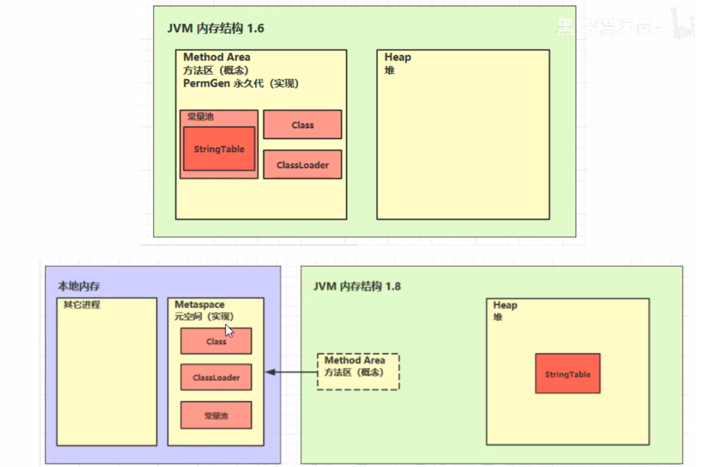
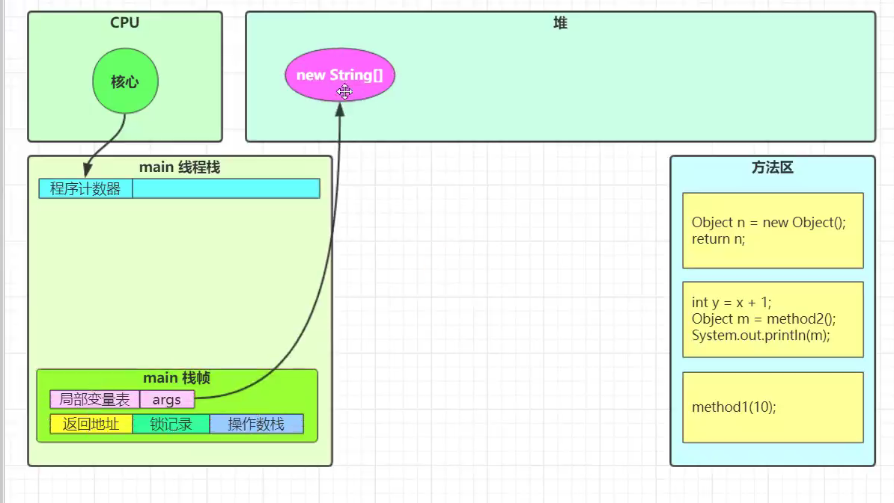
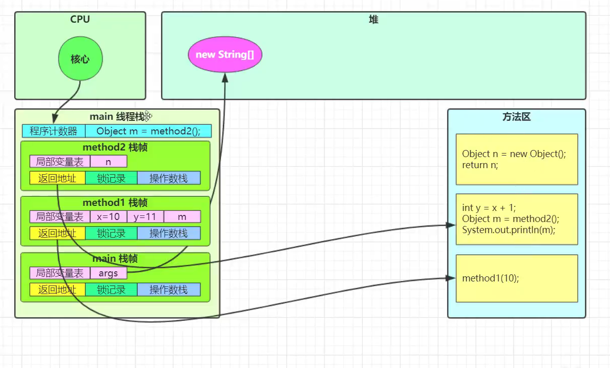

[TOC]


# [**:house:**](../../README.html)

# 一、JVM的体系结构


### 1.1 类加载器

>**类加载器的主要作用就是加载 Java 类的字节码（ `.class` 文件）到 JVM 中（在内存中生成一个代表该类的 `Class` 对象）。** 字节码可以是 Java 源程序（`.java`文件）经过 `javac` 编译得来，也可以是通过工具动态生成或者通过网络下载得来。
#### 介绍

- 类加载器是一个负责加载类的对象，用于实现类加载过程中的加载这一步。

- 每个被加载后的 Java 类都有一个引用指向加载它的 `ClassLoader`。

- 数组类不是通过 `ClassLoader` 创建的（数组类没有对应的二进制字节流），是由 JVM 直接生成的。

#### 类加载器加载规则

JVM 启动的时候，并不会一次性加载所有的类，而是根据需要去动态加载。也就是说，大部分类在具体用到的时候才会去加载，这样对内存更加友好。

对于已经加载的类会被放在 `ClassLoader` 中。在类加载的时候，系统会首先判断当前类是否被加载过。已经被加载的类会直接返回，否则才会尝试加载。也就是说，对于一个类加载器来说，相同二进制名称的类只会被加载一次。

#### 有哪些类加载器

JVM 中内置了三个重要的 `ClassLoader`：

1. **`BootstrapClassLoader`(启动类加载器)**：最顶层的加载类，由 C++实现，通常表示为 null，并且没有父级，主要用来加载 JDK 内部的核心类库（ `%JAVA_HOME%/lib`目录下的 `rt.jar`、`resources.jar`、`charsets.jar`等 jar 包和类）以及被 `-Xbootclasspath`参数指定的路径下的所有类。
2. **`ExtensionClassLoader`(扩展类加载器)**：主要负责加载 `%JRE_HOME%/lib/ext` 目录下的 jar 包和类以及被 `java.ext.dirs` 系统变量所指定的路径下的所有类。
3. **`AppClassLoader`(应用程序类加载器)**：面向我们用户的加载器，负责加载当前应用 classpath 下的所有 jar 包和类。

4. 除了这三种类加载器之外，用户还可以加入**自定义的类加载器**来进行拓展，以满足自己的特殊需求。就比如说，我们可以对 Java 类的字节码（ `.class` 文件）进行加密，加载时再利用自定义的类加载器对其解密。

除了 `BootstrapClassLoader` 是 JVM 自身的一部分之外，其他所有的类加载器都是在 JVM 外部实现的，并且全都继承自 `ClassLoader`抽象类。这样做的好处是用户可以自定义类加载器，以便让应用程序自己决定如何去获取所需的类。

每个 `ClassLoader` 可以通过`getParent()`获取其父 `ClassLoader`，如果获取到 `ClassLoader` 为`null`的话，那么该类是通过 `BootstrapClassLoader` 加载的。

```java
public abstract class ClassLoader {
  ...
  // 父加载器
  private final ClassLoader parent;
  @CallerSensitive
  public final ClassLoader getParent() {
     //...
  }
  ...
}

```

**为什么 获取到 `ClassLoader` 为`null`就是 `BootstrapClassLoader` 加载的呢？** 这是因为`BootstrapClassLoader` 由 C++ 实现，由于这个 C++ 实现的类加载器在 Java 中是没有与之对应的类的，所以拿到的结果是 null。

#### 自定义类加载器

我们前面也说说了，除了 `BootstrapClassLoader` 其他类加载器均由 Java 实现且全部继承自`java.lang.ClassLoader`。如果我们要自定义自己的类加载器，很明显需要继承 `ClassLoader`抽象类。

`ClassLoader` 类有两个关键的方法：

- `protected Class loadClass(String name, boolean resolve)`：加载指定二进制名称的类，实现了双亲委派机制 。`name` 为类的二进制名称，`resolve` 如果为 true，在加载时调用 `resolveClass(Class<?> c)` 方法解析该类。
- `protected Class findClass(String name)`：根据类的二进制名称来查找类，默认实现是空方法。

如果我们不想打破双亲委派模型，就重写 `ClassLoader` 类中的 `findClass()` 方法即可，无法被父类加载器加载的类最终会通过这个方法被加载。但是，如果想打破双亲委派模型则需要重写 `loadClass()` 方法。

#### 类文件结构

根据 Java 虚拟机规范，Class 文件通过 `ClassFile` 定义，有点类似 C 语言的结构体。


#### 双亲委派机制

- **当一个类加载器收到了类加载请求时，它不会先自己去尝试加载，而是委派给父类完成。** 比如我现在要new一个Person，这个Person是我们自定义的类，如果我们要加载它，就会先委派AppClassLoader，只有当父类加载器都反馈自己无法完成这个请求（也就是父类加载器都没有找到加载所需的Class）时，子类加载器才会自行尝试加载。

- **这样做的好处就是保证使用不同的类加载器得到的都是同一个结果。**保证了 Java 程序的稳定运行，可以避免类的重复加载（JVM 区分不同类的方式不仅仅根据类名，相同的类文件被不同的类加载器加载产生的是两个不同的类），也保证了 Java 的核心 API 不被篡改。

  > 如果没有使用双亲委派模型，而是每个类加载器加载自己的话就会出现一些问题，比如我们编写一个称为 `java.lang.Object` 类的话，那么程序运行的时候，系统就会出现两个不同的 `Object` 类。双亲委派模型可以保证加载的是 JRE 里的那个 `Object` 类，而不是你写的 `Object` 类。这是因为 `AppClassLoader` 在加载你的 `Object` 类时，会委托给 `ExtClassLoader` 去加载，而 `ExtClassLoader` 又会委托给 `BootstrapClassLoader`，`BootstrapClassLoader` 发现自己已经加载过了 `Object` 类，会直接返回，不会去加载你写的 `Object` 类。


- **执行流程**：当一个类加载器接收到加载请求时，它会先将请求转发给父类加载器。在父类加载器没有找到所请求的类的情况下，该类加载器才会尝试去加载。

  - 在类加载的时候，系统会首先判断当前类是否被加载过。已经被加载的类会直接返回，否则才会尝试加载（每个父类加载器都会走一遍这个流程）。
  - 类加载器在进行类加载的时候，它首先不会自己去尝试加载这个类，而是把这个请求委派给父类加载器去完成（调用父加载器 `loadClass()`方法来加载类）。这样的话，所有的请求最终都会传送到顶层的启动类加载器 `BootstrapClassLoader` 中。
  - 只有当父加载器反馈自己无法完成这个加载请求（它的搜索范围中没有找到所需的类）时，子加载器才会尝试自己去加载（调用自己的 `findClass()` 方法来加载类）。
  - 如果子类加载器也无法加载这个类，那么它会抛出一个 `ClassNotFoundException` 异常。

- **JVM 判定两个 Java 类是否相同的具体规则**：JVM 不仅要看类的全名是否相同，还要看加载此类的类加载器是否一样。只有两者都相同的情况，才认为两个类是相同的。即使两个类来源于同一个 `Class` 文件，被同一个虚拟机加载，只要加载它们的类加载器不同，那这两个类就必定不相同。

  


#### 怎么打破双亲委派模型？

自定义加载器的话，需要继承 `ClassLoader` 。如果我们不想打破双亲委派模型，就重写 `ClassLoader` 类中的 `findClass()` 方法即可，无法被父类加载器加载的类最终会通过这个方法被加载。但是，如果想打破双亲委派模型则需要重写 `loadClass()` 方法。

为什么是重写 `loadClass()` 方法打破双亲委派模型呢？双亲委派模型的执行流程已经解释了：

> 类加载器在进行类加载的时候，它首先不会自己去尝试加载这个类，而是把这个请求委派给父类加载器去完成（调用父加载器 `loadClass()`方法来加载类）。

重写 `loadClass()`方法之后，我们就可以改变传统双亲委派模型的执行流程。例如，子类加载器可以在委派给父类加载器之前，先自己尝试加载这个类，或者在父类加载器返回之后，再尝试从其他地方加载这个类。具体的规则由我们自己实现，根据项目需求定制化。

我们比较熟悉的 Tomcat 服务器为了能够优先加载 Web 应用目录下的类，然后再加载其他目录下的类，就自定义了类加载器 `WebAppClassLoader` 来打破双亲委托机制。这也是 Tomcat 下 Web 应用之间的类实现隔离的具体原理。

#### 类加载的流程

从类被加载到虚拟机内存开始，到释放内存一共有7个步骤：加载，验证，准备，解析，初始化，使用，卸载。
1. **加载**：**查找并加载类的二进制数据(class文件)**；方法区：类的类信息(instanceKcalss)。堆：class文件对应的类实例。

   - 通过一个类的全限定名来获取定义此类的二进制字节流；
   - 将这个字节流所代表的静态存储结构转化为方法区的运行时数据结构；
   - 在堆中生成一个代表这个类的java.lang.Class对象作为方法区这个类的各种数据访问的入口；
   >  **加载这一步主要是通过我们后面要讲到的 **类加载器完成的。类加载器有很多种，当我们想要加载一个类的时候，具体是哪个类加载器加载由 **双亲委派模型** 决定（不过，我们也能打破由双亲委派模型）。
   >
   > 每个 Java 类都有一个引用指向加载它的 `ClassLoader`。不过，数组类不是通过 `ClassLoader` 创建的，而是 JVM 在需要的时候自动创建的，数组类通过`getClassLoader()`方法获取 `ClassLoader` 的时候和该数组的元素类型的 `ClassLoader` 是一致的。
   >
   > 一个非数组类的加载阶段（加载阶段获取类的二进制字节流的动作）是可控性最强的阶段，这一步我们可以去完成还可以自定义类加载器去控制字节流的获取方式（重写一个类加载器的 `loadClass()` 方法）。
   >
   > 加载阶段与连接阶段的部分动作(如一部分字节码文件格式验证动作)是交叉进行的，加载阶段尚未结束，连接阶段可能就已经开始了。
   >
   > 
2. **连接**

   - **验证**:  **确保加载的类符合JVM规范和安全**，保证被校验类的方法在运行时不会做出危害虚拟机的事件；

     - 文件格式验证（Class 文件格式检查）
     - 元数据验证（字节码语义检查）
     - 字节码验证（程序语义检查）
     - 符号引用验证（类的正确性检查）
     > 
     >
     > 文件格式验证这一阶段是基于该类的二进制字节流进行的，主要目的是保证输入的字节流能正确地解析并存储于方法区之内，格式上符合描述一个 Java 类型信息的要求。除了这一阶段之外，其余三个验证阶段都是基于方法区的存储结构上进行的，不会再直接读取、操作字节流了。
     >
     > 符号引用验证发生在类加载过程中的解析阶段，具体点说是 JVM 将符号引用转化为直接引用的时候（解析阶段会介绍符号引用和直接引用）。
     >
     > 符号引用验证的主要目的是确保解析阶段能正常执行，如果无法通过符号引用验证，JVM 会抛出异常，比如：

   - **准备**：**为static变量在方法区中分配内存空间，设置变量初始值**；

     > - static变量分配空间和赋值是两个步骤，分配空间在准备阶段完成，赋值在初始化阶段完成。
     > - 如果static变量是final基本类型以及字符串常量，那么编译阶段值就确定了，赋值在准备阶段完成。
     > - 如果static变量是final的,但属于引用类型，那么赋值也会在初始化阶段完成
     >
     > 从概念上讲，类变量所使用的内存都应当在 **方法区** 中进行分配。在 JDK 7 及之后，HotSpot 已经把原本放在永久代的字符串常量池、静态变量等移动到堆中，这个时候类变量则会随着 Class 对象一起存放在 Java 堆中。
     >
     > 这里所设置的初始值"通常情况"下是数据类型默认的零值（如 0、0L、null、false 等），比如我们定义了`public static int value=111` ，那么 value 变量在准备阶段的初始值就是 0 而不是 111（初始化阶段才会赋值）。特殊情况：比如给 value 变量加上了 final 关键字`public static final int value=111` ，那么准备阶段 value 的值就被赋值为 111.

   - **解析**: **虚拟机将常量池内的符号引用替换为直接引用的过程**（符号引用比如我现在import java.util.ArrayList这就算符号引用，直接引用就是指针或者对象地址，注意引用对象一定是在内存进行）。其中解析过程在某些情况下可以在初始化阶段之后再开始，这是为了支持 Java 的动态绑定

     > 符号引用：符号引用以一组符号来描述所引用的目标，符号可以是任何形式的字面量，只要使用时能无歧义的定位到目标即可
     >
     > 直接引用：直接引用是可以直接指向目标的指针，相对偏移量或者是一个能间接定位到目标的句柄。
     >
     > 举个例子：在程序执行方法时，系统需要明确知道这个方法所在的位置。Java 虚拟机为每个类都准备了一张方法表来存放类中所有的方法。当需要调用一个类的方法的时候，只要知道这个方法在方法表中的偏移量就可以直接调用该方法了。通过解析操作符号引用就可以直接转变为目标方法在类中方法表的位置，从而使得方法可以被调用。
     >
     > 综上，解析阶段是虚拟机将常量池内的符号引用替换为直接引用的过程，也就是得到类或者字段、方法在内存中的指针或者偏移量。
3. **初始化**：**JVM对类进行初始化，对静态变量赋予正确值。**初始化其实就是执行类构造器方法的<clinit>()的过程，而且要保证执行前父类的<clinit>()方法执行完毕。这个方法由编译器收集，顺序执行所有类变量（static修饰的成员变量）显式初始化和静态代码块中语句。此时准备阶段时的那个 static int a 由默认初始化的0变成了显式初始化的3. 由于执行顺序缘故，初始化阶段类变量如果在静态代码块中又进行了更改，会覆盖类变量的显式初始化，最终值会为静态代码块中的赋值。

   > 1. 当遇到 `new`、`getstatic`、`putstatic`，`invokestatic`这 4 条字节码指令时，比如 new一个类，读取一个静态字段(未被 final 修饰)、或调用一个类的静态方法时。 
   >    - **当 jvm 执行 `new` 指令时会初始化类。**即当程序创建一个类的实例对象。
   >    - 当 jvm 执行 `getstatic` 指令时会初始化类。即**程序访问类的静态变量**(不是静态常量，常量会被加载到运行时常量池)。
   >    - 当 jvm 执行 `putstatic` 指令时会初始化类。即**程序给类的静态变量赋值**。
   >    - 当 jvm 执行 `invokestatic` 指令时会初始化类。即**new 会导致初始化**。
   > 2. 使用 `java.lang.reflect` 包的方法对类进行反射调用时如 `Class.forName("...")`, `newInstance()` 等等。如果类没初始化，需要触发其初始化。
   > 3. 初始化一个类，如果其父类还未初始化，则先触发该父类的初始化。
   > 4. 当虚拟机启动时，用户需要定义一个要执行的主类 (包含 `main` 方法的那个类)，虚拟机会先初始化这个类。
   > 5. `MethodHandle` 和 `VarHandle` 可以看作是轻量级的反射调用机制，而要想使用这 2 个调用，
   >     就必须先使用 `findStaticVarHandle` 来初始化要调用的类。
   > 6. **「补充，来自[issue745open in new window](https://github.com/Snailclimb/JavaGuide/issues/745)」** 当一个接口中定义了 JDK8 新加入的默认方法（被 default 关键字修饰的接口方法）时，如果有这个接口的实现类发生了初始化，那该接口要在其之前被初始化。
   >
   > 以下情况不会初始化
   >
   > - 访问类的 static final 静态常量（基本类型和字符串）
   > - 类对象.class 不会触发初始化
   > - 创建该类对象的数组
   > - 类加载器的.loadClass方法
   > - Class.forNamed的参数2为false时
   >
   > **验证类是否被初始化，可以看改类的静态代码块是否被执行**

3. **卸载**：**GC将无用对象从内存中卸除**。卸载类需要满足 3 个要求:

   - 该类的所有的实例对象都已被 GC，也就是说堆不存在该类的实例对象。
   - 该类没有在其他任何地方被引用
   - 该类的类加载器的实例已被 GC

   所以，在 JVM 生命周期内，由 jvm 自带的类加载器加载的类是不会被卸载的。但是由我们自定义的类加载器加载的类是可能被卸载的。
### 1.2 运行时数据区


**线程私有的**:

- 程序计数器
- 虚拟机栈
- 本地方法栈

**线程共享的**：

- 堆
- 方法区
- 直接内存

#### 程序计数器

- 字节码解释器通过改变程序计数器来依次读取指令，从而**实现代码的流程控制**，如:顺序执行，选择，循环，异常处理。
- 在多线程的情况下，程序计数器用于**记录当前线程的执行位置**，从而当线程被切换回来的时候能够直到该线程上次运行到哪了。
- 如果线程正在执行的是一个`java`方法，这个计数器记录的是正在执行的虚拟机字节码指令的地址，如果正在执行的是本地方法，这个计数器则应该为空。
- 此内存区域是唯一一个没有规定任何`OutOfMemoryError`情况的区域。
#### 虚拟机栈
- **每个线程运行所需要的内存，称为虚拟机栈。**

- **除了一些 Native 方法调用是通过本地方法栈实现的(后面会提到)，其他所有的 Java 方法调用都是通过栈来实现的（也需要和其他运行时数据区域比如程序计数器配合）。**

- **java虚拟机栈是由一个个栈帧组成，对应着每次方法调用时所占的内存。每个栈帧都有：局部变量表，操作数栈，动态链接，方法返回地址等信息。**

  - **局部变量表**主要存放了编译期可知的各种`Java`虚拟机的各种基本数据类型(boolean,byte,char,short,int float,long,double)，对象引用（reference类型，它并不等同于对象本身，可能是一个指向对象起始地址的引用指针，也可能是指向一个代表对象的句柄或者与此对象相关的位置）、`returnAddress`类型(指向了一条字节码指令的地址，初衷是用来实现Java语言中的finally语句块)。
  - **操作数栈** 主要作为方法调用的中转站使用，用于存放方法执行过程中产生的中间计算结果。另外，计算过程中产生的临时变量也会放在操作数栈中。
  - **动态链接** 主要服务一个方法需要调用其他方法的场景。Class 文件的常量池里保存有大量的符号引用比如方法引用的符号引用。当一个方法要调用其他方法，需要将常量池中指向方法的符号引用转化为其在内存地址中的直接引用。动态链接的作用就是为了将符号引用转换为调用方法的直接引用，这个过程也被称为 **动态连接** 。
  - **方法返回地址**：方法正常退出或者异常退出的定义

- **每个线程只能有一次活动栈帧，对应着当前正在执行的那个方法。**

- **两类异常**：如果线程请求的栈深度大于虚拟机所允许的深度，将会抛出`StackOverflowError`异常；如果`java`虚拟机栈容量可以动态扩展(HotSpot不能扩展)，当栈扩展时无法申请到足够的内存会抛出`OutOfMemoryError`异常。

  > - 当每个方法被执行的时候，Java虚拟机都会同步创建一个栈帧，每个方法被调用直至执行完毕的过程，就对应着一个栈帧再虚拟机从入栈到出栈的过程。
  > - 基本数据类型包括 boolean, byte,char,short,int,float,double,long.
  > - 对象引用：reference类型，它并不等同于对象本身，可能是一个指向对象起始地址的引用指针，也可能使指向一个代表对象的句柄或者其他与此对象相关的位置。
  > - `returnAddress`类型：指向了一条字节码指令的地址。
  > - 垃圾回收不涉及栈内存，栈内存在每次方法调用完毕出栈之后就自动被回收了。
  > - 线程安全问题
  >   - 如果方法内局部变量没有逃离方法的作用范围，它是线程安全的。
  >   - 如果局部变量引用了对象，并逃离方法的作用范围，需要考虑线程安全问题。
  > - 栈内存溢出
  >
  >   - 栈帧过多造成栈内存溢出
  >   - 单个栈帧过大造成栈内存溢出(不太容易出现)
#### 本地方法栈
- **本地方法被执行的时候，在本地方法栈也会创建一个栈帧，用于存放该本地方法的局部变量表、操作数栈、动态链接、出口信息。**
-  虚拟机栈为虚拟机执行 Java 方法 （也就是字节码）服务，而本地方法栈则为虚拟机使用到的Native方法服务。 
-  在 HotSpot 虚拟机中和 Java 虚拟机栈合二为一。
#### 堆
- **用于存放对象实例，几乎所有的对象实例以及数组都在这里分配。**
- Java 世界中“几乎”所有的对象都在堆中分配，但是，随着 JIT 编译期的发展与逃逸分析技术逐渐成熟，栈上分配、标量替换优化技术将会导致一些微妙的变化，所有的对象都分配到堆上也渐渐变得不那么“绝对”了。从 JDK 1.7 开始已经默认开启逃逸分析，**如果某些方法中的对象引用没有被返回或者未被外面使用（也就是未逃逸出去），那么对象可以直接在栈上分配内存。**
- 在JDK7版本以及以前的版本，堆内存分为三部分：**新生代(Eden 空间、From Survivor、To Survivor )**，**老生代**，**永久代。**
- 在JDK8之后方法区(HotSpot的**永久代**被彻底移除了)，取而代之的是元空间，元空间使用的是直接内存。
>大部分情况，对象都会首先在 Eden 区域分配，在一次新生代垃圾回收后，如果对象还存活，则会进入 s0 或者 s1，并且对象的年龄还会加 1(Eden 区->Survivor 区后对象的初始年龄变为 1)，当它的年龄增加到一定程度（默认为 15 岁），就会被晋升到老年代中。
>
>- 堆内存溢出问题
>  - **java.lang.OutofMemoryError** ：java heap space. 堆内存溢出
#### 方法区

- 方法区属于是 JVM 运行时数据区域的一块逻辑区域，是各个线程共享的内存区域。《Java 虚拟机规范》只是规定了有方法区这么个概念和它的作用，方法区到底要如何实现那就是虚拟机自己要考虑的事情了。也就是说，在不同的虚拟机实现上，方法区的实现是不同的。

- 当虚拟机要使用一个类时，它需要读取并解析 Class 文件获取相关信息，再将信息存入到方法区。方法区会存储已被虚拟机加载的 **类信息、字段信息、方法信息、常量、静态变量、即时编译器编译后的代码缓存等数据**。
- 可以选择不实现垃圾回收，回收目标主要时针对常量池的回收和对类型的卸载。
- 永久代是 JDK 1.8 之前的方法区实现，JDK 1.8 及以后方法区的实现变成了元空间。变换的原因：
  - 整个永久代有一个 JVM 本身设置的固定大小上限，无法进行调整（也就是受到 JVM 内存的限制），而元空间使用的是本地内存，受本机可用内存的限制，虽然元空间仍旧可能溢出，但是比原来出现的几率会更小。当元空间溢出时会得到如下错误：`java.lang.OutOfMemoryError: MetaSpace`
  - 元空间里面存放的是类的元数据，这样加载多少类的元数据就不由 `MaxPermSize` 控制了, 而由系统的实际可用空间来控制，这样能加载的类就更多了。
  - 永久代会为 GC 带来不必要的复杂度，并且回收效率偏低。




##### 运行时常量池
- **是方法区的一部分**

- **常量池**：就是一张表（编译器生成的字面量和符号引用），虚拟机指令根据这张常量表找到要执行的类名、方法名、参数类型、字面量信息

- 字面量是源代码中的固定值的表示法，即通过字面我们就能知道其值的含义。字面量包括整数、浮点数和字符串字面量。常见的符号引用包括类符号引用、字段符号引用、方法符号引用、接口方法符号。

- **运行时常量池**：常量池是 *.class 文件中的，当该类被加载以后，它的常量池信息就会放入运行时常量池，并把里面的符号地址变为真实地址

  > Class文件中除了由类的版本，字段，方法，接口等描述信息外，还有一项时常量池表，虚拟机指令根据这张常量表找到要执行的类名，方法名，参数类型，字面量(字符串，整数，布尔类型等)等信息。

二进制字节码包含（类的基本信息，常量池，类方法定义，包含了虚拟机的指令）

首先看看常量池是什么，编译如下代码：

```java
public class Test {

    public static void main(String[] args) {
        System.out.println("Hello World!");
    }


```

然后使用 javap -v Test.class 命令反编译查看结果。


每条指令都会对应常量池表中一个地址，常量池表中的地址可能对应着一个类名、方法名、参数类型等信息


##### 字符串常量池

- **字符串常量池** 是 JVM 为了提升性能和减少内存消耗针对字符串（String 类）专门开辟的一块区域，主要目的是为了避免字符串的重复创建。
- JDK1.7 之前，字符串常量池存放在永久代。JDK1.7 字符串常量池和静态变量从永久代移动了 Java 堆中。
- **JDK 1.7 为什么要将字符串常量池移动到堆中？**：主要是因为永久代（方法区实现）的 GC 回收效率太低，只有在整堆收集 (Full GC)的时候才会被执行 GC。Java 程序中通常会有大量的被创建的字符串等待回收，将字符串常量池放到堆中，能够更高效及时地回收字符串内存。
- HotSpot 虚拟机中字符串常量池的实现是 `src/hotspot/share/classfile/stringTable.cpp` ,`StringTable` 可以简单理解为一个固定大小的`HashTable` ，容量为 `StringTableSize`（可以通过 `-XX:StringTableSize` 参数来设置），保存的是字符串（key）和 字符串对象的引用（value）的映射关系，字符串对象的引用指向堆中的字符串对象。
- 常量不会变；变量会新建；
  - 常量池中的字符串仅是符号，只有在被用到时才会转化为对象
  - 利用串池的机制，来避免重复创建字符串对象
  - 字符串变量拼接的原理是StringBuilder
  - 字符串常量拼接的原理是编译器优化
  - 可以使用intern方法，主动将串池中还没有的字符串对象放入串池中

##### 无用的类？

方法区主要回收的是无用的类。类需要同时满足下面 3 个条件才能算是 **“无用的类”** ：

- 该类所有的实例都已经被回收，也就是 Java 堆中不存在该类的任何实例。
- 加载该类的 `ClassLoader` 已经被回收。
- 该类对应的 `java.lang.Class` 对象没有在任何地方被引用，无法在任何地方通过反射访问该类的方法。

虚拟机可以对满足上述 3 个条件的无用类进行回收，这里说的仅仅是“可以”，而并不是和对象一样不使用了就会必然被回收。

##### 废弃的常量

假如在字符串常量池中存在字符串 "abc"，如果当前没有任何 String 对象引用该字符串常量的话，就说明常量 "abc" 就是废弃常量，如果这时发生内存回收的话而且有必要的话，"abc" 就会被系统清理出常量池了。

#### 直接内存

- 直接内存并不是虚拟机运行时数据区的一部分，而是属于操作系统内存。
- 在 JDK 1.4 中新引入了 NIO 类，它可以使用 Native 函数库直接分配堆外内存，然后通过 Java 堆里的 DirectByteBuffer 对象作为这块内存的引用进行操作。这样能在一些场景中显著提高性能，因为避免了在堆内存和堆外内存来回拷贝数据。
- 属于操作系统，常见于NIO操作时，**用于数据缓冲区**
- 分配回收成本较高，但读写性能高
- 不受JVM内存回收管理

**不使用直接内存**


**使用直接内存**


直接内存是操作系统和Java代码**都可以访问的一块区域**，无需将代码从系统内存复制到Java堆内存，从而提高了效率.

### 1.3 执行引擎

用来执行方法区中的字节码指令

### 1.4 代码演示

```java
public class TestFrame{//1
    
    public static void main(String []args){   //2     
        method1(10);//3
    }
    private static void method1(int x){//4
        
        int y = x + 1;//5
        Object m = method2();//6
        System.out.println(m);//7
    }
    private static Object method2(){//8
        
        Object n = new Object();//9
        return n;//10
    }
}
```

- 第一行，java虚拟机会先进行类加载，将类中的字节码加到java的虚拟机中，也就是方法区。
- 类加载完，java虚拟机就会启动一个为main的主线程，并且为这个线程分配一个栈内存，然后线程就交给任务调度器去执行。当cpu为主线程分配了时间片，cpu就开始运行主线程，运行到哪行代码由程序计数器来记录。


- 第二行：入口是main方法，则虚拟机会为main方法创建一个栈帧。



- 第三行：进入method1方法，也会为method1方法创建一个栈帧。x=10写进栈帧。


- 第五行：执行完后y = 11;
- 第六行：进入method2方法，同时为method2方法创建一个栈帧。



- 第九行：在堆中新建一个对象，并将对象的引用n指向对象。

  

- 第10行：返回n,并将m指向object对象。


- 之后释放method2的栈帧内存。返回到method1,之后method1执行完，其栈帧也要释放掉。

# 二、HotSpot虚拟机

#### 2.1 对象创建的过程

1. **类加载检查**（先判断有没有加载过）

   虚拟机遇到一个new指令，首先将去检查这个指令的参数是否能在常量池中定位到这个类的符号引用，并且检查这个符号引用代表的类是否已经被加载过，解析和初始化过，如果没有，那必须先执行响应的类加载过程。

2. **分配内存**（没有加载过就为对象在堆中分配内存）

   **在类加载检查通过后，接下来虚拟机将会为新生对象分配内存。对象所需的内存大小在类加载完成后便可确认**，为对象分配空间的任务等同于把一块确定大小的内存从java堆中划分出来。分类方式有指针碰撞和空闲列表方式，选择哪种分配方式是由java堆是否规整决定的，而java堆是否规整又有采用的垃圾收集器是否带有压缩整理功能决定。

   > **HotSpot虚拟机内存分配的两种方式**
   >
   > 1. 指针碰撞
   >
   > - 适用场合:堆内存规整(即没有内存碎片);
   > - 用过的内存全部整合到一边，没有用过的内存放在另一边，中间有一个分界值指针，只需要向着没有用过的内存方向将该指针移动对象内存大小位置即可。
   > - GC收集器：Serial,ParNew
   >
   > 2. 空闲列表
   >
   > - 适合用于堆内存不规整的情况;
   >
   > - 虚拟机会维护一个列表，该列表会记录哪些内存块是可用的，在分配的时候，找一块足够大的内存块来分配给对象实例，最后更新列表记录.
   >
   > - GC收集器：CMS
   >
   >   **HotSpot虚拟机内存分配的并发问题**
   >
   >   在创建对象的时候有一个很重要的问题，就是线程安全，因为在实际开发过程中，创建对象是很频繁的事情，作为虚拟机来说，必须要保证线程是安全的，通常来讲，虚拟机采用两种方式来保证线程安全：
   >   
   >   - **CAS+失败重试：** CAS 是乐观锁的一种实现方式。所谓乐观锁就是，每次不加锁而是假设没有冲突而去完成某项操作，如果因为冲突失败就重试，直到成功为止。虚拟机采用 CAS 配上失败重试的方式保证更新操作的原子性。
   >   - **线程本地分配缓存区(TLAB)**: 为每一个线程预先在 Eden 区分配一块儿内存，JVM 在给线程中的对象分配内存时，首先在 TLAB 分配，当对象大于 TLAB 中的剩余内存或 TLAB 的内存已用尽时，再采用上述的 CAS 进行内存分配
   >   
   >   ****

3. **初始化零值**

   内存分配完后，虚拟机需要将分配到的内存空间都初始化为零值(不包括对象头)，这一步操作**保证了对象实例字段在java代码中可以不赋初始值就可以使用**，程序能访问到这些字段的数据类型所对应的零值。

4. **设置对象头**

   初始化零值后，虚拟机要对对象进行必要的设置，例如这个对象是哪个类的实例，如果才能找到类的元数据信息，对象的哈希码，对象的GC分代年龄等信息。这些信息存放在对象头中。另外根据虚拟机当前运行状态的不同，如是否用偏向锁等，对象头会有不同的设置方式。

5. **执行<init>方法**

   new指令之后会接着执行<init>方法，按照程序员的意愿对对象进行初始化，这样一个真正可用的对象才完全被构造出来。

   > 在上面工作都完成之后，从虚拟机的视角，一个对象已经产生了，但是从java程序视角来看，构造函数，即class文件中的<init>方法还没有执行，所有的字段都为默认的零值，对象需要的其他资源和状态信息也还没有按照预定的意图构造好。

#### 2.2 对象的内存布局

在hotSpot虚拟机中，对象在内存中的布局可以分为3块区域：对象头，实例数据和对齐填充。

- **对象头**：包含两部分信息，第一部分用于**存储对象自身的运行时数据**（哈希码，GC分代年龄，锁状态标志等），另一部分是**类型指针**，即对象指向它的类型元数据的指针，java虚拟机通过这个指针来确定该对象是哪个类的实例。
- **实例数据**：是对象真正存储的有效信息，也是在**程序中所定义的各种类型的字段内容**。
- **对齐填充**：**没有特别的含义，只起占位作用。**因为 Hotspot 虚拟机的自动内存管理系统要求对象起始地址必须是 8 字节的整数倍，换句话说就是对象的大小必须是 8 字节的整数倍。而对象头部分正好是 8 字节的倍数（1 倍或 2 倍），因此，当对象实例数据部分没有对齐时，就需要通过对齐填充来补全。

#### 2.3 对象的访问定位

- `java`程序通过栈上的reference数据来操作堆上的具体对象，对象的访问方式由虚拟机实现而定，目前主流的访问方式由**使用句柄**和**直接指针**两种。

- 这两种对象访问方式各有优势，使用句柄来访问的最大好处是**reference中存储的是稳定的句柄地址，在对象被移动时只会改变句柄中的实例数据指针，而reference本身不需要修改**。使用**直接指针访问的最大好处就是速度快，它节省了一次指针定位的时间开销。**

1. **句柄**： 如果使用句柄的化，java堆中会划分出一块内存来作为句柄池，reference中存储的就是对象的句柄地址，而句柄中包含了对象实例数据域类型数据各自的具体地址信息。

   

2. **直接指针**：如果使用直接指针访问，那么java堆对象的布局就必须考虑如何放置访问类型数据的相关信息，而reference中存储的直接就是对象的地址。


# 三、垃圾回收器(GC)
#### 3.1 如何判断对象已经死亡？
1. **引用计数法**
- 给对象添加一个引用计数器，每当有一个地方引用他，计数器就加1，当引用失效，计数器就间1，当计数器为0时对象就是不可用的了。
- 这个方法实现简单，效率高，但是很难解决对象之间相互循环引用的问题。
2. **可达性分析算法**
- 基本思想就是通过一系列的"GC Roots"的对象作为起点，从这个节点开始向下搜索，节点所走过的路径称为引用链，当一个对象GC Roots没有任何引用链相连的话，则证明对象是不可用的。
- GCRoot
  - 虚拟机栈（栈帧中的本地变量表）中引用的对象，比如当前正在运行的方法所使用到的参数，局部变量，临时变量。
  - 方法区中类静态属性引用的对象，比如java类中的引用静态变量
  - 方法区中常量引用的对象，比如字符串常量池里的引用
  - 本地方法栈中JNI（即一般说的Native方法）引用的对象
  - 所有被同步锁（synchronized关键字）持有的对象。

3. **方法区的回收**

   因为方法区主要存放永久代对象，而永久代对象的回收率比新生代低很多，所以在方法区上进行回收性价比不高。

   **主要是对常量池的回收和对类的卸载。**

   为了避免内存溢出，在大量使用反射和动态代理的场景都需要虚拟机具备类卸载功能。

   类的卸载条件很多，需要满足以下三个条件，并且满足了条件也不一定会被卸载：

   - **该类所有的实例都已经被回收，此时堆中不存在该类的任何实例。**
   - **加载该类的 ClassLoader 已经被回收。**
   - **该类对应的 Class 对象没有在任何地方被引用，也就无法在任何地方通过反射访问该类方法**

#### 3.2 引用的类型

> 引用本身也是一种对象
>
> 软引用：List<SoftReference<byte[]>> list=new ArrayLIst<>();
>
> ​               SoftReference<byte[]>  ref = new SoftReference<>(new byte[1024])
>
> ​                list.add(ref);
>
> 在这里list 强引用SoftReference对象，然后通过SoftReference间接引用byte数组。


1. **强引用**：**对于强引用，垃圾回收器绝对不会回收它(即使内存不足)。只有GC Root都不引用该对象时，才会回收强引用对象。**

2. **软引用**：**当GC Root指向软引用对象时，在内存不足时，会回收软引用所引用的对象。**但是软引用本身不会被清理。如果想要清理软引用，需要使用引用队列。大概思路为：查看引用队列中有无软引用，如果有，则将该软引用从存放它的集合中移除（这里为一个list集合。图片缓存框架中，“内存缓存”中的图片是以这种引用保存，使得 JVM 在发生 OOM 之前，可以回收这部分缓存。

   ```java
   //软引用
   public class Demo1 {
   	public static void main(String[] args) {
   		final int _4M = 4*1024*1024;
   		//使用软引用对象 list强引用SoftReference，而SoftReference和byte数组则是软引用
   		List<SoftReference<byte[]>> list = new ArrayList<>();
   		SoftReference<byte[]> ref= new SoftReference<>(new byte[_4M]);
   	}
   }
   //清理软引用需要使用引用队列
   public class Demo1 {
   	public static void main(String[] args) {
   		final int _4M = 4*1024*1024;
   		//使用引用队列，用于移除引用为空的软引用对象
   		ReferenceQueue<byte[]> queue = new ReferenceQueue<>();
   		//使用软引用对象 list和SoftReference是强引用，而SoftReference和byte数组则是软引用
   		List<SoftReference<byte[]>> list = new ArrayList<>();
   		SoftReference<byte[]> ref= new SoftReference<>(new byte[_4M]);
   
   		//遍历引用队列，如果有元素，则移除
   		Reference<? extends byte[]> poll = queue.poll();
   		while(poll != null) {
   			//引用队列不为空，则从集合中移除该元素
   			list.remove(poll);
   			//移动到引用队列中的下一个元素
   			poll = queue.poll();
   		}
   	}
   }
   ```

3. **弱引用**：只有弱引用引用该对象时，**在垃圾回收时，无论内存是否充足，都会回收弱引用所引用的对象。**如上图如果B对象不再引用A3对象，则A3对象会被回收。弱引用的使用和软引用类似，只是将 SoftReference 换为了 WeakReference。

4. **虚引用**：**如果一个对象仅持有虚引用，那么它就和没有任何引用一样，在任何时候都可能被垃圾回收。**当虚引用对象所引用的对象被回收以后，虚引用对象就会被放入引用队列中。

   - 虚引用的一个体现是**释放直接内存所分配的内存**，当引用的对象ByteBuffer被垃圾回收以后，虚引用对象Cleaner就会被放入引用队列中，然后调用Cleaner的clean方法来释放直接内存。
   - 如上图，B对象不再引用ByteBuffer对象，ByteBuffer就会被回收。但是直接内存中的内存还未被回收。这时需要将虚引用对象Cleaner放入引用队列中，然后调用它的clean方法来释放直接内存

5. ##### 终结器引用：所有的类都继承自Object类，Object类有一个finalize方法。当某个对象不再被其他的对象所引用时，会先将终结器引用对象放入引用队列中，然后根据终结器引用对象找到它所引用的对象，然后调用该对象的finalize方法。调用以后，该对象就可以被垃圾回收了。

   - 如上图，B对象不再引用A4对象。这是终结器对象就会被放入引用队列中，引用队列会根据它，找到它所引用的对象。然后调用被引用对象的finalize方法。调用以后，该对象就可以被垃圾回收了。

**引用队列**

- 软引用和弱引用**可以配合**引用队列：在**弱引用**和**虚引用**所引用的对象被回收以后，会将这些引用放入引用队列中，方便一起回收这些软/弱引用对象。
- 虚引用和终结器引用**必须配合**引用队列：虚引用和终结器引用在使用时会关联一个引用队列。

#### 3.3 垃圾回收算法
1. **标记清除算法：** 在**标记阶段**，程序会检查每个对象是否为活动对象，如果是活动对象，则程序会在对象头部打上标记。在**清除阶段**，会进行对象回收并取消标志位，另外，还会判断回收后的分块与前一个空闲分块是否连续，若连续，会合并这两个分块。回收对象就是把对象作为分块，连接到被称为 “空闲链表” 的单向链表，之后进行分配时只需要遍历这个空闲链表，就可以找到分块。

   - **优点:** 对象不需要移动，只操作不存活对象，存活对象多的时候不影响效率。
   - **缺点：** **执行效率不稳定**，执行效率随着对象数量的增长而降低。**空间问题**，标记清除后会产生大量的不连续的碎片。
   - **适合:** 存活比例高的，希望暂停时间尽可能短的。
2. **标记复制算法**：将内存分为大小相同的两块，每次使用其中的一块，当这一块的内存使用完后，就将还存活的对象复制到另外一块去，然后把使用的空间一次清理掉。

   - **优点：** 无碎片，标记和复制可以同时进行，每次只对一块内存进行回收，高效，实现简单。
   - **缺点：** 额外空间，空间利用率低；需要暂停。
   - **适合：** 存活比例少，回收不频繁，内存申请次数多
3. **标记整理算法**: 让存活的对象向一端移动，直接清理掉端边界以外的内存。

   - **优点：** 无碎片，内存分配更加快速，空闲大小和位置便于统计。
   - **缺点：** 因为要移动存活的变量，和重新引用赋值， 就需要执行暂停，使得GC时间延长。
   - **适合：** 存活比例高，回收不频繁
4. **分代收集算法**
- 对于新生代，可以选择标记复制.
- 对于老年代，可以选择标记清除或者标记整理。
- 流程：
  - 新创建的对象都被放在了**新生代的伊甸园**中。
  - 当伊甸园中的内存不足时，就会进行一次垃圾回收，这时的回收叫做 **Minor GC**（会触发 **stop the world**， 暂停其他用户线程，只让垃圾回收线程工作）。
  - Minor GC 会将**伊甸园和幸存区FROM**存活的对象**先**复制到 **幸存区 TO**中， 并让其**寿命加1**，再**交换两个幸存区**。
  - 再次创建对象，若新生代的伊甸园又满了，则会**再次触发 Minor GC**，这时不仅会回收伊甸园中的垃圾，**还会回收幸存区中的垃圾**，再将活跃对象复制到幸存区TO中。回收以后会交换两个幸存区，并让幸存区中的对象**寿命加1**。(也就是保证To区是空的。)
  - 如果幸存区中的对象的**寿命超过某个阈值**（最大为15，4bit），就会被**放入老年代**中。
  - 如果新生代老年代中的内存都满了，就会先触发Minor GC，如果之后内存还是不足。再触发**Full GC**，扫描**新生代和老年代中**所有不再使用的对象并回收。

#### 3.4 常见的垃圾回收器

- **并行收集**：指多条垃圾收集线程并行工作，但此时**用户线程仍处于等待状态**。
- **并发收集**：指用户线程与垃圾收集线程**同时工作**（不一定是并行的可能会交替执行）。**用户程序在继续运行**，而垃圾收集程序运行在另一个CPU上。
- **吞吐量**：即CPU用于**运行用户代码的时间**与CPU**总消耗时间**的比值（吞吐量 = 运行用户代码时间 / ( 运行用户代码时间 + 垃圾收集时间 )），也就是。例如：虚拟机共运行100分钟，垃圾收集器花掉1分钟，那么吞吐量就是99%
- **串行**
  - 单线程
  - 内存较小，个人电脑（CPU核数较少）
- 吞吐量优先：
  - 多线程
  - 堆内存较大，多核cpu
  - 让单位时间内STW时间短   单次0.2秒，比0.1s多，但是总共花的时间少一共0.2s
- 响应时间优先：
  - 多线程
  - 堆内存较大, 多核cpu
  - 尽可能让单次STW的时间最短   单次0.1s ，有三次  也就是一共0.3s


##### 3.4.1 Serial收集器


**Serial（串行）收集器是一个单线程收集器了。它只会使用一条垃圾收集线程去完成垃圾收集工作，在进行垃圾收集工作的时候必须暂停其他所有的工作线程（ "Stop The World" ），直到它收集结束。**

- 收集算法：**新生代采用标记-复制算法，老年代采用标记-整理算法。**
- 缺点：进行垃圾收集工作的时候必须暂停其他所有的工作线程。
- 优点：简单而高效（与其他收集器的单线程相比）。Serial 收集器由于没有线程交互的开销，自然可以获得很高的单线程收集效率。Serial 收集器对于运行在 Client 模式下的虚拟机来说是个不错的选择。

##### 3.4.2 SerialOld收集器

**是 Serial 收集器的老年代版本**，也是给 Client 场景下的虚拟机使用。如果用在 Server 场景下，它有两大用途：

- 在 JDK 1.5 以及之前版本（Parallel Old 诞生以前）中与 Parallel Scavenge 收集器搭配使用。
- 作为 CMS 收集器的后备预案，在并发收集发生 Concurrent Mode Failure 时使用。

##### 3.4.3 Parallel Scavenge 收集器 

**Parallel Scavenge 收集器也是使用标记-复制算法的多线程收集器。**

```java
-XX:+UseParallelGC

    使用 Parallel 收集器+ 老年代串行

-XX:+UseParallelOldGC

    使用 Parallel 收集器+ 老年代并行

```

- **Parallel Scavenge 收集器关注点是吞吐量（高效率的利用 CPU）。CMS 等垃圾收集器的关注点更多的是用户线程的停顿时间（提高用户体验）。所谓吞吐量就是 CPU 中用于运行用户代码的时间与 CPU 总消耗时间的比值。** Parallel Scavenge 收集器提供了很多参数供用户找到最合适的停顿时间或最大吞吐量，如果对于收集器运作不太了解，手工优化存在困难的时候，使用 Parallel Scavenge 收集器配合自适应调节策略，把内存管理优化交给虚拟机去完成也是一个不错的选择。
- **新生代采用标记-复制算法，老年代采用标记-整理算法。**
- JDK1.8 默认使用的是 Parallel Scavenge + Parallel Old，如果指定了-XX:+UseParallelGC 参数，则默认指定了-XX:+UseParallelOldGC，可以使用-XX:-UseParallelOldGC 来禁用该功能

##### 3.4.4 Parallel Old 收集器

**Parallel Scavenge 收集器的老年代版本**。使用**多线程和“标记-整理”算法**。在注重吞吐量以及 CPU 资源的场合，都可以优先考虑 Parallel Scavenge 收集器和 Parallel Old 收集器。

##### 3.4.5 ParNew收集器

**ParNew 收集器其实就是 Serial 收集器的多线程版本，也就是GC线程并发，应用程序暂停。** 除了使用多线程进行垃圾收集外，其余行为（控制参数、收集算法、回收策略等等）和 Serial 收集器完全一样。

- 收集算法：**新生代采用标记-复制算法，老年代采用标记-整理算法。**
- 它是许多运行在 Server 模式下的虚拟机的首要选择，**除了 Serial 收集器外，只有它能与 CMS 收集器（真正意义上的并发收集器，后面会介绍到）配合工作。**

##### 3.4.6 CMS 收集器


- **CMS（Concurrent Mark Sweep）收集器是一种以获取最短回收停顿时间为目标的收集器。它非常符合在注重用户体验的应用上使用。**
- **CMS（Concurrent Mark Sweep）收集器是 HotSpot 虚拟机第一款真正意义上的并发收集器，它第一次实现了让垃圾收集线程与用户线程（基本上）同时工作。**
- CMS 收集器是一种 **“标记-清除”算法**实现的，它的运作过程相比于前面几种垃圾收集器来说更加复杂一些。整个过程分为四个步骤：
  - **初始标记：** 暂停所有的其他线程，并记录下直接与 root 相连的对象，速度很快 ；
  - **并发标记：** 同时开启 GC 和用户线程，用一个闭包结构去记录可达对象。但在这个阶段结束，这个闭包结构并不能保证包含当前所有的可达对象。因为用户线程可能会不断的更新引用域，所以 GC 线程无法保证可达性分析的实时性。所以这个算法里会跟踪记录这些发生引用更新的地方。
  - **重新标记：** 重新标记阶段就是为了修正并发标记期间因为用户程序继续运行而导致标记产生变动的那一部分对象的标记记录，这个阶段的停顿时间一般会比初始标记阶段的时间稍长，远远比并发标记阶段时间短
  - **并发清除：** 开启用户线程，同时 GC 线程开始对未标记的区域做清扫。
- 从它的名字就可以看出它是一款优秀的垃圾收集器，主要优点：**并发收集、低停顿**。但是它有下面三个明显的缺点：
  - **对 CPU 资源敏感；**
  - **无法处理浮动垃圾**：并发清除过程中用户线程产生的垃圾。
  - **它使用的回收算法-“标记-清除”算法会导致收集结束时会有大量空间碎片产生。**
- 与ParNew收集器配合使用，因为使用标记清除，所以有可能会造成空间碎片，碎片过多造成并发失败，会退化到 Serial收集器。

##### 3.4.7 G1收集器

Garbage First

- JDK 9以后默认使用，而且替代了CMS 收集器

- ##### 适用场景

  - 同时注重吞吐量和低延迟（响应时间）
  - 超大堆内存（内存大的），会将堆内存划分为多个**大小相等**的区域
  - 整体上是**标记-整理**算法，两个区域之间是**复制**算法
  
- G1垃圾回收器主要将堆内存划分为多个大小相等的区域（称为Region），各个区域根据需要扮演不同的角色，可以被定义为Eden区、Survivor区、Old区和Humongous区（存放大对象，老年代的一部分），采用复制算法针对每个区域进行垃圾回收，同样也支持动态的调整内存大小。同时各个Region不需要连续的存储，颠覆了以往堆内存结构的连续性，具备强大的灵活性，也进一步提高了内存利用率。

- 其中区域`Region`的内存大小默认是通过整个堆内存大小除以`2048`得到的，例如整个堆内存为`4G`，则`Region = 4G / 2048 = 2M`，同时也支持通过JVM参数指定`Region`的内存大小。


- G1垃圾回收器在设计时，充分结合了Parallel Scavenge和CMS垃圾回收器的优点，解决Parallel Scavenge和CMS存在的问题，G1也称垃圾优先回收器，不会像其它垃圾回收器一样等到空间快满时才会进行回收，而是提前触发回收（少量多次），每次垃圾回收时间短，吞吐量高，其优势主要包括：

  - 充分利用CPU资源：G1通过并行处理提高了垃圾回收的执行效率，在处理大数据时具备良好的性能
  - 避免内存碎片：G1采用复制算法实现垃圾回收，解决CMS垃圾回收器采用标记清除算法导致的内存碎片，提高了内存利用率
  - 满足最大暂停时间：支持用户设定最大暂停时间，G1在进行垃圾回收时会根据设定的时间，规划出本次最多能够回收几个Region，尽可能保证程序的响应时间需求

  

- 垃圾回收过程

  - **Young Collection：**一开始类加载时，会放入新生代伊甸园区，第一次内存不够，把每个伊甸园存活的对象复制到幸存区。内存再次不够，寿命到达阈值的对象将晋升到老年代中，伊甸园和幸存区会继续复制到新的幸存区。（会STW）

  

  - **Young Collection + CM**：
    - 在 Young GC 时会进行 GC Root 的**初始标记**
    - **并发标记**（CM）是从GC Root出发顺着其引用链标记其他对象
    - 老年代占用堆空间比例达到阈值时，进行并发标记（不会 STW），由下面的 JVM 参数决定
    - -XX:InitiatingHeapOccupancyPercent=percent （默认45%）**如下图 O 占总的45%时进行并发标记**

  - **Mixed Collection**：
    - 会对 E、S、O **进行全面垃圾回收**，老年代会根据最大暂停时间进行有选择的回收。
    - 最终标记（**Remark见2.4.4.6**）会 STW
    - 拷贝存活（Evacuation）会 STW
    - -XX:MaxGCPauseMillis=ms


- **年轻代回收（Young GC）原理**

  - G1垃圾回收器年轻代回收时，采用了三种关键技术，分别是**记忆集**、**卡表**和**写屏障**。

  - 当G1触发**Young GC**时，只会扫描年轻代区域（`Eden`区 + `Survivor`区）的对象，从`GC Root`根对象出发时，很容易扫描出年轻代的对象以及年轻代对象引用的其它年轻代的对象。但这样会产生一个问题，如果年轻代的对象被老年代的对象引用了，应该如何识别出来呢？

    - **记忆集（RememberedSet）:**其实G1垃圾回收器内部维护了一种引用详情表，称为**记忆集**的数据结构，记录跨代引用，即非回收区域（老年代）对象引用回收区域（年轻代）对象的关系。记忆集仅记录跨代的对象引用关系，不会记录年轻代区域之间的对象引用。在Young GC回收年轻代对象时，会将记忆集中的对象也加入到`GC Root`中，有效避免年轻代的对象被错误的回收

    - **卡表（Card Table）与卡页（Card Page）**：在G1垃圾回收器中，为了进一步压缩记忆集占用的内存，其将所有的`Region`区域按大小划分为多个分块，称为**卡页（Card Page）**，对每个卡页进行编号。同时每个Region区域都会有额外配备一小块内存，这块内存称为**卡表（Card Table）**，用于记录整个堆空间中有哪些卡页引用了自己Region区域的对象，卡表的底层数据结构是字节数组，每一个字节对应一个卡页，当某个卡页中的对象引用自己Region区域的对象时，会将卡表对应编号位置的字节修改为1，为1的字节被称之为脏卡。此时生成记忆集就会比较容易，只用遍历各个`Region`的卡表，找到所有字节为`1`的脏卡，形成记忆集。当年轻代垃圾回收标记存活对象时，G1将此记忆集中的所有对象也加入到`GC Root`根对象集合中，确保被老年代引用的年轻代对象标记为存活。

      

    - **写后屏障**（引用对象赋值后的特殊处理）：写后屏障指令判断到老年代对象引用年轻代对象时，会更改卡表中对应的字节为脏卡，同时会将脏卡放入到一个**脏卡队列**中，**JVM会通过单独的线程，定期读取脏卡队列中的数据，更新记忆集**。（这是由于写屏障指令是由用户线程完成的，如果有大量的用户线程修改对象引用关系，会产生线程安全问题，则需要对记忆集进行加锁，加锁之后势必会影响执行效率。因此这里将脏卡先放入脏卡队列，采用单独的线程异步消费，避免影响用户线程。）

    

- **混合回收原理**

  - 混合回收是针对年轻代和部分老年代区域的垃圾回收，当老年代内存占用率达到设定阈值，或分配大对象时，将会触发混合回收**Mixed GC**。

  - 三色标记算法：G1垃圾回收器在**初始标记**阶段采用三色标记算法标识对象，三色指的的黑白灰，简单的说，将所有对象渲染成不同的颜色，便于区分。实际上，标记对象的颜色其实是通过**位图**（**bitmap**）实现的，默认的白色对象的`bit`为`0`，黑色对象的`bit`位会被设置为`1`，而灰色对象不会体现在位图，会被放置于一个单独的队列，等待后续处理。

    - 白色（垃圾对象）：白色代表该对象不在GC Root的引用链上，在标记开始时，堆内存中的所有对象默认都是白色，当标记结束，如果对象仍然为白色，则被认为是垃圾对象
    - 灰色（待处理对象）：灰色代表该对象在GC Root的引用链上，但该对象所有引用的对象还未被标记过，是一个过渡颜色，最终会被标记为黑色
    - 黑色（存活对象）：黑色代表该对象在GC Root的引用链上，且该对象所有引用的对象均已被标记过，代表存活对象

    

  -  **并发标记阶段：**并发标记阶段从`GC Root`直接关联的对象进行完整遍历，标记出所有存活的对象，耗时较长，但本阶段与用户线程可同时并发执行，不会暂停用户线程。

    - 但是，并发标记阶段由于用户线程并没有暂停，会产生新问题，即用户线程若在此期间修改了对象的引用关系，就会导致标记结果不准确，这里其实会误判两种情况：**多标**和**漏标**。多标的问题其实并不严重，顶多产生浮动垃圾，等到下一次垃圾回收时也会被回收，但漏标却是很致命的，已经影响到了程序的正常运行，而G1垃圾回收器采用了**SATB原始快照**技术解决了这一漏标问题。**SATB主要为解决并发标记阶段可能产生的对象引用变化问题**，SATB即一个原始快照，类似于拍照一样，记录某一时刻所有的对象，SATB的主要执行逻辑如下：
      - 在标记开始时，创建一个原始快照，记录当前所有存活的对象
      - 在标记执行过程中，新创建的对象，直接标记为黑色
      - 在标记执行过程中，出现对象引用赋值操作，G1垃圾回收器采用写前屏障技术，将引用的对象放入一个待处理的SATB队列，该队列是每个线程独有的，最终会汇总到全局的SATB队列。

  - **最终标记阶段：**最终标记阶段会暂停用户线程，主要用于**修正并发标记期间产生变动的对象**，总体耗时短于并发标记阶段。

    - 最终标记阶段首先会暂停用户线程，将所有线程的SATB队列合并到全局SATB队列，逐一消费。
    - 在全局SATB队列中的对象，默认按照黑色存活对象处理，同时处理它们引用的其它对象。
    - 显而易见，SATB也会造成多标的情况，将可以被回收的垃圾对象标记为存活对象，产生了浮动垃圾，这些浮动垃圾需要等到下一轮垃圾回收时被回收。

  - **清理阶段：**清理阶段也会暂停用户线程，在最终标记阶段完成之后，G1垃圾回收器会整理`Region`区域，调整对应的记忆集，若识别到某个`Region`不存在任何存活对象时，会直接清理掉该`Region`，释放内存

  - **转移阶段：**

  - 转移阶段同样也会暂停用户线程，需要将某一个Region区域存活的对象复制到另一个Region，主要包括以下步骤：

    - 区域选择：G1垃圾回收器会针对各个Region的回收价值进行排序，评估最大暂停时间，选择特定的Region进行回收（一般是垃圾对象最多的区域）
    - 对象复制转移：选定好Region后，首先会将GC Root根对象直接关联的对象转移到新的Region区域，然后依次转移其引用的对象
    - 更新引用关系：对象转移到新的Region区域后，会清理到之前的Region。若其它Region区域中的对象引用了转移后的对象，则会重新设置它们的引用关系，避免对象移动位置后引用出错。
      

#### 3.5 FullGC 与minorGC

- SerialGC
  - 新生代内存不足垃圾回收 minorGC
  - 老年代内存不足垃圾回收  FullGC 
- ParallelGC
  - 新生代内存不足垃圾回收 minorGC
  - 老年代内存不足垃圾回收  FullGC 
- CMS
  - 新生代内存不足垃圾回收 minorGC
  - 老年代内存不足
    - 并发失败后，会进行Full GC
- G1
  - 新生代内存不足垃圾回收 minorGC
  - 老年代内存不足（老年代所占内存超过阈值）
    - 如果垃圾产生速度慢于垃圾回收速度，不会触发Full GC，还是并发地进行清理
    - 如果垃圾产生速度快于垃圾回收速度，便会触发Full GC

# 四、内存分配策略与回收策略

### 4.1  Minor GC 和 Full GC

- Minor GC：回收新生代，因为新生代对象存活时间很短，因此 Minor GC 会频繁执行，执行的速度一般也会比较快。
- Full GC：回收老年代和新生代，老年代对象其存活时间长，因此 Full GC 很少执行，执行速度会比 Minor GC 慢很多。

### 4.2 内存分配策略

**1. 对象优先在 Eden 分配**

大多数情况下，对象在新生代 Eden 上分配，当 Eden 空间不够时，发起 Minor GC。

**2. 大对象直接进入老年代**

**大对象是指需要连续内存空间的对象，最典型的大对象是那种很长的字符串以及数组。**

经常出现大对象会提前触发垃圾收集以获取足够的连续空间分配给大对象。

-XX:PretenureSizeThreshold，大于此值的对象直接在老年代分配，避免在 Eden 和 Survivor 之间的大量内存复制、

**3. 长期存活的对象进入老年代**

**为对象定义年龄计数器，对象在 Eden 出生并经过 Minor GC 依然存活，将移动到 Survivor 中，年龄就增加 1 岁，增加到一定年龄则移动到老年代中。**

-XX:MaxTenuringThreshold 用来定义年龄的阈值

 **4. 动态对象年龄判定**

虚拟机并不是永远要求对象的年龄必须达到 MaxTenuringThreshold 才能晋升老年代，**如果在 Survivor 中相同年龄所有对象大小的总和大于 Survivor 空间的一半，则年龄大于或等于该年龄的对象可以直接进入老年代**，无需等到 MaxTenuringThreshold 中要求的年龄。

**5. 空间分配担保**

**在发生 Minor GC 之前，虚拟机先检查老年代最大可用的连续空间是否大于新生代所有对象总空间，如果条件成立的话，那么 Minor GC 可以确认是安全的。**

如果不成立的话虚拟机会查看 HandlePromotionFailure 的值是否允许担保失败，如果允许那么就会继续检查老年代最大可用的连续空间是否大于历次晋升到老年代对象的平均大小，如果大于，将尝试着进行一次 Minor GC；如果小于，或者 HandlePromotionFailure 的值不允许冒险，那么就要进行一次 Full GC。

### 4.3 Full GC 的触发条件

对于 Minor GC，其触发条件非常简单，当 Eden 空间满时，就将触发一次 Minor GC。而 Full GC 则相对复杂，有以下条件：

 **1. 调用 System.gc()**

只是建议虚拟机执行 Full GC，但是虚拟机不一定真正去执行。不建议使用这种方式，而是让虚拟机管理内存.

**2. 老年代空间不足**

**老年代空间不足的常见场景为前文所讲的大对象直接进入老年代、长期存活的对象进入老年代等。**

为了避免以上原因引起的 Full GC，应当尽量不要创建过大的对象以及数组。除此之外，可以通过 -Xmn 虚拟机参数调大新生代的大小，让对象尽量在新生代被回收掉，不进入老年代。还可以通过 -XX:MaxTenuringThreshold 调大对象进入老年代的年龄，让对象在新生代多存活一段时间。

 **3. 空间分配担保失败**

**在发生 Minor GC 之前，虚拟机先检查老年代最大可用的连续空间是否大于新生代所有对象总空间，如果条件成立的话，那么 Minor GC 可以确认是安全的。**

如果不成立的话虚拟机会查看 HandlePromotionFailure 的值是否允许担保失败，如果允许那么就会继续检查老年代最大可用的连续空间是否大于历次晋升到老年代对象的平均大小，如果大于，将尝试着进行一次 Minor GC；如果小于，或者 HandlePromotionFailure 的值不允许冒险，那么就要进行一次 Full GC。

**4. JDK 1.7 及以前的永久代空间不足**

在 JDK 1.7 及以前，HotSpot 虚拟机中的方法区是用永久代实现的，永久代中存放的为一些 Class 的信息、常量、静态变量等数据。

当系统中要加载的类、反射的类和调用的方法较多时，永久代可能会被占满，在未配置为采用 CMS GC 的情况下也会执行 Full GC。如果经过 Full GC 仍然回收不了，那么虚拟机会抛出 java.lang.OutOfMemoryError。

为避免以上原因引起的 Full GC，可采用的方法为增大永久代空间或转为使用 CMS GC。

**5. Concurrent Mode Failure**

执行 CMS GC 的过程中同时有对象要放入老年代，而此时老年代空间不足（可能是 GC 过程中浮动垃圾过多导致暂时性的空间不足），便会报 Concurrent Mode Failure 错误，并触发 Full GC。

# 五、重点知识补充

### 5.1 常量池

java的常量池有三种，即字符串常量池，class常量池，运行时常量池。

1. class常量池：我们写的每一个java类被编译之后都会生成一个对应的class文件。class文件中除了有类的版本，字段方法，接口等描述信息外，还有一项信息时常量池，用于存放编译期生成的各种字面量和符号引用。每个类都有一个class常量池。

   > 什么时字面量和符号引用？
   >
   > 字面量比较接近于java语言层面的常量概念，如文本字符串，声明为final的常量值和8种基本类型的变量，而符号引用则属于编译原理方面的概念，包括三类变量:类和接口的全限定名。字段的名称和描述符。方法的名称和描述符

2. 字符串常量池

   - 为字符串开辟一个字符串常量池，类似于缓存区。
   - 创建字符串常量时，首先检查字符串常量池是否存在该字符串
   - 若存在该字符串，返回引用实例；若不存在，实例化该字符串并放入池中
   - 在JDK1.6之前，字符串常量池在方法区，在JDK1.7，字符串常量池被移入了堆中。移入堆中的原因大概是方法区的内存空间太小了。

3. 运行时常量池

   - 运行时常量池存在于内存中的方法区，class常量池被加载到内存之后会存放在运行时常量池中。除了保存Class文件中描述的符号引用外，还会把符号引用翻译为直接引用，并存储在运行时常量池中。

   

   

   

### 5.2 String类与常量池

string类对象创建的两种方式:

```java
String str1='abcd';//先检查字符串常量池中有没有‘abcd’，如果没有，则创建一个，然后str1指向字符串常量池中的对象，如果有，直接将str1指向‘abcd’
String str2=new String("abcd");//堆中创建一个新对象
String str3=new String("abcd");//堆中创建一个新对象
System.out.println(str1==str2);//false
System.out.println(str1==str2);//false
```

这两种不同的创建方法是有差别的。

- 第一种方式是在常量池中拿对象；
- 第二种方式是直接在堆内存空间创建一个新的对象。


String类的常量池比较特殊，它的主要使用方法有两种：

- 直接使用双引号声明出来的String对象会直接存储在常量池中。
- 如果不是双引号声明的String对象，可以使用String使用的intern方法。`String.intern()`是一个Native方法，它的作用是：如果运行时常量池中已经包含了一个等于String对象内容的字符串，则返回常量池中该字符串的引用；如果没有，JDK1.7之前（不包含1.7）的处理方式是在常量池中创建与此 String 内容相同的字符串，并返回常量池中创建的字符串的引用，JDK1.7以及之后的处理方式是在常量池中记录此字符串的引用，并返回该引用。

```java
          String s1 = new String("计算机");
          String s2 = s1.intern();
          String s3 = "计算机";
          System.out.println(s2);//计算机
          System.out.println(s1 == s2);//false，因为一个是堆内存中的 String 对象一个是常量池中的 String 对象，
          System.out.println(s3 == s2);//true，因为两个都是常量池中的 String 对象

```

字符串拼接

- 尽量避免多个字符串拼接，因为这样会重新创建对象。如果需要改变字符串的话，可以使用StrnigBuilder或者StringBuffer.

```java
String str1="str";
String str2="ing";

String str3="str"+"ing";//常量池中的对象
String str4=str1+str2;//在堆上创建的新的对象
String str5="string";//常量池中的对象
System.out.println(str3 == str4);//false
System.out.println(str3 == str5);//true
System.out.println(str4 == str5);//false
```


### 5.3 String s1 = new String("abc");这句话创建了几个字符串对象？

将创建一个或者两个字符串。

- 创建一个名为s1的变量(引用)；
- 如果String 池中没有"abc"存在，则在String池中创建一个String类型的"abc"，有就不创建；
- 使用new关键字在堆中创建一个String对象
- 将new创建的string对象的地址赋给s1

# 六、JVM参数

## 堆内存相关

Java 虚拟机所管理的内存中最大的一块，Java 堆是所有线程共享的一块内存区域，在虚拟机启动时创建。**此内存区域的唯一目的就是存放对象实例，几乎所有的对象实例以及数组都在这里分配内存。**


```java
-Xms4096m -Xmx4096m -Xmn2g -XX:MetaspaceSize=512m -XX:MaxMetaspaceSize=512m XX:CMSInitiatingOccupancyFraction=70

```

易知堆内存为4G，其中新生代占2G，老年代占2G。而非一般的老比新为3:1的关系，这也彰显着服务可能流量稍高一点。当然，从此我们也能简单退出以下几点：

1. eden区占1.6G，两个survivor区分别200MB左右；
2. 老年代占用到1.4G时会触发full gc。

- **显式指定堆内存`–Xms`和`-Xmx`**

```java
-Xms<heap size>[unit]
-Xmx<heap size>[unit]
举个栗子 🌰，如果我们要为 JVM 分配最小 2 GB 和最大 5 GB 的堆内存大小，我们的参数应该这样来写：
-Xms2G -Xmx5G
```

- **显式新生代内存(Young Generation)**

  - 通过`-XX:NewSize`和`-XX:MaxNewSize`指定

    ```java
    -XX:NewSize=<young size>[unit]
    -XX:MaxNewSize=<young size>[unit]
    
    举个栗子 🌰，如果我们要为 新生代分配 最小 256m 的内存，最大 1024m 的内存我们的参数应该这样来写：
    -XX:NewSize=256m
    -XX:MaxNewSize=1024m
    ```

  - 通过`-Xmn<young size>[unit]`指定

    ```jav
    举个栗子 🌰，如果我们要为 新生代分配 256m 的内存（NewSize 与 MaxNewSize 设为一致），我们的参数应该这样来写：
    -Xmn256m
    ```

- 通过 **`-XX:NewRatio=<int>`** 来设置老年代与新生代内存的比值。

  ```java
  比如下面的参数就是设置老年代与新生代内存的比值为 1。也就是说老年代和新生代所占比值为 1：1，新生代占整个堆栈的 1/2。
  -XX:NewRatio=1
  ```

- **显式指定永久代/元空间的大小 ：**Metaspace 的初始容量并不是 `-XX:MetaspaceSize` 设置，无论 `-XX:MetaspaceSize` 配置什么值，对于 64 位 JVM 来说，Metaspace 的初始容量都是 21807104（约 20.8m）。

  ```java
  JDK 1.8 之前
  -XX:PermSize=N #方法区 (永久代) 初始大小
  -XX:MaxPermSize=N #方法区 (永久代) 最大大小,超过这个值将会抛出 OutOfMemoryError 异常:java.lang.OutOfMemoryError: PermGen  
  JDK 1.8 
  -XX:MetaspaceSize=N #设置 Metaspace 的初始大小（是一个常见的误区，后面会解释）
  -XX:MaxMetaspaceSize=N #设置 Metaspace 的最大大小
   
  ```

## 垃圾收集相关

- 垃圾回收器JVM 具有四种类型的 GC 实现：

  - 串行垃圾收集器

  - 并行垃圾收集器

  - CMS 垃圾收集器

  - G1 垃圾收集器

可以使用以下参数声明这些实现：

```java
-XX:+UseSerialGC
-XX:+UseParallelGC
-XX:+UseConcMarkSweepGC
-XX:+UseG1GC

```

- GC日志记录

```java
# 必选
# 打印基本 GC 信息
-XX:+PrintGCDetails
-XX:+PrintGCDateStamps
# 打印对象分布
-XX:+PrintTenuringDistribution
# 打印堆数据
-XX:+PrintHeapAtGC
# 打印Reference处理信息
# 强引用/弱引用/软引用/虚引用/finalize 相关的方法
-XX:+PrintReferenceGC
# 打印STW时间
-XX:+PrintGCApplicationStoppedTime

# 可选
# 打印safepoint信息，进入 STW 阶段之前，需要要找到一个合适的 safepoint
-XX:+PrintSafepointStatistics
-XX:PrintSafepointStatisticsCount=1

# GC日志输出的文件路径
-Xloggc:/path/to/gc-%t.log
# 开启日志文件分割
-XX:+UseGCLogFileRotation
# 最多分割几个文件，超过之后从头文件开始写
-XX:NumberOfGCLogFiles=14
# 每个文件上限大小，超过就触发分割
-XX:GCLogFileSize=50M

```

## 处理OOM

对于大型应用程序来说，面对内存不足错误是非常常见的，这反过来会导致应用程序崩溃。这是一个非常关键的场景，很难通过复制来解决这个问题。

这就是为什么 JVM 提供了一些参数，这些参数将堆内存转储到一个物理文件中，以后可以用来查找泄漏:

```java
-XX:+HeapDumpOnOutOfMemoryError
-XX:HeapDumpPath=./java_pid<pid>.hprof
-XX:OnOutOfMemoryError="< cmd args >;< cmd args >"
-XX:+UseGCOverheadLimit
```

这里有几点需要注意:

- **HeapDumpOnOutOfMemoryError** 指示 JVM 在遇到 **OutOfMemoryError** 错误时将 heap 转储到物理文件中。
- **HeapDumpPath** 表示要写入文件的路径; 可以给出任何文件名; 但是，如果 JVM 在名称中找到一个 `<pid>` 标记，则当前进程的进程 id 将附加到文件名中，并使用`.hprof`格式
- **OnOutOfMemoryError** 用于发出紧急命令，以便在内存不足的情况下执行; 应该在 `cmd args` 空间中使用适当的命令。例如，如果我们想在内存不足时重启服务器，我们可以设置参数: `-XX:OnOutOfMemoryError="shutdown -r"` 。
- **UseGCOverheadLimit** 是一种策略，它限制在抛出 OutOfMemory 错误之前在 GC 中花费的 VM 时间的比例

## 其他

- `-server` : 启用“ Server Hotspot VM”; 此参数默认用于 64 位 JVM

- `-XX:+UseStringDeduplication` : *Java 8u20* 引入了这个 JVM 参数，通过创建太多相同 String 的实例来减少不必要的内存使用; 这通过将重复 String 值减少为单个全局 `char []` 数组来优化堆内存。

- `-XX:+UseLWPSynchronization`: 设置基于 LWP (轻量级进程)的同步策略，而不是基于线程的同步。

- `-XX:LargePageSizeInBytes`: 设置用于 Java 堆的较大页面大小; 它采用 GB/MB/KB 的参数; 页面大小越大，我们可以更好地利用虚拟内存硬件资源; 然而，这可能会导致 PermGen 的空间大小更大，这反过来又会迫使 Java 堆空间的大小减小。
- `-XX:MaxHeapFreeRatio` : 设置 GC 后, 堆空闲的最大百分比，以避免收缩。
- `-XX:SurvivorRatio` : eden/survivor 空间的比例, 例如`-XX:SurvivorRatio=6` 设置每个 survivor 和 eden 之间的比例为 1:6。
- `-XX:+UseLargePages` : 如果系统支持，则使用大页面内存; 请注意，如果使用这个 JVM 参数，OpenJDK 7 可能会崩溃。
- `-XX:+UseStringCache` : 启用 String 池中可用的常用分配字符串的缓存。
- `-XX:+UseCompressedStrings` : 对 String 对象使用 `byte []` 类型，该类型可以用纯 ASCII 格式表示。
- `-XX:+OptimizeStringConcat` : 它尽可能优化字符串串联操作。

# 七、JDK监控和故障处理工具总结

## JDK 命令行工具

这些命令在 JDK 安装目录下的 bin 目录下：

- **`jps`** (JVM Process Status）: 类似 UNIX 的 `ps` 命令。用于查看所有 Java 进程的启动类、传入参数和 Java 虚拟机参数等信息；
- **`jstat`**（JVM Statistics Monitoring Tool）: 用于收集 HotSpot 虚拟机各方面的运行数据;
- **`jinfo`** (Configuration Info for Java) : Configuration Info for Java,显示虚拟机配置信息;
- **`jmap`** (Memory Map for Java) : 生成堆转储快照;
- **`jhat`** (JVM Heap Dump Browser) : 用于分析 heapdump 文件，它会建立一个 HTTP/HTML 服务器，让用户可以在浏览器上查看分析结果。JDK9 移除了 jhat；
- **`jstack`** (Stack Trace for Java) : 生成虚拟机当前时刻的线程快照，线程快照就是当前虚拟机内每一条线程正在执行的方法堆栈的集合。

```
./jmap -dump:live,format=b,file=heap.hprof <pid>    //其中pid是JVM进程的id
```

## JDK 可视化分析工具

https://javaguide.cn/java/jvm/jdk-monitoring-and-troubleshooting-tools.html#jconsole-java-%E7%9B%91%E8%A7%86%E4%B8%8E%E7%AE%A1%E7%90%86%E6%8E%A7%E5%88%B6%E5%8F%B0

- JConsole 是基于 JMX 的可视化监视、管理工具。可以很方便的监视本地及远程服务器的 java 进程的内存使用情况。你可以在控制台输入`jconsole`命令启动或者在 JDK 目录下的 bin 目录找到`jconsole.exe`然后双击启动。
- VisualVM 提供在 Java 虚拟机 (Java Virtual Machine, JVM) 上运行的 Java 应用程序的详细信息。
- MAT（Memory Analyzer Tool）是一款快速便捷且功能强大丰富的 JVM 堆内存离线分析工具。其通过展现 JVM 异常时所记录的运行时堆转储快照（Heap dump）状态（正常运行时也可以做堆转储分析），帮助定位内存泄漏问题或优化大内存消耗逻辑。
