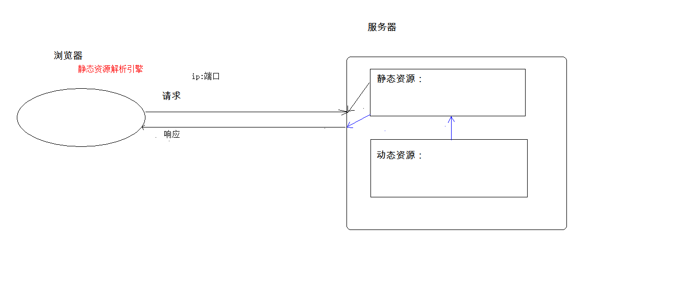

## web相关概念回顾

### 1. 软件架构

1. C/S：客户端/服务器端
2. B/S：浏览器/服务器端

### 2. 资源分类

1. 静态资源：所有用户访问后，得到的结果都是一样的，称为静态资源.静态资源可以直接被浏览器解析
	* 如： html,css,JavaScript
2. 动态资源:每个用户访问相同资源后，得到的结果可能不一样。称为动态资源。动态资源被访问后，需要先转换为静态资源，在返回给浏览器
	* 如：servlet/jsp,php,asp....



### 3. 网络通信三要素

1. IP：电子设备(计算机)在网络中的唯一标识。
2. 端口：应用程序在计算机中的唯一标识。 0~65536
3. 传输协议：规定了数据传输的规则
	1. 基础协议：
		1. tcp:安全协议，三次握手。 速度稍慢
		2. udp：不安全协议。 速度快

## web服务器软件

* 服务器：安装了服务器软件的计算机,比如mysql服务器软件
* 服务器软件：接收用户的请求，处理请求，做出响应
* web服务器软件：接收用户的请求，处理请求，做出响应。
	* 在web服务器软件中，可以部署web项目，让用户通过浏览器来访问这些项目
	* web容器：一些动态资源必须通过web服务器才能访问

### 常见web服务器软件

* webLogic：oracle公司，大型的JavaEE服务器，支持所有的JavaEE规范，收费的。
* webSphere：IBM公司，大型的JavaEE服务器，支持所有的JavaEE规范，收费的。
* JBOSS：JBOSS公司的，大型的JavaEE服务器，支持所有的JavaEE规范，收费的。
* Tomcat：Apache基金组织，中小型的JavaEE服务器，仅仅支持少量的JavaEE规范servlet/jsp。开源的，免费的。

> JavaEE：Java语言在企业级开发中使用的技术规范的总和，一共规定了13项大的规范

###  Tomcat

	1. 下载：http://tomcat.apache.org/
	2. 安装：解压压缩包即可。
		* 注意：安装目录建议不要有中文和空格
	3. 卸载：删除目录就行了
	4. 启动：
		* bin/startup.bat ,双击运行该文件即可
		* 访问：浏览器输入：http://localhost:8080 回车访问自己
						  http://别人的ip:8080 访问别人
		
		* 可能遇到的问题：
			1. 黑窗口一闪而过：
				* 原因： 没有正确配置JAVA_HOME环境变量
				* 解决方案：正确配置JAVA_HOME环境变量
	
			2. 启动报错：
				1. 暴力：找到占用的端口号，并且找到对应的进程，杀死该进程
					* netstat -ano 
				2. 温柔：修改自身的端口号
					* conf/server.xml
					* <Connector port="8888" protocol="HTTP/1.1"
		               connectionTimeout="20000"
		               redirectPort="8445" />
					* 一般会将tomcat的默认端口号修改为80。80端口号是http协议的默认端口号。
						* 好处：在访问时，就不用输入端口号
	5. 关闭：
		1. 正常关闭：
			* bin/shutdown.bat
			* ctrl+c
		2. 强制关闭：
			* 点击启动窗口的×
	6. 配置:
		* 部署项目的方式：
			1. 直接将项目放到webapps目录下即可。
				* /hello：项目的访问路径-->虚拟目录
				* 简化部署：将项目打成一个war包，再将war包放置到webapps目录下。
					* war包会自动解压缩
	
			2. 配置conf/server.xml文件
				在<Host>标签体中配置
				<Context docBase="D:\hello" path="/hehe" />
				* docBase:项目存放的路径
				* path：虚拟目录
	
			3. 在conf\Catalina\localhost创建任意名称的xml文件。在文件中编写
				<Context docBase="D:\hello" />
				* 虚拟目录：xml文件的名称
		
		* 静态项目和动态项目：
			* 目录结构
				* java动态项目的目录结构：
					-- 项目的根目录
						-- WEB-INF目录：
							-- web.xml：web项目的核心配置文件
							-- classes目录：放置字节码文件的目录
							-- lib目录：放置依赖的jar包

### Servlet：  server applet

* 概念：运行在服务器端的小程序
	* Servlet就是一个接口，定义了Java类被浏览器访问到(tomcat识别)的规则。
	* 将来我们自定义一个类，实现Servlet接口，复写方法，tomcat就能被浏览器访问到

#### 快速入门

1. 创建JavaEE项目
  2. 定义一个类，实现Servlet接口

    ```java
    /**
     * Servlet快速入门
     */
    public class ServletDemo1 implements Servlet {
    
    
        @Override
        public void init(ServletConfig servletConfig) throws ServletException {
    
        }
    
        @Override
        public ServletConfig getServletConfig() {
            return null;
        }
    
        //提供服务的方法
        @Override
        public void service(ServletRequest servletRequest, ServletResponse servletResponse) throws ServletException, IOException {
            System.out.println("Hello Servlet");
        }
    
        @Override
        public String getServletInfo() {
            return null;
        }
    
        @Override
        public void destroy() {
    
        }
    }
    
    ```

    

  3. 实现接口中的抽象方法

  4. 配置Servlet
      在web.xml中配置：
      <!--配置Servlet -->
      <servlet>
          <servlet-name>demo1</servlet-name>
          <servlet-class>cn.itcast.web.servlet.ServletDemo1</servlet-class>
      </servlet>

      <servlet-mapping>
          <servlet-name>demo1</servlet-name>
          <url-pattern>/demo1</url-pattern>
      </servlet-mapping>

#### 执行原理

1. 当服务器接受到客户端浏览器的请求后，会解析请求URL路径，获取访问的Servlet的资源路径
2. 查找web.xml文件，是否有对应的<url-pattern>标签体内容。
3. 如果有，则在找到对应的<servlet-class>全类名
4. tomcat会将字节码文件加载进内存，并且创建其对象
5. 调用其方法

