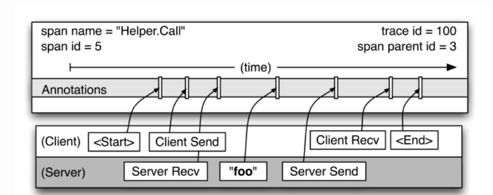
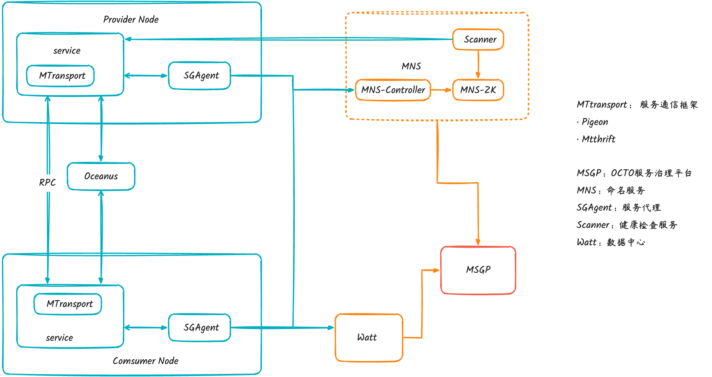

[TOC]


# 一、分布式理论

**对于数据存储领域，当数据量或者请求流量大到一定程度后，就必然会引入分布式**。比如 Redis，虽然其单机性能十分优秀，但是因为下列原因时，也不得不引入集群。

- 单机无法保证高可用，需要引入多实例来提供高可用性
- 单机能够提供高达 8W 左右的QPS，再高的QPS则需要引入多实例
- 单机能够支持的数据量有限，处理更多的数据需要引入多实例；
- 单机所处理的网络流量已经超过服务器的网卡的上限值，需要引入多实例来分流。

有集群，集群往往需要维护一定的元数据，比如实例的ip地址，缓存分片的 slots 信息等，所以需要一套[分布式](https://so.csdn.net/so/search?q=分布式&spm=1001.2101.3001.7020)机制来维护元数据的一致性。这类机制一般有两个模式：分散式和集中式

- 分散式机制将元数据存储在部分或者所有节点上，不同节点之间进行不断的通信来维护元数据的变更和一致性。Redis Cluster，Consul 等都是该模式。
- 而集中式是将集群元数据集中存储在外部节点或者中间件上，比如 zookeeper。旧版本的 kafka 和 storm 等都是使用该模式。


## CAP 理论

**CAP** 也就是 **Consistency（一致性）**、**Availability（可用性）**、**Partition Tolerance（分区容错性）** 这三个单词首字母组合。

CAP 理论的提出者布鲁尔在提出 CAP 猜想的时候，并没有详细定义 **Consistency**、**Availability**、**Partition Tolerance** 三个单词的明确定义。

因此，对于 CAP 的民间解读有很多，一般比较被大家推荐的是下面 👇 这种版本的解读。

在理论计算机科学中，CAP 定理（CAP theorem）指出对于一个分布式系统来说，当设计读写操作时，只能同时满足以下三点中的两个：

- **一致性（Consistency）** : 所有节点访问同一份最新的数据副本
- **可用性（Availability）**: 非故障的节点在合理的时间内返回合理的响应（不是错误或者超时的响应）。
- **分区容错性（Partition Tolerance）** : 分布式系统出现网络分区的时候，仍然能够对外提供服务。

**什么是网络分区？**

分布式系统中，多个节点之间的网络本来是连通的，但是因为某些故障（比如部分节点网络出了问题）某些节点之间不连通了，整个网络就分成了几块区域，这就叫 **网络分区**。

### 不是所谓的“3 选 2”

大部分人解释这一定律时，常常简单的表述为：“一致性、可用性、分区容忍性三者你只能同时达到其中两个，不可能同时达到”。实际上这是一个非常具有误导性质的说法，而且在 CAP 理论诞生 12 年之后，CAP 之父也在 2012 年重写了之前的论文。

> **当发生网络分区的时候，如果我们要继续服务，那么强一致性和可用性只能 2 选 1。也就是说当网络分区之后 P 是前提，决定了 P 之后才有 C 和 A 的选择。也就是说分区容错性（Partition tolerance）我们是必须要实现的。**
>
> 简而言之就是：CAP 理论中分区容错性 P 是一定要满足的，在此基础上，只能满足可用性 A 或者一致性 C。

因此，**分布式系统理论上不可能选择 CA 架构，只能选择 CP 或者 AP 架构。** 比如 ZooKeeper、HBase 就是 CP 架构，Cassandra、Eureka 就是 AP 架构，Nacos 不仅支持 CP 架构也支持 AP 架构。

**为啥不可能选择 CA 架构呢？** 举个例子：若系统出现“分区”，系统中的某个节点在进行写操作。为了保证 C， 必须要禁止其他节点的读写操作，这就和 A 发生冲突了。如果为了保证 A，其他节点的读写操作正常的话，那就和 C 发生冲突了。

**选择 CP 还是 AP 的关键在于当前的业务场景，没有定论，比如对于需要确保强一致性的场景如银行一般会选择保证 CP 。**

另外，需要补充说明的一点是：**如果网络分区正常的话（系统在绝大部分时候所处的状态），也就说不需要保证 P 的时候，C 和 A 能够同时保证。**

### CAP 实际应用案例

**ZooKeeper 保证的是 CP。** 任何时刻对 ZooKeeper 的读请求都能得到一致性的结果，但是， ZooKeeper 不保证每次请求的可用性比如在 Leader 选举过程中或者半数以上的机器不可用的时候服务就是不可用的。

**Eureka 保证的则是 AP。** Eureka 在设计的时候就是优先保证 A （可用性）。在 Eureka 中不存在什么 Leader 节点，每个节点都是一样的、平等的。因此 Eureka 不会像 ZooKeeper 那样出现选举过程中或者半数以上的机器不可用的时候服务就是不可用的情况。 Eureka 保证即使大部分节点挂掉也不会影响正常提供服务，只要有一个节点是可用的就行了。只不过这个节点上的数据可能并不是最新的。

## BASE 理论

**BASE** 是 **Basically Available（基本可用）**、**Soft-state（软状态）** 和 **Eventually Consistent（最终一致性）** 三个短语的缩写。BASE 理论是对 CAP 中一致性 C 和可用性 A 权衡的结果，其来源于对大规模互联网系统分布式实践的总结，是基于 CAP 定理逐步演化而来的，它大大降低了我们对系统的要求。

### 核心思想

**BASE 理论本质上是对 CAP 的延伸和补充，更具体地说，是对 CAP 中 AP 方案的一个补充。**

因此，AP 方案只是在系统发生分区的时候放弃一致性，而不是永远放弃一致性。在分区故障恢复后，系统应该达到最终一致性。这一点其实就是 BASE 理论延伸的地方。

#### 基本可用

基本可用是指分布式系统在出现不可预知故障的时候，允许损失部分可用性。但是，这绝不等价于系统不可用。

**什么叫允许损失部分可用性呢？**

- **响应时间上的损失**: 正常情况下，处理用户请求需要 0.5s 返回结果，但是由于系统出现故障，处理用户请求的时间变为 3 s。
- **系统功能上的损失**：正常情况下，用户可以使用系统的全部功能，但是由于系统访问量突然剧增，系统的部分非核心功能无法使用。

#### 软状态

软状态指允许系统中的数据存在中间状态（**CAP 理论中的数据不一致**），并认为该中间状态的存在不会影响系统的整体可用性，即允许系统在不同节点的数据副本之间进行数据同步的过程存在延时。

#### 最终一致性

最终一致性强调的是系统中所有的数据副本，在经过一段时间的同步后，最终能够达到一个一致的状态。因此，最终一致性的本质是需要系统保证最终数据能够达到一致，而不需要实时保证系统数据的强一致性。

那实现最终一致性的具体方式是什么呢?

- **读时修复** : 在读取数据时，检测数据的不一致，进行修复。比如 Cassandra 的 Read Repair 实现，具体来说，在向 Cassandra 系统查询数据的时候，如果检测到不同节点的副本数据不一致，系统就自动修复数据。

- **写时修复** : 在写入数据，检测数据的不一致时，进行修复。比如 Cassandra 的 Hinted Handoff 实现。具体来说，Cassandra 集群的节点之间远程写数据的时候，如果写失败 就将数据缓存下来，然后定时重传，修复数据的不一致性。

- **异步修复** : 这个是最常用的方式，通过定时对账检测副本数据的一致性，并修复。

## Raft 算法详解

**一致性算法允许一组机器像一个整体一样工作，即使其中一些机器出现故障也能够继续工作下去**。

#### 节点类型

一个 Raft 集群包括若干服务器，以典型的 5 服务器集群举例。在任意的时间，每个服务器一定会处于以下三个状态中的一个：

- `Leader`：负责发起心跳，响应客户端，创建日志，同步日志。
- `Candidate`：Leader 选举过程中的临时角色，由 Follower 转化而来，发起投票参与竞选。
- `Follower`：接受 Leader 的心跳和日志同步数据，投票给 Candidate。

在正常的情况下，只有一个服务器是 Leader，剩下的服务器是 Follower。Follower 是被动的，它们不会发送任何请求，只是响应来自 Leader 和 Candidate 的请求。

#### 任期

raft 算法将时间划分为任意长度的任期（term），任期用连续的数字表示，看作当前 term 号。每一个任期的开始都是一次选举，在选举开始时，一个或多个 Candidate 会尝试成为 Leader。如果一个 Candidate 赢得了选举，它就会在该任期内担任 Leader。如果没有选出 Leader，将会开启另一个任期，并立刻开始下一次选举。raft 算法保证在给定的一个任期最少要有一个 Leader。

每个节点都会存储当前的 term 号，当服务器之间进行通信时会交换当前的 term 号；如果有服务器发现自己的 term 号比其他人小，那么他会更新到较大的 term 值。如果一个 Candidate 或者 Leader 发现自己的 term 过期了，他会立即退回成 Follower。如果一台服务器收到的请求的 term 号是过期的，那么它会拒绝此次请求。

#### 日志

- `entry`：每一个事件成为 entry，只有 Leader 可以创建 entry。entry 的内容为`<term,index,cmd>`其中 cmd 是可以应用到状态机的操作。
- `log`：由 entry 构成的数组，每一个 entry 都有一个表明自己在 log 中的 index。只有 Leader 才可以改变其他节点的 log。entry 总是先被 Leader 添加到自己的 log 数组中，然后再发起共识请求，获得同意后才会被 Leader 提交给状态机。Follower 只能从 Leader 获取新日志和当前的 commitIndex，然后把对应的 entry 应用到自己的状态机中。

#### 领导人选举


#### Gossip 协议

在 Gossip 协议下，没有所谓的中心节点，每个节点周期性地随机找一个节点互相同步彼此的信息，理论上来说，各个节点的状态最终会保持一致。Gossip 设计了两种可能的消息传播模式：

- **反熵（Anti-Entropy）**：集群中的节点，每隔段时间就随机选择某个其他节点，然后通过互相交换自己的所有数据来消除两者之间的差异，实现数据的最终一致性。在实现反熵的时候，主要有推、拉和推拉三种方式：

  - 推方式，就是将自己的所有副本数据，推给对方，修复对方副本中的熵。

  - 拉方式，就是拉取对方的所有副本数据，修复自己副本中的熵。

  - 推拉就是同时修复自己副本和对方副本中的熵。

  - 例子：

    - 节点 A 推送数据给节点 B，节点 B 获取到节点 A 中的最新数据。

      节点 B 推送数据给 C，节点 C 获取到节点 A，B 中的最新数据。

      节点 C 推送数据给 A，节点 A 获取到节点 B，C 中的最新数据。

      节点 A 再推送数据给 B 形成闭环，这样节点 B 就获取到节点 C 中的最新数据。

- **谣言传播：**分布式系统中的一个节点一旦有了新数据之后，就会变为活跃节点，活跃节点会周期性地联系其他节点向其发送新数据，直到所有的节点都存储了该新数据。
- 优点
  - 相比于其他分布式协议/算法来说，Gossip 协议理解起来非常简单。
  - 能够容忍网络上节点的随意地增加或者减少，宕机或者重启，因为 Gossip 协议下这些节点都是平等的，去中心化的。新增加或者重启的节点在理想情况下最终是一定会和其他节点的状态达到一致。
  - 速度相对较快。节点数量比较多的情况下，扩散速度比一个主节点向其他节点传播信息要更快（多播）。
- 缺点
  - 消息需要通过多个传播的轮次才能传播到整个网络中，因此，必然会出现各节点状态不一致的情况。毕竟，Gossip 协议强调的是最终一致，至于达到各个节点的状态一致需要多长时间，谁也无从得知。
  - 可能会出现消息冗余的问题。由于消息传播的随机性，同一个节点可能会重复收到相同的消息。

# 二、分布式锁

## 为什么需要分布式锁？

在多线程环境中，如果多个线程同时访问共享资源（例如商品库存、外卖订单），会发生数据竞争，可能会导致出现脏数据或者系统问题，威胁到程序的正常运行。

为了保证共享资源被安全地访问，我们需要使用互斥操作对共享资源进行保护，即同一时刻只允许一个线程访问共享资源，其他线程需要等待当前线程释放后才能访问。这样可以避免数据竞争和脏数据问题，保证程序的正确性和稳定性。

**如何才能实现共享资源的互斥访问呢？** 锁是一个比较通用的解决方案，更准确点来说是悲观锁。

悲观锁总是假设最坏的情况，认为共享资源每次被访问的时候就会出现问题(比如共享数据被修改)，所以每次在获取资源操作的时候都会上锁，这样其他线程想拿到这个资源就会阻塞直到锁被上一个持有者释放。也就是说，**共享资源每次只给一个线程使用，其它线程阻塞，用完后再把资源转让给其它线程**。

对于单机多线程来说，在 Java 中，我们通常使用 `ReentrantLock` 类、`synchronized` 关键字这类 JDK 自带的 **本地锁** 来控制一个 JVM 进程内的多个线程对本地共享资源的访问。

分布式系统下，不同的服务/客户端通常运行在独立的 JVM 进程上。如果多个 JVM 进程共享同一份资源的话，使用本地锁就没办法实现资源的互斥访问了。于是，**分布式锁** 就诞生了。

## 分布式锁应该具备哪些条件？

一个最基本的分布式锁需要满足：

- **互斥**：任意一个时刻，锁只能被一个线程持有。
- **高可用**：锁服务是高可用的，当一个锁服务出现问题，能够自动切换到另外一个锁服务。并且，即使客户端的释放锁的代码逻辑出现问题，锁最终一定还是会被释放，不会影响其他线程对共享资源的访问。这一般是通过超时机制实现的。
- **可重入**：一个节点获取了锁之后，还可以再次获取锁。

除了上面这三个基本条件之外，一个好的分布式锁还需要满足下面这些条件：

- **高性能**：获取和释放锁的操作应该快速完成，并且不应该对整个系统的性能造成过大影响。
- **非阻塞**：如果获取不到锁，不能无限期等待，避免对系统正常运行造成影响。

## 分布式锁的常见实现方式有哪些？

常见分布式锁实现方案如下：

- 基于关系型数据库比如 MySQL 实现分布式锁。
- 基于分布式协调服务 ZooKeeper 实现分布式锁。
- 基于分布式键值存储系统比如 Redis 、Etcd 实现分布式锁。

关系型数据库的方式一般是通过唯一索引或者排他锁实现。不过，一般不会使用这种方式，问题太多比如性能太差、不具备锁失效机制。

### 基于 Redis 实现分布式锁

不论是本地锁还是分布式锁，核心都在于“互斥”。

在 Redis 中， `SETNX` 命令是可以帮助我们实现互斥。`SETNX` 即 **SET** if **N**ot e**X**ists (对应 Java 中的 `setIfAbsent` 方法)，如果 key 不存在的话，才会设置 key 的值。如果 key 已经存在， `SETNX` 啥也不做。

```java
SETNX lockKey uniqueValue
(integer) 1
SETNX lockKey uniqueValue
(integer) 0

```

释放锁的话，直接通过 `DEL` 命令删除对应的 key 即可。

```java
DEL lockKey
(integer) 1

```

这是一种最简易的 Redis 分布式锁实现，实现方式比较简单，性能也很高效。不过，这种方式实现分布式锁存在一些问题。就比如应用程序遇到一些问题比如释放锁的逻辑突然挂掉，可能会导致锁无法被释放，进而造成共享资源无法再被其他线程/进程访问。

为了避免锁无法被释放，我们可以想到的一个解决办法就是：**给这个 key（也就是锁） 设置一个过期时间** 。

```java
127.0.0.1:6379> SET lockKey uniqueValue EX 3 NX
OK

```

- **lockKey**：加锁的锁名；
- **uniqueValue**：能够唯一标识锁的随机字符串；
- **NX**：只有当 lockKey 对应的 key 值不存在的时候才能 SET 成功；
- **EX**：过期时间设置（秒为单位）EX 3 标示这个锁有一个 3 秒的自动过期时间。与 EX 对应的是 PX（毫秒为单位），这两个都是过期时间设置。

**一定要保证设置指定 key 的值和过期时间是一个原子操作！！！** 不然的话，依然可能会出现锁无法被释放的问题。

这样确实可以解决问题，不过，这种解决办法同样存在漏洞：**如果操作共享资源的时间大于过期时间，就会出现锁提前过期的问题，进而导致分布式锁直接失效。如果锁的超时时间设置过长，又会影响到性能。**

你或许在想：**如果操作共享资源的操作还未完成，锁过期时间能够自己续期就好了！**已经有了现成的解决方案：**[Redisson](https://github.com/redisson/redisson)**

Redisson 是一个开源的 Java 语言 Redis 客户端，提供了很多开箱即用的功能，不仅仅包括多种分布式锁的实现。并且，Redisson 还支持 Redis 单机、Redis Sentinel、Redis Cluster 等多种部署架构。

Redisson 中的分布式锁自带自动续期机制，使用起来非常简单，原理也比较简单，其提供了一个专门用来监控和续期锁的 **Watch Dog（ 看门狗）**，如果操作共享资源的线程还未执行完成的话，Watch Dog 会不断地延长锁的过期时间，进而保证锁不会因为超时而被释放。


**Redis 如何解决集群情况下分布式锁的可靠性？**

为了避免单点故障，生产环境下的 Redis 服务通常是集群化部署的。

Redis 集群下，上面介绍到的分布式锁的实现会存在一些问题。由于 Redis 集群数据同步到各个节点时是异步的，如果在 Redis 主节点获取到锁后，在没有同步到其他节点时，Redis 主节点宕机了，此时新的 Redis 主节点依然可以获取锁，所以多个应用服务就可以同时获取到锁。

针对这个问题，Redis 之父 antirez 设计了 [Redlock 算法open in new window](https://redis.io/topics/distlock) 来解决。

**Redlock 算法的思想是让客户端向 Redis 集群中的多个独立的 Redis 实例依次请求申请加锁，如果客户端能够和半数以上的实例成功地完成加锁操作，那么我们就认为，客户端成功地获得分布式锁，否则加锁失败。**

即使部分 Redis 节点出现问题，只要保证 Redis 集群中有半数以上的 Redis 节点可用，分布式锁服务就是正常的。

Redlock 是直接操作 Redis 节点Redlock 实现比较复杂，性能比较差，发生时钟变迁的情况下还存在安全性隐患。《数据密集型应用系统设计》一书的作者 Martin Kleppmann 曾经专门发文（[How to do distributed locking - Martin Kleppmann - 2016open in new window](https://martin.kleppmann.com/2016/02/08/how-to-do-distributed-locking.html)）怼过 Redlock，他认为这是一个很差的分布式锁实现。感兴趣的朋友可以看看[Redis 锁从面试连环炮聊到神仙打架open in new window](https://mp.weixin.qq.com/s?__biz=Mzg3NjU3NTkwMQ==&mid=2247505097&idx=1&sn=5c03cb769c4458350f4d4a321ad51f5a&source=41#wechat_redirect)这篇文章，有详细介绍到 antirez 和 Martin Kleppmann 关于 Redlock 的激烈辩论。

实际项目中不建议使用 Redlock 算法，成本和收益不成正比。

如果不是非要实现绝对可靠的分布式锁的话，其实单机版 Redis 就完全够了，实现简单，性能也非常高。如果你必须要实现一个绝对可靠的分布式锁的话，可以基于 ZooKeeper 来做，只是性能会差一些。

- **如何实现可重入锁？**

所谓可重入锁指的是在一个线程中可以多次获取同一把锁，比如一个线程在执行一个带锁的方法，该方法中又调用了另一个需要相同锁的方法，则该线程可以直接执行调用的方法即可重入 ，而无需重新获得锁。像 Java 中的 `synchronized` 和 `ReentrantLock` 都属于可重入锁。

**不可重入的分布式锁基本可以满足绝大部分业务场景了，一些特殊的场景可能会需要使用可重入的分布式锁。**

可重入分布式锁的实现核心思路是线程在获取锁的时候判断是否为自己的锁，如果是的话，就不用再重新获取了。为此，我们可以为每个锁关联一个可重入计数器和一个占有它的线程。当可重入计数器大于 0 时，则锁被占有，需要判断占有该锁的线程和请求获取锁的线程是否为同一个。

实际项目中，我们不需要自己手动实现，推荐使用我们上面提到的 **Redisson** ，其内置了多种类型的锁比如可重入锁（Reentrant Lock）、自旋锁（Spin Lock）、公平锁（Fair Lock）、多重锁（MultiLock）、 红锁（RedLock）、 读写锁（ReadWriteLock）。

### 基于 ZooKeeper 实现分布式锁

ZooKeeper 分布式锁是基于 **临时顺序节点** 和 **Watcher（事件监听器）** 实现的。

**获取锁：**

1. 首先我们要有一个持久节点`/locks`，客户端获取锁就是在`locks`下创建临时顺序节点。
2. 假设客户端 1 创建了`/locks/lock1`节点，创建成功之后，会判断 `lock1`是否是 `/locks` 下最小的子节点。
3. 如果 `lock1`是最小的子节点，则获取锁成功。否则，获取锁失败。
4. 如果获取锁失败，则说明有其他的客户端已经成功获取锁。客户端 1 并不会不停地循环去尝试加锁，而是在前一个节点比如`/locks/lock0`上注册一个事件监听器。这个监听器的作用是当前一个节点释放锁之后通知客户端 1（避免无效自旋），这样客户端 1 就加锁成功了。

**释放锁：**

1. 成功获取锁的客户端在执行完业务流程之后，会将对应的子节点删除。
2. 成功获取锁的客户端在出现故障之后，对应的子节点由于是临时顺序节点，也会被自动删除，避免了锁无法被释放。
3. 我们前面说的事件监听器其实监听的就是这个子节点删除事件，子节点删除就意味着锁被释放。


实际项目中，推荐使用 Curator 来实现 ZooKeeper 分布式锁。Curator 是 Netflix 公司开源的一套 ZooKeeper Java 客户端框架，相比于 ZooKeeper 自带的客户端 zookeeper 来说，Curator 的封装更加完善，各种 API 都可以比较方便地使用。

`Curator`主要实现了下面四种锁：

- `InterProcessMutex`：分布式可重入排它锁
- `InterProcessSemaphoreMutex`：分布式不可重入排它锁
- `InterProcessReadWriteLock`：分布式读写锁
- `InterProcessMultiLock`：将多个锁作为单个实体管理的容器，获取锁的时候获取所有锁，释放锁也会释放所有锁资源（忽略释放失败的锁）。

- **为什么要用临时顺序节点？**

每个数据节点在 ZooKeeper 中被称为 **znode**，它是 ZooKeeper 中数据的最小单元。

我们通常是将 znode 分为 4 大类：

- **持久（PERSISTENT）节点**：一旦创建就一直存在即使 ZooKeeper 集群宕机，直到将其删除。
- **临时（EPHEMERAL）节点**：临时节点的生命周期是与 **客户端会话（session）** 绑定的，**会话消失则节点消失** 。并且，**临时节点只能做叶子节点** ，不能创建子节点。
- **持久顺序（PERSISTENT_SEQUENTIAL）节点**：除了具有持久（PERSISTENT）节点的特性之外， 子节点的名称还具有顺序性。比如 `/node1/app0000000001`、`/node1/app0000000002` 。
- **临时顺序（EPHEMERAL_SEQUENTIAL）节点**：除了具备临时（EPHEMERAL）节点的特性之外，子节点的名称还具有顺序性。

可以看出，临时节点相比持久节点，最主要的是对会话失效的情况处理不一样，临时节点会话消失则对应的节点消失。这样的话，如果客户端发生异常导致没来得及释放锁也没关系，会话失效节点自动被删除，不会发生死锁的问题。

使用 Redis 实现分布式锁的时候，我们是通过过期时间来避免锁无法被释放导致死锁问题的，而 ZooKeeper 直接利用临时节点的特性即可。

假设不使用顺序节点的话，所有尝试获取锁的客户端都会对持有锁的子节点加监听器。当该锁被释放之后，势必会造成所有尝试获取锁的客户端来争夺锁，这样对性能不友好。使用顺序节点之后，只需要监听前一个节点就好了，对性能更友好。

- **为什么要设置对前一个节点的监听？**

> Watcher（事件监听器），是 ZooKeeper 中的一个很重要的特性。ZooKeeper 允许用户在指定节点上注册一些 Watcher，并且在一些特定事件触发的时候，ZooKeeper 服务端会将事件通知到感兴趣的客户端上去，该机制是 ZooKeeper 实现分布式协调服务的重要特性。

同一时间段内，可能会有很多客户端同时获取锁，但只有一个可以获取成功。如果获取锁失败，则说明有其他的客户端已经成功获取锁。获取锁失败的客户端并不会不停地循环去尝试加锁，而是在前一个节点注册一个事件监听器。

这个事件监听器的作用是：**当前一个节点对应的客户端释放锁之后（也就是前一个节点被删除之后，监听的是删除事件），通知获取锁失败的客户端（唤醒等待的线程，Java 中的 `wait/notifyAll` ），让它尝试去获取锁，然后就成功获取锁了。**

- **如何实现可重入锁**

  这里以 Curator 的 `InterProcessMutex` 对可重入锁的实现来介绍（源码地址：[InterProcessMutex.javaopen in new window](https://github.com/apache/curator/blob/master/curator-recipes/src/main/java/org/apache/curator/framework/recipes/locks/InterProcessMutex.java)）。

  当我们调用 `InterProcessMutex#acquire`方法获取锁的时候，会调用`InterProcessMutex#internalLock`方法。

  ```java
  // 获取可重入互斥锁，直到获取成功为止
  @Override
  public void acquire() throws Exception {
    if (!internalLock(-1, null)) {
      throw new IOException("Lost connection while trying to acquire lock: " + basePath);
    }
  }
  
  ```

  `internalLock` 方法会先获取当前请求锁的线程，然后从 `threadData`( `ConcurrentMap<Thread, LockData>` 类型)中获取当前线程对应的 `lockData` 。 `lockData` 包含锁的信息和加锁的次数，是实现可重入锁的关键。

  第一次获取锁的时候，`lockData`为 `null`。获取锁成功之后，会将当前线程和对应的 `lockData` 放到 `threadData` 中

  如果已经获取过一次锁，后面再来获取锁的话，直接就会在 `if (lockData != null)` 这里被拦下了，然后就会执行`lockData.lockCount.incrementAndGet();` 将加锁次数加 1。

  整个可重入锁的实现逻辑非常简单，直接在客户端判断当前线程有没有获取锁，有的话直接将加锁次数加 1 就可以了。

## 分布式锁的选择

如果对性能要求比较高的话，建议使用 Redis 实现分布式锁（优先选择 Redisson 提供的现成的分布式锁，而不是自己实现）。

如果对可靠性要求比较高的话，建议使用 ZooKeeper 实现分布式锁（推荐基于 Curator 框架实现）。不过，现在很多项目都不会用到 ZooKeeper，如果单纯是因为分布式锁而引入 ZooKeeper 的话，那是不太可取的，不建议这样做，为了一个小小的功能增加了系统的复杂度。


# 三、分布式ID 

### 什么是 ID？

日常开发中，我们需要对系统中的各种数据使用 ID 唯一表示，比如用户 ID 对应且仅对应一个人，商品 ID 对应且仅对应一件商品，订单 ID 对应且仅对应一个订单。

我们现实生活中也有各种 ID，比如身份证 ID 对应且仅对应一个人、地址 ID 对应且仅对应一个地址。

简单来说，**ID 就是数据的唯一标识**。

### 什么是分布式 ID？

分布式 ID 是分布式系统下的 ID。分布式 ID 不存在与现实生活中，属于计算机系统中的一个概念。

我简单举一个分库分表的例子。

我司的一个项目，使用的是单机 MySQL 。但是，没想到的是，项目上线一个月之后，随着使用人数越来越多，整个系统的数据量将越来越大。单机 MySQL 已经没办法支撑了，需要进行分库分表（推荐 Sharding-JDBC）。

在分库之后， 数据遍布在不同服务器上的数据库，数据库的自增主键已经没办法满足生成的主键唯一了。**我们如何为不同的数据节点生成全局唯一主键呢？**

这个时候就需要生成**分布式 ID**了。

### 分布式 ID 需要满足哪些要求?

分布式 ID 作为分布式系统中必不可少的一环，很多地方都要用到分布式 ID。

一个最基本的分布式 ID 需要满足下面这些要求：

- **全局唯一**：ID 的全局唯一性肯定是首先要满足的！
- **高性能**：分布式 ID 的生成速度要快，对本地资源消耗要小。
- **高可用**：生成分布式 ID 的服务要保证可用性无限接近于 100%。
- **方便易用**：拿来即用，使用方便，快速接入！

除了这些之外，一个比较好的分布式 ID 还应保证：

- **安全**：ID 中不包含敏感信息。
- **有序递增**：如果要把 ID 存放在数据库的话，ID 的有序性可以提升数据库写入速度。并且，很多时候 ，我们还很有可能会直接通过 ID 来进行排序。
- **有具体的业务含义**：生成的 ID 如果能有具体的业务含义，可以让定位问题以及开发更透明化（通过 ID 就能确定是哪个业务）。
- **独立部署**：也就是分布式系统单独有一个发号器服务，专门用来生成分布式 ID。这样就生成 ID 的服务可以和业务相关的服务解耦。不过，这样同样带来了网络调用消耗增加的问题。总的来说，如果需要用到分布式 ID 的场景比较多的话，独立部署的发号器服务还是很有必要的。

### 分布式 ID 常见解决方案

#### 数据库

- **主键自增：**这种方式就比较简单直白了，就是通过关系型数据库的自增主键产生来唯一的 ID。以 MySQL 举例，我们通过下面的方式即可。

  - **创建一个数据库表。**`stub` 字段无意义，只是为了占位，便于我们插入或者修改数据。并且，给 `stub` 字段创建了唯一索引，保证其唯一性。

    ```sql
    CREATE TABLE `sequence_id` (
      `id` bigint(20) unsigned NOT NULL AUTO_INCREMENT,
      `stub` char(10) NOT NULL DEFAULT '',
      PRIMARY KEY (`id`),
      UNIQUE KEY `stub` (`stub`)
    ) ENGINE=InnoDB DEFAULT CHARSET=utf8mb4;
    ```

  - **通过 `replace into` 来插入数据。**

    ```sql
    BEGIN;
    REPLACE INTO sequence_id (stub) VALUES ('stub');
    SELECT LAST_INSERT_ID();
    COMMIT;
    ```

    - 第一步：尝试把数据插入到表中。
    - 第二步：如果主键或唯一索引字段出现重复数据错误而插入失败时，先从表中删除含有重复关键字值的冲突行，然后再次尝试把数据插入到表中。

- 这种方式的优缺点也比较明显：

- **优点**：实现起来比较简单、ID 有序递增、存储消耗空间小
- **缺点**：支持的并发量不大、存在数据库单点问题（可以使用数据库集群解决，不过增加了复杂度）、ID 没有具体业务含义、安全问题（比如根据订单 ID 的递增规律就能推算出每天的订单量，商业机密啊！ ）、每次获取 ID 都要访问一次数据库（增加了对数据库的压力，获取速度也慢）

#### 数据库号段模式

数据库主键自增这种模式，每次获取 ID 都要访问一次数据库，ID 需求比较大的时候，肯定是不行的。

如果我们可以批量获取，然后存在在内存里面，需要用到的时候，直接从内存里面拿就舒服了！这也就是我们说的 **基于数据库的号段模式来生成分布式 ID。**

数据库的号段模式也是目前比较主流的一种分布式 ID 生成方式。像滴滴开源的[Tinyidopen in new window](https://github.com/didi/tinyid/wiki/tinyid原理介绍) 就是基于这种方式来做的。不过，TinyId 使用了双号段缓存、增加多 db 支持等方式来进一步优化。

以 MySQL 举例，我们通过下面的方式即可。

**1. 创建一个数据库表。**

```sql
CREATE TABLE `sequence_id_generator` (
  `id` int(10) NOT NULL,
  `current_max_id` bigint(20) NOT NULL COMMENT '当前最大id',
  `step` int(10) NOT NULL COMMENT '号段的长度',
  `version` int(20) NOT NULL COMMENT '版本号',
  `biz_type`    int(20) NOT NULL COMMENT '业务类型',
   PRIMARY KEY (`id`)
) ENGINE=InnoDB DEFAULT CHARSET=utf8mb4;

```

`current_max_id` 字段和`step`字段主要用于获取批量 ID，获取的批量 id 为：`current_max_id ~ current_max_id+step`。`version` 字段主要用于解决并发问题（乐观锁）,`biz_type` 主要用于表示业务类型。

**2. 先插入一行数据。**

```sql
INSERT INTO `sequence_id_generator` (`id`, `current_max_id`, `step`, `version`, `biz_type`)
VALUES
 (1, 0, 100, 0, 101);

```

**3. 通过 SELECT 获取指定业务下的批量唯一 ID**

```sql
SELECT `current_max_id`, `step`,`version` FROM `sequence_id_generator` where `biz_type` = 101

```

结果：

```sql
id current_max_id step version biz_type
1 0 100 0 101

```

**4. 不够用的话，更新之后重新 SELECT 即可。**

```sql
UPDATE sequence_id_generator SET current_max_id = 0+100, version=version+1 WHERE version = 0  AND `biz_type` = 101
SELECT `current_max_id`, `step`,`version` FROM `sequence_id_generator` where `biz_type` = 101
```


相比于数据库主键自增的方式，**数据库的号段模式对于数据库的访问次数更少，数据库压力更小。**

另外，为了避免单点问题，你可以从使用主从模式来提高可用性。

**数据库号段模式的优缺点:**

- **优点**：ID 有序递增、存储消耗空间小
- **缺点**：存在数据库单点问题（可以使用数据库集群解决，不过增加了复杂度）、ID 没有具体业务含义、安全问题（比如根据订单 ID 的递增规律就能推算出每天的订单量，商业机密啊！ ）

#### NoSQL

一般情况下，NoSQL 方案使用 Redis 多一些。我们通过 Redis 的 `incr` 命令即可实现对 id 原子顺序递增。

为了提高可用性和并发，我们可以使用 Redis Cluster。Redis Cluster 是 Redis 官方提供的 Redis 集群解决方案（3.0+版本）。

除了 Redis Cluster 之外，你也可以使用开源的 Redis 集群方案[Codisopen in new window](https://github.com/CodisLabs/codis) （大规模集群比如上百个节点的时候比较推荐）。

**Redis 方案的优缺点：**

- **优点**：性能不错并且生成的 ID 是有序递增的
- **缺点**：和数据库主键自增方案的缺点类似

#### 算法

- UUID

  - UUID 是 Universally Unique Identifier（通用唯一标识符） 的缩写。UUID 包含 32 个 16 进制数字（8-4-4-4-12）。

  - JDK 就提供了现成的生成 UUID 的方法，一行代码就行了。

  ```java
  	//输出示例：cb4a9ede-fa5e-4585-b9bb-d60bce986eaa
  UUID.randomUUID()
  ```

  - 5 种不同的 Version(版本)值分别对应的含义（参考[维基百科对于 UUID 的介绍open in new window](https://zh.wikipedia.org/wiki/通用唯一识别码)）：
    - **版本 1** : UUID 是根据时间和节点 ID（通常是 MAC 地址）生成；

  - **版本 2** : UUID 是根据标识符（通常是组或用户 ID）、时间和节点 ID 生成；

  - **版本 3、版本 5** : 版本 5 - 确定性 UUID 通过散列（hashing）名字空间（namespace）标识符和名称生成；

  - **版本 4** : UUID 使用[随机性open in new window](https://zh.wikipedia.org/wiki/随机性)或[伪随机性open in new window](https://zh.wikipedia.org/wiki/伪随机性)生成。

  - **优点**：生成速度比较快、简单易用

  - **缺点**：存储消耗空间大（32 个字符串，128 位）、 不安全（基于 MAC 地址生成 UUID 的算法会造成 MAC 地址泄露)、无序（非自增）、没有具体业务含义、需要解决重复 ID 问题（当机器时间不对的情况下，可能导致会产生重复 ID）

- **Snowflake(雪花算法)**

  - snowflake 是 Twitter 开源的分布式 ID 生成算法。Snowflake 由 64 bit 的二进制数字组成，这 64bit 的二进制被分成了几部分，每一部分存储的数据都有特定的含义：
    - **sign(1bit)**:符号位（标识正负），始终为 0，代表生成的 ID 为正数。
    - **timestamp (41 bits)**:一共 41 位，用来表示时间戳，单位是毫秒，可以支撑 2 ^41 毫秒（约 69 年）
    - **datacenter id + worker id (10 bits)**:一般来说，前 5 位表示机房 ID，后 5 位表示机器 ID（实际项目中可以根据实际情况调整）。这样就可以区分不同集群/机房的节点。
    - **sequence (12 bits)**:一共 12 位，用来表示序列号。 序列号为自增值，代表单台机器每毫秒能够产生的最大 ID 数(2^12 = 4096),也就是说单台机器每毫秒最多可以生成 4096 个 唯一 ID。
  - **优点**：生成速度比较快、生成的 ID 有序递增、比较灵活（可以对 Snowflake 算法进行简单的改造比如加入业务 ID）
  - **缺点**：需要解决重复 ID 问题（ID 生成依赖时间，在获取时间的时候，可能会出现时间回拨的问题，也就是服务器上的时间突然倒退到之前的时间，进而导致会产生重复 ID）、依赖机器 ID 对分布式环境不友好（当需要自动启停或增减机器时，固定的机器 ID 可能不够灵活）。

  > 时钟回拨问题解决
  >
  > 服务启动时首先检查自己是否写过ZooKeeper leaf_forever节点：
  >
  > 1. 若写过，则用自身系统时间与leaf_forever/${self}节点记录时间做比较，若小于leaf_forever/${self}时间则认为机器时间发生了大步长回拨，服务启动失败并报警。
  > 2. 若未写过，证明是新服务节点，直接创建持久节点leaf_forever/${self}并写入自身系统时间，接下来综合对比其余Leaf节点的系统时间来判断自身系统时间是否准确，具体做法是取leaf_temporary下的所有临时节点(所有运行中的Leaf-snowflake节点)的服务IP：Port，然后通过RPC请求得到所有节点的系统时间，计算sum(time)/nodeSize。
  > 3. 若abs( 系统时间-sum(time)/nodeSize ) < 阈值，认为当前系统时间准确，正常启动服务，同时写临时节点leaf_temporary/${self} 维持租约。
  > 4. 否则认为本机系统时间发生大步长偏移，启动失败并报警。
  > 5. 每隔一段时间(3s)上报自身系统时间写入leaf_forever/${self}。

#### 开源框架

- UidGenerator(百度)
- Leaf(美团)
- Tinyid(滴滴)

# 四、服务发现/注册

每个服务节点在启动运行的时候，会向注册中心注册服务，也就是是将自己的地址信息（ip, 断开以及服务名字等信息的组合）上报给我注册中心，注册中心负责将地址信息保存起来，这就是服务注册。

一个服务节点如果要调用另一个服务节点，会直接拿着服务的信息找注册中心要对方的地址信息，这就是服务发现。通常情况下，服务节点拿到地址信息之后，还会在本地缓存一份，保存在注册中心宕机时仍然可以正常调用。

## 1. Zookeeper

https://blog.csdn.net/qq_37555071/article/details/114609145

### 概述

- 简单来说， `ZooKeeper` 是一个 **分布式协调服务框架** 。对于分布式来说，首先需要将业务进行拆分，然后再加机器，同时你还要去解决分布式带来的一系列问题。

- **主要解决的问题是**：各个分布式组件如何协调起来，如何减少各个系统之间的耦合度，分布式事务的处理，如何去配置整个分布式系统等等。
- 设计一个分布式系统必定会遇到一个问题—— **因为分区容忍性（partition tolerance）的存在，就必定要求我们需要在系统可用性（availability）和数据一致性（consistency）中做出权衡** 。这就是著名的 `CAP` 定理。`ZooKeeper` 的处理方式，它保证了 CP（数据一致性）。

### 一致性协议和算法

https://mp.weixin.qq.com/s/b5mGEbn-FLb9vhOh1OpwIg

而为了解决数据一致性问题，在科学家和程序员的不断探索中，就出现了很多的一致性协议和算法。比如 2PC（两阶段提交），3PC（三阶段提交），Paxos 算法等等。

- 2PC（两阶段提交）

  - 两阶段提交是一种保证分布式系统数据一致性的协议，现在很多数据库都是采用的两阶段提交协议来完成 **分布式事务** 的处理。

  - 在两阶段提交中，主要涉及到两个角色，分别是协调者和参与者。

    - 第一阶段：当要执行一个分布式事务的时候，事务发起者首先向协调者发起事务请求，然后协调者会给所有参与者发送 `prepare` 请求（其中包括事务内容）告诉参与者你们需要执行事务了，如果能执行我发的事务内容那么就先执行但不提交，执行后请给我回复。然后参与者收到 `prepare` 消息后，他们会开始执行事务（但不提交），并将 `Undo` 和 `Redo` 信息记入事务日志中，之后参与者就向协调者反馈是否准备好了。

    - 第二阶段：第二阶段主要是协调者根据参与者反馈的情况来决定接下来是否可以进行事务的提交操作，即提交事务或者回滚事务。比如这个时候 **所有的参与者** 都返回了准备好了的消息，这个时候就进行事务的提交，协调者此时会给所有的参与者发送 **`Commit` 请求** ，当参与者收到 `Commit` 请求的时候会执行前面执行的事务的 **提交操作** ，提交完毕之后将给协调者发送提交成功的响应。

    而如果在第一阶段并不是所有参与者都返回了准备好了的消息，那么此时协调者将会给所有参与者发送 **回滚事务的 `rollback` 请求**，参与者收到之后将会 **回滚它在第一阶段所做的事务处理** ，然后再将处理情况返回给协调者，最终协调者收到响应后便给事务发起者返回处理失败的结果。

  - 优点：原理简单，实现方便

  - 缺点:
  
    - `同步阻塞`: 在二阶段提交的过程中，所有的节点都在等待其他节点的响应，无法进行其他操作。这种同步阻塞极大的限制了分布式系统的性能。
    - `单点问题`:  协调者在整个二阶段提交过程中很重要，如果协调者在提交阶段出现问题，那么整个流程将无法运转。更重要的是，其他参与者将会处于一直锁定事务资源的状态中，而无法继续完成事务操作
    - `数据不一致`:  假设当协调者向所有的参与者发送commit请求之后，发生了局部网络异常，或者是协调者在尚未发送完所有 commit请求之前自身发生了崩溃，导致最终只有部分参与者收到了commit请求。这将导致严重的数据不一致问题。
    - `容错性不好`:二阶段提交协议没有设计较为完善的容错机制，任意一个节点是失败都会导致整个事务的失败。
  
- 3PC (三阶段提交)

  - `引入超时机制`。同时在协调者和参与者中都引入超时机制。
  - 第一阶段和第二阶段中插入一个`准备阶段`。保证了在最后提交阶段之前各参与节点的状态是一致的。也就是说，除了引入超时机制之外，3PC把2PC的`准备阶段再次一分为二`，这样三阶段提交就有CanCommit、PreCommit、DoCommit三个阶段。
    - **CanCommit 阶段**：协调者向所有参与者发送 `CanCommit` 请求，参与者收到请求后会根据自身情况查看是否能执行事务，如果可以则返回 YES 响应并进入预备状态，否则返回 NO 。
    - **PreCommit 阶段**：协调者根据参与者的反应情况来决定是否可以记性事务的PreCommit操作。根据响应情况，有以下两种可能。假如协调者从所有的参与者获得的反馈`都是Yes响应`，那么就会执行事务的预执行。假如有任何一个参与者向协调者发送了No响应**，或者等待超时之后，协调者都没有接到参与者的响应，那么就执行事务的`中断`。**
    - **DoCommit 阶段**：这个阶段其实和 `2PC` 的第二阶段差不多，如果协调者收到了所有参与者在 `PreCommit` 阶段的 YES 响应，那么协调者将会给所有参与者发送 `DoCommit` 请求，**参与者收到 `DoCommit` 请求后则会进行事务的提交工作**，完成后则会给协调者返回响应，协调者收到所有参与者返回的事务提交成功的响应之后则完成事务。若协调者在 `PreCommit` 阶段 **收到了任何一个 NO 或者在一定时间内没有收到所有参与者的响应** ，那么就会进行中断请求的发送，参与者收到中断请求后则会 **通过上面记录的回滚日志** 来进行事务的回滚操作，并向协调者反馈回滚状况，协调者收到参与者返回的消息后，中断事务。
  - `3PC` 在很多地方进行了超时中断的处理，比如协调者在指定时间内未收到全部的确认消息则进行事务中断的处理，这样能 **减少同步阻塞的时间** 。
  - **`3PC` 在 `DoCommit` 阶段参与者如未收到协调者发送的提交事务的请求，它会在一定时间内进行事务的提交**。为什么这么做呢？是因为这个时候我们肯定**保证了在第一阶段所有的协调者全部返回了可以执行事务的响应**，这个时候我们有理由**相信其他系统都能进行事务的执行和提交**，所以**不管**协调者有没有发消息给参与者，进入第三阶段参与者都会进行事务的提交操作。
  - 与2PC区别：第二阶段才写undo和redo事务日志 第三阶段协调者出现异常或网络超时参与者也会commit
  - 优点：改善同步阻塞 改善单点故障
  - 缺点：同步阻塞 单点故障 数据不一致 容错机制不完善

### 数据库中的2PC

在`innodb`存储引擎，对数据库的修改都会写到`undo`和`redo`中，不只是数据库，很多需要事务支持的都会用到这个思路。

对一条数据的修改操作首先写undo日志，记录的数据原来的样子，接下来执行事务修改操作，把数据写到redo日志里面，万一捅娄子，事务失败了，可从undo里面回复数据。

不只是数据库，在很多企业里面，比如华为等提交数据库修改都回要求这样，你要新增一个字段，首先要把修改数据库的字段SQL提交给DBA（redo），这不够，还需要把`删除你提交字`段，把数据还原成你修改之前的语句也一并提交者叫（undo）

数据库通过undo与redo能保证数据的强一致性，要解决分布式事务的前提就是当个节点是支持事务的。

这在个前提下，2pc借鉴这失效，首先把整个分布式事务分两节点，首先第一阶段叫准备节点，事务的请求都发送给一个个的资源，这里的资源可以是数据库，也可以是其他支持事务的框架，他们会分别执行自己的事务，写日志到undo与redo，但是不提交事务。

当事务管理器收到了所以资源的反馈，事务都执行没报错后，事务管理器再发送commit指令让资源把事务提交，一旦发现任何一个资源在准备阶段没有执行成功，事务管理器会发送rollback，让所有的资源都回滚。这就是2pc，非常非常简单。

### Zookeeper的特点

- 集群：Zookeeper是一个领导者（Leader），多个跟随者（Follower）组成的集群。
- 高可用性：集群中只要有半数以上节点存活，Zookeeper集群就能正常服务。
- 全局数据一致：每个Server保存一份相同的数据副本，Client无论连接到哪个Server，数据都是一致的。
- 更新请求顺序进行：来自同一个Client的更新请求按其发送顺序依次执行。
- 数据更新原子性：一次数据更新要么成功，要么失败。
- 实时性：在一定时间范围内，Client能读到最新数据。
- 从设计模式角度来看，zk是一个基于观察者设计模式的框架，它负责管理跟存储大家都关心的数据，然后接受观察者的注册，数据反生变化zk会通知在zk上注册的观察者做出反应。
- Zookeeper是一个分布式协调系统，满足CP性，跟SpringCloud中的Eureka满足AP不一样。

### 一致性协议之 ZAB

作为一个优秀高效且可靠的分布式协调框架，`ZooKeeper` 在解决分布式数据一致性问题时并没有直接使用 `Paxos` ，而是专门定制了一致性协议叫做 `ZAB(ZooKeeper Automic Broadcast)` 原子广播协议，该协议能够很好地支持 **崩溃恢复** 。

**ZAB 中三个主要的角色**，Leader 领导者、Follower跟随者、Observer观察者 。

- Leader ：集群中 唯一的写请求处理者 ，能够发起投票（投票也是为了进行写请求）。
- Follower：能够接收客户端的请求，如果是读请求则可以自己处理，如果是写请求则要转发给 Leader 。在选举过程中会参与投票，有选举权和被选举权 。
- Observer ：就是没有选举权和被选举权的 Follower 。
- 在 ZAB 协议中对 zkServer(即上面我们说的三个角色的总称) 还有两种模式的定义，分别是 消息广播 和 崩溃恢复 。

**ZXID和myid**

ZooKeeper 采用全局递增的事务 id 来标识，所有 proposal(提议)在被提出的时候加上了ZooKeeper Transaction Id 。ZXID是64位的Long类型，这是保证事务的顺序一致性的关键。ZXID中高32位表示纪元epoch，低32位表示事务标识xid。**你可以认为zxid越大说明存储数据越新。**

- 每个leader都会具有不同的epoch值，表示一个纪元/朝代，用来标识 leader周期。每个新的选举开启时都会生成一个新的epoch，从1开始，每次选出新的Leader，epoch递增1，并会将该值更新到所有的zkServer的zxid的epoch。
- **xid是一个依次递增的事务编号。数值越大说明数据越新，**可以简单理解为递增的事务id。每次epoch变化，都将低32位的序号重置，这样保证了zxid的全局递增性。

- 每个ZooKeeper服务器，都需要在数据文件夹下创建一个名为myid的文件，该文件包含整个ZooKeeper集群唯一的id（整数）。例如，某ZooKeeper集群包含三台服务器，hostname分别为zoo1、zoo2和zoo3，其myid分别为1、2和3，则在配置文件中其id与hostname必须一一对应，如下所示。在该配置文件中，server.后面的数据即为myid

**历史队列**

每一个follower节点都会有一个**先进先出**（FIFO)的队列用来存放收到的事务请求，保证执行事务的顺序。所以：

- 可靠提交由ZAB的事务一致性协议保证
- 全局有序由TCP协议保证
- 因果有序由follower的历史队列(history queue)保证

**消息广播模式**

ZAB协议两种模式：消息广播模式和崩溃恢复模式。

- leader从客户端收到一个写请求

- leader生成一个新的事务并为这个事务生成一个唯一的ZXID

- leader将这个事务发送给所有的follows节点，将带有 zxid 的消息作为一个提案(proposal)分发给所有 follower。

- follower节点将收到的事务请求加入到历史队列(history queue)中，当 follower 接收到 proposal，先将 proposal 写到硬盘，写硬盘

  成功后再向 leader 回一个 ACK

- 当leader收到大多数follower（超过一半）的ack消息，leader会向follower发送commit请求（leader自身也要提交这个事务）

- 当follower收到commit请求时，会判断该事务的ZXID是不是比历史队列中的任何事务的ZXID都小，如果是则提交事务，如果不是则等待比它更小的事务的commit(保证顺序性)

- Leader将处理结果返回给客户端

- 过半写成功策略：Leader节点接收到写请求后，这个Leader会将写请求广播给各个Server，各个Server会将该写请求加入历史队列，并向Leader发送ACK信息，当Leader收到一半以上的ACK消息后，说明该写操作可以执行。Leader会向各个server发送commit消息，各个server收到消息后执行commit操作。
  

Follower/Observer也可以接受写请求，此时：

- Follower/Observer接受写请求以后，不能直接处理，而需要将写请求转发给Leader处理。除了多了一步请求转发，其它流程与直接写Leader无任何区别
- Leader处理写请求是通过上面的消息广播模式，实质上最后所有的zkServer都要执行写操作，这样数据才会一致

而对于读请求，Leader/Follower/Observer都可直接处理读请求，从本地内存中读取数据并返回给客户端即可。由于处理读请求不需要各个服务器之间的交互，因此Follower/Observer越多，整体可处理的读请求量越大，也即读性能越好。

**崩溃恢复模式**

- 选举阶段（Leader election）：当leader崩溃后，集群进入选举阶段（下面会将如何选举Leader），开始选举出潜在的准 leader，然后进入下一个阶段。
- 发现阶段（Discovery）：用于在从节点中发现最新的ZXID和事务日志。准Leader接收所有Follower发来各自的最新epoch值。Leader从中选出最大的epoch，基于此值加1，生成新的epoch分发给各个Follower。各个Follower收到全新的epoch后，返回ACK给Leader，带上各自最大的ZXID和历史提议日志。Leader选出最大**的ZXID**，并更新自身历史日志，此时Leader就用拥有了最新的提议历史。（注意：每次epoch变化时，ZXID的第32位从0开始计数）。
- 同步阶段（Synchronization）：主要是利用 leader 前一阶段获得的最新提议历史，同步给集群中所有的Follower。只有当超过半数Follower同步成功，这个准Leader才能成为正式的Leader。这之后，follower 只会接收 zxid 比自己的 lastZxid 大的提议。
- 广播阶段（Broadcast）：集群恢复到广播模式，开始接受客户端的写请求。

**脑裂问题**

- 就是比如当你的 cluster 里面有两个节点，它们都知道在这个 cluster 里需要选举出一个 master。那么当它们两之间的通信完全没有问题的时候，就会达成共识，选出其中一个作为 master。但是如果它们之间的通信出了问题，那么两个结点都会觉得现在没有 master，所以每个都把自己选举成 master，于是 cluster 里面就会有两个 master。
- ZAB为解决脑裂问题，要求集群内的节点数量为2N+1, 当网络分裂后，始终有一个集群的节点数量过半数，而另一个集群节点数量小于N+1（即小于半数）, 因为选主需要过半数节点同意，所以任何情况下集群中都不可能出现大于一个leader的情况。
- 因此，有了过半机制，对于一个Zookeeper集群，要么没有Leader，要没只有1个Leader，这样就避免了脑裂问题。

###  **Zookeeper选举机制**

Leader 选举可以分为两个不同的阶段，第一个是我们提到的 Leader 宕机需要重新选举，第二则是当 Zookeeper 启动时需要进行系统的 Leader 初始化选举。下面是zkserver的几种状态：

- LOOKING 不确定Leader状态。该状态下的服务器认为当前集群中没有Leader，会发起Leader选举。
- FOLLOWING 跟随者状态。表明当前服务器角色是Follower，并且它知道Leader是谁。
- LEADING 领导者状态。表明当前服务器角色是Leader，它会维护与Follower间的心跳。
- OBSERVING 观察者状态。表明当前服务器角色是Observer，与Folower唯一的不同在于不参与选举，也不参与集群写操作时的投票。

 **初始化Leader选举**

假设我们集群中有3台机器，那也就意味着我们需要2台同意（超过半数）。这里假设服务器1~3的myid分别为1,2,3，初始化Leader选举过程如下：

- 服务器 1 启动，发起一次选举。它会首先 投票给自己 ，投票内容为(myid, ZXID)，因为初始化所以 ZXID 都为0，此时 server1 发出的投票为(1, 0)，即myid为1， ZXID为0。此时服务器 1 票数一票，不够半数以上，选举无法完成，服务器 1 状态保持为 LOOKING。
- 服务器 2 启动，再发起一次选举。服务器2首先也会将投票选给自己(2, 0)，并将投票信息广播出去（server1也会，只是它那时没有其他的服务器了），server1 在收到 server2 的投票信息后会将投票信息与自己的作比较。首先它会比较 ZXID ，ZXID 大的优先为 Leader，如果相同则比较 myid，myid 大的优先作为 Leader。所以，此时server1 发现 server2 更适合做 Leader，它就会将自己的投票信息更改为(2, 0)然后再广播出去，之后server2 收到之后发现和自己的一样无需做更改。此时，服务器1票数0票，服务器2票数2票，投票已经超过半数，确定 server2 为 Leader。服务器 1更改状态为 FOLLOWING，服务器 2 更改状态为 LEADING。
- 服务器 3 启动，发起一次选举。此时服务器 1，2已经不是 LOOKING 状态，它会直接以 FOLLOWING 的身份加入集群。

**运行时Leader选举**

运行时候如果Leader节点崩溃了会走崩溃恢复模式，新Leader选出前会暂停对外服务，大致可以分为四个阶段：选举、发现、同步、广播（见4.5节），此时Leader选举流程如下：

- Leader挂掉，剩下的两个 Follower 会将自己的状态 从 Following 变为 Looking 状态 ，每个Server会发出一个投票，第一次都是投自己，其中投票内容为(myid, ZXID)，注意这里的 zxid 可能不是0了
- 收集来自各个服务器的投票
- 处理投票，处理逻辑：优先比较ZXID，然后比较myid
- 统计投票，只要超过半数的机器接收到同样的投票信息，就可以确定leader
- 改变服务器状态Looking变为Following或Leading
- 然后依次进入发现、同步、广播阶段

### Zookeeper数据模型

- ZooKeeper 数据模型（Data model）采用层次化的多叉树形结构，每个节点上都可以存储数据，这些数据可以是数字、字符串或者是二级制序列。并且，每个节点还可以拥有 N 个子节点，最上层是根节点以`/`来代表。

- 每个数据节点在 ZooKeeper 中被称为 znode，它是 ZooKeeper 中数据的最小单元。并且，每个 znode 都一个唯一的路径标识。由于ZooKeeper 主要是用来协调服务的，而不是用来存储业务数据的，这种特性使得 Zookeeper 不能用于存放大量的数据，每个节点的存放数据上限为1M。

和文件系统一样，我们能够自由的增加、删除znode，在一个znode下增加、删除子znode，唯一的不同在于znode是可以存储数据的。默认有四种类型的znode（在zookeeper客户端使用`get`命令可以查看znode的内容和状态信息.）：

- 持久化目录节点 PERSISTENT：客户端与zookeeper断开连接后，该节点依旧存在。
- 持久化顺序编号目录节点 PERSISTENT_SEQUENTIAL：客户端与zookeeper断开连接后，该节点依旧存在，只是Zookeeper给该节点名称进行顺序编号。
- 临时目录节点 EPHEMERAL：客户端与zookeeper断开连接后，该节点被删除。
- 临时顺序编号目录节点 EPHEMERAL_SEQUENTIAL：客户端与zookeeper断开连接后，该节点被删除，只是Zookeeper给该节点名称进行顺序编号。

### Zookeeper监听通知机制

Watcher 监听机制是 Zookeeper 中非常重要的特性，我们基于 Zookeeper上创建的节点，可以对这些节点绑定监听事件，比如可以监听节点数据变更、节点删除、子节点状态变更等事件，通过这个事件机制，可以基于 Zookeeper 实现分布式锁、集群管理等多种功能，它有点类似于订阅的方式，即客户端向服务端 注册 指定的 watcher ，当服务端符合了 watcher 的某些事件或要求则会 向客户端发送事件通知 ，客户端收到通知后找到自己定义的 Watcher 然后 执行相应的回调方法 。

当客户端在Zookeeper上某个节点绑定监听事件后，如果该事件被触发，Zookeeper会通过回调函数的方式通知客户端，但是客户端只会收到一次通知。如果后续这个节点再次发生变化，那么之前设置 Watcher 的客户端不会再次收到消息（Watcher是一次性的操作），可以通过循环监听去达到永久监听效果。

ZooKeeper 的 Watcher 机制，总的来说可以分为三个过程：

- 客户端注册 Watcher，注册 watcher 有 3 种方式，getData、exists、getChildren。
- 服务器处理 Watcher 。
- 客户端回调 Watcher 客户端。

监听通知机制的流程如下：

- 首先要有一个main()线程
- 在main线程中创建zkClient，这时就会创建两个线程，一个负责网络连接通信（connet），一个负责监听（listener）。
- 通过connect线程将注册的监听事件发送给Zookeeper。
- 在Zookeeper的注册监听器列表中将注册的监听事件添加到列表中。
- Zookeeper监听到有数据或路径变化，就会将这个消息发送给listener线程。
- listener线程内部调用了process()方法。

### Zookeeper会话（Session）

Session 可以看作是 ZooKeeper 服务器与客户端的之间的一个 TCP 长连接，客户端与服务端之间的任何交互操作都和Session 息息相关，其中包含zookeeper的临时节点的生命周期、客户端请求执行以及Watcher通知机制等。

### 应用

**Zookeeper分布式锁**

**分布式锁**是雅虎研究员设计Zookeeper的初衷。利用Zookeeper的临时顺序节点，可以轻松实现分布式锁。

- 首先，在Zookeeper当中创建一个持久节点ParentLock。当第一个客户端想要获得锁时，需要在ParentLock这个节点下面创建一个**临时顺序节点** Lock1。
- 之后，Client1查找ParentLock下面所有的临时顺序节点并排序，判断自己所创建的节点Lock1是不是顺序最靠前的一个。如果是第一个节点，则成功获得锁。
- 这时候，如果再有一个客户端 Client2 前来获取锁，则在ParentLock下载再创建一个临时顺序节点Lock2。
- Client2查找ParentLock下面所有的临时顺序节点并排序，判断自己所创建的节点Lock2是不是顺序最靠前的一个，结果发现节点Lock2并不是最小的。
- 于是，Client2向排序仅比它靠前的节点Lock1注册**Watcher**，用于监听Lock1节点是否存在。这意味着Client2抢锁失败，进入了等待状态。
- 这时候，如果又有一个客户端Client3前来获取锁，则在ParentLock下载再创建一个临时顺序节点Lock3。
- Client3查找ParentLock下面所有的临时顺序节点并排序，判断自己所创建的节点Lock3是不是顺序最靠前的一个，结果同样发现节点Lock3并不是最小的。
- 于是，Client3向排序仅比它靠前的节点Lock2注册Watcher，用于监听Lock2节点是否存在。这意味着Client3同样抢锁失败，进入了等待状态。
- 这样一来，Client1得到了锁，Client2监听了Lock1，Client3监听了Lock2。这恰恰形成了一个等待队列，很像是Java当中ReentrantLock所依赖的AQS（AbstractQueuedSynchronizer）。

 **释放锁**

- 当任务完成时，Client1会显示调用删除节点Lock1的指令。
- 获得锁的Client1在任务执行过程中，如果Duang的一声崩溃，则会断开与Zookeeper服务端的链接。根据临时节点的特性，相关联的节点Lock1会随之自动删除。
- 由于Client2一直监听着Lock1的存在状态，当Lock1节点被删除，Client2会立刻收到通知。这时候Client2会再次查询ParentLock下面的所有节点，确认自己创建的节点Lock2是不是目前最小的节点。如果是最小，则Client2顺理成章获得了锁。
- 同理，如果Client2也因为任务完成或者节点崩溃而删除了节点Lock2，那么Client3就会接到通知。
- 最终，Client3成功得到了锁。

 **数据发布/订阅**

当某些数据由几个机器共享，且这些信息经常变化数据量还小的时候，这些数据就适合存储到ZK中。

- 数据存储：将数据存储到 Zookeeper 上的一个数据节点。
- 数据获取：应用在启动初始化节点从 Zookeeper 数据节点读取数据，并在该节点上注册一个数据变更 Watcher
- 数据变更：当变更数据时会更新 Zookeeper 对应节点数据，Zookeeper会将数据变更通知发到各客户端，客户端接到通知后重新读取变更后的数据即可。

**统一配置管理**

本质上，统一配置管理和数据发布/订阅是一样的。

分布式环境下，配置文件的同步可以由Zookeeper来实现。

1. 将配置文件写入Zookeeper的一个ZNode
2. 各个客户端服务监听这个ZNode
3. 一旦ZNode发生改变，Zookeeper将通知各个客户端服务

**统一集群管理**

可能我们会有这样的需求，我们需要了解整个集群中有多少机器在工作，我们想对及群众的每台机器的运行时状态进行数据采集，对集群中机器进行上下线操作等等。

例如，集群机器监控：这通常用于那种对集群中机器状态，机器在线率有较高要求的场景，能够快速对集群中机器变化作出响应。这样的场景中，往往有一个监控系统，实时检测集群机器是否存活。过去的做法通常是：监控系统通过某种手段（比如ping）定时检测每个机器，或者每个机器自己定时向监控系统汇报“我还活着”。 这种做法可行，但是存在两个比较明显的问题：

集群中机器有变动的时候，牵连修改的东西比较多。
有一定的延时。
利用ZooKeeper有两个特性，就可以实时另一种集群机器存活性监控系统：

- 客户端在某个节点上注册一个Watcher，那么如果该节点的子节点变化了，会通知该客户端。
- 创建EPHEMERAL类型的节点，一旦客户端和服务器的会话结束或过期，那么该节点就会消失。

**负载均衡**

多个相同的jar包在不同的服务器上开启相同的服务，可以通过nginx在服务端进行负载均衡的配置。也可以通过ZooKeeper在客户端进行负载均衡配置。

1. 多个服务注册
2. 客户端获取中间件地址集合
3. 从集合中随机选一个服务执行任务

ZooKeeper负载均衡和Nginx负载均衡区别：

- ZooKeeper不存在单点问题，zab机制保证单点故障可重新选举一个leader只负责服务的注册与发现，不负责转发，减少一次数据交换（消费方与服务方直接通信），需要自己实现相应的负载均衡算法。
- Nginx存在单点问题，单点负载高数据量大,需要通过 KeepAlived + LVS 备机实现高可用。每次负载，都充当一次中间人转发角色，增加网络负载量（消费方与服务方间接通信），自带负载均衡算法。

**命名服务**

命名服务是指通过指定的名字来获取资源或者服务的地址，利用 zk 创建一个全局唯一的路径，这个路径就可以作为一个名字，指向集群中某个具体的服务器，提供的服务的地址，或者一个远程的对象等等。

阿里巴巴集团开源的分布式服务框架 Dubbo 中使用 ZooKeeper 来作为其命名服务，维护全局的服务地址列表。在 Dubbo 的实现中：

服务提供者在启动的时候，向 ZooKeeper 上的指定节点/dubbo/${serviceName}/providers 目录下写入自己的 URL 地址，这个操作就完成了服务的发布。
服务消费者启动的时候，订阅/dubbo/${serviceName} /consumers 目录下写入自己的 URL 地址。


# 五、RPC

## 1. 一个RPC调用的执行过程

### 1.1. 概述


分为client端和server端

### 1.2. Client端

client端包括：客户端代理，客户端Filter，连接池，业务线程池，NettryClient

#### 1.2.1. 客户端代理

RPC要求像调用本地函数一样调用远程函数，所以需要对调用方屏蔽细节。使用代理模式来实现。

#### 1.2.2. 客户端Filter

代理模式的具体实现，是用责任链模式衔接，为框架提供了高可扩展性。目前Filter包含：服务监控，服务路由，故障注入，服务鉴权，服务降级，服务调用等模块。

#### 1.2.3. 连接池

连接池的概念是调用端做IO操作时需要创建的对象，线程池是服务单处理业务逻辑时需要创建的对象。Pigeon允许客户端与一个服务端机器建立多个连接

#### 1.2.4. 线程池

负责在收到服务端返回的数据后，通知（唤醒）业务线程

#### 1.2.5. Netty Client

Pigeon客户端和服务端的通信是交给Netty完成的，而Netty是基于Reactor模型实现的基于时间驱动的网络I/O框架，其包含Boss（Reactor模型中的MainReactor），Worker(Reactor模型中的SubReactor)以及基于Channel的Pipeline。

##### 1.2.5.1. Boss

在客户端中，负责发起connect请求，而在服务端中则负责accept客户端发来的connect请求，客户端和服务端建立连接后，则将相应的连接丢给Worker去维护。

##### 1.2.5.2. Worker

负责轮询连接（I/O多路复用）是否有数据送达，并负责将数据读写到想响应的channel中

##### 1.2.5.3. Pipeline

负责对Channel中的数据进行加工，在Pigeon中，其主要包含：序列化，反序列化，完整性校验，解压缩。

### 1.3. Server端

Server端包括：服务段Filter，业务线程池，NetteyServer。

#### 1.3.1. 服务端Filter

与客户端Filter对应，一个请求在进入业务代码之间，要经过：服务监控，服务鉴权，服务限流等模块

#### 1.3.2. 线程池

将业务逻辑从I/O操作中剥离，数据准备好后，，业务代码将在业务线程中执行，在Pigeon中，为了防止慢请求影响其他的正常情况，会将满足一定条件的慢请求隔离到SlowRquestPooling中。

#### 1.3.3. Netty Server

与nettyClient类似。

### 1.4. 执行过程


假设当客户端和服务端建立连接之后，客户端调用远程服务

1. 首先在客户端调用远程服务发放时，真正调用的是InvocationHandler中的invoke方法（这里使用JDK的动态代理）。pigeon中InvocationHandler的实现为ServiceInvocationProxy, 任意方法最终都会进入到ServiceInvocationProxy.invoke方法
2. ServiceInvocationProxy.invoke中会调用客户端Filter，请求会依次经过监控，路由，降级，网关，鉴权等模块后，进入RemoteCallInvokeFIlter。
3. 在RemoteCallInvokeFIlter中调用Client.write方法，其逻辑从连接池中获取连接（有一个超时时间），然后将数据写入Channel。
4. 在服务端发送数据之前，需要经过Channel的Pipeline（序列化，压缩，减少网络传输的数据量)。
5. 然后就开始向服务端发送数据，由于Netty发送消息是异步的，所以如果是同步调用的话，Pigeon这里会让业务线程主动await，直到收到服务端相应或者超时后唤醒。
6. 服务端收到客户端发送的消息后，从channel中将消息读出来，也会先经过一些Pipeline(反序列化，解压缩等)后到达NettyServerHandler,在其中Pigeon这里还做了服务隔离的设计

1. 默认的隔离机制（统计和隔离级别都是方法级的）：当超时数超过300或者超时率超过5%，就将后续对应的请求放入slow线程池处理。当超时数低于300，或者超时率低于5%，就将后续对应的请求放入shard线程池处理。
2. 默认还开启方法限流，限制单个方法不能占用X个线程
3. 提供业务自定义独立线程池的支持

1. 在选择相应的线程池并成功拿到线程之后，请求就到了服务端Filter中，请求会依次经过监控，流量录制，鉴权，泛化调用，网关等模块，进入BusinessProcessFilter.
2. 在BusinessProcessFilter中会根据客户端传递开的服务信息和参数，通过反射调用相应的业务服务并拿到业务处理结果，然后再WriteRespinseProcessFilter中将返回结果写入channel
3. 返回结果再经过服务端的Pipeline处理（序列化，压缩等），就发给客户端
4. 客户端收到消息后，经过客户端的Pipeline处理（反序列化，解压缩等）后到达NettyClientHandle，然后交给ResponseThreadPoolProcessor线程池处理。
5. ResponseThreadPoolProcessor收到消息后，会通知之前await的业务线程，并将结果传递给他
6. 业务线程收到signal通知后，就将结果返回给之前的方法调用。

# 六、链路追踪

MTrace是美团参考Google Dapper对服务间调用链信息收集和整理的分布式链路追踪系统，目的是帮助开发人员分析系统各项性能和快速排查告警问题。要想了解MTrace是如何设计分布式链路追踪系统的，首先看看Google Dapper是如何在大型分布式环境下实现分布式链路追踪。我们先来看看下图一个完整的分布式请求：


回顾这次完整的请求我们不难发现，要想直观可靠的追踪多项服务的分布式请求，我们最关注的是每组客户端和服务端之间的请求响应以及响应耗时，因此，Google Dapper采取对每一个请求和响应设置标识符和时间戳的方式实现链路追踪，基于这一设计思想的基本追踪树模型如下图所示：


追踪树模型由span组成，其中每个span包含span name、span id、parent id和trace id，进一步分析跟踪树模型中各个span之间的调用关系可以发现，其中没有parent id且span id为1代表根服务调用，span id越小代表服务在调用链的过程中离根服务就越近，将模型中各个相对独立的span联系在一起就构成了一次完整的链路调用记录，我们再继续深入看看span内部的细节信息：



除了最基本的span name、span id和parent id之外，Annotations扮演着重要的角色，Annotations包括<Strat>、Client Send、Server Recv、Server Send、Client Recv和<End>这些注解，记录了RPC请求中Client发送请求到Server的处理响应时间戳信息，其中foo注解代表可以自定义的业务数据，这些也会一并记录到span中，提供给开发人员记录业务信息；在这当中有64位整数构成的trace id作为全局的唯一标识存储在span中。

至此我们已经了解到，Google Dapper主要是在每个请求中配置span信息来实现对分布式系统的追踪，那么又是用什么方式在分布式请求中植入这些追踪信息呢？

为满足低损耗、应用透明和大范围部署的设计目标，Google Dapper支持应用开发者依赖于少量通用组件库，实现几乎零投入的成本对分布式链路进行追踪，当一个服务线程在链路中调用其他服务之前，**会在ThreadLocal中保存本次跟踪的上下文信息**，主要包括一些轻量级且易复制的信息（类似spand id和trace id），当服务线程收到响应之后，应用开发者可以通过回调函数进行服务信息日志打印。

MTrace是美团参考Google Dapper的设计思路并结合自身业务进行了改进和完善后的自研产品，具体的实现流程这里就不再赘述了，我们重点看看MTrace做了哪些改进：

- 在美团的各个中间件中埋点，来采集发生调用的调用时长和调用结果等信息，埋点的上下文主要包括传递信息、调用信息、机器相关信息和自定义信息，各个调用链路之间有一个全局且唯一的变量TraceId来记录一次完整的调用情况和追踪数据。
- 在网络间的数据传递中，MTrace主要传递使用UUID异或生成的TraceId和表示层级和前后关系的SpanId，支持批量压缩上报、TraceId做聚合和SpanId构建形态。
- 目前，产品已经覆盖到RPC服务、HTTP服务、MySQL、Cache缓存和MQ，基本实现了全覆盖。
- MTrace支持跨线程传递和代理来优化埋点方式，减轻开发人员的使用成本。


回顾我们之前对MTrace的学习和了解，TraceId等信息是在ThreadLocal中进行传递和保存，那么当异步方法切换线程的时候，就会出现下图中上下文信息传递丢失的问题：


- ThreadLocal主要是为每个ThreadLocal对象创建一个ThreadLocalMap来保存对象和线程中的值的映射关系。当创建一个ThreadLocal对象时会调用get()或set()方法，在当前线程的中查找这个ThreadLocal对象对应的Entry对象，如果存在，就获取或设置Entry中的值；否则，在ThreadLocalMap中创建一个新的Entry对象。ThreadLocal类的实例被多个线程共享，每个线程都拥有自己的ThreadLocalMap对象，存储着自己线程中的所有ThreadLocal对象的键值对。ThreadLocal的实现比较简单，但需要注意的是，如果使用不当，可能会出现内存泄漏问题，因为ThreadLocalMap中的Entry对象并不会自动删除。
- InheritableThreadLocal的实现方式和ThreadLocal类似，但不同之处在于，当一个线程创建子线程时会调用init()方法：这意味着子线程可以访问父线程中的InheritableThreadLocal实例，而且在子线程中调用set()方法时，会在子线程自己的inheritableThreadLocals字段中创建一个新的Entry对象，而不会影响父线程中的Entry对象。同时，根据源码我们也可以看到Thread的init()方法是在线程构造方法中拷贝的，在线程复用的线程池中是没有办法使用的。

```java
private void init(ThreadGroup g, Runnable target, String name,long stackSize, AccessControlContext acc,Boolean inheritThreadLocals) {
	if (inheritThreadLocals && parent.inheritableThreadLocals != null)
  //拷贝父线程的变量
	this.inheritableThreadLocals =ThreadLocal.createInheritedMap(parent.inheritableThreadLocals);	
	this.stackSize = stackSize;
	tid = nextThreadID();
}

```

- TransmittableThreadLocal是阿里巴巴提供的解决跨线程传递上下文的InheritableThreadLocal子类，引入了holder来保存需要在线程间进行传递的变量，大致流程我们可以参考下面给出的时序图分析：

  - 步骤可以总结为：① 装饰Runnable，将主线程的TTL传入到TtlRunnable的构造方法中；② 将子线程的TTL的值进行备份，将主线程的TTL设置到子线程中（value是对象引用，可能存在线程安全问题）；③ 执行子线程逻辑；④ 删除子线程新增的TTL，将备份还原重新设置到子线程的TTL中，从而保证了ThreadLocal的值在多线程环境下的传递性。

  - **TransmittableThreadLocal**虽然解决了InheritableThreadLocal的继承问题，但是由于需要在序列化和反序列化时对ThreadLocalMap进行处理，会增加对象创建和序列化的成本，并且需要支持的序列化框架较少，不够灵活。

- TransmissibleThreadLocal是继承了InheritableThreadLocal类并重写了get()、set()和remove()方法，TransmissibleThreadLocal的实现方式和TransmittableThreadLocal类似，主要的执行逻辑在Transmitter的capture()方法复制holder中的变量，replay()方法过滤非父线程的holder的变量，restore()来恢复经过replay()过滤后holder的变量：
  - **TransmissibleThreadLocal**不但可以解决跨线程的传递问题，还能保证子线程和主线程之间的隔离，但是目前跨线程拷贝span数据时，采用浅拷贝有丢失数据的风险。


考虑到TransmittableThreadLocal并非标准的Java API，而是第三方库提供的，存在与其它库的兼容性问题，无形中增加了代码的复杂性和使用难度。因此，MTrace选择自定义实现的TransmissibleThreadLocal类可以方便地在跨线程和跨服务的情况下传递追踪信息，透明自动完成所有异步执行上下文的可定制、规范化的捕捉传递，使得整个跟踪信息更加完整和准确。

这一问题MTrace其实已经提供解决方案，主要的设计思路是在子线程初始化Runnable对象的时候首先会去父线程的ThreadLocal中拿到保存的trace信息，然后作为参数传递给子线程，子线程在初始化的时候设置trace信息来避免丢失。下面我们看看具体实现。

# 七、分布式事务

### 什么是分布式事务？

何为事务？ 一言蔽之，事务是逻辑上的一组操作，要么都执行，要么都不执行。

对于分布式系统来说，一组执行可能会涉及到多个服务或者数据库的调用。比如：电商系统中，你创建一个订单往往会涉及到订单服务（订单数加一）、库存服务（库存减一）等等服务，这些服务会有供自己单独使用的数据库。

分布式事务的终极目标就是保证系统中多个相关联的数据库中的数据的一致性！

- 一致性又分为最终一致性和强一致性。

### 分布式事务的解决方案？

而为了解决数据一致性问题，在科学家和程序员的不断探索中，就出现了很多的一致性协议和算法。比如 2PC（两阶段提交），3PC（三阶段提交），Paxos 算法等等。

- 2PC（两阶段提交）

  - 两阶段提交是一种保证分布式系统数据一致性的协议，现在很多数据库都是采用的两阶段提交协议来完成 **分布式事务** 的处理。

  - 在两阶段提交中，主要涉及到两个角色，分别是协调者和参与者。

    - 第一阶段：当要执行一个分布式事务的时候，事务发起者首先向协调者发起事务请求，然后协调者会给所有参与者发送 `prepare` 请求（其中包括事务内容）告诉参与者你们需要执行事务了，如果能执行我发的事务内容那么就先执行但不提交，执行后请给我回复。然后参与者收到 `prepare` 消息后，他们会开始执行事务（但不提交），并将 `Undo` 和 `Redo` 信息记入事务日志中，之后参与者就向协调者反馈是否准备好了。

    - 第二阶段：第二阶段主要是协调者根据参与者反馈的情况来决定接下来是否可以进行事务的提交操作，即提交事务或者回滚事务。比如这个时候 **所有的参与者** 都返回了准备好了的消息，这个时候就进行事务的提交，协调者此时会给所有的参与者发送 **`Commit` 请求** ，当参与者收到 `Commit` 请求的时候会执行前面执行的事务的 **提交操作** ，提交完毕之后将给协调者发送提交成功的响应。

    而如果在第一阶段并不是所有参与者都返回了准备好了的消息，那么此时协调者将会给所有参与者发送 **回滚事务的 `rollback` 请求**，参与者收到之后将会 **回滚它在第一阶段所做的事务处理** ，然后再将处理情况返回给协调者，最终协调者收到响应后便给事务发起者返回处理失败的结果。

  - 优点：原理简单，实现方便

  - 缺点:

    - `同步阻塞`: 在二阶段提交的过程中，所有的节点都在等待其他节点的响应，无法进行其他操作。这种同步阻塞极大的限制了分布式系统的性能。
    - `单点问题`:  协调者在整个二阶段提交过程中很重要，如果协调者在提交阶段出现问题，那么整个流程将无法运转。更重要的是，其他参与者将会处于一直锁定事务资源的状态中，而无法继续完成事务操作
    - `数据不一致`:  假设当协调者向所有的参与者发送commit请求之后，发生了局部网络异常，或者是协调者在尚未发送完所有 commit请求之前自身发生了崩溃，导致最终只有部分参与者收到了commit请求。这将导致严重的数据不一致问题。
    - `容错性不好`:二阶段提交协议没有设计较为完善的容错机制，任意一个节点是失败都会导致整个事务的失败。

- 3PC (三阶段提交)

  - `引入超时机制`。同时在协调者和参与者中都引入超时机制。
  - 第一阶段和第二阶段中插入一个`准备阶段`。保证了在最后提交阶段之前各参与节点的状态是一致的。也就是说，除了引入超时机制之外，3PC把2PC的`准备阶段再次一分为二`，这样三阶段提交就有CanCommit、PreCommit、DoCommit三个阶段。
    - **CanCommit 阶段**：协调者向所有参与者发送 `CanCommit` 请求，参与者收到请求后会根据自身情况查看是否能执行事务，如果可以则返回 YES 响应并进入预备状态，否则返回 NO 。
    - **PreCommit 阶段**：协调者根据参与者的反应情况来决定是否可以记性事务的PreCommit操作。根据响应情况，有以下两种可能。假如协调者从所有的参与者获得的反馈`都是Yes响应`，那么就会执行事务的预执行。假如有任何一个参与者向协调者发送了No响应**，或者等待超时之后，协调者都没有接到参与者的响应，那么就执行事务的`中断`。**
    - **DoCommit 阶段**：这个阶段其实和 `2PC` 的第二阶段差不多，如果协调者收到了所有参与者在 `PreCommit` 阶段的 YES 响应，那么协调者将会给所有参与者发送 `DoCommit` 请求，**参与者收到 `DoCommit` 请求后则会进行事务的提交工作**，完成后则会给协调者返回响应，协调者收到所有参与者返回的事务提交成功的响应之后则完成事务。若协调者在 `PreCommit` 阶段 **收到了任何一个 NO 或者在一定时间内没有收到所有参与者的响应** ，那么就会进行中断请求的发送，参与者收到中断请求后则会 **通过上面记录的回滚日志** 来进行事务的回滚操作，并向协调者反馈回滚状况，协调者收到参与者返回的消息后，中断事务。
  - `3PC` 在很多地方进行了超时中断的处理，比如协调者在指定时间内未收到全部的确认消息则进行事务中断的处理，这样能 **减少同步阻塞的时间** 。
  - **`3PC` 在 `DoCommit` 阶段参与者如未收到协调者发送的提交事务的请求，它会在一定时间内进行事务的提交**。为什么这么做呢？是因为这个时候我们肯定**保证了在第一阶段所有的协调者全部返回了可以执行事务的响应**，这个时候我们有理由**相信其他系统都能进行事务的执行和提交**，所以**不管**协调者有没有发消息给参与者，进入第三阶段参与者都会进行事务的提交操作。
  - 与2PC区别：第二阶段才写undo和redo事务日志 第三阶段协调者出现异常或网络超时参与者也会commit
  - 优点：改善同步阻塞 改善单点故障
  - 缺点：同步阻塞 单点故障 数据不一致 容错机制不完善

- TCC(补偿事务)  https://blog.csdn.net/eluanshi12/article/details/84528393

  - Try 阶段:主要是对业务系统做检测（一致性）及资源预留（准隔离性）
  - Confirm 阶段:主要是对业务系统做确认提交，Try阶段执行成功并开始执行 Confirm阶段时，默认Confirm阶段是不会出错的。即：只要Try成功，Confirm一定成功。(Confirm 操作满足幂等性。要求具备幂等设计，Confirm 失败后需要进行重试。)
  - Cancel 阶段主要是在业务执行错误，需要回滚的状态下执行的业务取消，预留资源释放。(Cancel 操作满足幂等性)
  - 举例子：订单支付的场景，下单那对一个订单支付之后，我们需要做下面的步骤：
    - 更改订单的状态为“已支付”
    - 扣减商品库存
    - 给会员增加积分
    - 创建销售出库单通知仓库发货
  - try阶段：
    - 更新订单的状态为支付中
    - 把可销售的库存扣减，并存储一个冻结的库存
    - 用户积分保持不变，增加一个预增加积分的变量
    - 先创建一个销售出库单，但是这个销售出库单的状态是“**UNKNOWN**”。
  - 如果上述操作都成功，那么就执行confirm
    - 将订单状态变为已支付
    - 把冻结库存变成0
    - 用户的预增加积分加入到实际积分中，删除预增加积分
    - 将出库单状态变为已出库
  - 如果有一个阶段未成功，那么就进行回滚
    - 将订单状态变为已取消
    - 将冻结库存加入到可销售库存中，冻结库存清零
    - 预增加积分删除掉
    - 将出库单状态变为已取消
  - 如果confirm或者Cancel失败，可以进行重试，保证成功

- MQ事务

  - MQ 发送方（比如物流服务）在消息队列上开启一个事务，然后发送一个“半消息”给 MQ Server/Broker。事务提交之前，半消息对于 MQ 订阅方/消费者（比如第三方通知服务）不可见  
    - “半消息”发送成功的话，MQ 发送方就开始执行本地事务。  
    - MQ 发送方的本地事务执行成功的话，“半消息”变成正常消息，可以正常被消费。MQ 发送方的本地事务执行失败的话，会直接回滚。  

# 八、API 网关

## 什么是网关？

微服务背景下，一个系统被拆分为多个服务，但是像安全认证，流量控制，日志，监控等功能是每个服务都需要的，没有网关的话，我们就需要在每个服务中单独实现，这使得我们做了很多重复的事情并且没有一个全局的视图来统一管理这些功能。

一般情况下，网关可以为我们提供请求转发、安全认证（身份/权限认证）、流量控制、负载均衡、降级熔断、日志、监控、参数校验、协议转换等功能。

上面介绍了这么多功能，实际上，网关主要做了两件事情：**请求转发** + **请求过滤**。

由于引入网关之后，会多一步网络转发，因此性能会有一点影响（几乎可以忽略不计，尤其是内网访问的情况下）。 另外，我们需要保障网关服务的高可用，避免单点风险。

## 网关能提供哪些功能？

绝大部分网关可以提供下面这些功能（有一些功能需要借助其他框架或者中间件）：

**请求转发**：将请求转发到目标微服务。

**负载均衡**：根据各个微服务实例的负载情况或者具体的负载均衡策略配置对请求实现动态的负载均衡。

**安全认证**：对用户请求进行身份验证并仅允许可信客户端访问 API，并且还能够使用类似 RBAC 等方式来授权。

**参数校验**：支持参数映射与校验逻辑。

**日志记录**：记录所有请求的行为日志供后续使用。

**监控告警**：从业务指标、机器指标、JVM 指标等方面进行监控并提供配套的告警机制。

**流量控制**：对请求的流量进行控制，也就是限制某一时刻内的请求数。

**熔断降级**：实时监控请求的统计信息，达到配置的失败阈值后，自动熔断，返回默认值。

**响应缓存**：当用户请求获取的是一些静态的或更新不频繁的数据时，一段时间内多次请求获取到的数据很可能是一样的。对于这种情况可以将响应缓存起来。这样用户请求可以直接在网关层得到响应数据，无需再去访问业务服务，减轻业务服务的负担。

**响应聚合**：某些情况下用户请求要获取的响应内容可能会来自于多个业务服务。网关作为业务服务的调用方，可以把多个服务的响应整合起来，再一并返回给用户。

**灰度发布**：将请求动态分流到不同的服务版本（最基本的一种灰度发布）。

**异常处理**：对于业务服务返回的异常响应，可以在网关层在返回给用户之前做转换处理。这样可以把一些业务侧返回的异常细节隐藏，转换成用户友好的错误提示返回。

**API 文档：** 如果计划将 API 暴露给组织以外的开发人员，那么必须考虑使用 API 文档，例如 Swagger 或 OpenAPI。

**协议转换**：通过协议转换整合后台基于 REST、AMQP、Dubbo 等不同风格和实现技术的微服务，面向 Web Mobile、开放平台等特定客户端提供统一服务。

**证书管理**：将 SSL 证书部署到 API 网关，由一个统一的入口管理接口，降低了证书更换时的复杂度。

## 有哪些常见的网关系统？

- Spring Cloud Gateway

  - 为了提升网关的性能，Spring Cloud Gateway 基于 Spring WebFlux 。Spring WebFlux 使用 Reactor 库来实现响应式编程模型，底层基于 Netty 实现同步非阻塞的 I/O。
  - Spring Cloud Gateway 不仅提供统一的路由方式，并且基于 Filter 链的方式提供了网关基本的功能，例如：安全，监控/指标，限流。
  - 具体的流程分析：

    1. **路由判断**：客户端的请求到达网关后，先经过 Gateway Handler Mapping 处理，这里面会做断言（Predicate）判断，看下符合哪个路由规则，这个路由映射后端的某个服务。
    2. **请求过滤**：然后请求到达 Gateway Web Handler，这里面有很多过滤器，组成过滤器链（Filter Chain），这些过滤器可以对请求进行拦截和修改，比如添加请求头、参数校验等等，有点像净化污水。然后将请求转发到实际的后端服务。这些过滤器逻辑上可以称作 Pre-Filters，Pre 可以理解为“在...之前”。
    3. **服务处理**：后端服务会对请求进行处理。
    4. **响应过滤**：后端处理完结果后，返回给 Gateway 的过滤器再次做处理，逻辑上可以称作 Post-Filters，Post 可以理解为“在...之后”。
    5. **响应返回**：响应经过过滤处理后，返回给客户端。

    总结：客户端的请求先通过匹配规则找到合适的路由，就能映射到具体的服务。然后请求经过过滤器处理后转发给具体的服务，服务处理后，再次经过过滤器处理，最后返回给客户端。
  - 实现动态路由的方式有很多种，其中一种推荐的方式是基于 Nacos 注册中心来做。 Spring Cloud Gateway 可以从注册中心获取服务的元数据（例如服务名称、路径等），然后根据这些信息自动生成路由规则。这样，当你添加、移除或更新服务实例时，网关会自动感知并相应地调整路由规则，无需手动维护路由配置。
  - 过滤器 Filter 按照请求和响应可以分为两种：

    - **Pre 类型**：在请求被转发到微服务之前，对请求进行拦截和修改，例如参数校验、权限校验、流量监控、日志输出以及协议转换等操作。
    - **Post 类型**：微服务处理完请求后，返回响应给网关，网关可以再次进行处理，例如修改响应内容或响应头、日志输出、流量监控等。

    另外一种分类是按照过滤器 Filter 作用的范围进行划分：

    - **GatewayFilter**：局部过滤器，应用在单个路由或一组路由上的过滤器。标红色表示比较常用的过滤器。
    - **GlobalFilter**：全局过滤器，应用在所有路由上的过滤器。

- Netflix Zuul

  - Zuul 是 Netflix 开发的一款提供动态路由、监控、弹性、安全的网关服务，基于 Java 技术栈开发，可以和 Eureka、Ribbon、Hystrix 等组件配合使用。
  - Zuul 主要通过过滤器（类似于 AOP）来过滤请求，从而实现网关必备的各种功能。
  - [Zuul 1.xopen in new window](https://netflixtechblog.com/announcing-zuul-edge-service-in-the-cloud-ab3af5be08ee) 基于同步 IO，性能较差。[Zuul 2.xopen in new window](https://netflixtechblog.com/open-sourcing-zuul-2-82ea476cb2b3) 基于 Netty 实现了异步 IO，性能得到了大幅改进。

# 微服务

## 1. 简介

提供了服务注册发现、数据治理、负载均衡、容错、灰度发布等治理功能，致力于提升研发效率，降低运维成本，并提升应用的稳定性

## 2. 整体架构

### 2.1. 1.0架构



OCTO是美团内部的服务治理平台，为公司内全部服务提供了整套的服务治理方案和统一的服务治理体验。随着云原生的崛起，大量服务治理体系普遍“云原生”化，而Service Mesh则是云原生微服务中非常重要的一环。下面介绍一下OCTO从1.0演变到2.0架构的一些关键点。

整体OCTO架构中包含核心组件：Consumer/Provider/SgAgent/Scanner/MNS/MSGP等

- Provider将服务信息注册到Sg_agent中，由Sg_agent统一将节点信息注册到MNS注册中心中（剥离了注册中心和业务的直接交互）
  - Sg_agent是一个本地独立的进程，和业务进程解耦，接管业务进程与命名服务的交互，缓存&访问行为控制，保护注册中心。
  - 注册发现，路由分组，日志通道，缓存流控
  - 全量部署，数十万规模；资源占用率低（峰值：CPU < 10%） 支持热更新，业务零感知

- Consumer则通过SgAgent从MNS中获取服务数据
- MNS基于ZK持久化实例存储服务节点信息，后续整体的架构演进都是基于ZK性能瓶颈展开的
- Scanner用于对服务节点做健康检查，当发现节点不健康时降低节点的权重，去掉ZK非持久化实例健康检查的性能开销
  - 中心化节点健康检测，负责检测/更新节点状态：master从注册中心拿到服务列表，然后分发给detecter来探测节点状态，然后有变更的状态给updater进行二次校验。相当于点对点心跳，基本不会增加业务应用负载。
  - 每个机房都有一套主机，只负责本机房的检查任务
  - 高性能：基于Akka Actor模型（10s内检测数数十万）；高可用：同机房探测，无单点故障。高可靠：熔断机制（比如突然很多节点出异常），防止自身异常带来误判，容灾能力：作为机房故障解决方案（A机房的检查任务由B机房来做），1min摘除故障机房流量；高准确性：detecter和updater双重检测。

- MNS-Controller作为ZK的缓存层，承担ZK的读请求和数据推送
- 后续存储从CP型的ZK改为AP型的KV存储Cellar，直接替换ZK
- Watt是OCTO数据指标建设的计算平台，比如性能指标、健康状况、基础告警、多纬度调用统计等
- MSGP是OCTO的服务治理平台门户，用户可以在其上查询服务状态以及修改应用规则

OCTO 1.0和开源Dubbo/Spring Cloud体系类似，让应用能快速接入微服务体系并且提供了丰富的服务治理功能。

但应用在实践微服务的过程中也存在一些痛点：

- 中间件和业务绑定在一起，制约着彼此迭代。一般来说，核心的治理能力主要由通信框架承载，虽然做到了逻辑隔离，但中间件的逻辑不可避免会和业务在物理上耦合在一起。这种模式下，中间件引入Bug需要所有业务配合升级，这对业务的研发效率也会造成损害；新特性的发布也依赖业务逐个升级，不具备自主的控制能力。
- 对多语言支持不够好。公司技术栈使用的语言主要是 Java，占比到达80%以上，上面介绍的诸多治理能力也集中在 Java 体系。但公司内同时还有多种其他后台服务语言在使用，这些语言的治理生态均十分薄弱，同时在多元业务的模式下必然会有增长的多语言需求，为每一种语言都建设一套完善的治理体系成本很高，也不太可能落地
- 异构治理体系技术治理分散，应用分布在多个部门，不能统一与其他节点协同

针对以上痛点，OCTO考虑依托于 Service Mesh 解决。

