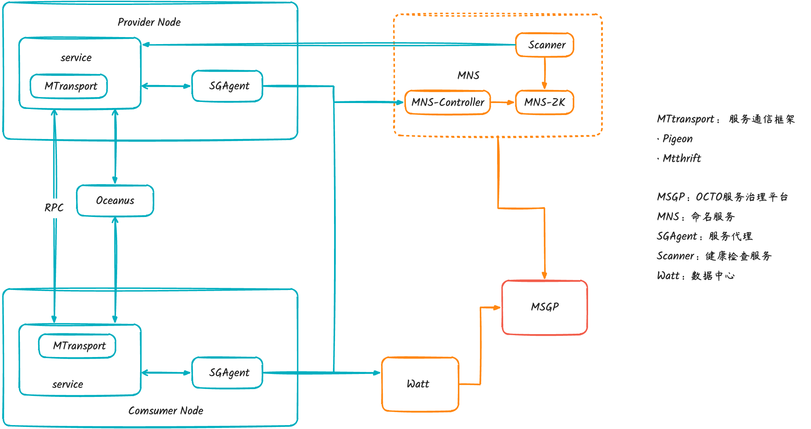

# 1. 简介

提供了服务注册发现、数据治理、负载均衡、容错、灰度发布等治理功能，致力于提升研发效率，降低运维成本，并提升应用的稳定性

# 2. 整体架构

## 2.1. 1.0架构

OCTO是美团内部的服务治理平台，为公司内全部服务提供了整套的服务治理方案和统一的服务治理体验。随着云原生的崛起，大量服务治理体系普遍“云原生”化，而Service Mesh则是云原生微服务中非常重要的一环。下面介绍一下OCTO从1.0演变到2.0架构的一些关键点。

整体OCTO架构中包含核心组件：Consumer/Provider/SgAgent/Scanner/MNS/MSGP等

- Provider将服务信息注册到Sg_agent中，由Sg_agent统一将节点信息注册到MNS注册中心中（剥离了注册中心和业务的直接交互）
  - Sg_agent是一个本地独立的进程，和业务进程解耦，接管业务进程与命名服务的交互，缓存&访问行为控制，保护注册中心。
  - 注册发现，路由分组，日志通道，缓存流控
  - 全量部署，数十万规模；资源占用率低（峰值：CPU < 10%） 支持热更新，业务零感知

- Consumer则通过SgAgent从MNS中获取服务数据
- MNS基于ZK持久化实例存储服务节点信息，后续整体的架构演进都是基于ZK性能瓶颈展开的
- Scanner用于对服务节点做健康检查，当发现节点不健康时降低节点的权重，去掉ZK非持久化实例健康检查的性能开销
  - 中心化节点健康检测，负责检测/更新节点状态：master从注册中心拿到服务列表，然后分发给detecter来探测节点状态，然后有变更的状态给updater进行二次校验。相当于点对点心跳，基本不会增加业务应用负载。
  - 每个机房都有一套主机，只负责本机房的检查任务
  - 高性能：基于Akka Actor模型（10s内检测数数十万）；高可用：同机房探测，无单点故障。高可靠：熔断机制（比如突然很多节点出异常），防止自身异常带来误判，容灾能力：作为机房故障解决方案（A机房的检查任务由B机房来做），1min摘除故障机房流量；高准确性：detecter和updater双重检测。

- MNS-Controller作为ZK的缓存层，承担ZK的读请求和数据推送
- 后续存储从CP型的ZK改为AP型的KV存储Cellar，直接替换ZK
- Watt是OCTO数据指标建设的计算平台，比如性能指标、健康状况、基础告警、多纬度调用统计等
- MSGP是OCTO的服务治理平台门户，用户可以在其上查询服务状态以及修改应用规则

OCTO 1.0和开源Dubbo/Spring Cloud体系类似，让应用能快速接入微服务体系并且提供了丰富的服务治理功能。

但应用在实践微服务的过程中也存在一些痛点：

- 中间件和业务绑定在一起，制约着彼此迭代。一般来说，核心的治理能力主要由通信框架承载，虽然做到了逻辑隔离，但中间件的逻辑不可避免会和业务在物理上耦合在一起。这种模式下，中间件引入Bug需要所有业务配合升级，这对业务的研发效率也会造成损害；新特性的发布也依赖业务逐个升级，不具备自主的控制能力。
- 对多语言支持不够好。公司技术栈使用的语言主要是 Java，占比到达80%以上，上面介绍的诸多治理能力也集中在 Java 体系。但公司内同时还有多种其他后台服务语言在使用，这些语言的治理生态均十分薄弱，同时在多元业务的模式下必然会有增长的多语言需求，为每一种语言都建设一套完善的治理体系成本很高，也不太可能落地
- 异构治理体系技术治理分散，应用分布在多个部门，不能统一与其他节点协同

针对以上痛点，OCTO考虑依托于 Service Mesh 解决。

## 2.2. 开源Mesh架构

开源的Service Mesh 模式下会为每个业务实例部署一个 Sidecar 代理，所有进出应用的业务流量统一由 Sidecar 承载，同时服务治理的工作也主要由 Sidecar 执行，而所有的 Sidecar 由统一的中心化控制大脑控制面来进行全局管控

Service Mesh通过Sidecar形式解耦业务和RPC流量，轻量化客户端SDK，方便对Sidecar做统一管理：

- Service Mesh架构由数据面Envoy和控制面Istio组成
- 数据面Sidecar通过对业务进程做流量拦截完成整体服务调用的注册/发现、负载均衡、服务路由等基本特性
- 控制面则Pilot负责对Sidecar进行流量管理、规则管理等来治理流量

在OCTO治理体系进行 Mesh 化改造可以进一步提升治理能力，这里将 Mesh 化改造后的 OCTO 定义为下一代服务治理系统 OCTO2.0

## 2.3. 2.0架构

由于OCTO 体系在公司内部已经形成了一系列的标准与规范，进行 Service Mesh 改造治理体系架构的升级范围会很大，整体Mesh化策略数据面以Envoy为主做二次开发，控制面自研为主

- 数据面Envoy拦截解析OCTO通信协议然后做路由和服务调用，框架侧升级SDK采用UDS方式拦截RPC流量到Envoy，HTTP请求通过iptables方式无缝做流量劫持，后续RPC侧也期望采用无缝方式
- 在控制面与开源差异较大，通过自研的OCTO变更下发，服务注册、健康检查、监控预警等组件
- 数据面和控制面通信方式是基于增强版的xDS协议，负责路由、指令和配置下发
- 整体Sidecar和SG_Agent的运维管理通过自研的Lego系统统一管理，后续Sidecar和SG_Agent统一到Sidecar(OCTO-Proxy)

# 3. RPC框架原理

RPC框架在OCTO中发起真正的请求，是微服务中最重要的组件。本章重点介绍业界RPC框架的实现模型以及MTthrift和Pigeon的具体设计实现。

## 3.1. RPC调用模型

目前主流的RPC框架调用抽象模型，总体分为调用端和服务端：

- Config配置层：业务通过InvokerConfig和ProviderConfig对调用端和服务端进行配置和初始化
- Proxy代理层：Proxy通过屏蔽调用端底层调用细节，使得RPC调用和本地方法调用无差异，服务端Proxy则通过类/方法/参数等信息找到服务实现并发起实际调用获得结果
- discover/registry服务注册发现层：服务端将节点信息注册到注册中心以及调用端从注册中心查询服务信息
- Cluster路由层：在调用端做服务路由以及负载均衡，选择正确并且合适的服务端
- Monitor监控层：对RPC调用做链路跟踪，以及性能相关指标统计
- Protocol/Serialization协议/序列化层：按照预定的通信协议进行数据通信，以及数据的序列化和反序列化
- 网络IO层：进行实际的网络数据传输

## 3.2. Pigeon整体设计

pigeon的整体设计基本符合上述RPC调用模型：

- Service服务层：定义和实现服务，Invoker和Provider都需要服务的接口，Provider则需要实现具体的服务
- Config配置层：以InvokerConfig和ProviderConfig为中心用于初始化具体的服务配置，可以通过spring/annotation/API等方式进行配置
- Proxy代理层：透明代理Invoker端，将请求内容转化成网络参数使得远程调用和本地方法保持一致
- Registry注册中心：用以注册服务和发现服务，将服务的节点信息和元信息都存储到注册中心Mns
- Cluster路由层：提供丰富的路由和负载均衡策略，接口为RoutePolicy和LoadBalance
- Protocol服务调用层：调用端对请求进行转化和封装，发起RPC调用，对应的在服务端则做对应的解析和处理
- Transport网络传输层：基于Netty抽象Client和Server发送和接收请求
- Codec/Seralize编解码/序列化层：用于对发送和接收的数据进行编解码以及序列化处理

## 3.3. MTThrift整体设计

MTthrift整体设计和Pigeon差不多，注册中心使用MNS，底层的通信核心最开始支持thrift IO，后同时也支持netty IO

- Service服务层：使用thrift IDL/注解方式实现和定义接口
- Config配置层：通过ReferenceConfig和ProviderConfig初始化具体的服务配置
- Proxy代理层：调用端通过ThriftClientProxy生成调用端代理，服务端通过ThriftServerPublisher生成代理解析和处理具体请求
- Registry注册中心：使用Mns-SDK注册到Mns中以及读取服务数据
- Cluster路由层：ICluster和ILoadBalance提供路由和负载均衡策略
- Protocol服务调用层：调用端对请求进行转化和封装，发起RPC调用，对应的在服务端则做对应的解析和处理
- Transport网络传输层：基于Netty IO和Thrift IO抽象Client和Server发送和接收请求
- Codec/Seralize编解码/序列化层：用于对发送和接收的数据进行编解码以及序列化处理，目前采用thrift序列化协议

# 4. 核心功能设计

RPC框架在实现的过程中需要充分考虑各个模块的性能、安全以及易用性等，本章主要对比MTthrift和Pigeon在核心功能上的设计和实现。

## 4.1. 功能对比

MTthrift和Pigeon的差异性来源于美团和点评两家公司在不同业务背景下产生的，后随着两家公司的合并以及业务的融合互调，在很多特性上都逐步对齐和取舍。

|          | 序列化         | 协议                    | 接口定义        | 通信模型      | 服务路由                 | 注册中心 | 负载均衡                                |
| -------- | -------------- | ----------------------- | --------------- | ------------- | ------------------------ | -------- | --------------------------------------- |
| MTthrift | thrift         | 统一协议/thrift原生协议 | IDL/注解        | Netty4/thrift | RPC分流/Set/liteSet/泳道 | MNS      | rr/random/lalb(动态负载)                |
| Pigeon   | hession/thrift | 统一协议/Hession协议    | IDL/注解/Java类 | Netty3        | Set/LiteSet/泳道         | MNS      | rr/random/weightedAutoAware(最小请求数) |

- Pigeon支持了统一协议thrift序列化让双框架能相互通信
- 服务鉴权由于需要框架互调也基于KMS token进行了统一权限控制
- 在注册中心上都统一使用MNS注册中心，并且在服务路由策略上也基本对齐

## 4.2. 服务路由

当客户端要调用服务端时，需要从众多的服务端节点中选择合适的节点访问，即服务路由：

- 整体路由可以分为逻辑路由和物理路由，逻辑路由优先级高于物理路由
- 逻辑路由包含RPC分流、Set/LiteSet以及泳道，物理路由有机房、城市等
- Set/LiteSet基于cell标签，泳道基于swimlane标签，整体都是通过机器标签实现，服务注册会注册到注册中心，服务发现路由时也会通过标签过滤

### 4.2.1. Set路由

当业务规模不断增大，单数据中心不能容纳所有业务，需要将业务部署到多数据中心支撑更大的业务流量，并且整体架构具备多数据中心容灾能力。这里的一个数据中心就可以称作一个Set，当然一个Set不仅可以是物理上的，也可以是逻辑上的

- 一个理想化的Set化架构里业务能做完所有的操作然后返回给用户需要的结果，其中包含服务调用、数据库、缓存、消息队列等组件，也称单元封闭
- Set化需要将机器进行分组，这里通过cell标签进行分组，上游请求在执行过程中基于cell标签来路由访问下游具有相同标签的服务节点，
- 业务Set化则需要将业务机器部署到所有的Set并打开Set开关，上图3 SET-2 B服务未部署不fallback流量就报错了
- 对于下游没有Set化的服务需要调用其中心的服务，上图4 B服务流量都回流中心

### 4.2.2. LiteSet路由

- LiteSet也称灰度链路，用于生产环境流量隔离，只隔离服务调用，不隔离数据库、缓存等
- LiteSet和Set都是基于cell标签，LiteSet优先级高于Set（考虑到Set化场景做灰度链路）
- 当没有具备相同cell的下游服务时，LiteSet会fallback到中心，LiteSet-1 服务B没有下游fallback到中心

### 4.2.3. 物理路由

- 物理路由涉及到机房（IDC）和城市（Region）优先级别选择上，北京和上海属于不同的城市，北京有永丰和大兴机房
- 路由优先同机房，如果同机房没有下游服务节点，优先同城市的不同机房，最后是跨城市。这里服务A优先同机房永丰B、其次同城市大兴，最后是跨城市上海嘉定

### 4.2.4. 服务路由时序

- Invoker发起调用会首先经过Cluster服务路由，Cluster会首先获取全量的服务端节点，格式为Map<cell, Map<swimlane, List<Client>>>的两级字典，一级key为cell标签，二级为swimlane标签
- LiteSet和Set共享cell标签，如果存在LiteSet标签则先过滤（LiteSet优先级高于Set），否则过滤Set标签。如果过滤之后为空LiteSet会fallback到中心，而Set会抛出异常
- 在经过逻辑过滤之后，会经过RoutePolicy区域规则过滤，然后过滤掉权重为0和非active得到正确的服务节点列表
- 最后经过负载均衡策略选择合适的服务节点发起调用

## 4.3. 统一协议

MTthrift是基于thrift的协议，Pigeon主要是Hession序列化方式的私有协议，不同的RPC通信协议的服务之间不能互通。为了能让MTthrift和Pigeon服务之间能相互调用，则需要将两种服务框架都支持同样的通信协议，统一协议正是在这个背景下诞生。

基于目前存在多语言情况及性能考量，统一协议采用基于thrift序列化的私有协议，相对于Pigeon默认的Hessian序列化方式，Thrift序列化能提供更好的性能

Pigeon的调用端会将RPC调用参数封装成request传递到服务端，如果指定了thrift序列化协议则会生成统一协议请求，Server端根据请求类型来做相应的解析，然后再根据请求的具体参数做处理和实际调用

## 4.4. 统一服务鉴权

由于一开始Mtthrift与Pigeon鉴权逻辑不统一，鉴权功能不能互通。在彻底服务化背景下，服务鉴权是相当重要的一环，统一服务鉴权对原有鉴权实现逻辑进行了优化，提升了鉴权功能的安全性、可靠性、易用性。

MTthrift鉴权和Pigeon鉴权同时兼容原先的鉴权逻辑（老鉴权）和统一服务鉴权，利用统一服务鉴权，实现了Pigeon与Mtthrift鉴权互通

整体统一鉴权流程：

- 在OCTO管理端授权调用端，KMS密钥管理平台会根据appkey按照一定算法生成的token令牌
- 客户端在发起RPC请求时从KMS中获取客户端appkey对应的token，然后计算出signature，并在请求中带上signature
- 服务端根据客户端appkey从KMS中获取token，计算出signature然后与请求携带的signature进行比较，相同则鉴权通过
- Pigeon通过调用端和服务端的SecurityFilter来无缝实现服务鉴权，request经过调用端SecurityFilter会经过sign()计算出签名然后带在请求上
- 服务端通过SecurityFilter做restrict()访问限制，然后做authenticate()身份认证和authAccessControl()访问控制，如果鉴权通过则进入到下一环节，否则报错

## 4.5. 网络IO模型

- MTthrift IO模型连接没有复用，一个连接同一时间只能处理一个请求，请求需要处理完之后才能处理下一个请求，只能通过增加连接数提高并发度，还有一个问题是每个服务需要一个端口导致服务会存在多端口
- 16年和Pigeon一样改为Netty IO模型，Netty IO支持连接在同一个时刻处理多个请求，并且支持单端口多服务

## 4.6. RPC调用模式

MTthrift和Pigeon都支持这常用的四种RPC调用模式：

- Oneway调用模式：发起调用不需要等待结果立刻返回，一般应用在没有返回的接口调用中
- Sync调用模式：正常阻塞的调用方式，发起调用需要阻塞等待返回结果，然后再执行下一次调用
- Future调用模式：Future允许调用端能同时发起多次调用，然后再等待调用的返回结果，相比于Sync模式效率大大提升
- Callback调用模式：Callback算是真正意义上的异步调用，调用端发起调用时需要注册调用的回调函数，不需要阻塞等待，当调用线程返回结果后会执行回调函数

一共用2种线程：business thread和worker TheadPool。

无论哪种调用模式（Oneway、Sync、Future），worker TheadPool的逻辑（写数据、读数据）都是异步的（不阻塞业务代码运行）。Sync调用模式 只是说business thread等待服务端返回是同步/