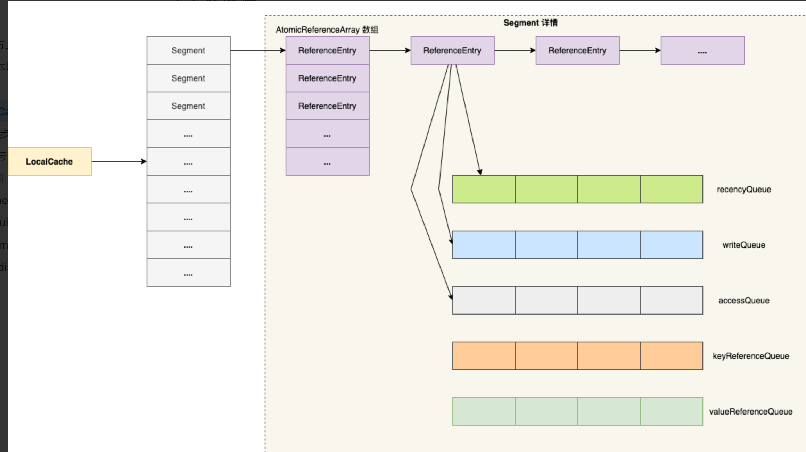

# Guava Cache

https://blog.csdn.net/weixin_38569499/article/details/103720524

## 一、基础信息

#### 1、版本

```java
<dependency>
    <groupId>com.google.guava</groupId>
    <artifactId>guava</artifactId>
    <version>29.0-jre</version>
</dependency>
```

#### 2、构造方式


#### 3、核心参数

 核心参数详解参考：[Guava Cache：核心参数深度剖析和相关源码分析](https://blog.csdn.net/weixin_38569499/article/details/108887341)

1、容量

- initialCapacity：初始容量；
- maximumSize：最大容量；
- maximumWeight：最大权重，每条缓存的默认权重为1，可以增加单挑缓存的权重；
- weither：权重器，用于衡量不同缓存条目的权重。

2、超时时长

- expireAfterAccess：超时计算方式：在访问请求之后重置超时计时器；
- expireAfterWrite：超时计算方式：在写请求之后重置超时计时器。

3、刷新

- refreshAfterWrite：写操作后多久刷新缓存内容，刷新使用下面的加载器；
- build(CacheLoader loader)：构造LoadingCache实例，入参是用于刷新的加载器；
- removalListener：移除监听器，接收条目被移除的通知，可以过滤需要的缓存条目，进行相应处理。

4、引用强度

- weakValues：指定所有的value都是弱引用；
- weakKeys：指定所有的key都是弱引用；
- softValues：指定所有的key都是软引用。

5、其他

- concurrencyLevel：并发级别，级别越高支持的最大并发数越大；
- recordStats：启用缓存统计，即缓存操作期间的性能相关的统计；
- ticker：指定纳秒精度的时间源，默认使用System.nanoTime()。

## 二、基本原理

### 1、数据结构



Guava Cache的数据结构，和JDK 1.7版本的ConcurrentHashMap非常相似：

- 分段segment：最外层是分段segment，用于控制最大的写并发数量，每一个Segment使用了单独的锁，其实每个Segment继承了ReentrantLock，对Segment的写操作需要先拿到锁。每个Segment由一个table和5个队列组成。
- 分段内的数组table：每个分段内维护一个原子引用数组table，根据元素的hash值确定在数组中的位置；
- 数组内的链表：数组的任一元素，存放的都是一个链表，用于解决哈希碰撞的情况；
- 和JDK 1.7的ConcurrentHashMap的一个重要区别在于，Guava Cache的数组中始终存放的都是链表，不会变成红黑树。


- LocalCache为Guava Cache的核心类，包含一个Segment数组组成
- Segement数组的长度决定了cache的并发数
- 每一个Segment使用了单独的锁，其实每个Segment继承了ReentrantLock，对Segment的写操作需要先拿到锁
  每个Segment由一个table和5个队列组成
- 1个table：

  - AtomicReferenceArray<ReferenceEntry<K, V>> table：AtomicReferenceArray可以用原子方式更新其元素的对象引用数组
    ReferenceEntry<k,v>
  - ReferenceEntry是Guava Cache中对一个键值对节点的抽象，每个ReferenceEntry数组项都是一条ReferenceEntry链。并且一个ReferenceEntry包含key、hash、valueReference、next字段（单链）Guava Cache使用ReferenceEntry接口来封装一个键值对，而用ValueReference来封装Value值
- 5个队列：

  - ReferenceQueue keyReferenceQueue ： 值键引用队列，记录被垃圾回收、且需要被内部清理的节点；
  - ReferenceQueue valueReferenceQueue ：值引用队列，记录被垃圾回收、且需要被内部清理的值；
  - ConcurrentlinkedQueue<ReferenceEntry<k,v>> recencyQueue : LRU队列，当segment上达到临界值发生写操作时该队列会移除数据
  - Queue<ReferenceEntry<K, V>> writeQueue：写队列，按照写入时间进行排序的元素队列，写入一个元素时会把它加入到队列尾部
  - Queue<ReferenceEntry<K, V>> accessQueue：访问队列，按照访问时间进行排序的元素队列，访问(包括写入)一个元素时会把它加入到队列尾部


### 2. 并发控制

  并发控制是通过参数并发级别concurrencyLevel设置的，还会受参数最大加权值maximumWeight的影响，最终通过分段segment的数量来起作用。分段数量的计算规则参考上述1.1分段segment的数量。

    缓存的写操作（包括显式的写操作，以及读操作触发的缓存失效、缓存加载等）是需要加锁的，而加锁的基本单元是segment。类Segment是Java的重入锁ReentrantLock的子类。在写操作前后会分别调用ReentrantLock的lock()和unlock()方法，进行加锁和解锁操作。
### 3、缓存淘汰

#### 3.1 用户显式清除的两种场景

  如果用户通过invalite或invalidateAll等方法主动失效了相应缓存，或者通过put方法使用新值替换了旧的缓存值，这两种情况表示缓存是被用户显式清除掉的，而不是被缓存内部清除的。

#### 3.2 被垃圾回收淘汰

  Guava Cache支持将配置的引用强度设置成软引用和弱引用，以避免缓存过多导致内存溢出等问题。

#### 3.3 超时淘汰

- 访问后超时会设置一个访问时间，每次读取缓存内容或者设置缓存的值，都会刷新访问的时间；如果下一次访问的时候，发现访问时长超时，会直接让缓存失效。访问超时通过方法expireAfterAccess进行设置；
- 写后超时会设置一个写时间，每次设置缓存的值，都会刷新写时间；如果下一次访问的时候，发现访问时长超时，会直接让缓存失效。访问超时通过方法expireAfterWrite进行设置。

#### 3.4 容量超限淘汰（LRU算法）

 如果缓存设置了最大容量（maximumSize，或者maximumWeight），则在添加缓存的时候，会去判断当前容量是否已经超限。如果缓存容量超限，则会通过LRU算法，淘汰掉最久没有访问的缓存。