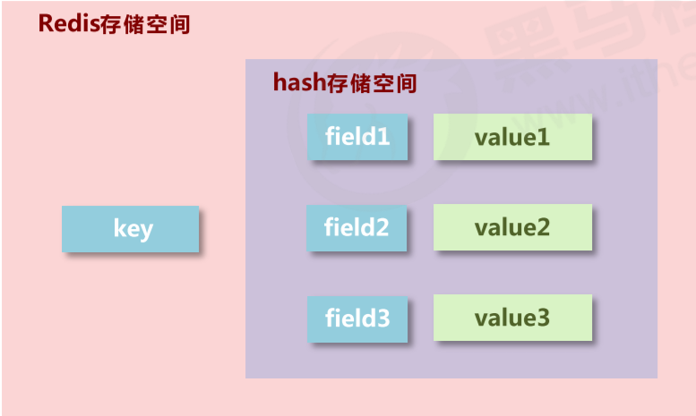
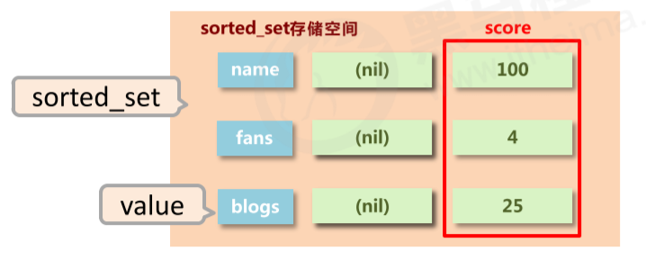
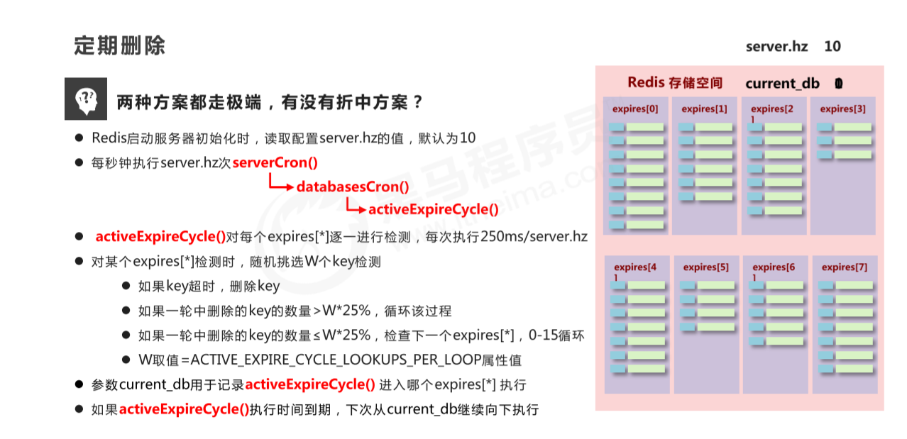
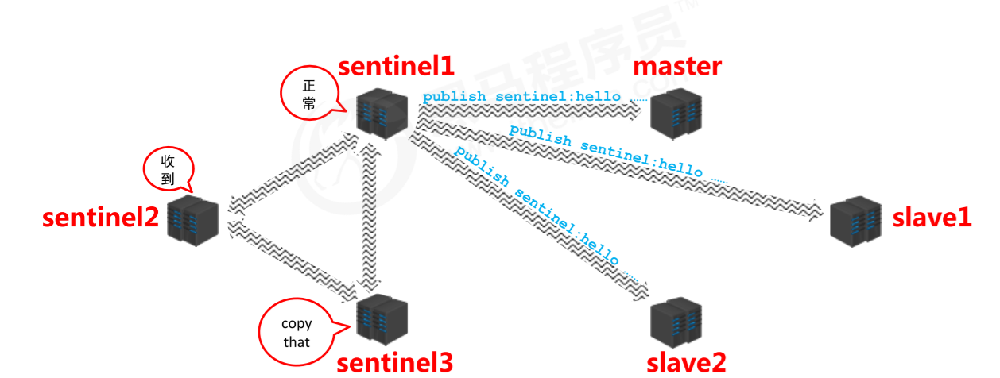

[TOC]

# [**:house:**](../../README.html)

# 一、概述

## 2.1 什么是redis

- Redis 是一种基于内存的数据库，对数据的读写操作都是在内存中完成，因此**读写速度非常快**，常用于**缓存，消息队列、分布式锁等场景**。

- Redis 提供了多种数据类型来支持不同的业务场景，比如 String(字符串)、Hash(哈希)、 List (列表)、Set(集合)、Zset(有序集合)、Bitmaps（位图）、HyperLogLog（基数统计）、GEO（地理信息）、Stream（流），并且对数据类型的操作都是**原子性**的，因为执行命令由单线程负责的，不存在并发竞争的问题。

- 除此之外，Redis 还支持**事务 、持久化、Lua 脚本、多种集群方案（主从复制模式、哨兵模式、切片机群模式）、发布/订阅模式，内存淘汰机制、过期删除机制**等等。

## 2.2 为什么需要redis

***简单来说使用缓存主要是为了提升用户体验以及应对更多的用户。***

从高性能和高并发两个角度来看：

**高性能** ：

假如用户第一次访问数据库中的某些数据的话，这个过程是比较慢，毕竟是从硬盘中读取的。但是，如果说，用户访问的数据属于高频数据并且不会经常改变的话，那么我们就可以很放心地将该用户访问的数据存在缓存中。

**这样有什么好处呢？** 那就是保证用户下一次再访问这些数据的时候就可以直接从缓存中获取了。操作缓存就是直接操作内存，所以速度相当快。

不过，要保持数据库和缓存中的数据的一致性。 如果数据库中的对应数据改变的之后，同步改变缓存中相应的数据即可！

**高并发：**

一般像 MySQL 这类的数据库的 QPS 大概都在 1w 左右（4 核 8g） ，但是使用 Redis 缓存之后很容易达到 10w+，甚至最高能达到 30w+（就单机 redis 的情况，redis 集群的话会更高）。

## 2.3 应用场景

- **分布式锁** ： 通过 Redis 来做分布式锁是一种比较常见的方式。通常情况下，我们都是基于 Redisson 来实现分布式锁。相关阅读：[《分布式锁中的王者方案 - Redisson》](https://mp.weixin.qq.com/s/CbnPRfvq4m1sqo2uKI6qQw)。
- **限流** ：一般是通过 Redis + Lua 脚本的方式来实现限流。相关阅读：[《我司用了 6 年的 Redis 分布式限流器，可以说是非常厉害了！》](https://mp.weixin.qq.com/s/kyFAWH3mVNJvurQDt4vchA)。
- **消息队列** ：Redis 自带的 list 数据结构可以作为一个简单的队列使用。Redis5.0 中增加的 Stream 类型的数据结构更加适合用来做消息队列。它比较类似于 Kafka，有主题和消费组的概念，支持消息持久化以及 ACK 机制。
- **复杂业务场景** ：通过 Redis 以及 Redis 扩展（比如 Redisson）提供的数据结构，我们可以很方便地完成很多复杂的业务场景比如通过 bitmap 统计活跃用户、通过 sorted set 维护排行榜。
- **延迟队列：**

## 2.4 分布式缓存技术选型方案

分布式缓存的话，使用的比较多的主要是 **Memcached** 和 **Redis**。不过，现在基本没有看过还有项目使用 **Memcached** 来做缓存，都是直接用 **Redis**。

Memcached 是分布式缓存最开始兴起的那会，比较常用的。后来，随着 Redis 的发展，大家慢慢都转而使用更加强大的 Redis 了。

分布式缓存主要解决的是单机缓存的容量受服务器限制并且无法保存通用信息的问题。因为，本地缓存只在当前服务里有效，比如如果你部署了两个相同的服务，他们两者之间的缓存数据是无法共同的。

现在公司一般都是用 Redis 来实现缓存，而且 Redis 自身也越来越强大了！不过，了解 Redis 和 Memcached 的区别和共同点，有助于我们在做相应的技术选型的时候，能够做到有理有据！

### 2.4.1 Redis VS Memcached

**共同点** ：

1. 都是基于内存的数据库，一般都用来当做缓存使用。
2. 都有过期策略。
3. 两者的性能都非常高。

**区别** ：

1. **Redis 支持更丰富的数据类型（支持更复杂的应用场景）**。Redis 不仅仅支持简单的 k/v 类型的数据，同时还提供 list，set，zset，hash 等数据结构的存储。Memcached 只支持最简单的 k/v 数据类型。
2. **Redis 支持数据的持久化，可以将内存中的数据保持在磁盘中，重启的时候可以再次加载进行使用,而 Memecache 把数据全部存在内存之中，Memcached 重启或者挂掉后，数据就没了。**
3. **Redis 有灾难恢复机制。** 因为可以把缓存中的数据持久化到磁盘上。
4. **Redis 在服务器内存使用完之后，可以将不用的数据放到磁盘上。但是，Memcached 在服务器内存使用完之后，就会直接报异常。**
5. **Memcached 没有原生的集群模式，需要依靠客户端来实现往集群中分片写入数据；但是 Redis 目前是原生支持 cluster 模式的。**
6. **Memcached 是多线程，非阻塞 IO 复用的网络模型；Redis 使用单线程的多路 IO 复用模型。** （Redis 6.0 引入了多线程 IO ）
7. **Redis 支持发布订阅模型、Lua 脚本、事务等功能，而 Memcached 不支持。并且，Redis 支持更多的编程语言。**
8. **Memcached 过期数据的删除策略只用了惰性删除，而 Redis 同时使用了惰性删除与定期删除。**

相信看了上面的对比之后，我们已经没有什么理由可以选择使用 Memcached 来作为自己项目的分布式缓存了。

# 二、数据类型

- String 类型的应用场景：缓存对象、常规计数、分布式锁、共享 session 信息等。
- List 类型的应用场景：消息队列（但是有两个问题：1. 生产者需要自行实现全局唯一 ID；2. 不能以消费组形式消费数据）等。
- Hash 类型：缓存对象、购物车等。
- Set 类型：聚合计算（并集、交集、差集）场景，比如点赞、共同关注、抽奖活动等。
- Zset 类型：排序场景，比如排行榜、电话和姓名排序等。


- **redis 自身是一个 Map，其中所有的数据都是采用 key : value 的形式存储**

- **数据类型指的是存储的数据的类型，也就是 value 部分的类型，key 部分永远都是字符串,常见有五种数据类型**。
  - String：用于缓存对象、常规计数、分布式锁、共享 session 信息等。
  - hash： 用于缓存对象、购物车等
  - list：用于消息队列（但是有两个问题：1. 生产者需要自行实现全局唯一 ID；2. 不能以消费组形式消费数据）等。
  - set：用于聚合计算（并集、交集、差集）场景，比如点赞、共同关注、抽奖活动等。
  - sorted_set：


## 1.1 String

- string在redis内部存储默认就是一个**字符串**，当遇到增减类操作incr，decr时会**转成数值型**进行计算。
- redis所有的操作都是**原子性**的，采用**单线程**处理所有业务，命令是一个一个执行的，因此无需考虑并发带来的数据影响。
- 注意：按数值进行操作的数据，如果原始数据不能转成数值，或超越了redis 数值上限范围，将报错。 9223372036854775807（java中long型数据最大值，Long.MAX_VALUE）
- redis 控制数据的生命周期，通过数据是否失效控制业务行为，适用于所有具有时效性限定控制的操作。
- String 类型的底层的数据结构实现主要是 **SDS（简单动态字符串**）。 SDS 和我们认识的 C 字符串不太一样，之所以没有使用 C 语言的字符串表示，因为 SDS 相比于 C 的原生字符串：
  - **SDS 不仅可以保存文本数据，还可以保存二进制数据**。因为 SDS 使用 len 属性的值而不是空字符来判断字符串是否结束，并且 SDS 的所有 API 都会以处理二进制的方式来处理 SDS 存放在 buf[] 数组里的数据。所以 SDS 不光能存放文本数据，而且能保存图片、音频、视频、压缩文件这样的二进制数据。
  - **SDS 获取字符串长度的时间复杂度是 O(1)**。因为 C 语言的字符串并不记录自身长度，所以获取长度的复杂度为 O(n)；而 SDS 结构里用 len 属性记录了字符串长度，所以复杂度为 O(1)。
  - **Redis 的 SDS API 是安全的，拼接字符串不会造成缓冲区溢出**。因为 SDS 在拼接字符串之前会检查 SDS 空间是否满足要求，如果空间不够会自动扩容，所以不会导致缓冲区溢出的问题。

**基本操作**

```sql
-- 添加数据
set key value    -- 添加单个数据
mset key1 value1 key2 value2... -- 添加多个数据

-- 设置数据的生命周期
setex key seconds value   
psetex key milliseconds value

-- 得到String
get key   -- 获得单个数据
mget key1 key2...  -- 获得多个数据

-- 删除数据
del key

-- 设置数值数据增加指定范围的值
incr key
incrby key increment
incrbyfloat key increment
-- 设置数值数据减少指定范围的值
decr key
decrby key increment

-- 获取数据字符个数
strlen key
-- 向字符串的后面追加字符，如果有就补在后面，如果没有就新建
append key value
```

## 2.2 Hash

- 新的存储需求：对一系列存储的数据进行编组，方便管理，典型应用存储对象信息

- 需要的存储结构：一个存储空间保存多个键值对数据

- Hash 类型的底层数据结构是由**压缩列表或哈希表**实现的：
  
  - 如果哈希类型元素个数小于 512 个（默认值，可由 hash-max-ziplist-entries 配置），所有值小于 64 字节（默认值，可由 hash-max-ziplist-value 配置）的话，Redis 会使用**压缩列表**作为 Hash 类型的底层数据结构；
  - 如果哈希类型元素不满足上面条件，Redis 会使用**哈希表**作为 Hash 类型的底层数据结构。
  
  **在 Redis 7.0 中，压缩列表数据结构已经废弃了，交由 listpack 数据结构来实现了**。



**基本操作**

**hash 类型数据操作的注意事项**

- hash类型下的value**只能存储字符串**，不允许存储其他数据类型，**不存在嵌套现象**。如果数据未获取到， 对应的值为（nil）
- 每个 hash 可以存储 2^32 - 1 个键值
- hash类型十分贴近对象的数据存储形式，并且可以灵活添加删除对象属性。但hash设计初衷不是为了存储大量对象而设计的，**切记不可滥用**，更**不可以将hash作为对象列表使用**
- hgetall 操作可以获取全部属性，如果内部field过多，遍历整体**数据效率就很会低**，有可能成为数据访问瓶颈.

```sql
//插入（如果已存在同名的field，会被覆盖）
hset key field value
hmset key field1 value1 field2 value2...
//插入（如果已存在同名的field，不会被覆盖）
hsetnx key field value

//取出
hget key field
hgetall key

//删除
hdel key field1 field2...

//获取field数量
hlen key

//查看是否存在
hexists key field

//获取哈希表中所有的字段名或字段值 
hkeys key
hvals key

//设置指定字段的数值数据增加指定范围的值 
hincrby key field increment 
hdecrby key field increment
```


## 2.3 List

- 数据存储需求：存储多个数据，并对数据进入存储空间的顺序进行区分

- 需要的存储结构：一个存储空间保存多个数据，且通过数据可以体现进入顺序

- **元素有序，且可重**

- List 类型的底层数据结构是由**双向链表或压缩列表**实现的：

  - 如果列表的元素个数小于 512 个（默认值，可由 list-max-ziplist-entries 配置），列表每个元素的值都小于 64 字节（默认值，可由 list-max-ziplist-value 配置），Redis 会使用**压缩列表**作为 List 类型的底层数据结构；
    - 就是它被设计成一种内存紧凑型的数据结构，占用一块连续的内存空间，不仅可以利用 CPU 缓存，而且会针对不同长度的数据，进行相应编码，这种方法可以有效地节省内存开销。
    - 缺点：不能保存过多的元素，否则查询效率就会降低；新增或修改某个元素时，压缩列表占用的内存空间需要重新分配，甚至可能引发连锁更新的问题。
  
  - 如果列表的元素不满足上面的条件，Redis 会使用**双向链表**作为 List 类型的底层数据结构；双向链表的缺点：
    - 链表每个节点之间的内存都是不连续的，意味着**无法很好利用 CPU 缓存**。
    - 保存一个链表节点的值都需要一个链表节点结构头的分配，**内存开销较大**。
    - 能很好利用 CPU 缓存的数据结构就是数组，因为数组的内存是连续的，这样就可以充分利用 CPU 缓存来加速访问。
  
  
  但是**在 Redis 3.2 版本之后，List 数据类型底层数据结构就只由 quicklist 实现了，替代了双向链表和压缩列表**。


**基本操作**

```sql
//添加修改数据,lpush为从左边添加，rpush为从右边添加
lpush key value1 value2 value3...
rpush key value1 value2 value3...

//查看数据, 从左边开始向右查看. 如果不知道list有多少个元素，end的值可以为-1,代表倒数第一个元素
//lpush先进的元素放在最后,rpush先进的元素放在最前面
lrange key start end
//得到长度
llen key
//取出对应索引的元素
lindex key index

//获取并移除元素（从list左边或者右边移除）
lpop key
rpop key
```

**扩展操作**

```sql
//规定时间内获取并移除数据,b=block,给定一个时间，如果在指定时间内放入了元素，就移除
blpop key1 key2... timeout
brpop key1 key2... timeout

//移除指定元素 count:移除的个数 value:移除的值。 移除多个相同元素时，从左边开始移除
lrem key count value
```

**注意事项**

- list中保存的数据都是string类型的，数据总容量是有限的，最多2^32 - 1 个元素 (4294967295)。
- list具有索引的概念，但是操作数据时通常以**队列**的形式进行入队出队(rpush, rpop)操作，或以**栈**的形式进行入栈出栈(lpush, lpop)操作
- 获取全部数据操作结束索引设置为-1 (倒数第一个元素)
- list可以对数据进行分页操作，通常第一页的信息来自于list，第2页及更多的信息通过数据库的形式加载.

## 2.4 Set

- 新的存储需求：存储大量的数据，在查询方面提供更高的效率

- 需要的存储结构：能够保存大量的数据，高效的内部存储机制，便于查询

- set类型：与hash存储结构完全相同，仅存储键，不存储值（nil），并且值是不允许重复的

- Set 类型的底层数据结构是由**哈希表或整数集合**实现的：
  - 如果集合中的元素都是整数且元素个数小于 512 （默认值，set-maxintset-entries配置）个，Redis 会使用**整数集合**作为 Set 类型的底层数据结构；
  - 如果集合中的元素不满足上面条件，则 Redis 使用**哈希表**作为 Set 类型的底层数据结构。


**基本操作**

```sql
//添加元素
sadd key member1 member2...

//查看元素
smembers key

//移除元素
srem key member

//查看元素个数
scard key

//查看某个元素是否存在
sismember key member
```

**扩展操作**

```sql
//从set中任意选出count个元素
srandmember key count

//从set中任意选出count个元素并移除
spop key count

//求两个集合的交集、并集、差集
sinter key1 key2...
sunion key1 key2...
sdiff key1 key2...

//求两个set的交集、并集、差集，并放入另一个set中
sinterstore destination key1 key2...
sunionstore destination key1 key2...
sdiffstore destination key1 key2...

//求指定元素从原集合放入目标集合中
smove source destination key
```

## 2.5 sorted_set

- **不重但有序（score）**
- 新的存储需求：数据排序有利于数据的有效展示，需要提供一种可以根据自身特征进行**排序**的方式
- 需要的存储结构：新的存储模型，可以保存**可排序**的数据
- sorted_set类型：在set的存储结构基础上添加可排序字段
- Zset 类型的底层数据结构是由**压缩列表或跳表**实现的：
  - 如果有序集合的元素个数小于 128 个，并且每个元素的值小于 64 字节时，Redis 会使用**压缩列表**作为 Zset 类型的底层数据结构；
  - 如果有序集合的元素不满足上面的条件，Redis 会使用**跳表**作为 Zset 类型的底层数据结构；




**基本操作**

- min与max用于限定搜索查询的**条件**
- start与stop用于限定**查询范围**，作用于索引，表示开始和结束索引
- offset与count用于限定查询范围，作用于查询结果，表示**开始位置**和**数据总量**

```sql
//插入元素, 需要指定score(用于排序)
zadd key score1 member1 score2 member2

//查看元素(score升序), 当末尾添加withscore时，会将元素的score一起打印出来
zrange key start end (withscore)
//查看元素(score降序), 当末尾添加withscore时，会将元素的score一起打印出来
zrevrange key start end (withscore)

//移除元素
zrem key member1 member2...

//按条件获取数据, 其中offset为索引开始位置，count为获取的数目
zrangebyscore key min max [withscore] [limit offset count]
zrevrangebyscore key max min [withscore] [limit offset count]

//按条件移除元素
zremrangebyrank key start end
zremrangebysocre key min max
//按照从大到小的顺序移除count个值
zpopmax key [count]
//按照从小到大的顺序移除count个值
zpopmin key [count]

//获得元素个数
zcard key

//获得元素在范围内的个数
zcount min max

//求交集、并集并放入destination中, 其中numkey1为要去交集或并集集合的数目
zinterstore destination numkeys key1 key2...
zunionstore destination numkeys key1 key2...
```

**拓展操作**

```sql
//查看某个元素的索引(排名)
zrank key member
zrevrank key member

//查看某个元素索引的值
zscore key member
//增加某个元素索引的值
zincrby key increment member
```

- score保存的数据存储空间是64位，如果是整数范围是-9007199254740992~9007199254740992
- score保存的数据也可以是一个双精度的double值，基于双精度浮点数的特征，**可能会丢失精度**，使用时候要**慎重**
- sorted_set 底层存储还是**基于set**结构的，因此数据**不能重复**，如果重复添加相同的数据，score值将被反复覆盖，**保留最后一次**修改的结果

## 2.6 通用指令

1. **key的特征**
   - key是一个**字符串**，通过key获取redis中保存的数据
2. **key的操作**

```sql
//查看key是否存在
exists key

//删除key
del key

//查看key的类型
type key

//设置生命周期
expire key seconds
pexpire key milliseconds

//查看有效时间, 如果有有效时间则返回剩余有效时间, 如果为永久有效，则返回-1, 如果Key不存在则返回-2
ttl key
pttl key

//将有时限的数据设置为永久有效
persist key

//根据key查询符合条件的数据
keys * -- 查询所有
keys it* -- 查询以it开头
keys *it -- 查询以it结尾
keys ??it -- 查询前面为两个任意字符并以it结尾
keys it[st]s -- 查询以it开头，s结尾，中间包含一个字母s或t


//重命名key，为了避免覆盖已有数据，尽量少去修改已有key的名字，如果要使用最好使用renamenx
rename key newKey
renamenx key newKey

//查看所有关于key的操作, 可以使用Tab快速切换
help @generic
```

## 2.7 Bitmaps 

Bitmaps 并不是实际的数据类型，而是定义在String类型上的一个面向字节操作的集合。因为字符串是二进制安全的块，他们的最大长度是512M，最适合设置成2^32个不同字节。

bitmap 存储的是连续的二进制数字（0 和 1），通过 bitmap, 只需要一个 bit 位来表示某个元素对应的值或者状态，key 就是对应元素本身 。我们知道 8 个 bit 可以组成一个 byte，所以 bitmap 本身会极大的节省储存空间。

#### 基础操作

- 获取指定key对应偏移量上的bit值

  ```
  getbit key offsetCopy
  ```

- 设置指定key对应偏移量上的bit值，value只能是1或0

  ```
  setbit key offset value
  ```

#### 扩展操作

- 对指定key按位进行交、并、非、异或操作，并将结果**保存到destKey**中

  ```
  bitop op destKey key1 [key2...]Copy
  ```

  - and：交
  - or：并
  - not：非
  - xor：异或

- 统计指定key中1的数量

  ```
  bitcount key [start end]
  ```

#### 应用场景

适合需要保存状态信息（比如是否签到、是否登录...）并需要进一步对这些信息进行分析的场景。比如用户签到情况、活跃用户情况、用户行为统计（比如是否点赞过某个视频）。

## 2.5 单线程

**单线程概念**

**Redis 单线程指的是「接收客户端请求->解析请求 ->进行数据读写等操作->发送数据给客户端」这个过程是由一个线程（主线程）来完成的**，这也是我们常说 Redis 是单线程的原因。

但是，**Redis 程序并不是单线程的**，Redis 在启动的时候，是会**启动后台线程**（BIO）的：

- **Redis 在 2.6 版本**，会启动 2 个后台线程，分别处理关闭文件、AOF 刷盘这两个任务；
- **Redis 在 4.0 版本之后**，新增了一个新的后台线程，用来异步释放 Redis 内存，也就是 lazyfree 线程。例如执行 unlink key / flushdb async / flushall async 等命令，会把这些删除操作交给后台线程来执行，好处是不会导致 Redis 主线程卡顿。因此，当我们要删除一个大 key 的时候，不要使用 del 命令删除，因为 del 是在主线程处理的，这样会导致 Redis 主线程卡顿，因此我们应该使用 unlink 命令来异步删除大key。

之所以 Redis 为「关闭文件、AOF 刷盘、释放内存」这些任务创建单独的线程来处理，是因为这些任务的操作都是很耗时的，如果把这些任务都放在主线程来处理，那么 Redis 主线程就很容易发生阻塞，这样就无法处理后续的请求了。

**后台线程相当于一个消费者，生产者把耗时任务丢到任务队列中，消费者（BIO）不停轮询这个队列，拿出任务就去执行对应的方法即可。**

关闭文件、AOF 刷盘、释放内存这三个任务都有各自的任务队列：

- BIO_CLOSE_FILE，关闭文件任务队列：当队列有任务后，后台线程会调用 close(fd) ，将文件关闭；
- BIO_AOF_FSYNC，AOF刷盘任务队列：当 AOF 日志配置成 everysec 选项后，主线程会把 AOF 写日志操作封装成一个任务，也放到队列中。当发现队列有任务后，后台线程会调用 fsync(fd)，将 AOF 文件刷盘，
- BIO_LAZY_FREE，lazy free 任务队列：当队列有任务后，后台线程会 free(obj) 释放对象 / free(dict) 删除数据库所有对象 / free(skiplist) 释放跳表对象；


**单线程模型**


图中的蓝色部分是一个事件循环，是由主线程负责的，可以看到网络 I/O 和命令处理都是单线程。 Redis 初始化的时候，会做下面这几件事情：

- 首先，调用 epoll_create() 创建一个 epoll 对象和调用 socket() 创建一个服务端 socket
- 然后，调用 bind() 绑定端口和调用 listen() 监听该 socket；
- 然后，将调用 epoll_ctl() 将 listen socket 加入到 epoll，同时注册「连接事件」处理函数。

初始化完后，主线程就进入到一个**事件循环函数**，主要会做以下事情：

- 首先，先调用**处理发送队列函数**，看是发送队列里是否有任务，如果有发送任务，则通过 write 函数将客户端发送缓存区里的数据发送出去，如果这一轮数据没有发送完，就会注册写事件处理函数，等待 epoll_wait 发现可写后再处理 。
- 接着，调用 epoll_wait 函数等待事件的到来：
  - 如果是**连接事件**到来，则会调用**连接事件处理函数**，该函数会做这些事情：调用 accpet 获取已连接的 socket -> 调用 epoll_ctl 将已连接的 socket 加入到 epoll -> 注册「读事件」处理函数；
  - 如果是**读事件**到来，则会调用**读事件处理函数**，该函数会做这些事情：调用 read 获取客户端发送的数据 -> 解析命令 -> 处理命令 -> 将客户端对象添加到发送队列 -> 将执行结果写到发送缓存区等待发送；
  - 如果是**写事件**到来，则会调用**写事件处理函数**，该函数会做这些事情：通过 write 函数将客户端发送缓存区里的数据发送出去，如果这一轮数据没有发送完，就会继续注册写事件处理函数，等待 epoll_wait 发现可写后再处理 。


**Redis 采用单线程为什么还这么快？**

官方使用基准测试的结果是，**单线程的 Redis 吞吐量可以达到 10W/每秒**，如下图所示：

之所以 Redis 采用单线程（网络 I/O 和执行命令）那么快，有如下几个原因：

- Redis 的大部分操作**都在内存中完成**，并且采用了高效的数据结构，因此 Redis 瓶颈可能是机器的内存或者网络带宽，而并非 CPU，既然 CPU 不是瓶颈，那么自然就采用单线程的解决方案了；
- Redis 采用单线程模型可以**避免了多线程之间的竞争**，省去了多线程切换带来的时间和性能上的开销，而且也不会导致死锁问题。
- Redis 采用了 **I/O 多路复用机制**处理大量的客户端 Socket 请求，IO 多路复用机制是指一个线程处理多个 IO 流，就是我们经常听到的 select/epoll 机制。简单来说，在 Redis 只运行单线程的情况下，该机制允许内核中，同时存在多个监听 Socket 和已连接 Socket。内核会一直监听这些 Socket 上的连接请求或数据请求。一旦有请求到达，就会交给 Redis 线程处理，这就实现了一个 Redis 线程处理多个 IO 流的效果。

假设有两个任务A和B，分别有两种方法来执行他们

- 两个线程并发执行：先执行A一段时间，然后切换到B再执行一段时间，然后又切换回A执行… 直到A和B都执行完毕
- 两个线程串行执行：先执行A，A执行完了在执行B

对于单核CPU来说，第二种方法的执行时间更短，效率更高。因为单核CPU下的并发操作，会导致上下文的切换，需要保存切换线程的信息，这段时间CPU无法去执行任何任务中的指令，时间白白浪费了.

**对于I/O操作，并发执行效率更高**

因为I/O操作主要有以下两个过程

- 等待I/O准备就绪
- 真正操作I/O资源

**等待I/O准备就绪**这个阶段，CPU是空闲的，这时便可以去执行其他任务，这样也就提高了CPU的利用率

**而Redis是基于内存的操作，没有I/O操作，所以单线程执行效率更高**


**Redis6.0 之前 为什么不使用多线程？**

我觉得主要原因有下面 3 个：

1. 单线程编程容易并且更容易维护；
2. Redis 的性能瓶颈不在 CPU ，主要在内存和网络；
3. 多线程就会存在死锁、线程上下文切换等问题，甚至会影响性能。

**Redis6.0 引入多线程主要是为了提高网络 IO 读写性能**，因为这个算是 Redis 中的一个性能瓶颈（Redis 的瓶颈主要受限于内存和网络）。

虽然，Redis6.0 引入了多线程，但是 Redis 的多线程只是在网络数据的读写这类耗时操作上使用了，执行命令仍然是单线程顺序执行。因此，你也不需要担心线程安全问题。

Redis6.0 的多线程默认是禁用的，只使用主线程。如需开启需要修改 redis 配置文件 `redis.conf` ：

```bash
io-threads-do-reads yesCopy to clipboardErrorCopied
```

开启多线程后，还需要设置线程数，否则是不生效的。同样需要修改 redis 配置文件 `redis.conf` :

```bash
io-threads 4 #官网建议4核的机器建议设置为2或3个线程，8核的建议设置为6个线程
```

# 三、数据结构

## 3.1 跳跃表

跳跃表(shiplist)是实现sortset(**有序**集合)的底层数据结构之一。跳表的优势是能支持平均 O(logN) 复杂度的节点查找。

zset 结构体里有两个数据结构：一个是跳表，一个是哈希表。这样的好处是既能进行高效的范围查询，也能进行高效单点查询。

跳跃表是基于多指针有序链表实现的，可以看成多个有序链表。


(1) 由很多层结构组成
 (2) 每一层都是一个有序的链表
 (3) 最底层(Level 1)的链表包含所有元素
 (4) 如果一个元素出现在 Level i 的链表中，则它在 Level i 之下的链表也都会出现。
 (5) 每个节点包含两个指针，一个指向同一链表中的下一个元素，一个指向下面一层的元素。

### 3.1.1 跳跃表的搜索

- 我们搜索元素时，从最上层的链表开始搜索。当找到某个节点大于目标值或其后继节点为空时，从该节点向下层链表搜寻，然后顺着该节点到下一层继续搜索。

  比如我们要找87这个元素，则会经历：2->54->87

### 3.1.2 跳跃表的插入

- 先找到合适的位置以便插入元素
- 找到后，将该元素插入到最底层的链表中，并且抛掷硬币（1/2的概率）
  - 若硬币为正面，则将该元素晋升到上一层链表中，**并再抛一次**
  - 若硬币为反面，则插入过程结束
- 为了避免以下情况，需要在每个链表的头部设置一个 **负无穷** 的元素


如果K大于链表的层数,需要添加新的层。

### 3.1.3 跳跃表的删除

各个层中找到包含 x 的节点，使用标准的 delete from list 方法删除该节点。

### 3.1.4 跳跃表的优点

与红黑树等平衡树相比，跳跃表具有以下优点：

- 插入速度非常快速，因为不需要进行旋转等操作来维护平衡性；
- 更容易实现；
- 支持无锁操作。

### 3.1.5 为什么Redis要使用跳跃表而不是用B+树

MySQL使用B+树的是因为：**叶子节点存储数据，非叶子节点存储索引**，B+树的每个节点可以存储多个关键字，它将节点大小设置为磁盘页的大小，**充分利用了磁盘预读的功能**。每次读取磁盘页时就会读取一整个节点,每个叶子节点还有指向前后节点的指针，为的是最大限度的降低磁盘的IO;因为数据在内存中读取耗费的时间是从磁盘的IO读取的百万分之一

而Redis是**内存中读取数据，不涉及IO，因此使用了跳跃表**

既然提到了Redis是对**内存操作**的，那么再讨论一个问题：**为什么Redis是单线程的还这么快呢**

### 3.1.6 为什么用跳表而不用平衡树？

- **从内存占用上来比较，跳表比平衡树更灵活一些**。平衡树每个节点包含 2 个指针（分别指向左右子树），而跳表每个节点包含的指针数目平均为 1/(1-p)，具体取决于参数 p 的大小。如果像 Redis里的实现一样，取 p=1/4，那么平均每个节点包含 1.33 个指针，比平衡树更有优势。
- **在做范围查找的时候，跳表比平衡树操作要简单**。在平衡树上，我们找到指定范围的小值之后，还需要以中序遍历的顺序继续寻找其它不超过大值的节点。如果不对平衡树进行一定的改造，这里的中序遍历并不容易实现。而在跳表上进行范围查找就非常简单，只需要在找到小值之后，对第 1 层链表进行若干步的遍历就可以实现。
- **从算法实现难度上来比较，跳表比平衡树要简单得多**。平衡树的插入和删除操作可能引发子树的调整，逻辑复杂，而跳表的插入和删除只需要修改相邻节点的指针，操作简单又快速。

# 四、持久化

- 持久化是利用**永久性**存储介质将数据进行保存，在特定的时间将保存的数据进行恢复的工作机制称为持久化
- 可以防止数据意外丢失，确保数据安全
- 持久化保存什么？
  - 将当前**数据状态**进行保存，**快照形式**，存储数据结果，存储格式简单，关注点在数据，这种方式称为**RDB**
  - 将数据的**操作过程**进行保存，**日志形式**，存储操作过程，存储格式复杂，关注点在数据的操作过程，这种方式称为**AOF**
- Redis 共有三种数据持久化的方式：
  - **AOF 日志**：每执行一条写操作命令，就把该命令以追加的方式写入到一个文件里；
  - **RDB 快照**：将某一时刻的内存数据，以二进制的方式写入磁盘；
  - **混合持久化方式**：Redis 4.0 新增的方式，集成了 AOF 和 RBD 的优点；


## 4.1 RDB

将某一时刻的内存数据，以二进制的方式写入磁盘；Redis 提供了两个命令来生成 RDB 文件，分别是 save 和 bgsave，他们的区别就在于是否在「主线程」里执行：

- 执行了 save 命令，就会在主线程生成 RDB 文件，由于和执行操作命令在同一个线程，所以如果写入 RDB 文件的时间太长，**会阻塞主线程**；
- 执行了 bgsave 命令，会创建一个子进程来生成 RDB 文件，这样可以**避免主线程的阻塞**；

RDB 在执行快照的时候，数据能修改吗？

可以的，执行 bgsave 过程中，Redis 依然**可以继续处理操作命令**的，也就是数据是能被修改的，关键的技术就在于**写时复制技术（Copy-On-Write, COW）。**

执行 bgsave 命令的时候，会通过 fork() 创建子进程，此时子进程和父进程是共享同一片内存数据的，因为创建子进程的时候，会复制父进程的页表，但是页表指向的物理内存还是一个，此时如果主线程执行读操作，则主线程和 bgsave 子进程互相不影响。

只有在发生修改内存数据的情况时，物理内存才会被复制一份。**然后主线程在这个被复制的副本上进行修改操作**这样的目的是为了减少创建子进程时的性能损耗，从而加快创建子进程的速度，毕竟创建子进程的过程中，是会阻塞主线程的。

Redis 在使用 bgsave 快照过程中**，如果主线程修改了内存数据，不管是否是共享的内存数据，RDB 快照都无法写入主线程刚修改的数据**，因为此时主线程（父进程）的内存数据和子进程的内存数据已经分离了，子进程写入到 RDB 文件的内存数据只能是原本的内存数据。

如果系统恰好在 RDB 快照文件创建完毕后崩溃了，那么 Redis 将会丢失主线程在快照期间修改的数据。

极端情况下，**如果所有的共享内存都被修改，则此时的内存占用是原先的 2 倍。**

### 4.1.1 save方式

- **命令**

``` sql
save
```

- **作用：手动执行一次保存操作**

- **RDB配置相关命令**
  - dbfilename dump.rdb
    - 说明：设置本地数据库文件名，默认值为 dump.rdb
    - 经验：通常设置为dump-端口号.rdb
  - dir
    - 说明：设置存储.rdb文件的路径
    - 经验：通常设置成存储空间较大的目录中，目录名称data
  - rdbcompression yes
    - 说明：设置存储至本地数据库时是否压缩数据，默认为 yes，采用 LZF 压缩
    - 经验：通常默认为开启状态，如果设置为no，可以节省 CPU 运行时间，但会使存储的文件变大（巨大）
  - rdbchecksum yes
    - 说明：设置是否进行RDB文件格式校验，该校验过程在写文件和读文件过程均进行
    - 经验：通常默认为开启状态，如果设置为no，可以节约读写性过程约10%时间消耗，但是存储一定的数据损坏风险
-  不足：**save指令**的执行会**阻塞**当前Redis服务器，直到当前RDB过程完成为止，有可能会造成**长时间阻塞**，线上环境**不建议使用**。

### 4.1.2 bgsave方式

- 命令

```sql
bgsave
```

- 作用

  手动启动后台保存操作，但**不是立即执行**

- 原理

  - 执行fork操作**创建子进程**

  - **bgsave命令**是针对save阻塞问题做的**优化**。Redis内部所有涉及到RDB操作都采用bgsave的方式，save命令可以放弃使用，推荐使用bgsave


### 4.1.3 Save 配置

- 配置

```sql
save second changes
```

- 作用

  满足**限定时间**范围内key的变化数量达到**指定数量**即进行持久化

- 参数

  - second：监控时间范围
  - changes：监控key的变化量

- 配置位置

  - 在**conf文件**中进行配置

- 配置原理


- save配置要根据实际业务情况进行设置，频度过高或过低都会出现性能问题，结果可能是灾难性的
- save配置中对于second与changes设置通常具有**互补对应**关系（一个大一个小），尽量不要设置成包含性关系.
- save配置启动后执行的是**bgsave操作**

### 4.1.4 RDB启动方式对比


### 4.1.5 RDB优点

- 优点
  - RDB是一个紧凑压缩的二进制文件，**存储效率较高**
  - RDB内部存储的是redis在某个时间点的数据快照，非常适合用于**数据备份，全量复制**等场景
  - RDB恢复数据的**速度**要比AOF**快**很多
  - 应用：服务器中每X小时执行bgsave备份，并将RDB文件拷贝到远程机器中，**用于灾难恢复**
- 缺点
  - RDB方式无论是执行指令还是利用配置，**无法做到实时持久化**，具有较大的可能性丢失数据
  - bgsave指令每次运行要执行fork操作**创建子进程**，要**牺牲**掉一些**性能**
  - Redis的众多版本中未进行RDB文件格式的版本统一，有可能出现各版本服务之间数据格式**无法兼容**现象

## 4.2 AOF

### 4.2.1 AOF 概念

- AOF(append only file)持久化：以独立日志的方式记录**每次**写命令，重启时再重新执行AOF文件中命令，以达到恢复数据的目的。与RDB相比可以简单描述为改记录数据为记录数据产生的过程
- AOF的主要作用是解决了数据持久化的实时性，目前已经是Redis持久化的**主流**方式。

**开启AOF**

```sql
appendonly yes|no  -- 是否开启AOF持久化功能，默认为不开启状态
appendfsync always|everysec|no   -- AOF写的三种策略
```

### 4.2.2  AOF写数据

- AOF写命令刷新缓存区

- 根据写数据的策略将命令同步到AOF文件中。

- **Reids 是先执行写操作命令后，才将该命令记录到 AOF 日志里的，**这么做其实有两个好处：

  - **避免额外的检查开销**：因为如果先将写操作命令记录到 AOF 日志里，再执行该命令的话，如果当前的命令语法有问题，那么如果不进行命令语法检查，该错误的命令记录到 AOF 日志里后，Redis 在使用日志恢复数据时，就可能会出错。
  - **不会阻塞当前写操作命令的执行**：因为当写操作命令执行成功后，才会将命令记录到 AOF 日志。

- 当然，这样做也会带来风险：

  - **数据可能会丢失：** 执行写操作命令和记录日志是两个过程，那当 Redis 在还没来得及将命令写入到硬盘时，服务器发生宕机了，这个数据就会有丢失的风险。

  - **可能阻塞其他操作：** 由于写操作命令执行成功后才记录到 AOF 日志，所以不会阻塞当前命令的执行，但因为 AOF 日志也是在主线程中执行，所以当 Redis 把日志文件写入磁盘的时候，还是会阻塞后续的操作无法执行。

### 4.2.3 AOF写输入的三种策略

- Redis 执行完写操作命令后，会将命令追加到 server.aof_buf 缓冲区；（用户态）

- 然后通过 I/O系统调用write() ，将 aof_buf 缓冲区的数据写入到 AOF 文件，此时数据并没有写入到硬盘，而是拷贝到了内核缓冲区 page cache，等待内核将数据写入硬盘；（内核态）

- 具体内核缓冲区的数据什么时候写入到硬盘，由内核决定。Redis 提供了 3 种写回硬盘的策略，在 `redis.conf` 配置文件中的 `appendfsync` 配置项可以有以下 3 种参数可填（这三种策略只是在控制 `fsync()` 函数的调用时机）：

  - always
    - 每次写入操作均同步到AOF文件中（执行` fsync()` 函数），数据零误差，**性能较低**,**不建议使用**

  - everysec
    - 创建一个异步任务每秒将缓冲区中的指令同步到AOF文件中（执行 `fsync()`函数），数据准确性较高，**性能较高** ，**建议使用**，也是默认配置
    - 在系统突然宕机的情况下丢失1秒内的数据

  - no
    - 永不执行 `fsync() `函数, 由操作系统控制每次同步到AOF文件的周期，整体过程**不可控**


### 4.2.4 AOF重写

随着命令不断写入AOF，**文件会越来越大**，为了解决这个问题，Redis引入了AOF重写机制压缩文件体积。

AOF 重写机制是在重写时，读取当前数据库中的所有键值对，然后将每一个键值对用一条命令记录到「新的 AOF 文件」，等到全部记录完后，就将新的 AOF 文件替换掉现有的 AOF 文件。

- 作用
  - 降低磁盘占用量，提高磁盘利用率
  - 提高持久化效率，降低持久化写时间，提高IO性能
  - 降低数据恢复用时，提高数据恢复效率
  
- 规则
  - 进程内已超时的数据不再写入文件
  - 忽略无效指令，重写时使用进程内数据直接生成，这样新的AOF文件只保留最终数据的写入命令，如del key1、 hdel key2、srem key3、set key4 111、set key4 222等
  - 对同一数据的多条写命令合并为一条命令，如lpush list1 a、lpush list1 b、 lpush list1 c 可以转化为：lpush list1 a b c，为防止数据量过大造成客户端缓冲区溢出，对list、set、hash、zset等类型，每条指令最多写入64个元素

- 使用
  - 手动重写

  ```
  bgrewriteaof
  ```
  - 自动重写

  ```sql
  auto-aof-rewrite-min-size size 
  auto-aof-rewrite-percentage percentage
  ```

- 原理

  - Redis 的**重写 AOF 过程是由后台子进程 bgrewriteaof 来完成的**，这么做可以达到两个好处：
    - 子进程进行 AOF 重写期间，主进程可以继续处理命令请求，从而避免阻塞主进程；
    - 子进程带有主进程的数据副本（*数据副本怎么产生的后面会说*），这里使用子进程而不是线程，因为如果是使用线程，多线程之间会共享内存，那么在修改共享内存数据的时候，需要通过加锁来保证数据的安全，而这样就会降低性能。而使用子进程，创建子进程时，父子进程是共享内存数据的，不过这个共享的内存只能以只读的方式，而当父子进程任意一方修改了该共享内存，就会发生「写时复制」，于是父子进程就有了独立的数据副本，就不用加锁来保证数据安全。
  - **在 bgrewriteaof 子进程执行 AOF 重写期间，主进程需要执行以下三个工作:**
    - 执行客户端发来的命令；
    - 执行后的写命令追加到 「AOF 缓冲区」；
    - 将执行后的写命令追加到 「AOF 重写缓冲区」；
  
  - 当**子进程完成 AOF 重写工作**（扫描数据库中所有数据，逐一把内存数据的键值对转换成一条命令，再将命令记录到重写日志）后，会向主进程发送一条信号，信号是进程间通讯的一种方式，且是异步的。主进程收到该信号后，会调用一个信号处理函数，该函数主要做以下工作：
    - 将 AOF 重写缓冲区中的所有内容追加到新的 AOF 的文件中，使得新旧两个 AOF 文件所保存的数据库状态一致；
    - 新的 AOF 的文件进行改名，覆盖现有的 AOF 文件。
    - 信号函数执行完后，主进程就可以继续像往常一样处理命令了。
  
  - **主进程在通过 `fork` 系统调用生成 `bgrewriteaof` 子进程时，操作系统会把主进程的「页表」复制一份给子进程**，这个页表记录着虚拟地址和物理地址映射关系，而不会复制物理内存，也就是说，两者的虚拟空间不同，但其对应的物理空间是同一个。这样一来，**子进程就共享了父进程的物理内存数据了**，这样能够**节约物理内存资源**，页表对应的页表项的属性会标记该物理内存的权限为**只读**。
    - **主线程无写数据**：触发重写机制后，主进程就会创建重写 AOF 的子进程，此时父子进程共享物理内存，重写子进程只会对这个内存进行只读，重写 AOF 子进程会读取数据库里的所有数据，并逐一把内存数据的键值对转换成一条命令，再将命令记录到重写日志（新的 AOF 文件）。
  
    - **主线程有写数据**：当父进程或者子进程在向这个内存发起写操作时，CPU 就会触发**写保护中断**，这个写保护中断是由于违反权限导致的，然后操作系统会在「写保护中断处理函数」里进行**物理内存的复制**，并重新设置其内存映射关系，将父子进程的内存读写权限设置为**可读写**，最后才会对内存进行写操作，这个过程被称为「**写时复制(Copy On Write)**」。写时复制顾名思义，**在发生写操作的时候，操作系统才会去复制物理内存**，这样是为了防止 fork 创建子进程时，由于物理内存数据的复制时间过长而导致父进程长时间阻塞的问题。
      - 主进程修改了已经存在 key-value，此时这个 key-value 数据在子进程的内存数据就跟主进程的内存数据不一致了。为了解决这种数据不一致问题，Redis 设置了一个 **AOF 重写缓冲区**，这个缓冲区在创建 bgrewriteaof 子进程之后开始使用。在重写 AOF 期间，当 Redis 执行完一个写命令之后，它会**同时将这个写命令写入到 「AOF 缓冲区」和 「AOF 重写缓冲区」**。
  
  - 有两个阶段会导致阻塞父进程：
    - 创建子进程的途中，由于要复制父进程的页表等数据结构，阻塞的时间跟页表的大小有关，页表越大，阻塞的时间也越长；
    - 创建完子进程后，如果子进程或者父进程修改了共享数据，就会发生写时复制，这期间会拷贝物理内存，如果内存越大，自然阻塞的时间也越长；
  

## 4.3 RDB VS AOF


**RDB和AOF如何选择**

- 对数据非常**敏感**，建议使用默认的**AOF**持久化方案
  - AOF持久化策略使用**everysecond**，每秒钟fsync一次。该策略redis仍可以保持很好的处理性能，当出现问题时，最多丢失0-1秒内的数据。
- 数据呈现**阶段有效性**，建议使用RDB持久化方案
  - 数据可以良好的做到阶段内无丢失（该阶段是开发者或运维人员手工维护的），且**恢复速度较快**，阶段 点数据恢复通常采用RDB方案
- 综合比对
  - RDB与AOF的选择实际上是在做一种权衡，每种都有利有弊
  - 如不能承受数分钟以内的数据丢失，对业务数据非常敏感，选用AOF
  - 如能承受数分钟以内的数据丢失，且追求大数据集的恢复速度，选用RDB
  - 灾难恢复选用RDB
  - 双保险策略，同时开启 RDB 和 AOF，重启后，Redis优先使用 AOF 来恢复数据，降低丢失数据的量

## 4.4 大key对持久化的影响

- 当 AOF 写回策略配置了 Always 策略，如果写入是一个大 Key，主线程在执行 fsync() 函数的时候，阻塞的时间会比较久，因为当写入的数据量很大的时候，数据同步到硬盘这个过程是很耗时的。
- AOF 重写机制和 RDB 快照（bgsave 命令）的过程，都会分别通过 `fork()` 函数创建一个子进程来处理任务。会有两个阶段会导致阻塞父进程（主线程）：
  - 创建子进程的途中，由于要复制父进程的页表等数据结构，阻塞的时间跟页表的大小有关，页表越大，阻塞的时间也越长；
  - 创建完子进程后，如果父进程修改了共享数据中的大 Key，就会发生写时复制，这期间会拷贝物理内存，由于大 Key 占用的物理内存会很大，那么在复制物理内存这一过程，就会比较耗时，所以有可能会阻塞父进程。
- 大 key 除了会影响持久化之外，还会有以下的影响。
  - 客户端超时阻塞。由于 Redis 执行命令是单线程处理，然后在操作大 key 时会比较耗时，那么就会阻塞 Redis，从客户端这一视角看，就是很久很久都没有响应。
  - 引发网络阻塞。每次获取大 key 产生的网络流量较大，如果一个 key 的大小是 1 MB，每秒访问量为 1000，那么每秒会产生 1000MB 的流量，这对于普通千兆网卡的服务器来说是灾难性的。
  - 阻塞工作线程。如果使用 del 删除大 key 时，会阻塞工作线程，这样就没办法处理后续的命令。
  - 内存分布不均。集群模型在 slot 分片均匀情况下，会出现数据和查询倾斜情况，部分有大 key 的 Redis 节点占用内存多，QPS 也会比较大。
- 如何避免大 Key 呢？
  - 最好在设计阶段，就把大 key 拆分成一个一个小 key。或者，定时检查 Redis 是否存在大 key ，如果该大 key 是可以删除的，不要使用 DEL 命令删除，因为该命令删除过程会阻塞主线程，而是用 unlink 命令（Redis 4.0+）删除大 key，因为该命令的删除过程是异步的，不会阻塞主线程。

## 4.5 混合持久化

RDB 优点是数据恢复速度快，但是快照的频率不好把握。频率太低，丢失的数据就会比较多，频率太高，就会影响性能。

AOF 优点是丢失数据少，但是数据恢复不快。

为了集成了两者的优点， Redis 4.0 提出了**混合使用 AOF 日志和内存快照**，也叫混合持久化，既保证了 Redis 重启速度，又降低数据丢失风险。

- 混合持久化工作在 **AOF 日志重写过程**，当开启了混合持久化时，在 AOF 重写日志时，fork 出来的重写子进程会先将与主线程共享的内存数据以 RDB 方式写入到 AOF 文件，然后主线程处理的操作命令会被记录在重写缓冲区里，重写缓冲区里的增量命令会以 AOF 方式写入到 AOF 文件，写入完成后通知主进程将新的含有 RDB 格式和 AOF 格式的 AOF 文件替换旧的的 AOF 文件。也就是说，使用了混合持久化，AOF 文件的**前半部分是 RDB 格式的全量数据，后半部分是 AOF 格式的增量数据**。

- 这样的好处在于，重启 Redis 加载数据的时候，由于前半部分是 RDB 内容，这样**加载的时候速度会很快**。

- 加载完 RDB 的内容后，才会加载后半部分的 AOF 内容，这里的内容是 Redis 后台子进程重写 AOF 期间，主线程处理的操作命令，可以使得**数据更少的丢失**。

**混合持久化优点：**

- 混合持久化结合了 RDB 和 AOF 持久化的优点，开头为 RDB 的格式，使得 Redis 可以更快的启动，同时结合 AOF 的优点，有减低了大量数据丢失的风险。

**混合持久化缺点：**

- AOF 文件中添加了 RDB 格式的内容，使得 AOF 文件的可读性变得很差；
- 兼容性差，如果开启混合持久化，那么此混合持久化 AOF 文件，就不能用在 Redis 4.0 之前版本了。


# 五、事务

redis事务就是一个命令执行的队列，将一系列预定义命令**包装成一个整体**（一个队列）。当执行时，**一次性按照添加顺序依次执行**，中间不会被打断或者干扰。

## 5.1 事务的基本操作

- 开启事务 

```sql
multi   -- 作设定事务的开启位置，此指令执行后，后续的所有指令均加入到事务中
```

- 取消事务

```sql
discard  -- 终止当前事务的定义，发生在multi之后，exec之前
```

- 执行事务

```sql
exec  -- 设定事务的结束位置，同时执行事务。与multi成对出现，成对使用
```

## 5.2 事务操作的基本流程

- 服务器接收到指令，先判断是否是事务状态
  - 如果不是事务状态，就识别指令的类型
    - 对于普通指令，直接执行，然后返回相应的结果
    - 对于multi 指令，创建一个队列，返回OK
  - 如果是事务状态，就识别指令的类型
    - 对于普通指令，就加入队列，返回QUEUE
    - 对于EXEC指令，就执行事务，也就是执行队列中的指令，返回执行结果。
    - 对于discard指令，就销毁队列，返回OK。

**事务操作中的注意事项**

- 如果定义的事务中所包含的命令存在语法错误，整体事务中**所有命令均不会执行**。包括那些语法正确的命令。
- 如果命令**格式正确**，但是**无法正确的执行**。执行事务时，能够正确运行的命令会执行，运行错误的命令不会被执行。
- 已经执行完毕的命令对应的数据**不会自动回滚**，需要程序员自己在代码中实现回滚。

## 5.2 基于特定条件的事务执行

### 5.2.1  锁

**场景**

天猫双11热卖过程中，对已经售罄的货物追加补货，4个业务员都有权限进行补货。补货的操作可能是一系 列的操作，牵扯到多个连续操作，如何保障不会重复操作？

**分析**

- 多个客户端有可能同时操作同一组数据，并且该数据一旦被操作修改后，将不适用于继续操作 

- 在操作之前锁定要操作的数据，一旦发生变化，终止当前操作.

**操作**

对 key 添加监视锁，在执行exec前如果key发生了变化，终止事务执行。watch不能在事务中定义(主要监控其他人能不能改这个值)

```sql
watch key1, key2.... -- 为key加锁
..
multi 
...
exec 
```

取消对**所有**key的监视

```sql
unwatch
```

### 5.2.1 分布式锁

**场景**

天猫双11热卖过程中，对已经售罄的货物追加补货，且补货完成。客户购买热情高涨，3秒内将所有商品购 买完毕。本次补货已经将库存全部清空，如何避免最后一件商品不被多人同时购买？【超卖问题】

**分析**

- 使用watch监控一个key有没有改变已经不能解决问题，此处要监控的是具体数据 

- 虽然redis是单线程的，但是多个客户端对同一数据同时进行操作时，如何避免不被同时修改？

**操作**

使用 setnx 设置一个公共锁

```sql
//上锁
setnx lock-key value
//释放锁
del lock-key
```

- 利用setnx命令的返回值特征，有值则返回设置失败，无值则返回设置成功 
  -  对于返回设置成功的，拥有控制权，进行下一步的具体业务操作 
  - 对于返回设置失败的，不具有控制权，排队或等待,操作完毕通过del操作释放锁.

### 5.2.2  死锁

**场景**

依赖分布式锁的机制，某个用户操作时对应客户端宕机，且此时已经获取到锁。如何解决？

**分析**

- 由于锁操作由用户控制加锁解锁，必定会存在加锁后未解锁的风险 

- 需要解锁操作不能仅依赖用户控制，系统级别要给出对应的保底处理方案

**操作**

使用 expire 为锁key添加**时间限定**，到时不释放，放弃锁

```sql
expire lock-key seconds
pexpire lock-key milliseconds
```

- 由于操作通常都是微秒或毫秒级，因此该锁定时间**不宜设置过大**。具体时间需要业务测试后确认。
  - 例如：持有锁的操作最长执行时间127ms，最短执行时间7ms。
  - 测试百万次最长执行时间对应命令的最大耗时，测试百万次网络延迟平均耗时
  - 锁时间设定推荐：最大耗时*120%+平均网络延迟*110%
  - 如果业务最大耗时<<网络平均延迟，通常为2个数量级，取其中单个耗时较长即可

# 六、删除策略

## 6.1 过期数据

Redis是一种内存级数据库，所有数据均存放在内存中，内存中的数据可以通过TTL指令获取其状态

- XX ：具有时效性的数据
- -1 ：永久有效的数据
-  -2 已经过期的数据 或 被删除的数据 或 未定义的数据.

## 6.2 过期数据的删除策略

Redis 使用的过期删除策略是「**惰性删除+定期删除**」这两种策略配和使用。

- 先说一下对 key 设置过期时间的命令。 设置 key 过期时间的命令一共有 4 个：

  - `expire <key> <n>`：设置 key 在 n 秒后过期，比如 expire key 100 表示设置 key 在 100 秒后过期；

  - `pexpire <key> <n>`：设置 key 在 n 毫秒后过期，比如 pexpire key2 100000 表示设置 key2 在 100000 毫秒（100 秒）后过期。

  - `expireat <key> <n>`：设置 key 在某个时间戳（精确到秒）之后过期，比如 expireat key3 1655654400 表示 key3 在时间戳 1655654400 后过期（精确到秒）；

  - `pexpireat <key> <n>`：设置 key 在某个时间戳（精确到毫秒）之后过期，比如 pexpireat key4 1655654400000 表示 key4 在时间戳 1655654400000 后过期（精确到毫秒）

- 当然，在设置字符串时，也可以同时对 key 设置过期时间，共有 3 种命令：

  - `set <key> <value> ex <n>` ：设置键值对的时候，同时指定过期时间（精确到秒）；

  - `set <key> <value> px <n>` ：设置键值对的时候，同时指定过期时间（精确到毫秒）；

  - `setex <key> <n> <valule>` ：设置键值对的时候，同时指定过期时间（精确到秒）。

- 每当我们对一个 key 设置了过期时间时，Redis 会把该 key 带上过期时间存储到一个**过期字典**（expires dict）中，也就是说「过期字典」保存了数据库中所有 key 的过期时间。过期字典存储在 redisDb 结构中，如下：

  - 过期字典的 key 是一个指针，指向某个键对象；
  - 过期字典的 value 是一个 long long 类型的整数，这个整数保存了 key 的过期时间；
  - 字典实际上是哈希表，哈希表的最大好处就是让我们可以用 O(1) 的时间复杂度来快速查找。当我们查询一个 key 时，Redis 首先检查该 key 是否存在于过期字典中：
    - 如果不在，则正常读取键值；
    - 如果存在，则会获取该 key 的过期时间，然后与当前系统时间进行比对，如果比系统时间大，那就没有过期，否则判定该 key 已过期。

  

### 6.2.1 定时删除

- 创建一个定时器，当key设置有过期时间，且过期时间到达时，由定时器任务立即执行对键的删除操作
- 优点：节约内存，到时就删除，快速释放掉不必要的内存占用
- 缺点**：CPU压力很大，无论CPU此时负载量多高，均占用CPU，会影响redis服务器响应时间和指令吞吐量。**在过期 key 比较多的情况下，删除过期 key 可能会占用相当一部分 CPU 时间，在内存不紧张但 CPU 时间紧张的情况下，将 CPU 时间用于删除和当前任务无关的过期键上，无疑会对服务器的响应时间和吞吐量造成影响。所以，定时删除策略对 CPU 不友好。
- 总结：用处理器性能换取存储空间 （拿时间换空间）

### 6.2.2 惰性删除

- 数据到达过期时间，不做处理。等下次访问该数据时：
  - 如果未过期，返回数据
  - 发现已过期，删除，返回不存在
- 优点：节约CPU性能，发现必须删除的时候才删除
- 缺点：内存压力很大，出现长期占用内存的数据
- 总结：用存储空间换取处理器性能 （拿时间换空间）

### 6.2.3 定期删除



- **周期性轮询redis库中的时效性数据，采用随机抽取的策略，利用过期数据占比的方式控制删除频度**
- 在 Redis 中，默认每秒进行 10 次过期检查一次数据库，此配置可通过 Redis 的配置文件 redis.conf 进行配置，配置键为 hz 它的默认值是 hz 10。
- 定期删除的实现在 expire.c 文件下的 `activeExpireCycle` 函数中，其中随机抽查的数量由 `ACTIVE_EXPIRE_CYCLE_LOOKUPS_PER_LOOP` 定义的，它是写死在代码中的，数值是 20。
- 接下来，详细说说 Redis 的定期删除的流程：

  - 从过期字典中随机抽取 20 个 key；

  - 检查这 20 个 key 是否过期，并删除已过期的 key；
  - 如果本轮检查的已过期 key 的数量，超过 5 个（20/4），也就是「已过期 key 的数量」占比「随机抽取 key 的数量」大于 25%，则继续重复步骤 1；如果已过期的 key 比例小于 25%，则停止继续删除过期 key，然后等待下一轮再检查。

  可以看到，定期删除是一个循环的流程。那 Redis 为了保证定期删除不会出现循环过度，导致线程卡死现象，为此增加了定期删除循环流程的时间上限，默认不会超过 25ms。
- 特点1：CPU性能占用设置有峰值，检测频度可自定义设置
- 特点2：内存压力不是很大，长期占用内存的冷数据会被持续清理
- 优点：通过限制删除操作执行的时长和频率，来减少删除操作对 CPU 的影响，同时也能删除一部分过期的数据减少了过期键对空间的无效占用。
- 缺点

  - 内存清理方面没有定时删除效果好，同时没有惰性删除使用的系统资源少。
  - 难以确定删除操作执行的时长和频率。如果执行的太频繁，定期删除策略变得和定时删除策略一样，对CPU不友好；如果执行的太少，那又和惰性删除一样了，过期 key 占用的内存不会及时得到释放。

- 总结：周期性抽查存储空间（随机抽查，重点抽查）

### 6.2.4 对比

| 删除策略 | 优点                                            | 缺点                      | 总结               |
| -------- | ----------------------------------------------- | ------------------------- | ------------------ |
| 定时删除 | 节约内存                                        | 不分时段的占用cpu，频度高 | 用时间换空间       |
| 惰性删除 | 延时执行，CPU利用率高                           | 占用内存                  | 用空间换时间       |
| 定期删除 | 内存定期随机清理，每秒花费固定的CPU资源维护内存 |                           | 随机抽查，重点抽查 |

## 6.3 内存淘汰策略

**当新数据进入redis时，如果内存不足怎么办？**

- Redis使用内存存储数据，在执行每一个命令前，会调用freeMemoryIfNeeded()检测内存是否充足。如果内存不满足新加入数据的最低存储要求，redis要临时删除一些数据为当前指令清理存储空间。清理数据的策略称为内存淘汰策略。
- 注意：内存淘汰的过程不是100%能够清理出足够的可使用的内存空间，如果不成功则反复执行。当对所有数据尝试完毕后，如果不能达到内存清理的要求，将出现错误信息。

**可以使用 `config get maxmemory-policy` 命令，来查看当前 Redis 的内存淘汰策略**，命令如下：

```shell
127.0.0.1:6379> config get maxmemory-policy
1) "maxmemory-policy"
2) "noeviction"
```

**Redis 提供 6 种数据淘汰策略：**

- 在设置了过期时间的数据中进行淘汰：
  - **volatile-lru（least recently used）**：从已设置过期时间的数据集（server.db[i].expires）中挑选最近最少使用的数据淘汰
  - **volatile-lfu（least frequently used）**：从已设置过期时间的数据集(server.db[i].expires)中挑选最不经常使用的数据淘汰

  - **volatile-ttl**：从已设置过期时间的数据集（server.db[i].expires）中挑选将要过期的数据淘汰

  - **volatile-random**：从已设置过期时间的数据集（server.db[i].expires）中任意选择数据淘汰

- 检测全库数据：

  - **allkeys-lru（least recently used）**：当内存不足以容纳新写入数据时，在键空间中，移除最近最少使用的 key（这个是最常用的）

  - **allkeys-random**：从数据集(全库数据)（server.db[i].dict）中任意选择数据淘汰，
  - **allkeys-lfu（least frequently used）**：当内存不足以容纳新写入数据时，在键空间中，移除最不经常使用的 key。

- *不进行数据淘汰的策略*
  - **no-eviction**：它表示当运行内存超过最大设置内存时，不淘汰任何数据，这时如果有新的数据写入，会报错通知禁止写入，不淘汰任何数据，但是如果没用数据写入的话，只是单纯的查询或者删除操作的话，还是可以正常工作。

**设置内存淘汰策略有两种方法：**

- 方式一：通过“`config set maxmemory-policy <策略>`”命令设置。它的优点是设置之后立即生效，不需要重启 Redis 服务，缺点是重启 Redis 之后，设置就会失效。
- 方式二：通过修改 Redis 配置文件修改，设置“`maxmemory-policy <策略>`”，它的优点是重启 Redis 服务后配置不会丢失，缺点是必须重启 Redis 服务，设置才能生效

**redis是如何实现LRU？**

传统 LRU 算法的实现是基于「链表」结构，链表中的元素按照操作顺序从前往后排列，最新操作的键会被移动到表头，当需要内存淘汰时，只需要删除链表尾部的元素即可，因为链表尾部的元素就代表最久未被使用的元素。

Redis 并没有使用这样的方式实现 LRU 算法，因为传统的 LRU 算法存在两个问题：

- 需要用链表管理所有的缓存数据，这会带来额外的空间开销；
- 当有数据被访问时，需要在链表上把该数据移动到头端，如果有大量数据被访问，就会带来很多链表移动操作，会很耗时，进而会降低 Redis 缓存性能。

Redis 实现的是一种**近似 LRU 算法**，目的是为了更好的节约内存，它的**实现方式是在 Redis 的对象结构体中添加一个额外的字段，用于记录此数据的最后一次访问时间**。

当 Redis 进行内存淘汰时，会使用**随机采样的方式来淘汰数据**，它是随机取 5 个值（此值可配置），然后**淘汰最久没有使用的那个**。

Redis 实现的 LRU 算法的优点：

- 不用为所有的数据维护一个大链表，节省了空间占用；
- 不用在每次数据访问时都移动链表项，提升了缓存的性能；

但是 LRU 算法有一个问题，**无法解决缓存污染问题**，比如应用一次读取了大量的数据，而这些数据只会被读取这一次，那么这些数据会留存在 Redis 缓存中很长一段时间，造成缓存污染。

**redis是如何实现LFU？**

LFU 全称是 Least Frequently Used 翻译为**最近最不常用**，LFU 算法是根据数据访问次数来淘汰数据的，它的核心思想是“如果数据过去被访问多次，那么将来被访问的频率也更高”。

所以， LFU 算法会记录每个数据的访问次数。当一个数据被再次访问时，就会增加该数据的访问次数。这样就解决了偶尔被访问一次之后，数据留存在缓存中很长一段时间的问题，相比于 LRU 算法也更合理一些。

LFU 算法相比于 LRU 算法的实现，多记录了「数据的访问频次」的信息。

Redis 对象头中的 lru 字段，在 LRU 算法下和 LFU 算法下使用方式并不相同。

**在 LRU 算法中**，Redis 对象头的 24 bits 的 lru 字段是用来记录 key 的访问时间戳，因此在 LRU 模式下，Redis可以根据对象头中的 lru 字段记录的值，来比较最后一次 key 的访问时间长，从而淘汰最久未被使用的 key。

**在 LFU 算法中**，Redis对象头的 24 bits 的 lru 字段被分成两段来存储，高 16bit 存储 ldt(Last Decrement Time)，低 8bit 存储 logc(Logistic Counter)。

- ldt 是用来记录 key 的访问时间戳；
- logc 是用来记录 key 的访问频次，它的值越小表示使用频率越低，越容易淘汰，每个新加入的 key 的logc 初始值为 5。

注意，logc 并不是单纯的访问次数，而是访问频次（访问频率），因为 **logc 会随时间推移而衰减的**。

在每次 key 被访问时，会先对 logc 做一个衰减操作，衰减的值跟前后访问时间的差距有关系，如果上一次访问的时间与这一次访问的时间差距很大，那么衰减的值就越大，这样实现的 LFU 算法是根据**访问频率**来淘汰数据的，而不只是访问次数。访问频率需要考虑 key 的访问是多长时间段内发生的。key 的先前访问距离当前时间越长，那么这个 key 的访问频率相应地也就会降低，这样被淘汰的概率也会更大。

对 logc 做完衰减操作后，就开始对 logc 进行增加操作，增加操作并不是单纯的 + 1，而是根据概率增加，如果 logc 越大的 key，它的 logc 就越难再增加。

所以，Redis 在访问 key 时，对于 logc 是这样变化的：

1. 先按照上次访问距离当前的时长，来对 logc 进行衰减；
2. 然后，再按照一定概率增加 logc 的值

redis.conf 提供了两个配置项，用于调整 LFU 算法从而控制 logc 的增长和衰减：

- `lfu-decay-time` 用于调整 logc 的衰减速度，它是一个以分钟为单位的数值，默认值为1，lfu-decay-time 值越大，衰减越慢；
- `lfu-log-factor` 用于调整 logc 的增长速度，lfu-log-factor 值越大，logc 增长越慢。

## 6.4 Redis 持久化时，对过期键会如何处理的？

Redis 持久化文件有两种格式：RDB（Redis Database）和 AOF（Append Only File），下面我们分别来看过期键在这两种格式中的呈现状态。

RDB 文件分为两个阶段，RDB 文件生成阶段和加载阶段。

- **RDB 文件生成阶段**：从内存状态持久化成 RDB（文件）的时候，会对 key 进行过期检查，**过期的键「不会」被保存到新的 RDB 文件中**，因此 Redis 中的过期键不会对生成新 RDB 文件产生任何影响。

- RDB 加载阶段

  ：RDB 加载阶段时，要看服务器是主服务器还是从服务器，分别对应以下两种情况：

  - **如果 Redis 是「主服务器」运行模式的话，在载入 RDB 文件时，程序会对文件中保存的键进行检查，过期键「不会」被载入到数据库中**。所以过期键不会对载入 RDB 文件的主服务器造成影响；
  - **如果 Redis 是「从服务器」运行模式的话，在载入 RDB 文件时，不论键是否过期都会被载入到数据库中**。但由于主从服务器在进行数据同步时，从服务器的数据会被清空。所以一般来说，过期键对载入 RDB 文件的从服务器也不会造成影响。

AOF 文件分为两个阶段，AOF 文件写入阶段和 AOF 重写阶段。

- **AOF 文件写入阶段**：当 Redis 以 AOF 模式持久化时，**如果数据库某个过期键还没被删除，那么 AOF 文件会保留此过期键，当此过期键被删除后，Redis 会向 AOF 文件追加一条 DEL 命令来显式地删除该键值**。
- **AOF 重写阶段**：执行 AOF 重写时，会对 Redis 中的键值对进行检查，**已过期的键不会被保存到重写后的 AOF 文件中**，因此不会对 AOF 重写造成任何影响。

### Redis 主从模式中，对过期键会如何处理？

当 Redis 运行在主从模式下时，**从库不会进行过期扫描，从库对过期的处理是被动的**。也就是即使从库中的 key 过期了，如果有客户端访问从库时，依然可以得到 key 对应的值，像未过期的键值对一样返回。

从库的过期键处理依靠主服务器控制，**主库在 key 到期时，会在 AOF 文件里增加一条 del 指令，同步到所有的从库**，从库通过执行这条 del 指令来删除过期的 key。

# 七、主从复制

为了避免单点Redis服务器故障，准备多台服务器，互相连通。将数据复制多个副本保存在不同的服 务器上，连接在一起，并保证数据是同步的。即使有其中一台服务器宕机，其他服务器依然可以继续提供服务，实现Redis的高可用，同时实现数据冗余备份。

- 有多台服务器，主服务器(master)是提供数据方，主要负责写操作，从服务器(Slave)是接收数据的一方，只负责读操作，主从复制就是将主服务器的数据同步到从服务器。

## **作用**

- 读写分离：master写、slave读，提高服务器的读写负载能力
- 负载均衡：基于主从结构，配合读写分离，由slave分担master负载，并根据需求的变化，改变slave的数量，通过多个从节点分担数据读取负载，大大提高Redis服务器并发量与数据吞吐量
- 故障恢复：当master出现问题时，由slave提供服务，实现快速的故障恢复
- 数据冗余：实现数据热备份，是持久化之外的一种数据冗余方式
- 高可用基石：基于主从复制，构建哨兵模式与集群，实现Redis的高可用方案

## 流程

**第一次同步**

我们可以使用 `replicaof`（Redis 5.0 之前使用 slaveof）命令形成主服务器和从服务器的关系。

比如，现在有服务器 A 和 服务器 B，我们在服务器 B 上执行下面这条命令：

```c
# 服务器 B 执行这条命令
replicaof <服务器 A 的 IP 地址> <服务器 A 的 Redis 端口号>
```

接着，服务器 B 就会变成服务器 A 的「从服务器」，然后与主服务器进行第一次同步。

主从服务器间的第一次同步的过程可分为三个阶段：

- 第一阶段是建立链接、协商同步，为了全量复制做准备。

  - 执行了 replicaof 命令后，从服务器就会给主服务器发送 `psync` 命令，表示要进行数据同步。psync 命令包含两个参数，分别是**主服务器的 runID** 和**复制进度 offset**。
    - runID，每个 Redis 服务器在启动时都会自动生产一个随机的 ID 来唯一标识自己。当从服务器和主服务器第一次同步时，因为不知道主服务器的 run ID，所以将其设置为 "?"。
    - offset，表示复制的进度，第一次同步时，其值为 -1。
  - 主服务器收到 psync 命令后，会用 `FULLRESYNC` 作为响应命令返回给对方。并且这个响应命令会带上两个参数：主服务器的 runID 和主服务器目前的复制进度 offset。从服务器收到响应后，会记录这两个值。FULLRESYNC 响应命令的意图是采用**全量复制**的方式，也就是主服务器会把所有的数据都同步给从服务器。

  所以，第一阶段的工作时为了全量复制做准备。

- 第二阶段是主服务器同步数据给从服务器；

  - 主服务器会执行 bgsave 命令来生成 RDB 文件，然后把文件发送给从服务器。主服务器生成 RDB 这个过程是不会阻塞主线程的，因为 bgsave 命令是产生了一个子进程来做生成 RDB 文件的工作，是异步工作的，这样 Redis 依然可以正常处理命令。但是，**这期间的写操作命令并没有记录到刚刚生成的 RDB 文件中，这时主从服务器间的数据就不一致了。**那么为了保证主从服务器的数据一致性，**主服务器在下面这三个时间间隙中将收到的写操作命令，写入到 replication buffer 缓冲区里**：
    - 主服务器生成 RDB 文件期间；
    - 主服务器发送 RDB 文件给从服务器期间；
    - 「从服务器」加载 RDB 文件期间；
  - 从服务器收到 RDB 文件后，会先清空当前的数据，然后载入 RDB 文件。

- 第三阶段是主服务器发送新写操作命令给从服务器。

  - 在主服务器生成的 RDB 文件发送完，从服务器收到 RDB 文件后，丢弃所有旧数据，将 RDB 数据载入到内存。完成 RDB 的载入后，会回复一个确认消息给主服务器。
  - 接着，主服务器将 replication buffer 缓冲区里所记录的写操作命令发送给从服务器，从服务器执行来自主服务器 replication buffer 缓冲区里发来的命令，这时主从服务器的数据就一致了。
  - 至此，主从服务器的第一次同步的工作就完成了。

**命令传播**

主从服务器在完成第一次同步后，双方之间就会维护一个 TCP 连接。

后续主服务器可以通过这个连接继续将写操作命令传播给从服务器，然后从服务器执行该命令，使得与主服务器的数据库状态相同。

而且这个连接是长连接的，目的是避免频繁的 TCP 连接和断开带来的性能开销。

上面的这个过程被称为**基于长连接的命令传播**，通过这种方式来保证第一次同步后的主从服务器的数据一致性。


主服务器是可以有多个从服务器的，如果从服务器数量非常多，而且都与主服务器进行全量同步的话，就会带来两个问题：

- 由于是通过 bgsave 命令来生成 RDB 文件的，那么主服务器就会忙于使用 fork() 创建子进程，如果主服务器的内存数据非大，在执行 fork() 函数时是会阻塞主线程的，从而使得 Redis 无法正常处理请求；
- 传输 RDB 文件会占用主服务器的网络带宽，会对主服务器响应命令请求产生影响。

Redis 也是一样的，从服务器可以有自己的从服务器，我们可以把拥有从服务器的从服务器当作经理角色，它不仅可以接收主服务器的同步数据，自己也可以同时作为主服务器的形式将数据同步给从服务器.

```c
replicaof <目标服务器的IP> 6379
```

**增量复制**

主从服务器在完成第一次同步后，就会基于长连接进行命令传播。如果主从服务器间的网络连接断开了，那么就无法进行命令传播了，这时从服务器的数据就没办法和主服务器保持一致了，客户端就可能从「从服务器」读到旧的数据。

在 Redis 2.8 之前，如果主从服务器在命令同步时出现了网络断开又恢复的情况，从服务器就会和主服务器重新进行一次全量复制，很明显这样的开销太大了，必须要改进一波。

所以，从 Redis 2.8 开始，网络断开又恢复后，从主从服务器会采用**增量复制**的方式继续同步，也就是只会把网络断开期间主服务器接收到的写操作命令，同步给从服务器。

**主要有三个步骤：**

- 从服务器在恢复网络后，会发送 psync 命令给主服务器，此时的 psync 命令里的 offset 参数不是 -1；
- 主服务器收到该命令后，然后用 CONTINUE 响应命令告诉从服务器接下来采用增量复制的方式同步数据；
- 然后主服务将主从服务器断线期间，所执行的写命令发送给从服务器，然后从服务器执行这些命令。

**主服务器怎么知道要将哪些增量数据发送给从服务器呢？**

- **repl_backlog_buffer**，是一个「**环形**」缓冲区，用于主从服务器断连后，从中找到差异的数据；
- **replication offset**，标记上面那个缓冲区的同步进度，主从服务器都有各自的偏移量，主服务器使用 master_repl_offset 来记录自己「*写*」到的位置，从服务器使用 slave_repl_offset 来记录自己「*读*」到的位置。

**那 repl_backlog_buffer 缓冲区是什么时候写入的呢？**

在主服务器进行命令传播时，不仅会将写命令发送给从服务器，还会将写命令写入到 repl_backlog_buffer 缓冲区里，因此 这个缓冲区里会保存着最近传播的写命令。

网络断开后，当从服务器重新连上主服务器时，从服务器会通过 psync 命令将自己的复制偏移量 slave_repl_offset 发送给主服务器，主服务器根据自己的 master_repl_offset 和 slave_repl_offset 之间的差距，然后来决定对从服务器执行哪种同步操作：

- 如果判断出从服务器要读取的数据还在 repl_backlog_buffer 缓冲区里，那么主服务器将采用**增量同步**的方式；
- 相反，如果判断出从服务器要读取的数据已经不存在 repl_backlog_buffer 缓冲区里，那么主服务器将采用**全量同步**的方式。

repl_backlog_buffer 缓行缓冲区的默认大小是 1M，并且由于它是一个环形缓冲区，所以当缓冲区写满后，主服务器继续写入的话，就会覆盖之前的数据。因此，当主服务器的写入速度远超于从服务器的读取速度，缓冲区的数据一下就会被覆盖。

##  怎么判断 Redis 某个节点是否正常工作？

Redis 判断节点是否正常工作，基本都是通过互相的 ping-pong 心态检测机制，如果有一半以上的节点去 ping 一个节点的时候没有 pong 回应，集群就会认为这个节点挂掉了，会断开与这个节点的连接。

Redis 主从节点发送的心态间隔是不一样的，而且作用也有一点区别：

- Redis 主节点默认每隔 10 秒对从节点发送 ping 命令，判断从节点的存活性和连接状态，可通过参数repl-ping-slave-period控制发送频率。
- Redis 从节点每隔 1 秒发送 replconf ack{offset} 命令，给主节点上报自身当前的复制偏移量，目的是为了：
  - 实时监测主从节点网络状态；
  - 上报自身复制偏移量， 检查复制数据是否丢失， 如果从节点数据丢失， 再从主节点的复制缓冲区中拉取丢失数据。

## 主从复制架构中，过期key如何处理？

主节点处理了一个key或者通过淘汰算法淘汰了一个key，这个时间主节点模拟一条del命令发送给从节点，从节点收到该命令后，就进行删除key的操作。

## Redis 是同步复制还是异步复制？

Redis 主节点每次收到写命令之后，先写到内部的缓冲区，然后异步发送给从节点。

## 主从复制中两个 Buffer(replication buffer 、repl backlog buffer)有什么区别？

replication buffer 、repl backlog buffer 区别如下：

- 出现的阶段不一样：
  - repl backlog buffer 是在增量复制阶段出现，**一个主节点只分配一个 repl backlog buffer**；
  - replication buffer 是在全量复制阶段和增量复制阶段都会出现，**主节点会给每个新连接的从节点，分配一个 replication buffer**；
- 这两个 Buffer 都有大小限制的，当缓冲区满了之后，发生的事情不一样：
  - 当 repl backlog buffer 满了，因为是环形结构，会直接**覆盖起始位置数据**;
  - 当 replication buffer 满了，会导致连接断开，删除缓存，从节点重新连接，**重新开始全量复制**。

## 如何应对主从数据不一致？

之所以会出现主从数据不一致的现象，是**因为主从节点间的命令复制是异步进行的**，所以无法实现强一致性保证（主从数据时时刻刻保持一致）。

具体来说，在主从节点命令传播阶段，主节点收到新的写命令后，会发送给从节点。但是，主节点并不会等到从节点实际执行完命令后，再把结果返回给客户端，而是主节点自己在本地执行完命令后，就会向客户端返回结果了。如果从节点还没有执行主节点同步过来的命令，主从节点间的数据就不一致了。

第一种方法，尽量保证主从节点间的网络连接状况良好，避免主从节点在不同的机房。

第二种方法，可以开发一个外部程序来监控主从节点间的复制进度。具体做法：

- Redis 的 INFO replication 命令可以查看主节点接收写命令的进度信息（master_repl_offset）和从节点复制写命令的进度信息（slave_repl_offset），所以，我们就可以开发一个监控程序，先用 INFO replication 命令查到主、从节点的进度，然后，我们用 master_repl_offset 减去 slave_repl_offset，这样就能得到从节点和主节点间的复制进度差值了。
- 如果某个从节点的进度差值大于我们预设的阈值，我们可以让客户端不再和这个从节点连接进行数据读取，这样就可以减少读到不一致数据的情况。不过，为了避免出现客户端和所有从节点都不能连接的情况，我们需要把复制进度差值的阈值设置得大一些。

## 主从切换如何减少数据丢失？

主从切换过程中，产生数据丢失的情况有两种：

- **异步复制同步丢失**
  - 对于 Redis 主节点与从节点之间的数据复制，是异步复制的，当客户端发送写请求给主节点的时候，客户端会返回 ok，接着主节点将写请求异步同步给各个从节点，但是如果此时主节点还没来得及同步给从节点时发生了断电，那么主节点内存中的数据会丢失。
  - Redis 配置里有一个参数 min-slaves-max-lag，表示一旦所有的从节点数据复制和同步的延迟都超过了 min-slaves-max-lag 定义的值，那么主节点就会拒绝接收任何请求。假设将 min-slaves-max-lag 配置为 10s 后，根据目前 master->slave 的复制速度，如果数据同步完成所需要时间超过10s，就会认为 master 未来宕机后损失的数据会很多，master 就拒绝写入新请求。这样就能将 master 和 slave 数据差控制在10s内，即使 master 宕机也只是这未复制的 10s 数据。那么对于客户端，当客户端发现 master 不可写后，我们可以采取降级措施，将数据暂时写入本地缓存和磁盘中，在一段时间（等 master 恢复正常）后重新写入 master 来保证数据不丢失，也可以将数据写入 kafka 消息队列，等 master 恢复正常，再隔一段时间去消费 kafka 中的数据，让将数据重新写入 master 。
- **集群产生脑裂数据丢失**
  - 由于网络问题，集群节点之间失去联系。主从数据不同步；重新平衡选举，产生两个主服务。等网络恢复，旧主节点会降级为从节点，再与新主节点进行同步复制的时候，由于会从节点会清空自己的缓冲区，所以导致之前客户端写入的数据丢失了。
  - 当主节点发现「从节点下线的数量太多」，或者「网络延迟太大」的时候，那么主节点会禁止写操作，直接把错误返回给客户端。
  - 在 Redis 的配置文件中有两个参数我们可以设置：
    - min-slaves-to-write x，主节点必须要有**至少 x 个从节点连接**，如果小于这个数，主节点会禁止写数据。
    - min-slaves-max-lag x，主从数据复制和同步的延迟**不能超过 x 秒**，如果主从同步的延迟超过 x 秒，主节点会禁止写数据。
    - 我们可以把 min-slaves-to-write 和 min-slaves-max-lag 这两个配置项搭配起来使用，分别给它们设置一定的阈值，假设为 N 和 T。这两个配置项组合后的要求是，**主节点连接的从节点中至少有 N 个从节点，「并且」主节点进行数据复制时的 ACK 消息延迟不能超过 T 秒**，否则，主节点就不会再接收客户端的写请求了。

我们不可能保证数据完全不丢失，只能做到使得尽量少的数据丢失。

# 八、哨兵

哨兵(sentinel) 是一个**分布式系统**，用于对主从结构中的每台服务器进行**监控**，当出现故障时通过投票机制**选择**新的master并将所有slave连接到新的master。

作用：

- 监控
  - 不断的检查master和slave是否正常运行。 master存活检测、master与slave运行情况检测
- 通知（提醒）
  - 当被监控的服务器出现问题时，向其他（哨兵间，客户端）发送通知。
- 自动故障转移
  - 断开master与slave连接，选取一个slave作为master，将其他slave连接到新的master，并告知客户端新的服务器地址。

哨兵也是一台**redis服务器**，只是不提供数据服务 通常哨兵配置数量为**单数**。

哨兵在进行主从切换过程中经历三个阶段：

- 监控
- 通知
- 故障转移

## 8.1 监控

**用于同步各个节点的状态信息：**

- 哨兵会每隔 1 秒给所有主从节点发送 PING 命令，当主从节点收到 PING 命令后，会发送一个响应命令给哨兵，这样就可以判断它们是否在正常运行。（是否在线）
- 获取master的状态：Info指令,并建立cmd连接
  - 获取master的属性：runid以及他当前的角色(master);
  - 获取到连接到master的各个slave的信息
- 根据master得到slave之后就去获取slave的信息(通过发送info指令)
  - 获取slave的属性：runid,当前的角色(slave), master_host, master_port,  offset.....

## 8.2 通知

- 各个哨兵将得到的信息相互同步（信息对称）
- 哨兵实时的通过cmd连接向master和slave发送hello获取master和slave的状态，并同步给其他哨兵。



## 8.3 故障转移

---------------------------------------------------------------确认master下线------------------------------------------------------------------------------------------

- 哨兵会每隔 1 秒给所有主从节点发送 PING 命令，当主从节点收到 PING 命令后，会发送一个响应命令给哨兵，这样就可以判断它们是否在正常运行。（是否在线）
- 如果主节点或者从节点没有在规定的时间内响应哨兵的 PING 命令，哨兵就会将它们标记为「**主观下线**」。这个「规定的时间」是配置项 `down-after-milliseconds` 参数设定的，单位是毫秒。
- 当一个哨兵判断主节点为「主观下线」后，就会向其他哨兵发起命令，其他哨兵收到这个命令后，就会根据自身和主节点的网络状况，做出赞成投票或者拒绝投票的响应。当这个哨兵的赞同票数达到哨兵配置文件中的 quorum 配置项设定的值后，这时主节点就会被该哨兵标记为「客观下线」。
- 哨兵判断完主节点客观下线后，哨兵就要开始在多个「从节点」中，选出一个从节点来做新主节点。

------------------------------------------------------------------- 推选哨兵处理---------------------------------------------------------------------------------------------

- 在确认master挂掉以后，会推选出一个哨兵来进行故障转移工作（由该哨兵来指定哪个slave来做新的master）。
- 筛选方式是哨兵互相发送消息，并且参与投票，票多者当选。
  - 候选者会向其他哨兵发送命令，表明希望成为 Leader 来执行主从切换，并让所有其他哨兵对它进行投票。每个哨兵只有一次投票机会，如果用完后就不能参与投票了，可以投给自己或投给别人，但是只有候选者才能把票投给自己。
  - 那么在投票过程中，任何一个「候选者」，要满足两个条件：
  - 第一，拿到半数以上的赞成票；
  - 第二，拿到的票数同时还需要大于等于哨兵配置文件中的 quorum 值。


--------------------------------------------------------------------具体处理过程-----------------------------------------------------------------------------------------------

- 服务器列表中挑选备选master
  - 去掉不在线的
  - 去掉响应慢的
  - 去掉与原master断开时间久的
  - 优先原则
    - 先比较优先级: Redis 有个叫 slave-priority 配置项，可以给从节点设置优先级。
    - 再看偏移量，偏移量大就说明同步的数据比较多。从节点会用 slave_repl_offset 这个值记录当前的复制进度（如下图中的「从服务器要读的位置」的位置）。
    - 如果优先级和下标都相同，选择runid小的
- 哨兵发送指令
  - 向新的master发送**slaveof no one**(断开与原master的连接)
  - 向其他slave发送slaveof 新masterIP端口（让其他slave与新的master相连）
- 通知客户端主节点已变化
  - 客户端和哨兵建立连接后，客户端会订阅哨兵提供的频道。**主从切换完成后，哨兵就会向 `+switch-master` 频道发布新主节点的 IP 地址和端口的消息，这个时候客户端就可以收到这条信息，然后用这里面的新主节点的 IP 地址和端口进行通信了**。
  - 通过发布者/订阅者机制机制，有了这些事件通知，客户端不仅可以在主从切换后得到新主节点的连接信息，还可以监控到主从节点切换过程中发生的各个重要事件。这样，客户端就可以知道主从切换进行到哪一步了，有助于了解切换进度。

- 故障转移操作最后要做的是，继续监视旧主节点，当旧主节点重新上线时，哨兵集群就会向它发送 `SLAVEOF` 命令，让它成为新主节点的从节点。

# 九、集群

为什么需要集群？

- redis提供的服务OPS可以达到10万/秒，当前业务OPS已经达到10万/秒 

- 内存单机容量达到256G，当前业务需求内存容量1T
- 使用单个服务器无法存储更多的数据，需要将数据分散到其他服务器。

作用：

- 分散单台服务器的访问压力，实现**负载均衡**
- 分散单台服务器的存储压力，实现**可扩展性**
- **降低**单台服务器宕机带来的**业务灾难**

### 9.1 **Redis Cluster**

#### 9.1.1 Redis 集群方案的演变

大规模数据存储系统都会面临的一个问题就是如何横向拓展。当你的数据集越来越大，一主多从的模式已经无法支撑这么大量的数据存储，于是你首先考虑将多个主从模式结合在一起对外提供服务，但是这里有两个问题就是如何实现数据分片的逻辑和在哪里实现这部分逻辑？业界常见的解决方案有两种，

一是引入 **Proxy** 层来向应用端屏蔽身后的集群分布，客户端可以借助 **Proxy** 层来进行请求转发和 Key 值的散列从而进行进行数据分片，这种方案会损失部分性能但是迁移升级等运维操作都很方便，业界  **Proxy**  方案的代表有 Twitter 的 [Twemproxy](https://github.com/twitter/twemproxy) 和豌豆荚的 [Codis](https://github.com/CodisLabs/codis)；

二是 **smart client** 方案，即将 **Proxy** 的逻辑放在客户端做，客户端根据维护的映射规则和路由表直接访问特定的 Redis 实例，但是增减 Redis 实例都需要重新调整分片逻辑。

#### 9.1.2 Redis Cluster简介

Redis 3.0 版本开始官方正式支持集群模式，Redis 集群模式提供了一种能将数据在多个节点上进行分区存储的方法，采取了和上述两者不同的实现方案——去中心化的集群模式，集群通过分片进行数据共享，分片内采用一主多从的形式进行副本复制，并提供复制和故障恢复功能。在官方文档 [Redis Cluster Specification](https://redis.io/topics/cluster-spec) 中，作者详细介绍了官方集群模式的设计考量，主要有以下几点：

| **性能**     | Redis 集群模式采用去中心化的设计，即 P2P 而非之前业界衍生出的 Proxy 方式 |
| ------------ | ------------------------------------------------------------ |
| **一致性**   | **master**与 **slave** 之间采用异步复制，存在数据不一致的时间窗口，保证高性能的同时牺牲了部分一致性 |
| **水平扩展** | 文中称可以线性扩展至 1000 个节点                             |
| **可用性**   | 在集群模式推出之前，主从模式的可用性要靠 **Sentinel** 保证，集群模式引入了新的故障检测机制，而在故障转移这块复用了 **Sentinel** 的代码逻辑，不需要单独启动一个 Sentinel 集群，Redis Cluster本身就能自动进行 **master** 选举和 **failover** |

下图是一个三主三从的 Redis Cluster，三机房部署（其中一主一从构成一个分片，之间通过异步复制同步数据，一旦某个机房掉线，则分片上位于另一个机房的 **slave** 会被提升为 **master** 从而可以继续提供服务） ；每个 **master** 负责一部分 **slot**，数目尽量均摊；客户端对于某个 **Key** 操作先通过公式计算（计算方法见下文）出所映射到的 **slot**，然后直连某个分片，写请求一律走 **master**，读请求根据路由规则选择连接的分片节点。


#### 9.1.3. 三种集群方案的优缺点

| 集群模式      | 优点                                                         | 缺点                                                         |
| ------------- | ------------------------------------------------------------ | ------------------------------------------------------------ |
| 客户端分片    | 不使用第三方中间件，实现方法和代码可以自己掌控并且可随时调整。这种分片性能比代理式更好(因为少了分发环节)，分发压力在客户端，无服务端压力增加 | 不能平滑地水平扩容，扩容/缩容时，必须手动调整分片程序，出现故障不能自动转移，难以运维 |
| 代理层分片    | 运维成本低。业务方不用关心后端 Redis 实例，跟操作单点 Redis 实例一样。Proxy 的逻辑和存储的逻辑是隔离的 | 代理层多了一次转发，性能有所损耗；进行扩容/缩容时候，部分数据可能会失效，需要手动进行迁移，对运维要求较高，而且难以做到平滑的扩缩容；出现故障，不能自动转移，运维性很差。Codis 做了诸多改进，相比于 [Twemproxy](https://github.com/twitter/twemproxy) 可用性和性能都好得多 |
| Redis Cluster | 无中心节点，数据按照 slot 存储分布在多个 Redis 实例上，平滑的进行扩容/缩容节点，自动故障转移（节点之间通过 Gossip 协议交换状态信息,进行投票机制完成 slave 到 master 角色的提升）降低运维成本，提高了系统的可扩展性和高可用性 | 开源版本缺乏监控管理，原生客户端太过简陋，failover 节点的检测过慢，维护 Membership 的 Gossip消息协议开销大，无法根据统计区分冷热数据 |

#### 9.1.4 Redis Cluster 是如何分片的？

Redis Cluster 并没有使用一致性哈希，采用的是 哈希槽分区 ，每一个键值对都属于一个 hash slot（哈希槽） 。

Redis Cluster 通常有 16384 个哈希槽 ，要计算给定 key 应该分布到哪个哈希槽中，我们只需要先对每个 key 计算 CRC-16（XMODEM） 校验码，然后再对这个校验码对 16384(哈希槽的总数) 取模，得到的值即是 key 对应的哈希槽。

哈希槽的计算公式如下：

```
HASH_SLOT = CRC16(key) mod NUMER_OF_SLOTS
```

创建并初始化 Redis Cluster 的时候，Redis 会自动平均分配这 16384 个哈希槽到各个节点，不需要我们手动分配。如果你想自己手动调整的话，Redis Cluster 也内置了相关的命令比如 ADDSLOTS、ADDSLOTSRANGE（后面会详细介绍到重新分配哈希槽相关的命令）。

假设集群有 3 个 Redis 节点组成，每个节点负责整个集群的一部分数据，哈希槽可能是这样分配的（这里只是演示，实际效果可能会有差异）：

- Node 1 ： 0 - 5500 的 hash slots
- Node 2 ： 5501 - 11000 的 hash slots
- Node 3 ： 11001 - 16383 的 hash slots

在任意一个 master 节点上执行 CLUSTER SLOTS命令即可返回哈希槽和节点的映射关系：

```
127.0.0.1:7000>> CLUSTER SLOTS
# 哈希槽的范围
1) 1) (integer) 0
   2) (integer) 5500
   # master 的 ip 和端口号
   3) 1) "127.0.0.1"
      2) (integer) 7002
   # slave 的 ip 和端口号
   4) 1) "127.0.0.1"
      2) (integer) 8002
2) 1) (integer) 11001
   2) (integer) 16383
   3) 1) "127.0.0.1"
      2) (integer) 7000
   4) 1) "127.0.0.1"
      2) (integer) 8000
3) 1) (integer) 5501
   2) (integer) 11000
   3) 1) "127.0.0.1"
      2) (integer) 7001
   4) 1) "127.0.0.1"
      2) (integer) 8001
```

客户端连接 Redis Cluster 中任意一个 master 节点即可访问 Redis Cluster 的数据，当客户端发送命令请求的时候，需要先根据 key 通过上面的计算公示找到的对应的哈希槽，然后再查询哈希槽和节点的映射关系，即可找到目标节点。

如果哈希槽确实是当前节点负责，那就直接响应客户端的请求返回结果，如果不由当前节点负责，就会返回 -MOVED 重定向错误，告知客户端当前哈希槽是由哪个节点负责，客户端向目标节点发送请求并更新缓存的哈希槽分配信息。

**为什么还会存在找错节点的情况呢？**

这是因为 Redis Cluster 内部可能会重新分配哈希槽比如扩容缩容的时候，这就可能会导致客户端缓存的哈希槽分配信息会有误。

**Redis Cluster 哈希槽分区机制的优点：解耦了数据和节点之间的关系，提升了集群的横向扩展性和容错性。**

#### 9.1.5 为什么 Redis Cluster 的哈希槽是 16384 个?

CRC16 算法产生的校验码有 16 位，理论上可以产生 65536（2^16，0 ~ 65535）个值。为什么 Redis Cluster 的哈希槽偏偏选择的是 16384（2^14）个呢？

- 正常的心跳包会携带一个节点的完整配置，它会以幂等的方式更新旧的配置，这意味着心跳包会附带当前节点的负责的哈希槽的信息。哈希槽太大会导致心跳包太大，消耗太多带宽；
- 哈希槽总数越少，对存储哈希槽信息的 bitmap 压缩效果越好；
- Redis Cluster 的主节点通常不会扩展太多，16384 个哈希槽已经足够用了。

#### 9.1.6 **Redis Cluster 如何重新分配哈希槽？**

如果你想自己手动调整的话，Redis Cluster 也内置了相关的命令：

- CLUSTER ADDSLOTS slot [slot ...] : 把一组 hash slots 分配给接收命令的节点，时间复杂度为 O(N)，其中 N 是 hash slot 的总数；
- CLUSTER ADDSLOTSRANGE start-slot end-slot [start-slot end-slot ...] （Redis 7.0 后新加的命令）： 把指定范围的 hash slots 分配给接收命令的节点，类似于 ADDSLOTS 命令，时间复杂度为 O(N) 其中 N 是起始 hash slot 和结束 hash slot 之间的 hash slot 的总数。
- CLUSTER DELSLOTS slot [slot ...] : 从接收命令的节点中删除一组 hash slots；
- CLUSTER FLUSHSLOTS ：移除接受命令的节点中的所有 hash slot；
- CLUSTER SETSLOT slot MIGRATING node-id： 迁移接受命令的节点的指定 hash slot 到目标节点（node_id 指定）中；
- CLUSTER SETSLOT slot IMPORTING node-id： 将目标节点（node_id 指定）中的指定 hash slot 迁移到接受命令的节点中；

#### **Redis Cluster 扩容缩容期间可以提供服务吗？**

Redis Cluster 扩容和缩容本质是进行重新分片，动态迁移哈希槽。

为了保证 Redis Cluster 在扩容和缩容期间依然能够对外正常提供服务，Redis Cluster 提供了重定向机制，两种不同的类型：

- ASK 重定向 ：**可以看做是临时重定向，后续查询仍然发送到旧节点。**
- MOVED 重定向 **：可以看做是永久重定向，后续查询发送到新节点。**

客户端向指定节点发送请求命令，从客户端的角度来看，ASK 重定向是下面这样的：

- 如果请求的 key 对应的哈希槽还在当前节点的话，就直接响应客户端的请求。
- 如果请求的 key 对应的哈希槽在迁移过程中，但是请求的 key 还未迁移走的话，说明当前节点任然可以处理当前请求，同样可以直接响应客户端的请求。
- 如果客户端请求的 key 对应的哈希槽当前正在迁移至新的节点且请求的 key  已经被迁移走的话，就会返回 -ASK 重定向错误，告知客户端要将请求发送到哈希槽被迁移到的目标节点。 -ASK 重定向错误信息中包含请求 key 迁移到的新节点的信息。
- 客户端收到 -ASK 重定向错误后，将会临时（一次性）重定向，自动向新节点发送一条 [ASKING](https://redis.io/commands/asking/) 命令。也就是说，接收到 ASKING 命令的节点会强制执行一次请求，下次再来需要重新提前发送 ASKING 命令。
- 新节点在收到 ASKING 命令后可能会返回重试错误（TRYAGAIN），因为可能存在当前请求的 key 还在导入中但未导入完成的情况
- 客户端发送真正需要请求的命令。
- ASK 重定向并不会同步更新客户端缓存的哈希槽分配信息，也就是说，客户端对正在迁移的相同哈希槽的请求依然会发送到旧节点而不是新节点。

如果客户端请求的 key 对应的哈希槽已经迁移完成的话，就会返回 -MOVED 重定向错误，告知客户端当前哈希槽是由哪个节点负责，客户端向新节点发送请求并更新缓存的哈希槽分配信息，后续查询将被发送到新节点。

#### **Redis Cluster 中的节点是怎么进行通信的？**

Redis Cluster 是一个典型的分布式系统，分布式系统中的各个节点需要互相通信。既然要相互通信就要遵循一致的通信协议，Redis Cluster 中的各个节点基于 Gossip 协议 来进行通信共享信息，每个 Redis 节点都维护了一份集群的状态信息。

Redis Cluster 的节点之间会相互发送多种 Gossip 消息：

- MEET ：在 Redis Cluster 中的某个 Redis 节点上执行 CLUSTER MEET ip port 命令，可以向指定的 Redis 节点发送一条 MEET 信息，用于将其添加进 Redis Cluster 成为新的 Redis 节点。
- PING/PONG ：Redis Cluster 中的节点都会定时地向其他节点发送 PING 消息，来交换各个节点状态信息，检查各个节点状态，包括在线状态、疑似下线状态 PFAIL 和已下线状态 FAIL。
- FAIL ：Redis Cluster 中的节点 A 发现 B 节点 PFAIL ，并且在下线报告的有效期限内集群中半数以上的节点将 B 节点标记为 PFAIL，节点 A 就会向集群广播一条 FAIL 消息，通知其他节点将故障节点 B 标记为 FAIL 。

有了 Redis Cluster 之后，不需要专门部署 Sentinel 集群服务了。Redis Cluster 相当于是内置了 Sentinel 机制，Redis Cluster 内部的各个 Redis 节点通过 Gossip 协议互相探测健康状态，在故障时可以自动切换。

# 十、缓存穿透与缓存雪崩

## 10.1 缓存穿透

缓存穿透说简单点就是**大量请求的 key 根本不存在于缓存中**，导致请求直接到了数据库上，根本没有经过缓存这一层。举个例子：某个黑客故意制造我们缓存中不存在的 key 发起大量请求，导致大量请求落到数据库。

**解决方法**

最基本的就是首先做好参数校验，一些不合法的参数请求直接抛出异常信息返回给客户端。比如查询的数据库 id 不能小于 0、传入的邮箱格式不对的时候直接返回错误消息给客户端等等。

**1）缓存无效 key**

**如果缓存和数据库都查不到某个 key 的数据就写一个到 Redis 中去并设置过期时间，具体命令如下： `SET key value EX 10086` 。这种方式可以解决请求的 key 变化不频繁的情况，**如果黑客恶意攻击，每次构建不同的请求 key，会导致 Redis 中缓存大量无效的 key 。很明显，这种方案并不能从根本上解决此问题。如果非要用这种方式来解决穿透问题的话，尽量将无效的 key 的过期时间设置短一点比如 1 分钟。

**2) 布隆过滤器**

布隆过滤器是一种数据结构，通过它可以非常方便的判断一个给定数据是否存在于海量数据中。具体来说，**把所有可能存在的请求的值都放在布隆过滤器中，当用户请求过来时，先判断用户发来的请求的值是否存在于布隆过滤器中，不存在的话，直接返回请求参数错误信息给客户端，存在的话才会继续下面的流程。**

但是，需要注意的是布隆过滤器可能会存在误判的情况。总结来说就是： **布隆过滤器说某个元素存在，小概率会误判。布隆过滤器说某个元素不在，那么这个元素一定不在。**


### 布隆过滤器

**当一个元素加入布隆过滤器中的时候，会进行如下操作：**

- 使用布隆过滤器中的哈希函数对元素值进行计算，得到哈希值（有几个哈希函数得到几个哈希值）
- 根据得到的哈希值，在位数组中把对应下标的值置为 1。

**当我们需要判断一个元素是否存在于布隆过滤器的时候，会进行如下操作：**

- 对给定元素再次进行相同的哈希计算
- 到值之后判断位数组中的每个元素是否都为 1，如果值都为 1，那么说明这个值在布隆过滤器中，如果存在一个值不为 1，说明该元素不在布隆过滤器中。

优点：

- 由一串二进制数组成，占用空间非常小
- 插入和查询的速度非常快。时间复杂度O(K)
- 存储的是二进制数，保密性好。

缺点：

- 无法进行删除操作，比如hello经过hash运算计算为7，则数组的下标为7的位置为1，但是如果“你好”经过hash运算结果也为7,如果把下标为7的位置的1改为0,就会删除掉hello和你好两个数据。
- 会有误判率，hash函数越多以及位数组长度越大，误判率都会减小，但是计算就想对比较慢。O(k)的时间复杂度，k位hash函数的个数。


## 10.2 缓存雪崩

- Redis挂掉了，请求全部走数据库。
- 对缓存数据设置相同的过期时间，导致某段时间内缓存失效，请求全部走数据库。

解决方法：

- 对于“对缓存数据设置相同的过期时间，导致某段时间内缓存失效，请求全部走数据库。”这种情况，非常好解决：
  - **均匀设置过期时间**：在缓存的时候给过期时间加上一个**随机值**，这样就会大幅度的**减少缓存在同一时间过期**。
  - **互斥锁**：当业务线程在处理用户请求时，**如果发现访问的数据不在 Redis 里，就加个互斥锁，保证同一时间内只有一个请求来构建缓存**（从数据库读取数据，再将数据更新到 Redis 里），当缓存构建完成后，再释放锁。未能获取互斥锁的请求，要么等待锁释放后重新读取缓存，要么就返回空值或者默认值。实现互斥锁的时候，最好设置**超时时间**，不然第一个请求拿到了锁，然后这个请求发生了某种意外而一直阻塞，一直不释放锁，这时其他请求也一直拿不到锁，整个系统就会出现无响应的现象。
  - **后台更新缓存**：业务线程不再负责更新缓存，缓存也不设置有效期，而是**让缓存“永久有效”，并将更新缓存的工作交由后台线程定时更新**。事实上，缓存数据不设置有效期，并不是意味着数据一直能在内存里，因为**当系统内存紧张的时候，有些缓存数据会被“淘汰”**，而在缓存被“淘汰”到下一次后台定时更新缓存的这段时间内，业务线程读取缓存失败就返回空值，业务的视角就以为是数据丢失了。
- 对于“Redis挂掉了，请求全部走数据库”这种情况，我们可以有以下的思路：
  - 事发前：实现Redis的**高可用**(主从架构+Sentinel 或者Redis Cluster)，尽量避免Redis挂掉这种情况发生。
  - 事发中：万一Redis真的挂了，我们可以设置**本地缓存(ehcache)+限流(hystrix)**，尽量避免我们的数据库被干掉(起码能保证我们的服务还是能正常工作的)
  - 事发后：redis持久化，重启后自动从磁盘上加载数据，**快速恢复缓存数据**。

## 10.3 缓存击穿

对于某一个设置了过期时间的key，缓存中的key过期，导致数据库中的key可能会在某些时间点被超高并发地访问这个时候，需要考虑一个问题：**缓存被“击穿”的问题，这个和缓存雪崩的区别在于这里针对某一key缓存，前者则是很多key。**

解决方法：

- 预先设定
  - 以电商为例，每个商家根据店铺等级，指定若干款主打商品，在购物节期间，加大此类信息key的过期时长 注意：购物节不仅仅指当天，以及后续若干天，访问峰值呈现逐渐降低的趋势
- 现场调整
  - 监控访问量，对自然流量激增的数据延长过期时间或设置为永久性key
- 后台刷新数据
  - 启动定时任务，高峰期来临之前，刷新数据有效期，确保不丢失
- 二级缓存
  - 设置不同的失效时间，保障不会在redis和二级缓存同时淘汰就行
- 加锁
  - 分布式锁，防止被击穿，但是要注意也是性能瓶颈，慎重！

# 十一、如何保证缓存和数据库数据的一致性


>[!info] **「先更新数据库，再更新缓存」会有什么问题？**

- 如果A将数据库更新为1
- 然后B将数据库更新为2
- 接着B将缓存更新为2
- 最后A将缓存更新为1

此时，数据库中的数据是 2，而缓存中的数据却是 1，**出现了缓存和数据库中的数据不一致的现象**。

**如果我们的业务对缓存命中率有很高的要求，我们可以采用「更新数据库 + 更新缓存」的方案，因为更新缓存并不会出现缓存未命中的情况**


>[!info] 「**先更新缓存，再更新数据库**」会有什么问题？

- 如果A将缓存更新为1
- 然后B将缓存更新为2
- 接着B将数据库更新为2
- 最后A将数据库更新为1
会有缓存和数据库不一致的情况

>[!info] 「**先删除缓存，再更新数据库**」会有什么问题？

- 如果请求A删除了缓存1
- 然后请求B缓存未命中，会查询数据库，然后加入缓存，将缓存更新为1
- 然后请求A将数据库更新为2
这时候会有缓存和数据库不一致的情况

针对「先删除缓存，再更新数据库」方案在「读 + 写」并发请求而造成缓存不一致的解决办法是「**延迟双删**」。

删除缓存 -> 更新数据库 -> 休眠一段时间 -> 删除缓存


>[!info] 「**先更新数据库，再删除缓存**」会有什么问题？

- 上一次请求把缓存删了

- 请求A查询缓存，缓存未命中，去查询数据库，拿到1
- 然后B更新了数据库2
- B删除了缓存
- A将1 写入缓存
这时候会有缓存和数据库不一致的情况，但是情况比较少，**因为缓存的写入通常要远远快于数据库的写入**

「先更新数据库，再删除缓存」的方案虽然保证了数据库与缓存的数据一致性，但是每次更新数据的时候，缓存的数据都会被删除，这样会对缓存的命中率带来影响。


## Cache Aside Pattern（旁路缓存模式）

- 策略：
  - **写**：先更新 db，然后直接删除 cache 。
  - **读** : （1）从 cache 中读取数据，读取到就直接返回；（2）cache 中读取不到的话，就从 db 中读取数据返回，（3）再把数据放到 cache 中。
  -  理论上来说可能会出现数据不一致性的问题，不过概率非常小，因为缓存的写入速度是比数据库的写入速度快很多。

- **在写数据的过程中，可以先删除 cache ，后更新 db 么？**
  - 不可以，因为这样可能会造成 **数据库（db）和缓存（Cache）数据不一致**的问题。请求 1 先把 cache 中的 A 数据删除 -> 请求 2 从 db 中读取数据-> 请求 1 再把 db 中的 A 数据更新
- **缺陷 1：首次请求数据一定不在 cache 的问题**，解决办法：可以将热点数据可以提前放入 cache 中。
- **缺陷 2：写操作比较频繁的话导致 cache 中的数据会被频繁被删除，这样会影响缓存命中率 。**
  - 数据库和缓存数据强一致场景：更新 db 的时候同样更新 cache，不过我们需要加一个锁/分布式锁来保证更新 cache 的时候不存在线程安全问题。
  - 可以短暂地允许数据库和缓存数据不一致的场景：更新 db 的时候同样更新 cache，但是给缓存加一个比较短的过期时间，这样的话就可以保证即使数据不一致的话影响也比较小。

## Read/Write Through Pattern（读写穿透）

Read/Write Through Pattern 中服务端把 cache 视为主要数据存储，从中读取数据并将数据写入其中。cache 服务负责将此数据读取和写入 db，从而减轻了应用程序的职责。

这种缓存读写策略小伙伴们应该也发现了在平时在开发过程中非常少见。抛去性能方面的影响，大概率是因为我们经常使用的分布式缓存 Redis 并没有提供 cache 将数据写入 db 的功能。

- **策略：**
  - **写（Write Through）：**
    - 先查 cache，cache 中不存在，直接更新 db。
    - cache 中存在，则先更新 cache，然后 cache 服务自己更新 db（**同步更新 cache 和 db**）。
  - **读(Read Through)：**
    - 从 cache 中读取数据，读取到就直接返回 。
    - 读取不到的话，先从 db 加载，写入到 cache 后返回响应。
- 和 Cache Aside Pattern 一样， Read-Through Pattern 也有首次请求数据一定不再 cache 的问题，对于热点数据可以提前放入缓存中。

## Write Behind Pattern（异步缓存写入）

**Read/Write Through 是同步更新 cache 和 db，而 Write Behind 则是只更新缓存，不直接更新 db，而是改为异步批量的方式来更新 db。**

很明显，这种方式对数据一致性带来了更大的挑战，比如 cache 数据可能还没异步更新 db 的话，cache 服务可能就就挂掉了。

这种策略在我们平时开发过程中也非常非常少见，但是不代表它的应用场景少，比如消息队列中消息的异步写入磁盘、MySQL 的 Innodb Buffer Pool 机制都用到了这种策略。

Write Behind Pattern 下 db 的写性能非常高，非常适合一些数据经常变化又对数据一致性要求没那么高的场景，比如浏览量、点赞量。

# 十二、Redis 实战

## Redis 如何实现延迟队列？

延迟队列是指把当前要做的事情，往后推迟一段时间再做。延迟队列的常见使用场景有以下几种：

- 在淘宝、京东等购物平台上下单，超过一定时间未付款，订单会自动取消；
- 打车的时候，在规定时间没有车主接单，平台会取消你的单并提醒你暂时没有车主接单；
- 点外卖的时候，如果商家在10分钟还没接单，就会自动取消订单；

在 Redis 可以使用有序集合（ZSet）的方式来实现延迟消息队列的，ZSet 有一个 Score 属性可以用来存储延迟执行的时间。

**使用 zadd score1 value1 命令就可以一直往内存中生产消息。再利用 zrangebysocre 查询符合条件的所有待处理的任务， 通过循环执行队列任务即可。**

## Redis 管道有什么用？

管道技术（Pipeline）是客户端提供的一种批处理技术，用于一次处理多个 Redis 命令，从而提高整个交互的性能。

使用**管道技术可以解决多个命令执行时的网络等待**，它是把多个命令整合到一起发送给服务器端处理之后统一返回给客户端，这样就免去了每条命令执行后都要等待的情况，从而有效地提高了程序的执行效率。

但使用管道技术也要注意避免发送的命令过大，或管道内的数据太多而导致的网络阻塞。

要注意的是，管道技术本质上是客户端提供的功能，而非 Redis 服务器端的功能。

普通命令模式，如下图所示：


管道模式，如下图所示：


## Redis 事务支持回滚吗？

MySQL 在执行事务时，会提供回滚机制，当事务执行发生错误时，事务中的所有操作都会撤销，已经修改的数据也会被恢复到事务执行前的状态。

**Redis 中并没有提供回滚机制**，虽然 Redis 提供了 DISCARD 命令，但是这个命令只能用来主动放弃事务执行，把暂存的命令队列清空，起不到回滚的效果。

```c
#读取 count 的值4
127.0.0.1:6379> GET count
"1"
#开启事务
127.0.0.1:6379> MULTI 
OK
#发送事务的第一个操作，对count减1
127.0.0.1:6379> DECR count
QUEUED
#执行DISCARD命令，主动放弃事务
127.0.0.1:6379> DISCARD
OK
#再次读取a:stock的值，值没有被修改
127.0.0.1:6379> GET count
"1"
```


事务执行过程中，如果命令入队时没报错，而事务提交后，实际执行时报错了，正确的命令依然可以正常执行，所以这可以看出 **Redis 并不一定保证原子性**（原子性：事务中的命令要不全部成功，要不全部失败）。

比如下面这个例子：

```c
#获取name原本的值
127.0.0.1:6379> GET name
"xiaolin"
#开启事务
127.0.0.1:6379> MULTI
OK
#设置新值
127.0.0.1:6379(TX)> SET name xialincoding
QUEUED
#注意，这条命令是错误的
# expire 过期时间正确来说是数字，并不是‘10s’字符串，但是还是入队成功了
127.0.0.1:6379(TX)> EXPIRE name 10s
QUEUED
#提交事务，执行报错
#可以看到 set 执行成功，而 expire 执行错误。
127.0.0.1:6379(TX)> EXEC
1) OK
2) (error) ERR value is not an integer or out of range
#可以看到，name 还是被设置为新值了
127.0.0.1:6379> GET name
"xialincoding"

```

为什么Redis 不支持事务回滚？

作者不支持事务回滚的原因有以下两个：

- 他认为 Redis 事务的执行时，错误通常都是编程错误造成的，这种错误通常只会出现在开发环境中，而很少会在实际的生产环境中出现，所以他认为没有必要为 Redis 开发事务回滚功能；
- 不支持事务回滚是因为这种复杂的功能和 Redis 追求的简单高效的设计主旨不符合。

这里不支持事务回滚，指的是**不支持事务运行时错误的事务回滚。**

## 如何用 Redis 实现分布式锁的？

分布式锁是用于分布式环境下并发控制的一种机制，用于控制某个资源在同一时刻只能被一个应用所使用。

Redis 本身可以被多个客户端共享访问，正好就是一个共享存储系统，可以用来保存分布式锁，而且 Redis 的读写性能高，可以应对高并发的锁操作场景。

Redis 的 SET 命令有个 NX 参数可以实现「key不存在才插入」，所以可以用它来实现分布式锁：

- 如果 key 不存在，则显示插入成功，可以用来表示加锁成功；
- 如果 key 存在，则会显示插入失败，可以用来表示加锁失败。

基于 Redis 节点实现分布式锁时，对于加锁操作，我们需要满足三个条件。

- 加锁包括了读取锁变量、检查锁变量值和设置锁变量值三个操作，但需要以原子操作的方式完成，所以，我们使用 SET 命令带上 NX 选项来实现加锁；
- 锁变量需要设置过期时间，以免客户端拿到锁后发生异常，导致锁一直无法释放，所以，我们在 SET 命令执行时加上 EX/PX 选项，设置其过期时间；
- 锁变量的值需要能区分来自不同客户端的加锁操作，以免在释放锁时，出现误释放操作，所以，我们使用 SET 命令设置锁变量值时，每个客户端设置的值是一个唯一值，用于标识客户端；

满足这三个条件的分布式命令如下：

```sql
SET lock_key unique_value NX PX 10000 
```

- lock_key 就是 key 键；
- unique_value 是客户端生成的唯一的标识，区分来自不同客户端的锁操作；
- NX 代表只在 lock_key 不存在时，才对 lock_key 进行设置操作；
- PX 10000 表示设置 lock_key 的过期时间为 10s，这是为了避免客户端发生异常而无法释放锁。

而解锁的过程就是将 lock_key 键删除（del lock_key），但不能乱删，要保证执行操作的客户端就是加锁的客户端。所以，解锁的时候，我们要先判断锁的 unique_value 是否为加锁客户端，是的话，才将 lock_key 键删除。

可以看到，解锁是有两个操作，这时就需要 Lua 脚本来保证解锁的原子性，因为 Redis 在执行 Lua 脚本时，可以以原子性的方式执行，保证了锁释放操作的原子性。

基于 Redis 实现分布式锁的**优点**：

1. 性能高效（这是选择缓存实现分布式锁最核心的出发点）。
2. 实现方便。很多研发工程师选择使用 Redis 来实现分布式锁，很大成分上是因为 Redis 提供了 setnx 方法，实现分布式锁很方便。
3. 避免单点故障（因为 Redis 是跨集群部署的，自然就避免了单点故障）。

基于 Redis 实现分布式锁的**缺点**：

- 超时时间不好设置

  。如果锁的超时时间设置过长，会影响性能，如果设置的超时时间过短会保护不到共享资源。比如在有些场景中，一个线程 A 获取到了锁之后，由于业务代码执行时间可能比较长，导致超过了锁的超时时间，自动失效，注意 A 线程没执行完，后续线程 B 又意外的持有了锁，意味着可以操作共享资源，那么两个线程之间的共享资源就没办法进行保护了。

  - **那么如何合理设置超时时间呢？** 我们可以基于续约的方式设置超时时间：先给锁设置一个超时时间，然后启动一个守护线程，让守护线程在一段时间后，重新设置这个锁的超时时间。实现方式就是：写一个守护线程，然后去判断锁的情况，当锁快失效的时候，再次进行续约加锁，当主线程执行完成后，销毁续约锁即可，不过这种方式实现起来相对复杂。

- **Redis 主从复制模式中的数据是异步复制的，这样导致分布式锁的不可靠性**。如果在 Redis 主节点获取到锁后，在没有同步到其他节点时，Redis 主节点宕机了，此时新的 Redis 主节点依然可以获取锁，所以多个应用服务就可以同时获取到锁。

- 为了保证集群环境下分布式锁的可靠性，Redis 官方已经设计了一个分布式锁算法 Redlock（红锁）。

  它是基于**多个 Redis 节点**的分布式锁，即使有节点发生了故障，锁变量仍然是存在的，客户端还是可以完成锁操作。官方推荐是至少部署 5 个 Redis 节点，而且都是主节点，它们之间没有任何关系，都是一个个孤立的节点。

  Redlock 算法的基本思路，**是让客户端和多个独立的 Redis 节点依次请求申请加锁，如果客户端能够和半数以上的节点成功地完成加锁操作，那么我们就认为，客户端成功地获得分布式锁，否则加锁失败**。

  **这样一来，即使有某个 Redis 节点发生故障，因为锁的数据在其他节点上也有保存，所以客户端仍然可以正常地进行锁操作，锁的数据也不会丢失。**

  Redlock 算法加锁三个过程：

  - 第一步是，客户端获取当前时间（t1）。
  - 第二步是，客户端按顺序依次向 N 个 Redis 节点执行加锁操作：
    - 加锁操作使用 SET 命令，带上 NX，EX/PX 选项，以及带上客户端的唯一标识。
    - 如果某个 Redis 节点发生故障了，为了保证在这种情况下，Redlock 算法能够继续运行，我们需要给「加锁操作」设置一个超时时间（不是对「锁」设置超时时间，而是对「加锁操作」设置超时时间），加锁操作的超时时间需要远远地小于锁的过期时间，一般也就是设置为几十毫秒。
  - 第三步是，一旦客户端从超过半数（大于等于 N/2+1）的 Redis 节点上成功获取到了锁，就再次获取当前时间（t2），然后计算计算整个加锁过程的总耗时（t2-t1）。如果 t2-t1 < 锁的过期时间，此时，认为客户端加锁成功，否则认为加锁失败。

  可以看到，加锁成功要同时满足两个条件（*简述：如果有超过半数的 Redis 节点成功的获取到了锁，并且总耗时没有超过锁的有效时间，那么就是加锁成功*）：

  - 条件一：客户端从超过半数（大于等于 N/2+1）的 Redis 节点上成功获取到了锁；
  - 条件二：客户端从大多数节点获取锁的总耗时（t2-t1）小于锁设置的过期时间。

  加锁成功后，客户端需要重新计算这把锁的有效时间，计算的结果是「锁最初设置的过期时间」减去「客户端从大多数节点获取锁的总耗时（t2-t1）」。如果计算的结果已经来不及完成共享数据的操作了，我们可以释放锁，以免出现还没完成数据操作，锁就过期了的情况。

  加锁失败后，客户端向**所有 Redis 节点发起释放锁的操作**，释放锁的操作和在单节点上释放锁的操作一样，只要执行释放锁的 Lua 脚本就可以了。
