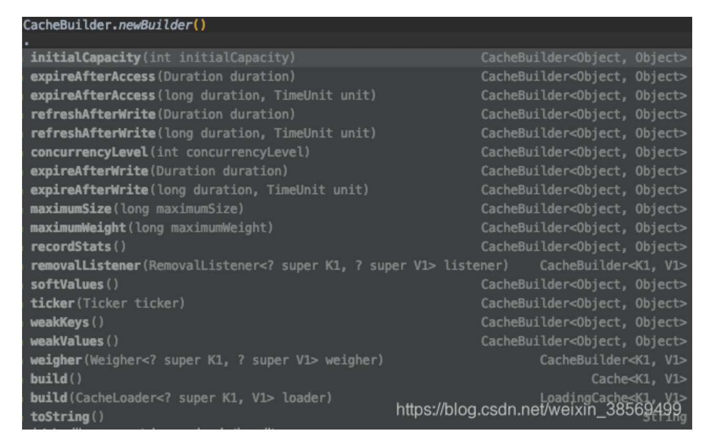
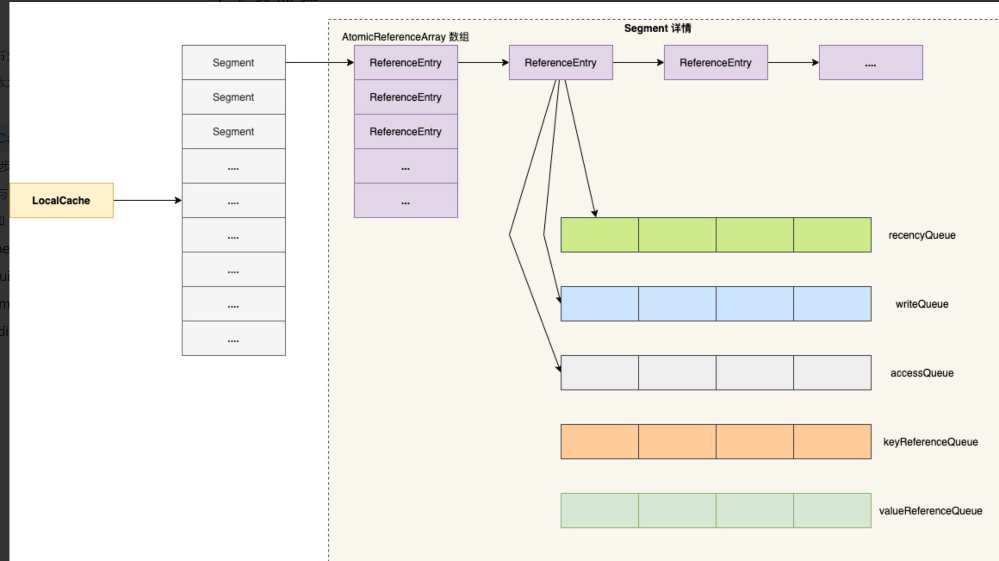

# Guava Cache

https://blog.csdn.net/weixin_38569499/article/details/103720524

## 一、基础信息

#### 1、版本

```java
<dependency>
    <groupId>com.google.guava</groupId>
    <artifactId>guava</artifactId>
    <version>29.0-jre</version>
</dependency>
```

#### 2、构造方式



#### 3、核心参数

 核心参数详解参考：[Guava Cache：核心参数深度剖析和相关源码分析](https://blog.csdn.net/weixin_38569499/article/details/108887341)

1、容量

- initialCapacity：初始容量；
- maximumSize：最大容量；
- maximumWeight：最大权重，每条缓存的默认权重为1，可以增加单挑缓存的权重；
- weither：权重器，用于衡量不同缓存条目的权重。

2、超时时长

- expireAfterAccess：超时计算方式：在访问请求之后重置超时计时器；
- expireAfterWrite：超时计算方式：在写请求之后重置超时计时器。

3、刷新

- refreshAfterWrite：写操作后多久刷新缓存内容，刷新使用下面的加载器；
- build(CacheLoader loader)：构造LoadingCache实例，入参是用于刷新的加载器；
- removalListener：移除监听器，接收条目被移除的通知，可以过滤需要的缓存条目，进行相应处理。

4、引用强度

- weakValues：指定所有的value都是弱引用；
- weakKeys：指定所有的key都是弱引用；
- softValues：指定所有的key都是软引用。

5、其他

- concurrencyLevel：并发级别，级别越高支持的最大并发数越大；
- recordStats：启用缓存统计，即缓存操作期间的性能相关的统计；
- ticker：指定纳秒精度的时间源，默认使用System.nanoTime()。

## 二、基本原理

### 1、数据结构



Guava Cache的数据结构，和JDK 1.7版本的ConcurrentHashMap非常相似：

- 分段segment：最外层是分段segment，用于控制最大的写并发数量；
- 分段内的数组table：每个分段内维护一个原子引用数组table，根据元素的hash值确定在数组中的位置；
- 数组内的链表：数组的任一元素，存放的都是一个链表，用于解决哈希碰撞的情况；
- 和JDK 1.7的ConcurrentHashMap的一个重要区别在于，Guava Cache的数组中始终存放的都是链表，不会变成红黑树。

#### 1.1 分段segment的数量

  分段segment是缓存工具Cache的最外层结构。一个缓存可能会有多个segment，所有segment的内容之和，表示整个缓存。

  segmentCount的值主要取决于建造者类CacheBuilder的参数***并发级别concurrencyLevel***，另外还会受到CacheBuilder参数***最大加权值maximumWeight***。

    分段数量segmentCount的取值规则简述：

segmentCount是2的整数倍；
segmentCount在允许的取值范围内取最大值；
concurrencyLevel的约束：1/2 * segmentCount满足：小于concurrencyLevel ；
maxWeight的约束：如果maxWeight < 0（不限制缓存最大容量），则对segmentCount无影响；如果设置了有效的maxWeight，则 1/2 * segmentCount 小于等于1/20 * maxWeight。
————————————————

                            版权声明：本文为博主原创文章，遵循 CC 4.0 BY-SA 版权协议，转载请附上原文出处链接和本声明。

原文链接：https://blog.csdn.net/weixin_38569499/article/details/103720524