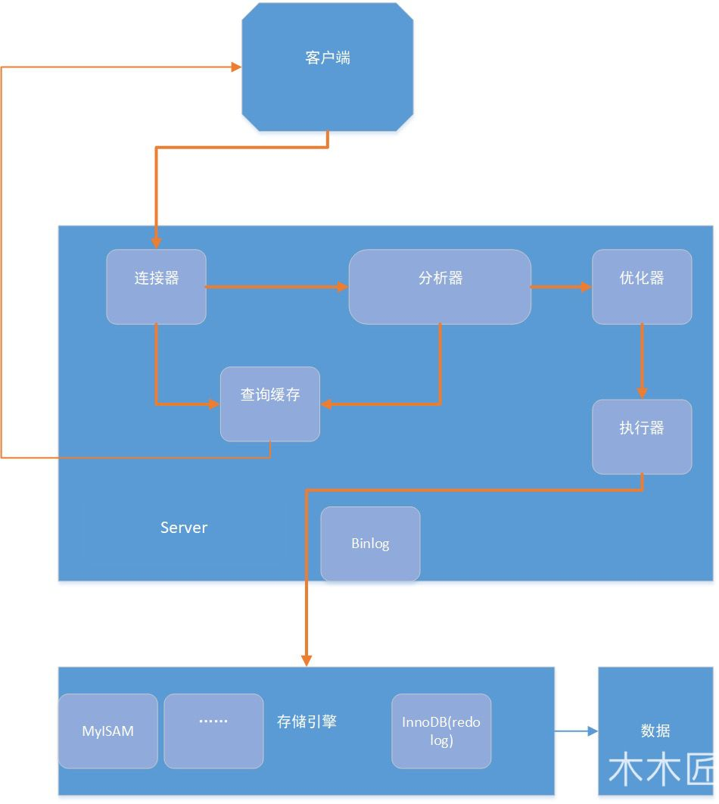

[TOC]


# [主页面](../../README.html)

## 一、索引
### 什么是索引？

**索引是一种用于快速查找和检索数据的数据结构。常见的索引结构有:B树，B+树和Hash。**

索引的作用就相当于目录的作用。打个比方，我们在查字典的时候，如果没有目录，那么我们只能一页一页的去找我们需要查的那个字，速度很慢。如果有目录了，我们只需要先去目录中查找字的位置，然后直接翻到那一页就行了。

### 索引的底层数据结构
1. **数据结构**
- B tree指的是Balance Tree，也就是平衡。平衡树是一棵查找树，并且所有叶子节点位于同一层。
  - 每个节点最多有m个子节点。
  - 每个非叶子节点(除了根)具有至少m/2(向上取整)子节点。
  - 如果根不是叶子节点，则根至少有两个子节点。
  - 具有k个子节点的非叶节点包含k-1个键。
  - 所有叶子都位于同一层，没有任何信息。

- B+树

  - **指针**：B+ Tree是基于B Tree和叶子节点顺序访问指针进行实现，它具有B tree的平衡性，并且通过**顺序访问指针**来提高区间查询的性能。

  - **存储**：非叶子节点不存储data，只存储索引，这样在同样的空间下存储更多的索引，可以减少树高。

  - 在B+树中，一个节点中的key从左到右非递减排列，如果某个指针的左右相邻key分别是keyi和keyi+1,且不为null,则该指针指向节点的所有key大于等于keyi且小于等于keyi+1;

  


2. **操作**
- 进行查找操作时，首先在根节点进行二分查找，找到一个key所在的指针，然后递归的在指针所指向的节点进行查找，直到查找到叶子节点，然后在叶子节点上进行二分查找，找到key所对应的data.
- 插入删除操作会破坏平衡树的平衡性，因此在进行插入删除操作之后，需要对树进行分裂，合并，旋转等操作来维持平衡性。

3. **与红黑树比较**
    红黑树等平衡树也可以实现索引，但是文件系统及数据库普遍采用B+tree作为索引结构，这是因为使用B+树访问磁盘数据具有更高的性能。

  - **B+树有更低的树高**
    平衡树的树高O(h)=O(logdN)，其中d为每个节点的出度，红黑树的出度时2，而B+树的出度一般非常大，所以红黑树的树高明显比B+树大的多。

  - **磁盘访问原理**

    操作系统一般将内存和磁盘分割成固定大小的块，每一块称为一页，内存与磁盘以页为单位交换数据。**数据库系统将索引的一个节点的大小设置为页的大小，使得一次I/O就能完全载入一个节点。**
    如果数据不在同一个磁盘块上，那么通常需要移动制动手臂进行寻道，而制动手臂因为其物理机构导致了移动效率低下，从而增加磁盘数据读取时间。**B+树相对于红黑树有更低的树高，进行寻道次数与树高成正比，在同一个磁盘块上进行访问只需要很短的磁盘旋转时间，所以B+树更适合磁盘数据的读取。**

  - **磁盘预读特性**
    为了减少磁盘I/O操作，磁盘往往不是严格按需读取，而且每次都会预读。预读过程中，磁盘进行顺序读取，顺序读取不需要进行磁盘寻道，并且只需要很短的磁盘旋转时间，速度会非常快。并且可以利用预读特性，相邻的节点也能够被预先载入。

### 索引的优缺点

#### 优点

- **可以大大加快数据的检索速度(大大减少检索的数据量)。** 这也是创建索引的最主要的原因。
- **帮助服务器避免进行排序和分组，以及避免创建临时表。**(B+Tree 索引是有序的，可以用于 ORDER BY 和 GROUP BY 操作。临时表主要是在排序和分组过程中创建，不需要排序和分组，也就不需要创建临时表）。
- **将随机 I/O 变为顺序 I/O.**（B+Tree 索引是有序的，会将相邻的数据都存储在一起）。

#### 缺点

- **创建索引和维护索引需要耗费许多时间**。当对表中的数据进行增删改的时候，如果数据有索引，那么索引也需要动态的修改，会降低SQL的效率。
- **占用物理存储空间**：索引需要使用物理文件存储，也会耗费一定空间.

### [索引失效的情况](https://juejin.cn/post/6844904015872917517)

- **查询条件包括or，可能导致索引失效。如or前的条件的列中有索引，而后面的列没有索引，那么设计的索引都不会用到。**
- **如果字段类型是字符串，where时一定要加单引号括起来，否则索引会失效。**
- **like通配符可能导致索引失效：like查询是以%开头，会导致索引失效。**
  - 解决方法：通过覆盖索引来解决。
- **联合索引，查询时条件列不是联合索引中的第一列，索引失效。**
- **在索引列上使用mysql的内置函数，索引失效。**
- **对索引列运算（如加减乘除）索引失效。**
- **in走索引，索引字段上使用（！= 或者 < >，not in）时，可能会导致索引失效。**
- **索引字段上使用is null，is not null，可能会导致索引失效。如null的数据非常多，这时查询null，就有可能全表扫描，索引失效。**
- 左连接查询或者右连接查询查询关联的字段编码格式不一样，可能会导致索引失效。
- **mysql估计使用全表扫描要比使用索引快,则不使用索引。**

### MySQL索引

索引是在存储引擎层实现的，而不是在服务器层实现的，所以不同存储引擎具有不同的索引类型和实现。
#### 1. 数据结构角度

##### B+Tree索引

- 是大多数Mysql存储引擎的默认索引类型。
- 因为不需要进行全表扫描，只需要对树进行搜索即可，所以查找速度快很多。
- 因为B+树的有序性，素以除了用于查找，还可以用于排序和分组。
- 可以指定多个列作为索引另外，多个索引列共同组成键。
- 适用于全键值，键值范围和键前缀查找，其中键前缀查找只适合于最左前缀查找。如果不是按照索引列的顺序进行查找，则无法使用索引。
- InnoDB的B+索引分为主索引和辅助索引
  - 主索引的叶子节点data域记录着完整的数据记录，这种索引方式被称为聚簇索引。因为无法把数据行存放在两个不同的地方，所以一个表只能有一个聚簇索引。
  - 辅助索引的叶子节点的data域记录着主键的值，因此在使用辅助索引进行查找是，需要先找到主键值，然后再到主索引中进行查找。
##### 哈希索引
哈希索引能以O(1)时间进行查找，但是失去了有序性。
- 无法用于排序和分组；
- 只支持精确查找，无法用于部分查找和范围查找。

InnoDB存储引擎有一个特殊的功能叫‘自适应哈希索引’，当某个索引值被使用的非常频繁时，会再B+tree索引之上再创建一个哈希索引，这样就会让B+索引具有哈希索引的一些优点，比如快速的哈希查找。

#### 2. 物理存储角度

可分为聚簇索引和非聚簇索引。

##### 聚簇索引

- **聚簇索引即索引结构和数据一起存放的索引。主键索引属于聚集索引。**

> 在Mysql中，InnoDB引擎表中的`.ibd`文件就包含了该表的索引和数据，对于InnoDB引擎表来说，**该表的索引(B+)树的每个非叶子节点存储索引，叶子节点存储索引和索引对应的数据。**

- **优点**：**聚簇索引的查询速度非常的快**，因为整个B+树本身就是一颗多叉平衡树，叶子节点也都是有序的。定位到索引的节点，就相当于定位到了数据。
- **缺点**
  - **依赖于有序的数据：**因为B+树是多路平衡树，如果索引的数据不是有序的，那么就需要在插入时排序，如果数据时整形的还好，否则类似于字符串这种数据，插入或者查找的速度肯定比较慢。
  - **更新代价大**：如果索引列的数据被修改时，那么对应的索引也将被修改，而且聚簇索引的叶子节点还存放着着数据，修改的代价肯定较大的。所以对于主键索引来说，主键一般都是不可被修改的。

##### 非聚簇索引

- **非聚簇索引即索引结构和数据分开存放的索引。**二级索引属于非聚簇索引。

  > MYISAM引擎表的.MYI文件包含了表的索引，该表的索引（B+树）的每个叶子非叶子节点存储索引，叶子节点村塾索引和索引对应数据的指针，指向.MYD文件的数据。
  >
  > **非聚簇索引的叶子节点并不一定存放数据的指针，因为二级索引的叶子节点存放的就是主键，根据主键再回表查数据**。

- **优点：更新代价比聚簇索引要小。** 非聚簇索引的叶子节点是不存放数据的。

- **缺点**

  - **和聚簇索引一样，非聚簇索引也依赖于有序的数据。**
  - **可能会二次查询（回表）**：是非聚簇索引最大的缺点。当查到索引对应的指针或者主键后，可能还需要根据指针或者主键再到数据文件或者表中查询。

##### 非聚簇索引一定回表查询吗？

非聚簇索引不一定回表查询，当索引的key本身就是要查询的字段时，查到之后直接返回就行，无需回表查询。

> 试想一种情况，用户准备使用SQL查询用户名，而用户名字段正好建立了索引。
>
> ​       SELECT name FROM table WHERE name='guang19';
>
> 那么这个索引的 key 本身就是 name，查到对应的 name 直接返回就行了，无需回表查询。

即使是MYISAM也是这样，虽然MYISAM的主键索引确实需要回表，因为他的主键索引的叶子节点存放的是指针，但如果SQL查询的是主键，主键本身的key就是主键，查到之后返回就行。这种情况称为覆盖索引。

##### 索引覆盖

- 如果一个索引包含(或者覆盖)所有要查询的字段的值，称为覆盖索引。

- 在Innode存储引擎中，如果不是主键索引，叶子节点存储的是主键+列值。最终还是要回表。也就是要通过主键再查找一次。这样就会比较慢。覆盖索引就是把要查询的列和索引是对应的，不做回表操作。

**覆盖索引即需要查询的字段正好是索引的字段，那么直接根据该索引，就可以查到数据了。而无需回表查询。**

> 如主键索引：如果一条SQL需要查询主键，那么正好根据主键索引就可以查到主键。
>
> 再如普通索引：如果一条SQL需要查询name，name字段正好有索引，那么直接根据这个索引就可以查到数据，也无需回表。

#### 3. [逻辑角度](https://blog.csdn.net/biggoodloong/article/details/90203301)

##### 主键索引

- **数据表中的主键列使用的就是主键索引。**

- **一张数据表只能有一个主键，并且主键不能为null,不能重复。**

- 在mysql的InnoDB的表中，当没有显示的指定表的主键时，InnoDB会自动先检查表中是否有唯一索引的字段，如果有，则选择该字段为默认的主键，否则InnoDB会自动创建一个6byte的自增主键。

  > 为什么建议InnoDB表必须建主键，并且推荐使用整形的自增主键？
  >
  > - 因为主键自带索引，如果不建索引，数据库就自己建索引。
  > - 因为在查找过程中涉及到比较大小，整型作为索引，容易直接判断大小而保持有序。
  > - 自增： 因为叶子节点的索引元素都是递增的，从左到右排好序的，可以直接在原来链表的后面插元素。效率较高。

##### 二级索引（辅助索引）

 二级索引又称为辅助索引，是因为**二级索引的叶子节点存储的数据是主键**。也就是说，通过二级索引，可以定位主键的位置。

**唯一索引(Unique Key)**

唯一索引也是一种约束，**唯一索引的属性列不能出现重复的数据，但是允许数据为NULL，一张表允许创建多个唯一索引。**建立唯一索引的目的大部分时候都是为了该属性列的数据的唯一性，而不是查询效率。

**普通索引(Index)** 

**普通索引的唯一作用就是为了快速查询数据，一张表允许创建多个普通索引，并允许数据重复和NULL.**

**前缀索引(Prefix)**

前缀索引只适用于字符串类型的数据。前缀索引是对文本的前几个字符创建索引，相对于普通索引建立的数据更小，因为只取前几个字符。

**全文索引(Full Text)** 

全文索引主要是为了检索大文本数据中的关键字的信息，是目前搜索引擎数据库使用的一种技术。Mysql5.6 之前只有 MYISAM 引擎支持全文索引，5.6 之后 InnoDB 也支持了全文索引。

>- Myisam存储索引支持全文索引，用于查找文本中的关键词，而不是直接比较是否相等。
>- 查找条件使用MATCH AGAINST，而不是普通的WHERE。
>- 全文索引使用倒排索引实现，它记录着关键词到其所在文档的映射。
>- InnoDB 存储引擎在 MySQL 5.6.4 版本中也开始支持全文索引。

#### 4. 为表添加索引

```mysql
1.添加主键索引
ALTER TABLE `table_name` ADD PRIMARY KEY ( `column` ) 
2.添加唯一索引
ALTER TABLE `table_name` ADD UNIQUE ( `column` ) 
3.添加普通索引
ALTER TABLE `table_name` ADD INDEX index_name ( `column` )
4.添加全文索引
ALTER TABLE `table_name` ADD FULLTEXT ( `column`) 
5. 添加多列索引
ALTER TABLE `table_name` ADD INDEX index_name ( `column1`, `column2`, `column3` )
```

### 索引优化

1. **独立的列** 
- **在进行查询时，索引列不能是表达式的一部分，也不能是函数的参数，否则无法使用索引。**
例如以下的查询不能使用actor_id列的索引。
```sql
SELECT actor_id FROM sakila.actor WHERE actor_id +1=5;
```

2. **组合索引**
在需要使用多个列作为条件进行查询时，使用组合索引比使用多个单列索引性能更好。
例如下面的语句中，最好把 actor_id 和 film_id 设置为多列索引。
```sql
SELECT film_id, actor_ id FROM sakila.film_actor
WHERE actor_id = 1 AND film_id = 1;
```

3. **选择合适的索引列顺序**
    让选择性最强的索引放在前面。
    索引的选择性是指：不重复的索引值和记录总数的比值。最大为1。此时每个记录都有唯一的索引与其对应，选择性越高，每个记录的区分度越高，查询效率也就越高。

4. **前缀索引**

  - 有时候需要索引很长的字符列，这样会造成索引变得非常大，这时候**可以索引开始的部分字符，这样可以大大节约索引空间，从而提高索引效率**，但是这样会降低索引的选择性，一般情况下某个列前缀的选择性也是足够高的，足以满足查询性能。

  - 对于BLOB，TEXT和VARCHAR类型的列，必须使用前缀索引，只索引开始的部分字符。

5. **覆盖索引**
    **即需要查询的字段正好是索引的字段，那么直接根据该索引，就可以查到数据了。而无需回表查询。**
    具有以下优点：
- 索引通常远小于数据行的大小，只读取索引能大大减少数据访问量；
- 一些存储索引（例如 MyISAM）在内存中只缓存索引，而数据依赖于操作系统来缓存，因此只访问索引可以不使用系统调用。
- 对于 InnoDB 引擎，若辅助索引能够覆盖查询，则无需访问主索引。

6. 使用唯一索引时，区分度越高，使用索引的效率就越高。

### 索引的使用条件
- 对于非常小的表，大部分情况下简单的全表扫描比建立索引更加高效。
- 对于中到大型表，索引就非常有效。
- 但是对于特大型的表，建立和维护索引的代价会随之增长。这种情况下，需要用到一种技术可以直接区分出需要查询的一组数据，而不是一条记录一条记录的匹配，例如可以使用分区技术。

### B+树索引与其他索引的比较

B-tree：因为B树不管叶子节点还是非叶子节点，都会保存数据，这样导致在非叶子节点中能保存的指针数量变少（有些资料也称为扇出），指针少的情况下要保存大量数据，只能增加树的高度，导致IO操作变多，查询性能变低.

Hash：虽然可以快速定位，但是没有顺序，不支持范围查找，IO复杂度高。

二叉树：树的高度不均匀，不能自平衡，查找效率跟数据有关（树的高度），并且IO代价高。

红黑树：树的高度随着数据量增加而增加，IO代价高。

**不使用平衡二叉树的原因如下**：

最大原因：深度太大(因为一个节点最多只有2个子节点)，一次查询需要的I/O复杂度为O(lgN),而b+tree只需要O(log_mN),而其出度m非常大，其深度一般不会超过4 
平衡二叉树逻辑上很近的父子节点，物理上可能很远，无法充分发挥磁盘顺序读和预读的高效特性。

**HashMap为什么不用B+树？而用红黑树？**

B+树在数据库中被应用的原因就是B+树比B树更加“矮胖”，B+树的非叶子结点不存储数据，所以每个结点能存储的关键字更多。所以B+树更能应对大量数据的情况。
jdk1.7中的HashMap本来是数组+链表的形式，链表由于其查找慢的特点，所以需要被查找效率更高的树结构来替换。
如果用B+树的话，在数据量不是很多的情况下，数据都会“挤在”一个结点里面。这个时候遍历效率就退化成了链表。

### 既然减少树的高度可以减少I/O操作，为什么不能将树高转为1层？

这样需要一次性把所有的数据加载到RAM中进行查询，浪费了内存空间。

## 二、查询优化

### 开启慢查询日志，获取查询时间比较长的SQL语句

- 开启慢查询日志

  ```mysql
  slow_query_log=ON  -- 开启
  long_query_time=3  -- 时间
  slow_query_log_file=/var/lib/myql/slow-log.log -- 存放位置
  ```

  

### 使用Explain进行分析

- Explain用来分析SELECT查询语句，开发人员可以通过分析Explain结果来优化查询语句。

  ```mysql
  explain select ....
  如 EXPLAIN SELECT * FROM user WHERE id>3
  ```

- 比较重要的字段
  
  - id: id字段时select查询的序列号，是一组数据，表示的是查询中执行select子句或者是操作表的顺序，id有三种情况
    - 相同时表示加载表的顺序是从上到下的。
    - id不同id值越大，优先级越高，越先被执行。
    - id有相同也有不同。id相同的为一组，顺序从上到下执行，再所有组中，id值越大，越先被执行。
  - **select_type: 查询的类型，从上往下效率越来越低**
    - simple：简单的select查询，查询中不包含子查询或者union;
    - primary：查询中若包含任何复杂的子查询，最外层查询标记为该标识。
    - subquery：在select或where列表中包含了子查询。
    - derived：在from 列表中包含的子查询会被标记为derived(衍生)，mysql会递归执行这些子查询，把结果放入临时表中
    - union：若第二个select出现在union之后，则标记为union,若union包含在from子句的子查询，外层select将标记为derived.
    - union result：从联合在一起的union表中获取结果的select.
  - **type: 提供了判断查询是否高效的重要依据。通过type字段，可以判断此次查询是全表扫描还是索引扫描**。
    - null: mysql不访问任何表，索引，直接返回结果。
    - system：表示只有一行记录，这是const类型的特例，一般不会出现。
    - const ：根据主键或者唯一索引查询，表示通过索引一次就找到了，只查询一行语句。
    - eq_ref: 类似ref，区别在于使用的是唯一索引，使用主键的多表关联查询，关联查询出的记录只有一条，常见于主键或者唯一索引扫描。
    - ref: 使用非唯一性索引扫描，返回匹配某个单独值得所有行。
    - range: 只检索给定返回的行，使用一个索引来选择行，where之后出现between,<,>,in等操作。
    - index: 遍历索引树。
    - all：全表扫描。
  - key: 索引
    - possible_keys：显示可能应用在这个表的索引，一个或者多个
    - key:实际使用的索引，如果为null,则没有使用索引。
    - key_len :标识索引中使用的字节数，该值为索引字段最大可能长度，并非实际使用长度，在不损失精确度的前提下，长度越短越好。
  - **rows：扫描的行数**
  - extra：额外的信息，通常包括：Using index,Using where,Using index condition
    - **using filesort：说明mysql会对数据使用一个外部的索引排序，而不是按照表内的索引顺序进行读取，称为文件排序。需要进行优化。**
    - **using temporary：说明使用了临时保存中间结果.需要进行优化。**
    - **Using index：表示相应的select操作使用了覆盖索引，效率不错。**

### 优化数据访问

1. 减少请求的数据量
- 只返回必要的列：最好不要使用select *语句。
- 只返回必要的行：使用LIMIT语句来限制返回的数据。
- 缓存重复查询的数据：使用缓存可以避免在数据库中进行查询，特别是在要查询的数据经常被重复查询时，缓存带来的查询性能提升将会是非常明显的。
2. 减少服务器端扫描的行数
最有效的方式是使用索引来覆盖查询。

### 重构查询方法
1. 切分大查询
一个大查询如果一次性执行的话，可能一次锁住很多数据，占满整个事务日志，耗尽系统资源，阻塞很多小但是重要的查询。
2. 分解大连接查询
将一个大连接查询分解成对每一个表进行一次单表查询，然后在应用程序中进行关联。这样做的好处是:
- **让缓存更高效。** 对于连接查询，如果其中一个表发生变化，那么整个查询缓存就无法使用。二分解后的多个查询，即使其中一个表发生变化，对其他表的查询缓存依然可以使用。
- 分解成多个单表查询，这些单表查询的缓存结果更可能被其他查询使用到，从而减少冗余记录的查询。
- 减少锁竞争；
- 在应用层进行连接，可以更容易对数据库进行拆分，从而更容易做到高性能和可伸缩。
- 查询本身效率也有可能会有所提升。

## 三、存储引擎
### InnoDB
- 是Mysql默认的事务型存储引擎，只有在需要它不支持的特性时，才考虑使用其他存储引擎。
- 实现了四个标准的隔离级别，默认级别是可重复读，在可重复读隔离级别下，通过多版本并发控制(MVCC)+Next-key-Locking防止幻影读。
- 主索引是聚簇索引，在索引中保存了数据，从而避免直接读取磁盘，因此对查询性能有很大的提升。
- 内部做了很多优化，包括从磁盘读取数据时采用的可预测性读、能够加快读操作并且自动创建的自适应哈希索引、能够加速插入操作的插入缓冲区等。
- 支持真正的在线热备份(热备份是系统处于正常运转状态下的备份)。其它存储引擎不支持在线热备份，要获取一致性视图需要停止对所有表的写入，而在读写混合场景中，停止写入可能也意味着停止读取。

### MyISAM
- 设计简单，数据以紧密格式存储。对于只读数据，或者表比较小、可以容忍修复操作，则依然可以使用它。
- 提供了大量的特性，包括压缩表、空间数据索引等。
- 不支持事务。
- 非聚簇索引，数据文件是分离的，索引保存的是数据文件的指针。
- 不支持行级锁，只能对整张表加锁，读取时会对需要读到的所有表加共享锁，写入时则对表加排它锁。但在表有读取操作的同时，也可以往表中插入新的记录，这被称为并发插入（CONCURRENT INSERT）。
- 可以手工或者自动执行检查和修复操作，但是和事务恢复以及崩溃恢复不同，可能导致一些数据丢失，而且修复操作是非常慢的。
- 如果指定了 DELAY_KEY_WRITE 选项，在每次修改执行完成时，不会立即将修改的索引数据写入磁盘，而是会写到内存中的键缓冲区，只有在清理键缓冲区或者关闭表的时候才会将对应的索引块写入磁盘。这种方式可以极大的提升写入性能，但是在数据库或者主机崩溃时会造成索引损坏，需要执行修复操作。
### 比较
- **事务**: InnoDB是事务型的，可以使用 Commit 和 Rollback 语句。
- **并发**：MyISAM只支持表级锁，而InnoDB还支持行级锁。
- **外键**：InnoDB 支持外键。
- **备份**: InnoDB 支持在线热备份(热备份是系统处于正常运转状态下的备份)。
- **崩溃恢复**：MyISAM 崩溃后发生损坏的概率比 InnoDB 高很多，而且恢复的速度也更慢。
- **其他特性：** MyISAM 支持压缩表和空间数据索引。

## 四、数据类型

### 整型
- tinyint(8),smallint(16),Mediumint(24),int(32),bigint(64)位存储空间，一般情况下越小的列越好。
- int(11)中的数字只是规定了交互工具显示字符的个数，对于存储和计算来说是没有意义的。
### 浮点数
- float和double为浮点类型，decimal为高精度小数类型，CPU原生支持浮点运算，但是不支持decimal类型的计算，因此decimal的计算比浮点类型需要更高的代价。
- FLOAT、DOUBLE 和 DECIMAL 都可以指定列宽，例如 DECIMAL(18, 9) 表示总共 18 位，取 9 位存储小数部分，剩下 9 位存储整数部分。

### 字符串
- char(定长)和varchar(变长)。
- VARCHAR 这种变长类型能够节省空间，因为只需要存储必要的内容。
- 在进行存储和检索时，会保留 VARCHAR 末尾的空格，而会删除 CHAR 末尾的空格。

### 时间和日期
1. datatime
- 能够保存从1000年到9999年的日期和时间，精度为秒，使用8字节的存储空间。
- 他与时区无关。
2. timestamp
- 和UNIX时间戳相同，保存从1970年1月1日以来的秒数，使用四个字节，只能表示从170年到2038年。
- 它和时区有关，也就是一个时间戳在不同的时区所代表的具体时间是不同的。
- MySQL 提供了 FROM_UNIXTIME() 函数把 UNIX 时间戳转换为日期，并提供了 UNIX_TIMESTAMP() 函数把日期转换为 UNIX 时间戳。
- 默认情况下，如果插入时没有指定 TIMESTAMP 列的值，会将这个值设置为当前时间。
- 应该尽量使用 TIMESTAMP，因为它比 DATETIME 空间效率更高。

## 五、切分

### 水平切分(sharding)
- 将同一个表中的记录拆分到多个结构相同的表中。
- 当一个表的数据不断增多的时候，可以将数据分布到集群的不同节点上，从而缓解单个数据库的压力。


### 垂直切分
- 垂直切分是将一张表按列切分成多个表，通常是按照列的关系密集程度进行切分，也可以利用垂直切分将经常被使用的列和不经常被使用的列切分到不同的表中。

- 在数据库的层面使用垂直切分将按数据库中表的密集程度部署到不同的库中，例如将原来的电商数据库垂直切分成商品数据库、用户数据库等。


### Sharding 策略
- 哈希取模:hash(key) % N；
- 范围：可以是ID范围也可以是时间范围；
- 映射表：使用单独的一个数据库来存储映射关系。

### Sharding 存在的问题
1. 事务问题
使用分布式事务来解决，比如 XA 接口。
2. 连接
可以将原来的连接分解成多个单表查询，然后在用户程序中进行连接。
3. ID 唯一性
- 使用全局唯一 ID（GUID）
- 为每个分片指定一个 ID 范围
- 分布式 ID 生成器 (如 Twitter 的 Snowflake 算法）

## 六、复制

### 主从复制
**基本问题是让一台服务器的数据与其他服务器保持同步。**主要涉及三个线程:binlog线程，I/O线程和SQL线程。

- binlog线程：负责将主服务器上的数据更改写入二进制日志(Binary log)中。[**顺序写，效率高，基本无延迟**]

- I/O线程：负责从主服务器上读取二进制日志，并写入从服务器的中继日志（Relay log）。[**顺序读，顺序写，基本无延迟**]

- SQL 线程 ：负责读取中继日志，解析出主服务器已经执行的数据更改并在从服务器中重放（Replay）。[**随机写，耗时**]

  > 为什么sql线程比较耗时?
  >
  > 因为sql语句操作的数据不一定在同一个磁盘块，寻找磁盘块的过程比较耗时。

  

#### 主从复制延迟产生的原因是什么？

1. 大事务执行，如果主库的一个事务执行了10分钟，而写入binlog的写入必须要等到事务完成之后，才会传入备库，那么此刻在开始执行的时候就已经延迟了10分钟了。
2. 主库的写操作是顺序写binlog,从库单线程去主库读binlog，从库取到binlog之后在本地执行。mysql的主从复制都是单线程操作，但是由于主库是顺序写，所以效率很高，而从库也是顺序读取主库的日志，此时的效率也是比较高的，但是当数据拉取过来之后变成了随机的操作，而不是顺序的，所以此刻成本会提高。
3. 当主库的TPS并发非常高的时候，产生的DDL数量超过了一个线程所能承受的范围的时候，那么也可能带来延迟。

#### 如何解决延迟问题？

在mysql5.6之后引入了一个概念，也就是并行复制。


##### 多线程slave（MTS）问题

为了提高执行效率，引入多线程并行。但是此刻会存在一些并发事务问题，称为multi-thread slave。为了解决这些问题，mysql5.6引入一些规则。

- 更新同一行的多个事务，必须要分发到同一个worker中执行。
- 同一个事务不能拆开，必须要放到同一个worker中执行。

mysql5.7的并行复制策略

- 同时处于prepare状态的事务，在备库执行是可以并行的。
- 处于perpare状态的事务，与处于commit状态的事务之间，在备库上执行也是可以并行的。

### 读写分离

主服务器处理写操作以及实时性要求较高的读操作，而从服务器处理读操作。
读写分离能提高性能的原因在于：

- 主从服务器负责各自的读和写，极大程度缓解了锁的争用，
- 从服务器可以使用 MyISAM，提升查询性能以及节约系统开销；
- 增加冗余，提高可用性。
读写分离常用代理方式来实现，代理服务器接收应用层传来的读写请求，然后决定转发到哪个服务器。

## 七、其他问题

### [如何设计一个mysql表](https://www.cnblogs.com/wangxiaosai/p/14181076.html)

1. 选取存储引擎

   在表结构设计中，首先需要选择一个合适的存储引擎，如果需要事务操作，就选择InnoDB存储引擎，如果主要要求读性能高，可以使用MyISAM存储引擎。

2. 表结构设计

   使用范式设计，消除冗余

   > 三大范式：
   >
   > - 第一范式：属性（字段）的原子性约束，要求属性具有原子性，不可再分割。
   > - 第二范式：记录的唯一性约束，要求记录有唯一标识，每条记录需要有一个属性来作为实体的唯一标识。
   > - 第三范式：属性(字段)冗余性的约束，即任何字段不能由其他字段派生出来，在通俗点就是：主键没有直接关系的数据列必须消除(消除的办法就是再创建一个表来存放他们，当然外键除外)

   反范式设计，适当冗余

   > 满足范式的表一定是规范化的表，但不一定是最佳的设计。 很多情况下会为了提高数据库的运行效率，常常需要降低范式标  准：适当增加冗余，达到以空间换时间的目的。比如我们有一个表，产品名称，单价，库存量，总价值。这个表是不满足第三范式的，因为“总价值”可以由“单价”乘以“数量”得到，说明“金额”是冗余字段。但是，增加“总价值”这个冗余字段，可以提高查询统计的速度，这就是以空间换时间的作法。合理的冗余可以分散数据量大的表的并发压力，也可以加快特殊查询的速度，冗余字段可以有效减少数据库表的连接，提高效率。

3. 主键

   - 主键：根据第二范式，需要有一个字段去标识这条记录，主键无疑是最好的标识，需要满足唯一性、非空性，但是很多表也不一定需要主键，但是对于数据量大，查询频繁的数据库表，一定要有主键，主键可以增加效率、防止重复等优点。 

   - 主键的选择也比较重要，一般选择长度小的键，小的键的比较速度快，同时小的键可以使主键的B树结构的层次更少。 

   - 主键的选择还要注意组合主键的字段次序，对于组合主键来说，不同的字段次序的主键的性能差别可能会很大，一般应该选择重复率低、单独或者组合查询可能性大的字段放在前面。

4. 选择数据类型

   - **更小的通常更好，更小的数据类型通常更快**， 因为它们占用更少的磁盘、 内存和CPU缓存， 并且处理时需要的CPU周期也更少。

   - 简单就好 简单数据类型的操作通常需要更少的CPU周期。 例如， 整型比字符操作代价更低， 因为字符集和校对规则（排序规则 ）使字符比较比整型比较更复杂。 

   - **尽量避免NULL**：如果查询中包含可为NULL 的列， 对MySQL来说更难优化， 因为可为NULL 的列使得索引、 索引统计和值比较都更复杂。 可为NULL的列会使用更多的存储空间， 在MySQL里也需要特殊处理。 当可为NULL的列被索引时， 每个索引记录需要一个额外的字节， 在MyISAM里甚至还可能导致固定大小的索引（例如只有一个整数列的索引）变成可变大小的索引。当然也有例外， 例如InnoDB 使用单独的位 (bit) 存储NULL值， 所以对于稀疏数据有很好的空间效率。 

   - **数据类型尽量用数字型**，数字型的比较比字符型的快很多

5. 合适的索引

   索引是一个表优化的重要指标，在表优化中占有极其重要的成分。

6. 添加注释

### [一条SQL语句执行的过程](https://snailclimb.gitee.io/javaguide/#/docs/database/%E4%B8%80%E6%9D%A1sql%E8%AF%AD%E5%8F%A5%E5%9C%A8mysql%E4%B8%AD%E5%A6%82%E4%BD%95%E6%89%A7%E8%A1%8C%E7%9A%84)

- mySQL主要分为server层和引擎层。server层主要包括连接器，分析器，优化器，执行器，同时还有一个日志模块。这个日志模块是所有执行引擎都可以共用的。

- 引擎层是插件式的，主要包括：MYISAM,InnoDB,等

- 查询语句的执行流程：权限校验（如果命中缓存）---》查询缓存---》分析器---》优化器---》权限校验---》执行器---》引擎

  - 先检查该语句是否有权限，如果没有权限，直接返回错误信息，如果有权限，在 MySQL8.0 版本以前，会先查询缓存，以这条 sql 语句为 key 在内存中查询是否有结果，如果有直接缓存，如果没有，执行下一步。
  - 通过分析器进行词法分析，提取 sql 语句的关键元素，比如提取上面这个语句是查询 select，提取需要查询的表名为 tb_student,需要查询所有的列，查询条件是这个表的 id='1'。然后判断这个 sql 语句是否有语法错误，比如关键词是否正确等等，如果检查没问题就执行下一步。
  - 接下来就是优化器进行确定执行方案，上面的 sql 语句，可以有两种执行方案，那么优化器根据自己的优化算法进行选择执行效率最好的一个方案（优化器认为，有时候不一定最好）。那么确认了执行计划后就准备开始执行了。

  ```
   a.先查询学生表中姓名为“张三”的学生，然后判断是否年龄是 18。
   b.先找出学生中年龄 18 岁的学生，然后再查询姓名为“张三”的学生。
  ```

  - 进行权限校验，如果没有权限就会返回错误信息，如果有权限就会调用数据库引擎接口，返回引擎的执行结果。

- 更新语句执行流程如下：分析器----》权限校验----》执行器---》引擎---redo log(prepare 状态)---》binlog**（归档日志）**---》redo log(commit状态)

#### MySql基本架构

- **连接器：** 身份认证和权限相关(登录 MySQL 的时候)。
- **查询缓存:** 执行查询语句的时候，会先查询缓存（MySQL 8.0 版本后移除，因为这个功能不太实用）。
- **分析器:** 没有命中缓存的话，SQL 语句就会经过分析器，分析器说白了就是要先看你的 SQL 语句要干嘛，再检查你的 SQL 语句语法是否正确。
- **优化器：** 按照 MySQL 认为最优的方案去执行。
- **执行器:** 执行语句，然后从存储引擎返回数据。



简单来说 MySQL 主要分为 Server 层和存储引擎层：

- **Server 层**：主要包括连接器、查询缓存、分析器、优化器、执行器等，所有跨存储引擎的功能都在这一层实现，比如存储过程、触发器、视图，函数等，还有一个通用的日志模块 binglog 日志模块。
- **存储引擎**： 主要负责数据的存储和读取，采用可以替换的插件式架构，支持 InnoDB、MyISAM、Memory 等多个存储引擎，其中 InnoDB 引擎有自有的日志模块 redolog 模块。**现在最常用的存储引擎是 InnoDB，它从 MySQL 5.5.5 版本开始就被当做默认存储引擎了。**

## 参考资料

https://www.kancloud.cn/kancloud/theory-of-mysql-index/41844