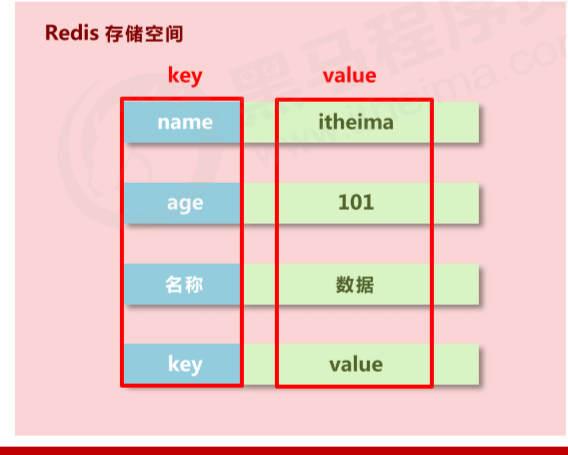
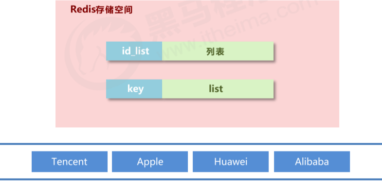
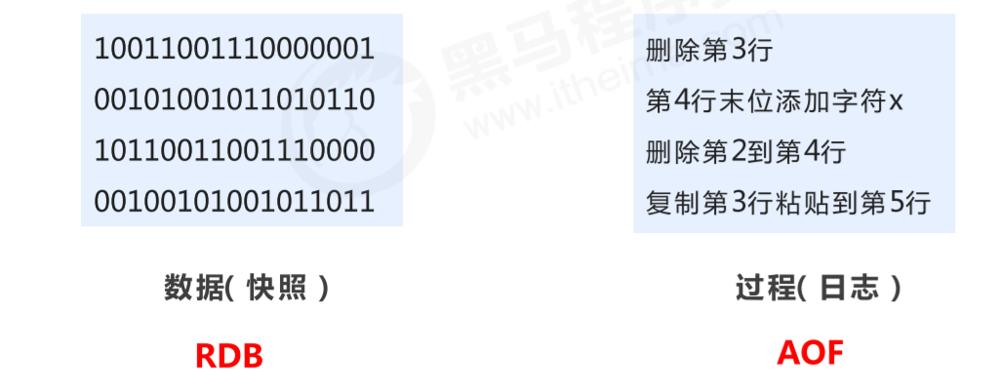
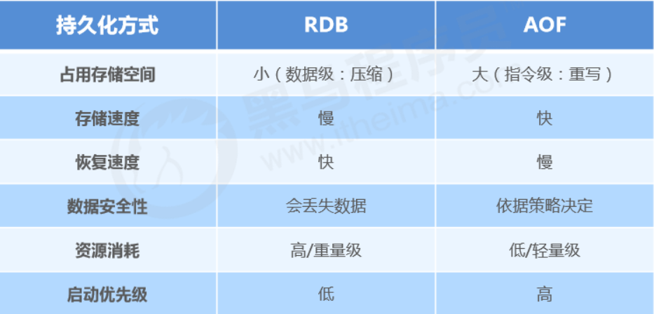
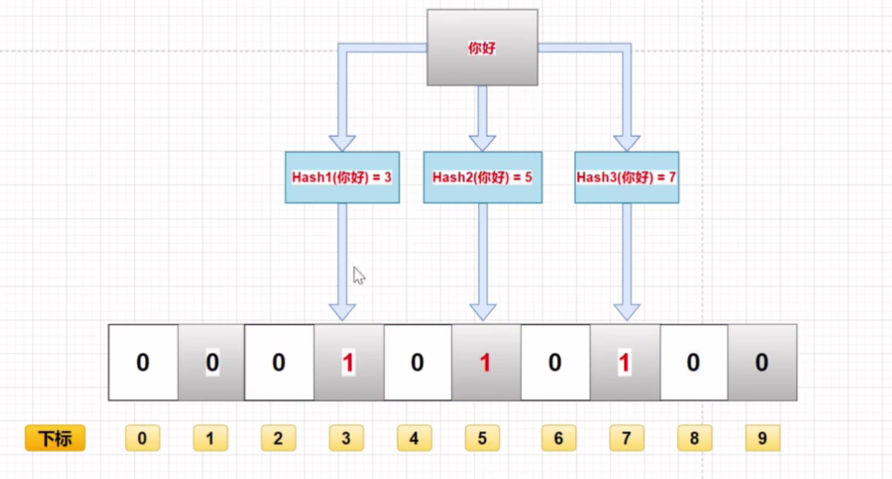

[TOC]

# [**:house:**](../../README.html)

# 一、概述

## 2.1 什么是redis

简单来说 **Redis 就是一个使用 C 语言开发的数据库**，不过与传统数据库不同的是 **Redis 的数据是存在内存中的** ，也就是它是内存数据库，所以读写速度非常快，因此 Redis 被广泛应用于缓存方向。

另外，**Redis 除了做缓存之外，也经常用来做分布式锁，甚至是消息队列。**

**Redis 提供了多种数据类型来支持不同的业务场景。Redis 还支持事务 、持久化、Lua 脚本、多种集群方案。**

## 2.2 为什么需要redis

*简单来说使用缓存主要是为了提升用户体验以及应对更多的用户。*

从高性能和高并发两个角度来看：

**高性能** ：

假如用户第一次访问数据库中的某些数据的话，这个过程是比较慢，毕竟是从硬盘中读取的。但是，如果说，用户访问的数据属于高频数据并且不会经常改变的话，那么我们就可以很放心地将该用户访问的数据存在缓存中。

**这样有什么好处呢？** 那就是保证用户下一次再访问这些数据的时候就可以直接从缓存中获取了。操作缓存就是直接操作内存，所以速度相当快。

不过，要保持数据库和缓存中的数据的一致性。 如果数据库中的对应数据改变的之后，同步改变缓存中相应的数据即可！

**高并发：**

一般像 MySQL 这类的数据库的 QPS 大概都在 1w 左右（4 核 8g） ，但是使用 Redis 缓存之后很容易达到 10w+，甚至最高能达到 30w+（就单机 redis 的情况，redis 集群的话会更高）。

## 2.3 应用场景

- **分布式锁** ： 通过 Redis 来做分布式锁是一种比较常见的方式。通常情况下，我们都是基于 Redisson 来实现分布式锁。相关阅读：[《分布式锁中的王者方案 - Redisson》](https://mp.weixin.qq.com/s/CbnPRfvq4m1sqo2uKI6qQw)。
- **限流** ：一般是通过 Redis + Lua 脚本的方式来实现限流。相关阅读：[《我司用了 6 年的 Redis 分布式限流器，可以说是非常厉害了！》](https://mp.weixin.qq.com/s/kyFAWH3mVNJvurQDt4vchA)。
- **消息队列** ：Redis 自带的 list 数据结构可以作为一个简单的队列使用。Redis5.0 中增加的 Stream 类型的数据结构更加适合用来做消息队列。它比较类似于 Kafka，有主题和消费组的概念，支持消息持久化以及 ACK 机制。
- **复杂业务场景** ：通过 Redis 以及 Redis 扩展（比如 Redisson）提供的数据结构，我们可以很方便地完成很多复杂的业务场景比如通过 bitmap 统计活跃用户、通过 sorted set 维护排行榜。
- **延迟队列：**

## 2.4 分布式缓存技术选型方案

分布式缓存的话，使用的比较多的主要是 **Memcached** 和 **Redis**。不过，现在基本没有看过还有项目使用 **Memcached** 来做缓存，都是直接用 **Redis**。

Memcached 是分布式缓存最开始兴起的那会，比较常用的。后来，随着 Redis 的发展，大家慢慢都转而使用更加强大的 Redis 了。

分布式缓存主要解决的是单机缓存的容量受服务器限制并且无法保存通用信息的问题。因为，本地缓存只在当前服务里有效，比如如果你部署了两个相同的服务，他们两者之间的缓存数据是无法共同的。

现在公司一般都是用 Redis 来实现缓存，而且 Redis 自身也越来越强大了！不过，了解 Redis 和 Memcached 的区别和共同点，有助于我们在做相应的技术选型的时候，能够做到有理有据！

### 2.4.1 Redis VS Memcached

**共同点** ：

1. 都是基于内存的数据库，一般都用来当做缓存使用。
2. 都有过期策略。
3. 两者的性能都非常高。

**区别** ：

1. **Redis 支持更丰富的数据类型（支持更复杂的应用场景）**。Redis 不仅仅支持简单的 k/v 类型的数据，同时还提供 list，set，zset，hash 等数据结构的存储。Memcached 只支持最简单的 k/v 数据类型。
2. **Redis 支持数据的持久化，可以将内存中的数据保持在磁盘中，重启的时候可以再次加载进行使用,而 Memecache 把数据全部存在内存之中。**
3. **Redis 有灾难恢复机制。** 因为可以把缓存中的数据持久化到磁盘上。
4. **Redis 在服务器内存使用完之后，可以将不用的数据放到磁盘上。但是，Memcached 在服务器内存使用完之后，就会直接报异常。**
5. **Memcached 没有原生的集群模式，需要依靠客户端来实现往集群中分片写入数据；但是 Redis 目前是原生支持 cluster 模式的。**
6. **Memcached 是多线程，非阻塞 IO 复用的网络模型；Redis 使用单线程的多路 IO 复用模型。** （Redis 6.0 引入了多线程 IO ）
7. **Redis 支持发布订阅模型、Lua 脚本、事务等功能，而 Memcached 不支持。并且，Redis 支持更多的编程语言。**
8. **Memcached 过期数据的删除策略只用了惰性删除，而 Redis 同时使用了惰性删除与定期删除。**

相信看了上面的对比之后，我们已经没有什么理由可以选择使用 Memcached 来作为自己项目的分布式缓存了。

# 二、数据类型

- **redis 自身是一个 Map，其中所有的数据都是采用 key : value 的形式存储**

- **数据类型指的是存储的数据的类型，也就是 value 部分的类型，key 部分永远都是字符串,常见有五种数据类型**。
  - String
  - hash
  - list
  - set
  - sorted_set



## 1.1 String

**基本操作**

```sql
-- 添加数据
set key value    -- 添加单个数据
mset key1 value1 key2 value2... -- 添加多个数据

-- 设置数据的生命周期
setex key seconds value   
psetex key milliseconds value

-- 得到String
get key   -- 获得单个数据
mget key1 key2...  -- 获得多个数据

-- 删除数据
del key

-- 设置数值数据增加指定范围的值
incr key
incrby key increment
incrbyfloat key increment
-- 设置数值数据减少指定范围的值
decr key
decrby key increment

-- 获取数据字符个数
strlen key
-- 向字符串的后面追加字符，如果有就补在后面，如果没有就新建
append key value
```

- string在redis内部存储默认就是一个**字符串**，当遇到增减类操作incr，decr时会**转成数值型**进行计算。
- redis所有的操作都是**原子性**的，采用**单线程**处理所有业务，命令是一个一个执行的，因此无需考虑并发带来的数据影响。
- 注意：按数值进行操作的数据，如果原始数据不能转成数值，或超越了redis 数值上限范围，将报错。 9223372036854775807（java中long型数据最大值，Long.MAX_VALUE）
- redis 控制数据的生命周期，通过数据是否失效控制业务行为，适用于所有具有时效性限定控制的操作

## 2.2 Hash

- 新的存储需求：对一系列存储的数据进行编组，方便管理，典型应用存储对象信息
- 需要的存储结构：一个存储空间保存多个键值对数据
- hash类型：底层使用哈希表结构实现数据存储.
- hash存储结构优化
  - 如果field数量较少，存储结构优化为类数组结构
  - 如果field数量较多，存储结构使用HashMap结构


**基本操作**

```sql
//插入（如果已存在同名的field，会被覆盖）
hset key field value
hmset key field1 value1 field2 value2...
//插入（如果已存在同名的field，不会被覆盖）
hsetnx key field value

//取出
hget key field
hgetall key

//删除
hdel key field1 field2...

//获取field数量
hlen key

//查看是否存在
hexists key field

//获取哈希表中所有的字段名或字段值 
hkeys key
hvals key

//设置指定字段的数值数据增加指定范围的值 
hincrby key field increment 
hdecrby key field increment
```

**hash 类型数据操作的注意事项**

- hash类型下的value**只能存储字符串**，不允许存储其他数据类型，**不存在嵌套现象**。如果数据未获取到， 对应的值为（nil）
- 每个 hash 可以存储 2^32 - 1 个键值
- hash类型十分贴近对象的数据存储形式，并且可以灵活添加删除对象属性。但hash设计初衷不是为了存储大量对象而设计的，**切记不可滥用**，更**不可以将hash作为对象列表使用**
- hgetall 操作可以获取全部属性，如果内部field过多，遍历整体**数据效率就很会低**，有可能成为数据访问瓶颈.

## 2.3 List

- 数据存储需求：存储多个数据，并对数据进入存储空间的顺序进行区分
- 需要的存储结构：一个存储空间保存多个数据，且通过数据可以体现进入顺序
- list类型：保存多个数据，底层使用**双向链表**存储结构实现
- **元素有序，且可重**



**基本操作**

```sql
//添加修改数据,lpush为从左边添加，rpush为从右边添加
lpush key value1 value2 value3...
rpush key value1 value2 value3...

//查看数据, 从左边开始向右查看. 如果不知道list有多少个元素，end的值可以为-1,代表倒数第一个元素
//lpush先进的元素放在最后,rpush先进的元素放在最前面
lrange key start end
//得到长度
llen key
//取出对应索引的元素
lindex key index

//获取并移除元素（从list左边或者右边移除）
lpop key
rpop key
```

**扩展操作**

```sql
//规定时间内获取并移除数据,b=block,给定一个时间，如果在指定时间内放入了元素，就移除
blpop key1 key2... timeout
brpop key1 key2... timeout

//移除指定元素 count:移除的个数 value:移除的值。 移除多个相同元素时，从左边开始移除
lrem key count value
```

**注意事项**

- list中保存的数据都是string类型的，数据总容量是有限的，最多2^32 - 1 个元素 (4294967295)。
- list具有索引的概念，但是操作数据时通常以**队列**的形式进行入队出队(rpush, rpop)操作，或以**栈**的形式进行入栈出栈(lpush, lpop)操作
- 获取全部数据操作结束索引设置为-1 (倒数第一个元素)
- list可以对数据进行分页操作，通常第一页的信息来自于list，第2页及更多的信息通过数据库的形式加载.

## 2.4 Set

- 新的存储需求：存储大量的数据，在查询方面提供更高的效率

- 需要的存储结构：能够保存大量的数据，高效的内部存储机制，便于查询

- set类型：与hash存储结构完全相同，仅存储键，不存储值（nil），并且值是不允许重复的


**基本操作**

```sql
//添加元素
sadd key member1 member2...

//查看元素
smembers key

//移除元素
srem key member

//查看元素个数
scard key

//查看某个元素是否存在
sismember key member
```

**扩展操作**

```sql
//从set中任意选出count个元素
srandmember key count

//从set中任意选出count个元素并移除
spop key count

//求两个集合的交集、并集、差集
sinter key1 key2...
sunion key1 key2...
sdiff key1 key2...

//求两个set的交集、并集、差集，并放入另一个set中
sinterstore destination key1 key2...
sunionstore destination key1 key2...
sdiffstore destination key1 key2...

//求指定元素从原集合放入目标集合中
smove source destination key
```

## 2.5 sorted_set

- **不重但有序（score）**
- 新的存储需求：数据排序有利于数据的有效展示，需要提供一种可以根据自身特征进行**排序**的方式
- 需要的存储结构：新的存储模型，可以保存**可排序**的数据
- sorted_set类型：在set的存储结构基础上添加可排序字段


**基本操作**

- min与max用于限定搜索查询的**条件**
- start与stop用于限定**查询范围**，作用于索引，表示开始和结束索引
- offset与count用于限定查询范围，作用于查询结果，表示**开始位置**和**数据总量**

```sql
//插入元素, 需要指定score(用于排序)
zadd key score1 member1 score2 member2

//查看元素(score升序), 当末尾添加withscore时，会将元素的score一起打印出来
zrange key start end (withscore)
//查看元素(score降序), 当末尾添加withscore时，会将元素的score一起打印出来
zrevrange key start end (withscore)

//移除元素
zrem key member1 member2...

//按条件获取数据, 其中offset为索引开始位置，count为获取的数目
zrangebyscore key min max [withscore] [limit offset count]
zrevrangebyscore key max min [withscore] [limit offset count]

//按条件移除元素
zremrangebyrank key start end
zremrangebysocre key min max
//按照从大到小的顺序移除count个值
zpopmax key [count]
//按照从小到大的顺序移除count个值
zpopmin key [count]

//获得元素个数
zcard key

//获得元素在范围内的个数
zcount min max

//求交集、并集并放入destination中, 其中numkey1为要去交集或并集集合的数目
zinterstore destination numkeys key1 key2...
zunionstore destination numkeys key1 key2...
```

**拓展操作**

```sql
//查看某个元素的索引(排名)
zrank key member
zrevrank key member

//查看某个元素索引的值
zscore key member
//增加某个元素索引的值
zincrby key increment member
```

- score保存的数据存储空间是64位，如果是整数范围是-9007199254740992~9007199254740992
- score保存的数据也可以是一个双精度的double值，基于双精度浮点数的特征，**可能会丢失精度**，使用时候要**慎重**
- sorted_set 底层存储还是**基于set**结构的，因此数据**不能重复**，如果重复添加相同的数据，score值将被反复覆盖，**保留最后一次**修改的结果

## 2.6 通用指令

1. **key的特征**
   - key是一个**字符串**，通过key获取redis中保存的数据
2. **key的操作**

```sql
//查看key是否存在
exists key

//删除key
del key

//查看key的类型
type key

//设置生命周期
expire key seconds
pexpire key milliseconds

//查看有效时间, 如果有有效时间则返回剩余有效时间, 如果为永久有效，则返回-1, 如果Key不存在则返回-2
ttl key
pttl key

//将有时限的数据设置为永久有效
persist key

//根据key查询符合条件的数据
keys * -- 查询所有
keys it* -- 查询以it开头
keys *it -- 查询以it结尾
keys ??it -- 查询前面为两个任意字符并以it结尾
keys it[st]s -- 查询以it开头，s结尾，中间包含一个字母s或t


//重命名key，为了避免覆盖已有数据，尽量少去修改已有key的名字，如果要使用最好使用renamenx
rename key newKey
renamenx key newKey

//查看所有关于key的操作, 可以使用Tab快速切换
help @generic
```

## 2.7 Bitmaps 

Bitmaps 并不是实际的数据类型，而是定义在String类型上的一个面向字节操作的集合。因为字符串是二进制安全的块，他们的最大长度是512M，最适合设置成2^32个不同字节。

bitmap 存储的是连续的二进制数字（0 和 1），通过 bitmap, 只需要一个 bit 位来表示某个元素对应的值或者状态，key 就是对应元素本身 。我们知道 8 个 bit 可以组成一个 byte，所以 bitmap 本身会极大的节省储存空间。

#### 基础操作

- 获取指定key对应偏移量上的bit值

  ```
  getbit key offsetCopy
  ```

- 设置指定key对应偏移量上的bit值，value只能是1或0

  ```
  setbit key offset value
  ```

#### 扩展操作

- 对指定key按位进行交、并、非、异或操作，并将结果**保存到destKey**中

  ```
  bitop op destKey key1 [key2...]Copy
  ```

  - and：交
  - or：并
  - not：非
  - xor：异或

- 统计指定key中1的数量

  ```
  bitcount key [start end]
  ```

#### 应用场景

适合需要保存状态信息（比如是否签到、是否登录...）并需要进一步对这些信息进行分析的场景。比如用户签到情况、活跃用户情况、用户行为统计（比如是否点赞过某个视频）。

## 2.5 单线程

**Redis 基于 Reactor 模式来设计开发了自己的一套高效的事件处理模型** （Netty 的线程模型也基于 Reactor 模式，Reactor 模式不愧是高性能 IO 的基石），这套事件处理模型对应的是 Redis 中的文件事件处理器（file event handler）。由于文件事件处理器（file event handler）是单线程方式运行的，所以我们一般都说 Redis 是单线程模型。

**既然是单线程，那怎么监听大量的客户端连接呢？**

Redis 通过**IO 多路复用程序** 来监听来自客户端的大量连接（或者说是监听多个 socket），它会将感兴趣的事件及类型（读、写）注册到内核中并监听每个事件是否发生。

这样的好处非常明显： **I/O 多路复用技术的使用让 Redis 不需要额外创建多余的线程来监听客户端的大量连接，降低了资源的消耗**（和 NIO 中的 `Selector` 组件很像）。

另外， Redis 服务器是一个事件驱动程序，服务器需要处理两类事件：1. 文件事件; 2. 时间事件。

时间事件不需要多花时间了解，我们接触最多的还是 **文件事件**（客户端进行读取写入等操作，涉及一系列网络通信）

可以看出，文件事件处理器（file event handler）主要是包含 4 个部分：

- 多个 socket（客户端连接）
- IO 多路复用程序（支持多个客户端连接的关键）
- 文件事件分派器（将 socket 关联到相应的事件处理器）
- 事件处理器（连接应答处理器、命令请求处理器、命令回复处理器）

大体上来说，**Redis 6.0 之前主要还是单线程处理。**

**那，Redis6.0 之前 为什么不使用多线程？**

我觉得主要原因有下面 3 个：

1. 单线程编程容易并且更容易维护；
2. Redis 的性能瓶颈不在 CPU ，主要在内存和网络；
3. 多线程就会存在死锁、线程上下文切换等问题，甚至会影响性能。

**Redis6.0 引入多线程主要是为了提高网络 IO 读写性能**，因为这个算是 Redis 中的一个性能瓶颈（Redis 的瓶颈主要受限于内存和网络）。

虽然，Redis6.0 引入了多线程，但是 Redis 的多线程只是在网络数据的读写这类耗时操作上使用了，执行命令仍然是单线程顺序执行。因此，你也不需要担心线程安全问题。

Redis6.0 的多线程默认是禁用的，只使用主线程。如需开启需要修改 redis 配置文件 `redis.conf` ：

```bash
io-threads-do-reads yesCopy to clipboardErrorCopied
```

开启多线程后，还需要设置线程数，否则是不生效的。同样需要修改 redis 配置文件 `redis.conf` :

```bash
io-threads 4 #官网建议4核的机器建议设置为2或3个线程，8核的建议设置为6个线程
```

# 三、数据结构

## 3.1 跳跃表

跳跃表(shiplist)是实现sortset(**有序**集合)的底层数据结构之一

跳跃表是基于多指针有序链表实现的，可以看成多个有序链表。


(1) 由很多层结构组成
 (2) 每一层都是一个有序的链表
 (3) 最底层(Level 1)的链表包含所有元素
 (4) 如果一个元素出现在 Level i 的链表中，则它在 Level i 之下的链表也都会出现。
 (5) 每个节点包含两个指针，一个指向同一链表中的下一个元素，一个指向下面一层的元素。

### 3.1.1 跳跃表的搜索

- 我们搜索元素时，从最上层的链表开始搜索。当找到某个节点大于目标值或其后继节点为空时，从该节点向下层链表搜寻，然后顺着该节点到下一层继续搜索。

  比如我们要找87这个元素，则会经历：2->54->87

### 3.1.2 跳跃表的插入

- 先找到合适的位置以便插入元素
- 找到后，将该元素插入到最底层的链表中，并且抛掷硬币（1/2的概率）
  - 若硬币为正面，则将该元素晋升到上一层链表中，**并再抛一次**
  - 若硬币为反面，则插入过程结束
- 为了避免以下情况，需要在每个链表的头部设置一个 **负无穷** 的元素


如果K大于链表的层数,需要添加新的层。

### 3.1.3 跳跃表的删除

各个层中找到包含 x 的节点，使用标准的 delete from list 方法删除该节点。

### 3.1.4 跳跃表的优点

与红黑树等平衡树相比，跳跃表具有以下优点：

- 插入速度非常快速，因为不需要进行旋转等操作来维护平衡性；
- 更容易实现；
- 支持无锁操作。

### 3.1.5 为什么Redis要使用跳跃表而不是用B+树

MySQL使用B+树的是因为：**叶子节点存储数据，非叶子节点存储索引**，B+树的每个节点可以存储多个关键字，它将节点大小设置为磁盘页的大小，**充分利用了磁盘预读的功能**。每次读取磁盘页时就会读取一整个节点,每个叶子节点还有指向前后节点的指针，为的是最大限度的降低磁盘的IO;因为数据在内存中读取耗费的时间是从磁盘的IO读取的百万分之一

而Redis是**内存中读取数据，不涉及IO，因此使用了跳跃表**

既然提到了Redis是对**内存操作**的，那么再讨论一个问题：**为什么Redis是单线程的还这么快呢**

#### **Redis使用单线程效率还很高的原因**

假设有两个任务A和B，分别有两种方法来执行他们

- 两个线程并发执行：先执行A一段时间，然后切换到B再执行一段时间，然后又切换回A执行… 直到A和B都执行完毕
- 两个线程串行执行：先执行A，A执行完了在执行B

对于单核CPU来说，第二种方法的执行时间更短，效率更高。因为单核CPU下的并发操作，会导致上下文的切换，需要保存切换线程的信息，这段时间CPU无法去执行任何任务中的指令，时间白白浪费了.

**对于I/O操作，并发执行效率更高**

因为I/O操作主要有以下两个过程

- 等待I/O准备就绪
- 真正操作I/O资源

**等待I/O准备就绪**这个阶段，CPU是空闲的，这时便可以去执行其他任务，这样也就提高了CPU的利用率

**而Redis是基于内存的操作，没有I/O操作，所以单线程执行效率更高**

# 四、持久化

- 持久化是利用**永久性**存储介质将数据进行保存，在特定的时间将保存的数据进行恢复的工作机制称为持久化
- 可以防止数据意外丢失，确保数据安全
- 持久化保存什么？
  - 将当前**数据状态**进行保存，**快照形式**，存储数据结果，存储格式简单，关注点在数据，这种方式称为**RDB**
  - 将数据的**操作过程**进行保存，**日志形式**，存储操作过程，存储格式复杂，关注点在数据的操作过程，这种方式称为**AOF**



## 4.1 RDB

### 4.1.1 save方式

- **命令**

``` sql
save
```

- **作用：手动执行一次保存操作**

- **RDB配置相关命令**
  - dbfilename dump.rdb
    - 说明：设置本地数据库文件名，默认值为 dump.rdb
    - 经验：通常设置为dump-端口号.rdb
  - dir
    - 说明：设置存储.rdb文件的路径
    - 经验：通常设置成存储空间较大的目录中，目录名称data
  - rdbcompression yes
    - 说明：设置存储至本地数据库时是否压缩数据，默认为 yes，采用 LZF 压缩
    - 经验：通常默认为开启状态，如果设置为no，可以节省 CPU 运行时间，但会使存储的文件变大（巨大）
  - rdbchecksum yes
    - 说明：设置是否进行RDB文件格式校验，该校验过程在写文件和读文件过程均进行
    - 经验：通常默认为开启状态，如果设置为no，可以节约读写性过程约10%时间消耗，但是存储一定的数据损坏风险
-  不足：**save指令**的执行会**阻塞**当前Redis服务器，直到当前RDB过程完成为止，有可能会造成**长时间阻塞**，线上环境**不建议使用**。

### 4.1.2 bgsave方式

- 命令

```sql
bgsave
```

- 作用

  手动启动后台保存操作，但**不是立即执行**

- 原理

  - 执行fork操作**创建子进程**

  - **bgsave命令**是针对save阻塞问题做的**优化**。Redis内部所有涉及到RDB操作都采用bgsave的方式，save命令可以放弃使用，推荐使用bgsave


### 4.1.3 Save 配置

- 配置

```sql
save second changes
```

- 作用

  满足**限定时间**范围内key的变化数量达到**指定数量**即进行持久化

- 参数

  - second：监控时间范围
  - changes：监控key的变化量

- 配置位置

  - 在**conf文件**中进行配置

- 配置原理


- save配置要根据实际业务情况进行设置，频度过高或过低都会出现性能问题，结果可能是灾难性的
- save配置中对于second与changes设置通常具有**互补对应**关系（一个大一个小），尽量不要设置成包含性关系.
- save配置启动后执行的是**bgsave操作**

### 4.1.4 RDB启动方式对比


### 4.1.5 RDB优点

- 优点
  - RDB是一个紧凑压缩的二进制文件，**存储效率较高**
  - RDB内部存储的是redis在某个时间点的数据快照，非常适合用于**数据备份，全量复制**等场景
  - RDB恢复数据的**速度**要比AOF**快**很多
  - 应用：服务器中每X小时执行bgsave备份，并将RDB文件拷贝到远程机器中，**用于灾难恢复**
- 缺点
  - RDB方式无论是执行指令还是利用配置，**无法做到实时持久化**，具有较大的可能性丢失数据
  - bgsave指令每次运行要执行fork操作**创建子进程**，要**牺牲**掉一些**性能**
  - Redis的众多版本中未进行RDB文件格式的版本统一，有可能出现各版本服务之间数据格式**无法兼容**现象

## 4.2 AOF

### 4.2.1 AOF 概念

- AOF(append only file)持久化：以独立日志的方式记录**每次**写命令，重启时再重新执行AOF文件中命令，以达到恢复数据的目的。与RDB相比可以简单描述为改记录数据为记录数据产生的过程
- AOF的主要作用是解决了数据持久化的实时性，目前已经是Redis持久化的**主流**方式。

**开启AOF**

```sql
appendonly yes|no  -- 是否开启AOF持久化功能，默认为不开启状态
appendfsync always|everysec|no   -- AOF写的三种策略
```

### 4.2.2  AOF写数据

- AOF写命令刷新缓存区
- 根据写数据的策略将命令同步到AOF文件中。

### 4.2.3 AOF写输入的三种策略

- always
  - 每次写入操作均同步到AOF文件中，数据零误差，**性能较低**,**不建议使用**
- everysec
  - 每秒将缓冲区中的指令同步到AOF文件中，数据准确性较高，**性能较高** ，**建议使用**，也是默认配置
  - 在系统突然宕机的情况下丢失1秒内的数据
- no
  - 由操作系统控制每次同步到AOF文件的周期，整体过程**不可控**

### 4.2.4 AOF重写

随着命令不断写入AOF，文件会越来越大，为了解决这个问题，Redis引入了AOF重写机制压缩文件体积。AOF文件重 写是将Redis进程内的数据转化为写命令同步到新AOF文件的过程。简单说就是将对同一个数据的若干个条命令执行结果转化成最终结果数据对应的指令进行记录。

- 作用
  - 降低磁盘占用量，提高磁盘利用率
  - 提高持久化效率，降低持久化写时间，提高IO性能
  - 降低数据恢复用时，提高数据恢复效率
- 规则
  - 进程内已超时的数据不再写入文件
  - 忽略无效指令，重写时使用进程内数据直接生成，这样新的AOF文件只保留最终数据的写入命令，如del key1、 hdel key2、srem key3、set key4 111、set key4 222等
  - 对同一数据的多条写命令合并为一条命令，如lpush list1 a、lpush list1 b、 lpush list1 c 可以转化为：lpush list1 a b c，为防止数据量过大造成客户端缓冲区溢出，对list、set、hash、zset等类型，每条指令最多写入64个元素

- 使用
  - 手动重写

  ```
  bgrewriteaof
  ```
  - 自动重写

  ```sql
  auto-aof-rewrite-min-size size 
  auto-aof-rewrite-percentage percentage
  ```

- 原理

  **在执行 BGREWRITEAOF 命令时，Redis 服务器会维护一个 AOF 重写缓冲区，该缓冲区会在子进程创建新 AOF 文件期间，记录服务器执行的所有写命令。当子进程完成创建新 AOF 文件的工作之后，服务器会将重写缓冲区中的所有内容追加到新 AOF 文件的末尾，使得新旧两个 AOF 文件所保存的数据库状态一致。最后，服务器用新的 AOF 文件替换旧的 AOF 文件，以此来完成 AOF 文件重写操作。**

## 4.3 RDB VS AOF



**RDB和AOF如何选择**

- 对数据非常**敏感**，建议使用默认的**AOF**持久化方案
  - AOF持久化策略使用**everysecond**，每秒钟fsync一次。该策略redis仍可以保持很好的处理性能，当出现问题时，最多丢失0-1秒内的数据。
- 数据呈现**阶段有效性**，建议使用RDB持久化方案
  - 数据可以良好的做到阶段内无丢失（该阶段是开发者或运维人员手工维护的），且**恢复速度较快**，阶段 点数据恢复通常采用RDB方案
- 综合比对
  - RDB与AOF的选择实际上是在做一种权衡，每种都有利有弊
  - 如不能承受数分钟以内的数据丢失，对业务数据非常敏感，选用AOF
  - 如能承受数分钟以内的数据丢失，且追求大数据集的恢复速度，选用RDB
  - 灾难恢复选用RDB
  - 双保险策略，同时开启 RDB 和 AOF，重启后，Redis优先使用 AOF 来恢复数据，降低丢失数据的量

# 五、事务

redis事务就是一个命令执行的队列，将一系列预定义命令**包装成一个整体**（一个队列）。当执行时，**一次性按照添加顺序依次执行**，中间不会被打断或者干扰。

## 5.1 事务的基本操作

- 开启事务 

```sql
multi   -- 作设定事务的开启位置，此指令执行后，后续的所有指令均加入到事务中
```

- 取消事务

```sql
discard  -- 终止当前事务的定义，发生在multi之后，exec之前
```

- 执行事务

```sql
exec  -- 设定事务的结束位置，同时执行事务。与multi成对出现，成对使用
```

## 5.2 事务操作的基本流程

- 服务器接收到指令，先判断是否是事务状态
  - 如果不是事务状态，就识别指令的类型
    - 对于普通指令，直接执行，然后返回相应的结果
    - 对于multi 指令，创建一个队列，返回OK
  - 如果是事务状态，就识别指令的类型
    - 对于普通指令，就加入队列，返回QUEUE
    - 对于EXEC指令，就执行事务，也就是执行队列中的指令，返回执行结果。
    - 对于discard指令，就销毁队列，返回OK。

**事务操作中的注意事项**

- 如果定义的事务中所包含的命令存在语法错误，整体事务中**所有命令均不会执行**。包括那些语法正确的命令。
- 如果命令**格式正确**，但是**无法正确的执行**。执行事务时，能够正确运行的命令会执行，运行错误的命令不会被执行。
- 已经执行完毕的命令对应的数据**不会自动回滚**，需要程序员自己在代码中实现回滚。

## 5.2 基于特定条件的事务执行

### 5.2.1  锁

**场景**

天猫双11热卖过程中，对已经售罄的货物追加补货，4个业务员都有权限进行补货。补货的操作可能是一系 列的操作，牵扯到多个连续操作，如何保障不会重复操作？

**分析**

- 多个客户端有可能同时操作同一组数据，并且该数据一旦被操作修改后，将不适用于继续操作 

- 在操作之前锁定要操作的数据，一旦发生变化，终止当前操作.

**操作**

对 key 添加监视锁，在执行exec前如果key发生了变化，终止事务执行。watch不能在事务中定义(主要监控其他人能不能改这个值)

```sql
watch key1, key2.... -- 为key加锁
..
multi 
...
exec 
```

取消对**所有**key的监视

```sql
unwatch
```

### 5.2.1 分布式锁

**场景**

天猫双11热卖过程中，对已经售罄的货物追加补货，且补货完成。客户购买热情高涨，3秒内将所有商品购 买完毕。本次补货已经将库存全部清空，如何避免最后一件商品不被多人同时购买？【超卖问题】

**分析**

- 使用watch监控一个key有没有改变已经不能解决问题，此处要监控的是具体数据 

- 虽然redis是单线程的，但是多个客户端对同一数据同时进行操作时，如何避免不被同时修改？

**操作**

使用 setnx 设置一个公共锁

```sql
//上锁
setnx lock-key value
//释放锁
del lock-key
```

- 利用setnx命令的返回值特征，有值则返回设置失败，无值则返回设置成功 
  -  对于返回设置成功的，拥有控制权，进行下一步的具体业务操作 
  - 对于返回设置失败的，不具有控制权，排队或等待,操作完毕通过del操作释放锁.

### 5.2.2  死锁

**场景**

依赖分布式锁的机制，某个用户操作时对应客户端宕机，且此时已经获取到锁。如何解决？

**分析**

- 由于锁操作由用户控制加锁解锁，必定会存在加锁后未解锁的风险 

- 需要解锁操作不能仅依赖用户控制，系统级别要给出对应的保底处理方案

**操作**

使用 expire 为锁key添加**时间限定**，到时不释放，放弃锁

```sql
expire lock-key seconds
pexpire lock-key milliseconds
```

- 由于操作通常都是微秒或毫秒级，因此该锁定时间**不宜设置过大**。具体时间需要业务测试后确认。
  - 例如：持有锁的操作最长执行时间127ms，最短执行时间7ms。
  - 测试百万次最长执行时间对应命令的最大耗时，测试百万次网络延迟平均耗时
  - 锁时间设定推荐：最大耗时*120%+平均网络延迟*110%
  - 如果业务最大耗时<<网络平均延迟，通常为2个数量级，取其中单个耗时较长即可

# 六、删除策略

## 6.1 过期数据

Redis是一种内存级数据库，所有数据均存放在内存中，内存中的数据可以通过TTL指令获取其状态

- XX ：具有时效性的数据
- -1 ：永久有效的数据
-  -2 已经过期的数据 或 被删除的数据 或 未定义的数据.

## 6.2 过期数据的删除策略

### 6.2.1 定时删除

- 创建一个定时器，当key设置有过期时间，且过期时间到达时，由定时器任务立即执行对键的删除操作
- 优点：节约内存，到时就删除，快速释放掉不必要的内存占用
- 缺点：CPU压力很大，无论CPU此时负载量多高，均占用CPU，会影响redis服务器响应时间和指令吞吐量
- 总结：用处理器性能换取存储空间 （拿时间换空间）

### 6.2.2 惰性删除

- 数据到达过期时间，不做处理。等下次访问该数据时：
  - 如果未过期，返回数据
  - 发现已过期，删除，返回不存在
- 优点：节约CPU性能，发现必须删除的时候才删除
- 缺点：内存压力很大，出现长期占用内存的数据
- 总结：用存储空间换取处理器性能 （拿时间换空间）

### 6.2.3 定期删除


- 周期性轮询redis库中的时效性数据，采用随机抽取的策略，利用过期数据占比的方式控制删除频度
- 特点1：CPU性能占用设置有峰值，检测频度可自定义设置
- 特点2：内存压力不是很大，长期占用内存的冷数据会被持续清理
- 总结：周期性抽查存储空间（随机抽查，重点抽查）

### 6.2.4 对比

| 删除策略 | 优点                                            | 缺点                      | 总结               |
| -------- | ----------------------------------------------- | ------------------------- | ------------------ |
| 定时删除 | 节约内存                                        | 不分时段的占用cpu，频度高 | 用时间换空间       |
| 惰性删除 | 延时执行，CPU利用率高                           | 占用内存                  | 用空间换时间       |
| 定期删除 | 内存定期随机清理，每秒花费固定的CPU资源维护内存 |                           | 随机抽查，重点抽查 |

## 6.3 逐出算法

**当新数据进入redis时，如果内存不足怎么办？**

- Redis使用内存存储数据，在执行每一个命令前，会调用freeMemoryIfNeeded()检测内存是否充足。如果内存不满足新加入数据的最低存储要求，redis要临时删除一些数据为当前指令清理存储空间。清理数据 的策略称为逐出算法。
- 注意：逐出数据的过程不是100%能够清理出足够的可使用的内存空间，如果不成功则反复执行。当对所有数据尝试完毕后，如果不能达到内存清理的要求，将出现错误信息。

### 6.3.1 数据淘汰策略

Redis 提供 6 种数据淘汰策略：

- 检测易失数据：

  - **volatile-lru（least recently used）**：从已设置过期时间的数据集（server.db[i].expires）中挑选最近最少使用的数据淘汰
  - **volatile-lfu（least frequently used）**：从已设置过期时间的数据集(server.db[i].expires)中挑选最不经常使用的数据淘汰

  - **volatile-ttl**：从已设置过期时间的数据集（server.db[i].expires）中挑选将要过期的数据淘汰

  - **volatile-random**：从已设置过期时间的数据集（server.db[i].expires）中任意选择数据淘汰

- 检测全库数据：

  - **allkeys-lru（least recently used）**：当内存不足以容纳新写入数据时，在键空间中，移除最近最少使用的 key（这个是最常用的）

  - **allkeys-random**：从数据集(全库数据)（server.db[i].dict）中任意选择数据淘汰，
  - **allkeys-lfu（least frequently used）**：当内存不足以容纳新写入数据时，在键空间中，移除最不经常使用的 key。

- 放弃数据淘汰

  - **no-eviction**：禁止驱逐数据，也就是说当内存不足以容纳新写入数据时，新写入操作会报错。这个应该没人使用吧！

# 七、主从复制

为了避免单点Redis服务器故障，准备多台服务器，互相连通。将数据复制多个副本保存在不同的服 务器上，连接在一起，并保证数据是同步的。即使有其中一台服务器宕机，其他服务器依然可以继续提供服务，实现Redis的高可用，同时实现数据冗余备份。

- 有多台服务器，主服务器(master)是提供数据方，主要负责写操作，从服务器(Slave)是接收数据的一方，只负责读操作，主从复制就是将主服务器的数据同步到从服务器。

**作用**

- 读写分离：master写、slave读，提高服务器的读写负载能力
- 负载均衡：基于主从结构，配合读写分离，由slave分担master负载，并根据需求的变化，改变slave的数量，通过多个从节点分担数据读取负载，大大提高Redis服务器并发量与数据吞吐量
- 故障恢复：当master出现问题时，由slave提供服务，实现快速的故障恢复
- 数据冗余：实现数据热备份，是持久化之外的一种数据冗余方式
- 高可用基石：基于主从复制，构建哨兵模式与集群，实现Redis的高可用方案

## 7.1 工作流程

### 7.1.1 建立连接

1. **设置master的地址和端口号，保存master信息**

   - Slave : 发送指令slaveof ip port；

   - master: 接收到指令，响应对方。
   - Slave : 保存master的IP与端口。masterhost,masterport.

2. **建立socket连接**

   - Slave: 根据保存的信息创建连接master的socket.

3. **发送ping命令（定时器任务）**

   - slave: 周期性发送命令ping
   - master: 响应pong

4. **身份验证**

   - slave: 发送指令auth password
   - master:验证授权

5. **发送slave端口信息**

   - slave: 发送指令replconf listening-port <port-number>
   - master:保存slave的端口号

**总体来说：**

-  **slave： 保存master的地址与端口**
- **master： 保存slave的端口**
- **之间创建了连接的socket**

### 7.1.2 数据同步与命令传播

**数据同步总体流程：**

- slave端向master请求同步数据。发送psync2 ？-1。其中问号表示master的<runid>，因为第一次不知道，所以用 ？表示，-1表示偏移量，因为第一次请求，所以发送-1表示请求全部数据。

- master端执行bgsave生成RDB文件，记录当前的复制偏移量offset。在执行bgsave阶段时，master的执行的指令放置在缓冲区中。

- master 发送 +FULLRESYNC runid offset .

- master 通过socket发送RDB文件给slave.  

- slave 收到 +FULLRESYNC 保存master的runid和offset,清空当前全部数据，通过socket接收RDB文件，恢复RDB数据. 

  ------------------------------------------------------以上步骤为全量复制阶段-------------------------------------------------------------------------

  由于master端在执行bgsave时有一些指令放置在缓冲区中，所以slave端需要再次请求数据。

- slave 发送命令：psync2 runid offset

- master接收命令，判定runid是否匹配，判定offset是否在复制缓冲区中.

  - 如果runid或offset有一个不满足，执行全量复制。
  - 如果runid或offset校验通过，offset与offset相同，忽略。
  - 如果runid或offset校验通过，offset与offset不相同，说明缓存区的一些数据还没有发送完，所以发送 +CONTINUE offset，通过socket发送复制缓冲区中offset到offset的数据。

- slave收到 +CONTINUE保存master的offset, 接收信息后，执行bgrewriteaof，恢复数据。使用AOF重写。

 -------------------------------------------------------以上步骤为部分复制阶段----------------------------------------------------------------------------------

  **命令传播阶段**

- 和部分复制阶段步骤相同，不同的是开始时，slave发送的命令为：replconf ack offset，此外最后一步完成后，还要再次发送replconf ack offset。
- 此外，进入**命令传播阶段**，master与slave间需要进行信息交换，使用心跳机制进行维护，实现双方连接保持在线。

- **服务器的运行 id（run id）**

  - 服务器运行ID是每一台服务器每次运行的身份识别码，一台服务器多次运行可以生成多个运行id
  - 组成：运行id由40位字符组成，是一个随机的十六进制字符
  - 作用：运行id被用于在服务器间进行传输，识别身份.
  - 如果想两次操作均对同一台服务器进行，必须每次操作携带对应的运行id，用于对方识别
  - 实现方式：运行id在每台服务器启动时自动生成的，master在首次连接slave时，会将自己的运行ID发送给slave，slave保存此ID，通过**info Server**命令，可以查看节点的runid

- **复制缓冲区**

  - 概念：复制缓冲区，又名复制积压缓冲区，是一个**先进先出（FIFO）的队列**，用于存储服务器执行过的命 令，每次传播命令，master都会将传播的命令记录下来，并存储在复制缓冲区
  - 由来：每台服务器启动时，如果开启有AOF或被连接成为master节点，即创建复制缓冲区
  - 作用：用于保存master收到的所有指令（仅影响数据变更的指令，例如set，select）
  - 数据来源：当master接收到主客户端的指令时，除了将指令执行，会将该指令存储到缓冲区中
  - 组成：偏移量和字节值。
    - 通过offset区分不同的slave当前数据传播的差异，也就是记录发送到哪了。
    - master复制偏移量：记录发送给所有slave的指令字节对应的位置（多个）
    - slave复制偏移量：记录slave接收master发送过来的指令字节对应的位置（一个）
    - offset作用：**同步信息**，比对master与slave的差异，当slave断线后，恢复数据使用

- **心跳机制**

  - 进入**命令传播阶段**，master与slave间需要进行信息交换，使用心跳机制进行维护，实现双方连接保持在线
  - master心跳：
    - 指令：PING
    - 周期：由repl-ping-slave-period决定，默认10秒
    - 作用：判断slave是否在线
    - 查询：INFO replication 获取slave最后一次连接时间间隔，lag项维持在0或1视为正常
  - slave心跳任务
    - 指令：REPLCONF ACK {offset}
    - 周期：1秒
    - 作用1：汇报slave自己的复制偏移量，获取最新的数据变更指令
    - 作用2：判断master是否在线

- ##### 心跳阶段注意事项

  - 当slave多数掉线，或延迟过高时，master为保障数据稳定性，将拒绝所有信息同步操作

    ```
    min-slaves-to-write 2 
    min-slaves-max-lag 8Copy
    ```

    - slave数量少于2个，或者所有slave的延迟都大于等于10秒时，强制关闭master写功能，停止数据同步

  - slave数量由slave发送**REPLCONF ACK**命令做确认

  - slave延迟由slave发送**REPLCONF ACK**命令做确认


# 八、哨兵

哨兵(sentinel) 是一个**分布式系统**，用于对主从结构中的每台服务器进行**监控**，当出现故障时通过投票机制**选择**新的master并将所有slave连接到新的master。

作用：

- 监控
  - 不断的检查master和slave是否正常运行。 master存活检测、master与slave运行情况检测
- 通知（提醒）
  - 当被监控的服务器出现问题时，向其他（哨兵间，客户端）发送通知。
- 自动故障转移
  - 断开master与slave连接，选取一个slave作为master，将其他slave连接到新的master，并告知客户端新的服务器地址。

哨兵也是一台**redis服务器**，只是不提供数据服务 通常哨兵配置数量为**单数**。

哨兵在进行主从切换过程中经历三个阶段：

- 监控
- 通知
- 故障转移

## 8.1 监控

用于同步各个节点的状态信息：

- 通过ping的方式获取各个sentinel的状态（是否在线）
- 获取master的状态：Info指令,并建立cmd连接
  - 获取master的属性：runid以及他当前的角色(master);
  - 获取到连接到master的各个slave的信息
- 根据master得到slave之后就去获取slave的信息(通过发送info指令)
  - 获取slave的属性：runid,当前的角色(slave), master_host, master_port,  offset.....

## 8.2 通知

- 各个哨兵将得到的信息相互同步（信息对称）
- 哨兵实时的通过cmd连接向master和slave发送hello获取master和slave的状态，并同步给其他哨兵。


## 8.3 故障转移

---------------------------------------------------------------确认master下线------------------------------------------------------------------------------------------

- 哨兵实时的通过cmd连接向master和slave发送Hello来获取状态，当没有收到回应的时候，就先不停的给没有回应的master发送hello,发送几次后仍然没有回应，就表示发现master挂了。
- 当某个哨兵发现主服务器挂掉了，会将master中的SentinelRedistance中的master改为**SRI_S_DOWN**（主观下线），并通知其他哨兵，告诉他们发现master挂掉了。
- 其他哨兵在接收到该哨兵发送的信息后，也会尝试去连接master，如果超过半数（配置文件中设置的）确认master挂掉后，会将master中的SentinelRedistance中的master改为**SRI_O_DOWN**（客观下线）

------------------------------------------------------------------- 推选哨兵处理---------------------------------------------------------------------------------------------

- 在确认master挂掉以后，会推选出一个哨兵来进行故障转移工作（由该哨兵来指定哪个slave来做新的master）。
- 筛选方式是哨兵互相发送消息，并且参与投票，票多者当选。

--------------------------------------------------------------------具体处理过程-----------------------------------------------------------------------------------------------

- 服务器列表中挑选备选master
  - 去掉不在线的
  - 去掉响应慢的
  - 去掉与原master断开时间久的
  - 优先原则
    - 先比较优先级
    - 再看偏移量，偏移量大就说明同步的数据比较多
    - 选择runid小的
- 哨兵发送指令
  - 向新的master发送**slaveof no one**(断开与原master的连接)
  - 向其他slave发送slaveof 新masterIP端口（让其他slave与新的master相连）

# 九、集群

为什么需要集群？

- redis提供的服务OPS可以达到10万/秒，当前业务OPS已经达到10万/秒 

- 内存单机容量达到256G，当前业务需求内存容量1T
- 使用单个服务器无法存储更多的数据，需要将数据分散到其他服务器。

作用：

- 分散单台服务器的访问压力，实现**负载均衡**
- 分散单台服务器的存储压力，实现**可扩展性**
- **降低**单台服务器宕机带来的**业务灾难**

## 9.1 redis集群结构设计

#### 数据存储设计

- 通过算法设计，计算出key应该保存的位置
- 将所有的存储空间计划切割成16384份，每台主机保存一部分 每份代表的是一个存储空间，不是一个key的保存空间
- 将key按照计算出的结果放到对应的存储空间

- 扩展的时候将其他主机的存储内容各拿一部分到新的主机中。

#### 集群内部通讯设计

- 各个数据库互相连通，保存各个库中槽的编号数据
- 一次命中，直接返回
- 一次未命中，告知具体的位置，key再直接去找对应的库保存数据


# 十、缓存穿透与缓存雪崩

## 10.1 缓存穿透

缓存穿透说简单点就是**大量请求的 key 根本不存在于缓存中**，导致请求直接到了数据库上，根本没有经过缓存这一层。举个例子：某个黑客故意制造我们缓存中不存在的 key 发起大量请求，导致大量请求落到数据库。

**解决方法**

最基本的就是首先做好参数校验，一些不合法的参数请求直接抛出异常信息返回给客户端。比如查询的数据库 id 不能小于 0、传入的邮箱格式不对的时候直接返回错误消息给客户端等等。

**1）缓存无效 key**

**如果缓存和数据库都查不到某个 key 的数据就写一个到 Redis 中去并设置过期时间，具体命令如下： `SET key value EX 10086` 。这种方式可以解决请求的 key 变化不频繁的情况，**如果黑客恶意攻击，每次构建不同的请求 key，会导致 Redis 中缓存大量无效的 key 。很明显，这种方案并不能从根本上解决此问题。如果非要用这种方式来解决穿透问题的话，尽量将无效的 key 的过期时间设置短一点比如 1 分钟。

**2) 布隆过滤器**

布隆过滤器是一种数据结构，通过它可以非常方便的判断一个给定数据是否存在于海量数据中。具体来说，**把所有可能存在的请求的值都放在布隆过滤器中，当用户请求过来时，先判断用户发来的请求的值是否存在于布隆过滤器中，不存在的话，直接返回请求参数错误信息给客户端，存在的话才会继续下面的流程。**

但是，需要注意的是布隆过滤器可能会存在误判的情况。总结来说就是： **布隆过滤器说某个元素存在，小概率会误判。布隆过滤器说某个元素不在，那么这个元素一定不在。**


### 布隆过滤器

**当一个元素加入布隆过滤器中的时候，会进行如下操作：**

- 使用布隆过滤器中的哈希函数对元素值进行计算，得到哈希值（有几个哈希函数得到几个哈希值）
- 根据得到的哈希值，在位数组中把对应下标的值置为 1。

**当我们需要判断一个元素是否存在于布隆过滤器的时候，会进行如下操作：**

- 对给定元素再次进行相同的哈希计算
- 到值之后判断位数组中的每个元素是否都为 1，如果值都为 1，那么说明这个值在布隆过滤器中，如果存在一个值不为 1，说明该元素不在布隆过滤器中。

优点：

- 由一串二进制数组成，占用空间非常小
- 插入和查询的速度非常快。时间复杂度O(K)
- 存储的是二进制数，保密性好。

缺点：

- 无法进行删除操作，比如hello经过hash运算计算为7，则数组的下标为7的位置为1，但是如果“你好”经过hash运算结果也为7,如果把下标为7的位置的1改为0,就会删除掉hello和你好两个数据。
- 会有误判率，hash函数越多以及位数组长度越大，误判率都会减小，但是计算就想对比较慢。O(k)的时间复杂度，k位hash函数的个数。



## 10.2 缓存雪崩

- Redis挂掉了，请求全部走数据库。
- 对缓存数据设置相同的过期时间，导致某段时间内缓存失效，请求全部走数据库。

解决方法：

- 对于“对缓存数据设置相同的过期时间，导致某段时间内缓存失效，请求全部走数据库。”这种情况，非常好解决：
  - 解决方法：在缓存的时候给过期时间加上一个**随机值**，这样就会大幅度的**减少缓存在同一时间过期**。
- 对于“Redis挂掉了，请求全部走数据库”这种情况，我们可以有以下的思路：
  - 事发前：实现Redis的**高可用**(主从架构+Sentinel 或者Redis Cluster)，尽量避免Redis挂掉这种情况发生。
  - 事发中：万一Redis真的挂了，我们可以设置**本地缓存(ehcache)+限流(hystrix)**，尽量避免我们的数据库被干掉(起码能保证我们的服务还是能正常工作的)
  - 事发后：redis持久化，重启后自动从磁盘上加载数据，**快速恢复缓存数据**。

## 10.3 缓存击穿

对于某一个设置了过期时间的key，缓存中的key过期，导致数据库中的key可能会在某些时间点被超高并发地访问这个时候，需要考虑一个问题：**缓存被“击穿”的问题，这个和缓存雪崩的区别在于这里针对某一key缓存，前者则是很多key。**

解决方法：

- 预先设定
  - 以电商为例，每个商家根据店铺等级，指定若干款主打商品，在购物节期间，加大此类信息key的过期时长 注意：购物节不仅仅指当天，以及后续若干天，访问峰值呈现逐渐降低的趋势
- 现场调整
  - 监控访问量，对自然流量激增的数据延长过期时间或设置为永久性key
- 后台刷新数据
  - 启动定时任务，高峰期来临之前，刷新数据有效期，确保不丢失
- 二级缓存
  - 设置不同的失效时间，保障不会在redis和二级缓存同时淘汰就行
- 加锁
  - 分布式锁，防止被击穿，但是要注意也是性能瓶颈，慎重！

## 如何保证缓存和数据库数据的一致性

Cache Aside Pattern 中遇到写请求是这样的：更新 DB，然后直接删除 cache 。

如果更新数据库成功，而删除缓存这一步失败的情况的话，简单说两个解决方案：

1. **缓存失效时间变短（不推荐，治标不治本）** ：我们让缓存数据的过期时间变短，这样的话缓存就会从数据库中加载数据。另外，这种解决办法对于先操作缓存后操作数据库的场景不适用。
2. **增加 cache 更新重试机制（常用）**： 如果 cache 服务当前不可用导致缓存删除失败的话，我们就隔一段时间进行重试，重试次数可以自己定。如果多次重试还是失败的话，我们可以把当前更新失败的 key 存入队列中，等缓存服务可用之后，再将 缓存中对应的 key 删除即可。

