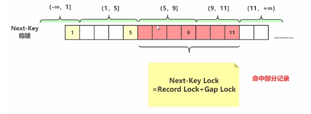
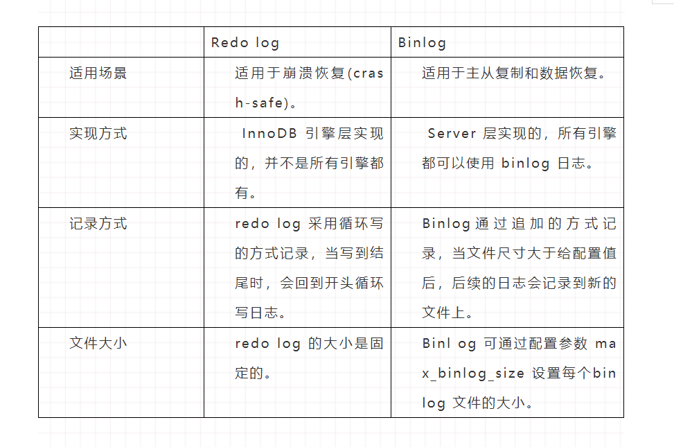

[TOC]

# [主页面](../../README.html)

## 一、事务
### 什么是事务？
事务是指满足ACID的一组操作，可以通过Commit提交一个事务，也可以使用Rollback进行回调。
### ACID
1. **原子性**(Atomicty)
    **事务被视为不可分割的最小单元，事务的所有操作要么全部提交成功，要么全部失败回滚。**
    回滚可以用回滚日志来实现，回滚日志记录着事务所执行的修改操作，在回滚时反向执行这些修改操作即可。

  > 事务的原子性是通过redo Log和Undo Log实现的。

2. **一致性**(Consistency)
    **数据在事务执行前后都保持一致状态**，在一致状态下，所有事务对同一个数据的读取结果都是相同的。

3. **隔离性**(Isolation)
    **一个事务所做的修改在最终提交之前，对其他事务是不可见的。**

4. **持久性**(Durability)
    **一旦事务提交，则所作的修改将永远保存到数据库中，即使系统发生崩溃，事务执行的结果也不能丢失。** 系统发生崩溃可以重做日志进行恢复，从而实现持久性。与回滚日志记录数据的逻辑修改不同，重做日志记录的是数据页的物理修改。

  > 事务的持久性是通过Redo Log和WAL实现的。
### ACID四者的关系
- 只有满足一致性，事务的执行结果才是正确的。
- 在**无并发**的情况下，事务串行执行，隔离性一定能够满足，此时只要满足**原子性**，就一定能满足一致性。
- 在**并发**的情况下，多个事务并行执行，事务不仅要满足**原子性**，还要满足**隔离性**，才能满足一致性。
- 事务满足持久性是为了能应对系统崩溃的情况。


### autocommit
Mysql默认采用自动提交模式，也就是说如果不显示使用`start transaction`语句来开始一个事务，那么每个查询操作都会被当作一个事务并自动提交。

## 二、并发一致性
在并发事务环境下，事务的隔离性很难保证，因此会出现很多并发一致性问题。
### 丢失修改
**丢失修改指一个事务的更新操作被另外一个事务的更新操作替换。** 例如T1和T2两个事务都对一个数据进行修改，T1先执行并提交生效，T2随后修改，T2的修改覆盖了T1的修改。


### 脏读
**在不同事务下，当前事务可以读到另外事务未提交的数据。** 例如，T1修改一个数据但是未提交，T2随后读取这个数据，如果T1撤销了这次修改，那么T2读取的数据是脏数据。


### 不可重复读
**不可重复读是指一个事务内多次读取同一个数据集合，在这一事务还未结束前，另一事务也访问了该同一数据集合并做了修改，由于第二个事务的修改，第一次事务的两次读取的数据可能不一致。** 例如，T2读取一个数据后，T1对该数据做了修改，如果T2再次读这个数据，此时读取的结果和第一次读取的结果不同。


### 幻读
幻读本质上也属于不可重复读，T1读取某个范围的数据，T2在这个范围内插入新的数据，T2再次读取这个范围的数据，此时读取的结果和第一次读取的结果不同。

**幻读与不可重复读的区别**

不可重复读出现多是因为修改；幻读重点是新增。


**产生并发不一致问题的主要原因是破坏了事务的隔离性，解决方法是通过并发控制来保证隔离性。** 并发控制可以通过**封锁**来实现，但是封锁操作需要用户自己控制，相当复杂，数据库管理系统提供了**事务的隔离级别**，让用户以一种更轻松的方式处理并发一致性问题。
## 三、封锁
### 封锁粒度
- **mysql中提供了两种封锁粒度**：行级锁，表级锁，只有主键明确，才会执行行锁。如果索引失效就会变成表锁。
- 应该尽量只锁定需要修改的那部分数据，而不是所有资源，锁定的数据量越少，发生锁争用的可能性就越少，系统的并发程度就越高。
- 加锁需要消耗资源，锁的各种操作(包括获 取锁，释放锁，以及检查锁状态)都会增加系统开销。因此封锁粒度越小，系统开销就越大。
- 在选择封锁粒度时，需要在锁开销和并发程度之间做一个权衡。

### 封锁类型
#### 1. **读写锁**
- 互斥锁：简写为X锁，又称写锁；
- 共享锁：简称为S锁，又称读锁。

两个规定：
- 一个事务对数据对象加了X锁，就可以对A进行读取和更新，加锁期间不能对A加任何锁。
- 一个事务对数据对象A加了S锁，可以对A进行读取操作，但是不能进行更新操作，加锁期间其他事务能对A加S锁，但是不能加X锁。

#### 2. 意向锁
##### 为什么要引入意向锁？
在存在行级锁和表级锁的情况下，事务T想要对表A加X锁，就需要先检测是否有其他事务对表A或者表A中的任意一行加了锁，那么就需要对表A的每一行都检测一次，这是非常耗时的。**意向锁的存在是为了协调行锁和表锁的关系。**
##### 什么是意向锁？
意向锁在原来X/S锁之上引入了IX/IS锁，二者都是**表锁**，用来**表示一个事务想要在表中的某个数据行上加X锁或者S锁**
##### 意向锁的相关规定
- 事务要获得某些行的S锁，必须先获得表的IS锁；
- 事务要获得某些行的X锁，必须先获得表的IX锁。
##### 为什么意向锁是表锁？
当我们需要为表A加一个X锁时，需要判断表中有没有数据行被锁定: 
- **如果意向锁是行锁，则需要遍历每一行去确认。**
- **如果意向锁是表锁，只需要判断一次就可以。** 只需要先检测是否有其他事务对表A加了X/IX/S/IS锁，如果加了就表示其他事务正在使用这个表或者表中某一行的锁，因此事务T加X锁失败。


##### 锁的兼容性(针对表级锁)

- 任意IS/IX锁之间都是兼容的，因此它们只表示想要对表加锁，而不是真正的加锁。
- X锁和所有的锁都不兼容；
- S锁和X/IX锁不兼容；
- **表级的 IX 锁和行级的 X 锁兼容**，两个事务可以对两个数据行加 X 锁。（事务 T1 想要对数据行 R1 加 X 锁，事务 T2 想要对同一个表的数据行 R2 加 X 锁，两个事务都需要对该表加 IX 锁，但是 IX 锁是兼容的，并且 IX 锁与行级的 X 锁也是兼容的，因此两个事务都能加锁成功，对同一个表中的两个数据行做修改。）

### 封锁协议
#### 1.三级封锁协议
**一级封锁协议**
- 事务T想要修改数据A时必须加X锁，直到T结束后才释放锁。
- **可以解决丢失修改问题**。因为不能同时有两个事务对同一数据进行修改，那么事务的修改就不会被覆盖。

**二级封锁协议**

- 在一级的基础上，要求读取数据A时必须加S锁，读完马上释放锁。
- **可以解决读脏数据和丢失修改的问题**，因为如果一个事务在对数据A进行修改，根据一级封锁协议，会加X锁，那么就不能加S锁了，也就无法读数据。

**三级封锁协议**

- 在一级的基础上，要求读数据A时必须加S锁，直到事务结束了才能释放S锁。
- **可以解决丢失修改，脏读和不可重复读的问题**，因为读A时，其他事务不能对A加锁，从而避免了在读的期间数据发生改变。

#### 两段锁协议(2PL)
- 一个事务中一旦开始释放锁，就不能再申请新的锁了，事务的加锁和解锁严格分为两个阶段，第一阶段加锁，第二阶段解锁。
- 引入2PL是为了保证事务的隔离性，保证并发调度的准确性，多个事务在并发的情况下依然是串行的。串行执行的事务互不干扰，不会出现并发一致问题。
- 事务遵循两段锁协议是保证可串行化调度的充分条件。
```sql
lock-x(A)...lock-s(B)...lock-s(C)...unlock(A)...unlock(C)...unlock(B)
```
但不是必要条件，例如以下操作不满足两段锁协议，但是还是可串行化调度。
```sql
lock-x(A)...unlock(A)...lock-s(B)...unlock(B)...lock-s(C)...unlock(C)
```
#### Mysql隐式与显示锁定
- MySQL 的 InnoDB 存储引擎采用两段锁协议，会根据隔离级别在需要的时候自动加锁，并且所有的锁都是在同一时刻被释放，这被称为隐式锁定。
- InnoDB 也可以使用特定的语句进行显示锁定：
```sql
SELECT ... LOCK In SHARE MODE;
SELECT ... FOR UPDATE;
```
## 四、隔离级别
### 未提交读(READ UNCOMMITTED)
事务中的修改，即使没有提交，对其他事务也是可见的。
### 提交读(READ COMMITTED)
- 一个事务只能读取已经提交的事务所做的i修改。换句话说，一个事务所作的修改在提交之前对其他事务是不可间的。
- 可以解决**脏读的问题**

### 可重复读(REPEATABLE READ)
- 保证在同一个事务中多次读取同一数据的结果是一样的。
- 可以解决**丢失修改，脏读和不可重复读的问题。**
### 可串行化(SERIALIZABLE)
- 强制事务串行执行，这样多个事务互不干扰，不会出现并发一致性问题。
- 该隔离级别需要加锁实现，因为需要使用加锁机制保证同一时间只有一个事务执行，也就是保证事务串行执行。
- 四种问题都可以解决。


## 五、多版本并发控制(MVCC)
- 多版本并发控制(`MVCC`)是`Mysql`的`InnoDB`存储实现隔离级别的一种具体方式，用于实现提交读和可重复读这两种隔离级别，而未提交读隔离级别总是读取最新的数据行，要求很低，无需使用`MVCC`，可串行隔离级别需要对所有读取的行都加锁，单纯使用`MVCC`无法实现。
- **是指数据库为了实现高并发的数据访问，对数据进行多版本处理，并通过事务的可见性来保证事务能看到自己应该看到的数据版本。**
- **作用是如果某条记录正在被修改，则可以并发读取该记录的历史版本而不必阻塞等待读锁的释放。**
- 实现是通过**Undo Log**和**ReadView**实现的，可以读取Undo Log里的历史版本，ReadView用来控制哪个历史版本里读当前事务可见的。

> - 在封锁一节中提到，加锁能够解决多个事务同时执行出现的并发一致性问题，在实际场景中读操作往往多于写操作，因此又引入读写锁来避免不必要的加锁操作，例如读和读之间没有互斥关系。读写锁中读和写操作仍然是互斥的，而**MVCC利用了多版本的思想，写操作更新最新的版本快照，而读操作去读旧版本快照，没有互斥关系。**
> - 在`MVCC`中事务的修改操作(`DELETE`，`INSERT`,`UPDATE`)会为数据新增一个版本快照。
> - 脏读和不可重复读最根本的原因是事务读取到了其他事务未提交的膝盖，在事务进行读取操作时，**为了解决脏读和不可重复读问题，`MVCC`规定只能读取已经提交的快照**，当然一个事务可以读取自身未提交的快照，这不算脏读。


### 隐式字段

每行记录除了自定义的字段外，还有数据库隐式定义的`DB_TRX_ID`,`DB_ROLL_PTR`,`DB_ROW_ID`等字段。

- `DB_TRX_ID` ：6byte，最近修改(修改/插入)事务ID：记录创建这条记录/最后一次修改该记录的事务ID
- `DB_ROLL_PTR`：7byte，回滚指针，指向这条记录的上一个版本（存储于rollback segment里）
- `DB_ROW_ID`：6byte，隐含的自增ID（隐藏主键），如果数据表没有主键，InnoDB会自动以DB_ROW_ID产生一个聚簇索引.


### undo日志

**`MVCC`的多版本指的是多个版本的快照，快照存储在Undo日志中，该日志通过回滚指针`ROLL_PTR`把一个数据行的所有快照连接起来。**

主要分为两种：

- insert undo log：代表事务在insert新记录时产生的undo log, 只在事务回滚时需要，并且在事务提交后可以被立即丢弃。
- update undo log: 事务在进行update或delete时产生的undo log; 不仅在事务回滚时需要，在快照读时也需要；所以不能随便删除，只有在快速读或事务回滚不涉及该日志时，对应的日志才会被purge线程统一清除。

例如在`mysql`创建一个表t，包含主键id和一个字段x，先插入一个数据行，然后对该数据执行两次更新操作。
```sql
INSERT INTO t(id, x) VALUES(1, "a");
UPDATE t SET x="b" WHERE id=1;
UPDATE t SET x="c" WHERE id=1;
UPDATE t SET x="d" WHERE id=1;
```
因为没有使用`START TRANSACTION`将上面的操作当作一个事务来执行，根据	MYSQL	的`AUTOCOMMIT`机制，每个操作都会被当作一个事务来执行，所以上面的操作共涉及三个事务，快照中除了记录事务版本号 `TRX_ID` 和操作之外，还记录了一个 bit 的 DEL 字段，用于标记是否被删除。
- INSERT,UPDATE,DELETE操作会创建一个日志，并将事务版本号`TRX_ID`写入。DELETE 可以看成是一个特殊的 UPDATE，还会额外将 DEL 字段设置为 1。


### ReadView

> **ReadView就是事务进行快照读操作的时候产生的读视图，在提交读隔离级别下，每个快照读都会生成并获取最新的Read View;在可重复读隔离级别下，则是同一个事务中第一个快照读才会产生read View，之后的快照读获取的都是同一个ReadView.**


`MCVV`维护了一个`readView`结构，主要包含了当前系统未提交的事务列表`TRX_IDs{TRX_ID_1,TRX_ID_2,...},`还有该列表的最小值`TRX_ID_MIN`和已创建的最大事务ID`TRX_ID_MAX`。

在进行SELECT操作时，根据该数据行快照的`TRX_ID`与`TRX_ID_MIN`和`TRX_ID_MAX`之间的关系，从而判断数据行快照是否可以使用。
- `TRD_ID` < `TRD_ID_MIN`，说明这个版本是已经提交的事务生成的，因此是可见的。
- `TRD_ID` >` TRD_ID_MAX`，表示这个版本是在Read View生成后才出现的，因此不可使用。
- `TRD_ID_MIN `=< `TRD_ID`<= `TRD_ID_MAX`,：
   - 如果`TRX_ID`在`TRX_IDs`列表中，表示这个版本对应的事务还未提交，则该快照不可使用。
   - 如果`TRX_ID`在不`TRX_IDs`列表中，表示这个版本对应的事务已经提交，所以可以使用。

在数据行快照不可使用的情况下，需要沿着 Undo Log 的回滚指针 ROLL_PTR 找到下一个快照，再进行上面的判断。

### 快照读与当前读

1. 快照读
`MVCC` 的 `SELECT` 操作是快照中的数据，执行方式是生成` ReadView`，直接利用 `MVCC` 机制来进行读取，并不会对记录进行加锁。
2. 当前读
- 当前读，读取的是最新版本，并且需要先获取对应记录的锁。由于需要对记录进行加锁，会阻塞其他事务的写操作，因此也叫加锁读或者阻塞读。
- 当前读不进会对当前记录加行记录锁，还会对查询范围空间的数据加间隙锁，因此可以阻止幻读问题的出现。（Insert,update,delete,select  for update）

### 一致性非锁定读(写不阻塞读)

- 一致性非锁定读是指InnoDB存储引擎通过多版本控制读取当前数据库行数据的方式。
- 如果读取的行正在执行DELETE或者UPDATE操作，这时读取操作不会因此等待行上锁的释放，反而，会去读取行的一个最新可见快照。


## 六、Next-key locks


- Next-key Locks是mysql的InnoDB存储引擎的一种锁实现。
- MCVV不能解决幻读问题，Next-Key Locks 就是为了解决这个问题而存在的。在可重复读（REPEATABLE READ）隔离级别下，使用 MVCC + Next-Key Locks 可以解决幻读问题。
#### Record Locks
锁定一个记录上的索引，而不是记录本身。
如果表没有设置索引，InnoDB会自动在主键上创建隐藏的聚簇索引，因此Record Locks依然可以使用。

```mysql
select * from user where id = 1 for update;
```


#### Gap Locks
锁定索引之间的间隙，但是不包含索引本身，例如当一个事务执行以下语句，其它事务就不能在 t.c 中插入 15。
```sql
select * from user where id >5 and id < 9 for update;
```


```mysql
select * from user where id >15 for update; 
-- 会锁住11之后的行
-- 这时候其他事务无法修改11之后的行
```

#### Next-Key Locks

```sql
select * from user where id >5 and id < 11 for update;
-- 会锁住(5,9]和(9,11]
```



它是 Record Locks 和 Gap Locks 的结合，不仅锁定一个记录上的索引，也锁定索引之间的间隙。它锁定一个前开后闭区间，例如一个索引包含以下值：10, 11, 13, and 20，那么就需要锁定以下区间：

```sql
(-∞, 10]
(10, 11]
(11, 13]
(13, 20]
(20, +∞)
```

## 七、日志

### Undo Log

#### Undo log解决了什么问题？

- 回滚数据
- 用于MVCC

### [Redo Log](https://mp.weixin.qq.com/s/XTpoYW--6PTqotcC8tpF2A)

#### Redo log解决了什么问题？

RedoLog主要是实现事务的持久性的。

> 假设这么一种场景，当数据存储的事务正在执行但是数据还没有保存的时候，数据库宕机了，那么这些没来得及存储到磁盘的数据就丢失了，如果此时有一种机制能够记录这个事务的操作，当数据库服务恢复的时候，运行记录的操作那么这些没有来得及存储的数据就能够正确保存了。

#### Redo Log的执行流程

1. 从MySQL客户端请求语句“update T set a=1 where id=2”，并发现MySQL Server 层。
2. 接收到SQL请求以后MySQL Server 层会对其进行分析、优化、执行等处理工作，将生成的SQL执行计划发到存储引擎层执行。
3. 存储引擎层将“a修改为1”的这个操作记录到内存中。
4. 记录到内存以后会修改redo log 的记录，会在添加一行记录，其内容是“需要在哪个数据页上做什么修改”。
5. 此后，将事务的状态设置为prepare ，说明已经准备好提交事务了。
6. 等到MySQL Server 层处理完事务以后，会将事务的状态设置为commit，也就是提交该事务。
7.  在收到事务提交的请求以后，redo log 会把刚才写入内存中的操作记录写入到磁盘中，从而完成整个日志的记录过程。


#### Redo Log的写入方式

> redo log在写入磁盘之前会先将内容写到内存中。因此，redo log的写入包括两部分内容：一部分是内存中的日志缓冲，称作redo log buffer；另一部分是磁盘日志文件，称作 redo log file。MySQL每执行一条DML语句，先将更新记录写入redo log buffer ，然后再写入redo log file。我们将这种先写日志，再写磁盘的方式称为 WAL(Write-Ahead Logging)技术。


- 顺着箭头的方向从左往右看，日志最开始会写入位于存储引擎Innodb的redo log buffer中，这个也就是所谓的用户空间(user space)，然后再将日志保存到操作系统内核空间(kernel space)的缓冲区(OS buffer)中。
- 最后，再从OS buffer写入到磁盘上的redo log file中，完成写入操作，这个写入磁盘的操作也称作“刷盘”。

了解了redo log的写入方式之后，我们发现主要完成的操作是redo log buffer 到磁盘的redo log file的写入过程，其中需要经过OS buffer进行中转。关于redo log buffer写入redo log file的时机，可以通过 参数innodb_flush_log_at_trx_commit 进行配置，各参数值含义如下：

-  参数为0的时候，称为“延迟写”。事务提交时不会将redo log buffer中日志写入到OS buffer，而是每秒写入OS buffer并调用写入到redo log file中。换句话说，这种方式每秒会发起写入磁盘的操作，假设系统崩溃，只会丢失1秒钟的数据。

- 参数为1 的时候，称为“实时写，实时刷”。事务每次提交都会将redo log buffer中的日志写入OS buffer并保存到redo log file中。其有点是，即使系统崩溃也不会丢失任何数据，缺点也很明显就是每次事务提交都要进行磁盘操作，性能较差。

- 参数为2的时候，称为“实时写，延迟刷”。每次事务提交写入到OS buffer，然后是每秒将日志写入到redo log file。这样性能会好点，缺点是在系统崩溃的时候会丢失1秒中的事务数据。

### Binlog 

#### Binlog解决了什么问题？

对于MySQL数据库而言增加数据的可靠性是一个永恒的话题，其中**主从复制**和**数据恢复**就是增强数据可靠性的两个重要功能。Binlog就是为实现这两个功能而设置的。

>  主从复制的场景中在Master 端会开启binlog ，然后将 binlog 发送到各个Slave 端，Slave 端重放binlog 从而达到Slave 端的数据和Master端的数据保持一致。在数据恢复场景，通过使用mysqlbinlog 工具以及对应的binlog 将数据恢复到指定的时间点。那么可以把binlog 解决的问题总结为两点，就是主从复制和数据恢复。

需要注意的是binlog的事务提交，是**一次性将事务进行提交**（一个事物包含一个或者多个SQL语句）。而**redo log可以在事务开始之后就开始逐步写入磁盘**。因此对于事务的提交，即便是较大的事务，提交（commit）都是很快的，但是在开启了binlog的情况下，对于较大事务的提交，可能会变得比较慢。因为binlog事务提交是一次性写入。

#### 二阶段提交

当写入redo log并且事务状态为prepare的时候，如果写入成功直接写入binlog，如果binlog 写入也成功，redo log 状态设置为commit。如果写入binlog的时候失败了，此时redo log处于prepare状态，表示事务执行失败，这时就不再写入binlog，事务直接回滚。如果写完binlog后提交事务时候失败，这时redo log处于prepare状态，而binlog中多了一个事务，这时候只要重新提交就行。

**如果不进行阶段提交会出现什么情况？**

- **先写redo log后写binlog **：假设在redolog写完之后，binlog还没有写完，mysql进程异常重启。因为redolog写完了，所以即使系统崩溃，仍然能把数据恢复回来。但是由于binlog没写完，所以这时候binlog中没有记录这条语句。因此，之后备份日志的时候，存起来的binlog里面就没有这条语句。然后就会发现，如果需要这个binlog来恢复临时库的时候，由于这个语句的binlog丢失，这个临时库就会少一次更新，与原库不同。
- **先写binlog后写redolog**：如果在binlog写完之后crash，由于redo log还没写完，崩溃恢复后这个事务无效，但是binlog中却存在这个事务的日志。所以之后用binlog来恢复的时候就会多一个事务出来，与原库不同。


