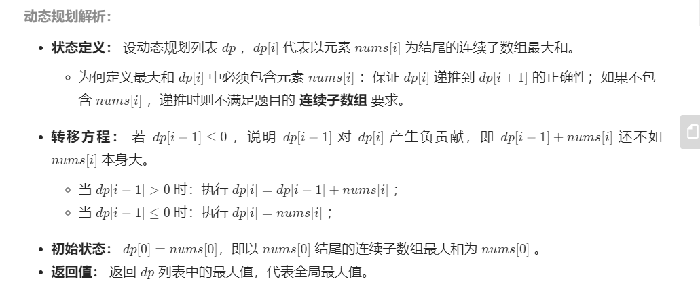
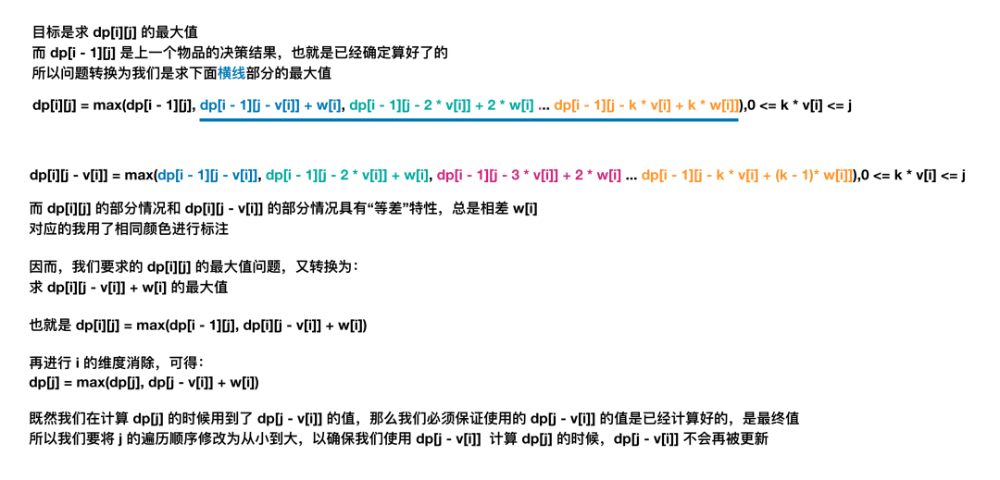

[TOC]


### [**:house:**](../../README.html)

#### [1.子数组的最大累加和问题](https://leetcode-cn.com/problems/lian-xu-zi-shu-zu-de-zui-da-he-lcof/solution/mian-shi-ti-42-lian-xu-zi-shu-zu-de-zui-da-he-do-2/)

给定一个数组arr，返回子数组的最大累加和

例如，arr = [1, -2, 3, 5, -2, 6, -1]，所有子数组中，[3, 5, -2, 6]可以累加出最大的和12，所以返回12.

题目保证没有全为负数的数据

[要求]

时间复杂度为O(n)，空间复杂度为O(1)



```java
class Solution {
    public int maxSubArray(int[] nums) {
        int res = nums[0];
        for(int i = 1; i < nums.length; i++) {
            nums[i] += Math.max(nums[i - 1], 0);//如果i之前的数据相加小于0，则重新开始累加，否则继续累加
            res = Math.max(res, nums[i]);
        }
        return res;
    }
}
```

#### [2.最长递增子序列](https://www.nowcoder.com/practice/9cf027bf54714ad889d4f30ff0ae5481?tpId=196&tqId=37129&rp=1&ru=%2Factivity%2Foj&qru=%2Fta%2Fjob-code-total%2Fquestion-ranking&tab=answerKey)

给定数组arr，设长度为n，输出arr的最长递增子序列。（如果有多个答案，请输出其中字典序最小的）

输入：[2,1,5,3,6,4,8,9,7]

输出：[1,3,4,8,9]

参考：https://blog.nowcoder.net/n/843a7ed318984a36946ac7b01b5f00d9


```java
//思路： 维护一个序列temp,每遍历到数组的第i个元素e，如果e比最后一个元素大，就直接加入temp中，同时nums[i]表示e在temp数组中的下标。如果e比最后一个元素小，那么就遍历temp数组，从左往右找第一个比e大的数据，并用e替换该元素。
//遍历完之后，从左往右遍历nums数组，标号从大到小，然后填入我们最终的结果.
//时间复杂度O(nlogn)
//空间复杂度O(n)
public int[] LIS (int[] arr) {
        // write code here
        int n=arr.length;
        int []nums=new int[n];
        int []temp=new int[n];
        temp[0]=arr[0];
        nums[0]=0;
        int tempIdx=0;
        for(int i=1;i<n;i++){
            
            if(arr[i]>temp[tempIdx]){
                
                tempIdx++;
                temp[tempIdx]=arr[i];
                nums[i]=tempIdx;
            }else{
                
                int l=0;
                int r=tempIdx;
                while(l<=r){
                    
                    int mid=(l+r)/2;
                    if(arr[i]>=temp[mid]){
                        
                        l=mid+1;
                    }else{
                        
                        r=mid-1;
                    }
                }
                temp[l]=arr[i];
                nums[i]=l;
                
            }
            
        }
        int []res=new int[tempIdx+1];
        for(int i=nums.length-1;i>=0;i--){
            
            if(nums[i]==tempIdx){
                
                res[tempIdx]=arr[i];
                tempIdx--;
            }
            
           
        }
         return res;
    }
```

#### [3.矩阵的最小路径和](https://leetcode-cn.com/problems/minimum-path-sum/)

给定一个包含非负整数的 m*n 网格 grid ，请找出一条从左上角到右下角的路径，使得路径上的数字总和为最小。

**说明：**每次只能向下或者向右移动一步。

```java
//时间复杂度O(MN)
//空间复杂度O(MN)
public int minPathSum(int[][] grid) {

        int nr=grid.length;
        int nc=grid[0].length;

        int[][]dp=new int[nr][nc];
        for(int i=0;i<nr;i++){

            for(int j=0;j<nc;j++){
 
                if(i==0 && j==0)  dp[i][j]=grid[0][0];
                else if(i==0)  dp[i][j]=dp[i][j-1]+grid[i][j];
                else if(j==0) dp[i][j]=dp[i-1][j]+grid[i][j];
                else {

                    dp[i][j]=Math.min(dp[i-1][j],dp[i][j-1])+grid[i][j];
                }
                
            }
        }

        return dp[nr-1][nc-1];

    }
```

#### [6.数组区间和](https://leetcode-cn.com/problems/range-sum-query-immutable/)

给定一个整数数组  nums，求出数组从索引 i 到 j（i ≤ j）范围内元素的总和，包含 i、j 两点。

实现 NumArray 类：

NumArray(int[] nums) 使用数组 nums 初始化对象
int sumRange(int i, int j) 返回数组 nums 从索引 i 到 j（i ≤ j）范围内元素的总和，包含 i、j 两点（也就是 sum(nums[i], nums[i + 1], ... , nums[j])）

```java
//求区间 i ~ j 的和，可以转换为 sum[j + 1] - sum[i]，其中 sum[i] 为 0 ~ i - 1 的和。
//时间复杂度O(N)
//空间复杂度O(N)
public int[] numbers;

    public NumArray(int[] nums) {

        numbers=new int[nums.length+1];
        for(int i=1;i<=nums.length;i++){

            numbers[i]=numbers[i-1]+nums[i-1];//number[i]为0~i-1的和
        }
    }
    
    public int sumRange(int left, int right) {

           return numbers[right+1]-numbers[left];

    }
```

#### [7.数组中等差递增子区间的个数](https://leetcode-cn.com/problems/arithmetic-slices/)

如果一个数列至少有三个元素，并且任意两个相邻元素之差相同，则称该数列为等差数列。

函数要返回数组 A 中所有为等差数组的子数组个数。

```java
//对于数组[3,4,5,6,7,8]   dp[i]表示以i结尾的等差数列的子数组个数
//dp[2]=1   3,4,5
//dp[3]=2   3，4，5，6   4，5，6
//dp[4]=3   3,4,5,6,7   4,5,6,7   5,6,7
//dp[5]=4   3,4,5,6,7,8   4,5,6,7,8   5,6,7,8  6,7,8
     
public int numberOfArithmeticSlices(int[] nums) {
        int dp=0;
        int res=0;
        for(int i=2;i<nums.length;i++){

            if(nums[i]-nums[i-1]==nums[i-1]-nums[i-2]) 
            {
                dp=dp+1;
            }else{

                dp=0;
            }
            res=res+dp;

        }
        return res;

    }
```

#### [10.解码方法](https://leetcode-cn.com/problems/decode-ways/)

一条包含字母 `A-Z` 的消息通过以下映射进行了 **编码** ：

```
'A' -> 1
'B' -> 2
...
'Z' -> 26
```

要 解码 已编码的消息，所有数字必须基于上述映射的方法，反向映射回字母（可能有多种方法）。例如，"111" 可以将 "1" 中的每个 "1" 映射为 "A" ，从而得到 "AAA" ，或者可以将 "11" 和 "1"（分别为 "K" 和 "A" ）映射为 "KA" 。注意，"06" 不能映射为 "F" ，因为 "6" 和 "06" 不同。

给你一个只含数字的 非空 字符串 num ，请计算并返回 解码 方法的 总数 。

题目数据保证答案肯定是一个 32 位 的整数。

```java
//若s[i]=0:  若 1<=s[i-1]<=2   则i和i-1位必须组合，dp[i]=dp[i-1]; 否则返回0
//若s[i-1]=1  则i和i-1位可以不组合,有dp[i-1]种情况，也可以组合，有dp[i-2]种情况，dp[i]=dp[i-1]+dp[i-2];
//若s[i-1]=2  且1<=s[i]<=6 同上面一种情况 dp[i]=dp[i-1]+dp[i-2];
//其他情况只能不组合,dp[i]=dp[i-1];
//时间复杂度O(N)
//空间复杂度O(1)
 
public int numDecodings(String s) {
        
        if(s.charAt(0)=='0') return 0;
        int pre=0;
        int dp1=0;
        int dp2=1;
         
        for(int i=1;i<=s.length();i++){

            int temp=s.charAt(i-1)-'0';
            int dp=dp2;
            if(temp==0 && pre<=2 && pre > 0){

                dp2=dp1;
                 
            }else if(temp==0){

                return 0;

            }else if(pre==1 || (pre==2 && temp<=6 && temp>0)){

                dp2=dp1+dp2;
            }

            pre=temp;
            dp1=dp;
            
        }

        return dp2;

    }
```

#### [11. 最长数对链](https://leetcode-cn.com/problems/maximum-length-of-pair-chain/)

给出 n 个数对。 在每一个数对中，第一个数字总是比第二个数字小。

现在，我们定义一种跟随关系，当且仅当 b < c 时，数对(c, d) 才可以跟在 (a, b) 后面。我们用这种形式来构造一个数对链。

给定一个数对集合，找出能够形成的最长数对链的长度。你不需要用到所有的数对，你可以以任何顺序选择其中的一些数对来构造。

```java
//时间复杂度O(N^2)
//空间复杂度O(N)
//根据数对的第一个数排序所有的数对，dp[i] 存储以 pairs[i] 结尾的最长链的长度。当 i < j 且 pairs[i][1] < pairs[j][0] 时，扩展数对链，更新 dp[j] = max(dp[j], dp[i] + 1)。
public int findLongestChain(int[][] pairs) {

        Arrays.sort(pairs,(a,b)->a[1]-b[1]);
        int N=pairs.length;
        int []dp=new int[N];
        int res=1;
        Arrays.fill(dp,1);

        for(int j=1;j<N;j++){

            for(int i=0;i<j;i++){

                if(pairs[j][0]>pairs[i][1]){

                    dp[j]=Math.max(dp[j],dp[i]+1);
                }      
            }
        }

        for(int i=0;i<N;i++){

            res=Math.max(res,dp[i]);
        }
        
        return res;

    }
```

#### [剑指 Offer 42. 连续子数组的最大和](https://leetcode-cn.com/problems/lian-xu-zi-shu-zu-de-zui-da-he-lcof/)

输入一个整型数组，数组中的一个或连续多个整数组成一个子数组。求所有子数组的和的最大值。

要求时间复杂度为O(n)。

```java
//设dp[i]为以nums[i]为结尾的和的最大的值
//dp[i-1]<=0 说明前面的数据没有贡献或者为负贡献，直接设dp[i]=nums[i]然后相加
//dp[i-1] > 0 dp[i]=dp[i-1]+nums[i]
//可以用nums[i]代表dp[i]
//时间复杂度O(N)
//空间复杂度O(1)
    public int maxSubArray(int[] nums) {

        int res = nums[0];
        for(int i = 1; i < nums.length;i++){

                if(nums[i-1] > 0) {

                    nums[i] = nums[i-1] + nums[i];
                }
                
                 res = Math.max(res,nums[i]);
        }
    	return res;
        
    }
```

#### [剑指 Offer 46. 把数字翻译成字符串](https://leetcode-cn.com/problems/ba-shu-zi-fan-yi-cheng-zi-fu-chuan-lcof/)

给定一个数字，我们按照如下规则把它翻译为字符串：0 翻译成 “a” ，1 翻译成 “b”，……，11 翻译成 “l”，……，25 翻译成 “z”。一个数字可能有多个翻译。请编程实现一个函数，用来计算一个数字有多少种不同的翻译方法。

```java
//dp[i] 表示以i结尾的字符可以翻译的方法个数
//当s[i-1]=1 或者s[i-1]=2 && s[i]=0~5时，dp[i] = dp[i-1]+dp[i-2] 也就是当s[i]单独一个组合，方法数为dp[i-1]当s[i]与s[i-1]组合，方法数为dp[i-2];
//其他情况dp[i]=dp[i-1];
//时间复杂度O(N)空间复杂度O(1)
public int translateNum(int num) {

        String s = String.valueOf(num);
        int pre1 = 1;
        int pre2 = 1; 
        for(int i = 1; i < s.length();i++){

            int temp = pre2;
            char c1 = s.charAt(i);
            char c0 = s.charAt(i-1); 
            if((c0 == '1') || (c0 == '2' && c1 <= '5')){

                pre2 = pre1 + pre2;
            }

            pre1 = temp;
        }

        return pre2;

    }
```

#### [剑指 Offer 60. n个骰子的点数](https://leetcode-cn.com/problems/nge-tou-zi-de-dian-shu-lcof/)

把n个骰子扔在地上，所有骰子朝上一面的点数之和为s。输入n，打印出s的所有可能的值出现的概率。

你需要用一个浮点数数组返回答案，其中第 i 个元素代表这 n 个骰子所能掷出的点数集合中第 i 小的那个的概率。


```java
//设i个骰子和为j的概率为dp[i][j]
//dp[i][j]=dp[i-1][j-1]*1/6 +dp[i-1][j-2]*1/6 + dp[i-1][j-3]*1/6.... 
//比如说dp[2][3]  有几种情况：第一个筛子和为2，第二个骰子为1，也就是dp[1][2]*1/6,第一个筛子和为1，第二个骰子为2，也就是dp[1][1]*1/6.
//dp[i][j] = ∑(k=1~6)dp[i-1][j-k]*1/6  这时候会有边界问题，也就是当j<6时，k其实不需要到6，比如dp[2][3]=dp[1][2]+dp[1][1]+dp[1][0]+dp[1][-1]+dp[1][-2]+dp[1][-3],dp[1][1]后面的dp其实是不存在的。
//其实对于dp[i-1][j] 他只会对dp[j][j+1],dp[j][j+2],dp[j][j+3],dp[j][j+4],dp[j][j+5],dp[j][j+6]有贡献。
//时间复杂度 O(N^2) 状态转移循环 n - 1 轮；每轮中，当 i = 2, 3, ..., n时，对应循环数量分别为 6×6,11×6,...,[5(n−1)+1]×6 ，因此总体复杂度为O((n - 1) O((n−1)× 6*(6+[5(n−1)+1])/2).
//状态转移过程中，辅助数组 tmp 最大长度为 6(n-1) - [(n-1) - 1] =5n−4 ，因此使用 O(5n - 4) = O(n)大小的额外空间。
public double[] dicesProbability(int n) {

        double[]dp = new double[6];
        Arrays.fill(dp, 1.0/6.0);//初始状态，骰子有一个

        for(int i = 2; i <=n;i++){//当骰子有两个，有三个。。。有n个时

            double[] temp = new double[5 * i + 1];//对于有i个骰子，他的取值范围为[n,6n]，一共有5n+1种情况

            for(int j = 0; j < dp.length; j++){//遍历dp[i-1][j]

                for(int k = 0; k < 6; k++){//每次给当前的加上0，1，2，3，4，5

                    temp[j+k] += dp[j]/6.0;
                }

            }
            dp = temp;
        }

        return dp;
    }

```

#### [剑指 Offer 49. 丑数](https://leetcode-cn.com/problems/chou-shu-lcof/)

我们把只包含质因子 2、3 和 5 的数称作丑数（Ugly Number）。求按从小到大的顺序的第 n 个丑数。

```java
/*丑数的排列为1,2,3,4,5,6,8,10.... 任意一个丑数等于小于他的某一个丑数*2,*3,*5得到，也就是
A=[1*2,2*2,3*2,4*2,5*2,6*2,8*2,10*2.....]
B=[1*3,2*3,3*3,4*3,5*3,6*3,8*3,10*3.....]
C=[1*5,2*5,3*5,4*5,5*5,6*5,8*5,10*5.....]
也就是丑数是上面三个集合合并，去重，排序后得到
也就是有a,b,c三个指针，分别指向A,B,C
比较A[a],A[b],A[c]的大小，选取最小的一个数，这样可以实现排序
每选完一个数，就需要判断A[a],A[b],A[c]的值是否等于我们选取的这个数，如果是，指针就加1，这样就实现了去重。
时间复杂度O(N)
空间复杂度O(N)
*/
public int nthUglyNumber(int n) {

        int[] dp = new int[n];
        dp[0] = 1;
        int a = 0, b = 0, c = 0;
        for(int i = 1; i < n; i++){

            int a2 = dp[a] * 2, a3 = dp[b] * 3, a5 = dp[c] * 5;
            dp[i] = Math.min(Math.min(a2,a3),a5);
            if(dp[i] == a2) a++;
            if(dp[i] == a3) b++;
            if(dp[i] == a5) c++;
        }

        return dp[n-1];
    }
```

#### [746. 使用最小花费爬楼梯](https://leetcode.cn/problems/min-cost-climbing-stairs/)

给你一个整数数组 `cost` ，其中 `cost[i]` 是从楼梯第 `i` 个台阶向上爬需要支付的费用。一旦你支付此费用，即可选择向上爬一个或者两个台阶。

你可以选择从下标为 `0` 或下标为 `1` 的台阶开始爬楼梯。

请你计算并返回达到楼梯顶部的最低花费。

**示例 1：**

```
输入：cost = [10,15,20]
输出：15
解释：你将从下标为 1 的台阶开始。
- 支付 15 ，向上爬两个台阶，到达楼梯顶部。
总花费为 15 。
```

**示例 2：**

```
输入：cost = [1,100,1,1,1,100,1,1,100,1]
输出：6
解释：你将从下标为 0 的台阶开始。
- 支付 1 ，向上爬两个台阶，到达下标为 2 的台阶。
- 支付 1 ，向上爬两个台阶，到达下标为 4 的台阶。
- 支付 1 ，向上爬两个台阶，到达下标为 6 的台阶。
- 支付 1 ，向上爬一个台阶，到达下标为 7 的台阶。
- 支付 1 ，向上爬两个台阶，到达下标为 9 的台阶。
- 支付 1 ，向上爬一个台阶，到达楼梯顶部。
总花费为 6 。
```

```java
class Solution {
    public int minCostClimbingStairs(int[] cost) {
        int[] dp = new int[cost.length + 1];
        dp[0] = 0;
        dp[1] = 0;

        for (int i = 2; i < dp.length; i++) {
            dp[i] = Math.min(dp[i - 1] + cost[i - 1], dp[i - 2] + cost[i - 2]);
        }
        return dp[cost.length];

    }
}
```

#### [62. 不同路径](https://leetcode.cn/problems/unique-paths/)

一个机器人位于一个 `m x n` 网格的左上角 （起始点在下图中标记为 “Start” ）。

机器人每次只能向下或者向右移动一步。机器人试图达到网格的右下角（在下图中标记为 “Finish” ）。

问总共有多少条不同的路径？

**示例 2：**

```
输入：m = 3, n = 2
输出：3
解释：
从左上角开始，总共有 3 条路径可以到达右下角。
1. 向右 -> 向下 -> 向下
2. 向下 -> 向下 -> 向右
3. 向下 -> 向右 -> 向下
```

```java
class Solution {
    public int uniquePaths(int m, int n) {

        int[][] dp = new int[m][n];
        for (int i = 0; i < m; i++) {
            dp[i][0] = 1;
        }
        for (int j = 0; j < n; j++) {
            dp[0][j] = 1;
        }
        for(int i = 1; i < m;i++){
            for(int j = 1; j < n;j++){
                dp[i][j] = dp[i - 1][j] + dp[i][j - 1];
            }
        }
        return dp[m - 1][n - 1];

    }
}
```

#### [63. 不同路径 II](https://leetcode.cn/problems/unique-paths-ii/)

一个机器人位于一个 `m x n` 网格的左上角 （起始点在下图中标记为 “Start” ）。

机器人每次只能向下或者向右移动一步。机器人试图达到网格的右下角（在下图中标记为 “Finish”）。

现在考虑网格中有障碍物。那么从左上角到右下角将会有多少条不同的路径？

网格中的障碍物和空位置分别用 `1` 和 `0` 来表示。

```java
class Solution {
    public int uniquePathsWithObstacles(int[][] obstacleGrid) {
        int m = obstacleGrid.length;
        int n = obstacleGrid[0].length;

        int[][] dp = new int[m][n];

        for (int i = 0; i < m; i++) {
            if (obstacleGrid[i][0] == 1) {
                break;
            }
            dp[i][0] = 1;
        }
        for (int j = 0; j < n; j++) {
            if (obstacleGrid[0][j] == 1) {
                break;
            }
            dp[0][j] = 1;
        }

        for (int i = 1; i < m; i++) {
            for (int j = 1; j < n; j++) {
                if (obstacleGrid[i][j] != 1) {
                    dp[i][j] = dp[i - 1][j] + dp[i][j - 1];
                }
            }
        }
        return dp[m - 1][n - 1];

    }
}
```

#### [8.整数拆分](https://leetcode-cn.com/problems/integer-break/)

给定一个正整数 *n*，将其拆分为**至少**两个正整数的和，并使这些整数的乘积最大化。 返回你可以获得的最大乘积。

```java
//创建数组dp,其中dp[i]表示将正整数i拆分成至少两个正整数的和之后，这些正整数的最大的乘积，因此dp[0]=dp[1]=0;
//当i>=2时，假设对正整数i拆分出的第一个正整数是j,则有两种情况：
//- 将i拆分成j和i-j的和，且i-j不再拆分成多个正整数，此时的乘积是j*(i-j)
//- 将i拆分成j和i-j的和，且i-j继续拆分成多个正整数，此时的乘积是j*dp[i-j]
//因此dp[i]=Math.max(j * dp[i - j], j * (i - j))
public int integerBreak(int n) {
    int[] dp = new int[n + 1];
    dp[1] = 1;
    for (int i = 2; i <= n; i++) {
        for (int j = 1; j <= i - 1; j++) {
            dp[i] = Math.max(dp[i], Math.max(j * dp[i - j], j * (i - j)));
        }
    }
    return dp[n];
}
```


# 0-1背包

#### 12.[0-1背包问题](https://mp.weixin.qq.com/s/xmgK7SrTnFIM3Owpk-emmg)

有N件物品和一个容量是V的背包。每件物品有且只有一件。

第i件物品的体积是 vi，价值是wi 。

求解将哪些物品装入背包，可使这些物品的总体积不超过背包容量，且总价值最大。

```java
//思路：dp[i][c]表示考虑前i件物品，使用容量不超过c的条件下的背包最大价值。
//转移方程：当不加入第i件，则当前dp[i][c]=dp[i-1][c]
//        当加入第i件，则只有此刻容量c>=v[i]才能加进去,加进去之后留给前i-1件就剩c-v[i]的容量了，则当前最大价值就是dp[i][c]=dp[i-1][c-v[i]+w[i]
//也就是dp[i][c]=Math.max(dp[i-1][c],dp[i-1][c-v[i]]+w[i])
//时间复杂度O(N*c)
//空间复杂度O(N*c)
public int maxValue(int N, int C, int[] v, int[] w) {
        int[][] dp = new int[N][C+1];
        // 先处理「考虑第一件物品」的情况
        for (int i = 0; i <= C; i++) {
            dp[0][i] = i >= v[0] ? w[0] : 0;
        }
        // 再处理「考虑其余物品」的情况
        for (int i = 1; i < N; i++) {
            for (int j = 0; j < C + 1; j++) {
                // 不选该物品
                int n = dp[i-1][j]; 
                // 选择该物品，前提「剩余容量」大于等于「物品体积」
                int y = j >= v[i] ? dp[i-1][j-v[i]] + w[i] : 0; 
                dp[i][j] = Math.max(n, y);
            }
        }
        return dp[N-1][C];
    }
}
//由于当前dp[i][c]只与dp[i-1][c]和dp[i-1][c-v[i]]有关，所以可以继续优化
//假设第i行的结果集为dp[0:c]
//这时候我们要求第i+1行的dp[0:c],我们只能从后往前进行计算，因为如果从前往后计算的话，dp[k]=dp[c-v[k]]中dp[c-v[k]]的值其实是第i+1行的值，但是正确的应该是第i行的值。所以要从后往前进行计算。
 public int maxValue(int N, int C, int[] v, int[] w) {
        int[] dp = new int[C + 1];
        for (int i = 0; i < N; i++) {
            for (int j = C; j >= v[i]; j--) {
                // 不选该物品
                int n = dp[j]; 
                // 选择该物品
                int y = dp[j-v[i]] + w[i]; 
                dp[j] = Math.max(n, y);
            }
        }
        return dp[C];
    }

```

#### [416. 分割等和子集](https://leetcode-cn.com/problems/partition-equal-subset-sum/)

给你一个 **只包含正整数** 的 **非空** 数组 `nums` 。请你判断是否可以将这个数组分割成两个子集，使得两个子集的元素和相等。

 

```java
//题目可以转化为是否可以在数组中找到一些数，使得这些数的总和为数组总和的一半
//dp[i][j] 表示nums[0:i]中是否有一些数的和为j
//初始状态：对于dp[i][0]一直都为true，因为可以不选择任意一个数据，这样就可以满足和为0
//转移方程：对于dp[i][j]我们可不选择nums[i]，则dp[i][j]=dp[i-1][j],我们也可以选择nums[i],则dp[i][j]=dp[i-1][j-nums[i]];
//这样dp[i][j]=dp[i-1][j]|dp[i-1][j-nums[i]]
//由于dp[i][j]只与i-1行有关系，所以可以转化为一维数组
//时间复杂度O(N*target)
//空间复杂度O(target)
class Solution {
    public boolean canPartition(int[] nums) {
        int sum = 0;
        for (int num : nums) {
            sum += num;
        }
        if (sum % 2 != 0) {
            return false;
        }
        int target = sum / 2;

        int[] dp = new int[target + 1];
        dp[0] = 0;
        for (int i = 0; i < nums.length; i++) {
            for (int j = target; j >= nums[i]; j--) {
                dp[j] = Math.max(dp[j], dp[j - nums[i]] + nums[i]);
            }
        }
        return dp[target] == target;

    }
}
```

#### [1049. 最后一块石头的重量 II](https://leetcode.cn/problems/last-stone-weight-ii/)

有一堆石头，用整数数组 `stones` 表示。其中 `stones[i]` 表示第 `i` 块石头的重量。

每一回合，从中选出**任意两块石头**，然后将它们一起粉碎。假设石头的重量分别为 `x` 和 `y`，且 `x <= y`。那么粉碎的可能结果如下：

- 如果 `x == y`，那么两块石头都会被完全粉碎；
- 如果 `x != y`，那么重量为 `x` 的石头将会完全粉碎，而重量为 `y` 的石头新重量为 `y-x`。

最后，**最多只会剩下一块** 石头。返回此石头 **最小的可能重量** 。如果没有石头剩下，就返回 `0`。

**示例 1：**

```
输入：stones = [2,7,4,1,8,1]
输出：1
解释：
组合 2 和 4，得到 2，所以数组转化为 [2,7,1,8,1]，
组合 7 和 8，得到 1，所以数组转化为 [2,1,1,1]，
组合 2 和 1，得到 1，所以数组转化为 [1,1,1]，
组合 1 和 1，得到 0，所以数组转化为 [1]，这就是最优值。
```

**示例 2：**

```
输入：stones = [31,26,33,21,40]
输出：5
```


```java
class Solution {
    public int lastStoneWeightII(int[] stones) {

        int sum = 0;
        for (int stone : stones) {
            sum += stone;
        }
        int target = sum / 2;

        int[] dp = new int[target + 1];
        dp[0] = 0;

        for (int i = 0; i < stones.length; i++) {
            for (int j = target; j >= stones[i]; j--) {
                dp[j] = Math.max(dp[j], dp[j - stones[i]] + stones[i]);
            }
        }
        return sum - 2 * dp[target];

    }
}
```

#### [494. 目标和](https://leetcode-cn.com/problems/target-sum/)

给定一个非负整数数组，a1, a2, ..., an, 和一个目标数，S。现在你有两个符号 + 和 -。对于数组中的任意一个整数，你都可以从 + 或 -中选择一个符号添加在前面。

返回可以使最终数组和为目标数 S 的所有添加符号的方法数。

```java
//设正数和为sum(P),负数和为sum(N)
//sum(p)-sum(N)=target
//sum(p)+sum(N)+sum(P)-sum(N)=target+sum
//sum(p)=(target+sum)/2
//也就是要在数组中找到一些数和为(target+sum)/2，同时(target+sum)需要为偶数
//转换为0-1背包问题
//dp[i][j]表示nums[0:i]中和为j的组合数
//dp[i][0]表示nums[0:i]中和为0的数，这时候可以都不选，也就是其他数全设为负数 也就是dp[i][0]=1
//转移方程：当不选择nums[i]时，dp[i][j]=dp[i-1][j]，当选择nums[i]时，dp[i][j]=dp[i-1][j-nums[i]],这样一共有dp[i-1][j]+dp[i-1][j-nums[i]]种情况
//优化：转化一维数组代码如下
//时间复杂度：O((target+sum)*N)
//空间复杂度：O((target+sum))
class Solution {
    public int findTargetSumWays(int[] nums, int target) {
        int sum = 0;
        for (int num : nums) {
            sum += num;
        }
        if (Math.abs(target) > sum) {
            return 0;
        }
        if ((target + sum) % 2 != 0) {
            return 0;
        }
        int n = (target + sum) / 2;
        int[] dp = new int[n + 1];
        dp[0] = 1;

        for (int i = 0; i < nums.length; i++) {
            for (int j = n; j >= nums[i]; j--) {
                dp[j] = dp[j] + dp[j - nums[i]];
            }
        }
        return dp[n];

    }
}
//第二种解法dsf
 int count=0;
    public void dfs(int target,int i,int []nums,int sum){

        if(i==nums.length){

            if(sum==target) count++;
            return;
        }

        dfs(target,i+1,nums,sum+nums[i]);
        dfs(target,i+1,nums,sum-nums[i]);
    


    }
    
    public int findTargetSumWays(int[] nums, int target) {

       dfs(target, 0,nums,0);
       return count;

    }
```

#### [474. 一和零](https://leetcode-cn.com/problems/ones-and-zeroes/)

给你一个二进制字符串数组 strs 和两个整数 m 和 n 。

请你找出并返回 strs 的最大子集的大小，该子集中 最多 有 m 个 0 和 n 个 1 。

如果 x 的所有元素也是 y 的元素，集合 x 是集合 y 的 子集 。

```java
//问题可以转化为0-1背包问题
//dp[i][j][k]表示str[0:i]中最多有j个0和k个1的最大子集的大小
//初始状态：dp[0][j][k]=0 也就是什么都不选，子集大小自然就等于0
//转移方程:如果选择str[i]  dp[i][j][k]=dp[i-1][j-zero][k-one]+1  如果不选择则dp[i][j][k]=dp[i-1][j][k],二者取最大。
//优化:转化一维数组代码如下
//时间复杂度O(mnl)
//空间复杂度O(mn)
public int findMaxForm(String[] strs, int m, int n) {


        if(strs==null || strs.length==0) return 0;
        int [][]dp=new int[m+1][n+1];

        for(String s:strs){

            int one=0;
            int zero=0;

            for(int i=0;i<s.length();i++){

                if(s.charAt(i)=='1'){

                    one++;
                }else{

                    zero++;
                }      
            }

            for(int j=m;j>=zero;j--){
                for(int k=n;k>=one;k--){

                    dp[j][k]=Math.max(dp[j][k],dp[j-zero][k-one]+1);
                }
            }
        }

        return dp[m][n];


    }
```

# 完全背包

#### [13.完全背包问题](https://mp.weixin.qq.com/s?__biz=MzU4NDE3MTEyMA==&mid=2247486107&idx=1&sn=e5fa523008fc5588737b7ed801caf4c3&chksm=fd9ca184caeb28926959c0987208a3932ed9c965267ed366b5b82a6fc16d42f1ff40c29db5f1&scene=178&cur_album_id=1751702161341628417#rd)

有N种物品和一个容量为C的背包，每种物品都有无限件。

第i 件物品的体积是 v[i]，价值是 w[i]。

求解将哪些物品装入背包可使这些物品的费用总和不超过背包容量，且价值总和最大。

其实就是在 0-1 背包问题的基础上，增加了每件物品可以选择多次的特点（在容量允许的情况下）。



```java
/*
思路:dp[i][j]表示考虑前i件物品，放入一个容量为j的背包可以获取的最大价值。
初始状态：当只有一个物件的时候，dp[0][j]=j/v[0]*w[0]
转移方程：由于每个物件可以被选择多次，因此对于某个dp[i][j]而言，他的值为以下方案的最大值
选择0件物品i的最大价值 dp[i-1][j]
选择1件物品i的最大价值，dp[i-1][j-v[i]]+w[i]
...
选择k件物品i的最大价值，dp[i-1][j-k*v[i]]+K*w[i]
则转移方程为dp[i][j]=max(dp[i-1][j],dp[i-1][j-v[i]]+w[i],..dp[i-1][j-k*v[i]]+K*w[i])   0<=k*v[i]<=j
dp[i][j-v[i]]=max(dp[i-1][j-v[i]]+w[i],..dp[i-1][j-k*v[i]]+K*w[i])   0<=k*v[i]<=j
也就是dp[i][j]=max(dp[i-1][j],dp[i][j-v[i]]+w[i])
也就是dp[i][j]的值与上一行的dp[j]的值有关以及当前行的dp[j-v[i]]+w[i]有关
由于与当前行的dp[j-v[i]]+w[i]有关，所以需要从小到大遍历先计算出前面的值，这样才能得到正确的结果
dp[j]=max(dp[j],dp[j-v[i]]+w[i])
*/

public int maxValue(int N, int C, int[] v, int[] w) {
        int[] dp = new int[C + 1];
        for (int i = 0; i < N; i++) {
            for (int j = 0; j <= C; j++) {
                // 不考虑第 i 件物品的情况（选择 0 件物品 i）
                int n = dp[j];
                // 考虑第 i 件物品的情况
                int y = j - v[i] >= 0 ? dp[j - v[i]] + w[i] : 0; 
                dp[j] = Math.max(n, y);
            }
        }
        return dp[C];
    }
```

#### [518. 零钱兑换 II](https://leetcode-cn.com/problems/coin-change-2/)

给定不同面额的硬币和一个总金额。写出函数来计算可以凑成总金额的硬币组合数。假设每一种面额的硬币有无限个。 

```java
//dp[i][j]表示coins[0:i]中可以凑成j的组合数
//初始状态dp[0][0]=1 表示没有硬币，凑成0的组合数为0
//dp[0][1:j]=0 没有任何组合
//dp[i][j] = dp[i-1][j]+dp[i-1][j-coin[i]]+dp[i-1][j-2*coin[i]]+...
//dp[i][j-coin[i]]= dp[i-1][j-coin[i]] + dp[i-1][j-2*coin[i]]+..
//dp[i][j] = dp[i-1][j] + dp[i][j-coin[i]];
//转移方程： dp[i] = dp[i] + dp[i - coin];
public int change(int amount, int[] coins) {


        int []dp = new int[amount+1];
        dp[0] = 1;
        for(int coin : coins){
            for(int i = coin; i <= amount; i++){

                dp[i] = dp[i] + dp[i - coin];

            }
        }

       return dp[amount]; 

    }
```

#### [377. 组合总和 Ⅳ](https://leetcode.cn/problems/combination-sum-iv/)

给你一个由 **不同** 整数组成的数组 `nums` ，和一个目标整数 `target` 。请你从 `nums` 中找出并返回总和为 `target` 的元素组合的个数。

题目数据保证答案符合 32 位整数范围。

**示例 1：**

```
输入：nums = [1,2,3], target = 4
输出：7
解释：
所有可能的组合为：
(1, 1, 1, 1)
(1, 1, 2)
(1, 2, 1)
(1, 3)
(2, 1, 1)
(2, 2)
(3, 1)
请注意，顺序不同的序列被视作不同的组合。
```

```java
//dp[j] 表示在num数组中找到组合和为j的个数
//计算对于每个nums[i],的dp[j - nums[i]]的结果，对其累加，就是dp[j]
class Solution {
    public int combinationSum4(int[] nums, int target) {

        int[] dp = new int[target + 1];
        dp[0] = 1;
        for (int i = 1; i <= target; i++) {
            for (int num : nums) {
                if (num <= i) {
                    dp[i] += dp[i - num];
                }
            }
        }

        return dp[target];

    }
}
```

#### [322. 零钱兑换](https://leetcode-cn.com/problems/coin-change/)

给定不同面额的硬币 coins 和一个总金额 amount。编写一个函数来计算可以凑成总金额所需的最少的硬币个数。如果没有任何一种硬币组合能组成总金额，返回 -1。

你可以认为每种硬币的数量是无限的。

```java 
/*
每种硬币的数量是无限的，可以理解为一个完全背包问题
初始状态：初始化dp数组：因为硬币的数量一定不会超过amount，而amount <= 10^4
 ，因此初始化数组值为10001；dp[0] = 0
 返回dp[amount]，如果dp[amount]的值为10001没有变过，说明找不到硬币组合，返回-1
*/

 public int coinChange(int[] coins, int amount) {

        int N = coins.length;
        int []dp = new int[amount + 1];
        Arrays.fill(dp,1001);//
        dp[0] = 0;

        for (int i = 0; i < N; i++) {
            for (int j = coins[i]; j <= amount; j++) {

                dp[j] = Math.min(dp[j],dp[j-coins[i]]+1);

            }
        }

        return dp[amount] != 1001 ? dp[amount]:-1;
    }
```

#### [9.完全平方数](https://leetcode-cn.com/problems/perfect-squares/)

给定正整数 n，找到若干个完全平方数（比如 1, 4, 9, 16, ...）使得它们的和等于 n。你需要让组成和的完全平方数的个数最少。

给你一个整数 n ，返回和为 n 的完全平方数的 最少数量 。

```java
//依次计算n=1,n=2,n=3...的最小的数量dp[i]
//对于dp[i]  它可以等于一个完全平方数（temp）和另外一个数据相加,另一个数据的最小平方数量是dp[i-temp],我们遍历所有小于i的平方数，取数量最小的那个也就是Min(dp[i-temp]+1)
//时间复杂度O(n*sqrt(n))
//空间复杂度O(N)
public int numSquares(int n) {

        int sqrnum=(int)Math.sqrt(n);
        int[] sqr=new int[sqrnum];
        for(int i=1;i<=sqrnum;i++){

              sqr[i-1]=i*i;      //先找出所有的平方数
        }
        
        int []dp=new int[n+1];
    //依次求出
        for(int i=1;i<=n;i++){
            int min=Integer.MAX_VALUE;
            for(int temp:sqr){

                if(temp > i){

                    break;
                }
                min=Math.min(min,dp[i-temp]+1);//取数量最小的
            
            }
            dp[i]=min;
        }

    return dp[n];
    }


class Solution {
    public int numSquares(int n) {

        int[] dp = new int[n + 1];
        Arrays.fill(dp, Integer.MAX_VALUE);
        dp[0] = 0;

        for(int i = 1; i * i <= n; i++){
            for(int j = i * i; j <= n; j++){
                dp[j] = Math.min(dp[j], dp[j - i * i] + 1);
            }
        }
        return dp[n];

    }
}
```

#### [139. 单词拆分](https://leetcode.cn/problems/word-break/)

给你一个字符串 `s` 和一个字符串列表 `wordDict` 作为字典。如果可以利用字典中出现的一个或多个单词拼接出 `s` 则返回 `true`。

**注意：**不要求字典中出现的单词全部都使用，并且字典中的单词可以重复使用。

**示例 1：**

```
输入: s = "leetcode", wordDict = ["leet", "code"]
输出: true
解释: 返回 true 因为 "leetcode" 可以由 "leet" 和 "code" 拼接成。
```

**示例 2：**

```
输入: s = "applepenapple", wordDict = ["apple", "pen"]
输出: true
解释: 返回 true 因为 "applepenapple" 可以由 "apple" "pen" "apple" 拼接成。
     注意，你可以重复使用字典中的单词。
```

```java
//dp[i] 表示字符串 0~i-1是否能被字典中的单词组成
//则dp[i] = dp[j] && check(s[j...i-1]) 

class Solution {
    public boolean wordBreak(String s, List<String> wordDict) {
        Set<String> set = new HashSet<>(wordDict);
        boolean[] dp = new boolean[s.length() + 1];
        dp[0] = true;

        for (int i = 1; i <= s.length(); i++) {
            for (int j = 0; j < i; j++) {
                if (dp[j] && set.contains(s.substring(j, i))) {
                    dp[i] = true;
                    break;
                }
            }
        }
        return dp[s.length()];

    }
}
```

# 其他

#### [4.打家劫舍](https://leetcode-cn.com/problems/house-robber/)

你是一个专业的小偷，计划偷窃沿街的房屋。每间房内都藏有一定的现金，影响你偷窃的唯一制约因素就是相邻的房屋装有相互连通的防盗系统，如果两间相邻的房屋在同一晚上被小偷闯入，系统会自动报警。

给定一个代表每个房屋存放金额的非负整数数组，计算你 不触动警报装置的情况下 ，一夜之内能够偷窃到的最高金额。

```java
//动态规划：设置偷到第i个房间最大能偷dp[i]
//dp[i]=Math.max(dp[i-2]+nums[i],dp[i]);
//时间复杂度O(N)
//空间复杂度O(1)
class Solution {
    public int rob(int[] nums) {
        if(nums.length == 1){
            return nums[0];
        }
        int[] dp = new int[nums.length];
        dp[0] = nums[0];
        dp[1] = Math.max(nums[0], nums[1]);

        for (int i = 2; i < nums.length; i++) {
            dp[i] = Math.max(dp[i - 1], dp[i - 2] + nums[i]);
        }

        return dp[nums.length - 1];

    }
}
```

#### [5.打家劫舍(环形)](https://leetcode-cn.com/problems/house-robber-ii/submissions/)

你是一个专业的小偷，计划偷窃沿街的房屋，每间房内都藏有一定的现金。这个地方所有的房屋都 围成一圈 ，这意味着第一个房屋和最后一个房屋是紧挨着的。同时，相邻的房屋装有相互连通的防盗系统，如果两间相邻的房屋在同一晚上被小偷闯入，系统会自动报警 。

给定一个代表每个房屋存放金额的非负整数数组，计算你 在不触动警报装置的情况下 ，能够偷窃到的最高金额。

```java
//分为第一个偷，最后一个不偷和第一个不偷，最后一个偷的情况
//时间复杂度O(N)空间复杂度O(1)
class Solution {
    public int rob(int[] nums) {

        if(nums.length == 1){
            return nums[0];
        }
        return Math.max(help(nums,0,nums.length - 2), help(nums, 1, nums.length - 1));

    }

    private int help(int []nums, int start, int end){
        if(end - start == 0){
            return nums[end];
        }
        int[] dp = new int[end - start + 1];
        dp[0] = nums[start];
        dp[1] = Math.max(nums[start], nums[start + 1]);


        for(int i = 2; i <= end - start; i++){
            dp[i] = Math.max(dp[i - 1], dp[i - 2] + nums[start + i]);

        }
        return dp[end - start];
    }
}
```

#### [337. 打家劫舍 III](https://leetcode.cn/problems/house-robber-iii/)

小偷又发现了一个新的可行窃的地区。这个地区只有一个入口，我们称之为 `root` 。

除了 `root` 之外，每栋房子有且只有一个“父“房子与之相连。一番侦察之后，聪明的小偷意识到“这个地方的所有房屋的排列类似于一棵二叉树”。 如果 **两个直接相连的房子在同一天晚上被打劫** ，房屋将自动报警。

给定二叉树的 `root` 。返回 ***在不触动警报的情况下** ，小偷能够盗取的最高金额* 。

**示例 1:**


```
输入: root = [3,2,3,null,3,null,1]
输出: 7 
解释: 小偷一晚能够盗取的最高金额 3 + 3 + 1 = 7
```

```java
/**
 * Definition for a binary tree node.
 * public class TreeNode {
 * int val;
 * TreeNode left;
 * TreeNode right;
 * TreeNode() {}
 * TreeNode(int val) { this.val = val; }
 * TreeNode(int val, TreeNode left, TreeNode right) {
 * this.val = val;
 * this.left = left;
 * this.right = right;
 * }
 * }
 */
// result[0] 不偷
//result[1] 偷
class Solution {
    public int rob(TreeNode root) {
        int[] result = robHelp(root);
        return Math.max(result[0], result[1]);
    }

    private int[] robHelp(TreeNode node) {
        int[] result = new int[2];
        if (node == null) {
            return result;
        }
        int[] left = robHelp(node.left);
        int[] right = robHelp(node.right);

        result[0] = Math.max(right[0], right[1]) + Math.max(left[0], left[1]);
        result[1] = node.val + right[0] + left[0];
        return result;

    }
}
```

#### [121. 买卖股票的最佳时机](https://leetcode.cn/problems/best-time-to-buy-and-sell-stock/)

给定一个数组 `prices` ，它的第 `i` 个元素 `prices[i]` 表示一支给定股票第 `i` 天的价格。

你只能选择 **某一天** 买入这只股票，并选择在 **未来的某一个不同的日子** 卖出该股票。设计一个算法来计算你所能获取的最大利润。

返回你可以从这笔交易中获取的最大利润。如果你不能获取任何利润，返回 `0` 。

```java
class Solution {
    public int maxProfit(int[] prices) {

        int[][] dp = new int[prices.length][2];
        dp[0][0] = 0;
        dp[0][1] = -prices[0];

        for (int i = 1; i < prices.length; i++) {
            dp[i][0] = Math.max(dp[i - 1][0], dp[i - 1][1] + prices[i]);
            dp[i][1] = Math.max(dp[i - 1][1], - prices[i]);
        }
        return Math.max(dp[prices.length - 1][0], dp[prices.length - 1][1]);

    }
}
```

#### [122. 买卖股票的最佳时机 II](https://leetcode.cn/problems/best-time-to-buy-and-sell-stock-ii/)

给你一个整数数组 `prices` ，其中 `prices[i]` 表示某支股票第 `i` 天的价格。

在每一天，你可以决定是否购买和/或出售股票。你在任何时候 **最多** 只能持有 **一股** 股票。你也可以先购买，然后在 **同一天** 出售。

返回 *你能获得的 **最大** 利润* 。

 

**示例 1：**

```
输入：prices = [7,1,5,3,6,4]
输出：7
解释：在第 2 天（股票价格 = 1）的时候买入，在第 3 天（股票价格 = 5）的时候卖出, 这笔交易所能获得利润 = 5 - 1 = 4。
随后，在第 4 天（股票价格 = 3）的时候买入，在第 5 天（股票价格 = 6）的时候卖出, 这笔交易所能获得利润 = 6 - 3 = 3。
最大总利润为 4 + 3 = 7 。
```

```java
class Solution {
    public int maxProfit(int[] prices) {

        int[][] dp = new int[prices.length][2];

        dp[0][0] = 0;
        dp[0][1] = -prices[0];

        for (int i = 1; i < prices.length; i++) {
            dp[i][0] = Math.max(dp[i - 1][0], dp[i - 1][1] + prices[i]);
            dp[i][1] = Math.max(dp[i - 1][1], dp[i - 1][0] - prices[i]);
        }
        return Math.max(dp[prices.length - 1][0], dp[prices.length - 1][1]);

    }
}
```

#### [123. 买卖股票的最佳时机 III](https://leetcode.cn/problems/best-time-to-buy-and-sell-stock-iii/)

给定一个数组，它的第 `i` 个元素是一支给定的股票在第 `i` 天的价格。

设计一个算法来计算你所能获取的最大利润。你最多可以完成 **两笔** 交易。

**注意：**你不能同时参与多笔交易（你必须在再次购买前出售掉之前的股票）。

 

**示例 1:**

```
输入：prices = [3,3,5,0,0,3,1,4]
输出：6
解释：在第 4 天（股票价格 = 0）的时候买入，在第 6 天（股票价格 = 3）的时候卖出，这笔交易所能获得利润 = 3-0 = 3 。
     随后，在第 7 天（股票价格 = 1）的时候买入，在第 8 天 （股票价格 = 4）的时候卖出，这笔交易所能获得利润 = 4-1 = 3 。
```

```java
/*
dp[i][0] 第一次持有
dp[i][1] 第一次不持有
dp[i][2] 第二次持有
dp[i][3] 第二次不持有

*/
class Solution {
    public int maxProfit(int[] prices) {
        int[][] dp = new int[prices.length][4];
        dp[0][0] = -prices[0];
        dp[0][1] = 0;
        dp[0][2] = -prices[0];
        dp[0][3] = 0;

        for (int i = 1; i < prices.length; i++) {
            dp[i][0] = Math.max(dp[i - 1][0], -prices[i]);
            dp[i][1] = Math.max(dp[i - 1][1], dp[i - 1][0] + prices[i]);
            dp[i][2] = Math.max(dp[i - 1][2], dp[i - 1][1] - prices[i]);
            dp[i][3] = Math.max(dp[i - 1][3], dp[i - 1][2] + prices[i]);
        }
        return dp[prices.length - 1][3];

    }
}
```

#### [188. 买卖股票的最佳时机 IV](https://leetcode.cn/problems/best-time-to-buy-and-sell-stock-iv/)

给你一个整数数组 `prices` 和一个整数 `k` ，其中 `prices[i]` 是某支给定的股票在第 `i` 天的价格。

设计一个算法来计算你所能获取的最大利润。你最多可以完成 `k` 笔交易。也就是说，你最多可以买 `k` 次，卖 `k` 次。

**注意：**你不能同时参与多笔交易（你必须在再次购买前出售掉之前的股票）。

 

**示例 1：**

```
输入：k = 2, prices = [2,4,1]
输出：2
解释：在第 1 天 (股票价格 = 2) 的时候买入，在第 2 天 (股票价格 = 4) 的时候卖出，这笔交易所能获得利润 = 4-2 = 2 。
```

**示例 2：**

```
输入：k = 2, prices = [3,2,6,5,0,3]
输出：7
解释：在第 2 天 (股票价格 = 2) 的时候买入，在第 3 天 (股票价格 = 6) 的时候卖出, 这笔交易所能获得利润 = 6-2 = 4 。
     随后，在第 5 天 (股票价格 = 0) 的时候买入，在第 6 天 (股票价格 = 3) 的时候卖出, 这笔交易所能获得利润 = 3-0 = 3 。
```

```java
class Solution {
    public int maxProfit(int k, int[] prices) {

        int[][] dp = new int[prices.length][k * 2];
        for (int i = 0; i < 2 * k; i += 2) {
            dp[0][i] = -prices[0];
        }

        for (int i = 1; i < prices.length; i++) {
            dp[i][0] = Math.max(dp[i - 1][0], -prices[i]);
            for (int j = 1; j < 2 * k; j++) {
                if (j % 2 == 0) {
                    dp[i][j] = Math.max(dp[i - 1][j], dp[i - 1][j - 1] - prices[i]);
                } else {
                    dp[i][j] = Math.max(dp[i - 1][j], dp[i - 1][j - 1] + prices[i]);
                }
            }
        }
        return dp[prices.length - 1][2 * k - 1];

    }
}
```

#### [309. 买卖股票的最佳时机含冷冻期](https://leetcode.cn/problems/best-time-to-buy-and-sell-stock-with-cooldown/)

给定一个整数数组`prices`，其中第 `prices[i]` 表示第 `*i*` 天的股票价格 。

设计一个算法计算出最大利润。在满足以下约束条件下，你可以尽可能地完成更多的交易（多次买卖一支股票）:

- 卖出股票后，你无法在第二天买入股票 (即冷冻期为 1 天)。

**注意：**你不能同时参与多笔交易（你必须在再次购买前出售掉之前的股票）。

 

**示例 1:**

```
输入: prices = [1,2,3,0,2]
输出: 3 
解释: 对应的交易状态为: [买入, 卖出, 冷冻期, 买入, 卖出]
```

```java
/*
dp[i][0] 第i天未持有，同时当天未卖出：（1）保持前一天未持有未卖出的状态，（2）前一天卖出，保持未持有
dp[i][2] 第i天未持有，同时当天卖出：   前一天的状态为持有，并且当天卖出
dp[i][2] 第i天持有  （1）保持原来持有状态  （2） 前一天未持有且未卖出，今天买入
*/
class Solution {
    public int maxProfit(int[] prices) {
        int[][] dp = new int[prices.length][3];
        dp[0][0] = 0;
        dp[0][1] = 0;
        dp[0][2] = -prices[0];

        for (int i = 1; i < prices.length; i++) {
            dp[i][0] = Math.max(dp[i - 1][0], dp[i - 1][1]);
            dp[i][1] = dp[i - 1][2] + prices[i];
            dp[i][2] = Math.max(dp[i - 1][2], dp[i - 1][0] - prices[i]);

        }
        return Math.max(dp[prices.length - 1][0], Math.max(dp[prices.length - 1][1], dp[prices.length - 1][2]));

    }
}
```

#### [714. 买卖股票的最佳时机含手续费](https://leetcode.cn/problems/best-time-to-buy-and-sell-stock-with-transaction-fee/)

给定一个整数数组 `prices`，其中 `prices[i]`表示第 `i` 天的股票价格 ；整数 `fee` 代表了交易股票的手续费用。

你可以无限次地完成交易，但是你每笔交易都需要付手续费。如果你已经购买了一个股票，在卖出它之前你就不能再继续购买股票了。

返回获得利润的最大值。

**注意：**这里的一笔交易指买入持有并卖出股票的整个过程，每笔交易你只需要为支付一次手续费。

 

**示例 1：**

```
输入：prices = [1, 3, 2, 8, 4, 9], fee = 2
输出：8
解释：能够达到的最大利润:  
在此处买入 prices[0] = 1
在此处卖出 prices[3] = 8
在此处买入 prices[4] = 4
在此处卖出 prices[5] = 9
总利润: ((8 - 1) - 2) + ((9 - 4) - 2) = 8
```

**示例 2：**

```
输入：prices = [1,3,7,5,10,3], fee = 3
输出：6
```

```java
class Solution {
    public int maxProfit(int[] prices, int fee) {
        int[][] dp = new int[prices.length][2];
        dp[0][0] = 0;
        dp[0][1] = -prices[0];

        for (int i = 1; i < prices.length; i++) {
            dp[i][0] = Math.max(dp[i - 1][0], dp[i - 1][1] + prices[i] - fee);
            dp[i][1] = Math.max(dp[i - 1][1], dp[i - 1][0] - prices[i]);
        }
        return Math.max(dp[prices.length - 1][0], dp[prices.length -1][1]);

    }
}
```

#### [300. 最长递增子序列](https://leetcode.cn/problems/longest-increasing-subsequence/)

给你一个整数数组 `nums` ，找到其中最长严格递增子序列的长度。

**子序列** 是由数组派生而来的序列，删除（或不删除）数组中的元素而不改变其余元素的顺序。例如，`[3,6,2,7]` 是数组 `[0,3,1,6,2,2,7]` 的子序列。

**示例 1：**

```
输入：nums = [10,9,2,5,3,7,101,18]
输出：4
解释：最长递增子序列是 [2,3,7,101]，因此长度为 4 。
```

**示例 2：**

```
输入：nums = [0,1,0,3,2,3]
输出：4
```

**示例 3：**

```
输入：nums = [7,7,7,7,7,7,7]
输出：1
```

```java
/*
dp[i] 表示以nums[i]结尾的最长递增子序列长度
遍历0-i-1 的长度
*/

class Solution {
    public int lengthOfLIS(int[] nums) {
        if(nums.length == 1){
            return 1;
        }

        int[] dp = new int[nums.length];
        Arrays.fill(dp, 1);
        int result = 0;

        for (int i = 1; i < nums.length; i++) {
            for (int j = 0; j < i; j++) {
                if (nums[i] > nums[j]) {
                    dp[i] = Math.max(dp[i], dp[j] + 1);
                }
            }
            result = Math.max(result, dp[i]);

        }
        return result;

    }
}
```

#### [674. 最长连续递增序列](https://leetcode.cn/problems/longest-continuous-increasing-subsequence/)

给定一个未经排序的整数数组，找到最长且 **连续递增的子序列**，并返回该序列的长度。

**连续递增的子序列** 可以由两个下标 `l` 和 `r`（`l < r`）确定，如果对于每个 `l <= i < r`，都有 `nums[i] < nums[i + 1]` ，那么子序列 `[nums[l], nums[l + 1], ..., nums[r - 1], nums[r]]` 就是连续递增子序列。

 **示例 1：**

```
输入：nums = [1,3,5,4,7]
输出：3
解释：最长连续递增序列是 [1,3,5], 长度为3。
尽管 [1,3,5,7] 也是升序的子序列, 但它不是连续的，因为 5 和 7 在原数组里被 4 隔开。 
```

**示例 2：**

```
输入：nums = [2,2,2,2,2]
输出：1
解释：最长连续递增序列是 [2], 长度为1。
```

```java
class Solution {
    public int findLengthOfLCIS(int[] nums) {
        int result = 1;
        int temp = 1;

        for (int i = 1; i < nums.length; i++) {
            if (nums[i] > nums[i - 1]) {
                temp++;
            } else {
                result = Math.max(temp, result);
                temp = 1;
            }
        }
        result = Math.max(result, temp);
        return result;

    }
}
```

#### [718. 最长重复子数组](https://leetcode.cn/problems/maximum-length-of-repeated-subarray/)

给两个整数数组 `nums1` 和 `nums2` ，返回 *两个数组中 **公共的** 、长度最长的子数组的长度* 。

**示例 1：**

```
输入：nums1 = [1,2,3,2,1], nums2 = [3,2,1,4,7]
输出：3
解释：长度最长的公共子数组是 [3,2,1] 。
```

**示例 2：**

```
输入：nums1 = [0,0,0,0,0], nums2 = [0,0,0,0,0]
输出：5
```

```java
/*
dp[i][j] 表示以i,j为结尾的最长公共数组
*/
class Solution {
    public int findLength(int[] nums1, int[] nums2) {
        int m = nums1.length;
        int n = nums2.length;
        int[][] dp = new int[m][n];
        int result = 0;
        for (int i = 0; i < m; i++) {
            if (nums1[i] == nums2[0]) {
                dp[i][0] = 1;
                result = 1;
            }
        }
        for (int i = 0; i < n; i++) {
            if (nums1[0] == nums2[i]) {
                dp[0][i] = 1;
                result = 1;
            }
        }

        for (int i = 1; i < m; i++) {
            for (int j = 1; j < n; j++) {
                if (nums1[i] == nums2[j]) {
                    dp[i][j] = dp[i - 1][j - 1] + 1;
                }
                result = Math.max(result, dp[i][j]);
            }

        }
        return result;

    }
}
```

#### [1143. 最长公共子序列](https://leetcode.cn/problems/longest-common-subsequence/)

给定两个字符串 `text1` 和 `text2`，返回这两个字符串的最长 **公共子序列** 的长度。如果不存在 **公共子序列** ，返回 `0` 。

一个字符串的 **子序列** 是指这样一个新的字符串：它是由原字符串在不改变字符的相对顺序的情况下删除某些字符（也可以不删除任何字符）后组成的新字符串。

- 例如，`"ace"` 是 `"abcde"` 的子序列，但 `"aec"` 不是 `"abcde"` 的子序列。

两个字符串的 **公共子序列** 是这两个字符串所共同拥有的子序列。

**示例 1：**

```
输入：text1 = "abcde", text2 = "ace" 
输出：3  
解释：最长公共子序列是 "ace" ，它的长度为 3 。
```

**示例 2：**

```
输入：text1 = "abc", text2 = "abc"
输出：3
解释：最长公共子序列是 "abc" ，它的长度为 3 。
```

**示例 3：**

```
输入：text1 = "abc", text2 = "def"
输出：0
解释：两个字符串没有公共子序列，返回 0 。
```

```java
/*
dp[i][j] 字符串0-i， 0-j的最长公共子序列 
*/
class Solution {
    public int longestCommonSubsequence(String text1, String text2) {
        int m = text1.length();
        int n = text2.length();

        int[][] dp = new int[m][n];
        if (text1.charAt(0) == text2.charAt(0)) {
            dp[0][0] = 1;
        }

        for (int i = 1; i < m; i++) {
            if (text1.charAt(i) == text2.charAt(0)) {
                dp[i][0] = 1;
            } else {
                dp[i][0] = dp[i - 1][0];
            }
        }
        for (int j = 1; j < n; j++) {
            if (text1.charAt(0) == text2.charAt(j)) {
                dp[0][j] = 1;
            } else {
                dp[0][j] = dp[0][j - 1];
            }
        }
        for (int i = 1; i < m; i++) {
            for (int j = 1; j < n; j++) {
                if (text1.charAt(i) == text2.charAt(j)) {
                    dp[i][j] = dp[i - 1][j - 1] + 1;
                } else {
                    dp[i][j] = Math.max(dp[i - 1][j], dp[i][j - 1]);
                }

            }
        }
        return dp[m - 1][n - 1];

    }
}

/*
dp[i][j] 字符串0-i-1， 0-j-1的最长公共子序列 
*/

class Solution {
    public int longestCommonSubsequence(String text1, String text2) {
        int m = text1.length();
        int n = text2.length();

        int[][] dp = new int[m + 1][n + 1];
        for (int i = 1; i <= m; i++) {
            char ch1 = text1.charAt(i - 1);
            for (int j = 1; j <= n; j++) {
                char ch2 = text2.charAt(j - 1);
                if (ch1 == ch2) {
                    dp[i][j] = dp[i - 1][j - 1] + 1;
                } else {
                    dp[i][j] = Math.max(dp[i - 1][j], dp[i][j - 1]);
                }

            }
        }
        return dp[m][n];

    }
}
```

#### [1035. 不相交的线](https://leetcode.cn/problems/uncrossed-lines/)

在两条独立的水平线上按给定的顺序写下 `nums1` 和 `nums2` 中的整数。

现在，可以绘制一些连接两个数字 `nums1[i]` 和 `nums2[j]` 的直线，这些直线需要同时满足：

-  `nums1[i] == nums2[j]`
- 且绘制的直线不与任何其他连线（非水平线）相交。

请注意，连线即使在端点也不能相交：每个数字只能属于一条连线。

以这种方法绘制线条，并返回可以绘制的最大连线数。

**示例 1：**

```
输入：nums1 = [1,4,2], nums2 = [1,2,4]
输出：2
解释：可以画出两条不交叉的线，如上图所示。 
但无法画出第三条不相交的直线，因为从 nums1[1]=4 到 nums2[2]=4 的直线将与从 nums1[2]=2 到 nums2[1]=2 的直线相交。

1   4   2
-   -
-     - 
-       -
1   2   4
```

```java
/*
dp[i][j] 0-i-1  0-j-1  的最大连线
*/
class Solution {
    public int maxUncrossedLines(int[] nums1, int[] nums2) {
        int m = nums1.length;
        int n = nums2.length;

        int[][] dp = new int[m + 1][n + 1];

        for (int i = 1; i <= m; i++) {
            for (int j = 1; j <= n; j++) {
                if (nums1[i - 1] == nums2[j - 1]) {
                    dp[i][j] = dp[i - 1][j - 1] + 1;
                } else {
                    dp[i][j] = Math.max(dp[i - 1][j], dp[i][j - 1]);
                }
            }
        }
        return dp[m][n];

    }
}
```

#### [392. 判断子序列](https://leetcode.cn/problems/is-subsequence/)

给定字符串 **s** 和 **t** ，判断 **s** 是否为 **t** 的子序列。

字符串的一个子序列是原始字符串删除一些（也可以不删除）字符而不改变剩余字符相对位置形成的新字符串。（例如，`"ace"`是`"abcde"`的一个子序列，而`"aec"`不是）。

**进阶：**

如果有大量输入的 S，称作 S1, S2, ... , Sk 其中 k >= 10亿，你需要依次检查它们是否为 T 的子序列。在这种情况下，你会怎样改变代码？

**示例 1：**

```
输入：s = "abc", t = "ahbgdc"
输出：true
```

**示例 2：**

```
输入：s = "axc", t = "ahbgdc"
输出：false
```

```java
class Solution {
    public boolean isSubsequence(String s, String t) {

        int m = s.length();
        int n = t.length();

        int[][] dp = new int[m + 1][n + 1];

        for (int i = 1; i <= m; i++) {
            int ch1 = s.charAt(i - 1);
            for (int j = 1; j <= n; j++) {
                int ch2 = t.charAt(j - 1);
                if (ch1 == ch2) {
                    dp[i][j] = dp[i - 1][j - 1] + 1;
                } else {
                    dp[i][j] = dp[i][j - 1];
                }

            }
        }
        return dp[m][n] == m;

    }
}
```

#### [115. 不同的子序列](https://leetcode.cn/problems/distinct-subsequences/)

给你两个字符串 `s` 和 `t` ，统计并返回在 `s` 的 **子序列** 中 `t` 出现的个数，结果需要对 109 + 7 取模。

 

**示例 1：**

```
输入：s = "rabbbit", t = "rabbit"
输出：3
解释：
如下所示, 有 3 种可以从 s 中得到 "rabbit" 的方案。
rabbbit
rabbbit
rabbbit
```

**示例 2：**

```
输入：s = "babgbag", t = "bag"
输出：5
解释：
如下所示, 有 5 种可以从 s 中得到 "bag" 的方案。 
babgbag
babgbag
babgbag
babgbag
babgbag
```

```java
class Solution {
    public int numDistinct(String s, String t) {
        int n = s.length();
        int m = t.length();

        int[][] dp = new int[m + 1][n + 1];
        for(int i = 0; i <= n; i++){
            dp[0][i] = 1;
        }
        for (int i = 1; i <= m; i++) {
            int ch1 = t.charAt(i - 1);
            for (int j = 1; j <= n; j++) {
                if (ch1 == s.charAt(j - 1)) {
                    dp[i][j] = dp[i - 1][j - 1] + dp[i][j - 1];
                } else {
                    dp[i][j] = dp[i][j - 1];
                }

            }
        }
        return dp[m][n];

    }
}
```

#### [583. 两个字符串的删除操作](https://leetcode.cn/problems/delete-operation-for-two-strings/)

给定两个单词 `word1` 和 `word2` ，返回使得 `word1` 和 `word2` **相同**所需的**最小步数**。

**每步** 可以删除任意一个字符串中的一个字符。

**示例 1：**

```
输入: word1 = "sea", word2 = "eat"
输出: 2
解释: 第一步将 "sea" 变为 "ea" ，第二步将 "eat "变为 "ea"
```

**示例  2:**

```
输入：word1 = "leetcode", word2 = "etco"
输出：4
```

```java
/*
dp[i][j]  0-i-1  0-j-1 删除最小字符
1： 相等
2. 不相等
2.1 删单词1
2.2 删单词2
2.3 删单词3
*/
class Solution {
    public int minDistance(String word1, String word2) {
        int m = word1.length();
        int n = word2.length();
        int[][] dp = new int[m + 1][n + 1];
        for (int i = 0; i <= m; i++) {
            dp[i][0] = i;
        }
        for (int j = 0; j <= n; j++) {
            dp[0][j] = j;
        }

        for (int i = 1; i <= m; i++) {
            char ch1 = word1.charAt(i - 1);
            for (int j = 1; j <= n; j++) {
                char ch2 = word2.charAt(j - 1);
                if (ch1 == ch2) {
                    dp[i][j] = dp[i - 1][j - 1];
                } else {
                    dp[i][j] = Math.min(dp[i - 1][j] + 1, dp[i][j - 1] + 1);
                }

            }
        }
        return dp[m][n];

    }
}
```

#### [72. 编辑距离](https://leetcode.cn/problems/edit-distance/)

给你两个单词 `word1` 和 `word2`， *请返回将 `word1` 转换成 `word2` 所使用的最少操作数* 。

你可以对一个单词进行如下三种操作：

- 插入一个字符
- 删除一个字符
- 替换一个字符

```java
class Solution {
    public int minDistance(String word1, String word2) {

        int m = word1.length();
        int n = word2.length();
        int[][] dp = new int[m + 1][n + 1];

        for (int i = 0; i <= m; i++) {
            dp[i][0] = i;
        }
        for (int j = 0; j <= n; j++) {
            dp[0][j] = j;
        }
        for (int i = 1; i <= m; i++) {
            char ch1 = word1.charAt(i - 1);
            for (int j = 1; j <= n; j++) {
                char ch2 = word2.charAt(j - 1);
                if (ch1 == ch2) {
                    dp[i][j] = dp[i - 1][j - 1];
                } else {
                    dp[i][j] = Math.min(dp[i - 1][j] + 1, Math.min(dp[i][j - 1] + 1, dp[i - 1][j - 1] + 1));
                }

            }

        }
        return dp[m][n];

    }
}
```

#### [647. 回文子串](https://leetcode.cn/problems/palindromic-substrings/)

给你一个字符串 `s` ，请你统计并返回这个字符串中 **回文子串** 的数目。

**回文字符串** 是正着读和倒过来读一样的字符串。

**子字符串** 是字符串中的由连续字符组成的一个序列。

**示例 1：**

```
输入：s = "abc"
输出：3
解释：三个回文子串: "a", "b", "c"
```

**示例 2：**

```
输入：s = "aaa"
输出：6
解释：6个回文子串: "a", "a", "a", "aa", "aa", "aaa"
```

```java
/*
布尔类型的dp[i][j]：表示区间范围[i,j] （注意是左闭右闭）的子串是否是回文子串，如果是dp[i][j]为true，否则为false。

在确定递推公式时，就要分析如下几种情况。

整体上是两种，就是s[i]与s[j]相等，s[i]与s[j]不相等这两种。

当s[i]与s[j]不相等，那没啥好说的了，dp[i][j]一定是false。

当s[i]与s[j]相等时，这就复杂一些了，有如下三种情况

情况一：下标i 与 j相同，同一个字符例如a，当然是回文子串
情况二：下标i 与 j相差为1，例如aa，也是回文子串
情况三：下标：i 与 j相差大于1的时候，例如cabac，此时s[i]与s[j]已经相同了，我们看i到j区间是不是回文子串就看aba是不是回文就可以了，那么aba的区间就是 i+1 与 j-1区间，这个区间是不是回文就看dp[i + 1][j - 1]是否为true。*/
class Solution {
    public int countSubstrings(String s) {
        int m = s.length();
        boolean[][] dp = new boolean[m][m];
        int result = 0;

        for (int i = m - 1; i >= 0; i--) {
            int ch1 = s.charAt(i);
            for (int j = i; j < m; j++) {
                int ch2 = s.charAt(j);
                if (ch1 == ch2) {
                    if (j - i <= 1) {
                        dp[i][j] = true;
                        result++;
                    } else if (dp[i + 1][j - 1]) {
                        result++;
                        dp[i][j] = true;

                    }
                }

            }

        }
        return result;

    }
}
```

#### [516. 最长回文子序列](https://leetcode.cn/problems/longest-palindromic-subsequence/)

给你一个字符串 `s` ，找出其中最长的回文子序列，并返回该序列的长度。

子序列定义为：不改变剩余字符顺序的情况下，删除某些字符或者不删除任何字符形成的一个序列。

 

**示例 1：**

```
输入：s = "bbbab"
输出：4
解释：一个可能的最长回文子序列为 "bbbb" 。
```

**示例 2：**

```
输入：s = "cbbd"
输出：2
解释：一个可能的最长回文子序列为 "bb" 。
```

```java
/*

dp[i][j]：字符串s在[i, j]范围内最长的回文子序列的长度为dp[i][j]。
如果s[i]与s[j]相同，那么dp[i][j] = dp[i + 1][j - 1] + 2;
如果s[i]与s[j]不相同，说明s[i]和s[j]的同时加入 并不能增加[i,j]区间回文子序列的长度，那么分别加入s[i]、s[j]看看哪一个可以组成最长的回文子序列。

加入s[j]的回文子序列长度为dp[i + 1][j]。

加入s[i]的回文子序列长度为dp[i][j - 1]。
*/


class Solution {
    public int longestPalindromeSubseq(String s) {

        int m = s.length();

        int[][] dp = new int[m][m];
        for (int i = 0; i < m; i++) {
            dp[i][i] = 1;
        }

        for (int i = m - 1; i >= 0; i--) {
            char ch1 = s.charAt(i);
            for (int j = i + 1; j < m; j++) {
                char ch2 = s.charAt(j);
                if (ch1 == ch2) {
                    dp[i][j] = dp[i + 1][j - 1] + 2;
                } else {
                    dp[i][j] = Math.max(dp[i + 1][j], dp[i][j - 1]);

                }

            }
        }
        return dp[0][m - 1];

    }
}
```

