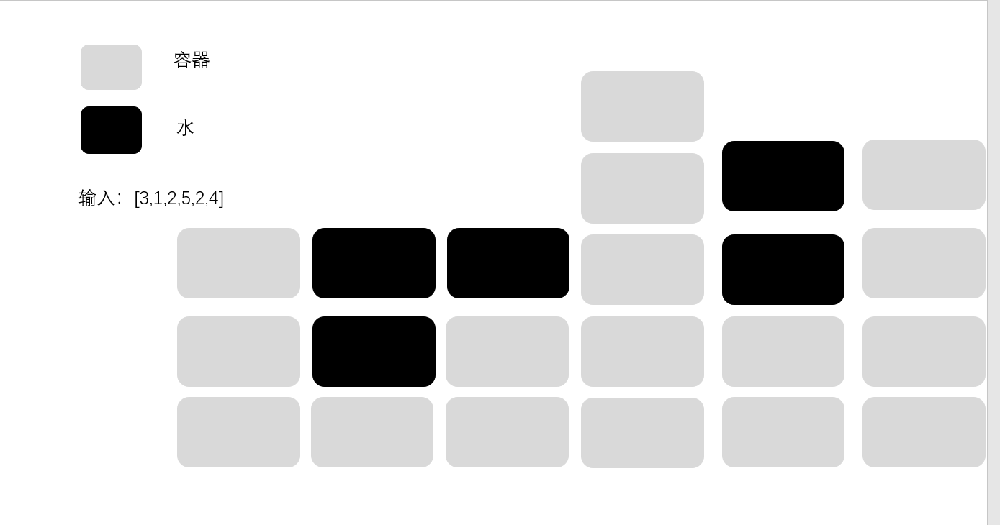

[TOC]


### [**:house:**](../../README.html)

#### [容器盛水问题](https://www.nowcoder.com/practice/31c1aed01b394f0b8b7734de0324e00f?tpId=196&tags=&title=&diffculty=0&judgeStatus=0&rp=1&tab=answerKey)

给定一个整形数组arr，已知其中所有的值都是非负的，将这个数组看作一个容器，请返回容器能装多少水。



```java
//时间复杂度O(N)
//空间复杂度O(1)
public long maxWater (int[] arr) {
        // write code here
        
        long res=0L;
        int left=0;
        int right=arr.length-1;
        
        while(left<right){
            
           int min= arr[left]<arr[right] ? arr[left]:arr[right];//求两边的最小值
            
            while(left<right && arr[left]<=min){
                
                res+=min-arr[left];//用短的边减去中间波谷的值
                left++;
            }
            while(left<right && arr[right]<=min){
                
                res+=min-arr[right];
                right--;
            }
        }
        
        return res;
        
        
    }
```

#### [剑指 Offer 57 - II. 和为s的连续正数序列](https://leetcode-cn.com/problems/he-wei-sde-lian-xu-zheng-shu-xu-lie-lcof/)

输入一个正整数 target ，输出所有和为 target 的连续正整数序列（至少含有两个数）。

序列内的数字由小到大排列，不同序列按照首个数字从小到大排列。

```java
//时间复杂度O(N)
//空间复杂度O(1)
算法流程：
初始化： 左边界 i = 1 ，右边界 j = 2，元素和 s = 3 ，结果列表 res ；

循环： 当i≥j 时跳出；

当 s > target时： 向右移动左边界i=i+1 ，并更新元素和 s ；
当 s < target时： 向右移动右边界j=j+1 ，并更新元素和 s ；
当 s = target 时： 记录连续整数序列，并向右移动左边界 i=i+1 ；
返回值： 返回结果列表 res；

public int[][] findContinuousSequence(int target) {
        int i = 1, j = 2, s = 3;
        List<int[]> res = new ArrayList<>();
        while(i < j) {
            if(s == target) {
                int[] ans = new int[j - i + 1];
                for(int k = i; k <= j; k++)
                    ans[k - i] = k;
                res.add(ans);
            }
            if(s >= target) {
                s -= i;
                i++;
            } else {
                j++;
                s += j;
            }
        }
        return res.toArray(new int[0][]);
    }
```

