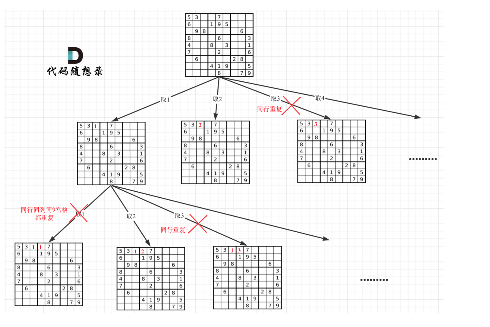

[TOC]


#### [77. 组合](https://leetcode.cn/problems/combinations/)

给定两个整数 n 和 k，返回范围 [1, n] 中所有可能的 k 个数的组合。

你可以按 **任何顺序** 返回答案。

**示例 1：**

```plain
输入：n = 4, k = 2
输出：
[
  [2,4],
  [3,4],
  [2,3],
  [1,2],
  [1,3],
  [1,4],
]
```

**示例 2：**

```plain
输入：n = 1, k = 1
输出：[[1]]
```

解答


```java
class Solution {
    List<List<Integer>> result = new ArrayList<>();
    List<Integer> path = new ArrayList<>();

    public List<List<Integer>> combine(int n, int k) {
        backtracking(n, k, 1);
        return result;

    }

    private void backtracking(int n, int k, int curIdx) {
        if (path.size() == k) {
            result.add(new ArrayList<>(path));
            return;
        }

        for (int i = curIdx; k - path.size() <= n - i + 1; i++) {
            path.add(i);
            backtracking(n, k, i + 1);
            path.remove(path.size() - 1);
        }
    }
}
```

#### [216. 组合总和 III](https://leetcode.cn/problems/combination-sum-iii/)

找出所有相加之和为 n 的 k 个数的组合，且满足下列条件：

- 只使用数字1到9
- 每个数字 **最多使用一次** 

返回 *所有可能的有效组合的列表* 。该列表不能包含相同的组合两次，组合可以以任何顺序返回。

**示例 1:**

```plain
输入: k = 3, n = 7
输出: [[1,2,4]]
解释:
1 + 2 + 4 = 7
没有其他符合的组合了。
```

**示例 2:**

```plain
输入: k = 3, n = 9
输出: [[1,2,6], [1,3,5], [2,3,4]]
解释:
1 + 2 + 6 = 9
1 + 3 + 5 = 9
2 + 3 + 4 = 9
没有其他符合的组合了。
```

解答

```java
class Solution {
    List<List<Integer>> result = new ArrayList<>();
    List<Integer> path = new ArrayList<>();

    public List<List<Integer>> combinationSum3(int k, int n) {
        backtracking(k, n, 1, 0);
        return result;

    }

    private void backtracking(int k, int n, int curIdx, int sum) {
        if (path.size() == k && sum == n) {
            result.add(new ArrayList<>(path));
            return;
        }

        for (int i = curIdx; k - path.size() <= 9 - i + 1; i++) {
            if (sum >= n) {
                break;
            }
            path.add(i);
            sum += i;
            backtracking(k, n, i + 1, sum);
            sum -= i;
            path.remove(path.size() - 1);

        }

    }
}
```

#### [17. 电话号码的字母组合](https://leetcode.cn/problems/letter-combinations-of-a-phone-number/)

给定一个仅包含数字 2-9 的字符串，返回所有它能表示的字母组合。答案可以按 **任意顺序** 返回。

给出数字到字母的映射如下（与电话按键相同）。注意 1 不对应任何字母。

**示例 1：**

```plain
输入：digits = "23"
输出：["ad","ae","af","bd","be","bf","cd","ce","cf"]
```

**示例 2：**

```plain
输入：digits = ""
输出：[]
```

**示例 3：**

```plain
输入：digits = "2"
输出：["a","b","c"]
```

解答

```java
class Solution {

    List<String> result = new ArrayList<>();
    StringBuilder path = new StringBuilder();
    public List<String> letterCombinations(String digits) {
        if (digits == null || digits.length() == 0) {
            return result;
        }
        String [] nums = {"","","abc","def","ghi","jkl","mno","pqrs","tuv","wxyz"};
        backtracking(digits,0,nums);
        return result;
    }

    private void backtracking(String digits, int count, String [] nums){
        if(count == digits.length()){
            result.add(new String(path));
            return;
        }

        String str = nums[digits.charAt(count) - '0'];
        for(int i = 0; i < str.length(); i++){
            path.append(str.charAt(i));
            backtracking(digits,count+1,nums);
            path.deleteCharAt(path.length() - 1);
        }

    }
}
```

#### [39. 组合总和](https://leetcode.cn/problems/combination-sum/)

给你一个 **无重复元素** 的整数数组 candidates 和一个目标整数 target ，找出 candidates 中可以使数字和为目标数 target 的 所有 **不同组合** ，并以列表形式返回。你可以按 **任意顺序** 返回这些组合。

candidates 中的 **同一个** 数字可以 **无限制重复被选取** 。如果至少一个数字的被选数量不同，则两种组合是不同的。 

对于给定的输入，保证和为 target 的不同组合数少于 150 个。

```java
class Solution {
    List<List<Integer>> result = new ArrayList<>();
    List<Integer> path = new ArrayList<>();

    public List<List<Integer>> combinationSum(int[] candidates, int target) {
        Arrays.sort(candidates);
        backtracking(candidates, target, 0, 0);
        return result;

    }

    private void backtracking(int[] candidates, int target, int sum, int curIdx) {
        if (sum == target) {
            result.add(new ArrayList<>(path));
        }
        for (int i = curIdx; i < candidates.length; i++) {
            if (sum + candidates[i] > target) {
                break;
            }
            if (i > 0 && candidates[i] == candidates[i - 1]) {
                continue;
            }
            path.add(candidates[i]);
            backtracking(candidates, target, sum + candidates[i], i);
            path.remove(path.size() - 1);

        }

    }
}
```

#### [40. 组合总和 II](https://leetcode.cn/problems/combination-sum-ii/)

给定一个候选人编号的集合 candidates 和一个目标数 target ，找出 candidates 中所有可以使数字和为 target 的组合。

candidates 中的每个数字在每个组合中只能使用 **一次** 。

**注意：**解集不能包含重复的组合。 

```java
class Solution {
    List<List<Integer>> result = new ArrayList<>();
    List<Integer> path = new ArrayList<>();

    public List<List<Integer>> combinationSum2(int[] candidates, int target) {
        Arrays.sort(candidates);
        backtracking(candidates, target, 0, 0);
        return result;

    }

    private void backtracking(int[] candidates, int target, int sum, int curIdx) {
        if (target == sum) {
            result.add(new ArrayList<>(path));
        }
        for (int i = curIdx; i < candidates.length; i++) {
            if (sum + candidates[i] > target) {
                break;
            }
            if (i > curIdx && candidates[i] == candidates[i - 1]) {
                continue;
            }
            path.add(candidates[i]);
            backtracking(candidates, target, sum + candidates[i], i + 1);
            path.remove(path.size() - 1);
        }

    }
}
```


#### [131. 分割回文串](https://leetcode.cn/problems/palindrome-partitioning/)

给你一个字符串 s，请你将 s 分割成一些子串，使每个子串都是 **回文串**。返回 s 所有可能的分割方案。

**示例 1：**

```plain
输入：s = "aab"
输出：[["a","a","b"],["aa","b"]]
```

**示例 2：**

```plain
输入：s = "a"
输出：[["a"]]
```


```java
class Solution {
    List<List<String>> result = new ArrayList<>();
    List<String> path = new ArrayList<>();

    public List<List<String>> partition(String s) {
        backtracking(s, 0);
        return result;

    }

    private void backtracking(String s, int starIdx) {
        if (starIdx >= s.length()) {
            result.add(new ArrayList<>(path));
        }

        for (int i = starIdx; i < s.length(); i++) {
            if (isPalindrome(s, starIdx, i)) {
                path.add(s.substring(starIdx, i + 1));
            } else {
                continue;
            }
            backtracking(s, i + 1);
            path.remove(path.size() - 1);

        }

    }

    private boolean isPalindrome(String s, int start, int end) {

        while (start < end) {
            if (s.charAt(start) != s.charAt(end)) {
                return false;
            }
            start++;
            end--;
        }
        return true;
    }
}
```

#### [93. 复原 IP 地址](https://leetcode.cn/problems/restore-ip-addresses/)

**有效 IP 地址** 正好由四个整数（每个整数位于 0 到 255 之间组成，且不能含有前导 0），整数之间用 '.' 分隔。

- 例如："0.1.2.201" 和 "192.168.1.1" 是 **有效** IP 地址，但是 "0.011.255.245"、"192.168.1.312" 和 "192.168@1.1" 是 **无效** IP 地址。

给定一个只包含数字的字符串 s ，用以表示一个 IP 地址，返回所有可能的**有效 IP 地址**，这些地址可以通过在 s 中插入 '.' 来形成。你 **不能** 重新排序或删除 s 中的任何数字。你可以按 **任何** 顺序返回答案。


**示例 1：**

```plain
输入：s = "25525511135"
输出：["255.255.11.135","255.255.111.35"]
```

**示例 2：**

```plain
输入：s = "0000"
输出：["0.0.0.0"]
```

**示例 3：**

```plain
输入：s = "101023"
输出：["1.0.10.23","1.0.102.3","10.1.0.23","10.10.2.3","101.0.2.3"]
```

解答

```java
class Solution {
    List<String> result = new ArrayList<>();
    List<String> path = new ArrayList<>();

    public List<String> restoreIpAddresses(String s) {
        backtracking(s, 0);
        return result;

    }

    private void backtracking(String s, int starIdx) {
        if (starIdx >= s.length()) {
            if (path.size() == 4) {
                StringBuilder sb = new StringBuilder();
                for (int i = 0; i < 3; i++) {
                    sb.append(path.get(i)).append(".");
                }
                sb.append(path.get(3));
                result.add(new String(sb));
            }
            return;
        }

        for (int i = starIdx; i < s.length(); i++) {
            if (!isMatch(s, starIdx, i)) {
                break;
            }
            path.add(s.substring(starIdx, i + 1));
            backtracking(s, i + 1);
            path.remove(path.size() - 1);

        }
    }

    private boolean isMatch(String s, int start, int end) {
        if (start > end) {
            return false;
        }

        if (s.charAt(start) == '0' && start != end) {
            return false;
        }
        int nums = 0;

        for (int i = start; i <= end; i++) {
            if (s.charAt(i) > '9' || s.charAt(i) < '0') {
                return false;
            }
            int num = s.charAt(i) - '0';
            nums = nums * 10 + num;
            if (nums > 255) {
                return false;
            }
        }
        return true;

    }
}
```

#### [78. 子集](https://leetcode.cn/problems/subsets/)

给你一个整数数组 nums ，数组中的元素 **互不相同** 。返回该数组所有可能的子集（幂集）。

解集 **不能** 包含重复的子集。你可以按 **任意顺序** 返回解集。

**示例 1：**

```plain
输入：nums = [1,2,3]
输出：[[],[1],[2],[1,2],[3],[1,3],[2,3],[1,2,3]]
```

**示例 2：**

```plain
输入：nums = [0]
输出：[[],[0]]
```


```java
class Solution {

    List<List<Integer>> result = new ArrayList<>();
    List<Integer> path = new ArrayList<>();

    public List<List<Integer>> subsets(int[] nums) {
        backtracking(nums, 0);
        return result;

    }

    private void backtracking(int[] nums, int startIdx) {
        result.add(new ArrayList<>(path));
        for (int i = startIdx; i < nums.length; i++) {
            path.add(nums[i]);
            backtracking(nums, i + 1);
            path.remove(path.size() - 1);
        }

    }
}
```

#### [90. 子集 II](https://leetcode.cn/problems/subsets-ii/)

给你一个整数数组 `nums` ，其中可能包含重复元素，请你返回该数组所有可能的 子集（幂集）。

解集 **不能** 包含重复的子集。返回的解集中，子集可以按 **任意顺序** 排列。

**示例 1：**

```
输入：nums = [1,2,2]
输出：[[],[1],[1,2],[1,2,2],[2],[2,2]]
```

**示例 2：**

```
输入：nums = [0]
输出：[[],[0]]
```

```java
class Solution {
    List<List<Integer>> result = new ArrayList<>();
    List<Integer> path = new ArrayList<>();

    public List<List<Integer>> subsetsWithDup(int[] nums) {
        Arrays.sort(nums);
        tracebacking(nums, 0);
        return result;

    }

    private void tracebacking(int[] nums, int curIdx) {

        result.add(new ArrayList<>(path));

        for (int i = curIdx; i < nums.length; i++) {
            if (i > curIdx && nums[i] == nums[i - 1]) {
                continue;
            }
            path.add(nums[i]);
            tracebacking(nums, i + 1);
            path.remove(path.size() - 1);

        }

    }

}
```

#### [491. 非递减子序列](https://leetcode.cn/problems/non-decreasing-subsequences/)

给你一个整数数组 `nums` ，找出并返回所有该数组中不同的递增子序列，递增子序列中 **至少有两个元素** 。你可以按 **任意顺序** 返回答案。

数组中可能含有重复元素，如出现两个整数相等，也可以视作递增序列的一种特殊情况。

**示例 1：**

```
输入：nums = [4,6,7,7]
输出：[[4,6],[4,6,7],[4,6,7,7],[4,7],[4,7,7],[6,7],[6,7,7],[7,7]]
```

**示例 2：**

```
输入：nums = [4,4,3,2,1]
输出：[[4,4]]
```

```java
class Solution {
    List<List<Integer>> result = new ArrayList<>();
    List<Integer> path = new ArrayList<>();

    public List<List<Integer>> findSubsequences(int[] nums) {
        backtracking(nums, 0);
        return result;

    }

    private void backtracking(int[] nums, int curIdx) {
        if (path.size() > 1) {
            result.add(new ArrayList<>(path));
        }

        HashSet<Integer> hs = new HashSet<>();

        for (int i = curIdx; i < nums.length; i++) {
            if (hs.contains(nums[i])) {
                continue;
            }
            if (path.size() == 0 || path.get(path.size() - 1) <= nums[i]) {
                hs.add(nums[i]);
                path.add(nums[i]);
                backtracking(nums, i + 1);
                path.remove(path.size() - 1);
            }
        }

    }
}
```

#### [46. 全排列](https://leetcode.cn/problems/permutations/)

给定一个不含重复数字的数组 `nums` ，返回其 *所有可能的全排列* 。你可以 **按任意顺序** 返回答案。

**示例 1：**

```
输入：nums = [1,2,3]
输出：[[1,2,3],[1,3,2],[2,1,3],[2,3,1],[3,1,2],[3,2,1]]
```

**示例 2：**

```
输入：nums = [0,1]
输出：[[0,1],[1,0]]
```

**示例 3：**

```
输入：nums = [1]
输出：[[1]]
```

```java
class Solution {

    List<List<Integer>> result = new ArrayList<>();
    List<Integer> path = new ArrayList<>();
    boolean[] used;
    public List<List<Integer>> permute(int[] nums) {
        used = new boolean[nums.length];
        backtracking(nums);
        return result;

    }

    private void backtracking(int[] nums) {
        if (path.size() == nums.length) {
            result.add(new ArrayList<>(path));
            return;
        }

        for (int i = 0; i < nums.length; i++) {
            if(used[i]){
                continue;
            }
            path.add(nums[i]);
            used[i] = true;
            backtracking(nums);
            path.remove(path.size() - 1);
            used[i] = false;
        }
    }
}
```

#### [47. 全排列 II](https://leetcode.cn/problems/permutations-ii/)

给定一个可包含重复数字的序列 `nums` ，***按任意顺序*** 返回所有不重复的全排列。

**示例 1：**

```
输入：nums = [1,1,2]
输出：
[[1,1,2],
 [1,2,1],
 [2,1,1]]
```

**示例 2：**

```
输入：nums = [1,2,3]
输出：[[1,2,3],[1,3,2],[2,1,3],[2,3,1],[3,1,2],[3,2,1]]
```

```java
class Solution {
    List<List<Integer>> result = new ArrayList<>();
    List<Integer> path = new ArrayList<>();
    boolean[] used;

    public List<List<Integer>> permuteUnique(int[] nums) {
        used = new boolean[nums.length];
        Arrays.sort(nums);
        backtracking(nums);
        return result;

    }

    private void backtracking(int[] nums) {
        if (path.size() == nums.length) {
            result.add(new ArrayList<>(path));
            return;
        }

        for (int i = 0; i < nums.length; i++) {
            if (i > 0 && nums[i] == nums[i - 1] && !used[i - 1] || used[i]) {
                continue;
            }
            path.add(nums[i]);
            used[i] = true;
            backtracking(nums);
            path.remove(path.size() - 1);
            used[i] = false;
        }

    }
}
```

#### [37. 解数独](https://leetcode.cn/problems/sudoku-solver/)

编写一个程序，通过填充空格来解决数独问题。

数独的解法需 **遵循如下规则**：

1. 数字 `1-9` 在每一行只能出现一次。
2. 数字 `1-9` 在每一列只能出现一次。
3. 数字 `1-9` 在每一个以粗实线分隔的 `3x3` 宫内只能出现一次。（请参考示例图）

数独部分空格内已填入了数字，空白格用 `'.'` 表示。



```java
class Solution {
    public void solveSudoku(char[][] board) {
        backtracking(board, 0 );

    }

    public boolean backtracking(char[][] board) {

        for (int row = 0; row < 9; row++) {
            for (int col = 0; col < 9; col++) {
                if (board[row][col] != '.') {
                    continue;
                }
                for (char c = '1'; c <= '9'; c++) {

                    if (isValid(board, row, col, c)) {
                        board[row][col] = c;
                        if (backtracking(board)) {
                            return true;
                        }
                        board[row][col] = '.';
                    }
                }
                return false;

            }
        }
        return true;

    }

    private boolean isValid(char[][] board, int row, int col, char c) {
        for (int i = 0; i < 9; i++) {
            if (board[i][col] == c) {
                return false;
            }
        }
        for (int i = 0; i < 9; i++) {
            if (board[row][i] == c) {
                return false;
            }
        }
        int startRow = (row / 3) * 3;
        int startCol = (col / 3) * 3;

        for (int i = startRow; i < startRow + 3; i++) {
            for (int j = startCol; j < startCol + 3; j++) {
                if (board[i][j] == c) {
                    return false;
                }
            }
        }
        return true;
    }

}
```

