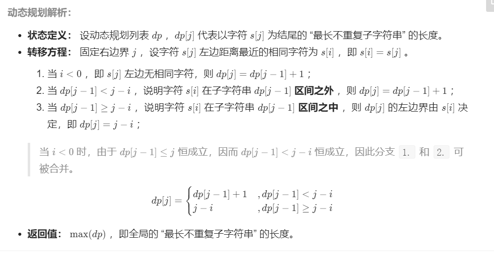
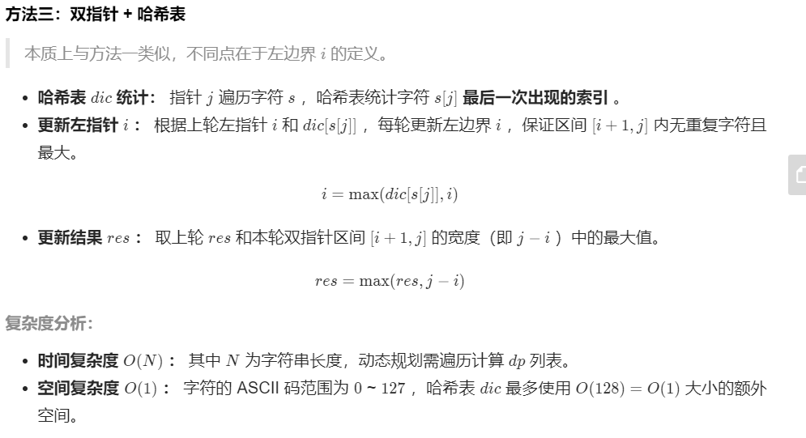
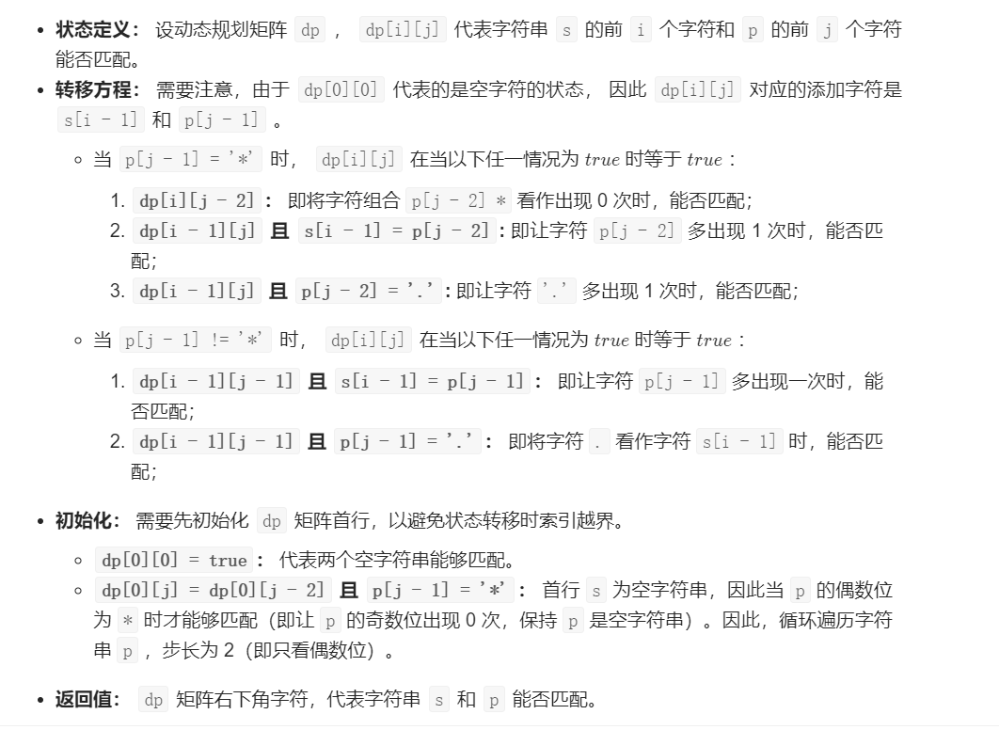

[TOC]


### [**:house:**](../../README.html)

#### StringBuffer常用方法

```java
//StringBuffer的构造方法：

public StringBuffer()://无参构造方法
public StringBuffer(int capacity)://指定容量的字符串缓冲区对象
public StringBuffer(String str)://指定字符串内容的字符串缓冲区对象
//StringBuffer的方法：

public int capacity()//：返回当前容量。 理论值(初始化默认容量是16)
public int length()//:返回长度（字符数）。 实际值
//添加功能
public StringBuffer append(String str)//可以把任意类型数据添加到字符串缓冲区里面,并返回字符串缓冲区本身
public StringBuffer insert(int offset,String str)//在指定位置把任意类型的数据插入到字符串缓冲区里面,并返回字符串缓冲区本身
//删除功能
public StringBuffer deleteCharAt(int index)//删除指定位置的字符，并返回本身
public StringBuffer delete(int start,int end)//删除从指定位置开始指定位置结束的内容，并返回本身
//替换功能
public StringBuffer replace(int start,int end,String str)//从start开始到end用str替换
//反转功能
public StringBuffer reverse()
//
public String substring(int start)
public String substring(int start,int end)
```

#### String常用方法

```java
//1、string对象不可变，被final修饰，不能被继承。
//2、赋值方式：
//直接赋值。比如： 
String name = "rick";//直接赋值
String name = new String("rick");//使用new关键字创建
//3、常用构造方法：
public String();   //无参构造方法，用来创建空字符串的String对象。
public String(String original);   //用已知的字符串original创建一个String对象。
public String(char value[]);  //用字符数组value创建一个String对象。
public String(char value[], int offset, int count);   //用字符数组value的offset开始的count个字符创建一个String对象。
public String(byte bytes[]);     //用字节数组bytes创建一个String对象。
public String(byte bytes[], String charsetName);  //根据指定编码格式charsetName，用字节数组bytes创建一个String对象。
public String(byte bytes[], int offset, int length, String charsetName);   //根据指定编码格式charsetName，用字节数组bytes的offset开始的length个字符创建一个String对象。

//4、常用方法：
public int length() ;  //返回该字符串的长度。
public boolean isEmpty() ;   //判断字符串是否为空。
public char charAt(int index) ;   //返回字符串中指定位置的字符；字符串范围为 0 ~ length()-1。
public byte[] getBytes(String charsetName);  //根据指定编码格式charsetName，将字符串转为字节数组。　　
public boolean equals(Object anObject);  //用于比较两个字符串内容是否相同。相同返回true，不同返回false。
public boolean equalsIgnoreCase(String anotherString);  //与equals比较类似，但忽略大小写。
public int compareTo(String anotherString);   //按字典顺序逐个字符进行比较，返回的数即为字符间的差距（大小关系）。若字符大于anotherString的字符，则返回正数，小于则返回负数，等于则返回0。
public int compareToIgnoreCase(String str);  //与compareTo类似，但忽略大小写。
public boolean startsWith(String prefix);    //判断字符串是否以指定字符串prefix开头。
public boolean endsWith(String suffix); //判断字符串是否以指定字符串suffix结尾。
public int hashCode();  //用于返回字符串的哈希码。
public boolean contains(CharSequence s);   //判断当前字符串是否包含 给定的子字符串s。
public String concat(String str) ;   //用于字符串的拼接。等价于 符号 “+”。
public String 
();  //用于去除字符串首尾两端的空格。
public String toLowerCase();  //将字符串全转成小写字符串。
public String toUpperCase();  //将字符串全转为大写字符串。
public char[] toCharArray() ;  //将字符串转为字符数组。
public String substring(int beginIndex);  //从当前字符串中的beginIndex位置起，取出剩余的字符作为一个新的字符串返回。
public String substring(int beginIndex, int endIndex);  //从当前字符串中的beginIndex位置起，取出到endIndex-1位置的字符作为一个新的字符串返回。
public String replace(char oldChar, char newChar)；   //用字符newChar替换当前字符串中所有的oldChar字符，并返回一个新的字符串。
public String replaceAll(String regex, String replacement);//将字符串中符合regex格式的子串替换成replacement，此时并未改变原始字符串。
public String[] split(String regex); //将字符串使用regex标记分割，并将分割后的单词存入字符串数组中。
public boolean matches(String regex);  //判断当前字符串对象是否与参数regex格式相匹配。
String.valueOf(boolean b) // 将 boolean 变量 b 转换成字符串 
String.valueOf(char c) // 将 char 变量 c 转换成字符串 
String.valueOf(char[] data) //将 char 数组 data 转换成字符串 
String.valueOf(char[] data, int offset, int count) // 将 char 数组 data 中 由 data[offset] 开始取 count 个元素 转换成字符串 
String.valueOf(double d) // 将 double 变量 d 转换成字符串 ，科学计数法
String.valueOf(float f) //将 float 变量 f 转换成字符串 
String.valueOf(int i) //将 int 变量 i 转换成字符串 
String.valueOf(long l) //将 long 变量 l 转换成字符串 
String.valueOf(Object obj) //将 obj 对象转换成 字符串, 等于 obj.toString() 
```

#### StringBuffer常用方法

```java
//1、当频繁修改字符串时，需要使用 StringBuffer 和 StringBuilder 类。与String 类不同的是，StringBuffer 和 StringBuilder 类的对象能够被多次的修改，并且不产生新的未使用对象。
//StringBuffer与StringBuilder大体上相似，只是StringBuffer属于线程安全的。对于单线程的程序，推荐使用StringBuilder。
//3、常用构造方法：（以StringBuffer为例）
public StringBuffer();  //默认构造一个不带字符的字符串缓冲区，初始容量为16个字符。
public StringBuffer(String str);  //构造一个str.length() + 16的字符串缓冲区。
//4、常用方法：（以StringBuffer为例）
//（1）追加：
public synchronized StringBuffer append(Object obj);   //将对象追加到字符串的末尾。
//（2）插入：
public StringBuffer insert(int dstOffset, CharSequence s) ; //将字符串s插入到指定位置 dstOffset。字符串范围为 0 ~ length()-1。 
//（3）删除：
public synchronized StringBuffer delete(int start, int end);  //删除start ~ end-1 范围的字符。
public synchronized StringBuffer deleteCharAt(int index);  //删除指定位置的字符。
//（4）替换：
public synchronized StringBuffer replace(int start, int end, String str);   //用给定 String 中的字符替换此序列（start ~ end-1）的子字符串中的字符。
public synchronized void setCharAt(int index, char ch);  //用给定的字符ch，替换指定位置的字符。
public synchronized void setLength(int newLength);  // 将给定的字符串，裁剪成指定长度。
//（5）获取子串：
　public synchronized String substring(int start);    //返回从start位置开始 的所有字符。
　public synchronized String substring(int start, int end);   //返回 start ~ end-1 位置的所有字符。
//（6）字符串反转：
public synchronized StringBuffer reverse();   //将字符串倒序输出。
//（7）查找：
public int indexOf(String str);   //正序查找（从前往后找），返回指定子字符串在此字符串第一次出现的索引，若没有，则返回-1。
public synchronized int indexOf(String str, int fromIndex); //从 fromIndex 位置开始查找。返回指定子字符串在此字符串第一次出现的索引，若没有，则返回-1。
public int lastIndexOf(String str); //倒序查找（从后往前找）返回指定子字符串在此字符串第一次出现的索引，若没有，则返回-1。
public synchronized int lastIndexOf(String str, int fromIndex) ;  //从 fromIndex 位置开始查找。返回指定子字符串在此字符串第一次出现的索引，若没有，则返回-1。
```


#### [1.找到字符串的最长无重复字符子串](https://leetcode-cn.com/problems/zui-chang-bu-han-zhong-fu-zi-fu-de-zi-zi-fu-chuan-lcof/solution/mian-shi-ti-48-zui-chang-bu-han-zhong-fu-zi-fu-d-9/)

给定一个数组arr，返回arr的最长无重复子串的长度(无重复指的是所有数字都不相同)。



```java
//时间复杂度：O(N)  其中N为字符串长度，动态规划需要遍历计算dp列表。
//空间复杂度O(1) 数字的范围为0-9，最多使用O(10)=O(1)大小的额外空间。
public int maxLength (int[] arr) {
        // write code here
        int temp=0;int res=0;
        HashMap<Integer,Integer> map=new HashMap<Integer,Integer>();
        for(int j=0;j<arr.length;j++){
            
            int i=map.getOrDefault(arr[j],-1);//看map中是否有重复元素，如果有，就找出坐标，如果没有坐标为-1
            map.put(arr[j],j);
            temp=temp<j-i?temp+1:j-i;
            res=Math.max(res,temp);
        }
        
        return res;
    }
```



```java
public int maxLength (int[] arr) {
        // write code here
        int i=-1;int res=0;
        HashMap<Integer,Integer> map=new HashMap<Integer,Integer>();
        for(int j=0;j<arr.length;j++){
            
           if(map.containsKey(arr[j]))
                i=Math.max(i,map.get(arr[j]));//确保i，j之间没有重复
            map.put(arr[j],j);
            res=Math.max(res,j-i);
        }
        
        return res;
    }
```

#### [2.大数加法](https://leetcode-cn.com/problems/add-strings/)

给定两个字符串形式的非负整数 `num1` 和`num2` ，计算它们的和。

```java
 //时间复杂度O(max{M,N})
//空间复杂度O(n)
public String solve (String s, String t) {
        // write code here
        StringBuilder sb=new StringBuilder();
        
        int i=s.length()-1;
        int j=t.length()-1;
        int carry=0;
        
        while(i>=0 || j>=0 || carry!=0){
            
            int sn = i < 0 ? 0 : s.charAt(i--)-'0';
            int tn = j < 0 ? 0 : t.charAt(j--)-'0';
            
            int sum=sn+tn+carry;
            
            if(sum>=10){
                
                sum=sum%10;
                carry=1;
            }else{
                carry=0;
            }
            sb.append(sum);
            
        }
        return sb.reverse().toString();
    }
```

#### [3.最长公共子串](https://www.nowcoder.com/practice/f33f5adc55f444baa0e0ca87ad8a6aac?tpId=196&tqId=37132&rp=1&ru=%2Factivity%2Foj&qru=%2Fta%2Fjob-code-total%2Fquestion-ranking&tab=answerKey)

给定两个字符串str1和str2,输出两个字符串的最长公共子串

题目保证str1和str2的最长公共子串存在且唯一。

```java
//思路：dp[i][j]表示以i-1为结尾的最长公共子串
//使用动态规划
//时间复杂度O(MN) 空间复杂度O(MN)
public String LCS (String str1, String str2) {
        // write code here
        int m=str1.length();
        int n=str2.length();
        int max=0; int end=0;
        int [][]dp=new int[m+1][n+1];
        for(int i=1;i<=m;i++){
            char c1=str1.charAt(i-1);
            for(int j=1;j<=n;j++){
                char c2=str2.charAt(j-1);
                if(c1==c2) dp[i][j]=dp[i-1][j-1]+1;//如果相等的话，就前面的加1
                else{
                    
                   dp[i][j]=0;//不相等的话就说明没有公共子串
                }
                
                if(dp[i][j]>max){//找最长的
                    
                    max=dp[i][j];
                    end=i-1;
                }
              
            }
        }
        
        return str1.substring(end-max+1,end+1);
        
       
    }
```

#### [4. 反转字符串](https://leetcode-cn.com/problems/reverse-string/)

写出一个程序，接受一个字符串，然后输出该字符串反转后的字符串。（字符串长度不超过1000）

```java
//时间复杂度O(N) 空间复杂度O(N)
public String solve (String str) {
        // write code here
        
        StringBuilder res=new StringBuilder();
        for(int i=str.length()-1;i>=0;i--){
            
            res.append(str.charAt(i));
        }
        
        return res.toString();
            
            
    }
```

#### [344. 反转字符串](https://leetcode.cn/problems/reverse-string/)

编写一个函数，其作用是将输入的字符串反转过来。输入字符串以字符数组 `s` 的形式给出。

不要给另外的数组分配额外的空间，你必须**[原地](https://baike.baidu.com/item/原地算法)修改输入数组**、使用 O(1) 的额外空间解决这一问题。

```java
class Solution {
    public void reverseString(char[] s) {

        int left = 0;
        int right = s.length - 1;

        while(left < right){
            char temp = s[left];
            s[left] = s[right];
            s[right] = temp;
            left++;
            right--;
        }

    }
}
```

#### [541. 反转字符串 II](https://leetcode.cn/problems/reverse-string-ii/)

给定一个字符串 `s` 和一个整数 `k`，从字符串开头算起，每计数至 `2k` 个字符，就反转这 `2k` 字符中的前 `k` 个字符。

- 如果剩余字符少于 `k` 个，则将剩余字符全部反转。
- 如果剩余字符小于 `2k` 但大于或等于 `k` 个，则反转前 `k` 个字符，其余字符保持原样。

```java
class Solution {
    public String reverseStr(String s, int k) {
        char[] ch = s.toCharArray();
        for(int i = 0; i < ch.length; i += 2* k){
            if(i + k > ch.length){
                reverse(ch, i, ch.length-1);
            }else{
                 reverse(ch, i, i + k - 1);
            }            
      }
        return new String(ch);

    }

    private void reverse(char[] ch, int start, int end){
        while(start < end){
            char temp = ch[start];
            ch[start] = ch[end];
            ch[end] = temp;
            start++;
            end--;
        }
    }
}
```


#### [5.最长回文子串](https://leetcode-cn.com/problems/longest-palindromic-substring/)

对于一个字符串，请设计一个高效算法，计算其中最长回文子串的长度。

给定字符串**A**以及它的长度**n**，请返回最长回文子串的长度。

输入："abc1234321ab",12

输出：7

使用马拉车算法(https://segmentfault.com/a/1190000008484167)

```java
public int getLongestPalindrome(String A, int n) {
        // write code here
        
        return  Manacher(A,n);
    }
    
    public int Manacher(String A,int n){
        int len= 2*n+3;
        char[] newchar=new char[len];
        newchar[0]='$';
        newchar[1]='#';
        int j=2;
        for(int i=0;i<A.length();i++){
            
            newchar[j++]=A.charAt(i);
            newchar[j++]='#';
            
        }
        newchar[j]='^';//往字符串中加上#  如“abcbc”变为“$#a#b#c#b#c#^”
       
        int []dp=new int[len];//dp[i]表示位于i的最大回文半径 如#a#b#a#中b的回文半径为4，真实的回文串为4-1=3
        int max=0;
        int id=0;
        int maxlen=0;
        for(int i=1;i<len-1;i++){
            
            
            if(i<max){
                
                dp[i]=Math.min(max-i,dp[2*id-i]);//初始化回文半径
            }else{
                
                dp[i]=1;
            }
            
            while(newchar[i+dp[i]]== newchar[i-dp[i]]){
                
                dp[i]=dp[i]+1;
            }
            
            if(i+dp[i]>max){//更新max
                
                max=i+dp[i];
                id=i;
            }
            
            maxlen=Math.max(maxlen,dp[i]-1);
            
        }
            
            return maxlen;
        
        
        
    }
```

#### [6.判断回文字符串](https://leetcode-cn.com/problems/valid-palindrome/submissions/)

给定一个字符串，验证它是否是回文串，只考虑字母和数字字符，可以忽略字母的大小写。

**说明：**本题中，我们将空字符串定义为有效的回文串。

```java
//使用双指针
//时间复杂度O(N)
//空间复杂度O(1)
public boolean isPalindrome(String s) {

        int i=0;
        int j=s.length()-1;
        
       
        while(i<=j){

            while(i<=j && !Character.isLetterOrDigit(s.charAt(i))){

                i++;
            }
            while(i<=j && !Character.isLetterOrDigit(s.charAt(j))){

                j--;
            }
            if(Character.isLetterOrDigit(s.charAt(j)) && Character.isLetterOrDigit(s.charAt(i))){

                if(Character.toLowerCase(s.charAt(i))!=Character.toLowerCase(s.charAt(j))) return false;
                i++;
                j--;


            }
        
        
        
        }

        return true;
    }
}
```

#### [6.字符串的排列](https://leetcode-cn.com/problems/zi-fu-chuan-de-pai-lie-lcof/)

输入一个字符串，打印出该字符串中字符的所有排列。

你可以以任意顺序返回这个字符串数组，但里面不能有重复元素。

- 回溯法

```java
//时间复杂度：O(N!N) N为字符串长度，时间复杂度和字符串排列的方案成线性关系，方案数为N!,字符串拼接操作join()使用O(N)
//空间复杂度:O(N^2)排列的递归深度为 N ，系统累计使用栈空间大小为 O(N) ；递归中辅助 Set 累计存储的字符数量最多为 N + (N-1) + ... + 2 + 1 = (N+1)N/2，即占用 O(N^2) 的额外空间。
 	char[] c;
    HashSet<String> res;//使用hashset进行去重
    public String[] permutation(String s) {

        c = s.toCharArray();
        StringBuilder sb = new StringBuilder();
        boolean []used = new boolean[c.length];
        res = new HashSet<>();
        dfs(c,0,used,sb);
        return res.toArray(new String[0]);

    }

    public void dfs(char[] c,int depth,boolean[] used,StringBuilder sb){

        if(depth == c.length){

            res.add(new String(sb));
            return;
        }

        for(int i = 0; i < c.length;i++){

            if(used[i]){//如果之前已经用过，就进行接下来的循环

                continue;
            }

            sb.append(String.valueOf(c[i]));
            used[i] = true;
            dfs(c,depth+1,used,sb);
            sb.deleteCharAt(sb.length()-1);
            used[i] = false;

        }
    }
```

- 字典序法 https://blog.nowcoder.net/n/dfd91d416f064002b8b05e89953d5b92

  简单的讲：
  1、从右向左找到第一个正序对（array[i] < array[i+1]，因为没有等号，所以可以完美去掉重复的排列）
  2、从i开始向右搜索，找到比array[i]大的字符中最小的那个，记为array[j]
  3、交换array[i]和array[j]
  4、将i后面的字符反转
  这就得到了字典序的下一个排列。

  ```java
   //时间复杂度O(N!N);每生成一个当前排列的下一个排列，复杂度为O(N);
  
  public String[] permutation(String s) {
  
         List<String> res = new LinkedList<>();
         if(s.length()==0) return  res.toArray(new String[res.size()]);;
         char[] c = s.toCharArray();
         Arrays.sort(c);
         String str=new String(c);
         res.add(str);
         while(true){
  
             str=nextString(str);
             if(!str.equals("Finish")){
                    
                    res.add(str);
                    
             }else{
                 break;
             }
         }
         return  res.toArray(new String[res.size()]);
  
      }
      public String nextString (String s) {
          char []array=s.toCharArray();
          int i=s.length()-2;
          for(;i>=0 && array[i]>array[i+1];i--);/
              
          if(i==-1) return "Finish";
          
          int j=s.length()-1;
          for(;array[j]<array[i];j--);//因为i后面的是按照降序排的
  
          char temp=array[i];
          array[i]=array[j];
          array[j]=temp;
  
          int a=i+1;
          int b=s.length()-1;
          while(a<=b){
              temp=array[a];
              array[a]=array[b];
              array[b]=temp;
              a++;
              b--;
          }
  
          return new String(array);
          
      }
  
  ```

  #### [7.表达式求值](https://leetcode-cn.com/problems/evaluate-reverse-polish-notation/)

分为两步: 由中缀表达式转为后缀表达式：从左到右遍历中缀表达式的每个数字和符号，如果是数字，就输出，即成为后缀表达式的一部分，如果是符号，则判断与栈顶元素的优先级（右括号>乘除>加减>左括号），是右括号或者优先级小于等于栈顶符号，则栈顶元素依次出栈并输出，并将该符号出栈，一直到最终输出后缀表达式为止。

由后缀表达求值：遍历字符串，如果是数字就入栈，如果是符号，就将栈顶两个元素拿出计算然后入栈。

```java
//中缀表达式转后缀表达式
//逆波兰表达式求值
//tokens 为后缀表达式
public int evalRPN(String[] tokens) {

       Stack<Integer> st=new Stack<Integer>();
       int num1=0;
       int num2=0;
       int num=0;

       for(String s:tokens){

           switch(s){

               case "+":

               num1=st.pop();
               num2=st.pop();
               num=num1+num2;
               st.push(num);
               break;
               case "-":
                num1=st.pop();
                num2=st.pop();
                num=num2-num1;
                st.push(num);

               break;
               
               case "*":
                num1=st.pop();
                num2=st.pop();
                num=num2*num1;
                st.push(num);
               break;
               case "/":
                num1=st.pop();
                num2=st.pop();
                num=num2/num1;
                st.push(num);

               break;
               default:
                 st.push(Integer.parseInt(s));

            
               
           }
       }
       return st.pop();


    }
```

#### [8.计算器](https://leetcode-cn.com/problems/basic-calculator-ii/)

给你一个字符串表达式 `s` ，请你实现一个基本计算器来计算并返回它的值。

整数除法仅保留整数部分。

```java
//时间复杂度O(N) 空间复杂度O(N)
 //由于乘除优先于加减计算，因此不妨考虑先进行所有乘除运算，并将这些乘除运算后的整数值放回原表达式的相应位置，则随后整个表达式的值，就等于一系列整数加减后的值。
//基于此，我们可以用一个栈，保存这些（进行乘除运算后的）整数的值。对于加减号后的数字，将其直接压入栈中；对于乘除号后的数字，可以直接与栈顶元素计算，并替换栈顶元素为计算后的结果。
//具体来说，遍历字符串 s，并用变量preSign 记录每个数字之前的运算符，对于第一个数字，其之前的运算符视为加号。每次遍历到数字末尾时，根据 preSign 来决定计算方式：
//加号：将数字压入栈；
//减号：将数字的相反数压入栈；
//乘除号：计算数字与栈顶元素，并将栈顶元素替换为计算结果。
//代码实现中，若读到一个运算符，或者遍历到字符串末尾，即认为是遍历到了数字末尾。处理完该数字后，更新 preSign 为当前遍历的字符。

//遍历完字符串 s 后，将栈中元素累加，即为该字符串表达式的值。


public int calculate(String s) {

        Stack<Integer> st=new Stack<>();
        int num=0;
        char presign ='+';
    
        for(int i=0;i<s.length();i++){

            if(Character.isDigit(s.charAt(i))){

                num=num*10+(s.charAt(i)-'0');
            }

            if((!Character.isDigit(s.charAt(i)) && s.charAt(i)!=' ')|| i==s.length()-1 ){

                switch(presign){

                    case '+':
                       st.push(num);
                    break;
                    case '-':
                     st.push(-num);
                    break;
                    case '*':
                    st.push(st.pop()*num);
                    break;
                    case '/':
                     st.push(st.pop()/num);
                    break;
                    default:
                }

                presign=s.charAt(i);
                num=0;
            }
        }
        while(!st.isEmpty()){

            num+=st.pop();
        }

        return num;


    }
```

#### [剑指 Offer 50. 第一个只出现一次的字符](https://leetcode-cn.com/problems/di-yi-ge-zhi-chu-xian-yi-ci-de-zi-fu-lcof/)

在字符串 s 中找出第一个只出现一次的字符。如果没有，返回一个单空格。 s 只包含小写字母。

```java
//遍历字符串，使用一个map存放字符出现的个数，最后遍历map找到第一个个数为1的字符
//时间复杂度O(N)
//空间复杂度O(∣Σ∣)，其中 Σ 是字符集，在本题中 ss 只包含小写字母，因此 ∣Σ∣≤26。我们需要 O(∣Σ∣) 的空间存储哈希映射。

public char firstUniqChar(String s) {

        HashMap<Character,Integer> map = new HashMap<Character,Integer>();
        for(int i = 0;i < s.length();i++){
           
            char ch = s.charAt(i);
            map.put(ch,map.getOrDefault(ch,0) + 1);
            
        }

        for(int i = 0; i < s.length();i++){

            if(map.get(s.charAt(i)) == 1){

                return s.charAt(i);
            }
        }

        return ' ';

    }
```

#### [剑指 Offer 58 - II. 左旋转字符串](https://leetcode-cn.com/problems/zuo-xuan-zhuan-zi-fu-chuan-lcof/)

字符串的左旋转操作是把字符串前面的若干个字符转移到字符串的尾部。请定义一个函数实现字符串左旋转操作的功能。比如，输入字符串"abcdefg"和数字2，该函数将返回左旋转两位得到的结果"cdefgab"。

```java
//时间复杂度O(N)
//空间复杂度O(N)
public String reverseLeftWords(String s, int n) {

      StringBuilder sb = new StringBuilder();
      for(int i = n; i < s.length();i++){

          sb.append(s.charAt(i));
      }

      for(int i = 0; i < n;i++){

          sb.append(s.charAt(i));
      }

      return new String(sb);


    }
```

#### [剑指 Offer 67. 把字符串转换成整数](https://leetcode-cn.com/problems/ba-zi-fu-chuan-zhuan-huan-cheng-zheng-shu-lcof/)

写一个函数 StrToInt，实现把字符串转换成整数这个功能。不能使用 atoi 或者其他类似的库函数。

 

首先，该函数会根据需要丢弃无用的开头空格字符，直到寻找到第一个非空格的字符为止。

当我们寻找到的第一个非空字符为正或者负号时，则将该符号与之后面尽可能多的连续数字组合起来，作为该整数的正负号；假如第一个非空字符是数字，则直接将其与之后连续的数字字符组合起来，形成整数。

该字符串除了有效的整数部分之后也可能会存在多余的字符，这些字符可以被忽略，它们对于函数不应该造成影响。

注意：假如该字符串中的第一个非空格字符不是一个有效整数字符、字符串为空或字符串仅包含空白字符时，则你的函数不需要进行转换。

在任何情况下，若函数不能进行有效的转换时，请返回 0。

说明：

假设我们的环境只能存储 32 位大小的有符号整数，那么其数值范围为 [−2^31,  2^31 − 1]。如果数值超过这个范围，请返回  INT_MAX (2^31 − 1) 或 INT_MIN (−2^31) 。

```java
//先计算边界： boundary = Integer.MAX_VALUE/10;
//先把前面的空格都给遍历了
//再判断有没有正负号
//之后遍历，如果是数字,先判断有没有越界，不然就加进去
//如果不是数字，直接返回。
//时间复杂度O(N)
//空间复杂度O(1)
public int strToInt(String str) {

        if(str == null || str.length() == 0) return 0;
        int sign = 1;
        int i = 0;
        int num = 0;
        int boundary = Integer.MAX_VALUE/10;

        while(i < str.length() && str.charAt(i) == ' '){

                i++;
                if(i == str.length()) return 0;
        }

        if(str.charAt(i) == '-'){

              sign = -1;
              i++;

        }else if(str.charAt(i) == '+'){

             i++;
        }
        
        for(; i < str.length();i++){
            
            char ch = str.charAt(i);

            if(Character.isDigit(ch)){

                if(num > boundary || num == boundary && ch > '7'){

                    return sign ==1 ? Integer.MAX_VALUE:Integer.MIN_VALUE;
                }
                num = num * 10 + ch - '0';

            }else{

                break;
            }
                
        }
        
        return sign * num;


    }
```

#### [剑指 Offer 58 - I. 翻转单词顺序](https://leetcode-cn.com/problems/fan-zhuan-dan-ci-shun-xu-lcof/)

输入一个英文句子，翻转句子中单词的顺序，但单词内字符的顺序不变。为简单起见，标点符号和普通字母一样处理。例如输入字符串"I am a student. "，则输出"student. a am I"。

```java
//先去掉s的前后空格
//再从后往前遍历，遇到空格就把i~j的字符串加入sb中
//时间复杂度O(N)
//空间复杂度O(N)
public String reverseWords(String s) {

       s.trim();
       StringBuilder sb = new StringBuilder();
       int j = s.length()-1;
       int i = j;
       while(i >= 0){

           while(i >= 0 && s.charAt(i) != ' ') i--;
           sb.append(s.substring(i+1,j+1)+" ");
           while(i >= 0 && s.charAt(i) ==' ') i--;
           j = i;
        
       }

       return new String(sb).trim();
    }


```

#### [剑指 Offer 20. 表示数值的字符串](https://leetcode-cn.com/problems/biao-shi-shu-zhi-de-zi-fu-chuan-lcof/)

请实现一个函数用来判断字符串是否表示数值（包括整数和小数）。

数值（按顺序）可以分成以下几个部分：

若干空格
一个 小数 或者 整数
（可选）一个 'e' 或 'E' ，后面跟着一个 整数
若干空格
小数（按顺序）可以分成以下几个部分：

（可选）一个符号字符（'+' 或 '-'）
下述格式之一：
至少一位数字，后面跟着一个点 '.'
至少一位数字，后面跟着一个点 '.' ，后面再跟着至少一位数字
一个点 '.' ，后面跟着至少一位数字
整数（按顺序）可以分成以下几个部分：

（可选）一个符号字符（'+' 或 '-'）
至少一位数字
部分数值列举如下：

["+100", "5e2", "-123", "3.1416", "-1E-16", "0123"]
部分非数值列举如下：

["12e", "1a3.14", "1.2.3", "+-5", "12e+5.4"]

```java
// .合法的情况：之前没有出现过,同时没有出现过e
//e合法的情况，之前没有出现过，同时前面有num，后面有num
//+ /-合法的情况，只能出现在第一位和e的后面。
//时间复杂度O(N)
//空间复杂度O(1)

class Solution {
    public boolean isNumber(String s) {
        if (s == null || s.length() == 0) return false;
        //去掉首位空格
        s = s.trim();
        boolean numFlag = false;
        boolean dotFlag = false;
        boolean eFlag = false;
        for (int i = 0; i < s.length(); i++) {
            //判定为数字，则标记numFlag
            if (s.charAt(i) >= '0' && s.charAt(i) <= '9') {
                numFlag = true;
                //判定为.  需要没出现过.并且没出现过e
            } else if (s.charAt(i) == '.' && !dotFlag && !eFlag) {
                dotFlag = true;
                //判定为e，需要没出现过e，并且出过数字了
            } else if ((s.charAt(i) == 'e' || s.charAt(i) == 'E') && !eFlag && numFlag) {
                eFlag = true;
                numFlag = false;//为了避免123e这种请求，出现e之后就标志为false
                //判定为+-符号，只能出现在第一位或者紧接e后面
            } else if ((s.charAt(i) == '+' || s.charAt(i) == '-') && (i == 0 || s.charAt(i - 1) == 'e' || s.charAt(i - 1) == 'E')) {

                //其他情况，都是非法的
            } else {
                return false;
            }
        }
        return numFlag;
    }
}
```

#### [剑指 Offer 05. 替换空格](https://leetcode-cn.com/problems/ti-huan-kong-ge-lcof/)

请实现一个函数，把字符串 `s` 中的每个空格替换成"%20"。

```java
 public String replaceSpace(String s) {

       char[] res = new char[s.length() * 3];
       int size = 0;
       for(int i = 0; i < s.length(); i++){

           if(s.charAt(i) != ' '){

               res[size++] = s.charAt(i);
           }else{

               res[size++] = '%';
               res[size++] = '2';
               res[size++] = '0';
           }
       }

       return new String(res,0,size);

    }
//时间复杂度O(N) 空间复杂度O(N)
  public String replaceSpace(String s) {

        StringBuilder sb = new StringBuilder();

        for(int i = 0; i < s.length();i++){

            if(s.charAt(i) == ' '){
                sb.append("%20");
            }else{

                sb.append(s.charAt(i));
            }
        }

        return new String(sb);

    }
```

#### [剑指 Offer 19. 正则表达式匹配](https://leetcode-cn.com/problems/zheng-ze-biao-da-shi-pi-pei-lcof/)

请实现一个函数用来匹配包含'. '和'*'的正则表达式。模式中的字符'.'表示任意一个字符，而'*'表示它前面的字符可以出现任意次（含0次）。在本题中，匹配是指字符串的所有字符匹配整个模式。例如，字符串"aaa"与模式"a.a"和"ab*ac*a"匹配，但与"aa.a"和"ab*a"均不匹配。



```java
//时间复杂度O(M*N)
//空间复杂度O(M*N)
public boolean isMatch(String s, String p) {

        int m = s.length();
        int n = p.length();
        boolean [][] dp = new boolean[m + 1][n + 1];
        dp[0][0] = true;
        for(int j = 2; j <= n; j+=2){

            dp[0][j] = dp[0][j - 2] && p.charAt(j - 1) == '*';
        }

        for(int i = 1; i <= m ; i++){
            for(int j = 1; j <= n; j++){

                if(p.charAt(j-1) == '*'){

                    dp[i][j] = (dp[i][j-2] || dp[i-1][j] && (p.charAt(j-2) == '.' || s.charAt(i-1) == p.charAt(j-2)));

                }else{

                   dp[i][j] = (dp[i-1][j-1] && (s.charAt(i-1) == p.charAt(j-1) || p.charAt(j-1) == '.'));
                     
                }

            }
        }

        return dp[m][n];

    }
```

#### [面试题 01.06. 字符串压缩](https://leetcode-cn.com/problems/compress-string-lcci/)

字符串压缩。利用字符重复出现的次数，编写一种方法，实现基本的字符串压缩功能。比如，字符串aabcccccaaa会变为a2b1c5a3。若“压缩”后的字符串没有变短，则返回原先的字符串。你可以假设字符串中只包含大小写英文字母（a至z）。

```java
//遍历字符串，如果当前字符和之前字符相等，计数加1，如果不等，将当前计数加入stringBuilder中，并且把当前元素也加入，同时count归1.
//时间复杂度O(N)
//空间复杂度O(N)
public String compressString(String S) {

        if(S.length() == 0) return S;
        StringBuffer sb = new StringBuffer();
        sb.append(S.charAt(0));
        int count = 1;
        for(int i = 1; i < S.length(); i++){

            if(S.charAt(i) == S.charAt(i-1)){//如果当前字符和之前字符相等，计数加1

                count ++;

            }else{//如果不等，将当前计数加入stringBuilder中，并且把当前元素也加入，同时count归1.

                sb.append(count);
                sb.append(S.charAt(i));
                count = 1;
            }
        }
        sb.append(count);
        
        return sb.length() >= S.length() ? S : new String(sb);
    }
```

#### [面试题 01.01. 判定字符是否唯一](https://leetcode-cn.com/problems/is-unique-lcci/)

实现一个算法，确定一个字符串 `s` 的所有字符是否全都不同。

```java
//000000..0 26位表示26个字母，0000..01表示a,0000...10 表示b.
//对于某个字符，先计算它离'a'的距离，也就是要位移的距离。
//之后通过移位得到该字符对应的二进制数据
//如abac   a=1,b=10,c=100
//第一位：1 & mask(0) = 0   mask =1
//第二位：10 & mask(01) = 0  mask = 11
//第三位： 1 &  mask(11) = 1  表示重复
//时间复杂度O(N)
//空间复杂度O(N)
public boolean isUnique(String astr) {

        int mask = 0;
        for(int i = 0; i < astr.length();i++){

            int move_bit = astr.charAt(i) - 'a';
            if((mask & (1 << move_bit)) != 0){

                return false;
            }else{

                mask |= (1 << move_bit);
            }

        }
        return true;       
}
```

#### [面试题 01.04. 回文排列](https://leetcode-cn.com/problems/palindrome-permutation-lcci/)

给定一个字符串，编写一个函数判定其是否为某个回文串的排列之一。

回文串是指正反两个方向都一样的单词或短语。排列是指字母的重新排列。

回文串不一定是字典当中的单词。

```java
//128个字符使用两个long存储，0-63使用low存储，64-127使用high存储
//每一位代表一个字符，某一个位为1表示该字符出现奇数次，为0表示出现偶数次。
//最后高位1的个数和低位1的个数要小于等于1
//时间复杂度O(N)
//空间复杂度O(1)
public boolean canPermutePalindrome(String s) {

        long high = 0;
        long low = 0;
        for(int i = 0; i < s.length();i++){

            int move_bit = s.charAt(i);
            if(move_bit < 64) low ^= (1L << move_bit);
            else high ^= (1L << (move_bit % 64));
        }

        return Long.bitCount(high) + Long.bitCount(low) <= 1;

        
    }

//使用set集合
public boolean canPermutePalindrome(String s) {

        Set<Character> set = new HashSet<>();
        for(int i = 0; i  < s.length();i++){

            char ch = s.charAt(i);
            if(!set.add(ch)){//如果存在就移除

                set.remove(ch);
            }
        }
        return set.size()<=1;

        
    }
```

#### [面试题 01.02. 判定是否互为字符重排](https://leetcode-cn.com/problems/check-permutation-lcci/)

给定两个字符串 `s1` 和 `s2`，请编写一个程序，确定其中一个字符串的字符重新排列后，能否变成另一个字符串。

```java
public boolean CheckPermutation(String s1, String s2) {

        char[] ch1 = s1.toCharArray();
        char[] ch2 = s2.toCharArray();

        Arrays.sort(ch1);
        Arrays.sort(ch2);

        return new String(ch1).equals(new String(ch2));

    }
```

#### [面试题 01.03. URL化](https://leetcode-cn.com/problems/string-to-url-lcci/)

URL化。编写一种方法，将字符串中的空格全部替换为%20。假定该字符串尾部有足够的空间存放新增字符，并且知道字符串的“真实”长度。（注：用Java实现的话，请使用字符数组实现，以便直接在数组上操作。）

```java
/*
length表示真实字符串的长度
"Mr John Smith    "
1. 两个指针分别指向字母和字符串的最尾端，如j指向最后一个空格的位置，i指向h这个字母。向前遍历
2. 当s[i]为字母时，s[j]=s[i]  当s[i]为空格时，s[j--]='0',s[j--] = '2',s[j--] = '%'
3. 最终的j+1表示真实结果的start的位置
时间复杂度O(N)
空间复杂度O(N)

*/
public String replaceSpaces(String S, int length) {

        char [] res = S.toCharArray();//将字符串转为字符数组，字符数组的长度大于我们最终的结果的长度
        int j = res.length - 1;//字符数组的idx
        for(int i = length - 1; i >= 0; i--){

            if(res[i] == ' '){

                res[j--] = '0';
                res[j--] = '2';
                res[j--] = '%';

            }else{

                res[j--] = res[i];
            }
        }

        return new String(res).substring(j+1);//因为字符数组的长度大于我们最终结果的长度，j表示真实的结果数组的开头位置。
    }
```

#### [面试题 08.09. 括号](https://leetcode-cn.com/problems/bracket-lcci/)

括号。设计一种算法，打印n对括号的所有合法的（例如，开闭一一对应）组合。

说明：解集不能包含重复的子集。

```java
public List<String> generateParenthesis(int n) {

        List<String> res = new ArrayList<>();
        dfs(res,n,0,new StringBuilder());
        return res;

    }
//回溯：left表示可使用的做左括号个数，right表示可使用的做右括号的数
    public void dfs(List<String> res, int left, int right, StringBuilder path){

        if(right == 0 && left == 0){

            res.add(new String(path));
            return;
        }

        if(left > 0) {
            path.append("(");
            dfs(res,left - 1, right + 1,path);//每加一个左括号，就要多一个右括号，同时可用的左括号数要少一个
            path.deleteCharAt(path.length()-1);
        }
        if(right > 0) {
            path.append(")");
            dfs(res,left,right - 1,path);
            path.deleteCharAt(path.length()-1);
        }
    }
```

#### [面试题 01.05. 一次编辑](https://leetcode-cn.com/problems/one-away-lcci/)

字符串有三种编辑操作:插入一个字符、删除一个字符或者替换一个字符。 给定两个字符串，编写一个函数判定它们是否只需要一次(或者零次)编辑。

 ```java
 /*
 可以直接返回的情况：
 - 1 两个字符串长度都为0，直接返回true
 - 2 两个字符串长度差大于1，直接返回false
 后续的比较
 - 1 定义双指针，分别指向两个字符串的开头
 - 2 从头开始遍历，每次循环需要判断两个字符串的字符是否相等，同时两个指针都加1
 	- 如果相等就继续循环
 	- 如果不等，需要当前不相等的次数加1，也就是count++;
 		- 如果count大于1就直接返回false
 		- 如果count等于0,说明拉你哥哥字符串还有一次编辑的机会，所以需要将短的字符串的指针向前移一位，然后继续遍历比较
 时间复杂度O(N)
 空间复杂度O(1)
 */
 
 public boolean oneEditAway(String first, String second) {
 
         int len1 = first.length();
         int len2 = second.length();
         if(len1 == 0 && len2 == 0) return true;
         if(Math.abs(len1 - len2) > 1)  return false;
         int i = 0;
         int j = 0;
         int count = 0;
         while(i < len1 && j < len2){
 
             if(first.charAt(i++) == second.charAt(j++)){
 
                 continue;
             }
             count++;
             if(count > 1){
 
                 return false;
             }
 
             if(len1 != len2){
 
                 if(len1 > len2){
 
                     j--;
                 }else{
 
                     i--;
 
                 }
             }
       
         }
 
         return true;
     }
 ```


#### [面试题 17.07. 婴儿名字](https://leetcode-cn.com/problems/baby-names-lcci/)

每年，政府都会公布一万个最常见的婴儿名字和它们出现的频率，也就是同名婴儿的数量。有些名字有多种拼法，例如，John 和 Jon 本质上是相同的名字，但被当成了两个名字公布出来。给定两个列表，一个是名字及对应的频率，另一个是本质相同的名字对。设计一个算法打印出每个真实名字的实际频率。注意，如果 John 和 Jon 是相同的，并且 Jon 和 Johnny 相同，则 John 与 Johnny 也相同，即它们有传递和对称性。

```java
//names数组长为M,synonyms数组长为N	

	
    public String[] trulyMostPopular(String[] names, String[] synonyms) {//names数组长为M,synonyms数组长为N
        
 		HashMap<String,Integer> map = new HashMap<>();
    	HashMap<String,String> unionmap = new HashMap<>();//key为小名，value为大名
        
        for(String name : names){//先统计所有名字的频率,时间复杂度O(M)

            int idx1 = name.indexOf('(');
            int idx2 = name.indexOf(')');
            int frequence = Integer.valueOf(name.substring(idx1+1,idx2));
            map.put(name.substring(0,idx1),frequence);
        }

        for(String synonym : synonyms){//合并

            int idx = synonym.indexOf(',');
            String name1 = synonym.substring(1,idx);
            String name2 = synonym.substring(idx+1,synonym.length()-1);

            while(unionmap.containsKey(name1)){//找到name1对应的大名,在找的过程中的每个name1肯定是已经合并到祖先上的了，所以只要关注祖先上的频率就行

                name1 = unionmap.get(name1);
            }
            while(unionmap.containsKey(name2)){//找到name2对应的大名

                name2 = unionmap.get(name2);
            }

            //如果祖先相等，说明name1和name2都已经合并到了这个公共祖先上了

            if(!name1.equals(name2)){//如果二者大名不相等，就需要对两个大名进行合并

                int frequence = map.getOrDefault(name1,0) + map.getOrDefault(name2,0);//如果map里面没有，说明之前已经合并过了或则和这个名字本身就不存在，所以为0.
                String trueName = name1.compareTo(name2) < 0 ? name1:name2;//得到字典序小的一个作为大名
                String nickName = name1.compareTo(name2) < 0 ? name2:name1;//得到字典序大的一个作为小名
                unionmap.put(nickName,trueName);
                map.remove(nickName);//合并过之后就可以删除了
                map.put(trueName,frequence);

            }

        }

        String[] res = new String[map.size()];
        int i = 0;
        for(String name : map.keySet()){

            StringBuilder sb = new StringBuilder(name);
            sb.append('(');
            sb.append(map.get(name));
            sb.append(')');
            res[i++] = sb.toString();
        }

        return res;

    }

```

#### [面试题 05.02. 二进制数转字符串](https://leetcode-cn.com/problems/bianry-number-to-string-lcci/)

二进制数转字符串。给定一个介于0和1之间的实数（如0.72），类型为double，打印它的二进制表达式。如果该数字无法精确地用32位以内的二进制表示，则打印“ERROR”。

```java
/*对于二进制 0.  1   1    1    ....
              0.5 0.25 0.125 
1. 初始值s设置为0.5
2. 比较num和s的大小
   - 如果num小于s,该位为0，sb.append("0");
   - 如果num小于s,该位为1，sb.append("1"),同时更新num = num - s;
3. 更新s的大小为s/2;

 */
public String printBin(double num) {

        StringBuilder sb = new StringBuilder();
        double s = 0.5;
        sb.append("0.");
        while(num > 0){

            if (sb.length() > 32)  return new String("ERROR");
            if(num - s >= 0){
                num -= s;
                sb.append("1");
            }else{

                sb.append("0");
            }

            s/=2;
        }

        return sb.toString();

    }
}
```

#### [面试题 16.20. T9键盘](https://leetcode-cn.com/problems/t9-lcci/)

在老式手机上，用户通过数字键盘输入，手机将提供与这些数字相匹配的单词列表。每个数字映射到0至4个字母。给定一个数字序列，实现一个算法来返回匹配单词的列表。你会得到一张含有有效单词的列表。映射如下图所示：

2: abc   3：def   4: ghi    5: jkl   6:mno  7:pqrs   8:tuv   9:wxz

```java
//时间复杂度O(N)  N为字符总数
//空间复杂度O(26)
static int []map = new int[]{2,2,2,3,3,3,4,4,4,5,5,5,6,6,6,7,7,7,7,8,8,8,9,9,9,9};//字母对应的数字
    public List<String> getValidT9Words(String num, String[] words) {

        List<String> res = new ArrayList<>();
       

        for(String word : words){//遍历words数组，看每一个word转化为数字之后是否与num匹配

            if(word.length() == num.length()){
                
                if(ismath(word,num)) res.add(word);

            }
        }

        return res;

    }

    boolean ismath(String word,String num){

        for(int i = 0; i < num.length();i++){

            if(map[word.charAt(i) - 'a'] != (num.charAt(i) - '0')){

                return false;

            }
        }

        return true;

    }
```

#### [面试题 10.02. 变位词组](https://leetcode-cn.com/problems/group-anagrams-lcci/)

编写一种方法，对字符串数组进行排序，将所有变位词组合在一起。变位词是指字母相同，但排列不同的字符串。

```java
//对每个字符排序，将排序后的字符作为key，原始字符作为value
//时间复杂度O(N*mlogm)  N为字符串数组的长度，m为每个字符的长度
//空间复杂度O(N) 存储所有字符串
public List<List<String>> groupAnagrams(String[] strs) {

        HashMap<String,List<String>> map = new HashMap<>();
        for(String str : strs){

            char[] temp = str.toCharArray();
            Arrays.sort(temp);
            String key = String.valueOf(temp);
            if(!map.containsKey(key)){

                map.put(key,new ArrayList<>());
            }
            map.get(key).add(str);
        }

        return new ArrayList<>(map.values());


    }
```

#### [820. 单词的压缩编码](https://leetcode-cn.com/problems/short-encoding-of-words/)

单词数组 words 的 有效编码 由任意助记字符串 s 和下标数组 indices 组成，且满足：

words.length == indices.length
助记字符串 s 以 '#' 字符结尾
对于每个下标 indices[i] ，s 的一个从 indices[i] 开始、到下一个 '#' 字符结束（但不包括 '#'）的 子字符串 恰好与 words[i] 相等
给你一个单词数组 words ，返回成功对 words 进行编码的最小助记字符串 s 的长度 。

```java
//本质上是将后缀相同的较短单词去除，["time", "me", "bell"]，time,me后缀单词相同,去除较短的单词me，然后剩余每个单词后面加一个#
//时间复杂度O(N)
//空间复杂度O(N)
public int minimumLengthEncoding(String[] words) {
        Set<String> ret= new HashSet<>();
        for(int i= 0;i<words.length;i++){//把所有单词都放入set中
            ret.add(words[i]);
        }

        for (String word: words) {
            for (int k = 1; k < word.length(); ++k) {//去除后缀相同的
                ret.remove(word.substring(k));
            }
        }

        int ans = 0;
        for (String word: ret) {//遍历剩余的单词
            ans += word.length() + 1;
        }
        return ans;
    }
```

#### [242. 有效的字母异位词](https://leetcode.cn/problems/valid-anagram/)

给定两个字符串 `*s*` 和 `*t*` ，编写一个函数来判断 `*t*` 是否是 `*s*` 的字母异位词。

**注意：**若 `*s*` 和 `*t*` 中每个字符出现的次数都相同，则称 `*s*` 和 `*t*` 互为字母异位词。

```java
class Solution {
    public boolean isAnagram(String s, String t) {
        if(s.length() != t.length()){
            return false;
        }
        int [] alpha = new int[26];
        for(int i = 0; i < s.length();i++){
            alpha[s.charAt(i) - 'a']++;
            alpha[t.charAt(i) - 'a']--;
        }

        for(int i = 0; i < 26;i++){
            if(alpha[i] != 0){
                return false;
            }
        }
        return true;
    }
}
```

#### [383. 赎金信](https://leetcode.cn/problems/ransom-note/)

给你两个字符串：`ransomNote` 和 `magazine` ，判断 `ransomNote` 能不能由 `magazine` 里面的字符构成。

如果可以，返回 `true` ；否则返回 `false` 。

`magazine` 中的每个字符只能在 `ransomNote` 中使用一次。

```java
class Solution {
    public boolean canConstruct(String ransomNote, String magazine) {

        int[] record = new int[26];

        for(int i = 0; i < magazine.length();i++){
            int temp = magazine.charAt(i) - 'a';
            record[temp]++;
        }
        for(int i = 0; i < ransomNote.length();i++){
            int temp = ransomNote.charAt(i) - 'a';
            if(record[temp] <= 0){
                return false;
            }
            record[temp]--;
        }
        return true;

    }
}
```

#### [28. 找出字符串中第一个匹配项的下标](https://leetcode.cn/problems/find-the-index-of-the-first-occurrence-in-a-string/)

给你两个字符串 `haystack` 和 `needle` ，请你在 `haystack` 字符串中找出 `needle` 字符串的第一个匹配项的下标（下标从 0 开始）。如果 `needle` 不是 `haystack` 的一部分，则返回 `-1` 。

**示例 1：**

```
输入：haystack = "sadbutsad", needle = "sad"
输出：0
解释："sad" 在下标 0 和 6 处匹配。
第一个匹配项的下标是 0 ，所以返回 0 。
```

**示例 2：**

```
输入：haystack = "leetcode", needle = "leeto"
输出：-1
解释："leeto" 没有在 "leetcode" 中出现，所以返回 -1 。
```

```java
class Solution {
    public int strStr(String haystack, String needle) {
        int m = haystack.length();
        int n = needle.length();
        char[] s = haystack.toCharArray();
        char[] p = needle.toCharArray();
        for(int i = 0; i <= m - n; i++){
            int a = i;
            int b = 0;
            while(b < n && s[a] == p[b]){
                a++;
                b++;
            }
            if(b == n){
                return i;
            }
        }
        return -1;      

    }
}
```

#### [459. 重复的子字符串](https://leetcode.cn/problems/repeated-substring-pattern/)

给定一个非空的字符串 `s` ，检查是否可以通过由它的一个子串重复多次构成。

 

**示例 1:**

```
输入: s = "abab"
输出: true
解释: 可由子串 "ab" 重复两次构成。
```

**示例 2:**

```
输入: s = "aba"
输出: false
```

**示例 3:**

```
输入: s = "abcabcabcabc"
输出: true
解释: 可由子串 "abc" 重复四次构成。 (或子串 "abcabc" 重复两次构成。)
```

```java
class Solution {
    public boolean repeatedSubstringPattern(String s) {

        int n = s.length();
        for(int i = 1; i * 2 <= n; i++){
            if(n % i != 0){
                continue;
            }
            boolean match = true;
            for(int j = i; j < n; j++){
                if(s.charAt(j) != s.charAt(j - i)){
                    match = false;
                }
            }
            if(match){
                return true;
            }
        }
        return false;
    }
}
```

#### [763. 划分字母区间](https://leetcode.cn/problems/partition-labels/)

给你一个字符串 `s` 。我们要把这个字符串划分为尽可能多的片段，同一字母最多出现在一个片段中。

注意，划分结果需要满足：将所有划分结果按顺序连接，得到的字符串仍然是 `s` 。

返回一个表示每个字符串片段的长度的列表。

 

**示例 1：**

```
输入：s = "ababcbacadefegdehijhklij"
输出：[9,7,8]
解释：
划分结果为 "ababcbaca"、"defegde"、"hijhklij" 。
每个字母最多出现在一个片段中。
像 "ababcbacadefegde", "hijhklij" 这样的划分是错误的，因为划分的片段数较少。 
```

**示例 2：**

```
输入：s = "eccbbbbdec"
输出：[10]
```

```java
class Solution {
    public List<Integer> partitionLabels(String s) {
        int[] nums = new int[26];
        for (int i = 0; i < s.length(); i++) {
            int idx = s.charAt(i) - 'a';
            nums[idx] = i;
        }

        int start = 0;
        int end = -1;
        List<Integer> result = new ArrayList<>();
        for (int i = 0; i < s.length(); i++) {
            end = Math.max(nums[s.charAt(i) - 'a'], end);
            if (i == end) {
                result.add(end - start + 1);
                start = end + 1;
            }
        }
        return result;

    }
}

```

#### [647. 回文子串](https://leetcode.cn/problems/palindromic-substrings/)

给你一个字符串 `s` ，请你统计并返回这个字符串中 **回文子串** 的数目。

**回文字符串** 是正着读和倒过来读一样的字符串。

**子字符串** 是字符串中的由连续字符组成的一个序列。

**示例 1：**

```
输入：s = "abc"
输出：3
解释：三个回文子串: "a", "b", "c"
```

**示例 2：**

```
输入：s = "aaa"
输出：6
解释：6个回文子串: "a", "a", "a", "aa", "aa", "aaa"
```

```java
/*
布尔类型的dp[i][j]：表示区间范围[i,j] （注意是左闭右闭）的子串是否是回文子串，如果是dp[i][j]为true，否则为false。

在确定递推公式时，就要分析如下几种情况。

整体上是两种，就是s[i]与s[j]相等，s[i]与s[j]不相等这两种。

当s[i]与s[j]不相等，那没啥好说的了，dp[i][j]一定是false。

当s[i]与s[j]相等时，这就复杂一些了，有如下三种情况

情况一：下标i 与 j相同，同一个字符例如a，当然是回文子串
情况二：下标i 与 j相差为1，例如aa，也是回文子串
情况三：下标：i 与 j相差大于1的时候，例如cabac，此时s[i]与s[j]已经相同了，我们看i到j区间是不是回文子串就看aba是不是回文就可以了，那么aba的区间就是 i+1 与 j-1区间，这个区间是不是回文就看dp[i + 1][j - 1]是否为true。*/
class Solution {
    public int countSubstrings(String s) {
        int m = s.length();
        boolean[][] dp = new boolean[m][m];
        int result = 0;

        for (int i = m - 1; i >= 0; i--) {
            int ch1 = s.charAt(i);
            for (int j = i; j < m; j++) {
                int ch2 = s.charAt(j);
                if (ch1 == ch2) {
                    if (j - i <= 1) {
                        dp[i][j] = true;
                        result++;
                    } else if (dp[i + 1][j - 1]) {
                        result++;
                        dp[i][j] = true;

                    }
                }

            }

        }
        return result;

    }
}
```

