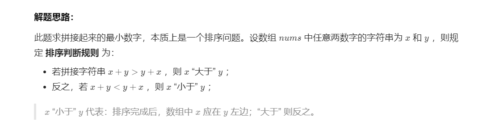

[TOC]


### [**:house:**](../../README.html)

#### Array的内置排序

```java
//如果调用compare方法大于0，就把前面一个数和当前的数交换

Integer nums[] = {4,5,3,1,6};
Arrays.sort(nums, (a, b) -> b - a); //也就是b>a就交换a与b也就是b,a大的在前
Arrays.sort(number, (s1, s2) -> (s1 + s2).compareTo(s2 + s1));//也就是说如果s1+s2>s2+s1，就把s1与s2交换
 Arrays.sort(people, (o1,o2) -> {
            if(o1[0] == o2[0]){
                return o1[1] - o2[1];
            }
            return o2[0] - o1[0];
        });
```


**排序稳定**：即在原序列中，$r[i]=r[j]$，且$r[i]在r[j]$之前，而在排序后的序列中，$r[i]$仍在$r[j]$之前，则称这种排序算法是稳定的；否则称为不稳定的。
**稳定有什么意义？** 举个例子，一个班的学生已经按照学号大小排好序了，我现在要求按照年龄从小到大再排个序，如果年龄相同的，必须按照学号从小到大的顺序排列。那么问题来了，你选择的年龄排序方法如果是不稳定的，是不是排序完了后年龄相同的一组学生学号就乱了，你就得把这组年龄相同的学生再按照学号拍一遍。如果是稳定的排序算法，我就只需要按照年龄排一遍就好了。


#### [1.排序数组(912)](https://leetcode-cn.com/problems/sort-an-array/)

##### 归并排序
- 基本思想：对于一个长度为$N$的待排数组，可以将其分为两个$n/2$的子序列，每次通过递归调用函数使字序列有序，然后再线性合并两个子序列。
- 时间复杂度：$O(N$$log_2$$N)$ 
- 空间复杂度：$O(N)$
- 稳定的排序
``` java
class Solution {
    int[] temp;

    public int[] sortArray(int[] nums) {
        temp = new int[nums.length];
        margeSort(nums, 0, nums.length - 1);
        return nums;
    }

    public void margeSort(int[] nums, int l, int r) {

        if (l >= r)
            return;

        int mid = (l + r) >> 1;
        margeSort(nums, l, mid);
        margeSort(nums, mid + 1, r);

        int i = l;
        int j = mid + 1;
        int k = 0;
        // 合并两个有序数组
        while (i <= mid && j <= r) {

            if (nums[i] >= nums[j])
                temp[k++] = nums[j++];
            else
                temp[k++] = nums[i++];

        }

        while (i <= mid) {

            temp[k++] = nums[i++];
        }
        while (j <= r) {
            temp[k++] = nums[j++];
        }

        for (int p = l; p <= r; p++) {

            nums[p] = temp[p - l];
        }

    }

}

```

##### 快速排序
- 时间复杂度：$O(N$$log_2$$N)$ 最坏:$O(n^2)$
- 空间复杂度：最好：$O($$log_2$$N)$ 最坏：$O(N)$
- 不稳定
- 快速排序的主要思想是通过划分将待排序的序列分成前后两部分，其中前一部分的数据都比后一部分的数据要小，然后再递归调用函数对两部分的序列分别进行快速排序，以此使整个序列达到有序。

- 待排数组 6 9 9我们选择第二个9作为主元，若把小于放在主元的左边，最后第二个9就跑到第一个9左面了，从而导致不稳定，主元的选择是随机的，导致不稳定的原因在于我们无法保证每次都是稳定的，所以它是不稳定的。
- 最好的情况: 每次选的pivot几乎能把数据均分成两半，这样递归树的深度就是`logN`，这样快排的时间复杂度为`O(NlogN)`
- 最坏的情况：每次找的pivot将数组分成两部分，其中有一部分是空。一般当数据有序或者局部有序的时候会出现这种坏的情况，比如数组正序或者逆序.
```java
class Solution {
    public int[] inventoryManagement(int[] stock, int cnt) {
        quickSort(stock, 0, stock.length - 1, cnt);
        int[] res = new int[cnt];
        for (int i = 0; i < cnt; i++) {

            res[i] = stock[i];
        }

        return res;

    }

    public void quickSort(int[] arr, int l, int r, int k) {

        if (l >= r)
            return;
        int pos = partition(arr, l, r);
        int num = pos - l + 1;// 计算出前多少个是有序的
        // 在这里与快排不同
        if (num == k)
            return;// 如果pos右边的个数等于k,说明已经得到了
        else if (num < k) {// 如果pos右边的个数小于k,说明还要在左边找k-num个数

            QuickSort(arr, pos + 1, r, k - num);

        } else {// 如果pos右边的个数大k,说明还要在右边继续找k个数

            QuickSort(arr, l, pos - 1, k);
        }

    }

    public int partition(int[] arr, int l, int r) {

        int pivot = l + new Random().nextInt(r - l + 1);
        swap(arr, pivot, r);
        int i = l;
        for (int j = l; j < r; j++) {

            if (arr[j] <= arr[r]) {
                swap(arr, i, j);
                i++;
            }
        }
        swap(arr, i, r);
        return i;
    }

    public void swap(int[] nums, int i, int j) {

        int temp = nums[i];
        nums[i] = nums[j];
        nums[j] = temp;
    }
}
```

##### 堆排序
- 堆分为大根堆和小根堆。在最大堆中，父节点的值比每一个子节点的值都要大。在最小堆中，父节点的值比每一个子节点的值都要小。
- 堆排序的思想就是先将待排序的序列建成大根堆，使得每个父节点的元素大于等于它的子节点。此时整个序列最大值即为堆顶元素，我们将其与末尾元素交换，使末尾元素为最大值，然后再调整堆顶元素使得剩下的 n-1个元素仍为大根堆，再重复执行以上操作我们即能得到一个有序的序列。
- 数组可以看做是一个完全二叉树
- 不稳定：如3 27 36 27
- 时间复杂度：$O(NlogN)$
- 空间复杂度：$O(1)$
```java
class Solution {
    public int[] sortArray(int[] nums) {
        heapSort(nums);
        return nums;
    }
  
   //树为完全二叉树，按照数组顺序进行构造

    public void heapSort(int[] arr) {

        int len = arr.length - 1;
        buildMaxHeap(arr, len);// 先建一个大根堆
        for (int i = len; i > 0; i--) {// 每次把最大的元素放在后面

            swap(arr, 0, i);
            len--;
            maxHeap(arr, 0, len);
        }
    }

    //
    public void buildMaxHeap(int[] arr, int len) {

        for (int i = len / 2; i >= 0; i--) { // 因为最后一层的元素没有孩子，所以就不用管
            maxHeap(arr, i, len);
        }
    }

    // 以某个节点为根节点建造大根堆
    public void maxHeap(int[] arr, int i, int len) {

        while ((i << 1) + 1 <= len) {

            int left = (i << 1) + 1; // 完全二叉树左节点为2*i+1
            int right = (i << 1) + 2;// 完全二叉树右节点为2*i+2
            int max;
            if (arr[i] < arr[left]) {

                max = left;
            } else {

                max = i;
            }
            if (right <= len && arr[right] > arr[max]) {
                max = right;
            }
            if (i != max)// 这时候做了调整，
            {
                swap(arr, i, max);
                i = max;
                // 因为左节点或者右节点变了，所以左节点/右节点的孩子也要变

            } else
                break;// 没有做调整，直接跳出就行

        }

    }

    public void swap(int[] nums, int i, int j) {
        int temp = nums[i];
        nums[i] = nums[j];
        nums[j] = temp;

    }

}

```

##### 冒泡排序
- 基本思想：对于每一趟，比较相邻的元素，如果前一个比后一个大，就交换，每一趟都是把最大的一个移到最后一个。
- 因此需要n-1趟。
- 时间复杂度：

``` java
class Solution {

    public int[] sortArray(int[] nums) {
        bubbleSort(nums);
        return nums;
    }

    private void bubbleSort(int[] arr) {
        if (arr == null || arr.length < 2) {
            return;
        }
        for (int i = 0; i < arr.length - 1; i++) {
            // 每一轮结束最后一个元素是最大的
            for (int j = 0; j < arr.length - 1 - i; j++) { // 这里说明为什么需要-1
                if (arr[j] > arr[j + 1]) {
                    int temp = arr[j];
                    arr[j] = arr[j + 1];
                    arr[j + 1] = temp;
                }
            }
        }
    }

}


```

#### [2. 最小的K个数](https://leetcode-cn.com/problems/zui-xiao-de-kge-shu-lcof/solution/zui-xiao-de-kge-shu-by-leetcode-solution/)

给定一个数组，找出其中最小的K个数。例如数组元素是4,5,1,6,2,7,3,8这8个数字，则最小的4个数字是1,2,3,4。如果K>数组的长度，那么返回一个空的数组.

```java
class Solution {
    public int[] inventoryManagement(int[] stock, int cnt) {
        quickSort(stock, 0, stock.length - 1, cnt);
        int[] res = new int[cnt];
        for (int i = 0; i < cnt; i++) {

            res[i] = stock[i];
        }

        return res;

    }

    public void quickSort(int[] arr, int l, int r, int k) {

        if (l >= r)
            return;
        int pos = partition(arr, l, r);
        int num = pos - l + 1;// 计算出前多少个是有序的
        // 在这里与快排不同
        if (num == k)
            return;// 如果pos右边的个数等于k,说明已经得到了
        else if (num < k) {// 如果pos右边的个数小于k,说明还要在左边找k-num个数

            quickSort(arr, pos + 1, r, k - num);

        } else {// 如果pos右边的个数大k,说明还要在右边继续找k个数

            quickSort(arr, l, pos - 1, k);
        }

    }

    public int partition(int[] arr, int l, int r) {

        int pivot = l + new Random().nextInt(r - l + 1);
        swap(arr, pivot, r);
        int i = l;
        for (int j = l; j < r; j++) {

            if (arr[j] <= arr[r]) {
                swap(arr, i, j);
                i++;
            }
        }
        swap(arr, i, r);
        return i;
    }

    public void swap(int[] nums, int i, int j) {

        int temp = nums[i];
        nums[i] = nums[j];
        nums[j] = temp;
    }
}
    
```

#### [剑指 Offer 45. 把数组排成最小的数](https://leetcode-cn.com/problems/ba-shu-zu-pai-cheng-zui-xiao-de-shu-lcof/)

输入一个非负整数数组，把数组里所有数字拼接起来排成一个数，打印能拼接出的所有数字中最小的一个.



可以看成是一个排序问题，在比较两个字符串 S1 和 S2 的大小时，应该比较的是 S1+S2 和 S2+S1 的大小，如果 S1+S2 > S2+S1，那么应该把 S2 排在前面，否则应该把 S1 排在前面。

```java
public String minNumber(int[] nums) {

        
        if (nums == null || nums.length == 0)
        return "";
        int n = nums.length;
        String[] number = new String[n];
        for (int i = 0; i < n; i++)
            number[i] = nums[i] + "";
        Arrays.sort(number, (s1, s2) -> (s1 + s2).compareTo(s2 + s1));
        String ret = "";
        for (String str : number)
            ret += str;
        return ret;

    }
```

#### [面试题 16.16. 部分排序](https://leetcode-cn.com/problems/sub-sort-lcci/)

给定一个整数数组，编写一个函数，找出索引m和n，只要将索引区间[m,n]的元素排好序，整个数组就是有序的。注意：n-m尽量最小，也就是说，找出符合条件的最短序列。函数返回值为[m,n]，若不存在这样的m和n（例如整个数组是有序的），请返回[-1,-1]。

```java
/*
1 2 4 || 7 10 11 7 12 6 7 || 16 18 19
时间复杂度O(N)
空间复杂度O(1)
*/

public int[] subSort(int[] array) {
        int min = Integer.MAX_VALUE, max = Integer.MIN_VALUE, left = -1, right = -1, len = array.length;

        if (len <= 1) {
            return new int[] {left, right};
        }
        // 从前往后遍历，找到比左边序列所有元素都大的第一个元素，这个元素前面的元素就是要找的
        for (int i = 0; i < len; i++) {
            if (array[i] >= max) {
                max = array[i];
            } else {
                right = i;
            }
        }
        // 如果 right = -1 ，说明这个是一个有序数组
        if (right== -1) {
            return new int[] {left, right};
        }
        // end 开始从后往前遍历，找到比右边元素都小的第一个元素，这个元素后面的元素就是要找的
        for (int i = right; i >=0; i--) {
            if (array[i] <= min) {
                min = array[i];
            } else {
                left = i;
            }
        }
        return new int[] {left, right};
    }
```

#### [347. 前 K 个高频元素](https://leetcode.cn/problems/top-k-frequent-elements/)

给你一个整数数组 `nums` 和一个整数 `k` ，请你返回其中出现频率前 `k` 高的元素。你可以按 **任意顺序** 返回答案。

 

**示例 1:**

```
输入: nums = [1,1,1,2,2,3], k = 2
输出: [1,2]
```

**示例 2:**

```
输入: nums = [1], k = 1
输出: [1]
```

```java
class Solution {
    public int[] topKFrequent(int[] nums, int k) {
        Map<Integer,Integer> map = new HashMap<>(); //key为数组元素值,val为对应出现次数
        for (int num : nums) {
            map.put(num, map.getOrDefault(num,0) + 1);
        }
        //在优先队列中存储二元组(num, cnt),cnt表示元素值num在数组中的出现次数
        //出现次数按从队头到队尾的顺序是从大到小排,出现次数最多的在队头(相当于大顶堆)
        PriorityQueue<int[]> pq = new PriorityQueue<>((pair1, pair2) -> pair2[1] - pair1[1]);
        for (Map.Entry<Integer, Integer> entry : map.entrySet()) {//大顶堆需要对所有元素进行排序
            pq.add(new int[]{entry.getKey(), entry.getValue()});
        }
        int[] ans = new int[k];
        for (int i = 0; i < k; i++) { //依次从队头弹出k个,就是出现频率前k高的元素
            ans[i] = pq.poll()[0];
        }
        return ans;
    }
}
```

