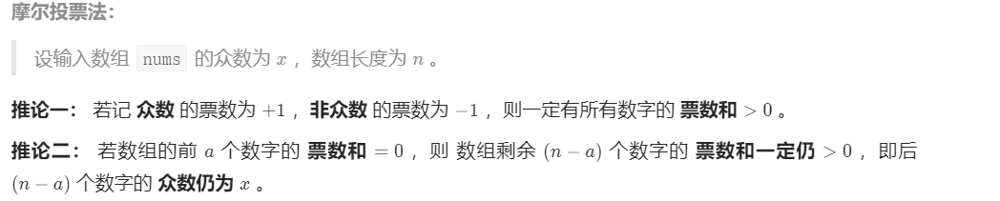
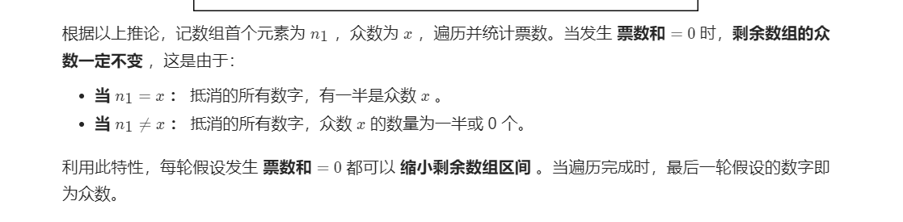

[TOC]


### [**:house:**](../../README.html)

#### [1.合并两个有序数组](https://leetcode-cn.com/problems/merge-sorted-array/)

给出两个有序的整数数组 和 ，请将数组 合并到数组 中，变成一个有序的数组
注意：
可以假设 数组有足够的空间存放 数组的元素， 和 中初始的元素数目分别为 和 

```java
//时间复杂度：O(m+n)
//空间复杂度O(1)
//双指针，从后往前进行判断
public void merge(int[] A, int m, int[] B, int n) {

        int i = m - 1;
        int j = n - 1;
        int k = m + n - 1;
        while(i >= 0 && j >= 0){

             if(A[i] > B[j]){
                A[k--] = A[i--];  

            }else{
                A[k--] = B[j--];
            }          
        }

        while(j >= 0){

              A[k--] = B[j--];
        }
        
    }
```

#### [2.螺旋矩阵](https://leetcode-cn.com/problems/spiral-matrix/)

给定一个m x n大小的矩阵（m行，n列），按螺旋的顺序返回矩阵中的所有元素。

输入：[[1,2,3],[4,5,6],[7,8,9]]

输出：[1,2,3,6,9,8,7,4,5]

```java
 public ArrayList<Integer> spiralOrder(int[][] matrix) {
        ArrayList<Integer> res=new ArrayList<Integer>();
        int row=matrix.length;
        if(row==0) return res;
        int col=matrix[0].length;
        
        int left=0;
        int right=col-1;
        int top=0;
        int bottom=row-1;        
        while(true){
            
            if(left>right) return res;       
            for(int i=left;i<=right;i++){
                
                res.add(matrix[top][i]);
            }
            top++;
            
            if(top>bottom) return res;
            
            for(int i=top;i<=bottom;i++){
                
                res.add(matrix[i][right]);
            }
            
            right--;
            if(left>right) return res;
            for(int i=right;i>=left;i--){
                
                res.add(matrix[bottom][i]);
            }
            bottom--;
            if(top>bottom) return res;
            for(int i=bottom;i>=top;i--){
                
                res.add(matrix[i][left]);
            }
            left++;
            
             
        }
   
    }
```

#### [3.数组中相加和为0的三元组](https://www.nowcoder.com/practice/345e2ed5f81d4017bbb8cc6055b0b711?tpId=196&tqId=37085&rp=1&ru=%2Factivity%2Foj&qru=%2Fta%2Fjob-code-total%2Fquestion-ranking&tab=answerKey)

给出一个有n个元素的数组S，S中是否有元素a,b,c满足a+b+c=0？找出数组S中所有满足条件的三元组。

注意：

1. 三元组（a、b、c）中的元素必须按非降序排列。（即a≤b≤c）
2. 解集中不能包含重复的三元组。

```java
 //先排序
//遍历数组中的每个元素并固定该元素num[i]
//计算num[i+1]到num[len-1]中两个数据相加为-num[i]的数据
//一些特殊情况 当num[i]>0时说明查找结束，因为后面的数据都大于0
//去重：num[i]=num[i-1]时，就不用再查找了   
//时间复杂度O(nlogn)+O(n)
public ArrayList<ArrayList<Integer>> threeSum(int[] num) {
       ArrayList<ArrayList<Integer>> res=new ArrayList<ArrayList<Integer>>();
       Arrays.sort(num);
      
       for(int i=0;i<num.length;i++){
           
           if(num[i]>0){//当num[i]>0时说明查找结束，因为后面的数据都大于0
               
               break;
           }
           
           if(i-1>=0 && num[i]==num[i-1]){//num[i]=num[i-1]时，就不用再查找了  
               
               continue;
           }
           
           int left=i+1;
           int right=num.length-1;
           
           while(left<right){
               
               int sum=num[left]+num[right]+num[i];
               if(sum==0)
               {
                   ArrayList<Integer> temp=new ArrayList<Integer>();
                   temp.add(num[i]);
                   temp.add(num[left]);
                   temp.add(num[right]);
                   res.add(temp);  
                   while(left<right && num[left]==num[left+1]){//去重
                        left++;
                   }
                  while(left<right && num[right]==num[right-1]){//去重
                       right--;
                  }
                   left++;
                   right--;
                  
                   
               }else if(sum<0){
                   
                   left++;
               }else{
                   
                   right--;
               }
              
           }
       }
        
       
        return res;
        
    }
```


#### [4.买股票的最好时机](https://leetcode-cn.com/problems/gu-piao-de-zui-da-li-run-lcof/solution/gu-piao-de-zui-da-li-run-by-leetcode-sol-0l1g/)

假设你有一个数组，其中第 *i* 个元素是股票在第i天的价格。
你有一次买入和卖出的机会。（只有买入了股票以后才能卖出）。请你设计一个算法来计算可以获得的最大收益

输入:[1,4,2]  输入：3

```java
   public int maxProfit (int[] prices) {
        // write code here
        int max=prices[prices.length-1];//记录未来最大的价格
        int res=0;//最大的利润
        
        for(int i=prices.length-2;i>=0;i--){
            
            res=Math.max(res,max-prices[i]);
            max=Math.max(max,prices[i]);
            
        }
        
        return res;
    }
```

#### [5.数组中出现次数超过一半的数字](https://leetcode-cn.com/problems/shu-zu-zhong-chu-xian-ci-shu-chao-guo-yi-ban-de-shu-zi-lcof/)

数组中有一个数字出现的次数超过数组长度的一半，请找出这个数字.

你可以假设数组是非空的，并且给定的数组总是存在多数元素。

```java
 //使用哈希存储num中每个数据出现的次数,最后返回次数最大的那一个数据
//时间复杂度O(N)
//空间复杂度O(N)
public int majorityElement(int[] nums) {

        HashMap<Integer,Integer> map=new HashMap<Integer,Integer>();
        int count=0;
        int maxcount=0;
        int res=0;
        
        for(int num:nums){
             
             if(!map.containsKey(num)) map.put(num,1);
             else {

                 map.put(num,map.get(num)+1);
             }

        }

        for(int key:map.keySet()){
          
          if(map.get(key)>maxcount)
          {
               maxcount=map.get(key); 
               res=key;
          }
            
        }
        return res;

    }

//投票法:时间复杂度O(N),空间复杂度O(1)
//初始化:票统计数vote=0,众数res=0
//循环:遍历数组中每个数字num
   //1。当票数vote=0.则假设当前数组num是众数
   //2.当num=res时，vote=vote+1，否则vote=vote-1;
public int majorityElement(int[] nums) {
        
        int vote=0;
        int res=0;

        for(int num:nums){

            if(vote==0) res=num;
            if(num==res) vote=vote+1;
            else vote=vote-1;
            

        }
        return res;

    }
```





#### [剑指 Offer 42. 连续子数组的最大和](https://leetcode-cn.com/problems/lian-xu-zi-shu-zu-de-zui-da-he-lcof/)

输入一个整型数组，数组中的一个或连续多个整数组成一个子数组。求所有子数组的和的最大值。

要求时间复杂度为O(n)。

```java
//设dp[i]为以nums[i]为结尾的和的最大的值
//dp[i-1]<=0 说明前面的数据没有贡献或者为负贡献，直接设dp[i]=nums[i]然后相加
//dp[i-1] > 0 dp[i]=dp[i-1]+nums[i]
//可以用nums[i]代表dp[i]
//时间复杂度O(N)
//空间复杂度O(1)
    public int maxSubArray(int[] nums) {

        int res = nums[0];
        for(int i = 1; i < nums.length;i++){

                if(nums[i-1] > 0) {

                    nums[i] = nums[i-1] + nums[i];
                }
                
                 res = Math.max(res,nums[i]);
        }
    	return res;
        
    }
```

#### [剑指 Offer 56 - I. 数组中数字出现的次数](https://leetcode-cn.com/problems/shu-zu-zhong-shu-zi-chu-xian-de-ci-shu-lcof/)

一个整型数组 `nums` 里除两个数字之外，其他数字都出现了两次。请写程序找出这两个只出现一次的数字。要求时间复杂度是O(n)，空间复杂度是O(1)。

```java
//首先相同的数异或为0
//所以对整个数组进行异或，可以得到x^y,其中x与y为只出现一次的数据，其他数据由于有相同的，所以异或为0；
//x与y不同，所以x^y中至少有一位为1，令m =1，让m不断左移，当m & (x^y)==0时，如：若x=15,y=3,则x=1111,y=0011,x^y=1100,可以得到m=100。
//将num分组，一组是第三位上为1，另一位是第三位上为0，通过与m相与就可以进行分组，这样x与y就分布在两个不同的数组中。

public int[] singleNumbers(int[] nums) {

        int x = 0,y = 0,n = 0, m = 1;
        for(int num : nums){

            n ^= num;
        }

        while((n & m) == 0){

            m <<= 1;
        }
         for(int num : nums){

            if((num & m) == 0) x ^= num;
            else{

                y ^= num;
            } 
        }

        return new int[]{x,y};

    }
```

#### [剑指 Offer 56 - II. 数组中数字出现的次数 II](https://leetcode-cn.com/problems/shu-zu-zhong-shu-zi-chu-xian-de-ci-shu-ii-lcof/)

在一个数组 `nums` 中除一个数字只出现一次之外，其他数字都出现了三次。请找出那个只出现一次的数字。

```java
/*  
            ab    ab    ab    ab
    状态机: 00 -> 01 -> 10 -> 00
    真值表:
    
    n   two  one  two' one'
    0    0    0   0    0
    0    0    1   0    1
    0    1    0   1    0
    1    0    0   0    1
    1    0    1   1    0
    1    1    0   0    0
计算one'  取one'为1的情况 one' = ~two&~one&n + ~two & one & ~n = ~two&(one^n)
因为计算完one’之后one就改变了，所以应该用新的one'替换旧的one,其他不变
n   two  one' two' 
0    0    0   0    
0    0    1   0    
0    1    0   1    
1    0    1   0    
1    0    0   1    
1    1    0   0       
two' = ~n & two & ~one + n & ~two & ~one = ~one(two^n)
遍历完所有数字后，各二进制位都处于状态 00 和状态 01 （取决于 “只出现一次的数字” 的各二进制位是 1 还是 0 ），而此两状态是由 one 来记录的（此两状态下 two恒为 0），因此返回 one 即可。

时间复杂度 O(N)
空间复杂度 O(1)
*/
   
 public int singleNumber(int[] nums) {
        int ones = 0, twos = 0;
        for(int num : nums){
            ones = ones ^ num & ~twos;
            twos = twos ^ num & ~ones;
        }
        return ones;
    }


```

#### [剑指 Offer 61. 扑克牌中的顺子](https://leetcode-cn.com/problems/bu-ke-pai-zhong-de-shun-zi-lcof/)

从扑克牌中随机抽5张牌，判断是不是一个顺子，即这5张牌是不是连续的。2～10为数字本身，A为1，J为11，Q为12，K为13，而大、小王为 0 ，可以看成任意数字。A 不能视为 14。

```java
//先排序
//获取0的个数
//如果不是0就计算差值
//如果差值小于0就返回true;
//时间复杂度O(NlogN)空间复杂度O(1)
public boolean isStraight(int[] nums) {

         Arrays.sort(nums);
         int count = 0;
         int sum = 0;
    
         for(int i = 0; i < 4; i++){

             if(nums[i] == 0){

                 count ++;

             }else{
                 int temp = nums[i+1] - nums[i] -1;
                 if(temp < 0)  return false;
                 sum = sum + temp;         
             }

         }

         return count >= sum ? true :false;

    }

 public boolean isStraight(int[] nums) {

        Arrays.sort(nums);
        int idx = 0;
        for(int i = 0; i < 4;i++){
            if(nums[i] == 0) idx++;
            else if(nums[i+1] == nums[i]) return false;
        }

        return nums[4] - nums[idx] < 5;        

    }
```

#### [剑指 Offer 57. 和为s的两个数字](https://leetcode-cn.com/problems/he-wei-sde-liang-ge-shu-zi-lcof/)

输入一个递增排序的数组和一个数字s，在数组中查找两个数，使得它们的和正好是s。如果有多对数字的和等于s，则输出任意一对即可。

```java
//直接左右指针
//和大于target right--
//和小于target left++
//和等于target  返回就行
//时间复杂度O(N)
//空间复杂度O(1)
public int[] twoSum(int[] nums, int target) {
        
        int left = 0;
        int right = nums.length - 1;
        while(left < right){

            if(nums[left] + nums[right] == target){

                break;
            }
            else if(nums[left] + nums[right] > target){

                right--;
            }else{

                left++;
            }
        }

        return new int[]{nums[left],nums[right]};


    }
```

#### [剑指 Offer 57 - II. 和为s的连续正数序列](https://leetcode-cn.com/problems/he-wei-sde-lian-xu-zheng-shu-xu-lie-lcof/)

输入一个正整数 target ，输出所有和为 target 的连续正整数序列（至少含有两个数）。

序列内的数字由小到大排列，不同序列按照首个数字从小到大排列。


```java
//时间复杂度O(N)
//空间复杂度O(1)
算法流程：
初始化： 左边界 i = 1 ，右边界 j = 2，元素和 s = 3 ，结果列表 res ；

循环： 当i≥j 时跳出；

当 s > target时： 向右移动左边界i=i+1 ，并更新元素和 s ；
当 s < target时： 向右移动右边界j=j+1 ，并更新元素和 s ；
当 s = target 时： 记录连续整数序列，并向右移动左边界 i=i+1 ；
返回值： 返回结果列表 res；

public int[][] findContinuousSequence(int target) {
        int i = 1, j = 2, s = 3;
        List<int[]> res = new ArrayList<>();
        while(i < j) {
            if(s == target) {
                int[] ans = new int[j - i + 1];
                for(int k = i; k <= j; k++)
                    ans[k - i] = k;
                res.add(ans);
            }
            if(s >= target) {
                s -= i;
                i++;
            } else {
                j++;
                s += j;
            }
        }
        return res.toArray(new int[0][]);
    }
```


#### [剑指 Offer 66. 构建乘积数组](https://leetcode-cn.com/problems/gou-jian-cheng-ji-shu-zu-lcof/)

给定一个数组 A[0,1,…,n-1]，请构建一个数组 B[0,1,…,n-1]，其中 B[i] 的值是数组 A 中除了下标 i 以外的元素的积, 即 B[i]=A[0]×A[1]×…×A[i-1]×A[i+1]×…×A[n-1]。不能使用除法。

|      | a[0]=1 | a[1]=2 | a[2]=3 | a[3] =4 | a[4]=5 |
| ---- | ------ | ------ | ------ | ------- | ------ |
| b[0] | 1      | 2      | 3      | 4       | 5      |
| b[1] | 1      | 1      | 3      | 4       | 5      |
| b[2] | 1      | 2      | 1      | 4       | 5      |
| b[3] | 1      | 2      | 3      | 1       | 5      |
| b[4] | 1      | 2      | 3      | 4       | 1      |


```java
//先从上往下计算下三角的值，也就是b[i]=b[i-1]*a[i-1]
//之后从下往上计算上三角值，也就是temp=temp*a[i+1];  b[i]=temp*b[i]
//时间复杂度O(N)
//空间复杂度O(1)
public int[] constructArr(int[] a) {  
        int len = a.length;
        if(len == 0)  return a;
        int[] b = new int[len];
        b[0] = 1;
        int temp = 1;
        for(int i = 1; i < len; i++){

            b[i] = b[i-1] * a[i-1];
        }

        for(int j = len - 2; j >=0; j--){

            temp *= a[j + 1];
            b[j] = b[j] * temp;
        }

        return b;
    }
```

#### [剑指 Offer 03. 数组中重复的数字](https://leetcode-cn.com/problems/shu-zu-zhong-zhong-fu-de-shu-zi-lcof/)

找出数组中重复的数字。

在一个长度为 n 的数组 nums 里的所有数字都在 0～n-1 的范围内。数组中某些数字是重复的，但不知道有几个数字重复了，也不知道每个数字重复了几次。请找出数组中任意一个重复的数字。

```java
//使用hashset存储
//时间复杂度O(N)
//空间复杂度O(N)
public int findRepeatNumber(int[] nums) {
        HashSet<Integer> set = new HashSet<Integer>();
        for(int i = 0; i < nums.length; i++){

            if(set.contains(nums[i])){

                return nums[i];
            }
            set.add(nums[i]);
        }
        return -1;

    }
/*遍历数组 nums，设索引初始值为 i = 0:
若nums[i]=i: 说明此数字已在对应索引位置，无需交换，因此跳过；
若 nums[nums[i]] = nums[i]： 代表索引 nums[i] 处和索引 i 处的元素值都为 nums[i]，即找到一组重复值，返回此值 nums[i]；
否则： 交换索引为 i 和 nums[i] 的元素值，将此数字交换至对应索引位置。
若遍历完毕尚未返回，则返回 -1。
时间复杂度O(N) 空间复杂度O(1)*/
  public int findRepeatNumber(int[] nums) {

     int i = 0;
     while(i < nums.length){

         if(nums[i] == i){
             i++;
             continue;
         }

         if(nums[nums[i]] == nums[i]) return nums[i];
         int temp = nums[i];
         nums[i] = nums[temp];
         nums[temp]= temp;
     }

     return -1;
    }

```

#### [剑指 Offer 13. 机器人的运动范围](https://leetcode-cn.com/problems/ji-qi-ren-de-yun-dong-fan-wei-lcof/)

地上有一个m行n列的方格，从坐标 [0,0] 到坐标 [m-1,n-1] 。一个机器人从坐标 [0, 0] 的格子开始移动，它每次可以向左、右、上、下移动一格（不能移动到方格外），也不能进入行坐标和列坐标的数位之和大于k的格子。例如，当k为18时，机器人能够进入方格 [35, 37] ，因为3+5+3+7=18。但它不能进入方格 [35, 38]，因为3+5+3+8=19。请问该机器人能够到达多少个格子？

```java
//时间复杂度O(MN)
//空间复杂度O(MN)
	int count = 0;
    boolean [][]visited;
    public int movingCount(int m, int n, int k) {

          visited = new boolean[m][n];
          dfs(m,n,0,0,k);
          return count;

    }

    public void dfs(int m, int n, int i, int j,int k){

        int num1 = i >= 10 ? i/10 + i % 10 : i;
        int num2 = j >= 10 ? j/10 + j % 10 : j;
        if(i < 0 || i >= m || j < 0 || j >= n || num1 + num2 > k || visited[i][j]){

            return;
        }

        count ++;
        visited[i][j] = true;

        dfs(m,n,i-1,j,k);
        dfs(m,n,i+1,j,k);
        dfs(m,n,i,j-1,k);
        dfs(m,n,i,j+1,k);
  
    }
```

#### [剑指 Offer 47. 礼物的最大价值](https://leetcode-cn.com/problems/li-wu-de-zui-da-jie-zhi-lcof/)

在一个 m*n 的棋盘的每一格都放有一个礼物，每个礼物都有一定的价值（价值大于 0）。你可以从棋盘的左上角开始拿格子里的礼物，并每次向右或者向下移动一格、直到到达棋盘的右下角。给定一个棋盘及其上面的礼物的价值，请计算你最多能拿到多少价值的礼物？

```java
/*dp[i][j]表示p(i,j) 代表从棋盘的左上角开始，到达单元格 (i,j)时能拿到礼物的最大累计价值。
时间复杂度O(MN)
空间复杂度O(1)
*/

public int maxValue(int[][] grid) {
        int m = grid.length, n = grid[0].length;
        for(int j = 1; j < n; j++) // 初始化第一行
            grid[0][j] += grid[0][j - 1];
        for(int i = 1; i < m; i++) // 初始化第一列
            grid[i][0] += grid[i - 1][0];
        for(int i = 1; i < m; i++)
            for(int j = 1; j < n; j++) 
                grid[i][j] += Math.max(grid[i][j - 1], grid[i - 1][j]);//从左边或者上面到，取最大值
        return grid[m - 1][n - 1];
    }

```

#### [剑指 Offer 12. 矩阵中的路径](https://leetcode-cn.com/problems/ju-zhen-zhong-de-lu-jing-lcof/)

给定一个 m x n 二维字符网格 board 和一个字符串单词 word 。如果 word 存在于网格中，返回 true ；否则，返回 false 。

单词必须按照字母顺序，通过相邻的单元格内的字母构成，其中“相邻”单元格是那些水平相邻或垂直相邻的单元格。同一个单元格内的字母不允许被重复使用。

```java
//时间复杂度：对网格里的MN个起点进行遍历，对于每个起点，需要遍历k次（word的长度），每次遍历上下左右，减掉上个字符的长度，也就是每次比较3个，这样一共O(M*N*3^k)
//O(K) 搜索过程中的递归深度不超过 K ，因此系统因函数调用累计使用的栈空间占用 O(K) （因为函数返回后，系统调用的栈空间会释放）。最坏情况下K=MN ，递归深度为 MN ，此时系统栈使用 O(MN) 的额外空间。


public boolean exist(char[][] board, String word) {
         
         int r = board.length;
         int c = board[0].length;
        
        for(int i = 0; i < r; i++){
            for(int j = 0; j < c; j++){//

                if(dfs(board,word,0,i,j)) return true;//遍历board，看以board[i][j]为开头的字母的路径是否包含word，如果是就直接返回true,如果不是，就继续遍历。
            }
        }

        return false;   

    }

    public boolean dfs(char[][] board,String word,int cur,int i,int j){

        if(i < 0 || j < 0 || i >= board.length || j >= board[0].length || board[i][j] != word.charAt(cur)){
   
            return false;//当超过数组边界同时当前元素不等于word[cur]时，直接返回false
        }
        //如果当前board[i][j]= word[cur]就继续接下来的操作
        if(cur == word.length()-1){//如果找到了最后一个元素，同时也匹配word的最后一个，就返回true;

            return true;
        }

        board[i][j] = '/';//表示i,j的位置已经访问过了

        boolean res = dfs(board,word,cur+1,i+1,j) || dfs(board,word,cur+1,i-1,j) || dfs(board,word,cur+1,i,j+1)||dfs(board,word,cur+1,i,j-1);//判断当前元素的上下左右是否匹配下一个字母，只要有任意一个匹配就为true;
        board[i][j] = word.charAt(cur);//为了之后的遍历，需要恢复原数组。

        return res;


    }
```

#### [剑指 Offer 45. 把数组排成最小的数](https://leetcode-cn.com/problems/ba-shu-zu-pai-cheng-zui-xiao-de-shu-lcof/)

输入一个非负整数数组，把数组里所有数字拼接起来排成一个数，打印能拼接出的所有数字中最小的一个.


可以看成是一个排序问题，在比较两个字符串 S1 和 S2 的大小时，应该比较的是 S1+S2 和 S2+S1 的大小，如果 S1+S2 > S2+S1，那么应该把 S2 排在前面，否则应该把 S1 排在前面。

```java
public String minNumber(int[] nums) {

        
        if (nums == null || nums.length == 0)
        return "";
        int n = nums.length;
        String[] number = new String[n];
        for (int i = 0; i < n; i++)
            number[i] = nums[i] + "";
        Arrays.sort(number, (s1, s2) -> (s1 + s2).compareTo(s2 + s1));
        String ret = "";
        for (String str : number)
            ret += str;
        return ret;

    }
```

#### [剑指 Offer 04. 二维数组中的查找](https://leetcode-cn.com/problems/er-wei-shu-zu-zhong-de-cha-zhao-lcof/)

在一个 n * m 的二维数组中，每一行都按照从左到右递增的顺序排序，每一列都按照从上到下递增的顺序排序。请完成一个高效的函数，输入这样的一个二维数组和一个整数，判断数组中是否含有该整数。

 ```java
 //从左下角开始遍历，大于该元素就向右移动，小于就向上移动，等于就返回
 //时间复杂度O(N+M)
 //空间复杂度O(1)
 public boolean findNumberIn2DArray(int[][] matrix, int target) {
 
         if(matrix.length == 0) return false;
         int i = 0;
         int j = matrix.length - 1;
         while(i < matrix[0].length && j >= 0){
             if(target > matrix[j][i]) i++;
             else if(target < matrix[j][i]) j--;
             else  return true;
         }
 
         return false;
 
     }
 ```

#### [剑指 Offer 11. 旋转数组的最小数字](https://leetcode-cn.com/problems/xuan-zhuan-shu-zu-de-zui-xiao-shu-zi-lcof/)

把一个数组最开始的若干个元素搬到数组的末尾，我们称之为数组的旋转。输入一个递增排序的数组的一个旋转，输出旋转数组的最小元素。例如，数组 [3,4,5,1,2] 为 [1,2,3,4,5] 的一个旋转，该数组的最小值为1。  

```java
//旋转数组可分为左排序数组和右排序数组，左排序数组的数据都大于右排序数组
//时间复杂度O(logN) 在特例情况下(例如1,1,1,1)会退化到O(N)
//空间复杂度O(1)
//为什么本题二分法不用 nums[m]和 nums[i] 作比较？
//二分目的是判断 mm 在哪个排序数组中，从而缩小区间。而在 nums[m] > nums[i]情况下，无法判断 m 在哪个排序数组中。本质上是由于 j 初始值肯定在右排序数组中； i 初始值无法确定在哪个排序数组中。如1，2，3，4，5和3，4，5，1，2

public int minArray(int[] numbers) {

        int i = 0;
        int j = numbers.length - 1;
        while(i < j){

            int mid = (i + j)/2;
            if(numbers[mid] > numbers[j]){//说明mid一定在左排序数组中，旋转点一定在[mid+1,j]中

                i = mid + 1;

            }else if(numbers[mid] < numbers[j]){//说明mid一定在右排序数组中，即在[i,mid]中，包含mid是因为mid有可能是目标值

                j = mid;
            }else{//无法判断在哪边，设目标点为nums[x],分两种情况，一种是当x<j时，执行j=j-1后，旋转点x仍然在[i,j]中，一种是当x=j时，nums[x]=nums[j]=nums[mid]<=nums[i],又因为i<=m<j,而j=x,因此mid<x,此刻mid一定在左排序数组中，因此nums[mid]>=nums[i].因此nums[mid]= nums[i],因此nums[i]=nums[i+1]=....=nums[m]=nums[x],即使丢失了x，后面会返回num[i]，二者是相等的。

                j = j - 1;
            }
        }

        return numbers[i];
        
    }
```

#### [剑指 Offer 53 - II. 0～n-1中缺失的数字](https://leetcode-cn.com/problems/que-shi-de-shu-zi-lcof/)

一个长度为n-1的递增排序数组中的所有数字都是唯一的，并且每个数字都在范围0～n-1之内。在范围0～n-1内的n个数字中有且只有一个数字不在该数组中，请找出这个数字。

```java
//时间复杂度O(log2n)
//空间复杂度O(1)
public int missingNumber(int[] nums) {

        int l = 0;
        int r = nums.length - 1;

        while(l <= r){

            int mid = (l + r)/2;
            if(nums[mid] == mid){//如果相等表示在右边的序列

                l = mid + 1;
            }else{

                r = mid - 1;//不相等就在左边的序列
            }              
        }
        return l;

    }
```

#### [剑指 Offer 21. 调整数组顺序使奇数位于偶数前面](https://leetcode-cn.com/problems/diao-zheng-shu-zu-shun-xu-shi-qi-shu-wei-yu-ou-shu-qian-mian-lcof/)

输入一个整数数组，实现一个函数来调整该数组中数字的顺序，使得所有奇数位于数组的前半部分，所有偶数位于数组的后半部分。

```java
//时间复杂度O(N)
//空间复杂度O(1)
public int[] exchange(int[] nums) {

        int l = 0;
        int r = nums.length - 1;

        while(l < r){

            if((nums[l] % 2) == 0 && (nums[r] % 2) == 1){//当左边是偶数且右边是奇数，就交换

                int temp = nums[l];
                nums[l] = nums[r];
                nums[r] = temp;
                l++;
                r--;
            }else{

                    while((nums[l] % 2) == 1 && l < r){//如果左边一直是奇数，就继续往右看

                        l++;
                    }

                    while((nums[r] % 2) == 0 && l < r){//如果右边一直是偶数，就继续往左看

                        r--;
                    }
            }
        }
        return nums;

    }
```

#### [剑指 Offer 51. 数组中的逆序对](https://leetcode-cn.com/problems/shu-zu-zhong-de-ni-xu-dui-lcof/)

在数组中的两个数字，如果前面一个数字大于后面的数字，则这两个数字组成一个逆序对。输入一个数组，求出这个数组中的逆序对的总数。


```java
/*
mergeSort() 归并排序同时统计逆序对
1. 终止条件: l >= r，代表子数组长度为1，停止划分
2. 递归划分：计算数组中点m,递归划分左子数组mergeSort(l,m),和右子数组mergeSort(m+1,r);
3.合并与逆序对统计：
    1. 将nums的[l,r]内的元素至辅助数组tmp中；
    2. 循环合并：设置双指针p,q分别指向左右子数组的首元素
    	- 当 p = m + 1时： 代表左子数组已合并完，因此添加右子数组当前元素 tmp[q]，并执行 q=q+1 ；
    	- 否则当q = r + 1时，代表右子数组已经合并完，因此添加左子数组当前元素tmp[p]，并执行 p = p+1;
    	- 否则当tmp[p]<= tmp[q]，表示左子数组元素小于右子数组元素，将左子数组tmp[p]元素添加，并执行p = p+1;
    	- 否则tmp[p] > tmp[q],表示左子数组元素大于右子数组元素,将右子数组tmp[q]元素添加，并执行q= q+1;此时构成逆序对，由于左子数组递增排序，所以左子数组当前元素的右侧数据都大于 tmp[q]，因此逆序对为m-p+1;

*/
	public int res = 0; 
    public int []tmp;
    public int reversePairs(int[] nums) {

        tmp = new int[nums.length];
        mergeSort(nums,0,nums.length - 1);
        return res;
    }

    public void mergeSort(int []nums,int l, int r){

        if(l >= r) return;
        int m = (l + r)/2;
        mergeSort(nums,l,m);
        mergeSort(nums,m+1,r);

        for(int i = l; i <= r; i++){

            tmp[i] = nums[i];

        }
        int p = l;
        int q = m + 1;
         for(int i = l; i <=r;i++){

             if(p == m + 1){

                 nums[i] = tmp[q++];
             }
             else if(q == r + 1 || tmp[p] <= tmp[q]){

                 nums[i] = tmp[p++];

             }else{

                 nums[i] = tmp[q++];
                 res = res + m - p + 1;
               
             }        
        }

    }
```

#### [面试题 16.19. 水域大小](https://leetcode-cn.com/problems/pond-sizes-lcci/)

你有一个用于表示一片土地的整数矩阵land，该矩阵中每个点的值代表对应地点的海拔高度。若值为0则表示水域。由垂直、水平或对角连接的水域为池塘。池塘的大小是指相连接的水域的个数。编写一个方法来计算矩阵中所有池塘的大小，返回值需要从小到大排序。

```java
//时间复杂度O(MN)
//空间复杂度O(MN)
	List<Integer> res;
    int path;
    public int[] pondSizes(int[][] land) {

        res = new ArrayList<>();
        

        for(int i = 0; i < land.length;i++){

            for(int j = 0; j < land[0].length;j++){

                if(land[i][j] == 0)  {

                    path = 0;
                    dfs(land,i,j);
                    res.add(path);

                }
            }
        }

        int []ans = new int[res.size()];
        for(int i = 0; i < res.size();i++){

            ans[i] = res.get(i);
        }
        Arrays.sort(ans);
        return ans;

    }

    public void dfs(int[][]land,int i, int j){

        if(i < 0 || j < 0 || i >= land.length || j >= land[0].length || land[i][j] != 0){

            return;
        }

        land[i][j] = 1;
        path++;
        dfs(land,i+1,j);
        dfs(land,i-1,j);
        dfs(land,i,j+1);
        dfs(land,i,j-1);
        dfs(land,i-1,j-1);
        dfs(land,i+1,j+1);
        dfs(land,i-1,j+1);
        dfs(land,i+1,j-1);

    }
}
```

#### [1.岛屿的数量](https://leetcode-cn.com/problems/number-of-islands/)

给你一个由 '1'（陆地）和 '0'（水）组成的的二维网格，请你计算网格中岛屿的数量。

岛屿总是被水包围，并且每座岛屿只能由水平方向和/或竖直方向上相邻的陆地连接形成。

此外，你可以假设该网格的四条边均被水包围。

```java
//深度优先搜索:每搜到一个1就置为0
//时间复杂度：O(MN)
//空间复杂度：O(MN)递归的深度
public int numIslands(char[][] grid) {

        int nr=grid.length;
        int nc=grid[0].length;
        int res=0;
        for(int i=0;i<nr;i++){
            for(int j=0;j<nc;j++){

                if(grid[i][j]=='1'){

                    res++;
                    dfs(grid,i,j);
                }

            }
        }

        return res;
    }

    public void dfs (char[][]grid,int r,int c){

        int nr=grid.length;
        int nc=grid[0].length;

        if(r<0 || c<0|| r>=nr || c>=nc || grid[r][c]=='0'){

            return;
        }
        grid[r][c]='0';

        dfs(grid,r-1,c);
        dfs(grid,r+1,c);
        dfs(grid,r,c-1);
        dfs(grid,r,c+1);
    }
```

```java
//广度优先搜索
//思路是遍历数组，每遇到一个1就创建一个队列，把他周围的1全都加进队列
//时间复杂度：O(MN)
//空间复杂度：O(MN)队列的长度
public int numIslands(char[][] grid) {

        int nr=grid.length;
        int nc=grid[0].length;
        int res=0;
        for(int i=0;i<nr;i++){

            for(int j=0;j<nc;j++){

                if(grid[i][j]=='1'){
                  
                    res++;
                    grid[i][j]='0';
                    Queue<Integer>q=new LinkedList<Integer>();
                    q.add(i*nc+j);
                    while(!q.isEmpty()){
                        
                        int size=q.size();
                        for(int k=0;k<size;k++){

                            int idx=q.remove();
                            int r=idx/nc;
                            int c=idx%nc;
                            grid[r][c]='0';
                            if(r-1>=0 && grid[r-1][c]=='1'){

                                  q.add((r-1)*nc+c);
                                  grid[r-1][c]='0';

                            }
                            if(c-1>=0 && grid[r][c-1]=='1'){

                                 q.add(r*nc+c-1);
                                  grid[r][c-1]='0';

                            }if(r+1<nr && grid[r+1][c]=='1'){

                                 q.add((r+1)*nc+c);
                                  grid[r+1][c]='0';

                            }if(c+1<nc && grid[r][c+1]=='1'){

                                 q.add(r*nc+c+1);
                                  grid[r][c+1]='0';

                            }
                        }
                    }    
                                    
                }
            }
        }

        return res;
        
    }
```

#### [面试题 01.07. 旋转矩阵](https://leetcode-cn.com/problems/rotate-matrix-lcci/)

给你一幅由 `N × N` 矩阵表示的图像，其中每个像素的大小为 4 字节。请你设计一种算法，将图像旋转 90 度。

不占用额外内存空间能否做到？

```java
/*
 1  2  3 4
 5  6  7 8
 9 10 11 12
 13 14 15 16
 先按照右对角线翻转得到
 1  5  9  13
 2  6  10 14
 3  7  11 15
 4  8  12 16
 再左右翻转
 13  9  5  1
 14 10  6  2
 15 11  7  3
 16 12  8  4
 时间复杂度O(MN)
 空间复杂度O(1)
*/

public void rotate(int[][] matrix) {

        for(int i = 0; i < matrix.length;i++){

            for(int j = 0; j < i; j++){

                int temp = matrix[i][j];
                matrix[i][j] = matrix[j][i];
                matrix[j][i] = temp;
            }
        }

        for(int i = 0; i < matrix.length; i++){

            for(int j = 0; j < matrix[0].length/2;j++){

                int temp = matrix[i][j];
                matrix[i][j] = matrix[i][matrix[0].length - j - 1];
                matrix[i][matrix[0].length - j - 1] = temp;
            }
        }
    }
```

#### [面试题 01.08. 零矩阵](https://leetcode-cn.com/problems/zero-matrix-lcci/)

编写一种算法，若M × N矩阵中某个元素为0，则将其所在的行与列清零。

```java
/*方法1：定义一个boolean数组来标记0是否是原始数组中的0。
        - 遍历数组，如果当前位置元素为0同时是原始数组中的0,也就是flag[i][j]=false,就遍历当前元素所处的行和列并置为0，同时		flag[p][q]=true
  时间复杂度O(MN) 空间复杂度O(MN)
*/
public void setZeroes(int[][] matrix) {

        int m = matrix.length;
        int n = matrix[0].length;
        boolean [][] flag = new boolean[m][n];

        for(int i = 0; i < m; i++){
            for(int j = 0; j < n; j++){

                if(matrix[i][j] == 0 &&!flag[i][j]){

                    int p = 0;
                    while(p < m)  {

                        if(matrix[p][j]!=0){

                            matrix[p][j] = 0;
                            flag[p][j] = true;
                        }
                        p++;

                    }
                    p = 0;
                    while(p < n)  {

                        if(matrix[i][p]!=0){

                            matrix[i][p] = 0;
                            flag[i][p] = true;
                        }
                        p++;
                    }
                }
            }
        }

    }
/*
方法2：把数组的第一行和第一列作为标记数组

第一次遍历：- 如果matrix[i][j] = 0,则matrix[i][0]和matrix[0][j]都设置为0
		  - 如果matrix[i][0] = 0，则表示第一列元素要置为0，这时设置一个表示row = true;
		  - 如果matrix[0][j] = 0，则表示第一行元素要置为0，这时设置一个表示row = true;
第二次遍历：- 遍历第一行，如果当前为0，则当前的列置为0
		  -  遍历第一列，如果当前为0，则当前的行置为0
		  - 如果row = true，第一列置为0
		  - 如果row = true，第一行置为0
 */
 public void setZeroes(int[][] matrix) {

        int m = matrix.length;
        int n = matrix[0].length;
        boolean row = false;
        boolean col = false;

        for(int i = 0; i < m; i++){

            for(int j = 0; j < n;j++){

                if(matrix[i][j] == 0){

                    matrix[0][j] = 0;
                    matrix[i][0] = 0;
                    if(i == 0) row = true;
                    if(j == 0) col = true;
                }
            }
        }

        for(int i = 1; i < m; i++){
            
            if(matrix[i][0]==0){

                for(int j = 1; j < n; j++){

                    matrix[i][j] = 0;
                }
            }
        }
        
        for(int j = 1; j < n; j++){
            
            if(matrix[0][j]==0){

                for(int i = 1; i < m; i++){

                    matrix[i][j] = 0;
                }
            }
        }

        if(row){

            for(int i = 0; i < n;i++){

                matrix[0][i] = 0;
            }
        }
          if(col){

            for(int i = 0; i < m;i++){

                matrix[i][0] = 0;
            }
        }
    }
```

#### [面试题 16.06. 最小差](https://leetcode-cn.com/problems/smallest-difference-lcci/)

给定两个整数数组`a`和`b`，计算具有最小差绝对值的一对数值（每个数组中取一个值），并返回该对数值的差

```java
/*
1. 首先给两个数组排序
2. 定义两个指针i，j
3. 计算a[i]与b[j]的差(注意差要用long表示，使用 long，防止 -2147483648 取绝对值正数后还是 -2147483648)
   - 如果差等于0，直接输出
   - 如果差小于0，表示a[i] < b[j] a数组往后移一个指针即i++
   - 如果差大于0，表示a[i] > b[j] b数组往后移一个指针即j++
  时间复杂度O(NlogN)
  空间复杂度O(1)
*/
public int smallestDifference(int[] a, int[] b) {

        int alen = a.length;
        int blen = b.length;
        Arrays.sort(a);
        Arrays.sort(b);
        int minValue = Integer.MAX_VALUE;
        int i = 0;
        int j = 0;
        while(i < alen && j < blen){
            
            long diff = a[i] - b[j];
            minValue = (int)Math.min(Math.abs(diff),minValue);
            if(diff == 0){

                return 0;
            }else if(diff < 0){

                i++;
            }else if(diff > 0){

                j++;
            }
            
        }

        return minValue;
    }
```

#### [面试题 08.02. 迷路的机器人](https://leetcode-cn.com/problems/robot-in-a-grid-lcci/)

设想有个机器人坐在一个网格的左上角，网格 r 行 c 列。机器人只能向下或向右移动，但不能走到一些被禁止的网格（有障碍物）。设计一种算法，寻找机器人从左上角移动到右下角的路径。

```java
//时间复杂度O(MN)
//空间复杂度O(M+N)
	List<List<Integer>> res = new ArrayList<>();
    boolean bFind;
    public List<List<Integer>> pathWithObstacles(int[][] obstacleGrid) {

        
        dfs(obstacleGrid,0,0,new ArrayList<>());
        return res;

    }

    void dfs(int[][]obstacleGrid,int i, int j,List<List<Integer>> path){

        if(bFind || i >= obstacleGrid.length || j >= obstacleGrid[0].length || obstacleGrid[i][j] == 1)  return;

    
        path.add(new ArrayList(Arrays.asList(i,j)));//如果走到这里说明当前路可走
        if(i == obstacleGrid.length -1 && j == obstacleGrid[0].length - 1){//走到终点了           
            res = new ArrayList<>(path);
            bFind = true;
            return;
        }

        dfs(obstacleGrid,i+1,j,path);//尝试往下走
        dfs(obstacleGrid,i,j+1,path);//尝试往右走
        path.remove(path.size()-1);//走到这里说明此路不同，所以需要把这个元素从path中移除
        obstacleGrid[i][j] = 1;//说明此路不同，为了避免重复访问，直接设置为1
        
    }
```

#### [面试题 16.24. 数对和](https://leetcode-cn.com/problems/pairs-with-sum-lcci/)

设计一个算法，找出数组中两数之和为指定值的所有整数对。一个数只能属于一个数对。

```java
/*
方法1：- 使用hashmap存储数值和数值对应的出现的次数
      - 如果map中包含当前值(nums[i])对应的数对(target - nums[i])，就加入结果中res,同时将map中target - nums[i]出现的次数减1，当减到0的时候就移除
      - 如果不包含target - nums[i]，就把nums[i]加入map中
      
时间复杂度O(N)
空间复杂度O(N)
*/
public List<List<Integer>> pairSums(int[] nums, int target) {

        HashMap<Integer,Integer> map = new HashMap<>();
        List<List<Integer>> res = new ArrayList<>();
        for(int i = 0; i < nums.length;i++){

            if(map.containsKey(target - nums[i])){
                
                int j = map.get(target - nums[i]);
                res.add(new ArrayList<>(Arrays.asList(nums[i],target-nums[i])));
                if(j > 1) map.put(target - nums[i],j -1);
                else map.remove(target - nums[i]);
            }else{

                 map.put(nums[i],map.getOrDefault(nums[i],0)+1);
            }
            
        }

        return res;

    }

/*
方法2：- 先对数组排序
      - 双指针i=0,j = nums.length -1
      - 如果nums[i]+nums[j] = target就加入，同时i++,j--
      - 如果nums[i]+nums[j] < target   i++
      - 如果nums[i]+nums[j] > target   j--
     时间复杂度O(NlogN)
     空间复杂度O(1)
      */
public List<List<Integer>> pairSums(int[] nums, int target) {

       Arrays.sort(nums);
       List<List<Integer>>  res = new ArrayList<>();
       int i = 0; 
       int j = nums.length - 1;
       while(i < j){

           if(nums[i] + nums[j] == target){

                res.add(List.of(nums[i++], nums[j--]));

           }else if(nums[i] + nums[j] < target){

               i++;
           }else{

               j--;
           }
       }

       return res;

    }
```

#### [面试题 10.11. 峰与谷](https://leetcode-cn.com/problems/peaks-and-valleys-lcci/)

在一个整数数组中，“峰”是大于或等于相邻整数的元素，相应地，“谷”是小于或等于相邻整数的元素。例如，在数组{5, 8, 4, 2, 3, 4, 6}中，{8, 6}是峰， {5, 2}是谷。现在给定一个整数数组，将该数组按峰与谷的交替顺序排序。

```java
 /*
 i为奇数当前应该为峰，如果后面的值大于当前值，就交换
 i为奇数当前应该为谷，如果后面的值小于当前值，就交换
 为什么后面交换了元素不会使前一部分失效
 比如说 数组前两个元素为3，5
 首先先交换变为5，3,
 - 假如第三个元素大于3，则不需要交换，前一部分也不会失效
 - 加入第三个元素小于3，需要交换，但是这时候这个数肯定也小于5，所以也不会失效
 时间复杂度O(N)
 */
public void wiggleSort(int[] nums) {

        for(int i = 0; i < nums.length - 1;i++){

            if(i % 2 == 1){//当前为峰，

                if(nums[i] < nums[i+1]){

                    swap(nums,i,i+1);
                }
            }else{//

                if(nums[i] > nums[i+1]){

                    swap(nums,i,i+1);
                }
            }
        }

    }

    void swap(int[]nums,int i,int j){

        int temp = nums[i];
        nums[i] = nums[j];
        nums[j] = temp;
    }
```

#### [ 两个数组的交集](https://leetcode.cn/problems/intersection-of-two-arrays/)

给定两个数组 `nums1` 和 `nums2` ，返回 它们的 交集。输出结果中的每个元素一定是 **唯一** 的。我们可以 **不考虑输出结果的顺序** 。

```java
class Solution {
    public int[] intersection(int[] nums1, int[] nums2) {
        Set<Integer> temp = new HashSet<>();
        Set<Integer> result = new HashSet<>();
        for(int i = 0; i < nums1.length; i++){
            temp.add(nums1[i]);
        }
        for(int i = 0; i < nums2.length; i++){
            if(temp.contains(nums2[i])){
                result.add(nums2[i]);
            }
        }
        return  result.stream().mapToInt(Integer::intValue).toArray();
    }
}
```

#### [15. 三数之和](https://leetcode.cn/problems/3sum/)

给你一个整数数组 `nums` ，判断是否存在三元组 `[nums[i], nums[j], nums[k]]` 满足 `i != j`、`i != k` 且 `j != k` ，同时还满足 `nums[i] + nums[j] + nums[k] == 0` 。请

你返回所有和为 `0` 且不重复的三元组。

**注意：**答案中不可以包含重复的三元组。

```java
class Solution {
    public List<List<Integer>> threeSum(int[] nums) {
        Arrays.sort(nums);
        List<List<Integer>> result = new ArrayList<>();

        for(int i = 0; i < nums.length; i++){
            if(nums[i] > 0){
                break;
            }
            if(i > 0 && nums[i-1] == nums[i]){
                continue;
            }
            int left = i + 1;
            int right = nums.length - 1;

            while(left < right){
                int sum = nums[i] + nums[left] + nums[right];
                if(sum < 0){
                    left++;
                }else if(sum > 0){
                    right--;
                }else{
                    result.add(Arrays.asList(nums[i], nums[left], nums[right]));
                    while(right > left && nums[right] == nums[right - 1]){
                        right--;
                    }
                    while(right > left && nums[left] == nums[left + 1]){
                        left++;
                    }
                    right--;
                    left++;

                }
            }
           
        }
         return result;
    }
}
```

#### [18. 四数之和](https://leetcode.cn/problems/4sum/)

给你一个由 `n` 个整数组成的数组 `nums` ，和一个目标值 `target` 。请你找出并返回满足下述全部条件且**不重复**的四元组 `[nums[a], nums[b], nums[c], nums[d]]` （若两个四元组元素一一对应，则认为两个四元组重复）：

- `0 <= a, b, c, d < n`
- `a`、`b`、`c` 和 `d` **互不相同**
- `nums[a] + nums[b] + nums[c] + nums[d] == target`

你可以按 **任意顺序** 返回答案 。

```java
class Solution {
    public List<List<Integer>> fourSum(int[] nums, int target) {
        List<List<Integer>> result = new ArrayList<>();

        Arrays.sort(nums);

        for (int i = 0; i < nums.length; i++) {
            if (nums[i] > 0 && nums[i] > target) {
                break;
            }
            if (i > 0 && nums[i] == nums[i - 1]) {
                continue;
            }

            for (int j = i + 1; j < nums.length; j++) {
                if (nums[i] + nums[j] > 0 && nums[i] + nums[j] > target) {
                    break;
                }
                if (j > i + 1 && nums[j] == nums[j - 1]) {
                    continue;
                }

                int left = j + 1;
                int right = nums.length - 1;
                while (left < right) {
                    long sum = (long) nums[i] + nums[j] + nums[left] + nums[right];
                    if (sum < target) {
                        left++;
                    } else if (sum > target) {
                        right--;
                    } else {
                        result.add(Arrays.asList(nums[i], nums[j], nums[left], nums[right]));
                        while (left < right && nums[left + 1] == nums[left]) {
                            left++;
                        }
                        while (left < right && nums[right - 1] == nums[right]) {
                            right--;
                        }
                        left++;
                        right--;
                    }
                }
            }
        }
        return result;

    }
}
```

#### [27. 移除元素](https://leetcode.cn/problems/remove-element/)

给你一个数组 `nums` 和一个值 `val`，你需要 **[原地](https://baike.baidu.com/item/原地算法)** 移除所有数值等于 `val` 的元素。元素的顺序可能发生改变。然后返回 `nums` 中与 `val` 不同的元素的数量。

假设 `nums` 中不等于 `val` 的元素数量为 `k`，要通过此题，您需要执行以下操作：

- 更改 `nums` 数组，使 `nums` 的前 `k` 个元素包含不等于 `val` 的元素。`nums` 的其余元素和 `nums` 的大小并不重要。
- 返回 `k`。

**示例 1：**

```
输入：nums = [3,2,2,3], val = 3
输出：2, nums = [2,2,_,_]
解释：你的函数函数应该返回 k = 2, 并且 nums 中的前两个元素均为 2。
你在返回的 k 个元素之外留下了什么并不重要（因此它们并不计入评测）。
```

```java
class Solution {
    public int removeElement(int[] nums, int val) {

        int slow = 0;

        for(int fast = 0; fast < nums.length; fast++){
            if(nums[fast] != val){
                nums[slow] = nums[fast];
                slow++;
            }
        }

        return slow;

    }
}
```

#### [1005. K 次取反后最大化的数组和](https://leetcode.cn/problems/maximize-sum-of-array-after-k-negations/)

给你一个整数数组 `nums` 和一个整数 `k` ，按以下方法修改该数组：

- 选择某个下标 `i` 并将 `nums[i]` 替换为 `-nums[i]` 。

重复这个过程恰好 `k` 次。可以多次选择同一个下标 `i` 。

以这种方式修改数组后，返回数组 **可能的最大和** 。

**示例 1：**

```
输入：nums = [4,2,3], k = 1
输出：5
解释：选择下标 1 ，nums 变为 [4,-2,3] 。
```

**示例 2：**

```
输入：nums = [3,-1,0,2], k = 3
输出：6
解释：选择下标 (1, 2, 2) ，nums 变为 [3,1,0,2] 。
```

```
class Solution {
    public int largestSumAfterKNegations(int[] nums, int k) {
        Arrays.sort(nums);
        for (int i = 0; i < nums.length; i++) {
            if (nums[i] < 0 && k > 0) {
                nums[i] = -nums[i];
                k--;
            }
        }

        if (k % 2 == 1) {
            Arrays.sort(nums);
            nums[0] = -nums[0];
        }
        return Arrays.stream(nums).sum();

    }
}
```

#### [134. 加油站](https://leetcode.cn/problems/gas-station/)

在一条环路上有 `n` 个加油站，其中第 `i` 个加油站有汽油 `gas[i]` 升。

你有一辆油箱容量无限的的汽车，从第 `i` 个加油站开往第 `i+1` 个加油站需要消耗汽油 `cost[i]` 升。你从其中的一个加油站出发，开始时油箱为空。

给定两个整数数组 `gas` 和 `cost` ，如果你可以按顺序绕环路行驶一周，则返回出发时加油站的编号，否则返回 `-1` 。如果存在解，则 **保证** 它是 **唯一** 的。

**示例 1:**

```
输入: gas = [1,2,3,4,5], cost = [3,4,5,1,2]
输出: 3
解释:
从 3 号加油站(索引为 3 处)出发，可获得 4 升汽油。此时油箱有 = 0 + 4 = 4 升汽油
开往 4 号加油站，此时油箱有 4 - 1 + 5 = 8 升汽油
开往 0 号加油站，此时油箱有 8 - 2 + 1 = 7 升汽油
开往 1 号加油站，此时油箱有 7 - 3 + 2 = 6 升汽油
开往 2 号加油站，此时油箱有 6 - 4 + 3 = 5 升汽油
开往 3 号加油站，你需要消耗 5 升汽油，正好足够你返回到 3 号加油站。
因此，3 可为起始索引。
```

```java
//i从0开始累加rest[i]，和记为curSum，一旦curSum小于零，说明[0, i]区间都不能作为起始位置，因为这个区间选择任何一个位置作为起点，到i这里都会断油，那么起始位置从i+1算起，再从0计算curSum。
class Solution {
    public int canCompleteCircuit(int[] gas, int[] cost) {

        int curSum = 0;
        int totalSum = 0;
        int startIdx = 0;
        for (int i = 0; i < gas.length; i++) {
            curSum += gas[i] - cost[i];
            totalSum += gas[i] - cost[i];
            if (curSum < 0) {
                startIdx = i + 1;
                curSum = 0;
            }
        }
        if (totalSum < 0) {
            return -1;
        }
        return startIdx;

    }
}
```

#### [135. 分发糖果](https://leetcode.cn/problems/candy/)

`n` 个孩子站成一排。给你一个整数数组 `ratings` 表示每个孩子的评分。

你需要按照以下要求，给这些孩子分发糖果：

- 每个孩子至少分配到 `1` 个糖果。
- 相邻两个孩子评分更高的孩子会获得更多的糖果。

请你给每个孩子分发糖果，计算并返回需要准备的 **最少糖果数目** 。

 

**示例 1：**

```
输入：ratings = [1,0,2]
输出：5
解释：你可以分别给第一个、第二个、第三个孩子分发 2、1、2 颗糖果。
```

```java
class Solution {
    public int candy(int[] ratings) {

        int[] candy = new int[ratings.length];

        for (int i = 0; i < ratings.length; i++) {
            if (i > 0 && ratings[i] > ratings[i - 1]) {
                candy[i] = candy[i - 1] + 1;
            } else {
                candy[i] = 1;
            }
        }

        for (int i = ratings.length - 2; i >= 0; i--) {
            if (ratings[i] > ratings[i + 1] && candy[i] <= candy[i + 1]) {
                candy[i] = candy[i + 1] + 1;
            }
        }
        return Arrays.stream(candy).sum();

    }
}
```

#### [860. 柠檬水找零](https://leetcode.cn/problems/lemonade-change/)

在柠檬水摊上，每一杯柠檬水的售价为 `5` 美元。顾客排队购买你的产品，（按账单 `bills` 支付的顺序）一次购买一杯。

每位顾客只买一杯柠檬水，然后向你付 `5` 美元、`10` 美元或 `20` 美元。你必须给每个顾客正确找零，也就是说净交易是每位顾客向你支付 `5` 美元。

注意，一开始你手头没有任何零钱。

给你一个整数数组 `bills` ，其中 `bills[i]` 是第 `i` 位顾客付的账。如果你能给每位顾客正确找零，返回 `true` ，否则返回 `false` 。

**示例 1：**

```
输入：bills = [5,5,5,10,20]
输出：true
解释：
前 3 位顾客那里，我们按顺序收取 3 张 5 美元的钞票。
第 4 位顾客那里，我们收取一张 10 美元的钞票，并返还 5 美元。
第 5 位顾客那里，我们找还一张 10 美元的钞票和一张 5 美元的钞票。
由于所有客户都得到了正确的找零，所以我们输出 true。
```

```java
class Solution {
    public boolean lemonadeChange(int[] bills) {
        int five = 0;
        int ten = 0;

        for (int bill : bills) {
            if (bill == 5) {
                five++;
            } else if (bill == 10) {
                if (five < 0) {
                    return false;
                }
                five--;
                ten++;
            } else if (bill == 20) {
                if (five > 0 && ten > 0) {
                    five--;
                    ten--;
                } else if (five >= 3) {
                    five -= 3;
                } else {
                    return false;
                }
            }
        }
        return true;

    }
}
```

#### [406. 根据身高重建队列](https://leetcode.cn/problems/queue-reconstruction-by-height/)

假设有打乱顺序的一群人站成一个队列，数组 `people` 表示队列中一些人的属性（不一定按顺序）。每个 `people[i] = [hi, ki]` 表示第 `i` 个人的身高为 `hi` ，前面 **正好** 有 `ki` 个身高大于或等于 `hi` 的人。

请你重新构造并返回输入数组 `people` 所表示的队列。返回的队列应该格式化为数组 `queue` ，其中 `queue[j] = [hj, kj]` 是队列中第 `j` 个人的属性（`queue[0]` 是排在队列前面的人）。

**示例 1：**

```
输入：people = [[7,0],[4,4],[7,1],[5,0],[6,1],[5,2]]
输出：[[5,0],[7,0],[5,2],[6,1],[4,4],[7,1]]
解释：
编号为 0 的人身高为 5 ，没有身高更高或者相同的人排在他前面。
编号为 1 的人身高为 7 ，没有身高更高或者相同的人排在他前面。
编号为 2 的人身高为 5 ，有 2 个身高更高或者相同的人排在他前面，即编号为 0 和 1 的人。
编号为 3 的人身高为 6 ，有 1 个身高更高或者相同的人排在他前面，即编号为 1 的人。
编号为 4 的人身高为 4 ，有 4 个身高更高或者相同的人排在他前面，即编号为 0、1、2、3 的人。
编号为 5 的人身高为 7 ，有 1 个身高更高或者相同的人排在他前面，即编号为 1 的人。
因此 [[5,0],[7,0],[5,2],[6,1],[4,4],[7,1]] 是重新构造后的队列。
```

```java
class Solution {
    public int[][] reconstructQueue(int[][] people) {
        Arrays.sort(people, (o1,o2) -> {
            if(o1[0] == o2[0]){
                return o1[1] - o2[1];
            }
            return o2[0] - o1[0];
        });

        LinkedList<int[]> queue = new LinkedList<>();
        for(int[] item : people){
            queue.add(item[1], item);
            
        }
        return queue.toArray(new int[people.length][2]);
    }
}
```

#### [452. 用最少数量的箭引爆气球](https://leetcode.cn/problems/minimum-number-of-arrows-to-burst-balloons/)

有一些球形气球贴在一堵用 XY 平面表示的墙面上。墙面上的气球记录在整数数组 `points` ，其中`points[i] = [xstart, xend]` 表示水平直径在 `xstart` 和 `xend`之间的气球。你不知道气球的确切 y 坐标。

一支弓箭可以沿着 x 轴从不同点 **完全垂直** 地射出。在坐标 `x` 处射出一支箭，若有一个气球的直径的开始和结束坐标为 `x``start`，`x``end`， 且满足  `xstart ≤ x ≤ x``end`，则该气球会被 **引爆** 。可以射出的弓箭的数量 **没有限制** 。 弓箭一旦被射出之后，可以无限地前进。

给你一个数组 `points` ，*返回引爆所有气球所必须射出的 **最小** 弓箭数* 。

 

**示例 1：**

```
输入：points = [[10,16],[2,8],[1,6],[7,12]]
输出：2
解释：气球可以用2支箭来爆破:
-在x = 6处射出箭，击破气球[2,8]和[1,6]。
-在x = 11处发射箭，击破气球[10,16]和[7,12]。
```

```java
class Solution {
    public int findMinArrowShots(int[][] points) {

        Arrays.sort(points, (o1, o2) -> Integer.compare(o1[0], o2[0]));
        int result = 1;
        for (int i = 1; i < points.length; i++) {
            if (points[i][0] > points[i - 1][1]) {
                result++;
            } else {
                points[i][1] = Math.min(points[i][1], points[i - 1][1]);
            }
        }

        return result;
    }
}
```

#### [435. 无重叠区间](https://leetcode.cn/problems/non-overlapping-intervals/)

给定一个区间的集合 `intervals` ，其中 `intervals[i] = [starti, endi]` 。返回 *需要移除区间的最小数量，使剩余区间互不重叠* 。

 

**示例 1:**

```
输入: intervals = [[1,2],[2,3],[3,4],[1,3]]
输出: 1
解释: 移除 [1,3] 后，剩下的区间没有重叠。
```

**示例 2:**

```
输入: intervals = [ [1,2], [1,2], [1,2] ]
输出: 2
解释: 你需要移除两个 [1,2] 来使剩下的区间没有重叠。
```

**示例 3:**

```
输入: intervals = [ [1,2], [2,3] ]
输出: 0
解释: 你不需要移除任何区间，因为它们已经是无重叠的了。
```

```java
class Solution {
    public int eraseOverlapIntervals(int[][] intervals) {
        Arrays.sort(intervals, (o1, o2) -> Integer.compare(o1[0], o2[0]));
        int count = 1;

        for (int i = 1; i < intervals.length; i++) {
            if (intervals[i][0] < intervals[i - 1][1]) {
                intervals[i][1] = Math.min(intervals[i - 1][1], intervals[i][1]);
            } else {
                count++;
            }
        }
        return intervals.length - count;

    }
}
```

#### [56. 合并区间](https://leetcode.cn/problems/merge-intervals/)

以数组 `intervals` 表示若干个区间的集合，其中单个区间为 `intervals[i] = [starti, endi]` 。请你合并所有重叠的区间，并返回 *一个不重叠的区间数组，该数组需恰好覆盖输入中的所有区间* 。

**示例 1：**

```
输入：intervals = [[1,3],[2,6],[8,10],[15,18]]
输出：[[1,6],[8,10],[15,18]]
解释：区间 [1,3] 和 [2,6] 重叠, 将它们合并为 [1,6].
```

```java
class Solution {
    public int[][] merge(int[][] intervals) {
        Arrays.sort(intervals, (o1, o2) -> {
            if (o1[0] == o2[0]) {
                return o1[1] - o2[1];
            }
            return o1[0] - o2[0];
        });

        List<int[]> result = new ArrayList<>();
        result.add(intervals[0]);
        for (int i = 1; i < intervals.length; i++) {
            int[] pre = result.get(result.size() - 1);
            if (intervals[i][0] > pre[1]) {
                result.add(intervals[i]);
            } else {
                pre[1] = Math.max(intervals[i][1], pre[1]);
            }
        }
        return result.toArray(new int[result.size()][]);

    }
}
```

