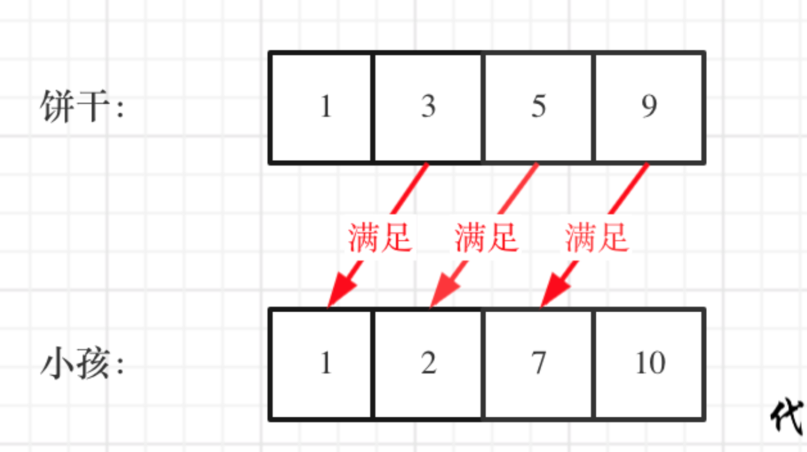
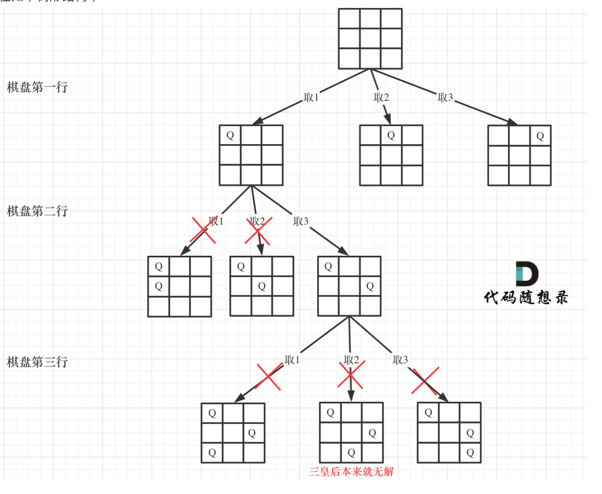

[TOC]


### [**:house:**](../../README.html)

#### [1. 最长数对链](https://leetcode-cn.com/problems/maximum-length-of-pair-chain/)

给出 n 个数对。 在每一个数对中，第一个数字总是比第二个数字小。

现在，我们定义一种跟随关系，当且仅当 b < c 时，数对(c, d) 才可以跟在 (a, b) 后面。我们用这种形式来构造一个数对链。

给定一个数对集合，找出能够形成的最长数对链的长度。你不需要用到所有的数对，你可以以任何顺序选择其中的一些数对来构造。

```java
//根据思路中的描述，按照数对第二个数的升序序列遍历所有数对，如果当前数对可以加入链，则加入。
//时间复杂度O(NlogN)  为排序的复杂度
//空间复杂度O(N)
public int findLongestChain(int[][] pairs) {

        Arrays.sort(pairs,(a,b)->a[1]-b[1]);

        int cur=Integer.MIN_VALUE;
        int res=0;

        for(int i=0;i<pairs.length;i++){

            if(cur<pairs[i][0]){

                cur=pairs[i][1];
                res++;
            }
        }

        return res;
    }
```

#### [376. 摆动序列](https://leetcode-cn.com/problems/wiggle-subsequence/)

如果连续数字之间的差严格地在正数和负数之间交替，则数字序列称为摆动序列。第一个差（如果存在的话）可能是正数或负数。少于两个元素的序列也是摆动序列。

例如， [1,7,4,9,2,5] 是一个摆动序列，因为差值 (6,-3,5,-7,3) 是正负交替出现的。相反, [1,4,7,2,5] 和 [1,7,4,5,5] 不是摆动序列，第一个序列是因为它的前两个差值都是正数，第二个序列是因为它的最后一个差值为零。

给定一个整数序列，返回作为摆动序列的最长子序列的长度。 通过从原始序列中删除一些（也可以不删除）元素来获得子序列，剩下的元素保持其原始顺序。

参考代码：https://leetcode-cn.com/problems/wiggle-subsequence/solution/376-bai-dong-xu-lie-tan-xin-jing-dian-ti-vyxt/


```java
class Solution {
    public int wiggleMaxLength(int[] nums) {
        if (nums.length < 2) {
            return nums.length;
        }
        int preDiff = nums[1] - nums[0];
        int curDiff = 0;
        int result = preDiff == 0 ? 1 : 2;
        for (int i = 2; i < nums.length; i++) {
            curDiff = nums[i] - nums[i - 1];
            if (preDiff >= 0 && curDiff < 0 || preDiff <= 0 && curDiff > 0) {
                result++;
                preDiff = curDiff;
            }

        }
        return result;

    }
}
    }
```

#### [455. 分发饼干](https://leetcode.cn/problems/assign-cookies/)

假设你是一位很棒的家长，想要给你的孩子们一些小饼干。但是，每个孩子最多只能给一块饼干。

对每个孩子 `i`，都有一个胃口值 `g[i]`，这是能让孩子们满足胃口的饼干的最小尺寸；并且每块饼干 `j`，都有一个尺寸 `s[j]` 。如果 `s[j] >= g[i]`，我们可以将这个饼干 `j` 分配给孩子 `i` ，这个孩子会得到满足。你的目标是尽可能满足越多数量的孩子，并输出这个最大数值。

**示例 1:**

```
输入: g = [1,2,3], s = [1,1]
输出: 1
解释: 
你有三个孩子和两块小饼干，3个孩子的胃口值分别是：1,2,3。
虽然你有两块小饼干，由于他们的尺寸都是1，你只能让胃口值是1的孩子满足。
所以你应该输出1。
```

**示例 2:**

```
输入: g = [1,2], s = [1,2,3]
输出: 2
解释: 
你有两个孩子和三块小饼干，2个孩子的胃口值分别是1,2。
你拥有的饼干数量和尺寸都足以让所有孩子满足。
所以你应该输出2.
```



```java
class Solution {
    public int findContentChildren(int[] g, int[] s) {

        Arrays.sort(g);
        Arrays.sort(s);
        int start = 0;
        int count = 0;
        for(int i = 0; i < s.length && start < g.length; i++){
            if(s[i] >= g[start]){
                start++;
                count++;
            }
        }
        return count;

    }
}
```

#### [53. 最大子数组和](https://leetcode.cn/problems/maximum-subarray/)

给你一个整数数组 `nums` ，请你找出一个具有最大和的连续子数组（子数组最少包含一个元素），返回其最大和。**子数组**

是数组中的一个连续部分。

**示例 1：**

```
输入：nums = [-2,1,-3,4,-1,2,1,-5,4]
输出：6
解释：连续子数组 [4,-1,2,1] 的和最大，为 6 。
```

**示例 2：**

```
输入：nums = [1]
输出：1
```

**示例 3：**

```
输入：nums = [5,4,-1,7,8]
输出：23
```

```java
class Solution {
    public int maxSubArray(int[] nums) {
        int result = Integer.MIN_VALUE;
        int curCount = 0;

        for (int i = 0; i < nums.length; i++) {
            curCount += nums[i];
            if (curCount > result) {
                result = curCount;
            }
            if (curCount < 0) {
                curCount = 0;
            }
        }
        return result;

    }
}
```

#### [51. N 皇后](https://leetcode.cn/problems/n-queens/)

按照国际象棋的规则，皇后可以攻击与之处在同一行或同一列或同一斜线上的棋子。

**n 皇后问题** 研究的是如何将 `n` 个皇后放置在 `n×n` 的棋盘上，并且使皇后彼此之间不能相互攻击。

给你一个整数 `n` ，返回所有不同的 **n 皇后问题** 的解决方案。

每一种解法包含一个不同的 **n 皇后问题** 的棋子放置方案，该方案中 `'Q'` 和 `'.'` 分别代表了皇后和空位。



```java
class Solution {
    List<List<String>> result = new ArrayList<>();

    public List<List<String>> solveNQueens(int n) {
        char[][] path = new char[n][n];
        for (char[] c : path) {
            Arrays.fill(c, '.');
        }
        backtracking(0, n, path);
        return result;
    }

    private void backtracking(int row, int n, char[][] path) {
        if (row == n) {
            result.add(array2List(path));
        }

        for (int col = 0; col < n; col++) {
            if (isValid(row, col, path, n)) {
                path[row][col] = 'Q';
                backtracking(row + 1, n, path);
                path[row][col] = '.';
            }
        }
    }

    private List<String> array2List(char[][] path) {
        List<String> result = new ArrayList<>();
        for (char[] item : path) {
            result.add(String.valueOf(item));
        }
        return result;
    }

    private boolean isValid(int row, int col, char[][] path, int n) {
        for (int i = 0; i < row; i++) {
            if (path[i][col] == 'Q') {
                return false;
            }
        }

        for (int i = row - 1, j = col - 1; i >= 0 && j >= 0; i--, j--) {
            if (path[i][j] == 'Q') {
                return false;
            }
        }
        for (int i = row - 1, j = col + 1; i >= 0 && j < n; i--, j++) {
            if (path[i][j] == 'Q') {
                return false;
            }
        }
        return true;

    }
}
```

#### [55. 跳跃游戏](https://leetcode.cn/problems/jump-game/)

给你一个非负整数数组 `nums` ，你最初位于数组的 **第一个下标** 。数组中的每个元素代表你在该位置可以跳跃的最大长度。

判断你是否能够到达最后一个下标，如果可以，返回 `true` ；否则，返回 `false` 。

 

**示例 1：**

```
输入：nums = [2,3,1,1,4]
输出：true
解释：可以先跳 1 步，从下标 0 到达下标 1, 然后再从下标 1 跳 3 步到达最后一个下标。
```

**示例 2：**

```
输入：nums = [3,2,1,0,4]
输出：false
解释：无论怎样，总会到达下标为 3 的位置。但该下标的最大跳跃长度是 0 ， 所以永远不可能到达最后一个下标。
```

```java
class Solution {
    public boolean canJump(int[] nums) {
        if (nums.length == 1) {
            return true;
        }
        int cover = 0;
        for (int i = 0; i <= cover; i++) {
            cover = Math.max(cover, i + nums[i]);
            if (cover >= nums.length - 1) {
                return true;
            }

        }
        return false;

    }
}
```

#### [45. 跳跃游戏 II](https://leetcode.cn/problems/jump-game-ii/)

给定一个长度为 `n` 的 **0 索引**整数数组 `nums`。初始位置为 `nums[0]`。

每个元素 `nums[i]` 表示从索引 `i` 向前跳转的最大长度。换句话说，如果你在 `nums[i]` 处，你可以跳转到任意 `nums[i + j]` 处:

- `0 <= j <= nums[i]` 
- `i + j < n`

返回到达 `nums[n - 1]` 的最小跳跃次数。生成的测试用例可以到达 `nums[n - 1]`。

**示例 1:**

```
输入: nums = [2,3,1,1,4]
输出: 2
解释: 跳到最后一个位置的最小跳跃数是 2。
     从下标为 0 跳到下标为 1 的位置，跳 1 步，然后跳 3 步到达数组的最后一个位置。
```

**示例 2:**

```
输入: nums = [2,3,0,1,4]
输出: 2
```

```java
//动态规划
class Solution {
    public int jump(int[] nums) {

        int[] dp = new int[nums.length];
        Arrays.fill(dp, Integer.MAX_VALUE - 1);
        dp[0] = 0;

        for (int i = 1; i < nums.length; i++) {
            for (int j = 0; j < i; j++) {
                if (nums[j] + j >= i) {
                    dp[i] = Math.min(dp[j] + 1, dp[i]);
                }
            }
        }
        return dp[nums.length - 1];

    }
}
//贪心
class Solution {
    public int jump(int[] nums) {
        int length = nums.length;
        int end = 0;
        int maxPosition = 0; 
        int steps = 0;
        for (int i = 0; i < length - 1; i++) {
            maxPosition = Math.max(maxPosition, i + nums[i]); 
            if (i == end) {
                end = maxPosition;
                steps++;
            }
        }
        return steps;
    }
}
```

```java
class Solution {
    public int removeElement(int[] nums, int val) {

        int slow = 0;

        for(int fast = 0; fast < nums.length; fast++){
            if(nums[fast] != val){
                nums[slow] = nums[fast];
                slow++;
            }
        }

        return slow;

    }
}
```

#### [1005. K 次取反后最大化的数组和](https://leetcode.cn/problems/maximize-sum-of-array-after-k-negations/)

给你一个整数数组 `nums` 和一个整数 `k` ，按以下方法修改该数组：

- 选择某个下标 `i` 并将 `nums[i]` 替换为 `-nums[i]` 。

重复这个过程恰好 `k` 次。可以多次选择同一个下标 `i` 。

以这种方式修改数组后，返回数组 **可能的最大和** 。

**示例 1：**

```
输入：nums = [4,2,3], k = 1
输出：5
解释：选择下标 1 ，nums 变为 [4,-2,3] 。
```

**示例 2：**

```
输入：nums = [3,-1,0,2], k = 3
输出：6
解释：选择下标 (1, 2, 2) ，nums 变为 [3,1,0,2] 。
```

```
class Solution {
    public int largestSumAfterKNegations(int[] nums, int k) {
        Arrays.sort(nums);
        for (int i = 0; i < nums.length; i++) {
            if (nums[i] < 0 && k > 0) {
                nums[i] = -nums[i];
                k--;
            }
        }

        if (k % 2 == 1) {
            Arrays.sort(nums);
            nums[0] = -nums[0];
        }
        return Arrays.stream(nums).sum();

    }
}
```

#### [134. 加油站](https://leetcode.cn/problems/gas-station/)

在一条环路上有 `n` 个加油站，其中第 `i` 个加油站有汽油 `gas[i]` 升。

你有一辆油箱容量无限的的汽车，从第 `i` 个加油站开往第 `i+1` 个加油站需要消耗汽油 `cost[i]` 升。你从其中的一个加油站出发，开始时油箱为空。

给定两个整数数组 `gas` 和 `cost` ，如果你可以按顺序绕环路行驶一周，则返回出发时加油站的编号，否则返回 `-1` 。如果存在解，则 **保证** 它是 **唯一** 的。

**示例 1:**

```
输入: gas = [1,2,3,4,5], cost = [3,4,5,1,2]
输出: 3
解释:
从 3 号加油站(索引为 3 处)出发，可获得 4 升汽油。此时油箱有 = 0 + 4 = 4 升汽油
开往 4 号加油站，此时油箱有 4 - 1 + 5 = 8 升汽油
开往 0 号加油站，此时油箱有 8 - 2 + 1 = 7 升汽油
开往 1 号加油站，此时油箱有 7 - 3 + 2 = 6 升汽油
开往 2 号加油站，此时油箱有 6 - 4 + 3 = 5 升汽油
开往 3 号加油站，你需要消耗 5 升汽油，正好足够你返回到 3 号加油站。
因此，3 可为起始索引。
```

```java
//i从0开始累加rest[i]，和记为curSum，一旦curSum小于零，说明[0, i]区间都不能作为起始位置，因为这个区间选择任何一个位置作为起点，到i这里都会断油，那么起始位置从i+1算起，再从0计算curSum。
class Solution {
    public int canCompleteCircuit(int[] gas, int[] cost) {

        int curSum = 0;
        int totalSum = 0;
        int startIdx = 0;
        for (int i = 0; i < gas.length; i++) {
            curSum += gas[i] - cost[i];
            totalSum += gas[i] - cost[i];
            if (curSum < 0) {
                startIdx = i + 1;
                curSum = 0;
            }
        }
        if (totalSum < 0) {
            return -1;
        }
        return startIdx;

    }
}
```

#### [135. 分发糖果](https://leetcode.cn/problems/candy/)

`n` 个孩子站成一排。给你一个整数数组 `ratings` 表示每个孩子的评分。

你需要按照以下要求，给这些孩子分发糖果：

- 每个孩子至少分配到 `1` 个糖果。
- 相邻两个孩子评分更高的孩子会获得更多的糖果。

请你给每个孩子分发糖果，计算并返回需要准备的 **最少糖果数目** 。

 

**示例 1：**

```
输入：ratings = [1,0,2]
输出：5
解释：你可以分别给第一个、第二个、第三个孩子分发 2、1、2 颗糖果。
```

```java
class Solution {
    public int candy(int[] ratings) {

        int[] candy = new int[ratings.length];

        for (int i = 0; i < ratings.length; i++) {
            if (i > 0 && ratings[i] > ratings[i - 1]) {
                candy[i] = candy[i - 1] + 1;
            } else {
                candy[i] = 1;
            }
        }

        for (int i = ratings.length - 2; i >= 0; i--) {
            if (ratings[i] > ratings[i + 1] && candy[i] <= candy[i + 1]) {
                candy[i] = candy[i + 1] + 1;
            }
        }
        return Arrays.stream(candy).sum();

    }
}
```

#### [860. 柠檬水找零](https://leetcode.cn/problems/lemonade-change/)

在柠檬水摊上，每一杯柠檬水的售价为 `5` 美元。顾客排队购买你的产品，（按账单 `bills` 支付的顺序）一次购买一杯。

每位顾客只买一杯柠檬水，然后向你付 `5` 美元、`10` 美元或 `20` 美元。你必须给每个顾客正确找零，也就是说净交易是每位顾客向你支付 `5` 美元。

注意，一开始你手头没有任何零钱。

给你一个整数数组 `bills` ，其中 `bills[i]` 是第 `i` 位顾客付的账。如果你能给每位顾客正确找零，返回 `true` ，否则返回 `false` 。

**示例 1：**

```
输入：bills = [5,5,5,10,20]
输出：true
解释：
前 3 位顾客那里，我们按顺序收取 3 张 5 美元的钞票。
第 4 位顾客那里，我们收取一张 10 美元的钞票，并返还 5 美元。
第 5 位顾客那里，我们找还一张 10 美元的钞票和一张 5 美元的钞票。
由于所有客户都得到了正确的找零，所以我们输出 true。
```

```java
class Solution {
    public boolean lemonadeChange(int[] bills) {
        int five = 0;
        int ten = 0;

        for (int bill : bills) {
            if (bill == 5) {
                five++;
            } else if (bill == 10) {
                if (five < 0) {
                    return false;
                }
                five--;
                ten++;
            } else if (bill == 20) {
                if (five > 0 && ten > 0) {
                    five--;
                    ten--;
                } else if (five >= 3) {
                    five -= 3;
                } else {
                    return false;
                }
            }
        }
        return true;

    }
}
```

#### [406. 根据身高重建队列](https://leetcode.cn/problems/queue-reconstruction-by-height/)

假设有打乱顺序的一群人站成一个队列，数组 `people` 表示队列中一些人的属性（不一定按顺序）。每个 `people[i] = [hi, ki]` 表示第 `i` 个人的身高为 `hi` ，前面 **正好** 有 `ki` 个身高大于或等于 `hi` 的人。

请你重新构造并返回输入数组 `people` 所表示的队列。返回的队列应该格式化为数组 `queue` ，其中 `queue[j] = [hj, kj]` 是队列中第 `j` 个人的属性（`queue[0]` 是排在队列前面的人）。

**示例 1：**

```
输入：people = [[7,0],[4,4],[7,1],[5,0],[6,1],[5,2]]
输出：[[5,0],[7,0],[5,2],[6,1],[4,4],[7,1]]
解释：
编号为 0 的人身高为 5 ，没有身高更高或者相同的人排在他前面。
编号为 1 的人身高为 7 ，没有身高更高或者相同的人排在他前面。
编号为 2 的人身高为 5 ，有 2 个身高更高或者相同的人排在他前面，即编号为 0 和 1 的人。
编号为 3 的人身高为 6 ，有 1 个身高更高或者相同的人排在他前面，即编号为 1 的人。
编号为 4 的人身高为 4 ，有 4 个身高更高或者相同的人排在他前面，即编号为 0、1、2、3 的人。
编号为 5 的人身高为 7 ，有 1 个身高更高或者相同的人排在他前面，即编号为 1 的人。
因此 [[5,0],[7,0],[5,2],[6,1],[4,4],[7,1]] 是重新构造后的队列。
```

```java
class Solution {
    public int[][] reconstructQueue(int[][] people) {
        Arrays.sort(people, (o1,o2) -> {
            if(o1[0] == o2[0]){
                return o1[1] - o2[1];
            }
            return o2[0] - o1[0];
        });

        LinkedList<int[]> queue = new LinkedList<>();
        for(int[] item : people){
            queue.add(item[1], item);
            
        }
        return queue.toArray(new int[people.length][2]);
    }
}
```

#### [452. 用最少数量的箭引爆气球](https://leetcode.cn/problems/minimum-number-of-arrows-to-burst-balloons/)

有一些球形气球贴在一堵用 XY 平面表示的墙面上。墙面上的气球记录在整数数组 `points` ，其中`points[i] = [xstart, xend]` 表示水平直径在 `xstart` 和 `xend`之间的气球。你不知道气球的确切 y 坐标。

一支弓箭可以沿着 x 轴从不同点 **完全垂直** 地射出。在坐标 `x` 处射出一支箭，若有一个气球的直径的开始和结束坐标为 `x``start`，`x``end`， 且满足  `xstart ≤ x ≤ x``end`，则该气球会被 **引爆** 。可以射出的弓箭的数量 **没有限制** 。 弓箭一旦被射出之后，可以无限地前进。

给你一个数组 `points` ，*返回引爆所有气球所必须射出的 **最小** 弓箭数* 。

 

**示例 1：**

```
输入：points = [[10,16],[2,8],[1,6],[7,12]]
输出：2
解释：气球可以用2支箭来爆破:
-在x = 6处射出箭，击破气球[2,8]和[1,6]。
-在x = 11处发射箭，击破气球[10,16]和[7,12]。
```

```java
class Solution {
    public int findMinArrowShots(int[][] points) {

        Arrays.sort(points, (o1, o2) -> Integer.compare(o1[0], o2[0]));
        int result = 1;
        for (int i = 1; i < points.length; i++) {
            if (points[i][0] > points[i - 1][1]) {
                result++;
            } else {
                points[i][1] = Math.min(points[i][1], points[i - 1][1]);
            }
        }

        return result;
    }
}
```

#### [435. 无重叠区间](https://leetcode.cn/problems/non-overlapping-intervals/)

给定一个区间的集合 `intervals` ，其中 `intervals[i] = [starti, endi]` 。返回 *需要移除区间的最小数量，使剩余区间互不重叠* 。

 

**示例 1:**

```
输入: intervals = [[1,2],[2,3],[3,4],[1,3]]
输出: 1
解释: 移除 [1,3] 后，剩下的区间没有重叠。
```

**示例 2:**

```
输入: intervals = [ [1,2], [1,2], [1,2] ]
输出: 2
解释: 你需要移除两个 [1,2] 来使剩下的区间没有重叠。
```

**示例 3:**

```
输入: intervals = [ [1,2], [2,3] ]
输出: 0
解释: 你不需要移除任何区间，因为它们已经是无重叠的了。
```

```java
class Solution {
    public int eraseOverlapIntervals(int[][] intervals) {
        Arrays.sort(intervals, (o1, o2) -> Integer.compare(o1[0], o2[0]));
        int count = 1;

        for (int i = 1; i < intervals.length; i++) {
            if (intervals[i][0] < intervals[i - 1][1]) {
                intervals[i][1] = Math.min(intervals[i - 1][1], intervals[i][1]);
            } else {
                count++;
            }
        }
        return intervals.length - count;

    }
}
```

#### [738. 单调递增的数字](https://leetcode.cn/problems/monotone-increasing-digits/)

当且仅当每个相邻位数上的数字 `x` 和 `y` 满足 `x <= y` 时，我们称这个整数是**单调递增**的。

给定一个整数 `n` ，返回 *小于或等于 `n` 的最大数字，且数字呈 **单调递增*** 。

**示例 1:**

```
输入: n = 10
输出: 9
```

**示例 2:**

```
输入: n = 1234
输出: 1234
```

**示例 3:**

```
输入: n = 332
输出: 299
```

```java
class Solution {
    public int monotoneIncreasingDigits(int n) {
        String s = String.valueOf(n);
        char[] ch = s.toCharArray();
        int start = ch.length;
        for (int i = ch.length - 2; i >= 0; i--) {
            if (ch[i] > ch[i + 1]) {
                ch[i]--;
                start = i + 1;
            }
        }
        for (int i = start; i < ch.length; i++) {
            ch[i] = '9';
        }
        return Integer.parseInt(String.valueOf(ch));
    }
}
```

