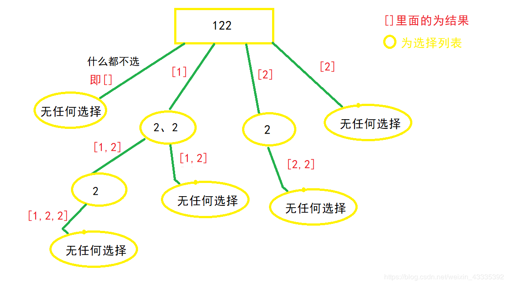

[TOC]


### [**:house:**](../../README.html)

#### [1. 青蛙跳台阶](https://leetcode-cn.com/problems/qing-wa-tiao-tai-jie-wen-ti-lcof/)

一只青蛙一次可以跳上1级台阶，也可以跳上2级。求该青蛙跳上一个n级的台阶总共有多少种跳法（先后次序不同算不同的结果）。

```java
//时间复杂度:O(N)
//空间复杂度O(1)
 public int numWays(int n) {

        int a = 1;
        int b = 1;
    
        for(int i = 0; i < n; i++){

            int sum = (a + b)%1000000007;
            a = b;
            b = sum;
        }

        return a;
    }
```

#### [2.斐波那契数列]()

```java 
F(0) = 0,   F(1) = 1
F(N) = F(N - 1) + F(N - 2), 其中 N > 1.
```

```java
 public int Fibonacci(int n) {
        
        int a=0;
        int b=1;
        for(int i=0;i<n;i++){
            
            int sum=a+b;
            a=b;
            b=sum;
        }
        
        return a;
        
        

    }
```

#### [剑指 Offer 64. 求1+2+…+n](https://leetcode-cn.com/problems/qiu-12n-lcof/)

求 `1+2+...+n` ，要求不能使用乘除法、for、while、if、else、switch、case等关键字及条件判断语句（A?B:C）。

```java
//使用&& 运算短路
//时间复杂度O(N)
//空间复杂度O(N)
public int sumNums(int n) {
       //使用&&的阻断功能
        boolean x = (n > 1) && (n += sumNums(n - 1)) > 0;
        return n;


    }
```

#### [46. 全排列](https://leetcode-cn.com/problems/permutations/)

给定一个不含重复数字的数组 `nums` ，返回其 **所有可能的全排列** 。你可以 **按任意顺序** 返回答案。


```java
 public List<List<Integer>> permute(int[] nums) {

        List<List<Integer>> res = new ArrayList<>();
        if(nums.length == 0)  return res;

        boolean []used = new boolean[nums.length];
        ArrayList<Integer> path = new ArrayList<>();
        dfs(res,nums,used,path,0);
        return res;

    }

    public void dfs(List<List<Integer>> res, int[] nums, boolean[] used,ArrayList<Integer> path,int depth){

        if(depth == nums.length){

            res.add(new ArrayList<>(path));//因为path是传参的参数，所以需要拷贝一下，不然后面会为空的
            return;
        }

        for(int i = 0; i < nums.length; i++){//对于每一层需要遍历所有结点

            if(!used[i]){

                path.add(nums[i]);//选中该结点
                used[i] = true;
            

            dfs(res,nums,used,path,depth+1);//固定该结点，继续向下遍历
            used[i] = false;//撤销该结点
            path.remove(path.size()-1);
            }
        }
    }
```

#### [47. 全排列 II](https://leetcode-cn.com/problems/permutations-ii/)

给定一个可包含重复数字的序列 `nums` ，**按任意顺序** 返回所有不重复的全排列。


```java
 //时间复杂度O(n*n!)
//空间复杂度O(N)
public List<List<Integer>> permuteUnique(int[] nums) {


        List<List<Integer>> res = new ArrayList<>();
        if(nums.length == 0) return res;
        Arrays.sort(nums);
        boolean []used = new boolean[nums.length];
        List<Integer> path = new ArrayList<>();
        dfs(nums,res,path,0,used);
        return res;
    }

    public void dfs(int[]nums,List<List<Integer>> res,List<Integer> path,int depth,boolean []used){

        if(depth == nums.length){

            res.add(new ArrayList<>(path));
            return;
        }

        for(int i = 0; i < nums.length;i++){

            if(used[i] || ((i-1 >= 0) && !used[i-1] && nums[i] == nums[i-1])){

                continue;//如果该结点用过或者该节点的前面一个结点没有用过且等于前面一个结点就跳过
            }

           path.add(nums[i]);
           used[i] = true;

           dfs(nums,res,path,depth+1,used);
           path.remove(path.size()-1);
           used[i] = false;
        }
    }
```

#### [78. 子集](https://leetcode-cn.com/problems/subsets/)

给你一个整数数组 `nums` ，数组中的元素 **互不相同** 。返回该数组所有可能的子集（幂集）。

解集 **不能** 包含重复的子集。你可以按 **任意顺序** 返回解集。\


```java
//一共有2^n种情况，时间复杂度为O(2^n)
//空间复杂度O(N)递归的深度为N
	List<List<Integer>> res;
    List<Integer> path;
    public List<List<Integer>> subsets(int[] nums) {

        res = new ArrayList<>();
        path = new ArrayList<>();
        dfs(nums,0);
        return res;

    }

    public void dfs(int [] nums,int idx){

        res.add(new ArrayList<>(path));//每递归到一个地方就把这个给加进去

        for(int i = idx; i < nums.length;i++){//注意每一层的i与上一次的i有关
            path.add(nums[i]);
            dfs(nums,i+1);
            path.remove(path.size()-1);
        }
    }
```

#### [90. 子集 II](https://leetcode-cn.com/problems/subsets-ii/)

给你一个整数数组 nums ，其中可能包含重复元素，请你返回该数组所有可能的子集（幂集）。

解集 不能 包含重复的子集。返回的解集中，子集可以按 任意顺序 排列。



```java
 List<List<Integer>> res;
    List<Integer> path;
    public List<List<Integer>> subsetsWithDup(int[] nums) {

            res = new ArrayList<>();
            path = new ArrayList<>();
            Arrays.sort(nums);
            dfs(nums,0);
            return res;

    }

    public void dfs(int []nums,int idx){

        res.add(new ArrayList<>(path));

        for(int i = idx; i < nums.length;i++){

            if(i > idx && nums[i] == nums[i-1]){//这里i>idx表示在同一层下遇到了和前面一个元素相同的

                continue;
            }

            path.add(nums[i]);
            dfs(nums,i+1);
            path.remove(path.size()-1);
        }
    }
```

#### [面试题 08.06. 汉诺塔问题](https://leetcode-cn.com/problems/hanota-lcci/)

在经典汉诺塔问题中，有 3 根柱子及 N 个不同大小的穿孔圆盘，盘子可以滑入任意一根柱子。一开始，所有盘子自上而下按升序依次套在第一根柱子上(即每一个盘子只能放在更大的盘子上面)。移动圆盘时受到以下限制:
(1) 每次只能移动一个盘子;
(2) 盘子只能从柱子顶端滑出移到下一根柱子;
(3) 盘子只能叠在比它大的盘子上。

请编写程序，用栈将所有盘子从第一根柱子移到最后一根柱子。

```java
public void hanota(List<Integer> A, List<Integer> B, List<Integer> C)s {


         int n = A.size();
         hanota(n,A,B,C);
    }

    public void hanota(int n, List<Integer> a, List<Integer> b, List<Integer> c){

         //如果A柱子只剩一个盘子，那么直接移动到C柱子即可
        if(n == 1){

            c.add(a.remove(a.size()-1));
            return;
        }
         //把A柱子上面的n-1个盘子，借助辅助柱子C，放到柱子B上
        hanota(n - 1,a,c,b);
        //此时A柱子剩下那个盘子是n个盘子中最大的那个，把他移动到C柱子上
        c.add(a.remove(a.size()-1));
        //最后把刚才放在B柱子上的n-1个盘子，借助柱子A辅助，放到柱子C上
        hanota(n - 1,b,a,c);

    }
```

#### [面试题 08.01. 三步问题](https://leetcode-cn.com/problems/three-steps-problem-lcci/)

三步问题。有个小孩正在上楼梯，楼梯有n阶台阶，小孩一次可以上1阶、2阶或3阶。实现一种方法，计算小孩有多少种上楼梯的方式。结果可能很大，你需要对结果模1000000007。

```java
public int waysToStep(int n) {

        if(n <= 2)  return n;
        if(n == 3) return n + 1;
        int a = 1;
        int b = 2;
        int c = 4;
        
        int res = 0;
        for(int i = 4; i <= n; i++){

            res = ((a + b)% 1000000007 + c) % 1000000007;
            a = b;
            b = c;
            c = res;
        }

        return res;

    }
```

#### [面试题 08.08. 有重复字符串的排列组合](https://leetcode-cn.com/problems/permutation-ii-lcci/)

有重复字符串的排列组合。编写一种方法，计算某字符串的所有排列组合。

```java
 //先排序
 //时间复杂度O(n*n!)
//空间复杂度O()
	List<String> ans;
    boolean [] visited;
    public String[] permutation(String S) {

        ans = new ArrayList<String>();
        visited = new boolean[S.length()];
        char [] ch = S.toCharArray();
        Arrays.sort(ch);
        dfs(ch,0,new StringBuilder());
        String[] res = new String[ans.size()];
        return ans.toArray(res);


    }

    public void dfs(char []ch, int cur, StringBuilder path){

        if(cur == ch.length){

                ans.add(new String(path));
                return;
        }

        for(int i = 0; i < ch.length;i++){

            if(visited[i] ||  i > 0 && !visited[i-1]  && ch[i-1] == ch[i]){//如果当前字母使用过或者前面一个字母没有使用过，同时等于前一个字母就剪枝

                continue;
            }

            visited[i] = true;
            path.append(ch[i]);
            dfs(ch,cur+1,path);
            visited[i] = false;
            path.deleteCharAt(path.length()-1);
        }
    }
```

