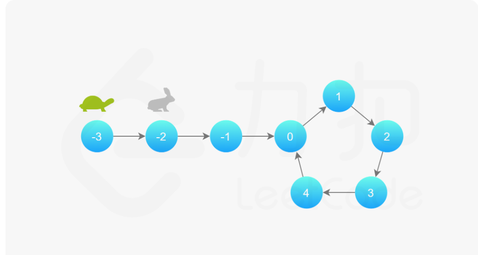
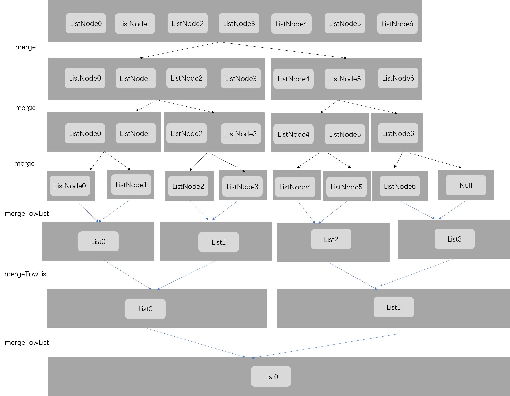
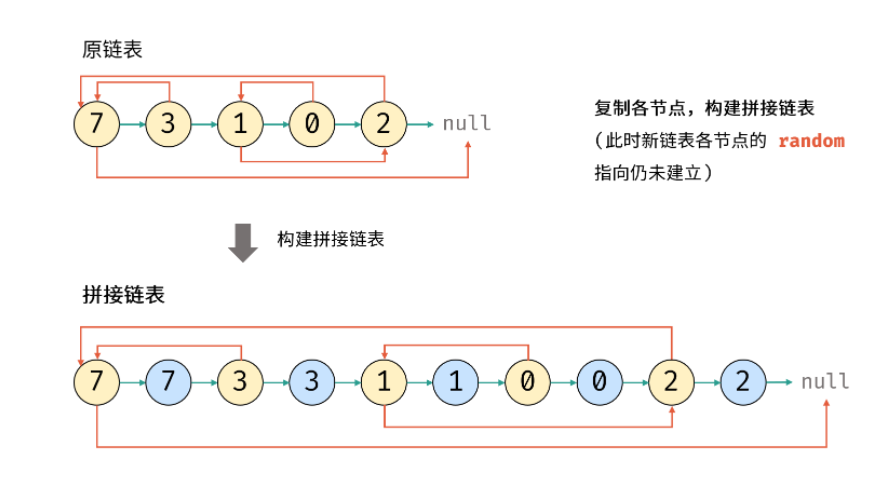

[TOC]


### [**:house:**](../../README.html)

```java
import java.util.Scanner; 
 
public class ScannerDemo {
    public static void main(String[] args) {
        Scanner scan = new Scanner(System.in);
        // 从键盘接收数据
 
        // next方式接收字符串
        System.out.println("next方式接收：");
        // 判断是否还有输入
        if (scan.hasNext()) {
            String str1 = scan.next();
            System.out.println("输入的数据为：" + str1);
        }
        scan.close();
    }
}
```

#### Java LinkedList

| 方法                                           | 描述                                                         |
| :--------------------------------------------- | :----------------------------------------------------------- |
| public boolean add(E e)                        | 链表末尾添加元素，返回是否成功，成功为 true，失败为 false。  |
| public void add(int index, E element)          | 向指定位置插入元素。                                         |
| public boolean addAll(Collection c)            | 将一个集合的所有元素添加到链表后面，返回是否成功，成功为 true，失败为 false。 |
| public boolean addAll(int index, Collection c) | 将一个集合的所有元素添加到链表的指定位置后面，返回是否成功，成功为 true，失败为 false。 |
| public void addFirst(E e)                      | 元素添加到头部。                                             |
| public void addLast(E e)                       | 元素添加到尾部。                                             |
| public boolean offer(E e)                      | 向链表末尾添加元素，返回是否成功，成功为 true，失败为 false。 |
| public boolean offerFirst(E e)                 | 头部插入元素，返回是否成功，成功为 true，失败为 false。      |
| public boolean offerLast(E e)                  | 尾部插入元素，返回是否成功，成功为 true，失败为 false。      |
| public void clear()                            | 清空链表。                                                   |
| public E removeFirst()                         | 删除并返回第一个元素。                                       |
| public E removeLast()                          | 删除并返回最后一个元素。                                     |
| public boolean remove(Object o)                | 删除某一元素，返回是否成功，成功为 true，失败为 false。      |
| public E remove(int index)                     | 删除指定位置的元素。                                         |
| public E poll()                                | 删除并返回第一个元素。                                       |
| public E remove()                              | 删除并返回第一个元素。                                       |
| public boolean contains(Object o)              | 判断是否含有某一元素。                                       |
| public E get(int index)                        | 返回指定位置的元素。                                         |
| public E getFirst()                            | 返回第一个元素。                                             |
| public E getLast()                             | 返回最后一个元素。                                           |
| public int indexOf(Object o)                   | 查找指定元素从前往后第一次出现的索引。                       |
| public int lastIndexOf(Object o)               | 查找指定元素最后一次出现的索引。                             |
| public E peek()                                | 返回第一个元素。                                             |
| public E element()                             | 返回第一个元素。                                             |
| public E peekFirst()                           | 返回头部元素。                                               |
| public E peekLast()                            | 返回尾部元素。                                               |
| public E set(int index, E element)             | 设置指定位置的元素。                                         |
| public Object clone()                          | 克隆该列表。                                                 |
| public Iterator descendingIterator()           | 返回倒序迭代器。                                             |
| public int size()                              | 返回链表元素个数。                                           |
| public ListIterator listIterator(int index)    | 返回从指定位置开始到末尾的迭代器。                           |
| public Object[] toArray()                      | 返回一个由链表元素组成的数组。                               |
| public T[] toArray(T[] a)                      | 返回一个由链表元素转换类型而成的数组。                       |

`  return queue.toArray(new int[people.length][]);`

#### [1. 链表反转](https://leetcode-cn.com/problems/reverse-linked-list/)

输入一个链表，反转链表后，输出新链表的表头。

```java
 class ListNode {
     int val;
     ListNode next;
     ListNode(int x) { val = x; }
 }

//时间复杂度O(N) 需要遍历每个节点
//空间复杂度O(1)
public static ListNode ReverseList(ListNode head) {
        
        ListNode node=null; //先定义一个空节点
        
        while(head!=null){  
            
            ListNode next=head.next; //保存下一个节点
            head.next=node;//当前节点指向上一个节点
            node=head;//作为下一轮反转的上一个节点
            head=next;//继续往下走
        } 
        return node;    
    }
```

#### [2.判断链表是否有环](https://leetcode-cn.com/problems/linked-list-cycle/)

判断给定的链表中是否有环。如果有环则返回true，否则返回false。

你能给出空间复杂度O(1)的解法么？



```java
//时间复杂度O(N)
//空间复杂度O(1)
public boolean hasCycle(ListNode head) {
        
        if(head==null || head.next==null)  return false;
        ListNode slow=head;//慢指针
        ListNode fast=head.next;//快指针
        while(fast!=null && fast.next!=null){
            
            if(slow==fast)  return true;
            slow=slow.next;//每次走一步
            fast=fast.next.next;//每次走两步
            
        }
        
        return false;
    }
```

#### [3. 合并两个有序链表](https://leetcode-cn.com/problems/he-bing-liang-ge-pai-xu-de-lian-biao-lcof/)

将两个有序的链表合并为一个新链表，要求新的链表是通过拼接两个链表的节点来生成的，且合并后新链表依然有序。

```java
//时间复杂度：O(N+M)
//空间夫复杂度：O(1)
  public ListNode mergeTwoLists(ListNode l1, ListNode l2) {

        ListNode pre = new ListNode(0);
        ListNode head = pre;
        while(l1 != null && l2 != null){

            if(l1.val < l2.val){

                pre.next = l1;
                l1 = l1.next;
            
            }
            else{
                pre.next = l2;
                l2 = l2.next; 
            }
            pre = pre.next;
        }

        if(l1 != null) pre.next = l1;
        if(l2 != null) pre.next = l2;
        return head.next;

    }
```

#### [4.链表中的节点每K个一组翻转](https://leetcode-cn.com/problems/reverse-nodes-in-k-group/solution/k-ge-yi-zu-fan-zhuan-lian-biao-by-leetcode-solutio/)

```java
//时间复杂度：O(N)
//空间复杂度O(1)
public ListNode reverseKGroup (ListNode head, int k) {
        // write code here  
            ListNode hair=new ListNode(0);//伪头节点
            hair.next=head;
            ListNode pre=hair;
        
            int i=0;
            while(head!=null && i<k){
                    
                if(i<k-1){
                    head=head.next;
                    i++;
                }
                else if(i==k-1){
                    
                    i=0;
                    ListNode next=head.next;
                    ListNode[] rev=reverse(pre.next,head);//每k个一组进行反转
                    pre.next=rev[0];
                    rev[1].next=next;
                    head=next;
                    pre=rev[1];                                         
            }     
        }
         return hair.next;
    }
   public ListNode[] reverse (ListNode left,ListNode right){
       
       
       ListNode pre=null;
       ListNode tail=left;
       ListNode temp=left;
       while(temp!=right){
           
           ListNode next=temp.next;
           temp.next=pre;
           pre=temp;
           temp=next;
           
       }
       temp.next=pre;
       
       return new ListNode[]{temp, tail};
           
          
   }
```

#### [5.链表环中的入口结点](https://leetcode-cn.com/problems/linked-list-cycle-ii/)

对于一个给定的链表，返回环的入口节点，如果没有环，返回null

拓展：

你能给出不利用额外空间的解法么？


fast=a+b+c+b;

slow=a+b；

fast=slow*2;------>a=c   

```java
//时间复杂度O(N)
//空间复杂度O(1)
public ListNode detectCycle(ListNode head) {
        
        if(head==null || head.next==null) return null;
        
        ListNode slow=head;
        ListNode fast=head;
        
        while(fast!=null && fast.next!=null){
            
            slow=slow.next;
            fast=fast.next.next;
            if(fast==slow){
                fast=head;
                while(fast!=slow){
                    
                    fast=fast.next;
                    slow=slow.next;
                }
                
                return slow;
            }      
            
        }
        
        return null;
        
        
        
    }
```

#### [6.删除链表的倒数第n个节点](https://leetcode-cn.com/problems/lian-biao-zhong-dao-shu-di-kge-jie-dian-lcof/)

```java
//时间复杂度O(N)
//空间复杂度O(1)
public ListNode removeNthFromEnd (ListNode head, int n) {
        // write code here
        ListNode fast=head;
        ListNode slow=head;
        int i=0;
        while(i<n){//先让快指针往前走n步
            
            fast=fast.next;
            i++;
        }
        if(fast==null) return head.next;
        while(fast.next!=null){
            
            fast=fast.next;
            slow=slow.next;
        }
        slow.next=slow.next.next;
        return head;
        
    }
```

#### [7.两个链表的第一个公共节点](https://leetcode-cn.com/problems/intersection-of-two-linked-lists/)

输入两个链表，找出它们的第一个公共结点。（注意因为传入数据是链表，所以错误测试数据的提示是用其他方式显示的，保证传入数据是正确的）

```java
//将第一个链表的尾部和第二个链表的头部连起来，用一个指针遍历，将第二个链表的尾部和第一个链表的头部连起来，用另一个指针遍历，两个指针相遇，就是公共节点。
//时间复杂度O(M+N) 空间复杂度O(1) 
public ListNode FindFirstCommonNode(ListNode pHead1, ListNode pHead2) {
        
        
        ListNode head1=pHead1;
        ListNode head2=pHead2;
        
        while(head1!=head2){//如果不相交，当二者都为null的时候相等
            
            if(head1==null) head1=pHead2;//为什么head1.next==null会报错
            else head1=head1.next;
            if(head2==null) head2=pHead1;
            else head2=head2.next;
            
            
        }
        
        return head1;
        
    }
```

#### [8.两个链表生成相加链表](https://leetcode-cn.com/problems/sum-lists-lcci/)

假设链表中每一个节点的值都在 0 - 9 之间，那么链表整体就可以代表一个整数。

给定两个这种链表，请生成代表两个整数相加值的结果链表。

例如：链表 1 为 9->3->7，链表 2 为 6->3，最后生成新的结果链表为 1->0->0->0。

```java
//思路：将两个链表反转之后相加
//时间复杂度：反转链表O(M+N)+链表相加O(Max{M,n})
public ListNode addInList (ListNode head1, ListNode head2) {
        // write code here
        
        ListNode node1=reverse(head1);//反转链表
        ListNode node2=reverse(head2);//反转链表
        ListNode head=new ListNode(0);
        ListNode pre=head;
        int carry=0;
    //链表相加
        while(node1!=null || node2!=null || carry!=0){
            
            int i=0;
            int j=0;
            if(node1!=null){           
                 i=node1.val;
                node1=node1.next;
            }
            if(node2!=null){       
              
                j=node2.val;
                node2=node2.next;
            }
            int sum=i+j+carry;
            carry=sum/10;
            ListNode node=new ListNode(sum%10);
            head.next=node;
            head=node;
            
            
        }
        
        return reverse(pre.next);//反转相加后的链表
           
    }
   //反转链表 
    public ListNode reverse(ListNode head){
        
        ListNode pre=null;
        ListNode node =head;
        while(node!=null){
            
            ListNode next=node.next;
            node.next=pre;
            pre=node;
            node=next;
        
        }
        return pre;
    }
```

#### [8.合并k个已经排序的链表](https://leetcode-cn.com/problems/merge-k-sorted-lists/solution/he-bing-kge-pai-xu-lian-biao-by-leetcode-solutio-2/)



```java
//时间复杂度计算:设有k组，链表最大长度为n
//第一轮合并k/2组链表，每一组的代价为O(2n)，第二轮合并k/4组链表。每一组代价为O(4n)....
//一共有logk轮，则复杂度为O(kn*logK)
//递归会使用到O(logk)空间代价
public ListNode mergeKLists(ArrayList<ListNode> lists) {
        
       return  merge(lists,0, lists.size()-1);
        
    }
    
    public ListNode merge(ArrayList<ListNode> lists,int l,int r){
        
        if(l==r) return lists.get(l);
        if(l>r ) return null;
        
        int mid=(l+r)/2;
        
        return mergeTwoList(merge(lists,l,mid),merge(lists,mid+1,r));//递归
    }
    //合并两个链表
    public ListNode mergeTwoList(ListNode l1,ListNode l2){
        
        ListNode pre=new ListNode(0);
        ListNode head=pre;
        
        while(l1!=null && l2!=null){
            
            if(l1.val<l2.val){
                
                pre.next=l1;
                l1=l1.next;
                
            }
            else{
                
                pre.next=l2;
                l2=l2.next;
            }
            pre=pre.next;
        }
        
       if(l1!=null) pre.next=l1;
       if(l2!=null) pre.next=l2;
        return head.next;
    }
```

#### [9. 排序链表](https://leetcode-cn.com/problems/sort-list/)

给你链表的头结点 `head` ，请将其按 **升序** 排列并返回 **排序后的链表** 。


```java
//时间复杂度O(nlogn)
//空间复杂度O(1)
public ListNode sortList(ListNode head) {

        ListNode pre=new ListNode(0);
        pre.next=head;
        ListNode hair=pre;
        int len=0;//先计算链表的长度
        while(head!=null){

            len++;
            head=head.next;
        }

        for(int curlen=1;curlen<len;curlen<<=1){//每次合并长度为之前的二倍
            ListNode curpre=pre;
            ListNode curhead=pre.next;
            while(curhead!=null){//遍历链表并合并
               
                ListNode head1=curhead;
                for(int i=1;i<curlen && curhead!=null;i++){
                      
                      curhead=curhead.next;
                }
                ListNode tail1=curhead;

                if(curhead!=null){
                    curhead=curhead.next;
                    tail1.next=null;
                }
                 ListNode head2=curhead;
                for(int i=1;i<curlen && curhead!=null;i++){

                    curhead=curhead.next;
                }
                ListNode tail2=curhead;
                if(curhead!=null) 
                {
                    curhead=curhead.next;
                    tail2.next=null;
                }
                ListNode mergehead=merge(head1,head2);
                curpre.next=mergehead;
                while(curpre.next!=null){

                    curpre=curpre.next;
                }
                
                curpre.next=curhead; 
               
            }
        
        }

        return pre.next;
    }
//合并两个有序链表
    public ListNode merge(ListNode head1,ListNode head2){

        ListNode pre=new ListNode(0);
        ListNode head=pre;
        while(head1!=null && head2!=null){

            if(head1.val>head2.val){

              head.next=head2;
              head2=head2.next;

            }else{

                head.next=head1;
                head1=head1.next;
                
            }
            head=head.next;
        }

        if(head1!=null) head.next=head1;
        if(head2!=null) head.next=head2;
        return pre.next;
    }
```

#### [10.回文链表](https://leetcode-cn.com/problems/palindrome-linked-list-lcci/)

编写一个函数，检查输入的链表是否是回文的。

```java
//使用快慢指针找到中点(奇数和偶数处理情况不一样)
//反转后面的链表
//判断两个链表是否相同
//时间复杂度O(N) 空间复杂度O(1)
public boolean isPalindrome(ListNode head) {

        ListNode slow = head;
        ListNode fast = head;
        while(fast != null && fast.next !=null){//找到中间点

            slow = slow.next;
            fast = fast.next.next;

        }
        
        if(fast != null)  slow = slow.next;//如果是奇数个，需要从下一个节点开始
        ListNode cur = reverseListNode(slow);//反转后面的链表
        while(cur != null){//比较反转后的链表是否相等

            if(cur.val != head.val)  return false;
            cur = cur.next;
            head = head.next;
        }

        return true;

    }

    public ListNode reverseListNode(ListNode head){

        ListNode pre = null;
        
        while(head != null){

            ListNode next = head.next;
            head.next = pre;
            pre = head;
            head = next;
        }

        return pre;
    }
```

#### [剑指 Offer 35. 复杂链表的复制](https://leetcode-cn.com/problems/fu-za-lian-biao-de-fu-zhi-lcof/)

请实现 copyRandomList 函数，复制一个复杂链表。在复杂链表中，每个节点除了有一个 next 指针指向下一个节点，还有一个 random 指针指向链表中的任意节点或者 null。



```java
/*方法一：
使用hashmap存储原链表的node和复制的node
之后通过递归的方式重建链表
时间复杂度O(N)
空间复杂度O(N)
*/
	HashMap<Node,Node> map = new HashMap<>();//前一个node是原链表的node,后面那个node是复制的
    public Node copyRandomList(Node head) {

        if(head == null)  return head;

        if(map.containsKey(head)){//如果node已经有了，直接返回就行

            return map.get(head);
        }
        

        Node node = new Node(head.val,null,null);//如果head的复制节点没有，就创建并放入map中
        map.put(head,node);

        node.next = copyRandomList(head.next);//创建或者获取node的next节点
        node.random = copyRandomList(head.random);//创建或者获取node的random节点

        return node;
        
    }

//方法2：首先先拼接链表，也就是原链表的每个节点的next为他的复制的节点
//遍历拼接后的链表，根据原链表的random来获取复制节点的random
//拆分链表
//时间复杂度O(N)空间复杂度O(1)
 public Node copyRandomList(Node head) {
      
       if(head == null)  return head;
       Node cur = head;
       while(cur != null){//拼接链表

           Node node = new Node(cur.val);
           node.next = cur.next;
           cur.next = node;
           cur = node.next;
       }

       cur = head;
       while(cur != null){//获取复制节点的random

           if(cur.random != null){

               cur.next.random = cur.random.next;
           }

           cur = cur.next.next;
       }

       cur = head;
       Node temp = head.next;
       Node res = temp;
       while(temp.next != null){//拆分链表

           cur.next = cur.next.next;
           temp.next = temp.next.next;
           cur = cur.next;
           temp = temp.next;

       }

       cur.next = null;
       return res;   
    }
```

#### [剑指 Offer 22. 链表中倒数第k个节点](https://leetcode-cn.com/problems/lian-biao-zhong-dao-shu-di-kge-jie-dian-lcof/)

输入一个链表，输出该链表中倒数第k个节点。为了符合大多数人的习惯，本题从1开始计数，即链表的尾节点是倒数第1个节点。

例如，一个链表有 6 个节点，从头节点开始，它们的值依次是 1、2、3、4、5、6。这个链表的倒数第 3 个节点是值为 4 的节点。

```java
//设置一个前面的结点，先走k步
//之后后面的结点和前面的结点一同走，直到前面的结点为空，这时候后面的结点走了n-k步，当前结点就是倒数第k个节点
public ListNode getKthFromEnd(ListNode head, int k) {
 		ListNode slow = head;
        while(k > 0){

            head = head.next;
            k --;
        }
        
        while(head != null){

            head = head.next;
            slow = slow.next;
        }

        return slow;
}
```

#### [剑指 Offer 06. 从尾到头打印链表](https://leetcode-cn.com/problems/cong-wei-dao-tou-da-yin-lian-biao-lcof/)

输入一个链表的头节点，从尾到头反过来返回每个节点的值（用数组返回）。

```java
 //使用栈来存放链表的数据
//时间复杂度O(N)
//空间复杂度O(N)
	Stack<Integer> s = new Stack<>();
    public int[] reversePrint(ListNode head) {

        while(head != null){

            s.push(head.val);
            head = head.next;         
        }

        int size = s.size();
        int []res = new int[size];
        for(int i = 0; i < size; i++){
            
            res[i] = s.pop();
        }
        return res;

    }
```

#### [剑指 Offer 18. 删除链表的节点](https://leetcode-cn.com/problems/shan-chu-lian-biao-de-jie-dian-lcof/)

给定单向链表的头指针和一个要删除的节点的值，定义一个函数删除该节点。

返回删除后的链表的头节点。

```java
//时间复杂度O(N)
//空间复杂度O(N)
public ListNode deleteNode(ListNode head, int val) {

        if(head.val == val) return head.next;//如果要删除的元素是头节点，直接返回下一个元素

        ListNode cur = head.next;
        ListNode pre = head;
    

        while(cur != null && cur.val != val){//循环找到目标节点

            cur = cur.next;
            pre = pre.next;
        }

        if(cur != null) pre.next = cur.next;//如果不为空，就删除

        return head;

    }
```

#### [面试题 02.03. 删除中间节点](https://leetcode-cn.com/problems/delete-middle-node-lcci/)

```java
//当前节点的值等于下一个节点的值，并把下一个节点删除。
public void deleteNode(ListNode node) {

        ListNode next = node.next;
        node.val = next.val;
        node.next = next.next;
        
    }
```

#### [面试题 02.01. 移除重复节点](https://leetcode-cn.com/problems/remove-duplicate-node-lcci/)

编写代码，移除未排序链表中的重复节点。保留最开始出现的节点

```java
//时间复杂度O(N)
//空间复杂度O(N)
//使用hashset添加节点，遇到重复节点就删除
public ListNode removeDuplicateNodes(ListNode head) {

        if(head == null || head.next == null) return head;
        Set<Integer> set = new HashSet<>();
        ListNode res = head;
        ListNode cur = head.next;
        set.add(head.val);
        

        while(cur != null){

            while(cur != null && !set.add(cur.val)){

                cur = cur.next;
            }

            head.next = cur;
            head = cur;
            if(cur != null) cur = head.next;  
        }


        return res;

    }
```

#### [面试题 03.06. 动物收容所](https://leetcode-cn.com/problems/animal-shelter-lcci/)

动物收容所。有家动物收容所只收容狗与猫，且严格遵守“先进先出”的原则。在收养该收容所的动物时，收养人只能收养所有动物中“最老”（由其进入收容所的时间长短而定）的动物，或者可以挑选猫或狗（同时必须收养此类动物中“最老”的）。换言之，收养人不能自由挑选想收养的对象。请创建适用于这个系统的数据结构，实现各种操作方法，比如enqueue、dequeueAny、dequeueDog和dequeueCat。允许使用Java内置的LinkedList数据结构。

enqueue方法有一个animal参数，animal[0]代表动物编号，animal[1]代表动物种类，其中 0 代表猫，1 代表狗。

dequeue*方法返回一个列表[动物编号, 动物种类]，若没有可以收养的动物，则返回[-1,-1]。

```java
/*
1.使用LinkedList存储数据，空间复杂度O(N)
2.移除任意一种动物，直接移除LinkedList的第一个元素即可。时间复杂度O(1)
3.移除猫/狗，遍历链表，获取第一个为猫/狗的动物。时间复杂度O(N)
*/
class AnimalShelf {

    LinkedList<int[]> animalList;
    public AnimalShelf() {

        animalList = new LinkedList<>();

    }
    
    public void enqueue(int[] animal) {

        animalList.add(animal);

    }
    
    public int[] dequeueAny() {

        if(animalList.size() != 0){

            int [] temp =  animalList.getFirst();
            return animalList.remove(animalList.indexOf(temp));

        }
        return new int[]{-1,-1};

    }
    
    public int[] dequeueDog() {

        for(int i = 0; i < animalList.size();i++){

            if(animalList.get(i)[1] == 1){

                return animalList.remove(i);
            }
        }

        return new int[]{-1,-1};

    }
    
    public int[] dequeueCat() {

         for(int i = 0; i < animalList.size();i++){

            if(animalList.get(i)[1] == 0){

                return animalList.remove(i);
            }
        }

        return new int[]{-1,-1};

    }
}

/**
 * Your AnimalShelf object will be instantiated and called as such:
 * AnimalShelf obj = new AnimalShelf();
 * obj.enqueue(animal);
 * int[] param_2 = obj.dequeueAny();
 * int[] param_3 = obj.dequeueDog();
 * int[] param_4 = obj.dequeueCat();
 */
```

#### [面试题 02.04. 分割链表](https://leetcode-cn.com/problems/partition-list-lcci/)

编写程序以 x 为基准分割链表，使得所有小于 x 的节点排在大于或等于 x 的节点之前。如果链表中包含 x，x 只需出现在小于 x 的元素之后(如下所示)。分割元素 x 只需处于“右半部分”即可，其不需要被置于左右两部分之间。

```java
/*
将链表分为大于等于x的和小于x的两个链表
最后将两个链表拼接
时间复杂度O(N)
空间复杂度O(1)
*/
public ListNode partition(ListNode head, int x) {

       ListNode small = new ListNode(0);
       ListNode head1 = small;
       ListNode large = new ListNode(0);
       ListNode head2 = large;
       ListNode cur = head;
       while(cur != null){

           if(cur.val < x){

               small.next = cur;
               small = small.next;
               
           }else{

               large.next = cur;
               large = large.next;

           }

           cur = cur.next;
       }

       large.next = null;
       small.next = head2.next;
       return head1.next;
    }
```

#### [面试题 04.03. 特定深度节点链表](https://leetcode-cn.com/problems/list-of-depth-lcci/)

给定一棵二叉树，设计一个算法，创建含有某一深度上所有节点的链表（比如，若一棵树的深度为 `D`，则会创建出 `D` 个链表）。返回一个包含所有深度的链表的数组。

```java
//时间复杂度O(N)
//空间复杂度O(N)
public ListNode[] listOfDepth(TreeNode tree) {

        if(tree == null) return new ListNode[0];
        Queue<TreeNode> q = new LinkedList<>();
        List<ListNode> list = new ArrayList<>();
        q.add(tree);
        

        while(!q.isEmpty()){

            int size = q.size();
            ListNode head = new ListNode(0);
            ListNode pre = head;
            for(int i = 0; i < size;i++){

                TreeNode node = q.poll();
                if(i == 0) head.val = node.val;
                else {
                    head.next = new ListNode(node.val);
                    head = head.next;
                }
                if(node.left != null) q.add(node.left);
                if(node.right != null) q.add(node.right);            
            }

            list.add(pre);
        }

        ListNode []res = new ListNode[list.size()];
        return list.toArray(res);

    }
```

