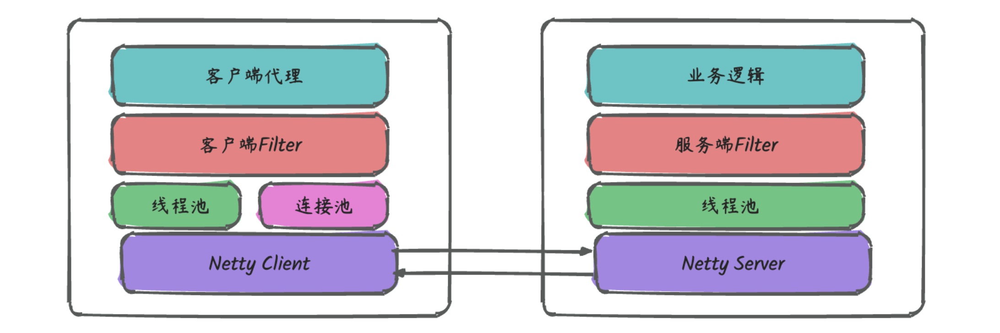

[TOC]

## 1. 一个RPC调用的执行过程

### 1.1. 概述

分为client端和server端

### 1.2. Client端

client端包括：客户端代理，客户端Filter，连接池，业务线程池，NettryClient

#### 1.2.1. 客户端代理

RPC要求像调用本地函数一样调用远程函数，所以需要对调用方屏蔽细节。使用代理模式来实现。

#### 1.2.2. 客户端Filter

代理模式的具体实现，是用责任链模式衔接，为框架提供了高可扩展性。目前Filter包含：服务监控，服务路由，故障注入，服务鉴权，服务降级，服务调用等模块。

#### 1.2.3. 连接池

连接池的概念是调用端做IO操作时需要创建的对象，线程池是服务单处理业务逻辑时需要创建的对象。Pigeon允许客户端与一个服务端机器建立多个连接

#### 1.2.4. 线程池

负责在收到服务端返回的数据后，通知（唤醒）业务线程

#### 1.2.5. Netty Client

Pigeon客户端和服务端的通信是交给Netty完成的，而Netty是基于Reactor模型实现的基于时间驱动的网络I/O框架，其包含Boss（Reactor模型中的MainReactor），Worker(Reactor模型中的SubReactor)以及基于Channel的Pipeline。

##### 1.2.5.1. Boss

在客户端中，负责发起connect请求，而在服务端中则负责accept客户端发来的connect请求，客户端和服务端建立连接后，则将相应的连接丢给Worker去维护。

##### 1.2.5.2. Worker

负责轮询连接（I/O多路复用）是否有数据送达，并负责将数据读写到想响应的channel中

##### 1.2.5.3. Pipeline

负责对Channel中的数据进行加工，在Pigeon中，其主要包含：序列化，反序列化，完整性校验，解压缩。

### 1.3. Server端

Server端包括：服务段Filter，业务线程池，NetteyServer。

#### 1.3.1. 服务端Filter

与客户端Filter对应，一个请求在进入业务代码之间，要经过：服务监控，服务鉴权，服务限流等模块

#### 1.3.2. 线程池

将业务逻辑从I/O操作中剥离，数据准备好后，，业务代码将在业务线程中执行，在Pigeon中，为了防止慢请求影响其他的正常情况，会将满足一定条件的慢请求隔离到SlowRquestPooling中。

#### 1.3.3. Netty Server

与nettyClient类似。

### 1.4. 执行过程

假设当客户端和服务端建立连接之后，客户端调用远程服务

1. 首先在客户端调用远程服务发放时，真正调用的是InvocationHandler中的invoke方法（这里使用JDK的动态代理）。pigeon中InvocationHandler的实现为ServiceInvocationProxy, 任意方法最终都会进入到ServiceInvocationProxy.invoke方法
2. ServiceInvocationProxy.invoke中会调用客户端Filter，请求会依次经过监控，路由，降级，网关，鉴权等模块后，进入RemoteCallInvokeFIlter。
3. 在RemoteCallInvokeFIlter中调用Client.write方法，其逻辑从连接池中获取连接（有一个超时时间），然后将数据写入Channel。
4. 在服务端发送数据之前，需要经过Channel的Pipeline（序列化，压缩，减少网络传输的数据量)。
5. 然后就开始向服务端发送数据，由于Netty发送消息是异步的，所以如果是同步调用的话，Pigeon这里会让业务线程主动await，直到收到服务端相应或者超时后唤醒。
6. 服务端收到客户端发送的消息后，从channel中将消息读出来，也会先经过一些Pipeline(反序列化，解压缩等)后到达NettyServerHandler,在其中Pigeon这里还做了服务隔离的设计
7. 默认的隔离机制（统计和隔离级别都是方法级的）：当超时数超过300或者超时率超过5%，就将后续对应的请求放入slow线程池处理。当超时数低于300，或者超时率低于5%，就将后续对应的请求放入shard线程池处理。
8. 默认还开启方法限流，限制单个方法不能占用X个线程
9. 提供业务自定义独立线程池的支持
10. 在选择相应的线程池并成功拿到线程之后，请求就到了服务端Filter中，请求会依次经过监控，流量录制，鉴权，泛化调用，网关等模块，进入BusinessProcessFilter.
11. 在BusinessProcessFilter中会根据客户端传递开的服务信息和参数，通过反射调用相应的业务服务并拿到业务处理结果，然后再WriteRespinseProcessFilter中将返回结果写入channel
12. 返回结果再经过服务端的Pipeline处理（序列化，压缩等），就发给客户端
13. 客户端收到消息后，经过客户端的Pipeline处理（反序列化，解压缩等）后到达NettyClientHandle，然后交给ResponseThreadPoolProcessor线程池处理。
14. ResponseThreadPoolProcessor收到消息后，会通知之前await的业务线程，并将结果传递给他
15. 业务线程收到signal通知后，就将结果返回给之前的方法调用。

# 2. RPC和http有什么区别

#### 服务发现

首先要向某个服务器发起请求，你得先建立连接，而建立连接的前提是，你得知道 **IP 地址和端口** 。这个找到服务对应的 IP 端口的过程，其实就是 **服务发现**。

在 **HTTP** 中，你知道服务的域名，就可以通过 **DNS 服务** 去解析得到它背后的 IP 地址，默认 **80 端口**。

而 **RPC** 的话，就有些区别，一般会有专门的中间服务去保存服务名和 IP 信息，比如 **Consul、Etcd、Nacos、ZooKeeper，甚至是 Redis**。想要访问某个服务，就去这些中间服务去获得 IP 和端口信息。由于 DNS 也是服务发现的一种，所以也有基于 DNS 去做服务发现的组件，比如 **CoreDNS**。

可以看出服务发现这一块，两者是有些区别，但不太能分高低。

#### 底层连接形式

以主流的 **HTTP1.1** 协议为例，其默认在建立底层 TCP 连接之后会一直保持这个连接（**keep alive**），之后的请求和响应都会复用这条连接。

而 **RPC** 协议，也跟 HTTP 类似，也是通过建立 TCP 长链接进行数据交互，但不同的地方在于，RPC 协议一般还会再建个 **连接池**，在请求量大的时候，建立多条连接放在池内，要发数据的时候就从池里取一条连接出来，用完放回去，下次再复用，可以说非常环保。

由于连接池有利于提升网络请求性能，所以不少编程语言的网络库里都会给 HTTP 加个连接池，比如 Go 就是这么干的。

可以看出这一块两者也没太大区别，所以也不是关键。

#### 传输的内容

基于 TCP 传输的消息，说到底，无非都是 **消息头 Header 和消息体 Body。**

**Header** 是用于标记一些特殊信息，其中最重要的是 **消息体长度**。

**Body** 则是放我们真正需要传输的内容，而这些内容只能是二进制 01 串，毕竟计算机只认识这玩意。所以 TCP 传字符串和数字都问题不大，因为字符串可以转成编码再变成 01 串，而数字本身也能直接转为二进制。但结构体呢，我们得想个办法将它也转为二进制 01 串，这样的方案现在也有很多现成的，比如 **JSON，Protocol Buffers (Protobuf)** 。

这个将结构体转为二进制数组的过程就叫 **序列化** ，反过来将二进制数组复原成结构体的过程叫 **反序列化**。

对于主流的 HTTP1.1，虽然它现在叫超文本协议，支持音频视频，但 HTTP 设计 初是用于做网页文本展示的，所以它传的内容以字符串为主。Header 和 Body 都是如此。在 Body 这块，它使用 **JSON** 来 **序列化** 结构体数据。

可以看到这里面的内容非常多的冗余，显得非常啰嗦。最明显的，像 Header 里的那些信息，其实如果我们约定好头部的第几位是 `Content-Type`，就不需要每次都真的把 `Content-Type` 这个字段都传过来，类似的情况其实在 Body 的 JSON 结构里也特别明显。

而 RPC，因为它定制化程度更高，可以采用体积更小的 Protobuf 或其他序列化协议去保存结构体数据，同时也不需要像 HTTP 那样考虑各种浏览器行为，比如 302 重定向跳转啥的。**因此性能也会更好一些，这也是在公司内部微服务中抛弃 HTTP，选择使用 RPC 的最主要原因。**

当然上面说的 HTTP，其实 **特指的是现在主流使用的 HTTP1.1**，`HTTP2`在前者的基础上做了很多改进，所以 **性能可能比很多 RPC 协议还要好**，甚至连`gRPC`底层都直接用的`HTTP2`。

