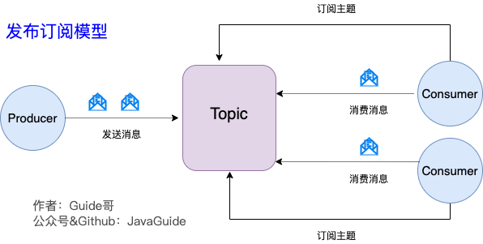

# 基本概念

Kafka 是一个分布式流式处理平台。这到底是什么意思呢？

流平台具有三个关键功能：

1. **消息队列**：发布和订阅消息流，这个功能类似于消息队列，这也是 Kafka 也被归类为消息队列的原因。
2. **容错的持久方式存储记录消息流**： Kafka 会把消息持久化到磁盘，有效避免了消息丢失的风险·。
3. **流式处理平台：** 在消息发布的时候进行处理，Kafka 提供了一个完整的流式处理类库。

Kafka 主要有两大应用场景：

1. **消息队列** ：建立实时流数据管道，以可靠地在系统或应用程序之间获取数据。
2. **数据处理：** 构建实时的流数据处理程序来转换或处理数据流。

首先是一些概念:

- **Kafka作为一个集群，运行在一台或者多台服务器上.**
- **Kafka 通过 *topic* 对存储的流数据进行分类。**
- **每条记录中包含一个key，一个value和一个timestamp（时间戳）**

在Kafka中，客户端和服务器使用一个简单、高性能、支持多语言的 [TCP 协议](https://kafka.apache.org/protocol.html).此协议版本化并且向下兼容老版本。

# Kafka的优势

> 消息队列的优点
>
> - 解耦：允许你独立的扩展或修改两边的处理过程，只要确保它们遵守同样的接口约束。
> - 冗余（副本）：有些情况下，处理数据的过程会失败。除非数据被持久化，否则将造成丢失。消息队列把数据进行持久化直到它们已经被完全处理，通过这一方式规避了数据丢失风险。许多消息队列所采用的"插入-获取-删除"范式中，在把一个消息从队列中删除之前，需要你的处理系统明确的指出该消息已经被处理完毕，从而确保你的数据被安全的保存直到你使用完毕。
> - 扩展性：因为消息队列解耦了你的处理过程，所以增大消息入队和处理的频率是很容易的，只要另外增加处理过程即可。不需要改变代码、不需要调节参数。
> - 灵活性和峰值处理能力：在访问量剧增的情况下，应用仍然需要继续发挥作用，但是这样的突发流量并不常见；如果为以能处理这类峰值访问为标准来投入资源随时待命无疑是巨大的浪费。使用消息队列能够使关键组件顶住突发的访问压力，而不会因为突发的超负荷的请求而完全崩溃。
> - 可恢复性：系统的一部分组件失效时，不会影响到整个系统。消息队列降低了进程间的耦合度，所以即使一个处理消息的进程挂掉，加入队列中的消息仍然可以在系统恢复后被处理。
> - 顺序保证：在大多使用场景下，数据处理的顺序都很重要。大部分消息队列本来就是排序的，并且能保证数据会按照特定的顺序来处理。Kafka保证一个Partition内的消息的有序性。
> - 缓冲：在任何重要的系统中，都会有需要不同的处理时间的元素。例如，加载一张图片比应用过滤器花费更少的时间。消息队列通过一个缓冲层来帮助任务最高效率的执行———写入队列的处理会尽可能的快速。该缓冲有助于控制和优化数据流经过系统的速度。
> - 异步通信：很多时候，用户不想也不需要立即处理消息。消息队列提供了异步处理机制，允许用户把一个消息放入队列，但并不立即处理它。想向队列中放入多少消息就放多少，然后在需要的时候再去处理它们。

我们现在经常提到 Kafka 的时候就已经默认它是一个非常优秀的消息队列了，我们也会经常拿它给 RocketMQ、RabbitMQ 对比。我觉得 Kafka 相比其他消息队列主要的优势如下：

1. **极致的性能** ：基于 Scala 和 Java 语言开发，设计中大量使用了批量处理和异步的思想，最高可以每秒处理千万级别的消息。
2. **生态系统兼容性无可匹敌** ：Kafka 与周边生态系统的兼容性是最好的没有之一，尤其在大数据和流计算领域。

实际上在早期的时候 Kafka 并不是一个合格的消息队列，早期的 Kafka 在消息队列领域就像是一个衣衫褴褛的孩子一样，功能不完备并且有一些小问题比如丢失消息、不保证消息可靠性等等。当然，这也和 LinkedIn 最早开发 Kafka 用于处理海量的日志有很大关系，哈哈哈，人家本来最开始就不是为了作为消息队列滴，谁知道后面误打误撞在消息队列领域占据了一席之地。

随着后续的发展，这些短板都被 Kafka 逐步修复完善。所以，**Kafka 作为消息队列不可靠这个说法已经过时！**

# Kafka的消息模型

## 点对点模式

**使用队列（Queue）作为消息通信载体，满足生产者与消费者模式，一条消息只能被一个消费者使用，未被消费的消息在队列中保留直到被消费或超时。** 比如：我们生产者发送 100 条消息的话，两个消费者来消费一般情况下两个消费者会按照消息发送的顺序各自消费一半（也就是你一个我一个的消费。）

**队列模型存在的问题：**

假如我们存在这样一种情况：我们需要将生产者产生的消息分发给多个消费者，并且每个消费者都能接收到完成的消息内容。

这种情况，队列模型就不好解决了。很多比较杠精的人就说：我们可以为每个消费者创建一个单独的队列，让生产者发送多份。这是一种非常愚蠢的做法，浪费资源不说，还违背了使用消息队列的目的。

## 发布订阅模型

发布-订阅模型主要是为了解决队列模型存在的问题。

发布订阅模型（Pub-Sub） 使用**主题（Topic）** 作为消息通信载体，类似于**广播模式**；发布者发布一条消息，该消息通过主题传递给所有的订阅者，**在一条消息广播之后才订阅的用户则是收不到该条消息的**。

**在发布 - 订阅模型中，如果只有一个订阅者，那它和队列模型就基本是一样的了。所以说，发布 - 订阅模型在功能层面上是可以兼容队列模型的。**

# Kafka相关术语

1. **Producer（生产者）** : 产生消息的一方。
2. **Consumer（消费者）** : 消费消息的一方。
3. **Broker（代理）** : 可以看作是一个独立的 Kafka 实例。多个 Kafka Broker 组成一个 Kafka Cluster。
   - **Topic（主题）** : Producer 将消息发送到特定的主题，Consumer 通过订阅特定的 Topic(主题) 来消费消息。
   - **Partition（分区）** : Partition 属于 Topic 的一部分。一个 Topic 可以有多个 Partition ，并且同一 Topic 下的 Partition 可以分布在不同的 Broker 上，这也就表明一个 Topic 可以横跨多个 Broker 。**某一个分区只能消费者组里面的某一个消费者消费。当消费组内消费者的个数和分区数相等时，性能更好**

消费者组可以提高消费能力。

# 多副本机制

还有一点我觉得比较重要的是 Kafka 为分区（Partition）引入了多副本（Replica）机制。分区（Partition）中的多个副本之间会有一个叫做 leader 的家伙，其他副本称为 follower。我们发送的消息会被发送到 leader 副本，然后 follower 副本才能从 leader 副本中拉取消息进行同步。

> 生产者和消费者只与 leader 副本交互。你可以理解为其他副本只是 leader 副本的拷贝，它们的存在只是为了保证消息存储的安全性。当 leader 副本发生故障时会从 follower 中选举出一个 leader,但是 follower 中如果有和 leader 同步程度达不到要求的参加不了 leader 的竞选。

好处：

1. Kafka 通过给特定 Topic 指定多个 Partition, 而各个 Partition 可以分布在不同的 Broker 上, 这样便能提供比较好的并发能力（负载均衡）。
2. Partition 可以指定对应的 Replica 数, 这也极大地提高了消息存储的安全性, 提高了容灾能力，不过也相应的增加了所需要的存储空间。

# Zookeeper

kafaka集群的 broker，和 Consumer 都需要连接 Zookeeper。Producer 直接连接 Broker。

Zookeeper 主要为 Kafka 做了下面这些事情：

1. **Broker 注册** ：在 Zookeeper 上会有一个专门**用来进行 Broker 服务器列表记录**的节点。每个 Broker 在启动时，都会到 Zookeeper 上进行注册，即到/brokers/ids 下创建属于自己的节点。每个 Broker 就会将自己的 IP 地址和端口等信息记录到该节点中去。

2. **Topic 注册** ： 在 Kafka 中，同一个**Topic 的消息会被分成多个分区**并将其分布在多个 Broker 上，**这些分区信息及与 Broker 的对应关系**也都是由 Zookeeper 在维护。比如我创建了一个名字为 my-topic 的主题并且它有两个分区，对应到 zookeeper 中会创建这些文件夹：`/brokers/topics/my-topic/Partitions/0`、`/brokers/topics/my-topic/Partitions/1`

3. **生产者负载均衡** ：由于同一个Topic消息会被分区并将其分布在多个Broker上，因此，**生产者需要将消息合理地发送到这些分布式的Broker上**，那么如何实现生产者的负载均衡，Kafka支持传统的四层负载均衡，也支持Zookeeper方式实现负载均衡。

   (1) 四层负载均衡，根据生产者的IP地址和端口来为其确定一个相关联的Broker。通常，一个生产者只会对应单个Broker，然后该生产者产生的消息都发往该Broker。这种方式逻辑简单，每个生产者不需要同其他系统建立额外的TCP连接，只需要和Broker维护单个TCP连接即可。但是，其无法做到真正的负载均衡，因为实际系统中的每个生产者产生的消息量及每个Broker的消息存储量都是不一样的，如果有些生产者产生的消息远多于其他生产者的话，那么会导致不同的Broker接收到的消息总数差异巨大，同时，生产者也无法实时感知到Broker的新增和删除。

   (2) 使用Zookeeper进行负载均衡，由于每个Broker启动时，都会完成Broker注册过程，生产者会通过该节点的变化来动态地感知到Broker服务器列表的变更，这样就可以实现动态的负载均衡机制。

4. **消费者负载均衡：**与生产者类似，Kafka中的消费者同样需要进行负载均衡来实现多个消费者合理地从对应的Broker服务器上接收消息，每个消费者分组包含若干消费者，**每条消息都只会发送给分组中的一个消费者**，不同的消费者分组消费自己特定的Topic下面的消息，互不干扰。

# 顺序消费

Kafka 中发送 1 条消息的时候，可以指定 topic, partition, key,data（数据） 4 个参数。如果你发送消息的时候指定了 Partition 的话，所有消息都会被发送到指定的 Partition。并且，同一个 key 的消息可以保证只发送到同一个 partition，这个我们可以采用表/对象的 id 来作为 key 。

总结一下，对于如何保证 Kafka 中消息消费的顺序，有了下面两种方法：

1. 1 个 Topic 只对应一个 Partition。
2. （推荐）发送消息的时候指定 key/Partition。

# 消息丢失

## 消费者丢失消息

我们知道消息在被追加到 Partition(分区)的时候都会分配一个特定的偏移量（offset）。偏移量（offset)表示 Consumer 当前消费到的 Partition(分区)的所在的位置。Kafka 通过偏移量（offset）可以保证消息在分区内的顺序性。

当消费者拉取到了分区的某个消息之后，消费者会自动提交了 offset。自动提交的话会有一个问题，试想一下，当消费者刚拿到这个消息准备进行真正消费的时候，突然挂掉了，消息实际上并没有被消费，但是 offset 却被自动提交了。

**解决办法也比较粗暴，我们手动关闭自动提交 offset，每次在真正消费完消息之后之后再自己手动提交 offset 。** 但，这样会带来消息被重新消费的问题。比如你刚刚消费完消息之后，还没提交 offset，结果自己挂掉了，那么这个消息理论上就会被消费两次。、

## Kafka弄丢了消息

我们知道 Kafka 为分区（Partition）引入了多副本（Replica）机制。分区（Partition）中的多个副本之间会有一个叫做 leader 的家伙，其他副本称为 follower。我们发送的消息会被发送到 leader 副本，然后 follower 副本才能从 leader 副本中拉取消息进行同步。生产者和消费者只与 leader 副本交互。你可以理解为其他副本只是 leader 副本的拷贝，它们的存在只是为了保证消息存储的安全性。

# 不重复消费

# 事务型消息

