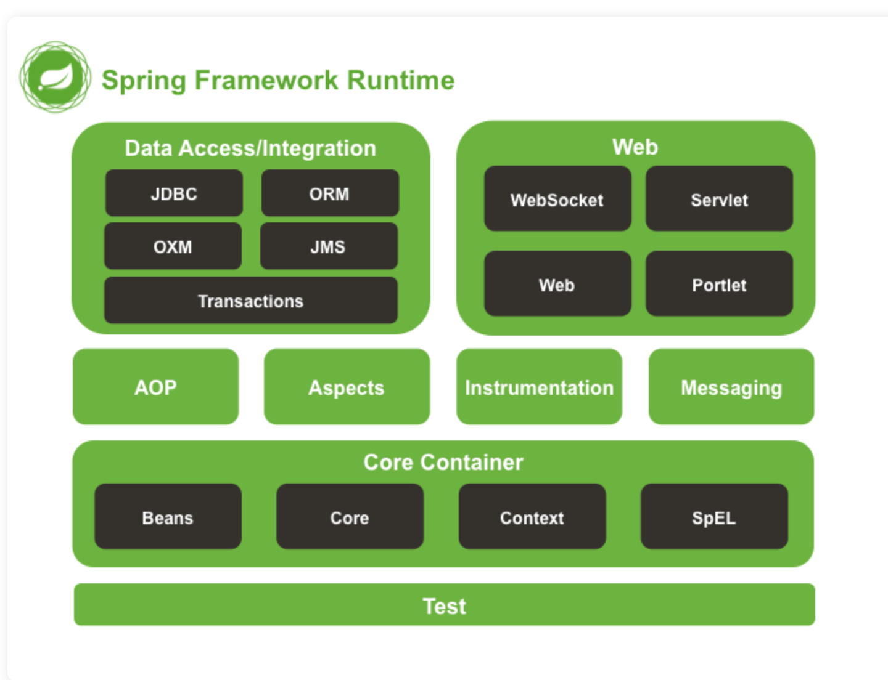
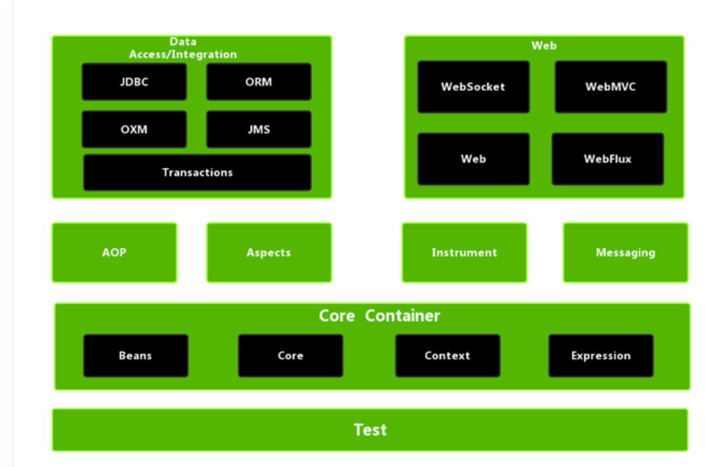
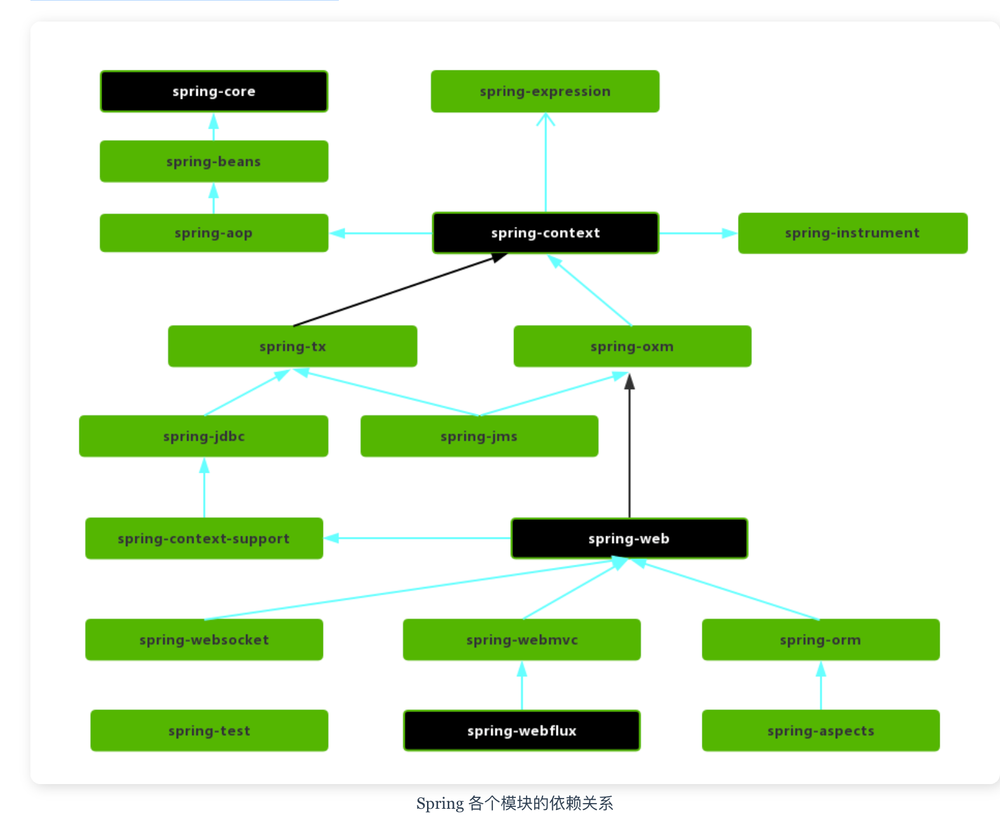
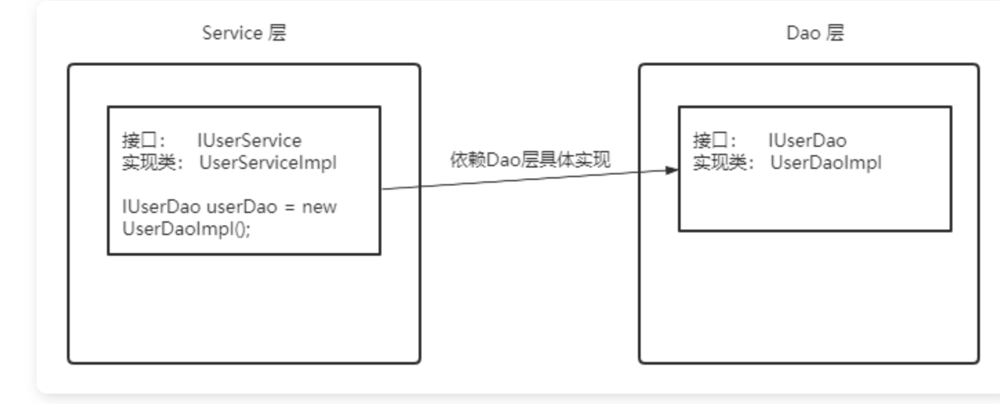
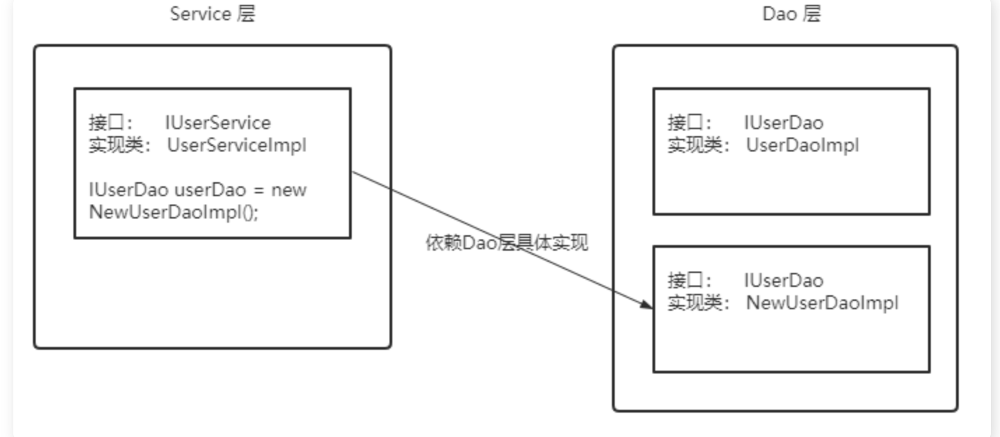
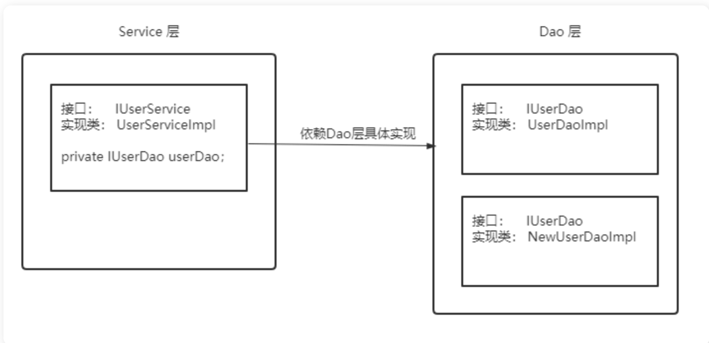

## Spring 基础

### 什么是 Spring 框架?

Spring 是一款开源的轻量级 Java 开发框架，旨在提高开发人员的开发效率以及系统的可维护性。

我们一般说 Spring 框架指的都是 Spring Framework，它是很多模块的集合，使用这些模块可以很方便地协助我们进行开发，比如说 Spring 支持 IoC（Inversion of Control:控制反转） 和 AOP(Aspect-Oriented Programming:面向切面编程)、可以很方便地对数据库进行访问、可以很方便地集成第三方组件（电子邮件，任务，调度，缓存等等）、对单元测试支持比较好、支持 RESTful Java 应用程序的开发。

Spring 最核心的思想就是不重新造轮子，开箱即用，提高开发效率。

### Spring 包含的模块有哪些？

**Spring4.x 版本**：



**Spring5.x 版本**：



Spring5.x 版本中 Web 模块的 Portlet 组件已经被废弃掉，同时增加了用于异步响应式处理的 WebFlux 组件。

Spring 各个模块的依赖关系如下：



#### Core Container

Spring 框架的核心模块，也可以说是基础模块，主要提供 IoC 依赖注入功能的支持。Spring 其他所有的功能基本都需要依赖于该模块，我们从上面那张 Spring 各个模块的依赖关系图就可以看出来。

- **spring-core**：Spring 框架基本的核心工具类。
- **spring-beans**：提供对 bean 的创建、配置和管理等功能的支持。
- **spring-context**：提供对国际化、事件传播、资源加载等功能的支持。
- **spring-expression**：提供对表达式语言（Spring Expression Language） SpEL 的支持，只依赖于 core 模块，不依赖于其他模块，可以单独使用。

#### AOP

- **spring-aspects**：该模块为与 AspectJ 的集成提供支持。
- **spring-aop**：提供了面向切面的编程实现。
- **spring-instrument**：提供了为 JVM 添加代理（agent）的功能。 具体来讲，它为 Tomcat 提供了一个织入代理，能够为 Tomcat 传递类文 件，就像这些文件是被类加载器加载的一样。没有理解也没关系，这个模块的使用场景非常有限。

#### Data Access/Integration

**spring-jdbc**：提供了对数据库访问的抽象 JDBC。不同的数据库都有自己独立的 API 用于操作数据库，而 Java 程序只需要和 JDBC API 交互，这样就屏蔽了数据库的影响。

**spring-tx**：提供对事务的支持。

**spring-orm**：提供对 Hibernate、JPA、iBatis 等 ORM 框架的支持。

**spring-oxm**：提供一个抽象层支撑 OXM(Object-to-XML-Mapping)，例如：JAXB、Castor、XMLBeans、JiBX 和 XStream 等。

**spring-jms** : 消息服务。自 Spring Framework 4.1 以后，它还提供了对 spring-messaging 模块的继承。

#### Spring Web

- **spring-web**：对 Web 功能的实现提供一些最基础的支持。
- **spring-webmvc**：提供对 Spring MVC 的实现。
- **spring-websocket**：提供了对 WebSocket 的支持，WebSocket 可以让客户端和服务端进行双向通信。
- **spring-webflux**：提供对 WebFlux 的支持。WebFlux 是 Spring Framework 5.0 中引入的新的响应式框架。与 Spring MVC 不同，它不需要 Servlet API，是完全异步。

#### Messaging

**spring-messaging** 是从 Spring4.0 开始新加入的一个模块，主要职责是为 Spring 框架集成一些基础的报文传送应用。

#### Spring Test

Spring 团队提倡测试驱动开发（TDD）。有了控制反转 (IoC)的帮助，单元测试和集成测试变得更简单。

Spring 的测试模块对 JUnit（单元测试框架）、TestNG（类似 JUnit）、Mockito（主要用来 Mock 对象）、PowerMock（解决 Mockito 的问题比如无法模拟 final, static， private 方法）等等常用的测试框架支持的都比较好.

### Spring,Spring MVC,Spring Boot 之间什么关系?

Spring 包含了多个功能模块（上面刚刚提到过），其中最重要的是 Spring-Core（主要提供 IoC 依赖注入功能的支持） 模块， Spring 中的其他模块（比如 Spring MVC）的功能实现基本都需要依赖于该模块。

Spring MVC 是 Spring 中的一个很重要的模块，主要赋予 Spring 快速构建 MVC 架构的 Web 程序的能力。MVC 是模型(Model)、视图(View)、控制器(Controller)的简写，其核心思想是通过将业务逻辑、数据、显示分离来组织代码。

使用 Spring 进行开发各种配置过于麻烦比如开启某些 Spring 特性时，需要用 XML 或 Java 进行显式配置。于是，Spring Boot 诞生了！

Spring 旨在简化 J2EE 企业应用程序开发。Spring Boot 旨在简化 Spring 开发（减少配置文件，开箱即用！）。

Spring Boot 只是简化了配置，如果你需要构建 MVC 架构的 Web 程序，你还是需要使用 Spring MVC 作为 MVC 框架，只是说 Spring Boot 帮你简化了 Spring MVC 的很多配置，真正做到开箱即用！

## Spring IoC

### 谈谈自己对于 Spring IoC 的了解

**IoC（Inversion of Control:控制反转）** 是一种设计思想，而不是一个具体的技术实现。IoC 的思想就是将原本在程序中手动创建对象的控制权，交由 Spring 框架来管理。不过， IoC 并非 Spring 特有，在其他语言中也有应用。

**为什么叫控制反转？**

- **控制**：指的是对象创建（实例化、管理）的权力
- **反转**：控制权交给外部环境（Spring 框架、IoC 容器）

将对象之间的相互依赖关系交给 IoC 容器来管理，并由 IoC 容器完成对象的注入。这样可以很大程度上简化应用的开发，把应用从复杂的依赖关系中解放出来。 IoC 容器就像是一个工厂一样，当我们需要创建一个对象的时候，只需要配置好配置文件/注解即可，完全不用考虑对象是如何被创建出来的。

在实际项目中一个 Service 类可能依赖了很多其他的类，假如我们需要实例化这个 Service，你可能要每次都要搞清这个 Service 所有底层类的构造函数，这可能会把人逼疯。如果利用 IoC 的话，你只需要配置好，然后在需要的地方引用就行了，这大大增加了项目的可维护性且降低了开发难度。

在 Spring 中， IoC 容器是 Spring 用来实现 IoC 的载体， IoC 容器实际上就是个 Map（key，value），Map 中存放的是各种对象。

Spring 时代我们一般通过 XML 文件来配置 Bean，后来开发人员觉得 XML 文件来配置不太好，于是 SpringBoot 注解配置就慢慢开始流行起来。

### IoC 解决了什么问题?

IoC 的思想就是两方之间不互相依赖，由第三方容器来管理相关资源。这样有什么好处呢？

1. 对象之间的耦合度或者说依赖程度降低；
2. 资源变的容易管理；比如你用 Spring 容器提供的话很容易就可以实现一个单例。

例如：现有一个针对 User 的操作，利用 Service 和 Dao 两层结构进行开发

在没有使用 IoC 思想的情况下，Service 层想要使用 Dao 层的具体实现的话，需要通过 new 关键字在`UserServiceImpl` 中手动 new 出 `IUserDao` 的具体实现类 `UserDaoImpl`（不能直接 new 接口类）。



开发过程中突然接到一个新的需求，针对`IUserDao` 接口开发出另一个具体实现类。因为 Server 层依赖了`IUserDao`的具体实现，所以我们需要修改`UserServiceImpl`中 new 的对象。如果只有一个类引用了`IUserDao`的具体实现，可能觉得还好，修改起来也不是很费力气，但是如果有许许多多的地方都引用了`IUserDao`的具体实现的话，一旦需要更换`IUserDao` 的实现方式，那修改起来将会非常的头疼。



使用 IoC 的思想，我们将对象的控制权（创建、管理）交有 IoC 容器去管理，我们在使用的时候直接向 IoC 容器 “要” 就可以了



### IoC 和 DI 有区别吗？

IoC（Inverse of Control:控制反转）是一种设计思想或者说是某种模式。这个设计思想就是 **将原本在程序中手动创建对象的控制权交给第三方比如 IoC 容器。** 对于我们常用的 Spring 框架来说， IoC 容器实际上就是个 Map（key，value）,Map 中存放的是各种对象。不过，IoC 在其他语言中也有应用，并非 Spring 特有。

IoC 最常见以及最合理的实现方式叫做依赖注入（Dependency Injection，简称 DI）。

### 什么是 Spring Bean？

简单来说，Bean 代指的就是那些被 IoC 容器所管理的对象。

我们需要告诉 IoC 容器帮助我们管理哪些对象，这个是通过配置元数据来定义的。配置元数据可以是 XML 文件、注解或者 Java 配置类。

```java
<!-- Constructor-arg with 'value' attribute -->
<bean id="..." class="...">
   <constructor-arg value="..."/>
</bean>

```

`org.springframework.beans`和 `org.springframework.context` 这两个包是 IoC 实现的基础，如果想要研究 IoC 相关的源码的话，可以去看看

### 将一个类声明为 Bean 的注解有哪些?

- `@Component`：通用的注解，可标注任意类为 `Spring` 组件。如果一个 Bean 不知道属于哪个层，可以使用`@Component` 注解标注。
- `@Repository` : 对应持久层即 Dao 层，主要用于数据库相关操作。
- `@Service` : 对应服务层，主要涉及一些复杂的逻辑，需要用到 Dao 层。
- `@Controller` : 对应 Spring MVC 控制层，主要用于接受用户请求并调用 `Service` 层返回数据给前端页面。

### @Component 和 @Bean 的区别是什么？

`@Component` 注解作用于类，而`@Bean`注解作用于方法。

`@Component`通常是通过类路径扫描来自动侦测以及自动装配到 Spring 容器中（我们可以使用 `@ComponentScan` 注解定义要扫描的路径从中找出标识了需要装配的类自动装配到 Spring 的 bean 容器中）。`@Bean` 注解通常是我们在标有该注解的方法中定义产生这个 bean,`@Bean`告诉了 Spring 这是某个类的实例，当我需要用它的时候还给我。

`@Bean` 注解比 `@Component` 注解的自定义性更强，而且很多地方我们只能通过 `@Bean` 注解来注册 bean。比如当我们引用第三方库中的类需要装配到 `Spring`容器时，则只能通过 `@Bean`来实现。

`@Bean`注解使用示例：

```java
@Configuration
public class AppConfig {
    @Bean
    public TransferService transferService() {
        return new TransferServiceImpl();
    }

}

```

上面的代码相当于下面的 xml 配置

```java
<beans>
    <bean id="transferService" class="com.acme.TransferServiceImpl"/>
</beans>

```

下面这个例子是通过 `@Component` 无法实现的。

```java
@Bean
public OneService getService(status) {
    case (status)  {
        when 1:
                return new serviceImpl1();
        when 2:
                return new serviceImpl2();
        when 3:
                return new serviceImpl3();
    }
}

```

### 注入 Bean 的注解有哪些？

Spring 内置的 `@Autowired` 以及 JDK 内置的 `@Resource` 和 `@Inject` 都可以用于注入 Bean。

| Annotation   | Package                            | Source       |
| ------------ | ---------------------------------- | ------------ |
| `@Autowired` | `org.springframework.bean.factory` | Spring 2.5+  |
| `@Resource`  | `javax.annotation`                 | Java JSR-250 |
| `@Inject`    | `javax.inject`                     | Java JSR-330 |

`@Autowired` 和`@Resource`使用的比较多一些。

### @Autowired 和 @Resource 的区别是什么？

举个例子，`SmsService` 接口有两个实现类: `SmsServiceImpl1`和 `SmsServiceImpl2`，且它们都已经被 Spring 容器所管理。

- `@Autowired` 是 Spring 提供的注解，`@Resource` 是 JDK 提供的注解。
- `Autowired` 默认的注入方式为`byType`（根据类型进行匹配），`@Resource`默认注入方式为 `byName`（根据名称进行匹配）。
- 当一个接口存在多个实现类的情况下，`@Autowired` 和`@Resource`都需要通过名称才能正确匹配到对应的 Bean。`Autowired` 可以通过 `@Qualifier` 注解来显式指定名称，`@Resource`可以通过 `name` 属性来显式指定名称。
- `@Autowired` 支持在构造函数、方法、字段和参数上使用。`@Resource` 主要用于字段和方法上的注入，不支持在构造函数或参数上使用。

### Bean 的作用域有哪些?

Spring 中 Bean 的作用域通常有下面几种：

- **singleton** : IoC 容器中只有唯一的 bean 实例。Spring 中的 bean 默认都是单例的，是对单例设计模式的应用。
- **prototype** : 每次获取都会创建一个新的 bean 实例。也就是说，连续 `getBean()` 两次，得到的是不同的 Bean 实例。
- **request** （仅 Web 应用可用）: 每一次 HTTP 请求都会产生一个新的 bean（请求 bean），该 bean 仅在当前 HTTP request 内有效。
- **session** （仅 Web 应用可用） : 每一次来自新 session 的 HTTP 请求都会产生一个新的 bean（会话 bean），该 bean 仅在当前 HTTP session 内有效。
- **application/global-session** （仅 Web 应用可用）：每个 Web 应用在启动时创建一个 Bean（应用 Bean），该 bean 仅在当前应用启动时间内有效。
- **websocket** （仅 Web 应用可用）：每一次 WebSocket 会话产生一个新的 bean。

**如何配置 bean 的作用域呢？**

xml 方式：

```xml
<bean id="..." class="..." scope="singleton"></bean>
```

注解方式：

```java
@Bean
@Scope(value = ConfigurableBeanFactory.SCOPE_PROTOTYPE)
public Person personPrototype() {
    return new Person();
}

```

### Bean 是线程安全的吗？

Spring 框架中的 Bean 是否线程安全，取决于其作用域和状态。

我们这里以最常用的两种作用域 prototype 和 singleton 为例介绍。几乎所有场景的 Bean 作用域都是使用默认的 singleton ，重点关注 singleton 作用域即可。

prototype 作用域下，每次获取都会创建一个新的 bean 实例，不存在资源竞争问题，所以不存在线程安全问题。singleton 作用域下，IoC 容器中只有唯一的 bean 实例，可能会存在资源竞争问题（取决于 Bean 是否有状态）。如果这个 bean 是有状态的话，那就存在线程安全问题（有状态 Bean 是指包含可变的成员变量的对象）。

不过，大部分 Bean 实际都是无状态（没有定义可变的成员变量）的（比如 Dao、Service），这种情况下， Bean 是线程安全的。

对于有状态单例 Bean 的线程安全问题，常见的有两种解决办法：

1. 在 Bean 中尽量避免定义可变的成员变量。
2. 在类中定义一个 `ThreadLocal` 成员变量，将需要的可变成员变量保存在 `ThreadLocal` 中（推荐的一种方式）。

### Bean 的生命周期了解么?

**创建 Bean 的实例**：Bean 容器首先会找到配置文件中的 Bean 定义，然后使用 Java 反射 API 来创建 Bean 的实例。

**Bean 属性赋值/填充**：为 Bean 设置相关属性和依赖，例如`@Autowired` 等注解注入的对象、`@Value` 注入的值、`setter`方法或构造函数注入依赖和值、`@Resource`注入的各种资源。

**Bean 初始化**： 

- 如果 Bean 实现了 `BeanNameAware` 接口，调用 `setBeanName()`方法，传入 Bean 的名字。

- ```java
  import org.springframework.beans.BeansException;
  import org.springframework.context.ApplicationContext;
  import org.springframework.context.ApplicationContextAware;
  import org.springframework.beans.factory.BeanNameAware;
  
  public class MyBean implements BeanNameAware {
      private String name;
  
      @Override
      public void setBeanName(String name) {
          this.name = name;
          System.out.println("Bean name is: " + name);
      }
  
      // 其他方法...
  }
  ```

- 如果 Bean 实现了 `BeanClassLoaderAware` 接口，调用 `setBeanClassLoader()`方法，传入 `ClassLoader`对象的实例。
- 如果 Bean 实现了 `BeanFactoryAware` 接口，调用 `setBeanFactory()`方法，传入 `BeanFactory`对象的实例。
- 与上面的类似，如果实现了其他 `*.Aware`接口，就调用相应的方法。
- 如果有和加载这个 Bean 的 Spring 容器相关的 `BeanPostProcessor` 对象，执行`postProcessBeforeInitialization()` 方法
- 如果 Bean 实现了`InitializingBean`接口，执行`afterPropertiesSet()`方法。
- 如果 Bean 在配置文件中的定义包含 `init-method` 属性，执行指定的方法。
- 如果有和加载这个 Bean 的 Spring 容器相关的 `BeanPostProcessor` 对象，执行`postProcessAfterInitialization()` 方法。

**销毁 Bean**：销毁并不是说要立马把 Bean 给销毁掉，而是把 Bean 的销毁方法先记录下来，将来需要销毁 Bean 或者销毁容器的时候，就调用这些方法去释放 Bean 所持有的资源。 

- 如果 Bean 实现了 `DisposableBean` 接口，执行 `destroy()` 方法。
- 如果 Bean 在配置文件中的定义包含 `destroy-method` 属性，执行指定的 Bean 销毁方法。或者，也可以直接通过`@PreDestroy` 注解标记 Bean 销毁之前执行的方法。

`Aware` 接口能让 Bean 能拿到 Spring 容器资源。

Spring 中提供的 `Aware` 接口主要有：

1. `BeanNameAware`：注入当前 bean 对应 beanName；
2. `BeanClassLoaderAware`：注入加载当前 bean 的 ClassLoader；
3. `BeanFactoryAware`：注入当前 `BeanFactory` 容器的引用。

`BeanPostProcessor` 接口是 Spring 为修改 Bean 提供的强大扩展点。

**如何记忆呢？**

1. 整体上可以简单分为四步：实例化 —> 属性赋值 —> 初始化 —> 销毁。
2. 初始化这一步涉及到的步骤比较多，包含 `Aware` 接口的依赖注入、`BeanPostProcessor` 在初始化前后的处理以及 `InitializingBean` 和 `init-method` 的初始化操作。
3. 销毁这一步会注册相关销毁回调接口，最后通过`DisposableBean` 和 `destory-method` 进行销毁。

## Spring AOP

### 谈谈自己对于 AOP 的了解

AOP(Aspect-Oriented Programming:面向切面编程)能够将那些与业务无关，却为业务模块所共同调用的逻辑或责任（例如事务处理、日志管理、权限控制等）封装起来，便于减少系统的重复代码，降低模块间的耦合度，并有利于未来的可拓展性和可维护性。

Spring AOP 就是基于动态代理的，如果要代理的对象，实现了某个接口，那么 Spring AOP 会使用 **JDK Proxy**，去创建代理对象，而对于没有实现接口的对象，就无法使用 JDK Proxy 去进行代理了，这时候 Spring AOP 会使用 **Cglib** 生成一个被代理对象的子类来作为代理

当然你也可以使用 **AspectJ** ！Spring AOP 已经集成了 AspectJ ，AspectJ 应该算的上是 Java 生态系统中最完整的 AOP 框架了。

AOP 切面编程涉及到的一些专业术语：

| 术语              |                             含义                             |
| :---------------- | :----------------------------------------------------------: |
| 目标(Target)      |                         被通知的对象                         |
| 代理(Proxy)       |             向目标对象应用通知之后创建的代理对象             |
| 连接点(JoinPoint) |         目标对象的所属类中，定义的所有方法均为连接点         |
| 切入点(Pointcut)  | 被切面拦截 / 增强的连接点（切入点一定是连接点，连接点不一定是切入点） |
| 通知(Advice)      | 增强的逻辑 / 代码，也即拦截到目标对象的连接点之后要做的事情  |
| 切面(Aspect)      |                切入点(Pointcut)+通知(Advice)                 |
| Weaving(织入)     |       将通知应用到目标对象，进而生成代理对象的过程动作       |

### Spring AOP 和 AspectJ AOP 有什么区别？

**Spring AOP 属于运行时增强，而 AspectJ 是编译时增强。** Spring AOP 基于代理(Proxying)，而 AspectJ 基于字节码操作(Bytecode Manipulation)。

Spring AOP 已经集成了 AspectJ ，AspectJ 应该算的上是 Java 生态系统中最完整的 AOP 框架了。AspectJ 相比于 Spring AOP 功能更加强大，但是 Spring AOP 相对来说更简单，

如果我们的切面比较少，那么两者性能差异不大。但是，当切面太多的话，最好选择 AspectJ ，它比 Spring AOP 快很多。

### AspectJ 定义的通知类型有哪些？

- **Before**（前置通知）：目标对象的方法调用之前触发
- **After** （后置通知）：目标对象的方法调用之后触发
- **AfterReturning**（返回通知）：目标对象的方法调用完成，在返回结果值之后触发
- **AfterThrowing**（异常通知）：目标对象的方法运行中抛出 / 触发异常后触发。AfterReturning 和 AfterThrowing 两者互斥。如果方法调用成功无异常，则会有返回值；如果方法抛出了异常，则不会有返回值。
- **Around** （环绕通知）：编程式控制目标对象的方法调用。环绕通知是所有通知类型中可操作范围最大的一种，因为它可以直接拿到目标对象，以及要执行的方法，所以环绕通知可以任意的在目标对象的方法调用前后搞事，甚至不调用目标对象的方法

### 多个切面的执行顺序如何控制？

1、通常使用`@Order` 注解直接定义切面顺序

```java
// 值越小优先级越高
@Order(3)
@Component
@Aspect
public class LoggingAspect implements Ordered {

```

**2、实现`Ordered` 接口重写 `getOrder` 方法。**

```java
@Component
@Aspect
public class LoggingAspect implements Ordered {

    // ....

    @Override
    public int getOrder() {
        // 返回值越小优先级越高
        return 1;
    }
}

```

## 使用示例

1. **定义一个切面（Aspect）**：

```java
import org.aspectj.lang.annotation.Aspect;
import org.aspectj.lang.annotation.Before;
import org.springframework.stereotype.Component;

@Aspect
@Component
public class LoggingAspect {

    @Before("execution(* com.example.service.*.*(..))")
    public void beforeServiceMethod(JoinPoint joinPoint) {
        // JoinPoint 包含了方法的签名信息
        System.out.println("Before method: " + joinPoint.getSignature().getName());
    }
}
```

在上面的代码中，`@Aspect` 注解标记了这个类是一个切面。`@Before` 注解定义了一个前置通知，它将在匹配的任何方法执行之前执行。`execution` 表达式指定了切点，这里它匹配 `com.example.service` 包下任何类中的任何方法。

2.**定义业务逻辑**

```java
package com.example.service;

import org.springframework.stereotype.Service;

@Service
public class MyService {

    public void performAction() {
        System.out.println("Performing action...");
    }
}
```

3. **配置 Spring 以启用 AOP**：

```java
import org.springframework.context.annotation.Configuration;
import org.springframework.context.annotation.EnableAspectJAutoProxy;

@Configuration
@EnableAspectJAutoProxy
public class AppConfig {
    // 其他配置...
}
```

```xml
<beans xmlns="http://www.springframework.org/schema/beans"
       xmlns:xsi="http://www.w3.org/2001/XMLSchema-instance"
       xmlns:aop="http://www.springframework.org/schema/aop"
       xsi:schemaLocation="http://www.springframework.org/schema/beans
                           http://www.springframework.org/schema/beans/spring-beans.xsd
                           http://www.springframework.org/schema/aop
                           http://www.springframework.org/schema/aop/spring-aop.xsd">

    <aop:aspectj-autoproxy/>

    <!-- 其他 Bean 定义 -->
</beans>
```

## Spring MVC

### 说说自己对于 Spring MVC 了解?

MVC 是模型(Model)、视图(View)、控制器(Controller)的简写，其核心思想是通过将业务逻辑、数据、显示分离来组织代码。

**Model 1 时代**

很多学 Java 后端比较晚的朋友可能并没有接触过 Model 1 时代下的 JavaWeb 应用开发。在 Model1 模式下，整个 Web 应用几乎全部用 JSP 页面组成，只用少量的 JavaBean 来处理数据库连接、访问等操作。

这个模式下 JSP 即是控制层（Controller）又是表现层（View）。显而易见，这种模式存在很多问题。比如控制逻辑和表现逻辑混杂在一起，导致代码重用率极低；再比如前端和后端相互依赖，难以进行测试维护并且开发效率极低。

**Model 2 时代**

学过 Servlet 并做过相关 Demo 的朋友应该了解“Java Bean(Model)+ JSP（View）+Servlet（Controller） ”这种开发模式，这就是早期的 JavaWeb MVC 开发模式。

- Model:系统涉及的数据，也就是 dao 和 bean。
- View：展示模型中的数据，只是用来展示。
- Controller：接受用户请求，并将请求发送至 Model，最后返回数据给 JSP 并展示给用户

**Spring MVC 时代**

随着 Spring 轻量级开发框架的流行，Spring 生态圈出现了 Spring MVC 框架， Spring MVC 是当前最优秀的 MVC 框架。相比于 Struts2 ， Spring MVC 使用更加简单和方便，开发效率更高，并且 Spring MVC 运行速度更快。

MVC 是一种设计模式，Spring MVC 是一款很优秀的 MVC 框架。Spring MVC 可以帮助我们进行更简洁的 Web 层的开发，并且它天生与 Spring 框架集成。Spring MVC 下我们一般把后端项目分为 Service 层（处理业务）、Dao 层（数据库操作）、Entity 层（实体类）、Controller 层(控制层，返回数据给前台页面)。

### Spring MVC 的核心组件有哪些？

记住了下面这些组件，也就记住了 SpringMVC 的工作原理。

- **`DispatcherServlet`**：**核心的中央处理器**，负责接收请求、分发，并给予客户端响应。
- **`HandlerMapping`**：**处理器映射器**，根据 URL 去匹配查找能处理的 `Handler` ，并会将请求涉及到的拦截器和 `Handler` 一起封装。
- **`HandlerAdapter`**：**处理器适配器**，根据 `HandlerMapping` 找到的 `Handler` ，适配执行对应的 `Handler`；
- **`Handler`**：**请求处理器**，处理实际请求的处理器。
- **`ViewResolver`**：**视图解析器**，根据 `Handler` 返回的逻辑视图 / 视图，解析并渲染真正的视图，并传递给 `DispatcherServlet` 响应客户端

### SpringMVC 工作原理了解吗?


**流程说明（重要）：**

1. 客户端（浏览器）发送请求， `DispatcherServlet`拦截请求。
2. `DispatcherServlet` 根据请求信息调用 `HandlerMapping` 。`HandlerMapping` 根据 URL 去匹配查找能处理的 `Handler`（也就是我们平常说的 `Controller` 控制器） ，并会将请求涉及到的拦截器和 `Handler` 一起封装。
3. `DispatcherServlet` 调用 `HandlerAdapter`适配器执行 `Handler` 。
4. `Handler` 完成对用户请求的处理后，会返回一个 `ModelAndView` 对象给`DispatcherServlet`，`ModelAndView` 顾名思义，包含了数据模型以及相应的视图的信息。`Model` 是返回的数据对象，`View` 是个逻辑上的 `View`。
5. `ViewResolver` 会根据逻辑 `View` 查找实际的 `View`。
6. `DispaterServlet` 把返回的 `Model` 传给 `View`（视图渲染）。
7. 把 `View` 返回给请求者（浏览器）

# Spring 框架中用到了哪些设计模式？

- **工厂设计模式** : Spring 使用工厂模式通过 `BeanFactory`、`ApplicationContext` 创建 bean 对象。
- **代理设计模式** : Spring AOP 功能的实现。
- **单例设计模式** : Spring 中的 Bean 默认都是单例的。
- **模板方法模式** : Spring 中 `jdbcTemplate`、`hibernateTemplate` 等以 Template 结尾的对数据库操作的类，它们就使用到了模板模式。
- **包装器设计模式** : 我们的项目需要连接多个数据库，而且不同的客户在每次访问中根据需要会去访问不同的数据库。这种模式让我们可以根据客户的需求能够动态切换不同的数据源。
- **观察者模式:** Spring 事件驱动模型就是观察者模式很经典的一个应用。
- **适配器模式** : Spring AOP 的增强或通知(Advice)使用到了适配器模式、spring MVC 中也是用到了适配器模式适配`Controller`。
- ……

## Spring 的循环依赖

循环依赖是指 Bean 对象循环引用，是两个或多个 Bean 之间相互持有对方的引用，例如 CircularDependencyA → CircularDependencyB → CircularDependencyA。

Spring 框架通过使用三级缓存来解决这个问题，确保即使在循环依赖的情况下也能正确创建 Bean。

Spring 中的三级缓存其实就是三个 Map，如下：

```java
// 一级缓存
/** Cache of singleton objects: bean name to bean instance. */
private final Map<String, Object> singletonObjects = new ConcurrentHashMap<>(256);

// 二级缓存
/** Cache of early singleton objects: bean name to bean instance. */
private final Map<String, Object> earlySingletonObjects = new HashMap<>(16);

// 三级缓存
/** Cache of singleton factories: bean name to ObjectFactory. */
private final Map<String, ObjectFactory<?>> singletonFactories = new HashMap<>(16);

```

简单来说，Spring 的三级缓存包括：

1. **一级缓存（singletonObjects）**：存放最终形态的 Bean（已经实例化、属性填充、初始化），单例池，为“Spring 的单例属性”⽽⽣。一般情况我们获取 Bean 都是从这里获取的，但是并不是所有的 Bean 都在单例池里面，例如原型 Bean 就不在里面。
2. **二级缓存（earlySingletonObjects）**：存放过渡 Bean（半成品，尚未属性填充），也就是三级缓存中`ObjectFactory`产生的对象，与三级缓存配合使用的，可以防止 AOP 的情况下，每次调用`ObjectFactory#getObject()`都是会产生新的代理对象的。
3. **三级缓存（singletonFactories）**：存放`ObjectFactory`，`ObjectFactory`的`getObject()`方法（最终调用的是`getEarlyBeanReference()`方法）可以生成原始 Bean 对象或者代理对象（如果 Bean 被 AOP 切面代理）。三级缓存只会对单例 Bean 生效。

接下来说一下 Spring 创建 Bean 的流程：

1. 先去 **一级缓存 `singletonObjects`** 中获取，存在就返回；
2. 如果不存在或者对象正在创建中，于是去 **二级缓存 `earlySingletonObjects`** 中获取；
3. 如果还没有获取到，就去 **三级缓存 `singletonFactories`** 中获取，通过执行 `ObjectFacotry` 的 `getObject()` 就可以获取该对象，获取成功之后，从三级缓存移除，并将该对象加入到二级缓存中。

以上面的循环依赖代码为例，整个解决循环依赖的流程如下：

- 当 Spring 创建 A 之后，发现 A 依赖了 B ，又去创建 B，B 依赖了 A ，又去创建 A；
- 在 B 创建 A 的时候，那么此时 A 就发生了循环依赖，由于 A 此时还没有初始化完成，因此在 **一二级缓存** 中肯定没有 A；
- 那么此时就去三级缓存中调用 `getObject()` 方法去获取 A 的 **前期暴露的对象** ，也就是调用上边加入的 `getEarlyBeanReference()` 方法，生成一个 A 的 **前期暴露对象**；
- 然后就将这个 `ObjectFactory` 从三级缓存中移除，并且将前期暴露对象放入到二级缓存中，那么 B 就将这个前期暴露对象注入到依赖，来支持循环依赖。

**最后总结一下 Spring 如何解决三级缓存**：

在三级缓存这一块，主要记一下 Spring 是如何支持循环依赖的即可，也就是如果发生循环依赖的话，就去 **三级缓存 `singletonFactories`** 中拿到三级缓存中存储的 `ObjectFactory` 并调用它的 `getObject()` 方法来获取这个循环依赖对象的前期暴露对象（虽然还没初始化完成，但是可以拿到该对象在堆中的存储地址了），并且将这个前期暴露对象放到二级缓存中，这样在循环依赖时，就不会重复初始化了！

不过，这种机制也有一些缺点，比如增加了内存开销（需要维护三级缓存，也就是三个 Map），降低了性能（需要进行多次检查和转换）。并且，还有少部分情况是不支持循环依赖的，比如非单例的 bean 和`@Async`注解的 bean 无法支持循环依赖。

### Spring 事务

#### 编程式事务管理

通过 `TransactionTemplate`或者`TransactionManager`手动管理事务，实际应用中很少使用

使用`TransactionTemplate` 进行编程式事务管理的示例代码如下：

```java
@Autowired
private TransactionTemplate transactionTemplate;
public void testTransaction() {

        transactionTemplate.execute(new TransactionCallbackWithoutResult() {
            @Override
            protected void doInTransactionWithoutResult(TransactionStatus transactionStatus) {

                try {

                    // ....  业务代码
                } catch (Exception e){
                    //回滚
                    transactionStatus.setRollbackOnly();
                }

            }
        });
}

```

使用 `TransactionManager` 进行编程式事务管理的示例代码如下：

````java
@Autowired
private PlatformTransactionManager transactionManager;

public void testTransaction() {

  TransactionStatus status = transactionManager.getTransaction(new DefaultTransactionDefinition());
          try {
               // ....  业务代码
              transactionManager.commit(status);
          } catch (Exception e) {
              transactionManager.rollback(status);
          }
}

````

#### 声明式事务管理

推荐使用（代码侵入性最小），实际是通过 AOP 实现（基于`@Transactional` 的全注解方式使用最多）。

使用 `@Transactional`注解进行事务管理的示例代码如下：

```
@Transactional(propagation = Propagation.REQUIRED)
public void aMethod {
  //do something
  B b = new B();
  C c = new C();
  b.bMethod();
  c.cMethod();
}

```

### Spring 事务管理接口介绍

Spring 框架中，事务管理相关最重要的 3 个接口如下：

- **`PlatformTransactionManager`**：（平台）事务管理器，Spring 事务策略的核心。
- **`TransactionDefinition`**：事务定义信息(事务隔离级别、传播行为、超时、只读、回滚规则)。
- **`TransactionStatus`**：事务运行状态。

我们可以把 **`PlatformTransactionManager`** 接口可以被看作是事务上层的管理者，而 **`TransactionDefinition`** 和 **`TransactionStatus`** 这两个接口可以看作是事务的描述。

**`PlatformTransactionManager`** 会根据 **`TransactionDefinition`** 的定义比如事务超时时间、隔离级别、传播行为等来进行事务管理 ，而 **`TransactionStatus`** 接口则提供了一些方法来获取事务相应的状态比如是否新事务、是否可以回滚等等。

#### PlatformTransactionManager:事务管理接口

**Spring 并不直接管理事务，而是提供了多种事务管理器** 。Spring 事务管理器的接口是：**`PlatformTransactionManager`** 。

通过这个接口，Spring 为各个平台如：JDBC(`DataSourceTransactionManager`)、Hibernate(`HibernateTransactionManager`)、JPA(`JpaTransactionManager`)等都提供了对应的事务管理器，但是具体的实现就是各个平台自己的事情了。

`PlatformTransactionManager`接口中定义了三个方法：

```java
package org.springframework.transaction;

import org.springframework.lang.Nullable;

public interface PlatformTransactionManager {
    //获得事务
    TransactionStatus getTransaction(@Nullable TransactionDefinition var1) throws TransactionException;
    //提交事务
    void commit(TransactionStatus var1) throws TransactionException;
    //回滚事务
    void rollback(TransactionStatus var1) throws TransactionException;
}


```

**这里多插一嘴。为什么要定义或者说抽象出来`PlatformTransactionManager`这个接口呢？**

主要是因为要将事务管理行为抽象出来，然后不同的平台去实现它，这样我们可以保证提供给外部的行为不变，方便我们扩展。

#### TransactionDefinition:事务属性

事务管理器接口 **`PlatformTransactionManager`** 通过 **`getTransaction(TransactionDefinition definition)`** 方法来得到一个事务，这个方法里面的参数是 **`TransactionDefinition`** 类 ，这个类就定义了一些基本的事务属性

**什么是事务属性呢？** 事务属性可以理解成事务的一些基本配置，描述了事务策略如何应用到方法上。

事务属性包含了 5 个方面：

- 隔离级别
- 传播行为
- 回滚规则
- 是否只读
- 事务超时

`TransactionDefinition` 接口中定义了 5 个方法以及一些表示事务属性的常量比如隔离级别、传播行为等等。

```java
package org.springframework.transaction;

import org.springframework.lang.Nullable;

public interface TransactionDefinition {
    int PROPAGATION_REQUIRED = 0;
    int PROPAGATION_SUPPORTS = 1;
    int PROPAGATION_MANDATORY = 2;
    int PROPAGATION_REQUIRES_NEW = 3;
    int PROPAGATION_NOT_SUPPORTED = 4;
    int PROPAGATION_NEVER = 5;
    int PROPAGATION_NESTED = 6;
    int ISOLATION_DEFAULT = -1;
    int ISOLATION_READ_UNCOMMITTED = 1;
    int ISOLATION_READ_COMMITTED = 2;
    int ISOLATION_REPEATABLE_READ = 4;
    int ISOLATION_SERIALIZABLE = 8;
    int TIMEOUT_DEFAULT = -1;
    // 返回事务的传播行为，默认值为 REQUIRED。
    int getPropagationBehavior();
    //返回事务的隔离级别，默认值是 DEFAULT
    int getIsolationLevel();
    // 返回事务的超时时间，默认值为-1。如果超过该时间限制但事务还没有完成，则自动回滚事务。
    int getTimeout();
    // 返回是否为只读事务，默认值为 false
    boolean isReadOnly();

    @Nullable
    String getName();
}

```

#### TransactionStatus:事务状态

`TransactionStatus`接口用来记录事务的状态 该接口定义了一组方法,用来获取或判断事务的相应状态信息。

`PlatformTransactionManager.getTransaction(…)`方法返回一个 `TransactionStatus` 对象。

**TransactionStatus 接口内容如下：**

```
public interface TransactionStatus{
    boolean isNewTransaction(); // 是否是新的事务
    boolean hasSavepoint(); // 是否有恢复点
    void setRollbackOnly();  // 设置为只回滚
    boolean isRollbackOnly(); // 是否为只回滚
    boolean isCompleted; // 是否已完成
}

```

### 事务属性详解

实际业务开发中，大家一般都是使用 `@Transactional` 注解来开启事务.

#### 事务传播行为

**事务传播行为是为了解决业务层方法之间互相调用的事务问题**。

当事务方法被另一个事务方法调用时，必须指定事务应该如何传播。例如：方法可能继续在现有事务中运行，也可能开启一个新事务，并在自己的事务中运行。

在`TransactionDefinition`定义中包括了如下几个表示传播行为的常量：

```
public interface TransactionDefinition {
    int PROPAGATION_REQUIRED = 0;
    int PROPAGATION_SUPPORTS = 1;
    int PROPAGATION_MANDATORY = 2;
    int PROPAGATION_REQUIRES_NEW = 3;
    int PROPAGATION_NOT_SUPPORTED = 4;
    int PROPAGATION_NEVER = 5;
    int PROPAGATION_NESTED = 6;
    ......
}

```

**1.`TransactionDefinition.PROPAGATION_REQUIRED`**

使用的最多的一个事务传播行为，我们平时经常使用的`@Transactional`注解默认使用就是这个事务传播行为。如果当前存在事务，则加入该事务；如果当前没有事务，则创建一个新的事务。也就是说：

- 如果外部方法没有开启事务的话，`Propagation.REQUIRED`修饰的内部方法会新开启自己的事务，且开启的事务相互独立，互不干扰。
- 如果外部方法开启事务并且被`Propagation.REQUIRED`的话，所有`Propagation.REQUIRED`修饰的内部方法和外部方法均属于同一事务 ，只要一个方法回滚，整个事务均回滚。

**`2.TransactionDefinition.PROPAGATION_REQUIRES_NEW`**

创建一个新的事务，如果当前存在事务，则把当前事务挂起。也就是说不管外部方法是否开启事务，`Propagation.REQUIRES_NEW`修饰的内部方法会新开启自己的事务，且开启的事务相互独立，互不干扰。

举个例子：如果我们上面的`bMethod()`使用`PROPAGATION_REQUIRES_NEW`事务传播行为修饰，`aMethod`还是用`PROPAGATION_REQUIRED`修饰的话。如果`aMethod()`发生异常回滚，`bMethod()`不会跟着回滚，因为 `bMethod()`开启了独立的事务。但是，如果 `bMethod()`抛出了未被捕获的异常并且这个异常满足事务回滚规则的话,`aMethod()`同样也会回滚，因为这个异常被 `aMethod()`的事务管理机制检测到了。

**3.`TransactionDefinition.PROPAGATION_NESTED`**:

如果当前存在事务，就在嵌套事务内执行；如果当前没有事务，就执行与`TransactionDefinition.PROPAGATION_REQUIRED`类似的操作。也就是说：

- 在外部方法开启事务的情况下，在内部开启一个新的事务，作为嵌套事务存在。
- 如果外部方法无事务，则单独开启一个事务，与 `PROPAGATION_REQUIRED` 类似。

#### 事务隔离级别

`TransactionDefinition` 接口中定义了五个表示隔离级别的常量：

```
public interface TransactionDefinition {
    ......
    int ISOLATION_DEFAULT = -1;
    int ISOLATION_READ_UNCOMMITTED = 1;
    int ISOLATION_READ_COMMITTED = 2;
    int ISOLATION_REPEATABLE_READ = 4;
    int ISOLATION_SERIALIZABLE = 8;
    ......
}

```

**`TransactionDefinition.ISOLATION_DEFAULT`** :使用后端数据库默认的隔离级别，MySQL 默认采用的 `REPEATABLE_READ` 隔离级别 Oracle 默认采用的 `READ_COMMITTED` 隔离级别.

**`TransactionDefinition.ISOLATION_READ_UNCOMMITTED`** :最低的隔离级别，使用这个隔离级别很少，因为它允许读取尚未提交的数据变更，**可能会导致脏读、幻读或不可重复读**

**`TransactionDefinition.ISOLATION_READ_COMMITTED`** : 允许读取并发事务已经提交的数据，**可以阻止脏读，但是幻读或不可重复读仍有可能发生**

**`TransactionDefinition.ISOLATION_REPEATABLE_READ`** : 对同一字段的多次读取结果都是一致的，除非数据是被本身事务自己所修改，**可以阻止脏读和不可重复读，但幻读仍有可能发生。**

**`TransactionDefinition.ISOLATION_SERIALIZABLE`** : 最高的隔离级别，完全服从 ACID 的隔离级别。所有的事务依次逐个执行，这样事务之间就完全不可能产生干扰，也就是说，**该级别可以防止脏读、不可重复读以及幻读**。但是这将严重影响程序的性能。通常情况下也不会用到该级别。

#### 事务超时属性

所谓事务超时，就是指一个事务所允许执行的最长时间，如果超过该时间限制但事务还没有完成，则自动回滚事务。在 `TransactionDefinition` 中以 int 的值来表示超时时间，其单位是秒，默认值为-1，这表示事务的超时时间取决于底层事务系统或者没有超时时间。

#### 事务回滚规则

这些规则定义了哪些异常会导致事务回滚而哪些不会。默认情况下，事务只有遇到运行期异常（`RuntimeException` 的子类）时才会回滚，`Error` 也会导致事务回滚，但是，在遇到检查型（Checked）异常时不会回滚。

### @Transactional 注解使用详解

#### [`@Transactional` 的作用范围](#transactional-的作用范围)

1. **方法**：推荐将注解使用于方法上，不过需要注意的是：**该注解只能应用到 public 方法上，否则不生效。**
2. **类**：如果这个注解使用在类上的话，表明该注解对该类中所有的 public 方法都生效。
3. **接口**：不推荐在接口上使用。

#### [`@Transactional` 的常用配置参数](https://javaguide.cn/system-design/framework/spring/spring-transaction.html#transactional-的常用配置参数)

`@Transactional`注解源码如下，里面包含了基本事务属性的配置：

```java
@Target({ElementType.TYPE, ElementType.METHOD})
@Retention(RetentionPolicy.RUNTIME)
@Inherited
@Documented
public @interface Transactional {

  @AliasFor("transactionManager")
  String value() default "";

  @AliasFor("value")
  String transactionManager() default "";

  Propagation propagation() default Propagation.REQUIRED;

  Isolation isolation() default Isolation.DEFAULT;

  int timeout() default TransactionDefinition.TIMEOUT_DEFAULT;

  boolean readOnly() default false;

  Class<? extends Throwable>[] rollbackFor() default {};

  String[] rollbackForClassName() default {};

  Class<? extends Throwable>[] noRollbackFor() default {};

  String[] noRollbackForClassName() default {};

}

```

#### `@Transactional` 事务注解原理

我们知道，`@Transactional` 的工作机制是基于 AOP 实现的，AOP 又是使用动态代理实现的。如果目标对象实现了接口，默认情况下会采用 JDK 的动态代理，如果目标对象没有实现了接口,会使用 CGLIB 动态代理。

如果一个类或者一个类中的 public 方法上被标注`@Transactional` 注解的话，Spring 容器就会在启动的时候为其创建一个代理类，在调用被`@Transactional` 注解的 public 方法的时候，实际调用的是，`TransactionInterceptor` 类中的 `invoke()`方法。这个方法的作用就是在目标方法之前开启事务，方法执行过程中如果遇到异常的时候回滚事务，方法调用完成之后提交事务。

#### Spring AOP 自调用问题

当一个方法被标记了`@Transactional` 注解的时候，Spring 事务管理器只会在被其他类方法调用的时候生效，而不会在一个类中方法调用生效。

这是因为 Spring AOP 工作原理决定的。因为 Spring AOP 使用动态代理来实现事务的管理，它会在运行的时候为带有 `@Transactional` 注解的方法生成代理对象，并在方法调用的前后应用事物逻辑。如果该方法被其他类调用我们的代理对象就会拦截方法调用并处理事务。但是在一个类中的其他方法内部调用的时候，我们代理对象就无法拦截到这个内部调用，因此事务也就失效了。

#### `@Transactional` 的使用注意事项总结

`@Transactional` 注解只有作用到 public 方法上事务才生效，不推荐在接口上使用；

避免同一个类中调用 `@Transactional` 注解的方法，这样会导致事务失效；

正确的设置 `@Transactional` 的 `rollbackFor` 和 `propagation` 属性，否则事务可能会回滚失败;

被 `@Transactional` 注解的方法所在的类必须被 Spring 管理，否则不生效；

底层使用的数据库必须支持事务机制，否则不生效；
