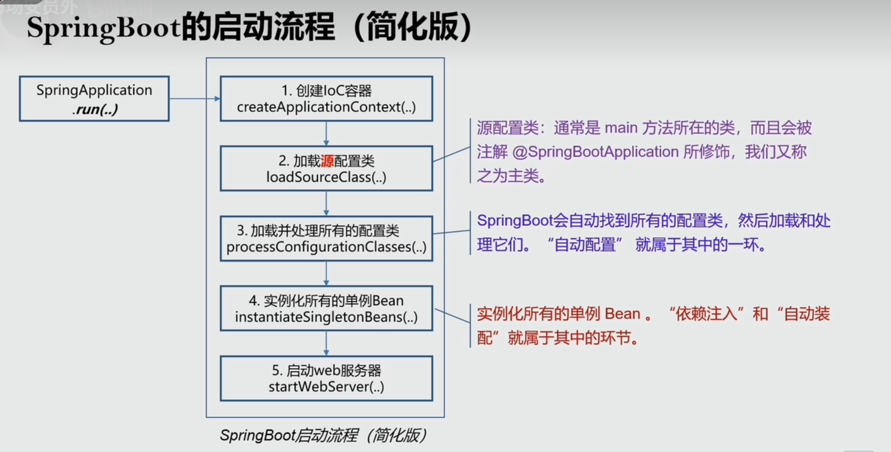
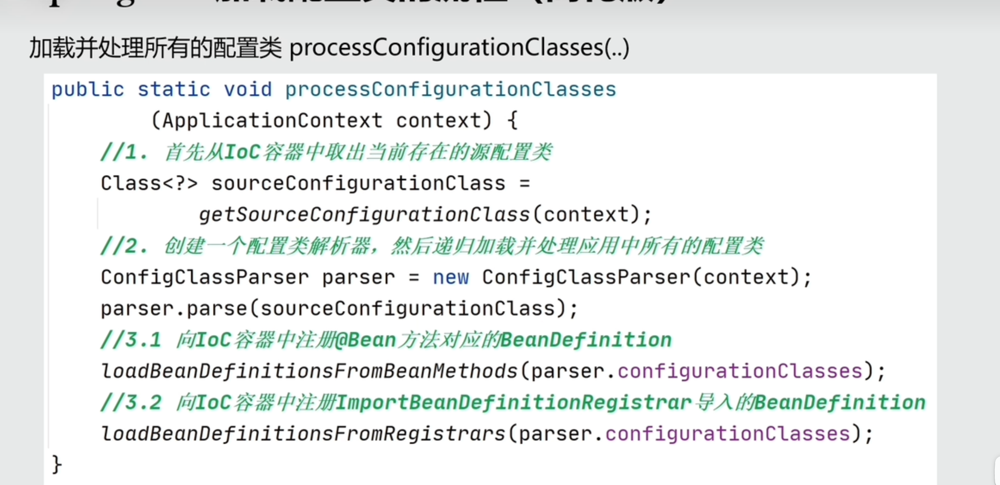
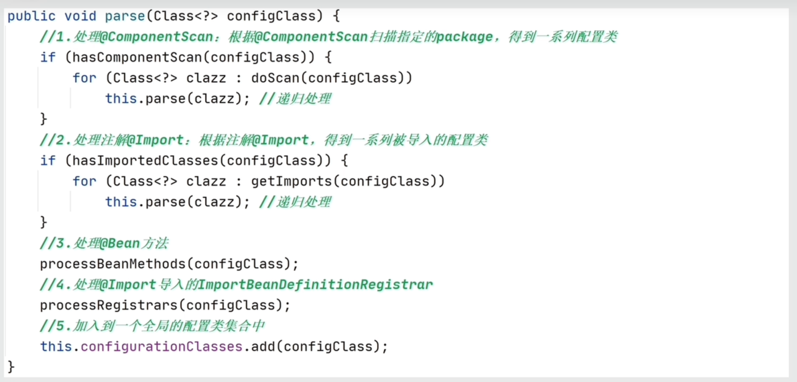
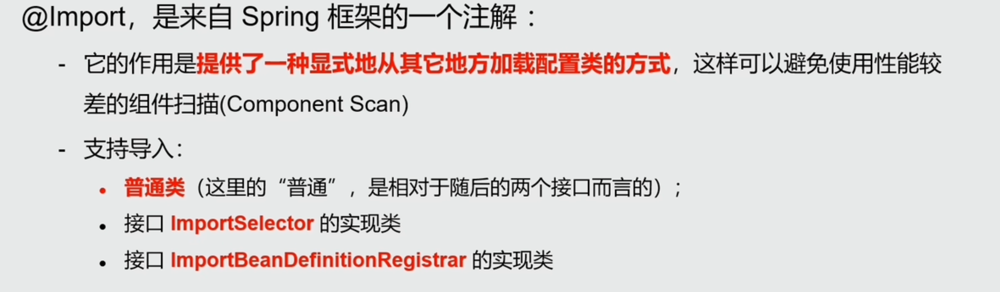
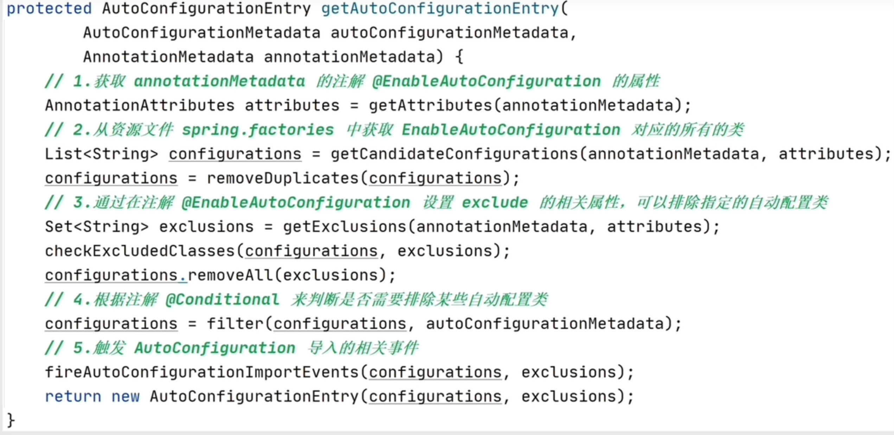
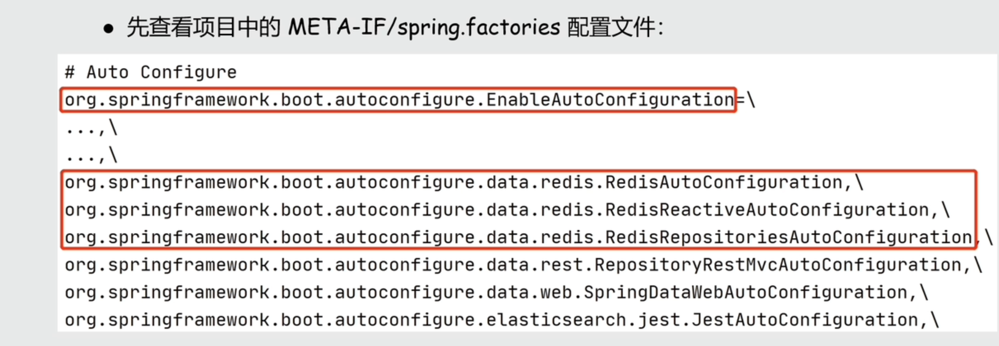
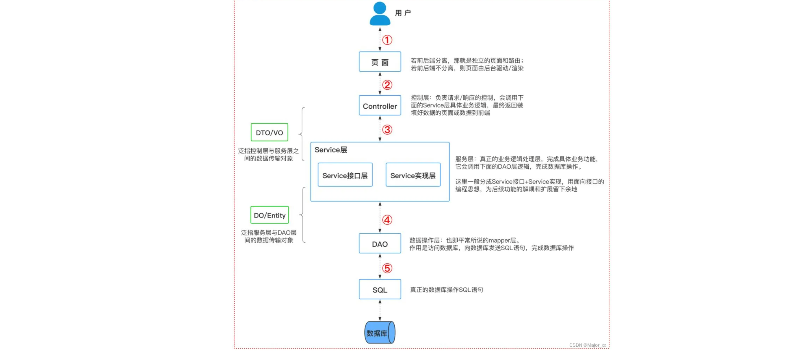
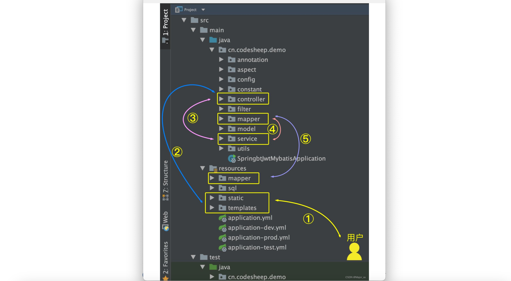

[TOC]


# 概述

#### Spring的缺点

**配置文件比较多。**


Spring 是重量级企业开发框架 Enterprise JavaBean（EJB） 的替代品，Spring 为企业级 Java 开发提供了一种相对简单的方法，通过 依赖注入 和 面向切面编程 ，用简单的 Java 对象（Plain Old Java Object，POJO） 实现了 EJB 的功能

虽然 Spring 的组件代码是轻量级的，但它的配置却是重量级的（需要大量 XML 配置） 。

为此，Spring 2.5 引入了基于注解的组件扫描，这消除了大量针对应用程序自身组件的显式 XML 配置。Spring 3.0 引入了基于 Java 的配置，这是一种类型安全的可重构配置方式，可以代替 XML。

尽管如此，我们依旧没能逃脱配置的魔爪。开启某些 Spring 特性时，比如事务管理和 Spring MVC，还是需要用 XML 或 Java 进行显式配置。启用第三方库时也需要显式配置，比如基于 Thymeleaf 的 Web 视图。配置 Servlet 和过滤器（比如 Spring 的DispatcherServlet）同样需要在 web.xml 或 Servlet 初始化代码里进行显式配置。组件扫描减少了配置量，Java 配置让它看上去简洁不少，但 Spring 还是需要不少配置。

光配置这些 XML 文件都够我们头疼的了，占用了我们大部分时间和精力。除此之外，相关库的依赖非常让人头疼，不同库之间的版本冲突也非常常见。

#### **为什么要有 SpringBoot?**

**Spring 旨在简化 J2EE 企业应用程序开发。Spring Boot 旨在简化 Spring 开发（减少配置文件，开箱即用！）。**


#### **使用 Spring Boot 的主要优点**

- 开发基于 Spring 的应用程序很容易。
- Spring Boot 项目所需的开发或工程时间明显减少，通常会提高整体生产力。
- Spring Boot 不需要编写大量样板代码、XML 配置和注释。
- Spring 引导应用程序可以很容易地与 Spring 生态系统集成，如 Spring JDBC、Spring ORM、Spring Data、Spring Security 
- Spring Boot 遵循“固执己见的默认配置”，以减少开发工作（默认配置可以修改）。
- Spring Boot 应用程序提供嵌入式 HTTP 服务器，如 Tomcat 和 Jetty，可以轻松地开发和测试 web 应用程序。（这点很赞！普通运行 Java 程序的方式就能运行基于 Spring Boot web 项目，省事很多）
- Spring Boot 提供命令行接口(CLI)工具，用于开发和测试 Spring Boot 应用程序，如 Java 或 Groovy。
- Spring Boot 提供了多种插件，可以使用内置工具(如 Maven 和 Gradle)开发和测试 Spring Boot 应用程序。

#### **什么是 Spring Boot Starters?**

Spring Boot Starters 是一系列依赖关系的集合，因为它的存在，项目的依赖之间的关系对我们来说变的更加简单了。

举个例子：在没有 Spring Boot Starters 之前，我们开发 REST 服务或 Web 应用程序时; 我们需要使用像 Spring MVC，Tomcat 和 Jackson 这样的库，这些依赖我们需要手动一个一个添加。但是，有了 Spring Boot Starters 我们只需要一个只需添加一个spring-boot-starter-web一个依赖就可以了，这个依赖包含的子依赖中包含了我们开发 REST 服务需要的所有依赖。

```java
<dependency>
    <groupId>org.springframework.boot</groupId>
    <artifactId>spring-boot-starter-web</artifactId>
</dependency>
```

#### **Spring Boot 支持哪些内嵌 Servlet 容器？**

Spring Boot 支持以下嵌入式 Servlet 容器:

| Name         | Servlet Version |
| ------------ | --------------- |
| Tomcat 9.0   | 4.0             |
| Jetty 9.4    | 3.1             |
| Undertow 2.0 | 4.0             |

您还可以将 Spring 引导应用程序部署到任何 Servlet 3.1+兼容的 Web 容器中。

这就是你为什么可以通过直接像运行 普通 Java 项目一样运行 SpringBoot 项目。这样的确省事了很多，方便了我们进行开发，降低了学习难度。

####  **如何在 Spring Boot 应用程序中使用 Jetty 而不是 Tomcat?**

Spring Boot （spring-boot-starter-web）使用 Tomcat 作为默认的嵌入式 servlet 容器, 如果你想使用 Jetty 的话只需要修改pom.xml(Maven)或者build.gradle(Gradle)就可以了。

```xml
<!--从Web启动器依赖中排除Tomcat-->
<dependency>
	<groupId>org.springframework.boot</groupId>
	<artifactId>spring-boot-starter-web</artifactId>
	<exclusions>
		<exclusion>
			<groupId>org.springframework.boot</groupId>
			<artifactId>spring-boot-starter-tomcat</artifactId>
		</exclusion>
	</exclusions>
</dependency>
<!--添加Jetty依赖-->
<dependency>
	<groupId>org.springframework.boot</groupId>
	<artifactId>spring-boot-starter-jetty</artifactId>
</dependency>
```

#### SpringBoot启动流程











#### **介绍一下@SpringBootApplication 注解**

```java

package org.springframework.boot.autoconfigure;
@Target(ElementType.TYPE)
@Retention(RetentionPolicy.RUNTIME)
@Documented
@Inherited
@SpringBootConfiguration
@EnableAutoConfiguration
@ComponentScan(excludeFilters = {
		@Filter(type = FilterType.CUSTOM, classes = TypeExcludeFilter.class),
		@Filter(type = FilterType.CUSTOM, classes = AutoConfigurationExcludeFilter.class) })
public @interface SpringBootApplication {
   ......
}
```

```java
package org.springframework.boot;
@Target(ElementType.TYPE)
@Retention(RetentionPolicy.RUNTIME)
@Documented
@Configuration
public @interface SpringBootConfiguration {

}
```

可以看出大概可以把 @SpringBootApplication看作是 @Configuration、@EnableAutoConfiguration、@ComponentScan 注解的集合。根据 SpringBoot 官网，这三个注解的作用分别是：

- @EnableAutoConfiguration：启用 SpringBoot 的自动配置机制

- @ComponentScan： 扫描被@Component (@Service,@Controller)注解的 bean，注解默认会扫描该类所在的包下所有的类。

- @Configuration：允许在上下文中注册额外的 bean 或导入其他配置类，@Configuration就是用来直接或间接注册Bean到IOC容器中的

#### **Spring Boot 的自动配置是如何实现的?**

```java
@SpringBootApplication
public class EntryApplication {

    public static void main(String[] args) {
        SpringApplication.run(EntryApplication.class, args);
    }
}

```

@SpringBootApplication 注解流程图


**Spring Boot的自动装配实际上是从`META-INF/spring.factories`文件中获取到对应的需要进行自动装配的类，并生成相应的Bean对象，然后将它们交给Spring容器进行管理**。

- 在Spring Boot项目中有一个注解@SpringBootApplication，这个注解是对三个注解进行了封装：@SpringBootConfiguration、@EnableAutoConfiguration、@ComponentScan
  - @Configuration：允许在上下文中注册额外的 bean 或导入其他配置类，@Configuration就是用来直接或间接注册Bean到IOC容器中的
  - @ComponentScan： 扫描被@Component (@Service,@Controller)注解的 bean，注解默认会扫描该类所在的包下所有的类。
  - @EnableAutoConfiguration是实现自动化配置的核心注解。该注解通过@Import注解导入AutoConfigurationImportSelector，这个类实现了一个导入器接口ImportSelector。在该接口中存在一个方法selectImports，
    - 该方法的返回值是一个数组，数组中存储的就是要被导入到spring容器中的类的全类名。在AutoConfigurationImportSelector类中重写了这个方法,
    - 该方法内部就是读取了项目的classpath路径下META-INF/spring.factories文件中的所配置的类的全类名。
      在这些配置类中所定义的Bean会根据条件注解@Conditional所指定的条件来决定是否需要将其导入到Spring容器中。






#### **Spirng Boot 常用的两种配置文件**

我们可以通过 application.properties或者 application.yml 对 Spring Boot 程序进行简单的配置。如果，你不进行配置的话，就是使用的默认配置。

#### 什么是 YAML？YAML 配置的优势在哪里 ?

YAML 是一种人类可读的数据序列化语言。它通常用于配置文件。与属性文件相比，如果我们想要在配置文件中添加复杂的属性，YAML 文件就更加结构化，而且更少混淆。可以看出 YAML 具有分层配置数据。

相比于 Properties 配置的方式，YAML 配置的方式更加直观清晰，简介明了，有层次感。但是，YAML 配置的方式有一个缺点，那就是不支持 @PropertySource 注解导入自定义的 YAML 配置。

####  Spring Boot 常用的读取配置文件的方法有哪些？

我们要读取的配置文件application.yml 内容如下：

```
wuhan2020: 2020年初武汉爆发了新型冠状病毒，疫情严重，但是，我相信一切都会过去！武汉加油！中国加油！

library:
  location: 湖北武汉加油中国加油
  books:
    - name: 天才基本法
      description: 二十二岁的林朝夕在父亲确诊阿尔茨海默病这天，得知自己暗恋多年的校园男神裴之即将出国深造的消息——对方考取的学校，恰是父亲当年为她放弃的那所。
    - name: 时间的秩序
      description: 为什么我们记得过去，而非未来？时间“流逝”意味着什么？是我们存在于时间之内，还是时间存在于我们之中？卡洛·罗韦利用诗意的文字，邀请我们思考这一亘古难题——时间的本质。
    - name: 了不起的我
      description: 如何养成一个新习惯？如何让心智变得更成熟？如何拥有高质量的关系？ 如何走出人生的艰难时刻？
```

- 通过 @value 读取比较简单的配置信息，需要注意的是 @value这种方式是不被推荐的，Spring 比较建议的是下面几种读取配置信息的方式。

  ```java
  @Value("${wuhan2020}")
  String wuhan2020;
  ```

- 通过@ConfigurationProperties读取并与 bean 绑定， LibraryProperties 类上加了 @Component 注解，我们可以像使用普通 bean 一样将其注入到类中使用。

  ```
  
  
  import lombok.Getter;
  import lombok.Setter;
  import lombok.ToString;
  import org.springframework.boot.context.properties.ConfigurationProperties;
  import org.springframework.context.annotation.Configuration;
  import org.springframework.stereotype.Component;
  
  import java.util.List;
  
  @Component
  @ConfigurationProperties(prefix = "library")
  @Setter
  @Getter
  @ToString
  class LibraryProperties {
      private String location;
      private List<Book> books;
  
      @Setter
      @Getter
      @ToString
      static class Book {
          String name;
          String description;
      }
  ```

- @PropertySource读取指定的 properties 文件

```java

import lombok.Getter;
import lombok.Setter;
import org.springframework.beans.factory.annotation.Value;
import org.springframework.context.annotation.PropertySource;
import org.springframework.stereotype.Component;

@Component
@PropertySource("classpath:website.properties")
@Getter
@Setter
class WebSite {
    @Value("${url}")
    private String url;
}
```

#### **Spring Boot 加载配置文件的优先级了解么？**


#### **Spring Boot 中如何实现定时任务 ?**

们使用 @Scheduled 注解就能很方便地创建一个定时任务。单纯依靠 @Scheduled 注解 还不行，我们还需要在 SpringBoot 中我们只需要在启动类上加上@EnableScheduling 注解，这样才可以启动定时任务。@EnableScheduling 注解的作用是发现注解 @Scheduled 的任务并在后台执行该任务。

```java
@Component
public class ScheduledTasks {
    private static final Logger log = LoggerFactory.getLogger(ScheduledTasks.class);
    private static final SimpleDateFormat dateFormat = new SimpleDateFormat("HH:mm:ss");

    /**
     * fixedRate：固定速率执行。每5秒执行一次。
     */
    @Scheduled(fixedRate = 5000)
    public void reportCurrentTimeWithFixedRate() {
        log.info("Current Thread : {}", Thread.currentThread().getName());
        log.info("Fixed Rate Task : The time is now {}", dateFormat.format(new Date()));
    }
}

```

#### **SpringBoot的项目结构是怎么样的？**

一个正常的企业项目里一种通用的项目结构和代码层级划分的指导意见。按这《阿里巴巴Java开发手册》时本书上说的，一般分为如下几层：


- 开放接口层：可直接封装 Service 接口暴露成 RPC 接口；通过 Web 封装成 http 接口；网关控制层等。
- 终端显示层：各个端的模板渲染并执行显示的层。当前主要是 velocity 渲染，JS 渲染，JSP 渲染，移动端展示等。
- Web 层：主要是对访问控制进行转发，各类基本参数校验，或者不复用的业务简单处理等。
- Service 层：相对具体的业务逻辑服务层。
- Manager 层：通用业务处理层，它有如下特征
  - 1）对第三方平台封装的层，预处理返回结果及转化异常信息，适配上层接口。
  - 2）对 Service 层通用能力的下沉，如缓存方案、中间件通用处理。
  - 3）与 DAO 层交互，对多个 DAO 的组合复用。
- DAO 层：数据访问层，与底层 MySQL、Oracle、Hbase、OceanBase 等进行数据交互。
- 第三方服务：包括其它部门 RPC 服务接口，基础平台，其它公司的 HTTP 接口，如淘宝开放平台、支付宝付款服务、高德地图服务等。
- 外部接口：外部（应用）数据存储服务提供的接口，多见于数据迁移场景中。

如果从一个用户访问一个网站的情况来看，对应着上面的项目代码结构来分析，可以贯穿整个代码分层：



对应代码目录的流转逻辑就是：


