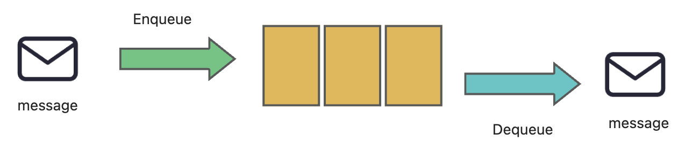
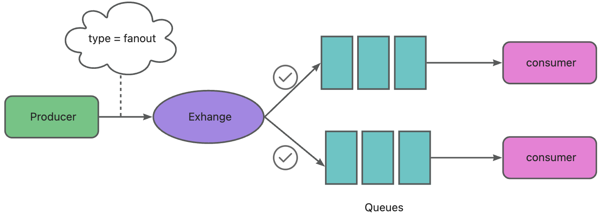
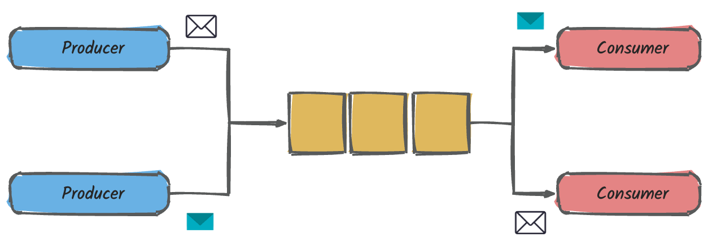
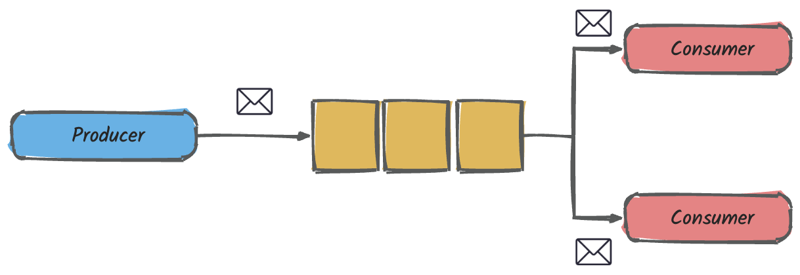
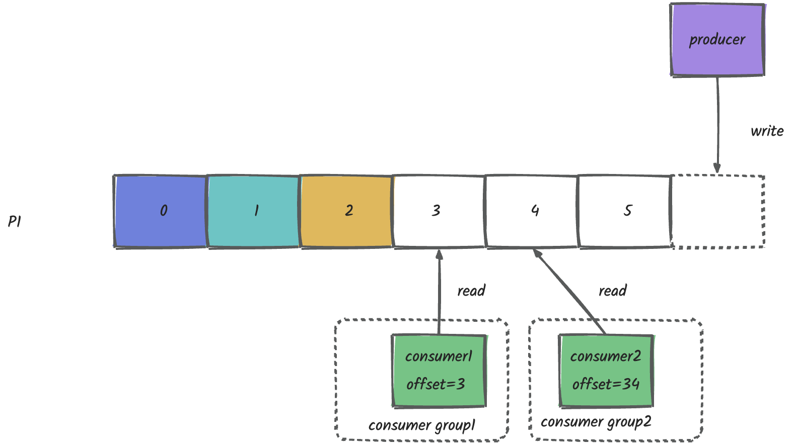

[TOC]

# 1. 概述

## 1.1. 什么是消息队列

消息队列是一种进程间通信或者同一进程的不同线程间的通信方式，主要解决应用耦合，异步消息，流量削峰等问题，实现高性能，高可用，可伸缩和最终一致性架构。是大型分布式系统不可缺少的中间件。消息发布者只管把消息发布到MQ中而不管谁来取，消息使用者只管从MQ中取消息而不管是谁发布的，这样发布者和使用者都不知道对方的存在。

## 1.2. 使用场景

- **异步处理**：从A系统接收数据后计算的耗时比较久，计算的流程不影响主线程时，就可以通过MQ的方式异步进行处理。
- **应用解耦**：比如系统A进行某项操作之后，通知系统B和C，系统BC接收到消息后进行相同的处理，假如B系统需要下线或者新增一个系统时，就需要改整个系统的代码，如此反复添加和删除依赖的系统，系统便难以维护，此时可以通过MQ来进行解耦。
- **流量削峰**：有一个活动页面，平时QPS非常低，但是在某个时刻的QPS特别高，超过了系统的处理能力，而进行机器扩容容易造成利用率低下，通过MQ的方式可以进行削峰。

## 1.3. 消息队列协议

### 1.3.1. AMQP

AMQP即Advanced Message Queuing Protocol,是应用层协议的一个开放标准，为面向消息的中间件设计，消息中间件主要用于组件之间的解耦，消息的发送者无需知道消息使用者的存在，反之亦然。他是具有现代特征的二进制协议：多通道的，协商的，异步的，安全的，便捷的，自然的，高效的。

**AMQP（0.9.1）通常划分为2层：**

功能层：定义了一系列命令，分成功能独立的逻辑类，可为应用程序做有用工作。

传输层：将这些方法从应用程序应用搬到服务器并返回，它同时会处理通道复用，帧同步，内容编码，心跳检测以及数据表示和错误处理。

**AMQP（0.10）变化较大，分为3层：**

模型层：定义一套命令，按照功能分类，客户端应用可以利用这些命令来实现它的业务功能。

会话层：负责将命令从客户端应用传递给服务器，再将服务器的应答传递给客户端应用，会话层为这个传递过程提供可靠性，同步机制和错误处理。

传输层：提供帧处理，信道复用，错误检测和数据表示。

AMQP 0.10在灵活度增加的同时复杂度也增加了。

**AMQP模型**

表示关键实例和语义的逻辑框架，它必须对兼容AMQP实现的服务器可用，使得服务的状态可以通过客户端按本规范中定义的语义来实现。

消息被发布者发送给交换机，交换机常常被比喻为邮局或者邮箱，交换机将受到的消息按照路由规则分发到绑定的队列中，最后AMQP代理会将消息投递给订阅了此队列的消费者，或者消费者按需获取。

**协议特点：面向消息，队列，路由（包括点对点和发布/订阅），可靠性，安全。**

### 1.3.2. MQTT

MQTT即Message Queue Telemetry Transport,消息队列遥测传输，是IBM开发的一个即时通讯协议，是一种基于轻量级代理的，发布/订阅模式的消息传输协议，运行在TCP协议栈智商，为其提供有序，可靠，双向连接的网络连接保证。该协议支持所有平台，几乎可以把所有联网物品和外部连接其他，被用来当做传感器和致动器的通信协议。

**协议特点**：格式简单，占用带宽小，移动端通信，PUSH，嵌入式系统

### 1.3.3. STOMP

STOMP（Streaming Text Orientated Message Protocol）是流文本定向消息协议，是一种MOM（Message Orientated Middieware，面向消息的中间件）设计的简单文本协议，STOMP提供了一个可互操作的连接格式，允许客户端与任意STOMP消息代理（Broker）进行交互。

协议特点：命令模式（非topic\queue模式）

### 1.3.4. XMPP

XMPP（可扩展消息处理现场协议，Extensible Messaging and Presence Protocol）是基于可扩展标记语言（XML）的协议，多用于即时消息以及在线现场探测，适用于服务器之间的准即时操作，核心是基于XML流传输，这个协议可能最终允许因特网用户向因特网上的其他任何人发送即时消息，即使其操作系统和浏览器不同。

协议特点：通用公开，兼容性强，可扩展，安全性高，但是XML编码格式占用带宽大。

## 1.4. 常见消息队列

### 1.4.1. RabbitMQ

RabbitMQ是实现AMQP（0.9.1）协议的消息中间件的一种，由RabbitMQ Technologies Ltd 开发并且提供商业支持的，最终起源于金融系统，服务器端用Erlang语言编写，用于在分布式系统中存储转发消息，在易用性，扩展性，高可用性等方面表现较好。

**组成元素**

- 元素包括：Producer(生产者)，Consumer(消费者)，Broker(代理服务器)，Virtual Host(虚拟节点)，Exchange(交换机)，Message(消息)，Queue(队列)
- 一个Broker中一定包含完整的Virtual Host，Exchange，Queue定义，一个Broker可以创建多个Virtual Host,如果是有多个Broker构成的集群提供服务，那么一个Virtual Host也可以有多个Broker共同构成。
- Producer生产消息，将消息发送给Broker，Consumer消费消息，负责从broker中获取消息，
- Connection是由Producer和Consumer创建的连接，连接到Broker物理节点上，但是有了Connection之后客户端还不能和服务端通信，在Connection之上客户端会创建Channel，连接到Virtual Host或者Queue上，这样客户端才能向Exchange发送消息或者从Queue接收消息，一个Connection上允许存在多个Channel，只有Channel中才能够发送/接收消息。
- Exchange可以绑定多个Queue也可以同时绑定其他Exchange,消息通过Exchange时，会按照Exchange中设置的Routing规则，将消息发送到符合的Queue或者Exchange中。

**消息路由**

1. Producer会先建立Channel，建立到Broker上Virtual Host的连接，接下来就可以向这个Virtual Host中的Exchange发消息。
2. Producer把消息发布到Exchange上，消息最终到达队列并被消费者接收，而Binding决定交换机的消息应该发送到哪个队列，Exchange能够处理消息的前提是，它至少已经和某个Queue或者另外的Exchange形成了绑定关系，并设置好了到这些Queue和Exchange的路由规则，在Exchange接受到消息后，会根据设置的路由规则，将消息发送到符合要求的Queue或者Exchange中（路由规则与message中的Routing key属性配合使用）。
3. 当Queue收到消息之后，会进行以下处理：

1. 如果当前没有Consumer的Channel连接到这个Queue，那么Queue将会把这条消息进行存储，直到有Channel被创建。
2. 如果已经有Channel连接到这个Queue，那么消息将会按照顺序发送给这个Channel；

1. 当Consumer收到消息之后，就可以进行消息的处理：

1. Consumer在完成某一条消息的处理后，将需要手动的发送一条ACK消息到对应Queue，也可以设置为自动发送或者无需发送。
2. Queue在接受到这条ACK消息后，才认为这条消息处理成功，并将这条消息从Queue中移除。
3. 如果对应的Channel断开后，Queue都没有这条消息的ACK信息，这条消息将会重新发送给另外的Channel，也可以直接发送NACK信息，这样这条消息将会立即归队，并发送给另外的Channel。

**Exchange类型**

Exchange分发消息时，根据类型的不同，分发策略有明显的区别: Direct,Fanout,Topic,Headers。Headers匹配AMQP消息的Header而不是路由键，此外Headers交换机和Direct交换机完全一致，但是性能差很多，目前几乎不用**。**

- DIRECT
- 

消息中的路由键如果和Binding中Binding key一致，交换机就将消息发送到对应的队列中，路由键与队列名完全匹配，如果一个队列绑定到交换机要求路由键位news，则只转发Routing key为news的消息，不会转发weather，它是完全匹配，单播的模式。

- FANOUT

每个发到Fanout类型交换器的消息都会分到所有绑定的队列上去，Fanout交换器不处理路由键，只是简单的将队列绑定到交换机上，每个发送到交换器的消息都会被转发到与该交换器绑定的所有队列上，很想子网光比，每台子网内的主机都获得了一份消息的复制。Fanout类型转发消息是最快的。

- TOPIC

交换机通过模式匹配分配消息的路由键属性，将路由键与某个模式进行匹配，此时队列需要绑定到一个模式上，它将路由键个绑定键的字符串切分为单次，这些单次之间用点隔开。

支持通配符：

- *匹配一个单词
- \#匹配0个或者多个单词

**主要特性**

- **可靠性：**提供了多种技术可以让你在性能和可靠性之间进行权衡，如持久性机制，投递确认，发布确认和高可用机制
- **灵活的路由：**消息在到达队列之前，通过Exchange进行路由，对于典型的路由RabbitMQ提供了一些内置的Exchange，而对于更复杂的路由，则可以将这些Exchange组合起来使用，甚至可以实现自己的Exchange，并且当做RabbitMQ的插件来用。
- **消息集群：**在相同局域网中的多个RabbitMQ服务器聚合在一起，形成一个逻辑Broker.
- **高可用：**队列可以在集群中的机器上进行镜像，以确保在硬件问题下还保证消息安全
- **多协议：**支持多种消息队列协议，如STOMP，MQTT等
- **多语言：**使用Erlang语言编写，客户端几乎支持多种常用语言
- **管理界面：**RabbitMQ有一个易用的web用户界面，使得用户可以方便进行监控和消息的管理
- **跟踪机制：**RabbitMQ提供消息跟踪机制
- **插件机制**：提供了许多的插件来进行扩展，也支持自定义插件的开发。

### 1.4.2. RocketMQ

RocketMQ是阿里巴巴在2012年开源的分布式消息中间件，目前已经捐赠给Apache软件基金会，并于2017年9月25日称为Apache的顶级项目，以其高性能，低延时和高可靠等特性近年来已经也被越来越多的国内企业使用。

**生产者组（Producer）**

负责生产消息，生产者向消息服务器发送由业务应用程序系统生成的消息。RocketMQ提供了三种方式发送消息：同步，异步，单向

**消费者组（Consumer）**

负责消费消息，消费者从消息服务器拉取信息并将其输入用户应用程序，站在用户应用的角度消费者有两种类型：拉取型消费者，推送型消费者。**拉取型消费者**主动从消息服务器拉取信息，只要批量拉取到消息，用户应用就会启动消费过程，所以Pull称为主动消费型，**推送型消费者**封装了消息的拉取，消费进度和其他的内部维护工作，将消息到达执行的回调接口留给用户应用程序来实现，所以push称为被动消费类型，但从实现上看还是从消息服务器中拉取消息，不同于Pull的是Push首先要注册消费监听器，当监听器处触发后才开始消费消息。

**名称服务器（NameServer）**

用来保存Broker相关元信息并给Producer和Consumer查找Broker信息，NameServer被设计称几乎无状态的，可以横向扩展，节点之间相互之间无通信，通过部署多台机器来标记自己是一个伪集群。每个Broker在启动的时候会到NameServer注册，Producer在发送消息前会根据topic到nameServer获取到Broker的路由信息，Consumer也会定时获取Topic的路由信息，所有从功能上看应该是和Zookeeper差不多，据说RocketMQ的早期版本确实使用的是Zookeeper,后来改为了自己实现的NameServer。

**消息服务器（Broker）**

是消息存储中心，主要作用是接受来自于Producer的消息并存储，Consumer从这里取得消息，它还存储与消息相关的元数据，包括用户组，消费进度偏移量，队列信息等。从部署结构图中可以看出Broker有master和slave两种类型。master既可以读，也可以写，slave不可以写只可以读。从物理结构上看Broker的集群部署方式有四种：单master,多maser,多master多slave(同步刷盘)，多master多slave(异步刷盘)

**主要特性**

- **灵活可扩展性**：天然支持集群，其核心四组件（Name Server,Broker,Producer,Consumer）每一个都可以在没有单点故障的情况下进行水平扩展。
- **海量消息堆积**：采用零拷贝原理实现超大的消息的堆积能力，据说单机已可以支持亿级消息堆积，而且在对接了这么多消息后仍然可以保持写入低延迟。
- **顺序消息**：可以保证消息消费者按照消息发送的顺序对消息进行消费，顺序消费分为全局有序和局部有序，一般推荐使用局部有序，即生产者通过将某一类消息按照顺序发送至同一个队列来实现。
- **消息过滤**：分为在服务器端过滤和在消费端过滤，服务端过滤时可以按照消息消费者的要求做过滤，优点是减少不必要的消息传输，缺点是增加了消费服务器的负担，实现相对复杂。消费端过滤则完全由具体应用自定义实现，这种方式更灵活，缺点是很多无用消息会传输给消息消费者。
- **事务消息**：除了支持普通消息，顺序消息之外还支持事务消息，这个特性对于分布式事务来说提供了又一种解决思路。
- **消息回溯**：是指消费者已经消费成功的消息，由于业务上的需求需要重新消息，RocketMQ支持按照时间回溯消费，时间维度精确到毫秒，可以向前回溯，也可以向后回溯。

### 1.4.3. Kafka

Kafka是由Apache软件基金会开发的一个开源流处理平台，由Scala和java编写，kafka是一种高吞吐量的分布式发布订阅消息系统，它可以处理消费者规模的网站中的所有动作流数据。这种动作时在现代网络上的许多社会功能的一个关键因素，这些数据通常是由于吞吐量的要求而通过处理日志和日志聚合来解决。对于像Hadoop一样的日志数据和离线分析系统，但又要求实时处理的限制，这是一个可行的解决方案。kafka的目的是通过Hadoop的并行加载机制来统一处理线上和离线的消息处理，也是为了通过集群来提供实时的消息。

**基本组件**

- Broker：消息中间件处理节点，一个Kafka节点就是一个Broker，一个或者多个Broker可以组成一个Kafka集群
- Topic：每条发布到kafka集群的消息都有一个类别，这个类别被称为Topic。（物理上不同topic的消息分开存储，逻辑上一个Topic的消息虽然保存于一个或者多个Broker上但用户只需指定消息的Topic即可生产或者消费数据而不必关心数据存在何处）
- Partition：用于存放消息的队列，存放的消息都是有序的，同一个主题可以分为多个partation，如分为多个partation,同样会以如partation1存放1，3，5消息，partation2存放2，4，6消息
- Producer：消息生产者，向Broker发送消息的客户端
- Consumer：消息消费者，从Broker读取消息的客户端，Consumer是通过offset进行标识消息被消费的位置。
- Consumer Group : 每个Consumer属于一个特定的Consumer Group，一条消息可以发送到多个不同的Consumer Group,但是同一个consumer Group中只能有一个consumer能够消费该消息。

主要特性：

1**.快速持久化**：可以在 O(1) 的系统开销下进行消息持久化 

**2.高吞吐**：在一台普通的服务器上既可以达到10W/s的吞吐速率

3.**完全的分布式系统**：Broker、Producer和Consumer都原生自动支持分布式，自动实现负载均衡 

4.**零拷贝技术(zero-copy)**：减少IO操作步骤，提高系统吞吐量 

5.支持同步和异步复制两种高可用机制 

6.丰富的消息拉取模型，支持数据批量发送和拉取 

7.数据迁移、扩容对用户透明 

8.无需停机即可扩展机器 

9.高效订阅者水平扩展、实时的消息订阅、亿级的消息堆积能力、定期删除机制

### 1.4.4. ActiveMQ

ActiveMQ 是由 Apache 出品的一款开源消息[中间件](https://cloud.tencent.com/product/tdmq?from_column=20065&from=20065)，旨在为应用程序提供高效、可扩展、稳定、安全的企业级消息通信。它的设计目标是提供标准的、面向消息的、多语言的应用集成消息通信中间件。ActiveMQ 实现了 JMS 1.1 并提供了很多附加的特性，比如 JMX 管理、主从管理、消息组通信、消息优先级、延迟接收消息、虚拟接收者、消息持久化、[消息队列](https://cloud.tencent.com/product/cmq?from_column=20065&from=20065)监控等等。它非常快速，支持多种语言的客户端和协议，而且可以非常容易的嵌入到企业的应用环境中，并有许多高级功能。

**基本组件**

Broker,Producer,Consumer,Topic,Queue,Message

**连接器**

ActiveMQ Broker的主要作用是为客户端应用提供一种通信机制，为此ActiveMQ提供看一种连接机制，并用连接器（connector）来描述这种连接机制，ActiveMQ中连接器有两种，一种是用于客户端与消息代理服务器（client-to-broker）之间通信的传输连接器（transport connector），一种是用于消息代理服务器之间（broker-to-broker）通信的网络连接器（network connector）。

**消息传送模型**

1. 点对点模型（Point to Point）

   

使用队列（Queue）作为消息通信载体，满足生产者和消费者模式，一条消息只能被一个消费者使用，未被消费的消息在队列中保留直到被消费或者超时。

1. 发布订阅模型（Pub/Sub）

消息域使用topic作为Destination,发布者向topic发送消息，订阅者注册接受来自topic的消息，发送到topic的任何消息都将自动传递给所有订阅者。

**主要特性**

- 服从JMS规范：完全支持JMS 1.1和J2EE 1.4规范，包括同步或者异步的消息分发，一次和仅一次的消息分发，分布式事务消息，消息接受，订阅，持久化等。
- 连接灵活性：ActiveMQ提供了多种连接模式，例如in-VM，TCP，SSL，NIO，UDP，多播，JGroup.JXTA等
- 多协议：openWire,SMTOP,REST,XMPP,AMQP等
- 多语言：支持java，C/C++，python,PHP ,Perl,.net等
- 代理集群：多个ActiveMQ代理可以组成一个集群来提供服务
- 简单的管理：ActiveMQ 是以开发者思维被设计的，所以它并不需要专门的管理员，因为它提供了简单又实用的管理特性，有很多方法可以监控ActiveMQ不同层面的数据，包括使用在Jconsole或者在ActiveMQ的Web Console中使用JMX。通过处理JMX的告警信息，通过使用命令行脚本，甚至可以通过监控各种类型的日志。
- 整合容易：ActiveMQ可以通过Spring的配置文件方式很容易嵌入到Spring应用中，也可以轻松的与CXF，Axis等Web Service技术整合，以提供可靠的消息传输。

### 1.4.5. 对比

- ActiveMQ 的社区算是比较成熟，但是较目前来说，ActiveMQ 的性能比较差，而且版本迭代很慢，不推荐使用，已经被淘汰了。
- RabbitMQ 在吞吐量方面虽然稍逊于 Kafka、RocketMQ 和 Pulsar，但是由于它基于 Erlang 开发，所以并发能力很强，性能极其好，延时很低，达到微秒级。但是也因为 RabbitMQ 基于 Erlang 开发，所以国内很少有公司有实力做 Erlang 源码级别的研究和定制。如果业务场景对并发量要求不是太高（十万级、百万级），那这几种消息队列中，RabbitMQ 或许是你的首选。
- RocketMQ 和 Pulsar 支持强一致性，对消息一致性要求比较高的场景可以使用。
- RocketMQ 阿里出品，Java 系开源项目，源代码我们可以直接阅读，然后可以定制自己公司的 MQ，并且 RocketMQ 有阿里巴巴的实际业务场景的实战考验。
- Kafka 的特点其实很明显，就是仅仅提供较少的核心功能，但是提供超高的吞吐量，ms 级的延迟，极高的可用性以及可靠性，而且分布式可以任意扩展。同时 Kafka 最好是支撑较少的 topic 数量即可，保证其超高吞吐量。Kafka 唯一的一点劣势是有可能消息重复消费，那么对数据准确性会造成极其轻微的影响，在大数据领域中以及日志采集中，这点轻微影响可以忽略这个特性天然适合大数据实时计算以及日志收集。如果是大数据领域的实时计算、日志采集等场景，用 Kafka 是业内标准的，绝对没问题，社区活跃度很高，绝对不会黄，何况几乎是全世界这个领域的事实性规范。

| 特性                    | RabbitMQ                                                     | RocketMQ                                                     | Kafka                                                        | ActiveMQ                             |
| ----------------------- | ------------------------------------------------------------ | ------------------------------------------------------------ | ------------------------------------------------------------ | ------------------------------------ |
| 开发语言                | Erlang                                                       | java                                                         | Scala&java                                                   | java                                 |
| 客户端支持              | 官方支持Erlang，java,Ruby等，社区产出多语言API，几乎支持所有常用语言 | java,c++                                                     | 官方支持java,社区有多语言版本，如PHP，Go，C/C++.Ruby,NodeJs等 | java，C/C++，python,PHP ,Perl,.net等 |
| 协议支持                | AMQP,XMPP,SMTP,SMTOP                                         | 自定义协议，社区提供JMS                                      | 自定义协议，社区提供了HTTP协议支持                           | openWire,SMTOP,REST,XMPP,AMQP        |
| 可用性                  | 高，基于主从架构实现高可用                                   | 很高，分布式架构                                             | 很高，分布式，一个数据多个副本，少数机器宕机，不会丢失数据，不会导致不可用 | 高，基于主从架构实现高可用           |
| 集群                    | 支持                                                         | 支持                                                         | 支持                                                         | 支持                                 |
| 负载均衡                | 支持                                                         | 支持                                                         | 支持                                                         | 支持                                 |
| 单机吞吐量              | 万级                                                         | 十万级                                                       | 十万级                                                       | 万级                                 |
| topic数量对吞吐量的影响 | -                                                            | topic达到几百/几万的级别后，吞吐量会有较小幅度的下降，在同等机器下，可以支持大量topic | topic从几十到几百的时候，吞吐量会大幅度下降，因为kafka的每个topic，每个分区都会对应一个物理文件，若需要支撑大规模的topic，则需要增加更多的机器资源 | -                                    |
| 消息批量操作            | 不支持                                                       | 支持                                                         | 支持                                                         | 支持                                 |
| 消息推拉模式            | pull/push均支持                                              | pull/push均支持                                              | pull                                                         | pull/push均支持                      |
| 消息可靠性              | 可以做到不丢失                                               | 可以做到不丢失                                               | 可以做到不丢失                                               | 有较低的概率丢失数据                 |
| 消息延迟                | 微妙级（最快）                                               | 毫秒级                                                       | 毫秒级                                                       | 毫秒级                               |
| 持久化能力              | 内存，文件，支持数据堆积，但是影响生产速率                   | 磁盘文件                                                     | 磁盘文件，只要容量够，可以做到无限堆积                       | 内存，文件，数据库                   |
| 事务消息                | 不支持                                                       | 支持                                                         | 不支持                                                       | 支持                                 |
| 管理界面                | web管理界面                                                  | web管理界面                                                  | web管理界面                                                  | web管理界面                          |

# 2. Kafka

## 2.1. 概述

Apache Kafka项目旨在提供统一的，高吞吐量，低延迟的平台来处理实时数据流，Kafka可以通过Kafka Connect连接到外部系统，并提供了Kafka Streams（一种Java流处理库），Kafka使用经过优化的二进制TCP协议，并使用抽象"message set"将消息分组以减少网络开销并且可以支撑更大的网络数据包，从而使Kafka可以将突发的随机消息写入流转化为线性写入。

| 特性              | 分布式             | 高性能           | 持久性和扩展性 |
| ----------------- | ------------------ | ---------------- | -------------- |
| 描述              | 多分区             | 高吞吐量         | 数据可持久化   |
| 多副本            | 低延迟             | 容错性           |                |
| 多订阅者          | 高并发             | 支持水平在线扩展 |                |
| 基于Zookeeper调度 | 时间复杂度为O（1） | 消息自动平衡     |                |

## 2.2. 架构设计

### 2.2.1. 设计思想

一个最基本的架构是生产者发布一个消息到Kafka的一个Topic，该Topic的消息存放于Broker中，消费者订阅这个Topic，然后从Broker中消费消息。

上面所示的架构分为三部分：Producer,Kafka Broker,Consumer Group,它们分别运行在不同的节点，下面概括介绍一下Kafka的设计思想

- **Consumer Group** ：Kafka是按照消费组来消费信息，一个消费组下面的所有机器可以组成一个Consumer Group,每条消息只能被该Consumer Group中的一个Consumer消费，不同Consumer Group可以消费同一条消息。
- **消息状态**：在Kafka中，消息是否能被消费的状态保存在Consumer中，Broker不会关心消息是否被消费或者被谁消费，Consumer会记录一个offset值（指向partition中下一条将要被消费的消息位置），如果offset被错误设置可能导致同一条消息被多次消费或者消息丢失。
- **消息持久化**：Kafka会把消息持久化到本地文件系统中，并且具有极高的性能。
- **批量发送**：Kafka支持以消息集合为单位进行批量发送，以提高效率。
- **Push-and-Pull**：Kafka中的Producer和Consumer采用的是Push-and-Pull模式，即Producer向Broker Push消息，Consumer从Broker Pull消息。
- **分区机制（partition）**：Kafka的Broker端支持消息分区，Producer可以决定把消息发到哪个partition，在一个partition中消息的顺序就是Producer发送消息的顺序，一个Topic中的partition是可配置的，partition是Kafka高吞吐量的重要保证。

### 2.2.2. 系统架构

如上图所示，一个典型的kafka集群包含若干个Producer，Broker, Consumer Group以及一个zookeeper集群，Kafka通过zookeeper集群管理Broker集群，Producer使用Push模式将消息发送到Broker，Consumer Group使用pull模式从Broker订阅并消费消息。

- **Broker：**一个Kafka集群中的一台服务器就是一个Broker，Broker可以水平无限扩展，同一个Topic中的消息可以分布在多个Broker中
- **Consumer :** consumer通过向Broker发送一个“Fetch”请求来回去他想要消费的消息，Consumer的每个请求都在消息文件中指定了对应的offset，并接收从该位置开始的一大块数据，因此，Consumer对于该位置的控制就显得极为重要，并且可以在需要的时候通过回退到某个位置再次消费对应的数据。
- **Producer：**将客户端生产的message发送到Broker中的Partition Leader节点，Partition可以通过配置保证写入的消息不会丢失，Producer同时支持消息异步发送，批量发送。
- **Push vs Pull** : 作为一个消息系统，kafka遵循了传统的方式，选择由Producer向Broker Push 消息，一些logging-centric system，比如Facebook的Scribe和Cloudera 的Flume,采用Push模式，事实上，push模式和pull模式各有优劣，Push模式很难适应消费速率不同的消费者，因为消息发送速率是由Broker决定的，Push模式的目的是尽可能以最快速度传递消息，但是这样很容易造成Consumer来不及处理消息，典型的表现就是拒绝服务以及网络拥塞。而pull模式可以根据Consumer的消费能力以适当的速率消费消息，对于Kafka而言，Pull模式更合适。Pull模式可以简化Broker的设计，Consumer可以自主控制消费消息的速率，同时Consumer可以自己控制消费方式（即可批量消费也可逐条消费），同时还能选择不同的提交方式从而实现不同的传输语义。
- **Topic & Partition：**Topic在逻辑上可以被认为是一个Queue，Kafka的每条消息都必须指定一个Topic，一个Topic中的消息可以分布在集群中的多个Broker中 ，Consumer根据订阅的Topic到对应的Broker上去拉取消息。为了提升整个集群的吞吐量，物理上一个Topic可以分成多个Partition，每个Partition在磁盘上对应一个文件夹，该文件夹存放了这个Partition的所有消息文件和索引文件，假设topic1和topic2两个topic,且分别有13和19个分区，则整个集群会生成32个文件夹。每个消息文件都是一个log entry序列。

一条完整的消息包含RECORD、offset以及message size。其中offset用来标识它在Partition中的偏移量，这个offset是逻辑值，而非实际物理偏移值，message size表示消息的大小。与消息对应的还有消息集的概念，消息集中包含一条或者多条消息，消息集不仅是存储于磁盘以及在网络上传输（Produce & Fetch）的基本形式，而且是kafka中压缩的基本单元，详细结构参考上图右侧。下面来具体描述一下消息（RECORD）格式中的各个字段，从crc32开始算起，各个字段的解释如下：

- crc32（4B）：crc32校验值，校验范围为magic至value之间。
- magic（1B）：消息格式版本号，0.9.X版本的magic值为0。
- attributes（1B）：消息的属性，总共占1个字节，低3位表示压缩类型：0表示NONE、1表示GZIP、2表示SNAPPY、3表示LZ4，其余位保留。
- key length（4B）：表示消息的key的长度。如果为-1，则表示没有设置key，即key=null。
- key：可选，如果没有key则无此字段。
- value length（4B）：实际消息体的长度。如果为-1，则表示消息为空。
- value：消息体，可以为空。 

消息发送到Broker后，每条消息都被顺序写该Partition所对应的文件中，因此效率非常高，这是Kafka高吞吐率的一个很重要的保证。

这里要注意，因为Kafka读取消息的时间复杂度为O(1)，即与文件大小无关，所以这里删除过期文件与提高Kafka性能无关。另外，Kafka会为每一个Consumer Group保留一些metadata信息（当前消费的消息的位置，即offset）。这个offset由Consumer控制，Consumer会在消费完一条消息后递增该offset。当然，Consumer也可将offset设成一个较小的值，重新消费一些消息。因为offet由Consumer控制，所以Kafka Broker是无状态的，它不需要标记消息是否被消费过，也不需要通过Broker去保证同一个Consumer Group只有一个Consumer能消费某一条消息，因此也就不需要锁机制，从而保证了Kafka的高吞吐率。 下图中，Consumer 1、2分属于不同的Consumer Group，Consumer 2的offset =4，Consumer 1的offset=3，这表明Consumer Group 1中的Consumer下次会从offset = 3 的message读取， Consumer Group 2中的Consumer下次会从offset = 4 的message读取。注意 这里并没有说是Consumer 1 下次会从offset = 3 的message读取，原因是Consumer 1可能会退出Group ，然后Consumer Group 1 进行重新分配分区。

### 2.2.3. 消息发送

Producer其主要功能是负责向Broker发送消息，工作原理如下图所示：

Producer发送消息到对应broker时，会根据Paritition机制选择将消息存储到哪一个Paritition，如果Paritition机制设计合理，所有消息可以均匀分布到不同的Paritition里，这样就实现了负载均衡，如果一个Topic对应一个文件，那这个文件所在的机器I/O将成为这个topic的性能瓶颈，而有了Paritition之后，不同的消息可以并行写入不同的Paritition中，极大的提高了吞吐率，所谓的Paritition机制也就是Producer消息partitioning策略，具体有以下几种策略。

- 轮询策略

- 轮询策略是kafka java客户端生产者的默认策略
- 轮询策略的负载均衡表现的非常优秀，总能保证消息最大限度的被平均分配到所有分区，默认情况下他是最合理的分区策略，如下图所示：

- 随机策略

- 随机策略默认从Partition列表中随机选择一个，随机策略的消息分布大致如下图所示。

- 按消息键保序策略

- kafka允许为每条消息定义消息键，简称key
- key可以是一个有明确业务含义的字符串
- 一旦消息被定义了key,可以保证同一Key的所有消息都放入到相同的分区里，由于每个分区下的消息处理都是顺序的，所以这个策略被称为按照消息键保序策略。

- 自定义策略

- 自定义的分区策略，需要显示的配置生产者的参数partitioner.class
- 实现接口：org.apache.kafka,clients.producer.partitioner

### 2.2.4. 消息消费

kafka消费者API封装了对集群一系列Broker的访问，可以透明的消费topic中的数据，消费者在消费的过程中需要记录自己消费了多少数据，很多消息引擎都会把这部分信息维护在服务器端，这样做的好处是实现简单，但是有三个问题：1. Broker从此变成有状态的，会影响伸缩性；2 需要引入应答机制增加了系统的复杂度；3 由于要保存很多consumer的offset信息，必然引入复杂的数据结构，造成资源浪费。而kafka的方案是每个Consumer group保存自己的位移信息，那么只需要简单的一个整数表示位置就够了，同时可以引入Checkpoint机制定期持久化，简化了应答机制的实现。

老版本的位移是提交到zookeeper中的，但是zookeeper其实并不是和进行大批量的读写操作，尤其是写操作。从0.9版本开始kafka提供了另一种解决方案：增加了_consumer_offsets这个topic，将offset信息写入这个topic，这样consumer就不需要依赖zookeeper。

kafka的consumer group是采用pull的方式来消费消息，那么每个Consumer该消费哪个Partition的消息则需要一套严格的机制来保证，而且partition是可以水平无限扩展的，随着partition的扩展Consumer消费的partition也会重新分配，这里就涉及到kafka的消息消费分配策略，在kafka内部存在两种默认的分区分配策略：Range和RoundRobin，当以下事件发生时，Kafka将会进行一次分区分配:

- 同一个consumer group内新增消费者
- 消费者离开当前所属的Group,包括Shuts down或者crashes
- 订阅的主题新增partition

**Range策略**

假设我们有个名为T1的主题，其中包含了5个分区，然后我们有两个消费者（C1,C2）来消费这5个分区里面的数据，而且C1的num.streams = 2,C2的num.streams = 1,（num.streams指的是消费者的消费线程个数）。Range策略是对每个主题而言的，首先对同一个主题里面的分区按照需要进行排序，并对消费者按照顺序进行排序。在这个例子中，拍完徐的分区将会是：0，1，2，3，4；消费者线程拍完序将会是C1-0,C1-1,C2-0,然后将partitions的个数除以消费者线程的总数来决定每个消费者线程消费几个分区。如果除不尽，那么前面几个消费者线程将会多消费一个分区，5个分区，3个消费者线程，5/3=1。而且除不尽，那么消费者线程C1-0,C1-1将会多消费一个分区，所以最后分区分配的结果看起来就是这样：C1-0消费0,1分区，C1-1消费2，3分区，C2-0消费4分区。

如果增加partition，从之前的5个分区变成6个分区，那么最终的分配结果为：C1-0消费0,1分区，C1-1消费2，3分区，C2-0消费4，5分区。

**RoundRobin策略**

**使用RoundRobin策略有两个前提条件必须满足：**

- 同一个Consumer Group里面所有消费者的num.streams必须相等
- 每个消费者订阅的主题必须相同。

假设前面提到的2个消费者的num.streams = 2,RoundRobin策略的工作原理：将所有主题的分区组成TopicAndPartition列表，然后对TopicAndPartition列表按照hashCode进行排序，在我们的例子里面，假如按照hashCode排完序的topic-partitions依次为T1-5,T1-3,T1-0,T1-2,T1-1,T1-4.我们的消费者线程排序为C1-0,C1-1,C2-0,C2-1,最后分区分配的结果为：C1-0将消费T1-5, T1-1，,C1-1将消费T1-3，T1-4分区，C2-0将消费T1-0分区，C2-1将消费T1-2分区。

### 2.2.5. 消息可靠性

Kafka的高可靠性的保障来源于其健壮的副本策略即partition的replication机制，kafka将为每个partition提供多个replication，同时将replication分布到整个集群的其他Broker中，具体的replication数量可以根据参数设置，这里的replication会选举一个Leader节点，其他节点为Follower节点，消息全部发送到Leader然后再通过同步算法同步到Follower节点中，当其中有replication不能工作会重新进行选举，即使部分Broker宕机仍然可以保证整个集群的高可用，消息不丢失。

与此同时，当producer向leader发送数据时，可以通过request.required.acks参数来设置数据可靠性级别：

- 1  这意味着pruducer在replication中的leader已经成功的收到数据并得到确认后发送下一条message，如果leader宕机了，则会丢失数据。
- 0：这意味着pruducer无需等待来自broker的确认而继续发送下一批消息，这种情况下数据传输效率最高，但是数据可靠性时最低的。
- -1： pruducer需要等待replication中的所有Follower都确认收到数据后才算一次发送完成，可靠性最高，但是也不能保证数据不丢失，比如当replication中只有leader时，这样就变成了ack=1的情况。

### 2.2.6. 应用场景

- **异步通信**：消息中间件在异步通信中用的最多，很多业务流程，如果所有步骤都同步进行可能导致核心流程耗时非常长，更重要的是所有步骤都同步进行一旦非核心步骤失败会导致核心流程整体失败，因此在很多业务流程中kafka就充当了异步通信的角色。
- **日志同步**：大规模分布式系统中的机器非常多而且分散在不同的机房，分布式系统带来的一个明显问题就是业务日志的查看，追踪和分析等行为变得十分困难，对于集群规则在百台以上的系统，查询线上日志非常困难，为了应对这种场景统一日志系统应运而生，日志数据都是海量数据，通常为了不给系统带来额外负担一般会采用异步上报，这里kafka以其高吞吐量在日志处理中得到了很好的应用。
- **实时计算：**随着数据量的增加，离线的计算会越来越慢，难以满足用户在某些场景下的实时性要求，因此很多解决方案中引入了实时计算。很多时候，即使是海量数据，也希望即时查看一些数据指标，实时流计算应用而生。实时流计算有两个特点，一个是实时，随时可以看数据，另一个是流。

## 2.3. 高可用

### 2.3.1. 概述

高可用指系统无间断的执行其功能的能力，代表系统的可用性程度，kafka从0.8版本开始提供了高可用机制，可保证一个或者多个Broker宕机之后，其他Broker以及所有的partition都能继续提供服务，且存储的消息不丢失。

对分布式系统来说，当集群规模上升到一定程度之后，一台或者多台机器宕机的可能性大大增加；kafka采用多机备份和消息应答确认方式解决了数据丢失问题，并通过一套失败恢复机制解决服务不可用问题。

### 2.3.2. 消息备份机制

#### 2.3.2.1. 消息备份

Kafka允许同一个partition存在多个消息副本（Replica）,每个partition的副本通常由1个leader及0个以上的Follower组成，生产者将消息直接发往对应Partition的Leader，Follower会周期的向Leader发送同步请求，Kafka的leader机制在保障数据一致性的同时降低了消息备份的复杂度。

同一个Partition的Replica不应存储在同一个Broker上，因为一旦该Broker宕机，对应的Partition的所有Replica都无法工作，这就达不到高可用的效果，为了做好负载均衡并提高容错能力，kafka会尽量将所有的partition以及各partition的副本均匀的分配到整个集群。

#### 2.3.2.2. ISR

ISR(In-sync replicas)指的是一个Partition中与leader保持同步的Replica的列表（实际存储的是副本所在Broker的BrokerId）,˙这里的保持同步不是指与leader数据保持完全一致，只需在replica.lag.max.ms时间内与Leader保持有效连接，官方解释如下：

Follower周期性的向Leader发送FetchRquest请求，发送时间间隔配置在replica.fetch.wait.max.ms中，默认值是500。

各Partition的Leader负责维护ISR列表并将ISR的变更同步至zookeeper,被移出ISR的Follower会继续向Leader发FetchRequest请求，试图再次跟上Leader重新进入ISR。

ISR中所有副本都跟上了Leader，通常只有ISR里的成员才可能被选为Leader。当Kafka中unclean.leader.election.enable配置为true（默认为false）且ISR中所有副本均宕机的情况下，才允许ISR外的副本被选为Leader，此时会丢失部分已应答的数据。

#### 2.3.2.3. ACKs

为了讲清楚ISR的作用，下面介绍一下生产者可以选择的消息应答方式，生产者发送消息中包含acks字段，该字段代表Leader应答生产者之前Leader收到的应答数。

- ack = 0 生产者无需等待服务端的任何确认，消息被添加到生产者套接字缓冲区后就视为已发送，因此ack=0不能保证服务端已收到消息，使用场景较少
- ack = 1 : Leader将消息写入本地日志后无需等待Follower的消息确认就做出了应答。如果Leader在应答消息后立即宕机且其他Follower均未完成消息的复制，则该条消息将丢失。

上图左侧稳态场景下，Partition1的数据冗余备份在Broker0和Broker2上，Broker0中的副本与Leader副本因网络开销等因素存在1秒钟同步时间差，Broker0中副本落后124条消息，Broker中的副本存在8秒钟同步时间差，Broker2中的副本落后7224条消息，如果途中的Broker1突然宕机且Broker0被选为Partition1中的Leader，则在Leader宕机前写入的124条消息未同步至Broker0中的副本，这次宕机会造成少量消息丢失。

- ack = all : Leader将等待ISR中的所有副本确认后再做出应答，因此只要ISR中任何一个副本还活着，这条应答过的消息就不会丢失。ack = all是可用性最高的选择，但是等待Follower应答引入的额外的响应时间。Leader需要等待ISR中所有副本做出应答。此时响应时间取决于ISR中最慢的那台机器。

#### 2.3.2.4. LEO&HW

每个kafka副本对象都有下面两个重要属性：

- **LEO（log end offset）**:即日志末端偏移，指向了副本日志中下一条消息的位移值（即一条消息的写入位置）
- **HW（hight watermark**）: 即已同步消息标识，因其类似于木桶效用中短板决定水位高度，故取名高水位线。

所有高水位线以下消息都是已备份过的，消费者仅可消费各分区Leader高水位线以下的消息，对于任何一个副本对象而言其HW值不会大于LEO值

Leader的HW值由IS中所有备份的LEO最小值决定（Follower在发送FetchFRequest时会在PartitionFetchInfo中携带Follower的LEO）

Kafka原本使用HW来记录副本的备份进度，HW值的更新通常需要额外一轮FetcheRequest才能完成，存在一些边缘案例导致备份数据丢失或导致多个备份间的数据不一致。Kafka新引入了Leader epoch解决了HW 截断产生的问题。

### 2.3.3. 故障恢复

Kafka从0.8版本开始引入了一套Leader选举及失败恢复机制，首先需要在集群中所有Broker中选出一个Controller，负责向各Partition的Leader选举以及Replica的重新分配，当出现Leader故障后，Controller会将Leader/Fllower的变动通知到为此做出响应的Broker.

Kafka使用Zookeeper存储Broker，topic等状态数据，Kafka集群中的Controller和Broker会在Zookeeper指定节点上注册Watcher（时间监听器），以便在特定事件触发时，由zookeeper将事件通知到对应的Broker。

#### 2.3.3.1. Broker故障恢复

**场景1：Broker与其他Broker断开连接**

由于只是Broker与其他Broker断开连接，Zookeeper还能接收到Broker0的心跳，因此Zookeeper认为Broker依然存活。则对于：

- **partition0**

Broker0中的副本为partition0的Leader，当Broker0超过replica.lag,time.max.ms没接收到Broker1，Broker2的FetchRequest请求后，Broker0选择将P0的ISR收缩到仅剩Broker0本身，并将ISR的变更同步到zookeeper，Broker0需要根据min.insync.replicas的配置决定是否继续接收生产者数据。

- **partition1**

超过replica.lag.time.max.ms后，Broker会将Broker0中的副本从Partition1的ISR中移除，若后续Broker0恢复连接并赶上了Broker1，则Broker1还会再将Broker0重新加入Partition1的ISR。

**场景2：Broker与zookeeper断开连接**

Broker0与ZooKeeper断开连接后，ZooKeeper会自动删除该Broker对应节点，并且认为Broker0已经宕机。

- **Partition0**       

ZooKeeper删除节点后，该节点上注册的Watcher会通知Controller，Controller会发现Broker0为Partition0的Leader，于是从当前存活的ISR中选择了Broker2作为Partition0的新Leader。Controller通过LeaderAndIsrRequest将Leader变更通知到Broker1、Broker2，于是Broker1改向Broker2发送Partition0数据的FetchRequest请求。

​     生产者每隔60秒会从bootstrap.servers中的Broker获取最新的metadata，当发现Partition0的Leader发生变更后，会改向新Leader-Broker2发送Partition0数据。另一边，Broker0收不到ZooKeeper通知，依然认为自己是Partition0的Leader；由于Broker1、Broker2不再向Broker0发送FetchRequest请求，缺失了ISR应答的Broker0停止写入acks=all的消息，但可以继续写入acks=1的消息。在replica.lag.time.max.ms时间后，Broker0尝试向ZooKeeper发送ISR变更请求但失败了，于是不再接收生产者的消息。

​      当Broker0与ZooKeeper恢复连接后，发现自己不再是Partition0的Leader，于是将本地日志截断(为了保证和Leader数据一致性)，并开始向Broker2发送FetchRequest请求。在Broker0与ZooKeeper失联期间写入Broker0的所有消息由于未在新Leader中备份，这些消息都丢失了。

- **Partition1**     

Broker0中的副本只是作为Partition1的Follower节点，而Broker0与Broker1依然保持连接，因此Broker0依然会向Broker1发送FetchRequest。只要Broker0能继续保持同步，Broker1也不会向ZooKeeper变更ISR。

 **Broker故障恢复过程**

​    Broker发当Broker出现故障与ZooKeeper断开连接后，该Broker在ZooKeeper对应的znode会自动被删除，ZooKeeper会触发Controller注册在该节点的Watcher；Controller从ZooKeeper的/brokers/ids节点上获取宕机Broker上的所有Partition(简称set_p)；Controller再从ZooKeeper的/brokers/topics获取set_p中所有Partition当前的ISR；对于宕机Broker是Leader的Partition，Controller从ISR中选择幸存的Broker作为新Leader；最后Controller通过LeaderAndIsrRequest请求向set_p中的Broker发送LeaderAndISRRequest请求。

​    受到影响的Broker会收到Controller发送的LeaderAndIsrRequest请求后，Broker通过ReplicaManager的becomeLeaderOrFollower方法响应LeaderAndIsrRequest：新Leader会将HW更新为它的LEO值，而Follower则通过一系列策略截断log以保证数据一致性。生故障后，由Controller负责选举受影响Partition的新Leader并通知到相关Broker，具体过程可参考下图。

#### 2.3.3.2. Controller故障

**场景1 Controller与ZooKeeper断开连接**

此时ZooKeeper会将Controller临时节点删除，并按照下节的故障恢复过程重新竞选出新Controller。而原本的Controller由于无法连上ZooKeeper，它什么也执行不了；当它与ZooKeeper恢复连接后发现自己不再是Controller，会在Kafka集群中充当一个普通的Broker。

**场景2 Controller与某个Broker断开连接**

因为Controller无法通知到Broker0，所以Broker0不晓得Partition0的Leader已经更换了，所以也会出现3.1.1节场景2描述的出现短暂服务不可用并可能发生数据丢失。

**Controller故障恢复过程**

最后，集群中的Controller也会出现故障，因此Kafka让所有Broker都在ZooKeeper的Controller节点上注册一个Watcher。Controller发生故障时对应的Controller临时节点会自动删除，此时注册在其上的Watcher会被触发，所有活着的Broker都会去竞选成为新的Controller(即创建新的Controller节点，由ZooKeeper保证只会有一个创建成功)。竞选成功者即为新的Controller，会在ZooKeeper的下述节点上注册Watcher，以监控各Broker运行状态、负责Leader宕机的失败恢复，并对管理脚本做出响应。

- 在/admin节点上注册Watcher，以应对管理员脚本对Topic及Partition的影响；
- 在/brokers/ids节点上注册Watcher，以获取各Brokers的状态变化；
- 在/brokers/topics节点上注册Watcher，以监控每个Partition的ISR副本状态；

## 2.4. 高性能

Producer生产消息会涉及大量的消息网络传输，如果Producer每生产一个消息就发送到Broker会造成大量的网络消耗，严重影响到Kafka的性能。为了解决这个问题，Kafka使用了批量发送的方式，Broker在持久化消息，读取消息的时候，如果采用传统的IO读写方式，会严重影响Kafka的性能，为了解决这个问题，Kafka采用了顺序写+零拷贝的方式。下面分别从批量发送消息，持久化消息，零拷贝三个角度介绍Kafka如何提高性能。

### 2.4.1. 批量发送消息

Producer生成消息发送到Broker，涉及到大量的网络传输，如果一次网络传输只发送一条消息，会带来严重的网络耗时，为了解决这个问题，Kafka采用批量发送的方式。下面介绍Producer生产消息发送到Broker的过程。

#### 2.4.1.1. Partition

kafka的消息是一个一个的键值对，键可以设置为默认的null，键有两个用途，可以作为消息的附加信息，也可以用来决定该消息被写入到哪个partition。Topic的数据被分为一个或者多个Partition，Partition是消息的集合，Partition是Consumer消费的最小粒度。

Kafka通过将Topic划分为多个Partition，Producer将消息分发到多个本地Partition的消息队列中，每个Partition消息队列的消息会写入到不同的Leader节点，消息经过路由策略，被分发到不同的Partition对应的本地队列，然后再批量发送到Partition对应的Leader节点。

#### 2.4.1.2. 消息路由

Kafka中Topic中有多个partition，那么消息分配到某个Partition的策略称为路由策略，kafka的路由策略主要分为三种：

- Round Roibin：Producer将消息均衡的分配到各Partition本地队列上，是最常用的分区策略。
- 散列：kafka对消息的key进行散列，根据散列值将消息路由到特定的Partition上，键相同的消息总是被路由到相同的partition上。
- 自定义分区策略：kafka支持自定义分区策略，可以将某一系列的消息映射到相同的Partition。

#### 2.4.1.3. 发送流程

#### 

Producer先生产消息、序列化消息并压缩消息后，追加到本地的记录收集器(RecordAccumulator)，Sender不断轮询记录收集器，当满足一定条件时，将队列中的数据发送到Partition Leader节点。Sender发送数据到Broker的条件有两个：

- 消息大小达到阈值
- 消息等待发送的时间达到阈值

Producer会为每个Partition都创建一个双端队列来缓存客户端消息，队列的每个元素是一个批记录(ProducerBatch)，批记录使用createdMs表示批记录的创建时间(批记录中第一条消息加入的时间)， topicPartion表示对应的Partition元数据。当Producer生产的消息经过序列化，会被先写入到recordsBuilder对象中。一旦队列中有批记录的大小达到阈值，就会被Sender发送到Partition对应的Leader节点；若批记录等待发送的时间达到阈值，消息也会被发送到Partition对应的Leader节点中。

追加消息时首先要获取Partition所属的队列，然后取队列中最后一个批记录，如果队列中不存在批记录或者批记录的大小达到阈值，应该创建新的批记录，并且加入队列的尾部。这里先创建的批记录最先被消息填满，后创建的批记录表示最新的消息，追加消息时总是往队列尾部的批记录中追加。记录收集器用来缓存客户端的消息，还需要通过Sender才能将消息发送到Partition对应的Leader节点。

Sender读取记录收集器，得到每个Leader节点对应的批记录列表，找出准备好的Broker节点并建立连接，然后将各个Partition的批记录发送到Leader节点。具体的步骤如下：

- 消息被记录收集器收集，并按照Partition追加到队列尾部一个批记录中。 
- Sender通过ready()从记录收集器中找出已经准备好的服务端节点，规则是Partition等待发送的消息大小和等待发送的时间达到阈值。
- 节点已经准备好，如果客户端还没有和它们建立连接，通过connect()建立到服务端的连接。
- Sender通过drain()从记录收集器获取按照节点整理好的每个Partition的批记录。
- Sender得到每个节点的批记录后，为每个节点创建客户端请求，并将消息发送到服务端。

### 2.4.2. 消息持久化

#### 2.4.2.1. 随机IO和顺序IO

磁盘上的数据由柱面号，盘片号，扇区号标识，当需要从磁盘读数据时，系统会将数据逻辑地址传给磁盘，磁盘的控制电路按照寻址逻辑地址翻译为物理地址，即确定要读的数据在哪个磁道哪个扇区。

为了实现读取这个扇区的数据，需要将磁头放到这个扇区上面，为了实现这一点：

- 首先必须找到柱面，即磁头需要移动对准相应磁道，这个过程叫做寻址或者定位
- 盘面确定后，盘片开始旋转，将目标扇区旋转到磁头下

因此，一次读数据请求完成过程由三个动作组成：

- 寻道：磁头移动定位到指定磁道，这部分时间代价最高，最大可达0.1s左右
- 旋转延迟：等待指定扇区旋转至磁头下，与硬盘自身性能有关，xxxx转/分
- 数据传输：数据通过总线从磁盘传送到内存的时间。

对于从磁盘中读取数据的操作叫做IO操作，这里由两种情况：

- 假设我们所需要的数据是随机分散在磁盘的不同盘片的不同扇区中，那么找到相应的数据需要等到磁臂通过寻址作用旋转到指定的盘片，然后盘片寻找到对应的扇区，才能找到我们所需要的一块数据，一次进行此过程直到找到所有数据，称为随机ID，读取数据速度较慢。
- 假设我们已经找到了第一块数据，并且其他所有数据就在这一块数据后面，那么就不需要重新寻址，可以依次拿到我们所需要的数据，称为顺序IO。

顺序IO相对于随机IO，减少了大量的磁盘寻址过程，提高了数据查询效率。

#### 2.4.2.2. Broker写消息

Broker中需要将大量的消息做持久化，而且存在大量的消息查询场景，如果采用传统的IO操作，会带来大量的磁盘寻址，影响消息查询的速度，限制了Kafka的性能，为了解决这个问题，Kafka采用顺序写的方式来做消息持久化。

Producer传递到Broker的消息集中的每条消息都会分配一个顺序值，用来表示Producer所生产消息的顺序，每一批的顺序值都是从0开始的，假设Producer写到partition的消息由3条，对应的顺序为0，1，2。Producer创建的消息集中每条消息的顺序只是相对于本批次的序号，所有这个值不能直接存储在日志文件中，服务端会将每条消息的顺序值转为绝对偏移量（Broker从Partition维度来标记消息的顺序，用于控制Consumer消费消息的顺序）。Kafka通过nexOffset（下一个偏移量）来记录存储在日志中最近一条消息的偏移量。

 Broker将每个Partition的消息追加到日志中，是以日志分段(Segment)为单位的。当Segment的大小达到阈值(默认是1G)时，会新创建一个Segment保存新的消息，每个Segment都有一个基准偏移量(baseOffset，每个Segment保存的第一个消息的绝对偏移量)，通过这个基准偏移量，就可以计算出每条消息在Partition中的绝对偏移量。 每个日志分段由数据文件和索引文件组，数据文件(文件名以log结尾)保存了消息集的具体内容，索引文件(文件名以index结尾)保存了消息偏移量到物理位置的索引。Broker中通过下一个偏移量元数据（nextOffsetMetaData），指定当前写入日志消息的起始偏移量，在追加消息后，更新nextOffsetMetaData，作为下一批消息的起始偏移量。

nextOffsetMetaData的读写操作发生在持久化和读取消息中，具体流程如下所示：

1、Producer发送消息集到Broker，Broker将这一批消息追加到日志；

2、每条消息需要指定绝对偏移量，Broker会用nextOffsetMetaData的值作为起始偏移值；

3、Broker将每条带有偏移量的消息写入到日志分段中；

4、Broker获取这一批消息中最后一条消息的偏移量，加1后更新nextOffsetMetaData；

5、Consumer根据这个变量的最新值拉取消息。一旦这个值发生变化，Consumer就能拉取到新写入的消息。

由于写入到日志分段中的消息集，都是以nextOffsetMetaData作为起始的绝对偏移量。因为这个起始偏移量总是递增，所以每一批消息的偏移量也保持递增，而且每一个Partition的所有日志分段中，所有消息的偏移量都是递增。如下图所示，新创建日志分段的基准偏移量，比之前的分段的基准偏移量要大，同一个日志分段中，新消息的偏移量也比之前消息的偏移量要大。

建立索引文件的目的：快速定位指定偏移量消息在数据文件中的物理位置，其中索引文件保存的是一部分消息的相对偏移量到物理地址的映射，使用相对偏移量而不是绝对偏移量是为了节约内存。

#### 2.4.2.3. 基于索引文件的查询

Kafka通过索引文件提高对磁盘上消息的查询效率。假设有1000条消息，每100条消息写满了一个日志分段，一共会有10个日志分段。客户端要查询偏移量为938的消息内容，如果没有索引文件，我们必须从第一个日志分段的数据文件中，从第一条消息一直往前读，直到找到偏移量为999的消息。有了索引文件后，我们可以在最后一个日志分段的索引文件中，首先使用绝对偏移量999减去基准偏移量900得到相对偏移量99，然后找到最接近相对偏移量99的索引数据90，相对偏移量90对应的物理地址是1365，然后再到数据文件中，从文件物理位置1365开始往后读消息，直到找到偏移量为999的消息。

Kafka的索引文件的特性：

- 索引文件映射偏移量到文件的物理位置，它不会对每条消息都建立索引，所以是稀疏的。
- 索引条目的偏移量存储的是相对于“基准偏移量”的“相对偏移量” ，不是消息的“绝对偏移量” 。
- 偏移量是有序的，查询指定的偏移量时，使用二分查找可以快速确定偏移量的位置。
- 指定偏移量如果在索引文件中不存在，可以找到小于等于指定偏移量的最大偏移量。
- 稀疏索引可以通过内存映射方式，将整个索引文件都放入内存，加快偏移量的查询。

由于Broker是将消息持久化到当前日志的最后一个分段中，写入文件的方式是追加写，采用了对磁盘文件的顺序写。对磁盘的顺序写以及索引文件加快了Broker查询消息的速度。

#### 2.4.2.4. 零拷贝

Kafka中存在大量的网络数据持久化到磁盘(Producer到Broker)和磁盘文件通过网络发送(Broker到Consumer)的过程。这一过程的性能直接影响到Kafka的整体性能。Kafka采用零拷贝这一通用技术解决该问题。

零拷贝技术可以减少数据拷贝和共享总线操作的次数，消除传输数据在存储器之间不必要的中间拷贝次数，减少用户应用程序地址空间和操作系统内核地址空间之间因为上下文切换而带来的开销，从而有效地提高数据传输效率。 

以将磁盘文件通过网络发送为例。下面展示了传统方式下读取数据后并通过网络发送所发生的数据拷贝：

- 一个读操作发生后，DMA执行了一次数据拷贝，数据从磁盘拷贝到内核空间
- CPU将数据从内核空间拷贝至用户空间
- 调用send()，CPU执行第三次数据考本，由CPU将数据从用户空间拷贝至内核空间（socket缓冲区）
- send()执行结束后，DMA执行第四次数据拷贝，将数据从内核拷贝到协议引擎

Linux 2.4+内核通过sendfile系统调用，提供了零拷贝，数据通过DMA拷贝到内核态buffer后，直接通过DMA拷贝到NIC buffer，无需CPU拷贝。除了减少数据拷贝外， 因为整个读文件-网络发送由一个sendfile调用完成，整个过程只有两次上下文切换，没有CPU数据拷贝，因此大大提高了性能。

- sendfile()通过DMA将文件内容拷贝到一个读取缓冲区，然后由内核将数据拷贝到与输出套接字相关联的内核缓冲区。

从具体实现来看，Kafka的数据传输通过TransportLayer来完成，其子类PlaintextTransportLayer通过Java NIO的FileChannel的transferTo()和transferFrom()方法实现零拷贝。transferTo()和transferFrom()并不保证一定能使用零拷贝，实际上是否能使用零拷贝与操作系统相关，如果操作系统提供sendfile这样的零拷贝系统调用，则这两个方法会通过这样的系统调用充分利用零拷贝的优势，否则并不能通过这两个方法本身实现零拷贝。

## 2.5. Kafka的一些坑

### 2.5.1. 消息积压

**现象**：在使用MQ过程中由于种种原因导致消息消费不及时导致大量消息积压

**原因**：

- 消费流程卡死
- 消息消费耗时过长
- 消费组客户端启动失败
- 消费线程过少，消费能力不够
- 客户端在消费失败后设置 return Consume_FAILURE 一旦不能恢复会一直重试

**解决方案：**

- 消费逻辑的业务处理尽量时间不要太长，如果存在长耗时逻辑尽量异步处理
- 不要过多的和外系统服务进行交互，避免其他服务问题导致消费能力下降
- 消费线程要对异常进行分类处理，不要发生异常轻易终止或者关闭消费节点的注册。
- 对于单partition消息消费在不需要保证有序的情况下开启并行消息
- 发现问题及时扩容partition并扩容消费者机器。
- 消费失败不要使用Consume_FAILURE,可以使用RECONSUMER_LATER,最好做好备份逻辑。

### 2.5.2. 消息丢失

**现象**：在MQ使用过程中由于MQ系统故障或者使用不当导致消息丢失

原因：

- Mafka partition leader选举策略问题造成的消息丢失
- 数据可靠性级别未设置ack=-1
- 在机器重启过程中，异步发送消息还没处理完客户端已经被销毁了
- 消息过大造成发送失败
- 消息发送失败没有及时关注发送结果
- 集群机器大面积宕机
- 部分业务存在超时丢弃消息逻辑

**解决：**

- 业务消费未执行成功不要返回消费成功
- 程序退出先关闭Consumer和Producer.
- 如果对于消息丢失0容忍可以设置客户端ack=-1
- 做好集群容灾处理，针对mafka尽量保证partition均匀分布在所有Broker中
- 不要发送超过1M 以上的消息

### 2.5.3. 重复消费

现象：在使用MQ的过程中经常会遇到消息被重复消费的问题

原因：

- 绝大部分中间件均不能保证消息只被消费一次
- 生产者重复生产消息

解决：

- 消费消息要严格幂等控制

### 2.5.4. 消息发送失败

现象：在MQ使用过程中会遇到不规范或者系统故障导致消息发送失败

**原因：**

- 客户端使用不规范，重复创建实例，造成大量系统资源消耗
- 系统机场未能及时监控流量，没有限流，切流预案
- 未处理发送结果

**解决：**

- 按照规范创建客户端，可以采用spring bean配置创建，保证一个消费组或者生产者只有一个实例对象
- 关注发送结果
- 构建有效的流量监控应急预案