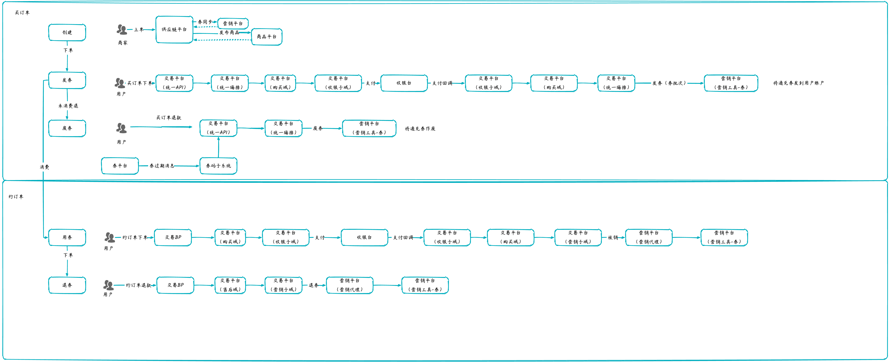

## 4. 先买后约

#### 4.1 项目背景

抖音通过流量撬动商家拿到低价供给，在部分用户中形成了低价心智，美团的低价心智丢失，在流量爆发性不及友商的情况下，美团会通过打造（低价营销场）重塑低价心智，团购是低价营销场的核心供给形式。

部分景区票务系统不支持团购票上单（有效期模式票），需要通过一套系统能力帮助景区包装团购供给（先买后约形式）；

3.通过先买后约形式帮助温泉、滑雪、水乐园品类商家做预售，达到提前锁客的目的，同时满足商家对库存的把控诉求；

**4.北京环球计划在2023年5月份通过先买后约形式售卖多人票，预计可创造千万级营收，同时要求，买产品的游客信息和约产品的游客信息须保持一致；**

**5.门票计划打造527营销节，在供给维度的核心方向是利用52.7元通兑券围绕水乐园、赏花尾声和四大集团供给做功，助力实现10亿GMV；**

**用户侧：**

1.用户可享受营销场中的低价供给和参与活动玩法，享受优惠；

2.在预售场景下，用户既可以提前锁定优惠，同时，购票时不需要确认具体游玩时间，降低用户决策成本；

#### 4.2 核心功能

- 发券幂等（协同幂等）
- 发券锁券，等用户支付成功之后再解锁券
- 推过期消息
- 券数量过多超时优化（券批次维度校验）

#### 4.3 详细设计

