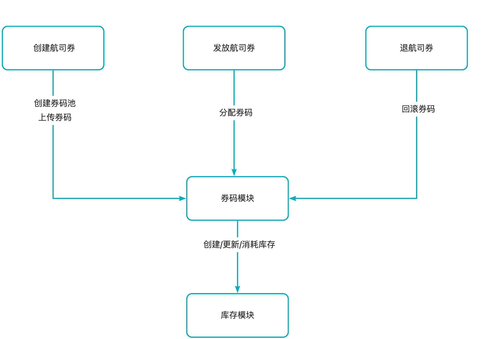

# 1.机票迁移

#### 1.1 项目背景

机票营销系统与到店营销平台的职能基本吻合，所以可以通过接入到店营销平台，复用成熟能力，更好的支撑业务的发展。由于代码历史比较久远，需要大量的时间进行功能梳理和追齐，此外功能追齐后如何保证迁移的完整性和正确性比较有挑战。

#### 1.2 核心功能

- 激励配置
  - 创建激励时配置航司券码（支持编辑）
  - 单独上传航司券码（text文件形式）
  - 导出激励未使用的航司券码
- 发券活动
  - 发券时分配航司券码
  - 废券时回滚/重新分配航司券码
- 立减活动
  - 生单前预分配航司券券码（锁定券码）
  - 核销时分配航司券券码（分配锁定的券码）
  - 回滚立减时解锁分配的航司券码

#### 1.3 详细设计

- 模块架构




数据库表

- 券码池

```java
CREATE TABLE `PCT_OutCouponCodePool` (
  `ID` bigint(20) NOT NULL AUTO_INCREMENT COMMENT '主键',
  `PoolId` varchar(128) NOT NULL COMMENT '券码池id',
  `Status` tinyint(4) NOT NULL DEFAULT '0' COMMENT '状态，0-在线、1-下线',
  `Type` tinyint(4) NOT NULL COMMENT '券码池类型，参见：PoolTypeEnum',
  `ReusedType` tinyint(4) NOT NULL COMMENT '券码复用类型，0-一次性、1-可复用',
  `AddTime` timestamp NOT NULL DEFAULT CURRENT_TIMESTAMP,
  `UpdateTime` timestamp NOT NULL DEFAULT CURRENT_TIMESTAMP ON UPDATE CURRENT_TIMESTAMP,
  `StockId` bigint(20) NOT NULL COMMENT '库存id',
  `StockNum` int(11) NOT NULL DEFAULT '0' COMMENT '库存数量',
  `MaxPerUser` tinyint(4) DEFAULT NULL COMMENT '每个用户分配券码上限',
  `ExpireTime` datetime DEFAULT NULL COMMENT '过期日期',
  PRIMARY KEY (`ID`),
  UNIQUE KEY `UK_PoolId` (`PoolId`),
  KEY `IX_UpdateTime` (`UpdateTime`)
) ENGINE=InnoDB AUTO_INCREMENT=1042 DEFAULT CHARSET=utf8 COMMENT='券码池表'
```

- 券码

```java
CREATE TABLE `PCT_OutCouponCode` (
  `ID` bigint(20) NOT NULL AUTO_INCREMENT COMMENT '主键',
  `CouponCode` varchar(128) NOT NULL COMMENT '券码',
  `PoolId` varchar(128) NOT NULL COMMENT '券码池id',
  `Status` tinyint(4) NOT NULL DEFAULT '0' COMMENT '状态，0-可用、1-锁定、2-已分配',
  `OutId` varchar(256) DEFAULT NULL COMMENT '外部id',
  `AddTime` timestamp NOT NULL DEFAULT CURRENT_TIMESTAMP COMMENT '创建时间',
  `UpdateTime` timestamp NOT NULL DEFAULT CURRENT_TIMESTAMP ON UPDATE CURRENT_TIMESTAMP COMMENT '更新时间',
  PRIMARY KEY (`ID`),
  UNIQUE KEY `UK_PoolId_CouponCode` (`PoolId`,`CouponCode`),
  KEY `IX_PoolId` (`PoolId`),
  KEY `IX_UpdateTime` (`UpdateTime`)
) ENGINE=InnoDB AUTO_INCREMENT=5641198 DEFAULT CHARSET=utf8 COMMENT='券码表'
```

- 分配记录

```java
CREATE TABLE `PCT_OutCouponCodeRecord` (
  `ID` bigint(20) NOT NULL AUTO_INCREMENT COMMENT '主键',
  `RecordId` varchar(128) NOT NULL COMMENT '记录id',
  `CouponCode` varchar(128) NOT NULL COMMENT '券码',
  `PoolId` varchar(128) NOT NULL COMMENT '券码池id',
  `UserId` bigint(20) NOT NULL COMMENT '用户ID',
  `UserType` tinyint(4) NOT NULL DEFAULT '0' COMMENT '用户类型，点评：0 美团：1',
  `Status` tinyint(4) NOT NULL DEFAULT '0' COMMENT '状态，0-已分配、1-已锁定、2-已回滚、3-已解锁"',
  `OutId` varchar(256) DEFAULT NULL COMMENT '外部id',
  `AddTime` timestamp NOT NULL DEFAULT CURRENT_TIMESTAMP COMMENT '创建时间',
  `UpdateTime` timestamp NOT NULL DEFAULT CURRENT_TIMESTAMP ON UPDATE CURRENT_TIMESTAMP COMMENT '更新时间',
  PRIMARY KEY (`ID`),
  UNIQUE KEY `UK_RecordId` (`RecordId`),
  KEY `UK_PoolId_CouponCode` (`PoolId`,`CouponCode`),
  KEY `IX_UserId_UserType_PoolId` (`UserId`,`UserType`,`PoolId`),
  KEY `IX_UpdateTime` (`UpdateTime`)
) ENGINE=InnoDB AUTO_INCREMENT=546198 DEFAULT CHARSET=utf8 COMMENT='券码记录表'
```

- 券码池的状态：无状态

- 券码池的类型

```java
public enum PoolTypeEnum {
    AIR_CA(0, "国航航司券", 0, 1),
    AIR_SZ(1, "深航航司券", 1, 1),
    AIR_CZ(2, "南航航司券", 1, 0),
    private final int type;
    private final String desc;
    private final int batchType;
    private final int reuseType;
}
public enum ReuseTypeEnum {
    COUPON_CANNOT_REUSED(0, "不能重复使用"),
    COUPON_CAN_REUSED(1, "能重复使用");  
}
public enum BatchType {
    UNIQUE_BATCH_NO(0, "唯一批次号"),
    BATCH_COUPON(1, "一批次一批码");

    private final int type;
    private final String desc;
}
```

- 券码的状态

```java
public enum CodeStatusEnum {
    USABLE(0, "可用"),
    LOCKED(1, "锁定"),
    USED(2, "已用");
}
```

- 分配记录的状态

```java
public enum RecordStatusEnum {
    ISSUED(0, "已分配"),
    LOCKED(1, "已锁定"),
    ROLLBACK(2, "已回滚"),
    UNLOCKED(3, "已解锁"),
    ;

    private final int code;
    private final String desc;
}
```

- 流程

com.sankuai.mpmkt.coupon.out.OutCouponCodeIssueService#dispense

场景：航司券分配券码使用

正常流程：

唯一批次号：扣减库存 -> 查询可用状态的券码（上游可指定券码）【PCT_OutCouponCode】 -> 构建并插入分配记录（券码为批次号，状态为已分配）【PCT_OutCouponCodeRecord】

能重复使用：扣减库存 -> 查询可用状态的券码（上游可指定券码）【PCT_OutCouponCode】 - > 构建并插入分配记录（记录状态为已分配）【PCT_OutCouponCodeRecord】

不能重复使用：扣减库存 - > 加锁**「** 查询可用状态的券码 【PCT_OutCouponCode】 -> 券码状态更新为已用【PCT_OutCouponCode】 -> 构建并插入分配记录（状态为已分配）【PCT_OutCouponCodeRecord】**」**

异常处理：

扣减库存失败：整体按照失败处理，如果扣减库存超时，实际已扣减成功，会造券码少用（可接受）。

写DB失败：整体按照失败处理，不回滚库存，实际库存服务扣减成功，会造成券码少用（可接受）。

**com.sankuai.mpmkt.coupon.out.OutCouponCodeIssueService#lock**

场景：航司立减分配券码使用

正常流程：

唯一批次号：扣减库存 -> 查询可用状态的券码（上游可指定券码）【PCT_OutCouponCode】 - > 构建并插入分配记录（券码为批次号，状态为已锁定）【PCT_OutCouponCodeRecord】

能重复使用：扣减库存 -> 查询可用状态的券码（上游可指定券码）【PCT_OutCouponCode】 - > 构建并插入分配记录（状态为已锁定）

不能重复使用：扣减库存 - > 加锁**「** 查询可用状态的券码【PCT_OutCouponCode】 -> 券码状态更新为锁定 【PCT_OutCouponCode】 -> 构建并插入分配记录（状态为已锁定）【PCT_OutCouponCodeRecord】**」**

异常处理：

- 上游锁定券码失败会进行重试，需要支持幂等

**com.sankuai.mpmkt.coupon.out.OutCouponCodeIssueService#confirm**

场景：航司立减使用确认券码

正常流程：

可复用券码：更新券码记录状态（已锁定 - > 已分配）【PCT_OutCouponCodeRecord】

不能重复使用： 更新券码记录状态（已锁定 - > 已分配）【PCT_OutCouponCodeRecord】 -> 构建并插入分配记录（锁定 -> 已用）【PCT_OutCouponCode】

**com.sankuai.mpmkt.coupon.out.OutCouponCodeIssueService#unlock**

场景：解锁券码

正常流程：

可复用券码：更新券码记录状态（已锁定 - > 已解锁）【PCT_OutCouponCodeRecord】-> 回滚库存

不能重复使用： 更新券码记录状态（已锁定 - > 已解锁）【PCT_OutCouponCodeRecord】 -> 构建并插入分配记录（锁定 -> 可用）【PCT_OutCouponCode】-> 回滚库存

比对流程

- 监听消息队列中老链路的请求和返回，替换部分请求数据进行回放
- 回放的请求会有标识（主从/双写）
- 主从流量要做到写流量幂等

#### 1.4 项目中遇到的问题&解决方案

- 双写比对过程中出现查询diff的情况，发现是由于发券消息延迟导致线上库已经发券，但是比对库却没有发券，导致查询时未查到这张券
- 主从比对过程中出现核销券diff的情况，由于针对写进行了幂等操作，在从流量核销的时候只会进行查询操作并判断券的状态是否是核销的，以及核销的一些附属信息是否一致。排查发现是主从延迟导致的diff，由于线程池是浅拷贝的，查询的时候会查两个表，一个是主表，一个是附属信息表，在查主表的线程池在查完后会清除走主的标识，导致影响到了附属信息表的查询，没有走主。
- 公司用的trace：当业务跨线程执行时，也需要传递trace信息到其他线程，才能将整个调用链串联起来。基本思路就是在父线程读出trace信息，将其作为参数传递给子线程，子线程在执行之前加载trace信息，执行完毕后清理trace信息并恢复


```java
package com.dianping.unified.coupon.dal.thread.factory.wrapper;

import com.meituan.mtrace.Span;

import com.meituan.mtrace.SpanFactory;

import com.meituan.mtrace.TraceContext;

import com.meituan.mtrace.Tracer;

import com.meituan.mtrace.context.TransmissibleContext;

import com.meituan.mtrace.thread.TraceContextHandler;

import java.util.ArrayList;

import java.util.Collection;

import java.util.Collections;

import java.util.List;

import java.util.concurrent.Callable;


public class CustomTraceCallable<V> implements Callable<V> {

    private static final String INFRA_NAME = "ASYNC";

    private final TransmissibleContext traceContext;

    private final Callable<V> callable;

    private final Span span;

    public CustomTraceCallable(Callable<V> callable) {

        this.traceContext = TraceContextHandler.getTransContext();

        this.callable = callable;

        Span parentServerSpan = Tracer.getServerSpan();

        span = SpanFactory.genClientSpan(parentServerSpan, null != parentServerSpan ? parentServerSpan.getSpanName() : Thread.currentThread().getName());

        if (null != parentServerSpan) {

            span.setRemote(parentServerSpan.getRemoteAppKey(), parentServerSpan.getRemoteIp(), parentServerSpan.getRemotePort());

            span.setInfraName(parentServerSpan.getInfraName());

        } else {

            span.setInfraName(INFRA_NAME);

        }

    }

    /**

     * wrap method {@link Callable#call()}.

     */

    @Override

    public V call() throws Exception {

        TransmissibleContext backup = null;

        try {

            backup = TraceContextHandler.backupAndSetTransContext(traceContext);

            span.setStart(System.currentTimeMillis());

            TraceContext.setCurrentServerSpan(span);

            V call = callable.call();

            return call;

        } finally {

            Tracer.serverSend();

            TraceContextHandler.restoreBackupTransContext(backup);

        }

    }

    /**

     * @return 获取原生的callable对象

     */

    public Callable<V> getCallable() {

        return callable;

    }

    /**

     * @param callable 需要被封装的callable 对象

     * @return 返回封装后的TraceCallable 对象

     */

    public static <T> CustomTraceCallable<T> get(Callable<T> callable) {

        if (callable == null) {

            return null;

        }

        if (callable instanceof CustomTraceCallable) {

            return (CustomTraceCallable<T>) callable;

        }

        return new CustomTraceCallable<T>(callable);

    }

    /**

     * @param tasks 需要被封装的callable 对象集合

     * @return 返回封装后的TraceCallable 对象List

     */

    public static <T> List<CustomTraceCallable<T>> gets(Collection<? extends Callable<T>> tasks) {

        if (null == tasks) {

            return Collections.emptyList();

        }

        List<CustomTraceCallable<T>> copy = new ArrayList<CustomTraceCallable<T>>();

        for (Callable<T> task : tasks) {

            copy.add(CustomTraceCallable.get(task));

        }

        return copy;

    }

}
```

```java
/

// Source code recreated from a .class file by IntelliJ IDEA

// (powered by FernFlower decompiler)

//

package com.meituan.mtrace.thread;

import com.meituan.mtrace.context.TransmissibleContext;

import java.util.ArrayList;

import java.util.Collection;

import java.util.Collections;

import java.util.Iterator;

import java.util.List;

import java.util.concurrent.Callable;

public class TraceCallable<V> implements Callable<V> {

    private final TransmissibleContext traceContext = TraceContextHandler.getTransContext();

    private final Callable<V> callable;

    public TraceCallable(Callable<V> callable) {

        this.callable = callable;

    }

    public V call() throws Exception {

        TransmissibleContext backup = TraceContextHandler.backupAndSetTransContext(this.traceContext);

        Object var2;

        try {

            var2 = this.callable.call();

        } finally {

            TraceContextHandler.restoreBackupTransContext(backup);

        }

        return var2;

    }

    public Callable<V> getCallable() {

        return this.callable;

    }

    public static <T> TraceCallable<T> get(Callable<T> callable) {

        if (callable == null) {

            return null;

        } else {

            return callable instanceof TraceCallable ? (TraceCallable)callable : new TraceCallable(callable);

        }

    }

    public static <T> List<TraceCallable<T>> gets(Collection<? extends Callable<T>> tasks) {

        if (null == tasks) {

            return Collections.emptyList();

        } else {

            List<TraceCallable<T>> copy = new ArrayList();

            Iterator i$ = tasks.iterator();

            while(i$.hasNext()) {

                Callable<T> task = (Callable)i$.next();

                copy.add(get(task));

            }

            return copy;

        }

    }

}
```

```java
package com.dianping.unified.coupon.dal.thread.factory.wrapper;

import com.meituan.mtrace.thread.pool.ExecutorTraceGenericWrapper;

import java.util.Collection;

import java.util.List;

import java.util.concurrent.*;

public class CustomExecutorServiceTraceGenericWrapper<T extends ExecutorService> extends ExecutorTraceGenericWrapper<T> implements ExecutorService {

    final T executorService;

    @Override

    public T get() {

        return executorService;

    }

    protected CustomExecutorServiceTraceGenericWrapper(T executorService) {

        super(executorService);

        this.executorService = executorService;

    }

    @Override

    public <E> Future<E> submit(Callable<E> task) {

        return executorService.submit(CustomTraceCallable.get(task));

    }

    @Override

    public <E> Future<E> submit(Runnable task, E result) {

        return executorService.submit(CustomTraceRunnable.get(task), result);

    }

    @Override

    public Future<?> submit(Runnable task) {

        return executorService.submit(CustomTraceRunnable.get(task));

    }

    @Override

    public <E> List<Future<E>> invokeAll(Collection<? extends Callable<E>> tasks) throws InterruptedException {

        return executorService.invokeAll(CustomTraceCallable.gets(tasks));

    }

    @Override

    public <E> List<Future<E>> invokeAll(Collection<? extends Callable<E>> tasks, long timeout, TimeUnit unit) throws InterruptedException {

        return executorService.invokeAll(CustomTraceCallable.gets(tasks), timeout, unit);

    }

    @Override

    public <E> E invokeAny(Collection<? extends Callable<E>> tasks) throws InterruptedException, ExecutionException {

        return executorService.invokeAny(CustomTraceCallable.gets(tasks));

    }

    @Override

    public <E> E invokeAny(Collection<? extends Callable<E>> tasks, long timeout, TimeUnit unit) throws InterruptedException, ExecutionException, TimeoutException {

        return executorService.invokeAny(CustomTraceCallable.gets(tasks), timeout, unit);

    }

    @Override

    public void shutdown() {

        executorService.shutdown();

    }

    @Override

    public List<Runnable> shutdownNow() {

        return executorService.shutdownNow();

    }

    @Override

    public boolean isShutdown() {

        return executorService.isShutdown();

    }

    @Override

    public boolean isTerminated() {

        return executorService.isTerminated();

    }

    @Override

    public boolean awaitTermination(long timeout, TimeUnit unit) throws InterruptedException {

        return executorService.awaitTermination(timeout, unit);

    }

}
```

#### 1.5 项目可优化的点&经验教训

- 性能问题：分布式锁使用券码池ID维度进行加锁，如果流量过高会有性能问题

参考文档

https://tech.meituan.com/2023/04/20/traceid-google-dapper-mtrace.html


#### 4.4 项目中遇到的问题&解决方案

#### 4.5 项目的亮点


### 5. 线上问题排查

#### 5.1 问题一

##### 5.1.1 现象

用户购买超团之后，点击去兑换，召回的商品列表为空

##### 5.1.2 排查

排查发现是因为该查询接口是先查用户所有的券，然后返回给上游，上游会从结果中找到指定的券批次的信息，并召回商品，但是由于用户券数量超过了100张，导致被截断。

##### 5.1.3 解决

复用原有的缓存，上游传入券批次ID，当查询不到时，会再查一次DB然后再塞到用户券缓存中。

#### 5.1 问题二

##### 5.1.2 现象

某个服务每过10分钟就触发扩容，扩容机器不够导致报警

##### 5.1.3 排查

- 发生扩容时机器指标：cpu.idle 为7%，younggc.time为2500ms,gc.count为55，未触发full gc, jvm thread count 1.51K   通过火焰图排查发现是日志打印造成的。
- 去公司的日志中心查看，发现是某个用户ID每10分钟就会触发查券请求，就导致每10分钟就会打印日志。

- 浏览侧QPS较大，10W+ 的QPS，所以线上浏览测是不打印日志的，排查问题需要日志时会添加用户ID的白名单，其他团队有个定时任务，会定时调浏览侧的接口查询，而之前由于排查问题加上了打印日志的白名单

##### 5.1.4 解决

- 快速：去掉日志白名单，告警恢复
- 长期：优化打印日志的方式，当前是每每个请求，每个商品*券维度都会打印一次，而浏览侧一次请求的商品数量为20个，每个用户的券数量在一百个以内，所以导致日志非常多。

**压测过程中遇到的问题**


