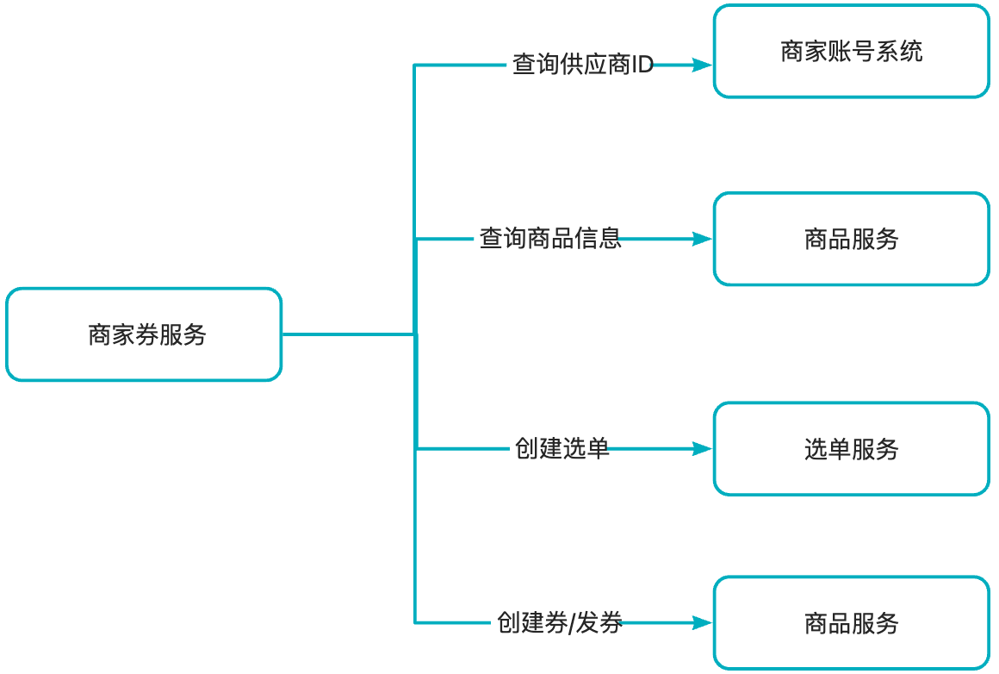
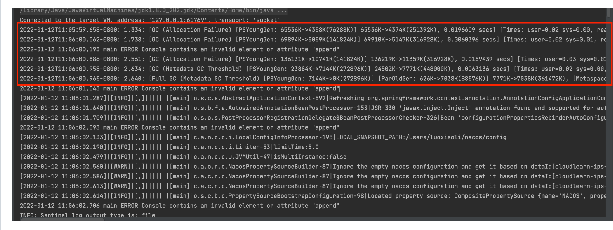

[TOC]


你好，上海交大毕业后我就一直在美团做java后端开发的工作，目前有2年的工作经验。在美团我主要是负责酒旅优惠券业务的研发，也会参与一些大促前的系统保障工作。目前已经可以独立完成一些中型需求的开发与设计。在开发中，常用的数据库是mysql和redis，此外，一些需求还会用到消息队列做一些异步处理的工作。由于我们的业务会有一些高并发地场景，所以我对限流，熔断降级，分布式锁等组件也比较熟悉。非常高兴能来paypal面试，也很期待能够加入paypal。

Hello, after graduating from shanghai  Jiaotong University, I have been working at Meituan as a Java backend developer, and currently, I have 2 years of experience in this field. At Meituan, I was mainly responsible for the development of the travel coupon business and also participated in system assurance work before major promotions. I can now independently complete the development and design of some medium-sized requirements. In development, I commonly use databases such as MySQL and Redis, and additionally, some requirements also involve the use of message queues for **asynchronous** processing. Due to the high **concurrency** **scenarios** in our business, I am also familiar with components like rate limiting**, circuit breaking**, and **distributed** locks.  I am very excited to be interviewing at PayPal and am looking forward to the opportunity to join the PayPal team.


首先，我先介绍一下这个项目的背景，过去营销的每个业务（比如酒店，机票）都会有自己的券系统，但是很多逻辑是可以复用，所以可以把不同业务的逻辑都放到一个系统中来进行维护。 我这个项目做的就是要将机票券系统迁移到我们新的平台券系统中。

Firstly, let me introduce the background of this project. In the past, each business within Meituan, such as hotels and flight ticketing, had its own coupon system. However, a lot of the logic was reusable, which meant that it was feasible to integrate the logic from different businesses into one system for **maintenance**. The goal of this project was to migrate the flight ticket coupon system to our new platform's coupon system.

这个项目主要有三个挑战。第一个挑战是在时间比较紧急的情况下，如何快速熟悉业务逻辑。第二个挑战是，新老系统不一致的逻辑如何进行兼容。第三个就是如何保证兼容后逻辑的正确性。

This project faced three main challenges. The first challenge was to quickly become **familiar** with the business logic under a tight schedule. The second challenge was how to ensure **compatibility** between the **inconsistent** logic of the old and new systems. The third challenge was to **guarantee** the **correctness** of the logic after ensuring **compatibility**.

对于第一个挑战，我这边的做法就是阅读机票系统的源码以及历史的文档进行逻辑梳理，并与机票业务的研发和产品进行沟通，确认在理解上没有gap。

For the first challenge, my approach was to read the source code of the flight ticket system and historical documents to comb through the logic, and communicate with the development and product teams of the flight ticket business to confirm there were no gaps in understanding.

对于第二个挑战，由于这次迁移不仅涉及到优惠券逻辑的迁移，而且还涉及到立减系统的迁移。在老系统中，优惠券和立减的数据是存在一张表中的。而迁移后两种类型的优惠是在不同的系统中的。所以需要对原来的系统进行拆分和重构，我的做法是将通用的一个模块抽出来作为一个底层的模块。然后立减和券作为上层分别调用底层的模型。

For the second challenge, since the migration involved not only the coupon logic but also the instant discount system, the data for coupons and instant discounts were stored in the same table in the old system. After the migration, the two types of discounts were in different systems. Therefore, it was necessary to decompose and restructure the original system. My approach was to extract a common module as a foundational module, and then have the instant discount and coupon as upper layers, each calling the foundational model.

对于第三个挑战，除了自测和QA的测试外，我还搭建一套比对工具。为了避免影响线上用户，比对期间的比对数据都是操作离线库。

For the third challenge, beyond self-testing and QA (Quality Assurance) testing, I also established a set of comparison tools. To prevent any disruption to online users, the data used for comparison during this period was handled in an offline repository.

在比对的时候也遇到一些问题，发券比对需要监听mafka消息，由于消息积压，线上流量已经发券了，但是比对流量还没有发券，这时候查询的时候会出现查到的券不一致的情况， 我这边的做法就是对于消费者通过多线程的方式来进行消费，提高消费能力。还有就是在一些发券流量高峰期，通过扩容的方式来提高消费能力。

During the comparison, some issues were encountered. For instance, when comparing the issuance of coupons, it was necessary to listen to the Mafka messages. Due to message backlog, the online traffic had already issued coupons, but the comparison traffic had not yet issued coupons, which led to inconsistent coupons when queried. My approach was to use multi-threading for consumers to enhance their consumption capability. Additionally, during peak times of coupon issuance traffic, I expanded the capacity to improve consumption capability.


这个项目的核心诉求就是在用户浏览一些商品信息的时候，不仅要返回用户已有可用的优惠券，还要返回用户可领同时可用的优惠券。

The core demand of this project is to provide users with not only the available coupons they already possess but also the coupons they can claim and use while browsing product information.

项目主要分为两期。

The project is mainly divided into two phases.

一期主要就是实现基本的功能，运营配置可领券数量比较少。对于第一期来说，挑战就是浏览侧QPS较高，对耗时要求也较高，而这次需求需要新增一个RPC调用，对耗时影响比较大。对于这个挑战，我优化新增的发券预校验模块，使用 Future 并行加载券批次剩余库存和每个用户的发券数量，频次等数据信息，减少了 RPC 调用共 70 ms；为了减少对下游库存服务的压力，在查询库存时添加了本地缓存，并通过定时任务自动续期。此外，为了提升用户的体验和系统稳定性，还使用了限流，熔断降级的手段。

Phase one primarily focuses on implementing basic functionality, with a limited number of coupons configured for claim by operations. The challenge for the first phase is the high QPS on the browsing side, which has stringent latency requirements. This requirement involves an additional RPC call, which significantly impacts latency. To address this challenge, I optimized the newly added coupon pre-verification module, using `Future` to load the remaining stock of each coupon batch and the number of coupons issued to each user in parallel, reducing the total RPC call time by 70 milliseconds. To alleviate the pressure on the downstream inventory service, I added local caching when querying inventory and set up a scheduled task for automatic renewal. Additionally, to enhance the user experience and system stability, I implemented rate limiting and circuit breaking measures.

项目二期需要支持更多可领券数量的配置。为此，我这边进行了单机压测和火焰图分析，发现影响性能的主要原因是， 在拿到可领券批次ID后，会查询券批次的信息，这个过程会进行深拷贝。券数据越多，性能就越差。与运营和产品沟通后，发现每个可领券的批次区分度比较大的是适用的商品，所以二期采用了通过商品ID查询可领券批次ID，这样可以在深拷贝之前过滤一大部分的数据。

For the second phase of the project, it is necessary to support configurations for a larger number of claimable coupons. To achieve this, I conducted a single-machine stress test and flame graph analysis, which revealed that the main performance bottleneck was the deep copy operation that occurred after obtaining the coupon batch ID for claim. The more coupon data there was, the worse the performance became. After communicating with the operations and product teams, it was found that the main distinguishing factor for each claimable coupon batch was the applicable products. Therefore, phase two adopted the approach of querying the coupon batch ID for claim through the product ID, which allows for filtering out a large amount of data before the deep copy operation.

第三个项目主要是一个管理端的需求，核心诉求是需要为商家搭建一套管理券，查询券和发券的系统。第一个是并发修改的问题，我是采用乐观锁的方式来解决的，第二个是为了满足商家端的一些条件查询，在最上层的服务冗余了一些底层的数据。所以需要保证冗余数据和底层数据的一致性，我的做法是在每次写操作后通过消息队列发送操作的券ID，然后进行实时的对账。

The third project is a requirement for the management side, with the core objective of building a system for merchants to manage, query, and distribute their coupons. The first issue was the problem of concurrent modifications, which I addressed by using an optimistic locking approach. The second issue was to meet certain conditional queries on the merchant side, for which redundant data from the lower layers was stored at the top-level service. To ensure the consistency between the redundant data and the underlying data, my method was to send the coupon ID through a message queue after each write operation for real-time reconciliation.


券批次创建/修改：先更新DB，再更新缓存，缓存有过期时间

券批次查询：先查询缓存，缓存过期了再查DB，然后塞到缓存中。

针对交易场景：查询DB


用户券发券：先插入DB，然后更新缓存，缓存有过期时间

用户券查询：先查询缓存，缓存过期了再查DB，然后再塞到缓存中

针对交易场景：查询DB


发券QPS   高峰期：5KQPS        每天发券量：3亿左右

分库分表：

# 1.机票迁移

#### 项目背景

机票营销系统与到店营销平台的职能基本吻合，所以可以通过接入到店营销平台，复用成熟能力，更好的支撑业务的发展。由于代码历史比较久远，需要大量的时间进行功能梳理和追齐，此外功能追齐后如何保证迁移的完整性和正确性比较有挑战。

#### 核心功能

- 激励配置
  - 创建激励时配置航司券码（支持编辑）
  - 单独上传航司券码（text文件形式）
  - 导出激励未使用的航司券码
- 发券活动
  - 发券时分配航司券码
  - 废券时回滚/重新分配航司券码
- 立减活动
  - 生单前预分配航司券券码（锁定券码）
  - 核销时分配航司券券码（分配锁定的券码）
  - 回滚立减时解锁分配的航司券码

#### 详细设计

- 模块架构


数据库表

- 券码池

```java
CREATE TABLE `PCT_OutCouponCodePool` (
  `ID` bigint(20) NOT NULL AUTO_INCREMENT COMMENT '主键',
  `PoolId` varchar(128) NOT NULL COMMENT '券码池id',
  `Status` tinyint(4) NOT NULL DEFAULT '0' COMMENT '状态，0-在线、1-下线',
  `Type` tinyint(4) NOT NULL COMMENT '券码池类型，参见：PoolTypeEnum',
  `ReusedType` tinyint(4) NOT NULL COMMENT '券码复用类型，0-一次性、1-可复用',
  `AddTime` timestamp NOT NULL DEFAULT CURRENT_TIMESTAMP,
  `UpdateTime` timestamp NOT NULL DEFAULT CURRENT_TIMESTAMP ON UPDATE CURRENT_TIMESTAMP,
  `StockId` bigint(20) NOT NULL COMMENT '库存id',
  `StockNum` int(11) NOT NULL DEFAULT '0' COMMENT '库存数量',
  `MaxPerUser` tinyint(4) DEFAULT NULL COMMENT '每个用户分配券码上限',
  `ExpireTime` datetime DEFAULT NULL COMMENT '过期日期',
  PRIMARY KEY (`ID`),
  UNIQUE KEY `UK_PoolId` (`PoolId`),
  KEY `IX_UpdateTime` (`UpdateTime`)
) ENGINE=InnoDB AUTO_INCREMENT=1042 DEFAULT CHARSET=utf8 COMMENT='券码池表'
```

- 券码

```java
CREATE TABLE `PCT_OutCouponCode` (
  `ID` bigint(20) NOT NULL AUTO_INCREMENT COMMENT '主键',
  `CouponCode` varchar(128) NOT NULL COMMENT '券码',
  `PoolId` varchar(128) NOT NULL COMMENT '券码池id',
  `Status` tinyint(4) NOT NULL DEFAULT '0' COMMENT '状态，0-可用、1-锁定、2-已分配',
  `OutId` varchar(256) DEFAULT NULL COMMENT '外部id',
  `AddTime` timestamp NOT NULL DEFAULT CURRENT_TIMESTAMP COMMENT '创建时间',
  `UpdateTime` timestamp NOT NULL DEFAULT CURRENT_TIMESTAMP ON UPDATE CURRENT_TIMESTAMP COMMENT '更新时间',
  PRIMARY KEY (`ID`),
  UNIQUE KEY `UK_PoolId_CouponCode` (`PoolId`,`CouponCode`),
  KEY `IX_PoolId` (`PoolId`),
  KEY `IX_UpdateTime` (`UpdateTime`)
) ENGINE=InnoDB AUTO_INCREMENT=5641198 DEFAULT CHARSET=utf8 COMMENT='券码表'
```

- 分配记录

```java
CREATE TABLE `PCT_OutCouponCodeRecord` (
  `ID` bigint(20) NOT NULL AUTO_INCREMENT COMMENT '主键',
  `RecordId` varchar(128) NOT NULL COMMENT '记录id',
  `CouponCode` varchar(128) NOT NULL COMMENT '券码',
  `PoolId` varchar(128) NOT NULL COMMENT '券码池id',
  `UserId` bigint(20) NOT NULL COMMENT '用户ID',
  `UserType` tinyint(4) NOT NULL DEFAULT '0' COMMENT '用户类型，点评：0 美团：1',
  `Status` tinyint(4) NOT NULL DEFAULT '0' COMMENT '状态，0-已分配、1-已锁定、2-已回滚、3-已解锁"',
  `OutId` varchar(256) DEFAULT NULL COMMENT '外部id',
  `AddTime` timestamp NOT NULL DEFAULT CURRENT_TIMESTAMP COMMENT '创建时间',
  `UpdateTime` timestamp NOT NULL DEFAULT CURRENT_TIMESTAMP ON UPDATE CURRENT_TIMESTAMP COMMENT '更新时间',
  PRIMARY KEY (`ID`),
  UNIQUE KEY `UK_RecordId` (`RecordId`),
  KEY `UK_PoolId_CouponCode` (`PoolId`,`CouponCode`),
  KEY `IX_UserId_UserType_PoolId` (`UserId`,`UserType`,`PoolId`),
  KEY `IX_UpdateTime` (`UpdateTime`)
) ENGINE=InnoDB AUTO_INCREMENT=546198 DEFAULT CHARSET=utf8 COMMENT='券码记录表'
```

- 券码池的状态：无状态

- 券码池的类型

```java
public enum PoolTypeEnum {
    AIR_CA(0, "国航航司券", 0, 1),
    AIR_SZ(1, "深航航司券", 1, 1),
    AIR_CZ(2, "南航航司券", 1, 0),
    private final int type;
    private final String desc;
    private final int batchType;
    private final int reuseType;
}
public enum ReuseTypeEnum {
    COUPON_CANNOT_REUSED(0, "不能重复使用"),
    COUPON_CAN_REUSED(1, "能重复使用");  
}
public enum BatchType {
    UNIQUE_BATCH_NO(0, "唯一批次号"),
    BATCH_COUPON(1, "一批次一批码");

    private final int type;
    private final String desc;
}
```

- 券码的状态

```java
public enum CodeStatusEnum {
    USABLE(0, "可用"),
    LOCKED(1, "锁定"),
    USED(2, "已用");
}
```

- 分配记录的状态

```java
public enum RecordStatusEnum {
    ISSUED(0, "已分配"),
    LOCKED(1, "已锁定"),
    ROLLBACK(2, "已回滚"),
    UNLOCKED(3, "已解锁"),
    ;

    private final int code;
    private final String desc;
}
```

- 流程

com.sankuai.mpmkt.coupon.out.OutCouponCodeIssueService#dispense

场景：航司券分配券码使用

正常流程：

唯一批次号：扣减库存 -> 查询可用状态的券码（上游可指定券码）【PCT_OutCouponCode】 -> 构建并插入分配记录（券码为批次号，状态为已分配）【PCT_OutCouponCodeRecord】

能重复使用：扣减库存 -> 查询可用状态的券码（上游可指定券码）【PCT_OutCouponCode】 - > 构建并插入分配记录（记录状态为已分配）【PCT_OutCouponCodeRecord】

不能重复使用：扣减库存 - > 加锁**「** 查询可用状态的券码 【PCT_OutCouponCode】 -> 券码状态更新为已用【PCT_OutCouponCode】 -> 构建并插入分配记录（状态为已分配）【PCT_OutCouponCodeRecord】**」**

异常处理：

扣减库存失败：整体按照失败处理，如果扣减库存超时，实际已扣减成功，会造券码少用（可接受）。

写DB失败：整体按照失败处理，不回滚库存，实际库存服务扣减成功，会造成券码少用（可接受）。

**com.sankuai.mpmkt.coupon.out.OutCouponCodeIssueService#lock**

场景：航司立减分配券码使用

正常流程：

唯一批次号：扣减库存 -> 查询可用状态的券码（上游可指定券码）【PCT_OutCouponCode】 - > 构建并插入分配记录（券码为批次号，状态为已锁定）【PCT_OutCouponCodeRecord】

能重复使用：扣减库存 -> 查询可用状态的券码（上游可指定券码）【PCT_OutCouponCode】 - > 构建并插入分配记录（状态为已锁定）

不能重复使用：扣减库存 - > 加锁**「** 查询可用状态的券码【PCT_OutCouponCode】 -> 券码状态更新为锁定 【PCT_OutCouponCode】 -> 构建并插入分配记录（状态为已锁定）【PCT_OutCouponCodeRecord】**」**

异常处理：

- 上游锁定券码失败会进行重试，需要支持幂等

**com.sankuai.mpmkt.coupon.out.OutCouponCodeIssueService#confirm**

场景：航司立减使用确认券码

正常流程：

可复用券码：更新券码记录状态（已锁定 - > 已分配）【PCT_OutCouponCodeRecord】

不能重复使用： 更新券码记录状态（已锁定 - > 已分配）【PCT_OutCouponCodeRecord】 -> 构建并插入分配记录（锁定 -> 已用）【PCT_OutCouponCode】

**com.sankuai.mpmkt.coupon.out.OutCouponCodeIssueService#unlock**

场景：解锁券码

正常流程：

可复用券码：更新券码记录状态（已锁定 - > 已解锁）【PCT_OutCouponCodeRecord】-> 回滚库存

不能重复使用： 更新券码记录状态（已锁定 - > 已解锁）【PCT_OutCouponCodeRecord】 -> 构建并插入分配记录（锁定 -> 可用）【PCT_OutCouponCode】-> 回滚库存

比对流程

- 监听消息队列中老链路的请求和返回，替换部分请求数据进行回放
- 回放的请求会有标识（主从/双写）
- 主从流量要做到写流量幂等

#### 项目中遇到的问题&解决方案

- 双写比对过程中出现查询diff的情况，发现是由于发券消息延迟导致线上库已经发券，但是比对库却没有发券，导致查询时未查到这张券
- 主从比对过程中出现核销券diff的情况，由于针对写进行了幂等操作，在从流量核销的时候只会进行查询操作并判断券的状态是否是核销的，以及核销的一些附属信息是否一致。排查发现是主从延迟导致的diff，由于线程池是浅拷贝的，查询的时候会查两个表，一个是主表，一个是附属信息表，在查主表的线程池在查完后会清除走主的标识，导致影响到了附属信息表的查询，没有走主。
- 公司用的trace：当业务跨线程执行时，也需要传递trace信息到其他线程，才能将整个调用链串联起来。基本思路就是在父线程读出trace信息，将其作为参数传递给子线程，子线程在执行之前加载trace信息，执行完毕后清理trace信息并恢复


```java
package com.dianping.unified.coupon.dal.thread.factory.wrapper;

import com.meituan.mtrace.Span;

import com.meituan.mtrace.SpanFactory;

import com.meituan.mtrace.TraceContext;

import com.meituan.mtrace.Tracer;

import com.meituan.mtrace.context.TransmissibleContext;

import com.meituan.mtrace.thread.TraceContextHandler;

import java.util.ArrayList;

import java.util.Collection;

import java.util.Collections;

import java.util.List;

import java.util.concurrent.Callable;


public class CustomTraceCallable<V> implements Callable<V> {

    private static final String INFRA_NAME = "ASYNC";

    private final TransmissibleContext traceContext;

    private final Callable<V> callable;

    private final Span span;

    public CustomTraceCallable(Callable<V> callable) {

        this.traceContext = TraceContextHandler.getTransContext();

        this.callable = callable;

        Span parentServerSpan = Tracer.getServerSpan();

        span = SpanFactory.genClientSpan(parentServerSpan, null != parentServerSpan ? parentServerSpan.getSpanName() : Thread.currentThread().getName());

        if (null != parentServerSpan) {

            span.setRemote(parentServerSpan.getRemoteAppKey(), parentServerSpan.getRemoteIp(), parentServerSpan.getRemotePort());

            span.setInfraName(parentServerSpan.getInfraName());

        } else {

            span.setInfraName(INFRA_NAME);

        }

    }

    /**

     * wrap method {@link Callable#call()}.

     */

    @Override

    public V call() throws Exception {

        TransmissibleContext backup = null;

        try {

            backup = TraceContextHandler.backupAndSetTransContext(traceContext);

            span.setStart(System.currentTimeMillis());

            TraceContext.setCurrentServerSpan(span);

            V call = callable.call();

            return call;

        } finally {

            Tracer.serverSend();

            TraceContextHandler.restoreBackupTransContext(backup);

        }

    }

    /**

     * @return 获取原生的callable对象

     */

    public Callable<V> getCallable() {

        return callable;

    }

    /**

     * @param callable 需要被封装的callable 对象

     * @return 返回封装后的TraceCallable 对象

     */

    public static <T> CustomTraceCallable<T> get(Callable<T> callable) {

        if (callable == null) {

            return null;

        }

        if (callable instanceof CustomTraceCallable) {

            return (CustomTraceCallable<T>) callable;

        }

        return new CustomTraceCallable<T>(callable);

    }

    /**

     * @param tasks 需要被封装的callable 对象集合

     * @return 返回封装后的TraceCallable 对象List

     */

    public static <T> List<CustomTraceCallable<T>> gets(Collection<? extends Callable<T>> tasks) {

        if (null == tasks) {

            return Collections.emptyList();

        }

        List<CustomTraceCallable<T>> copy = new ArrayList<CustomTraceCallable<T>>();

        for (Callable<T> task : tasks) {

            copy.add(CustomTraceCallable.get(task));

        }

        return copy;

    }

}
```

```java
/

// Source code recreated from a .class file by IntelliJ IDEA

// (powered by FernFlower decompiler)

//

package com.meituan.mtrace.thread;

import com.meituan.mtrace.context.TransmissibleContext;

import java.util.ArrayList;

import java.util.Collection;

import java.util.Collections;

import java.util.Iterator;

import java.util.List;

import java.util.concurrent.Callable;

public class TraceCallable<V> implements Callable<V> {

    private final TransmissibleContext traceContext = TraceContextHandler.getTransContext();

    private final Callable<V> callable;

    public TraceCallable(Callable<V> callable) {

        this.callable = callable;

    }

    public V call() throws Exception {

        TransmissibleContext backup = TraceContextHandler.backupAndSetTransContext(this.traceContext);

        Object var2;

        try {

            var2 = this.callable.call();

        } finally {

            TraceContextHandler.restoreBackupTransContext(backup);

        }

        return var2;

    }

    public Callable<V> getCallable() {

        return this.callable;

    }

    public static <T> TraceCallable<T> get(Callable<T> callable) {

        if (callable == null) {

            return null;

        } else {

            return callable instanceof TraceCallable ? (TraceCallable)callable : new TraceCallable(callable);

        }

    }

    public static <T> List<TraceCallable<T>> gets(Collection<? extends Callable<T>> tasks) {

        if (null == tasks) {

            return Collections.emptyList();

        } else {

            List<TraceCallable<T>> copy = new ArrayList();

            Iterator i$ = tasks.iterator();

            while(i$.hasNext()) {

                Callable<T> task = (Callable)i$.next();

                copy.add(get(task));

            }

            return copy;

        }

    }

}
```

```java
package com.dianping.unified.coupon.dal.thread.factory.wrapper;

import com.meituan.mtrace.thread.pool.ExecutorTraceGenericWrapper;

import java.util.Collection;

import java.util.List;

import java.util.concurrent.*;

public class CustomExecutorServiceTraceGenericWrapper<T extends ExecutorService> extends ExecutorTraceGenericWrapper<T> implements ExecutorService {

    final T executorService;

    @Override

    public T get() {

        return executorService;

    }

    protected CustomExecutorServiceTraceGenericWrapper(T executorService) {

        super(executorService);

        this.executorService = executorService;

    }

    @Override

    public <E> Future<E> submit(Callable<E> task) {

        return executorService.submit(CustomTraceCallable.get(task));

    }

    @Override

    public <E> Future<E> submit(Runnable task, E result) {

        return executorService.submit(CustomTraceRunnable.get(task), result);

    }

    @Override

    public Future<?> submit(Runnable task) {

        return executorService.submit(CustomTraceRunnable.get(task));

    }

    @Override

    public <E> List<Future<E>> invokeAll(Collection<? extends Callable<E>> tasks) throws InterruptedException {

        return executorService.invokeAll(CustomTraceCallable.gets(tasks));

    }

    @Override

    public <E> List<Future<E>> invokeAll(Collection<? extends Callable<E>> tasks, long timeout, TimeUnit unit) throws InterruptedException {

        return executorService.invokeAll(CustomTraceCallable.gets(tasks), timeout, unit);

    }

    @Override

    public <E> E invokeAny(Collection<? extends Callable<E>> tasks) throws InterruptedException, ExecutionException {

        return executorService.invokeAny(CustomTraceCallable.gets(tasks));

    }

    @Override

    public <E> E invokeAny(Collection<? extends Callable<E>> tasks, long timeout, TimeUnit unit) throws InterruptedException, ExecutionException, TimeoutException {

        return executorService.invokeAny(CustomTraceCallable.gets(tasks), timeout, unit);

    }

    @Override

    public void shutdown() {

        executorService.shutdown();

    }

    @Override

    public List<Runnable> shutdownNow() {

        return executorService.shutdownNow();

    }

    @Override

    public boolean isShutdown() {

        return executorService.isShutdown();

    }

    @Override

    public boolean isTerminated() {

        return executorService.isTerminated();

    }

    @Override

    public boolean awaitTermination(long timeout, TimeUnit unit) throws InterruptedException {

        return executorService.awaitTermination(timeout, unit);

    }

}
```

#### 项目可优化的点&经验教训

- 性能问题：分布式锁使用券码池ID维度进行加锁，如果流量过高会有性能问题

参考文档

https://tech.meituan.com/2023/04/20/traceid-google-dapper-mtrace.html

#### 项目的亮点

# 2.领券订

## 项目背景

历史调研显示用户有比价行为，因此在C端透出用户领券后的商品券后价，可以对C端用户起到有效引流和促转化的作用。但是由于C端浏览页面流量较高（10W+QPS），耗时影响着用户的体验，而新增的逻辑对系统性能有较大的影响，所以需要提出一系列解决方案来满足业务诉求的同时保证服务性能满足要求。

## 核心功能

- 创建具有领券订标识的批次
- C端浏览侧查券需要查询用户已有的券& 可领可用的券，可领的券就是从具有领券订标识的券批次中选取可发可用的券

##  详细设计

#### 一期设计（仅支持少量批次）

**领券订批次的存储：**

- 第一种：使用公司的自研组件Lion：比较方便，会有并发问题（每次更新是全量覆盖）

- 第二种：DB -> redis -> 本地缓存：解决并发问题
  - DB： 主键，券批次，业务线（热点key的问题）
  - 每次监听到领券订批次的创建，会同步更新领券订DB&刷新缓存
- 会有一个**定时任务**，**定期清理过期批次**

**C端领券订批次的召回：**

先**本地缓存**，然后**redis**，然后DB，本地缓存**定时任务**自动续期

**减少耗时：**

- 可用校验和可领校验并行（减少可领校验耗时为70ms）

**减少库存服务的压力**

- 使用本地缓存，过期时间设置为10s，
- ScheduledThreadPoolExecutor

```java
private static Cache<Long, StockInfoBean> stockPreValidCache= CacheBuilder.newBuilder()

            .expireAfterWrite(10, TimeUnit.SECONDS)

            .maximumSize(2000).build();

 private static ImmutableSet<Integer> needRefreshGroupIdSet = getPreviewCoupon();

 private static final ScheduledExecutorService scheduledExecutorService =

            TraceExecutors.getTraceScheduledExecutorService(

                    new CatScheduledExecutorServiceTraceWrapper(Executors.newSingleThreadScheduledExecutor()));

 @PostConstruct

    public void postConstruct(){

        log.info("begin init refreshCache schedule task.");

        scheduledFuture = scheduledExecutorService.scheduleWithFixedDelay(()->{

            try {

                if(CollectionUtils.isNotEmpty(needRefreshGroupIdSet)){

                    log.info("refreshLocalCache groupIdList:{}", needRefreshGroupIdSet);

                    refreshStockLocalCache(needRefreshGroupIdSet);

                }

            } catch (Exception e) {

                log.error("refreshLocalCache groupIdList:{} exception!", needRefreshGroupIdSet, e);

            }

        }, 0, 8, TimeUnit.SECONDS);

        log.info("end init refreshGroupLocalCache schedule task.");

    }

    static {

        Lion.addConfigListener(CommonLionConstants.ORDER_WITH_COUPON_COUPON_GROUP_ID, configEvent -> {

            needRefreshGroupIdSet = getPreviewCoupon();

        });

    }

  private void refreshStockLocalCache(Set<Integer> needRefreshGroupIds) {

        try {

            if (!Lion.getBooleanValue(LionConstants.AUTO_REFRESH_STOCK_LOCAL_CACHE_OPEN_FLAG, false) || CollectionUtils.isEmpty(needRefreshGroupIds)) {

                return;

            }

            //查询批次

            Map<Integer, BaseCouponGroupDTO> couponGroupDTOMap = unifiedCouponGroupRepository.queryBaseCouponGroupDTOS(new ArrayList<>(needRefreshGroupIds), false);

            Map<Integer, Long> couponGroupIdMapStockId = Maps.newHashMap();

            for (BaseCouponGroupDTO baseCouponGroupDTO : couponGroupDTOMap.values()) {

                if (baseCouponGroupDTO.getStockUnitType() == StockUnitType.INT.code) {

                    couponGroupIdMapStockId.put(GroupIdConvertUtils.convert2IntGroupId(baseCouponGroupDTO), baseCouponGroupDTO.getStockId());

                } else {

                    Cat.logEvent("STOCKTYPE_IS_NOT_INT", baseCouponGroupDTO.getUnifiedCouponGroupId());

                }

            }

            //查询批次并刷新本地缓存

            queryFromDBAndRefreshCache(false, true, couponGroupIdMapStockId, null);

        } catch (Exception e) {

            log.error("refreshStockLocalCache error", e);

        }

    }
```

#### 二期设计（支持更多批次）

- 创建领券订批次时，调选单绑定接口，也就是将券ID和商品ID进行映射，
- 在C端拿批次时根据商品ID拿可用的批次，可以过滤一大部分
- 定期解绑选单

## 项目中遇到的问题&解决方案

- 通过火焰图发现查询的时候会有券批次信息的深拷贝，券批次越多，性能越差

Kryo 的深拷贝原理简单而高效，它通过流式序列化和反序列化机制，以及智能的引用跟踪，实现了对象的深拷贝。这使得 Kryo 成为处理复杂对象图和需要深拷贝功能的场景下的优选序列化库。

- Kryo 需要将对象序列化成字节流，然后再从字节流反序列化回对象。这个过程包括读取对象的字段、写入字节流、读取字节流和重新构建对象。每一步都涉及到数据的读写操作，这些操作本身是耗时的。
- Kryo 在序列化和反序列化过程中需要占用一定的内存空间。如果对象很大或数量很多，所需的内存也会相应增加，这可能会影响性能。

```java
package com.dianping.unified.coupon.manage.utils;

import com.dianping.unified.coupon.manage.thread.factory.CustomThreadFactory;
import com.esotericsoftware.kryo.Kryo;
import org.slf4j.Logger;
import org.slf4j.LoggerFactory;

import java.util.concurrent.ExecutionException;
import java.util.concurrent.SynchronousQueue;
import java.util.concurrent.ThreadPoolExecutor;
import java.util.concurrent.TimeUnit;


public class DeepCopyUtils {

    private static final Logger LOGGER = LoggerFactory.getLogger(DeepCopyUtils.class);

    private static final ThreadLocal<Kryo> KRYO_THREAD_LOCAL = ThreadLocal.withInitial(
            () -> {
                Kryo kryo = new Kryo();
                kryo.setRegistrationRequired(false);
                return kryo;
            });

    private static final ThreadPoolExecutor COPY_THREAD_POOL = new ThreadPoolExecutor(
            10, 10, 1, TimeUnit.MINUTES,
            new SynchronousQueue<>(),
            new CustomThreadFactory("deep-copy-thread-pool"),
            new ThreadPoolExecutor.CallerRunsPolicy());

    /**
     * 基于kryo的深拷贝
     *
     * @param target
     * @param <T>
     * @return
     */
    public static <T> T deepCopyByKryo(T target) {
        if (null == target) {
            return null;
        }
        T copy;
        try {
            copy = COPY_THREAD_POOL.submit(() -> doCopy(target)).get();
        } catch (ExecutionException | InterruptedException e) {
            LOGGER.error("deepCopyByKryo exception, target:{}", target, e);
            return null;
        }
        return copy;
    }

    private static <T> T doCopy(T target) {
        Kryo kryoInstance = KRYO_THREAD_LOCAL.get();
        return kryoInstance.copy(target);
    }

}

```

- 券数量越多，校验器越多，耗时越多
- 优化的思路是：减少券批次的数量。使用商品召回的方式
- **高性能**：优化新增的发券预校验模块，使用异步调用的方法查询库存，发券频次等数据，减少了新增的RPC调用共 70 ms；
- 对热点的券库存使用定时任务定期查询库存服务并刷新到本地缓存，减少库存服务的压力


# 3. 度假商家自促

#### 项目背景

#### 核心功能



商家管理端

- 促销产品查询：根据商品ID，商品名称，POIID查询商品详情
- 创建/修改券（带有商品ID），需要调用选单模块创建选单
- 根据券批次ID查询券批次详情
- 根据券ID或者券名称或者商品ID查询关联的deal信息&券信息
- 确认发布：券批次上线
- 停止发放：券批次停发

IM端

- 根据供应商ID查询可发放的券
- 发券预校验

#### 详细设计

- 商家券状态机
- 数据库表

```sql
CREATE TABLE `apply_supplier_poi_relation` (

  `id` bigint(20) NOT NULL AUTO_INCREMENT COMMENT '主键',

  `supplier_id` bigint(20) NOT NULL COMMENT '供应商ID',

  `poi_id` bigint(20) DEFAULT NULL COMMENT '门店id',

  `apply_id` bigint(20) NOT NULL COMMENT '券ID',

  `status` int(11) DEFAULT '0' COMMENT '0:生效中(默认),1:待生效(在线更新时待生效)',

  `approval_status` int(11) NOT NULL COMMENT '审核状态 1 待提审 2 已提审待审核 3 审核通过 4 审核未通过',

  `next_approve_node` bigint(11) DEFAULT '0' COMMENT '下一个审核节点',

  `bind_start_time` datetime NOT NULL COMMENT '发放开始时间',

  `bind_end_time` datetime NOT NULL COMMENT '发放结束时间',

  `create_source` int(11) NOT NULL COMMENT '创建来源',

  `account_id` bigint(20) NOT NULL COMMENT '创建账号ID',

  `add_time` timestamp NOT NULL DEFAULT CURRENT_TIMESTAMP COMMENT '新增时间',

  `update_time` timestamp NOT NULL DEFAULT CURRENT_TIMESTAMP ON UPDATE CURRENT_TIMESTAMP COMMENT '更新时间',

  `apply_name` varchar(100) COLLATE utf8mb4_unicode_ci NOT NULL COMMENT '券名称',

  `account_name` varchar(32) COLLATE utf8mb4_unicode_ci NOT NULL COMMENT '账号名称',

  `sieve_id` bigint(20) DEFAULT NULL COMMENT '选单id',

  `version` int(11) NOT NULL DEFAULT '0' COMMENT '更新版本次数',

  `promotion_type` int(11) NOT NULL DEFAULT '2' COMMENT '优惠类型',

  PRIMARY KEY (`id`),

  KEY `IX_update_time` (`update_time`),

  KEY `IX_apply_id_status` (`apply_id`,`status`),

  KEY `IX_supplier_apply_id` (`supplier_id`,`apply_id`),

  KEY `IX_supplier_poi` (`supplier_id`,`poi_id`)

) ENGINE=InnoDB AUTO_INCREMENT=18723 DEFAULT CHARSET=utf8mb4 COLLATE=utf8mb4_unicode_ci COMMENT='供应商ID与poiId券批次关联关系表'
```

```sql
CREATE TABLE `apply_task` (

  `id` bigint(20) NOT NULL AUTO_INCREMENT COMMENT '自增主键',

  `apply_id` bigint(20) NOT NULL COMMENT '批次id',

  `task_type` int(20) NOT NULL COMMENT '任务类型',

  `expect_execute_time` datetime NOT NULL COMMENT '任务预期执行时间',

  `extra_info` varchar(1024) COLLATE utf8mb4_unicode_ci DEFAULT NULL COMMENT '附属信息',

  `status` int(10) NOT NULL DEFAULT '0' COMMENT '任务状态',

  `create_time` timestamp NOT NULL DEFAULT CURRENT_TIMESTAMP COMMENT '创建时间',

  `update_time` timestamp NOT NULL DEFAULT CURRENT_TIMESTAMP ON UPDATE CURRENT_TIMESTAMP COMMENT '修改时间',

  PRIMARY KEY (`id`),

  UNIQUE KEY `uniq_apply_id_task_type` (`apply_id`,`task_type`),

  KEY `idx_expect_execute_time_task_type_status` (`expect_execute_time`,`task_type`,`status`)

) ENGINE=InnoDB AUTO_INCREMENT=18108 DEFAULT CHARSET=utf8mb4 COLLATE=utf8mb4_unicode_ci COMMENT='券批次任务表'
```

```sql
CREATE TABLE `apply_deal_relation` (

  `id` bigint(20) NOT NULL AUTO_INCREMENT COMMENT '主键',

  `deal_id` bigint(20) NOT NULL DEFAULT '0' COMMENT '商品ID',

  `apply_id` bigint(20) NOT NULL DEFAULT '0' COMMENT '券ID',

  `add_time` timestamp NOT NULL DEFAULT CURRENT_TIMESTAMP COMMENT '新增时间',

  `update_time` timestamp NOT NULL DEFAULT CURRENT_TIMESTAMP ON UPDATE CURRENT_TIMESTAMP COMMENT '更新时间',

  `deal_name` varchar(4096) COLLATE utf8mb4_unicode_ci DEFAULT NULL COMMENT '商品名称',

  `status` int(11) NOT NULL DEFAULT '0' COMMENT '0:生效中,1:待生效(在线更新时待生效)',

  PRIMARY KEY (`id`),

  KEY `IX_update_time` (`update_time`),

  KEY `IX_apply_id` (`apply_id`),

  KEY `IX_deal_id` (`deal_id`)

) ENGINE=InnoDB AUTO_INCREMENT=194483 DEFAULT CHARSET=utf8mb4 COLLATE=utf8mb4_unicode_ci COMMENT='商品ID与券批次关联关系表'
```

- 关键点设计

  - 一致性保障：在商家券新增库表，在创建/修改/发布/停止发放时会先修改底层数据，然后修改商家端数据，会存在数据不一致的情况，需要通过对账来解决
  - 并发问题：M端同时修改同一个批次，会有并发问题，采用增加版本号（乐观锁）来解决


#### 项目中遇到的问题&解决方案

# 5. 线上问题排查

#### 5.1 问题一

##### 5.1.1 现象

用户购买超团之后，点击去兑换，召回的商品列表为空

##### 5.1.2 排查

排查发现是因为该查询接口是先查用户所有的券，然后返回给上游，上游会从结果中找到指定的券批次的信息，并召回商品，但是由于用户券数量超过了100张，导致被截断。

##### 5.1.3 解决

复用原有的缓存，上游传入券批次ID，当查询不到时，会再查一次DB然后再塞到用户券缓存中。

#### 5.2 问题二

##### 5.2.1 现象

某个服务每过10分钟就触发扩容，扩容机器不够导致报警

##### 5.2.2 排查

- 发生扩容时机器指标：cpu.idle 为7%，younggc.time为2500ms, gc.count为55，未触发full gc, jvm thread count 1.51K   通过火焰图排查发现是日志打印造成的。
- 去公司的日志中心查看，发现是某个用户ID每10分钟就会触发查券请求，就导致每10分钟就会打印日志。

- 浏览侧QPS较大，10W+ 的QPS，所以线上浏览测是不打印日志的，排查问题需要日志时会添加用户ID的白名单，其他团队有个定时任务，会定时调浏览侧的接口查询，而之前由于排查问题加上了打印日志的白名单

##### 5.2.3 解决

- 快速：去掉日志白名单，告警恢复
- 长期：优化打印日志的方式，当前是每每个请求，每个商品*券维度都会打印一次，而浏览侧一次请求的商品数量为20个，每个用户的券数量在一百个以内，所以导致日志非常多

#### 5.3 Full gc 排查

现象：历史都是在每日凌晨低峰期进行主动GC，但是由于单机流量的上涨：2000+ 到 3000+ QPS，直接在白天就full gc了。 

排查

1. 机器配置：

   服务使用jdk8，机器内存为8G，jvm参数为

   ```
   -Xms4096m -Xmx4096m -Xmn2g -XX:MetaspaceSize=512m -XX:MaxMetaspaceSize=512m XX:CMSInitiatingOccupancyFraction=70
   ```

易知堆内存为4G，其中新生代占2G，老年代占2G。而非一般的老比新为3:1的关系，这也彰显着服务可能流量稍高一点。当然，从此我们也能推出以下几点：

1. eden区占1.6G，两个survivor区分别200MB左右；
2. 老年代占用到1.4G时会触发full gc。

首先是Eden区，因为服务流量比较大，所以1.6G的内存不一会儿就会被占满，然后触发minor gc。时间上来看每隔1-2min就会触发一次，看起来虽是蛮频繁的，但是gc时间也都在100ms左右，对吞吐量无大影响。除此之外，并没有什么问题。

然后是老年代，看起来老年代确实是随着时间慢慢被填满的，没有什么突然的某一次minor gc前后的猛然提高，说明排除大对象什么的影响。此外，主动gc 以及 额外的full gc之后，老年代的所占内存极速下降到了200MB - 300MB 左右，也不存在大量对象清理不掉的情况。那是不是很多对象就应该在minor gc就被干掉才对呢？

最后再来看看survivor区，看着波动并不是特别的明显，随着每次minor gc，确实内存占用是有下降的，每次晋升点到老年代倒也正常。

但是！！这survivor区可是每个分配了200MB左右，实际survivor区一直占用才在50MB下波动。

-XX:+PrintTenuringDistribution 打印对象分布


- 当前的晋升年龄是6，即这一次gc会把年龄为6的对象扔进老年代；
- 回收后希望survivor区就一直这个比例 100M 左右。

- 当前survivor区对象占用内存之和不足 23MB；

- 所以需要调整晋升年龄了！！！

动态年龄计算

```c
uint ageTable::compute_tenuring_threshold(size_t survivor_capacity) {
    //survivor_capacity是survivor空间的大小
  size_t desired_survivor_size = (size_t)((((double) survivor_capacity)*TargetSurvivorRatio)/100);
  size_t total = 0;
  uint age = 1;
  while (age < table_size) {
    total += sizes[age];//sizes数组是每个年龄段对象大小
    if (total > desired_survivor_size) break;
    age++;
  }
  uint result = age < MaxTenuringThreshold ? age : MaxTenuringThreshold;
    ...
}

```

```
# 必选
# 打印基本 GC 信息
-XX:+PrintGCDetails
-XX:+PrintGCDateStamps
# 打印对象分布
-XX:+PrintTenuringDistribution
# 打印堆数据
-XX:+PrintHeapAtGC
# 打印Reference处理信息
# 强引用/弱引用/软引用/虚引用/finalize 相关的方法
-XX:+PrintReferenceGC
# 打印STW时间
-XX:+PrintGCApplicationStoppedTime

# 可选
# 打印safepoint信息，进入 STW 阶段之前，需要要找到一个合适的 safepoint
-XX:+PrintSafepointStatistics
-XX:PrintSafepointStatisticsCount=1

# GC日志输出的文件路径
-Xloggc:/path/to/gc-%t.log
# 开启日志文件分割
-XX:+UseGCLogFileRotation
# 最多分割几个文件，超过之后从头文件开始写
-XX:NumberOfGCLogFiles=14
# 每个文件上限大小，超过就触发分割
-XX:GCLogFileSize=50M
```


# 6. Full gc 

Full gc 多久一次算正常：

full gc 触发条件是 老年代空间不足， 所以追因的方向就是导致 老年代空间不足的原因：
大量对象频繁进入老年代 + 老年代空间释放不掉

1. 系统并发高、执行耗时过长，或者数据量过大，导致 young gc频繁，且gc后存活对象太多，但是survivor 区存放不下（太小 或 动态年龄判断） 导致对象快速进入老年代 老年代迅速堆满
2. 程序一次性加载过多对象到内存 （大对象），导致频繁有大对象进入老年代 造成full gc
3. 存在内存溢出的情况，老年代驻留了大量释放不掉的对象， 只要有一点点对象进入老年代 就达到 full gc的水位了
4. 元数据区加载了太多类 ，满了 也会发生 full gc
5. 堆外内存 direct buffer memory 使用不当导致
6. 也许， 你看到老年代内存不高 重启也没用 还在频繁发生full gc， 那么可能有人作妖，在代码里搞执行了 System.gc();

排查

如果有监控，那么通过图形能比较直观、快速的了解gc情况；
如果没有监控，那么只能看gc日志或jstat来分析 这是基本技能 一定要熟练

1. 观察年轻代 gc的情况，多久执行一次、每次gc后存活对象有多少 survivor区多大
   存活对象比较多 超过survivor区大小或触发动态年龄判断 => 调整内存分配比例
2. 观察老年代的内存情况 水位情况，多久执行一次、执行耗时多少、回收掉多少内存
   如果在持续的上涨，而且full gc后回收效果不好，那么很有可能是内存溢出了 => dump 排查具体是什么玩意

3. 如果年轻代和老年代的内存都比较低，而且频率低 那么又可能是元数据区加载太多东西了

4. 其实如果是自己负责的系统，可能要看是不是发版改了什么配置、代码

GC日志：

- ‐Xloggc参数：指定gc日志的保存地址。这里指定的是当前目录，文件名以gc-+时间戳.log打印。%t表示时间戳
- ‐XX:+PrintGCDetails：在日志中打印GC详情。
- ‐XX:+PrintGCDateStamps：在日志中打印GC的时间
- ‐XX:+PrintGCTimeStamps：在日志中打印GC耗时
- ‐XX:+PrintGCCause ： [这个参数没查到]
- ‐XX:+UseGCLogFileRotation：这个参数表示以滚动文件的形式打印日志
- ‐XX:NumberOfGCLogFiles：GC日志文件的最大个数，这里设置10个
- ‐XX:GCLogFileSize：GC日志每个文件的最大容量，这里是100M



Dump


# 7. 慢查询优化

优化前，有两张表，一张表存储的是券ID和券类型，还有一张表存储的是券ID和商品ID。

需要查询券类型为1和2的商品ID

之前是查询所有符合条件的券ID，然后再从另一张表中查询券ID对应的商品ID

历史没有问题的原因，表的数量较小，后续随着表数量的增加，批量查询


# 8 常见面试题

### 写三种单例模式的实现⽅式

- 枚举

```java
public enum Singleton {
INSTANCE;
public void doSomething(String str) {
System.out.println(str);
 }
}
```

- 静态内部类

```java
  public class Singleton {
        // 私有化构造⽅法
        private Singleton() {
        }

        // 对外提供获取实例的公共⽅法
        public static Singleton getInstance() {
            return SingletonInner.INSTANCE;
        }

        // 定义静态内部类
        private static class SingletonInner {
            private final static Singleton INSTANCE = new Singleton();
        }
    }
```

- 双重校验

```java
public class Singleton {
    private volatile static Singleton uniqueInstance;

    // 私有化构造⽅法
    private Singleton() {
    }

    public static Singleton getUniqueInstance() {
        //先判断对象是否已经实例过，没有实例化过才进⼊加锁代码
        if (uniqueInstance == null) {
            //类对象加锁
            synchronized (Singleton.class) {
                if (uniqueInstance == null) {
                    uniqueInstance = new Singleton();
                }
            }
        }
        return uniqueInstance;
    }
}
```

### 最后⼀⼈的编号

```java
   public class Josephus {
        // 定义递归函数
        public static int f(int n, int k) {
// 如果只有⼀个⼈，则返回 1
            if (n == 1) {
                return 1;
            }
            return (f(n - 1, k) + k - 1) % n + 1;
        }

        public static void main(String[] args) {
            int n = 10;
            int k = 3;
            System.out.println("最后留下的那个⼈的编号是：" + f(n, k));
        }
    }
```


