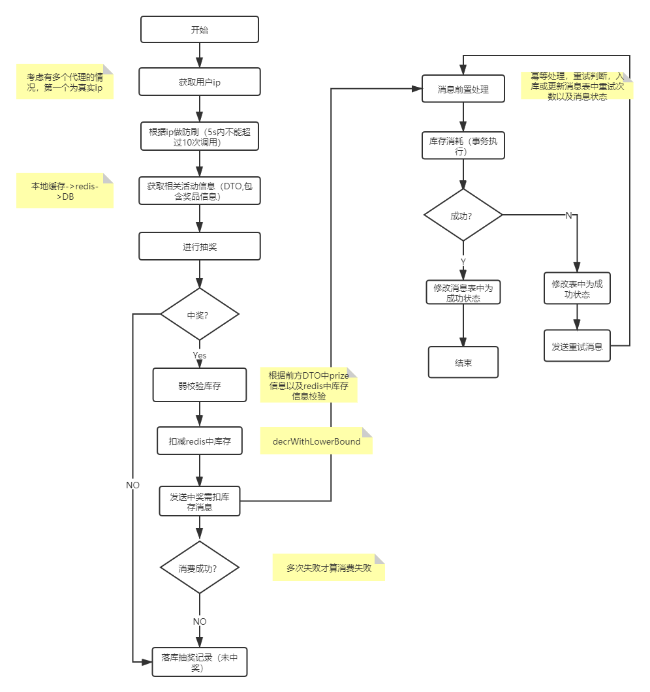
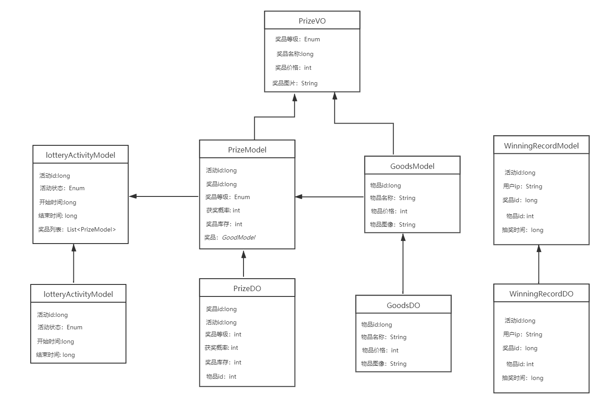
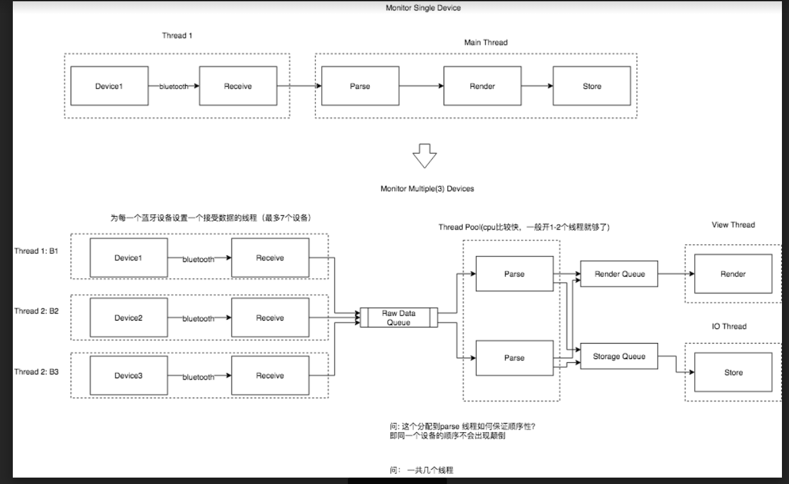

# 简历

## 骨关节压力传感器系统

- 一台手机监控一个应用：利用柔性压力传感器阵列感知骨关节压力并通过蓝牙将原始数据传输到移动端，移动端使用一个线程接收蓝牙数据，之后进行字节解析，显示和处理。
- 解决的问题：解决了蓝牙数据发送频率过快导致的app卡顿问题。
- 解决方法：使用一个线程来进行数据处理，通过`sendMessage`方法向主线程发送消息，主线程使用handle来接收子线程发送的数据并进行UI显示。

## 抽奖系统



### 数据库

一共四张表：good: 商品表  lottery_activity: 抽奖活动表：prize：奖品表； winning_record:抽奖记录表; 消费消息表：consum_log



### 抽奖接口限流

*RateLimiter使用的是一种叫令牌桶的流控算法，RateLimiter会按照一定的频率往桶里扔令牌，线程拿到令牌才能执行，比如你希望自己的应用程序QPS不要超过1000，那么RateLimiter设置1000的速率后，就会每秒往桶里扔1000个令牌。*

```java
private RateLimiter lotteryRateLimiter;
  @PostConstruct
public void init() {
        executorService = Executors.newFixedThreadPool(20);
        lotteryRateLimiter = RateLimiter.create(300);
}

if (!lotteryRateLimiter.tryAcquire()) {
      throw new BusinessException(EmBusinessError.RATELIMIT);
}
```

### 抽奖接口防刷

#### IP获取

#### 防遍历

考虑可能发展为分布式情况以及数据库存储成本，不能使用UUID作为主键，使用雪花算法作为活动ID，保持自增的同时避免活动被根据ID来遍历

算法使用53bit long为id，根据机器的不同ip来生成。

#### IP限制

同一个IP在5s内不可点击抽奖超过10次,使用redis进行限流；

注意：不对同一ip的获奖次数做限制，同一用户理论上可以多次获奖，只是对其刷抽奖行为做限制。

```java
private boolean isLimitedByIp(String ip){
    StoreKey storeKey = new StoreKey(lotteryConstants.IP_PREFIX,ip);
    Long times = redisStoreClient.incrBy(storeKey,1,LotteryConstants.IP_EXPIRE_SECONDS);
    return times != null && times < LotteryConstants.DRAW_MAX_PER_IP;
}
```

### 队列泄洪

```java
		 //同步调用线程池的submit方法
        //拥塞窗口为20的等待队列，用来队列化泄洪
        Future<Boolean> future = executorService.submit(new Callable<Boolean>() {
            @Override
            public Object call() throws Exception {
                //抽奖算法获取抽奖结果
                PrizeModel prizeModel = lotteryService.getLotteryResult(itemId, amount);
                if(prizeModel == null) return flase;
                
                //再去完成对应的消息机制
                boolean result = mqProducer.transactionAsyncReduceStock(prizeModel.getId());
                if (!result) {
                    throw new BusinessException(EmBusinessError.UNKNOWN_ERROR, "抽奖失败");
                }
                return true;
            }
        });

        try {
            future.get();
        } catch (InterruptedException e) {
            throw new BusinessException(EmBusinessError.UNKNOWN_ERROR);
        } catch (ExecutionException e) {
            throw new BusinessException(EmBusinessError.UNKNOWN_ERROR);
        }
```

### 获取活动信息

**活动缓存**

在发布活动中将活动的DTO放入本地缓存和redis中。过期时间为活动结束时间-当前时间。

抽奖时如果无数据则查数据库，同时放入本地缓存和redis中。

若当前活动状态为开始状态则继续进行，否则返回前端活动未开始/已结束。

### 抽奖算法

- 比如千万分之五的概率，可以构造一个[1,1000w]，随机选取里面的5个数字作为中奖数字，然后用一个随机数字去命中这个集合，如果命中这个数字就表明中奖了。

- 中奖后判断奖品的库存是否充足。

```java
public Prize getLotteryResult(LotteryActivityModel activityModel) throws BusinessException {
        //获取该活动的所有奖品列表
        List<Prize> prizeList = activityModel.getPrizeList();
        if (prizeList.isEmpty()) {
            throw new BusinessException(EmBusinessError.ACTIVITY_HAS_NO_PRIZE);
        }
        prizeList.sort(new Comparator<Prize>() {
            @Override
            public int compare(Prize o1, Prize o2) {
                return o1.getPrizeLevel()-o2.getPrizeLevel();
            }
        });
        int randNum = new Random().nextInt(10000);
        int pre = 0;
        for (int index = 0; index < prizeList.size(); index++) {
            if (randNum > pre && randNum < pre + prizeList.get(index).getProbability()) { 
               if(loadStock(prizeList.get(index).prizeId) > 0){
                   return prizeList.get(index);
               }
               return null;
            }
            pre += prizeList.get(index).getProbability();
        }
        //未中奖
        return null;

    }
```

#### 奖品库存

在发布活动时，将Prize进行redis缓存，key为prizeId,value是库存。过期时间为活动结束时间-当前时间。

抽奖时根据prizeId获取所有的奖品库存，先获取缓存，如果相应的缓存不存在则开单线程去捞取，setnx进行塞入。

如果奖品库存为空，直接返回中奖失败。

```java
public long loadStock(long prizeId){
    StoreKey storeKey = new StoreKey("prizeId",prizeId);
    if(redisClient.get(storeKey) == null){
        Prize prize = prizeMapper.selectByPrimaryKey(prezeId);
        if(prize == null){
throw new LotteryExecption(ResultCodeEnum.RESOURCE_NOT_FOUND);
        }
        synchronized(LotteryConstants.PRIZE_STOCK_REMAIN){
            redisClient.setnx(storeKey,Long.valueOf(prize.getStock()),LotteryConstants.EXPIRE_TIME);
        }
    }
    return redisClient.get(storeKey);
}
```

### 数据库和缓存库存的一致性

如果不使用事务型消息原流程

事务开始

- 扣缓存
- 插入中奖记录
- 发送异步消息扣减库存

事务结束

如果在提交事务的时候失败，则扣库存和插中奖记录会回滚，但是异步消息扣减库存并不会回滚，所以会出现缓存少卖现象。

解决方法

- redis中库存过期时间减少，这样在过期之后再次从db中捞取保证缓存与dB差别不是很大。

- 使用事务型消息
  - 消息发送出去后消费者不可见，直到缓存扣减成功同时插入中奖记录成功才被消费者可见
  - 消费者扣减库存

```java
   @PostConstruct
    public void init() throws MQClientException {
        //做mq producer的初始化
        producer = new DefaultMQProducer("producer_group");
        producer.setNamesrvAddr(nameAddr);
        producer.start();

        transactionMQProducer = new TransactionMQProducer(("transaction_producer_group"));
        transactionMQProducer.setNamesrvAddr(nameAddr);
        transactionMQProducer.start();

        transactionMQProducer.setTransactionListener(new TransactionListener() {
            //消息发送出去了，但是消费者不可见，在消费之前做的事情
            @Override
            public LocalTransactionState executeLocalTransaction(Message message, Object o) {
                Map<String, Object> argsMap = (Map<String, Object>) o;
                Integer ip = (Integer) argsMap.get("ip");
                Integer activityId = (Integer) argsMap.get("activityId");
                Integer prizeId = (Integer) argsMap.get("prizeId");
                Integer goodsId = (Integer) argsMap.get("goodsId");
                //真正要做的事  创建订单
                try {
                    //事务操作
                    /*插入中奖记录
                    扣减缓存*/
                    //如果扣减失败，
                } catch (BusinessException e) {
                    e.printStackTrace();
                    return LocalTransactionState.ROLLBACK_MESSAGE;
                }
                return LocalTransactionState.COMMIT_MESSAGE;
            }
            //上述创建订单有可能会有问题，有可能会一直处于准备状态
            @Override
            public LocalTransactionState checkLocalTransaction(MessageExt messageExt) {
             
            }
        });
    }
 //事务型同步库存扣减消息
    public boolean transactionAsyncReduceStock(Integer ip, Integer activityId, Integer prizeId, Integer goodsId) {
        Map<String, Object> bodyMap = new HashMap<>();
        bodyMap.put("prizeId", itemId);

        Map<String, Object> argsMap = new HashMap<>();
        argsMap.put("ip", ip);
        argsMap.put("activityId", activityId);
        argsMap.put("prizeId", prizeId);
        argsMap.put("goodsId", goodsId);
        Message message = new Message(topicName, "increase",
                JSON.toJSON(bodyMap).toString().getBytes(Charset.forName("UTF-8")));
        TransactionSendResult sendResult = null;
        try {
            sendResult = transactionMQProducer.sendMessageInTransaction(message, argsMap);
        } catch (MQClientException e) {
            e.printStackTrace();
            return false;
        }
        if (sendResult.getLocalTransactionState() == LocalTransactionState.COMMIT_MESSAGE) {
            return true;
        } else {
            return false;
        }

    }
```

```java
//消费者 扣减数据库
@PostConstruct
    public void init() throws MQClientException {
        consumer = new DefaultMQPushConsumer("stock_consumer_group");
        consumer.setNamesrvAddr(nameAddr);
        consumer.subscribe(topicName, "*");

        consumer.registerMessageListener(new MessageListenerConcurrently() {
            @Override
            public ConsumeConcurrentlyStatus consumeMessage(List<MessageExt> msgs, ConsumeConcurrentlyContext consumeConcurrentlyContext) {
                MessageExt messageExt = msgs.get(0);
                String jsonString = new String(messageExt.getBody());
                Map<String, Object> map = JSON.parseObject(jsonString, Map.class);
                Integer prizeId = (Integer) map.get("prizeId");
                itemStockDOMapper.decreaseStock(prizeId, 1);
                return ConsumeConcurrentlyStatus.CONSUME_SUCCESS;
            }
        });

        consumer.start();
    }
```


#### 智能步态监测系统

- 一台手机监控多个应用: 本项目拟在移动端开发一款可以实时显示步态信息的安卓端APP，柔性压力传感器嵌入鞋垫中， APP使用两个线程来接收蓝牙数据同时进行处理，之后通过`sendMessage`方法向主线程发送消息，主线程从消息队列中拿到数据后更新UI和进行数据存储。

  

消息队列的作用

- 异步
- 解耦
- 顺序
- 缓存

我看你画的图是这样的




- 第二个图，我对这个图的理解是三个接收数据的子线程接收到数据后通过`sendMessage`向另外一个(或者两个）子线程发送消息，然后处理数据的子线程再通过`sendMessage`方法向主线程(View Thread)和另外一个子线程(IO Thread)线程发送消息。实现UI更新和数据存储。所以一共七个线程。不知道我这样理解是否是正确的？
-    Raw Data Queue中同一个设备顺序应该没有乱，所以如果保证顺序性的话，数据解析的线程使用一个线程是不是就可以了？或者使用三个线程，每一个数据解析线程处理一个设备。（如果是两个数据解析的线程的话，应该怎么保证顺序性呢？这一点我不是很清楚）。
- 多个Parse Thread处理一个Raw Data Queue的消息（所有蓝牙设备，每个蓝牙设备的先后的消息都在一起了），就无法保证同一个蓝牙设备原来的先后顺序了。怎么解决呢？
  答：目的 是 对应同一个设备 乱序执行的 parse线程 在写render queue和IO queue的时候能有序。这个课题对应到 线程之间存在依赖的调度。我们现在的依赖是 线程解析的数据的接收时间， 即 如果有其他线程在解析更早的接收时间，那么本线程就不能将数据写入到 render queue和IO queue.所以 实现难点只是  如何快速判断一个线程 是否有依赖线程。
  如何快速判断线程是否有依赖：  
  让每一个设备有一个按时间排序的队列，该队列存储着 当前该设备正在parse线程里的数据的时间点
  每一个parse线程启动时，将当前数据的时间点加入该设备队列的尾部，每当一个parse线程即将结束时，查看当前数据的时间点是否是队列的头部，
  如果不是头部，就代表还有比他早的线程还没结束，需要等待进入wait状态，直到数据是头部
  如果是头部，就代表这个线程没有依赖，可以直接写入render queue和IO queue，并notify前他等待线程
  这样就是通过线程调度 使得 parse thread 异步执行， 但是可以按照时间顺序串行地写入render queue和IO queue.