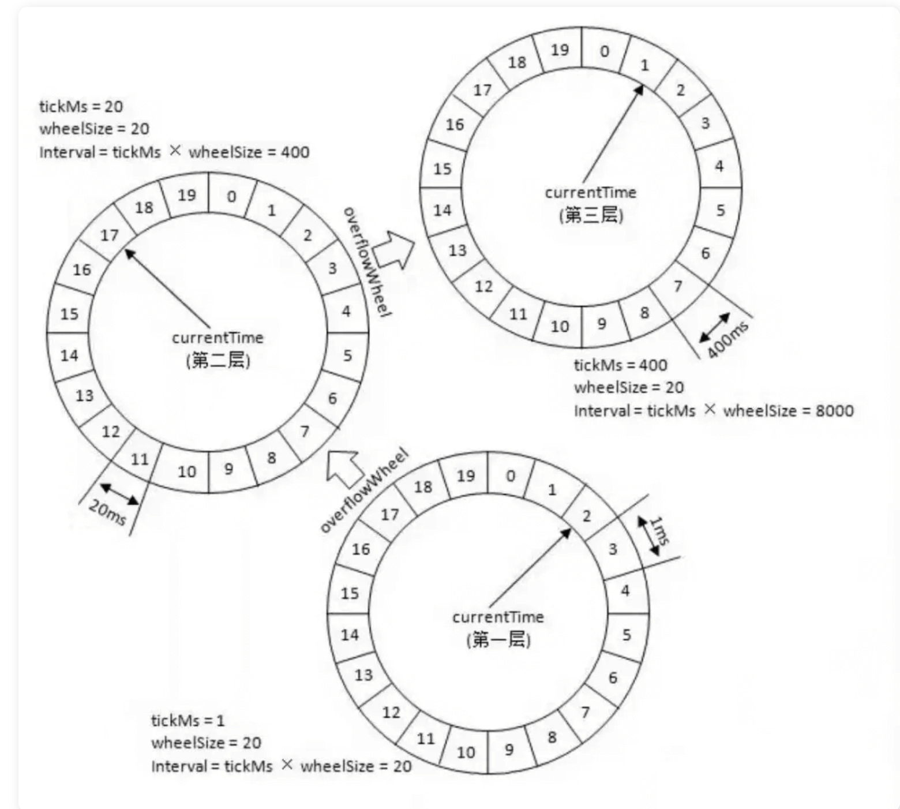

# Java 定时任务

## 为什么需要定时任务？

我们来看一下几个非常常见的业务场景：

1. 某系统凌晨 1 点要进行数据备份。
2. 某电商平台，用户下单半个小时未支付的情况下需要自动取消订单。
3. 某媒体聚合平台，每 10 分钟动态抓取某某网站的数据为自己所用。
4. 某博客平台，支持定时发送文章。
5. 某基金平台，每晚定时计算用户当日收益情况并推送给用户最新的数据。
6. ……

这些场景往往都要求我们在某个特定的时间去做某个事情，也就是定时或者延时去做某个事情。

- 定时任务：在指定时间点执行特定的任务，例如每天早上 8 点，每周一下午 3 点等。定时任务可以用来做一些周期性的工作，如数据备份，日志清理，报表生成等。
- 延时任务：一定的延迟时间后执行特定的任务，例如 10 分钟后，3 小时后等。延时任务可以用来做一些异步的工作，如订单取消，推送通知，红包撤回等。

尽管二者的适用场景有所区别，但它们的核心思想都是将任务的执行时间安排在未来的某个点上，以达到预期的调度效果。

## 单机定时任务

### Timer

`java.util.Timer`是 JDK 1.3 开始就已经支持的一种定时任务的实现方式。

`Timer` 内部使用一个叫做 `TaskQueue` 的类存放定时任务，它是一个基于最小堆实现的优先级队列。`TaskQueue` 会按照任务距离下一次执行时间的大小将任务排序，保证在堆顶的任务最先执行。这样在需要执行任务时，每次只需要取出堆顶的任务运行即可！

`Timer` 使用起来比较简单，通过下面的方式我们就能创建一个 1s 之后执行的定时任务。

```java
// 示例代码：
TimerTask task = new TimerTask() {
    public void run() {
        System.out.println("当前时间: " + new Date() + "n" +
                "线程名称: " + Thread.currentThread().getName());
    }
};
System.out.println("当前时间: " + new Date() + "n" +
        "线程名称: " + Thread.currentThread().getName());
Timer timer = new Timer("Timer");
long delay = 1000L;
timer.schedule(task, delay);


//输出：
当前时间: Fri May 28 15:18:47 CST 2021n线程名称: main
当前时间: Fri May 28 15:18:48 CST 2021n线程名称: Timer

```

不过其缺陷较多，比如一个 `Timer` 一个线程，这就导致 `Timer` 的任务的执行只能串行执行，一个任务执行时间过长的话会影响其他任务（性能非常差），再比如发生异常时任务直接停止（`Timer` 只捕获了 `InterruptedException` ）。

### ScheduledExecutorService

`ScheduledExecutorService `是一个接口，有多个实现类，比较常用的是 `ScheduledThreadPoolExecutor`

`ScheduledThreadPoolExecutor` 本身就是一个线程池，支持任务并发执行。并且，其内部使用 `DelayedWorkQueue` 作为任务队列。

1. **任务封装**：`ScheduledThreadPoolExecutor` 将任务封装为 `RunnableScheduledFuture` 对象，该对象继承自 `FutureTask`，用于表示任务的执行结果和执行状态。
2. **延迟队列**：使用一个优先队列（通常是最小堆）来存储任务和它们的预定执行时间。队列按照任务的预定执行时间进行排序，确保最早需要执行的任务位于队列的顶部。
3. **调度线程**：`ScheduledThreadPoolExecutor` 内部有一个或多个调度线程（取决于构造函数的参数），这些线程负责监控优先队列，并在任务到达预定执行时间时将其提交给工作线程执行。
4. **时间计算**：当调用 `schedule` 或 `scheduleAtFixedRate`/`scheduleWithFixedDelay` 方法时，`ScheduledThreadPoolExecutor` 会计算任务的执行时间，并将其放入优先队列中。
5. **等待和唤醒**：调度线程在没有任务需要执行时会等待（通常使用 `Object.wait()`），当有新任务加入队列或现有任务到达执行时间时，调度线程会被唤醒（通过 `Object.notify()` 或 `Object.notifyAll()`）。
6. **任务执行**：当任务到达预定执行时间，调度线程会从优先队列中取出任务，并将其提交给线程池中的工作线程执行。
7. **周期性任务处理**：对于周期性任务，`ScheduledThreadPoolExecutor` 会在任务执行完成后，根据指定的间隔再次安排任务的执行。这是通过递归调用 `schedule` 方法实现的。
8. **线程池管理**：`ScheduledThreadPoolExecutor` 管理着一个固定大小的线程池，任务提交给线程池后，由线程池中的线程执行。如果线程池中的所有线程都处于忙碌状态，新提交的任务将等待直到有线程可用。
9. **任务取消**：如果任务在执行前被取消，或者在执行过程中遇到异常，`ScheduledThreadPoolExecutor` 会从优先队列中移除该任务，避免资源浪费。

通过这种方式，`ScheduledThreadPoolExecutor` 能够高效地管理和调度大量定时任务，同时保持线程池的高效利用。

```java
// 示例代码：
TimerTask repeatedTask = new TimerTask() {
    @SneakyThrows
    public void run() {
        System.out.println("当前时间: " + new Date() + "n" +
                "线程名称: " + Thread.currentThread().getName());
    }
};
System.out.println("当前时间: " + new Date() + "n" +
        "线程名称: " + Thread.currentThread().getName());
ScheduledExecutorService executor = Executors.newScheduledThreadPool(3);
long delay  = 1000L;
long period = 1000L;
executor.scheduleAtFixedRate(repeatedTask, delay, period, TimeUnit.MILLISECONDS);
Thread.sleep(delay + period * 5);
executor.shutdown();
//输出：
当前时间: Fri May 28 15:40:46 CST 2021n线程名称: main
当前时间: Fri May 28 15:40:47 CST 2021n线程名称: pool-1-thread-1
当前时间: Fri May 28 15:40:48 CST 2021n线程名称: pool-1-thread-1
当前时间: Fri May 28 15:40:49 CST 2021n线程名称: pool-1-thread-2
当前时间: Fri May 28 15:40:50 CST 2021n线程名称: pool-1-thread-2
当前时间: Fri May 28 15:40:51 CST 2021n线程名称: pool-1-thread-2
当前时间: Fri May 28 15:40:52 CST 2021n线程名称: pool-1-thread-2

```

不论是使用 `Timer` 还是 `ScheduledExecutorService` 都无法使用 Cron 表达式指定任务执行的具体时间。

### DelayQueue

`DelayQueue` 是 JUC 包(`java.util.concurrent)`为我们提供的延迟队列，用于实现延时任务比如订单下单 15 分钟未支付直接取消。它是 `BlockingQueue` 的一种，底层是一个基于 `PriorityQueue` 实现的一个无界队列，是线程安全的。

`DelayQueue` 和 `Timer/TimerTask` 都可以用于实现定时任务调度，但是它们的实现方式不同。`DelayQueue` 是基于优先级队列和堆排序算法实现的，可以实现多个任务按照时间先后顺序执行；而 `Timer/TimerTask` 是基于单线程实现的，只能按照任务的执行顺序依次执行，如果某个任务执行时间过长，会影响其他任务的执行。另外，`DelayQueue` 还支持动态添加和移除任务，而 `Timer/TimerTask` 只能在创建时指定任务。

1. **延迟时间**：`DelayQueue` 中的每个元素都必须实现 `Delayed` 接口，该接口定义了 `getDelay(TimeUnit unit)` 方法，用于返回元素的剩余延迟时间。
2. **优先级队列**：`DelayQueue` 使用优先级队列（`PriorityQueue`）来存储元素。元素按照它们的剩余延迟时间进行排序，具有最小剩余延迟时间的元素位于队列的顶部。
3. **入队操作**：当一个元素被添加到 `DelayQueue` 中时，它会根据 `Delayed` 接口的 `compareTo` 方法进行排序。如果元素的延迟时间还没有到，它将被放置在队列的适当位置。
4. **出队操作**：当调用 `take()` 方法时，`DelayQueue` 会阻塞，直到队列中存在一个元素的剩余延迟时间为零或负值，这意味着该元素的延迟时间已经过去，可以被取出并执行了。
5. **时间轮询**：`DelayQueue` 不会自动推进时间，它依赖于外部调用 `take()` 或 `poll()` 方法来轮询队列。当 `poll()` 被调用时，它会返回并移除队列头部的元素，如果头部元素的延迟时间还没有到，则返回 `null`。
6. **时间计算**：`getDelay()` 方法返回的时间是相对于系统时间的，这意味着元素的剩余延迟时间会随着系统时间的推进而减少。
7. **任务调度**：`DelayQueue` 通常与 `ScheduledExecutorService` 一起使用，后者可以安排任务在 `DelayQueue` 中的元素到期时执行。
8. **内存效率**：由于 `DelayQueue` 使用优先级队列，它可以高效地管理大量元素，即使在元素数量很大的情况下也能保持较高的性能。
9. **线程安全**：`DelayQueue` 是线程安全的，可以在多线程环境中使用，多个线程可以安全地添加和移除元素。

`DelayQueue` 的这种设计使得它非常适合用于实现缓存过期策略、任务调度等需要处理具有特定延迟时间的任务的场景。通过使用 `DelayQueue`，开发者可以轻松地实现延迟执行的功能，而不需要自己管理时间轮询和任务调度的复杂性。

### Spring Task

我们直接通过 Spring 提供的 `@Scheduled` 注解即可定义定时任务，非常方便！

```java
/**
 * cron：使用Cron表达式。　每分钟的1，2秒运行
 */
@Scheduled(cron = "1-2 * * * * ? ")
public void reportCurrentTimeWithCronExpression() {
  log.info("Cron Expression: The time is now {}", dateFormat.format(new Date()));
}


```

### 时间轮

Kafka、Dubbo、ZooKeeper、Netty、Caffeine、Akka 中都有对时间轮的实现。

时间轮简单来说就是一个环形的队列（底层一般基于数组实现），队列中的每一个元素（时间格）都可以存放一个定时任务列表。

时间轮中的每个时间格代表了时间轮的基本时间跨度或者说时间精度，假如时间一秒走一个时间格的话，那么这个时间轮的最高精度就是 1 秒（也就是说 3 s 和 3.9s 会在同一个时间格中）。

下图是一个有 12 个时间格的时间轮，转完一圈需要 12 s。当我们需要新建一个 3s 后执行的定时任务，只需要将定时任务放在下标为 3 的时间格中即可。当我们需要新建一个 9s 后执行的定时任务，只需要将定时任务放在下标为 9 的时间格中即可。





上图的时间轮(ms -> s)，第 1 层的时间精度为 1 ，第 2 层的时间精度为 20 ，第 3 层的时间精度为 400。假如我们需要添加一个 350s 后执行的任务 A 的话（当前时间是 0s），这个任务会被放在第 2 层（因为第二层的时间跨度为 20*20=400>350）的第 350/20=17 个时间格子。

当第一层转了 17 圈之后，时间过去了 340s ，第 2 层的指针此时来到第 17 个时间格子。此时，第 2 层第 17 个格子的任务会被移动到第 1 层。

任务 A 当前是 10s 之后执行，因此它会被移动到第 1 层的第 10 个时间格子。

这里在层与层之间的移动也叫做时间轮的升降级。

## 分布式定时任务

### Redis

Redis 是可以用来做延时任务的，基于 Redis 实现延时任务的功能无非就下面两种方案：

1. Redis 过期事件监听
2. Redisson 内置的延时队列

回到redis，有什么数据结构可以既存储任务描述，又能存储任务执行时间，还能根据任务执行时间进行排序呢？想来想去，似乎只有**Sorted Set**了。我们可以把任务的描述序列化成字符串，放在Sorted Set的value中，然后把任务的执行时间戳作为score，利用Sorted Set天然的排序特性，执行时刻越早的会排在越前面。这样一来，我们只要开一个或多个定时线程，每隔一段时间去查一下这个Sorted Set中score小于或等于当前时间戳的元素（这可以通过**zrangebyscore**命令实现），然后再执行元素对应的任务即可。当然，执行完任务后，还要将元素从Sorted Set中删除，避免任务重复执行。如果是多个线程去轮询这个Sorted Set，还有考虑并发问题，假如说一个任务到期了，也被多个线程拿到了，这个时候必须保证只有一个线程能执行这个任务，这可以通过**zrem**命令来实现，只有删除成功了，才能执行任务，这样就能保证任务不被多个任务重复执行了。

### MQ

大部分消息队列，例如 RocketMQ、RabbitMQ，都支持定时/延时消息。定时消息和延时消息本质其实是相同的，都是服务端根据消息设置的定时时间在某一固定时刻将消息投递给消费者消费。

不过，在使用 MQ 定时消息之前一定要看清楚其使用限制，以免不适合项目需求，例如 RocketMQ 定时时长最大值默认为 24 小时且不支持自定义修改、只支持 18 个 Level 的延时并不支持任意时间。

**优缺点总结：**

- **优点**：可以与 Spring 集成、支持分布式、支持集群、性能不错
- **缺点**：功能性较差、不灵活、需要保障消息可靠性

## 分布式任务调度框架

如果我们需要一些高级特性比如支持任务在分布式场景下的分片和高可用的话，我们就需要用到分布式任务调度框架了。

通常情况下，一个分布式定时任务的执行往往涉及到下面这些角色：

- **任务**：首先肯定是要执行的任务，这个任务就是具体的业务逻辑比如定时发送文章。
- **调度器**：其次是调度中心，调度中心主要负责任务管理，会分配任务给执行器。
- **执行器**：最后就是执行器，执行器接收调度器分派的任务并执行。

### Quartz

一个很火的开源任务调度框架，完全由 Java 写成。Quartz 可以说是 Java 定时任务领域的老大哥或者说参考标准，其他的任务调度框架基本都是基于 Quartz 开发的，比如当当网的`elastic-job`就是基于 Quartz 二次开发之后的分布式调度解决方案。

使用 Quartz 可以很方便地与 Spring 集成，并且支持动态添加任务和集群。但是，Quartz 使用起来也比较麻烦，API 繁琐。

并且，Quartz 并没有内置 UI 管理控制台，不过你可以使用 [quartzuiopen in new window](https://github.com/zhaopeiym/quartzui) 这个开源项目来解决这个问题。

另外，Quartz 虽然也支持分布式任务。但是，它是在数据库层面，通过数据库的锁机制做的，有非常多的弊端比如系统侵入性严重、节点负载不均衡。有点伪分布式的味道。

**优缺点总结：**

- 优点：可以与 Spring 集成，并且支持动态添加任务和集群。
- 缺点：分布式支持不友好，不支持任务可视化管理、使用麻烦（相比于其他同类型框架来说）

### Elastic-Job

ElasticJob 当当网开源的一个面向互联网生态和海量任务的分布式调度解决方案，由两个相互独立的子项目 ElasticJob-Lite 和 ElasticJob-Cloud 组成。

ElasticJob-Lite 和 ElasticJob-Cloud 两者的对比如下：

|          | ElasticJob-Lite | ElasticJob-Cloud  |
| :------- | :-------------- | ----------------- |
| 无中心化 | 是              | 否                |
| 资源分配 | 不支持          | 支持              |
| 作业模式 | 常驻            | 常驻 + 瞬时       |
| 部署依赖 | ZooKeeper       | ZooKeeper + Mesos |

`ElasticJob` 支持任务在分布式场景下的分片和高可用、任务可视化管理等功能。

