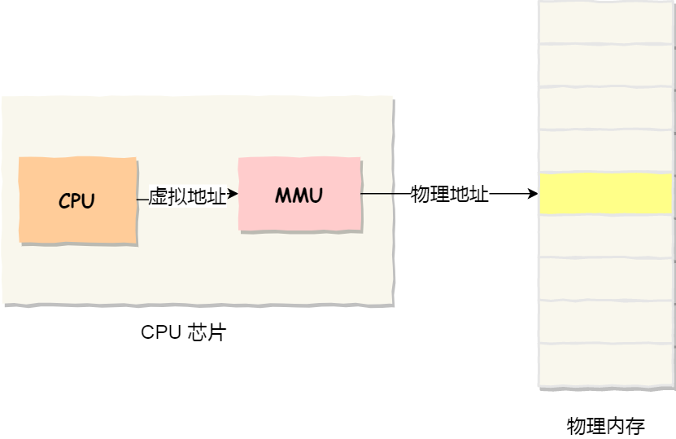

[TOC]


# [**:house:**](../../README.html)

# 操作系统基础
## 什么是操作系统？
1. **操作系统本质上是一个运行在计算机上的软件程序，用于管理计算机硬件和软件资源。是计算机的基石。** 举例：运行在电脑上的所有应用程序都是通过操作系统来调用系统内存以及磁盘等硬件。
2. **操作系统的存在屏蔽了硬件层的复杂性。** 操作系统就像硬件使用的负责人，统筹着各种相关事项。
3. **操作系统的内核（Kernel）是操作系统的核心部分，它负责系统的内存管理，硬件设备的管理，文件系统的管理以及应用程序的管理。** 内核是连接应用程序和硬件的桥梁，决定着系统的性能和稳定性。


## 什么是系统调用？
根据进程访问资源的特点，可以把进程在系统上的运行分为两个级别：

1.**用户态** ：当进程在执行用户自己的代码时，则称为其处于用户态，这时候CPU访问资源有限，运行在用户态的程序不能直接访问操作系统的内核数据结构和程序。
2.**系统态（内核态）:**  系统态运行的进程或者程序几乎可以访问计算机的任何资源，不受限制。

**一般运行的程序基本都是在用户态，当需要调用操作系统系统态级别的子功能时，就需要系统调用。** 也就是说在我们运行的用户程序中，凡是系统态级别的资源有关的操作（如文件管理，进程管理，内存管理等），都必须通过系统调用方式向操作系统提出服务请求，并由操作系统代为完成。

系统调用按功能可以分为以下几类：
- **设备管理。** 完成设备的请求或者释放，以及设备启动等功能。
- **文件管理。** 完成文件的读，写，创建及删除等功能。
- **进程管理。** 完成进程的创建，撤销，阻塞及唤醒等功能。
- **进程通信。** 完成进程之间的消息传递或者信号传递等功能。
- **内存管理。** 完成内存的分配，回收，以及获取作业占用内存区大小及地址等功能。

## Linux内核

**什么是内核呢？**

计算机是由各种外部硬件设备组成的，比如内存、cpu、硬盘等，如果每个应用都要和这些硬件设备对接通信协议，那这样太累了，所以这个中间人就由内核来负责，**让内核作为应用连接硬件设备的桥梁**，应用程序只需关心与内核交互，不用关心硬件的细节。

**内核有哪些能力呢？**

现代操作系统，内核一般会提供 4 个基本能力：

- 管理进程、线程，决定哪个进程、线程使用 CPU，也就是进程调度的能力；
- 管理内存，决定内存的分配和回收，也就是内存管理的能力；
- 管理硬件设备，为进程与硬件设备之间提供通信能力，也就是硬件通信能力；
- 提供系统调用，如果应用程序要运行更高权限运行的服务，那么就需要有系统调用，它是用户程序与操作系统之间的接口。

**内核是怎么工作的？**

内核具有很高的权限，可以控制 cpu、内存、硬盘等硬件，而应用程序具有的权限很小，因此大多数操作系统，把内存分成了两个区域：

- 内核空间，这个内存空间只有内核程序可以访问；
- 用户空间，这个内存空间专门给应用程序使用；

用户空间的代码只能访问一个局部的内存空间，而内核空间的代码可以访问所有内存空间。因此，当程序使用用户空间时，我们常说该程序在**用户态**执行，而当程序使内核空间时，程序则在**内核态**执行。

应用程序如果需要进入内核空间，就需要通过系统调用，下面来看看系统调用的过程：


内核程序执行在内核态，用户程序执行在用户态。当应用程序使用系统调用时，会产生一个中断。发生中断后， CPU 会中断当前在执行的用户程序，转而跳转到中断处理程序，也就是开始执行内核程序。内核处理完后，主动触发中断，把 CPU 执行权限交回给用户程序，回到用户态继续工作。

# 硬件结构

## 冯诺依曼模型

在 1945 年冯诺依曼和其他计算机科学家们提出了计算机具体实现的报告，其遵循了图灵机的设计，而且还提出用电子元件构造计算机，并约定了用二进制进行计算和存储。

最重要的是定义计算机基本结构为 5 个部分，分别是**运算器、控制器、存储器、输入设备、输出设备**，这 5 个部分也被称为**冯诺依曼模型**。运算器、控制器是在中央处理器里的，存储器就我们常见的内存，输入输出设备则是计算机外接的设备，比如键盘就是输入设备，显示器就是输出设备。


**内存**

我们的程序和数据都是存储在内存，存储的区域是线性的。

在计算机数据存储中，存储数据的基本单位是**字节（byte）**，1 字节等于 8 位（8 bit）。每一个字节都对应一个内存地址。

内存的地址是从 0 开始编号的，然后自增排列，最后一个地址为内存总字节数 - 1，这种结构好似我们程序里的数组，所以内存的读写任何一个数据的速度都是一样的。

 **中央处理器**

中央处理器也就是我们常说的 CPU，32 位和 64 位 CPU 最主要区别在于一次能计算多少字节数据：

- 32 位 CPU 一次可以计算 4 个字节；
- 64 位 CPU 一次可以计算 8 个字节；

这里的 32 位和 64 位，通常称为 CPU 的位宽，代表的是 CPU 一次可以计算（运算）的数据量。之所以 CPU 要这样设计，是为了能计算更大的数值。

CPU 内部还有一些组件，常见的有**寄存器、控制单元和逻辑运算单元**等。其中，控制单元负责控制 CPU 工作，逻辑运算单元负责计算，而寄存器可以分为多种类，每种寄存器的功能又不尽相同。

CPU 中的寄存器主要作用是存储计算时的数据，你可能好奇为什么有了内存还需要寄存器？原因很简单，因为内存离 CPU 太远了，而寄存器就在 CPU 里，还紧挨着控制单元和逻辑运算单元，自然计算时速度会很快。

常见的寄存器种类：

- *通用寄存器*，用来存放需要进行运算的数据，比如需要进行加和运算的两个数据。
- *程序计数器*，用来存储 CPU 要执行下一条指令「所在的内存地址」，注意不是存储了下一条要执行的指令，此时指令还在内存中，程序计数器只是存储了下一条指令「的地址」。
- *指令寄存器*，用来存放当前正在执行的指令，也就是指令本身，指令被执行完成之前，指令都存储在这里。

 **总线**

总线是用于 CPU 和内存以及其他设备之间的通信，总线可分为 3 种：

- *地址总线*，用于指定 CPU 将要操作的内存地址；
- *数据总线*，用于读写内存的数据；
- *控制总线*，用于发送和接收信号，比如中断、设备复位等信号，CPU 收到信号后自然进行响应，这时也需要控制总线；

当 CPU 要读写内存数据的时候，一般需要通过下面这三个总线：

- 首先要通过「地址总线」来指定内存的地址；
- 然后通过「控制总线」控制是读或写命令；
- 最后通过「数据总线」来传输数据

**输入、输出设备**

输入设备向计算机输入数据，计算机经过计算后，把数据输出给输出设备。期间，如果输入设备是键盘，按下按键时是需要和 CPU 进行交互的，这时就需要用到控制总线了。

## 线路位宽与 CPU 位宽

- **线路位宽**
  - 数据是如何通过线路传输的呢？其实是通过操作电压，低电压表示 0，高压电压则表示 1
  - 如果构造了高低高这样的信号，其实就是 101 二进制数据，十进制则表示 5，如果只有一条线路，就意味着每次只能传递 1 bit 的数据，即 0 或 1，那么传输 101 这个数据，就需要 3 次才能传输完成，这样的效率非常低。
  - 这样一位一位传输的方式，称为串行，下一个 bit 必须等待上一个 bit 传输完成才能进行传输。当然，想一次多传一些数据，增加线路即可，这时数据就可以并行传输。
  - 为了避免低效率的串行传输的方式，线路的位宽最好一次就能访问到所有的内存地址。
  - CPU 想要操作「内存地址」就需要「地址总线」：想要 CPU 操作 4G 大的内存，那么就需要 32 条地址总线，因为 `2 ^ 32 = 4G`。

- **CPU 位宽**
  - 32 位的 CPU 最好和 32 位宽的线路搭配，因为 32 位 CPU 一次最多只能操作 32 位宽的地址总线和数据总线。
  - 如果用 32 位 CPU 去加和两个 64 位大小的数字，就需要把这 2 个 64 位的数字分成 2 个低位 32 位数字和 2 个高位 32 位数字来计算，先加个两个低位的 32 位数字，算出进位，然后加和两个高位的 32 位数字，最后再加上进位，就能算出结果了，可以发现 32 位 CPU 并不能一次性计算出加和两个 64 位数字的结果。
  - 对于 64 位 CPU 就可以一次性算出加和两个 64 位数字的结果，因为 64 位 CPU 可以一次读入 64 位的数字，并且 64 位 CPU 内部的逻辑运算单元也支持 64 位数字的计算。
  - 但是并不代表 64 位 CPU 性能比 32 位 CPU 高很多，很少应用需要算超过 32 位的数字，所以**如果计算的数额不超过 32 位数字的情况下，32 位和 64 位 CPU 之间没什么区别的，只有当计算超过 32 位数字的情况下，64 位的优势才能体现出来**。
  - 32 位 CPU 最大只能操作 4GB 内存，就算你装了 8 GB 内存条，也没用。而 64 位 CPU 寻址范围则很大，理论最大的寻址空间为 `2^64`。


## 程序执行的基本过程

程序实际上是一条一条指令，所以程序的运行过程就是把每一条指令一步一步的执行起来，负责执行指令的就是 CPU 了。

那 CPU 执行程序的过程如下：

- 第一步，CPU 读取「程序计数器」的值，这个值是指令的内存地址，然后 CPU 的「控制单元」操作「地址总线」指定需要访问的内存地址，接着通知内存设备准备数据，数据准备好后通过「数据总线」将指令数据传给 CPU，CPU 收到内存传来的数据后，将这个指令数据存入到「指令寄存器」。
- 第二步，「程序计数器」的值自增，表示指向下一条指令。这个自增的大小，由 CPU 的位宽决定，比如 32 位的 CPU，指令是 4 个字节，需要 4 个内存地址存放，因此「程序计数器」的值会自增 4；
- 第三步，CPU 分析「指令寄存器」中的指令，确定指令的类型和参数，如果是计算类型的指令，就把指令交给「逻辑运算单元」运算；如果是存储类型的指令，则交由「控制单元」执行；

简单总结一下就是，一个程序执行的时候，CPU 会根据程序计数器里的内存地址，从内存里面把需要执行的指令读取到指令寄存器里面执行，然后根据指令长度自增，开始顺序读取下一条指令。

CPU 从程序计数器读取指令、到执行、再到下一条指令，这个过程会不断循环，直到程序执行结束，这个不断循环的过程被称为 **CPU 的指令周期**。

## 存储器

**每个存储器只和相邻的一层存储器设备打交道，并且存储设备为了追求更快的速度，所需的材料成本必然也是更高，也正因为成本太高，所以 CPU 内部的寄存器、L1\L2\L3 Cache 只好用较小的容量，相反内存、硬盘则可用更大的容量，这就我们今天所说的存储器层次结构**。

另外，当 CPU 需要访问内存中某个数据的时候，如果寄存器有这个数据，CPU 就直接从寄存器取数据即可，如果寄存器没有这个数据，CPU 就会查询 L1 高速缓存，如果 L1 没有，则查询 L2 高速缓存，L2 还是没有的话就查询 L3 高速缓存，L3 依然没有的话，才去内存中取数据。


###  寄存器

最靠近 CPU 的控制单元和逻辑计算单元的存储器，就是寄存器了，它使用的材料速度也是最快的，因此价格也是最贵的，那么数量不能很多。

寄存器的数量通常在几十到几百之间，每个寄存器可以用来存储一定的字节（byte）的数据。比如：

- 32 位 CPU 中大多数寄存器可以存储 `4` 个字节；
- 64 位 CPU 中大多数寄存器可以存储 `8` 个字节。

寄存器的访问速度非常快，一般要求在半个 CPU 时钟周期内完成读写，CPU 时钟周期跟 CPU 主频息息相关，比如 2 GHz 主频的 CPU，那么它的时钟周期就是 1/2G，也就是 0.5ns（纳秒）。

CPU 处理一条指令的时候，除了读写寄存器，还需要解码指令、控制指令执行和计算。如果寄存器的速度太慢，则会拉长指令的处理周期，从而给用户的感觉，就是电脑「很慢」。

###  CPU Cache

为了弥补 CPU 与内存两者之间的性能差异，就在 CPU 内部引入了 CPU Cache，也称高速缓存。

CPU Cache 用的是一种叫 **SRAM（\*Static Random-Access\* Memory，静态随机存储器）** 的芯片。

SRAM 之所以叫「静态」存储器，是因为只要有电，数据就可以保持存在，而一旦断电，数据就会丢失了。

在 SRAM 里面，一个 bit 的数据，通常需要 6 个晶体管，所以 SRAM 的存储密度不高，同样的物理空间下，能存储的数据是有限的，不过也因为 SRAM 的电路简单，所以访问速度非常快。

CPU 的高速缓存，通常可以分为 L1、L2、L3 这样的三层高速缓存，也称为一级缓存、二级缓存、三级缓存。


 **L1 高速缓存**

L1 高速缓存的访问速度几乎和寄存器一样快，通常只需要 `2~4` 个时钟周期，而大小在**几十 KB 到几百 KB** 不等。

每个 CPU 核心都有一块属于自己的 L1 高速缓存，指令和数据在 L1 是分开存放的，所以 L1 高速缓存通常分成**指令缓存**和**数据缓存**。

 **L2 高速缓存**

L2 高速缓存同样每个 CPU 核心都有，但是 L2 高速缓存位置比 L1 高速缓存距离 CPU 核心 更远，它大小比 L1 高速缓存更大，CPU 型号不同大小也就不同，通常大小在**几百 KB 到几 MB** 不等，访问速度则更慢，速度在 `10~20` 个时钟周期。

**L3 高速缓存**

L3 高速缓存通常是多个 CPU 核心共用的，位置比 L2 高速缓存距离 CPU 核心 更远，大小也会更大些，通常大小在几 MB 到几十 MB 不等，具体值根据 CPU 型号而定。访问速度相对也比较慢一些，访问速度在 `20~60`个时钟周期。

**数据结构**

CPU Cache 是由很多个 Cache Line 组成的，Cache Line 是 CPU 从内存读取数据的基本单位，而 Cache Line 是由各种标志（Tag）+ 数据块（Data Block）组成。

CPU Cache 的数据是从内存中读取过来的，它是以一小块一小块读取数据的，而不是按照单个数组元素来读取数据的，在 CPU Cache 中的，这样一小块一小块的数据，称为 **Cache Line（缓存块）**。

**读取过程**

CPU 读取数据的时候，无论数据是否存放到 Cache 中，CPU 都是先访问 Cache，只有当 Cache 中找不到数据时，才会去访问内存，并把内存中的数据读入到 Cache 中，CPU 再从 CPU Cache 读取数据。

 **CPU 怎么知道要访问的内存数据，是否在 Cache 里？如果在的话，如何找到 Cache 对应的数据呢？**

- **直接映射 Cache（Direct Mapped Cache）**： CPU 访问内存数据时，是一小块一小块数据读取的，在内存中，这一块的数据我们称为**内存块（Block）**，读取的时候我们要拿到数据所在内存块的地址。对于直接映射 Cache 采用的策略，就是把内存块的地址始终「映射」在一个 CPU Cache Line（缓存块） 的地址，至于映射关系实现方式，则是使用「取模运算」，取模运算的结果就是内存块地址对应的 CPU Cache Line（缓存块） 的地址。
- 一个内存的访问地址，包括**组标记、CPU Cache Line 索引、偏移量**这三种信息，于是 CPU 就能通过这些信息，在 CPU Cache 中找到缓存的数据。而对于 CPU Cache 里的数据结构，则是由**索引 + 有效位 + 组标记 + 数据块**组成。
  - 因为内存块取模时会存在不同内存块映射到一个Cache Line 中的情况，所以是为了区别不同的内存块，在对应的 CPU Cache Line 中我们还会存储一个**组标记（Tag）**。这个组标记会记录当前 CPU Cache Line 中存储的数据对应的内存块，我们可以用这个组标记来区分不同的内存块。
  - 从内存加载过来的实际存放**数据（Data）**。
  - **有效位（Valid bit）**，它是用来标记对应的 CPU Cache Line 中的数据是否是有效的，如果有效位是 0，无论 CPU Cache Line 中是否有数据，CPU 都会直接访问内存，重新加载数据。
  - CPU 在从 CPU Cache 读取数据的时候，并不是读取 CPU Cache Line 中的整个数据块，而是读取 CPU 所需要的一个数据片段，这样的数据统称为一个**字（Word）**。那怎么在对应的 CPU Cache Line 中数据块中找到所需的字呢？答案是，需要一个**偏移量（Offset）**
- 如果内存中的数据已经在 CPU Cache 中了，那 CPU 访问一个内存地址的时候，会经历这 4 个步骤：
  1. 根据内存地址中索引信息，计算在 CPU Cache 中的索引，也就是找出对应的 CPU Cache Line 的地址；
  2. 找到对应 CPU Cache Line 后，判断 CPU Cache Line 中的有效位，确认 CPU Cache Line 中数据是否是有效的，如果是无效的，CPU 就会直接访问内存，并重新加载数据，如果数据有效，则往下执行；
  3. 对比内存地址中组标记和 CPU Cache Line 中的组标记，确认 CPU Cache Line 中的数据是我们要访问的内存数据，如果不是的话，CPU 就会直接访问内存，并重新加载数据，如果是的话，则往下执行；
  4. 根据内存地址中偏移量信息，从 CPU Cache Line 的数据块中，读取对应的字。


**如何写出让 CPU 跑得更快的代码？**

要想写出让 CPU 跑得更快的代码，就需要写出缓存命中率高的代码，CPU L1 Cache 分为数据缓存和指令缓存，因而需要分别提高它们的缓存命中率：

- 对于数据缓存，我们在遍历数据的时候，应该按照内存布局的顺序操作，这是因为 CPU Cache 是根据 CPU Cache Line 批量操作数据的，所以顺序地操作连续内存数据时，性能能得到有效的提升；
- 对于指令缓存，有规律的条件分支语句能够让 CPU 的分支预测器发挥作用，进一步提高执行的效率；

另外，对于多核 CPU 系统，线程可能在不同 CPU 核心来回切换，这样各个核心的缓存命中率就会受到影响，于是要想提高线程的缓存命中率，可以考虑把线程绑定 CPU 到某一个 CPU 核心

### 内存

内存用的芯片和 CPU Cache 有所不同，它使用的是一种叫作 **DRAM （\*Dynamic Random Access Memory\*，动态随机存取存储器）** 的芯片。

相比 SRAM，DRAM 的密度更高，功耗更低，有更大的容量，而且造价比 SRAM 芯片便宜很多。

DRAM 存储一个 bit 数据，只需要一个晶体管和一个电容就能存储，但是因为数据会被存储在电容里，电容会不断漏电，所以需要「定时刷新」电容，才能保证数据不会被丢失，这就是 DRAM 之所以被称为「动态」存储器的原因，只有不断刷新，数据才能被存储起来。

DRAM 的数据访问电路和刷新电路都比 SRAM 更复杂，所以访问的速度会更慢，内存速度大概在 `200~300` 个 时钟周期之间。

###  SSD/HDD 硬盘

SSD（*Solid-state disk*） 就是我们常说的固体硬盘，结构和内存类似，但是它相比内存的优点是断电后数据还是存在的，而内存、寄存器、高速缓存断电后数据都会丢失。内存的读写速度比 SSD 大概快 `10~1000` 倍。

当然，还有一款传统的硬盘，也就是机械硬盘（*Hard Disk Drive, HDD*），它是通过物理读写的方式来访问数据的，因此它访问速度是非常慢的，它的速度比内存慢 `10W` 倍左右。

由于 SSD 的价格快接近机械硬盘了，因此机械硬盘已经逐渐被 SSD 替代了。

## CPU缓存一致性

**什么时机才把 Cache 中的数据写回到内存？**

**写直达（*Write Through*）**: 把数据同时写入内存和 Cache 中。

- 流程：CPU写入前会先判断数据是否已经在 CPU Cache 里面了.
  - 如果数据已经在 Cache 里面，先将数据更新到 Cache 里面，再写入到内存里面；
  - 如果数据没有在 Cache 里面，就直接把数据更新到内存里面。
- 问题：无论数据在不在 Cache 里面，每次写操作都会写回到内存，这样写操作将会花费大量的时间，无疑性能会受到很大的影响。

**写回（*Write Back*）**：既然写直达由于每次写操作都会把数据写回到内存，而导致影响性能，于是为了要减少数据写回内存的频率，就出现了**写回（Write Back）的方法**。

- 流程：**当发生写操作时，新的数据仅仅被写入 Cache Block 里，只有当修改过的 Cache Block「被替换」时才需要写到内存中**，减少了数据写回内存的频率，这样便可以提高系统的性能。
  - 如果当发生写操作时，数据已经在 CPU Cache 里的话，则把数据更新到 CPU Cache 里，同时标记 CPU Cache 里的这个 Cache Block 为脏（Dirty）的，这个脏的标记代表这个时候，我们 CPU Cache 里面的这个 Cache Block 的数据和内存是不一致的，这种情况是不用把数据写到内存里的；
  - 如果当发生写操作时，数据所对应的 Cache Block 里存放的是「别的内存地址的数据」（因为一个cashe line会有可能有不同的内存块，是通过Tag区分的）的话，就要检查这个 Cache Block 里的数据有没有被标记为脏的：
    - 如果是脏的话，我们就要把这个 Cache Block 里的数据写回到内存，然后再把当前要写入的数据，先从内存读入到 Cache Block 里（注意，这一步不是没用的，具体为什么要这一步，可以看这个「[回答 (opens new window)](https://stackoverflow.com/questions/26672661/for-write-back-cache-policy-why-data-should-first-be-read-from-memory-before-w)」），然后再把当前要写入的数据写入到 Cache Block，最后也把它标记为脏的；
    - 如果不是脏的话，把当前要写入的数据先从内存读入到 Cache Block 里，接着将数据写入到这个 Cache Block 里，然后再把这个 Cache Block 标记为脏的就好了。
- 可以发现写回这个方法，在把数据写入到 Cache 的时候，只有在缓存不命中，同时数据对应的 Cache 中的 Cache Block 为脏标记的情况下，才会将数据写到内存中，而在缓存命中的情况下，则在写入后 Cache 后，只需把该数据对应的 Cache Block 标记为脏即可，而不用写到内存里。这样的好处是，如果我们大量的操作都能够命中缓存，那么大部分时间里 CPU 都不需要读写内存，自然性能相比写直达会高很多。

现在 CPU 都是多核的，由于 L1/L2 Cache 是多个核心各自独有的，那么会带来多核心的**缓存一致性（Cache Coherence）** 的问题，如果不能保证缓存一致性的问题，就可能造成结果错误。A核心写了cache的数据，没有更新到内存，只是标记为脏，这时候B核心读内存就会读到脏数据。**解决方案**：

- 第一点，某个 CPU 核心里的 Cache 数据更新时，必须要传播到其他核心的 Cache，这个称为**写传播（Write Propagation）**；
  - **总线嗅探**：CPU 需要每时每刻监听总线上的一切活动，但是不管别的核心的 Cache 是否缓存相同的数据，都需要发出一个广播事件，这无疑会加重总线的负载。
- 第二点，某个 CPU 核心里对数据的操作顺序，必须在其他核心看起来顺序是一样的，这个称为**事务的串行化（Transaction Serialization）**。
  - CPU 核心对于 Cache 中数据的操作，需要同步给其他 CPU 核心；
  - 要引入「锁」的概念，如果两个 CPU 核心里有相同数据的 Cache，那么对于这个 Cache 数据的更新，只有拿到了「锁」，才能进行对应的数据更新。

**MESI 协议**

MESI 协议其实是 4 个状态单词的开头字母缩写，分别是：

- *Modified*，已修改
  - 指的是脏标记，代表该 Cache Block 上的数据已经被更新过，但是还没有写到内存里。
- *Exclusive*，独占
  - 据只存储在一个 CPU 核心的 Cache 里，而其他 CPU 核心的 Cache 没有该数据。这个时候，如果要向独占的 Cache 写数据，就可以直接自由地写入，而不需要通知其他 CPU 核心，因为只有你这有这个数据，就不存在缓存一致性的问题了，于是就可以随便操作该数据。
- *Shared*，共享
  - 如果有其他核心从内存读取了相同的数据到各自的 Cache ，那么这个时候，独占状态下的数据就会变成共享状态。代表着相同的数据在多个 CPU 核心的 Cache 里都有，所以当我们要更新 Cache 里面的数据的时候，不能直接修改，而是要先向所有的其他 CPU 核心广播一个请求，要求先把其他核心的 Cache 中对应的 Cache Line 标记为「无效」状态，然后再更新当前 Cache 里面的数据。
- *Invalidated*，已失效
  - 这个 Cache Block 里的数据已经失效了，不可以读取该状态的数据。

## CPU如何执行任务

### 伪共享问题


多个线程同时读写同一个 Cache Line 的不同变量时，而导致 CPU Cache 失效的现象。那么对于多个线程共享的热点数据，即经常会修改的数据，应该避免这些数据刚好在同一个 Cache Line 中，避免的方式一般有 Cache Line 大小字节对齐（Linux 内核中的宏定义`__cacheline_aligned_in_smp` ），以及字节填充（应用层面）等方法。

举个例子，有下面这个结构体：


结构体里的两个成员变量 a 和 b 在物理内存地址上是连续的，于是它们可能会位于同一个 Cache Line 中。所以，为了防止前面提到的 Cache 伪共享问题，我们可以使用上面介绍的宏定义，将 b 的地址设置为 Cache Line 对齐地址，如下：


这样 a 和 b 变量就不会在同一个 Cache Line 中了。

### CPU 如何选择线程的？

Linux系统一般来说，没有创建线程的进程，是只有单个执行流，它被称为是主线程。如果想让进程处理更多的事情，可以创建多个线程分别去处理，但不管怎么样，它们对应到内核里都是 `task_struct`。Linux 内核里的调度器，调度的对象就是 `task_struct`，接下来我们就把这个数据结构统称为**任务**。

在 Linux 系统中，根据任务的优先级以及响应要求，主要分为两种，其中优先级的数值越小，优先级越高：

- 实时任务，对系统的响应时间要求很高，也就是要尽可能快的执行实时任务，优先级在 `0~99` 范围内的就算实时任务；
- 普通任务，响应时间没有很高的要求，优先级在 `100~139` 范围内都是普通任务级别；

####  调度类

由于任务有优先级之分，Linux 系统为了保障高优先级的任务能够尽可能早的被执行，于是分为了这几种调度类


Deadline 和 Realtime 这两个调度类，都是应用于实时任务的，这两个调度类的调度策略合起来共有这三种，它们的作用如下：

- *SCHED_DEADLINE*：是按照 deadline 进行调度的，距离当前时间点最近的 deadline 的任务会被优先调度；
- *SCHED_FIFO*：对于相同优先级的任务，按先来先服务的原则，但是优先级更高的任务，可以抢占低优先级的任务，也就是优先级高的可以「插队」；
- *SCHED_RR*：对于相同优先级的任务，轮流着运行，每个任务都有一定的时间片，当用完时间片的任务会被放到队列尾部，以保证相同优先级任务的公平性，但是高优先级的任务依然可以抢占低优先级的任务；

而 Fair 调度类是应用于普通任务，都是由 CFS 调度器管理的，分为两种调度策略：

- *SCHED_NORMAL*：普通任务使用的调度策略；
- *SCHED_BATCH*：后台任务的调度策略，不和终端进行交互，因此在不影响其他需要交互的任务，可以适当降低它的优先级。

#### 完全公平调度

我们平日里遇到的基本都是普通任务，对于普通任务来说，公平性最重要，在 Linux 里面，实现了一个基于 CFS 的调度算法，也就是**完全公平调度（\*Completely Fair Scheduling\*）**。

这个算法的理念是想让分配给每个任务的 CPU 时间是一样，于是它为每个任务安排一个虚拟运行时间 vruntime，如果一个任务在运行，其运行的越久，该任务的 vruntime 自然就会越大，而没有被运行的任务，vruntime 是不会变化的。那么，**在 CFS 算法调度的时候，会优先选择 vruntime 少的任务**，以保证每个任务的公平性。

#### 调整优先级

如果我们启动任务的时候，没有特意去指定优先级的话，默认情况下都是普通任务，普通任务的调度类是 Fair，由 CFS 调度器来进行管理。CFS 调度器的目的是实现任务运行的公平性，也就是保障每个任务的运行的时间是差不多的。

如果你想让某个普通任务有更多的执行时间，可以调整任务的 `nice` 值，从而让优先级高一些的任务执行更多时间。nice 的值能设置的范围是 `-20～19`， 值越低，表明优先级越高，因此 -20 是最高优先级，19 则是最低优先级，默认优先级是 0。

## 软中断

**什么是中断？**

- 中断是系统用来响应硬件设备请求的一种机制，操作系统收到硬件的中断请求，会打断正在执行的进程，然后调用内核中的中断处理程序来响应请求。

- 中断处理程序在响应中断时，可能还会「临时关闭中断」，这意味着，如果当前中断处理程序没有执行完之前，系统中其他的中断请求都无法被响应，也就说中断有可能会丢失，所以中断处理程序要短且快。

**什么是软中断？**

Linux 系统**为了解决中断处理程序执行过长和中断丢失的问题，将中断过程分成了两个阶段，分别是「上半部和下半部分」**。

- **上半部直接处理硬件请求，也就是硬中断**，主要是负责耗时短的工作，特点是快速执行；
- **下半部是由内核触发，也就说软中断**，主要是负责上半部未完成的工作，通常都是耗时比较长的事情，特点是延迟执行；

硬中断（上半部）是会打断 CPU 正在执行的任务，然后立即执行中断处理程序，而软中断（下半部）是以内核线程的方式执行，并且每一个 CPU 都对应一个软中断内核线程，名字通常为「ksoftirqd/CPU 编号」，比如 0 号 CPU 对应的软中断内核线程的名字是 `ksoftirqd/0`

不过，软中断不只是包括硬件设备中断处理程序的下半部，一些内核自定义事件也属于软中断，比如内核调度等、RCU 锁（内核里常用的一种锁）等。

Linux 中的软中断包括网络收发、定时、调度、RCU 锁等各种类型，可以通过查看 /proc/softirqs 来观察软中断的累计中断次数情况，如果要实时查看中断次数的变化率，可以使用 watch -d cat /proc/softirqs 命令。

每一个 CPU 都有各自的软中断内核线程，我们还可以用 ps 命令来查看内核线程，一般名字在中括号里面到，都认为是内核线程。

如果在 top 命令发现，CPU 在软中断上的使用率比较高，而且 CPU 使用率最高的进程也是软中断 ksoftirqd 的时候，这种一般可以认为系统的开销被软中断占据了。

这时我们就可以分析是哪种软中断类型导致的，一般来说都是因为网络接收软中断导致的，如果是的话，可以用 sar 命令查看是哪个网卡的有大量的网络包接收，再用 tcpdump 抓网络包，做进一步分析该网络包的源头是不是非法地址，如果是就需要考虑防火墙增加规则，如果不是，则考虑硬件升级等。

## 为什么 0.1 + 0.2 不等于 0.3 ？

- **为什么负数要用补码表示？**

  - 负数之所以用补码的方式来表示，主要是为了统一和正数的加减法操作一样，毕竟数字的加减法是很常用的一个操作，就不要搞特殊化，尽量以统一的方式来运算。

- **十进制小数怎么转成二进制？**

  - 十进制整数转二进制使用的是「除 2 取余法」，十进制小数使用的是「乘 2 取整法」。

- **计算机是怎么存小数的？**

  - 计算机是以浮点数的形式存储小数的，大多数计算机都是 IEEE 754 标准定义的浮点数格式，包含三个部分：

    - 符号位：表示数字是正数还是负数，为 0 表示正数，为 1 表示负数；
    - 指数位：指定了小数点在数据中的位置，指数可以是负数，也可以是正数，指数位的长度越长则数值的表达范围就越大；
    - 尾数位：小数点右侧的数字，也就是小数部分，比如二进制 1.0011 x 2^(-2)，尾数部分就是 0011，而且尾数的长度决定了这个数的精度，因此如果要表示精度更高的小数，则就要提高尾数位的长度；

    用 32 位来表示的浮点数，则称为单精度浮点数，也就是我们编程语言中的 float 变量，而用 64 位来表示的浮点数，称为双精度浮点数，也就是 double 变量。

- **0.1 + 0.2 == 0.3 吗？**

  - 不是的，0.1 和 0.2 这两个数字用二进制表达会是一个一直循环的二进制数，比如 0.1 的二进制表示为 0.0 0011 0011 0011… （0011 无限循环)，对于计算机而言，0.1 无法精确表达，这是浮点数计算造成精度损失的根源。

    因此，IEEE 754 标准定义的浮点数只能根据精度舍入，然后用「近似值」来表示该二进制，那么意味着计算机存放的小数可能不是一个真实值。

    0.1 + 0.2 并不等于完整的 0.3，这主要是因为这两个小数无法用「完整」的二进制来表示，只能根据精度舍入，所以计算机里只能采用近似数的方式来保存，那两个近似数相加，得到的必然也是一个近似数。

# 进程管理

>https://mp.weixin.qq.com/s/YXl6WZVzRKCfxzerJWyfrg
### 进程和线程的区别

- 进程是资源（包括内存、打开的文件等）分配的单位，线程是 CPU 调度的单位；
- 进程拥有一个完整的资源平台，而线程只独享必不可少的资源，如寄存器和栈；
- 线程同样具有就绪、阻塞、执行三种基本状态，同样具有状态之间的转换关系；
- 线程能减少并发执行的时间和空间开销。

> 对于，线程相比进程能减少开销，体现在：
>
> - **线程的创建时间比进程快**，因为进程在创建的过程中，还需要资源管理信息，比如内存管理信息、文件管理信息，而线程在创建的过程中，不会涉及这些资源管理信息，而是共享它们；
> - **线程的终止时间比进程快**，因为线程释放的资源相比进程少很多；
> - **同一个进程内的线程切换比进程切换快**，因为线程具有相同的地址空间（虚拟内存共享），这意味着同一个进程的线程都具有同一个页表，那么在切换的时候不需要切换页表。而对于进程之间的切换，切换的时候要把页表给切换掉，而页表的切换过程开销是比较大的；
> - **线程之间的数据交互效率高**：由于同一进程的各线程间共享内存和文件资源，那么在线程之间数据传递的时候，就不需要经过内核了，这就使得线程之间的数据交互效率更高了；
>
> 所以，线程比进程不管是时间效率，还是空间效率都要高。

## 进程

我们编写的代码只是存储在硬盘上的静态文件，通过编译后就会生成二进制可执行文件，在我们运行这个可执行文件后，它就会被装载到内存中，接着CPU会执行程序中的每一条指令，那么在这个运行中的程序，就称为进程。

当进程要从硬盘读取数据时，CPU 不需要阻塞等待数据的返回，而是去执行另外的进程。当硬盘数据返回时，CPU 会收到个**中断**，于是 CPU 再继续运行这个进程。

这种**多个程序、交替执行**的思想，就有 CPU 管理多个进程的初步想法。虽然单核的 CPU 在某一个瞬间，只能运行一个进程。但在 1 秒钟期间，它可能会运行多个进程，这样就产生**并行的错觉**，实际上这是**并发**。

- 并发：单个核心交替运行程序
- 并行：多个核心同时运行程序


### 进程的状态


进程分为五种状态：

1. **创建状态：** 进程正在被创建，尚未到达就绪状态；
2. **就绪状态：** 进程已经处于准备运行状态，也就是进程已经获取到除了处理器以外的一切所需资源，一旦得到处理器资源（处理器分配的时间片）就可以运行。
   - **创建状态 -> 就绪状态：**当进程被创建完成并初始化后，一切就绪准备运行时，变为就绪状态，这个过程是很快的；
   - **阻塞状态 -> 就绪状态：**当进程要等待的事件完成时，它从阻塞状态变到就绪状态；
   - **运行状态 -> 就绪状态：**处于运行状态的进程在运行过程中，由于分配给它的运行时间片用完，操作系统会把该进程变为就绪态，接着从就绪态选中另外一个进程运行；
3. **运行状态：** 该时刻进程占用 CPU。
   - **就绪状态 -> 运行状态：**处于就绪状态的进程被操作系统的进程调度器选中后，就分配给 CPU 正式运行该进程；
4. **阻塞状态：** 进程正在等待某一件事件而暂停运行如等待某资源为可用或者等待IO操作完成，即使处理器空闲，该进程也不能运行。
   - **运行状态 -> 阻塞状态：**当进程请求某个事件且必须等待时，例如请求 I/O 事件；
5. **结束状态：** 进程正在从系统中消失。可能是进程正常结束或者因为其他原因中断退出运行。
   - **运行状态 -> 结束状态：**当进程已经运行完成或出错时，会被操作系统作结束状态处理；

> 如果有大量处于阻塞状态的进程，进程可能会占用着物理内存空间，显然不是我们所希望的，毕竟物理内存空间是有限的，被阻塞状态的进程占用着物理内存就一种浪费物理内存的行为。
>
> 所以，在虚拟内存管理的操作系统中，通常会把阻塞状态的进程的物理内存空间换出到硬盘，等需要再次运行的时候，再从硬盘换入到物理内存。
>
> 那么，就需要一个新的状态，来**描述进程没有占用实际的物理内存空间的情况，这个状态就是挂起状态**。这跟阻塞状态是不一样，阻塞状态是等待某个事件的返回。
>
> 另外，挂起状态可以分为两种：
>
> - 阻塞挂起状态：进程在外存（硬盘）并等待某个事件的出现；
> - 就绪挂起状态：进程在外存（硬盘），但只要进入内存，即刻立刻运行；
>
> 导致进程挂起的原因不只是因为进程所使用的内存空间不在物理内存，还包括如下情况：
>
> - 通过 sleep 让进程间歇性挂起，其工作原理是设置一个定时器，到期后唤醒进程。
> - 用户希望挂起一个程序的执行，比如在 Linux 中用 `Ctrl+Z` 挂起进程；

### 进程的控制结构

- 在操作系统中，是用**进程控制块（process control block，PCB）**数据结构来描述进程的。
- **PCB 是进程存在的唯一标识**，这意味着一个进程的存在，必然会有一个 PCB，如果进程消失了，那么 PCB 也会随之消失。

1. PCB包含的信息

- **进程描述信息**
  - 进程标识符：标识各个进程，每个进程都有一个并且唯一的标识符；
  - 用户标识符：进程归属的用户，用户标识符主要为共享和保护服务；
- **进程控制和管理信息**
  - 进程当前状态，如 new、ready、running、waiting 或 blocked 等；
  - 进程优先级：进程抢占 CPU 时的优先级；
- **资源分配清单**：有关内存地址空间或虚拟地址空间的信息，所打开文件的列表和所使用的 I/O 设备信息。
- **CPU相关信息**：CPU 中各个寄存器的值，当进程被切换时，CPU 的状态信息都会被保存在相应的 PCB 中，以便进程重新执行时，能从断点处继续执行。

2. 组织方式：通常是通过**链表**的方式进行组织，把具有**相同状态的进程链在一起，组成各种队列**。比如：

   - 将所有处于就绪状态的进程链在一起，称为**就绪队列**；

   - 把所有因等待某事件而处于等待状态的进程链在一起就组成各种**阻塞队列**；

   - 另外，对于运行队列在单核 CPU 系统中则只有一个运行指针了，因为单核 CPU 在某个时间，只能运行一个程序。


除了链接的组织方式，还有索引方式，它的工作原理：将同一状态的进程组织在一个索引表中，索引表项指向相应的 PCB，不同状态对应不同的索引表。

一般会选择链表，因为可能面临进程创建，销毁等调度导致进程状态发生变化，所以链表能够更加灵活的插入和删除。


### 进程的控制

- **创建进程**

  操作系统允许一个进程创建另一个进程，而且允许子进程继承父进程所拥有的资源。

  创建进程的过程如下：

  - 申请一个空白的 PCB，并向 PCB 中填写一些控制和管理进程的信息，比如进程的唯一标识等；
  - 为该进程分配运行时所必需的资源，比如内存资源；
  - 将 PCB 插入到就绪队列，等待被调度运行；

- **终止进程**

  进程可以有 3 种终止方式：正常结束、异常结束以及外界干预（信号 `kill` 掉）。

  当子进程被终止时，其在父进程处继承的资源应当还给父进程。而当父进程被终止时，该父进程的子进程就变为孤儿进程，会被 1 号进程收养，并由 1 号进程对它们完成状态收集工作。

  终止进程的过程如下：

  - 查找需要终止的进程的 PCB；
  - 如果处于执行状态，则立即终止该进程的执行，然后将 CPU 资源分配给其他进程；
  - 如果其还有子进程，则应将该进程的子进程交给 1 号进程接管；
  - 将该进程所拥有的全部资源都归还给操作系统；
  - 将其从 PCB 所在队列中删除；

- **阻塞进程**

  当进程需要等待某一事件完成时，它可以调用阻塞语句把自己阻塞等待。而一旦被阻塞等待，它只能由另一个进程唤醒。

  阻塞进程的过程如下：

  - 找到将要被阻塞进程标识号对应的 PCB；
  - 如果该进程为运行状态，则保护其现场，将其状态转为阻塞状态，停止运行；
  - 将该 PCB 插入到阻塞队列中去；

-  **唤醒进程**

  进程由「运行」转变为「阻塞」状态是由于进程必须等待某一事件的完成，所以处于阻塞状态的进程是绝对不可能叫醒自己的。

  如果某进程正在等待 I/O 事件，需由别的进程发消息给它，则只有当该进程所期待的事件出现时，才由发现者进程用唤醒语句叫醒它。

  唤醒进程的过程如下：

  - 在该事件的阻塞队列中找到相应进程的 PCB；
  - 将其从阻塞队列中移出，并置其状态为就绪状态；
  - 把该 PCB 插入到就绪队列中，等待调度程序调度

### 进程上下文切换

- **CPU上下文切换**
  - CPU 寄存器和程序计数是 CPU 在运行任何任务前，所必须依赖的环境，这些环境就叫做 **CPU 上下文**。
  - C**PU 上下文切换**就是先把前一个任务的 CPU 上下文（CPU 寄存器和程序计数器）保存起来，然后加载新任务的上下文到这些寄存器和程序计数器，最后再跳转到程序计数器所指的新位置，运行新任务。系统内核会存储保持下来的上下文信息，当此任务再次被分配给 CPU 运行时，CPU 会重新加载这些上下文，这样就能保证任务原来的状态不受影响，让任务看起来还是连续运行。
  - 上面说到所谓的「任务」，主要包含进程、线程和中断。所以，可以根据任务的不同，把 CPU 上下文切换分成：**进程上下文切换、线程上下文切换和中断上下文切换**。

- **进程上下文切换**

  - 各个进程之间是共享 CPU 资源的，在不同的时候进程之间需要切换，让不同的进程可以在 CPU 执行，那么这个**一个进程切换到另一个进程运行，称为进程的上下文切换**。

  - 进程是由内核管理和调度的，所以进程的切换只能发生在内核态。**进程的上下文切换不仅包含了虚拟内存、栈、全局变量等用户空间的资源，还包括了内核堆栈、寄存器等内核空间的资源。**

  - 会把交换的信息保存在进程的 PCB，当要运行另外一个进程的时候，我们需要从这个进程的 PCB 取出上下文，然后恢复到 CPU 中，这使得这个进程可以继续执行。


- **发生上下文切换的场景**

  - **进程时间片用完了**：为了保证所有进程可以得到公平调度，CPU 时间被划分为一段段的时间片，这些时间片再被轮流分配给各个进程。这样，当某个进程的时间片耗尽了，就会被系统挂起，切换到其它正在等待 CPU 的进程运行；

  - **进程资源不足（比如内存不足）**：进程在系统资源不足（比如内存不足）时，要等到资源满足后才可以运行，这个时候进程也会被挂起，并由系统调度其他进程运行；

  - **进程通过sleep函数主动将自己挂起**：当进程通过睡眠函数 sleep 这样的方法将自己主动挂起时，自然也会重新调度；

  - **有更高优先级的进程需要执行**：当有优先级更高的进程运行时，为了保证高优先级进程的运行，当前进程会被挂起，由高优先级进程来运行；

  - **硬件中断时**：发生硬件中断时，CPU 上的进程会被中断挂起，转而执行内核中的中断服务程序；


### 进程间通信的方式

> **进程间通信的概念**
> 每个进程各自有不同的用户地址空间，任何一个进程的全局变量在另一个进程中都看不到，所以进程之间要交换数据必须通过内核，在内核中开辟一块缓冲区，进程1把数据从用户空间拷贝到内核缓冲区，进程2再从内核缓冲区把数据读走，内核提供的这种机制就是**进程间通信**。


**管道**

- **匿名管道**：顾名思义，它没有名字标识，匿名管道是特殊文件只存在于内存，没有存在于文件系统中，shell 命令中的「`|`」竖线就是匿名管道，通信的数据是**无格式的流并且大小受限**，通信的方式是**单向**的，数据只能在一个方向上流动，如果要双向通信，需要创建两个管道，再来**匿名管道是只能用于存在父子关系的进程间通信**，匿名管道的生命周期随着进程创建而建立，随着进程终止而消失。

> [!NOTE]
>
> ```bash
>  ps auxf | grep mysql
> ```
>
> 上面命令行里的「`|`」竖线就是一个**管道**，它的功能是将前一个命令（`ps auxf`）的输出，作为后一个命令（`grep mysql`）的输入，从这功能描述，可以看出**管道传输数据是单向的**，如果想相互通信，我们需要创建两个管道才行。
>
> 同时，我们得知上面这种管道是没有名字，所以「`|`」表示的管道称为**匿名管道**，用完了就销毁。

- **命名管道**：突破了匿名管道只能在亲缘关系进程间的通信限制，因为使用命名管道的前提，需要在文件系统创建一个类型为 p 的设备文件，那么毫无关系的进程就可以通过这个设备文件进行通信。另外，不管是匿名管道还是命名管道，进程写入的数据都是**缓存在内核**中，另一个进程读取数据时候自然也是从内核中获取，同时通信数据都遵循**先进先出**原则，不支持 lseek 之类的文件定位操作。

> [!NOTE]
>
> 管道还有另外一个类型是**命名管道**，也被叫做 `FIFO`，因为数据是先进先出的传输方式。
>
> 在使用命名管道前，先需要通过 `mkfifo` 命令来创建，并且指定管道名字：
>
> ```bash
> $ mkfifo myPipe
> ```
>
>  myPipe 就是这个管道的名称，基于 Linux 一切皆文件的理念，所以管道也是以文件的方式存在，我们可以用 ls 看一下，这个文件的类型是 p，也就是 pipe（管道） 的意思：
>
> ```bash
> $ ls -l
> prw-r--r--. 1 root    root         0 Jul 17 02:45 myPipe
> ```
>
> 接下来，我们往 myPipe 这个管道写入数据：会发现命令执行后就停在这了，这是因为管道里的内容没有被读取，只有当管道里的数据被读完后，命令才可以正常退出。
>
> ```bash
> $ echo "hello" > myPipe  // 将数据写进管道
>                          // 停住了 ...
> ```
>
> 执行另外一个命令来读取这个管道里的数据：
>
> ```bash
> $ cat < myPipe  // 读取管道里的数据
> hello
> ```
>
> 可以看到，管道里的内容被读取出来了，并打印在了终端上，另外一方面，echo 那个命令也正常退出了。
>
> 我们可以看出，**管道这种通信方式效率低，不适合进程间频繁地交换数据**。当然，它的好处，自然就是简单，同时也我们很容易得知管道里的数据已经被另一个进程读取了。

- **管道的原理**

  - 匿名管道的创建，需要通过下面这个系统调用，这里表示创建一个匿名管道，并返回了两个描述符，一个是管道的读取端描述符 `fd[0]`，另一个是管道的写入端描述符 `fd[1]`。注意，这个匿名管道是特殊的文件，只存在于内存，不存于文件系统中。

  ```c
  int pipe(int fd[2])
  ```

  - **所谓的管道，就是内核里面的一串缓存**。从管道的一段写入的数据，实际上是缓存在内核中的，另一端读取，也就是从内核中读取这段数据。另外，管道传输的数据是无格式的流且大小受限。

  - 我们可以使用 `fork` 创建子进程，**创建的子进程会复制父进程的文件描述符**，这样就做到了两个进程各有两个「 `fd[0]` 与 `fd[1]`」，两个进程就可以通过各自的 fd 写入和读取同一个管道文件实现跨进程通信了。

  - 管道只能一端写入，另一端读出，所以上面这种模式容易造成混乱，因为父进程和子进程都可以同时写入，也都可以读出。那么，为了避免这种情况，通常的做法是：父进程关闭读取的 fd[0]，只保留写入的 fd[1]；子进程关闭写入的 fd[1]，只保留读取的 fd[0]；如果需要双向通信，则应该创建两个管道。
  - 在 shell 里面执行 `A | B`命令的时候，A 进程和 B 进程都是 shell 创建出来的子进程，A 和 B 之间不存在父子关系，它俩的父进程都是 shell。
  - 所以说，在 shell 里通过「`|`」匿名管道将多个命令连接在一起，实际上也就是创建了多个子进程，那么在我们编写 shell 脚本时，能使用一个管道搞定的事情，就不要多用一个管道，这样可以减少创建子进程的系统开销。

  

**消息队列** 

 - 管道的通信效率低下，因此不适合**进程间频繁的交换数据**，对于这个问题，消息队列的通信模式就可以解决，比如，A 进程要给 B 进程发送消息，A 进程把数据放在对应的消息队列后就可以正常返回了，B 进程需要的时候再去读取数据就可以了。同理，B 进程要给 A 进程发送消息也是如此；
 - **消息队列是保存在内核中的消息链表。** 在发送数据时，会分成一个一个独立的数据单元，也就是消息体（数据块），消息体是用户自定义的数据类型，消息的发送方和接收方要约定好消息体的数据类型，所以每个消息体都是固定大小的存储块，不像管道是无格式的字节流数据。如果进程从消息队列中读取了消息体，内核就会把这个消息体删除。
 - **消息队列的生命周期随内核。** 如果没有释放消息队列或者没有关闭操作系统，消息队列会一直存在。
 - **通信不及时。**
 - **不适合比较大数据的传输。** 因为内核中每个消息体都有一个最大的长度限制，同时所有队列所包含的全部消息体的总长度原始有上限的。
 - **存在用户态与内核态之间的数据拷贝开销：** 因为进程写入数据到内核中的消息队列时，会发生从用户态拷贝数据到内核态的过程，同理另外一个进程读取内核的消息数据时，会发生从内核态拷贝数据到用户态的过程。

**共享内存**

- **共享内存的机制，就是拿出一块虚拟地址空间来，映射到相同的物理内存中**。

- **克服了消息队列读写过程中存在用户态与内核态之间的数据拷贝开销问题。**
- **多个进程可以访问同一块内存空间，不同进程可以及时看到对方进程中堆共享内存中数据的更新。**
- **如果多个进程同时修改同一个共享内存，很容易造成冲突。**


**信号量**

- 用了共享内存通信方式，带来新的问题，那就是如果多个进程同时修改同一个共享内存，很有可能就冲突了。例如两个进程都同时写一个地址，那先写的那个进程会发现内容被别人覆盖了。
- 为了防止多进程竞争共享资源，而造成的数据错乱，所以需要保护机制，使得共享的资源，在任意时刻只能被一个进程访问。正好，**信号量**就实现了这一保护机制。

- **信号量其实是一个整型的计数器，主要用于实现进程间的互斥与同步，而不是用于缓存进程间通信的数据**。
  - 一个是 **P 操作**，这个操作会把信号量减去 1，相减后如果信号量 < 0，则表明资源已被占用，进程需阻塞等待；相减后如果信号量 >= 0，则表明还有资源可使用，进程可正常继续执行。
  - 另一个是 **V 操作**，这个操作会把信号量加上 1，相加后如果信号量 <= 0，则表明当前有阻塞中的进程，于是会将该进程唤醒运行；相加后如果信号量 > 0，则表明当前没有阻塞中的进程；


> 步骤：1. 首先测试控制该资源的信号量。2. 若此信号量的值为正，则进程可以使用该资源。进程将信号量值减1,表示一个资源被使用。3. 若此信号量的值为0，则进程进入休眠状态，直至信号量值大于0，进程被唤醒，从新进入第1步。4. 当进程不再使用由一个信号控制的共享资源时，该信号量值增1，如果有进程正在休眠等待该信号量，则会被唤醒。

**信号**

- **对于异常情况下的工作模式，就需要用「信号」的方式来通知进程。**
- 在 Linux 操作系统中， 为了响应各种各样的事件，提供了几十种信号，分别代表不同的意义
- 信号事件的来源主要有硬件来源（如键盘 Cltr+C ）和软件来源（如 kill 命令）。

- 信号是进程间通信机制中**唯一的异步通信机制**，因为可以在任何时候发送信号给某一进程，一旦有信号产生，我们就有下面这几种，用户进程对信号的处理方式。
  - **执行默认操作**。Linux 对每种信号都规定了默认操作，例如，上面列表中的 SIGTERM 信号，就是终止进程的意思。
  - **捕捉信号**。我们可以为信号定义一个信号处理函数。当信号发生时，我们就执行相应的信号处理函数。
  - **忽略信号**。当我们不希望处理某些信号的时候，就可以忽略该信号，不做任何处理。有两个信号是应用进程无法捕捉和忽略的，即 `SIGKILL` 和 `SEGSTOP`，它们用于在任何时候中断或结束某一进程。


**套接字**

- **不仅可以跨网络与不同主机的进程间通信，还可以在同主机上进程间通信。**
- 根据创建Socket类型的不同，分为三种常见的通信方式：**实现TCP字节流通信，** **实现UDP数据报通信，** **实现本地进程通信。** 
- 系统调用三个参数分别代表：
  - domain 参数用来指定协议族，比如 AF_INET 用于 IPV4、AF_INET6 用于 IPV6、AF_LOCAL/AF_UNIX 用于本机；
  - type 参数用来指定通信特性，比如 SOCK_STREAM 表示的是字节流，对应 TCP、SOCK_DGRAM 表示的是数据报，对应 UDP、SOCK_RAW 表示的是原始套接字；
  - protocal 参数原本是用来指定通信协议的，但现在基本废弃。因为协议已经通过前面两个参数指定完成，protocol 目前一般写成 0 即可；

```
int socket(int domain, int type, int protocal)
```

- **针对 TCP 协议通信的 socket 编程模型。**

  这里需要注意的是，服务端调用 `accept` 时，连接成功了会返回一个已完成连接的 socket，后续用来传输数据。所以，监听的 socket 和真正用来传送数据的 socket，是「**两个**」 socket，一个叫作**监听 socket**，一个叫作**已完成连接 socket**。

  

  - 服务端和客户端初始化 `socket`，得到文件描述符；
  - 服务端调用 `bind`，将绑定在 IP 地址和端口;
  - 服务端调用 `listen`，进行监听；
  - 服务端调用 `accept`，等待客户端连接；
  - 客户端调用 `connect`，向服务器端的地址和端口发起连接请求；
  - 服务端 `accept` 返回用于传输的 `socket` 的文件描述符；
  - 客户端调用 `write` 写入数据；服务端调用 `read` 读取数据；
  - 客户端断开连接时，会调用 `close`，那么服务端 `read` 读取数据的时候，就会读取到了 `EOF`，待处理完数据后，服务端调用 `close`，表示连接关闭。

- **针对 UDP 协议通信的 socket 编程模型**

  

  UDP 是没有连接的，所以不需要三次握手，也就不需要像 TCP 调用 listen 和 connect，但是 UDP 的交互仍然需要 IP 地址和端口号，因此也需要 bind。

  对于 UDP 来说，不需要要维护连接，那么也就没有所谓的发送方和接收方，甚至都不存在客户端和服务端的概念，只要有一个 socket 多台机器就可以任意通信，因此每一个 UDP 的 socket 都需要 bind。

  另外，每次通信时，调用 sendto 和 recvfrom，都要传入目标主机的 IP 地址和端口。

- **针对本地进程间通信的 socket 编程模型**

本地 socket 被用于在**同一台主机上进程间通信**的场景：

- 本地 socket 的编程接口和 IPv4 、IPv6 套接字编程接口是一致的，可以支持「字节流」和「数据报」两种协议；
- 本地 socket 的实现效率大大高于 IPv4 和 IPv6 的字节流、数据报 socket 实现；

对于本地字节流 socket，其 socket 类型是 AF_LOCAL 和 SOCK_STREAM。

对于本地数据报 socket，其 socket 类型是 AF_LOCAL 和 SOCK_DGRAM。

本地字节流 socket 和 本地数据报 socket 在 bind 的时候，不像 TCP 和 UDP 要绑定 IP 地址和端口，而是**绑定一个本地文件**，这也就是它们之间的最大区别。

## 线程

### 为什么需要线程？

- 单进程没有办法并发执行，影响资源的使用效率；

- 多进程进程间通信效率低。

- 维护进程的系统开销较大，如创建进程时，分配资源、建立 PCB；终止进程时，回收资源、撤销 PCB；进程切换时，保存当前进程的状态信息。

**线程是进程当中的一条执行流程。**同一个进程内多个线程之间可以共享代码段、数据段、打开的文件等资源，但每个线程都有独立一套的寄存器和栈，这样可以确保线程的控制流是相对独立的。

### 线程的优缺点

- 一个进程中可以有多条线程，多条线程可以并发执行，提高执行效率。
- 各个线程之间可以共享地址空间和文件等资源。
- 当进程中的一个线程崩溃时，会导致其所属进程的所有线程崩溃（这里是针对 C/C++ 语言，Java语言中的线程奔溃不会造成进程崩溃）如，对于游戏的用户设计，则不应该使用多线程的方式，否则一个用户挂了，会影响其他同个进程的线程。

### 线程上下文切换

这还得看线程是不是属于同一个进程：

- 当两个线程不是属于同一个进程，则切换的过程就跟进程上下文切换一样；
- **当两个线程是属于同一个进程，因为虚拟内存是共享的，所以在切换时，虚拟内存这些资源就保持不动，只需要切换线程的私有数据、寄存器等不共享的数据**；

所以，线程的上下文切换相比进程，开销要小很多。

### 线程的实现

主要有三种线程的实现方式：

- **用户线程（User Thread）**：用户线程是基于用户态的线程管理库来实现的，那么**线程控制块（Thread Control Block, TCB）** 也是在库里面来实现的，对于操作系统而言是看不到这个 TCB 的，它只能看到整个进程的 PCB。所以，**用户线程的整个线程管理和调度，操作系统是不直接参与的，而是由用户级线程库函数来完成线程的管理，包括线程的创建、终止、同步和调度等**
  - 优势
    - 每个进程都需要有它私有的线程控制块（TCB）列表，用来跟踪记录它各个线程状态信息（PC、栈指针、寄存器），TCB 由用户级线程库函数来维护，可用于不支持线程技术的操作系统；
    - 用户线程的切换也是由线程库函数来完成的，无需用户态与内核态的切换，所以速度特别快；
  - 缺陷
    - 由于操作系统不参与线程的调度，如果一个线程发起了系统调用而阻塞，那进程所包含的用户线程都不能执行了。
    - 当一个线程开始运行后，除非它主动地交出 CPU 的使用权，否则它所在的进程当中的其他线程无法运行，因为用户态的线程没法打断当前运行中的线程，它没有这个特权，只有操作系统才有，但是用户线程不是由操作系统管理的。
    - 由于时间片分配给进程，故与其他进程比，在多线程执行时，每个线程得到的时间片较少，执行会比较慢；
- **内核线程（Kernel Thread）**：**内核线程是由操作系统管理的，线程对应的 TCB 自然是放在操作系统里的，这样线程的创建、终止和管理都是由操作系统负责。**
  - 优点
    - 在一个进程当中，如果某个内核线程发起系统调用而被阻塞，并不会影响其他内核线程的运行；
    - 分配给线程，多线程的进程获得更多的 CPU 运行时间；
  - 缺陷
    - 在支持内核线程的操作系统中，由内核来维护进程和线程的上下文信息，如 PCB 和 TCB；
    - 线程的创建、终止和切换都是通过系统调用的方式来进行，因此对于系统来说，系统开销比较大；
- **轻量级进程（LightWeight Process）**：**是内核支持的用户线程，一个进程可有一个或多个 LWP，每个 LWP 是跟内核线程一对一映射的，也就是 LWP 都是由一个内核线程支持，而且 LWP 是由内核管理并像普通进程一样被调度**。
  - 在大多数系统中，**LWP与普通进程的区别也在于它只有一个最小的执行上下文和调度程序所需的统计信息**。一般来说，一个进程代表程序的一个实例，而 LWP 代表程序的执行线程，因为一个执行线程不像进程那样需要那么多状态信息，所以 LWP 也不带有这样的信息。

用户线程和内核线程的对应关系

- **多对一**的关系，也就是多个用户线程对应同一个内核线程
- **一对一**的关系，也就是一个用户线程对应一个内核线程
- **多对多**的关系，也就是多个用户线程对应到多个内核线程


### 多线程同步

#### 互斥与同步

互斥：当多线程相互竞争操作共享变量时，在执行过程中发生了上下文切换，就有可能得到不确定的结果，这段代码就被称为临界区，为了能够得到正确的结果，需要保证一个线程在临界区执行时，其他线程应该被阻止进入临界区。

同步：就是并发进程/线程在⼀些关键点上可能需要互相等待与互通消息，这种相互制约的等待与互通信息称为进程/线程同步。

同步就好比：「操作 A 应在操作 B 之前执行」，「操作 C 必须在操作 A 和操作 B 都完成之后才能执行」等；

互斥就好比：「操作 A 和操作 B 不能在同一时刻执行」；

#### 互斥和同步的实现

- **互斥量：** 本质是一把锁，在访问公共资源前对互斥量进行加锁，在访问完成后释放互斥量上的锁。比如自旋锁和无等待锁。

- **信号量：** 信号量是操作系统提供的一种协调共享资源访问的办法。通常信号量表示资源的数量，对应的是一个整形变量。另外，还有两个原子操作的系统调用函数来控制信号量的，分别是：

  - P 操作：将 sem 减 1 ，相减后，如果 sem < 0 ，则进程/线程进⼊阻塞等待，否则继续，表明 P 操作可能会阻塞；
  - V 操作：将 sem 加 1 ，相加后，如果 sem <= 0 ，唤醒⼀个等待中的进程/线程，表明 V 操作不 会阻塞；
  - P 操作是⽤在进⼊临界区之前，V 操作是⽤在离开临界区之后，这两个操作是必须成对出现的。

  > 为每类共享资源设置⼀个信号量 s ，其初值为 1 ，表示该临界资源未被占⽤。
  >
  > 此时，任何想进⼊临界区的线程，必先在互斥信号量上执⾏ P 操作，在完成对临界资源的访问后再执⾏ V 操作。由于互斥信号量的初始值为 1，故在第⼀个线程执⾏ P 操作后 s 值变为 0，表示临界资源为空闲，可分配给该线程，使之进⼊临界区。
  >
  > 若此时⼜有第⼆个线程想进⼊临界区，也应先执⾏ P 操作，结果使 s 变为负值，这就意味着临界资源已被 占⽤，因此，第⼆个线程被阻塞。
  >
  > 并且，直到第⼀个线程执⾏ V 操作，释放临界资源⽽恢复 s 值为 0 后，才唤醒第⼆个线程，使之进⼊临界 区，待它完成临界资源的访问后，⼜执⾏ V 操作，使 s 恢复到初始值 1。

- **事件：** 通过通知操作的方式来保持多线程同步。

#### 死锁

发生死锁的条件：

- **互斥条件**：互斥条件是指多个线程不能同时使⽤同⼀个资源。
- **持有并等待条件**：持有并等待条件是指，当线程 A 已经持有了资源 1，⼜想申请资源 2，⽽资源 2 已经被线程 C 持有了，所 以线程 A 就会处于等待状态，但是线程 A 在等待资源 2 的同时并不会释放⾃⼰已经持有的资源 1。
- **不可剥夺条件**：不可剥夺条件是指，当线程已经持有了资源 ，在⾃⼰使⽤完之前不能被其他线程获取，线程 B 如果也想使 ⽤此资源，则只能在线程 A 使⽤完并释放后才能获取。
- **环路等待条件**：环路等待条件指都是，在死锁发⽣的时候，两个线程获取资源的顺序构成了环形链。⽐如，线程 A 已经持有资源 2，⽽想请求资源 1， 线程 B 已经获取了资源 1，⽽想请求资源 2，这就形成 资源请求等待的环形图。

避免死锁：

- **破坏互斥条件**：这个没有办法实现；
- **破坏请求与保持条件**：一次性申请所有资源；
- **破坏不剥夺条件**：占用部分资源的线程进一步申请其他资源时，如果申请不到，可以主动释放它占有的资源。
- **破坏循环等待条件**：按序申请资源,释放资源则反序释放。

## 互斥锁、自旋锁、读写锁、悲观锁、乐观锁

>解决多线程共同访问资源时，因为资源竞争造成的数据错乱的问题。
>https://mp.weixin.qq.com/s/CqIXHowIDT1kxyBOO0x7TQ

### 互斥锁和自旋锁

**互斥锁和自旋锁都是最基本的锁，** 更高级的锁都会选择其中一个来实现，

**如果你能确定被锁住的代码执行时间很短，就不应该用互斥锁，而应该选用自旋锁，否则使用互斥锁。**

自旋锁与互斥锁使用层面比较相似，但实现层面上完全不同：**当加锁失败时，互斥锁用「线程切换」来应对，自旋锁则用「忙等待」来应对**。

- **互斥锁**
  - **加锁失败之后，线程会释放CPU。**
  - 对于互斥锁加锁失败而阻塞的现象，是由操作系统内核实现的**。当加锁失败时，内核会将线程置为「睡眠」状态，等到锁被释放后，内核会在合适的时机唤醒线程，当这个线程成功获取到锁后，于是就可以继续执行。** 使用线程切换来应对，当加锁失败的线程再次加锁成功时，会有两次上下文切换的成本，性能损耗较大。那这个开销成本是什么呢？会有**两次线程上下文切换的成本**：
    - 当线程加锁失败时，内核会把线程的状态从「运行」状态设置为「睡眠」状态，然后把 CPU 切换给其他线程运行；
    - 当锁被释放时，之前「睡眠」状态的线程会变为「就绪」状态，然后内核会在合适的时间，把 CPU 切换给该线程运行。

- **自旋锁**
  - 自旋锁是通过 CPU 提供的 `CAS` 函数（*Compare And Swap*），在「用户态」完成加锁和解锁操作，不会主动产生线程上下文切换，所以相比互斥锁来说，会快一些，开销也小一些。
  - **自旋锁加锁失败后，会一直忙等待，直到获取到锁。** 在「用户态」完成加锁和解锁操作，不会主动产生线程上下文切换，所以相比互斥锁来说，会快一些，开销也小一些。**适合用于被锁住的代码运行时间很短的场景。**


### 读写锁

- **工作原理**

  - 当「写锁」没有被线程持有时，多个线程能够并发地持有读锁，这大大提高了共享资源的访问效率，因为「读锁」是用于读取共享资源的场景，所以多个线程同时持有读锁也不会破坏共享资源的数据。

  - 但是，一旦「写锁」被线程持有后，读线程的获取读锁的操作会被阻塞，而且其他写线程的获取写锁的操作也会被阻塞。

- **写锁是独占锁**，因为任何一个时刻只有一个线程持有写锁。**读锁是共享锁**，因为读锁可以被多个线程同时持有。
- 可以分为**读优先锁**和**写优先锁**以及**公平读写锁**：读优先锁优先服务读线程，写优先锁优先服务写线程。公平读写锁用队列将获取锁的线程排队，按照先入先出的原则加锁。
- **适合用于能明确区分读操作和写操作的场景。** 读写锁在读多写少的场景中能发挥优势。

### 乐观锁与悲观锁

- **悲观锁** 认为多线程同时修改共享资源的概率比较高，于是很容易出现冲突，所以访问资源前需要先加锁。互斥锁，自旋锁和读写锁都属于悲观锁。**适合用于发生冲突概率非常高的情况。**
- **乐观锁** 在访问公共资源时，先不加锁，修改完共享资源时，再验证这段时间内有没有发生冲突，如果没有再修改资源，如果有则放弃本次操作。**适合用于发生冲突概率非常低的情况**。

# 内存管理

> 操作系统的内存管理主要负责**内存的分配与回收**(申请内存，释放内存)，**地址转换**也就是将逻辑地址转换为相应的物理地址等功能也是操作系统内存管理要做的事情。

## 为什么需要虚拟地址？

- 如果直接使用物理地址，用户可以访问任意内存，这样就很容易破坏操作系统。
- 给运行多个程序造成困难，如果第⼀个程序物理内存的某个地址写⼊⼀个新的值，将会擦掉第⼆个程序存放在相同位置上的所有内容，所以同时运⾏两个程序是根本⾏不通的，这两个程序会⽴刻崩溃。
- 程序可以使用一系列相邻的虚拟地址来访问物理内存中不相邻的大内存缓冲区。
- 不同进程使用的虚拟地址彼此隔离，互不干扰。

## 虚拟内存地址和物理内存地址

操作系统为每个进程分配独立的一套虚拟内存，每个进程都不能访问物理地址，操作系统会提供一种机制，将不同进程的虚拟地址和不同内存的物理地址映射起来。这样不同的进程运行的时候，写入的是不同的物理地址，这样就不会冲突了。

- 我们程序所使用的内存地址叫做虚拟内存地址。
- 实际存在硬件里面的空间地址叫物理内存地址。




## 常见的几种内存管理机制 
[参考链接](https://mp.weixin.qq.com/s/HJB_ATQFNqG82YBCRr97CA)

### 内存分段
- 程序是由若干个逻辑分段组成，如可由代码分段，数据分段，栈段和堆段组成，不同段是由不同的属性，所以可以使用分段的形式将这些段分离开来。
- 虚拟地址是通过段表与物理地址进行映射，解决了程序本身不需要关心具体的物理内存地址的问题。


- **虚拟地址和物理地址映射过程**：
  - 分段机制下的虚拟地址由两部分组成，段选择子（段号和特权等标志位）和段内偏移量。段选择子存放在寄存器中。
    - **段选择子**就保存在段寄存器里面。段选择子里面最重要的是**段号**，用作段表的索引。**段表**里面保存的是这个**段的基地址、段的界限和特权等级**等。
    - 虚拟地址中的**段内偏移量**应该位于 0 和段界限之间，如果段内偏移量是合法的，就将段基地址加上段内偏移量得到物理内存地址。
  - 段号作为索引可以通过段表将虚拟地址映射为物理地址。段表保存的是这个段的基地址，段的界限和特权等级。
  - 真实物理地址= 段的基地址 + 段内偏移量。
- 两个不足：第一个是**外部内存碎片的问题**，第二个是**内存交换效率低**的问题。
  - 外部内存碎片：比如物理内存连续的四段，后面如果第一段和第三段的被释放掉了，这样就出现了不连续的两段空闲内存，如果现在有一个程序需要加载进来，但是该程序的内存大于第一段和第三段的内存，就造成了新的程序无法进行装载。
  - 解决的办法就是：内存交换，也就是将第二段占用的内存写到硬盘上，然后再从硬盘读会到内存里紧挨第四段的内存。这样新的程序就可以装载进来。

>**外部内存碎片**：也就是产生了多个不连续的小物理内存，导致新的程序无法装载; 解决方法是使用**内存交换**。
>**内部内存碎片**：即使程序不足一页大小，我们最少只能分配一个页，所以页内会出现内存浪费。
>**为什么会内存交换效率低?** 因为硬盘的访问速度要慢的多，每一次内存交换，都需要把一大段连续的内存数据写到硬盘上。

### 内存分页

- **分页式是把整个虚拟和物理内存切成一段段固定尺寸的大小。**  Linux 下，每一页的大小为 `4KB`。

- **解决段式管理产生的外部内存碎片和内存交换的效率低的问题。**
  - 内存分页由于内存空间都是预先划分好的，也就不会像内存分段一样，在段与段之间会产生间隙非常小的内存，这正是分段会产生外部内存碎片的原因。而**采用了分页，页与页之间是紧密排列的，所以不会有外部碎片。**
  - 但是，因为内存分页机制分配内存的最小单位是一页，即使程序不足一页大小，我们最少只能分配一个页，所以页内会出现内存浪费，所以针对**内存分页机制会有内部内存碎片**的现象。
  - 如果内存空间不够，操作系统会把其他正在运行的进程中的「最近没被使用」的内存页面给释放掉，也就是暂时写在硬盘上，称为**换出**（*Swap Out*）。一旦需要的时候，再加载进来，称为**换入**（*Swap In*）。所以，一次性写入磁盘的也只有少数的一个页或者几个页，不会花太多时间，**内存交换的效率就相对比较高。**
  - 分页的方式使得我们在加载程序的时候，不再需要一次性都把程序加载到物理内存中。我们完全可以在进行虚拟内存和物理内存的页之间的映射之后，并不真的把页加载到物理内存里，而是**只有在程序运行中，需要用到对应虚拟内存页里面的指令和数据时，再加载到物理内存里面去。**


- **虚拟地址与物理地址之间通过页表来映射。** 因为操作系统是可以同时运行非常多的内存的，所以页表会占用大量的内存。
  - 把虚拟内存地址，切分成**页号**和**偏移量**；
  - 根据页号，从页表里查询对应的物理页号。
  - 直接拿物理页号，加上前面的偏移量，就得到了物理内存地址。
- 页表是存储在内存里的，**内存管理单元** （*MMU*）就做将虚拟内存地址转换成物理地址的工作。
- 简单分页的缺点
  - 操作系统可以同时运行非常多的进程的，这样就意味着页表会非常的庞大。
    - 在 32 位的环境下，虚拟地址空间共有 4GB，假设一个页的大小是 4KB（2^12），那么就需要大约 100 万 （2^20） 个页，每个「页表项」需要 4 个字节大小来存储，那么整个 4GB 空间的映射就需要有 `4MB` 的内存来存储页表。
    - 这 4MB 大小的页表，看起来也不是很大。但是要知道每个进程都是有自己的虚拟地址空间的，也就说都有自己的页表。
    - 那么，`100` 个进程的话，就需要 `400MB` 的内存来存储页表，这是非常大的内存了，更别说 64 位的环境了。
  - 解决方法就是多级页表。

#### 多级页表

> 一个例子
>
> 对于单页表的实现，在32位(4GB虚拟内存)和页大小为4kB环境下，一个进程需要2^20个页，每个页表项需要4个字节，那么映射整个4GB空间就需要有4MB的内存来存储页表。如果多个进程的话，会更多。
>
> 对于二级页表（2^20个），可以分为1024个一级页表，每个一级页表包含1024个页表项，形成二级页表，这样一级页表就可以覆盖整个4GB虚拟内存，二级页表是使用到了再创建。
>
> 
>
> 单页表为什么不能使用时再创建？
>
> 页表承担的职责是将虚拟地址映射为物理地址，假如虚拟地址在页表中找不到对应的页表项，计算机系统就不能工作了。

- **解决简单分页带来的占用内存大的问题**。主要体现为两个方面：二级页表可以不存在,二级页表可以不存在主存，存在磁盘中。
- **空间换时间**。解决了内存问题，但是带来了时间上的开销。


#### 快表(TLB)
解决虚拟地址到物理地址的转换太慢的问题。

- 将最常访问的几个页表项存储到访问速度更快的硬件，也就是专门存放程序最常访问的页表项的Cache，这个Cache就是TLB，在CPU寻址时，会先查快表。如果没有找

- 到，才继续查常规的页表。

- 有了 TLB 后，那么 CPU 在寻址时，会先查 TLB，如果没找到，才会继续查常规的页表。

  TLB 的命中率其实是很高的，因为程序最常访问的页就那么几个。

### 段页式内存管理


- 先将程序划分为多个有逻辑意义的段，也就是前面提到的分段机制；
- 接着将每个段划分为多个页，也就是对分段划分出来的连续空间，再划分固定大小的页。
- 段页式地址变换中要得到物理地址必须经过三次内存访问。
  - 第一次访问段表，得到页起始地址。
  - 第二次访问页表，得到物理页号。
  - 第三次将物理页号和页内位移组合，得到物理地址。

### 分页机制和分段机制的共同点和区别

1. **共同点**：
- **分页机制和分段机制都是为了提高内存的利用率，减少内存碎片。**
- **都是离散分配内存的方式。** 页和段都是离散存储的，但是每个页和段中的内存都是连续的。
2. **区别**：
- **页的大小是固定的**，由操作系统决定；**段的大小不固定**，取决于当前的程序。

## Linux内存布局

- **Linux 采用了什么方式管理内存？**
  - **Linux 内存主要采用的是页式内存管理，但同时也不可避免地涉及了段机制**。
  - 这主要是上面 Intel 处理器发展历史导致的，因为 Intel X86 CPU 一律对程序中使用的地址先进行段式映射，然后才能进行页式映射。既然 CPU 的硬件结构是这样，Linux 内核也只好服从 Intel 的选择。
  - **Linux 系统中的每个段都是从 0 地址开始的整个 4GB 虚拟空间（32 位环境下），也就是所有的段的起始地址都是一样的。这意味着，Linux 系统中的代码，包括操作系统本身的代码和应用程序代码，所面对的地址空间都是线性地址空间（虚拟地址），这种做法相当于屏蔽了处理器中的逻辑地址概念，段只被用于访问控制和内存保护。**

- **Linux 的虚拟地址空间是如何分布的？**

  - 在 Linux 操作系统中，虚拟地址空间的内部又被分为**内核空间和用户空间**两部分，不同位数的系统，地址空间的范围也不同。比如最常见的 32 位和 64 位系统

  

  通过这里可以看出：

  - `32` 位系统的内核空间占用 `1G`，位于最高处，剩下的 `3G` 是用户空间；
  - `64` 位系统的内核空间和用户空间都是 `128T`，分别占据整个内存空间的最高和最低处，剩下的中间部分是未定义的。
  - 内核空间与用户空间的区别：进程在用户态时，只能访问用户空间内存；只有进入内核态后，才可以访问内核空间的内存；
  
  虽然每个进程都各自有独立的虚拟内存，但是**每个虚拟内存中的内核地址，其实关联的都是相同的物理内存**。这样，进程切换到内核态后，就可以很方便地访问内核空间内存。

# 调度算法

进程都希望自己能够占用 CPU 进行工作，那么这涉及到前面说过的进程上下文切换。

一旦操作系统把进程切换到运行状态，也就意味着该进程占用着 CPU 在执行，但是当操作系统把进程切换到其他状态时，那就不能在 CPU 中执行了，于是操作系统会选择下一个要运行的进程。

选择一个进程运行这一功能是在操作系统中完成的，通常称为**调度程序**（*scheduler*）。

## 调度时机

在进程的生命周期中，当进程从一个运行状态到另外一状态变化的时候，其实会触发一次调度。

比如，以下状态的变化都会触发操作系统的调度：

- *从就绪态 -> 运行态*：当进程被创建时，会进入到就绪队列，操作系统会从就绪队列选择一个进程运行；
- *从运行态 -> 阻塞态*：当进程发生 I/O 事件而阻塞时，操作系统必须选择另外一个进程运行；
- *从运行态 -> 结束态*：当进程退出结束后，操作系统得从就绪队列选择另外一个进程运行；

因为，这些状态变化的时候，操作系统需要考虑是否要让新的进程给 CPU 运行，或者是否让当前进程从 CPU 上退出来而换另一个进程运行。

另外，如果硬件时钟提供某个频率的周期性中断，那么可以根据如何处理时钟中断 ，把调度算法分为两类：

- **非抢占式调度算法**挑选一个进程，然后让该进程运行直到被阻塞，或者直到该进程退出，才会调用另外一个进程，也就是说不会理时钟中断这个事情。
- **抢占式调度算法**挑选一个进程，然后让该进程只运行某段时间，如果在该时段结束时，该进程仍然在运行时，则会把它挂起，接着调度程序从就绪队列挑选另外一个进程。这种抢占式调度处理，需要在时间间隔的末端发生**时钟中断**，以便把 CPU 控制返回给调度程序进行调度，也就是常说的**时间片机制**。

## 调度原则

*原则一*：如果运行的程序，发生了 I/O 事件的请求，那 CPU 使用率必然会很低，因为此时进程在阻塞等待硬盘的数据返回。这样的过程，势必会造成 CPU 突然的空闲。所以，**为了提高 CPU 利用率，在这种发送 I/O 事件致使 CPU 空闲的情况下，调度程序需要从就绪队列中选择一个进程来运行。**

*原则二*：有的程序执行某个任务花费的时间会比较长，如果这个程序一直占用着 CPU，会造成系统吞吐量（CPU 在单位时间内完成的进程数量）的降低。所以，**要提高系统的吞吐率，调度程序要权衡长任务和短任务进程的运行完成数量。**

*原则三*：从进程开始到结束的过程中，实际上是包含两个时间，分别是进程运行时间和进程等待时间，这两个时间总和就称为周转时间。进程的周转时间越小越好，**如果进程的等待时间很长而运行时间很短，那周转时间就很长，这不是我们所期望的，调度程序应该避免这种情况发生。**

*原则四*：处于就绪队列的进程，也不能等太久，当然希望这个等待的时间越短越好，这样可以使得进程更快的在 CPU 中执行。所以，**就绪队列中进程的等待时间也是调度程序所需要考虑的原则。**

*原则五*：对于鼠标、键盘这种交互式比较强的应用，我们当然希望它的响应时间越快越好，否则就会影响用户体验了。所以，**对于交互式比较强的应用，响应时间也是调度程序需要考虑的原则。**

针对上面的五种调度原则，总结成如下：

- **CPU 利用率**：调度程序应确保 CPU 是始终匆忙的状态，这可提高 CPU 的利用率；
- **系统吞吐量**：吞吐量表示的是单位时间内 CPU 完成进程的数量，长作业的进程会占用较长的 CPU 资源，因此会降低吞吐量，相反，短作业的进程会提升系统吞吐量；
- **周转时间**：周转时间是进程运行+阻塞时间+等待时间的总和，一个进程的周转时间越小越好；
- **等待时间**：这个等待时间不是阻塞状态的时间，而是进程处于就绪队列的时间，等待的时间越长，用户越不满意；
- **响应时间**：用户提交请求到系统第一次产生响应所花费的时间，在交互式系统中，响应时间是衡量调度算法好坏的主要标准。

## 进程调度算法

- **先来先服务调度算法**：顾名思义，先来后到，每次从就绪队列选择最先进⼊队列的进程，然后⼀直运⾏，直到进程退出或被阻塞，才会继续从队列中选择第⼀个进程接着运⾏。
- **最短作业优先调度算法**：它会优先选择运⾏时间最短的进 程来运⾏，这有助于提⾼系统的吞吐量。但是对长作业不利。
- **⾼响应⽐优先调度算法** ：每次进⾏进程调度时，先计算「响应⽐优先级」，然后把「响应⽐优先级」最⾼的进程投⼊运⾏，「响应 ⽐优先级」的计算公式：（等待时间+要求服务时间）/ 要求服务时间。主要是权衡了长作业和短作业。从上面的公式，可以发现：
  - 如果两个进程的「等待时间」相同时，「要求的服务时间」越短，「响应比」就越高，这样短作业的进程容易被选中运行；
  - 如果两个进程「要求的服务时间」相同时，「等待时间」越长，「响应比」就越高，这就兼顾到了长作业进程，因为进程的响应比可以随时间等待的增加而提高，当其等待时间足够长时，其响应比便可以升到很高，从而获得运行的机会；
- **时间⽚轮转调度算法**：每个进程被分配⼀个时间段，称为时间⽚（Quantum），即允许该进程在该时间段中运⾏。通常时间⽚设为 20ms~50ms 通常是⼀个⽐较合理的折中值。
  - 如果时间片设得太短会导致过多的进程上下文切换，降低了 CPU 效率；
  - 如果设得太长又可能引起对短作业进程的响应时间变长。

- **最⾼优先级调度算法**：调度程序从就绪队列中选择最⾼优先级的进程进⾏运⾏。优先级分为静态优先级和动态优先级。
  - 静态优先级：创建进程时候，就已经确定了优先级了，然后整个运⾏时间优先级都不会变化；
  - 动态优先级：根据进程的动态变化调整优先级，⽐如如果进程运⾏时间增加，则降低其优先级，如果进程等待时间（就绪队列的等待时间）增加，则升⾼其优先级，也就是随着时间的推移增加等待进程的优先级。
  - 该算法也有两种处理优先级高的方法，非抢占式和抢占式：
    - 非抢占式：当就绪队列中出现优先级高的进程，运行完当前进程，再选择优先级高的进程。
    - 抢占式：当就绪队列中出现优先级高的进程，当前进程挂起，调度优先级高的进程运行。
  - 可能会导致低优先级的进程永远不会运行
- **多级反馈队列调度算法：**「多级」表示有多个队列，每个队列优先级从⾼到低，同时优先级越⾼时间⽚越短。「反馈」表示如果有新的进程加⼊优先级⾼的队列时，⽴刻停⽌当前正在运⾏的进程，转⽽去运⾏优 先级⾼的队列；
  - 设置了多个队列，赋予每个队列不同的优先级，每个**队列优先级从高到低**，同时**优先级越高时间片越短**；
  - 新的进程会被放入到第一级队列的末尾，按先来先服务的原则排队等待被调度，如果在第一级队列规定的时间片没运行完成，则将其转入到第二级队列的末尾，以此类推，直至完成；
  - 当较高优先级的队列为空，才调度较低优先级的队列中的进程运行。如果进程运行时，有新进程进入较高优先级的队列，则停止当前运行的进程并将其移入到原队列末尾，接着让较高优先级的进程运行；
  - 对于短作业可能可以在第一级队列很快被处理完。对于长作业，如果在第一级队列处理不完，可以移入下次队列等待被执行，虽然等待的时间变长了，但是运行时间也会更长了，所以该算法很好的**兼顾了长短作业，同时有较好的响应时间。**


## 内存页面置换算法

当CPU访问的页面不在物理内存时，便会产生一个缺页中断，请求操作系统将所缺页从磁盘调入到物理内存中，但是在换入之前，需要在物理内存中找空闲页，如果找到空闲页，就把页面换入到物理内存中。但是如果找不到，就需要选择一个物理页面换出到磁盘中，然后再将需要访问的页面换入到物理页。

那它与一般中断的主要区别在于：

- 缺页中断在指令执行「期间」产生和处理中断信号，而一般中断在一条指令执行「完成」后检查和处理中断信号。
- 缺页中断返回到该指令的开始重新执行「该指令」，而一般中断返回回到该指令的「下一个指令」执行。

**流程**：

1. 在 CPU 里访问一条 Load M 指令，然后 CPU 会去找 M 所对应的页表项。
2. 如果该页表项的状态位是「有效的」，那 CPU 就可以直接去访问物理内存了，如果状态位是「无效的」，则 CPU 则会发送缺页中断请求。
3. 操作系统收到了缺页中断，则会执行缺页中断处理函数，先会查找该页面在磁盘中的页面的位置。
4. 找到磁盘中对应的页面后，需要把该页面换入到物理内存中，但是在换入前，需要在物理内存中找空闲页，如果找到空闲页，就把页面换入到物理内存中。
5. 页面从磁盘换入到物理内存完成后，则把页表项中的状态位修改为「有效的」。
6. 最后，CPU 重新执行导致缺页异常的指令。


找不到空闲页的话，就说明此时内存已满了，这时候，就需要「页面置换算法」选择一个物理页，如果该物理页有被修改过（脏页），则把它换出到磁盘，然后把该被置换出去的页表项的状态改成「无效的」，最后把正在访问的页面装入到这个物理页中。

这里提一下，页表项通常有如下图的字段：


那其中：

- *状态位*：用于表示该页是否有效，也就是说是否在物理内存中，供程序访问时参考。
- *访问字段*：用于记录该页在一段时间被访问的次数，供页面置换算法选择出页面时参考。
- *修改位*：表示该页在调入内存后是否有被修改过，由于内存中的每一页都在磁盘上保留一份副本，因此，如果没有修改，在置换该页时就不需要将该页写回到磁盘上，以减少系统的开销；如果已经被修改，则将该页重写到磁盘上，以保证磁盘中所保留的始终是最新的副本。
- *硬盘地址*：用于指出该页在硬盘上的地址，通常是物理块号，供调入该页时使用。

所以，页面置换算法的功能是，**当出现缺页异常，需调入新页面而内存已满时，选择被置换的物理页面**，也就是说选择一个物理页面换出到磁盘，然后把需要访问的页面换入到物理页。


**页面置换算法：**

- 最佳⻚⾯置换算法（OPT）：置换在未来最长时间不访问的页面。这种系统无法实现，所以，最佳⻚⾯置换算法作⽤是为了衡量置换算法的效率，算法效率越接近该算法的效率，那么说明算法是⾼效的。
- 先进先出置换算法（FIFO）：选择在内存驻留很长的页面进行置换。
- 最近最久未使⽤的置换算法（LRU）：选择最长时间没有访问的页面进行置换。
  - 虽然 LRU 在理论上是可以实现的，但代价很高。为了完全实现 LRU，需要在内存中维护一个所有页面的链表，最近最多使用的页面在表头，最近最少使用的页面在表尾。

  - 困难的是，在每次访问内存时都必须要更新「整个链表」。在链表中找到一个页面，删除它，然后把它移动到表头是一个非常费时的操作。

  - 由于开销比较大，实际应用中比较少使用。

- 时钟⻚⾯置换算法（Lock）：时钟页面置换算法，它跟 LRU 近似，又是对 FIFO 的一种改进。算法的思路是，把所有的页面都保存在一个类似钟面的「环形链表」中，一个表针指向最老的页面。
  - 当一个页面被装入内存时，把该位初始化为0，然后如果这个页面被访问（读/写），则把该位置为1；
  - 把各个页面组织成环形链表（类似于钟表面），把指针指向最老的页面（最先进来）；
  - 当发生一个缺页中断时，考察指针所指向的最老页面，若它的访问位为0，立即淘汰；若访问位为1，则把该位置为0，然后指针往下移动一格。如此下去，直至找到被淘汰的页面，然后把指针移动到它的下一格。

- 最不常⽤置换算法（LFU）：选择访问次数最少的页面进行置换。对每个页面设置一个「访问计数器」，每当一个页面被访问时，该页面的访问计数器就累加 1。在发生缺页中断时，淘汰计数器值最小的那个页面。
  - 要增加一个计数器来实现，这个硬件成本是比较高的，另外如果要对这个计数器查找哪个页面访问次数最小，查找链表本身，如果链表长度很大，是非常耗时的，效率不高。
  - LFU 算法只考虑了频率问题，没考虑时间的问题，比如有些页面在过去时间里访问的频率很高，但是现在已经没有访问了，而当前频繁访问的页面由于没有这些页面访问的次数高，在发生缺页中断时，就会可能会误伤当前刚开始频繁访问，但访问次数还不高的页面。
  - 那这个问题的解决的办法还是有的，可以定期减少访问的次数，⽐如当发⽣时间中断时，把过去时间访问 的⻚⾯的访问次数除以 2，也就说，随着时间的流失，以前的⾼访问次数的⻚⾯会慢慢减少，相当于加⼤了被置换的概率。


## 磁盘调度算法

磁盘调度算法的⽬的很简单，就是为了提⾼磁盘的访问性能，⼀般是通过优化磁盘的访问请求顺序来做到的。寻道的时间是磁盘访问最耗时的部分，如果请求顺序优化的得当，必然可以节省⼀些不必要的寻道时间， 从⽽提⾼磁盘的访问性能。

- **先来先服务算法** ：先来先服务（First-Come，First-Served，FCFS），顾名思义，先到来的请求，先被服务。当请求访问的磁道很分散时，性能就会很差，因为寻道的时间过长。比如这个序列：98，183，37，122，14，124，65，67，会按照顺序进行访问。

- **最短寻道时间优先算法** ：优先选择从当前磁头位置所需寻道时间最短的请求。比如上面的序列，磁头的初始位置是 53，排序后：65，67，37，14，98，122，124，183，有可能产生饥饿现象，因为磁头会有可能在一块区域来回移动。如果后续来的请求都是小于 183 磁道的，那么 183 磁道可能永远不会被响应，于是就产生了饥饿现象，这里**产生饥饿的原因是磁头在一小块区域来回移动**。

- **扫描算法算法**：磁头在⼀个⽅向上移动，访问所有未完成的请求，直到磁头到达该⽅向上 的最后的磁道，才调换⽅向，这就是扫描（Scan）算法。不会产生饥饿现象，但是中间的部分磁道会比较占便宜，因为中间部分相比于其他部分响应的频率会比较多。

  - 还是上面的例子，磁头的初始位置是 53，那么，假设扫描调度算先朝磁道号减少的方向移动，具体请求则会是下列从左到右的顺序：37，14，`0`，65，67，98，122，124，183。磁头先响应左边的请求，直到到达最左端（ 0 磁道）后，才开始反向移动，响应右边的请求。

- **循环扫描算法**：只有磁头朝某个特定⽅向移动时，才处理磁道访问请求，⽽返 回时直接快速移动⾄最靠边缘的磁道，也就是复位磁头，这个过程是很快的，并且返回中途不处理任何请求，该算法的特点，就是磁道只响应⼀个⽅向上的请求。

  - 假设循环扫描调度算先朝磁道增加的方向移动，具体请求会是下列从左到右的顺序： 65，67，98，122，124，183，`199`，`0`，14，37。
  - 磁头先响应了右边的请求，直到碰到了最右端的磁道 199，就立即回到磁盘的开始处（磁道 0），但这个返回的途中是不响应任何请求的，直到到达最开始的磁道后，才继续顺序响应右边的请求。

- **LOOK 与 C-LOOK 算法**：扫描算法和循环扫描算法，都是磁头移动到磁盘「最始端或最末端」才开始调换⽅向。那这其实是可以优化的，优化的思路就是磁头在移动到「最远的请求」位置，然后⽴即反向移动。

  - 那针对 SCAN 算法的优化则叫 LOOK 算法，它的⼯作⽅式，磁头在每个⽅向上仅仅移动到最远的请求位 置，然后⽴即反向移动，⽽不需要移动到磁盘的最始端或最末端，**反向移动的途中会响应请求。**

  

  - ⽽针 C-SCAN 算法的优化则叫 C-LOOK，它的⼯作⽅式，磁头在每个⽅向上仅仅移动到最远的请求位置， 然后⽴即反向移动，⽽不需要移动到磁盘的最始端或最末端，**反向移动的途中不会响应请求。**


# 文件系统

- **文件系统是操作系统中负责管理持久数据的子系统**，说简单点，就是**负责把用户的文件存到磁盘硬件中**，因为即使计算机断电了，磁盘里的数据并不会丢失，所以可以持久化的保存文件。
- Linux 最经典的一句话是：「**一切皆文件**」，不仅普通的文件和目录，就连块设备、管道、socket 等，也都是统一交给文件系统管理的。
- **文件系统的基本操作单位是数据块**。

## 文件系统的基本组成

- 文件系统的基本数据单位是文件，它的**目的是对磁盘上的文件进行组织管理，那组织的方式不同，就会形成不同的文件系统**。

- Linux 文件系统会为每个文件分配两个数据结构：**索引节点（index node）和目录项（directory entry）**，它们主要用来记录文件的元信息和目录层次结构。

  - 索引节点，也就是 *inode*，用来记录文件的元信息，比如 inode 编号、文件大小、访问权限、创建时间、修改时间、**数据在磁盘的位置**等等。索引节点是文件的**唯一**标识，它们之间一一对应，也同样都会被存储在硬盘中，所以**索引节点同样占用磁盘空间**。
  - 目录项，也就是 *dentry*，用来记录文件的名字、**索引节点指针**以及与其他目录项的层级关联关系。多个目录项关联起来，就会形成目录结构，但它与索引节点不同的是，**目录项是由内核维护的一个数据结构，不存放于磁盘，而是缓存在内存**。

- 由于索引节点唯一标识一个文件，而目录项记录着文件的名字，所以目录项和索引节点的关系是多对一，也就是说，一个文件可以有多个别名。比如，硬链接的实现就是多个目录项中的索引节点指向同一个文件。

- 目录也是文件，也是用索引节点唯一标识，和普通文件不同的是，普通文件在磁盘里面保存的是文件数据，而目录文件在磁盘里面保存子目录或文件。

- **目录项和目录是一个东西吗？**

  - 目录是个文件，持久化存储在磁盘，而目录项是内核一个数据结构，缓存在内存。
  - 如果查询目录频繁从磁盘读，效率会很低，所以内核会把已经读过的目录用目录项这个数据结构缓存在内存，下次再次读到相同的目录时，只需从内存读就可以，大大提高了文件系统的效率。
  - 目录项这个数据结构不只是表示目录，也是可以表示文件的。

- **文件数据是如何存储在磁盘的呢？**

  - 磁盘读写的最小单位是**扇区**，扇区的大小只有 `512B` 大小，文件系统把多个扇区组成了一个**逻辑块**，每次读写的最小单位就是逻辑块（数据块），Linux 中的逻辑块大小为 `4KB`，也就是一次性读写 8 个扇区，这将大大提高了磁盘的读写的效率。

  

  - 索引节点是存储在硬盘上的数据，那么为了加速文件的访问，通常会把索引节点加载到内存中。
  - 磁盘进行格式化的时候，会被分成三个存储区域，分别是超级块、索引节点区和数据块区。
    - *超级块*，用来存储文件系统的详细信息，比如块个数、块大小、空闲块等等。
    - *索引节点区*，用来存储索引节点；
    - *数据块区*，用来存储文件或目录数据；
  - 我们不可能把超级块和索引节点区全部加载到内存，这样内存肯定撑不住，所以只有当需要使用的时候，才将其加载进内存，它们加载进内存的时机是不同的：
    - 超级块：当文件系统挂载时进入内存；
    - 索引节点区：当文件被访问时进入内存；

## 虚拟文件系统

文件系统的种类众多，而操作系统希望**对用户提供一个统一的接口**，于是在用户层与文件系统层引入了中间层，这个中间层就称为**虚拟文件系统（Virtual File System，VFS）。**

VFS 定义了一组所有文件系统都支持的数据结构和标准接口，这样程序员不需要了解文件系统的工作原理，只需要了解 VFS 提供的统一接口即可。

Linux 支持的文件系统也不少，根据存储位置的不同，可以把文件系统分为三类：

- *磁盘的文件系统*，它是直接把数据存储在磁盘中，比如 Ext 2/3/4、XFS 等都是这类文件系统。
- *内存的文件系统*，这类文件系统的数据不是存储在硬盘的，而是占用内存空间，我们经常用到的 `/proc` 和 `/sys` 文件系统都属于这一类，读写这类文件，实际上是读写内核中相关的数据。
- *网络的文件系统*，用来访问其他计算机主机数据的文件系统，比如 NFS、SMB 等等。

文件系统首先要先挂载到某个目录才可以正常使用，比如 Linux 系统在启动时，会把文件系统挂载到根目录。

在 Linux 文件系统中，用户空间、系统调用、虚拟文件系统、缓存、文件系统以及存储之间的关系如下图：


## 文件的使用

我们从用户角度来看文件的话，就是我们要怎么使用文件？首先，我们得通过系统调用来打开一个文件。


```c
fd = open(name, flag); # 打开文件
...
write(fd,...);         # 写数据
...
close(fd);             # 关闭文件
```

**上面简单的代码是读取一个文件的过程：**

- 首先用 `open` 系统调用打开文件，`open` 的参数中包含文件的路径名和文件名。
- 使用 `write` 写数据，其中 `write` 使用 `open` 所返回的**文件描述符**，并不使用文件名作为参数。
- 使用完文件后，要用 `close` 系统调用关闭文件，避免资源的泄露。

我们打开了一个文件后，操作系统会跟踪进程打开的所有文件，所谓的跟踪呢，就是操作系统为每个进程维护一个打开文件表，文件表里的每一项代表「**文件描述符**」，所以说文件描述符是打开文件的标识。

**操作系统在打开文件表中维护着打开文件的状态和信息：**

- **文件指针**：系统跟踪上次读写位置作为当前文件位置指针，这种指针对打开文件的某个进程来说是唯一的；
- **文件打开计数器**：文件关闭时，操作系统必须重用其打开文件表条目，否则表内空间不够用。因为多个进程可能打开同一个文件，所以系统在删除打开文件条目之前，必须等待最后一个进程关闭文件，该计数器跟踪打开和关闭的数量，当该计数为 0 时，系统关闭文件，删除该条目；
- **文件磁盘位置**：绝大多数文件操作都要求系统修改文件数据，该信息保存在内存中，以免每个操作都从磁盘中读取；
- **访问权限**：每个进程打开文件都需要有一个访问模式（创建、只读、读写、添加等），该信息保存在进程的打开文件表中，以便操作系统能允许或拒绝之后的 I/O 请求；

**读文件和写文件的过程：**

- 当用户进程从文件读取 1 个字节大小的数据时，文件系统则需要获取字节所在的数据块，再返回数据块对应的用户进程所需的数据部分。
- 当用户进程把 1 个字节大小的数据写进文件时，文件系统则找到需要写入数据的数据块的位置，然后修改数据块中对应的部分，最后再把数据块写回磁盘。

## 文件的存储

文件的数据是要存储在硬盘上面的，数据在磁盘上的存放方式，就像程序在内存中存放的方式那样，有以下两种：**连续空间存放方式**和**非连续空间存放方式**。中，非连续空间存放方式又可以分为「链表方式」和「索引方式」。不同的存储方式，有各自的特点，重点是要分析它们的存储效率和读写性能。


- **连续空间存放方式**

  

  - 连续空间存放方式顾名思义，**文件存放在磁盘「连续的」物理空间中**。这种模式下，文件的数据都是紧密相连，**读写效率很高**，因为一次磁盘寻道就可以读出整个文件。
  - 使用连续存放的方式有一个前提，必须先知道一个文件的大小，这样文件系统才会根据文件的大小在磁盘上找到一块连续的空间分配给文件。所以，**文件头里需要指定「起始块的位置」和「长度」**，有了这两个信息就可以很好的表示文件存放方式是一块连续的磁盘空间。(此处说的文件头，就类似于 Linux 的 inode。)
  - 连续空间存放的方式虽然读写效率高，**但是有「磁盘空间碎片」和「文件长度不易扩展」的缺陷。**
    - 磁盘空间碎片：文件删除后留下的空位，不足以放下后面的新文件。
    - 文件长度不易扩展：当文件需要扩大时，需要更多的磁盘空间，唯一的办法就只能是挪动的方式，这种方式效率非常低。

- **非连续空间存放方式**

  - 链表方式

       

    - 链表的方式存放是**离散的，不用连续的**，于是就可以**消除磁盘碎片**，可大大提高磁盘空间的利用率，同时**文件的长度可以动态扩展**。根据实现的方式的不同，链表可分为「**隐式链表**」和「**显式链接**」两种形式。
    - 文件要以「**隐式链表**」的方式存放的话，**实现的方式是文件头要包含「第一块」和「最后一块」的位置，并且每个数据块里面留出一个指针空间，用来存放下一个数据块的位置**，这样一个数据块连着一个数据块，从链头开始就可以顺着指针找到所有的数据块，所以存放的方式可以是不连续的。
    - 隐式链表的存放方式的**缺点在于无法直接访问数据块，只能通过指针顺序访问文件，以及数据块指针消耗了一定的存储空间**。隐式链接分配的**稳定性较差**，系统在运行过程中由于软件或者硬件错误**导致链表中的指针丢失或损坏，会导致文件数据的丢失。**
    - 如果取出每个磁盘块的指针，把它放在内存的一个表中，就可以解决上述隐式链表的两个不足。那么，这种实现方式是「**显式链接**」，它指**把用于链接文件各数据块的指针，显式地存放在内存的一张链接表中**，该表在整个磁盘仅设置一张，**每个表项中存放链接指针，指向下一个数据块号**。内存中的这样一个表格称为**文件分配表（File Allocation Table，FAT）**。（如下图所示）
    - 由于查找记录的过程是在内存中进行的，因而不仅显著地**提高了检索速度**，而且**大大减少了访问磁盘的次数**。但也正是整个表都存放在内存中的关系，它的主要的缺点是**不适用于大磁盘**。(比如，对于 200GB 的磁盘和 1KB 大小的块，这张表需要有 2 亿项，每一项对应于这 2 亿个磁盘块中的一个块，每项如果需要 4 个字节，那这张表要占用 800MB 内存，很显然 FAT 方案对于大磁盘而言不太合适。)

  - **索引的方式**     

    ​                                                                

    - 链表的方式解决了连续分配的磁盘碎片和文件动态扩展的问题，但是不能有效支持直接访问（FAT除外），索引的方式可以解决这个问题。

    - 索引的实现是为每个文件创建一个「**索引数据块**」，里面存放的是**指向文件数据块的指针列表**，说白了就像书的目录一样，要找哪个章节的内容，看目录查就可以。

    - **文件头需要包含指向「索引数据块」的指针**，这样就可以通过文件头知道索引数据块的位置，再通过索引数据块里的索引信息找到对应的数据块。

    - 创建文件时，索引块的所有指针都设为空。当首次写入第 i 块时，先从空闲空间中取得一个块，再将其地址写到索引块的第 i 个条目。

    - 索引的方式优点在于：文件的创建、增大、缩小很方便；不会有碎片的问题；支持顺序读写和随机读写。

    - 由于索引数据也是存放在磁盘块的，如果文件很小，明明只需一块就可以存放的下，但还是需要额外分配一块来存放索引数据，所以缺陷之一就是存储索引带来的开销。

    - 如果文件很大，大到一个索引数据块放不下索引信息，这时又要如何处理大文件的存放呢？我们可以通过组合的方式，来处理大文件的存。

      - 一种是链表 + 索引的组合，这种组合称为「**链式索引块**」，它的实现方式是**在索引数据块留出一个存放下一个索引数据块的指针**，于是当一个索引数据块的索引信息用完了，就可以通过指针的方式，找到下一个索引数据块的信息。那这种方式也会出现前面提到的链表方式的问题，万一某个指针损坏了，后面的数据也就会无法读取了。

        

      - 另外一种组合方式是索引 + 索引的方式，这种组合称为「**多级索引块**」，实现方式是**通过一个索引块来存放多个索引数据块**，一层套一层索引。

      ​                                                        

  早期 Unix 文件系统是根据文件的大小，存放的方式会有所变化：

  - 如果存放文件所需的数据块小于 10 块，则采用直接查找的方式；
  - 如果存放文件所需的数据块超过 10 块，则采用一级间接索引方式；
  - 如果前面两种方式都不够存放大文件，则采用二级间接索引方式；
  - 如果二级间接索引也不够存放大文件，这采用三级间接索引方式；

  那么，文件头（*Inode*）就需要包含 13 个指针：

  - 10 个指向数据块的指针；
  - 第 11 个指向索引块的指针；
  - 第 12 个指向二级索引块的指针；
  - 第 13 个指向三级索引块的指针；

  所以，这种方式能很灵活地支持小文件和大文件的存放：

  - 对于小文件使用直接查找的方式可减少索引数据块的开销；
  - 对于大文件则以多级索引的方式来支持，所以大文件在访问数据块时需要大量查询；

  这个方案就用在了 Linux Ext 2/3 文件系统里，虽然解决大文件的存储，但是对于大文件的访问，需要大量的查询，效率比较低。

  为了解决这个问题，Ext 4 做了一定的改变，具体怎么解决的，本文就不展开了。

## 空闲空间管理

前面说到的文件的存储是针对已经被占用的数据块组织和管理，接下来的问题是，如果我要保存一个数据块，我应该放在硬盘上的哪个位置呢？难道需要将所有的块扫描一遍，找个空的地方随便放吗？

那这种方式效率就太低了，所以针对磁盘的空闲空间也是要引入管理的机制，接下来介绍几种常见的方法：

- **空闲表法**

  

  - 空闲表法就是为所有空闲空间建立一张表，表内容包括空闲区的第一个块号和该空闲区的块个数，注意，这个方式是连续分配的。
  - 当请求分配磁盘空间时，系统依次扫描空闲表里的内容，直到找到一个合适的空闲区域为止。当用户撤销一个文件时，系统回收文件空间。这时，也需顺序扫描空闲表，寻找一个空闲表条目并将释放空间的第一个物理块号及它占用的块数填到这个条目中
  - 这种方法仅当有少量的空闲区时才有较好的效果。因为，如果存储空间中有着大量的小的空闲区，则空闲表变得很大，这样查询效率会很低。另外，这种分配技术适用于建立连续文件。

- **空闲链表法**

  

  - 每一个空闲块里有一个指针指向下一个空闲块，这样也能很方便的找到空闲块并管理起来
  - 当创建文件需要一块或几块时，就从链头上依次取下一块或几块。反之，当回收空间时，把这些空闲块依次接到链头上。
  - 这种技术只要在主存中保存一个指针，令它指向第一个空闲块。其特点是简单，但不能随机访问，工作效率低，因为每当在链上增加或移动空闲块时需要做很多 I/O 操作，同时数据块的指针消耗了一定的存储空间。
  - 空闲表法和空闲链表法都不适合用于大型文件系统，因为这会使空闲表或空闲链表太大。

- **位图法**

  - 位图是利用二进制的一位来表示磁盘中一个盘块的使用情况，磁盘上所有的盘块都有一个二进制位与之对应。当值为 0 时，表示对应的盘块空闲，值为 1 时，表示对应的盘块已分配。它形式如下：
  - 在 Linux 文件系统就采用了位图的方式来管理空闲空间，不仅用于数据空闲块的管理，还用于 inode 空闲块的管理，因为 inode 也是存储在磁盘的，自然也要有对其管理。

  ```text
  1111110011111110001110110111111100111 ...
  ```

## 文件系统的结构

- Linux 是用位图的方式管理空闲空间，用户在创建一个新文件时，Linux 内核会通过 inode 的位图找到空闲可用的 inode，并进行分配。

- 数据块的位图是放在磁盘块里的，假设是放在一个块里，一个块 4K，每位表示一个数据块，共可以表示 `4 * 1024 * 8 = 2^15` 个空闲块，由于 1 个数据块是 4K 大小，那么最大可以表示的空间为 `2^15 * 4 * 1024 = 2^27` 个 byte，也就是 128M。

- 也就是说按照上面的结构，如果采用「一个块的位图 + 一系列的块」，外加「一个块的 inode 的位图 + 一系列的 inode 的结构」能表示的最大空间也就 128M，这太少了，现在很多文件都比这个大。

- 在 Linux 文件系统，把这个结构称为一个**块组**，那么有 N 多的块组，就能够表示 N 大的文件。

  

  最前面的第一个块是引导块，在系统启动时用于启用引导，接着后面就是一个一个连续的块组了，块组的内容如下：

  - *超级块*，包含的是文件系统的重要信息，比如 inode 总个数、块总个数、每个块组的 inode 个数、每个块组的块个数等等。
  - *块组描述符*，包含文件系统中各个块组的状态，比如块组中空闲块和 inode 的数目等，每个块组都包含了文件系统中「所有块组的组描述符信息」。
  - *数据位图和 inode 位图*， 用于表示对应的数据块或 inode 是空闲的，还是被使用中。
  - *inode 列表*，包含了块组中所有的 inode，inode 用于保存文件系统中与各个文件和目录相关的所有元数据。
  - *数据块*，包含文件的有用数据。

- 每个块组里有很多重复的信息，比如**超级块和块组描述符表，这两个都是全局信息，而且非常的重要**，这么做是有两个原因：

  - 如果系统崩溃破坏了超级块或块组描述符，有关文件系统结构和内容的所有信息都会丢失。如果有冗余的副本，该信息是可能恢复的。
  - 通过使文件和管理数据尽可能接近，减少了磁头寻道和旋转，这可以提高文件系统的性能。
  - 不过，Ext2 的后续版本采用了稀疏技术。该做法是，超级块和块组描述符表不再存储到文件系统的每个块组中，而是只写入到块组 0、块组 1 和其他 ID 可以表示为 3、 5、7 的幂的块组中。

## 目录的存储

- **普通文件的块里面保存的是文件数据，而目录文件的块里面保存的是目录里面一项一项的文件信息。**

- 在目录文件的块中，最简单的保存格式就是**列表**，就是一项一项地将目录下的文件信息（如文件名、文件 inode、文件类型等）列在表里。

- 列表中每一项就代表该目录下的文件的文件名和对应的 inode，通过这个 inode，就可以找到真正的文件。

  

  通常，第一项是「`.`」，表示当前目录，第二项是「`..`」，表示上一级目录，接下来就是一项一项的文件名和 inode。

  如果一个目录有超级多的文件，我们要想在这个目录下找文件，按照列表一项一项的找，效率就不高了。

  于是，保存目录的格式改成**哈希表**，对文件名进行哈希计算，把哈希值保存起来，如果我们要查找一个目录下面的文件名，可以通过名称取哈希。如果哈希能够匹配上，就说明这个文件的信息在相应的块里面。

  Linux 系统的 ext 文件系统就是采用了哈希表，来保存目录的内容，这种方法的优点是查找非常迅速，插入和删除也较简单，不过需要一些预备措施来避免哈希冲突。

  目录查询是通过在磁盘上反复搜索完成，需要不断地进行 I/O 操作，开销较大。所以，为了减少 I/O 操作，把当前使用的文件目录缓存在内存，以后要使用该文件时只要在内存中操作，从而降低了磁盘操作次数，提高了文件系统的访问速度。

## 软链接和硬链接

有时候我们希望给某个文件取个别名，那么在 Linux 中可以通过**硬链接（Hard Link）** 和**软链接（Symbolic Link）** 的方式来实现，它们都是比较特殊的文件，但是实现方式也是不相同的。

- 硬链接是**多个目录项中的「索引节点」指向一个文件**，也就是指向同一个 inode，但是 inode 是不可能跨越文件系统的，每个文件系统都有各自的 inode 数据结构和列表，所以**硬链接是不可用于跨文件系统的**。由于多个目录项都是指向一个 inode，那么**只有删除文件的所有硬链接以及源文件时，系统才会彻底删除该文件。**

  

- 软链接相当于重新创建一个文件，这个文件有**独立的 inode**，但是这个**文件的内容是另外一个文件的路径**，所以访问软链接的时候，实际上相当于访问到了另外一个文件，所以**软链接是可以跨文件系统的**，甚至**目标文件被删除了，链接文件还是在的，只不过指向的文件找不到了而已。**

  

## 文件 I/O

文件的读写方式各有千秋，对于文件的 I/O 分类也非常多，常见的有

- 缓冲与非缓冲 I/O
  - **根据「是否利用标准库缓冲」，可以把文件 I/O 分为缓冲 I/O 和非缓冲 I/O**：
  - 缓冲 I/O，利用的是标准库的缓存实现文件的加速访问，而标准库再通过系统调用访问文件。
  - 非缓冲 I/O，直接通过系统调用访问文件，不经过标准库缓存。
  - 这里所说的「缓冲」特指标准库内部实现的缓冲，比如很多程序遇到换行时才真正输出，而换行前的内容，其实就是被标准库暂时缓存了起来，这样做的目的是，减少系统调用的次数，毕竟系统调用是有 CPU 上下文切换的开销的。
- 直接与非直接 I/O
  - **据是「否利用操作系统的缓存」，可以把文件 I/O 分为直接 I/O 与非直接 I/O**
  - 直接 I/O，不会发生内核缓存和用户程序之间数据复制，而是直接经过文件系统访问磁盘。
  - 非直接 I/O，读操作时，数据从内核缓存中拷贝给用户程序，写操作时，数据从用户程序拷贝给内核缓存，再由内核决定什么时候写入数据到磁盘。
- 阻塞与非阻塞 I/O VS 同步与异步 I/O
  - **阻塞 I/O**，当用户程序执行 `read` ，线程会被阻塞，一直等到内核数据准备好，并把数据从内核缓冲区拷贝到应用程序的缓冲区中，当拷贝过程完成，`read` 才会返回。**阻塞等待的是「内核数据准备好」和「数据从内核态拷贝到用户态」这两个过程**
  - **非阻塞 I/O**，非阻塞的 read 请求在数据未准备好的情况下立即返回，可以继续往下执行，此时应用程序不断轮询内核，直到数据准备好，内核将数据拷贝到应用程序缓冲区，`read` 调用才可以获取到结果。**这里最后一次 read 调用，获取数据的过程，是一个同步的过程，是需要等待的过程。这里的同步指的是内核态的数据拷贝到用户程序的缓存区这个过程**
  -  **I/O 多路复用接口最大的优势在于，用户可以在一个线程内同时处理多个 socket 的 IO 请求**。用户可以注册多个 socket，然后不断地调用 I/O 多路复用接口读取被激活的 socket，即可达到在同一个线程内同时处理多个 IO 请求的目的。而在同步阻塞模型中，必须通过多线程的方式才能达到这个目的。
  - 无论是阻塞 I/O、非阻塞 I/O，还是基于非阻塞 I/O 的多路复用**都是同步调用。因为它们在 read 调用时，内核将数据从内核空间拷贝到应用程序空间，过程都是需要等待的，也就是说这个过程是同步的，如果内核实现的拷贝效率不高，read 调用就会在这个同步过程中等待比较长的时间。**
  
  
  
  - 而真正的**异步 I/O** 是「内核数据准备好」和「数据从内核态拷贝到用户态」这两个过程都不用等待。
  - 当我们发起 `aio_read` 之后，就立即返回，内核自动将数据从内核空间拷贝到应用程序空间，这个拷贝过程同样是异步的，内核自动完成的，和前面的同步操作不一样，应用程序并不需要主动发起拷贝动作。
  - I/O 是分为两个过程的：数据准备的过程和数据从内核空间拷贝到用户进程缓冲区的过程。阻塞 I/O 会阻塞在「过程 1 」和「过程 2」，而非阻塞 I/O 和基于非阻塞 I/O 的多路复用只会阻塞在「过程 2」，所以这三个都可以认为是同步 I/O。异步 I/O 则不同，「过程 1 」和「过程 2 」都不会阻塞。

# 网络系统

## 零拷贝

### 为什么要有 DMA 技术?

在没有 DMA 技术前，I/O 的过程是这样的：

- CPU 发出对应的指令给磁盘控制器，然后返回；
- 磁盘控制器收到指令后，于是就开始准备数据，会把数据放入到磁盘控制器的内部缓冲区中，然后产生一个**中断**；
- CPU 收到中断信号后，停下手头的工作，接着把磁盘控制器的缓冲区的数据一次一个字节地读进自己的寄存器，然后再把寄存器里的数据写入到内存，而在数据传输的期间 CPU 是无法执行其他任务的。


可以看到，整个数据的传输过程，都要需要 CPU 亲自参与搬运数据的过程，而且这个过程，CPU 是不能做其他事情的。

**直接内存访问（Direct Memory Access）** 技术：**在进行 I/O 设备和内存的数据传输的时候，数据搬运的工作全部交给 DMA 控制器，而 CPU 不再参与任何与数据搬运相关的事情，这样 CPU 就可以去处理别的事务**。

DMA 控制器进行数据传输的过程：


具体过程：

- 用户进程调用 read 方法，向操作系统发出 I/O 请求，请求读取数据到自己的内存缓冲区中，进程进入阻塞状态；
- 操作系统收到请求后，进一步将 I/O 请求发送 DMA，然后让 CPU 执行其他任务；
- DMA 进一步将 I/O 请求发送给磁盘；
- 磁盘收到 DMA 的 I/O 请求，把数据从磁盘读取到磁盘控制器的缓冲区中，当磁盘控制器的缓冲区被读满后，向 DMA 发起中断信号，告知自己缓冲区已满；
- **DMA 收到磁盘的信号，将磁盘控制器缓冲区中的数据拷贝到内核缓冲区中，此时不占用 CPU，CPU 可以执行其他任务**；
- 当 DMA 读取了足够多的数据，就会发送中断信号给 CPU；
- CPU 收到 DMA 的信号，知道数据已经准备好，于是将数据从内核拷贝到用户空间，系统调用返回；

可以看到， **CPU 不再参与「将数据从磁盘控制器缓冲区搬运到内核空间」的工作，这部分工作全程由 DMA 完成**。但是 CPU 在这个过程中也是必不可少的，因为传输什么数据，从哪里传输到哪里，都需要 CPU 来告诉 DMA 控制器。

### 传统的文件传输有多糟糕？

如果服务端要提供文件传输的功能，我们能想到的最简单的方式是：将磁盘上的文件读取出来，然后通过网络协议发送给客户端。

传统 I/O 的工作方式是，数据读取和写入是从用户空间到内核空间来回复制，而内核空间的数据是通过操作系统层面的 I/O 接口从磁盘读取或写入。

代码通常如下，一般会需要两个系统调用：

```c
read(file, tmp_buf, len);
write(socket, tmp_buf, len);
```

代码很简单，虽然就两行代码，但是这里面发生了不少的事情。


首先，期间共**发生了 4 次用户态与内核态的上下文切换**，因为发生了两次系统调用，一次是 `read()` ，一次是 `write()`，每次系统调用都得先从用户态切换到内核态，等内核完成任务后，再从内核态切换回用户态。

上下文切换到成本并不小，一次切换需要耗时几十纳秒到几微秒，虽然时间看上去很短，但是在高并发的场景下，这类时间容易被累积和放大，从而影响系统的性能。

其次，还**发生了 4 次数据拷贝**，其中两次是 DMA 的拷贝，另外两次则是通过 CPU 拷贝的，下面说一下这个过程：

- *第一次拷贝*，把磁盘上的数据拷贝到操作系统内核的缓冲区里，这个拷贝的过程是通过 DMA 搬运的。
- *第二次拷贝*，把内核缓冲区的数据拷贝到用户的缓冲区里，于是我们应用程序就可以使用这部分数据了，这个拷贝到过程是由 CPU 完成的。
- *第三次拷贝*，把刚才拷贝到用户的缓冲区里的数据，再拷贝到内核的 socket 的缓冲区里，这个过程依然还是由 CPU 搬运的。
- *第四次拷贝*，把内核的 socket 缓冲区里的数据，拷贝到网卡的缓冲区里，这个过程又是由 DMA 搬运的。

所以，**要想提高文件传输的性能，就需要减少「用户态与内核态的上下文切换」和「内存拷贝」的次数**。

### 如何优化文件传输的性能？

- 如何减少「用户态与内核态的上下文切换」的次数呢？
  - 读取磁盘数据的时候，之所以要发生上下文切换，这是因为用户空间没有权限操作磁盘或网卡，内核的权限最高，这些操作设备的过程都需要交由操作系统内核来完成，所以一般要通过内核去完成某些任务的时候，就需要使用操作系统提供的系统调用函数。
  - 而一次系统调用必然会发生 2 次上下文切换：首先从用户态切换到内核态，当内核执行完任务后，再切换回用户态交由进程代码执行。**要想减少上下文切换到次数，就要减少系统调用的次数**。
- 如何减少「数据拷贝」的次数？
  - 传统的文件传输方式会历经 4 次数据拷贝，而且这里面，「从内核的读缓冲区拷贝到用户的缓冲区里，再从用户的缓冲区里拷贝到 socket 的缓冲区里」，这个过程是没有必要的。
  - 因为文件传输的应用场景中，在用户空间我们并不会对数据「再加工」，所以数据实际上可以不用搬运到用户空间，因此**用户的缓冲区是没有必要存在的**。

零拷贝技术实现的方式通常有 2 种：

- mmap + write

  ```
  buf = mmap(file, len);
  write(sockfd, buf, len);
  ```

  - `mmap()` 系统调用函数会直接把内核缓冲区里的数据「**映射**」到用户空间，这样，操作系统内核与用户空间就不需要再进行任何的数据拷贝操作。

  - 具体过程如下：

    - 应用进程调用了 `mmap()` 后，DMA 会把磁盘的数据拷贝到内核的缓冲区里。接着，应用进程跟操作系统内核「共享」这个缓冲区；
    - 应用进程再调用 `write()`，操作系统直接将内核缓冲区的数据拷贝到 socket 缓冲区中，这一切都发生在内核态，由 CPU 来搬运数据；
    - 最后，把内核的 socket 缓冲区里的数据，拷贝到网卡的缓冲区里，这个过程是由 DMA 搬运的。

    我们可以得知，通过使用 `mmap()` 来代替 `read()`， 可以减少一次数据拷贝的过程。

    但这还不是最理想的零拷贝，因为仍然需要通过 CPU 把内核缓冲区的数据拷贝到 socket 缓冲区里，而且仍然需要 4 次上下文切换，因为系统调用还是 2 次。

- sendfile

  ```
  #include <sys/socket.h>
  ssize_t sendfile(int out_fd, int in_fd, off_t *offset, size_t count);
  ```

  - 它的前两个参数分别是目的端和源端的文件描述符，后面两个参数是源端的偏移量和复制数据的长度，返回值是实际复制数据的长度。
    - 首先，它可以替代前面的 `read()` 和 `write()` 这两个系统调用，这样就可以减少一次系统调用，也就减少了 2 次上下文切换的开销。
    - 其次，该系统调用，可以直接把内核缓冲区里的数据拷贝到 socket 缓冲区里，不再拷贝到用户态，这样就只有 2 次上下文切换，和 3 次数据拷贝。
    - 但是这还不是真正的零拷贝技术，如果网卡支持 SG-DMA（*The Scatter-Gather Direct Memory Access*）技术（和普通的 DMA 有所不同），我们可以进一步减少通过 CPU 把内核缓冲区里的数据拷贝到 socket 缓冲区的过程。
  - 从 Linux 内核 `2.4` 版本开始起，对于支持网卡支持 SG-DMA 技术的情况下， `sendfile()` 系统调用的过程发生了点变化，具体过程如下：
    - 第一步，通过 DMA 将磁盘上的数据拷贝到内核缓冲区里；
    - 第二步，缓冲区描述符和数据长度传到 socket 缓冲区，这样网卡的 SG-DMA 控制器就可以直接将内核缓存中的数据拷贝到网卡的缓冲区里，此过程不需要将数据从操作系统内核缓冲区拷贝到 socket 缓冲区中，这样就减少了一次数据拷贝；
    - 所以，这个过程之中，只进行了 2 次数据拷贝.

## I/O多路复用

#### 最基本的 Socket 模型

想客户端和服务器能在网络中通信，那必须得使用 Socket 编程，它是进程间通信里比较特别的方式，特别之处在于它是可以跨主机间通信。

创建 Socket 的时候，可以指定网络层使用的是 IPv4 还是 IPv6，传输层使用的是 TCP 还是 UDP。

服务端的 Socket 编程过程如下:

- 服务端首先调用 `socket()` 函数，创建网络协议为 IPv4，以及传输协议为 TCP 的 Socket ，接着调用 `bind()` 函数，给这个 Socket 绑定一个 **IP 地址和端口**，绑定这两个的目的是什么？
  - 绑定端口的目的：当内核收到 TCP 报文，通过 TCP 头里面的端口号，来找到我们的应用程序，然后把数据传递给我们。
  - 绑定 IP 地址的目的：一台机器是可以有多个网卡的，每个网卡都有对应的 IP 地址，当绑定一个网卡时，内核在收到该网卡上的包，才会发给我们；
- 绑定完 IP 地址和端口后，就可以调用 `listen()` 函数进行监听，此时对应 TCP 状态图中的 `listen`，如果我们要判定服务器中一个网络程序有没有启动，可以通过 `netstat` 命令查看对应的端口号是否有被监听。
- 服务端进入了监听状态后，通过调用 `accept()` 函数，来从内核获取客户端的连接，如果没有客户端连接，则会阻塞等待客户端连接的到来。

客户端的 Socket 编程过程如下:

- 客户端在创建好 Socket 后，调用 `connect()` 函数发起连接，该函数的参数要指明服务端的 IP 地址和端口号，然后万众期待的 TCP 三次握手就开始了。

在 TCP 连接的过程中，服务器的内核实际上为每个 Socket 维护了两个队列

- 一个是「还没完全建立」连接的队列，称为 **TCP 半连接队列**，这个队列都是没有完成三次握手的连接，此时服务端处于 `syn_rcvd` 的状态；
- 一个是「已经建立」连接的队列，称为 **TCP 全连接队列**，这个队列都是完成了三次握手的连接，此时服务端处于 `established` 状态；

当 TCP 全连接队列不为空后，服务端的 `accept()` 函数，就会从内核中的 TCP 全连接队列里拿出一个已经完成连接的 Socket 返回应用程序，后续数据传输都用这个 Socket。

注意，监听的 Socket 和真正用来传数据的 Socket 是两个：

- 一个叫作**监听 Socket**；
- 一个叫作**已连接 Socket**；

连接建立后，客户端和服务端就开始相互传输数据了，双方都可以通过 `read()` 和 `write()` 函数来读写数据。

#### 多进程模型

基于最原始的阻塞网络 I/O， 如果服务器要支持多个客户端，其中比较传统的方式，就是使用**多进程模型**，也就是为每个客户端分配一个进程来处理请求。

- 服务器的主进程负责监听客户的连接，一旦与客户端连接完成，accept() 函数就会返回一个「已连接 Socket」，这时就通过 `fork()` 函数创建一个子进程，实际上就把父进程所有相关的东西都**复制**一份，包括文件描述符、内存地址空间、程序计数器、执行的代码等。

- 正因为子进程会**复制父进程的文件描述符**，于是就可以直接使用「已连接 Socket 」和客户端通信了，可以发现，子进程不需要关心「监听 Socket」，只需要关心「已连接 Socket」；父进程则相反，将客户服务交给子进程来处理，因此父进程不需要关心「已连接 Socket」，只需要关心「监听 Socket」。

- 另外，当「子进程」退出时，实际上内核里还会保留该进程的一些信息，也是会占用内存的，如果不做好“回收”工作，就会变成**僵尸进程**，随着僵尸进程越多，会慢慢耗尽我们的系统资源。

- 这种用多个进程来应付多个客户端的方式，在应对 100 个客户端还是可行的，但是当客户端数量高达一万时，肯定扛不住的，因为每产生一个进程，必会占据一定的系统资源，而且进程间上下文切换的“包袱”是很重的，性能会大打折扣。进程的上下文切换不仅包含了虚拟内存、栈、全局变量等用户空间的资源，还包括了内核堆栈、寄存器等内核空间的资源。


#### 多线程模型

当服务器与客户端 TCP 完成连接后，通过 `pthread_create()` 函数创建线程，然后将「已连接 Socket」的文件描述符传递给线程函数，接着在线程里和客户端进行通信，从而达到并发处理的目的。

如果每来一个连接就创建一个线程，线程运行完后，还得操作系统还得销毁线程，虽说线程切换的上写文开销不大，但是如果频繁创建和销毁线程，系统开销也是不小的。

那么，我们可以使用**线程池**的方式来避免线程的频繁创建和销毁，所谓的线程池，就是提前创建若干个线程，这样当由新连接建立时，将这个已连接的 Socket 放入到一个队列里，然后线程池里的线程负责从队列中取出「已连接 Socket 」进行处理。

需要注意的是，这个队列是全局的，每个线程都会操作，为了避免多线程竞争，线程在操作这个队列前要加锁。


上面基于进程或者线程模型的，其实还是有问题的。新到来一个 TCP 连接，就需要分配一个进程或者线程，那么如果要达到 C10K，意味着要一台机器维护 1 万个连接，相当于要维护 1 万个进程/线程，操作系统就算死扛也是扛不住的。

####  I/O 多路复用

既然为每个请求分配一个进程/线程的方式不合适，那有没有可能只使用一个进程来维护多个 Socket 呢？答案是有的，那就是 **I/O 多路复用**技术。

一个进程虽然任一时刻只能处理一个请求，但是处理每个请求的事件时，耗时控制在 1 毫秒以内，这样 1 秒内就可以处理上千个请求，把时间拉长来看，多个请求复用了一个进程，这就是多路复用，这种思想很类似一个 CPU 并发多个进程，所以也叫做时分多路复用。

我们熟悉的 select/poll/epoll 内核提供给用户态的多路复用系统调用，**进程可以通过一个系统调用函数从内核中获取多个事件**。

**select/poll**

select 实现多路复用的方式是，将已连接的 Socket 都放到一个**文件描述符集合**，然后调用 select 函数将文件描述符集合**拷贝**到内核里，让内核来检查是否有网络事件产生，检查的方式很粗暴，就是通过**遍历**文件描述符集合的方式，当检查到有事件产生后，将此 Socket 标记为可读或可写， 接着再把整个文件描述符集合**拷贝**回用户态里，然后用户态还需要再通过**遍历**的方法找到可读或可写的 Socket，然后再对其处理。

所以，对于 select 这种方式，需要进行 **2 次「遍历」文件描述符集合**，一次是在内核态里，一个次是在用户态里 ，而且还会发生 **2 次「拷贝」文件描述符集合**，先从用户空间传入内核空间，由内核修改后，再传出到用户空间中。

select 使用固定长度的 BitsMap，表示文件描述符集合，而且所支持的文件描述符的个数是有限制的，在 Linux 系统中，由内核中的 FD_SETSIZE 限制， 默认最大值为 `1024`，只能监听 0~1023 的文件描述符。

poll 不再用 BitsMap 来存储所关注的文件描述符，取而代之用动态数组，以链表形式来组织，突破了 select 的文件描述符个数限制，当然还会受到系统文件描述符限制。

但是 poll 和 select 并没有太大的本质区别，**都是使用「线性结构」存储进程关注的 Socket 集合，因此都需要遍历文件描述符集合来找到可读或可写的 Socket，时间复杂度为 O(n)，而且也需要在用户态与内核态之间拷贝文件描述符集合**，这种方式随着并发数上来，性能的损耗会呈指数级增长。

 **epoll**

- 流程

  - 先用epoll_create 创建一个 epoll 对象 epfd

  - 再通过 epoll_ctl 将需要监视的 socket 添加到epfd中

  - 最后调用 epoll_wait 等待数据。

- epoll 通过两个方面，很好解决了 select/poll 的问题。

  - *第一点*，epoll 在内核里使用**红黑树来跟踪进程所有待检测的文件描述字**，把需要监控的 socket 通过 `epoll_ctl()` 函数加入内核中的红黑树里，红黑树是个高效的数据结构，增删改一般时间复杂度是 `O(logn)`。而 select/poll 内核里没有类似 epoll 红黑树这种保存所有待检测的 socket 的数据结构，所以 select/poll 每次操作时都传入整个 socket 集合给内核，而 epoll 因为在内核维护了红黑树，可以保存所有待检测的 socket ，所以只需要传入一个待检测的 socket，减少了内核和用户空间大量的数据拷贝和内存分配。
  - *第二点*， epoll 使用**事件驱动**的机制，内核里**维护了一个链表来记录就绪事件**，当某个 socket 有事件发生时，通过**回调函数**内核会将其加入到这个就绪事件列表中，当用户调用 `epoll_wait()` 函数时，只会返回有事件发生的文件描述符的个数，不需要像 select/poll 那样轮询扫描整个 socket 集合，大大提高了检测的效率。

- epoll 的方式即使监听的 Socket 数量越多的时候，效率不会大幅度降低，能够同时监听的 Socket 的数目也非常的多了，上限就为系统定义的进程打开的最大文件描述符个数。因而，**epoll 被称为解决 C10K 问题的利器**。

## 一致性哈希

#### 如何分配请求？

服务器节点有很多个（后面统称服务器为节点，因为少一个字），要如何分配客户端的请求呢？这其实是一个负载均衡的问题，解决负载均衡问题的算法很多，不同的负载均衡算法，对应的就是不同的分配策略，适应的业务场景也不同。

- 考虑到每个节点的硬件配置有所区别，我们可以引入权重值，将硬件配置更好的节点的权重值设高，然后根据各个节点的权重值，按照一定比重分配在不同的节点上，让硬件配置更好的节点承担更多的请求，这种算法叫做加权轮询。加权轮询算法使用场景是建立在每个节点存储的数据都是相同的前提。所以，每次读数据的请求，访问任意一个节点都能得到结果。
- 当我们想提高系统的容量，就会将数据水平切分到不同的节点来存储，也就是将数据分布到了不同的节点。比如**一个分布式 KV（key-valu） 缓存系统，某个 key 应该到哪个或者哪些节点上获得，应该是确定的**，不是说任意访问一个节点都可以得到缓存结果的。
- 因此，我们要想一个能应对分布式系统的负载均衡算法。

#### 一致性哈希

使用哈希算法的问题：**如果节点数量发生了变化，也就是在对系统做扩容或者缩容时，必须迁移改变了映射关系的数据**，否则会出现查询不到数据的问题。

一致哈希算法也用了取模运算，但与哈希算法不同的是，哈希算法是对节点的数量进行取模运算，而**一致哈希算法是对 2^32 进行取模运算，是一个固定的值**。

一致性哈希是指将「存储节点」和「数据」都映射到一个首尾相连的哈希环上，如果增加或者移除一个节点，仅影响该节点在哈希环上顺时针相邻的后继节点，其它数据也不会受到影响。

但是一致性哈希算法不能够均匀的分布节点，会出现大量请求都集中在一个节点的情况，在这种情况下进行容灾与扩容时，容易出现雪崩的连锁反应。

为了解决一致性哈希算法不能够均匀的分布节点的问题，就需要引入虚拟节点，对一个真实节点做多个副本。不再将真实节点映射到哈希环上，而是将虚拟节点映射到哈希环上，并将虚拟节点映射到实际节点，所以这里有「两层」映射关系。

引入虚拟节点后，可以会提高节点的均衡度，还会提高系统的稳定性。所以，带虚拟节点的一致性哈希方法不仅适合硬件配置不同的节点的场景，而且适合节点规模会发生变化的场景。

# Linux常用指令

## 目录切换命令

- **`cd usr`：** 切换到该目录下 usr 目录
- **`cd ..（或cd../）`：** 切换到上一层目录
- **`cd /`：** 切换到系统根目录
- **`cd ~`：** 切换到用户主目录
- **`cd -`：** 切换到上一个操作所在目录

## 目录的操作命令(增删改查)

- **`mkdir 目录名称`：** 增加目录。
- **`ls/ll`**（ll 是 ls -l 的别名，ll 命令可以看到该目录下的所有目录和文件的详细信息）：查看目录信息。
- **`find 目录 参数`：** 寻找目录（查）。示例：① 列出当前目录及子目录下所有文件和文件夹: `find .`；② 在`/home`目录下查找以.txt 结尾的文件名:`find /home -name "*.txt"` ,忽略大小写: `find /home -iname "*.txt"` ；③ 当前目录及子目录下查找所有以.txt 和.pdf 结尾的文件:`find . \( -name "*.txt" -o -name "*.pdf" \)`或`find . -name "*.txt" -o -name "*.pdf"`。
- **`mv 目录名称 新目录名称`：** 修改目录的名称（改）。注意：mv 的语法不仅可以对目录进行重命名而且也可以对各种文件，压缩包等进行 重命名的操作。mv 命令用来对文件或目录重新命名，或者将文件从一个目录移到另一个目录中。后面会介绍到 mv 命令的另一个用法。
- **`mv 目录名称 目录的新位置`：** 移动目录的位置---剪切（改）。注意：mv 语法不仅可以对目录进行剪切操作，对文件和压缩包等都可执行剪切操作。另外 mv 与 cp 的结果不同，mv 好像文件“搬家”，文件个数并未增加。而 cp 对文件进行复制，文件个数增加了。
- **`cp -r 目录名称 目录拷贝的目标位置`：** 拷贝目录（改），-r 代表递归拷贝 。注意：cp 命令不仅可以拷贝目录还可以拷贝文件，压缩包等，拷贝文件和压缩包时不 用写-r 递归。
- **`rm [-rf] 目录` :** 删除目录（删）。注意：rm 不仅可以删除目录，也可以删除其他文件或压缩包，为了增强大家的记忆， 无论删除任何目录或文件，都直接使用`rm -rf` 目录/文件/压缩包。

### 文件的操作命令(增删改查)

- **`touch 文件名称`:** 文件的创建（增）。
- **`cat/more/less/tail 文件名称`** ：文件的查看（查） 。命令 `tail -f 文件` 可以对某个文件进行动态监控，例如 tomcat 的日志文件， 会随着程序的运行，日志会变化，可以使用 `tail -f catalina-2016-11-11.log` 监控 文 件的变化 。
- **`vim 文件`：** 修改文件的内容（改）。vim 编辑器是 Linux 中的强大组件，是 vi 编辑器的加强版，vim 编辑器的命令和快捷方式有很多，但此处不一一阐述，大家也无需研究的很透彻，使用 vim 编辑修改文件的方式基本会使用就可以了。在实际开发中，使用 vim 编辑器主要作用就是修改配置文件，下面是一般步骤： `vim 文件------>进入文件----->命令模式------>按i进入编辑模式----->编辑文件 ------->按Esc进入底行模式----->输入：wq/q!` （输入 wq 代表写入内容并退出，即保存；输入 q!代表强制退出不保存）。
- **`rm -rf 文件`：** 删除文件（删）。

##  其他常用命令

- **`pwd`：** 显示当前所在位置

- `sudo + 其他命令`：以系统管理者的身份执行指令，也就是说，经由 sudo 所执行的指令就好像是 root 亲自执行。

- **`grep 要搜索的字符串 要搜索的文件 --color`：** 搜索命令，--color 代表高亮显示

- **`ps -ef`/`ps -aux`：** 这两个命令都是查看当前系统正在运行进程，两者的区别是展示格式不同。如果想要查看特定的进程可以使用这样的格式：**`ps aux|grep redis`** （查看包括 redis 字符串的进程），也可使用 `pgrep redis -a`。

  注意：如果直接用 ps（（Process Status））命令，会显示所有进程的状态，通常结合 grep 命令查看某进程的状态。

- **`kill -9 进程的pid`：** 杀死进程（-9 表示强制终止。）

  先用 ps 查找进程，然后用 kill 杀掉

- **网络通信命令：**

  - 查看当前系统的网卡信息：`ifconfig`
  - 查看与某台机器的连接情况：`ping`
  - 查看当前系统的端口使用：`netstat -an`

- **net-tools 和 iproute2 ：** `net-tools`起源于 BSD 的 TCP/IP 工具箱，后来成为老版本 LinuxLinux 中配置网络功能的工具。但自 2001 年起，Linux 社区已经对其停止维护。同时，一些 Linux 发行版比如 Arch Linux 和 CentOS/RHEL 7 则已经完全抛弃了 net-tools，只支持`iproute2`。linux ip 命令类似于 ifconfig，但功能更强大，旨在替代它。更多详情请阅读[如何在 Linux 中使用 IP 命令和示例](https://linoxide.com/linux-command/use-ip-command-linux)

- **`shutdown`：** `shutdown -h now`： 指定现在立即关机；`shutdown +5 "System will shutdown after 5 minutes"`：指定 5 分钟后关机，同时送出警告信息给登入用户。

- **`reboot`：** **`reboot`：** 重开机。**`reboot -w`：** 做个重开机的模拟（只有纪录并不会真的重开机）。


