[TOC]


# [**:house:**](../../README.html)

# TCP/IP 网络模型

## 1. 为什么要有 TCP/IP 网络模型？

对于同一台设备上的进程间通信，有很多种方式，比如有管道、消息队列、共享内存、信号等方式，而对于不同设备上的进程间通信，就需要网络通信，而设备是多样性的，所以要兼容多种多样的设备，就协商出了一套**通用的网络协议**。这个网络协议是分层的，每一层都有各自的作用和职责。

## 2. OSI与TCP/IP各层的功能和结构，都有哪些协议？ 


TCP/IP 网络通常是由上到下分成 4 层，分别是**应用层，传输层，网络层和网络接口层**。

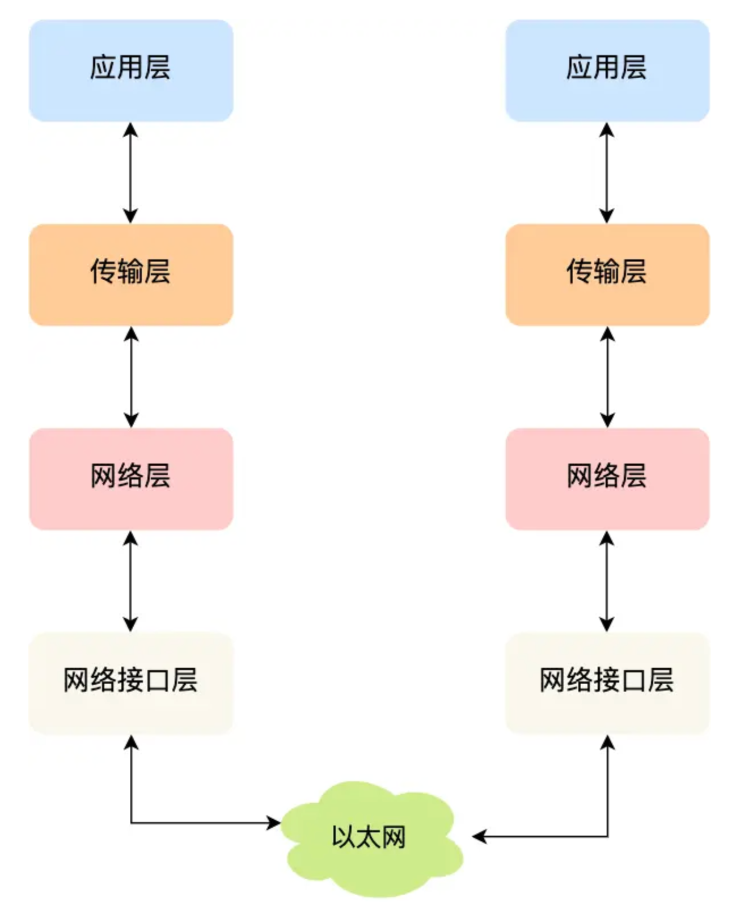

网络接口层的传输单位是帧（frame），IP 层的传输单位是包（packet），TCP 层的传输单位是段（segment），HTTP 的传输单位则是消息或报文（message）。但这些名词并没有什么本质的区分，可以统称为数据包。

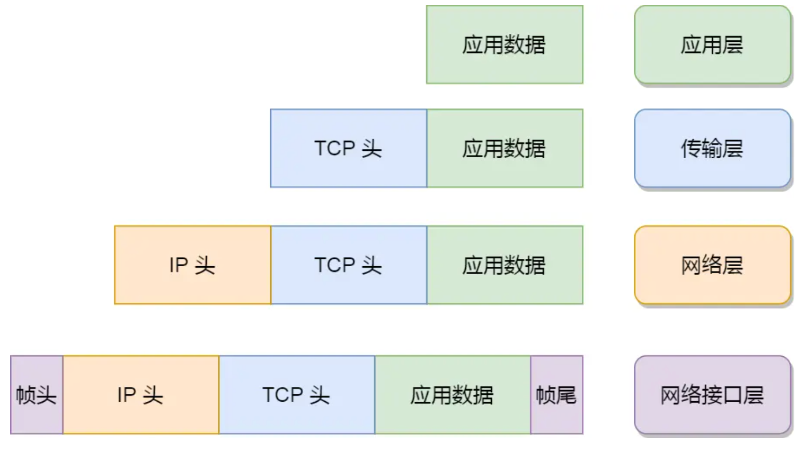

### 2.1 应用层

- 应⽤层只需要专注于为⽤户提供应⽤功能，不⽤去关⼼数据是如何传输的。
- 应用层交互的数据单元称为**报文**。
- 应⽤层是⼯作在操作系统中的⽤户态，传输层及以下则⼯作在内核态。
- **协议: 支持万维网应用的HTTP协议，支持电子邮件的SMTP协议, DNS**
>域名系统
>是因特网的一项核心服务，它是一个可以将域名与IP地址相互映射的分布式数据库，能够使人更方便的访问互联网，而不用记住能够被机器直接读取恶的IP数串。

>HTTP协议
>超文本传输协议是互联网上应用最为广泛的一种网络协议，所有的www文件都必须遵守这个标准，设置HTTP最初的目的是为了提供一种发布和接收HTML页面的方法。

### 2.2 传输层

**主要任务是负责向两台主机进程之间的通信提供通用的数据传输服务。** 应用进程利用该服务传输**应用层报文**。

运输层主要使用以下两种协议：

- **传输控制协议(TCP)**：**提供面向连接的，可靠的数据传输服务**。

> TCP 的全称叫传输控制协议（*Transmission Control Protocol*），大部分应用使用的正是 TCP 传输层协议，比如 HTTP 应用层协议。TCP 相比 UDP 多了很多特性，比如流量控制、超时重传、拥塞控制等，这些都是为了保证数据包能可靠地传输给对方。

- **用户数据协议(UDP):** 提供无连接的，尽最大努力的数据传输服务(不保证数据传输的可靠性。

> UDP 相对来说就很简单，简单到只负责发送数据包，不保证数据包是否能抵达对方，但它实时性相对更好，传输效率也高。当然，UDP 也可以实现可靠传输，把 TCP 的特性在应用层上实现就可以，不过要实现一个商用的可靠 UDP 传输协议，也不是一件简单的事情

**由于传输层的报⽂中会携带端⼝号，因此接收⽅可以识别出该报⽂是发送给哪个应⽤**。

> [!NOTE]
>
> 应用需要传输的数据可能会非常大，如果直接传输就不好控制，因此当传输层的数据包大小超过 MSS（TCP 最大报文段长度） ，就要将数据包分块，这样即使中途有一个分块丢失或损坏了，只需要重新发送这一个分块，而不用重新发送整个数据包。在 TCP 协议中，我们把每个分块称为一个 **TCP 段**（*TCP Segment*）。
>
> 当设备作为接收方时，传输层则要负责把数据包传给应用，但是一台设备上可能会有很多应用在接收或者传输数据，因此需要用一个编号将应用区分开来，这个编号就是**端口**。
>
> 比如 80 端口通常是 Web 服务器用的，22 端口通常是远程登录服务器用的。而对于浏览器（客户端）中的每个标签栏都是一个独立的进程，操作系统会为这些进程分配临时的端口号。

### 2.3 网络层

- **网络层的任务是选择合适的网间路由和交换结点，确保数据及时传送。**
- ⽹络层负责将数据从⼀个设备传输到另⼀个设备。我们⼀般⽤ IP 地址给设备进⾏编号，因此，需要将 IP 地址分成两种意义：⼀个是⽹络号，负责标识该 IP 地址是属于哪个⼦⽹的； ⼀个是主机号，负责标识同⼀⼦⽹下的不同主机；
- 在TCP/IP体系机构中，由于网络层使用IP协议，因此分组也叫IP数据报。
- IP协议**：**IP 协议的寻址作用是告诉我们去往下一个目的地该朝哪个方向走，路由则是根据「下一个目的地」选择路径。寻址更像在导航，路由更像在操作方向盘。

> [!NOTE]
>
> IP 协议会将传输层的报文作为数据部分，再加上 IP 包头组装成 IP 报文，如果 IP 报文大小超过 MTU（以太网中一般为 1500 字节）就会**再次进行分片**，得到一个即将发送到网络的 IP 报文。
>
> 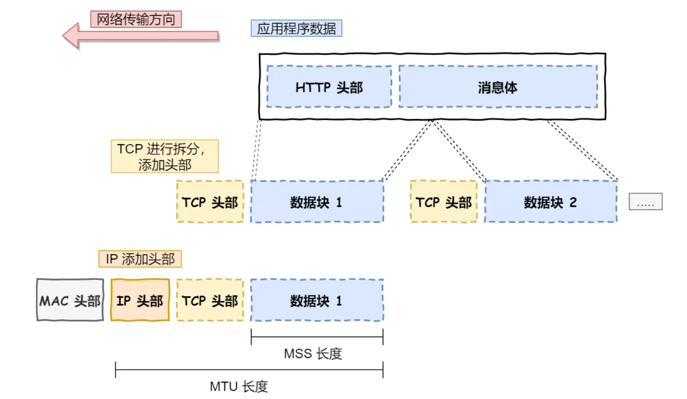
>
> 网络层负责将数据从一个设备传输到另一个设备，世界上那么多设备，又该如何找到对方呢？因此，网络层需要有区分设备的编号。
>
> 我们一般用 IP 地址给设备进行编号，对于 IPv4 协议， IP 地址共 32 位，分成了四段（比如，192.168.100.1），每段是 8 位。只有一个单纯的 IP 地址虽然做到了区分设备，但是寻址起来就特别麻烦，全世界那么多台设备，难道一个一个去匹配？这显然不科学。
>
> 因此，需要将 IP 地址分成两种意义：
>
> - 一个是**网络号**，负责标识该 IP 地址是属于哪个「子网」的；
> - 一个是**主机号**，负责标识同一「子网」下的不同主机；
>
> 怎么分的呢？这需要配合**子网掩码**才能算出 IP 地址 的网络号和主机号。
>
> 举个例子，比如 10.100.122.0/24，后面的`/24`表示就是 `255.255.255.0` 子网掩码，255.255.255.0 二进制是「11111111-11111111-11111111-00000000」，大家数数一共多少个1？不用数了，是 24 个1，为了简化子网掩码的表示，用/24代替255.255.255.0。
>
> 知道了子网掩码，该怎么计算出网络地址和主机地址呢？
>
> - 将 10.100.122.2 和 255.255.255.0 进行**按位与运算**，就可以得到网络号
>
> - 将 255.255.255.0 取反后与IP地址进行进行**按位与运算**，就可以得到主机号。
>
> 那么在寻址的过程中，先匹配到相同的网络号（表示要找到同一个子网），才会去找对应的主机。
>
> 除了寻址能力， IP 协议还有另一个重要的能力就是**路由**。实际场景中，两台设备并不是用一条网线连接起来的，而是通过很多网关、路由器、交换机等众多网络设备连接起来的，那么就会形成很多条网络的路径，因此当数据包到达一个网络节点，就需要通过路由算法决定下一步走哪条路径。
>
> 路由器寻址工作中，就是要找到目标地址的子网，找到后进而把数据包转发给对应的网络内。
>
> 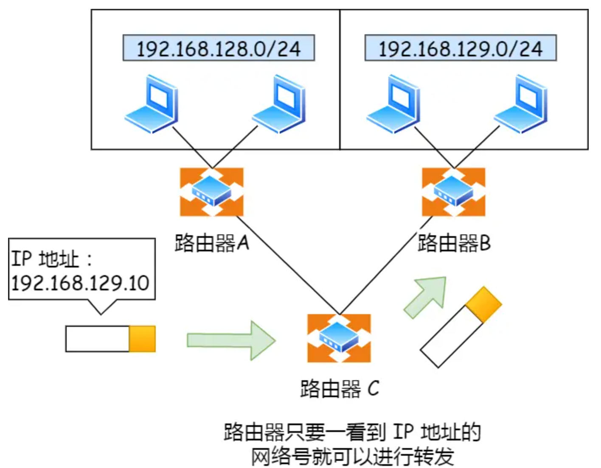

### 2.4 网络接口层
- 生成了 IP 头部之后，接下来要交给**网络接口层**（*Link Layer*）在 IP 头部的前面加上 MAC 头部，并封装成数据帧（Data frame）发送到网络上。
- 网络接口层主要为网络层提供「链路级别」传输的服务，负责在以太网、WiFi 这样的底层网络上发送原始数据包，工作在网卡这个层次，使用 MAC 地址来标识网络上的设备。
- MAC 头部是以太网使用的头部，它包含了接收方和发送方的 MAC 地址等信息，我们可以通过 ARP 协议获取对方的 MAC 地址。

> [!NOTE]
>
> **以太网**
>
> 什么是以太网呢？电脑上的以太网接口，Wi-Fi接口，以太网交换机、路由器上的千兆，万兆以太网口，还有网线，它们都是以太网的组成部分。以太网就是一种在「局域网」内，把附近的设备连接起来，使它们之间可以进行通讯的技术。
>
> 以太网在判断网络包目的地时和 IP 的方式不同，因此必须采用相匹配的方式才能在以太网中将包发往目的地，而 MAC 头部就是干这个用的，所以，在以太网进行通讯要用到 MAC 地址。
>
> **数据链路层**
>
> - 每⼀台设备的⽹卡都会有⼀个 MAC 地址，它就是⽤来唯⼀标识设备的。路由器计算出了下⼀个⽬的地 IP 地址，再 通过 ARP 协议找到该⽬的地的 MAC 地址，这样就知道这个 IP 地址是哪个设备的了。
> - 物理寻址，同时将原始比特流转变为逻辑传输线路。
> - **MAC地址**
>
> **物理层**
>
> - 当数据准备要从设备发送到⽹络时，需要把数据包转换成电信号，让其可以在物理介质中传输，这⼀层就是物理层 （Physical Layer），它主要是为数据链路层提供⼆进制传输的服务。
> - 物理层的作用是实现相邻计算机节点之间比特流透明传送，尽可能屏蔽掉具体传输介质和物理设备的差异。

# TCP（传输层）

## TCP基本概念

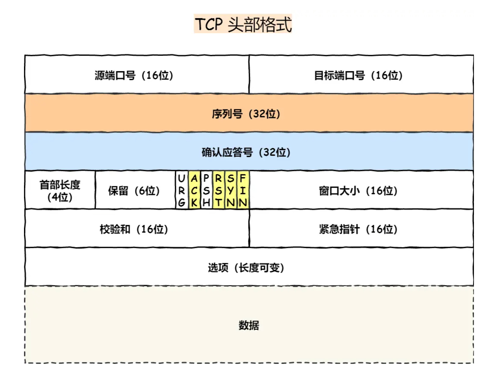

### TCP头格式

- 序列号：在建⽴连接时由计算机⽣成的随机数作为其初始值，通过 SYN 包传给接收端主机，每发送⼀次数据，就 「累加」⼀次该「数据字节数」的⼤⼩。⽤来解决⽹络包乱序问题.
- 确认应答号：指下⼀次「期望」收到的数据的序列号，发送端收到这个确认应答以后可以认为在这个序号以前的数据都已经被正常接收。⽤来解决不丢包的问题。
- 控制位：
  - ACK：该位为 1 时，「确认应答」的字段变为有效，TCP 规定除了最初建⽴连接时的 SYN 包之外该位必 须设置为 1 。
  - RST：该位为 1 时，表示 TCP 连接中出现异常必须强制断开连接。
  - SYN：该位为 1 时，表示希望建⽴连接，并在其「序列号」的字段进⾏序列号初始值的设定。
  - FIN：该位为 1 时，表示今后不会再有数据发送，希望断开连接。当通信结束希望断开连接时，通信双⽅的 主机之间就可以相互交换 FIN 位为 1 的 TCP 段。

### 为什么需要TCP？TCP工作在哪一层？

- IP 层是「不可靠」的，它不保证⽹络包的交付、不保证⽹络包的按序交付、也不保证⽹络包中的数据的完整性。
- 如果需要保障⽹络数据包的可靠性，那么就需要由上层（传输层）的 TCP 协议来负责。
- 因为 TCP 是⼀个⼯作在传输层的可靠数据传输的服务，它能确保接收端接收的⽹络包是⽆损坏、⽆间隔、⾮冗余 和按序的

### 什么是 TCP ？

- TCP 是⾯向连接的、可靠的、基于字节流的传输层通信协议。
  - ⾯向连接：⼀定是「⼀对⼀」才能连接，不能像 UDP 协议可以⼀个主机同时向多个主机发送消息，也就是⼀ 对多是⽆法做到的；
  - 可靠的：⽆论的⽹络链路中出现了怎样的链路变化，TCP 都可以保证⼀个报⽂⼀定能够到达接收端；
  - 字节流：用户消息通过 TCP 协议传输时，消息可能会被操作系统「分组」成多个的 TCP 报文，如果接收方的程序如果不知道「消息的边界」，是无法读出一个有效的用户消息的。并且 TCP 报文是「有序的」，当「前一个」TCP 报文没有收到的时候，即使它先收到了后面的 TCP 报文，那么也不能扔给应用层去处理，同时对「重复」的 TCP 报文会自动丢弃。

### 什么是TCP连接？

简单来说就是，⽤于保证可靠性和流量控制维护的某些状态信息，这些信息的组合，包括Socket、序列号和窗⼝ ⼤⼩称为连接。所以我们可以知道，建⽴⼀个 TCP 连接是需要客户端与服务器端达成上述三个信息的共识。

- **Socket**：由 IP 地址和端⼝号组成
- **序列号**：⽤来解决乱序问题等
- **窗⼝⼤⼩**：⽤来做流量控制

### 如何唯⼀确定⼀个 TCP 连接呢？

- **源地址**和**⽬的地址**的字段（32位）是在 IP 头部中，作⽤是通过 IP 协议发送报⽂给对⽅主机。
- **源端⼝**和**⽬的端⼝**的字段（16位）是在 TCP 头部中，作⽤是告诉 TCP 协议应该把报⽂发给哪个进程。

**有⼀个 IP 的服务器监听了⼀个端⼝，它的 TCP 的最⼤连接数是多少？**

最大TCP连接数=客户端的IP数*客户端的端口数

> [!NOTE]
>
> 对 IPv4，客户端的 IP 数最多为 2 的 32 次⽅，客户端的端⼝数最多为 2 的 16 次⽅，也就是服务端单机最 ⼤ TCP 连接数，约为 2 的 48 次⽅。
>
> 当然，服务端最大并发 TCP 连接数远不能达到理论上限，会受以下因素影响：
>
> - 文件描述符限制
>
>   ，每个 TCP 连接都是一个文件，如果文件描述符被占满了，会发生 Too many open files。Linux 对可打开的文件描述符的数量分别作了三个方面的限制：
>
>   - **系统级**：当前系统可打开的最大数量，通过 `cat /proc/sys/fs/file-max` 查看；
>   - **用户级**：指定用户可打开的最大数量，通过 `cat /etc/security/limits.conf` 查看；
>   - **进程级**：单个进程可打开的最大数量，通过 `cat /proc/sys/fs/nr_open` 查看；
>
> - **内存限制**，每个 TCP 连接都要占用一定内存，操作系统的内存是有限的，如果内存资源被占满后，会发生 OOM。

### 如何理解是 TCP 面向字节流协议？

> TCP 是面向字节流的协议，UDP 是面向报文的协议？这里的「面向字节流」和「面向报文」该如何理解。

- 之所以会说 TCP 是面向字节流的协议，UDP 是面向报文的协议，是因为操作系统对 TCP 和 UDP 协议的**发送方的机制不同**，也就是问题原因在发送方
- **为什么 UDP 是面向报文的协议？**
  - 当用户消息通过 UDP 协议传输时，**操作系统不会对消息进行拆分**，在组装好 UDP 头部后就交给网络层来处理，所以发出去的 UDP 报文中的数据部分就是完整的用户消息，也就是**每个 UDP 报文就是一个用户消息的边界**，这样接收方在接收到 UDP 报文后，读一个 UDP 报文就能读取到完整的用户消息。
  - 操作系统在收到 UDP 报文后，会将其插入到队列里，**队列里的每一个元素就是一个 UDP 报文**，这样当用户调用 recvfrom() 系统调用读数据的时候，就会从队列里取出一个数据，然后从内核里拷贝给用户缓冲区。
- **为什么 TCP 是面向字节流的协议？**
  - 当用户消息通过 TCP 协议传输时，**消息可能会被操作系统分组成多个的 TCP 报文**，也就是一个完整的用户消息被拆分成多个 TCP 报文进行传输。
  - 这时，接收方的程序如果不知道发送方发送的消息的长度，也就是不知道消息的边界时，是无法读出一个有效的用户消息的，因为用户消息被拆分成多个 TCP 报文后，并不能像 UDP 那样，一个 UDP 报文就能代表一个完整的用户消息。


## TCP三次握手与四次挥手

### 三次握手

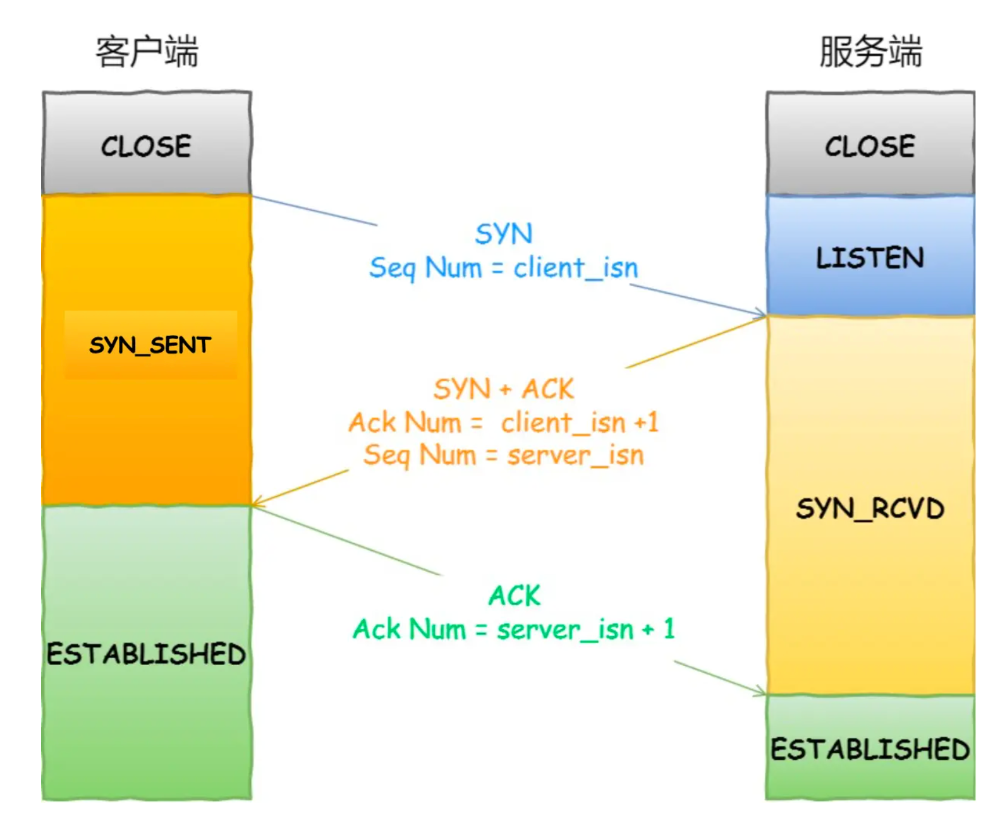

- 一开始，客户端和服务端都处于 `CLOSE` 状态。先是服务端主动监听某个端口，处于 `LISTEN` 状态

- 客户端发送带有SYN标志的数据包，同时含有客户端生成的随机初始化序号。

  > 客户端会随机初始化序号（ client_isn ），将此序号置于 TCP ⾸部的「序号」字段中，同时把 SYN 标志 位置为 1 ，表示 SYN 报⽂。接着把第⼀个 SYN 报⽂发送给服务端，表示向服务端发起连接，该报⽂不包含应⽤层数据，之后客户端处于 SYN-SENT 状态。
  >
  > 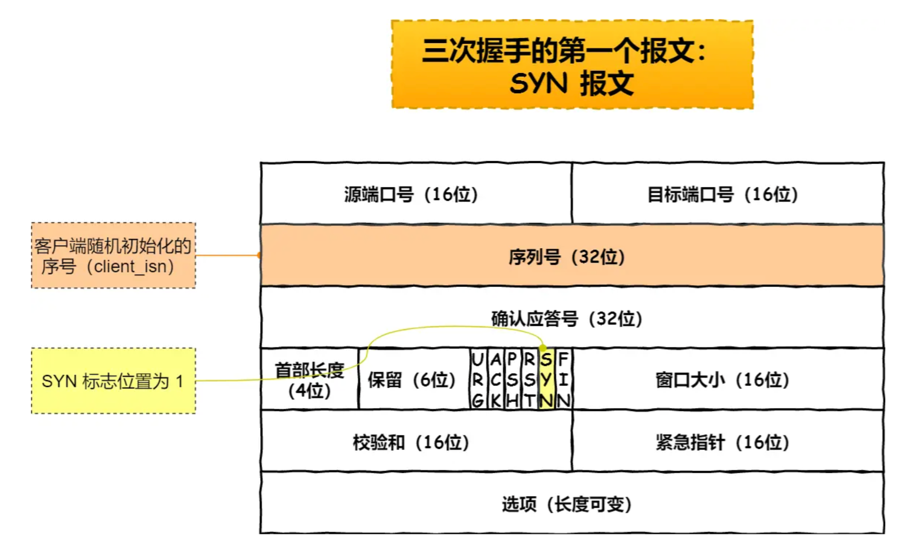

- 服务端发送带有SYN=1，ACK=1 标志的数据包。

  > 服务端收到客户端的 SYN 报⽂后，⾸先服务端也随机初始化⾃⼰的序号（ server_isn ），将此序号填⼊TCP ⾸部的「序号」字段中，其次把  client_isn + 1填⼊TCP ⾸部的「确认应答号」字段 , 接着把 SYN 和 ACK 标志位置为 1 。最后把该报⽂发给客户端，该报⽂也不包含应⽤层数据，之后服务端处于 SYN-RCVD 状态。
  >
  > 

- 客户端发送带有ACK=1标志的数据包

  > 客户端收到服务端报⽂后，还要向服务端回应最后⼀个应答报⽂，⾸先该应答报⽂ TCP ⾸部 ACK 标志位 置为 1 ，其次「确认应答号」字段填⼊ server_isn + 1 ，最后把报⽂发送给服务端，这次报⽂可以携带客户到服务器的数据，之后客户端处于 ESTABLISHED 状态。
  >
  > 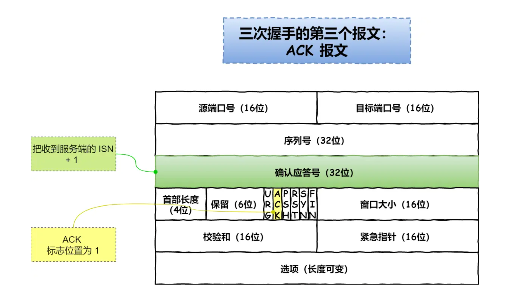

- 服务器收到客户端的应答报⽂后，也进⼊ ESTABLISHED 状态。

从上面的过程可以发现**第三次握手是可以携带数据的，前两次握手是不可以携带数据的**

一旦完成三次握手，双方都处于 `ESTABLISHED` 状态，此时连接就已建立完成，客户端和服务端就可以相互发送数据了。

#### 为什么是三次握手？不是两次、四次？
1. **原因⼀：为了防⽌旧的重复连接初始化造成混乱。**
   - 客户端连续发送多次 SYN 建⽴连接的报⽂，在⽹络拥堵情况下：
     - ⼀个「旧 SYN 报⽂」⽐「最新的 SYN 」 报⽂早到达了服务端；
     - 那么此时服务端就会回⼀个 SYN + ACK 报⽂给客户端；
     - 客户端收到后可以根据⾃身的上下⽂，判断这是⼀个历史连接（序列号过期或超时），那么客户端就会发送 RST 报⽂给服务端，表示中⽌这⼀次连接。
     
   - 如果采用两次握手建立 TCP 连接的场景下，服务端在向客户端发送数据前，并没有阻止掉历史连接，导致服务端建立了一个历史
     
     连接，又白白发送了数据，妥妥地浪费了服务端的资源。
     
     - 如果是历史连接（序列号过期或超时），则第三次握⼿发送的报⽂是 RST 报⽂，以此中⽌历史连接；
     
     - 如果不是历史连接，则第三次发送的报⽂是 ACK 报⽂，通信双⽅就会成功建⽴连接；
     
     - **在两次握手的情况下，服务端在收到 SYN 报文后，就进入 ESTABLISHED 状态，意味着这时可以给对方发送数据，但是客户** 
     
       **端此时还没有进入 ESTABLISHED 状态**，假设这次是历史连接，客户端判断到此次连接为历史连接，那么就会回 RST 报文来
     
       断开连接，而服务端在第一次握手的时候就进入 ESTABLISHED 状态，所以它可以发送数据的，但是它并不知道这个是历史
     
       连接，它只有在收到 RST 报文后，才会断开连接。
   
   > [!NOTE]
   >
   > 有人问：客户端发送三次握手（ack 报文）后就可以发送数据了，而被动方此时还是 syn_received 状态，如果 ack 丢了，那客户端发的数据是不是也白白浪费了？
   >
   > 不是的，即使服务端还是在 syn_received 状态，收到了客户端发送的数据，还是可以建立连接的，并且还可以正常收到这个数据包。这是因为数据报文中是有 ack 标识位，也有确认号，这个确认号就是确认收到了第二次握手。如下图：
   >
   > 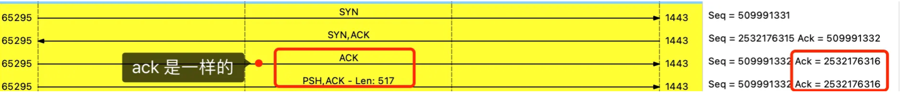
   >
   > 所以，服务端收到这个数据报文，是可以正常建立连接的，然后就可以正常接收这个数据包了。
   
   
   
2. **原因⼆：同步双⽅初始序列号**
   - TCP 协议的通信双⽅， 都必须维护⼀个「序列号」， 序列号是可靠传输的⼀个关键因素。
   - ⽽两次握⼿只保证了⼀⽅的初始序列号能被对⽅成功接收，没办法保证双⽅的初始序列号都能被确认接收。
   
3. **原因三：避免资源浪费**
   - 如果只有「两次握⼿」，当客户端的 SYN 请求连接在⽹络中阻塞，客户端没有接收到 ACK 报⽂，就会重新发送 SYN ，由于没有第三次握⼿，服务器不清楚客户端是否收到了⾃⼰发送的建⽴连接的 ACK 确认信号，所以每收到⼀个 SYN 就只能先主动建⽴⼀个连接。
   - 如果客户端的 SYN 阻塞了，重复发送多次 SYN 报⽂，那么服务器在收到请求后就会建⽴多个冗余的⽆效链 接，造成不必要的资源浪费。

总结

TCP 建立连接时，通过三次握手**能防止历史连接的建立，能减少双方不必要的资源开销，能帮助双方同步初始化序列号**。序列号能够保证数据包不重复、不丢弃和按序传输。

不使用「两次握手」和「四次握手」的原因：

- 「两次握手」：无法防止历史连接的建立，会造成双方资源的浪费，也无法可靠的同步双方序列号；
- 「四次握手」：三次握手就已经理论上最少可靠连接建立，所以不需要使用更多的通信次数。

#### 为什么每次建立 TCP 连接时，初始化的序列号都要求不一样呢？

主要原因有两个方面：

- **为了防止历史报文被下一个相同四元组的连接接收（主要方面）；**
- **为了安全性，防止黑客伪造的相同序列号的 TCP 报文被对方接收；**

假设每次建立连接，客户端和服务端的初始化序列号都是从 0 开始：

- 客户端和服务端建立一个 TCP 连接，在客户端发送数据包被网络阻塞了，然后超时重传了这个数据包，而此时服务端设备断电重启了，之前与客户端建立的连接就消失了，于是在收到客户端的数据包的时候就会发送 RST 报文。
- 紧接着，客户端又与服务端建立了与上一个连接相同四元组的连接；
- 在新连接建立完成后，上一个连接中被网络阻塞的数据包正好抵达了服务端，刚好该数据包的序列号正好是在服务端的接收窗口内，所以该数据包会被服务端正常接收，就会造成数据错乱。

可以看到，**如果每次建立连接，客户端和服务端的初始化序列号都是一样的话，很容易出现历史报文被下一个相同四元组的连接接收的问**

**题**。如果每次建立连接客户端和服务端的初始化序列号都「不一样」，就有大概率因为历史报文的序列号「不在」对方接收窗口，从而很

大程度上避免了历史报文。

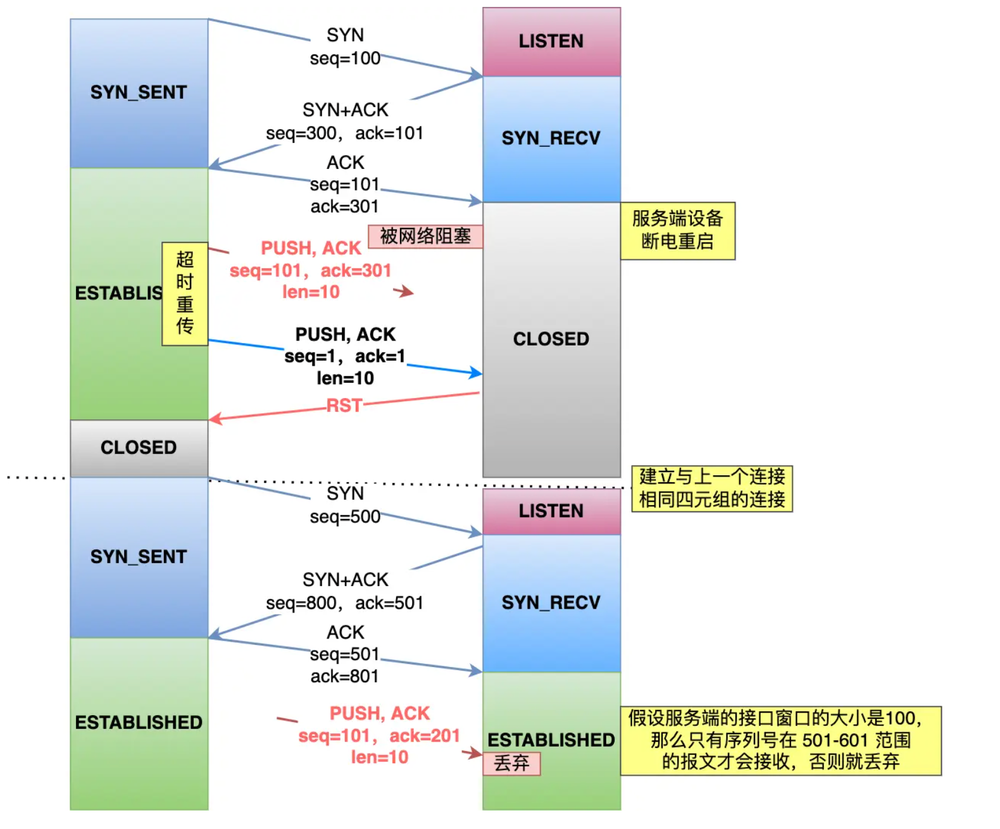

相反，如果每次建立连接客户端和服务端的初始化序列号都「一样」，就有大概率遇到历史报文的序列号刚

「好在」对方的接收窗口内，从而导致历史报文被新连接成功接收。

所以，每次初始化序列号不一样很大程度上能够避免历史报文被下一个相同四元组的连接接收，注意是很大程度上，并不是完全避免了

( 因为序列号会有回绕的问题，所以需要用时间戳的机制来判断历史报文。）

#### 初始序列号 ISN 是如何随机产生的？

起始 `ISN` 是基于时钟的，每 4 微秒 + 1，转一圈要 4.55 个小时。

RFC793 提到初始化序列号 ISN 随机生成算法：ISN = M + F(localhost, localport, remotehost, remoteport)。

- `M` 是一个计时器，这个计时器每隔 4 微秒加 1。
- `F` 是一个 Hash 算法，根据源 IP、目的 IP、源端口、目的端口生成一个随机数值。要保证 Hash 算法不能被外部轻易推算得出，用 MD5 算法是一个比较好的选择。

可以看到，随机数是会基于时钟计时器递增的，基本不可能会随机成一样的初始化序列号。

#### 第一次握手丢失了，会发生什么？

当客户端想和服务端建立 TCP 连接的时候，首先第一个发的就是 SYN 报文，然后进入到 `SYN_SENT` 状态。

**在这之后，如果客户端迟迟收不到服务端的 SYN-ACK 报文（第二次握手），就会触发「超时重传」机制，重传 SYN 报文，而且重传的 SYN 报文的序列号都是一样的。**

不同版本的操作系统可能超时时间不同，有的 1 秒的，也有 3 秒的，这个超时时间是写死在内核里的，如果想要更改则需要重新编译内核，比较麻烦。

当客户端在 1 秒后没收到服务端的 SYN-ACK 报文后，客户端就会重发 SYN 报文，那到底重发几次呢？

在 Linux 里，客户端的 SYN 报文最大重传次数由 `tcp_syn_retries`内核参数控制，这个参数是可以自定义的，默认值一般是 5。

通常，第一次超时重传是在 1 秒后，第二次超时重传是在 2 秒，第三次超时重传是在 4 秒后，第四次超时重传是在 8 秒后，第五次是在超时重传 16 秒后。没错，**每次超时的时间是上一次的 2 倍**。

当第五次超时重传后，会继续等待 32 秒，如果服务端仍然没有回应 ACK，客户端就不再发送 SYN 包，然后断开 TCP 连接。

所以，总耗时是 1+2+4+8+16+32=63 秒，大约 1 分钟左右。

举个例子，假设 tcp_syn_retries 参数值为 3，那么当客户端的 SYN 报文一直在网络中丢失时，具体过程：

- 当客户端超时重传 3 次 SYN 报文后，由于 tcp_syn_retries 为 3，已达到最大重传次数，于是再等待一段时间（时间为上一次超时时间的 2 倍），如果还是没能收到服务端的第二次握手（SYN-ACK 报文），那么客户端就会断开连接。

#### 第二次握手丢失了，会发生什么？

当服务端收到客户端的第一次握手后，就会回 SYN-ACK 报文给客户端，这个就是第二次握手，此时服务端会进入 `SYN_RCVD` 状态。

第二次握手的 `SYN-ACK` 报文其实有两个目的 ：

- 第二次握手里的 ACK， 是对第一次握手的确认报文；
- 第二次握手里的 SYN，是服务端发起建立 TCP 连接的报文；

所以，如果第二次握手丢了，就会发生比较有意思的事情，具体会怎么样呢？

**因为第二次握手报文里是包含对客户端的第一次握手的 ACK 确认报文，所以，如果客户端迟迟没有收到第二次握手，那么客户端就觉得可能自己的 SYN 报文（第一次握手）丢失了，于是客户端就会触发超时重传机制，重传 SYN 报文。**

然后，因为第二次握手中包含服务端的 SYN 报文，所以当客户端收到后，需要给服务端发送 ACK 确认报文（第三次握手），服务端才会认为该 SYN 报文被客户端收到了。

**那么，如果第二次握手丢失了，服务端就收不到第三次握手，于是服务端这边会触发超时重传机制，重传 SYN-ACK 报文**

在 Linux 下，SYN-ACK 报文的最大重传次数由 `tcp_synack_retries`内核参数决定，默认值是 5。

```
# cat /proc/sys/net/ipv4/tcp_synack_retries
5
```

因此，当第二次握手丢失了，客户端和服务端都会重传：

- 客户端会重传 SYN 报文，也就是第一次握手，最大重传次数由 `tcp_syn_retries`内核参数决定；
- 服务端会重传 SYN-ACK 报文，也就是第二次握手，最大重传次数由 `tcp_synack_retries` 内核参数决定。

举个例子，假设 tcp_syn_retries 参数值为 1，tcp_synack_retries 参数值为 2，那么当第二次握手一直丢失时,具体过程：

- 当客户端超时重传 1 次 SYN 报文后，由于 tcp_syn_retries 为 1，已达到最大重传次数，于是再等待一段时间（时间为上一次超时时间的 2 倍），如果还是没能收到服务端的第二次握手（SYN-ACK 报文），那么客户端就会断开连接。
- 当服务端超时重传 2 次 SYN-ACK 报文后，由于 tcp_synack_retries 为 2，已达到最大重传次数，于是再等待一段时间（时间为上一次超时时间的 2 倍），如果还是没能收到客户端的第三次握手（ACK 报文），那么服务端就会断开连接。

####  第三次握手丢失了，会发生什么？

客户端收到服务端的 SYN-ACK 报文后，就会给服务端回一个 ACK 报文，也就是第三次握手，此时客户端状态进入到 `ESTABLISH` 状态。

因为这个第三次握手的 ACK 是对第二次握手的 SYN 的确认报文，**所以当第三次握手丢失了，如果服务端那一方迟迟收不到这个确认报文，就会触发超时重传机制，重传 SYN-ACK 报文，直到收到第三次握手，或者达到最大重传次数。**

注意，**ACK 报文是不会有重传的，当 ACK 丢失了，就由对方重传对应的报文**。

举个例子，假设 tcp_synack_retries 参数值为 2，那么当第三次握手一直丢失时，具体过程：

- 当服务端超时重传 2 次 SYN-ACK 报文后，由于 tcp_synack_retries 为 2，已达到最大重传次数，于是再等待一段时间（时间为上一次超时时间的 2 倍），如果还是没能收到客户端的第三次握手（ACK 报文），那么服务端就会断开连接。

#### 既然 IP 层会分片，为什么 TCP 层还需要 MSS 呢？

我们先来认识下 MTU 和 MSS

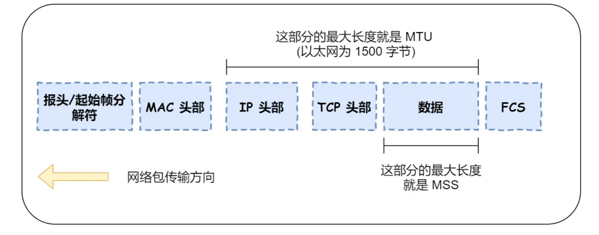

- `MTU`：一个网络包的最大长度，以太网中一般为 `1500` 字节；
- `MSS`：除去 IP 和 TCP 头部之后，一个网络包所能容纳的 TCP 数据的最大长度；

如果在 TCP 的整个报文（头部 + 数据）交给 IP 层进行分片，会有什么异常呢？

当 IP 层有一个超过 `MTU` 大小的数据（TCP 头部 + TCP 数据）要发送，那么 IP 层就要进行分片，把数据分片成若干片，保证每一个分片都小于 MTU。把一份 IP 数据报进行分片以后，由目标主机的 IP 层来进行重新组装后，再交给上一层 TCP 传输层。

这看起来井然有序，但这存在隐患的，**那么当如果一个 IP 分片丢失，整个 IP 报文的所有分片都得重传**。

因为 IP 层本身没有超时重传机制，它由传输层的 TCP 来负责超时和重传。

当某一个 IP 分片丢失后，接收方的 IP 层就无法组装成一个完整的 TCP 报文（头部 + 数据），也就无法将数据报文送到 TCP 层，所以接收方不会响应 ACK 给发送方，因为发送方迟迟收不到 ACK 确认报文，所以会触发超时重传，就会重发「整个 TCP 报文（头部 + 数据）」。

因此，可以得知由 IP 层进行分片传输，是非常没有效率的。

所以，为了达到最佳的传输效能 TCP 协议在**建立连接的时候通常要协商双方的 MSS 值**，当 TCP 层发现数据超过 MSS 时，则就先会进行分片，当然由它形成的 IP 包的长度也就不会大于 MTU ，自然也就不用 IP 分片了。

经过 TCP 层分片后，如果一个 TCP 分片丢失后，**进行重发时也是以 MSS 为单位**，而不用重传所有的分片，大大增加了重传的效率。

#### 什么是 SYN 攻击？如何避免 SYN 攻击？

我们都知道 TCP 连接建立是需要三次握手，假设攻击者短时间伪造不同 IP 地址的 `SYN` 报文，服务端每接收到一个 `SYN` 报文，就进入`SYN_RCVD` 状态，但服务端发送出去的 `ACK + SYN` 报文，无法得到未知 IP 主机的 `ACK` 应答，久而久之就会**占满服务端的半连接队列**，使得服务端不能为正常用户服务。

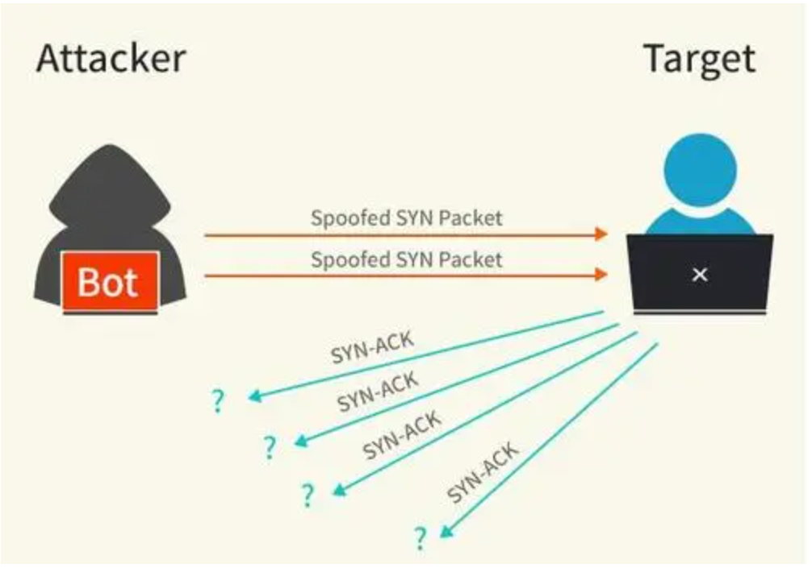

什么是 TCP 半连接和全连接队列。

在 TCP 三次握手的时候，Linux 内核会维护两个队列，分别是：

- 半连接队列，也称 SYN 队列；
- 全连接队列，也称 accept 队列；

我们先来看下 Linux 内核的 `SYN` 队列（半连接队列）与 `Accpet` 队列（全连接队列）是如何工作的？

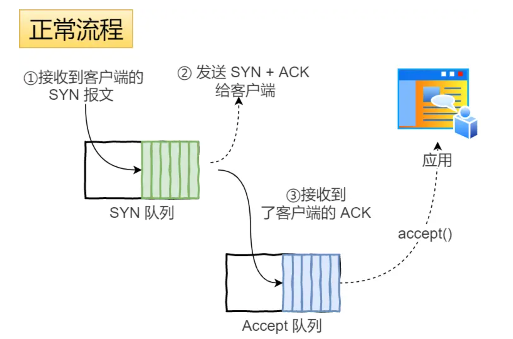

正常流程：

- 当服务端接收到客户端的 SYN 报文时，会创建一个半连接的对象，然后将其加入到内核的「 SYN 队列」；
- 接着发送 SYN + ACK 给客户端，等待客户端回应 ACK 报文；
- 服务端接收到 ACK 报文后，从「 SYN 队列」取出一个半连接对象，然后创建一个新的连接对象放入到「 Accept 队列」；
- 应用通过调用 `accpet()` socket 接口，从「 Accept 队列」取出连接对象。

不管是半连接队列还是全连接队列，都有最大长度限制，超过限制时，默认情况都会丢弃报文。

SYN 攻击方式最直接的表现就会把 TCP 半连接队列打满，这样**当 TCP 半连接队列满了，后续再在收到 SYN 报文就会丢弃**，导致客户端无法和服务端建立连接。

避免 SYN 攻击方式，可以有以下四种方法：

- **调大 netdev_max_backlog；**

> 当网卡接收数据包的速度大于内核处理的速度时，会有一个队列保存这些数据包。控制该队列的最大值如下参数，默认值是 1000，我们要适当调大该参数的值，比如设置为 10000：

- **增大 TCP 半连接队列；**

> 增大 TCP 半连接队列，要同时增大下面这三个参数：
>
> - 增大 net.ipv4.tcp_max_syn_backlog
> - 增大 listen() 函数中的 backlog
> - 增大 net.core.somaxconn

- **开启 tcp_syncookies；**

> 开启 syncookies 功能就可以在不使用 SYN 半连接队列的情况下成功建立连接，相当于绕过了 SYN 半连接来建立连接。
>
> 具体过程：
>
> - 当 「 SYN 队列」满之后，后续服务端收到 SYN 包，不会丢弃，而是根据算法，计算出一个 `cookie` 值；
> - 将 cookie 值放到第二次握手报文的「序列号」里，然后服务端回第二次握手给客户端；
> - 服务端接收到客户端的应答报文时，服务端会检查这个 ACK 包的合法性。如果合法，将该连接对象放入到「 Accept 队列」。
> - 最后应用程序通过调用 `accpet()` 接口，从「 Accept 队列」取出的连接。
>
> 可以看到，当开启了 tcp_syncookies 了，即使受到 SYN 攻击而导致 SYN 队列满时，也能保证正常的连接成功建立。
>
> net.ipv4.tcp_syncookies 参数主要有以下三个值：
>
> - 0 值，表示关闭该功能；
> - 1 值，表示仅当 SYN 半连接队列放不下时，再启用它；
> - 2 值，表示无条件开启功能
>
> 那么在应对 SYN 攻击时，只需要设置为 1 即可。

- **减少 SYN+ACK 重传次数**

> 当服务端受到 SYN 攻击时，就会有大量处于 SYN_REVC 状态的 TCP 连接，处于这个状态的 TCP 会重传 SYN+ACK ，当重传超过次数达到上限后，就会断开连接。
>
> 那么针对 SYN 攻击的场景，我们可以减少 SYN-ACK 的重传次数，以加快处于 SYN_REVC 状态的 TCP 连接断开。
>
> SYN-ACK 报文的最大重传次数由 `tcp_synack_retries`内核参数决定（默认值是 5 次），比如将 tcp_synack_retries 减少到 2 次：

### 四次挥手

双方都可以主动断开连接，断开连接后主机中的「资源」将被释放，四次挥手的过程如下图：

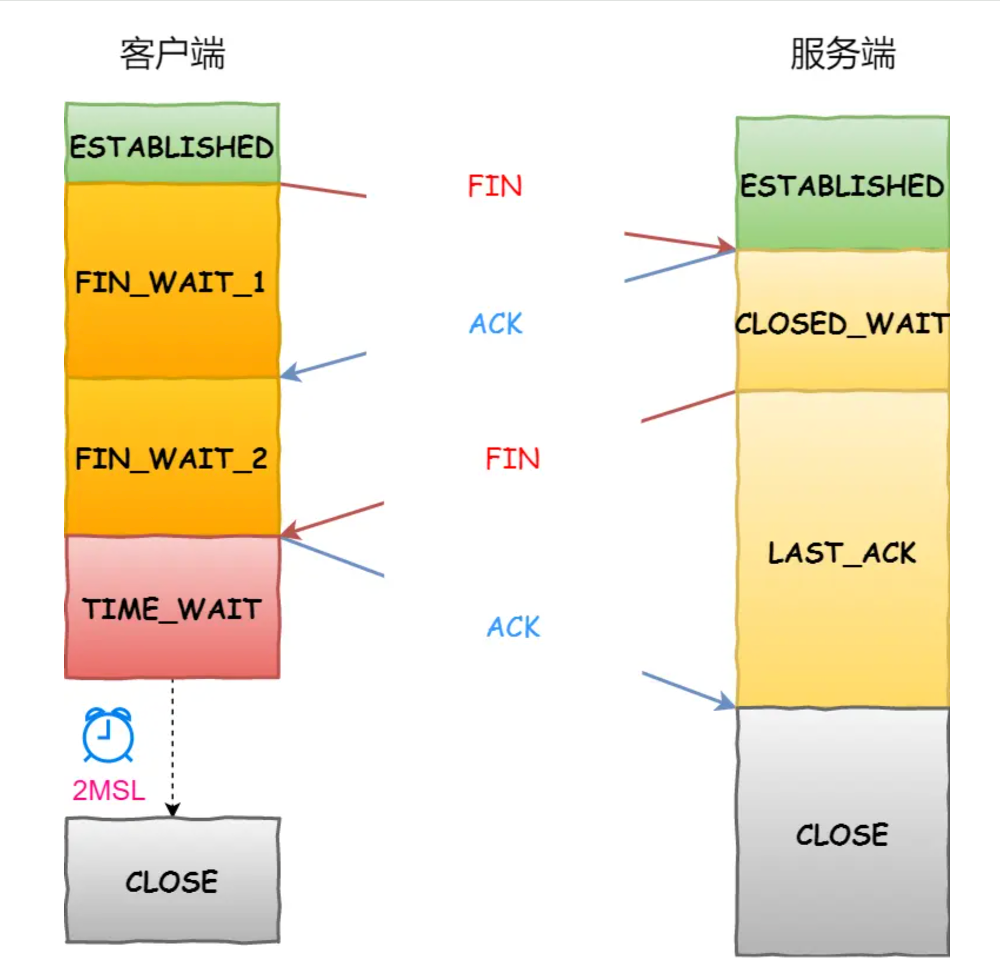

- 刚开始双方处于`established`状态。
- **客户端要断开了，向服务器发送一个 TCP 首部 `FIN` 标志位被置为 `1` 的报文。** 发送完后客户端变成了`FIN-WAIT-1`状态。同时也变成了`half-close`(半关闭)状态，即无法向服务端发送报文，只能接收。
- **服务端接收后向客户端发送`ACK`应答报文**，变成`CLOSED-WAIT`状态。客户端接收到服务端的确认，进入`FIN-WAIT2`状态。
- **等待服务端处理完数据后，服务端向客户端发送`FIN`**,自己进入`LAST-ACK`状态。
- 客户端收到服务器端发来的`FIN`后，**发送`ACK`给服务端**，自己变成了`TIME-WAIT`状态。
- **客户端在经过 2MSL ⼀段时间后**，⾃动进⼊ CLOSED 状态，⾄此客户端也完成连接的关闭。这个时候，客户端需要等待足够长的时间，具体来说是2MSL(报文最大存活时间)，在这段时间内如果客户端没有收到服务端的重发请求，那么表示ACK成功到达,挥手结束，否则客户端重发ACK。
#### 为什么要四次挥手？

- 关闭连接时，客户端向服务端发送 `FIN` 时，仅仅表示客户端不再发送数据了但是还能接收数据。
- 服务端收到客户端的 `FIN` 报文时，先回一个 `ACK` 应答报文，而服务端可能还有数据需要处理和发送，等服务端不再发送数据时，才发送 `FIN` 报文给客户端来表示同意现在关闭连接。

从上面过程可知，**服务端通常需要等待完成数据的发送和处理**，所以服务端的 `ACK` 和 `FIN` 一般都会分开发送，因此是需要四次挥手。

当被动关闭方（上图的服务端）在 TCP 挥手过程中，「**没有数据要发送」并且「开启了 TCP 延迟确认机制」，那么第二和第三次挥手就会合并传输，这样就出现了三次挥手。**

####  第一次挥手丢失了，会发生什么？

当客户端（主动关闭方）调用 close 函数后，就会向服务端发送 FIN 报文，试图与服务端断开连接，此时客户端的连接进入到 `FIN_WAIT_1` 状态。

正常情况下，如果能及时收到服务端（被动关闭方）的 ACK，则会很快变为 `FIN_WAIT2`状态。

**如果第一次挥手丢失了，那么客户端迟迟收不到被动方的 ACK 的话，也就会触发超时重传机制，重传 FIN 报文，重发次数由 `tcp_orphan_retries` 参数控制。**

当客户端重传 FIN 报文的次数超过 `tcp_orphan_retries` 后，就不再发送 FIN 报文，则会在等待一段时间（时间为上一次超时时间的 2 倍），如果还是没能收到第二次挥手，那么直接进入到 `close` 状态。

举个例子，假设 tcp_orphan_retries 参数值为 3，当第一次挥手一直丢失时，具体过程：

- 当客户端超时重传 3 次 FIN 报文后，由于 tcp_orphan_retries 为 3，已达到最大重传次数，于是再等待一段时间（时间为上一次超时时间的 2 倍），如果还是没能收到服务端的第二次挥手（ACK报文），那么客户端就会断开连接。

#### 第二次挥手丢失了，会发生什么？

当服务端收到客户端的第一次挥手后，就会先回一个 ACK 确认报文，此时服务端的连接进入到 `CLOSE_WAIT` 状态。

在前面我们也提了，ACK 报文是不会重传的，**所以如果服务端的第二次挥手丢失了，客户端就会触发超时重传机制，重传 FIN 报文，直到收到服务端的第二次挥手，或者达到最大的重传次数。**

举个例子，假设 tcp_orphan_retries 参数值为 2，当第二次挥手一直丢失时，具体过程：

- 当客户端超时重传 2 次 FIN 报文后，由于 tcp_orphan_retries 为 2，已达到最大重传次数，于是再等待一段时间（时间为上一次超时时间的 2 倍），如果还是没能收到服务端的第二次挥手（ACK 报文），那么客户端就会断开连接。

> 这里提一下，当客户端收到第二次挥手，也就是收到服务端发送的 ACK 报文后，客户端就会处于 `FIN_WAIT2` 状态，在这个状态需要等服务端发送第三次挥手，也就是服务端的 FIN 报文。
>
> 对于 close 函数关闭的连接，由于无法再发送和接收数据，所以`FIN_WAIT2` 状态不可以持续太久，而 `tcp_fin_timeout` 控制了这个状态下连接的持续时长，默认值是 60 秒。
>
> 这意味着对于调用 close 关闭的连接，如果在 60 秒后还没有收到 FIN 报文，客户端（主动关闭方）的连接就会直接关闭。
>
> 但是注意，如果主动关闭方使用 shutdown 函数关闭连接，指定了只关闭发送方向，而接收方向并没有关闭，那么意味着主动关闭方还是可以接收数据的。
>
> 此时，如果主动关闭方一直没收到第三次挥手，那么主动关闭方的连接将会一直处于 `FIN_WAIT2` 状态（`tcp_fin_timeout` 无法控制 shutdown 关闭的连接）

#### 第三次挥手丢失了，会发生什么？

当服务端（被动关闭方）收到客户端（主动关闭方）的 FIN 报文后，内核会自动回复 ACK，同时连接处于 `CLOSE_WAIT` 状态，顾名思义，它表示等待应用进程调用 close 函数关闭连接。

此时，内核是没有权利替代进程关闭连接，必须由进程主动调用 close 函数来触发服务端发送 FIN 报文。

服务端处于 CLOSE_WAIT 状态时，调用了 close 函数，内核就会发出 FIN 报文，同时连接进入 LAST_ACK 状态，等待客户端返回 ACK 来确认连接关闭。

**如果迟迟收不到这个 ACK，服务端就会重发 FIN 报文，重发次数仍然由 `tcp_orphan_retrie`s 参数控制，这与客户端重发 FIN 报文的重传次数控制方式是一样的。**

举个例子，假设 `tcp_orphan_retrie`s = 3，当第三次挥手一直丢失时, 具体过程：

- 当服务端重传第三次挥手报文的次数达到了 3 次后，由于 tcp_orphan_retries 为 3，达到了重传最大次数，于是再等待一段时间（时间为上一次超时时间的 2 倍），如果还是没能收到客户端的第四次挥手（ACK报文），那么服务端就会断开连接。
- 客户端因为是通过 close 函数关闭连接的，处于 FIN_WAIT_2 状态是有时长限制的，如果 tcp_fin_timeout 时间内还是没能收到服务端的第三次挥手（FIN 报文），那么客户端就会断开连接。

#### 第四次挥手丢失了，会发生什么？

当客户端收到服务端的第三次挥手的 FIN 报文后，就会回 ACK 报文，也就是第四次挥手，此时客户端连接进入 `TIME_WAIT` 状态。

在 Linux 系统，TIME_WAIT 状态会持续 2MSL 后才会进入关闭状态。

然后，服务端（被动关闭方）没有收到 ACK 报文前，还是处于 LAST_ACK 状态。

**如果第四次挥手的 ACK 报文没有到达服务端，服务端就会重发 FIN 报文，重发次数仍然由前面介绍过的 `tcp_orphan_retries` 参数控制。**

举个例子，假设 tcp_orphan_retries 为 2，当第四次挥手一直丢失时.具体过程：

- 当服务端重传第三次挥手报文达到 2 时，由于 tcp_orphan_retries 为 2， 达到了最大重传次数，于是再等待一段时间（时间为上一次超时时间的 2 倍），如果还是没能收到客户端的第四次挥手（ACK 报文），那么服务端就会断开连接。
- 客户端在收到第三次挥手后，就会进入 TIME_WAIT 状态，开启时长为 2MSL 的定时器，如果途中再次收到第三次挥手（FIN 报文）后，就会重置定时器，当等待 2MSL 时长后，客户端就会断开连接。

#### 为什么 TIME_WAIT 等待的时间是 2MSL？

`MSL` 是 Maximum Segment Lifetime，**报文最大生存时间**，它是任何报文在网络上存在的最长时间，超过这个时间报文将被丢弃。因为 TCP 报文基于是 IP 协议的，而 IP 头中有一个 `TTL` 字段，是 IP 数据报可以经过的最大路由数，每经过一个处理他的路由器此值就减 1，当此值为 0 则数据报将被丢弃，同时发送 ICMP 报文通知源主机。

MSL 与 TTL 的区别： MSL 的单位是时间，而 TTL 是经过路由跳数。所以 MSL 应该要大于等于 TTL 消耗为 0 的时间，以确保报文已被自然消亡。

TTL 的值一般是 64，Linux 将 MSL 设置为 30 秒，意味着 Linux 认为数据报文经过 64 个路由器的时间不会超过 30 秒，如果超过了，就认为报文已经消失在网络中了

**TIME_WAIT 等待 2 倍的 MSL，比较合理的解释是： 网络中可能存在来自发送方的数据包，当这些发送方的数据包被接收方处理后又会向对方发送响应，所以一来一回需要等待 2 倍的时间。**

**比如，如果被动关闭方没有收到断开连接的最后的 ACK 报文，就会触发超时重发 `FIN` 报文，另一方接收到 FIN 后，会重发 ACK 给被动关闭方， 一来一去正好 2 个 MSL。**

可以看到 **2MSL时长** 这其实是相当于**至少允许报文丢失一次**。比如，若 ACK 在一个 MSL 内丢失，这样被动方重发的 FIN 会在第 2 个 MSL 内到达，TIME_WAIT 状态的连接可以应对。

**为什么不是 4 或者 8 MSL 的时长呢？你可以想象一个丢包率达到百分之一的糟糕网络，连续两次丢包的概率只有万分之一，这个概率实在是太小了，忽略它比解决它更具性价比。**

`2MSL` 的时间是从**客户端接收到 FIN 后发送 ACK 开始计时的**。如果在 TIME-WAIT 时间内，因为客户端的 ACK 没有传输到服务端，客户端又接收到了服务端重发的 FIN 报文，那么 **2MSL 时间将重新计时**。

在 Linux 系统里 `2MSL` 默认是 `60` 秒，那么一个 `MSL` 也就是 `30` 秒。Linux 系统停留在 TIME_WAIT 的时间为固定的 60 秒。

如果要修改 TIME_WAIT 的时间长度，只能修改 Linux 内核代码里 TCP_TIMEWAIT_LEN 的值，并重新编译 Linux 内核

#### 为什么需要 TIME_WAIT 状态？

主动发起关闭连接的一方，才会有 `TIME-WAIT` 状态。

需要 TIME-WAIT 状态，主要是两个原因：

- **防止历史连接中的数据，被后面相同四元组的连接错误的接收** ，历史连接数据的序列号正好处在接收窗口内；
- **等待足够的时间以确保最后的 ACK 能让被动关闭方接收，从而帮助其正常关闭**

***原因一：防止历史连接中的数据，被后面相同四元组的连接错误的接收***

为了能更好的理解这个原因，我们先来了解序列号（SEQ）和初始序列号（ISN）。

- **序列号**，是 TCP 一个头部字段，标识了 TCP 发送端到 TCP 接收端的数据流的一个字节，因为 TCP 是面向字节流的可靠协议，为了保证消息的顺序性和可靠性，TCP 为每个传输方向上的每个字节都赋予了一个编号，以便于传输成功后确认、丢失后重传以及在接收端保证不会乱序。**序列号是一个 32 位的无符号数，因此在到达 4G 之后再循环回到 0**。
- **初始序列号**，在 TCP 建立连接的时候，客户端和服务端都会各自生成一个初始序列号，它是基于时钟生成的一个随机数，来保证每个连接都拥有不同的初始序列号。**初始化序列号可被视为一个 32 位的计数器，该计数器的数值每 4 微秒加 1，循环一次需要 4.55 小时**。

通过前面我们知道，**序列号和初始化序列号并不是无限递增的，会发生回绕为初始值的情况，这意味着无法根据序列号来判断新老数据**。

假设 TIME-WAIT 没有等待时间或时间过短，被延迟的数据包抵达后会发生什么呢？

- 服务端在关闭连接之前发送的 `SEQ = 301` 报文，被网络延迟了。
- 接着，服务端以相同的四元组重新打开了新连接，前面被延迟的 `SEQ = 301` 这时抵达了客户端，而且该数据报文的序列号刚好在客户端接收窗口内，因此客户端会正常接收这个数据报文，但是这个数据报文是上一个连接残留下来的，这样就产生数据错乱等严重的问题。

***原因二：保证「被动关闭连接」的一方，能被正确的关闭***

在 RFC 793 指出 TIME-WAIT 另一个重要的作用是：

*TIME-WAIT - represents waiting for enough time to pass to be sure the remote TCP received the acknowledgment of its connection termination request.*

也就是说，TIME-WAIT 作用是**等待足够的时间以确保最后的 ACK 能让被动关闭方接收，从而帮助其正常关闭。**

如果客户端（主动关闭方）最后一次 ACK 报文（第四次挥手）在网络中丢失了，那么按照 TCP 可靠性原则，服务端（被动关闭方）会重发 FIN 报文。

假设客户端没有 TIME_WAIT 状态，而是在发完最后一次回 ACK 报文就直接进入 CLOSE 状态，如果该 ACK 报文丢失了，服务端则重传的 FIN 报文，而这时客户端已经进入到关闭状态了，在收到服务端重传的 FIN 报文后，就会回 RST 报文。

服务端收到这个 RST 并将其解释为一个错误（Connection reset by peer），这对于一个可靠的协议来说不是一个优雅的终止方式。

为了防止这种情况出现，客户端必须等待足够长的时间，确保服务端能够收到 ACK，如果服务端没有收到 ACK，那么就会触发 TCP 重传机制，服务端会重新发送一个 FIN，这样一去一来刚好两个 MSL 的时间。

客户端在收到服务端重传的 FIN 报文时，TIME_WAIT 状态的等待时间，会重置回 2MSL。

#### TIME_WAIT 过多有什么危害？

过多的 TIME-WAIT 状态主要的危害有两种：

- **第一是占用系统资源，比如文件描述符、内存资源、CPU 资源、线程资源等；**
- **第二是占用端口资源，端口资源也是有限的，一般可以开启的端口为 `32768～61000`，也可以通过 `net.ipv4.ip_local_port_range`参数指定范围。**

客户端和服务端 TIME_WAIT 过多，造成的影响是不同的。

**如果客户端（主动发起关闭连接方）的 TIME_WAIT 状态过多**，占满了所有端口资源，那么就无法对「目的 IP+ 目的 PORT」都一样的服务端发起连接了，但是被使用的端口，还是可以继续对另外一个服务端发起连接的。

因此，客户端（发起连接方）都是和「目的 IP+ 目的 PORT 」都一样的服务端建立连接的话，当客户端的 TIME_WAIT 状态连接过多的话，就会受端口资源限制，如果占满了所有端口资源，那么就无法再跟「目的 IP+ 目的 PORT」都一样的服务端建立连接了。

不过，即使是在这种场景下，只要连接的是不同的服务端，端口是可以重复使用的，所以客户端还是可以向其他服务端发起连接的，这是因为内核在定位一个连接的时候，是通过四元组（源IP、源端口、目的IP、目的端口）信息来定位的，并不会因为客户端的端口一样，而导致连接冲突。

**如果服务端（主动发起关闭连接方）的 TIME_WAIT 状态过多**，并不会导致端口资源受限，因为服务端只监听一个端口，而且由于一个四元组唯一确定一个 TCP 连接，因此理论上服务端可以建立很多连接，但是 TCP 连接过多，会占用系统资源，比如文件描述符、内存资源、CPU 资源、线程资源等。

#### 如何优化 TIME_WAIT？

这里给出优化 TIME-WAIT 的几个方式，都是有利有弊：

- 打开 net.ipv4.tcp_tw_reuse 和 net.ipv4.tcp_timestamps 选项；
- net.ipv4.tcp_max_tw_buckets
- 程序中使用 SO_LINGER ，应用强制使用 RST 关闭。

***方式一：net.ipv4.tcp_tw_reuse 和 tcp_timestamps***

如下的 Linux 内核参数开启后，则可以**复用处于 TIME_WAIT 的 socket 为新的连接所用**。

有一点需要注意的是，**tcp_tw_reuse 功能只能用客户端（连接发起方），因为开启了该功能，在调用 connect() 函数时，内核会随机找一个 time_wait 状态超过 1 秒的连接给新的连接复用。**

```shell
net.ipv4.tcp_tw_reuse = 1
```

使用这个选项，还有一个前提，需要打开对 TCP 时间戳的支持，即

```text
net.ipv4.tcp_timestamps=1（默认即为 1）
```

这个时间戳的字段是在 TCP 头部的「选项」里，它由一共 8 个字节表示时间戳，其中第一个 4 字节字段用来保存发送该数据包的时间，第二个 4 字节字段用来保存最近一次接收对方发送到达数据的时间。

由于引入了时间戳，我们在前面提到的 `2MSL` 问题就不复存在了，因为重复的数据包会因为时间戳过期被自然丢弃。

***方式二：net.ipv4.tcp_max_tw_buckets***

这个值默认为 18000，**当系统中处于 TIME_WAIT 的连接一旦超过这个值时，系统就会将后面的 TIME_WAIT 连接状态重置**，这个方法比较暴力。

***方式三：程序中使用 SO_LINGER***

我们可以通过设置 socket 选项，来设置调用 close 关闭连接行为。

```c
struct linger so_linger;
so_linger.l_onoff = 1;
so_linger.l_linger = 0;
setsockopt(s, SOL_SOCKET, SO_LINGER, &so_linger,sizeof(so_linger));
```

如果`l_onoff`为非 0， 且`l_linger`值为 0，那么调用`close`后，会立该发送一个`RST`标志给对端，该 TCP 连接将跳过四次挥手，也就跳过了`TIME_WAIT`状态，直接关闭。

但这为跨越`TIME_WAIT`状态提供了一个可能，不过是一个非常危险的行为，不值得提倡。

前面介绍的方法都是试图越过 `TIME_WAIT`状态的，这样其实不太好。虽然 TIME_WAIT 状态持续的时间是有一点长，显得很不友好，但是它被设计来就是用来避免发生乱七八糟的事情。

《UNIX网络编程》一书中却说道：**TIME_WAIT 是我们的朋友，它是有助于我们的，不要试图避免这个状态，而是应该弄清楚它**。

**如果服务端要避免过多的 TIME_WAIT 状态的连接，就永远不要主动断开连接，让客户端去断开，由分布在各处的客户端去承受 TIME_WAIT**。

####  服务器出现大量 TIME_WAIT 状态的原因有哪些？

首先要知道 TIME_WAIT 状态是主动关闭连接方才会出现的状态，所以如果服务器出现大量的 TIME_WAIT 状态的 TCP 连接，就是说明服务器主动断开了很多 TCP 连接。

问题来了，**什么场景下服务端会主动断开连接呢？**

- 第一个场景：HTTP 没有使用长连接
  - 原因：**服务端和客户端任意一方没有开启 HTTP Keep-Alive，都会导致服务端在处理完一个 HTTP 请求后，就主动关闭连接，此时服务端上就会出现大量的 TIME_WAIT 状态的连接**。
  - 解决：**让客户端和服务端都开启 HTTP Keep-Alive 机制**

- 第二个场景：HTTP 长连接超时
  - 原因：**如果使用了 HTTP 长连接，如果客户端完成一个 HTTP 请求后，就不再发起新的请求，此时这个 TCP 连接一直占用会浪费资源，所以为了避免资源浪费的情况，web 服务软件一般都会提供一个参数，用来指定 HTTP 长连接的超时时间。假设设置了 HTTP 长连接的超时时间是 60 秒，nginx 就会启动一个「定时器」，如果客户端在完后一个 HTTP 请求后，在 60 秒内都没有再发起新的请求，定时器的时间一到，nginx 就会触发回调函数来关闭该连接，那么此时服务端上就会出现 TIME_WAIT 状态的连接。**
  - 解决：**可以往网络问题的方向排查，比如是否是因为网络问题，导致客户端发送的数据一直没有被服务端接收到，以至于 HTTP 长连接超时。**
- 第三个场景：HTTP 长连接的请求数量达到上限
  - 原因：**Web 服务端通常会有个参数，来定义一条 HTTP 长连接上最大能处理的请求数量，当超过最大限制时，就会主动关闭连接。比如 nginx 的 keepalive_requests 这个参数，这个参数是指一个 HTTP 长连接建立之后，nginx 就会为这个连接设置一个计数器，记录这个 HTTP 长连接上已经接收并处理的客户端请求的数量。如果达到这个参数设置的最大值时，则 nginx 会主动关闭这个长连接，那么此时服务端上就会出现 TIME_WAIT 状态的连接。**
  - 解决：**调大 nginx 的 keepalive_requests 参数就行**

***第一个场景：HTTP 没有使用长连接***

我们先来看看 HTTP 长连接（Keep-Alive）机制是怎么开启的。

在 HTTP/1.0 中默认是关闭的，如果浏览器要开启 Keep-Alive，它必须在请求的 header 中添加：

```text
Connection: Keep-Alive
```

然后当服务器收到请求，作出回应的时候，它也被添加到响应中 header 里：

```text
Connection: Keep-Alive
```

这样做，TCP 连接就不会中断，而是保持连接。当客户端发送另一个请求时，它会使用同一个 TCP 连接。这一直继续到客户端或服务器端提出断开连接。

**从 HTTP/1.1 开始， 就默认是开启了 Keep-Alive**，现在大多数浏览器都默认是使用 HTTP/1.1，所以 Keep-Alive 都是默认打开的。一旦客户端和服务端达成协议，那么长连接就建立好了。

如果要关闭 HTTP Keep-Alive，需要在 HTTP 请求或者响应的 header 里添加 `Connection:close` 信息，也就是说，**只要客户端和服务端任意一方的 HTTP header 中有 `Connection:close` 信息，那么就无法使用 HTTP 长连接的机制**。

关闭 HTTP 长连接机制后，每次请求都要经历这样的过程：建立 TCP -> 请求资源 -> 响应资源 -> 释放连接，那么此方式就是 **HTTP 短连接**。

在前面我们知道，只要任意一方的 HTTP header 中有 `Connection:close` 信息，就无法使用 HTTP 长连接机制，这样在完成一次 HTTP 请求/处理后，就会关闭连接。

问题来了，**这时候是客户端还是服务端主动关闭连接呢？**

在 RFC 文档中，并没有明确由谁来关闭连接，**请求和响应的双方都可以主动关闭 TCP 连接。**

不过，**根据大多数 Web 服务的实现，不管哪一方禁用了 HTTP Keep-Alive，都是由服务端主动关闭连接**，那么此时服务端上就会出现 TIME_WAIT 状态的连接。

因此，**当服务端出现大量的 TIME_WAIT 状态连接的时候，可以排查下是否客户端和服务端都开启了 HTTP Keep-Alive**，因为任意一方没有开启 HTTP Keep-Alive，都会导致服务端在处理完一个 HTTP 请求后，就主动关闭连接，此时服务端上就会出现大量的 TIME_WAIT 状态的连接。

针对这个场景下，解决的方式也很简单，**让客户端和服务端都开启 HTTP Keep-Alive 机制。**

> [!NOTE]
>
> 1. **客户端禁用了 HTTP Keep-Alive，服务端开启 HTTP Keep-Alive，谁是主动关闭方？**
>
> 当客户端禁用了 HTTP Keep-Alive，这时候 HTTP 请求的 header 就会有 `Connection:close` 信息，这时服务端在发完 HTTP 响应后，就会主动关闭连接。
>
> 为什么要这么设计呢？HTTP 是请求-响应模型，发起方一直是客户端，HTTP Keep-Alive 的初衷是**为客户端后续的请求重用连接**，如果我们**在某次 HTTP 请求-响应模型中，请求的 header 定义了 `connection：close` 信息，那不再重用这个连接的时机就只有在服务端了**，所以我们在 HTTP 请求-响应这个周期的「末端」关闭连接是合理的。
>
> 2. **客户端开启了 HTTP Keep-Alive，服务端禁用了 HTTP Keep-Alive，谁是主动关闭方？**
>
> 当客户端开启了 HTTP Keep-Alive，而服务端禁用了 HTTP Keep-Alive，这时服务端在发完 HTTP 响应后，服务端也会主动关闭连接。
>
> 为什么要这么设计呢？在服务端主动关闭连接的情况下，只要调用一次 close() 就可以释放连接，剩下的工作由内核 TCP 栈直接进行了处理，整个过程只有一次 syscall；如果是要求 客户端关闭，则服务端在写完最后一个 response 之后需要把这个 socket 放入 readable 队列，调用 select / epoll 去等待事件；然后调用一次 read() 才能知道连接已经被关闭，这其中是两次 syscall，多一次用户态程序被激活执行，而且 socket 保持时间也会更长。

***第二个场景：HTTP 长连接超时***

HTTP 长连接的特点是，只要任意一端没有明确提出断开连接，则保持 TCP 连接状态。

HTTP 长连接可以在同一个 TCP 连接上接收和发送多个 HTTP 请求/应答，避免了连接建立和释放的开销。

如果使用了 HTTP 长连接，如果客户端完成一个 HTTP 请求后，就不再发起新的请求，此时这个 TCP 连接一直占用会浪费资源，所以为了避免资源浪费的情况，web 服务软件一般都会提供一个参数，用来指定 HTTP 长连接的超时时间，比如 nginx 提供的 keepalive_timeout 参数。

假设设置了 HTTP 长连接的超时时间是 60 秒，nginx 就会启动一个「定时器」，**如果客户端在完后一个 HTTP 请求后，在 60 秒内都没有再发起新的请求，定时器的时间一到，nginx 就会触发回调函数来关闭该连接，那么此时服务端上就会出现 TIME_WAIT 状态的连接**。

当服务端出现大量 TIME_WAIT 状态的连接时，**如果现象是有大量的客户端建立完 TCP 连接后，很长一段时间没有发送数据，那么大概率就是因为 HTTP 长连接超时，导致服务端主动关闭连接，产生大量处于 TIME_WAIT 状态的连接。**

可以往网络问题的方向排查，比如是否是因为网络问题，导致客户端发送的数据一直没有被服务端接收到，以至于 HTTP 长连接超时。

***第三个场景：HTTP 长连接的请求数量达到上限***

Web 服务端通常会有个参数，来定义一条 HTTP 长连接上最大能处理的请求数量，当超过最大限制时，就会主动关闭连接。

比如 nginx 的 keepalive_requests 这个参数，这个参数是指一个 HTTP 长连接建立之后，nginx 就会为这个连接设置一个计数器，记录这个 HTTP 长连接上已经接收并处理的客户端请求的数量。**如果达到这个参数设置的最大值时，则 nginx 会主动关闭这个长连接**，那么此时服务端上就会出现 TIME_WAIT 状态的连接。

keepalive_requests 参数的默认值是 100 ，意味着每个 HTTP 长连接最多只能跑 100 次请求，这个参数往往被大多数人忽略，因为当 QPS (每秒请求数) 不是很高时，默认值 100 凑合够用。

但是，**对于一些 QPS 比较高的场景，比如超过 10000 QPS，甚至达到 30000 , 50000 甚至更高，如果 keepalive_requests 参数值是 100，这时候就 nginx 就会很频繁地关闭连接，那么此时服务端上就会出大量的 TIME_WAIT 状态**。

针对这个场景下，解决的方式也很简单，调大 nginx 的 keepalive_requests 参数就行

#### 服务器出现大量 CLOSE_WAIT 状态的原因有哪些？

CLOSE_WAIT 状态是「被动关闭方」才会有的状态（第二次挥手），而且如果「被动关闭方」没有调用 close 函数关闭连接，那么就无法发出 FIN 报文，从而无法使得 CLOSE_WAIT 状态的连接转变为 LAST_ACK 状态。

所以，**当服务端出现大量 CLOSE_WAIT 状态的连接的时候，说明服务端的程序没有调用 close 函数关闭连接**。

那什么情况会导致服务端的程序没有调用 close 函数关闭连接？这时候通常需要排查代码。

我们先来分析一个普通的 TCP 服务端的流程：

1. 创建服务端 socket，bind 绑定端口、listen 监听端口
2. 将服务端 socket 注册到 epoll
3. epoll_wait 等待连接到来，连接到来时，调用 accpet 获取已连接的 socket
4. 将已连接的 socket 注册到 epoll
5. epoll_wait 等待事件发生
6. 对方连接关闭时，我方调用 close

1. 对方连接关闭时，我方调用 close

可能导致服务端没有调用 close 函数的原因，如下。

**第一个原因**：第 2 步没有做，没有将服务端 socket 注册到 epoll，这样有新连接到来时，服务端没办法感知这个事件，也就无法获取到已连接的 socket，那服务端自然就没机会对 socket 调用 close 函数了。

不过这种原因发生的概率比较小，这种属于明显的代码逻辑 bug，在前期 read view 阶段就能发现的了。

**第二个原因**： 第 3 步没有做，有新连接到来时没有调用 accpet 获取该连接的 socket，导致当有大量的客户端主动断开了连接，而服务端没机会对这些 socket 调用 close 函数，从而导致服务端出现大量 CLOSE_WAIT 状态的连接。

发生这种情况可能是因为服务端在执行 accpet 函数之前，代码卡在某一个逻辑或者提前抛出了异常。

**第三个原因**：第 4 步没有做，通过 accpet 获取已连接的 socket 后，没有将其注册到 epoll，导致后续收到 FIN 报文的时候，服务端没办法感知这个事件，那服务端就没机会调用 close 函数了。

发生这种情况可能是因为服务端在将已连接的 socket 注册到 epoll 之前，代码卡在某一个逻辑或者提前抛出了异常。之前看到过别人解决 close_wait 问题的实践文章，感兴趣的可以看看：[一次 Netty 代码不健壮导致的大量 CLOSE_WAIT 连接原因分析(opens new window)](https://mp.weixin.qq.com/s?__biz=MzU3Njk0MTc3Ng==&mid=2247486020&idx=1&sn=f7cf41aec28e2e10a46228a64b1c0a5c&scene=21#wechat_redirect)

**第四个原因**：第 6 步没有做，当发现客户端关闭连接后，服务端没有执行 close 函数，可能是因为代码漏处理，或者是在执行 close 函数之前，代码卡在某一个逻辑，比如发生死锁等等。

可以发现，**当服务端出现大量 CLOSE_WAIT 状态的连接的时候，通常都是代码的问题，这时候我们需要针对具体的代码一步一步的进行排查和定位，主要分析的方向就是服务端为什么没有调用 close**。

#### 如果已经建立了连接，但是客户端突然出现故障了怎么办？

客户端出现故障指的是客户端的主机发生了宕机，或者断电的场景。发生这种情况的时候，如果服务端一直不会发送数据给客户端，那么服务端是永远无法感知到客户端宕机这个事件的，也就是服务端的 TCP 连接将一直处于 `ESTABLISH` 状态，占用着系统资源。

为了避免这种情况，TCP 搞了个**保活机制**。这个机制的原理是这样的：

**定义一个时间段，在这个时间段内，如果没有任何连接相关的活动，TCP 保活机制会开始作用，每隔一个时间间隔，发送一个探测报文，该探测报文包含的数据非常少，如果连续几个探测报文都没有得到响应，则认为当前的 TCP 连接已经死亡，系统内核将错误信息通知给上层应用程序。**

在 Linux 内核可以有对应的参数可以设置保活时间、保活探测的次数、保活探测的时间间隔，以下都为默认值：

```shell
net.ipv4.tcp_keepalive_time=7200
net.ipv4.tcp_keepalive_intvl=75  
net.ipv4.tcp_keepalive_probes=9
```

- tcp_keepalive_time=7200：表示保活时间是 7200 秒（2小时），也就 2 小时内如果没有任何连接相关的活动，则会启动保活机制
- tcp_keepalive_intvl=75：表示每次检测间隔 75 秒；
- tcp_keepalive_probes=9：表示检测 9 次无响应，认为对方是不可达的，从而中断本次的连接

也就是说在 Linux 系统中，最少需要经过 2 小时 11 分 15 秒才可以发现一个「死亡」连接。

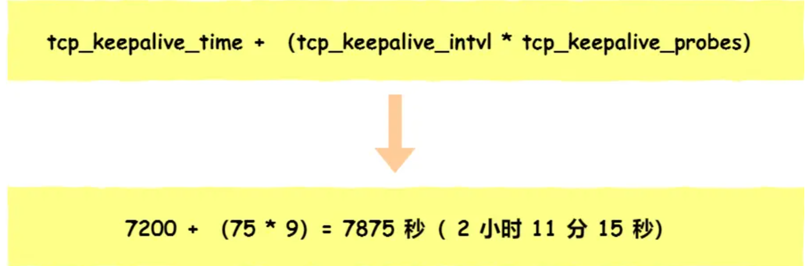

注意，应用程序若想使用 TCP 保活机制需要通过 socket 接口设置 `SO_KEEPALIVE` 选项才能够生效，如果没有设置，那么就无法使用 TCP 保活机制。

如果开启了 TCP 保活，需要考虑以下几种情况：

- 第一种，对端程序是正常工作的。当 TCP 保活的探测报文发送给对端, 对端会正常响应，这样 **TCP 保活时间会被重置**，等待下一个 TCP 保活时间的到来。
- 第二种，对端主机宕机并重启。当 TCP 保活的探测报文发送给对端后，对端是可以响应的，但由于没有该连接的有效信息，**会产生一个 RST 报文**，这样很快就会发现 TCP 连接已经被重置。
- 第三种，是对端主机宕机（*注意不是进程崩溃，进程崩溃后操作系统在回收进程资源的时候，会发送 FIN 报文，而主机宕机则是无法感知的，所以需要 TCP 保活机制来探测对方是不是发生了主机宕机*），或对端由于其他原因导致报文不可达。当 TCP 保活的探测报文发送给对端后，石沉大海，没有响应，连续几次，达到保活探测次数后，**TCP 会报告该 TCP 连接已经死亡**。

TCP 保活的这个机制检测的时间是有点长，我们可以自己在应用层实现一个心跳机制。

比如，web 服务软件一般都会提供 `keepalive_timeout` 参数，用来指定 HTTP 长连接的超时时间。如果设置了 HTTP 长连接的超时时间是 60 秒，web 服务软件就会**启动一个定时器**，如果客户端在完成一个 HTTP 请求后，在 60 秒内都没有再发起新的请求，**定时器的时间一到，就会触发回调函数来释放该连接。**

#### 如果已经建立了连接，但是服务端的进程崩溃会发生什么？

TCP 的连接信息是由内核维护的，所以当服务端的进程崩溃后，内核需要回收该进程的所有 TCP 连接资源，于是内核会发送第一次挥手 FIN 报文，后续的挥手过程也都是在内核完成，并不需要进程的参与，所以即使服务端的进程退出了，还是能与客户端完成 TCP 四次挥手的过程。

## Socket 编程

###  针对 TCP 应该如何 Socket 编程？

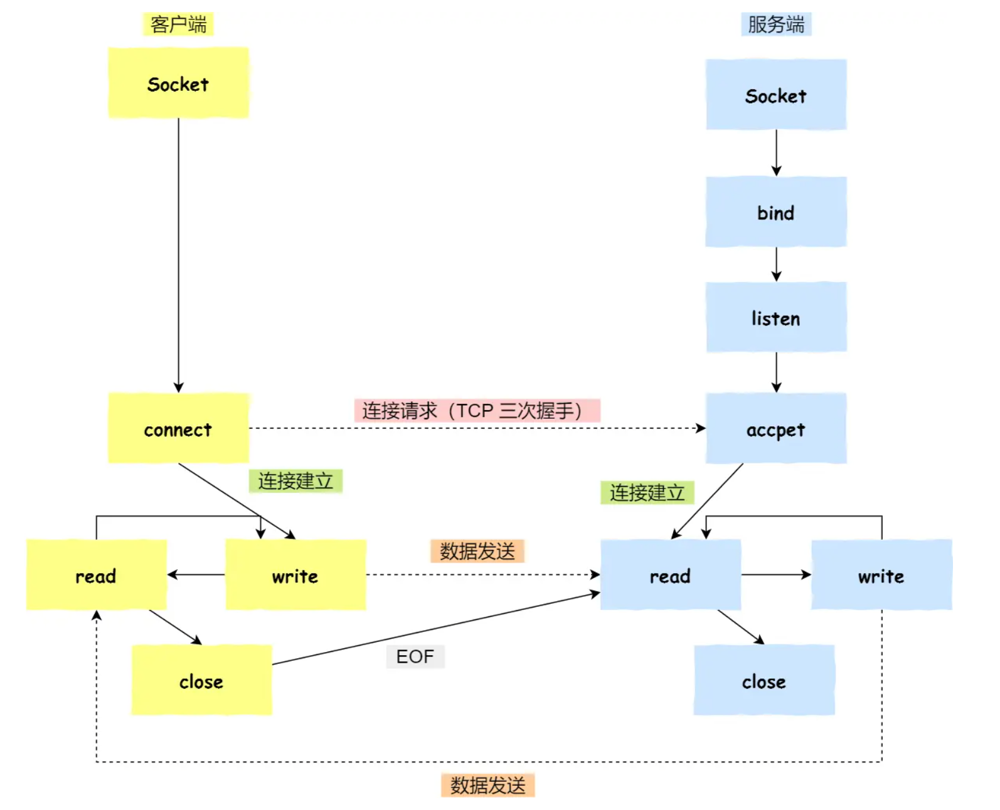

- 服务端和客户端初始化 `socket`，得到文件描述符；
- 服务端调用 `bind`，将 socket 绑定在指定的 IP 地址和端口;
- 服务端调用 `listen`，进行监听；
- 服务端调用 `accept`，等待客户端连接；
- 客户端调用 `connect`，向服务端的地址和端口发起连接请求；
- 服务端 `accept` 返回用于传输的 `socket` 的文件描述符；
- 客户端调用 `write` 写入数据；服务端调用 `read` 读取数据；
- 客户端断开连接时，会调用 `close`，那么服务端 `read` 读取数据的时候，就会读取到了 `EOF`，待处理完数据后，服务端调用 `close`，表示连接关闭。

这里需要注意的是，服务端调用 `accept` 时，连接成功了会返回一个已完成连接的 socket，后续用来传输数据。

所以，监听的 socket 和真正用来传送数据的 socket，是「两个」 socket，一个叫作**监听 socket**，一个叫作**已完成连接 socket**。

成功连接建立之后，双方开始通过 read 和 write 函数来读写数据，就像往一个文件流里面写东西一样。

###  listen 时候参数 backlog 的意义？

Linux内核中会维护两个队列：

- 半连接队列（SYN 队列）：接收到一个 SYN 建立连接请求，处于 SYN_RCVD 状态；
- 全连接队列（Accpet 队列）：已完成 TCP 三次握手过程，处于 ESTABLISHED 状态；

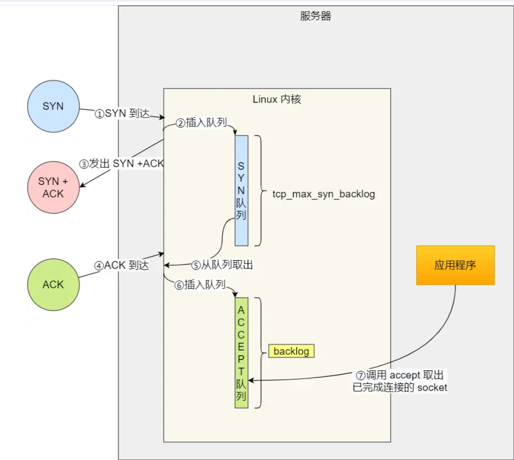

```c
int listen (int socketfd, int backlog)
```

- 参数一 socketfd 为 socketfd 文件描述符
- 参数二 backlog，这参数在历史版本有一定的变化

在早期 Linux 内核 backlog 是 SYN 队列大小，也就是未完成的队列大小。

在 Linux 内核 2.2 之后，backlog 变成 accept 队列，也就是已完成连接建立的队列长度，**所以现在通常认为 backlog 是 accept 队列。**

**但是上限值是内核参数 somaxconn 的大小，也就说 accpet 队列长度 = min(backlog, somaxconn)。**

### accept 发生在三次握手的哪一步？

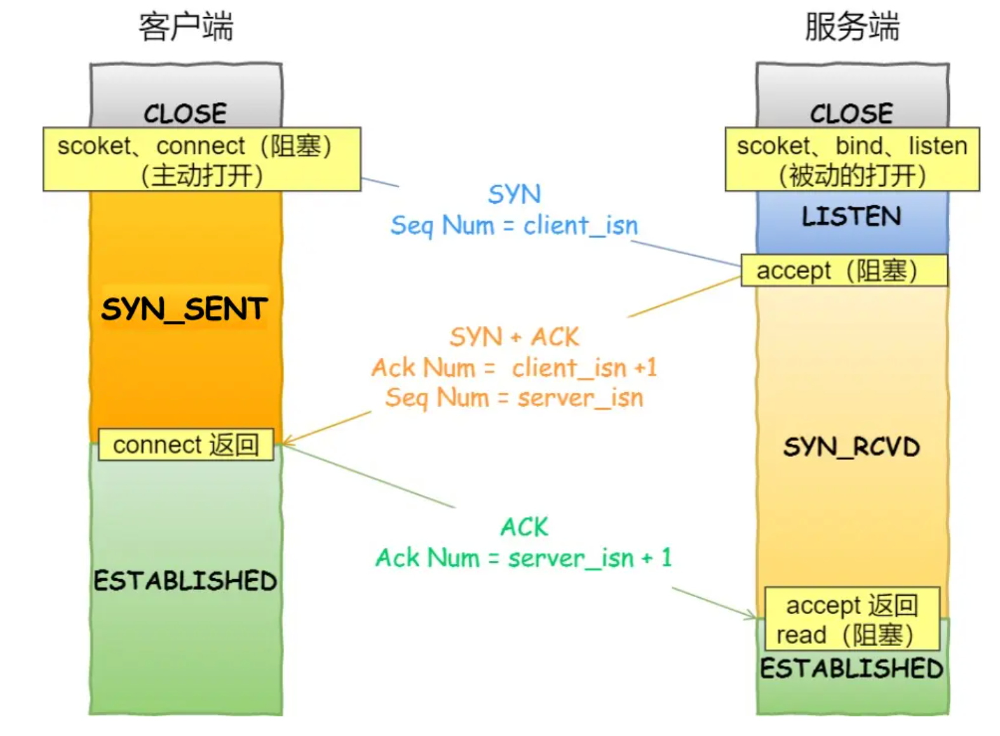

- 客户端的协议栈向服务端发送了 SYN 包，并告诉服务端当前发送序列号 client_isn，客户端进入 SYN_SENT 状态；
- 服务端的协议栈收到这个包之后，和客户端进行 ACK 应答，应答的值为 client_isn+1，表示对 SYN 包 client_isn 的确认，同时服务端也发送一个 SYN 包，告诉客户端当前我的发送序列号为 server_isn，服务端进入 SYN_RCVD 状态；
- 客户端协议栈收到 ACK 之后，使得应用程序从 `connect` 调用返回，表示客户端到服务端的单向连接建立成功，客户端的状态为 ESTABLISHED，同时客户端协议栈也会对服务端的 SYN 包进行应答，应答数据为 server_isn+1；
- ACK 应答包到达服务端后，服务端的 TCP 连接进入 ESTABLISHED 状态，同时服务端协议栈使得 `accept` 阻塞调用返回，这个时候服务端到客户端的单向连接也建立成功。至此，客户端与服务端两个方向的连接都建立成功。

从上面的描述过程，我们可以得知**客户端 connect 成功返回是在第二次握手，服务端 accept 成功返回是在三次握手成功之后。**

> [!NOTE]
>
> **服务端**
>
> ```java
> int main()
> {
>     /*Step 1: 创建服务器端监听socket描述符listen_fd*/    
>     listen_fd = socket(AF_INET, SOCK_STREAM, 0);
> 
>     /*Step 2: bind绑定服务器端的IP和端口，所有客户端都向这个IP和端口发送和请求数据*/    
>     bind(listen_fd, xxx);
> 
>     /*Step 3: 服务端开启监听*/    
>     listen(listen_fd, 128);
> 
>     /*Step 4: 服务器等待客户端的链接，返回值cfd为客户端的socket描述符*/    
>     cfd = accept(listen_fd, xxx);
> 
>       /*Step 5: 读取客户端发来的数据*/
>       n = read(cfd, buf, sizeof(buf));
> }
> ```
>
> 客户端
>
> ```java
> int main()
> {
>     /*Step 1: 创建客户端端socket描述符cfd*/    
>     cfd = socket(AF_INET, SOCK_STREAM, 0);
> 
>     /*Step 2: connect方法,对服务器端的IP和端口号发起连接*/    
>     ret = connect(cfd, xxxx);
> 
>     /*Step 4: 向服务器端写数据*/
>     write(cfd, buf, strlen(buf));
> }
> ```
>
> 

### 客户端调用 close 了，连接是断开的流程是什么？

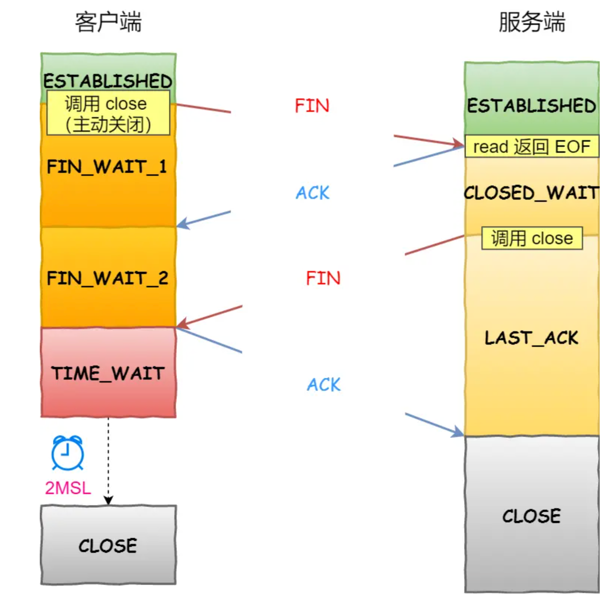

- 客户端调用 `close`，表明客户端没有数据需要发送了，则此时会向服务端发送 FIN 报文，进入 FIN_WAIT_1 状态；
- 服务端接收到了 FIN 报文，TCP 协议栈会为 FIN 包插入一个文件结束符 `EOF` 到接收缓冲区中，应用程序可以通过 `read` 调用来感知这个 FIN 包。这个 `EOF` 会被**放在已排队等候的其他已接收的数据之后**，这就意味着服务端需要处理这种异常情况，因为 EOF 表示在该连接上再无额外数据到达。此时，服务端进入 CLOSE_WAIT 状态；
- 接着，当处理完数据后，自然就会读到 `EOF`，于是也调用 `close` 关闭它的套接字，这会使得服务端发出一个 FIN 包，之后处于 LAST_ACK 状态；
- 客户端接收到服务端的 FIN 包，并发送 ACK 确认包给服务端，此时客户端将进入 TIME_WAIT 状态；
- 服务端收到 ACK 确认包后，就进入了最后的 CLOSE 状态；
- 客户端经过 `2MSL` 时间之后，也进入 CLOSE 状态；

###  没有 accept，能建立 TCP 连接吗？

答案：**可以的**。

accpet 系统调用并不参与 TCP 三次握手过程，它只是负责从 TCP 全连接队列取出一个已经建立连接的 socket，用户层通过 accpet 系统调用拿到了已经建立连接的 socket，就可以对该 socket 进行读写操作了。

### 没有 listen，能建立 TCP 连接吗？

答案：**可以的**。

客户端是可以自己连自己的形成连接（**TCP自连接**），也可以两个客户端同时向对方发出请求建立连接（**TCP同时打开**），这两个情况都有个共同点，就是**没有服务端参与，也就是没有 listen，就能 TCP 建立连接。**

## UDP和TCP区别

### UDP基本概念

UDP 不提供复杂的控制机制，利⽤ IP 提供⾯向「⽆连接」的通信服务。

UDP 协议真的⾮常简，头部只有 8 个字节（ 64 位），UDP 的头部格式如下：

- ⽬标端口和源端⼝：主要是告诉 UDP 协议应该把报⽂发给哪个进程。
- 包⻓度：该字段保存了 UDP ⾸部的⻓度跟数据的⻓度之和。
- 校验和：校验和是为了提供可靠的 UDP ⾸部和数据⽽设计。
- 数据

### TCP和UDP的区别


1. **连接**
   - TCP 是⾯向连接的传输层协议，传输数据前先要建⽴连接。
   - UDP 是不需要连接，即刻传输数据。
2. **服务对象**
   - TCP 是⼀对⼀的两点服务，即⼀条连接只有两个端点。
   - UDP ⽀持⼀对⼀、⼀对多、多对多的交互通信.
3. **可靠性**
   - TCP 是可靠交付数据的，数据可以⽆差错、不丢失、不重复、按需到达。
   - UDP 是尽最⼤努⼒交付，不保证可靠交付数据。但是我们可以基于 UDP 传输协议实现一个可靠的传输协议，比如 QUIC 协议
4. **拥塞控制、流量控制**
   - TCP 有拥塞控制和流量控制机制，保证数据传输的安全性。
   - UDP 则没有，即使⽹络⾮常拥堵了，也不会影响 UDP 的发送速率。
5. **首部开销**
   - TCP ⾸部⻓度较⻓，会有⼀定的开销，⾸部在没有使⽤「选项」字段时是 20 个字节，如果使⽤了「选项」 字段则会变⻓的。
   - UDP ⾸部只有 8 个字节，并且是固定不变的，开销较⼩。
6. **传输⽅式**
   - TCP 是流式传输，没有边界，但保证顺序和可靠。
   - UDP 是⼀个包⼀个包的发送，是有边界的，但可能会丢包和乱序。

7. **应⽤场景**
   - 由于 TCP 是⾯向连接，能保证数据的可靠性交付，因此经常⽤于：
     - FTP ⽂件传输,
     - HTTP / HTTPS.
   - 由于 UDP ⾯向⽆连接，它可以随时发送数据，再加上UDP本身的处理既简单⼜⾼效，因此经常⽤于：
     - 包总量较少的通信，如 DNS 、 SNMP 等
     - 视频、⾳频等多媒体通信
     - ⼴播通信

**为什么 UDP 头部没有「首部长度」字段，而 TCP 头部有「首部长度」字段呢？**

原因是 TCP 有**可变长**的「选项」字段，而 UDP 头部长度则是**不会变化**的，无需多一个字段去记录 UDP 的首部长度。

**为什么 UDP 头部有「包长度」字段，而 TCP 头部则没有「包长度」字段呢？**

先说说 TCP 是如何计算负载数据长度：

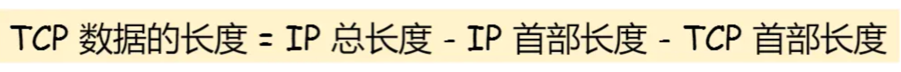

其中 IP 总长度 和 IP 首部长度，在 IP 首部格式是已知的。TCP 首部长度，则是在 TCP 首部格式已知的，所以就可以求得 TCP 数据的长度。

大家这时就奇怪了问：“UDP 也是基于 IP 层的呀，那 UDP 的数据长度也可以通过这个公式计算呀？ 为何还要有「包长度」呢？”

这么一问，确实感觉 UDP 的「包长度」是冗余的。

我查阅了很多资料，我觉得有两个比较靠谱的说法：

- 第一种说法：因为为了网络设备硬件设计和处理方便，首部长度需要是 `4` 字节的整数倍。如果去掉 UDP 的「包长度」字段，那 UDP 首部长度就不是 `4` 字节的整数倍了，所以我觉得这可能是为了补全 UDP 首部长度是 `4` 字节的整数倍，才补充了「包长度」字段。
- 第二种说法：如今的 UDP 协议是基于 IP 协议发展的，而当年可能并非如此，依赖的可能是别的不提供自身报文长度或首部长度的网络层协议，因此 UDP 报文首部需要有长度字段以供计算。

###  TCP 和 UDP 可以使用同一个端口吗？

答案：**可以的**。

在数据链路层中，通过 MAC 地址来寻找局域网中的主机。在网际层中，通过 IP 地址来寻找网络中互连的主机或路由器。在传输层中，需要通过端口进行寻址，来识别同一计算机中同时通信的不同应用程序。

所以，传输层的「端口号」的作用，是为了区分同一个主机上不同应用程序的数据包。

传输层有两个传输协议分别是 TCP 和 UDP，在内核中是两个完全独立的软件模块。

当主机收到数据包后，可以在 IP 包头的「协议号」字段知道该数据包是 TCP/UDP，所以可以根据这个信息确定送给哪个模块（TCP/UDP）处理，送给 TCP/UDP 模块的报文根据「端口号」确定送给哪个应用程序处理。

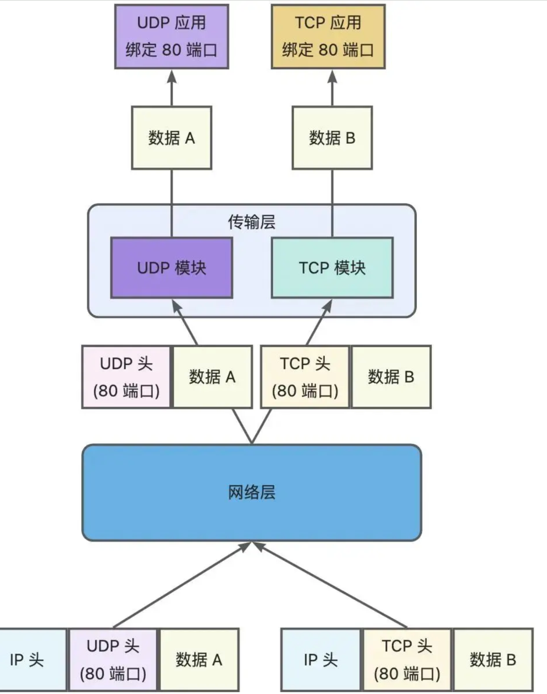


### UDP如何实现可靠传输？

传输层无法保证数据的可靠传输，只能通过应用层来实现了。实现的方式可以参照tcp可靠性传输的方式，只是实现不在传输层，实现转移到了应用层。

最简单的方式是在应用层模仿传输层TCP的可靠性传输。下面不考虑拥塞处理，可靠UDP的简单设计。

- 1、添加seq/ack机制，确保数据发送到对端
- 2、添加发送和接收缓冲区，主要是用户超时重传。
- 3、添加超时重传机制。

详细说明：送端发送数据时，生成一个随机seq=x，然后每一片按照数据大小分配seq。数据到达接收端后接收端放入缓存，并发送一个ack=x的包，表示对方已经收到了数据。发送端收到了ack包后，删除缓冲区对应的数据。时间到后，定时任务检查是否需要重传数据。

目前有如下开源程序利用udp实现了可靠的数据传输。分别为**RUDP、RTP、UDT**。

## TCP协议时如何保证可靠传输的

- 应用数据被分割成TCP认为最适合发送的数据块。
- TCP给发送的每个包进行编号，接收方对数据包进行排序，把有序数据传送给应用层。
- **校验和**：TCP将保证手部和数据的校验和，目的是检测数据在传输过程中的任何变化，如果收到端的检验和有差错，TCP将丢弃这个报文段和不确认收到此报文段。
- TCP的接收端会丢弃重复的数据。
- **流量控制:** 使用**滑动窗口**实现流量控制，接收方发送的确认报文中的窗口字段可以用来控制发送方窗口大小，从而影响发送方的发送速率。将窗口字段设置为 0，则发送方不能发送数据。
- **拥塞控制：** 当网络拥塞时，减少数据的发送。
- **重传机制：** 当 TCP 发出一个段后，它启动一个定时器，等待目的端确认收到这个报文段。如果不能及时收到一个确认，将重发这个报文段。
### 重传机制
TCP 实现可靠传输的方式之一，是通过序列号与确认应答。

在 TCP 中，当发送端的数据到达接收主机时，接收端主机会返回一个确认应答消息，表示已收到消息。

但在错综复杂的网络，并不一定能顺利能正常的数据传输，万一数据在传输过程中丢失了呢？

所以 TCP 针对数据包丢失的情况，会用**重传机制**解决。

- **超时重传**
  - **工作方式**：重传机制的其中一个方式，就是在发送数据时，设定一个定时器，当超过指定的时间后，没有收到对方的 `ACK` 确认应答报文，就会重发该数据，也就是我们常说的**超时重传**。
  - **问题：**超时周期可能相对较长；
  - **解决：可以用「快速重传」机制来解决超时重发的时间等待。**

- **快速重传（Fast Retransmit）**
  - **工作方式**：它不以时间为驱动，而是以数据驱动重传。快速重传的工作方式是当收到三个相同的 ACK 报文时，会在定时器过期之前，重传丢失的报文段。
  - **问题**：**重传的时候，是重传一个，还是重传所有的问题。**
  - **解决： `SACK` 方法**
- **SACK**
  - `SACK`（ Selective Acknowledgment）， **选择性确认**
  - 工作方式：这种方式需要在 TCP 头部「选项」字段里加一个 `SACK` 的东西，它**可以将已收到的数据的信息发送给「发送方」**，这样发送方就可以知道哪些数据收到了，哪些数据没收到，知道了这些信息，就可以**只重传丢失的数据**。

- **Duplicate SACK**
  - Duplicate SACK 又称 `D-SACK`，其主要**使用了 SACK 来告诉「发送方」有哪些数据被重复接收了。**
    - 可以让「发送方」知道，是发出去的包丢了，还是接收方回应的 ACK 包丢了;
    - 可以知道是不是「发送方」的数据包被网络延迟了;
    - 可以知道网络中是不是把「发送方」的数据包给复制了;


> [!NOTE]
>
> 1. 超时重传
>
> TCP 会在以下两种情况发生超时重传：
>
> - 数据包丢失
> - 确认应答丢失
>
> 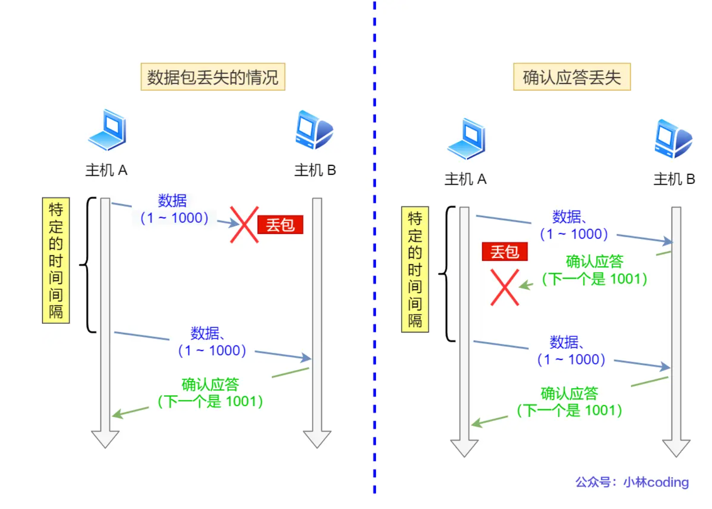
>
> **超时时间应该设置为多少呢？**
>
> `RTT` 指的是数据发送时刻到接收到确认的时刻的差值，也就是包的往返时间。
>
> 超时重传时间是以 `RTO` （Retransmission Timeout 超时重传时间）表示。
>
> - 当超时时间 **RTO 较大**时，重发就慢，丢了老半天才重发，没有效率，性能差；
> - 当超时时间 **RTO 较小**时，会导致可能并没有丢就重发，于是重发的就快，会增加网络拥塞，导致更多的超时，更多的超时导致更多的重发。
>
> **超时重传时间 RTO 的值应该略大于报文往返 RTT 的值**。
>
>  Linux 是如何计算 `RTO` 的呢？估计往返时间，通常需要采样以下两个：
>
> - 需要 TCP 通过采样 RTT 的时间，然后进行加权平均，算出一个平滑 RTT 的值，而且这个值还是要不断变化的，因为网络状况不断地变化。
> - 除了采样 RTT，还要采样 RTT 的波动范围，这样就避免如果 RTT 有一个大的波动的话，很难被发现的情况。
>
> 如果超时重发的数据，再次超时的时候，又需要重传的时候，TCP 的策略是**超时间隔加倍。**
>
> 也就是**每当遇到一次超时重传的时候，都会将下一次超时时间间隔设为先前值的两倍。两次超时，就说明网络环境差，不宜频繁反复发送。**
>
> 超时触发重传存在的问题是，超时周期可能相对较长。那是不是可以有更快的方式呢？
>
> 于是就可以用「快速重传」机制来解决超时重发的时间等待。

> [!NOTE]
>
> 2. **快速重传**
>
> 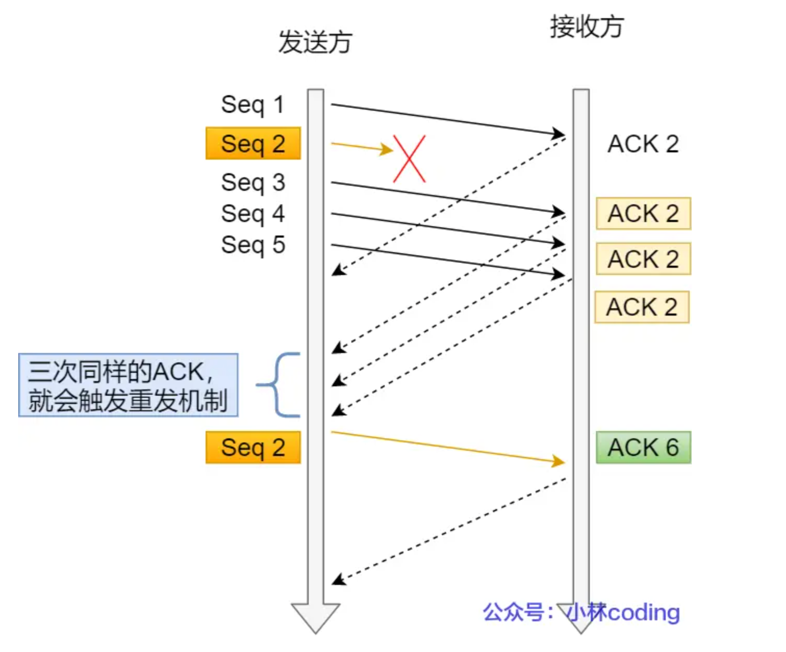
>
> 在上图，发送方发出了 1，2，3，4，5 份数据：
>
> - 第一份 Seq1 先送到了，于是就 Ack 回 2；
> - 结果 Seq2 因为某些原因没收到，Seq3 到达了，于是还是 Ack 回 2；
> - 后面的 Seq4 和 Seq5 都到了，但还是 Ack 回 2，因为 Seq2 还是没有收到；
> - **发送端收到了三个 Ack = 2 的确认，知道了 Seq2 还没有收到，就会在定时器过期之前，重传丢失的 Seq2。**
> - 最后，收到了 Seq2，此时因为 Seq3，Seq4，Seq5 都收到了，于是 Ack 回 6 。
>
> 所以，快速重传的工作方式是当收到三个相同的 ACK 报文时，会在定时器过期之前，重传丢失的报文段。
>
> 快速重传机制只解决了一个问题，就是超时时间的问题，但是它依然面临着另外一个问题。就是**重传的时候，是重传一个，还是重传所有的问题。**
>
> 举个例子，假设发送方发了 6 个数据，编号的顺序是 Seq1 ~ Seq6 ，但是 Seq2、Seq3 都丢失了，那么接收方在收到 Seq4、Seq5、Seq6 时，都是回复 ACK2 给发送方，但是发送方并不清楚这连续的 ACK2 是接收方收到哪个报文而回复的， 那是选择重传 Seq2 一个报文，还是重传 Seq2 之后已发送的所有报文呢（Seq2、Seq3、 Seq4、Seq5、 Seq6） 呢？
>
> - 如果只选择重传 Seq2 一个报文，那么重传的效率很低。因为对于丢失的 Seq3 报文，还得在后续收到三个重复的 ACK3 才能触发重传。
> - 如果选择重传 Seq2 之后已发送的所有报文，虽然能同时重传已丢失的 Seq2 和 Seq3 报文，但是 Seq4、Seq5、Seq6 的报文是已经被接收过了，对于重传 Seq4 ～Seq6 折部分数据相当于做了一次无用功，浪费资源。
>
> 可以看到，不管是重传一个报文，还是重传已发送的报文，都存在问题。
>
> 为了解决不知道该重传哪些 TCP 报文，于是就有 `SACK` 方法。

> [!NOTE]
>
> 3. SACK 方法
>
> 发送方收到了三次同样的 ACK 确认报文，于是就会触发快速重发机制，通过 `SACK` 信息发现只有 `200~299` 这段数据丢失，则重发时，就只选择了这个 TCP 段进行重复。
>
> 如果要支持 `SACK`，必须双方都要支持。在 Linux 下，可以通过 `net.ipv4.tcp_sack` 参数打开这个功能（Linux 2.4 后默认打开）。

> [!NOTE]
>
> 下面举例两个栗子，来说明 `D-SACK` 的作用。
>
> *栗子一号：ACK 丢包*
>
> - 「接收方」发给「发送方」的两个 ACK 确认应答都丢失了，所以发送方超时后，重传第一个数据包（3000 ~ 3499）
> - **于是「接收方」发现数据是重复收到的，于是回了一个 SACK = 3000~3500**，告诉「发送方」 3000~3500 的数据早已被接收了，因为 ACK 都到了 4000 了，已经意味着 4000 之前的所有数据都已收到，所以这个 SACK 就代表着 `D-SACK`。
> - 这样「发送方」就知道了，数据没有丢，是「接收方」的 ACK 确认报文丢了。
>
> *栗子二号：网络延时*
>
> - 数据包（1000~1499） 被网络延迟了，导致「发送方」没有收到 Ack 1500 的确认报文。
> - 而后面报文到达的三个相同的 ACK 确认报文，就触发了快速重传机制，但是在重传后，被延迟的数据包（1000~1499）又到了「接收方」；
> - **所以「接收方」回了一个 SACK=1000~1500，因为 ACK 已经到了 3000，所以这个 SACK 是 D-SACK，表示收到了重复的包。**
> - 这样发送方就知道快速重传触发的原因不是发出去的包丢了，也不是因为回应的 ACK 包丢了，而是因为网络延迟了。
>
> 可见，`D-SACK` 有这么几个好处：
>
> 1. 可以让「发送方」知道，是发出去的包丢了，还是接收方回应的 ACK 包丢了;
> 2. 可以知道是不是「发送方」的数据包被网络延迟了;
> 3. 可以知道网络中是不是把「发送方」的数据包给复制了;
>
> 在 Linux 下可以通过 `net.ipv4.tcp_dsack` 参数开启/关闭这个功能（Linux 2.4 后默认打开）。

### 滑动窗口

>  TCP 是每发送⼀个数据，都要进⾏⼀次确认应答。当上⼀个数据包收到了应答了， 再发送下⼀个。所以，这样的传输⽅式有⼀个缺点：数据包的往返时间越⻓，通信的效率就越低。为解决这个问题，TCP 引⼊了窗⼝这个概念。即使在往返时间较⻓的情况下，它也不会降低⽹络通信的效率。

1. **指定窗口的大小，也就是指⽆需等待确认应答，⽽可以继续发送数据的最⼤值。**

2. **窗口的实现实际上是操作系统开辟的一个缓存空间，发送方主机在等到确认应答返回之前，必须在缓冲区中保留已发送的数据。如果按期收到确认应答，此时数据就可以从缓存区清除。**

3. **通常窗⼝的⼤⼩是由接收⽅的窗⼝⼤⼩来决定的。**TCP 头⾥有⼀个字段叫 Window ，也就是窗⼝⼤⼩。 这个字段是接收端告诉发送端⾃⼰还有多少缓冲区可以接收数据。于是发送端就可以根据这个接收端的处理能⼒来发送数据，⽽不会导致接收端处理不过来。发送方发送的数据大小不能超过接收方的窗口大小，否则接收方就无法正常接收到数据。

4. **发送方的滑动窗口**

   - 已发送并收到 ACK确认的数据：1~31 字节

   - 已发送但未收到 ACK确认的数据：32~45 字节

   - 未发送但总⼤⼩在接收⽅处理范围内（接收⽅还有空间）：46~51字节

   - 未发送但总⼤⼩超过接收⽅处理范围（接收⽅没有空间）：52字节以后

     **三个接收部分的指针**

   - SND.WND ：表示发送窗⼝的⼤⼩（⼤⼩是由接收⽅指定的）；
   - SND.UNA ：是⼀个绝对指针，它指向的是已发送但未收到确认的第⼀个字节的序列号，也就是 #2 的第⼀ 个字节。
   - SND.NXT ：也是⼀个绝对指针，它指向未发送但可发送范围的第⼀个字节的序列号，也就是 #3 的第⼀个 字节。
   - 指向 #4 的第⼀个字节是个相对指针，它需要 SND.UNA 指针加上 SND.WND ⼤⼩的偏移量，就可以指向 #4 的第⼀个字节了。
   - **可用窗口大小 = SND.WND -（SND.NXT - SND.UNA）**


- 在下图，当发送⽅把数据「全部」都⼀下发送出去后，可⽤窗⼝的⼤⼩就为 0 了，表明可⽤窗⼝耗尽，在没收到 ACK 确认之前是⽆法继续发送数据了。


- 在下图，当收到之前发送的数据 32~36 字节的 ACK 确认应答后，如果发送窗⼝的⼤⼩没有变化，则滑动窗⼝往 右边移动 5 个字节，因为有 5 个字节的数据被应答确认，接下来 52~56 字节⼜变成了可⽤窗⼝，那么后续也就可以发送 52~56 这 5 个字节的数据了。


4. **接收⽅的滑动窗⼝**

- 分为三部分：
  - #1 + #2 是已成功接收并确认的数据（等待应⽤进程读取）；
  - #3 是未收到数据但可以接收的数据；
  - #4 未收到数据并不可以接收的数据；
- 两个接收部分的指针
  - RCV.WND ：表示接收窗⼝的⼤⼩，它会通告给发送⽅。
  - RCV.NXT ：是⼀个指针，它指向期望从发送⽅发送来的下⼀个数据字节的序列号，也就是 #3 的第⼀个字 节。
  - 指向 #4 的第⼀个字节是个相对指针，它需要 RCV.NXT 指针加上 RCV.WND ⼤⼩的偏移量，就可以指向 #4 的第⼀个字节了。

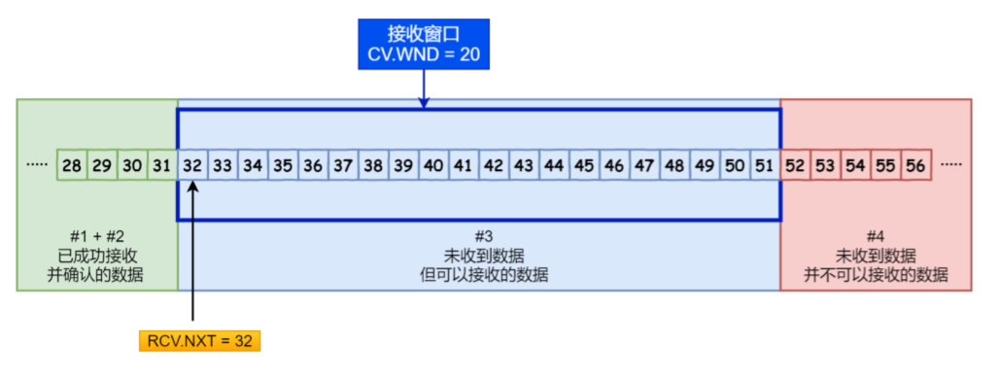

接收窗口和发送窗口的大小是相等的吗？

并不是完全相等，接收窗口的大小是**约等于**发送窗口的大小的。

因为滑动窗口并不是一成不变的。比如，当接收方的应用进程读取数据的速度非常快的话，这样的话接收窗口可以很快的就空缺出来。那么新的接收窗口大小，是通过 TCP 报文中的 Windows 字段来告诉发送方。那么这个传输过程是存在时延的，所以接收窗口和发送窗口是约等于的关系。

### 流量控制

**问题：**发送方不能无脑的发数据给接收方，要考虑接收方处理能力。如果一直无脑的发数据给对方，但对方处理不过来，那么就会导致触发重发机制，从而导致网络流量的无端的浪费。

为了解决这种现象发生，**TCP 提供一种机制可以让「发送方」根据「接收方」的实际接收能力控制发送的数据量，这就是所谓的流量控制。**

**TCP 利用滑动窗口实现流量控制。流量控制是为了控制发送方发送速率，保证接收方来得及接收。 接收方发送的确认报文中的窗口字段可以用来控制发送方窗口大小，从而影响发送方的发送速率。将窗口字段设置为 0，则发送方不能发送数据。**

> 一个例子
>
> 1. 客户端向服务端发送请求数据报文。这里要说明下，本次例子是把服务端作为发送方，所以没有画出服务端的接收窗口。
> 2. 服务端收到请求报文后，发送确认报文和 80 字节的数据，于是可用窗口 `Usable` 减少为 120 字节，同时 `SND.NXT` 指针也向右偏移 80 字节后，指向 321，**这意味着下次发送数据的时候，序列号是 321。**
> 3. 客户端收到 80 字节数据后，于是接收窗口往右移动 80 字节，`RCV.NXT` 也就指向 321，**这意味着客户端期望的下一个报文的序列号是 321**，接着发送确认报文给服务端。
> 4. 服务端再次发送了 120 字节数据，于是可用窗口耗尽为 0，服务端无法再继续发送数据。
> 5. 客户端收到 120 字节的数据后，于是接收窗口往右移动 120 字节，`RCV.NXT` 也就指向 441，接着发送确认报文给服务端。
> 6. 服务端收到对 80 字节数据的确认报文后，`SND.UNA` 指针往右偏移后指向 321，于是可用窗口 `Usable` 增大到 80。
> 7. 服务端收到对 120 字节数据的确认报文后，`SND.UNA` 指针往右偏移后指向 441，于是可用窗口 `Usable` 增大到 200。
> 8. 服务端可以继续发送了，于是发送了 160 字节的数据后，`SND.NXT` 指向 601，于是可用窗口 `Usable` 减少到 40。
> 9. 客户端收到 160 字节后，接收窗口往右移动了 160 字节，`RCV.NXT` 也就是指向了 601，接着发送确认报文给服务端。
> 10. 服务端收到对 160 字节数据的确认报文后，发送窗口往右移动了 160 字节，于是 `SND.UNA` 指针偏移了 160 后指向 601，可用窗口 `Usable` 也就增大至了 200。


#### 操作系统缓冲区与滑动窗口的关系

前面的流量控制例子，我们假定了发送窗口和接收窗口是不变的，但是实际上，发送窗口和接收窗口中所存放的字节数，都是放在操作系统内存缓冲区中的，而操作系统的缓冲区，会**被操作系统调整**。

应用进程没办法及时读取缓冲区的内容时，也会对我们的缓冲区造成影响。

那操作系统的缓冲区，是如何影响发送窗口和接收窗口的呢？

**第一个例子**

> - 客户端作为发送方，服务端作为接收方，发送窗口和接收窗口初始大小为 `360`；
> - 服务端非常的繁忙，当收到客户端的数据时，应用层不能及时读取数据。
>
> 1. 客户端发送 140 字节数据后，可用窗口变为 220 （360 - 140）。
> 2. 服务端收到 140 字节数据，**但是服务端非常繁忙，应用进程只读取了 40 个字节，还有 100 字节占用着缓冲区，于是接收窗口收缩到了 260 （360 - 100）**，最后发送确认信息时，将窗口大小通告给客户端。
> 3. 客户端收到确认和窗口通告报文后，发送窗口减少为 260。
> 4. 客户端发送 180 字节数据，此时可用窗口减少到 80。
> 5. 服务端收到 180 字节数据，**但是应用程序没有读取任何数据，这 180 字节直接就留在了缓冲区，于是接收窗口收缩到了 80 （260 - 180）**，并在发送确认信息时，通过窗口大小给客户端。
> 6. 客户端收到确认和窗口通告报文后，发送窗口减少为 80。
> 7. 客户端发送 80 字节数据后，可用窗口耗尽。
> 8. 服务端收到 80 字节数据，**但是应用程序依然没有读取任何数据，这 80 字节留在了缓冲区，于是接收窗口收缩到了 0**，并在发送确认信息时，通过窗口大小给客户端。
> 9. 客户端收到确认和窗口通告报文后，发送窗口减少为 0。
>
> 可见最后窗口都收缩为 0 了，也就是发生了窗口关闭。当发送方可用窗口变为 0 时，发送方实际上会定时发送窗口探测报文，以便知道接收方的窗口是否发生了改变，这个内容后面会说，这里先简单提一下。

**第二个例子**

当服务端系统资源非常紧张的时候，操作系统可能会直接减少了接收缓冲区大小，这时应用程序又无法及时读取缓存数据，那么这时候就有严重的事情发生了，如果客户端没有收到服务端的通告窗口报文，会出现数据包丢失的现象。

> 1. 客户端发送 140 字节的数据，于是可用窗口减少到了 220。
> 2. **服务端因为现在非常的繁忙，操作系统于是就把接收缓存减少了 120 字节，当收到 140 字节数据后，又因为应用程序没有读取任何数据，所以 140 字节留在了缓冲区中，于是接收窗口大小从 360 收缩成了 100**，最后发送确认信息时，通告窗口大小给对方。
> 3. 此时客户端因为还没有收到服务端的通告窗口报文，所以不知道此时接收窗口收缩成了 100，客户端只会看自己的可用窗口还有 220，所以客户端就发送了 180 字节数据，于是可用窗口减少到 40。
> 4. 服务端收到了 180 字节数据时，**发现数据大小超过了接收窗口的大小，于是就把数据包丢失了。**
> 5. 客户端收到第 2 步时，服务端发送的确认报文和通告窗口报文，尝试减少发送窗口到 100，把窗口的右端向左收缩了 80，此时可用窗口的大小就会出现诡异的负值。

所以，如果发生了先减少缓存，再收缩窗口，就会出现丢包的现象。

#### 窗口关闭

在前面我们都看到了，TCP 通过让接收方指明希望从发送方接收的数据大小（窗口大小）来进行流量控制。

**如果窗口大小为 0 时，就会阻止发送方给接收方传递数据，直到窗口变为非 0 为止，这就是窗口关闭。**

接收方向发送方通告窗口大小时，是通过 `ACK` 报文来通告的。

**那么，当发生窗口关闭时，接收方处理完数据后，会向发送方通告一个窗口非 0 的 ACK 报文，如果这个通告窗口的 ACK 报文在网络中丢失了，那麻烦就大了。这会导致发送方一直等待接收方的非 0 窗口通知，接收方也一直等待发送方的数据，如不采取措施，这种相互等待的过程，会造成了死锁的现象。**

**TCP 是如何解决窗口关闭时，潜在的死锁现象呢？**

为了解决这个问题，TCP 为每个连接设有一个持续定时器，**只要 TCP 连接一方收到对方的零窗口通知，就启动持续计时器。**

如果持续计时器超时，就会发送**窗口探测 ( Window probe ) 报文**，而对方在确认这个探测报文时，给出自己现在的接收窗口大小

- 如果接收窗口仍然为 0，那么收到这个报文的一方就会重新启动持续计时器；
- 如果接收窗口不是 0，那么死锁的局面就可以被打破了。

窗口探测的次数一般为 3 次，每次大约 30-60 秒（不同的实现可能会不一样）。如果 3 次过后接收窗口还是 0 的话，有的 TCP 实现就会发 `RST` 报文来中断连接。

#### 糊涂窗口综合症

如果接收方太忙了，来不及取走接收窗口里的数据，那么就会导致发送方的发送窗口越来越小。

到最后，**如果接收方腾出几个字节并告诉发送方现在有几个字节的窗口，而发送方会义无反顾地发送这几个字节，这就是糊涂窗口综合症**


### 拥塞控制

>拥塞控制就是为了防止过多的数据注入到网络中，这样就可以使网络中的路由器或链路不致过载。

- 为什么要有拥塞控制呀，不是有流量控制了吗？
  - 前面的流量控制是避免「发送方」的数据填满「接收方」的缓存，但是并不知道网络的中发生了什么。
  - 一般来说，计算机网络都处在一个共享的环境。因此也有可能会因为其他主机之间的通信使得网络拥堵。
  - **在网络出现拥堵时，如果继续发送大量数据包，可能会导致数据包时延、丢失等，这时 TCP 就会重传数据，但是一重传就会导致网络的负担更重，于是会导致更大的延迟以及更多的丢包，这个情况就会进入恶性循环被不断地放大....**

- **拥塞窗口 cwnd**是发送方维护的一个的状态变量，它会根据**网络的拥塞程度动态变化的**。
- 拥塞窗口 `cwnd` 变化的规则：
  - 只要网络中没有出现拥塞，`cwnd` 就会增大；
  - 但网络中出现了拥塞，`cwnd` 就减少；
- 那么怎么知道当前网络是否出现了拥塞呢？
  - 其实只要「发送方」没有在规定时间内接收到 ACK 应答报文，也就是**发生了超时重传，就会认为网络出现了拥塞。**

- 拥塞控制的四种算法

  - **慢开始**：刚开始发送数据的时候，拥塞窗口`cwnd`的大小为1，之后每经过一次轮回传播，拥塞窗口变为原来的2倍。

  - **拥塞避免**：当拥塞窗口的大小到达某个阈值`ssthresh`的时候，拥塞窗口的大小每次在之前的基础上加1

  - **拥塞发生**：当网络出现拥塞，也就是会发生数据包重传。则就会使用拥塞发生算法。
    - 发生超时重传时：这个时候，ssthresh 和 cwnd 的值会发生变化：`ssthresh` 设为 `cwnd/2`，`cwnd` 重置为 `1` （是恢复为 cwnd 初始化值，我这里假定 cwnd 初始化值 1），接着，就重新开始慢启动，慢启动是会突然减少数据流的。
    - 发生快速重传时：当接收方发现丢了一个中间包的时候，发送三次前一个包的 ACK，于是发送端就会快速地重传，不必等待超时再重传。 TCP 认为这种情况不严重，因为大部分没丢，只丢了一小部分。`cwnd = cwnd/2` ，也就是设置为原来的一半;`ssthresh = cwnd`;  然后进入快速恢复算法。

  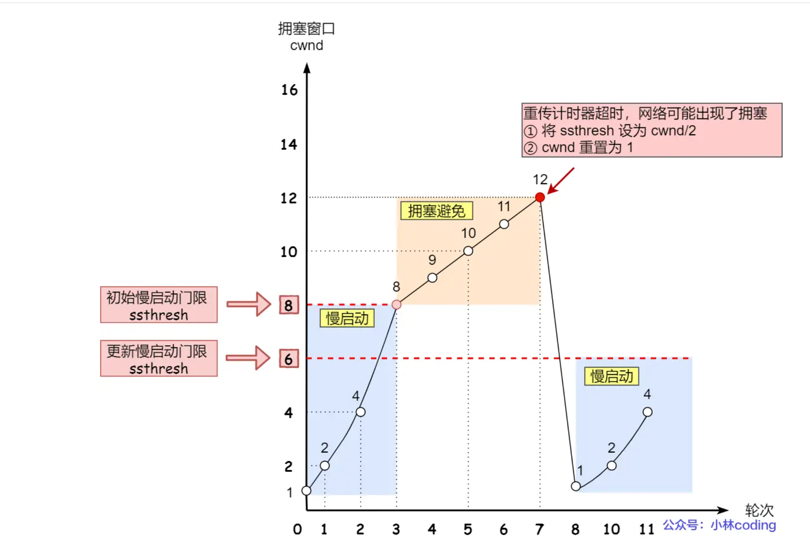

  - **快恢复**：
    - 快速恢复算法是认为，你还能收到 3 个重复 ACK 说明网络也不那么糟糕，所以没有必要像 `RTO` 超时那么强烈。
    - 进入快速恢复前，`wnd` 和 `ssthresh` 已被更新了：`cwnd = cwnd/2` ，也就是设置为原来的一半;`ssthresh = cwnd`;
    - 拥塞窗口 `cwnd = ssthresh + 3` （ 3 的意思是确认有 3 个数据包被收到了）；
    - 重传丢失的数据包；
    - 如果再收到重复的 ACK，那么 cwnd 增加 1；
    - 如果收到新数据的 ACK 后，把 cwnd 设置为第一步中的 ssthresh 的值，原因是该 ACK 确认了新的数据，说明从 duplicated ACK 时的数据都已收到，该恢复过程已经结束，可以回到恢复之前的状态了，也即再次进入**拥塞避免状态；**

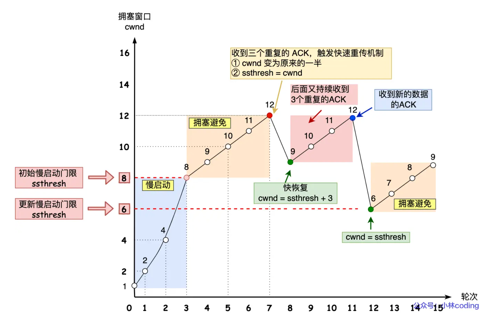


## TCP粘包拆包

### 5.1粘包拆包

TCP是面向连接的，面向流的，提供高可靠服务。

由于TCP无消息保护边界，一个完整的包可能会被TCP拆分成多个包发送，也有可能将多个包封装成一个大的数据包发送，这就是所谓的TCP粘包和拆包问题。

- 服务端分两次读取到了两个独立的数据包，分别是D1和D2，没有粘包和拆包；
- 服务端一次接收到了两个数据包，D1包和D2包粘在一起，被称为TCP粘包。
- 服务端分两次读到了两个数据包，第一次读到了完整的D1包和D2包的部分内容，第二次读取到了D2包的剩余内容，这被称为TCP拆包。
- 服务端分两次读取到了两个数据包，第一次读取到了D1包的部分内容D1_1，第二次读取到了D1包的剩余内容D1_2和D2包的整包。
- 如果此时服务端TCP接收滑窗非常小，而数据包D1和D2比较大，很有可能会发生第五种可能，即服务端分多次才能将D1和D2包接收完全，期间发生多次拆包。

### 5.2 粘包拆包原因

- 要发送的数据小于TCP发送缓冲区的大小，TCP多次写入缓冲区的数据一次发送出去，将会发生粘包。
- 接收数据端的应用层没有及时读取接收缓冲区中的数据，将会发生粘包。
- 要发送的数据大于TCP发送缓冲区剩余空间大小，将会产生拆包。
- 待发送数据大于MSS（最大报文长度），TCP在传输前将进行拆包。

### 5.3 粘包拆包解决方法

由于底层的TCP无法理解上层的业务数据，所以在底层是无法保证数据包不被拆分和重组的，这个问题只能通过上层的应用协议栈设计来解决：

- 消息定长：发送端把每个数据包封装成固定长度（不够的可以补零填充）。这样接收端每次接收缓冲区中读取固定长度的数据就可以把每个数据包拆分开来；
- 设置消息边界：服务端从网络流中按照消息边界分离出消息内容。
- 把消息分为消息头和消息体，消息头中包含表示消息总长度的字段。

# HTTP（应用层）

> HTTP 是超文本传输协议，也就是**H**yperText **T**ransfer **P**rotocol。
>
> HTTP 是⼀个在计算机世界⾥专⻔在「两点」之间「传输」⽂字、图⽚、⾳频、视频等「超⽂本」数据的「约定和 规范」。
>
> 特点
>
> - 无状态：协议对客户端没有状态存储，对事务处理没有记忆能力，比如访问一个网站需要反复登陆操作
> - 无连接：HTTP1.1之前，由于无状态的特点，每次请求都需要通过TCP三次握手四次挥手，和服务器重新建立连接，比如某个客户机再短时间多次请求同一个资源，服务器并不能区分是否已经响应过用户的请求，所以每次需要重新响应请求，需要耗费不必要的时间和流量。
> -  基于请求和响应：基本的特性，由客户端发起，服务端响应
> - 简单快速灵活
> - 不安全：通信使用明文，请求和响应不会对通信方进行确认，无法保护数据的完整性。


## 6.1 请求和响应报文

客户端发送一个请求报文给服务器，服务器根据请求报文中的信息进行处理，并将处理结果放入响应报文中返回给客户端。

请求报文结构：

- **请求行**：第一行是包含了请求方法、URL、协议版本；
- **首部行**：接下来的多行都是请求首部 Header，每个首部都有一个首部名称，以及对应的值。
  - **Host字段**：客户端发送请求时，⽤来指定服务器的域名。
  - **Connection 字段：**最常⽤于客户端要求服务器使⽤「HTTP 长连接」机制，以便其他请求复⽤。HTTP 长连接的特点是，只要任意一端没有明确提出断开连接，则保持 TCP 连接状态。HTTP/1.1 版本的默认连接都是持久连接，但为了兼容⽼版本的 HTTP，需要指定 Connection ⾸部字段的值为 Keep-Alive 。
- **一个空行用来分隔首部和内容主体 Body**
- 最后是请求的内容主体。(通常不用)

```java
GET http://www.example.com/ HTTP/1.1
Accept: text/html,application/xhtml+xml,application/xml;q=0.9,image/webp,image/apng,*/*;q=0.8,application/signed-exchange;v=b3;q=0.9  // Accept: */*  客户端声明自己可以接受任何格式的数据
Accept-Encoding: gzip, deflate
Accept-Language: zh-CN,zh;q=0.9,en;q=0.8
Cache-Control: max-age=0
Host: www.example.com   //服务器域名
If-Modified-Since: Thu, 17 Oct 2019 07:18:26 GMT
If-None-Match: "3147526947+gzip"
Proxy-Connection: keep-alive   //表示长连接
Upgrade-Insecure-Requests: 1
User-Agent: Mozilla/5.0 xxx

param1=1&param2=2
```

响应报文结构：

- **状态行 **：第一行包含协议版本、状态码以及描述，最常见的是 200 OK 表示请求成功了
- **首部行**：接下来多行也是首部内容
  - **Content-Length 字段**：服务器在返回数据时，会有 `Content-Length` 字段，表明本次回应的数据长度。
  - **Content-Type**： 字段⽤于服务器回应时，告诉客户端，本次数据是什么格式。
  - **Content-Encoding** 字段说明数据的压缩⽅法。表示服务器返回的数据使⽤了什么压缩格式
  
- **一个空行分隔首部和内容主体**
- **最后是响应的内容主体**

```
HTTP/1.1 200 OK
Age: 529651
Cache-Control: max-age=604800
Connection: keep-alive
Content-Encoding: gzip   //面表示服务器返回的数据采用了 gzip 方式压缩，告知客户端需要用此方式解压。
Content-Length: 648     //本次服务器回应的数据长度是 648 个字节
Content-Type: text/html; charset=UTF-8   //发送的是网页，而且编码是UTF-8。
Date: Mon, 02 Nov 2020 17:53:39 GMT
Etag: "3147526947+ident+gzip"
Expires: Mon, 09 Nov 2020 17:53:39 GMT
Keep-Alive: timeout=4
Last-Modified: Thu, 17 Oct 2019 07:18:26 GMT
Proxy-Connection: keep-alive
Server: ECS (sjc/16DF)
Vary: Accept-Encoding
X-Cache: HIT

<!doctype html>
<html>
<head>
    <title>Example Domain</title>
	// 省略... 
</body>
</html>
```

> [!NOTE]
>
> 大家应该都知道 HTTP 是基于 TCP 传输协议进行通信的，而使用了 TCP 传输协议，就会存在一个“粘包”的问题，**HTTP 协议通过设置回车符、换行符作为 HTTP header 的边界，通过 Content-Length 字段作为 HTTP body 的边界，这两个方式都是为了解决“粘包”的问题**。具体什么是 TCP 粘包，可以看这篇文章：[如何理解是 TCP 面向字节流协议？](https://xiaolincoding.com/network/3_tcp/tcp_stream.html)

### URL与URI

- URI(Uniform Resource Identifier) 是统一资源标志符，可以唯一标识一个资源。
- URL(Uniform Resource Location) 是统一资源定位符，可以提供该资源的路径。它是一种具体的 URI，即 URL 可以用来标识一个资源，而且还指明了如何 locate 这个资源。

## 6.2 HTTP方法

客户端发送的请求报文第一行为请求行，包含了方法字段。

**GET**

- 获取资源
- 当前网络请求中，绝大部分使用的是 GET 方法。

**HEAD**

- 获取报文首部
- 和 GET 方法类似，但是不返回报文实体主体部分。
- 主要用于确认 URL 的有效性以及资源更新的日期时间等。

**POST**

- 传输实体主体
- POST 主要用来传输数据，而 GET 主要用来获取资源。

**PUT**

- 上传文件
- 由于自身不带验证机制，任何人都可以上传文件，因此存在安全性问题，一般不使用该方法。

```
PUT /new.html HTTP/1.1
Host: example.com
Content-type: text/html
Content-length: 16

<p>New File</p>
```

**PATCH**

- 对资源进行部分修改
- PUT 也可以用于修改资源，但是只能完全替代原始资源，PATCH 允许部分修改。

```
PATCH /file.txt HTTP/1.1
Host: www.example.com
Content-Type: application/example
If-Match: "e0023aa4e"
Content-Length: 100

[description of changes]
```

**DELETE**

- 删除文件
- 与 PUT 功能相反，并且同样不带验证机制。

```
DELETE /file.html HTTP/1.1
```

**OPTIONS**

- 查询支持的方法
- 查询指定的 URL 能够支持的方法。
- 会返回 `Allow: GET, POST, HEAD, OPTIONS` 这样的内容。

**CONNECT**

- 要求在与代理服务器通信时建立隧道

**TRACE**

- 追踪路径

- 服务器会将通信路径返回给客户端。

- 发送请求时，在 Max-Forwards 首部字段中填入数值，每经过一个服务器就会减 1，当数值为 0 时就停止传输。

  通常不会使用 TRACE，并且它容易受到 XST 攻击（Cross-Site Tracing，跨站追踪）。

### GET与POST比较

1. **作用**

   - **GET 的语义是从服务器获取指定的资源**，这个资源可以是静态的文本、页面、图片视频等。GET 请求的参数位置一般是写在 URL 中，URL 规定只能支持 ASCII，所以 GET 请求的参数只允许 ASCII 字符 ，而且浏览器会对 URL 的长度有限制（HTTP协议本身对 URL长度并没有做任何规定）
   - **POST 的语义是根据请求负荷（报文body）对指定的资源做出处理**，具体的处理方式视资源类型而不同。POST 请求携带数据的位置一般是写在报文 body 中，body 中的数据可以是任意格式的数据，只要客户端与服务端协商好即可，而且浏览器不会对 body 大小做限制。

2. **安全性与幂等性**

   在 HTTP 协议⾥，所谓的「安全」是指请求⽅法不会「破坏」服务器上的资源。 所谓的「幂等」，意思是多次执⾏相同的操作，结果都是「相同」的。

   - GET ⽅法就是安全且幂等的，因为它是「只读」操作，⽆论操作多少次，服务器上的数据都是安全 的，且每次的结果都是相同的。所以，**可以对 GET 请求的数据做缓存，这个缓存可以做到浏览器本身上（彻底避免浏览器发请求），也可以做到代理上（如nginx），而且在浏览器中 GET 请求可以保存为书签**。
   - POST 因为是「新增或提交数据」的操作，会修改服务器上的资源，所以是不安全的，且多次提交数据就会创建多 个资源，所以不是幂等的。所以，**浏览器一般不会缓存 POST 请求，也不能把 POST 请求保存为书签**。

   > [!CAUTION]
   >
   > 但是实际过程中，开发者不一定会按照 RFC 规范定义的语义来实现 GET 和 POST 方法。比如：
   >
   > - 可以用 GET 方法实现新增或删除数据的请求，这样实现的 GET 方法自然就不是安全和幂等。
   > - 可以用 POST 方法实现查询数据的请求，这样实现的 POST 方法自然就是安全和幂等。
   >
   > **GET 请求可以带 body 吗？**
   >
   > RFC 规范并没有规定 GET 请求不能带 body 的。理论上，任何请求都可以带 body 的。只是因为 RFC 规范定义的 GET 请求是获取资源，所以根据这个语义不需要用到 body。
   >
   > 另外，URL 中的查询参数也不是 GET 所独有的，POST 请求的 URL 中也可以有参数的。

## 6.3 HTTP状态码

服务器返回的 **响应报文** 中第一行为状态行，包含了状态码以及原因短语，用来告知客户端请求的结果。

- 1XX

  - 表示接收的请求正在处理，属于信息型状态码(Informational)。
  - **100 Continue** ：表明到目前为止都很正常，客户端可以继续发送请求或者忽略这个响应。

- 2XX

  - 成功状态码，表示请求正常处理完毕
  - **200 OK**：是最常⻅的成功状态码，表示⼀切正常。如果是⾮ HEAD 请求，服务器返回的响应头都会有 body 数据。
  - **204 No Content** ：也是常⻅的成功状态码，与 200 OK 基本相同，但响应头没有 body 数据。
  - **206 Partial Content** ：表示客户端进行了范围请求，响应报文包含由 Content-Range 指定范围的实体内容。

- 3XX

  - 重定向状态码：表示客户端请求的资源发送了变动，需要客户端⽤新的 URL 重新发送请求获取资源，也就是重定向。

  > URL 重定向，也称为 URL 转发，是一种当实际资源，如单个页面、表单或者整个 Web 应用被迁移到新的 URL 下的时候，保持（原有）链接可用的技术。HTTP 协议提供了一种特殊形式的响应—— HTTP 重定向（HTTP redirects）来执行此类操作。

  - **301 Moved Permanently** ：永久性重定向。这种重定向操作是永久性的。它表示原 URL 不应再被使用，而应该优先选用新的 URL。
  - **302 Found** ：表示临时重定向，说明请求的资源还在，但暂时需要⽤另⼀个 URL 来访问。
  - **304 Not Modified**：不具有跳转的含义，表示资源未修改，重定向已存在的缓冲⽂件，也称缓存重定向，⽤于缓 存控制。

- 4XX

  - 客户端错误状态码, 服务器无法处理请求
  - **400 Bad Request** ：请求报文中存在语法错误。
  - **403 Forbidden** ：表示服务器禁⽌访问资源，并不是客户端的请求出错。
  - **404 Not Found**：表示请求的资源在服务器上不存在或未找到，所以⽆法提供给客户端。
  
- 5XX

  - 客户端请求报⽂正确，但是服务器处理时内部发⽣了错误，属于服务器端的错误码。
  - **500 Internal Server Error** ：服务器正在执行请求时发生错误。
  - **501 Not Implemented**：表示客户端请求的功能还不⽀持，类似“即将开业，敬请期待”的意思。
  - **502 Bad Gateway：**通常是服务器作为⽹关或代理时返回的错误码，表示服务器⾃身⼯作正常，访问后端服务器发⽣了错误。
  - **503 Service Unavailable** ：表示服务器当前很忙，暂时⽆法响应服务器，类似“⽹络服务正忙，请稍后重试”的意思。

## 6.4 HTTP首部字段

**通用首部字段**

|      首部字段名       |                    说明                    |
| :-------------------: | :----------------------------------------: |
|     Cache-Control     |               控制缓存的行为               |
|      Connection       | 控制不再转发给代理的首部字段、管理持久连接 |
|         Date          |             创建报文的日期时间             |
|        Pragma         |                  报文指令                  |
|        Trailer        |             报文末端的首部一览             |
| **Transfer-Encoding** |       **指定报文主体的传输编码方式**       |
|        Upgrade        |               升级为其他协议               |
|          Via          |            代理服务器的相关信息            |
|        Warning        |                  错误通知                  |

**请求首部字段**

|     首部字段名      |                      说明                       |
| :-----------------: | :---------------------------------------------: |
|     **Accept**      |          **用户代理可处理的媒体类型**           |
|   Accept-Charset    |                  优先的字符集                   |
|   Accept-Encoding   |                 优先的内容编码                  |
|   Accept-Language   |             优先的语言（自然语言）              |
|    Authorization    |                  Web 认证信息                   |
|       Expect        |              期待服务器的特定行为               |
|        From         |               用户的电子邮箱地址                |
|      **Host**       |             **请求资源所在服务器**              |
|      If-Match       |              比较实体标记（ETag）               |
|  If-Modified-Since  |               比较资源的更新时间                |
|    If-None-Match    |        比较实体标记（与 If-Match 相反）         |
|      If-Range       |      资源未更新时发送实体 Byte 的范围请求       |
| If-Unmodified-Since | 比较资源的更新时间（与 If-Modified-Since 相反） |
|    Max-Forwards     |                 最大传输逐跳数                  |
| Proxy-Authorization |         代理服务器要求客户端的认证信息          |
|        Range        |               实体的字节范围请求                |
|       Referer       |            对请求中 URI 的原始获取方            |
|         TE          |                传输编码的优先级                 |
|     User-Agent      |              HTTP 客户端程序的信息              |

**响应首部字段**

|     首部字段名     |             说明             |
| :----------------: | :--------------------------: |
|   Accept-Ranges    |     是否接受字节范围请求     |
|        Age         |     推算资源创建经过时间     |
|        ETag        |        资源的匹配信息        |
|      Location      |   令客户端重定向至指定 URI   |
| Proxy-Authenticate | 代理服务器对客户端的认证信息 |
|    Retry-After     |   对再次发起请求的时机要求   |
|       Server       |    HTTP 服务器的安装信息     |
|        Vary        |   代理服务器缓存的管理信息   |
|  WWW-Authenticate  |   服务器对客户端的认证信息   |

**实体首部字段**

|    首部字段名    |          说明          |
| :--------------: | :--------------------: |
|      Allow       | 资源可支持的 HTTP 方法 |
| Content-Encoding | 实体主体适用的编码方式 |
| Content-Language |   实体主体的自然语言   |
|  Content-Length  |     实体主体的大小     |
| Content-Location |   替代对应资源的 URI   |
|   Content-MD5    |   实体主体的报文摘要   |
|  Content-Range   |   实体主体的位置范围   |
|   Content-Type   |   实体主体的媒体类型   |
|     Expires      | 实体主体过期的日期时间 |
|  Last-Modified   | 资源的最后修改日期时间 |

## 6.5 HTTP 缓存

###  HTTP 缓存有哪些实现方式？

对于一些具有重复性的 HTTP 请求，比如每次请求得到的数据都一样的，我们可以把这对「请求-响应」的数据都**缓存在本地**，那么下次就直接读取本地的数据，不必在通过网络获取服务器的响应了，这样的话 HTTP/1.1 的性能肯定肉眼可见的提升。

所以，避免发送 HTTP 请求的方法就是通过**缓存技术**，HTTP 设计者早在之前就考虑到了这点，因此 HTTP 协议的头部有不少是针对缓存的字段。

HTTP 缓存有两种实现方式，分别是**强制缓存和协商缓存**。

### 什么是强制缓存？

强缓存指的是只要浏览器判断缓存没有过期，则直接使用浏览器的本地缓存，决定是否使用缓存的主动性在于浏览器这边。

如下图中，返回的是 200 状态码，但在 size 项中标识的是 from disk cache，就是使用了强制缓存。

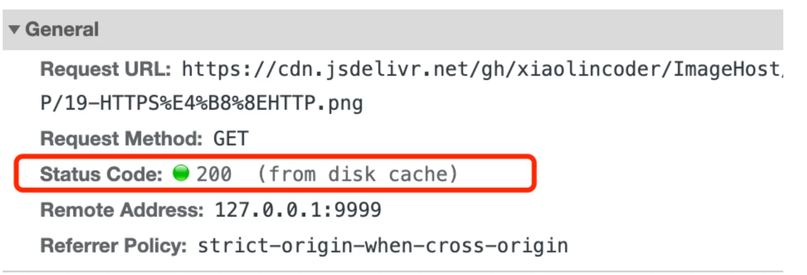

强缓存是利用下面这两个 HTTP 响应头部（Response Header）字段实现的，它们都用来表示资源在客户端缓存的有效期：

- `Cache-Control`， 是一个相对时间；
- `Expires`，是一个绝对时间；

如果 HTTP 响应头部同时有 Cache-Control 和 Expires 字段的话，**Cache-Control 的优先级高于 Expires** 。

Cache-control 选项更多一些，设置更加精细，所以建议使用 Cache-Control 来实现强缓存。具体的实现流程如下：

- 当浏览器第一次请求访问服务器资源时，服务器会在返回这个资源的同时，在 Response 头部加上 Cache-Control，Cache-Control 中设置了过期时间大小；
- 浏览器再次请求访问服务器中的该资源时，会先**通过请求资源的时间与 Cache-Control 中设置的过期时间大小，来计算出该资源是否过期**，如果没有，则使用该缓存，否则重新请求服务器；
- 服务器再次收到请求后，会再次更新 Response 头部的 Cache-Control。

### 什么是协商缓存？

当我们在浏览器使用开发者工具的时候，你可能会看到过某些请求的响应码是 `304`，这个是告诉浏览器可以使用本地缓存的资源，通常这种通过服务端告知客户端是否可以使用缓存的方式被称为协商缓存。

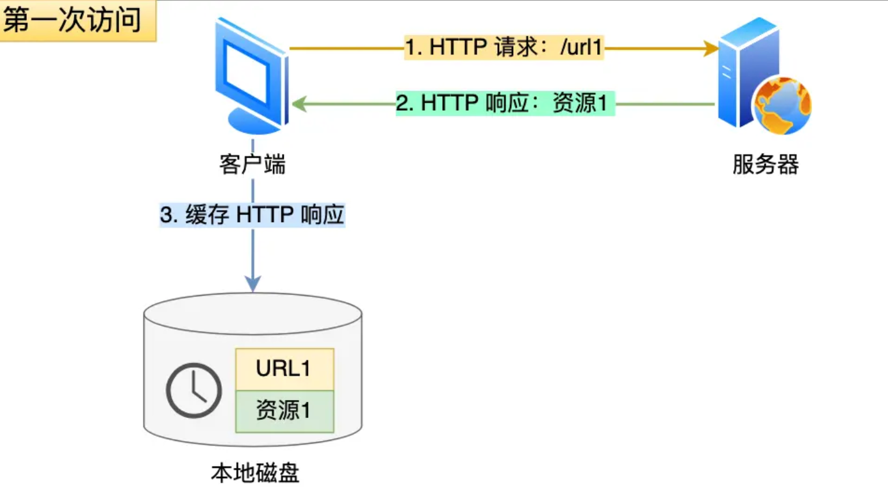


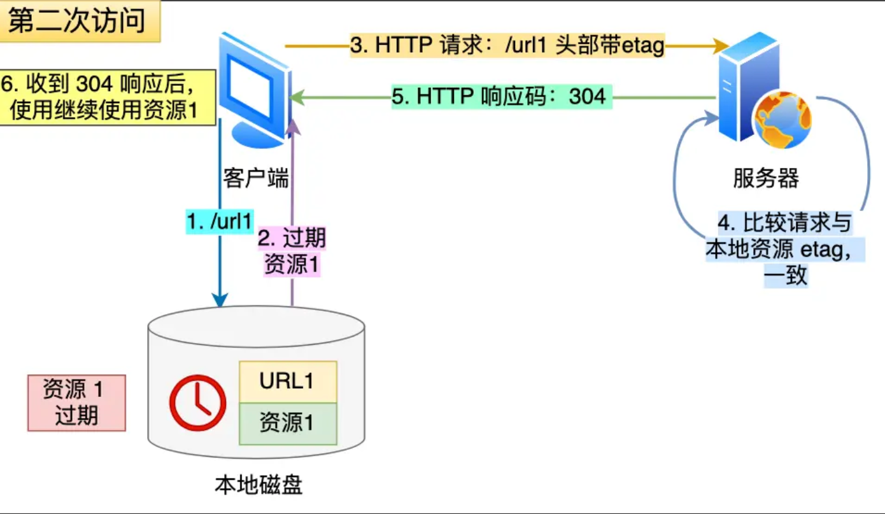

上图就是一个协商缓存的过程，所以**协商缓存就是与服务端协商之后，通过协商结果来判断是否使用本地缓存**。

协商缓存可以基于两种头部来实现。

第一种：请求头部中的 `If-Modified-Since` 字段与响应头部中的 `Last-Modified` 字段实现，这两个字段的意思是：

- 响应头部中的 `Last-Modified`：标示这个响应资源的最后修改时间；
- 请求头部中的 `If-Modified-Since`：当资源过期了，发现响应头中具有 Last-Modified 声明，则再次发起请求的时候带上 Last-Modified 的时间，服务器收到请求后发现有 If-Modified-Since 则与被请求资源的最后修改时间进行对比（Last-Modified），如果最后修改时间较新（大），说明资源又被改过，则返回最新资源，HTTP 200 OK；如果最后修改时间较旧（小），说明资源无新修改，响应 HTTP 304 走缓存。

第二种：请求头部中的 `If-None-Match` 字段与响应头部中的 `ETag` 字段，这两个字段的意思是：

- 响应头部中 `Etag`：唯一标识响应资源；
- 请求头部中的 `If-None-Match`：当资源过期时，浏览器发现响应头里有 Etag，则再次向服务器发起请求时，会将请求头 If-None-Match 值设置为 Etag 的值。服务器收到请求后进行比对，如果资源没有变化返回 304，如果资源变化了返回 200。

第一种实现方式是基于时间实现的，第二种实现方式是基于一个唯一标识实现的，相对来说后者可以更加准确地判断文件内容是否被修改，避免由于时间篡改导致的不可靠问题。

如果在第一次请求资源的时候，服务端返回的 HTTP 响应头部同时有 Etag 和 Last-Modified 字段，那么客户端再下一次请求的时候，如果带上了 ETag 和 Last-Modified 字段信息给服务端，**这时 Etag 的优先级更高**，也就是服务端先会判断 Etag 是否变化了，如果 Etag 有变化就不用在判断 Last-Modified 了，如果 Etag 没有变化，然后再看 Last-Modified。

**为什么 ETag 的优先级更高？**这是因为 ETag 主要能解决 Last-Modified 几个比较难以解决的问题：

1. 在没有修改文件内容情况下文件的最后修改时间可能也会改变，这会导致客户端认为这文件被改动了，从而重新请求；
2. 可能有些文件是在秒级以内修改的，`If-Modified-Since` 能检查到的粒度是秒级的，使用 Etag就能够保证这种需求下客户端在 1 秒内能刷新多次；
3. 有些服务器不能精确获取文件的最后修改时间。

注意，**协商缓存这两个字段都需要配合强制缓存中 Cache-Control 字段来使用，只有在未能命中强制缓存的时候，才能发起带有协商缓存字段的请求**。

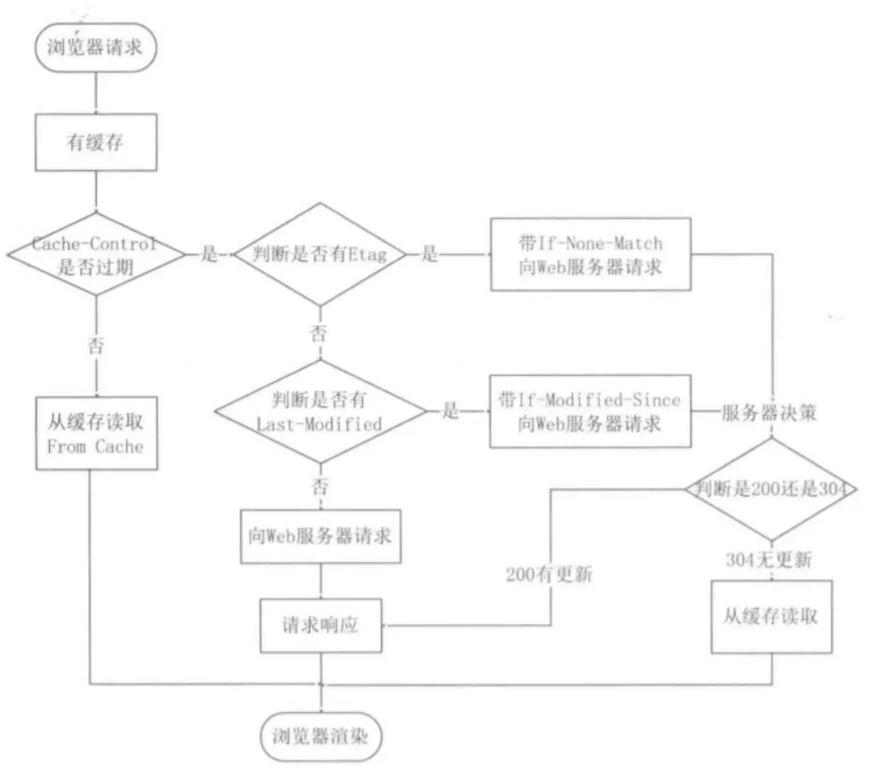

当使用 ETag 字段实现的协商缓存的过程：

- 当浏览器第一次请求访问服务器资源时，服务器会在返回这个资源的同时，在 Response 头部加上 ETag 唯一标识，这个唯一标识的值是根据当前请求的资源生成的；

- 当浏览器再次请求访问服务器中的该资源时，首先会先检查强制缓存是否过期：

  - 如果没有过期，则直接使用本地缓存；
  - 如果缓存过期了，会在 Request 头部加上 If-None-Match 字段，该字段的值就是 ETag 唯一标识；

- 服务器再次收到请求后，

  会根据请求中的 If-None-Match 值与当前请求的资源生成的唯一标识进行比较

  - **如果值相等，则返回 304 Not Modified，不会返回资源**；
  - 如果不相等，则返回 200 状态码和返回资源，并在 Response 头部加上新的 ETag 唯一标识；

- 如果浏览器收到 304 的请求响应状态码，则会从本地缓存中加载资源，否则更新资源。

## 6.5 HTTP长连接与短连接

>https://www.cnblogs.com/gotodsp/p/6366163.html
- **在http/1.0中默认使用短连接**，也就是说，**客户端和服务器端每进行一次HTTP操作就建立一次连接，任务结束就中断连接。**当客户端浏览器访问的某个HTML或者其他类型的web页中包含有其他的web资源(如JavaScript文件，图像文件，CSS文件等)，每遇到这样一个web资源，浏览器就会重新建立一个http会话。
- **从http/1.1起，默认使用长连接**。 当一个网页打开完成后，**客户端和服务器端用于传输HTTP数据的TCP连接不会关闭，** 客户端再次访问这个服务器时，会继续使用这一条已经建立的连接，`keep-alive`不会永久保持连接，他有一个保持时间，可以在不同的服务器软件设定这个时间。
- **长连接用于操作频繁，点对点的通信，而且连接数不能太多的情况**。
- **短连接适合用于并发量大，每个用户无需频繁的操作。**

## 6.6 HTTP如何保存用户状态
- HTTP时一种不保持状态，即无状态协议。
- HTTP 协议是无状态的，主要是为了让 HTTP 协议尽可能简单，使得它能够处理大量事务。HTTP/1.1 引入 Cookie 来保存状态信息。

## 6.7 Cookie与Session

**1. Cookie**

- HTTP 协议是无状态的，主要是为了让 HTTP 协议尽可能简单，使得它能够处理大量事务。HTTP/1.1 引入 Cookie 来保存状态信息。

- Cookie 是服务器发送到用户浏览器并保存在本地的一小块数据，它会在浏览器之后向同一服务器再次发起请求时被携带上，用于告知服务端两个请求是否来自同一浏览器。由于之后每次请求都会需要携带 Cookie 数据，因此会带来额外的性能开销（尤其是在移动环境下）。
- Cookie 曾一度用于客户端数据的存储，因为当时并没有其它合适的存储办法而作为唯一的存储手段，但现在随着现代浏览器开始支持各种各样的存储方式，Cookie 渐渐被淘汰。新的浏览器 API 已经允许开发者直接将数据存储到本地，如使用 Web storage API（本地存储和会话存储）或 IndexedDB。

**2.Cookie 的作用**

- 会话状态管理（如用户登录状态、购物车、游戏分数或其它需要记录的信息
- 个性化设置（如用户自定义设置、主题等）
- 浏览器行为跟踪（如跟踪分析用户行为等）

**3. 创建过程**

服务器发送的响应报文包含 Set-Cookie 首部字段，客户端得到响应报文后把 Cookie 内容保存到浏览器中。

```
HTTP/1.0 200 OK
Content-type: text/html
Set-Cookie: yummy_cookie=choco
Set-Cookie: tasty_cookie=strawberry

[page content]
```

客户端之后对同一个服务器发送请求时，会从浏览器中取出 Cookie 信息并通过 Cookie 请求首部字段发送给服务器。

```
GET /sample_page.html HTTP/1.1
Host: www.example.org
Cookie: yummy_cookie=choco; tasty_cookie=strawberry
```

**4. 分类**

- 会话期 Cookie：浏览器关闭之后它会被自动删除，也就是说它仅在会话期内有效。
- 持久性 Cookie：指定过期时间（Expires）或有效期（max-age）之后就成为了持久性的 Cookie。

```
Set-Cookie: id=a3fWa; Expires=Wed, 21 Oct 2015 07:28:00 GMT;
```

**5. 作用域**

Domain 标识指定了哪些主机可以接受 Cookie。如果不指定，默认为当前文档的主机（不包含子域名）。如果指定了 Domain，则一般包含子域名。例如，如果设置 Domain=mozilla.org，则 Cookie 也包含在子域名中（如 developer.mozilla.org）。

Path 标识指定了主机下的哪些路径可以接受 Cookie（该 URL 路径必须存在于请求 URL 中）。以字符 %x2F ("/") 作为路径分隔符，子路径也会被匹配。例如，设置 Path=/docs，则以下地址都会匹配：

- /docs
- /docs/Web/
- /docs/Web/HTTP

**6. HttpOnly**

标记为 HttpOnly 的 Cookie 不能被 JavaScript 脚本调用。跨站脚本攻击 (XSS) 常常使用 JavaScript 的 `document.cookie` API 窃取用户的 Cookie 信息，因此使用 HttpOnly 标记可以在一定程度上避免 XSS 攻击。

```
Set-Cookie: id=a3fWa; Expires=Wed, 21 Oct 2015 07:28:00 GMT; Secure; HttpOnly
```

**7. Secure**

标记为 Secure 的 Cookie 只能通过被 HTTPS 协议加密过的请求发送给服务端。但即便设置了 Secure 标记，敏感信息也不应该通过 Cookie 传输，因为 Cookie 有其固有的不安全性，Secure 标记也无法提供确实的安全保障.

**8. Session**

除了可以将用户信息通过 Cookie 存储在用户浏览器中，也可以利用 Session 存储在服务器端，存储在服务器端的信息更加安全。

Session 可以存储在服务器上的文件、数据库或者内存中。也可以将 Session 存储在 Redis 这种内存型数据库中，效率会更高。

使用 Session 维护用户登录状态的过程如下：

- 用户进行登录时，用户提交包含用户名和密码的表单，放入 HTTP 请求报文中；
- 服务器验证该用户名和密码，如果正确则把用户信息存储到 Redis 中，它在 Redis 中的 Key 称为 Session ID；
- 服务器返回的响应报文的 Set-Cookie 首部字段包含了这个 Session ID，客户端收到响应报文之后将该 Cookie 值存入浏览器中；
- 客户端之后对同一个服务器进行请求时会包含该 Cookie 值，服务器收到之后提取出 Session ID，从 Redis 中取出用户信息，继续之前的业务操作。

应该注意 Session ID 的安全性问题，不能让它被恶意攻击者轻易获取，那么就不能产生一个容易被猜到的 Session ID 值。此外，还需要经常重新生成 Session ID。在对安全性要求极高的场景下，例如转账等操作，除了使用 Session 管理用户状态之外，还需要对用户进行重新验证，比如重新输入密码，或者使用短信验证码等方式。

**9.浏览器禁用 Cookie**

此时无法使用 Cookie 来保存用户信息，只能使用 Session。除此之外，不能再将 Session ID 存放到 Cookie 中，而是使用 URL 重写技术，将 Session ID 作为 URL 的参数进行传递。

**10.Cookie 与 Session 选择**

- Cookie 只能存储 ASCII 码字符串，而 Session 则可以存储任何类型的数据，因此在考虑数据复杂性时首选 Session；
- Cookie 存储在浏览器中，容易被恶意查看。如果非要将一些隐私数据存在 Cookie 中，可以将 Cookie 值进行加密，然后在服务器进行解密；
- 对于大型网站，如果用户所有的信息都存储在 Session 中，那么开销是非常大的，因此不建议将所有的用户信息都存储到 Session 中。

## 6.8 HTTP的特点

以http1.1为例

**优点**

- **简单**: HTTP 基本的报⽂格式就是 header + body ，头部信息也是 key-value 简单⽂本的形式，易于理解，降低了学习和使⽤的⻔槛。
- **灵活和易于扩展:** HTTP协议⾥的各类请求⽅法、URI/URL、状态码、头字段等每个组成要求都没有被固定死，都允许开发⼈员⾃定 义和扩充。

> [!NOTE]
>
>  HTTP 由于是工作在应用层（ `OSI` 第七层），则它**下层可以随意变化**，比如：
>
> - HTTPS 就是在 HTTP 与 TCP 层之间增加了 SSL/TLS 安全传输层；
> - HTTP/1.1 和 HTTP/2.0 传输协议使用的是 TCP 协议，而到了 HTTP/3.0 传输协议改用了 UDP 协议。

- **应⽤⼴泛和跨平台：**互联⽹发展⾄今，HTTP 的应⽤范围⾮常的⼴泛，从台式机的浏览器到⼿机上的各种 APP，从看新闻、刷贴吧

  购物、理财、吃鸡，HTTP 的应⽤⽚地开花，同时天然具有跨平台的优越性。

**缺点**

- **无状态**：不需要额外的资源来记录状态信息，这能减轻服务器的负担，能够把更多的 CPU 和内存⽤来对外提供服务。但它在完成

  关联性的操作时会⾮常麻烦。这样每操作⼀次，都要验证信息，对于⽆状态的问题，解法⽅案有很多种，其中⽐较简单的⽅式⽤

  Cookie 技术。Cookie 通过在请求和响应报⽂中写⼊ Cookie 信息来控制客户端的状态。

- **不安全**：明文意味着在传输过程中的信息，是可方便阅读的，比如 Wireshark 抓包都可以直接肉眼查看，为我们调试工作带了极大

  便利性。通信使⽤明⽂（不加密），内容可能会被窃听。不验证通信⽅的身份，因此有可能遭遇伪装。⽆法证明报⽂的完整性，所

  以有可能已遭篡改。

**性能**

- **长连接**：早期 HTTP/1.0 性能上的一个很大的问题，那就是每发起一个请求，都要新建一次 TCP 连接（三次握手），而且是串行

  请求，做了无谓的 TCP 连接建立和断开，增加了通信开销。为了解决上述 TCP 连接问题，HTTP/1.1 提出了**长连接**的通信方式，也叫

  持久连接。这种方式的好处在于减少了 TCP 连接的重复建立和断开所造成的额外开销，减轻了服务器端的负载。持久连接的特点是，

  只要任意一端没有明确提出断开连接，则保持 TCP 连接状态。当然，如果某个 HTTP 长连接超过一定时间没有任何数据交互，服务端就会主动断开这个连接。

- **管道网络传输**：HTTP/1.1 采用了长连接的方式，这使得管道（pipeline）网络传输成为了可能。即可在同一个 TCP 连接里面，客

  户端可以发起多个请求，只要第一个请求发出去了，不必等其回来，就可以发第二个请求出去，可**减少整体的响应时间。**但是**服务器**

  **须按照接收请求的顺序发送对这些管道化请求的响应**。如果服务端在处理 A 请求时耗时比较长，那么后续的请求的处理都会被阻

  住，这称为「队头堵塞」。

-  **队头阻塞**：「请求 - 应答」的模式会造成 HTTP 的性能问题。为什么呢？因为当顺序发送的请求序列中的一个请求因为某种原因被

  阻塞时，在后面排队的所有请求也一同被阻塞了，会招致客户端一直请求不到数据，这也就是「**队头阻塞**」，好比上班的路上塞车。

> [!CAUTION]
>
> **注意!!!**
>
> 实际上 HTTP/1.1 管道化技术不是默认开启，而且浏览器基本都没有支持，所以**后面所有文章讨论 HTTP/1.1 都是建立在没有使**
>
> **管道化的前提**。大家知道有这个功能，但是没有被使用就行了。


## 6.9 HTTP1.0和HTTP1.1,HTTP 2,HTTP3的区别

**HTTP1.1对HTTP1.0的优化**

1. 使⽤ TCP ⻓连接的⽅式改善了 HTTP/1.0 短连接造成的性能开销。 当然，如果某个 HTTP 长连接超过一定时间没有任何数据交互，服务端就会主动断开这个连接。
2. ⽀持管道（pipeline）⽹络传输，即可在同一个 TCP 连接里面，客户端可以发起多个请求，只要第一个请求发出去了，不必等其回来，就可以发第二个请求出去，可以**减少整体的响应时间。**

**HTTP1.1存在的问题**

- 请求 / 响应头部（Header）未经压缩就发送，首部信息越多延迟越大。只能压缩 `Body` 的部分；
- 发送冗长的首部。每次互相发送相同的首部造成的浪费较多；
- **服务器是按请求的顺序响应的，如果服务器响应慢，会招致客户端一直请求不到数据，也就是队头阻塞；**
- 没有请求优先级控制；
- 请求只能从客户端开始，服务器只能被动响应。

**HTTP2.0对HTTP1.1的优化**

安全性：HTTP/2 协议是基于 HTTPS 的，所以 HTTP/2 的安全性也是有保障的。

1. **头部压缩：** 如果你同时发出多个请求，他们的头是一样的或是相似的，那么，协议会帮你**消除重复的部分**。这就是所谓的 `HPACK` 算

   法：在客户端和服务器同时维护一张头信息表，所有字段都会存入这个表，生成一个索引号，以后就不发送同样字段了，只发送索引

   号，这样就**提高速度**了。

2. **二进制格式** 
- HTTP/2 不再像 HTTP/1.1 里的纯文本形式的报文，而是全面采用了二进制格式。
- 头信息和数据体都是二进制，并且统称为帧（frame）：头信息帧和数据帧。
- 那么收到报文后，无需再将明文的报文转成二进制，而是直接解析二进制报文，这增加了数据传输的效率。

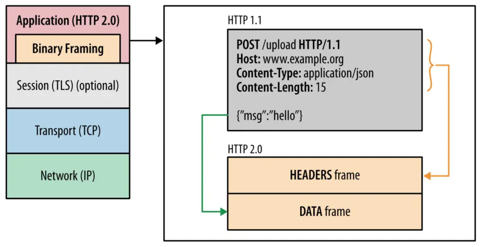

3. **并发传输**

- 引出了 Stream 概念，多个 Stream 复用在一条 TCP 连接。可以在一个连接中并发多个请求或回应，而不用按照顺序一一对应。

- 移除了 HTTP/1.1 中的串行请求，不需要排队等待，也就不会再出现「队头阻塞」问题，降低了延迟，大幅度提高了连接的利用率。

- 举例来说，在一个 TCP 连接里，服务器收到了客户端 A 和 B 的两个请求，如果发现 A 处理过程非常耗时，于是就回应 A 请求已经处

  理好的部分，接着回应 B 请求，完成后，再回应 A 请求剩下的部分。

> [!NOTE]
>
> 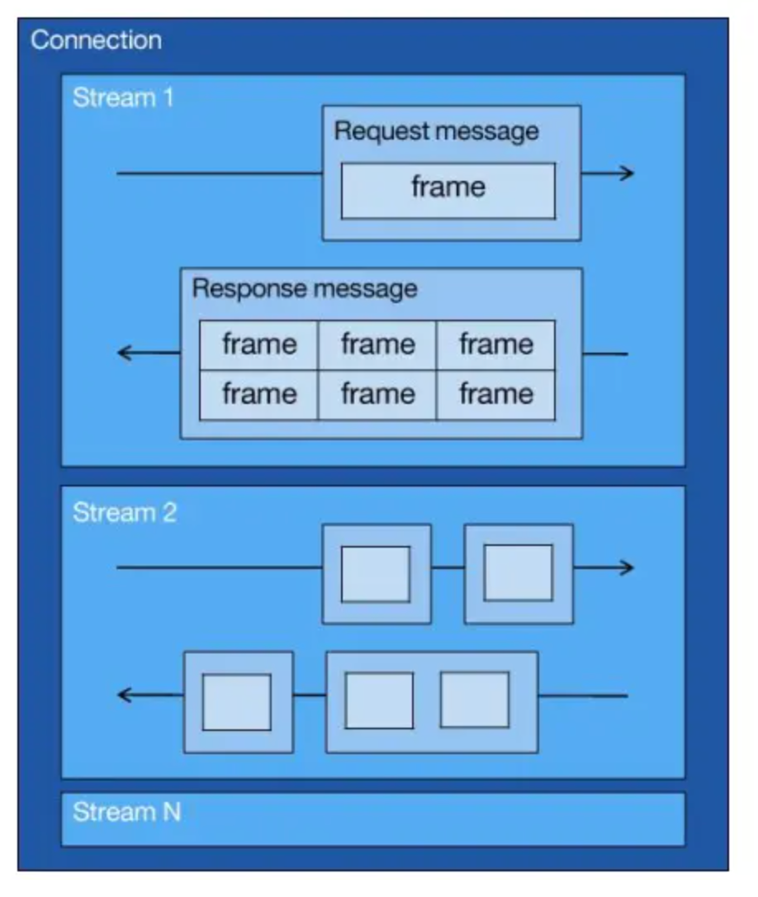
>
> 从上图可以看到，1 个 TCP 连接包含多个 Stream，Stream 里可以包含 1 个或多个 Message，Message 对应 HTTP/1 中的请求或响应，由 HTTP 头部和包体构成。Message 里包含一条或者多个 Frame，Frame 是 HTTP/2 最小单位，以二进制压缩格式存放 HTTP/1 中的内容（头部和包体）。
>
> **针对不同的 HTTP 请求用独一无二的 Stream ID 来区分，接收端可以通过 Stream ID 有序组装成 HTTP 消息，不同 Stream 的帧是可以乱序发送的，因此可以并发不同的 Stream ，也就是 HTTP/2 可以并行交错地发送请求和响应**。
>
> 比如下图，服务端**并行交错地**发送了两个响应： Stream 1 和 Stream 3，这两个 Stream 都是跑在一个 TCP 连接上，客户端收到后，会根据相同的 Stream ID 有序组装成 HTTP 消息。
>
> 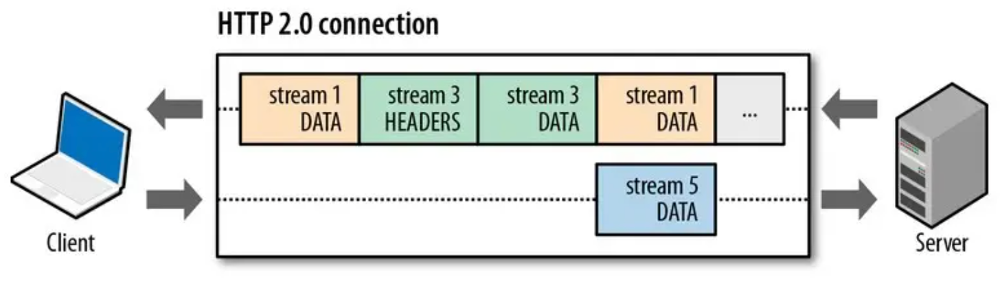

4. **服务器推送**

- HTTP/2 还在一定程度上改善了传统的「请求 - 应答」工作模式，服务不再是被动地响应，也可以主动向客户端发送消息。

- 客户端和服务器**双方都可以建立 Stream**， Stream ID 也是有区别的，客户端建立的 Stream 必须是奇数号，而服务器建立的 

  Stream 必须是偶数号。比如下图，Stream 1 是客户端向服务端请求的资源，属于客户端建立的 Stream，所以该 Stream 的 ID 是奇

  数（数字 1）；Stream 2 和 4 都是服务端主动向客户端推送的资源，属于服务端建立的 Stream，所以这两个 Stream 的 ID 是偶数

  (数字 2 和 4）。

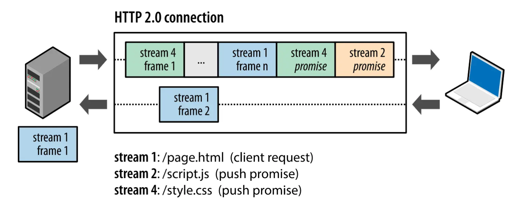

- 举例来说，在浏览器刚请求 HTML 的时候，就提前把可能会用到的 JS、CSS 文件等静态资源主动发给客户端，减少延时的等待，也就是服务器推送（Server Push，也叫 Cache Push）。

**HTTP2.0存在的问题**

HTTP/2 主要的问题在于，多个 HTTP 请求在复⽤⼀个 TCP 连接，下层的 TCP 协议是不知道有多少个 HTTP 请求 的。所以⼀旦发⽣了丢包现象，就会触发 TCP 的重传机制，这样在⼀个 TCP 连接中的所有的 HTTP 请求都必须等待这个丢了的包被重传回来。

- HTTP/1.1 中的管道（ pipeline）传输中如果有⼀个请求阻塞了，那么队列后请求也统统被阻塞住了 
- HTTP/2 多个请求复⽤⼀个TCP连接，⼀旦发⽣丢包，就会阻塞住所有的 HTTP 请求。

> [!NOTE]
>
> HTTP/2 通过 Stream 的并发能力，解决了 HTTP/1 队头阻塞的问题，看似很完美了，但是 HTTP/2 还是存在“队头阻塞”的问题，只不过问题不是在 HTTP 这一层面，而是在 TCP 这一层。HTTP/2 多个请求复⽤⼀个TCP连接，⼀旦发⽣丢包，就会阻塞住所有的 HTTP 请求。
>
> **HTTP/2 是基于 TCP 协议来传输数据的，TCP 是字节流协议，TCP 层必须保证收到的字节数据是完整且连续的，这样内核才会将缓冲区里的数据返回给 HTTP 应用，那么当「前 1 个字节数据」没有到达时，后收到的字节数据只能存放在内核缓冲区里，只有等到这 1 个字节数据到达时，HTTP/2 应用层才能从内核中拿到数据，这就是 HTTP/2 队头阻塞问题。**
>
> 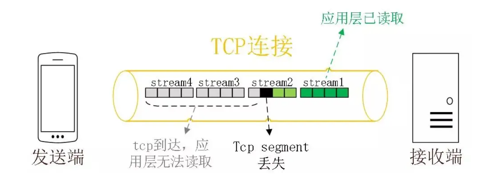
>
> 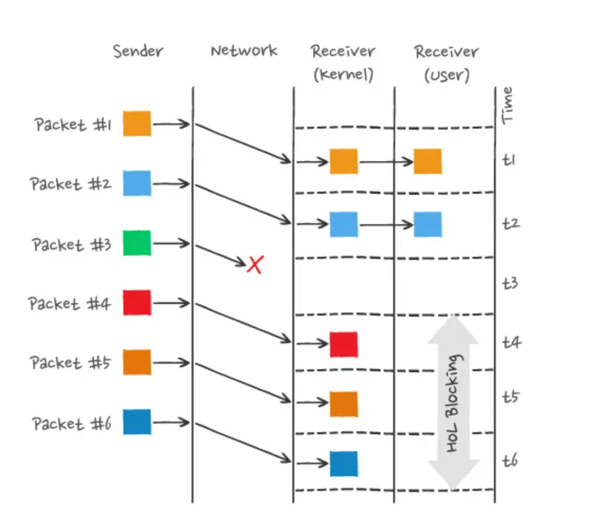
>
> 图中发送方发送了很多个 packet，每个 packet 都有自己的序号，你可以认为是 TCP 的序列号，其中 packet 3 在网络中丢失了，即使 packet 4-6 被接收方收到后，由于内核中的 TCP 数据不是连续的，于是接收方的应用层就无法从内核中读取到，只有等到 packet 3 重传后，接收方的应用层才可以从内核中读取到数据，这就是 HTTP/2 的队头阻塞问题，是在 TCP 层面发生的。
>
> 所以，一旦发生了丢包现象，就会触发 TCP 的重传机制，这样在一个 TCP 连接中的**所有的 HTTP 请求都必须等待这个丢了的包被重传回来**。


**HTTP3对HTTP2的优化**

HTTP/2 虽然通过多个请求复用一个 TCP 连接解决了 HTTP 的队头阻塞 ，但是**一旦发生丢包，就会阻塞住所有的 HTTP 请求**，这属于 TCP 层队头阻塞。

HTTP/2 队头阻塞的问题是因为 TCP，所以 **HTTP/3 把 HTTP 下层的 TCP 协议改成了 UDP！**

UDP 发送是不管顺序，也不管丢包的，所以不会出现像 HTTP/2 队头阻塞的问题。大家都知道 UDP 是不可靠传输的，但基于 UDP 的 **QUIC 协议** 可以实现类似 TCP 的可靠性传输。

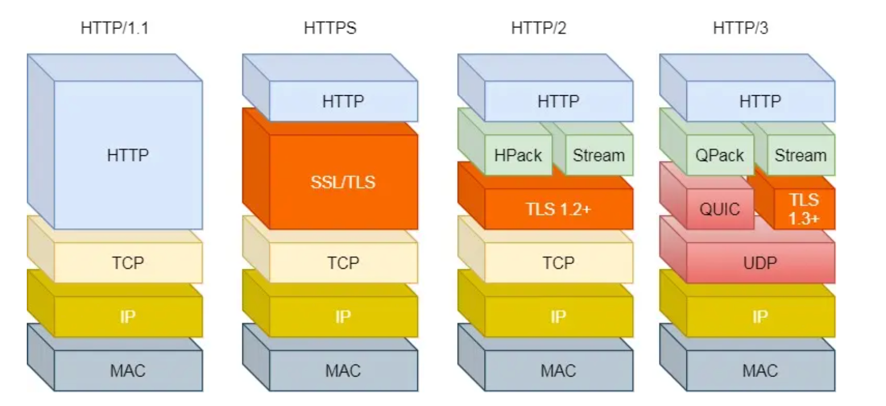

QUIC 有以下 3 个特点。

- 无队头阻塞

  - QUIC 协议也有类似 HTTP/2 Stream 与多路复用的概念，也是可以在同一条连接上并发传输多个 Stream，Stream 可以认为就是一条 HTTP 请求。

  - QUIC 有自己的一套机制可以保证传输的可靠性的。**当某个流发生丢包时，只会阻塞这个流，其他流不会受到影响，因此不存在队头阻塞问题**。这与 HTTP/2 不同，HTTP/2 只要某个流中的数据包丢失了，其他流也会因此受影响。
  - 所以，QUIC 连接上的多个 Stream 之间并没有依赖，都是独立的，某个流发生丢包了，只会影响该流，其他流不受影响。

  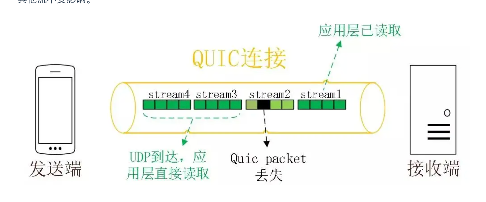

- 更快的连接建立

  - 对于 HTTP/1 和 HTTP/2 协议，TCP 和 TLS 是分层的，分别属于内核实现的传输层、openssl 库实现的表示层，因此它们难以合并在一起，需要分批次来握手，先 TCP 握手，再 TLS 握手。
  - HTTP/3 在传输数据前虽然需要 QUIC 协议握手，但是这个握手过程只需要 1 RTT，握手的目的是为确认双方的「连接 ID」，连接迁移就是基于连接 ID 实现的。
  - 但是 HTTP/3 的 QUIC 协议并不是与 TLS 分层，而是 QUIC 内部包含了 TLS，它在自己的帧会携带 TLS 里的“记录”，再加上 QUIC 使用的是 TLS/1.3，因此仅需 1 个 RTT 就可以「同时」完成建立连接与密钥协商，如下图：

  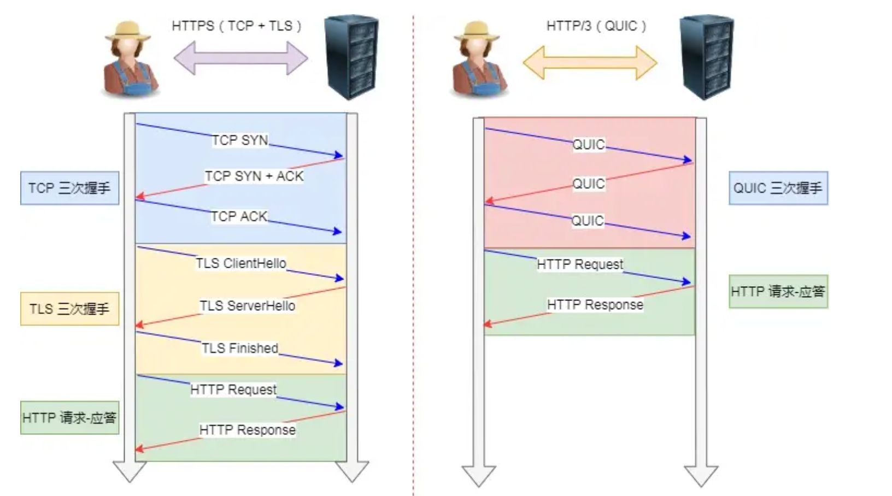

  甚至，在第二次连接的时候，应用数据包可以和 QUIC 握手信息（连接信息 + TLS 信息）一起发送，达到 0-RTT 的效果。

  如下图右边部分，HTTP/3 当会话恢复时，有效负载数据与第一个数据包一起发送，可以做到 0-RTT（下图的右下角）：

  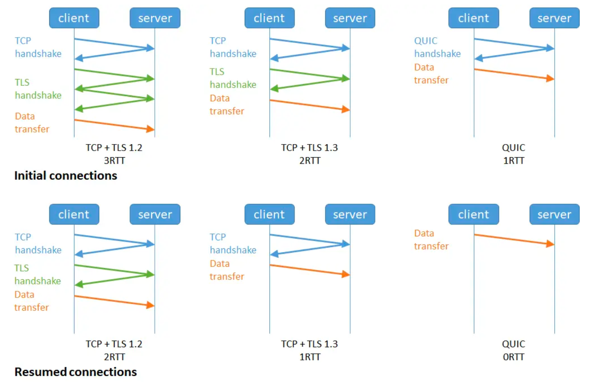

- 连接迁移

  基于 TCP 传输协议的 HTTP 协议，由于是通过四元组（源 IP、源端口、目的 IP、目的端口）确定一条 TCP 连接。

  那么**当移动设备的网络从 4G 切换到 WIFI 时，意味着 IP 地址变化了，那么就必须要断开连接，然后重新建立连接**。而建立连接的过程包含 TCP 三次握手和 TLS 四次握手的时延，以及 TCP 慢启动的减速过程，给用户的感觉就是网络突然卡顿了一下，因此连接的迁移成本是很高的。

  而 QUIC 协议没有用四元组的方式来“绑定”连接，而是通过**连接 ID** 来标记通信的两个端点，客户端和服务器可以各自选择一组 ID 来标记自己，因此即使移动设备的网络变化后，导致 IP 地址变化了，只要仍保有上下文信息（比如连接 ID、TLS 密钥等），就可以“无缝”地复用原连接，消除重连的成本，没有丝毫卡顿感，达到了**连接迁移**的功能。

  所以， QUIC 是一个在 UDP 之上的**伪** TCP + TLS + HTTP/2 的多路复用的协议。

  QUIC 是新协议，对于很多网络设备，根本不知道什么是 QUIC，只会当做 UDP，这样会出现新的问题，因为有的网络设备是会丢掉 UDP 包的，而 QUIC 是基于 UDP 实现的，那么如果网络设备无法识别这个是 QUIC 包，那么就会当作 UDP包，然后被丢弃。

# HTTPS

## 7.1 HTTPS和HTTP的区别

>https://wardseptember.github.io/notes/#/docs/%E8%AE%A1%E7%AE%97%E6%9C%BA%E7%BD%91%E7%BB%9C/HTTP?id=get
1. **安全问题：** HTTP是超文本传输协议，信息是明文传输，存在安全风险的问题。HTTPS解决了HTTP不安全的缺陷,在TCP和HTTP网络层之间加入了SSL/TLS安全协议，使得报文能够加密传输。
2. **建立连接的过程:** HTTP连接建立相对简单，TCP三次握手之后就可以进行HTTP的报文传输，而HTTPS在TCP三次握手之后，还需要SSL/TLS的握手过程，才可进入加密报文传输。
3. **端口号：** HTTP的端口号是80，HTTPS的端口号是443.
4. HTTPS协议需要向CA申请数字证书，来保证服务器的身份是可信的。
## 7.2 HTTPS解决了HTTP的哪些问题？
**HTTP**:
- **窃听风险**：使用明文进行通信，内容很可能被窃听；
- **篡改风险：** 无法证明报文的完整性,报文有可能遭篡改。
- **冒充风险：** 不验证通信方的身份，通信方的身份有可能遭遇伪装。

**HTTPS**:
- **信息加密：** **混合加密**的方式实现信息的机密性，解决了窃听的风险；
- **校验机制：** **摘要算法**实现完整性，能为数据生成独一无二的指纹，解决了窜改的风险；
- **身份证书：** 将服务器公钥放入到**数字证书**中，解决了冒充的风险。

## 7.3 HTTPS保证安全的三种方法
1. 混合加密
通过混合加密的方式可以保证信息的机密性，解决了窃听的风险。
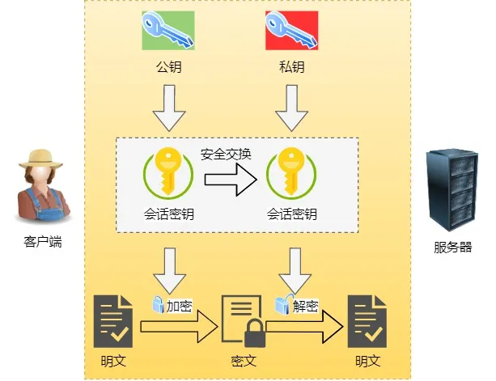

- 采用对称加密和非对称结合的**混合加密**的方式。

  - **在通信建立前采用非对称加密的方式交换会话密钥，服务端有私钥和公钥，客户端获取公钥，同时生成随机密钥使用公钥加密发给服务端，服务端使用私钥进行解密获取对称加密中的密钥。后续就不再使用非对称加密。**


  - 在通信过程中全部使用对称加密的会话密钥的方式加密明文数据。


- 采用混合加密方式的原因

  - 对称加密：只有一个密钥，运算速度快，密钥必须保密，无法做到安全的密钥交换。


  - 非对称加密: 使用两个密钥，公钥和私钥，公钥可以任意分发而私钥保密，解决了密钥交换问题但速度慢。


> 对称加密：编解码使用相同的密钥。
>
> 非对称加密：有两个密钥，一个叫公钥，一个叫私钥，两个密钥是不同的，公钥可以公开给任何人使用，而私钥必须严格保密，非对称加密可以解决密钥交换问题。网站秘密保管私钥，在网上任意分发公钥，想要登陆网站只要用公钥加密就行。密文只能由私钥持有者才能解密。而黑客因为没有私钥，所以无法破解密文。非对称密钥加密系统通常需要大量的数据运算，比较慢。
>
> 

2. 摘要算法+数字签名
- 用来实现**完整性**，能够为数据生成独一无二的指纹，用于校验数据的完整性， **解决了篡改的风险**。

- 客户端在发送明文之前会通过摘要算法（**哈希函数**）算法出明文的哈希值，发送的时候将哈希值和明文一同加密成密文后，发送给服务器，服务器解密后，用相同的摘要算法算出发送过来的明文，通过比较客户端携带的摘要和当前算出来的摘要做比较，若指纹相同，则说明数据是完整的。

- 通过哈希算法可以确保内容不会被篡改，**但是并不能保证「内容 + 哈希值」不会被中间人替换，因为这里缺少对客户端收到的消息是否来源于服务端的证明**。那为了避免这种情况，计算机里会用**非对称加密算法**来解决，共有两个密钥：

  - 一个是公钥，这个是可以公开给所有人的；
  - 一个是私钥，这个必须由本人管理，不可泄露。
  
  这两个密钥可以**双向加解密**的，比如可以用公钥加密内容，然后用私钥解密，也可以用私钥加密内容，公钥解密内容。
  
  流程的不同，意味着目的也不相同：
  
  - **公钥加密，私钥解密**。这个目的是为了**保证内容传输的安全**，因为被公钥加密的内容，其他人是无法解密的，只有持有私钥的人，才能解密出实际的内容；
  - **私钥加密，公钥解密**。这个目的是为了**保证消息不会被冒充**，因为私钥是不可泄露的，如果公钥能正常解密出私钥加密的内容，就能证明这个消息是来源于持有私钥身份的人发送的。
  
  一般我们不会用非对称加密来加密实际的传输内容，因为非对称加密的计算比较耗费性能的。
  
  所以非对称加密的用途主要在于**通过「私钥加密，公钥解密」的方式，来确认消息的身份**，我们常说的**数字签名算法**，就是用的是这种方式，不过私钥加密内容不是内容本身，而是**对内容的哈希值加密**。
  
  私钥是由服务端保管，然后服务端会向客户端颁发对应的公钥。如果客户端收到的信息，能被公钥解密，就说明该消息是由服务器发送的。
  
  >摘要算法能够将任意长度的数据压缩成固定长度，而且独一无二的摘要字符串，就好像是给这串数据生成了一个数字指纹，任意微小的数据差异，都可以生成完全不同的摘要，所以可以通过把明文信息的摘要和明文一起加密传输，数据传输到对方之后再进行解密，重新对数据进行摘要，再对比就能发现数据有没有被篡改，这样就保证了数据的完整性。
  >
  
  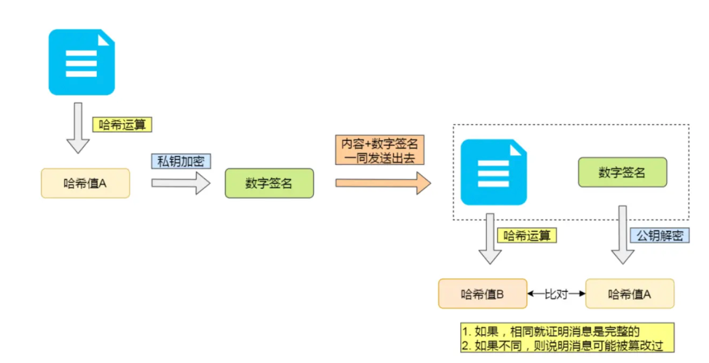
  
  
3. 数字证书

客户端先向服务器索要公钥，然后用公钥加密信息，服务器收到密文后，用自己的私钥解密，这样即存在问题，如何保证公钥不被篡改？
- 借助第三方权威机构CA,将服务器公钥放在数字证书中，只要证书是可信的，公钥就可信。

> 数字证书组成：CA信息，公钥用户信息，公钥，权威机构的签名，有效期。
>
> 作用 ：通过数字证书向浏览器证明身份。数字证书里面包含公钥。

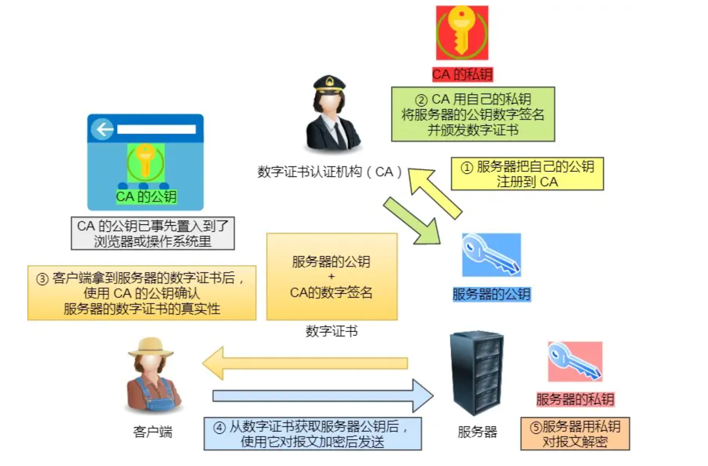

## 7.4 HTTPS是如何建立连接的？

1. TCP三次握手
2. SSL/TLS 协议
- 客户端向服务器索要并验证服务器的公钥。(建立连接的过程)
- 双方协商生产会话密钥。(建立连接的过程)
- 双方采用会话密钥进行加密通信。

**建立连接的过程涉及四次通信**
- **ClientHello：** **由客户端向服务器发起加密通信请求**，也就是 ClientHello 请求。主要发送以下信息:

  - 客户端支持的SSL/TLS协议版本；
  - 客户端生产的**随机数**`Client Random`, 后面用于生产会话密钥。
  - 客户端支持的**密码套件列表**，如RSA加密算法。

- **SeverHello：** **服务器收到客户端请求后，向客户端发出响应**，也就是 SeverHello。主要发送以下内容：

  - 确认SSL/TLS协议版本，如果浏览器不支持，则关闭加密通信。
  - 服务器生产的随机数(`Server Random`)，后面用于生产会话密钥。
  - 确认的密码套件列表，如RSA加密算法。
  - 服务器的数字证书。

- **客户端回应：** **客户端收到服务器的回应之后，首先通过浏览器或者操作系统中的 CA 公钥，确认服务器的数字证书的真实性。如果证书没有问题，客户端会从数字证书中取出服务器的公钥，然后使用它加密报文**，向服务器发送如下信息:

  - 一个随机数(`pre-master key`),该随机数会被服务器公钥加密。
  - 加密通信算法改变通知，表示随后的信息都将用会话密钥加密通信。
  - 客户端握手结束通知，表示客户端的握手阶段已经结束，这一项同时把之前的内容的发生的数据做个摘要，用来供服务端校验。

  上面第一项的随机数是整个握手阶段的第三个随机数，这样服务器和客户端就同时有三个随机数了，接着就用双方协商的加密算法，各自生成本次的会话密钥。

- **服务器的最后回应：** **服务器收到客户端的第三个随机数（pre-master key）之后，通过协商的加密算法，使用客户端随机数+服务端随机数+pre-master key 三个随机数计算出本次通信的「会话秘钥」。**然后，向客户端发生最后的信息。

  - 加密通信算法改变通知，表示随后的信息都将会用会话密钥加密通信。
  - 服务器握手结束通知，表示服务器的握手阶段已经结束，这一项同时把之前所有内容的发生的数据做个摘要，用来供客户端校验。

  至此，整个SSL/TLS握手阶段全部结束。接下来，客户端与服务器端进入加密通信，就是完全使用普通的HTTP协议，只不过使用会话密钥加密内容。

### 客户端校验数字证书的流程是怎样的？

CA 签发证书的过程，如下图左边部分：

- 首先 CA 会把持有者的公钥、用途、颁发者、有效时间等信息打成一个包，然后对这些信息进行 Hash 计算，得到一个 Hash 值；
- 然后 CA 会使用自己的私钥将该 Hash 值加密，生成 Certificate Signature，也就是 CA 对证书做了签名；
- 最后将 Certificate Signature 添加在文件证书上，形成数字证书；

客户端校验服务端的数字证书的过程，如下图右边部分：

- 首先客户端会使用同样的 Hash 算法获取该证书的 Hash 值 H1；
- 通常浏览器和操作系统中集成了 CA 的公钥信息，浏览器收到证书后可以使用 CA 的公钥解密 Certificate Signature 内容，得到一个 Hash 值 H2 ；
- 最后比较 H1 和 H2，如果值相同，则为可信赖的证书，否则则认为证书不可信。

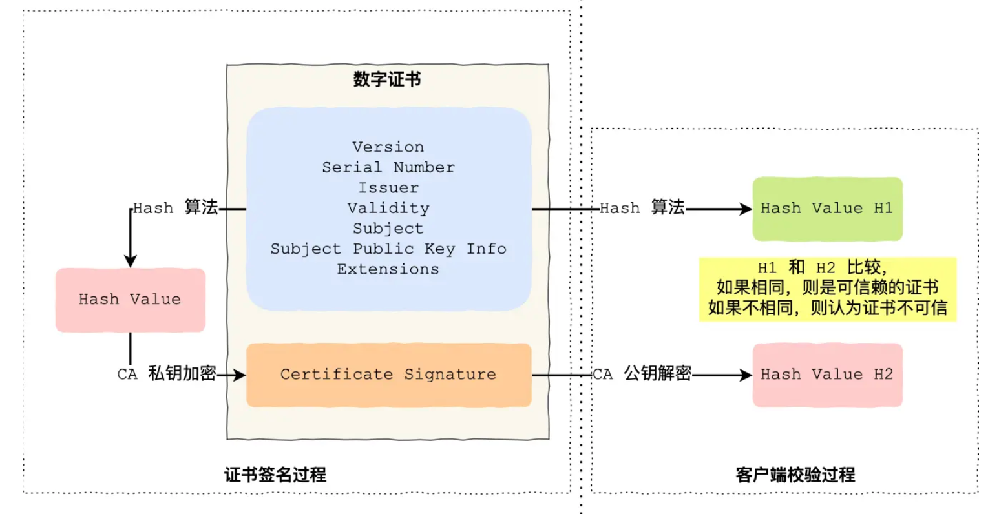

但事实上，证书的验证过程中**还存在一个证书信任链的问题**，因为我们向 CA 申请的证书一般不是根证书签发的，而是由中间证书签发的，比如百度的证书，从下图你可以看到，证书的层级有三级：

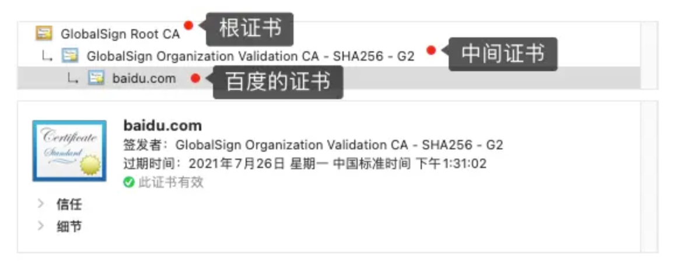

对于这种三级层级关系的证书的验证过程如下：

- 客户端收到 baidu.com 的证书后，发现这个证书的签发者不是根证书，就无法根据本地已有的根证书中的公钥去验证 baidu.com 证书是否可信。于是，客户端根据 baidu.com 证书中的签发者，找到该证书的颁发机构是 “GlobalSign Organization Validation CA - SHA256 - G2”，然后向 CA 请求该中间证书。
- 请求到证书后发现 “GlobalSign Organization Validation CA - SHA256 - G2” 证书是由 “GlobalSign Root CA” 签发的，由于 “GlobalSign Root CA” 没有再上级签发机构，说明它是根证书，也就是自签证书。应用软件会检查此证书有否已预载于根证书清单上，如果有，则可以利用根证书中的公钥去验证 “GlobalSign Organization Validation CA - SHA256 - G2” 证书，如果发现验证通过，就认为该中间证书是可信的。
- “GlobalSign Organization Validation CA - SHA256 - G2” 证书被信任后，可以使用 “GlobalSign Organization Validation CA - SHA256 - G2” 证书中的公钥去验证 baidu.com 证书的可信性，如果验证通过，就可以信任 baidu.com 证书。

在这四个步骤中，最开始客户端只信任根证书 GlobalSign Root CA 证书的，然后 “GlobalSign Root CA” 证书信任 “GlobalSign Organization Validation CA - SHA256 - G2” 证书，而 “GlobalSign Organization Validation CA - SHA256 - G2” 证书又信任 baidu.com 证书，于是客户端也信任 baidu.com 证书。

总括来说，由于用户信任 GlobalSign，所以由 GlobalSign 所担保的 baidu.com 可以被信任，另外由于用户信任操作系统或浏览器的软件商，所以由软件商预载了根证书的 GlobalSign 都可被信任。

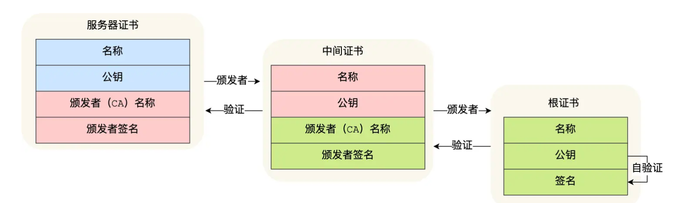

最后一个问题，为什么需要证书链这么麻烦的流程？Root CA 为什么不直接颁发证书，而是要搞那么多中间层级呢？

**这是为了确保根证书的绝对安全性，将根证书隔离地越严格越好，不然根证书如果失守了，那么整个信任链都会有问题。**

## 7.5 HTTPS 的应用数据是如何保证完整性的？

TLS 在实现上分为**握手协议**和**记录协议**两层：

- TLS 握手协议就是我们前面说的 TLS 四次握手的过程，负责协商加密算法和生成对称密钥，后续用此密钥来保护应用程序数据（即 HTTP 数据）；
- TLS 记录协议负责保护应用程序数据并验证其完整性和来源，所以对 HTTP 数据加密是使用记录协议；

LS 记录协议主要负责消息（HTTP 数据）的压缩，加密及数据的认证，过程如下图：

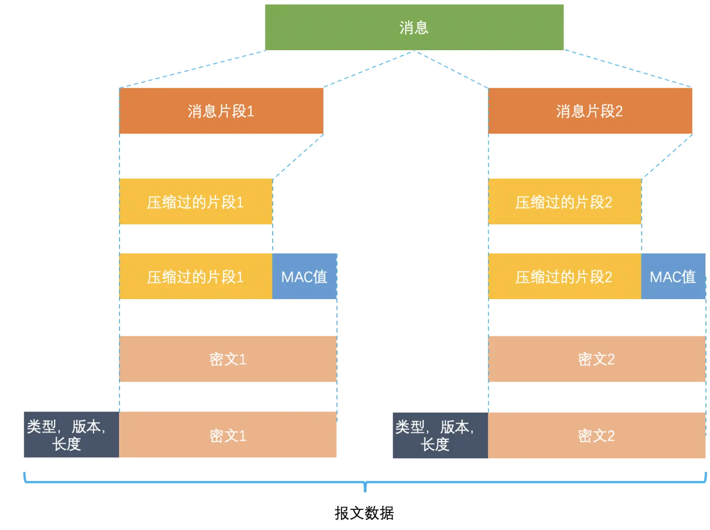

具体过程如下：

- 首先，消息被分割成多个较短的片段,然后分别对每个片段进行压缩。
- 接下来，经过压缩的片段会被**加上消息认证码（MAC 值，这个是通过哈希算法生成的），这是为了保证完整性，并进行数据的认证**。通过附加消息认证码的 MAC 值，可以识别出篡改。与此同时，为了防止重放攻击，在计算消息认证码时，还加上了片段的编码。
- 再接下来，经过压缩的片段再加上消息认证码会一起通过对称密码进行加密。
- 最后，上述经过加密的数据再加上由数据类型、版本号、压缩后的长度组成的报头就是最终的报文数据。

记录协议完成后，最终的报文数据将传递到传输控制协议 (TCP) 层进行传输。

## 7.6 HTTPS 一定安全可靠吗？

*这个问题的场景是这样的：客户端通过浏览器向服务端发起 HTTPS 请求时，被「假基站」转发到了一个「中间人服务器」，于是客户端是和「中间人服务器」完成了 TLS 握手，然后这个「中间人服务器」再与真正的服务端完成 TLS 握手。*

从客户端的角度看，其实并不知道网络中存在中间人服务器这个角色。那么中间人就可以解开浏览器发起的 HTTPS 请求里的数据，也可以解开服务端响应给浏览器的 HTTPS 响应数据。相当于，中间人能够 “偷看” 浏览器与服务端之间的 HTTPS 请求和响应的数据。

但是要发生这种场景是有前提的，前提是用户点击接受了中间人服务器的证书。

中间人服务器与客户端在 TLS 握手过程中，实际上发送了自己伪造的证书给浏览器，而这个伪造的证书是能被浏览器（客户端）识别出是非法的，于是就会提醒用户该证书存在问题。

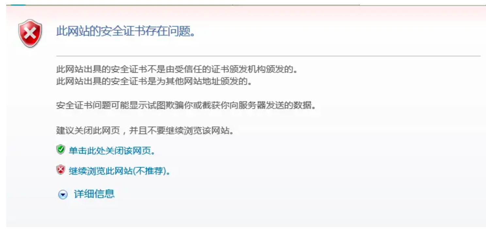

如果用户执意点击「继续浏览此网站」，相当于用户接受了中间人伪造的证书，那么后续整个 HTTPS 通信都能被中间人监听了。

所以，这其实并不能说 HTTPS 不够安全，毕竟浏览器都已经提示证书有问题了，如果用户坚决要访问，那不能怪 HTTPS ，得怪自己手贱。

另外，如果你的电脑中毒了，被恶意导入了中间人的根证书，那么在验证中间人的证书的时候，由于你操作系统信任了中间人的根证书，那么等同于中间人的证书是合法的，这种情况下，浏览器是不会弹出证书存在问题的风险提醒的。

这其实也不关 HTTPS 的事情，是你电脑中毒了才导致 HTTPS 数据被中间人劫持的。

# MAC地址，IP地址和ARP协议

**IP 的作⽤是主机之间通信⽤的，⽽ MAC 的作⽤则是实现「直连」的两个设备之间通信，⽽ IP 则负责在「没有直连」的两个⽹络之间进⾏通信传输。**比如知道两个需要通信的主机的源IP地址和目标IP地址，中间需要很多个路由器，MAC只负责其中某个区间的通信传输。

源IP地址和⽬标IP地址在传输过程中是不会变化的，只有源 MAC 地址和⽬标 MAC ⼀直在变化。


## 8.1 MAC地址

- MAC地址是以太网的MAC子层所使用的地址，它位于数据链路层；
- 当多个主机连接在同一个广播信道上，要实现两个主机之间的通信，则每个主机必须有一个唯一的标识，也就是一个数据链路层地址。
- 在每个主机发送的帧中必须携带标识发送主机和接收主机的地址。由于这类地址是用于媒体接入控制MAC,因此这类地址被称为MAC地址。
- MAC地址是对网络上各接口的唯一标识，而不是对网络上各设备的唯一标识。

## 8.2 IP地址

- IP地址是TCP/IP体系结构网际层所使用的地址。

- IP地址是因特网上的主机和路由器所使用的地址，用于标识两部分信息。
  - 网络编号：标识因特网上数以百计的网络(如192.168.1.2中的192.168.1.)
  - 主机编号：标识同一网络上不同主机(或路由器各接口，192.168.1.2中的2)
- MAC地址不具备区分不同不同网络的功能。
  - 如果只是一个单独的网络，不接入因特网，可以只使用MAC地址。
  - 如果主机所在的网络要接入因特网，则IP地址和MAC地址都需要。

## 8.3 ARP协议

- 在传输一个 IP 数据报的时候，确定了源 IP 地址和目标 IP 地址后，就会通过主机「路由表」确定 IP 数据包下一跳。然而，网络层的下一层是数据链路层，所以我们还要知道「下一跳」的 MAC 地址。
- 由于主机的路由表中可以找到下一跳的 IP 地址，所以可以通过 **ARP 协议**，求得下一跳的 MAC 地址。
- 具体流程：
  - 源主机在自己的ARP高速缓存表中查找目的主机的IP地址所对应的MAC地址，若找到了，则可以封装MAC帧进行发送，若找不到就发送ARP请求(封装在广播MAC帧中)。
  - 目的主机收到ARP请求后，将源主机的IP地址与MAC地址记录到自己的ARP高速缓存表中，然后给源主机发送ARP响应(封装在单播MAC帧中)，ARP响应中包含有目的主机的IP地址和MAC地址。
  - 源主机收到ARP响应后，将目的主机的IP地址与MAC地址记录到自己的ARP高速缓存表中，然后就可以封装之前想要发送的MAC帧并发送给目的主机。
- APR只能用于同一个链路中。

# IP（网络层）

IP 在 TCP/IP 参考模型中处于第三层，也就是⽹络层。

⽹络层的主要作⽤是：实现主机与主机之间的通信，也叫点对点（end to end）通信。

# 在浏览器输入url地址会怎么样？


> **解析URL**

⾸先浏览器做的第⼀步⼯作就是要对 URL 进⾏解析，从⽽⽣成发送给 Web 服务器的请求信息。URL由**访问数据的协议 + // + 服务器名称 + 数据源的路径名**组成，如 http://www.server.com/dir1/file1.html

> **生产HTTP请求**

对 URL 进⾏解析之后，浏览器确定了 Web 服务器和⽂件名，接下来就是根据这些信息来⽣成 HTTP 请求消息了。请求报文是由请求行，消息头和消息体组成。

> **DNS 解析**

通过浏览器解析 URL 并⽣成 HTTP 消息后，需要委托操作系统将消息发送给 Web 服务器。但在发送之前，还有⼀项⼯作需要完成，那就是查询服务器域名对应的 IP 地址，因为委托操作系统发送消息时， 必须提供**通信对象的 IP 地址**。所以，有⼀种服务器就专⻔保存了 Web 服务器域名与 IP 的对应关系，它就是 DNS 服务器。查询的过程：

- 先查询**本地域名服务器**，如果缓存里的表格能找到这个域名，就直接返回IP地址，如果没有，本地DNS域名服务器会找根域名服务器
- **根域名服务器**不直接用于域名解析，而是告诉顶级域名服务器的地址。
- 通过顶级域名服务器获得权威 DNS 服务器 的地址。
-  **权威 DNS 服务器**查询后将对应的 IP 地址 X.X.X.X 告诉本地 DNS。
- 本地 DNS 再将 IP 地址返回客户端，客户端和⽬标建⽴连接。

> **操作系统协议栈**

通过 DNS 获取到 IP 后，就可以把 HTTP 的传输⼯作交给操作系统中的协议栈。应⽤程序（浏览器）通过调⽤ Socket 库，来委托协议栈⼯作。协议栈的上半部分有两块：

- 一个是负责收发数据的 TCP 和 UDP 协议，它们两会接受应⽤层的委托执⾏收发数据的操作。
- 另一个⽤ IP 协议控制⽹络包收发操作，在互联⽹上传数据时，数据会被切分成⼀块块的⽹络包，⽽将⽹络包发送给对⽅的操作就是由 IP 负责的。此外，IP中还包括ICMP协议和APR协议。
  - ICMP ⽤于告知⽹络包传送过程中产⽣的错误以及各种控制信息。
  - ARP ⽤于根据 IP 地址查询相应的以太⽹ MAC 地址。

IP 下⾯的⽹卡驱动程序负责控制⽹卡硬件，⽽最下⾯的⽹卡则负责完成实际的收发操作，也就是对⽹线中的信号执⾏发送和接收操作。

> **可靠传输TCP**

- **TCP包格式**

  - ⾸先，**源端⼝号**和**⽬标端⼝号**是不可少的，如果没有这两个端⼝号，数据就不知道应该发给哪个应⽤。
  - 接下来有**包的序号**，这个是为了解决包乱序的问题。
  - 还有应该有的是**确认号**，⽬的是确认发出去对⽅是否有收到。如果没有收到就应该重新发送，直到送达，这个是为 了解决不丢包的问题。
  - 接下来还有⼀些**状态位**。例如 SYN 是发起⼀个连接， ACK 是回复， RST 是重新连接， FIN 是结束连接 等。TCP 是⾯向连接的，因⽽双⽅要维护连接的状态，这些带状态位的包的发送，会引起双⽅的状态变更。
  - 还有⼀个重要的就是**窗⼝⼤⼩**。TCP 要做流量控制，通信双⽅各声明⼀个窗⼝（缓存⼤⼩），标识⾃⼰当前能够的 处理能⼒，别发送的太快，撑死我，也别发的太慢，饿死我。
  - 除了做流量控制以外，TCP还会做拥塞控制，对于真正的通路堵⻋不堵⻋，它⽆能为⼒，唯⼀能做的就是控制⾃ ⼰，也即控制发送的速度。不能改变世界，就改变⾃⼰嘛。

- **三次握手建立连接**

  - **客户端发送带有SYN标志的数据包，同时含有客户端生成的随机初始化序号。**

    客户端会随机初始化序号（ client_isn ），将此序号置于 TCP ⾸部的「序号」字段中，同时把 SYN 标志 位置为 1 ，表示 SYN 报⽂。接着把第⼀个 SYN 报⽂发送给服务端，表示向服务端发起连接，该报⽂不包含应⽤层数据，之后客户端处于 SYN-SENT 状态。

  - **服务端发送带有SYN=1，ACK=1 标志的数据包。**

    服务端收到客户端的 SYN 报⽂后，⾸先服务端也随机初始化⾃⼰的序号（ server_isn ），将此序号填⼊TCP ⾸部的「序号」字段中，其次把  client_isn + 1填⼊TCP ⾸部的「确认应答号」字段 , 接着把 SYN 和 ACK 标志位置为 1 。最后把该报⽂发给客户端，该报⽂也不包含应⽤层数据，之后服务端处于 SYN-RCVD 状态。

  - **客户端发送带有ACK=1标志的数据包**

    客户端收到服务端报⽂后，还要向服务端回应最后⼀个应答报⽂，⾸先该应答报⽂ TCP ⾸部 ACK 标志位 置为 1 ，其次「确认应答号」字段填⼊ server_isn + 1 ，最后把报⽂发送给服务端，这次报⽂可以携带客户到服务器的数据，之后客户端处于 ESTABLISHED 状态。

  - **服务器收到客户端的应答报⽂后，也进⼊ ESTABLISHED 状态。**
  
- **TCP 分割数据**

  如果 HTTP 请求消息比较长，超过了 `MSS` 的长度，这时 TCP 就需要把 HTTP 的数据拆解成一块块的数据发送，而不是一次性发送所有数据。

  - `MTU`：一个网络包的最大长度，以太网中一般为 `1500` 字节。
  - `MSS`：除去 IP 和 TCP 头部之后，一个网络包所能容纳的 TCP 数据的最大长度。

  数据会被以 `MSS` 的长度为单位进行拆分，拆分出来的每一块数据都会被放进单独的网络包中。也就是在每个被拆分的数据加上 TCP 头信息，然后交给 IP 模块来发送数据。

- **TCP 报文生成**

  TCP 协议里面会有两个端口，一个是浏览器监听的端口（通常是随机生成的），一个是 Web 服务器监听的端口（HTTP 默认端口号是 `80`， HTTPS 默认端口号是 `443`）。

  在双方建立了连接后，TCP 报文中的数据部分就是存放 HTTP 头部 + 数据，组装好 TCP 报文之后，就需交给下面的网络层处理。

> **远程定位IP**

TCP 模块在执⾏连接、收发、断开等各阶段操作时，都需要委托 IP 模块将数据封装成⽹络包发送给通信对象。

在 IP 协议⾥⾯需要有源地址 IP 和 ⽬标地址 IP： 

- 源地址IP，即是客户端输出的 IP 地址； 
- ⽬标地址，即通过 DNS 域名解析得到的 Web 服务器 IP。

> **两点传输MAC**

⽣成了 IP 头部之后，接下来⽹络包还需要在 IP 头部的前⾯加上 MAC 头部。

- 接收方MAC地址：先查询 ARP 缓存，如果其中已经保存了对⽅的 MAC 地址，就不需要发送 ARP 查询，直接使⽤ ARP 缓存中 的地址。⽽当 ARP 缓存中不存在对⽅ MAC 地址时，则发送 ARP ⼴播查询。
- 发送方MAC地址：MAC 地址获取就⽐较简单了，MAC 地址是在⽹卡⽣产时写⼊到 ROM ⾥的，只要将这个值读取出来写⼊ 到 MAC 头部就可以了。
- 协议类型：IP协议（0800），ARP协议（0806）

> **出口——网卡**

⽹络包只是存放在内存中的⼀串⼆进制数字信息，没有办法直接发送给对⽅。因此，我们需要将数字信息转换为电信号，才能在⽹线上传输，也就是说，这才是真正的数据发送过程。

负责执⾏这⼀操作的是⽹卡，要控制⽹卡还需要靠⽹卡驱动程序。

⽹卡驱动从 IP 模块获取到包之后，会将其复制到⽹卡内的缓存区中，接着会在其开头加上报头和起始帧分界符， 在末尾加上⽤于检测错误的帧校验序列。

- 起始帧分界符是⼀个⽤来表示包起始位置的标记 
- 末尾的 FCS （帧校验序列）⽤来检查包传输过程是否有损坏

**最后⽹卡会将包转为电信号，通过⽹线发送出去。**

> **送别者——交换机**

⾸先，电信号到达⽹线接⼝，交换机⾥的模块进⾏接收，接下来交换机⾥的模块将电信号转换为数字信号。

然后通过包末尾的 FCS 校验错误，如果没问题则放到缓冲区。这部分操作基本和计算机的⽹卡相同，但交换机 的⼯作⽅式和⽹卡不同。

计算机的⽹卡本身具有 MAC 地址，并通过核对收到的包的接收⽅ MAC 地址判断是不是发给⾃⼰的，如果不是发 给⾃⼰的则丢弃；相对地，交换机的端⼝不核对接收⽅ MAC 地址，⽽是直接接收所有的包并存放到缓冲区中。因此，和⽹卡不同，交换机的端⼝不具有 MAC 地址。

将包存⼊缓冲区后，接下来需要查询⼀下这个包的接收⽅ MAC 地址是否已经在 MAC 地址表中有记录了。

交换机的 MAC 地址表主要包含两个信息： ⼀个是设备的 MAC 地址，另⼀个是该设备连接在交换机的哪个端⼝上。

**所以，交换机根据 MAC 地址表查找 MAC 地址，然后将信号发送到相应的端⼝。**

**地址表中找不到指定的 MAC 地址。**这可能是因为具有该地址的设备还没有向交换机发送过包，或者这个设备⼀段 时间没有⼯作导致地址被从地址表中删除了。这种情况下，交换机⽆法判断应该把包转发到哪个端⼝，只能将包转发到除了源端⼝之外的所有端⼝上，⽆论该设 备连接在哪个端⼝上都能收到这个包。

> 路由器

当转发包时，⾸先路由器端⼝会接收发给⾃⼰的以太⽹包，然后路由表查询转发⽬标，再由相应的端⼝作为发送⽅ 将以太⽹包发送出去。

> 到达服务端

- 数据包抵达服务器后，服务器会先查看数据包的 MAC 头部是否和服务器⾃⼰的 MAC 地址符合，符合就将 包收起来。
- 接着继续查看数据包的 IP 头中IP 地址是否符合，根据 IP 头中协议项，知道⾃⼰上层是 TCP 协议。 TCP⾥⾯有序列号，需要看⼀看这个序列包是不是我想要的，如果是就放⼊缓存中然后返回⼀ 个 ACK，如果不是就丢弃。
- TCP头部⾥⾯还有端⼝号， HTTP 的服务器正在监听这个端⼝号。 于是，服务器⾃然就知道是 HTTP 进程想要这个包，于是就将包发给 HTTP 进程。
- 服务器的 HTTP 进程看到，原来这个请求是要访问⼀个⻚⾯，于是就把这个⽹⻚封装在 HTTP 响应报⽂⾥。
- HTTP 响应报⽂也需要加上 TCP、IP、MAC 头部，不过这次是源地址是服务器 IP 地址，⽬的地址是客户端 IP 地 址。
- 从⽹卡出去，交由交换机转发到路由器，路由器就把响应数据包发到了下⼀个路由器。最后到达客户端的城⻔把⼿的路由器，路由器扒开 IP 头部发现是要找城内的⼈，于是⼜把包发给了城内的交换 机，再由交换机转发到客户端。
- 客户端把收到的数据包解析到只剩下 HTTP 响应报⽂后，交给浏览器去渲染⻚⾯。
- 最后，客户端向服务器发起了 TCP 四次挥⼿，⾄此双⽅的连接就断开了。

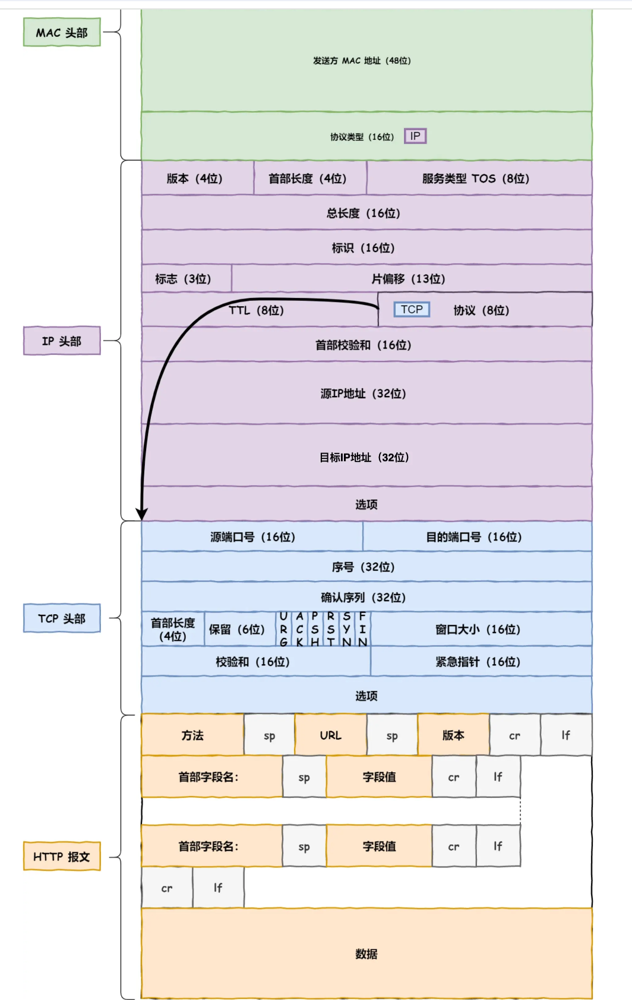


