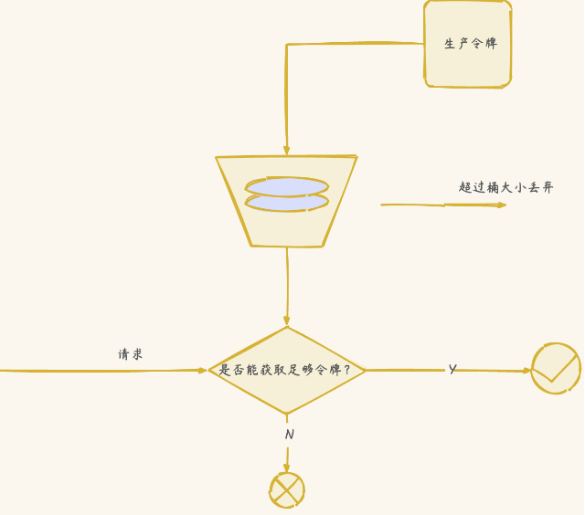

[TOC]


# 一、高可用概念？

高可用描述的是一个系统在大部分时间都是可用的，可以为我们提供服务的。高可用代表系统即使在发生硬件故障或者系统升级的时候，服务仍然是可用的。

一般情况下，我们使用多少个 9 来评判一个系统的可用性，比如 99.9999% 就是代表该系统在所有的运行时间中只有 0.0001% 的时间是不可用的，这样的系统就是非常非常高可用的了！当然，也会有系统如果可用性不太好的话，可能连 9 都上不了。

除此之外，系统的可用性还可以用某功能的失败次数与总的请求次数之比来衡量，比如对网站请求 1000 次，其中有 10 次请求失败，那么可用性就是 99%。

# 二、哪些情况会导致系统不可用？

1. 黑客攻击；
2. 硬件故障，比如服务器坏掉。
3. 并发量/用户请求量激增导致整个服务宕掉或者部分服务不可用。
4. 代码中的坏味道导致内存泄漏或者其他问题导致程序挂掉。
5. 网站架构某个重要的角色比如 Nginx 或者数据库突然不可用。
6. 自然灾害或者人为破坏。
7. ……


# 三、注重代码质量，测试严格把关

我觉得这个是最最最重要的，代码质量有问题比如比较常见的内存泄漏、循环依赖都是对系统可用性极大的损害。大家都喜欢谈限流、降级、熔断，但是我觉得从代码质量这个源头把关是首先要做好的一件很重要的事情。如何提高代码质量？比较实际可用的就是 CodeReview，不要在乎每天多花的那 1 个小时左右的时间，作用可大着呢！

# 四、使用集群，减少单点故障

先拿常用的 Redis 举个例子！我们如何保证我们的 Redis 缓存高可用呢？答案就是使用集群，避免单点故障。当我们使用一个 Redis 实例作为缓存的时候，这个 Redis 实例挂了之后，整个缓存服务可能就挂了。使用了集群之后，即使一台 Redis 实例挂了，不到一秒就会有另外一台 Redis 实例顶上。

# 五、限流

流量控制（flow control），其原理是监控应用流量的 QPS 或并发线程数等指标，当达到指定的阈值时对流量进行控制，以避免被瞬时的流量高峰冲垮，从而保障应用的高可用性。

### 为什么要限流

1. 如果对接N多个上游服务（恶意攻击，秒杀，恶意爬虫等），入口流量很难得到控制，存在被拖垮的风险。
2. 如果集群中一台主机突然出现CPU飙升
3. 流量不均导致单台机器请求量突然增大

###  限流策略

| 类型           | 策略名称                                                     | 策略解释                                                     |
| -------------- | ------------------------------------------------------------ | ------------------------------------------------------------ |
| 全局策略       | 黑白名单策略                                                 | 请求资源命中白名单，直接通过；请求资源命中黑名单，直接拒绝； |
| 百分百策略     | 按一定比例拒绝请求，同时可以配置白名单，不参与百分比计算。   |                                                              |
| 自定义策略     | 集群限频                                                     | 适用场景为限制每个用户的访问次数、限制每个服务（AppKey）的调用次数。通过将用户ID（或者服务的AppKey）传给限流器的UUID参数来实现。1.0策略基于Redis计数实现，2.0策略基于自建的限流服务器计数实现，由于是统一计数，会存在通信消耗。 |
| 集群配额       | 一般与集群限频配合使用。面向场景：除了限制用户每秒的访问次数外，还需要限制用户每天访问总数的最大值。 |                                                              |
| 单机限流       | **基于Google的Guava令牌桶算法实现，默认缓存1秒钟的令牌用来应对突发流量。** |                                                              |
| 集群精确限流   | 单机限流通常情况下能满足大部分的限流需求，不过有些业务需求需要精确的限流，比如限制服务AppKey调用的次数。实现上与集群限频/集群配额一样。跟“集群限频/配额”的差异是：限频策略必须有参数，且参数的key必须是UUID；限流策略可以没有参数，如果有参数，参数的key只需要后台配置跟代码中的key保持一致即可。限频策略对UUID参数的每一个值都是独立的一个限流器；限流策略只有一个限流器，如果配置了参数，则只有命中了参数才会被这个限流器计数、限流。 |                                                              |
| 集群非精确限流 | **基于单机限流实现，根据服务节点数（OCTO上注册）平分集群总阈值到每台机器上，适用服务下每台机器负载均衡的场景。Rhino会监听OCTO上服务节点状态变化，单机QPS会随着可用节点数量的变化动态调整。** |                                                              |
| 兜底策略       | 自适应限流                                                   | 单机总限流策略，可以作为服务兜底。以CPU使用率为指标，通过PID控制算法，通过限流维持CPU利用率在阈值附近 |
| 单机总限流     | 单机总限流策略，配置一个单机的总阈值，所有的资源参与限流计数 |                                                              |

### 算法

#### 令牌桶算法



**Guava限流器是基于令牌桶算法实现的。令牌桶算法是一种针对请求速度的限流算法，算法的核心就是一个令牌桶，桶内令牌数量以固定的速度增长。**

每个请求都需要从桶中获取到足够多的令牌后才能被放行，否则就会被阻塞或者拒绝。

通过这样一个过程，用于只需要设定令牌生成速度，算法就可以通过令牌发放来限制请求通过的速度。

**优点**：

- 流量整形和方便处理突发流量。
- 可以限制平均速率和应对突然激增的流量。
- 可以动态调整生成令牌的速率。

**不足：**

- 并发请求，存在未达到设置阈值也会被限流的情况;
- 如果令牌产生速率和桶的容量设置不合理，可能会出现问题比如大量的请求被丢弃、系统过载。
- 相比于其他限流算法，实现和理解起来更复杂一些。

流量整形是指令牌桶算法通过阻塞、拒绝等手段使请求以稳定的速度通过限流器，原本不规则的流量在经过限流器后变得平滑且均匀。流量整形效果非常有利于服务端稳定运行，类似我们在高并发系统中常用的基于消息队列实现的“削峰填谷”手段，经过整形后，服务端能够以稳定的状态接收并处理请求。

突发流量是指随机出现的、短时间的流量突刺。如果严格遵循流量整形的限制，那么服务端在遇到突发流量时会突然拒绝一大波请求，在客户端有重试机制的情况下还可能导致情况进一步恶化。因此，在服务端资源充足的条件下，限流器应该具有一些“弹性”，允许服务端临时超频处理一些突发请求。

在令牌桶算法模型中，“弹性”处理突发流量是非常容易实现的，只需要给桶中生成的令牌设置一个有效期即可。有突发流量时，限流器可以使用有效期内的剩余令牌来通过更多请求，从而临时提高服务端处理效率，避免大量请求被拒绝。

**采用令牌桶算法策略：单机限流、单机总限流、集群非精确限流**

常见问题：QPS设置100，那么每10ms会产生一个令牌，在出现并发情况，即使1s未达到100个请求，也存在被限流的情况

#### 固定窗口计数


**基于Redis INCRBY + 过期时间来实现**


**原理**：在一定时间内，对处理的请求数进行计数，每次到达时间临界点则计数器清零。在一定时间间隔内，若计数器数值超限，则进行限流。

假如我们规定系统中某个接口 1 分钟只能被访问 33 次的话，使用固定窗口计数器算法的实现思路如下：

- 将时间划分固定大小窗口，这里是 1 分钟一个窗口。
- 给定一个变量 `counter` 来记录当前接口处理的请求数量，初始值为 0（代表接口当前 1 分钟内还未处理请求）。
- 1 分钟之内每处理一个请求之后就将 `counter+1` ，当 `counter=33` 之后（也就是说在这 1 分钟内接口已经被访问 33 次的话），后续的请求就会被全部拒绝。
- 等到 1 分钟结束后，将 `counter` 重置 0，重新开始计数。

**优点**：实现简单，单个计数周期不会超过配置阈值

**不足**：在两端临界点可能出现两倍的流速，流量不均匀

**应用：**集群精确限流1.0、集群限频1.0、集中式限流

#### 滑动窗口


滑动窗口计数器算法相比于固定窗口计数器算法的优化在于：**它把时间以一定比例分片** 。

总结滑动窗口计数法的思路是：

1. 将时间划分为细粒度的区间，每个区间维持一个计数器，每进入一个请求则将计数器加一。
2. 多个区间组成一个时间窗口，每流逝一个区间时间后，则抛弃最老的一个区间，纳入新区间。
3. 若当前窗口的区间计数器总和超过设定的限制数量，则本窗口内的后续请求都被丢弃。

例如我们的接口限流每分钟处理 60 个请求，我们可以把 1 分钟分为 60 个窗口。每隔 1 秒移动一次，每个窗口一秒只能处理不大于 `60(请求数)/60（窗口数）` 的请求， 如果当前窗口的请求计数总和超过了限制的数量的话就不再处理其他请求。

**采用滑动窗口算法使用策略：集群精确限流2.0、集群限频2.0**

优点：

- 相比于固定窗口算法，滑动窗口计数器算法可以应对突然激增的流量。
- 相比于固定窗口算法，滑动窗口计数器算法的颗粒度更小，可以提供更精确的限流控制。

缺点：

- 与固定窗口计数器算法类似，滑动窗口计数器算法依然存在限流不够平滑的问题。
- 相比较于固定窗口计数器算法，滑动窗口计数器算法实现和理解起来更复杂一些。

#### 漏桶算法


我们可以把发请求的动作比作成注水到桶中，我们处理请求的过程可以比喻为漏桶漏水。我们往桶中以任意速率流入水，以一定速率流出水。当水超过桶流量则丢弃，因为桶容量是不变的，保证了整体的速率。

如果想要实现这个算法的话也很简单，准备一个队列用来保存请求，然后我们定期从队列中拿请求来执行就好了（和消息队列削峰/限流的思想是一样的）。

优点：

- 实现简单，易于理解。
- 可以控制限流速率，避免网络拥塞和系统过载。

缺点：

- 无法应对突然激增的流量，因为只能以固定的速率处理请求，对系统资源利用不够友好。
- 桶流入水（发请求）的速率如果一直大于桶流出水（处理请求）的速率的话，那么桶会一直是满的，一部分新的请求会被丢弃，导致服务质量下降。

实际业务场景中，基本不会使用漏桶算法。

#### 自适应限流

根据系统的负载情况（CPU使用率），自动决策请求是否通过，降级了用户的使用成本


### 单机限流

单机限流针对的是单体架构应用。

单机限流可以直接使用 Google Guava 自带的限流工具类 RateLimiter 。 RateLimiter 基于令牌桶算法，可以应对突发流量。

除了最基本的令牌桶算法(平滑突发限流)实现之外，Guava 的RateLimiter还提供了 **平滑预热限流** 的算法实现。

平滑突发限流就是按照指定的速率放令牌到桶里，而平滑预热限流会有一段预热时间，预热时间之内，速率会逐渐提升到配置的速率。

```java
<dependency>
    <groupId>com.google.guava</groupId>
    <artifactId>guava</artifactId>
    <version>31.0.1-jre</version>
</dependency>

```

```java
import com.google.common.util.concurrent.RateLimiter;

public class RateLimiterDemo {

    public static void main(String[] args) {
        // 1s 放 5 个令牌到桶里也就是 0.2s 放 1个令牌到桶里
        RateLimiter rateLimiter = RateLimiter.create(5);
        for (int i = 0; i < 10; i++) {
            double sleepingTime = rateLimiter.acquire(1);
            System.out.printf("get 1 tokens: %ss%n", sleepingTime);
        }
    }
}


```

### 分布式限流

分布式限流针对的分布式/微服务应用架构应用，在这种架构下，单机限流就不适用了，因为会存在多种服务，并且一种服务也可能会被部署多份。

分布式限流常见的方案：

- **借助中间件限流**：可以借助 Sentinel 或者使用 Redis 来自己实现对应的限流逻辑。
- **网关层限流**：比较常用的一种方案，直接在网关层把限流给安排上了。不过，通常网关层限流通常也需要借助到中间件/框架。就比如 Spring Cloud Gateway 的分布式限流实现RedisRateLimiter就是基于 Redis+Lua 来实现的，再比如 Spring Cloud Gateway 还可以整合 Sentinel 来做限流。

### 针对什么来进行限流？

实际项目中，还需要确定限流对象，也就是针对什么来进行限流。常见的限流对象如下：

- IP ：针对 IP 进行限流，适用面较广，简单粗暴。
- 业务 ID：挑选唯一的业务 ID 以实现更针对性地限流。例如，基于用户 ID 进行限流。
- 个性化：根据用户的属性或行为，进行不同的限流策略。例如， VIP 用户不限流，而普通用户限流。根据系统的运行指标（如 QPS、并发调用数、系统负载等），动态调整限流策略。例如，当系统负载较高的时候，控制每秒通过的请求减少。

针对 IP 进行限流是目前比较常用的一个方案。不过，实际应用中需要注意用户真实 IP 地址的正确获取。常用的真实 IP 获取方法有 X-Forwarded-For 和 TCP Options 字段承载真实源 IP 信息。虽然 X-Forwarded-For 字段可能会被伪造，但因为其实现简单方便，很多项目还是直接用的这种方法。

除了我上面介绍到的限流对象之外，还有一些其他较为复杂的限流对象策略，比如阿里的 Sentinel 还支持 [基于调用关系的限流open in new window](https://github.com/alibaba/Sentinel/wiki/流量控制#基于调用关系的流量控制)（包括基于调用方限流、基于调用链入口限流、关联流量限流等）以及更细维度的 [热点参数限流open in new window](https://github.com/alibaba/Sentinel/wiki/热点参数限流)（实时的统计热点参数并针对热点参数的资源调用进行流量控制）。

另外，一个项目可以根据具体的业务需求选择多种不同的限流对象搭配使用。

## 现有的限流器

# 六. 熔断降级

### 背景


如果请求调用链路上有一个服务出现故障，如上图的服务A出现故障，错误会随着调用链路一级一级向上传播，进而导致API出现故障，进一步导致WEB也出现故障，可能由于一个服务出问题导致业务整体不可用。

造成下游服务故障的原因有很多，比如：

- 定时任务导致负载升高
- 代码逻辑问题
- 网络问题

如果没有正确处理的话，服务每次都会调用下游接口，如果是下游服务不可用，每次都会长时间的超时，导致延迟大大增加。

### 熔断降级&重试机制

熔断降级是微服务架构中一种常用的容错机制，它能够保证在分布式系统中，当某个服务出现问题时，不会导致整个系统的瘫痪，提高了系统的可用性和稳定性。

**熔断（Circuit Breaker）是一种自动化的保护机制，当某个服务出现错误或延迟等异常情况时，熔断器会自动切断对该服务的调用。熔断器有三种状态：关闭状态（Closed）、打开状态（Open）和半开状态（Half-Open）。在正常情况下，熔断器处于关闭状态，当请求次数、失败率、失败数同时达到设定阈值时，熔断器会切换到打开状态，此时对该服务的调用会全部被降级。在经过一段时间的休眠后，熔断器进入半开状态，允许部分请求访问服务，如果服务恢复正常，则熔断器返回关闭状态；如果仍然存在问题，熔断器会再次切换到打开状态。**


**降级（Degradation）是在服务出现异常时采取的一种应对措施，通过降低服务的功能或质量，以减轻系统压力。降级策略通常包括：返回默认值、返回缓存数据、返回简化数据或直接忽略非关键服务等。降级的目标是在保证核心功能正常运行的情况下，牺牲部分次要功能或服务质量，避免整个系统因为单一服务异常而崩溃。**

熔断降级的基本作用如下：

保护资源：当某个服务出现异常时，熔断器可以切断对该服务的调用，防止过多的请求涌入，避免资源耗尽。

提高可用性：通过熔断降级机制，系统可以在出现异常时自动进行容错处理，保证系统整体的可用性。

隔离故障：熔断降级可以将故障隔离在单个服务上，防止故障扩散，提高系统的稳定性。

快速故障响应：当服务出现异常时，熔断降级可以迅速响应，避免用户长时间等待。

提高系统容错能力：在分布式系统中，熔断降级能够帮助系统应对各种异常情况，提高系统的容错能力。

 

对于这种问题，比较好的方式在依赖的服务不可用时，服务调用方通过一些技术手段，向上提供有损服务，保证业务柔性可用。


| 名称   | 解释                             |
| ------ | -------------------------------- |
| 强依赖 | 用户有感知，出错会影响整体流量   |
| 弱依赖 | 用户无感知，出错不会影响整体流程 |


**重试机制**，如果下游的的接口是核心依赖（强依赖），在出现异常的情况下，可以通过重试尽可能的保证成功率，下游服务如果没有出现大面积的异常，通过重试就可以获取到正常的响应。

常见的重试策略有两种：

1. **固定间隔时间重试**：每次重试之间都使用相同的时间间隔，比如每隔 1.5 秒进行一次重试。这种重试策略的优点是实现起来比较简单，不需要考虑重试次数和时间的关系，也不需要维护额外的状态信息。但是这种重试策略的缺点是可能会导致重试过于频繁或过于稀疏，从而影响系统的性能和效率。如果重试间隔太短，可能会对目标系统造成过大的压力，导致雪崩效应；如果重试间隔太长，可能会导致用户等待时间过长，影响用户体验。
2. **梯度间隔重试**：根据重试次数的增加去延长下次重试时间，比如第一次重试间隔为 1 秒，第二次为 2 秒，第三次为 4 秒，以此类推。这种重试策略的优点是能够有效提高重试成功的几率（随着重试次数增加，但是重试依然不成功，说明目标系统恢复时间比较长，因此可以根据重试次数延长下次重试时间），也能通过柔性化的重试避免对下游系统造成更大压力。但是这种重试策略的缺点是实现起来比较复杂，需要考虑重试次数和时间的关系，以及设置合理的上限和下限值。另外，这种重试策略也可能会导致用户等待时间过长，影响用户体验。

这两种适合的场景各不相同。固定间隔时间重试适用于目标系统恢复时间比较稳定和可预测的场景，比如网络波动或服务重启。梯度间隔重试适用于目标系统恢复时间比较长或不可预测的场景，比如网络故障和服务故障。

**重试的次数**不宜过多，否则依然会对系统负载造成比较大的压力。

重试的次数通常建议设为 3 次。大部分情况下，我们还是更建议使用梯度间隔重试策略，比如说我们要重试 3 次的话，第 1 次请求失败后，等待 1 秒再进行重试，第 2 次请求失败后，等待 2 秒再进行重试，第 3 次请求失败后，等待 3 秒再进行重试。

**熔断降级功能**，如果下游的接口是弱依赖，可以监控接口每次调用的健康度，如果健康度低于设置的阈值时，自动熔断所依赖的下游服务，直接返回降级数据，保证服务可用。

### 现有的熔断器


# 七、异步调用

- **线程池异步调用**
- **消息队列**

异步调用的话我们不需要关心最后的结果，这样我们就可以用户请求完成之后就立即返回结果，具体处理我们可以后续再做，秒杀场景用这个还是蛮多的。但是，使用异步之后我们可能需要 **适当修改业务流程进行配合**，比如**用户在提交订单之后，不能立即返回用户订单提交成功，需要在消息队列的订单消费者进程真正处理完该订单之后，甚至出库后，再通过电子邮件或短信通知用户订单成功**。除了可以在程序中实现异步之外，我们常常还使用消息队列，消息队列可以通过异步处理提高系统性能（削峰、减少响应所需时间）并且可以降低系统耦合性。

# 八、使用缓存

如果我们的系统属于并发量比较高的话，如果我们单纯使用数据库的话，当大量请求直接落到数据库可能数据库就会直接挂掉。使用缓存缓存热点数据，因为缓存存储在内存中，所以速度相当地快！

# 九、幂等

### **概念**

幂等(idempotency)本身是一个数学概念，常见于抽象代数中，表示一个函数或者操作的结果不受其输入或者执行次数的影响。例如， f(n) = 1^n ，无论 n 为多少，f(n)的值永远为 1。

在软件开发领域，幂等是对请求操作结果的一个描述，这个描述就是不论执行多少次相同的请求，产生的效果和返回的结果都和发出单个请求是一样的。

针对数据操作来说就是：

- insert操作要保证不插入重复的数据；
- update操作要保证多次相同请求数据依然正确。

接口幂等性问题通常是由于网络波动、用户重复操作、超时重试、消息重复消费、响应速度慢等原因导致的。

### **不保证幂等会有什么后果？**

没有保证幂等会导致产生严重的生产级别的 Bug，比较典型的就是涉及到钱的业务场景。就比如在没有保证幂等性的情况下，我作为用户在付款的时候，我同时点击了多次付款按钮，后端处理了多次相同的扣款请求，结果导致我的账户被扣了多次钱。这就是属于非常非常非常严重的 Bug 了！只要业务涉及到钱就一定要格外注意！！！

综上，保证接口的幂等性至关重要。

另外，保证幂等性这个 操作并不是说前端做了就可以的，后端同样也要做。

### **如何保证接口幂等性？**

前端保证幂等性的话比较简单，一般通过当用户提交请求后将按钮致灰来做到。

后端保证幂等性就稍微麻烦一点，方法也是有很多种，比如悲观锁、唯一索引、去重表、乐观锁 、分布式锁、Token 机制等等。

悲观锁和分布式锁的核心思想都是通过加锁来保证同一时刻只有一个请求能被执行。但仅仅这样是不够的，还需要配合根据业务逻辑进行幂等性判断，例如，注册场景检测指定的电话/邮箱/用户名是否已经被注册、订单支付场景检测订单的状态。

实际项目中，一般采用分布式锁这种方案比较多。

- **悲观锁**
  - 在 Java 中，可以使用 ReetrantLock 类、synchronized 关键字这类 JDK 自带的悲观锁来保证同一时刻只有一个线程能够进行修改。不过，JDK 自带的锁属于是本地锁，分布式环境下无法使用。
  - 除了利用 JDK 提供的悲观锁之外，数据库自身也带了排他锁（X 锁）。排他锁又称写锁/独占锁，事务在修改记录的时候获取排他锁，不允许多个事务同时获取。如果一个记录已经被加了排他锁，那其他事务不能再对这条事务加任何类型的锁（锁不兼容）。
  - 排他锁只能在支持事务的存储引擎（如 InnoDB）中使用，且只能在事务中使用。另外，排他锁只能在有索引的字段上使用，否则会锁住整个表，影响并发性能。
  - 高并发的场景下，激烈的锁竞争会造成线程阻塞，大量阻塞线程会导致系统的上下文切换，增加系统的性能开销。并且，**悲观锁还可能会存在死锁问题，影响代码的正常运行。**
  
- **乐观锁**
  - 乐观锁一般会使用版本号机制或 CAS 算法实现。拿版本号机制来说，通过在表中增加一个版本号字段，每次更新数据时，检查当前的版本号否和数据库中的一致。如果一致，则更新成功，并且版本号加一。如果不一致，则更新失败，表示数据已经被其他请求修改过。
  - 高并发的场景下，乐观锁相比悲观锁来说，不存在锁竞争造成线程阻塞，也不会有死锁的问题，在性能上往往会更胜一筹。但是，如果冲突频繁发生（写占比非常多的情况），会频繁失败和重试（悲观锁的开销是固定的），这样同样会非常影响性能，导致 CPU 飙升。不过，这种方法只适用于更新数据的场景。
  
- **唯一索引**
  - 通过在表中加上唯一索引，保证数据的唯一性。如果有重复的数据插入，会抛出异常，程序可以捕获异常并处理。不过，这种方法只适用于插入数据的场景。
  
    ```sql
    create table t_order(
    id int unsigned PRIMARY KEY AUTO_INCREMENT COMMENT "主键",
        `code` varchar(200) not null COMMENT "流水号",
        `customer_id`  int unsigned COMMENT "会员id",
        `amount` decimal(10,2) unsigned not null COMMENT "总金额",
        -- 省略其他订单字段
        -- 省略其他索引
        # 订单流水号唯一
        UNIQUE unq_code(`code`)
    ) COMMENT="订单表";
    ```
  
  - 不要依靠唯一索引来保证接口幂等，但建议使用唯一索引作为兜底，避免产生脏数据。
  
- **去重表**
  - 去重表本质上也是一种唯一索引方案。去重表是一张专门用于记录请求信息的表，其中某个字段需要建立唯一索引，用于标识请求的唯一性当客户端发出请求时，服务端会将这次请求的一些信息（如订单号、交易流水号等）插入到去重表中，如果插入成功，说明这是第一次请求，可以执行后续的业务逻辑；如果插入失败，说明这是重复请求，可以直接返回或者忽略。
  
- **分布式锁**
  - 分布式系统下，不同的服务/客户端通常运行在独立的 JVM 进程上，需要使用分布式锁。
  - 基于 MySQL 也可以实现分布式锁，但一般我们不会采用这种方式。通常情况下，我们一般会选择基于 Redis 或者 ZooKeeper 实现分布式锁，Redis 用的要更多一点。
  - 我们上面提到的关系型数据的乐观锁、唯一索引和排他锁也算是分布式锁的实现方式，只是一般不会采用这种方式实现分布式锁，问题太多比如性能太差、不具备锁失效机制。
  
- **Token机制**
  - Token 机制的核心思想是为每一次操作生成一个唯一性的凭证 token。这个 token 需要由服务端生成的，因为服务端可以对 token 进行签名和加密，防止篡改和泄露。如果由客户端生成 token，可能会存在安全隐患，比如客户端伪造或重复 token，导致服务端无法识别和校验。
  - 这样的话，就需要两次请求才能完成一次业务操作：
    - 请求获取服务器端 token，token 需要设置有效时间（可以设置短一点），服务端将该 token 保存起来（通常保存在缓存中）。
    - 执行真正的请求，将上一步获取到的 token 放到 header 或者作为请求参数。服务端验证 token 的有效性，如果有效（一般是通过删除 token 的方式来验证，删除成功则有效），执行业务逻辑，并删除 token，防止重复提交；如果无效，拒绝请求，返回提示信息。
  - 先执行业务逻辑再删除 token 还是先删除 token 再执行业务逻辑呢？两者似乎都有风险：
    - 先执行业务逻辑的话，客户端可能会在该 token 还存在的时候又携带 token 发起请求，由于 token 还存在，第二次请求也会验证通过。
    - 先删除 token 的话，如果业务逻辑执行超时或者出现网络波动，客户端需要重试请求，那 token 就用不成了。
    - **一般还是建议先删除 token，如果出现执行异常就重新获取 token 再请求，只有极少一部分请求才会遇到这种问题。**

# 十、其他

- **核心应用和服务优先使用更好的硬件**
- **监控系统资源使用情况增加报警设置**。
- **注意备份，必要时候回滚。**

**灰度发布：** 将服务器集群分成若干部分，每天只发布一部分机器，观察运行稳定没有故障，第二天继续发布一部分机器，持续几天才把整个集群全部发布完毕，期间如果发现问题，只需要回滚已发布的一部分服务器即可

**定期检查/更换硬件：** 如果不是购买的云服务的话，定期还是需要对硬件进行一波检查的，对于一些需要更换或者升级的硬件，要及时更换或者升级。