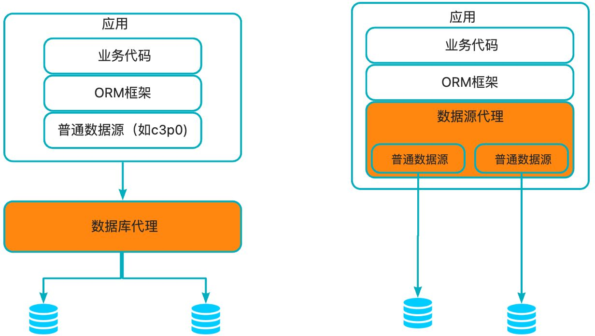
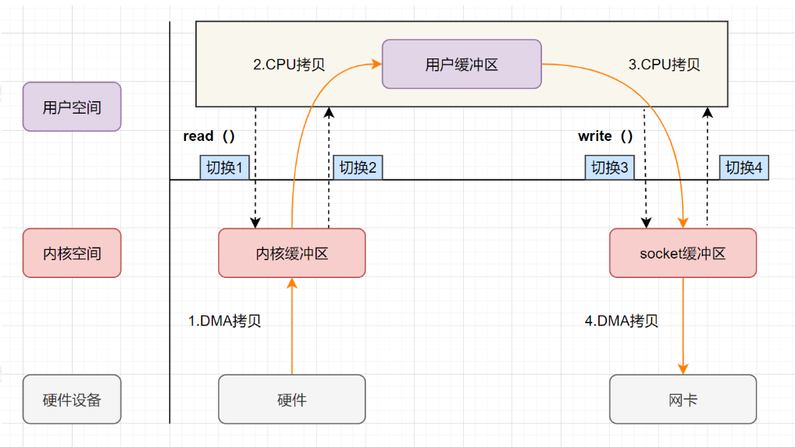
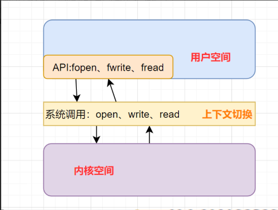
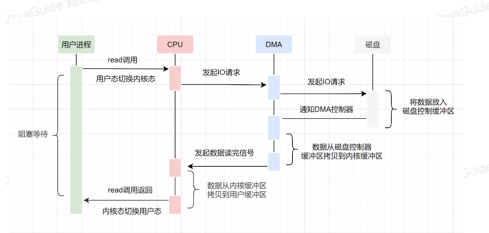
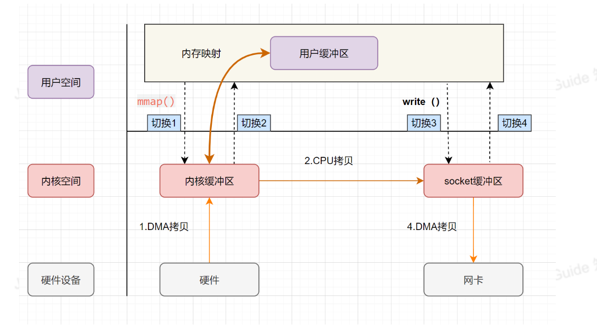
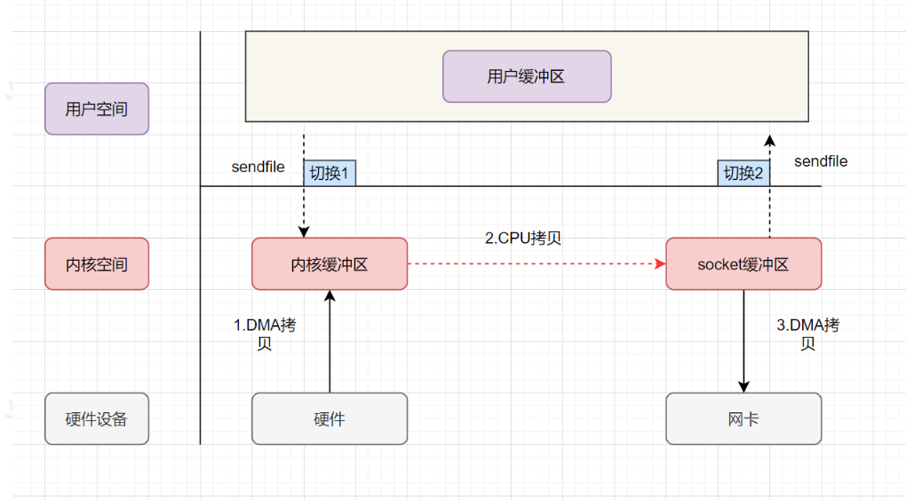
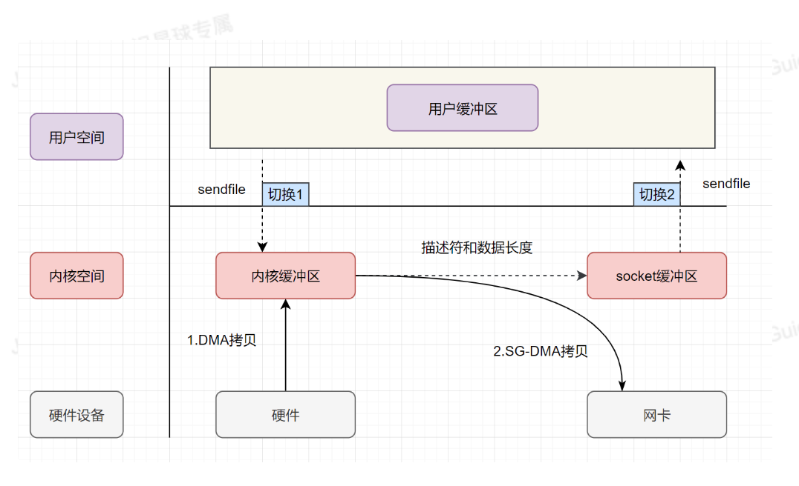
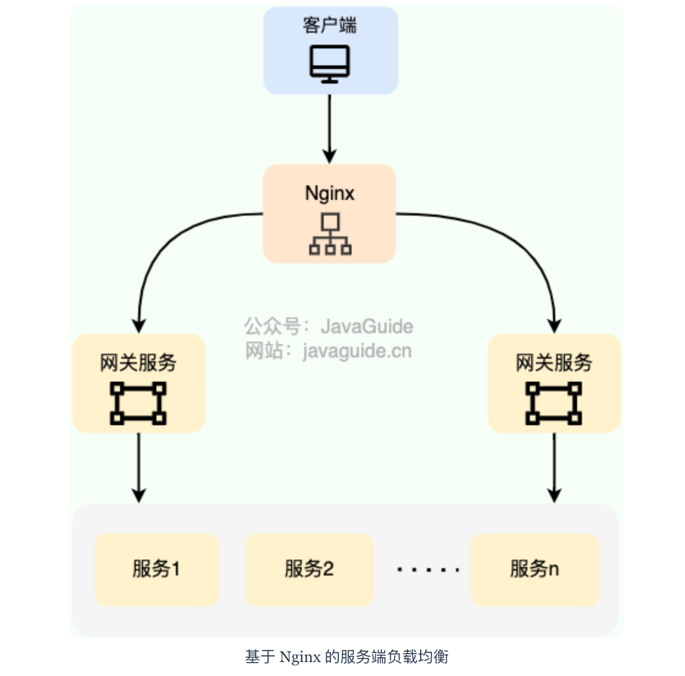
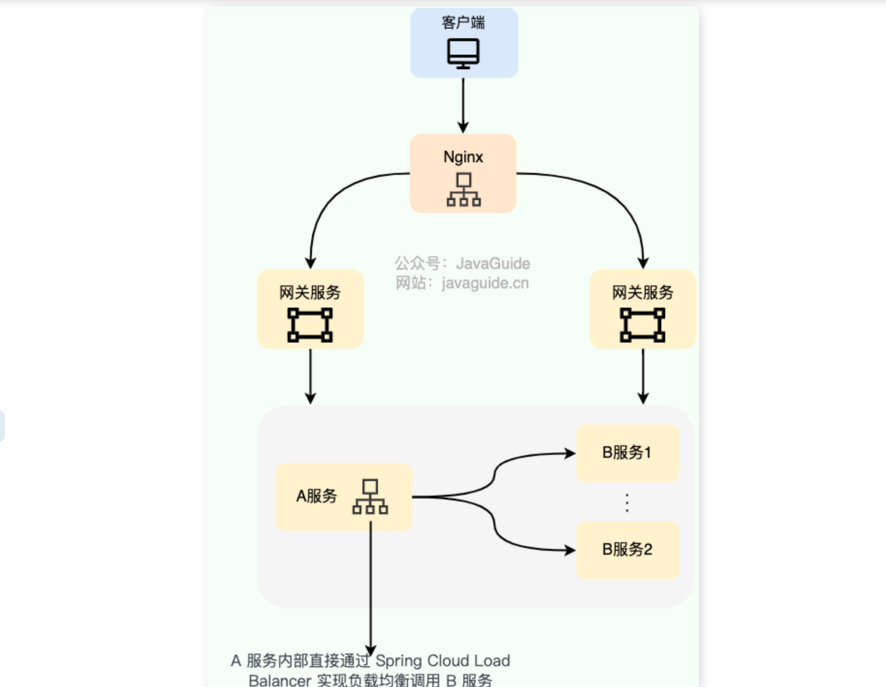
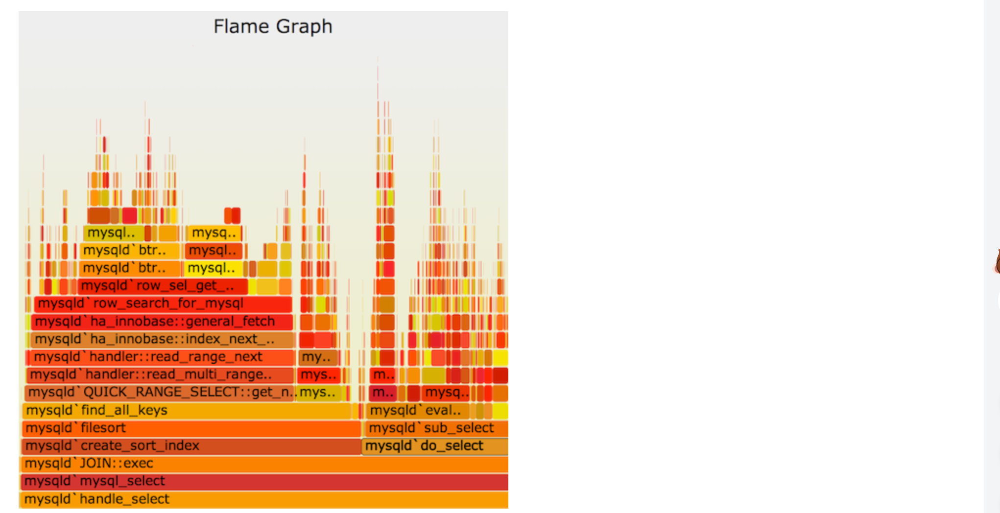

[TOC]


# 数据库优化

在未进行读写分离/分库分表的情况下，我们是直接在应用中通过数据源(c3p0、druid、dbcp2等)与数据库建立连接，进行读写操作，在操作单库单表的情况下，我们是直接在应用中通过数据源(c3p0、druid、dbcp等)与数据库建立连接，进行读写操作。

大部分开发人员对于访问单库的应用的架构都是很熟悉的。但是在进行读写分离/分库分表后，底层的数据库实例就会有多个，读写分离情况下一个master多个slave；分库分表的情况下，有多个不同的分库。

从应用的角度来说，除了要与多个不同的数据库建立连接，还需要处理分库分表/读写分离特定场景下的问题：

- 在**读写分离**的情况下，应用需要对读sql/写sql进行区分，读sql走从库，写sql走主库，并考虑主从同步延迟、高可用等一系列问题。
- 在**分库分表**的情况下，应用需要能对sql进行解析、改写、路由、结果集合并等一些操作，以及分布式事务、分布式id生成器等。

这无疑是个复杂的工作，而**数据库中间件的作用，**是让开发人员可以像操作单库单表那样去操作数据库，屏蔽底层复杂的实现。 

## 读写分离

#### **概念**

在单台mysql实例的情况下，所有的读写操作都集中在这一个实例上。**当读压力太大，单台mysql实例扛不住时，此时DBA一般会将数据库配置成集群，一个master(主库)，多个slave(从库)，master将数据通过binlog的方式同步给slave，可以将slave节点的数据理解为master节点数据的全量备份。**关于如何配置mysql主从同步，可以参考mysql官方文档：[https://dev.mysql.com/doc/refman/5.7/en/replication.html](https://dev.mysql.com/doc/refman/5.7/en/replication.html，)

从应用的角度来说，需要对读(select、show、explain等)、写(insert、update、delete等)操作进行区分。如果是写操作，就走主库，主库会将数据同步给从库；之后有读操作，就走从库，从多个slave中选择一个，查询数据。

#### **优点**

1. **避免单点故障。**
2. **负载均衡，读能力水平扩展。**通过配置多个slave节点，可以有效的避免过大的访问量对单个库造成的压力。

#### **挑战**

1. **对sql类型进行判断。**如果是select等读请求，就走从库，如果是insert、update、delete等写请求，就走主库。

2. **主从数据同步延迟问题。**因为数据是从master节点通过网络同步给多个slave节点，因此必然存在延迟。因此有可能出现我们在master节点中已经插入了数据，但是从slave节点却读取不到的问题。**对于一些强一致性的业务场景，要求插入后必须能读取到，因此对于这种情况，我们需要提供一种方式，让读请求也可以走主库，而主库上的数据必然是最新的。**

3. **事务问题。**如果一个事务中同时包含了读请求(如select)和写请求(如insert)，如果读请求走从库，写请求走主库，由于跨了多个库，那么jdbc本地事务已经无法控制，属于分布式事务的范畴。而分布式事务非常复杂且效率较低。因此对于读写分离，目前主流的做法是，事务中的所有sql统一都走主库，由于只涉及到一个库，jdbc本地事务就可以搞定。

4. **高可用问题。**主要包括：

   - **新增slave节点：**如果新增slave节点，应用应该感知到，可以将读请求转发到新的slave节点上。

   - **slave宕机或下线：**如果其中某个slave节点挂了/或者下线了，应该对其进行隔离，那么之后的读请求，应用将其转发到正常工作的slave节点上。

   - **master宕机：**需要进行主从切换，将其中某个slave提升为master，应用之后将写操作转到新的master节点上。

#### **实现方案**

- 部署多台数据库，选择其中的一台作为主数据库，其他的一台或者多台作为从数据库。

- 保证主数据库和从数据库之间的数据是实时同步的，这个过程也就是我们常说的**主从复制**。

- 系统将写请求交给主数据库处理，读请求交给从数据库处理。

落实到项目本身的话，常用的方式有两种：

典型的数据库中间件设计方案有2种：服务端代理(proxy：代理数据库)、客户端代理(datasource：代理数据源)。下图演示了这两种方案的架构：



可以看到不论是代理数据库还是代理数据源，底层都操作了多个数据库实例。不同的是：

- **服务端代理(proxy：代理数据库)中：**

  - 思路：我们独立部署一个代理服务，这个代理服务背后管理多个数据库实例。而在应用中，我们通过一个普通的数据源(c3p0、druid、dbcp等)与代理服务器建立连接，所有的sql操作语句都是发送给这个代理，由这个代理去操作底层数据库，得到结果并返回给应用。在这种方案下，分库分表和读写分离的逻辑对开发人员是完全透明的。

  - **目前的实现方案有**：阿里巴巴开源的cobar，mycat团队在cobar基础上开发的mycat，mysql官方提供的mysql-proxy，奇虎360在mysql-proxy基础开发的atlas。目前除了mycat，其他几个项目基本已经没有维护。
  - **优点**：多语言支持。也就是说，不论你用的php、java或是其他语言，都可以支持。原因在于数据库代理本身就实现了mysql的通信协议，你可以就将其看成一个mysql 服务器。mysql官方团队为不同语言提供了不同的客户端驱动，如java语言的mysql-connector-java，python语言的mysql-connector-python等等。因此不同语言的开发者都可以使用mysql官方提供的对应的驱动来与这个代理服务器建通信。
  - **缺点**：实现复杂。因为代理服务器需要实现mysql服务端的通信协议，因此实现难度较大。

- **客户端代理(datasource：代理数据源)：**

  - **概述：**应用程序需要使用一个特定的数据源，其作用是代理，内部管理了多个普通的数据源(c3p0、druid、dbcp等)，每个普通数据源各自与不同的库建立连接。应用程序产生的sql交给数据源代理进行处理，数据源内部对sql进行必要的操作，如sql改写等，然后交给各个普通的数据源去执行，将得到的结果进行合并，返回给应用。数据源代理通常也实现了JDBC规范定义的API，因此能够直接与orm框架整合。在这种方案下，用户的代码需要修改，使用这个代理的数据源，而不是直接使用c3p0、druid、dbcp这样的连接池。

  - **目前的实现方案有**：阿里巴巴开源的tddl，大众点评开源的zebra，当当网开源的sharding-jdbc。需要注意的是tddl的开源版本只有读写分离功能，没有分库分表，且开源版本已经不再维护。大众点评的zebra开源版本代码已经很久更新，基本上处于停滞的状态。当当网的sharding-jdbc目前算是做的比较好的，代码时有更新，文档资料比较全。

  - **优点**：**更加轻量，可以与任何orm框架整合。**这种方案不需要实现mysql的通信协议，因为底层管理的普通数据源，可以直接通过mysql-connector-java驱动与mysql服务器进行通信，因此实现相对简单。

  - **缺点：仅支持某一种语言**。例如tddl、zebra、sharding-jdbc都是使用java语言开发，因此对于使用其他语言的用户，就无法使用这些中间件。版本升级困难，因为应用使用数据源代理就是引入一个jar包的依赖，在有多个应用都对某个版本的jar包产生依赖时，一旦这个版本有bug，所有的应用都需要升级。而数据库代理升级则相对容易，因为服务是单独部署的，只要升级这个代理服务器，所有连接到这个代理的应用自然也就相当于都升级了。

#### 主从复制

MySQL binlog(binary log 即二进制日志文件) 主要记录了 MySQL 数据库中数据的所有变化(数据库执行的所有 DDL 和 DML 语句)。因此，我们根据主库的 MySQL binlog 日志就能够将主库的数据同步到从库中。

- 主库将数据库中数据的变化写入到 binlog

- 从库连接主库

- 从库会创建一个 I/O 线程向主库请求更新的 binlog

- 主库会创建一个 binlog dump 线程来发送 binlog ，从库中的 I/O 线程负责接收

- 从库的 I/O 线程将接收的 binlog 写入到 relay log 中。

- 从库的 SQL 线程读取 relay log 同步数据到本地（也就是再执行一遍 SQL ）。

**MySQL 主从复制是依赖于 binlog 。另外，常见的一些同步 MySQL 数据到其他数据源的工具（比如 canal）的底层一般也是依赖 binlog 。**

#### 主从延迟

读写分离对于提升数据库的并发非常有效，但是，同时也会引来一个问题：主库和从库的数据存在延迟，比如你写完主库之后，主库的数据同步到从库是需要时间的，这个时间差就导致了主库和从库的数据不一致性问题。这也就是我们经常说的 **主从同步延迟** 。

- 强制将读请求路由到主库处理
- 延迟读取（延迟展示给用户）

原因是什么？

- 从库 I/O 线程接收 binlog 的速度跟不上主库写入 binlog 的速度，导致从库 relay log 的数据滞后于主库 binlog 的数据；
- 从库 SQL 线程执行 relay log 的速度跟不上从库 I/O 线程接收 binlog 的速度，导致从库的数据滞后于从库 relay log 的数据。

> **从库机器性能比主库差**：从库接收 binlog 并写入 relay log 以及执行 SQL 语句的速度会比较慢（也就是 T2-T1 和 T3-T2 的值会较大），进而导致延迟。解决方法是选择与主库一样规格或更高规格的机器作为从库，或者对从库进行性能优化，比如调整参数、增加缓存、使用 SSD 等。
>
> **从库处理的读请求过多**：从库需要执行主库的所有写操作，同时还要响应读请求，如果读请求过多，会占用从库的 CPU、内存、网络等资源，影响从库的复制效率（也就是 T2-T1 和 T3-T2 的值会较大，和前一种情况类似）。解决方法是引入缓存（推荐）、使用一主多从的架构，将读请求分散到不同的从库，或者使用其他系统来提供查询的能力，比如将 binlog 接入到 Hadoop、Elasticsearch 等系统中。
>
> **大事务**：运行时间比较长，长时间未提交的事务就可以称为大事务。由于大事务执行时间长，并且从库上的大事务会比主库上的大事务花费更多的时间和资源，因此非常容易造成主从延迟。解决办法是避免大批量修改数据，尽量分批进行。类似的情况还有执行时间较长的慢 SQL ，实际项目遇到慢 SQL 应该进行优化。
>
> **从库太多**：主库需要将 binlog 同步到所有的从库，如果从库数量太多，会增加同步的时间和开销（也就是 T2-T1 的值会比较大，但这里是因为主库同步压力大导致的）。解决方案是减少从库的数量，或者将从库分为不同的层级，让上层的从库再同步给下层的从库，减少主库的压力。
>
> **网络延迟**：如果主从之间的网络传输速度慢，或者出现丢包、抖动等问题，那么就会影响 binlog 的传输效率，导致从库延迟。解决方法是优化网络环境，比如提升带宽、降低延迟、增加稳定性等。
>
> **单线程复制**：MySQL5.5 及之前，只支持单线程复制。为了优化复制性能，MySQL 5.6 引入了 **多线程复制**，MySQL 5.7 还进一步完善了多线程复制。
>
> **复制模式**：MySQL 默认的复制是异步的，必然会存在延迟问题。全同步复制不存在延迟问题，但性能太差了。半同步复制是一种折中方案，相对于异步复制，半同步复制提高了数据的安全性，减少了主从延迟（还是有一定程度的延迟）。MySQL 5.5 开始，MySQL 以插件的形式支持 **semi-sync 半同步复制**。并且，MySQL 5.7 引入了 **增强半同步复制** 。

## 分库分表

#### **介绍**

 读写分离，主要是为了数据库**读能力的水平扩展**，而分库分表则是为了**写能力的水平扩展。**

一旦业务表中的数据量大了，从维护和性能角度来看，无论是任何的 CRUD 操作，对于数据库而言都是一件极其耗费资源的事情。即便设置了索引， 仍然无法掩盖因为数据量过大从而导致的数据库性能下降的事实 ，这个时候就该对数据库进行 水平分区 （sharding，即分库分表 ），将原本一张表维护的海量数据分配给 N 个子表进行存储和维护。

水平分表从具体实现上又可以分为3种：**只分表**、**只分库**、**分库分表**

**只分表：**将db库中的user表拆分为2个分表，user_0和user_1，这两个表还位于同一个库中。  

**只分库：**将db库拆分为db_0和db_1两个库，同时在db_0和db_1库中各自新建一个user表，db_0.user表和db_1.user表中各自只存原来的db.user表中的部分数据。

**分库分表：**将db库拆分为db_0和db_1两个库，db_0中包含user_0、user_1两个分表，db_1中包含user_2、user_3两个分表。

下图演示了在分库分表的情况下，数据是如何拆分的：假设db库的user表中原来有4000W条数据，现在将db库拆分为2个分库db_0和db_1，user表拆分为user_0、user_1、user_2、user_3四个分表，每个分表存储1000W条数据。

#### **优点**

降低单台机器的负载压力，提升写入性能

**分表的好处：**

提高数据操作的效率。举个例子说明，比如user表中现在有4000w条数据，此时我们需要在这个表中增加（insert）一条新的数据，insert完毕后，数据库会针对这张表重新建立索引，4000w行数据建立索引的系统开销还是不容忽视的。但是反过来，假如我们将这个表分成4 个table呢，从user_0一直到user_3，4000w行数据平均下来，每个子表里边就只有1000W行数据，这时候我们向一张 只有1000W行数据的table中insert数据后建立索引的时间就会下降，从而提高DB的运行时效率，提高了DB的并发量。除了提高写的效率，更重要的是提高读的效率，提高查询的性能。当然分表的好处还不止这些，还有诸如写操作的锁操作等，都会带来很多显然的好处。

#### **挑战**

分库分表的挑战主要体现在4个方面：基本的数据库增删改功能，分布式id，分布式事务，动态扩容，下面逐一进行讲述。 

1. **基本的数据库增删改功能**   

对于开发人员而言，虽然分库分表的，但是其还是希望能和单库单表那样的去操作数据库。例如我们要批量插入四条用户记录，并且希望根据用户的id字段，确定这条记录插入哪个库的哪张表。例如1号记录插入user_1表，2号记录插入user_2表，3号记录插入user_3表，4号记录插入user_0表，以此类推。sql如下所示：

```plain
insert into user(id,name) values (1,”tianshouzhi”),(2,”huhuamin”), (3,”wanghanao”),(4,”luyang”)
```

这样的sql明显是无法执行的，因为我们已经对库和表进行了拆分,这种sql语法只能操作mysql的单个库和单个表。所以必须将sql改成4条如下所示，然后分别到每个库上去执行。

```plain
insert into user_1(id,name) values (1,”tianshouzhi”)
insert into user_2(id,name) values (2,”huhuamin”)
insert into user_3(id,name) values (3,”wanghanao”)
insert into user_0(id,name) values  (4,”luyang”)
```

具体流程如下：

- **sql解析：**首先对sql进行解析，得到需要插入的四条记录的id字段的值分别为1,2,3,4
- **sql路由：**sql路由包括库路由和表路由。库路由用于确定这条记录应该插入哪个库，表路由用于确定这条记录应该插入哪个表。
- **sql改写：**上述批量插入的语法将会在 每个库中都插入四条记录，明显是不合适的，因此需要对sql进行改写，每个库只插入一条记录。
- **sql执行：**一条sql经过改写后变成了多条sql，为了提升效率应该并发的到不同的库上去执行，而不是按照顺序逐一执行
- **结果集合并：**每个sql执行之后，都会有一个执行结果，我们需要对分库分表的结果集进行合并，从而得到一个完整的结果。

2. **分布式id**

在分库分表后，我们不能再使用mysql的自增主键。因为在插入记录的时候，不同的库生成的记录的自增id可能会出现冲突。因此需要有一个全局的id生成器。

3. **分布式事务**

分布式事务是分库分表绕不过去的一个坎，因此涉及到了同时更新多个数据库。例如上面的批量插入记录到四个不同的库，如何保证要么同时成功，要么同时失败。关于分布式事务，mysql支持XA事务，但是效率较低。柔性事务是目前比较主流的方案，柔性事务包括：最大努力通知型、可靠消息最终一致性方案以及TCC两阶段提交。但是无论XA事务还是柔性事务，实现起来都是非常复杂的。

4. **动态扩容**

动态扩容指的是增加分库分表的数量。

例如原来的user表拆分到2个库的四张表上。现在我们希望将分库的数量变为4个，分表的数量变为8个。这种情况下一般要伴随着数据迁移。例如在4张表的情况下，id为7的记录，7%4=3，因此这条记录位于user_3这张表上。但是现在分表的数量变为了8个，而7%8=7，而user_7这张表上根本就没有id=7的这条记录，因此如果不进行数据迁移的话，就会出现记录找不到的情况。

5. **数据迁移**

对于新的应用，如果预估到未来数据量比较大，可以提前进行分库分表。但是对于一些老的应用，单表数据量已经比较大了，这个时候就涉及到数据迁移的过程。

- 比较简单同时也是非常常用的方案就是**停机迁移**，写个脚本老库的数据写到新库中。比如你在凌晨 2 点，系统使用的人数非常少的时候，挂一个公告说系统要维护升级预计 1 小时。然后，你写一个脚本将老库的数据都同步到新库中。
- **双写方案**：
  - 我们对老库的更新操作（增删改），同时也要写入新库（双写）。如果操作的数据不存在于新库的话，需要插入到新库中。 这样就能保证，咱们新库里的数据是最新的。
  - 在迁移过程，双写只会让被更新操作过的老库中的数据同步到新库，我们还需要自己写脚本将老库中的数据和新库的数据做比对。如果新库中没有，那咱们就把数据插入到新库。如果新库有，旧库没有，就把新库对应的数据删除（冗余数据清理）。
  - 重复上一步的操作，直到老库和新库的数据一致为止。

#### 什么情况下需要分库分表？

遇到下面几种场景可以考虑分库分表：

- 单表的数据达到千万级别以上，数据库读写速度比较缓慢。
- 数据库中的数据占用的空间越来越大，备份时间越来越长。
- 应用的并发量太大（应该优先考虑其他性能优化方法，而非分库分表）。

不过，分库分表的成本太高，如非必要尽量不要采用。而且，并不一定是单表千万级数据量就要分表，毕竟每张表包含的字段不同，它们在不错的性能下能够存放的数据量也不同，还是要具体情况具体分析。

#### 常见的分片算法有哪些？

分片算法主要解决了数据被水平分片之后，数据究竟该存放在哪个表的问题。

**哈希分片**：求指定分片键的哈希，然后根据哈希值确定数据应被放置在哪个表中。哈希分片比较适合随机读写的场景，不太适合经常需要范围查询的场景。哈希分片可以使每个表的数据分布相对均匀，但对动态伸缩（例如新增一个表或者库）不友好。

**范围分片**：按照特定的范围区间（比如时间区间、ID 区间）来分配数据，比如 将 `id` 为 `1~299999` 的记录分到第一个表， `300000~599999` 的分到第二个表。范围分片适合需要经常进行范围查找且数据分布均匀的场景，不太适合随机读写的场景（数据未被分散，容易出现热点数据的问题）。

**映射表分片**：使用一个单独的表（称为映射表）来存储分片键和分片位置的对应关系。映射表分片策略可以支持任何类型的分片算法，如哈希分片、范围分片等。映射表分片策略是可以灵活地调整分片规则，不需要修改应用程序代码或重新分布数据。不过，这种方式需要维护额外的表，还增加了查询的开销和复杂度。

**一致性哈希分片**：将哈希空间组织成一个环形结构，将分片键和节点（数据库或表）都映射到这个环上，然后根据顺时针的规则确定数据或请求应该分配到哪个节点上，解决了传统哈希对动态伸缩不友好的问题。

**地理位置分片**：很多 NewSQL 数据库都支持地理位置分片算法，也就是根据地理位置（如城市、地域）来分配数据。

**融合算法分片**：灵活组合多种分片算法，比如将哈希分片和范围分片组合。

#### 分片键如何选择？

分片键（Sharding Key）是数据分片的关键字段。分片键的选择非常重要，它关系着数据的分布和查询效率。一般来说，分片键应该具备以下特点：

- 具有共性，即能够覆盖绝大多数的查询场景，尽量减少单次查询所涉及的分片数量，降低数据库压力；
- 具有离散性，即能够将数据均匀地分散到各个分片上，避免数据倾斜和热点问题；
- 具有稳定性，即分片键的值不会发生变化，避免数据迁移和一致性问题；
- 具有扩展性，即能够支持分片的动态增加和减少，避免数据重新分片的开销。

实际项目中，分片键很难满足上面提到的所有特点，需要权衡一下。并且，分片键可以是表中多个字段的组合，例如取用户 ID 后四位作为订单 ID 后缀。

## 深度分页

查询偏移量过大的场景我们称为深度分页，这会导致查询性能较低，例如：

```sql
# MySQL 在无法利用索引的情况下跳过1000000条记录后，再获取10条记录
SELECT * FROM t_order ORDER BY id LIMIT 1000000, 10

```

 `limit m，n`查询过程是数据库的服务层的执行器调用存储引擎从磁盘中读取m+n条记录到服务层，然后服务层根据offset丢掉前m条，保留第【m，m+n】n条结果，并返回给客户端返回，从磁盘中读取m+n条数据是整个查询过程中耗时的操作，理论上分析`limit m,n `方式查询m条数所用耗时和直接查询`m+n`数据时间应该接近，没有明显的时间差距。

#### 范围查询

当可以保证 ID 的连续性时，根据 ID 范围进行分页是比较好的解决方案, 这种优化方式限制比较大，且一般项目的 ID 也没办法保证完全连续。

```sql
# 查询指定 ID 范围的数据
SELECT * FROM t_order WHERE id > 100000 AND id <= 100010 ORDER BY id
# 也可以通过记录上次查询结果的最后一条记录的ID进行下一页的查询：
SELECT * FROM t_order WHERE id > 100000 LIMIT 10

```

#### 子查询

我们先查询出 limit 第一个参数对应的主键值，再根据这个主键值再去过滤并 limit，这样效率会更快一些。

```sql
# 通过子查询来获取 id 的起始值，把 limit 1000000 的条件转移到子查询
SELECT * FROM t_order WHERE id >= (SELECT id FROM t_order limit 1000000, 1) LIMIT 10;

```

不过，子查询的结果会产生一张新表，会影响性能，应该尽量避免大量使用子查询。并且，这种方法只适用于 ID 是正序的。在复杂分页场景，往往需要通过过滤条件，筛选到符合条件的 ID，此时的 ID 是离散且不连续的。

当然，我们也可以利用子查询先去获取目标分页的 ID 集合，然后再根据 ID 集合获取内容，但这种写法非常繁琐，不如使用 INNER JOIN 延迟关联

#### 延迟关联

延迟关联的优化思路，跟子查询的优化思路其实是一样的：都是把条件转移到主键索引树，减少回表的次数。不同点是，延迟关联使用了 INNER JOIN（内连接） 包含子查询。

```java
SELECT t1.* FROM t_order t1
INNER JOIN (SELECT id FROM t_order limit 1000000, 10) t2
ON t1.id = t2.id;

```

#### 覆盖索引

索引中已经包含了所有需要获取的字段的查询方式称为覆盖索引。

**覆盖索引的好处：**

- **避免 InnoDB 表进行索引的二次查询，也就是回表操作:** InnoDB 是以聚集索引的顺序来存储的，对于 InnoDB 来说，二级索引在叶子节点中所保存的是行的主键信息，如果是用二级索引查询数据的话，在查找到相应的键值后，还要通过主键进行二次查询才能获取我们真实所需要的数据。而在覆盖索引中，二级索引的键值中可以获取所有的数据，避免了对主键的二次查询（回表），减少了 IO 操作，提升了查询效率。
- **可以把随机 IO 变成顺序 IO 加快查询效率:** 由于覆盖索引是按键值的顺序存储的，对于 IO 密集型的范围查找来说，对比随机从磁盘读取每一行的数据 IO 要少的多，因此利用覆盖索引在访问时也可以把磁盘的随机读取的 IO 转变成索引查找的顺序 IO。

```sql
# 如果只需要查询 id, code, type 这三列，可建立 code 和 type 的覆盖索引
SELECT id, code, type FROM t_order
ORDER BY code
LIMIT 1000000, 10;

```

## SQL优化

#### 避免使用 SELECT *

- `SELECT *` 会消耗更多的 CPU。
- `SELECT *` 无用字段增加网络带宽资源消耗，增加数据传输时间，尤其是大字段（如 varchar、blob、text）。
- `SELECT * `无法使用 MySQL 优化器覆盖索引的优化（基于 MySQL 优化器的“覆盖索引”策略又是速度极快，效率极高，业界极为推荐的查询优化方式）
- `SELECT <字段列表>` 可减少表结构变更带来的影响。

#### **尽量避免多表做 join**

join 的效率比较低，主要原因是因为其使用嵌套循环（Nested Loop）来实现关联查询，三种不同的实现效率都不是很高：

- Simple Nested-Loop Join ：没有进过优化，直接使用笛卡尔积实现 join，逐行遍历/全表扫描，效率最低。
- Block Nested-Loop Join ：利用 JOIN BUFFER 进行优化，性能受到 JOIN BUFFER 大小的影响，相比于 Simple Nested-Loop Join 性能有所提升。不过，如果两个表的数据过大的话，无论如何优化，Block Nested-Loop Join 对性能的提升都非常有限。
- Index Nested-Loop Join ：在必要的字段上增加索引，使 join 的过程中可以使用到这个索引，这样可以让 Block Nested-Loop Join 转换为 Index Nested-Loop Join，性能得到进一步提升。

实际业务场景避免多表 join 常见的做法有两种：

- 单表查询后在内存中自己做关联 ：对数据库做单表查询，再根据查询结果进行二次查询，以此类推，最后再进行关联。
- 数据冗余，把一些重要的数据在表中做冗余，尽可能地避免关联查询。很笨的一种做法，表结构比较稳定的情况下才会考虑这种做法。进行冗余设计之前，思考一下自己的表结构设计的是否有问题。

更加推荐第一种，这种在实际项目中的使用率比较高，除了性能不错之外，还有如下优势：

- 拆分后的单表查询代码可复用性更高 ：join 联表 SQL 基本不太可能被复用。
- 单表查询更利于后续的维护 ：不论是后续修改表结构还是进行分库分表，单表查询维护起来都更容易。

不过，如果系统要求的并发量不大的话，我觉得多表 join 也是没问题的。很多公司内部复杂的系统，要求的并发量不高，很多数据必须 join 5 张以上的表才能查出来。

#### **建议不要使用外键与级联**


# 零拷贝

#### **什么是零拷贝**

零拷贝字面上的意思包括两个，“零”和“拷贝”：

- “拷贝” ：就是指数据从一个存储区域转移到另一个存储区域。
- “零” ：表示次数为 0，它表示拷贝数据的次数为 0。

合起来，那 零拷贝 就是不需要将数据从一个存储区域复制到另一个存储区域。

#### **传统 IO 的执行流程**

如果你实现的是一个 Web 程序，前端请求过来，服务端的任务就是：将服务端主机磁盘中的文件从已连接的 socket 发出去。关键实现代码如下：

```java
while((n = read(diskfd, buf, BUF_SIZE)) > 0)
    write(sockfd, buf , n);
```

传统的 IO 流程，包括 read 和 write 的过程。

- read：把数据从磁盘读取到内核缓冲区，再拷贝到用户缓冲区。

- write：先把数据写入到 socket 缓冲区，最后写入网卡设备。

**流程图如下：**

- 用户应用进程调用 read 函数，向操作系统发起 IO 调用，上下文从用户态转为内核态（切换 1）
- DMA 控制器把数据从磁盘中，读取到内核缓冲区。
- CPU 把内核缓冲区数据，拷贝到用户应用缓冲区，上下文从内核态转为用户态（切换 2），read 函数返回
- 用户应用进程通过 write 函数，发起 IO 调用，上下文从用户态转为内核态（切换 3）
- CPU 将应用缓冲区中的数据，拷贝到 socket 缓冲区
- DMA 控制器把数据从 socket 缓冲区，拷贝到网卡设备，上下文从内核态切换回用户态（切换 4），write 函数返回



从流程图可以看出，传统 IO 的读写流程，包括了 4 次上下文切换（4 次用户态和内核态的切换），4 次数据拷贝（两次 CPU 拷贝以及两次的 DMA 拷贝)，什么是 DMA 拷贝呢？

#### **零拷贝相关的知识点回顾**

我们电脑上跑着的应用程序，其实是需要经过操作系统，才能做一些特殊操作，如磁盘文件读写、内存的读写等等。因为这些都是比较危险的操作，不可以由应用程序乱来，只能交给底层操作系统来。

因此，操作系统为每个进程都分配了内存空间，一部分是用户空间，一部分是内核空间。内核空间是操作系统内核访问的区域，是受保护的内存空间，而用户空间是用户应用程序访问的内存区域。 以 32 位操作系统为例，它会为每一个进程都分配了4G(2 的 32 次方)的内存空间。

- 内核空间 ：主要提供进程调度、内存分配、连接硬件资源等功能
- 用户空间 ：提供给各个程序进程的空间，它不具有访问内核空间资源的权限，如果应用程序需要使用到内核空间的资源，则需要通过系统调用来完成。进程从用户空间切换到内核空间，完成相关操作后，再从内核空间切换回用户空间。

内核态与用户态

- 如果进程运行于内核空间，被称为进程的内核态
- 如果进程运行于用户空间，被称为进程的用户态。

**什么是上下文？**

CPU 寄存器，是 CPU 内置的容量小、但速度极快的内存。而程序计数器，则是用来存储 CPU 正在执行的指令位置、或者即将执行的下一条指令位置。它们都是 CPU 在运行任何任务前，必须的依赖环境，因此叫做 CPU 上下文。

**什么是 CPU 上下文切换？**

它是指，先把前一个任务的 CPU 上下文（也就是 CPU 寄存器和程序计数器）保存起来，然后加载新任务的上下文到这些寄存器和程序计数器，最后再跳转到程序计数器所指的新位置，运行新任务。

一般我们说的上下文切换，就是指内核（操作系统的核心）在 CPU 上对进程或者线程进行切换。进程从用户态到内核态的转变，需要通过系统调用来完成。系统调用的过程，会发生CPU 上下文的切换。

CPU 寄存器里原来用户态的指令位置，需要先保存起来。接着，为了执行内核态代码，CPU 寄存器需要更新为内核态指令的新位置。最后才是跳转到内核态运行内核任务。




#### **虚拟内存**

现代操作系统使用虚拟内存，即虚拟地址取代物理地址，使用虚拟内存可以有 2 个好处：

- 虚拟内存空间可以远远大于物理内存空间
- 多个虚拟内存可以指向同一个物理地址

正是多个虚拟内存可以指向同一个物理地址，可以把内核空间和用户空间的虚拟地址映射到同一个物理地址，这样的话，就可以减少 IO 的数据拷贝次数啦，示意图如下


#### **DMA 技术**

DMA，英文全称是 Direct Memory Access，即直接内存访问。DMA本质上是一块主板上独立的芯片，允许外设设备和内存存储器之间直接进行 IO 数据传输，其过程不需要 CPU 的参与。

- 用户应用进程调用 read 函数，向操作系统发起 IO 调用，进入阻塞状态，等待数据返回。

- CPU 收到指令后，对 DMA 控制器发起指令调度。
- DMA 收到 IO 请求后，将请求发送给磁盘；
- 磁盘将数据放入磁盘控制缓冲区，并通知 DMA
- DMA 将数据从磁盘控制器缓冲区拷贝到内核缓冲区。
- DMA 向 CPU 发出数据读完的信号，把工作交换给 CPU，由 CPU 负责将数据从内核缓冲区拷贝到用户缓冲区。
- 用户应用进程由内核态切换回用户态，解除阻塞状态

可以发现，DMA 做的事情很清晰啦，它主要就是帮忙 CPU 转发一下 IO 请求，以及拷贝数据。为什么需要它的？

主要就是效率，它帮忙 CPU 做事情，这时候，CPU 就可以闲下来去做别的事情，提高了 CPU 的利用效率。大白话解释就是，CPU 老哥太忙太累啦，所以他找了个小弟（名叫 DMA） ，替他完成一部分的拷贝工作，这样 CPU 老哥就能着手去做其他事情。



#### **mmap+write 实现的零拷贝**

mmap 的函数原型如下：

```java
void *mmap(void *addr, size_t length, int prot, int flags, int fd, off_t offset);
- addr ：指定映射的虚拟内存地址
- length ：映射的长度
- prot ：映射内存的保护模式
- flags ：指定映射的类型
- fd : 进行映射的文件句柄
- offset : 文件偏移量
```

虚拟内存，可以把内核空间和用户空间的虚拟地址映射到同一个物理地址，从而减少数据拷贝次数！mmap 就是用了虚拟内存这个特点，它将内核中的读缓冲区与用户空间的缓冲区进行映射，所有的 IO 都在内核中完成。

mmap+write实现的零拷贝流程如下：

- 用户进程通过mmap方法向操作系统内核发起 IO 调用，上下文从用户态切换为内核态。

- CPU 利用 DMA 控制器，把数据从硬盘中拷贝到内核缓冲区。

- 上下文从内核态切换回用户态，mmap 方法返回。

- 用户进程通过write方法向操作系统内核发起 IO 调用，上下文从用户态切换为内核态。

- CPU 将内核缓冲区的数据拷贝到的 socket 缓冲区。

- CPU 利用 DMA 控制器，把数据从 socket 缓冲区拷贝到网卡，上下文从内核态切换回用户态，write 调用返回。

可以发现，mmap+write实现的零拷贝，I/O 发生了4次用户空间与内核空间的上下文切换，以及 3 次数据拷贝。其中 3 次数据拷贝中，包括了2 次 DMA 拷贝和 1 次 CPU 拷贝。

mmap是将读缓冲区的地址和用户缓冲区的地址进行映射，内核缓冲区和应用缓冲区共享，所以**节省了一次 CPU 拷贝‘’并且用户进程内存是虚拟的，只是映射到内核的读缓冲区，可以节省一半的内存空间**。



#### **sendfile 实现的零拷贝**

sendfile是 Linux2.1 内核版本后引入的一个系统调用函数，API 如下：

```java
ssize_t sendfile(int out_fd, int in_fd, off_t *offset, size_t count);
/*out_fd :为待写入内容的文件描述符，一个 socket 描述符。，
in_fd :为待读出内容的文件描述符，必须是真实的文件，不能是 socket 和管道。
offset ：指定从读入文件的哪个位置开始读，如果为 NULL，表示文件的默认起始位置。
count ：指定在 fdout 和 fdin 之间传输的字节数。*/
```

sendfile 表示在两个文件描述符之间传输数据，它是在操作系统内核中操作的，避免了数据从内核缓冲区和用户缓冲区之间的拷贝操作，因此可以使用它来实现零拷贝。

sendfile 实现的零拷贝流程如下：

- 用户进程发起 sendfile 系统调用，上下文（切换 1）从用户态转向内核态
- DMA 控制器，把数据从硬盘中拷贝到内核缓冲区。
- CPU 将读缓冲区中数据拷贝到 socket 缓冲区
- DMA 控制器，异步把数据从 socket 缓冲区拷贝到网卡，
- 上下文（切换 2）从内核态切换回用户态，sendfile 调用返回。

可以发现，sendfile实现的零拷贝，I/O 发生了**2次用户空间与内核空间的上下文切换**，以及 3 次数据拷贝。其中 3 次数据拷贝中，包括了2 次 DMA 拷贝和 1 次 CPU 拷贝。那能不能把 CPU 拷贝的次数减少到 0 次呢？有的，即带有DMA收集拷贝功能的sendfile！



#### **sendfile+DMA scatter/gather 实现的零拷贝**

linux 2.4 版本之后，对sendfile做了优化升级，引入 SG-DMA 技术，其实就是对 DMA 拷贝加入了scatter/gather操作，它可以直接从内核空间缓冲区中将数据读取到网卡。使用这个特点搞零拷贝，即还可以多省去一次 CPU 拷贝。

sendfile+DMA scatter/gather 实现的零拷贝流程如下：

- 用户进程发起 sendfile 系统调用，上下文（切换 1）从用户态转向内核态
- DMA 控制器，把数据从硬盘中拷贝到内核缓冲区。
- CPU 把内核缓冲区中的文件描述符信息（包括内核缓冲区的内存地址和偏移量）发送到 socket 缓冲区
- DMA 控制器根据文件描述符信息，直接把数据从内核缓冲区拷贝到网卡
- 上下文（切换 2）从内核态切换回用户态，sendfile 调用返回。

可以发现，sendfile+DMA scatter/gather实现的零拷贝，**I/O 发生了2次用户空间与内核空间的上下文切换，以及 2 次数据拷贝**。其中 2 次数据拷贝都是包DMA 拷贝。这就是真正的 零拷贝（Zero-copy) 技术，全程都没有通过 CPU 来搬运数据，所有的数据都是通过 DMA 来进行传输的。



#### **java 提供的零拷贝方式**

- Java NIO 对 mmap 的支持

Java NIO 有一个MappedByteBuffer的类，可以用来实现内存映射。它的底层是调用了 Linux 内核的mmap的 API。mmap 的小 demo如下：

```java
public class MmapTest {

    public static void main(String[] args) {
        try {
            FileChannel readChannel = FileChannel.open(Paths.get("./jay.txt"), StandardOpenOption.READ);
            MappedByteBuffer data = readChannel.map(FileChannel.MapMode.READ_ONLY, 0, 1024 * 1024 * 40);
            FileChannel writeChannel = FileChannel.open(Paths.get("./siting.txt"), StandardOpenOption.WRITE, StandardOpenOption.CREATE);
            //数据传输
            writeChannel.write(data);
            readChannel.close();
            writeChannel.close();
        }catch (Exception e){
            System.out.println(e.getMessage());
        }
    }
}
```

- Java NIO 对 sendfile 的支持

  FileChannel 的`transferTo()/transferFrom()`，底层就是 `sendfile() `系统调用函数。Kafka 这个开源项目就用到它，平时面试的时候，回答面试官为什么这么快，就可以提到零拷贝sendfile这个点。

  ```java
  @Override
  public long transferFrom(FileChannel fileChannel, long position, long count) throws IOException {
     return fileChannel.transferTo(position, count, socketChannel);
  }
  ```

  ```java
  
  public class SendFileTest {
      public static void main(String[] args) {
          try {
              FileChannel readChannel = FileChannel.open(Paths.get("./jay.txt"), StandardOpenOption.READ);
              long len = readChannel.size();
              long position = readChannel.position();
  
              FileChannel writeChannel = FileChannel.open(Paths.get("./siting.txt"), StandardOpenOption.WRITE, StandardOpenOption.CREATE);
              //数据传输
              readChannel.transferTo(position, len, writeChannel);
              readChannel.close();
              writeChannel.close();
          } catch (Exception e) {
              System.out.println(e.getMessage());
          }
      }
  }
  ```

  

# 池化技术

#### 池化技术简介

简单来说，池化技术就是将可重复利用的对象比如连接、线程统一管理起来。线程池、数据库连接池、HTTP、Redis 连接池等等都是对池化技术的应用。

通常来说，池化技术所管理的对象，无论是连接还是线程，它们的创建过程都比较耗时，也比较消耗系统资源 。所以，我们把它们放在一个池子里统一管理起来，以达到 提升性能和资源复用的目的 。

从上面对池化技术的介绍，我们可以得出池化技术的核心思想是空间换时间。它的核心策略是使用已经创建好的对象来减少频繁创建对象的性能开销，同时还可以对对象进行统一的管理。

不过，池化技术也不是并非没有缺点的。如果池子中的对象没有被充分利用的话，也会造成多余的内存浪费（相对于池化技术的优点来说的话，这个缺点几乎可以被忽略）。

#### **池化技术常见应用**

线程池和数据库连接池我们平时开发过程中应该接触的非常多。因此，我会以线程池和数据库连接池为例来介绍池化技术的实际应用。

##### 线程池

正如其名，线程池主要负责创建和管理线程。

没有线程池的时候，我们每次用到线程就需要单独创建，用完了之后再销毁。然而，创建线程和销毁线程是比较耗费资源和时间的操作。

有了线程池之后，我们可以重复利用已创建的线程降低线程创建和销毁造成的消耗。并且，线程池还可以方便我们对线程进行统一的管理。

我们拿 JDK 1.5 中引入的原生线程池 ThreadPoolExecutor 来举例说明。

**ThreadPoolExecutor 有 3 个最重要的参数：**

- corePoolSize : 核心线程数线程数定义了最小可以同时运行的线程数量。
- maximumPoolSize : 当队列中存放的任务达到队列容量的时候，当前可以同时运行的线程数量变为最大线程数。
- workQueue: 当新任务来的时候会先判断当前运行的线程数量是否达到核心线程数，如果达到的话，新任务就会被存放在队列中。

**线程池 ThreadPoolExecutor 不是上来就是直接初始化 corePoolSize 个线程，而是有任务来了才创建线程处理任务。**

假如我们需要提交任务给线程池执行的话，整个步骤是这样的：

- 提交新任务
- 判断线程池线程数是否少于 coreThreadCount ，是的话就创新线程处理任务，否则的话就将任务丢到队列中等待执行。
- 当队列中的任务满了之后，继续创建线程，直到线程数量达到 maxThreadCount。
- 当线程数量达到 maxThreadCount还是有任务提交，那我们就直接按照拒绝策略处理。

**可以看出，JDK 自带的线程池 ThreadPoolExecutor 会优先将处理不过来的任务放到队列中去，而不是创建更多的线程来处理任务。只有当队列中的等待执行的任务满了之后，线程池才会创建线程，直到线程数达到 maximumPoolSize 。如果任务执行时间过长的话，还会很容易造成队列中的任务堆积。**

并且，当线程数大于核心线程数时，如果线程等待 keepAliveTime 没有任务处理的话，该线程会被回收，直到线程数缩小到核心线程数才不会继续对线程进行回收。

可以看出，JDK 自带的的这个线程池 ThreadPoolExecutor 比较适合执行 CPU 密集型的任务，不太适合执行 I/O 密集型任务。

为什么这样说呢？ 因此执行 CPU 密集型的任务时 CPU 比较繁忙，只需要创建和 CPU 核数相当的线程就好了，多了反而会造成线程上下文切换。

**如何判断是 CPU 密集任务还是 IO 密集任务？** CPU 密集型简单理解就是利用 CPU 计算能力的任务比如你在内存中对大量数据进行排序。但凡涉及到网络读取，文件读取这类都是 IO 密集型，这类任务的特点是 CPU 计算耗费时间相比于等待 IO 操作完成的时间来说很少，大部分时间都花在了等待 IO 操作完成上。

##### **数据库连接池**

数据库连接池属于连接池，类似于 HTTP、Redis 连接池，它们的实现原理类似。连接池的结构示意图，如下所示（图片来自：[《Java 业务开发常见错误 100 例》](http://gk.link/a/10u4d)）：


连接池负责连接的管理包括连接的建立、空闲连接回收等工作。

我们这里以数据库连接池为例来详细介绍。

没有数据库线程池之前，我们接收到一个需要用到数据库的请求，通常是这样来访问数据库的：

- 装载数据库驱动程序；
- 通过 JDBC 建立数据库连接；
- 访问数据库，执行 SQL 语句；
- 断开数据库连接。

假如我们为每一个请求都建立一次数据库连接然后再断开连接是非常耗费资源和时间的。因为，建立和断开数据库连接本身就是比较耗费资源和时间的操作。

如果我们频繁进行数据库连接的建立和断开操作的话，势必会影响到系统的性能。当请求太多的话，系统甚至会因为创建太多数据库连接而直接宕机。

因此，有了数据库连接池来管理我们的数据库连接。当有请求的时候，我们现在数据库连接池中检查是否有空闲的数据库连接，如果有的话，直接分配给它。

如果我们需要获取数据库连接，整个步骤是这样的：

- 系统首先检查空闲池内有没有空闲的数据库连接。
- 如果有的话，直接获取。
- 如果没有的话，先检查数据库连接池的是否达到所允许的最大连接数，没达到的话就新建一个数据库连接，否则就等待一定的时间（timeout）看是否有数据库连接被释放。
- 如果等待时间超过一定的时间（timeout）还是没有数据库连接被释放的话，就会获取数据库连接失败。

#### 池化技术注意事项

- 池子的最大值和最小值的设置很重要，初期可以依据经验来设置，后面还是需要根据实际运行情况做调整。
- 池子中的对象需要在使用之前预先初始化完成，这叫做池子的预热，比方说使用线程池时就需要预先初始化所有的核心线程。如果池子未经过预热可能会导致系统重启后产生比较多的慢请求。

# CDN

## 什么是 CDN ？

**CDN** 全称是 Content Delivery Network/Content Distribution Network，翻译过的意思是 **内容分发网络** 。

我们可以将内容分发网络拆开来看：

- 内容：指的是静态资源比如图片、视频、文档、JS、CSS、HTML。
- 分发网络：指的是将这些静态资源分发到位于多个不同的地理位置机房中的服务器上，这样，就可以实现静态资源的就近访问比如北京的用户直接访问北京机房的数据。

所以，简单来说，**CDN 就是将静态资源分发到多个不同的地方以实现就近访问，进而加快静态资源的访问速度，减轻服务器以及带宽的负担。**

## CDN 工作原理是什么？

**静态资源是如何被缓存到 CDN 节点中的？**

- 你可以通过 **预热** 的方式将源站的资源同步到 CDN 的节点中。这样的话，用户首次请求资源可以直接从 CDN 节点中取，无需回源。这样可以降低源站压力，提升用户体验。

- 如果不预热的话，你访问的资源可能不在 CDN 节点中，这个时候 CDN 节点将请求源站获取资源，这个过程是大家经常说的 **回源**。
- 如果资源有更新的话，你也可以对其 **刷新** ，删除 CDN 节点上缓存的旧资源，并强制 CDN 节点回源站获取最新资源。

**如何找到最合适的 CDN 节点？**

- GSLB （Global Server Load Balance，全局负载均衡）是 CDN 的大脑，负责多个 CDN 节点之间相互协作，最常用的是基于 DNS 的 GSLB。

- CDN 会通过 GSLB 找到最合适的 CDN 节点，更具体点来说是下面这样的：

  - 浏览器向 DNS 服务器发送域名请求；

  - DNS 服务器向根据 CNAME( Canonical Name ) 别名记录向 GSLB 发送请求；

  - GSLB 返回性能最好（通常距离请求地址最近）的 CDN 节点（边缘服务器，真正缓存内容的地方）的地址给浏览器；

  - 浏览器直接访问指定的 CDN 节点。

**如何防止静态资源被盗用？**

如果我们的资源被其他用户或者网站非法盗刷的话，将会是一笔不小的开支。

解决这个问题最常用最简单的办法设置 **Referer 防盗链**，具体来说就是根据 HTTP 请求的头信息里面的 Referer 字段对请求进行限制。我们可以通过 Referer 字段获取到当前请求页面的来源页面的网站地址，这样我们就能确定请求是否来自合法的网站。

不过，如果站点的防盗链配置允许 Referer 为空的话，通过隐藏 Referer，可以直接绕开防盗链。

通常情况下，我们会配合其他机制来确保静态资源被盗用，一种常用的机制是 **时间戳防盗链** 。相比之下，**时间戳防盗链** 的安全性更强一些。时间戳防盗链加密的 URL 具有时效性，过期之后就无法再被允许访问。

时间戳防盗链的 URL 通常会有两个参数一个是签名字符串，一个是过期时间。签名字符串一般是通过对用户设定的加密字符串、请求路径、过期时间通过 MD5 哈希算法取哈希的方式获得。

# 负载均衡

## 什么是负载均衡？

**负载均衡** 指的是将用户请求分摊到不同的服务器上处理，以提高系统整体的并发处理能力以及可靠性。负载均衡服务可以有由专门的软件或者硬件来完成，一般情况下，硬件的性能更好，软件的价格更便宜（后文会详细介绍到）。负载均衡是一种比较常用且实施起来较为简单的提高系统并发能力和可靠性的手段，不论是单体架构的系统还是微服务架构的系统几乎都会用到。

## 负载均衡分为哪几种？

负载均衡可以简单分为 **服务端负载均衡** 和 **客户端负载均衡** 这两种。

### 服务端负载均衡

**服务端负载均衡** 主要应用在 **系统外部请求** 和 **网关层** 之间，可以使用 **软件** 或者 **硬件** 实现。



在我们日常开发中，一般很难接触到硬件负载均衡，接触的比较多的还是 **软件负载均衡** 。软件负载均衡通过软件（比如 **LVS、Nginx、HAproxy** ）实现负载均衡功能，性能虽然差一些，但价格便宜啊！像基础款的 Linux 服务器也就几千，性能好一点的 2~3 万的就很不错了。

根据 OSI 模型，服务端负载均衡还可以分为：

- 二层负载均衡
- 三层负载均衡
- 四层负载均衡
- 七层负载均衡

最常见的是四层和七层负载均衡，因此，本文也是重点介绍这两种负载均衡。

**四层负载均衡** 工作在 OSI 模型第四层，也就是传输层，这一层的主要协议是 TCP/UDP，负载均衡器在这一层能够看到数据包里的源端口地址以及目的端口地址，会基于这些信息通过一定的负载均衡算法将数据包转发到后端真实服务器。也就是说，四层负载均衡的核心就是 **IP+端口层面**的负载均衡，不涉及具体的报文内容。

**七层负载均衡** 工作在 OSI 模型第七层，也就是应用层，这一层的主要协议是 HTTP 。这一层的负载均衡比四层负载均衡路由网络请求的方式更加复杂，它会读取报文的数据部分（比如说我们的 HTTP 部分的报文），然后根据读取到的数据内容（如 URL、Cookie）做出负载均衡决策。也就是说，七层负载均衡器的核心是报文内容（如 URL、Cookie）层面的负载均衡，执行第七层负载均衡的设备通常被称为 **反向代理服务器** 。

七层负载均衡比四层负载均衡会消耗更多的性能，不过，也相对更加灵活，能够更加智能地路由网络请求，比如说你可以根据请求的内容进行优化如缓存、压缩、加密。

简单来说，**四层负载均衡性能很强，七层负载均衡功能更强！** 不过，对于绝大部分业务场景来说，四层负载均衡和七层负载均衡的性能差异基本可以忽略不计的。

在工作中，我们通常会使用 **Nginx** 来做七层负载均衡，LVS(Linux Virtual Server 虚拟服务器， Linux 内核的 4 层负载均衡)来做四层负载均衡。

### 客户端负载均衡

**客户端负载均衡** 主要应用于系统内部的不同的服务之间，可以使用现成的负载均衡组件来实现。在客户端负载均衡中，客户端会自己维护一份服务器的地址列表，发送请求之前，客户端会根据对应的负载均衡算法来选择具体某一台服务器处理请求。

客户端负载均衡器和服务运行在同一个进程或者说 Java 程序里，不存在额外的网络开销。不过，客户端负载均衡的实现会受到编程语言的限制，比如说 Spring Cloud Load Balancer 就只能用于 Java 语言。

Java 领域主流的微服务框架 Dubbo、Spring Cloud 等都内置了开箱即用的客户端负载均衡实现。Dubbo 属于是默认自带了负载均衡功能，Spring Cloud 是通过组件的形式实现的负载均衡，属于可选项，比较常用的是 Spring Cloud Load Balancer（官方，推荐） 和 Ribbon（Netflix，已被弃用）。




## 负载均衡常见的算法有哪些？

### 随机法

**随机法** 是最简单粗暴的负载均衡算法。

如果没有配置权重的话，所有的服务器被访问到的概率都是相同的。如果配置权重的话，权重越高的服务器被访问的概率就越大。

未加权重的随机算法适合于服务器性能相近的集群，其中每个服务器承载相同的负载。加权随机算法适合于服务器性能不等的集群，权重的存在可以使请求分配更加合理化。

不过，随机算法有一个比较明显的缺陷：部分机器在一段时间之内无法被随机到，毕竟是概率算法，就算是大家权重一样， 也可能会出现这种情况。

于是，**轮询法** 来了！

### 轮询法

轮询法是挨个轮询服务器处理，也可以设置权重。

如果没有配置权重的话，每个请求按时间顺序逐一分配到不同的服务器处理。如果配置权重的话，权重越高的服务器被访问的次数就越多。

未加权重的轮询算法适合于服务器性能相近的集群，其中每个服务器承载相同的负载。加权轮询算法适合于服务器性能不等的集群，权重的存在可以使请求分配更加合理化。

在加权轮询的基础上，还有进一步改进得到的负载均衡算法，比如平滑的加权轮训算法。

### 两次随机法

两次随机法在随机法的基础上多增加了一次随机，多选出一个服务器。随后再根据两台服务器的负载等情况，从其中选择出一个最合适的服务器。

两次随机法的好处是可以动态地调节后端节点的负载，使其更加均衡。如果只使用一次随机法，可能会导致某些服务器过载，而某些服务器空闲。

### 哈希法

将请求的参数信息通过哈希函数转换成一个哈希值，然后根据哈希值来决定请求被哪一台服务器处理。

在服务器数量不变的情况下，相同参数的请求总是发到同一台服务器处理，比如同个 IP 的请求、同一个用户的请求。

### 一致性 Hash 法

和哈希法类似，一致性 Hash 法也可以让相同参数的请求总是发到同一台服务器处理。不过，它解决了哈希法存在的一些问题。

常规哈希法在服务器数量变化时，哈希值会重新落在不同的服务器上，这明显违背了使用哈希法的本意。而一致性哈希法的核心思想是将数据和节点都映射到一个哈希环上，然后根据哈希值的顺序来确定数据属于哪个节点。当服务器增加或删除时，只影响该服务器的哈希，而不会导致整个服务集群的哈希键值重新分布。

### 最小连接法

当有新的请求出现时，遍历服务器节点列表并选取其中连接数最小的一台服务器来响应当前请求。相同连接的情况下，可以进行加权随机。

最少连接数基于一个服务器连接数越多，负载就越高这一理想假设。然而， 实际情况是连接数并不能代表服务器的实际负载，有些连接耗费系统资源更多，有些连接不怎么耗费系统资源。

### 最少活跃法

最少活跃法和最小连接法类似，但要更科学一些。最少活跃法以活动连接数为标准，活动连接数可以理解为当前正在处理的请求数。活跃数越低，说明处理能力越强，这样就可以使处理能力强的服务器处理更多请求。相同活跃数的情况下，可以进行加权随机。

### 最快响应时间法

不同于最小连接法和最少活跃法，最快响应时间法以响应时间为标准来选择具体是哪一台服务器处理。客户端会维持每个服务器的响应时间，每次请求挑选响应时间最短的。相同响应时间的情况下，可以进行加权随机。

这种算法可以使得请求被更快处理，但可能会造成流量过于集中于高性能服务器的问题。

## 七层负载均衡可以怎么做？

简单介绍两种项目中常用的七层负载均衡解决方案：DNS 解析和反向代理。

除了我介绍的这两种解决方案之外，HTTP 重定向等手段也可以用来实现负载均衡，不过，相对来说，还是 DNS 解析和反向代理用的更多一些，也更推荐一些。

### DNS 解析

DNS 解析是比较早期的七层负载均衡实现方式，非常简单。

DNS 解析实现负载均衡的原理是这样的：在 DNS 服务器中为同一个主机记录配置多个 IP 地址，这些 IP 地址对应不同的服务器。当用户请求域名的时候，DNS 服务器采用轮询算法返回 IP 地址，这样就实现了轮询版负载均衡。

现在的 DNS 解析几乎都支持 IP 地址的权重配置，这样的话，在服务器性能不等的集群中请求分配会更加合理化。像我自己目前正在用的阿里云 DNS 就支持权重配置。

### 反向代理

客户端将请求发送到反向代理服务器，由反向代理服务器去选择目标服务器，获取数据后再返回给客户端。对外暴露的是反向代理服务器地址，隐藏了真实服务器 IP 地址。反向代理“代理”的是目标服务器，这一个过程对于客户端而言是透明的。

Nginx 就是最常用的反向代理服务器，它可以将接收到的客户端请求以一定的规则（负载均衡策略）均匀地分配到这个服务器集群中所有的服务器上。

反向代理负载均衡同样属于七层负载均衡。

## 客户端负载均衡通常是怎么做的？

客户端负载均衡可以使用现成的负载均衡组件来实现。

Ribbon 是老牌负载均衡组件，由 Netflix 开发，功能比较全面，支持的负载均衡策略也比较多。 Spring Cloud Load Balancer 是 Spring 官方为了取代 Ribbon 而推出的，功能相对更简单一些，支持的负载均衡也少一些。

Ribbon 支持的 7 种负载均衡策略：

- `RandomRule`：随机策略。
- `RoundRobinRule`（默认）：轮询策略
- `WeightedResponseTimeRule`：权重（根据响应时间决定权重）策略
- `BestAvailableRule`：最小连接数策略
- `RetryRule`：重试策略（按照轮询策略来获取服务，如果获取的服务实例为 null 或已经失效，则在指定的时间之内不断地进行重试来获取服务，如果超过指定时间依然没获取到服务实例则返回 null）
- `AvailabilityFilteringRule`：可用敏感性策略（先过滤掉非健康的服务实例，然后再选择连接数较小的服务实例）
- `ZoneAvoidanceRule`：区域敏感性策略（根据服务所在区域的性能和服务的可用性来选择服务实例）

Spring Cloud Load Balancer 支持的 2 种负载均衡策略：

- `RandomLoadBalancer`：随机策略
- `RoundRobinLoadBalancer`（默认）：轮询策略

轮询策略基本可以满足绝大部分项目的需求，我们的实际项目中如果没有特殊需求的话，通常使用的就是默认的轮询策略。并且，Ribbon 和 Spring Cloud Load Balancer 都支持自定义负载均衡策略。

# 火焰图分析



软件的性能分析，往往需要查看 CPU 耗时，了解瓶颈在哪里。[火焰图](http://www.brendangregg.com/flamegraphs.html)（flame graph）是性能分析的利器。

纵向（Y 轴）高低不平，表示的是函数调用栈的深度。每一层都是一个函数。调用栈越深，火焰就越高，顶部就是正在执行的函数，下方都是它的父函数。

横向（X 轴）表示该函数执行消耗的时间，横向上会按照字母顺序排序，而且如果是同样的调用会做合并（注意：如果一个函数在 X 轴占据的宽度越宽，就表示它被抽到的次数多，即执行的时间长，所以这里不是严格意义上的执行消耗的时间），所以一个横向宽度越大的函数调用，一般很可能是程序的瓶颈。

火焰图的颜色是随机分配的，并不是颜色越深就是越瓶颈。因为火焰图表示的是 CPU 的繁忙程度，所以一般都是暖色调。我们需要留意的就是那些比较宽大的火苗。只要有"平顶"，就表示该函数可能存在性能问题。
要生成火焰图，就需要一个 Tracer 软件，通过该软件在系统上的运行过程采样，得到结果，并将该结果图形化，才可得到人眼直观可视化的 svg 格式数据矢量图。

在 Linux 系统上，通常选择的是 perf 或者 systemtap，但是 perf 更为常用，因为它是 Linux 内核内置的性能调优工具，大多数 Linux 都包含了该工具。而 systemtap 虽然更强大，但你需要先学习它本身的编程语言。


